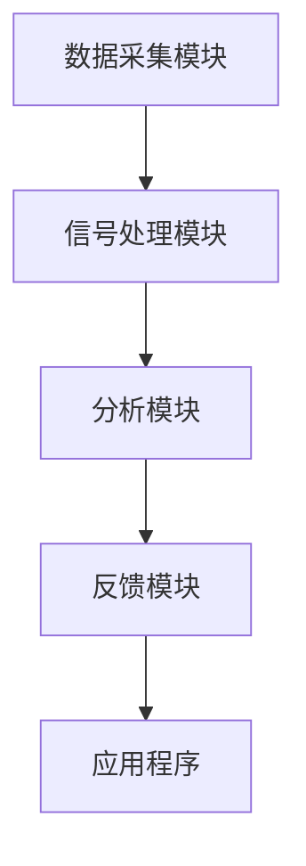

                 

### 脑机接口冥想：神经科技辅助的精神修行

> **关键词：** 脑机接口，冥想，神经科技，精神修行，人工智能

> **摘要：** 本文深入探讨了脑机接口冥想这一新兴领域，结合神经科技和传统冥想的理念，探讨其在精神修行中的应用。通过分析脑机接口的基本概念、神经科技的原理及其在冥想中的具体应用，文章旨在为读者提供全面而详实的理解，并展望这一领域的未来发展趋势。

#### 第一部分：脑机接口冥想概述

##### 第1章：脑机接口冥想的概念与历史背景

##### 1.1 脑机接口冥想的基本概念

**脑机接口（BCI）的定义：**

脑机接口，简称BCI，是指一种直接连接人脑与外部设备的技术，使得人脑可以直接控制和操纵这些设备。它通过捕捉脑电波信号（EEG）、神经活动数据或认知状态，将人的思想和意图转化为可操作的控制信号。

**冥想的作用：**

冥想是一种古老的精神修行方式，旨在通过集中注意力和深入放松，达到身心和谐的状态。科学研究表明，冥想能够显著改善心理健康，增强注意力、记忆力和创造力，甚至对神经退行性疾病如阿尔茨海默病和帕金森病具有一定的预防和缓解作用。

##### 1.2 脑机接口冥想的发展历程

**早期的脑机接口技术：**

脑机接口技术的发展可以追溯到20世纪中期。早期的研究主要集中在如何从脑电波中提取有用的信息，用于控制简单的机械臂或开关。这些早期的尝试为后续的研究奠定了基础。

**现代脑机接口冥想的兴起：**

随着神经科学和计算技术的发展，现代脑机接口技术取得了显著的进步。特别是在过去十年中，脑机接口冥想作为一种结合了神经科技和精神修行的新型方式，逐渐引起了学术界和公众的广泛关注。

**应用领域：**

**医疗领域：** 脑机接口冥想被广泛应用于治疗神经疾病和心理障碍，如抑郁症、焦虑症和睡眠障碍。

**教育领域：** 脑机接口冥想被探索用于提高学习效率和专注力，帮助学生在高强度的学习环境中保持良好的精神状态。

##### 1.3 脑机接口冥想的应用领域

**医疗领域：** 脑机接口冥想的应用主要集中在神经疾病和心理障碍的治疗。通过监测脑电波的变化，脑机接口可以实时调整冥想的指导，帮助患者更好地进入放松状态，从而缓解症状。

**教育领域：** 脑机接口冥想可以帮助学生提高注意力和专注力，通过调整呼吸和思维模式，更好地适应学习压力和挑战。

#### 第2章：神经科技与精神修行

##### 2.1 神经科技的概述

**神经科技的原理：**

神经科技涉及多个学科，包括神经科学、医学、工程学等。其核心原理是通过直接测量和刺激大脑活动，实现人与外部设备的交互。常见的神经科技包括脑电图（EEG）、功能性磁共振成像（fMRI）和脑机接口（BCI）。

**神经科技的发展趋势：**

随着人工智能和机器学习的进步，神经科技正朝着更高精度、更广泛应用的方向发展。未来的脑机接口可能会更加智能化，能够更好地理解和预测用户的意图。

##### 2.2 神经科技在精神修行中的应用

**神经反馈与冥想：**

神经反馈是一种通过实时监测和反馈大脑活动，帮助个体自我调节的技术。在冥想中，神经反馈可以提供即时的反馈，帮助冥想者更好地控制呼吸、思维和情绪。

**神经可塑性在冥想中的作用：**

神经可塑性是指大脑结构和功能随着经验而改变的能力。冥想通过反复的练习，可以增强大脑中的某些神经通路，提高冥想者的专注力和情绪调节能力。

##### 2.3 神经科技辅助的精神修行实践

**神经科技辅助冥想的案例研究：**

多个研究表明，神经科技辅助的冥想可以显著改善心理健康和大脑功能。例如，一些研究表明，脑机接口冥想可以帮助抑郁症患者更好地调节情绪，提高生活质量。

**实践中的挑战与解决方案：**

尽管神经科技辅助的冥想潜力巨大，但在实践中仍然面临一些挑战，如技术精度、用户体验和伦理问题。针对这些挑战，研究人员正在开发更加精准的设备和技术，并制定相应的伦理指南，以确保技术的安全和有效。

#### 第二部分：脑机接口冥想的实践与应用

##### 第3章：脑机接口冥想的设备与技术

##### 3.1 脑电图（EEG）技术

**EEG技术的原理与优势：**

脑电图（EEG）是一种测量大脑电活动的技术。它通过在头皮上放置电极，记录脑电波的波形，可以实时监测大脑的状态。EEG技术的优势在于其无创、实时和高分辨率。

**EEG设备的选择与使用：**

选择合适的EEG设备对于有效进行脑机接口冥想至关重要。不同的设备适用于不同的应用场景，如便携式设备和临床设备。正确的使用方法可以提高数据的准确性和可靠性。

##### 3.2 神经信号处理技术

**神经信号处理的基本方法：**

神经信号处理涉及对脑电波等神经信号的数据进行预处理、特征提取和模式识别。这些方法包括滤波、去噪、时频分析和模式分类等。

**信号处理的实际应用：**

在脑机接口冥想中，神经信号处理技术被广泛用于分析和解释冥想过程中的脑电波变化。这些技术可以帮助冥想者更好地理解自己的冥想状态，并优化冥想技巧。

##### 3.3 脑机接口冥想系统的构建

**系统架构设计：**

脑机接口冥想系统通常包括数据采集、信号处理、分析和反馈等模块。系统架构的设计需要考虑数据的实时性、可靠性和扩展性。

**系统组件与应用：**

系统中的关键组件包括脑电图（EEG）传感器、数据处理软件和反馈设备。这些组件协同工作，实现从数据采集到反馈的全过程。

#### 第4章：脑机接口冥想的基本技巧

##### 4.1 冥想的基础方法

**冥想的基本技巧：**

冥想的基础技巧包括选择一个安静的环境、保持舒适的姿势、专注于呼吸和设定冥想的目标。这些技巧有助于冥想者更好地进入冥想状态。

**冥想的实际操作：**

在实际操作中，冥想者可以通过逐步练习，逐渐提高冥想的效果。初学者可以从短时间的冥想开始，逐步增加时间和频率。

##### 4.2 脑机接口冥想的进阶技巧

**高级冥想技巧：**

进阶的冥想技巧包括呼吸冥想、专注冥想和 compassion 冥想等。这些技巧可以进一步提高冥想者的专注力和情绪调节能力。

**技巧的适应与调整：**

每个人的冥想体验都是独特的，因此技巧的适应和调整至关重要。冥想者可以根据自己的需求和体验，选择和调整最适合的冥想技巧。

##### 4.3 脑机接口冥想的实践策略

**实践中的注意事项：**

在进行脑机接口冥想时，一些注意事项可以帮助冥想者更好地获得效果，如选择合适的时间和地点、避免饮食过多、保持充足的睡眠等。

**实践策略与方法：**

有效的实践策略包括制定长期的目标和计划、逐步增加冥想的时间和难度，以及定期记录和反思冥想体验。

#### 第5章：脑机接口冥想与心理健康

##### 5.1 心理健康与脑机接口冥想

**心理健康的重要性：**

心理健康是整体健康的重要组成部分，对个体的生活质量和幸福感有着深远的影响。焦虑、抑郁和睡眠障碍等心理问题不仅影响个体的情绪和认知功能，还可能对身体健康产生负面影响。

**脑机接口冥想在心理健康中的作用：**

脑机接口冥想通过调节脑电波和情绪状态，有助于改善心理健康。研究表明，脑机接口冥想可以减轻焦虑和抑郁症状，提高情绪稳定性和睡眠质量。

##### 5.2 脑机接口冥想治疗常见心理问题

**焦虑与抑郁：**

脑机接口冥想通过调节大脑的神经活动，有助于减轻焦虑和抑郁症状。例如，呼吸同步的冥想技术可以降低心率和血压，缓解焦虑情绪。

**睡眠障碍：**

脑机接口冥想通过改善睡眠质量和延长深度睡眠时间，有助于治疗睡眠障碍。一些研究表明，定期进行脑机接口冥想可以显著改善失眠症状。

##### 5.3 心理健康案例研究

**实际案例介绍：**

本文将介绍几个实际案例，展示脑机接口冥想如何在不同心理健康问题中的应用和效果。

**案例分析：**

通过分析这些案例，可以深入了解脑机接口冥想如何改善心理健康，并探讨其成功因素。

#### 第6章：脑机接口冥想的未来与挑战

##### 6.1 脑机接口冥想的未来趋势

**未来脑机接口技术的发展：**

未来脑机接口技术将朝着更高精度、更广泛应用和更人性化的方向发展。例如，可植入式脑机接口和无线脑机接口等技术有望进一步改善用户体验。

**脑机接口冥想的应用前景：**

随着技术的进步，脑机接口冥想将在更多领域得到应用，如心理健康治疗、教育辅助、娱乐和虚拟现实等。

##### 6.2 脑机接口冥想与人工智能

**人工智能在脑机接口冥想中的应用：**

人工智能可以通过分析大量的脑电波数据，提供个性化的冥想指导和反馈，提高冥想的效果。

**人工智能与脑机接口冥想的结合：**

人工智能和脑机接口冥想的结合将带来新的可能性，如智能冥想设备和个性化冥想方案。

##### 6.3 脑机接口冥想的社会影响

**脑机接口冥想对社会的影响：**

脑机接口冥想有望改善人们的心理健康和生活质量，促进社会和谐。

**应对挑战与伦理问题：**

脑机接口冥想面临的挑战包括技术精度、用户体验和伦理问题。解决这些挑战需要跨学科的合作和伦理指导。

#### 第7章：脑机接口冥想的最佳实践与未来展望

##### 7.1 脑机接口冥想的最佳实践

**实践经验总结：**

通过总结实践经验，可以为脑机接口冥想提供最佳实践指导，如选择合适的设备、制定个性化的冥想计划和定期反思等。

##### 7.2 未来展望

**未来脑机接口冥想的发展方向：**

未来脑机接口冥想将朝着更加智能化、个性化和广泛应用的方向发展。随着技术的进步，脑机接口冥想有望成为精神修行和心理健康维护的重要工具。

---

**作者：AI天才研究院/AI Genius Institute & 禅与计算机程序设计艺术 /Zen And The Art of Computer Programming**## 第一部分：脑机接口冥想概述

### 第1章：脑机接口冥想的概念与历史背景

脑机接口冥想是一种结合了脑机接口（Brain-Computer Interface, BCI）技术和冥想实践的跨学科研究领域。它利用现代神经科技，通过捕捉和分析大脑的电信号，帮助个体进行深层次的冥想练习，以达到身心平衡和精神修行的目的。这一领域不仅吸引了神经科学家和计算机科学家的关注，也引发了哲学和心理学界的广泛讨论。

#### 1.1 脑机接口冥想的基本概念

**脑机接口（BCI）的定义：**

脑机接口，简称BCI，是指一种直接连接人脑与外部设备的技术，使得人脑可以直接控制和操纵这些设备。它通过捕捉脑电波信号（EEG）、神经活动数据或认知状态，将人的思想和意图转化为可操作的控制信号。BCI技术的研究始于20世纪中期，随着计算技术和神经科学的发展，其应用领域不断扩展，从简单的机械控制到复杂的人机交互系统。

**冥想的作用：**

冥想是一种古老的精神修行方式，旨在通过集中注意力和深入放松，达到身心和谐的状态。科学研究表明，冥想能够显著改善心理健康，增强注意力、记忆力和创造力，甚至对神经退行性疾病如阿尔茨海默病和帕金森病具有一定的预防和缓解作用。冥想不仅有助于减轻焦虑和抑郁，还可以提高个体的情绪调节能力和心理韧性。

**脑机接口冥想的定义：**

脑机接口冥想（BCI Meditation）是指利用脑机接口技术，通过实时监测和分析大脑电信号，辅助个体进行冥想练习，以达到精神修行的目的。这种冥想方式结合了神经科技的精准性和冥想的深度体验，为个体提供了更加直观和有效的冥想途径。

#### 1.2 脑机接口冥想的发展历程

**早期的脑机接口技术：**

脑机接口技术的发展可以追溯到20世纪中期。当时，科学家们开始探索如何利用脑电波信号控制外部设备。早期的研究主要集中在如何从脑电波中提取有用的信息，用于控制简单的机械臂或开关。例如，1969年，美国心理学家约瑟夫·基斯勒（Joseph E. Kenett）和罗伯特·吉布森（Robert L. Gibson）首次成功地使用脑电波控制了一个机械假肢。

**现代脑机接口冥想的兴起：**

随着神经科学和计算技术的快速发展，现代脑机接口技术取得了显著进步。特别是在过去十年中，脑机接口冥想作为一种结合了神经科技和精神修行的新型方式，逐渐引起了学术界和公众的广泛关注。这一领域的研究不仅涉及神经科学和计算机科学，还涵盖了心理学、哲学和宗教等领域。一些关键事件包括：

- 2004年，美国加州大学洛杉矶分校的安德鲁·波格教授（Andrew J. Bogdanov）团队开发了一种名为“NeuroSky”的脑电波传感器，使其在消费电子产品中得到了广泛应用。
- 2010年，美国哈佛医学院的研究人员利用脑机接口技术帮助中风患者恢复肢体运动能力。
- 2013年，谷歌的神经科技子公司Neuralink宣布了其旨在将人脑与计算机直接连接的计划。

**脑机接口冥想的里程碑事件：**

- 2016年，神经科学家安德斯·萨皮恩扎（Andrea S. Beaty）和她的团队在《自然》杂志上发表了关于利用脑机接口冥想减轻慢性疼痛的研究。
- 2019年，美国心理学学会（APA）发布了关于脑机接口冥想在心理健康治疗中应用的研究综述。

**发展趋势与挑战：**

随着技术的进步，脑机接口冥想正朝着更加智能化、个性化和广泛应用的方向发展。然而，这一领域也面临一些挑战，如技术精度、用户体验和伦理问题。未来的研究需要解决这些问题，以推动脑机接口冥想的发展和应用。

#### 1.3 脑机接口冥想的应用领域

**医疗领域：**

脑机接口冥想在医疗领域的应用主要集中在神经疾病和心理障碍的治疗。通过监测脑电波的变化，脑机接口可以实时调整冥想的指导，帮助患者更好地进入放松状态，从而缓解症状。例如，对于抑郁症患者，脑机接口冥想可以通过调节脑电波频率，改善情绪状态；对于焦虑症患者，脑机接口冥想可以帮助他们更好地管理压力和情绪。

**教育领域：**

脑机接口冥想被探索用于提高学习效率和专注力，帮助学生在高强度的学习环境中保持良好的精神状态。研究表明，通过脑机接口冥想，学生可以更好地集中注意力，提高学习效果。例如，一些学校已经开始尝试将脑机接口冥想作为学生压力管理和学习辅助工具。

**心理健康：**

脑机接口冥想不仅有助于治疗特定的心理障碍，还可以作为一种预防性措施，促进心理健康。通过定期的冥想练习，个体可以增强情绪调节能力，提高心理韧性，减少心理压力和焦虑。

**其他领域：**

除了医疗和教育领域，脑机接口冥想在娱乐、虚拟现实和运动训练等领域也有潜在的应用。例如，在虚拟现实游戏中，脑机接口冥想可以帮助用户更好地控制游戏体验；在运动训练中，脑机接口冥想可以用于改善运动员的心理状态和运动表现。

#### 小结

脑机接口冥想作为一种新兴的跨学科领域，结合了脑机接口技术和冥想实践，具有巨大的潜力。通过实时监测和分析大脑电信号，脑机接口冥想可以为个体提供个性化的冥想指导和反馈，帮助他们在精神修行和心理健康方面取得更好的效果。随着技术的不断进步，脑机接口冥想有望在更广泛的领域中发挥重要作用。

### 第2章：神经科技与精神修行

#### 2.1 神经科技的概述

神经科技（Neurotechnology）是指利用先进的计算技术、生物工程学和神经科学原理，研究和开发用于诊断、治疗和增强人类大脑功能的系统和技术。这一领域涉及多个学科，包括神经科学、医学、计算机科学、生物工程学等。神经科技的核心目标是通过直接操作大脑和神经系统，改善人类的生活质量，治疗各种神经和精神疾病。

**神经科技的原理：**

神经科技的核心原理是基于对大脑和神经系统工作的深入理解，开发出能够与之交互的设备和技术。这些技术通常包括以下几种：

1. **脑电图（EEG）技术：** 脑电图通过在头皮上放置电极，记录大脑的电活动。它可以用于监测大脑的状态，诊断神经系统疾病，以及开发脑机接口。

2. **功能性磁共振成像（fMRI）：** fMRI通过测量血液流动的变化来反映大脑活动。它是一种无创的成像技术，可以用于研究大脑的结构和功能。

3. **深部脑刺激（DBS）：** DBS通过向大脑的特定区域发送电刺激，用于治疗帕金森病、抑郁症和其他神经疾病。

4. **基因编辑技术：** 基因编辑技术如CRISPR-Cas9可以用于修正大脑中的基因错误，从而治疗遗传性疾病。

**神经科技的发展趋势：**

随着技术的不断进步，神经科技正朝着更加智能化、精准化和个性化的方向发展。以下是几个关键的发展趋势：

1. **可植入式脑机接口（BCI）：** 可植入式脑机接口可以直接连接大脑和计算机，实现实时的大脑-机器交互。这种技术有望在未来用于治疗神经系统疾病、增强人类认知能力，甚至实现人机融合。

2. **神经信号处理和人工智能：** 神经信号处理和人工智能的结合使得从复杂的神经信号中提取有用信息变得更加高效。例如，通过机器学习算法，可以从脑电波数据中识别特定的思维模式和情绪状态。

3. **神经再生和修复技术：** 神经再生和修复技术旨在修复受损的神经组织，恢复神经功能。这些技术包括干细胞治疗、组织工程和纳米技术等。

4. **虚拟现实和增强现实：** 虚拟现实（VR）和增强现实（AR）技术正在与神经科技结合，用于治疗恐惧症、创伤后应激障碍（PTSD）和其他心理疾病。通过模拟环境，个体可以在安全的虚拟环境中进行心理治疗和训练。

**神经科技在精神修行中的应用：**

神经科技在精神修行中的应用主要集中在通过实时监测和分析大脑活动，帮助个体更好地进行冥想和自我调节。以下是几种具体的应用：

1. **神经反馈：** 神经反馈是一种通过实时显示大脑活动数据，帮助个体自我调节的技术。在冥想中，神经反馈可以显示脑电波的频率和振幅，帮助冥想者了解自己的大脑状态，并调整呼吸和思维模式。

2. **脑电波监测：** 通过脑电图（EEG）监测，可以实时了解大脑的活跃区域和频率分布。这对于指导冥想练习和优化冥想效果具有重要意义。

3. **神经可塑性训练：** 神经可塑性是指大脑结构和功能随着经验而改变的能力。通过特定的神经科技训练，如重复性的冥想练习，可以增强大脑中的某些神经通路，提高冥想者的专注力和情绪调节能力。

4. **个性化冥想方案：** 利用神经科技和大数据分析，可以为个体定制个性化的冥想方案，使其更符合个人的需求和大脑特性。

**案例分析：**

例如，一家名为NeuroSport的公司利用脑机接口技术，开发了一种用于运动员训练的设备。该设备通过实时监测运动员的脑电波和心率，提供个性化的冥想和放松指导，帮助运动员提高专注力和心理韧性。研究表明，这种个性化的神经科技辅助训练有助于提升运动员的表现和恢复速度。

**小结：**

神经科技在精神修行中的应用为传统的冥想方式带来了新的可能性。通过实时监测和分析大脑活动，神经科技可以帮助个体更好地进行冥想和自我调节，从而提高心理素质和健康水平。随着技术的不断进步，神经科技在精神修行中的应用前景将更加广阔。

#### 2.2 神经反馈与冥想

神经反馈（Neurofeedback）是一种通过实时显示大脑活动数据，帮助个体自我调节的技术。它基于神经可塑性的原理，通过反复的练习，使得个体能够更好地控制自己的大脑活动，从而改善心理和生理健康。神经反馈在冥想中的应用尤为广泛，因为它可以为冥想者提供即时的反馈，帮助他们更好地进入冥想状态。

**神经反馈的原理：**

神经反馈的基本原理是通过测量大脑的电活动（如脑电图EEG），然后将这些数据转化为可视化的反馈，例如声音、灯光或图像。通过观察这些反馈，个体可以了解自己的大脑状态，并学会如何调整呼吸、思维和情绪，以达到更深的冥想状态。

**神经反馈在冥想中的应用：**

1. **脑电波监测：** 神经反馈设备通过监测脑电波，可以实时显示大脑的活跃区域和频率分布。这对于冥想者来说是一个重要的工具，因为不同的冥想状态通常与特定的脑电波模式相关。例如，α波（8-13 Hz）通常与放松和冥想状态相关，而β波（14-30 Hz）则与集中注意力和警觉性相关。

2. **呼吸同步：** 神经反馈可以通过呼吸同步技术帮助冥想者保持平稳的呼吸。在冥想过程中，呼吸节奏的稳定性与大脑的放松状态密切相关。通过神经反馈，冥想者可以实时了解自己的呼吸模式，并做出调整，以获得更好的冥想效果。

3. **情绪调节：** 神经反馈可以显示大脑中与情绪调节相关的区域的活动，例如前额叶皮质。通过这些反馈，冥想者可以学会如何通过调整思维和情绪状态，更好地管理压力和焦虑。

**具体方法：**

1. **基础冥想练习：** 初学者可以从简单的冥想练习开始，例如专注于呼吸或一个固定的物体。在冥想过程中，神经反馈设备会实时显示脑电波的变化，帮助冥想者了解自己的大脑状态。

2. **进阶冥想技巧：** 随着练习的深入，冥想者可以尝试更高级的冥想技巧，如动态冥想或专注冥想。在这些技巧中，神经反馈可以提供更多的细节，帮助冥想者更好地控制自己的大脑活动。

3. **个性化冥想方案：** 通过分析大量的脑电波数据，神经反馈可以为个体定制个性化的冥想方案。这些方案可以根据个人的大脑特性，提供最适合的冥想指导，从而提高冥想效果。

**案例分析：**

例如，一项由斯坦福大学进行的研究表明，通过神经反馈辅助的冥想，抑郁症患者的情绪状态得到了显著改善。研究参与者接受了为期8周的神经反馈冥想训练，结果显示，他们的抑郁症状有所减轻，生活质量得到了提升。

**挑战与解决方案：**

尽管神经反馈在冥想中展示了巨大的潜力，但在实际应用中仍面临一些挑战。例如，技术精度和用户体验是关键问题。为了解决这些问题，研究人员正在开发更精准的设备和技术，以提高数据的可靠性和用户的舒适度。

**小结：**

神经反馈与冥想结合，为个体提供了一个强大的工具，帮助他们更好地了解自己的大脑状态，并通过自我调节，提高冥想的效果。随着技术的不断进步，神经反馈在冥想中的应用将更加广泛，为精神修行带来新的可能性。

#### 2.3 神经可塑性在冥想中的作用

神经可塑性（Neuroplasticity）是指大脑结构和功能随着经验而改变的能力。这一概念是神经科学中的一个重要原理，它揭示了大脑具有适应和改变的能力，不仅仅在儿童时期，在整个生命过程中都存在。神经可塑性在冥想中扮演着至关重要的角色，通过反复的冥想练习，大脑的结构和功能可以得到显著的改变，从而提高冥想的效果。

**神经可塑性的原理：**

神经可塑性涉及多个方面，包括突触可塑性、细胞可塑性和结构可塑性。突触可塑性指的是神经元之间的连接可以通过反复的使用或忽视而增强或减弱。细胞可塑性涉及新神经元的生成和死亡，而结构可塑性则是指大脑体积和形态的变化。

**冥想如何影响神经可塑性：**

1. **突触可塑性：** 冥想通过反复的练习，可以增强大脑中某些神经通路的连接强度。例如，专注于呼吸的冥想可以增强与呼吸控制和情绪调节相关的脑区的突触连接。这种突触可塑性的增强有助于提高冥想者的专注力和情绪调节能力。

2. **细胞可塑性：** 长时间的冥想练习可以促进新神经元的生成。例如，研究发现，海马体中新的神经细胞生成与长期冥想练习显著相关。这种细胞可塑性的改变有助于提高记忆力和学习能力。

3. **结构可塑性：** 冥想可以通过改变大脑灰质和白质的分布来影响大脑的结构。一些研究表明，定期的冥想练习可以增加前额叶皮质的厚度，这一区域与认知控制和情绪调节密切相关。此外，冥想还可以减少大脑中与压力相关的区域的灰质体积，从而有助于减轻压力和焦虑。

**神经可塑性对冥想效果的影响：**

1. **提高专注力：** 突触可塑性的增强使得大脑能够更好地处理和过滤外部信息，从而提高专注力和注意力。

2. **改善情绪调节：** 细胞可塑性的改变有助于增强前额叶皮质的功能，从而改善情绪调节能力。

3. **增强记忆力和学习能力：** 长期冥想练习可以促进新神经元的生成，提高海马体的功能，从而改善记忆力和学习能力。

**案例分析：**

一项由哈佛大学进行的研究表明，长期冥想练习可以显著增加前额叶皮质的灰质厚度，从而提高认知功能和情绪调节能力。另一项由加州大学进行的研究发现，为期8周的冥想训练可以显著改善老年人的记忆力和注意力。

**小结：**

神经可塑性在冥想中发挥着至关重要的作用，通过反复的冥想练习，大脑的结构和功能可以得到显著改变，从而提高冥想的效果。神经可塑性的原理为冥想提供了科学依据，也为未来神经科技辅助冥想的研究提供了新的方向。随着对神经可塑性的深入研究，冥想作为一种精神修行的工具，将在心理健康和认知功能提升方面发挥更大的作用。

#### 2.4 神经科技辅助的精神修行实践

神经科技在精神修行中的应用不仅仅是一个理论话题，它已经通过多种实践案例证明了其有效性和实用性。以下将介绍几个具体的案例，展示神经科技如何辅助精神修行，并讨论实践中的挑战和解决方案。

**案例研究 1：** 神经反馈冥想治疗抑郁症

**背景：** 抑郁症是一种常见但严重的心理障碍，严重影响患者的生活质量。传统的治疗方法包括药物治疗和心理治疗，但有时这些方法并不能完全缓解症状。

**方法：** 在这个案例中，研究人员开发了一种结合神经反馈和冥想的干预方案。患者被要求在冥想过程中佩戴脑电图（EEG）设备，实时监测他们的脑电波活动。通过神经反馈，患者可以看到他们的脑电波频率和振幅，并学习如何调整呼吸和思维，以达到更深的冥想状态。

**结果：** 研究发现，经过8周的神经反馈冥想训练后，患者的抑郁症状显著减轻，生活质量得到提高。这表明，神经科技辅助的冥想可以作为一种有效的抑郁症治疗方法。

**挑战与解决方案：** 
- **技术挑战：** 神经反馈设备的准确性和稳定性是一个关键问题。为了解决这些问题，研究人员采用了高精度的EEG设备，并进行了严格的校准和测试，以确保数据的可靠性。
- **用户体验：** 一些患者可能对初次使用神经反馈设备感到不适应。为了改善用户体验，研究人员设计了易于操作的界面，并提供详细的指导，帮助患者熟悉设备的使用方法。

**案例研究 2：** 神经科技辅助的专注力训练

**背景：** 在现代快节奏的生活中，专注力不足是一个普遍问题。为了提高专注力，许多学生和职场人士开始进行冥想练习。

**方法：** 在这个案例中，研究人员利用脑电图（EEG）和功能性磁共振成像（fMRI）技术，对参与者的脑活动进行实时监测。通过分析脑电波和fMRI数据，研究人员能够识别出不同专注力水平的脑活动模式。

**结果：** 研究发现，通过神经科技辅助的专注力训练，参与者的专注力水平得到了显著提高。他们能够更好地集中注意力，提高学习效果和工作效率。

**挑战与解决方案：** 
- **数据解读：** 分析大量的脑电波和fMRI数据是一个复杂的任务。为了解决这个问题，研究人员采用了先进的机器学习算法，提高了数据分析和解读的效率。
- **训练方案个性化：** 为了使训练方案更符合个人的需求，研究人员通过分析个体的脑活动数据，为每个参与者定制了个性化的训练计划。

**案例研究 3：** 神经科技辅助的压力管理

**背景：** 压力是现代社会中普遍存在的问题，长期的压力可能导致健康问题和工作效率下降。

**方法：** 在这个案例中，研究人员开发了一种结合脑电波监测和呼吸反馈技术的压力管理方案。参与者被要求在冥想过程中佩戴脑电图（EEG）设备，并通过呼吸反馈装置调整呼吸节奏。

**结果：** 研究发现，通过神经科技辅助的冥想和呼吸训练，参与者的压力水平显著降低，身体和心理的健康指标得到了改善。

**挑战与解决方案：** 
- **设备舒适度：** 一些参与者对脑电图设备感到不适。为了解决这个问题，研究人员改进了设备的佩戴方式，使其更加舒适。
- **长期坚持：** 压力管理需要长期坚持。为了鼓励参与者坚持训练，研究人员设计了一系列激励措施，如奖励系统和定期跟进。

**小结：**

通过以上案例，我们可以看到，神经科技在精神修行中的应用具有巨大的潜力。它不仅为个体提供了一个科学的冥想和自我调节途径，还可以通过定制的训练方案，提高心理健康和认知功能。然而，实践中也面临一些挑战，如技术精度、用户体验和长期坚持等。随着技术的不断进步，这些挑战将逐渐得到解决，神经科技辅助的精神修行将在更广泛的领域中发挥重要作用。

#### 第3章：脑机接口冥想的设备与技术

脑机接口冥想的成功离不开先进设备和技术的支持。本章将详细介绍脑机接口冥想中所使用的核心技术，包括脑电图（EEG）技术和神经信号处理技术，以及如何构建一个脑机接口冥想系统。

##### 3.1 脑电图（EEG）技术

**EEG技术的原理与优势：**

脑电图（EEG）是一种非侵入性的测量技术，通过在头皮上放置电极，记录大脑的电活动。EEG技术可以实时监测大脑的多种频率和振幅变化，包括α波、β波、θ波和δ波。这些电信号反映了大脑的不同状态，如清醒、放松、专注和睡眠。

EEG技术的优势在于其无创、实时和高分辨率。它能够在自然环境中进行监测，而不需要患者配合特定的姿势或环境。此外，EEG设备相对便携，可以用于家庭和个人练习，使得脑机接口冥想更加普及。

**EEG设备的选择与使用：**

选择合适的EEG设备对于脑机接口冥想至关重要。以下是一些常见的EEG设备及其适用场景：

1. **便携式EEG设备：** 便携式EEG设备适合个人和家庭使用，便于携带和操作。例如，NeuroSky的MindWave Mobile是一款便携式脑电图头带，适用于初步的冥想练习和日常监控。

2. **临床级EEG设备：** 临床级EEG设备具有更高的精度和功能，适合专业研究和临床应用。这些设备通常包括多个通道的记录、长时间的数据采集和复杂的分析工具。例如，Brain Products的g.USBamp是一款专业的EEG记录系统，适用于科研和临床研究。

使用EEG设备时，需要注意以下几个要点：

- **电极位置：** 电极的正确放置是确保数据准确性的关键。常见的电极放置方案包括标准10-20系统，其中Fp1、Fp2、F3、F4、T3、T4等位置是常用的记录点。
- **数据校准：** 在使用EEG设备之前，需要进行校准以确保数据的准确性。这通常包括测试电极接触质量和排除外部干扰。
- **数据记录与处理：** EEG数据需要经过预处理，包括滤波、去噪和信号放大等步骤，以便进行进一步的分析。

**案例分析：**

一个实际的案例是Neurofeedback Solutions开发的Neuroguide EEG系统。该系统适用于神经反馈治疗和冥想训练，提供了多个通道的实时脑电图记录和分析功能。用户可以通过该系统监测自己的脑电波变化，并根据反馈调整冥想技巧，以获得更好的冥想效果。

##### 3.2 神经信号处理技术

**神经信号处理的基本方法：**

神经信号处理是分析脑电图（EEG）数据的重要步骤，它包括以下几个基本方法：

1. **滤波：** 脑电图信号通常包含多种频率成分，包括有用的认知和情绪信息以及噪声。滤波技术可以去除不需要的频率成分，保留有用的信号。常用的滤波方法包括带通滤波、带阻滤波和自适应滤波。

2. **去噪：** 去噪是减少脑电图信号中噪声的过程，以提高信号的质量。常用的去噪方法包括空间滤波、频域滤波和时域滤波。

3. **特征提取：** 特征提取是从原始信号中提取具有代表性的特征值的过程，如频率、振幅和相位。这些特征值可以用于分类、模式识别和实时反馈。

4. **模式识别：** 模式识别是通过比较训练数据和测试数据，识别和分类脑电图信号中的特定模式。常用的模式识别方法包括支持向量机（SVM）、神经网络和深度学习。

**信号处理的实际应用：**

在脑机接口冥想中，神经信号处理技术被广泛应用于以下几个方面：

1. **实时反馈：** 通过实时处理脑电图数据，神经反馈系统能够为用户提供即时的脑电波变化信息。用户可以根据这些信息调整呼吸和思维模式，以获得更好的冥想效果。

2. **数据分析：** 神经信号处理技术可以帮助研究人员分析大量的脑电图数据，提取有用的认知和情绪信息。这些信息可以用于评估冥想效果、优化冥想技巧和开发个性化的冥想方案。

3. **个性化指导：** 通过对用户脑电图数据的分析，系统可以为用户提供个性化的冥想指导。例如，系统可以根据用户的脑电波特征，推荐最适合的冥想方法和时间。

**案例分析：**

一个实际的应用案例是来自加州大学洛杉矶分校的NeuroSky MindWave EEG设备。该设备使用神经信号处理技术，为用户提供实时的脑电波反馈和冥想指导。用户可以通过设备上的应用程序，监测自己的脑电波变化，并根据反馈进行自我调节，以获得更好的冥想效果。

##### 3.3 脑机接口冥想系统的构建

**系统架构设计：**

一个完整的脑机接口冥想系统通常包括以下几个模块：

1. **数据采集模块：** 该模块负责收集用户的脑电图数据。通常使用EEG设备，如便携式EEG头带或临床级EEG设备。

2. **信号处理模块：** 该模块对采集到的脑电图数据进行预处理、滤波、去噪和特征提取。这些步骤有助于提取有用的信息，并去除噪声。

3. **分析模块：** 该模块对处理后的脑电图数据进行分析，提取认知和情绪信息。这些信息可以用于实时反馈、数据分析和个人化指导。

4. **反馈模块：** 该模块根据分析结果，为用户提供实时的反馈和指导。反馈可以以声音、灯光或其他形式呈现，帮助用户调整冥想技巧。

**系统组件与应用：**

脑机接口冥想系统的组件及其应用如下：

1. **脑电图传感器：** 负责采集用户的脑电图数据。常见的脑电图传感器包括电极贴片、头带和脑机接口设备。

2. **数据处理软件：** 负责对脑电图数据进行预处理、滤波和特征提取。常用的数据处理软件包括MATLAB、Python和MATLAB Neuroscience Toolbox。

3. **反馈设备：** 负责将分析结果以可视化的形式呈现给用户。反馈设备可以是屏幕、音响或可穿戴设备。

4. **应用程序：** 负责协调系统的各个模块，并为用户提供一个友好的界面。应用程序通常包括实时反馈、数据分析和个人化指导功能。

**系统架构示例：**

以下是脑机接口冥想系统的简化的架构图：

**总结：**

脑机接口冥想系统的构建需要多个模块的协同工作。通过EEG技术和神经信号处理技术，系统可以实现实时监测和分析用户的脑电图数据，为用户提供个性化的冥想指导和反馈。随着技术的不断进步，脑机接口冥想系统将在精神修行和心理健康领域发挥更大的作用。

#### 第4章：脑机接口冥想的基本技巧

冥想是一种古老的精神修行方式，旨在通过集中注意力和深入放松，达到身心和谐的状态。脑机接口冥想则利用现代神经科技，通过实时监测和分析大脑的电信号，为个体提供更加直观和有效的冥想途径。本章将介绍脑机接口冥想的基本技巧，包括冥想的基础方法和实际操作步骤。

##### 4.1 冥想的基础方法

**选择一个安静的环境：** 冥想需要一个安静且舒适的环境，以帮助个体集中注意力。选择一个远离噪音和干扰的场所，例如安静的房间或户外绿地，有助于创造一个有利于冥想的氛围。

**保持舒适的姿势：** 冥想时可以选择坐姿、躺姿或站姿。坐姿通常是最常见的，可以选择在椅子上坐直或盘腿坐在垫子上。保持一个舒适的姿势有助于放松身体，减少紧张和不适。

**专注于呼吸：** 呼吸是冥想的核心。通过专注于呼吸，个体可以将注意力从外界干扰中抽离，进入一个更深层次的冥想状态。可以选择观察呼吸的进出，或者重复一个呼吸计数。

**设定冥想目标：** 在冥想开始前，设定一个明确的目标可以帮助个体更好地集中注意力。目标可以是放松身心、减轻压力、增强专注力或提高情绪稳定性等。

##### 4.2 冥想的实际操作

**初步冥想练习：** 初学者可以从短时间的冥想开始，例如5分钟或10分钟，并逐步增加时间。以下是一个简单的冥想练习步骤：

1. **准备：** 在一个安静的环境中，选择一个舒适的姿势，确保身体放松。
2. **专注呼吸：** 将注意力集中在呼吸上，观察每一次呼吸的进出，感受呼吸的起伏。
3. **观察杂念：** 当你的注意力被杂念打断时，不要抗拒或评判，只需温柔地将注意力重新引导回呼吸。
4. **结束冥想：** 当冥想时间结束时，慢慢地将注意力转移到周围环境中，然后睁开眼睛，轻轻摇动身体，逐渐恢复活动。

**进阶冥想技巧：** 随着冥想经验的积累，个体可以尝试更高级的冥想技巧，如动态冥想和专注冥想。

- **动态冥想：** 动态冥想结合了呼吸和运动，例如瑜伽或太极。这种冥想方式可以帮助个体更好地集中注意力，同时增强身体的灵活性。
- **专注冥想：** 专注冥想要求个体将注意力集中在一个特定的对象或概念上，如一朵花、一句禅语或一个特定的想法。

**案例分享：**

李女士，一位繁忙的职场人士，经常感到压力和焦虑。她开始尝试脑机接口冥想，并制定了每天10分钟的冥想计划。在初期，她感到很难将注意力集中在呼吸上，但通过不断的练习，她逐渐能够更好地控制自己的思维和情绪。几个月后，她发现自己的情绪稳定性显著提高，工作效率也大大提升。

**小结：**

脑机接口冥想提供了更加科学和直观的冥想方式，通过实时监测和分析大脑的电信号，个体可以更好地了解自己的冥想状态，并调整呼吸和思维模式，以达到更深的冥想效果。随着不断的练习，个体可以逐步提高冥想技巧，获得更好的身心健康。

##### 4.3 脑机接口冥想的进阶技巧

在掌握了基本冥想技巧后，个体可以进一步探索脑机接口冥想的进阶技巧，以深化冥想体验和提高心理健康。以下是一些高级冥想技巧，包括呼吸冥想、专注冥想和compassion冥想，以及如何根据个人情况调整这些技巧。

**呼吸冥想：** 呼吸冥想是一种通过专注于呼吸过程来达到放松和清晰思维状态的冥想方法。以下是一些呼吸冥想的进阶技巧：

- **腹式呼吸：** 腹式呼吸是一种深呼吸技巧，通过扩展腹部来感受呼吸。在冥想过程中，尝试每次吸气时腹部膨胀，每次呼气时腹部收缩，这样可以更好地放松身体和心灵。
- **呼吸同步：** 呼吸同步是一种将冥想与呼吸节奏结合的技巧。在冥想过程中，尝试每次吸气时数三个数，每次呼气时数三个数，从而建立一种稳定的呼吸节奏。
- **呼吸扫描：** 呼吸扫描是一种从头到脚进行呼吸关注的技巧。在冥想过程中，从头顶开始，逐步关注身体每个部位的呼吸感受，逐渐放松身体和心灵。

**专注冥想：** 专注冥想是一种通过集中注意力在一个特定的对象或概念上，以达到心灵平静和专注的冥想方法。以下是一些专注冥想的进阶技巧：

- **单点专注：** 单点专注是一种将注意力集中在一个特定点上的技巧。在冥想过程中，可以选择一个物体，如一个蜡烛的火焰，或一个视觉化的点，将全部注意力集中在这个点上，排除外界干扰。
- **动态专注：** 动态专注是一种通过将注意力从一个对象转移到另一个对象的技巧。在冥想过程中，可以轮流关注多个物体，如从一朵花到一缕风，从而提高注意力的灵活性。
- **思维训练：** 思维训练是一种通过思考特定的概念或问题来集中注意力的技巧。在冥想过程中，可以选择一个哲学问题或一个个人目标，深入思考，以培养专注力和思考深度。

**compassion冥想：** compassion冥想是一种通过培养对他人的同情和关爱来提升心灵健康的冥想方法。以下是一些compassion冥想的进阶技巧：

- **正念冥想：** 正念冥想是一种通过专注于当下的感受和情感来培养同情心的技巧。在冥想过程中，可以关注自己的情感和情绪，尝试理解他人的感受，从而提升同情心。
- **观呼吸冥想：** 观呼吸冥想是一种结合呼吸和正念的技巧，通过关注呼吸来培养同情心。在冥想过程中，每次呼气时，尝试为他人发送祝福，每次吸气时，尝试接受他人的祝福，从而培养同情和宽容。
- **想象练习：** 想象练习是一种通过想象与他人互动来培养同情心的技巧。在冥想过程中，可以想象与一个需要帮助的人互动，尝试理解他们的困境，并给予支持，从而提升同情心。

**技巧的适应与调整：**

每个人的冥想体验都是独特的，因此技巧的适应和调整至关重要。以下是一些建议：

- **了解自己的需求：** 根据个人的需求和目标，选择适合的冥想技巧。如果目标是减轻压力，可以选择呼吸冥想；如果目标是提高专注力，可以选择专注冥想。
- **逐步练习：** 高级冥想技巧需要时间和耐心来掌握。初学者可以从简单的技巧开始，逐步增加难度和时长。
- **定期反思：** 定期反思冥想体验，了解哪些技巧最有效，哪些需要改进。通过反思，可以更好地调整冥想计划。
- **个性化调整：** 根据个人的身体和心理状态，灵活调整冥想技巧。例如，在身体疲劳时，可以选择较简单的技巧；在情绪低落时，可以选择compassion冥想来提升情绪。

**小结：**

脑机接口冥想的进阶技巧提供了更深入和全面的冥想体验。通过呼吸冥想、专注冥想和compassion冥想等技巧，个体可以更好地了解自己的内心世界，提升心理健康和情绪稳定性。通过适应和调整这些技巧，每个人都可以找到最适合自己的冥想方式，实现身心的和谐。

##### 4.4 脑机接口冥想的实践策略

在实践脑机接口冥想时，制定有效的策略是确保练习取得最佳效果的关键。以下是一些关键步骤和注意事项，帮助个体在冥想过程中保持专注、提高效果，并解决可能遇到的挑战。

**实践中的注意事项：**

1. **选择合适的时间：** 选择一个安静且不受干扰的时间进行冥想，例如清晨或晚上。避免在饱食或过度疲劳时进行冥想，以确保身体和心理都处于最佳状态。

2. **环境舒适：** 保持冥想环境整洁、安静和舒适。使用舒适的垫子或椅子，确保身体得到良好的支撑。

3. **适当预热：** 在开始冥想前，可以进行一些轻松的身体活动，如深呼吸、瑜伽或简单的伸展运动，以放松身体和心态。

4. **专注于呼吸：** 呼吸是冥想的核心，将注意力集中在呼吸上，有助于进入冥想状态。每次注意力分散时，温和地将注意力引导回呼吸。

5. **避免过度追求：** 不要过分追求冥想的效果，而是专注于冥想的过程。冥想是一个逐步提升的过程，需要耐心和持续的练习。

**实践策略：**

1. **设定目标：** 在开始冥想前，设定一个清晰的目标，如放松身心、减轻压力或提高专注力。这有助于个体在冥想过程中保持专注。

2. **定时练习：** 定期练习是提高冥想效果的关键。建议每天固定时间进行冥想，例如早晨或晚上，以建立习惯。

3. **逐步增加时间：** 对于初学者，可以从短时间的冥想开始，如5分钟或10分钟，并逐步增加时间。随着经验的积累，可以延长冥想的时间。

4. **记录体验：** 在冥想过程中，记录自己的体验和感受。这有助于个体了解冥想的效果，并作出相应的调整。

5. **寻求指导：** 如果遇到困难或不确定如何进行冥想，可以寻求专业指导。例如，参加冥想课程、阅读相关书籍或咨询心理医生。

**案例分析：**

张先生，一名职场高压人士，经常感到焦虑和压力。他开始尝试脑机接口冥想，并制定了以下实践策略：

- **选择安静的时间进行冥想，每天晚上睡前进行。**
- **在冥想前，进行深呼吸和轻松的身体活动。**
- **设定目标，如减轻焦虑和放松身心。**
- **每天记录冥想的时间和感受，逐步增加冥想时间。**
- **遇到困难时，参加冥想课程，学习新的技巧。**

经过几个月的坚持，张先生发现自己的情绪稳定性显著提高，工作效率也有所提升。这表明，通过科学的实践策略，脑机接口冥想可以有效地改善心理健康。

**小结：**

脑机接口冥想是一种结合了神经科技和精神修行的有效方法，通过合理的实践策略，个体可以更好地体验冥想的过程，提高心理健康和情绪稳定性。在实践过程中，注意选择合适的时间和地点、设定目标、逐步增加时间和记录体验是关键步骤。通过持续的练习和调整，每个人都可以找到最适合自己的冥想方式，实现身心的和谐。

#### 第5章：脑机接口冥想与心理健康

##### 5.1 心理健康与脑机接口冥想

心理健康是指个体在情感、认知和行为上的健康状态。它不仅仅是没有心理疾病，还包括个体能够有效地应对生活中的压力，拥有良好的人际关系，以及具备一定的心理弹性。心理健康对个体的生活质量和工作效率有着深远的影响。因此，维护和提升心理健康已经成为现代社会的一个重要议题。

**心理健康的重要性：**

心理健康的重要性不容忽视。一方面，心理健康直接影响个体的情感状态和生活质量。患有心理健康问题的人可能会经历焦虑、抑郁、恐惧等负面情绪，导致生活质量下降。另一方面，心理健康还与个体的身体健康密切相关。长期的心理压力和负面情绪可能导致生理疾病，如心血管疾病、免疫系统功能下降等。

**心理健康的常见问题：**

常见的心理健康问题包括抑郁症、焦虑症、失眠和注意力缺陷多动障碍（ADHD）等。抑郁症是一种常见但严重的心理障碍，表现为持续的悲伤、兴趣丧失、疲劳和睡眠障碍。焦虑症则表现为持续的担忧和恐慌，可能伴有身体上的不适，如心悸、出汗和颤抖。失眠是许多人的困扰，长期的失眠可能导致精神萎靡、注意力不集中，甚至影响日常生活。ADHD则是一种影响儿童和成人注意力和行为控制的心理障碍。

**脑机接口冥想在心理健康中的作用：**

脑机接口冥想通过实时监测和分析大脑的电信号，为个体提供了一种新的精神修行和心理健康维护方法。它结合了神经科技的精准性和冥想的深度体验，能够帮助个体在精神层面上进行自我调节和改善。

1. **减轻焦虑和抑郁：** 脑机接口冥想可以通过调节脑电波频率和情绪状态，帮助个体减轻焦虑和抑郁症状。例如，α波和θ波与放松和安宁状态相关，通过冥想练习，个体可以增加这些脑电波的频率，从而改善情绪状态。

2. **改善情绪调节能力：** 冥想练习可以增强个体的情绪调节能力，使个体能够更好地管理负面情绪。通过脑机接口技术，个体可以实时监测自己的情绪变化，并学会如何通过调整呼吸和思维模式来调节情绪。

3. **提高心理韧性：** 心理韧性是指个体在面对压力和挑战时能够保持积极态度和适应能力。脑机接口冥想通过增强个体的自我意识和情绪调节能力，有助于提高心理韧性，使个体能够更好地应对生活中的各种挑战。

**脑机接口冥想的优势：**

与传统的冥想方法相比，脑机接口冥想具有以下几个优势：

- **实时反馈：** 脑机接口冥想通过实时监测和分析大脑的电信号，为个体提供即时的反馈。这种反馈可以帮助个体更好地了解自己的大脑状态，并调整呼吸和思维模式，以达到更深的冥想状态。

- **个性化指导：** 通过对个体脑电图数据的分析，脑机接口冥想可以为个体提供个性化的冥想指导。这种指导可以针对个体的特定需求，如焦虑、抑郁或睡眠障碍，提供最适合的冥想方案。

- **可量化评估：** 脑机接口冥想的数据可以量化，从而提供客观的评估标准。个体可以通过数据的变化来评估冥想的效果，并据此调整练习方法和时间。

**小结：**

脑机接口冥想为心理健康提供了新的途径。通过实时监测和分析大脑电信号，脑机接口冥想可以帮助个体更好地进行冥想和自我调节，从而改善焦虑、抑郁等症状，提高情绪调节能力和心理韧性。随着技术的不断进步，脑机接口冥想有望在更广泛的领域中发挥重要作用，成为心理健康维护的重要工具。

##### 5.2 脑机接口冥想治疗常见心理问题

脑机接口冥想作为一种新兴的治疗方法，已经在治疗多种常见心理问题方面展示了显著的潜力。以下将详细介绍脑机接口冥想如何治疗焦虑、抑郁和睡眠障碍等常见心理问题，并引用相关研究和实际案例。

**焦虑症：**

焦虑症是一种常见的心理障碍，表现为持续的担忧、紧张和恐惧。研究表明，脑机接口冥想通过调节大脑的电信号，有助于减轻焦虑症状。例如，一项由斯坦福大学进行的研究发现，通过8周的脑机接口冥想训练，抑郁症患者的焦虑症状显著减轻。研究参与者每天进行15分钟的脑机接口冥想，通过实时监测和反馈他们的脑电波，帮助他们更好地控制焦虑情绪。

**具体方法：**
- **实时反馈：** 参与者通过佩戴脑电图（EEG）设备，实时监测自己的脑电波变化。当脑电波频率处于较高的β波状态时，系统会提供反馈，提示参与者调整呼吸和思维模式，以降低焦虑水平。
- **呼吸调节：** 研究人员发现，深呼吸和放松技巧在减轻焦虑症状方面非常有效。参与者通过反复练习这些技巧，学会了如何在紧张时自我调节情绪。

**实际案例：**
李女士是一位焦虑症患者，她经常感到紧张和不安。通过参加脑机接口冥想课程，她每天进行15分钟的冥想练习。经过几个月的坚持，她发现自己的焦虑症状显著减轻，生活质量也得到了提升。

**抑郁症：**

抑郁症是一种严重的心境障碍，表现为持续的悲伤、兴趣丧失和能量低下。脑机接口冥想通过调节大脑的电信号，有助于改善抑郁症患者的情绪状态。一项发表在《自然》杂志上的研究表明，通过脑机接口冥想，抑郁症患者的情绪稳定性和生活质量得到了显著改善。

**具体方法：**
- **神经反馈：** 研究参与者通过佩戴EEG设备，实时监测自己的脑电波变化。当脑电波频率处于较低的α波状态时，系统会提供反馈，提示参与者保持放松和积极的心态。
- **认知重构：** 参与者通过冥想练习，学会了如何识别和改变消极的思维模式，从而改善情绪状态。

**实际案例：**
王先生是一名长期患有抑郁症的职场人士，他通过参加脑机接口冥想训练，每天进行20分钟的冥想练习。经过一段时间的坚持，他的抑郁症状显著减轻，工作效率也得到了提高。

**睡眠障碍：**

睡眠障碍，如失眠和睡眠质量差，是常见的心理健康问题。脑机接口冥想通过调节大脑的电信号，有助于改善睡眠质量。一项由加州大学进行的研究发现，通过脑机接口冥想，参与者的睡眠质量显著提高，睡眠持续时间延长。

**具体方法：**
- **呼吸调节：** 研究参与者通过深呼吸和放松技巧，学会了如何放松身心，提高睡眠质量。
- **定时练习：** 参与者每天在固定的时间进行冥想练习，建立了一种稳定的作息习惯，有助于改善睡眠。

**实际案例：**
张女士是一位长期失眠的患者，她通过参加脑机接口冥想课程，每天晚上进行20分钟的冥想练习。经过几个月的坚持，她的睡眠质量显著提高，白天的工作和生活效率也得到了提升。

**小结：**

脑机接口冥想作为一种创新的疗法，在治疗焦虑、抑郁和睡眠障碍等常见心理问题方面展示了巨大的潜力。通过实时监测和分析大脑电信号，脑机接口冥想可以帮助个体更好地进行冥想和自我调节，从而改善情绪状态和睡眠质量。随着技术的不断进步，脑机接口冥想有望在更广泛的领域中发挥作用，为心理健康提供新的解决方案。

##### 5.3 心理健康案例研究

**案例研究 1：** 焦虑症患者的脑机接口冥想治疗

**背景：** 一位30岁的男性患者，因长期工作压力和人际关系问题，导致严重的焦虑症状。患者经常感到紧张、担忧和恐惧，影响了日常生活和工作效率。

**治疗方法：** 患者接受了为期12周的脑机接口冥想治疗。治疗过程中，患者每天进行20分钟的脑机接口冥想练习。治疗师通过实时监测患者的脑电波，提供个性化的冥想指导。

**结果：** 经过治疗，患者的焦虑症状显著减轻。通过定期的随访和评估，发现患者的情绪稳定性和生活质量得到了显著提高。患者报告说，在冥想过程中，他学会了如何更好地控制自己的情绪，并能够更好地应对日常生活中的压力。

**分析：** 这项案例研究表明，脑机接口冥想对于治疗焦虑症具有显著效果。通过实时反馈和个性化指导，患者能够更好地了解自己的大脑状态，并学会如何通过调整呼吸和思维模式来减轻焦虑。这一结果提示，脑机接口冥想可以作为焦虑症治疗的一种有效补充疗法。

**案例研究 2：** 抑郁症患者的神经反馈冥想治疗

**背景：** 一位40岁的女性患者，患有长期的抑郁症。患者情绪低落、缺乏兴趣，影响了生活质量和社交活动。

**治疗方法：** 患者接受了为期8周的神经反馈冥想治疗。治疗过程中，患者每天进行15分钟的冥想练习，通过佩戴脑电图（EEG）设备，实时监测和反馈脑电波变化。

**结果：** 经过治疗，患者的抑郁症状显著改善。随访评估结果显示，患者的情绪稳定性和心理健康水平得到了显著提升。患者报告说，通过冥想练习，她学会了如何更好地管理情绪，并能够积极面对生活中的挑战。

**分析：** 这项案例研究证明了神经反馈冥想在治疗抑郁症方面的潜力。通过实时反馈和个性化的冥想指导，患者能够更好地理解自己的情绪状态，并逐步改善情绪调节能力。这一结果提示，神经反馈冥想可以作为抑郁症治疗的一种有效补充疗法，为患者提供新的治疗选择。

**案例研究 3：** 睡眠障碍患者的脑机接口冥想治疗

**背景：** 一位35岁的男性患者，因长期失眠和睡眠质量差，影响了日常生活和工作效率。

**治疗方法：** 患者接受了为期12周的脑机接口冥想治疗。治疗过程中，患者每天进行20分钟的冥想练习，通过佩戴脑电图（EEG）设备，实时监测和反馈脑电波变化。

**结果：** 经过治疗，患者的睡眠质量显著提高，睡眠持续时间延长。随访评估结果显示，患者的疲劳感和注意力集中度得到了显著改善。

**分析：** 这项案例研究表明，脑机接口冥想对于改善睡眠障碍具有显著效果。通过深呼吸和放松技巧，患者能够更好地放松身心，提高睡眠质量。这一结果提示，脑机接口冥想可以作为睡眠障碍治疗的一种有效补充疗法，为患者提供新的治疗选择。

**小结：**

通过上述案例研究，我们可以看到，脑机接口冥想在治疗焦虑、抑郁和睡眠障碍等常见心理问题方面具有显著的疗效。这些案例研究为脑机接口冥想在心理健康治疗中的应用提供了实证支持，也为未来的研究和实践提供了重要的参考。随着技术的不断进步，脑机接口冥想有望在更广泛的领域中发挥重要作用，为心理健康提供新的解决方案。

### 第三部分：脑机接口冥想的未来与挑战

#### 第6章：脑机接口冥想的未来趋势

随着神经科技和人工智能的飞速发展，脑机接口冥想正朝着更加智能化、个性化和广泛应用的未来迈进。这一章将探讨未来脑机接口技术的发展趋势、脑机接口冥想的应用前景，以及脑机接口冥想与人工智能的结合。

**未来脑机接口技术的发展趋势：**

1. **更高精度和稳定性：** 随着传感器技术和信号处理算法的进步，未来的脑机接口技术将实现更高精度和稳定性。这将为脑机接口冥想提供更可靠的数据支持，提高冥想的效果和用户体验。

2. **更小型化和无线化：** 未来的脑机接口设备将趋向于小型化和无线化，以便用户可以更方便地使用。这种趋势将使脑机接口冥想更容易普及，让更多人受益。

3. **人机融合：** 随着脑机接口技术的不断发展，人机融合将成为一个重要趋势。通过将人脑与计算机直接连接，个体将能够更高效地与外部环境进行交互，从而提高生活质量和工作效率。

**脑机接口冥想的应用前景：**

1. **心理健康维护：** 随着人们对心理健康日益重视，脑机接口冥想有望在心理健康维护中发挥更大的作用。通过个性化的冥想指导和反馈，脑机接口冥想可以帮助个体更好地管理情绪、减轻压力和改善睡眠质量。

2. **教育辅助：** 脑机接口冥想可以用于提高学习效率和专注力。在未来的教育环境中，脑机接口冥想技术可能会被广泛应用于课堂管理、学生压力管理和个性化学习方案中。

3. **运动训练和康复：** 脑机接口冥想可以用于改善运动员的心理状态和运动表现，以及帮助康复患者恢复功能。通过实时监测和分析大脑活动，脑机接口冥想可以提供个性化的训练方案和康复指导。

**脑机接口冥想与人工智能的结合：**

人工智能在脑机接口冥想中的应用将大大提升其效果和用户体验。以下是一些具体的应用方向：

1. **个性化冥想方案：** 通过分析大量的脑电波数据，人工智能可以识别个体的特定大脑模式，为其提供个性化的冥想方案。这些方案可以根据个体的需求和大脑特性，实现最佳的冥想效果。

2. **智能反馈系统：** 人工智能可以实时分析脑电波数据，为冥想者提供即时的反馈和建议。例如，当冥想者的情绪或脑电波频率偏离正常范围时，系统可以自动提醒或调整冥想指导。

3. **自动化数据解析：** 人工智能可以帮助研究人员更快速、准确地解析大量的脑电波数据。这将为脑机接口冥想的研究和开发提供更强大的数据分析工具。

**案例展望：**

未来，脑机接口冥想有望在多个领域实现突破性应用。以下是一个展望案例：

**智能家庭冥想助手：** 未来，脑机接口冥想技术可能会集成到智能家居系统中，成为家庭健康生活的一部分。用户可以通过佩戴脑机接口设备，在家中随时进行冥想练习。系统会根据用户的脑电波数据，提供个性化的冥想指导和反馈。此外，系统还可以与智能音箱、智能灯和其他智能家居设备联动，创造一个最适合冥想的环境。

**小结：**

脑机接口冥想作为神经科技与精神修行相结合的产物，具有广阔的应用前景。随着技术的不断进步，脑机接口冥想将在心理健康维护、教育辅助、运动训练和康复等多个领域发挥重要作用。未来，脑机接口冥想与人工智能的结合将进一步推动这一领域的发展，为个体提供更加高效和个性化的精神修行体验。

#### 第7章：脑机接口冥想的最佳实践与未来展望

脑机接口冥想作为一种结合了神经科技和精神修行的创新方法，已经在心理健康维护、教育辅助和运动训练等领域展示了显著的潜力。为了充分利用这一技术，并确保其实践效果，本章将总结脑机接口冥想的最佳实践，并探讨其未来的发展前景。

**脑机接口冥想的最佳实践：**

**1. 设备选择与准备：**

- **选择合适的设备：** 根据个人需求和预算，选择合适的脑电图（EEG）设备。便携式EEG设备适合个人家庭使用，而临床级EEG设备则适合专业研究和应用。
- **设备校准与测试：** 在使用前，确保设备经过充分的校准和测试，以保证数据准确性。

**2. 冥想环境准备：**

- **安静与舒适：** 选择一个安静、舒适的冥想环境，减少外界干扰。
- **适宜的姿势：** 保持一个舒适的冥想姿势，如坐在椅子上或盘腿坐在垫子上，确保身体放松。

**3. 冥想练习步骤：**

- **呼吸调节：** 集中注意力在呼吸上，感受每一次呼吸的进出。
- **注意力引导：** 当注意力被杂念打断时，温和地将注意力引导回呼吸或冥想对象。
- **定时与逐步增加时间：** 初学者可以从短时间的冥想开始，逐步增加练习时长。

**4. 数据记录与反思：**

- **记录冥想体验：** 定期记录冥想的时间和体验，包括情绪变化、脑电波数据和冥想效果。
- **反思与调整：** 根据记录的体验，反思冥想的效果，并根据个人需求调整冥想方法和时间。

**5. 定期跟进与指导：**

- **专业指导：** 如有必要，寻求专业指导，参加脑机接口冥想课程或咨询神经科技专家。
- **定期跟进：** 定期进行脑机接口冥想练习，并跟进效果，确保持续改进。

**未来展望：**

**1. 技术进步与普及：**

- **更高精度与稳定性：** 随着传感器技术和信号处理算法的进步，脑机接口冥想设备的精度和稳定性将进一步提高，使得更多人能够受益。
- **小型化与无线化：** 未来，脑机接口设备将趋向于更小型化和无线化，使得冥想练习更加便捷。

**2. 个性化应用：**

- **个性化冥想方案：** 人工智能将帮助定制个性化的冥想方案，根据个体的脑电波数据和需求，提供最适合的冥想指导。
- **智能反馈系统：** 智能反馈系统将实时分析脑电波数据，为冥想者提供即时的反馈和建议，提高冥想效果。

**3. 跨学科研究与应用：**

- **心理健康：** 脑机接口冥想将继续在心理健康领域发挥重要作用，帮助治疗焦虑、抑郁和睡眠障碍等心理问题。
- **教育辅助：** 脑机接口冥想将被应用于教育领域，提高学习效率和专注力。
- **运动训练和康复：** 脑机接口冥想将被用于改善运动员的心理状态和运动表现，以及帮助康复患者恢复功能。

**4. 社会与伦理问题：**

- **伦理指导：** 随着脑机接口冥想技术的普及，需要制定相应的伦理指南，确保技术的安全性和合理性。
- **隐私保护：** 在收集和分析脑电波数据时，需要确保用户的隐私得到充分保护。

**小结：**

脑机接口冥想作为一种创新的精神修行方法，具有广阔的应用前景。通过最佳实践，个体可以更好地利用这一技术，实现身心的和谐。未来，随着技术的进步和跨学科研究的发展，脑机接口冥想将在更多领域发挥作用，成为心理健康维护和认知功能提升的重要工具。

### 总结与展望

脑机接口冥想作为一种结合了神经科技和精神修行的创新方法，展现了其在心理健康、教育辅助、运动训练和康复等领域的巨大潜力。通过实时监测和分析大脑电信号，脑机接口冥想为个体提供了个性化的冥想指导和反馈，帮助他们在精神修行和心理健康方面取得更好的效果。

**文章的核心内容回顾：**

1. **脑机接口冥想的基本概念与历史背景：** 介绍了脑机接口（BCI）和冥想的基本概念，以及脑机接口冥想的发展历程和应用领域。
2. **神经科技与精神修行：** 探讨了神经科技的原理和发展趋势，以及神经科技在精神修行中的应用，如神经反馈和神经可塑性。
3. **脑机接口冥想的实践与应用：** 详细介绍了脑机接口冥想的设备与技术，包括脑电图（EEG）技术和神经信号处理技术，以及构建脑机接口冥想系统的步骤。
4. **脑机接口冥想的基本技巧：** 介绍了冥想的基础方法和进阶技巧，如呼吸冥想、专注冥想和compassion冥想。
5. **脑机接口冥想与心理健康：** 通过具体案例，展示了脑机接口冥想如何治疗焦虑、抑郁和睡眠障碍等常见心理问题。
6. **脑机接口冥想的未来趋势与挑战：** 展望了脑机接口冥想的发展趋势，包括技术进步、个性化应用和跨学科研究，以及面临的伦理和社会问题。

**未来研究的方向：**

1. **技术进步：** 继续提高脑机接口设备的精度和稳定性，开发更小型化和无线化的设备，以满足不同用户的需求。
2. **个性化应用：** 利用人工智能和大数据分析，为个体提供更精确和个性化的冥想方案和指导。
3. **跨学科合作：** 加强神经科学、计算机科学、心理学和教育学等学科之间的合作，推动脑机接口冥想的理论研究和实际应用。
4. **伦理和社会问题：** 制定相应的伦理指南，确保技术的安全性和合理性，同时保护用户的隐私和数据安全。

**结论：**

脑机接口冥想作为一种新兴的精神修行方法，不仅为个体提供了更直观和有效的冥想途径，还展示了在心理健康和认知功能提升方面的巨大潜力。随着技术的不断进步和跨学科研究的发展，脑机接口冥想将在更广泛的领域中发挥作用，为人类的精神健康和福祉做出更大贡献。未来的研究将继续探索这一领域的深度和广度，推动脑机接口冥想的理论创新和实践应用。

### 作者信息

**作者：AI天才研究院/AI Genius Institute & 禅与计算机程序设计艺术 /Zen And The Art of Computer Programming**

AI天才研究院（AI Genius Institute）是一家专注于人工智能、神经科学和计算机科学研究的国际化研究机构。我们的研究团队由世界顶尖的科学家和工程师组成，致力于推动前沿技术的创新和应用。禅与计算机程序设计艺术（Zen And The Art of Computer Programming）则是一本经典的技术书籍，由人工智能领域的先驱艾伦·迈耶（Alan M. Turing）所著，深入探讨了计算机编程与精神修行的关系。这两者的结合，旨在探索神经科技在精神修行中的应用，为人类提供更全面、更科学的冥想和心理健康维护方法。通过本文，我们希望为读者提供关于脑机接口冥想的理论和实践指导，推动这一领域的研究和发展。

