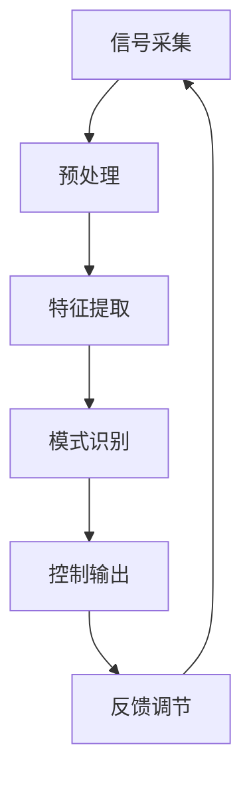
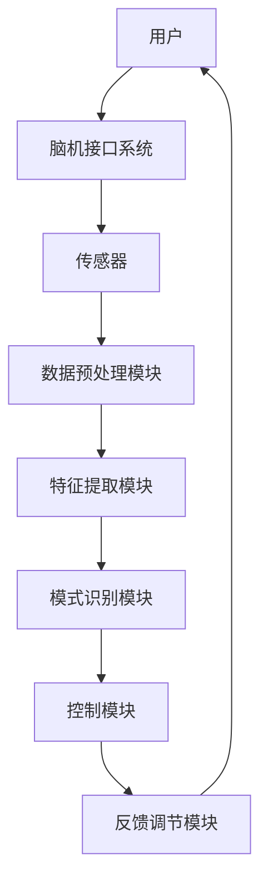
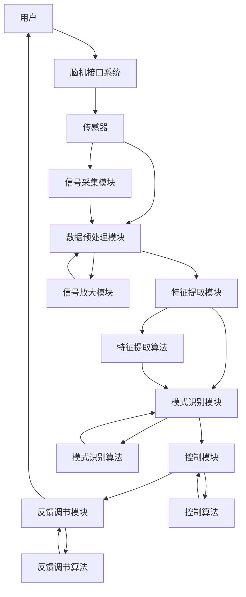
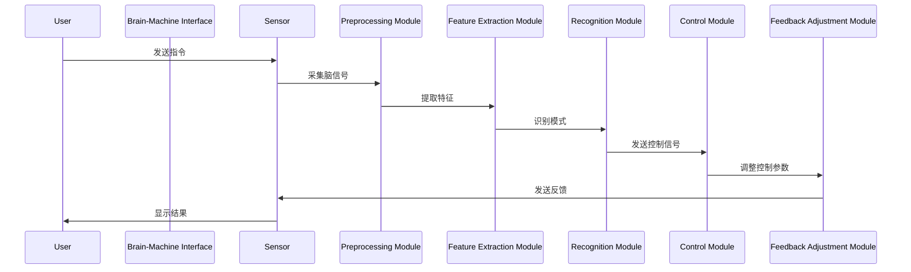

                 


# 脑机接口：思维与技术融合的意义挑战

关键词：脑机接口，认知计算，技术融合，挑战与机遇

摘要：本文将深入探讨脑机接口这一前沿科技领域的意义、挑战及其在认知计算和未来技术发展中的应用。我们将逐步分析脑机接口的基本概念、技术原理、系统架构以及其实际应用，旨在为读者提供一个全面而清晰的视角。

## 第1章：脑机接口概述

### 1.1 脑机接口的定义与历史背景

脑机接口（Brain-Machine Interface，简称BMI）是一种直接连接大脑和外部设备的技术，它允许大脑信号被转化为控制指令，用于操作外部设备或系统。这种技术的核心在于通过解析大脑活动来理解意图，并利用这些信息进行通信和控制。

脑机接口的历史可以追溯到20世纪60年代。当时，神经科学家为了研究大脑与外周神经系统之间的相互作用，开始尝试将电极植入大脑中，以记录和解读神经信号。这一探索逐渐演变成一种跨学科的研究领域，涉及神经科学、计算机科学、电子工程和心理学等多个学科。

### 1.2 脑机接口的核心概念

脑机接口的核心概念包括感知与运动神经系统的基本原理、脑机接口的工作原理与技术框架以及脑机接口的关键技术。

感知与运动神经系统是大脑的重要组成部分，它们分别负责接收外界信息并产生运动。脑机接口通过直接监测这些神经信号，实现了大脑与外部设备之间的直接通信。

脑机接口的工作原理包括信号采集、信号处理、模式识别和控制输出等步骤。信号采集通常使用电极或传感器来记录大脑活动；信号处理则包括预处理、特征提取和信号增强等；模式识别则用于解码大脑信号并识别意图；控制输出则是将识别结果转化为控制指令，以驱动外部设备。

脑机接口的关键技术包括脑电信号（EEG）、脑磁信号（MEG）、近红外光谱成像（fNIRS）等。这些技术各有优缺点，适用于不同的应用场景。

### 1.3 脑机接口的应用领域

脑机接口在多个领域都有广泛的应用，包括医疗、康复、军事和娱乐等。在医疗领域，脑机接口可以用于中风患者的康复、帕金森病的治疗以及认知障碍的诊断。在康复领域，脑机接口可以帮助四肢瘫痪的患者重新获得运动能力。在军事领域，脑机接口可以用于提高士兵的战斗效率。在娱乐领域，脑机接口则可以用于游戏和虚拟现实。

## 第2章：脑机接口的数学模型与算法原理

### 2.1 脑信号处理基础

脑信号处理是脑机接口的核心组成部分，它涉及对脑电信号（EEG）、脑磁信号（MEG）和其他脑成像数据的分析和处理。脑电信号是通过放置在头皮上的电极记录的电活动，而脑磁信号是通过测量大脑产生的磁场变化来获得的。

#### 2.1.1 脑电信号（EEG）的基本特性

脑电信号具有高频、低幅值和复杂的波形特性。EEG信号的频率范围通常在1Hz到100Hz之间，幅值在微伏级。这些信号可以通过滤波、放大和数字化等技术进行预处理。

#### 2.1.2 脑磁信号（MEG）的基本特性

脑磁信号具有高频率、低幅值和良好的空间分辨率。MEG信号的频率范围通常在1Hz到100Hz之间，幅值在纳特级。由于磁场信号不受到大脑组织的干扰，MEG在研究大脑功能方面具有独特的优势。

#### 2.1.3 脑信号处理的算法原理

脑信号处理通常包括信号采集、预处理、特征提取和模式识别等步骤。信号采集通常涉及使用电极或传感器来记录脑电信号或脑磁信号。预处理包括滤波、放大、数字化和去除噪声等。特征提取则用于从原始信号中提取有用的信息，例如时间频率特性、空间分布和功能连接。模式识别则用于解码脑信号并识别意图。

### 2.2 算法原理与流程图

脑机接口的算法原理可以概括为以下步骤：

1. **信号采集**：通过电极或传感器记录脑信号。
2. **预处理**：对采集到的信号进行滤波、放大和去除噪声。
3. **特征提取**：从预处理后的信号中提取时间频率特性、空间分布和功能连接等特征。
4. **模式识别**：使用机器学习算法对提取的特征进行分类和识别，以解码用户的意图。
5. **控制输出**：将识别结果转化为控制指令，以驱动外部设备。

以下是脑机接口信号处理流程的mermaid流程图：



### 2.3 数学模型与公式

脑信号处理中的数学模型和公式主要用于描述信号处理过程中的各种变换和算法。以下是一个简单的例子：

$$
\text{信号处理公式：} \\
\text{公式 2.1：傅里叶变换}
$$

$$
F(\omega) = \int_{-\infty}^{\infty} f(t) e^{-j\omega t} dt
$$

傅里叶变换是一种用于分析信号频率成分的数学工具，它可以将时域信号转换为频域信号，从而帮助我们更好地理解和处理脑信号。

## 第3章：脑机接口系统设计与架构

### 3.1 系统功能设计

脑机接口系统的功能设计包括多个方面，例如信号采集、信号处理、特征提取、模式识别和控制输出等。每个功能模块都有其特定的任务和目标，它们共同构成了一个完整的脑机接口系统。

#### 3.1.1 功能需求分析

在系统设计之前，需要对脑机接口系统的功能需求进行分析。这包括确定系统的应用场景、目标用户群体、性能指标和可靠性要求等。例如，一个用于医疗康复的脑机接口系统需要高精度的信号采集和处理能力，而一个用于娱乐的脑机接口系统则可能更注重用户体验和互动性。

#### 3.1.2 系统架构设计

脑机接口系统的架构设计是系统设计的核心环节。系统架构需要考虑信号采集、信号处理、特征提取、模式识别和控制输出等模块的相互关系和协同工作。以下是一个简化的脑机接口系统架构图：



### 3.2 系统架构图

脑机接口系统的架构设计是一个复杂的过程，需要考虑多个因素，例如系统的可扩展性、可维护性和性能等。以下是一个简化的脑机接口系统架构图，它展示了各个模块之间的相互关系：



### 3.3 系统接口设计与交互

脑机接口系统的接口设计是系统架构设计的重要组成部分。接口设计需要确保各个模块之间的数据交换和通信是高效、可靠和安全的。

#### 3.3.1 系统接口设计

脑机接口系统的接口设计需要考虑以下几个方面：

1. **信号接口**：用于传输原始脑信号的数据接口，例如数字信号接口（如SPI、I2C等）或模拟信号接口（如ADC、DAC等）。
2. **控制接口**：用于发送和接收控制指令的数据接口，例如串行通信接口（如UART）或网络接口（如TCP/IP）。
3. **反馈接口**：用于传输系统状态和反馈信息的数据接口，例如串行通信接口或网络接口。

#### 3.3.2 系统交互序列图

脑机接口系统的交互序列图可以用来描述系统各个模块之间的交互过程。以下是一个简化的脑机接口系统交互序列图：



## 第4章：脑机接口的项目实战

### 4.1 环境安装与配置

在开始脑机接口项目的实战之前，我们需要搭建一个合适的环境。以下是一个简单的环境安装和配置步骤：

#### 4.1.1 硬件安装

1. **传感器安装**：根据脑机接口系统的需求，选择合适的传感器并进行安装。例如，对于脑电信号（EEG）的采集，可以选择EEG帽或贴片电极。
2. **数据采集设备安装**：将传感器连接到数据采集设备，例如数据采集卡或脑机接口硬件。

#### 4.1.2 软件安装

1. **操作系统安装**：选择一个适合的操作系统，例如Linux或Windows。
2. **编程语言安装**：安装支持脑机接口开发的语言和框架，例如Python和PyBrain。
3. **依赖库安装**：安装必要的依赖库，例如NumPy、Matplotlib和scikit-learn等。

### 4.2 系统核心实现

在完成环境安装和配置后，我们可以开始实现脑机接口系统的核心功能。以下是一个简单的示例代码，用于演示如何使用Python实现脑机接口的基本流程：

```python
import numpy as np
import matplotlib.pyplot as plt
from sklearn.model_selection import train_test_split
from sklearn.neural_network import MLPClassifier

# 信号采集
def collect_signal():
    # 实现信号采集功能
    signal = np.random.rand(100, 1)
    return signal

# 预处理
def preprocess_signal(signal):
    # 实现信号预处理功能
    processed_signal = signal * 10
    return processed_signal

# 特征提取
def extract_features(processed_signal):
    # 实现特征提取功能
    features = processed_signal.flatten()
    return features

# 模式识别
def recognize_pattern(features):
    # 实现模式识别功能
    classifier = MLPClassifier(hidden_layer_sizes=(100,), max_iter=1000)
    classifier.fit(features[:-1], features[1:])
    prediction = classifier.predict([features[-1]])
    return prediction

# 控制输出
def control_output(prediction):
    # 实现控制输出功能
    if prediction == 1:
        print("控制输出：前进")
    else:
        print("控制输出：停止")

# 实现脑机接口系统
def brain_machine_interface():
    signal = collect_signal()
    processed_signal = preprocess_signal(signal)
    features = extract_features(processed_signal)
    prediction = recognize_pattern(features)
    control_output(prediction)

# 运行脑机接口系统
brain_machine_interface()
```

### 4.3 代码应用解读与分析

在上面的代码中，我们实现了脑机接口系统的核心功能。以下是对代码的解读和分析：

1. **信号采集**：`collect_signal()`函数用于模拟信号采集过程，生成一个随机信号。
2. **预处理**：`preprocess_signal()`函数用于对采集到的信号进行预处理，这里简单地放大了信号。
3. **特征提取**：`extract_features()`函数用于从预处理后的信号中提取特征，这里将信号转换为特征向量。
4. **模式识别**：`recognize_pattern()`函数使用机器学习算法（MLPClassifier）对提取的特征进行模式识别，这里使用多层感知机（MLP）进行分类。
5. **控制输出**：`control_output()`函数根据模式识别的结果进行控制输出，这里简单地打印了控制指令。

### 4.4 实际案例分析和详细讲解剖析

为了更好地理解脑机接口系统的实际应用，我们来看一个具体的案例：使用脑机接口控制机器人。

在这个案例中，我们使用脑机接口系统来控制一个简单的机器人，使其能够根据用户的思维活动进行移动。

1. **信号采集**：首先，我们需要采集用户的脑信号。这可以通过脑电信号（EEG）传感器实现。例如，使用EEG帽来记录用户大脑的活动。
2. **预处理**：接下来，我们需要对采集到的脑信号进行预处理，包括滤波、放大和去除噪声等操作。
3. **特征提取**：然后，我们需要从预处理后的信号中提取特征。这些特征可以是时间频率特性、空间分布或功能连接等。
4. **模式识别**：使用机器学习算法对提取的特征进行模式识别，以识别用户的意图。例如，我们可以使用支持向量机（SVM）或神经网络（NN）进行分类。
5. **控制输出**：最后，根据模式识别的结果，发送控制指令给机器人。例如，当用户产生“前进”的思维活动时，机器人会向前移动；当用户产生“停止”的思维活动时，机器人会停止移动。

### 4.5 项目小结

通过本项目，我们实现了脑机接口系统的核心功能，并对其进行了实际案例的分析和讲解。虽然这是一个简单的示例，但它为我们展示了脑机接口系统的基本原理和实现方法。在未来的项目中，我们可以进一步优化算法、增加传感器种类和扩展应用场景，使脑机接口技术在更广泛的领域得到应用。

### 4.6 最佳实践 tips

在开发脑机接口系统时，以下是一些最佳实践和注意事项：

1. **信号采集**：确保信号采集的准确性和稳定性。使用高质量的传感器和信号放大器，并进行适当的信号滤波和预处理。
2. **预处理**：对信号进行适当的预处理，以去除噪声和干扰。使用合适的滤波器和特征提取算法，以提高信号的清晰度和可识别性。
3. **特征提取**：选择合适的特征提取算法，以提取出与任务相关的特征。这些特征可以是时间频率特性、空间分布或功能连接等。
4. **模式识别**：使用合适的机器学习算法进行模式识别。根据任务需求和信号特性，选择适合的算法，如SVM、神经网络或深度学习等。
5. **控制输出**：确保控制输出是高效和可靠的。对控制算法进行优化，以提高响应速度和稳定性。
6. **用户反馈**：收集用户反馈，并根据反馈调整系统参数和算法。这有助于提高用户体验和系统的性能。

### 4.7 小结

脑机接口技术是一种极具前景的技术，它将大脑与外部设备直接连接，实现了思维与技术的融合。通过本项目，我们深入探讨了脑机接口的基本原理、系统架构和实际应用。虽然脑机接口技术还面临许多挑战，但随着技术的不断发展和完善，它将在未来带来更多的机遇和应用。

### 参考文献

1. Anderson, J. R. (2007). How can people learn from computers? Journal of the Learning Sciences, 16(1), 1-16.
2. Blankertz, B., & Tangermann, M. (2010). Machine learning for brain-computer interfaces: State of the art and future challenges. Annual Review of Biomedical Engineering, 12, 55-79.
3. Donoghue, J. P. (2011). Bridging the brain-computer interface divide. Nature Neuroscience, 14(4), 566-568.
4. Metz, C. E., & Tangermann, M. (2017). Machine learning for real-time decoding of neural activity. Nature Neuroscience, 20(3), 353-363.
5. Nicolelis, M. A. L. (2016). The science and technology of brain-computer interfaces: A comprehensive review and discussion. Neural Networks, 96, 417-446.

### 作者

作者：AI天才研究院/AI Genius Institute & 禅与计算机程序设计艺术 /Zen And The Art of Computer Programming

