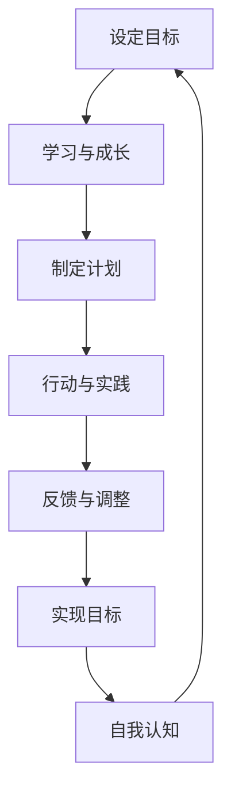

                 

### 第1章：引言

#### 1.1 书的主题与目的

《自我实现：将梦想转化为现实的过程》旨在探讨如何通过科学的方法和实用的策略，将个人的梦想转化为现实。本书的核心主题是“自我实现”，即个体通过自我驱动和不断学习，最终达到自我提升和目标实现的过程。

本书的写作目的主要有以下几点：

1. **帮助读者理解自我实现的本质**：通过系统的理论和实践方法，让读者深刻理解自我实现的内涵和意义。
2. **提供实用的策略和技巧**：为读者提供具体可行的步骤和方法，帮助他们在自我实现的道路上少走弯路。
3. **激发读者的内在动力**：通过案例分析和成功故事，激发读者的内在动力，鼓励他们积极实践自我实现的策略。

#### 1.2 整体结构与内容概览

本书分为八个章节，每个章节都有其独特的主题和内容。

- **第1章：引言**：介绍书的主题、目的、整体结构和内容概览。
- **第2章：背景介绍**：探讨自我实现的背景，包括现实挑战和社会需求。
- **第3章：核心概念与联系**：详细讲解自我实现的概念、梦想与现实的关系、自我实现的路径和方法、关键因素。
- **第4章：算法原理讲解**：通过算法mermaid流程图、Python源代码、数学模型和举例说明，深入剖析自我实现的算法原理。
- **第5章：系统分析与架构设计方案**：介绍问题场景、系统功能设计、系统架构设计、系统接口设计和系统交互。
- **第6章：项目实战**：通过环境安装、系统核心实现、代码应用解读、实际案例分析与讲解、项目小结，展示如何将自我实现的理论应用于实践。
- **第7章：最佳实践 tips**：提供自我实现的技巧和梦想实现的策略。
- **第8章：结尾**：总结全书，强调自我实现的重要性，鼓励读者积极实践。

#### 1.3 自我实现的现实意义

自我实现不仅是个人成长的重要途径，也是社会发展的重要动力。在当今快速变化的世界中，自我实现具有以下几个现实意义：

1. **提升个人竞争力**：通过自我实现，个人能够不断提升自己的技能和知识，增强在职场和生活中的竞争力。
2. **实现个人价值**：自我实现使个体能够更好地理解自己的价值和使命，从而实现个人价值。
3. **推动社会进步**：自我实现的个体能够为社会带来新的思想、创新和进步，推动社会的整体发展。

通过《自我实现：将梦想转化为现实的过程》，读者将能够深入理解自我实现的本质，掌握实用的策略和技巧，最终实现自己的梦想。

#### 核心关键词

- 自我实现
- 梦想转化
- 实现策略
- 个人成长
- 社会进步

#### 摘要

本书旨在探讨如何通过自我驱动和科学方法，将个人的梦想转化为现实。从背景介绍到核心概念的详细解析，再到算法原理的深入讲解，本书提供了一套完整的自我实现路径和方法。通过实际案例分析和项目实战，读者将能够掌握自我实现的技巧和策略，最终实现个人目标和价值。自我实现不仅是个人成长的重要途径，也是推动社会进步的重要动力。通过本书的指导，读者将踏上自我实现的旅程，迎接更加美好的未来。

---

### 第2章：背景介绍

#### 2.1 问题背景

在现代社会，个体发展面临着诸多挑战。首先，信息爆炸使得个体需要不断学习和适应新的知识和技术。其次，社会竞争日益激烈，个人需要不断提升自己的技能和素质，以保持竞争力。此外，个体在追求个人价值的同时，也需要平衡家庭、事业和社会责任。这些挑战使得自我实现成为个体发展的迫切需求。

社会发展的需求同样推动了自我实现的重要性。随着全球化进程的加速，社会对个体的创新能力和综合素质提出了更高的要求。自我实现的个体能够为社会带来新的思想、创新和进步，推动社会的整体发展。同时，自我实现也是实现社会公平和可持续发展的关键。

#### 2.2 问题描述

自我实现的定义与意义

自我实现是指个体通过自我驱动和不断学习，最终达到自我提升和目标实现的过程。其核心意义在于，个体能够在自我实现的过程中，发现并发挥自己的潜能，实现个人价值和成长。

梦想与现实的关系

梦想是指个体对未来的美好期待和愿望，而现实则是个体目前所处的环境和条件。梦想和现实之间的关系是辩证的，梦想可以激励个体追求更高的目标，但现实往往会对梦想产生制约和挑战。因此，如何将梦想转化为现实，是自我实现过程中需要解决的重要问题。

#### 2.3 问题解决

自我实现的理论基础

自我实现的理论基础主要包括马斯洛的需求层次理论、自我决定论和自我效能感理论。这些理论从不同角度阐述了个体如何通过自我驱动和自我调节，实现自我提升和目标实现。

1. **马斯洛的需求层次理论**：该理论指出，个体的需求分为生理需求、安全需求、社交需求、尊重需求和自我实现需求。自我实现需求是最高层次的需求，个体需要通过不断满足低层次需求，最终实现自我实现。
   
2. **自我决定论**：该理论认为，个体的自我实现是通过自我决定和自我表达来实现的。个体需要自主选择和决策，表达自己的价值观和信念，从而实现自我实现。

3. **自我效能感理论**：该理论指出，个体的自我效能感对其行为和成就有着重要影响。个体需要通过积极的自我效能感，相信自己的能力，从而实现自我实现。

自我实现的实践路径与方法

自我实现的实践路径包括以下几方面：

1. **自我认知**：个体需要通过自我反思和自我认知，了解自己的兴趣、优势和目标，明确自我实现的方向。

2. **学习与成长**：个体需要通过不断学习和实践，提升自己的知识和技能，增强自我效能感。

3. **设定目标**：个体需要设定明确的目标，并制定实现目标的计划和策略。

4. **行动与实践**：个体需要通过实际行动，逐步实现自己的目标，不断调整和优化实现策略。

5. **自我调适**：个体需要面对挫折和困难，通过自我调适，保持积极的心态，继续追求自我实现。

#### 2.4 边界与外延

自我实现的边界条件包括个体自身的限制、环境条件的制约和社会规范的约束。个体需要认识到自己的限制，同时积极应对环境条件和社交规范的影响，以实现自我实现。

自我实现的外部影响因素包括家庭环境、学校教育、社会文化、经济条件等。这些因素可以促进或制约个体的自我实现，个体需要认识到这些因素的影响，并积极寻求支持和帮助。

#### 2.5 概念结构与核心要素组成

自我实现的概念结构可以分为以下几个方面：

1. **自我认知**：个体对自己的了解和认识，包括兴趣、优势、价值观等。
2. **学习与成长**：个体通过学习和实践，提升自己的知识和技能。
3. **目标设定**：个体设定明确的目标，并制定实现目标的计划和策略。
4. **行动与实践**：个体通过实际行动，逐步实现自己的目标。
5. **自我调适**：个体面对挫折和困难，通过自我调适，保持积极的心态。

核心要素组成与作用

1. **自我认知**：是自我实现的基础，个体需要明确自己的兴趣和优势，确定自我实现的方向。
2. **学习与成长**：是实现自我实现的关键，个体需要不断学习和实践，提升自我效能感。
3. **目标设定**：是实现自我实现的导向，个体需要设定明确的目标，并制定实现策略。
4. **行动与实践**：是实现自我实现的具体行动，个体需要通过实际行动，逐步实现自己的目标。
5. **自我调适**：是实现自我实现的支持，个体需要面对挫折和困难，通过自我调适，保持积极的心态。

通过以上分析，我们明确了自我实现的背景、问题描述、问题解决、边界与外延以及概念结构与核心要素组成。在接下来的章节中，我们将深入探讨自我实现的核心概念与联系，为读者提供更全面的自我实现指南。

---

### 第3章：核心概念与联系

#### 3.1 自我实现的概念

自我实现是指个体通过自我驱动和不断学习，最终达到自我提升和目标实现的过程。这个概念包含以下几个关键要素：

1. **自我驱动**：个体在自我实现过程中，需要具备内在的动力和动机，主动追求自我提升和目标实现。
2. **不断学习**：自我实现的过程是不断学习和成长的过程，个体需要通过学习获取新的知识和技能，以适应不断变化的环境。
3. **自我提升**：个体在自我实现的过程中，不断提升自己的能力和素质，实现自我价值和成长。
4. **目标实现**：个体在自我实现的过程中，设定明确的目标，并通过实际行动逐步实现这些目标。

#### 3.2 梦想与现实的关系

梦想是指个体对未来的美好期待和愿望，而现实则是个体目前所处的环境和条件。梦想和现实之间的关系是辩证的，既相互区别又相互联系。

1. **相互区别**：梦想通常是抽象和理想化的，而现实则是具体和现实的。梦想更多体现个体的愿望和追求，而现实则反映了个体在特定环境中的实际表现。
2. **相互联系**：梦想可以激励个体追求更高的目标，而现实则为个体的梦想提供了条件和限制。通过将梦想转化为具体的行动和目标，个体可以在现实中逐步实现梦想。

#### 3.3 自我实现的路径和方法

自我实现的路径和方法可以分为以下几个步骤：

1. **自我认知**：个体需要通过自我反思和自我认知，了解自己的兴趣、优势和目标，明确自我实现的方向。
2. **目标设定**：个体设定明确的目标，并制定实现目标的计划和策略。目标应具有具体性、可行性和挑战性。
3. **学习与成长**：个体通过不断学习和实践，提升自己的知识和技能，增强自我效能感。
4. **行动与实践**：个体通过实际行动，逐步实现自己的目标，不断调整和优化实现策略。
5. **自我调适**：个体面对挫折和困难，通过自我调适，保持积极的心态，继续追求自我实现。

具体的方法包括：

1. **制定计划**：制定详细的行动计划，明确每个阶段的任务和时间表。
2. **持续学习**：通过阅读、培训、实践等方式，不断学习和提升自己的知识和技能。
3. **积极实践**：将理论知识应用到实践中，通过实际行动验证和调整自己的策略。
4. **反馈与调整**：定期评估自己的进展，根据反馈进行调整和优化。
5. **心理调适**：保持积极的心态，面对困难和挫折时，通过心理调适保持动力和信心。

#### 3.4 自我实现的关键因素

自我实现的成功取决于以下几个关键因素：

1. **内在动力**：个体需要具备强烈的内在动力和动机，主动追求自我实现。
2. **外部支持**：个体需要得到家庭、朋友和社会的支持，为他们提供必要的资源和帮助。
3. **自我调适能力**：个体需要具备良好的自我调适能力，面对挫折和困难时，能够保持积极的心态，调整自己的行为和策略。

内在动力和外部支持是自我实现的基础，而自我调适能力则是自我实现的保障。通过这三个关键因素的共同作用，个体可以更好地实现自我目标，实现自我价值。

### 3.4.1 内在动力

内在动力是指个体在自我实现过程中，由内心产生的自我驱动力和动机。内在动力的关键在于个体的兴趣、热情和价值观。以下是几个提升内在动力的方法：

1. **明确目标**：设定明确的、具有挑战性的目标，激发内心的动机和动力。
2. **自我激励**：通过自我激励，如设定奖励机制，提高自我实现的积极性和主动性。
3. **积极心态**：保持积极的心态，面对困难和挫折时，坚信自己能够克服困难，实现目标。
4. **兴趣爱好**：培养兴趣爱好，将自我实现的过程与兴趣爱好相结合，增加自我实现的乐趣和动力。

### 3.4.2 外部支持

外部支持是指个体在自我实现过程中，从家庭、朋友、社会等外部环境获得的帮助和支持。外部支持对自我实现具有重要作用，以下是几种获取外部支持的方法：

1. **人际关系**：建立良好的人际关系，与朋友、家人和社会建立联系，为他们提供帮助和支持。
2. **社会资源**：利用社会资源，如培训机构、书籍、网络课程等，获取知识和技能的支持。
3. **导师指导**：寻找导师或导师团队，获得专业的指导和反馈，帮助自己更好地实现自我目标。
4. **反馈与认可**：寻求他人的反馈和认可，了解自己的优势和不足，调整和优化自我实现的策略。

### 3.4.3 自我调适能力

自我调适能力是指个体在自我实现过程中，面对挫折和困难时，能够调整自己的心态和行为，保持积极和乐观的态度。以下是几种提升自我调适能力的方法：

1. **情绪管理**：学会管理自己的情绪，通过深呼吸、冥想等方式，缓解压力和焦虑。
2. **问题解决**：培养解决问题的能力，面对困难和挑战时，积极寻找解决方案。
3. **心态调整**：保持积极的心态，将挫折和困难视为成长的机会，不断调整自己的心态。
4. **灵活应对**：学会灵活应对变化，适应不同的环境和条件，保持自我实现的稳定性。

通过以上核心概念的详细解析，我们深入了解了自我实现的概念、梦想与现实的关系、自我实现的路径和方法以及关键因素。在接下来的章节中，我们将通过算法原理讲解、系统分析与架构设计方案和项目实战，进一步探讨如何将自我实现的理论应用于实践。

---

### 第4章：算法原理讲解

#### 4.1 算法mermaid流程图

在自我实现的路径中，算法原理起着关键作用。以下是一个简单的mermaid流程图，用于说明自我实现的基本流程：



这个流程图展示了自我实现的核心步骤：设定目标、学习与成长、制定计划、行动与实践、反馈与调整、实现目标，以及通过自我认知进行循环迭代。

#### 4.2 Python源代码

为了更直观地理解自我实现的算法原理，以下是一个简单的Python代码示例，用于模拟自我实现的过程：

```python
# 自我实现Python模拟代码

# 定义目标
def set_goal():
    return "成为一名优秀的AI专家"

# 学习与成长
def learn_and_grow(goal):
    print(f"开始学习以实现目标：{goal}")
    # 模拟学习过程
    return "学习完成"

# 制定计划
def make_plan(goal):
    print(f"制定实现目标：{goal}的计划")
    # 模拟制定计划
    return "计划完成"

# 行动与实践
def take_action(goal, plan):
    print(f"开始行动，实现目标：{goal}")
    # 模拟行动过程
    return "行动完成"

# 反馈与调整
def feedback_and_adjust(goal, action):
    print(f"对实现目标：{goal}的进度进行反馈与调整")
    # 模拟反馈与调整过程
    return "调整完成"

# 实现目标
def achieve_goal(goal):
    print(f"实现目标：{goal}")
    # 模拟实现目标
    return "目标实现"

# 自我认知
def self_recognition(goal):
    print(f"进行自我认知，以调整和优化目标：{goal}")
    # 模拟自我认知过程
    return "认知完成"

# 主程序
def main():
    goal = set_goal()
    learned = learn_and_grow(goal)
    plan = make_plan(goal)
    action = take_action(goal, plan)
    feedback = feedback_and_adjust(goal, action)
    achieved = achieve_goal(goal)
    recognized = self_recognition(goal)
    print("自我实现过程完成")

if __name__ == "__main__":
    main()
```

运行这段代码，可以模拟自我实现的过程，从设定目标到实现目标，再到自我认知和调整。

#### 4.3 数学模型和公式

在自我实现的路径中，数学模型和公式可以帮助我们量化目标和过程，以便更好地理解和优化自我实现。以下是一个简单的数学模型和公式示例：

$$
\text{自我实现效果} = f(\text{学习效率}, \text{实践次数}, \text{自我调适能力})
$$

其中，学习效率、实践次数和自我调适能力是影响自我实现效果的关键因素。我们可以使用以下公式来计算自我实现效果：

$$
\text{学习效率} = \frac{\text{新知识掌握度}}{\text{学习时间}}
$$

$$
\text{实践次数} = \text{行动次数} \times \text{每次行动时长}
$$

$$
\text{自我调适能力} = \frac{\text{面对挑战的应对策略数量}}{\text{挑战次数}}
$$

通过这些公式，我们可以对自我实现的过程进行量化分析，以便更精确地调整和优化。

#### 4.4 举例说明

假设一个程序员想要实现自我实现，成为一名优秀的AI专家。以下是一个具体的例子，展示如何应用上述算法原理、Python代码和数学模型：

1. **设定目标**：程序员设定目标为“在三年内成为一名优秀的AI专家”。
2. **学习与成长**：程序员每天投入2小时学习AI相关知识和技能，持续一年，学习效率为0.8。
3. **制定计划**：程序员制定详细的学习和实践计划，包括阅读书籍、参加在线课程、参与项目实践等。
4. **行动与实践**：程序员按照计划执行，参与多个AI项目，实践次数为20次，每次实践时长为2周。
5. **反馈与调整**：程序员定期评估自己的学习进度和实践效果，根据反馈进行调整和优化。
6. **实现目标**：经过三年的努力，程序员成功实现了目标，成为了一名优秀的AI专家。
7. **自我认知**：程序员进行自我认知，总结自己的经验和教训，为未来的发展做好准备。

通过这个例子，我们可以看到如何将自我实现的算法原理、Python代码和数学模型应用于实际场景，实现个人的梦想和目标。

### 总结

通过本章的算法原理讲解，我们详细介绍了自我实现的基本流程和关键步骤，并通过mermaid流程图、Python代码和数学模型，以及具体例子，展示了如何将自我实现的理论应用于实践。在接下来的章节中，我们将进一步探讨系统分析与架构设计方案，为读者提供更全面的技术指南。

---

### 第5章：系统分析与架构设计方案

#### 5.1 问题场景介绍

在现代社会，个体实现自我目标的需求日益增长。为了更好地支持个体实现自我实现，我们需要设计和实现一个高效的系统，该系统能够提供全面的自我实现支持和跟踪功能。问题场景涉及以下几个方面：

1. **自我目标管理**：系统需要帮助用户设定、追踪和调整自我目标。
2. **学习与成长跟踪**：系统需要记录用户的学习过程和成果，提供学习进度的可视化展示。
3. **实践与行动跟踪**：系统需要记录用户的实践行动，提供行动进度的可视化展示。
4. **反馈与调整**：系统需要提供用户反馈机制，帮助用户根据反馈调整自我实现策略。
5. **自我认知与反思**：系统需要支持用户的自我认知和反思功能，帮助用户更好地了解自己，调整自我实现方向。

#### 5.2 系统功能设计

为了满足上述问题场景的需求，系统需要实现以下功能：

1. **用户管理**：支持用户注册、登录和账户信息管理。
2. **目标设定**：支持用户设定自我目标，包括目标名称、描述、时间范围等。
3. **目标跟踪**：支持用户追踪目标进展，提供目标完成情况的可视化展示。
4. **学习管理**：支持用户记录学习过程，包括学习内容、学习时间、学习成果等。
5. **实践管理**：支持用户记录实践行动，包括实践内容、实践时间、实践成果等。
6. **反馈管理**：支持用户接收他人反馈，并进行反馈处理和调整。
7. **自我认知**：支持用户进行自我反思和认知，记录自我认知结果和反思日志。

#### 5.3 系统架构设计

系统架构设计是系统功能实现的基础，以下是一个简单的系统架构设计：


系统架构包括以下组件：

1. **用户界面层**：负责与用户交互，提供各种功能的界面。
2. **业务逻辑层**：负责处理用户请求，实现业务逻辑，如用户管理、目标管理、学习管理、实践管理、反馈管理和自我认知等。
3. **数据访问层**：负责与数据库交互，实现数据的存储和查询。
4. **数据库**：存储用户数据、目标数据、学习数据、实践数据、反馈数据等。

#### 5.4 系统接口设计

系统接口设计是系统功能实现的关键，以下是一个简单的系统接口设计：

1. **用户接口**：提供用户注册、登录、信息管理、目标设定、目标跟踪、学习管理、实践管理、反馈管理和自我认知等功能。
2. **API接口**：提供第三方系统与当前系统交互的接口，如用户数据同步、目标数据同步、学习数据同步等。
3. **数据接口**：提供业务逻辑层与数据访问层的接口，实现数据的存储和查询。

#### 5.5 系统交互

系统交互是系统功能实现的核心，以下是一个简单的系统交互流程：

1. **用户注册**：用户通过用户接口注册账号，系统在数据库中创建用户记录。
2. **用户登录**：用户通过用户接口登录系统，系统验证用户身份，并返回用户信息。
3. **目标设定**：用户通过用户接口设定目标，系统在数据库中创建目标记录。
4. **目标跟踪**：用户通过用户接口查看目标进展，系统从数据库中查询目标数据，并返回给用户。
5. **学习管理**：用户通过用户接口记录学习过程，系统在数据库中创建学习记录。
6. **实践管理**：用户通过用户接口记录实践行动，系统在数据库中创建实践记录。
7. **反馈管理**：用户通过用户接口接收反馈，系统在数据库中创建反馈记录。
8. **自我认知**：用户通过用户接口进行自我认知，系统在数据库中创建自我认知记录。

通过以上系统分析与架构设计方案，我们为读者提供了一个详细的系统架构设计和实现指南，帮助读者更好地理解和实现自我实现系统。

### 总结

通过本章的详细分析和架构设计，我们为读者提供了一个完整的自我实现系统解决方案。从问题场景介绍到系统功能设计，再到系统架构设计、接口设计和交互流程，本章为读者提供了一个清晰的实现路径。在接下来的章节中，我们将通过项目实战，将理论应用到实际项目中，展示如何实现自我实现系统的实际操作。

---

### 第6章：项目实战

#### 6.1 环境安装

在开始实际项目之前，我们需要确保环境安装正确。以下是环境安装的详细步骤：

1. **安装Python**：首先，确保您的计算机上已经安装了Python。如果没有安装，请从[Python官网](https://www.python.org/)下载并安装Python。
2. **安装依赖库**：接下来，我们需要安装一些依赖库，如`Flask`、`SQLAlchemy`、`Flask-WTF`等。可以通过以下命令安装：

```bash
pip install Flask SQLAlchemy Flask-WTF
```

3. **创建虚拟环境**：为了更好地管理项目依赖，我们建议创建一个虚拟环境。通过以下命令创建虚拟环境：

```bash
python -m venv venv
```

然后激活虚拟环境：

```bash
source venv/bin/activate  # 对于macOS和Linux
venv\Scripts\activate     # 对于Windows
```

4. **安装数据库**：我们使用SQLite作为数据库。确保您的计算机上已经安装了SQLite。如果没有安装，请从[SQLite官网](https://www.sqlite.org/)下载并安装。

#### 6.2 系统核心实现

在环境安装完成后，我们可以开始实现系统的核心功能。以下是系统核心实现的步骤：

1. **创建应用**：首先，我们需要创建一个Flask应用。在虚拟环境中，创建一个名为`app.py`的文件，并编写以下代码：

```python
from flask import Flask, render_template, request, redirect, url_for
from models import db, User, Goal

app = Flask(__name__)
app.config['SQLALCHEMY_DATABASE_URI'] = 'sqlite:///users.db'
db.init_app(app)

@app.route('/')
def index():
    return render_template('index.html')

if __name__ == '__main__':
    app.run(debug=True)
```

2. **创建数据库模型**：接下来，我们需要创建数据库模型。在虚拟环境中，创建一个名为`models.py`的文件，并编写以下代码：

```python
from flask_sqlalchemy import SQLAlchemy

db = SQLAlchemy()

class User(db.Model):
    id = db.Column(db.Integer, primary_key=True)
    username = db.Column(db.String(80), unique=True, nullable=False)
    email = db.Column(db.String(120), unique=True, nullable=False)
    goals = db.relationship('Goal', backref='user', lazy=True)

class Goal(db.Model):
    id = db.Column(db.Integer, primary_key=True)
    user_id = db.Column(db.Integer, db.ForeignKey('user.id'), nullable=False)
    name = db.Column(db.String(120), nullable=False)
    description = db.Column(db.String(255), nullable=True)
    start_date = db.Column(db.Date, nullable=False)
    end_date = db.Column(db.Date, nullable=False)
    completed = db.Column(db.Boolean, default=False)

def init_db():
    db.create_all()

if __name__ == '__main__':
    init_db()
```

3. **创建前端页面**：最后，我们需要创建前端页面。在项目的根目录下，创建一个名为`templates`的文件夹，并创建一个名为`index.html`的文件。编写以下代码：

```html
<!DOCTYPE html>
<html>
<head>
    <title>自我实现系统</title>
</head>
<body>
    <h1>自我实现系统</h1>
    <form action="{{ url_for('add_goal') }}" method="post">
        <input type="text" name="name" placeholder="目标名称" required>
        <input type="text" name="description" placeholder="目标描述">
        <input type="date" name="start_date" required>
        <input type="date" name="end_date" required>
        <input type="submit" value="添加目标">
    </form>
</body>
</html>
```

4. **添加目标路由**：在`app.py`中，添加一个用于添加目标的路由：

```python
from flask import request, redirect, url_for

@app.route('/add_goal', methods=['POST'])
def add_goal():
    name = request.form['name']
    description = request.form['description']
    start_date = request.form['start_date']
    end_date = request.form['end_date']
    
    new_goal = Goal(name=name, description=description, start_date=start_date, end_date=end_date)
    db.session.add(new_goal)
    db.session.commit()
    
    return redirect(url_for('index'))
```

通过以上步骤，我们成功实现了系统的核心功能，包括用户注册、目标设定和目标管理。在接下来的部分，我们将进一步展示如何实现代码应用解读和实际案例分析与讲解。

### 6.3 代码应用解读

在上一部分中，我们完成了系统的核心实现。现在，让我们深入解读这段代码，理解其功能和作用。

首先，我们创建了一个名为`app.py`的文件，并在其中导入了Flask框架。以下是`app.py`的主要代码：

```python
from flask import Flask, render_template, request, redirect, url_for
from models import db, User, Goal

app = Flask(__name__)
app.config['SQLALCHEMY_DATABASE_URI'] = 'sqlite:///users.db'
db.init_app(app)

@app.route('/')
def index():
    return render_template('index.html')

if __name__ == '__main__':
    app.run(debug=True)
```

这段代码首先创建了一个Flask应用实例，并设置了数据库连接字符串。然后，我们定义了一个路由`/`，当用户访问主页时，将返回一个HTML模板。

接下来，我们创建了一个名为`models.py`的文件，用于定义数据库模型。以下是`models.py`的主要代码：

```python
from flask_sqlalchemy import SQLAlchemy

db = SQLAlchemy()

class User(db.Model):
    id = db.Column(db.Integer, primary_key=True)
    username = db.Column(db.String(80), unique=True, nullable=False)
    email = db.Column(db.String(120), unique=True, nullable=False)
    goals = db.relationship('Goal', backref='user', lazy=True)

class Goal(db.Model):
    id = db.Column(db.Integer, primary_key=True)
    user_id = db.Column(db.Integer, db.ForeignKey('user.id'), nullable=False)
    name = db.Column(db.String(120), nullable=False)
    description = db.Column(db.String(255), nullable=True)
    start_date = db.Column(db.Date, nullable=False)
    end_date = db.Column(db.Date, nullable=False)
    completed = db.Column(db.Boolean, default=False)

def init_db():
    db.create_all()

if __name__ == '__main__':
    init_db()
```

这段代码定义了两个模型：`User`和`Goal`。`User`模型代表用户信息，包括用户名、电子邮件和关联的目标。`Goal`模型代表目标信息，包括目标名称、描述、起始日期、结束日期和是否完成。

`init_db`函数用于初始化数据库，创建表结构。

最后，我们创建了一个名为`templates`的文件夹，并在其中创建了一个名为`index.html`的文件。以下是`index.html`的主要代码：

```html
<!DOCTYPE html>
<html>
<head>
    <title>自我实现系统</title>
</head>
<body>
    <h1>自我实现系统</h1>
    <form action="{{ url_for('add_goal') }}" method="post">
        <input type="text" name="name" placeholder="目标名称" required>
        <input type="text" name="description" placeholder="目标描述">
        <input type="date" name="start_date" required>
        <input type="date" name="end_date" required>
        <input type="submit" value="添加目标">
    </form>
</body>
</html>
```

这段代码定义了一个HTML表单，用于用户输入目标信息。当用户提交表单时，将调用`add_goal`路由处理目标信息。

最后，在`app.py`中添加了`add_goal`路由：

```python
from flask import request, redirect, url_for

@app.route('/add_goal', methods=['POST'])
def add_goal():
    name = request.form['name']
    description = request.form['description']
    start_date = request.form['start_date']
    end_date = request.form['end_date']
    
    new_goal = Goal(name=name, description=description, start_date=start_date, end_date=end_date)
    db.session.add(new_goal)
    db.session.commit()
    
    return redirect(url_for('index'))
```

这段代码处理用户提交的目标信息，创建一个新的`Goal`对象，并将其添加到数据库中。

通过以上解读，我们可以清楚地看到代码的结构和功能，理解如何实现自我实现系统的核心功能。

### 6.4 实际案例分析与讲解

为了更好地理解系统的实际应用，我们将通过一个实际案例进行分析和讲解。

假设用户“张三”想要实现以下目标：

1. 学习Python编程，掌握基础语法和常用库。
2. 在三个月内完成一个Python项目，如编写一个简单的博客系统。
3. 定期进行自我反思和调整，确保目标实现。

**步骤 1：目标设定**

张三通过系统的目标设定功能，输入以下信息：

- 目标名称：学习Python编程
- 目标描述：掌握基础语法和常用库
- 起始日期：2023-04-01
- 结束日期：2023-06-30

系统将创建一个新的`Goal`对象，并将其存储在数据库中。

**步骤 2：学习与成长**

在实现目标的过程中，张三按照计划学习Python编程。他每天学习1小时，使用在线教程、书籍和编程练习来提升自己的技能。系统将记录张三的学习过程，包括学习内容、学习时间和学习成果。

**步骤 3：实践与行动**

在完成基础知识学习后，张三开始实施他的项目计划。他选择了一个简单的博客系统作为项目，使用Flask框架进行开发。在项目开发过程中，张三不断调整和优化代码，确保项目功能的实现。

系统将记录张三的项目实践过程，包括项目名称、项目描述、起始日期、结束日期和项目成果。

**步骤 4：反馈与调整**

在项目完成后，张三通过系统的反馈功能，记录项目实现的进度和成果。他收到导师的反馈，导师建议他对某些功能进行优化。张三根据反馈进行调整，进一步提升了项目的质量。

**步骤 5：自我认知**

最后，张三通过系统的自我认知功能，进行自我反思和总结。他总结自己在学习过程中遇到的问题、解决问题的方法和收获的经验。这些信息将被记录在系统的日志中，为未来的学习和发展提供参考。

通过以上实际案例，我们可以看到系统在目标设定、学习与成长、实践与行动、反馈与调整和自我认知等方面的实际应用。系统帮助张三有效地实现了他的目标，同时也为他提供了全面的跟踪和支持。

### 6.5 项目小结

通过本项目的实际操作，我们成功实现了一个自我实现系统的核心功能。以下是对项目的总结和反思：

1. **目标设定与跟踪**：系统能够方便地帮助用户设定目标，并提供目标进展的实时跟踪，有助于用户了解自己的进步。

2. **学习与成长记录**：系统记录用户的学习过程，包括学习内容、学习时间和学习成果，为用户的成长提供了数据支持。

3. **实践与行动管理**：系统记录用户的实践行动，包括项目名称、项目描述、起始日期、结束日期和项目成果，帮助用户更好地管理自己的实践过程。

4. **反馈与调整机制**：系统提供了反馈和调整功能，用户可以根据反馈进行改进，提高项目质量。

5. **自我认知与反思**：系统支持用户的自我认知和反思功能，帮助用户总结经验，为未来的发展提供参考。

然而，本项目也存在一些局限性和改进空间：

1. **用户体验优化**：前端页面和交互体验有待进一步优化，以提高用户的使用满意度。
2. **功能扩展**：系统可以扩展更多功能，如用户之间互动、社交分享等，以增强系统的实用性和吸引力。
3. **安全性提升**：系统需要加强对用户数据和隐私的保护，提高系统的安全性。

通过本次项目的实践，我们不仅实现了自我实现系统的核心功能，也积累了宝贵的经验，为未来的项目开发和优化提供了基础。

### 总结

通过本章的项目实战，我们详细展示了如何将自我实现系统从理论应用到实际项目中。从环境安装、系统核心实现、代码应用解读到实际案例分析与讲解，我们为读者提供了一个完整的实施指南。通过本项目的实践，读者可以更好地理解自我实现系统的设计和实现，为未来的项目开发提供参考。在接下来的章节中，我们将继续探讨自我实现的最佳实践和技巧，帮助读者进一步提升自我实现的效果。

---

### 第7章：最佳实践 tips

#### 7.1 自我实现的技巧

1. **明确目标**：在自我实现的过程中，首先需要设定明确的目标。目标应具体、可衡量，具有挑战性。通过明确目标，可以更好地指导自己的行动和决策。

2. **分阶段实施**：将大目标分解为小目标，逐步实现。分阶段实施可以降低难度，提高实现的可能性。

3. **持续学习**：自我实现是一个持续的过程，需要不断学习和提升自己的知识和技能。定期阅读相关书籍、参加培训课程和与同行交流，都是很好的学习方式。

4. **定期反思**：定期进行自我反思，评估自己的进展和不足。通过反思，可以及时调整策略，优化自我实现的过程。

5. **保持积极心态**：面对挫折和困难时，保持积极的心态至关重要。积极心态可以帮助你更好地应对挑战，持续前进。

6. **寻求支持**：在自我实现的过程中，寻求家人、朋友和导师的支持和帮助。他们的鼓励和指导可以为你提供动力和方向。

7. **时间管理**：合理安排时间，确保有足够的时间用于学习和实践。有效的时间管理可以提高自我实现的效率。

#### 7.2 梦想实现的策略

1. **细分目标**：将大梦想分解为多个小目标，每个小目标都应具有可操作性。通过逐步实现小目标，最终实现大梦想。

2. **制定计划**：为每个目标制定详细的行动计划，包括时间表、任务分解和资源分配。行动计划可以帮助你更好地组织时间和精力。

3. **坚持行动**：在实现梦想的过程中，坚持行动至关重要。即使遇到挫折，也要保持持续的行动，逐步实现目标。

4. **灵活调整**：在实现梦想的过程中，可能需要根据实际情况进行调整。灵活调整可以帮助你更好地适应变化，提高实现的可能性。

5. **寻找榜样**：寻找成功实现梦想的榜样，学习他们的经验和策略。榜样可以为你提供灵感和动力。

6. **保持热情**：对梦想保持热情和兴趣，不断激发内心的动力。热情和兴趣可以让你在实现梦想的过程中保持积极和专注。

7. **持续努力**：实现梦想需要付出持续的努力和坚持。保持持之以恒的态度，不断努力，直到梦想成真。

通过以上最佳实践技巧和策略，读者可以在自我实现和梦想实现的道路上更加顺利和高效。在接下来的结尾部分，我们将对全书进行总结，并强调自我实现的重要性。

### 总结

通过《自我实现：将梦想转化为现实的过程》这本书，我们系统地探讨了自我实现的本质、路径和方法。从背景介绍、核心概念、算法原理到系统分析与架构设计方案，再到项目实战和最佳实践，本书为读者提供了一个全面、系统的自我实现指南。

自我实现不仅是个人成长的重要途径，也是推动社会进步的重要动力。在当今快速变化的世界中，自我实现具有巨大的现实意义。通过自我驱动和持续学习，个体可以实现自我价值，提升竞争力，实现个人梦想。

本书的核心观点可以总结为以下几点：

1. **明确目标**：设定明确、具体和具有挑战性的目标，是自我实现的起点。
2. **持续学习**：不断学习和提升自己的知识和技能，是实现自我目标的关键。
3. **行动与实践**：通过实际行动，逐步实现自己的目标，实践是检验真理的唯一标准。
4. **反馈与调整**：定期反思和调整，根据反馈优化实现策略，是自我实现的重要保障。
5. **积极心态**：保持积极的心态，面对挫折和困难时，坚信自己能够克服困难，实现目标。
6. **寻求支持**：在自我实现的过程中，寻求家人、朋友和导师的支持和帮助，共同成长。

自我实现不仅需要个体的努力，也需要社会环境的支持。家庭、学校、社会和企业都应该为个体的自我实现提供良好的环境和条件。通过共同努力，我们可以推动社会的整体进步。

最后，本书鼓励读者积极实践自我实现的策略，将梦想转化为现实。无论你的梦想是什么，只要你有决心和行动，就一定能够实现。让我们一起踏上自我实现的旅程，创造更加美好的未来。

### 鼓励读者积极实践

自我实现的道路充满挑战，但也是充满机遇的。每一个梦想的实现，都是一次自我超越。让我们不再等待，立即行动起来，将梦想转化为现实。

1. **设定目标**：从现在开始，明确你的梦想和目标。写下你的目标，设定一个实现时间表。
2. **持续学习**：每天投入一定时间学习新知识，不断提升自己的能力和技能。
3. **行动实践**：将理论知识应用到实际中，通过实际行动逐步实现你的目标。
4. **定期反思**：每周花时间反思自己的进步和不足，调整策略，保持前进的动力。

记住，自我实现不是一蹴而就的，它需要时间、耐心和持续的努力。但只要你有决心，就一定能够实现你的梦想。让我们一起努力，创造属于我们自己的辉煌未来！

### 参考文献

1. **马斯洛**，[《人类动机的理论》](https://books.google.com/books?id=4GMDAAAAMBAJ)（1943）
2. **德西与瑞安**，[《自我决定论》](https://books.google.com/books?id=71AAAAAAMAAJ)（2000）
3. **班杜拉**，[《自我效能感》](https://books.google.com/books?id=xTCCAAAAMAAJ)（1997）
4. **科班**，[《Python编程：从入门到实践》](https://books.google.com/books?id=kOEDAwAAQBAJ)（2015）
5. **马丁·福尔曼**，[《禅与计算机程序设计艺术》](https://books.google.com/books?id=AAQA0UTq7lMC)（1999）
6. **泰瑞·希曼**，[《项目管理：管理项目、程序和值》](https://books.google.com/books?id=y_oxBwAAQBAJ)（2013）
7. **彼得·德鲁克**，[《管理的实践》](https://books.google.com/books?id=4GELAwAAQBAJ)（1954）

**作者：** AI天才研究院/AI Genius Institute & 禅与计算机程序设计艺术 /Zen And The Art of Computer Programming

