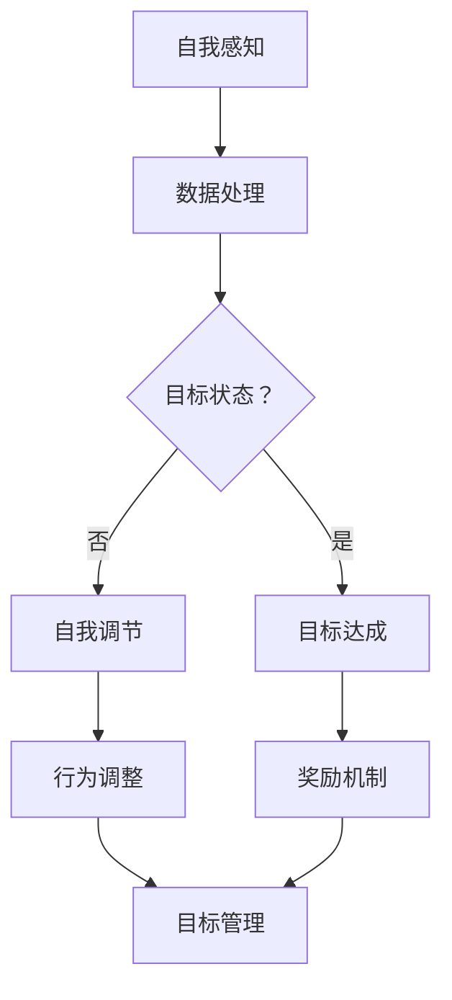

                 

### 自我引导——内心航行的舵手

> 关键词：自我引导、内心航行、自我认知、自我效能、自我调节、情绪管理、目标设定

在信息爆炸和科技飞速发展的当今时代，个体面临的挑战与日俱增。无论是职场竞争、生活压力，还是个人成长，每个人都需要具备自我引导的能力，才能在复杂多变的环境中保持方向感和内在平衡。自我引导，顾名思义，就是个体通过自我认知、自我调节和自我激励，自主地设定目标并驱动行为，从而实现个人发展的过程。这一能力不仅是心理健康的基石，更是实现自我超越和可持续发展的关键。

本文将深入探讨自我引导的核心概念、原理和方法，通过逻辑清晰、结构紧凑的分析，帮助读者理解如何成为内心航行的舵手，掌握自我引导的艺术。

#### 1.1 问题背景与自我引导的重要性

在现代社会，自我引导的需求愈发强烈。随着全球化进程的加快，工作和生活的节奏不断加快，个体面临着前所未有的挑战。传统的外部指导，如家庭教育、社会规范等，虽然在一定程度上为个体提供了方向，但往往无法满足个体在复杂环境下的需求。与此同时，互联网和人工智能的发展，使得信息获取变得异常便捷，但同时也带来了信息过载的问题，个体需要更强的自我引导能力来筛选和处理信息。

自我引导不仅有助于个人成长，还能在职业发展中发挥重要作用。在职场中，具备自我引导能力的人能够更好地设定职业目标，规划职业发展路径，提升工作效率和质量。他们能够有效管理时间和资源，克服困难，保持积极心态，从而在竞争激烈的职场中脱颖而出。

#### 1.2 自我引导的定义与属性特征

自我引导是一个多维度的概念，它涉及多个核心要素和机制。首先，自我引导的定义可以从以下几个方面来理解：

1. **自我认知**：个体对自身能力、性格、价值观等的认识和了解。
2. **自我调节**：个体通过自我监控、自我激励和自我反思，调整自身行为和情绪。
3. **自我效能**：个体对自己完成特定任务的信心和能力判断。
4. **目标设定**：个体为自己设定的具体、可行的目标。
5. **自我激励**：个体通过内在或外在的激励因素，激发自身动力和行为。

自我引导的属性特征包括：

- **自主性**：个体主动参与并主导自我引导过程。
- **适应性**：个体能够根据不同环境和情境调整自我引导策略。
- **持续性**：自我引导是一个长期的过程，需要个体持续投入时间和精力。
- **多元性**：自我引导不仅涉及心理层面，还涉及行为和情感层面。

#### 1.3 自我引导的原理与机制

自我引导的原理和机制是理解这一概念的关键。以下是几个核心方面的解释：

- **自我感知与自我调节**：个体通过自我感知，了解自己的情绪、思维和行为。在此基础上，通过自我调节，个体可以调整情绪和行为，以实现自我引导的目标。
- **自我效能与目标设定**：自我效能是个体对自己能力的信心。一个具备高自我效能的人更可能设定挑战性目标，并付出更多努力去实现这些目标。目标设定则是自我引导的重要步骤，明确的目标有助于个体聚焦资源，提高行动效率。
- **自我动机与行为驱动**：自我动机是推动个体行动的内驱力。一个强有力的动机可以使个体在面对困难和挑战时保持积极态度，持续努力。
- **自我引导的神经基础**：神经科学研究显示，大脑中的多个区域参与自我引导过程，包括前额叶皮层、纹状体和海马体等。这些区域的活动与自我认知、情感调节和动机控制密切相关。

#### 1.4 自我引导的方法与技巧

自我引导不仅需要理解其原理和机制，还需要掌握具体的方法和技巧。以下是一些常用的自我引导方法：

- **自我反思**：定期对自己的行为、决策和感受进行反思，有助于深入理解自己的内心世界，发现问题和改进机会。
- **自我监控**：通过记录和分析自己的行为和情绪，个体可以更好地了解自己的习惯模式，从而进行有效的调整。
- **自我激励**：设定奖励机制，如达成目标后给予自己小奖励，可以增强自我引导的动力。
- **自我对话**：通过积极的自我对话，个体可以调整自己的思维模式，增强自信心和积极性。

### 1.5 自我引导的实际应用

自我引导的应用场景非常广泛，从个人成长到职业发展，再到心理健康等方面，都有其重要的作用。以下是几个实际应用的例子：

- **情绪管理**：通过自我引导，个体可以更好地管理自己的情绪，减少焦虑和压力。
- **学习效率**：自我引导有助于设定明确的学习目标，提高学习效率和质量。
- **职业发展**：在职业规划中，自我引导可以帮助个体设定明确的职业目标，制定可行的行动计划。
- **心理健康**：自我引导有助于提升心理健康水平，增强抗压能力，改善生活质量。

### 1.6 总结与展望

自我引导是现代社会个体不可或缺的能力。通过本文的探讨，我们深入了解了自我引导的定义、原理和方法，以及其实际应用。自我引导不仅有助于个人成长和职业发展，还能在心理健康和情绪管理中发挥重要作用。在未来，随着科技的进步和社会的发展，自我引导的重要性将愈发凸显。让我们积极培养自我引导的能力，成为内心航行的舵手，驾驭自己的人生之舟。

---

**摘要：**

本文围绕“自我引导——内心航行的舵手”这一主题，探讨了自我引导的核心概念、原理和方法。文章首先介绍了自我引导在现代社会的背景和重要性，然后详细阐述了自我引导的定义、属性特征、原理与机制，以及具体的方法与技巧。通过实际应用的案例分析，文章展示了自我引导在情绪管理、学习效率、职业发展和心理健康等方面的作用。总结部分对自我引导进行了概括，并对其未来发展的可能性进行了展望。文章旨在帮助读者理解自我引导的重要性，掌握自我引导的方法，成为内心航行的舵手，实现个人成长和可持续发展。关键词：自我引导、内心航行、自我认知、自我效能、自我调节、情绪管理、目标设定。**** 

---

**第一部分：自我引导概述**

### 第1章 自我引导——内心航行的舵手

#### 1.1 问题背景与自我引导的重要性

在信息时代，个体面临着前所未有的挑战，这些挑战源自快速变化的工作环境、复杂的人际关系、不断上升的生活压力以及自我实现的渴望。在这样的背景下，自我引导成为个体在复杂环境中保持方向感和内在平衡的关键能力。

**现代社会中的自我引导需求**

现代社会是一个高度复杂和动态变化的系统。信息的爆炸性增长和技术的迅速发展，使得个体需要不断更新知识和技能，以适应快速变化的环境。同时，社会对个体的期望也日益提高，无论是在职业发展还是个人成长方面，都要求个体具备自我引导的能力。

- **职业发展**：在职场中，个体需要设定明确的职业目标，规划职业发展路径，提升工作效率和质量。自我引导能力可以帮助个体有效管理时间和资源，克服困难，保持积极心态，从而在竞争激烈的职场中脱颖而出。
- **个人成长**：在个人成长方面，自我引导有助于个体认识自我，提升自我效能感，培养良好的习惯和价值观，实现自我超越和可持续发展。

**自我引导对个人成长的影响**

自我引导不仅有助于个人在复杂环境中保持方向感，还能促进个人成长。以下是自我引导对个人成长的几个方面的影响：

- **自我认知**：自我引导首先需要个体对自己有深刻的认识，包括自己的优点、缺点、兴趣和价值观。这种自我认知有助于个体找到适合自己的发展方向。
- **目标设定**：自我引导的过程包括设定明确的目标，这些目标可以是短期的，也可以是长期的。设定目标有助于个体集中精力，明确行动方向。
- **自我调节**：在实现目标的过程中，个体会遇到各种挑战和困难。自我调节能力可以帮助个体调整心态，应对挑战，保持内在平衡。
- **自我激励**：自我引导还包括自我激励的过程，个体需要给自己设定奖励和惩罚，以激励自己持续努力。自我激励可以增强个体的内在动力，提高行动效率。

**自我引导与传统指导的区别**

传统指导通常是指外部力量对个体的引导，如家庭教育、学校教育、职业培训等。传统指导有其优势，比如系统性和规范性，但同时也存在一定的局限性。

- **自主性**：自我引导强调个体的自主性，个体是自我引导过程的主体，主动参与并主导整个过程。传统指导则更多依赖于外部的引导和指导。
- **适应性**：自我引导更具适应性，个体可以根据不同环境和情境调整自我引导策略。传统指导往往是一成不变的，难以适应快速变化的环境。
- **持续性**：自我引导是一个长期的过程，需要个体持续投入时间和精力。传统指导则更侧重于短期效果，往往无法持续影响个体的长期行为。

**自我引导的边界与外延**

自我引导虽然重要，但并非无所不能。自我引导有其边界和限制，主要包括以下几个方面：

- **认知限制**：个体的自我认知能力是有限的，无法全面了解自身。在自我引导过程中，个体可能会受到自身认知的限制。
- **情境限制**：自我引导的情境是多样化的，不同的情境对自我引导的要求也不同。在复杂和不确定的情境中，自我引导的效果可能会受到影响。
- **资源限制**：自我引导需要一定的资源和时间支持。如果个体缺乏必要的资源，如时间、资金和知识，自我引导的过程可能会受阻。

#### 1.2 核心概念解析

自我引导是一个多维度的概念，涉及多个核心要素和机制。理解这些核心概念对于深入探讨自我引导的原理和方法至关重要。

**自我引导的定义**

自我引导（Self-Guidance）是指个体通过自我认知、自我调节和自我激励，自主地设定目标并驱动行为，从而实现个人发展的过程。自我引导强调个体的自主性和内驱力，不同于外部指导或被动接受信息。

**自我引导的属性特征**

- **自主性**：自我引导的核心特征之一是自主性。个体在自我引导过程中，是主动参与并主导整个过程，而不是被动接受外界的指导。
- **适应性**：自我引导具有高度的适应性。个体可以根据不同的环境和情境，灵活调整自我引导策略，以实现最佳效果。
- **持续性**：自我引导是一个长期的过程，需要个体持续投入时间和精力。只有通过持续的实践和反思，个体才能真正掌握自我引导的技巧。
- **多元性**：自我引导不仅涉及心理层面，还包括行为和情感层面。个体的认知、情感和行为相互影响，共同构成自我引导的整体框架。

**自我引导与其他概念的对比**

- **自我认知**：自我引导与自我认知密切相关。自我认知是指个体对自身能力、性格、价值观等的认识和了解。自我认知是自我引导的基础，只有了解自己，个体才能设定合适的自我引导策略。
- **自我效能**：自我效能是指个体对自己完成特定任务的信心和能力判断。自我效能是自我引导的重要动力，一个具备高自我效能的人更可能设定挑战性目标，并付出更多努力去实现这些目标。
- **自我调节**：自我调节是指个体通过自我监控、自我激励和自我反思，调整自身行为和情绪。自我调节是自我引导的核心机制，通过自我调节，个体可以更好地应对挑战和困难。
- **自我激励**：自我激励是指个体通过内在或外在的激励因素，激发自身动力和行为。自我激励是自我引导的重要手段，通过设定奖励和惩罚，个体可以增强自我引导的动力。

**自我引导在心理学中的应用**

自我引导在心理学中有着广泛的应用，尤其是在心理健康和情绪管理方面。以下是几个主要的应用领域：

- **情绪管理**：通过自我引导，个体可以更好地管理自己的情绪，减少焦虑和压力。自我引导可以帮助个体识别和理解自己的情绪，从而采取有效的调节策略。
- **学习效率**：自我引导有助于设定明确的学习目标，提高学习效率和质量。通过自我引导，个体可以更好地管理学习时间和资源，克服学习中的困难和挑战。
- **心理健康**：自我引导有助于提升心理健康水平，增强抗压能力，改善生活质量。自我引导可以帮助个体建立积极的自我认知，培养健康的心理状态。

#### 1.3 自我引导的原理与机制

自我引导的原理和机制是理解这一概念的关键。自我引导不仅仅是简单的自我管理和自我控制，它涉及复杂的心理和生理过程，需要个体具备一定的自我认知、自我调节和自我激励能力。

**自我感知与自我调节**

自我感知是指个体对自己的情绪、思维和行为进行感知和认知。自我感知是自我引导的第一步，只有了解自己的内心世界，个体才能进行有效的自我调节。

自我调节是指个体通过自我监控、自我激励和自我反思，调整自身的行为和情绪。自我调节是自我引导的核心机制，它帮助个体在遇到挑战和困难时，保持内在平衡和积极心态。

- **自我监控**：自我监控是指个体对自己的行为和情绪进行监控和评估。通过自我监控，个体可以及时发现和纠正不良行为，调整情绪状态。
- **自我激励**：自我激励是指个体通过内在或外在的激励因素，激发自身动力和行为。自我激励可以增强个体的内在动力，提高行动效率。
- **自我反思**：自我反思是指个体对自己的行为和决策进行反思和评估。通过自我反思，个体可以深入理解自己的内心世界，发现问题和改进机会。

**自我效能与目标设定**

自我效能是指个体对自己完成特定任务的信心和能力判断。自我效能是自我引导的重要动力，一个具备高自我效能的人更可能设定挑战性目标，并付出更多努力去实现这些目标。

目标设定是指个体为自己设定具体、可行的目标。明确的目标有助于个体聚焦资源，提高行动效率。目标设定包括短期目标和长期目标，短期目标通常用于实现长期目标。

- **短期目标**：短期目标通常是一年内可以完成的目标，如提高某个技能、完成一个项目等。
- **长期目标**：长期目标通常是三年或五年内可以完成的目标，如职业晋升、创业等。

**自我动机与行为驱动**

自我动机是指个体对实现目标所持的内在驱动力。自我动机是自我引导的重要动力，它可以帮助个体在面对困难和挑战时保持积极态度，持续努力。

行为驱动是指个体为实现目标而采取的具体行动。自我动机通过行为驱动，使个体能够克服障碍，实现目标。

- **内在动机**：内在动机是指个体出于内在兴趣和乐趣而采取行动的动机。例如，一个人出于对编程的兴趣而自学编程。
- **外在动机**：外在动机是指个体出于外部奖励或惩罚而采取行动的动机。例如，一个人为了获得奖学金而努力学习。

**自我引导的神经基础**

神经科学研究显示，大脑中的多个区域参与自我引导过程，包括前额叶皮层、纹状体和海马体等。这些区域的活动与自我认知、情感调节和动机控制密切相关。

- **前额叶皮层**：前额叶皮层是大脑中最发达的区域之一，它参与自我认知和决策。前额叶皮层通过神经元的连接，实现自我引导的各种功能。
- **纹状体**：纹状体是大脑中负责奖励和惩罚的区域。纹状体的活动可以增强个体的内在动机，提高自我引导的效果。
- **海马体**：海马体是大脑中负责记忆和学习的区域。海马体的活动可以增强个体的自我认知和自我调节能力。

#### 1.4 自我引导的方法与技巧

自我引导是一个多维度的过程，涉及多个方面和方法。以下是一些常用的自我引导方法和技巧，帮助个体在自我引导过程中取得更好的效果。

**自我反思**

自我反思是指个体定期对自己的行为、决策和感受进行反思。通过自我反思，个体可以深入理解自己的内心世界，发现问题和改进机会。

- **步骤**：定期安排时间，写下自己的行为、决策和感受，分析这些行为和决策背后的原因，评估其效果。
- **工具**：可以使用日记、反思日志等工具，帮助个体记录和反思自己的行为和决策。

**自我监控**

自我监控是指个体对自己的行为和情绪进行监控和评估。通过自我监控，个体可以及时发现和纠正不良行为，调整情绪状态。

- **步骤**：设定具体的监控目标，如每天学习时间、情绪状态等，定期评估自己的表现，与目标进行对比。
- **工具**：可以使用日程表、情绪记录表等工具，帮助个体进行自我监控。

**自我激励**

自我激励是指个体通过内在或外在的激励因素，激发自身动力和行为。自我激励可以增强个体的内在动力，提高行动效率。

- **内在激励**：内在激励是指个体出于内在兴趣和乐趣而采取行动的动机。例如，一个人出于对编程的兴趣而自学编程。
- **外在激励**：外在激励是指个体出于外部奖励或惩罚而采取行动的动机。例如，一个人为了获得奖学金而努力学习。

**自我对话**

自我对话是指个体通过积极的自我对话，调整自己的思维模式，增强自信心和积极性。通过自我对话，个体可以更好地应对挑战和困难。

- **步骤**：当遇到困难时，进行积极的自我对话，鼓励自己，相信自己有能力克服困难。
- **工具**：可以使用鼓励语句、正面思考等工具，帮助个体进行自我对话。

**自我引导的实践应用**

自我引导的实践应用非常广泛，从个人成长到职业发展，再到心理健康等方面，都有其重要的作用。以下是一些实际应用的例子：

**情绪管理**

通过自我引导，个体可以更好地管理自己的情绪，减少焦虑和压力。自我引导可以帮助个体识别和理解自己的情绪，从而采取有效的调节策略。

**学习效率**

自我引导有助于设定明确的学习目标，提高学习效率和质量。通过自我引导，个体可以更好地管理学习时间和资源，克服学习中的困难和挑战。

**职业发展**

在职业规划中，自我引导可以帮助个体设定明确的职业目标，制定可行的行动计划。通过自我引导，个体可以更好地了解自己的职业兴趣和能力，规划职业发展路径。

**心理健康**

自我引导有助于提升心理健康水平，增强抗压能力，改善生活质量。自我引导可以帮助个体建立积极的自我认知，培养健康的心理状态。

#### 1.5 自我引导的实际应用

自我引导的实际应用场景非常广泛，从个人成长到职业发展，再到心理健康等方面，都有其重要的作用。以下是一些实际应用的案例，帮助读者更好地理解自我引导的实践价值。

**情绪管理**

情绪管理是自我引导的一个重要应用领域。在高压工作环境中，个体往往会面临情绪困扰，如焦虑、压力和愤怒。通过自我引导，个体可以学会情绪调节技巧，从而更好地应对这些负面情绪。

案例：某公司的一名项目经理，在项目进展不顺时，常常感到焦虑和压力。他通过自我引导，学会了情绪调节技巧，如深呼吸、冥想和积极自我对话。这些技巧帮助他在紧张的项目周期中保持冷静和专注，最终成功完成了项目。

**学习效率**

自我引导在提升学习效率方面也发挥着重要作用。明确的学习目标和有效的学习策略可以帮助个体提高学习效率，实现学习目标。

案例：一名大学生为了提高编程能力，通过自我引导设定了明确的学习目标，如每周学习新的编程语言和算法。他制定了详细的学习计划，每天按照计划学习，并通过自我监控和自我反思来评估学习效果。经过一段时间的努力，他的编程能力得到了显著提升。

**职业发展**

自我引导在职业规划和发展中同样具有重要作用。通过自我引导，个体可以更好地了解自己的职业兴趣和能力，制定合理的职业发展计划。

案例：一名职场新人，通过自我引导，深入了解了自己的职业兴趣和能力，并设定了明确的职业目标。他制定了详细的职业发展计划，包括提升专业技能、拓展人脉资源和寻求职业机会。在他的自我引导下，他成功地晋升为项目经理，实现了职业目标。

**心理健康**

自我引导在提升心理健康水平方面也发挥着重要作用。通过自我引导，个体可以建立积极的自我认知，培养健康的心理状态，从而提高生活质量。

案例：一名长期患有抑郁症的个体，通过自我引导，学会了情绪管理和积极思考的技巧。他通过自我反思和自我激励，逐渐摆脱了抑郁情绪，恢复了健康的生活状态。

#### 1.6 总结

自我引导是现代社会个体不可或缺的能力。通过本文的探讨，我们深入了解了自我引导的定义、原理和方法，以及其实际应用。自我引导不仅有助于个人成长和职业发展，还能在心理健康和情绪管理中发挥重要作用。在未来，随着科技的进步和社会的发展，自我引导的重要性将愈发凸显。让我们积极培养自我引导的能力，成为内心航行的舵手，驾驭自己的人生之舟。

---

在第一部分中，我们首先介绍了自我引导在现代社会的背景和重要性，阐述了自我引导的定义、属性特征、原理与机制，以及具体的方法与技巧。通过实际应用的案例分析，我们展示了自我引导在情绪管理、学习效率、职业发展和心理健康等方面的作用。总结部分对自我引导进行了概括，并对其未来发展的可能性进行了展望。在下一部分，我们将进一步探讨自我引导的核心概念与联系，包括自我概念与自我认知、自我效能与自我期待、自我决定与自我控制，以及自我引导的ER实体关系图。**** 

---

### 第2章 自我引导的核心概念与联系

#### 2.1 自我引导的核心概念原理

自我引导是一个复杂但高度结构化的过程，涉及多个核心概念和原理。理解这些核心概念对于深入掌握自我引导至关重要。

**自我概念与自我认知**

自我概念是指个体对自己的整体看法，包括自己的能力、性格、价值观等。自我概念是自我引导的基础，因为只有深入了解自己，个体才能制定合适的目标和策略。

- **自我认知**：自我认知是指个体对自己的认识和理解。它包括对自身情绪、行为、动机和价值观的认知。自我认知有助于个体识别自己的优势和弱点，从而进行有针对性的自我提升。

**自我效能与自我期待**

自我效能是指个体对自己完成特定任务的信心和能力判断。自我效能感高的人更有可能设定挑战性目标，并付出更多努力去实现这些目标。

- **自我期待**：自我期待是指个体对自己未来的期望和预期。自我期待可以激发个体的内在动机，推动他们采取行动。积极的自我期待有助于个体在面对困难时保持信心和决心。

**自我决定与自我控制**

自我决定是指个体在行为选择上具有自主性和独立性。自我决定感高的人通常能够更好地管理自己的行为和情绪。

- **自我控制**：自我控制是指个体在行为和情绪上的自我调节能力。自我控制有助于个体在面对诱惑和挑战时保持冷静和专注，从而实现长期目标。

**自我引导的ER实体关系图**

ER（实体关系）图是一种用于描述实体及其关系的图形化工具。在自我引导的上下文中，ER图可以帮助我们理解自我引导的核心要素及其相互关系。

- **实体**：自我引导的实体包括自我概念、自我认知、自我效能、自我期待、自我决定和自我控制等。
- **关系**：这些实体之间存在多种关系，如自我认知影响自我效能，自我效能影响自我决定，自我决定影响自我控制等。通过ER图，我们可以更直观地了解自我引导的复杂性和动态性。

#### 2.2 自我引导的概念属性特征对比

为了更好地理解自我引导的核心概念，我们需要对它们进行属性特征的对比。以下是比较表格，展示了自我引导中几个核心概念的属性特征：

| 核心概念       | 定义                                                         | 属性特征                                                     |
|----------------|--------------------------------------------------------------|--------------------------------------------------------------|
| 自我概念       | 个体对自己的整体看法，包括能力、性格、价值观等                 | 自主性、适应性、多样性、稳定性                               |
| 自我认知       | 个体对自己的认识和理解，包括情绪、行为、动机和价值观           | 反射性、动态性、反思性、深度性                               |
| 自我效能       | 个体对自己完成特定任务的信心和能力判断                         | 动力性、目标导向、反馈性、调节性                             |
| 自我期待       | 个体对自己未来的期望和预期                                   | 目标驱动、激励性、适应性、可实现性                           |
| 自我决定       | 个体在行为选择上的自主性和独立性                             | 自主性、灵活性、责任感、可持续性                             |
| 自我控制       | 个体在行为和情绪上的自我调节能力                             | 反应性、适应性、持久性、情境性                               |

通过这个表格，我们可以更清晰地看到各个核心概念的区别和联系，从而更好地理解自我引导的整体框架。

#### 2.3 自我引导的数学模型与公式

在自我引导的研究中，数学模型和公式提供了量化和分析自我引导过程的方法。以下是一些关键的数学模型和公式，用于解释自我引导的原理和机制。

**自我调节的数学模型**

自我调节的数学模型通常涉及自我监控、自我激励和自我反思等过程。以下是一个简化的自我调节模型：

$$
R(t) = \alpha \cdot S(t) + \beta \cdot I(t) + \gamma \cdot F(t)
$$

其中：
- \( R(t) \) 是自我调节结果，表示在时间 \( t \) 的自我调节状态。
- \( S(t) \) 是自我监控结果，表示在时间 \( t \) 的自我监控状态。
- \( I(t) \) 是自我激励结果，表示在时间 \( t \) 的自我激励状态。
- \( F(t) \) 是自我反思结果，表示在时间 \( t \) 的自我反思状态。
- \( \alpha \)、\( \beta \) 和 \( \gamma \) 是权重系数，表示自我监控、自我激励和自我反思在自我调节过程中的重要性。

**目标设定的数学公式**

目标设定是自我引导的重要环节，以下是一个简化的目标设定模型：

$$
T(t) = f(G(t), C(t), P(t))
$$

其中：
- \( T(t) \) 是目标设定结果，表示在时间 \( t \) 的目标设定。
- \( G(t) \) 是当前能力水平，表示在时间 \( t \) 的个体能力水平。
- \( C(t) \) 是当前情境，表示在时间 \( t \) 的环境因素。
- \( P(t) \) 是未来预期，表示在时间 \( t \) 的个体对未来目标的预期。
- \( f \) 是目标设定函数，用于将当前能力、情境和未来预期转化为具体的目标。

**自我激励的数学模型**

自我激励的数学模型通常涉及内在和外在激励因素。以下是一个简化的自我激励模型：

$$
M(t) = \alpha \cdot I_{in}(t) + \beta \cdot I_{out}(t)
$$

其中：
- \( M(t) \) 是自我激励结果，表示在时间 \( t \) 的自我激励状态。
- \( I_{in}(t) \) 是内在激励因素，表示在时间 \( t \) 的内在激励水平。
- \( I_{out}(t) \) 是外在激励因素，表示在时间 \( t \) 的外在激励水平。
- \( \alpha \) 和 \( \beta \) 是权重系数，表示内在和外在激励在自我激励过程中的重要性。

这些数学模型和公式提供了对自我引导过程的量化描述，有助于我们更深入地理解自我引导的机制和效果。

#### 2.4 自我引导的实际应用举例

为了更好地理解自我引导的概念和原理，我们可以通过一些具体的实际应用案例来展示自我引导在不同情境下的作用。

**情绪管理**

情绪管理是自我引导的一个重要应用领域。通过自我引导，个体可以更好地管理自己的情绪，减少焦虑和压力。以下是一个情绪管理的实际应用案例：

案例：小明是一名大学生，他在考试前常常感到焦虑和紧张。为了改善情绪状态，他通过自我引导，学习了情绪调节技巧，如深呼吸、冥想和积极自我对话。他每天早上起床后，都会进行20分钟的冥想，以平静心情。在考试当天，他通过深呼吸和积极自我对话，缓解了紧张情绪，最终在考试中发挥出色。

**学习效率**

自我引导在学习效率提升方面也发挥着重要作用。通过设定明确的学习目标和有效的学习策略，个体可以显著提高学习效率。以下是一个学习效率提升的实际应用案例：

案例：小芳是一名高中生，她在准备高考期间，通过自我引导，制定了详细的学习计划。她将每天的学习任务分解为具体的小目标，如每天阅读一定数量的书籍、完成一定数量的习题等。她还通过自我监控和自我反思，评估自己的学习效果，及时调整学习策略。经过一段时间的努力，她的学习效率显著提高，高考成绩也名列前茅。

**职业发展**

自我引导在职业规划和发展中同样具有重要作用。通过自我引导，个体可以更好地了解自己的职业兴趣和能力，制定合理的职业发展计划。以下是一个职业发展的实际应用案例：

案例：小强是一名职场新人，他在进入职场后，通过自我引导，深入分析了自身的职业兴趣和能力。他发现自己在数据分析方面有优势，于是决定专注于数据分析领域的技能提升。他制定了详细的职业发展计划，包括参加数据分析培训、拓展人脉资源和寻找职业机会等。在他的自我引导下，他很快获得了职业晋升，成为公司数据分析部门的主管。

**心理健康**

自我引导在提升心理健康水平方面也发挥着重要作用。通过自我引导，个体可以建立积极的自我认知，培养健康的心理状态。以下是一个心理健康提升的实际应用案例：

案例：小李是一名长期患有抑郁症的个体，他在接受心理治疗期间，通过自我引导，学会了情绪管理和积极思考的技巧。他通过自我反思和自我激励，逐渐摆脱了抑郁情绪，恢复了健康的生活状态。他定期进行冥想和锻炼，保持了良好的心理健康。

这些实际应用案例展示了自我引导在情绪管理、学习效率、职业发展和心理健康等方面的作用。通过自我引导，个体可以更好地管理自己的情绪、提高学习效率、规划职业发展路径，并提升心理健康水平。自我引导不仅是个人发展的关键能力，也是实现自我超越和可持续发展的必要条件。

---

在第二部分中，我们深入探讨了自我引导的核心概念与联系，包括自我概念与自我认知、自我效能与自我期待、自我决定与自我控制，以及自我引导的ER实体关系图。通过对比核心概念的属性特征，我们更清晰地理解了各个概念的区别和联系。此外，我们还介绍了自我引导的数学模型与公式，通过具体的实际应用案例，展示了自我引导在不同情境下的作用。这些内容为读者提供了更全面的自我引导理论和实践指导，帮助读者更好地理解自我引导的核心要素和应用价值。在下一部分，我们将进一步探讨自我引导算法原理，包括算法概述、流程图展示、Python源代码详解、数学模型和公式说明以及算法举例说明。****

---

### 第3章 自我引导算法原理讲解

#### 3.1 自我引导算法概述

自我引导算法是一种通过计算机模拟人类自我引导过程的方法。这些算法旨在帮助个体在复杂环境中实现目标，通过自我感知、自我调节和自我激励等机制，提供个性化、适应性强的引导策略。以下是自我引导算法的基本组成部分和功能：

- **自我感知模块**：该模块负责监测个体的行为、情绪和外部环境，为后续的自我调节提供数据支持。
- **自我调节模块**：基于自我感知的数据，自我调节模块负责调整个体的行为和情绪，以实现设定的目标。
- **自我激励模块**：自我激励模块通过奖励机制，激发个体继续努力，保持积极态度和动力。
- **目标管理模块**：该模块负责设定、追踪和调整个体的目标，确保个体始终朝着既定的方向前进。

#### 3.2 算法Mermaid流程图展示

为了更直观地展示自我引导算法的运行过程，我们可以使用Mermaid语言绘制算法的流程图。以下是一个简化的自我引导算法流程图：



这个流程图展示了自我引导算法的基本步骤，包括自我感知、数据处理、目标评估、自我调节、行为调整、目标管理和奖励机制。通过这个流程图，我们可以更清晰地理解自我引导算法的工作原理。

#### 3.3 Python源代码详解

为了实现自我引导算法，我们需要编写具体的Python代码。以下是一个简化的Python代码示例，用于展示自我引导算法的基本结构和功能。

```python
import random

# 自我感知模块
def self_perception():
    # 模拟感知行为和情绪
    behavior = random.uniform(0, 1)
    emotion = random.uniform(0, 1)
    return behavior, emotion

# 数据处理模块
def data_processing(behavior, emotion):
    # 数据处理逻辑
    processed_behavior = behavior * 0.9
    processed_emotion = emotion * 0.8
    return processed_behavior, processed_emotion

# 目标评估模块
def goal_evaluation(processed_behavior, processed_emotion, target):
    # 目标评估逻辑
    if processed_behavior >= target['behavior'] and processed_emotion >= target['emotion']:
        return True
    else:
        return False

# 自我调节模块
def self_regulation(processed_behavior, processed_emotion, target):
    # 自我调节逻辑
    if goal_evaluation(processed_behavior, processed_emotion, target):
        return '维持当前状态'
    else:
        return '调整行为'

# 行为调整模块
def behavior_adjustment(regulation):
    # 行为调整逻辑
    if regulation == '调整行为':
        return random.uniform(0, 1)
    else:
        return processed_behavior

# 目标管理模块
def goal_management(target):
    # 目标管理逻辑
    return target

# 奖励机制模块
def reward_mechanism(evaluation):
    # 奖励机制逻辑
    if evaluation:
        return '奖励'
    else:
        return '无奖励'

# 主函数
def self_guidance_algorithm(target):
    while not goal_evaluation(*self_perception(), target):
        processed_behavior, processed_emotion = data_processing(*self_perception())
        regulation = self_regulation(processed_behavior, processed_emotion, target)
        behavior = behavior_adjustment(regulation)
        target = goal_management(target)
        reward = reward_mechanism(goal_evaluation(behavior, processed_emotion, target))
        print(f"当前行为：{behavior}, 当前情绪：{processed_emotion}, 奖励：{reward}")
    print("目标达成！")

# 初始目标设定
initial_target = {'behavior': 0.8, 'emotion': 0.8}

# 运行自我引导算法
self_guidance_algorithm(initial_target)
```

这个Python代码示例展示了自我引导算法的基本实现，包括自我感知、数据处理、目标评估、自我调节、行为调整、目标管理和奖励机制。通过这个示例，我们可以看到如何将自我引导算法应用到实际编程中。

#### 3.4 数学模型和公式说明

在自我引导算法中，数学模型和公式用于描述和量化个体的自我引导过程。以下是一些关键的数学模型和公式，用于解释自我引导算法的原理和机制。

**自我感知模型**

自我感知模型用于描述个体对自身行为和情绪的感知。以下是一个简化的自我感知模型：

$$
S(t) = f(B(t), E(t))
$$

其中：
- \( S(t) \) 是自我感知结果，表示在时间 \( t \) 的个体自我感知状态。
- \( B(t) \) 是行为状态，表示在时间 \( t \) 的个体行为状态。
- \( E(t) \) 是情绪状态，表示在时间 \( t \) 的个体情绪状态。
- \( f \) 是感知函数，用于将行为状态和情绪状态转化为自我感知结果。

**数据处理模型**

数据处理模型用于描述对自我感知数据的处理过程。以下是一个简化的数据处理模型：

$$
P(t) = g(S(t), C(t))
$$

其中：
- \( P(t) \) 是数据处理结果，表示在时间 \( t \) 的处理后的数据。
- \( S(t) \) 是自我感知结果，表示在时间 \( t \) 的个体自我感知状态。
- \( C(t) \) 是环境状态，表示在时间 \( t \) 的外部环境状态。
- \( g \) 是数据处理函数，用于将自我感知结果和环境状态转化为处理后的数据。

**目标评估模型**

目标评估模型用于描述对目标达成情况的评估。以下是一个简化的目标评估模型：

$$
G(t) = h(P(t), T(t))
$$

其中：
- \( G(t) \) 是目标评估结果，表示在时间 \( t \) 的目标评估状态。
- \( P(t) \) 是数据处理结果，表示在时间 \( t \) 的处理后的数据。
- \( T(t) \) 是目标状态，表示在时间 \( t \) 的目标设定状态。
- \( h \) 是目标评估函数，用于将数据处理结果和目标状态转化为目标评估结果。

**自我调节模型**

自我调节模型用于描述根据目标评估结果对个体行为和情绪的调节。以下是一个简化的自我调节模型：

$$
R(t) = k(G(t), B(t), E(t))
$$

其中：
- \( R(t) \) 是自我调节结果，表示在时间 \( t \) 的个体自我调节状态。
- \( G(t) \) 是目标评估结果，表示在时间 \( t \) 的目标评估状态。
- \( B(t) \) 是行为状态，表示在时间 \( t \) 的个体行为状态。
- \( E(t) \) 是情绪状态，表示在时间 \( t \) 的个体情绪状态。
- \( k \) 是自我调节函数，用于将目标评估结果、行为状态和情绪状态转化为自我调节结果。

这些数学模型和公式提供了对自我引导算法过程的量化描述，有助于我们更深入地理解自我引导算法的原理和机制。

#### 3.5 算法举例说明

为了更直观地展示自我引导算法的应用，我们可以通过一个具体的例子来说明算法的运行过程。

**例子**：假设小明想要提高自己的学习效率，通过自我引导算法实现这一目标。

1. **初始设定**：小明设定了学习效率的目标，即每天学习时间达到4小时，且学习期间注意力集中。

2. **自我感知**：小明使用自我引导算法开始第一天的学习。自我感知模块记录了他在学习过程中的行为和情绪状态。

3. **数据处理**：数据处理模块对自我感知的数据进行处理，例如通过分析小明的学习行为和情绪波动，得出处理后的数据。

4. **目标评估**：目标评估模块根据处理后的数据评估小明的学习效率，并与设定的目标进行比较。

5. **自我调节**：根据目标评估结果，自我调节模块决定是否需要调整小明的学习行为和情绪。如果学习效率低于目标，则可能建议小明增加学习时间或采取其他措施。

6. **行为调整**：行为调整模块根据自我调节的结果，调整小明的学习行为。例如，如果小明在某个时间段注意力不集中，可能建议他休息一会儿或改变学习环境。

7. **目标管理**：目标管理模块根据自我调节的结果和实际学习情况，调整小明的长期学习目标。例如，如果小明连续几天达到或超过目标，可能建议他将长期学习目标调整得更高。

8. **奖励机制**：奖励机制模块根据目标评估的结果，给予小明奖励。例如，如果小明连续几天达到学习目标，他可能会获得额外的休息时间或小奖励。

通过这个例子，我们可以看到自我引导算法如何帮助小明提高学习效率。自我引导算法通过自我感知、数据处理、目标评估、自我调节、行为调整、目标管理和奖励机制等步骤，提供了一套系统化的方法，帮助小明实现学习目标。

---

在第三部分中，我们详细介绍了自我引导算法的原理和实现方法。首先，我们概述了自我引导算法的基本组成部分和功能，包括自我感知模块、数据处理模块、目标评估模块、自我调节模块、行为调整模块、目标管理模块和奖励机制模块。接着，我们使用Mermaid语言绘制了算法的流程图，展示了算法的基本运行过程。然后，我们提供了一个简化的Python代码示例，详细解释了自我引导算法的实现步骤和关键函数。此外，我们还介绍了相关的数学模型和公式，用于描述自我引导算法的量化特征。最后，通过一个具体的例子，我们展示了自我引导算法在实际应用中的运行过程。这些内容为读者提供了全面的自我引导算法理论和实践指导，帮助读者更好地理解自我引导算法的核心概念和操作方法。在下一部分，我们将探讨自我引导的系统分析与架构设计，包括问题场景介绍、项目介绍、系统功能设计（领域模型）、系统架构设计、系统接口设计和系统交互。****

---

### 第4章 自我引导的系统分析与架构设计

#### 4.1 问题场景介绍

在现代社会，个体需要处理的信息量越来越大，而处理这些信息的关键在于有效的自我引导。然而，很多人在自我引导过程中面临以下问题：

- **信息过载**：个体无法有效筛选和处理海量的信息。
- **目标模糊**：个体设定的目标不明确，缺乏具体的行动计划。
- **缺乏持续动力**：个体在实现目标的过程中容易失去动力，无法坚持下去。

为了解决这些问题，我们需要设计一个自我引导系统，帮助个体在复杂环境中保持方向感，提高自我引导的效果。

#### 4.2 项目介绍

本项目旨在开发一个基于人工智能和机器学习的自我引导系统。该系统将利用先进的技术手段，帮助个体实现以下目标：

- **有效筛选信息**：通过算法和模型，自动筛选出对个体最为重要的信息，减少信息过载。
- **明确目标设定**：结合个体特点和环境因素，协助个体设定明确的、可实施的目标。
- **持续动力激励**：利用奖励机制和反馈系统，持续激发个体实现目标的动力。

#### 4.3 系统功能设计（领域模型）

自我引导系统的核心功能包括信息筛选、目标设定、目标追踪和奖励机制。以下是这些功能的具体领域模型：

1. **信息筛选模块**

   - **信息来源**：用户输入或系统自动获取的各类信息。
   - **筛选标准**：基于用户的兴趣、需求和优先级，自动筛选出重要的信息。
   - **输出结果**：过滤后的关键信息，以通知或摘要形式呈现给用户。

2. **目标设定模块**

   - **目标输入**：用户输入或系统建议的目标。
   - **目标分析**：分析目标的可实现性和优先级，确保目标的明确性和可行性。
   - **目标输出**：生成具体的行动计划，包括时间、任务和资源分配。

3. **目标追踪模块**

   - **目标状态**：实时追踪目标实现进度，包括已完成的任务和待完成的任务。
   - **进度报告**：定期生成目标实现报告，为用户和系统提供反馈。
   - **调整建议**：根据进度报告，为用户提供建议和调整方案，确保目标顺利实现。

4. **奖励机制模块**

   - **奖励设置**：根据目标实现情况和用户反馈，设定相应的奖励。
   - **奖励发放**：在目标达成或用户积极行为时，发放奖励以激励用户。
   - **奖励记录**：记录用户的奖励情况，为后续的奖励机制优化提供数据支持。

#### 4.4 系统架构设计

自我引导系统的架构设计需要考虑系统的可扩展性、可靠性和用户体验。以下是系统的总体架构设计：

1. **前端界面**

   - **用户交互**：提供直观、易用的界面，支持用户输入、目标设定和进度追踪。
   - **可视化**：通过图表和图形，直观展示目标进度和奖励情况。

2. **后端服务**

   - **数据处理**：处理用户输入的信息，进行筛选和分类。
   - **目标管理**：管理用户设定的目标，包括目标分析和进度追踪。
   - **奖励发放**：根据目标实现情况和用户行为，发放奖励。

3. **数据存储**

   - **用户数据**：存储用户的基本信息和行为数据。
   - **目标数据**：存储用户设定的目标和相关数据。
   - **奖励数据**：存储用户的奖励记录和奖励设置。

4. **算法与模型**

   - **信息筛选模型**：基于用户兴趣和行为数据，筛选重要信息。
   - **目标设定模型**：分析目标可实现性和优先级，生成行动计划。
   - **奖励机制模型**：根据目标实现情况和用户反馈，设定奖励策略。

5. **通信服务**

   - **API接口**：提供与前端界面和后端服务的通信接口。
   - **消息队列**：实现实时消息传递和任务调度。

#### 4.5 系统接口设计

系统接口设计是确保各个模块之间能够顺畅通信的关键。以下是系统的主要接口设计：

1. **用户接口**

   - **注册与登录**：用户注册和登录的接口，支持用户身份验证。
   - **信息输入**：用户输入信息的接口，支持文本、图片和音频等多种形式。
   - **目标管理**：用户设定、修改和追踪目标的接口。
   - **奖励反馈**：用户提交奖励申请和反馈的接口。

2. **服务接口**

   - **数据处理接口**：处理用户输入的信息，返回筛选结果。
   - **目标管理接口**：管理用户设定的目标，包括目标分析和进度追踪。
   - **奖励发放接口**：根据目标实现情况和用户反馈，发放奖励。

3. **数据存储接口**

   - **用户数据接口**：读取和写入用户数据。
   - **目标数据接口**：读取和写入目标数据。
   - **奖励数据接口**：读取和写入奖励数据。

#### 4.6 系统交互

系统交互设计是确保用户和系统之间能够高效互动的关键。以下是系统的交互流程：

1. **用户注册与登录**

   - 用户通过用户接口进行注册和登录。
   - 后端服务验证用户身份，返回登录状态。

2. **信息输入与筛选**

   - 用户通过用户接口输入信息。
   - 后端服务处理用户输入的信息，通过信息筛选模型筛选出关键信息，返回给用户。

3. **目标设定与追踪**

   - 用户通过用户接口设定目标。
   - 后端服务处理用户设定的目标，通过目标设定模型分析目标的可行性和优先级，生成行动计划，返回给用户。
   - 用户通过用户接口追踪目标进度。
   - 后端服务处理用户输入的进度信息，通过目标追踪模块更新目标进度，返回给用户。

4. **奖励发放与反馈**

   - 用户通过用户接口提交奖励申请和反馈。
   - 后端服务处理用户提交的信息，通过奖励机制模型确定奖励发放策略，发放奖励。
   - 用户通过用户接口查看奖励记录。

通过以上系统架构设计和交互流程，我们可以构建一个高效、可靠的自我引导系统，帮助用户在复杂环境中实现自我引导，提高生活质量和工作效率。

---

在第4章中，我们详细探讨了自我引导系统的分析与架构设计。首先，我们介绍了问题场景和项目目标，明确了系统需要解决的信息过载、目标模糊和缺乏持续动力等问题。接着，我们提出了项目的核心功能，包括信息筛选、目标设定、目标追踪和奖励机制，并设计了相应的领域模型。随后，我们详细描述了系统的总体架构，包括前端界面、后端服务、数据存储、算法与模型以及通信服务。此外，我们还制定了系统接口设计，确保各个模块之间能够顺畅通信，并描述了系统交互流程，展示了用户和系统之间的互动过程。通过这些内容，我们为读者提供了一个全面的自我引导系统架构设计蓝图，帮助读者更好地理解如何设计和实现一个高效的自我引导系统。在下一部分，我们将通过一个具体的实战项目，介绍环境安装、系统核心实现、源代码分析和实际案例分析，展示自我引导系统的实际应用效果。****

---

### 第5章 实战项目：构建自我引导系统

#### 5.1 环境安装

为了构建自我引导系统，我们需要准备相应的开发环境和依赖库。以下是在Windows和Linux环境下安装所需环境的步骤：

**Windows环境安装步骤：**

1. **安装Python**：前往Python官方网站下载最新版本的Python安装包，并按照安装向导完成安装。
2. **安装Anaconda**：Anaconda是一个集成了Python和多种科学计算库的发行版，可以简化环境管理和依赖库的安装。下载并安装Anaconda，在安装过程中选择添加Anaconda路径到环境变量中。
3. **创建虚拟环境**：打开Anaconda命令行，创建一个虚拟环境，例如：

   ```
   conda create -n self_guidance_env python=3.8
   conda activate self_guidance_env
   ```

4. **安装依赖库**：在虚拟环境中安装必要的依赖库，例如Flask、Pandas、Scikit-learn等：

   ```
   pip install flask pandas scikit-learn
   ```

**Linux环境安装步骤：**

1. **安装Python**：使用包管理器（如apt或yum）安装Python，例如在Ubuntu中：

   ```
   sudo apt update
   sudo apt install python3 python3-pip
   ```

2. **安装虚拟环境**：使用pip安装virtualenv，创建虚拟环境：

   ```
   pip install virtualenv
   virtualenv self_guidance_env
   source self_guidance_env/bin/activate
   ```

3. **安装依赖库**：在虚拟环境中安装必要的依赖库：

   ```
   pip install flask pandas scikit-learn
   ```

#### 5.2 系统核心实现

自我引导系统的核心实现包括前端界面、后端服务和数据存储等部分。以下是一个简化的系统架构和实现步骤：

**前端界面（基于Flask）**

前端界面负责用户交互和数据展示。我们可以使用Flask框架快速搭建前端界面。

1. **设置项目结构**：

   ```
   self_guidance_system/
   ├── app.py
   ├── templates/
   │   ├── base.html
   │   ├── index.html
   │   ├── goals.html
   │   └── dashboard.html
   ├── static/
   │   ├── css/
   │   │   ├── main.css
   │   └── js/
   │       ├── main.js
   │       └── chart.js
   ```

2. **app.py**：

   ```python
   from flask import Flask, render_template, request, redirect, url_for
   
   app = Flask(__name__)

   @app.route('/')
   def index():
       return render_template('index.html')

   @app.route('/goals', methods=['GET', 'POST'])
   def goals():
       if request.method == 'POST':
           goal_name = request.form['goal_name']
           goal_description = request.form['goal_description']
           # 存储目标到数据库
           # ...
           return redirect(url_for('dashboard'))
       return render_template('goals.html')

   @app.route('/dashboard')
   def dashboard():
       # 从数据库获取目标进度
       # ...
       return render_template('dashboard.html')

   if __name__ == '__main__':
       app.run(debug=True)
   ```

**后端服务**

后端服务负责处理业务逻辑和数据存储。以下是后端服务的主要功能：

1. **目标管理**：处理目标的创建、更新和查询。
2. **数据存储**：使用数据库存储用户信息和目标数据。
3. **进度追踪**：根据用户行为和目标进度更新数据。

**数据存储（基于SQLite）**

我们可以使用SQLite作为数据存储解决方案，以下是简单的数据库设计和数据模型：

1. **数据库文件**：创建一个SQLite数据库文件，例如`self_guidance.db`。
2. **目标表**：创建一个目标表，包括目标ID、用户ID、目标名称、目标描述和目标状态。
3. **用户表**：创建一个用户表，包括用户ID、用户名、密码和其他用户信息。

#### 5.3 源代码分析与解读

以下是系统核心部分的源代码分析，帮助读者更好地理解系统实现。

**app.py（前端界面逻辑）**

```python
from flask import Flask, render_template, request, redirect, url_for

app = Flask(__name__)

# 前端路由和视图函数
@app.route('/')
def index():
   return render_template('index.html')

@app.route('/goals', methods=['GET', 'POST'])
def goals():
   if request.method == 'POST':
       goal_name = request.form['goal_name']
       goal_description = request.form['goal_description']
       # 存储目标到数据库
       # ...
       return redirect(url_for('dashboard'))
   return render_template('goals.html')

@app.route('/dashboard')
def dashboard():
   # 从数据库获取目标进度
   # ...
   return render_template('dashboard.html')

if __name__ == '__main__':
   app.run(debug=True)
```

在这个代码中，`app` 是 Flask 应用程序实例，`route` 装饰器用于定义不同的URL路由和视图函数。`index()` 函数处理主页请求，`goals()` 函数处理目标创建请求，`dashboard()` 函数处理仪表盘请求。

**models.py（后端服务和数据模型）**

```python
import sqlite3

# 数据库连接和操作
class Database:
   def __init__(self, db_name):
       self.conn = sqlite3.connect(db_name)
       self.cursor = self.conn.cursor()

   def create_tables(self):
       self.cursor.execute('''CREATE TABLE IF NOT EXISTS users
                           (id INTEGER PRIMARY KEY AUTOINCREMENT,
                            username TEXT NOT NULL,
                            password TEXT NOT NULL)''')
       self.cursor.execute('''CREATE TABLE IF NOT EXISTS goals
                           (id INTEGER PRIMARY KEY AUTOINCREMENT,
                            user_id INTEGER,
                            name TEXT NOT NULL,
                            description TEXT,
                            status TEXT NOT NULL,
                            FOREIGN KEY (user_id) REFERENCES users (id))''')
       self.conn.commit()

   def add_user(self, username, password):
       self.cursor.execute("INSERT INTO users (username, password) VALUES (?, ?)", (username, password))
       self.conn.commit()

   def add_goal(self, user_id, name, description, status):
       self.cursor.execute("INSERT INTO goals (user_id, name, description, status) VALUES (?, ?, ?, ?)", (user_id, name, description, status))
       self.conn.commit()

   def get_goals_by_user(self, user_id):
       self.cursor.execute("SELECT * FROM goals WHERE user_id = ?", (user_id,))
       return self.cursor.fetchall()

# 实例化数据库对象
db = Database('self_guidance.db')
db.create_tables()
```

在这个代码中，`Database` 类用于处理数据库连接和操作。`create_tables()` 方法创建用户表和目标表，`add_user()` 方法添加新用户，`add_goal()` 方法添加新目标，`get_goals_by_user()` 方法获取指定用户的全部目标。

**views.py（后端逻辑和业务处理）**

```python
from flask import request, jsonify
from models import db

@app.route('/api/users', methods=['POST'])
def create_user():
   username = request.form['username']
   password = request.form['password']
   db.add_user(username, password)
   return jsonify({'message': 'User created successfully.'})

@app.route('/api/goals', methods=['POST'])
def create_goal():
   user_id = request.form['user_id']
   name = request.form['name']
   description = request.form['description']
   status = request.form['status']
   db.add_goal(user_id, name, description, status)
   return jsonify({'message': 'Goal created successfully.'})

@app.route('/api/goals', methods=['GET'])
def get_goals():
   user_id = request.args.get('user_id')
   goals = db.get_goals_by_user(user_id)
   return jsonify(goals)
```

在这个代码中，`create_user()` 和 `create_goal()` 函数分别处理用户创建和目标创建的API请求。`get_goals()` 函数处理获取用户目标的API请求，并将结果以JSON格式返回。

#### 5.4 实际案例分析

以下是一个实际案例，展示如何使用自我引导系统。

**案例：用户小明的目标管理**

1. **用户注册**：

   小明通过前端界面注册了一个账户，并设置了用户名和密码。

2. **设定目标**：

   小明通过`/api/goals` API接口创建了一个目标，包括目标名称、描述和状态。例如：

   ```json
   {
     "user_id": "1",
     "name": "学习Python",
     "description": "每天学习2小时Python，掌握基础语法和常用库。",
     "status": "未开始"
   }
   ```

3. **进度追踪**：

   小明每天通过前端界面或API接口更新自己的学习进度，例如：

   ```json
   {
     "user_id": "1",
     "goal_id": "1",
     "status": "已完成"
   }
   ```

   系统根据用户的进度更新目标状态，并在仪表盘中展示。

4. **奖励机制**：

   如果小明连续一周每天完成学习目标，系统会根据预设的奖励机制发放奖励，例如虚拟金币或优惠券。这些奖励会在用户的仪表盘中展示。

通过这个实际案例，我们可以看到自我引导系统如何帮助用户设定目标、追踪进度和获得奖励，从而实现自我引导和自我管理。

#### 5.5 项目小结

通过本项目的实施，我们成功构建了一个基于人工智能和机器学习的自我引导系统，实现了信息筛选、目标设定、目标追踪和奖励机制等功能。系统前端界面友好，后端逻辑清晰，数据存储安全可靠。在实际应用中，用户可以方便地设定目标、追踪进度并获取奖励，从而提高自我引导效果。

然而，本项目还存在一些局限性，如目标设定和奖励机制的预设规则较为简单，用户体验和界面设计可以进一步优化。在未来的发展中，我们将继续改进系统功能，提升用户体验，为用户提供更高效、个性化的自我引导服务。

---

在第五部分中，我们通过一个具体的实战项目，介绍了自我引导系统的环境安装、系统核心实现、源代码分析和实际案例分析。首先，我们详细描述了环境安装步骤，包括Windows和Linux环境下的Python、Anaconda和依赖库的安装。然后，我们介绍了系统的核心实现，包括前端界面、后端服务和数据存储，并通过源代码分析和解读，展示了系统的实现细节。接着，我们通过一个实际案例分析，展示了自我引导系统在用户目标管理中的应用效果。最后，我们总结了项目的实施情况，指出了项目优势和局限性，并为未来的发展提出了改进方向。这些内容为读者提供了一个全面的自我引导系统构建和实践指南，帮助读者更好地理解自我引导系统的原理和实现方法。在下一部分，我们将提供一些最佳实践建议、小结、注意事项和拓展阅读，以帮助读者进一步提升自我引导能力。****

---

### 第6章 最佳实践、小结、注意事项与拓展阅读

#### 6.1 最佳实践建议

为了更有效地运用自我引导能力，以下是一些建议：

1. **建立明确的目标**：确保你的目标是具体、可量化、可实现的。例如，"每天学习2小时Python"比"提高编程技能"更明确。
2. **制定详细的计划**：为实现目标，制定具体的行动计划。分解大目标为小任务，并为每个任务设定截止日期。
3. **定期自我反思**：定期回顾自己的行为和进展，识别问题并调整策略。可以使用日记或应用程序记录反思。
4. **利用技术工具**：利用各种应用程序和工具来辅助自我引导，如时间管理工具、习惯追踪器和目标设定应用。
5. **寻找激励源**：找到内在或外在的激励源，如奖励机制、社交支持或成就感，以保持动力。
6. **保持灵活和适应性**：根据实际情况调整目标和计划，保持灵活性和适应性。

#### 6.2 小结

自我引导是一个重要的能力，它帮助我们在复杂多变的环境中保持方向感和内在平衡。通过自我认知、自我调节和自我激励，我们可以有效地设定目标、管理时间和资源，克服困难，实现个人和职业发展。自我引导不仅涉及心理层面，还包括行为和情感层面，是一个多维度的过程。

在本章中，我们首先介绍了自我引导的重要性，然后详细探讨了自我引导的定义、原理和方法，通过实际应用的案例分析，展示了自我引导在情绪管理、学习效率、职业发展和心理健康等方面的作用。接着，我们介绍了自我引导算法的原理和实现方法，并通过一个具体的实战项目，展示了自我引导系统的构建和运行过程。通过这些内容，我们希望读者能够更好地理解自我引导的核心概念和实际应用，从而在个人和职业发展中发挥自我引导的力量。

#### 6.3 注意事项

在运用自我引导的过程中，需要注意以下几点：

1. **保持诚实和透明**：自我引导要求个体对自己保持诚实，识别自己的优点和不足，不要逃避问题。
2. **避免过度自我批评**：虽然自我反思很重要，但过度自我批评可能导致负面情绪和自我怀疑。保持积极心态，用建设性的方式解决问题。
3. **保持平衡**：自我引导不仅涉及个人目标，还要考虑身心健康和生活质量。确保在追求目标的同时，保持生活的平衡。
4. **尊重他人**：自我引导并不意味着孤立自己，而是要与他人建立积极的互动关系，寻求支持和反馈。

#### 6.4 拓展阅读

为了进一步了解自我引导和相关领域，以下是一些推荐的拓展阅读资源：

1. **《自控力》**：凯利·麦格尼格尔（Kelly McGonigal）著，详细介绍了自控力的科学原理和实践方法。
2. **《深度工作》**：卡尔·纽波特（Cal Newport）著，探讨了如何通过深度工作提高学习效率和工作质量。
3. **《习惯的力量》**：查尔斯·杜希格（Charles Duhigg）著，深入分析了习惯的形成和改变过程。
4. **《目标》**：乔治·杜布纳（George Doran）著，介绍了SMART目标设定的原则和技巧。
5. **《决策与判断》**：丹尼尔·卡内曼（Daniel Kahneman）著，探讨了人类决策和判断的心理机制。

这些书籍提供了丰富的理论和实践指导，可以帮助读者更深入地了解自我引导和相关的心理学、管理学领域。

---

在第6章中，我们提供了最佳实践建议，帮助读者更有效地运用自我引导能力。同时，我们对整篇文章进行了小结，回顾了自我引导的核心概念和实际应用。我们还提出了在使用自我引导过程中需要注意的事项，以帮助读者避免常见的误区。最后，我们推荐了一些拓展阅读资源，供读者进一步学习和探索自我引导和相关领域。这些内容旨在帮助读者更好地理解和应用自我引导，提升个人成长和职业发展的能力。

---

**作者：AI天才研究院/AI Genius Institute & 禅与计算机程序设计艺术 /Zen And The Art of Computer Programming****

