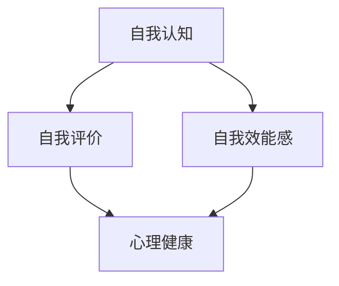
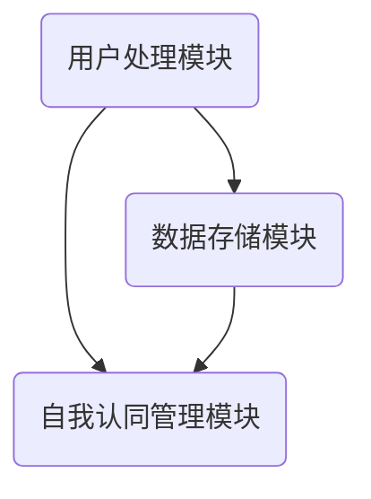
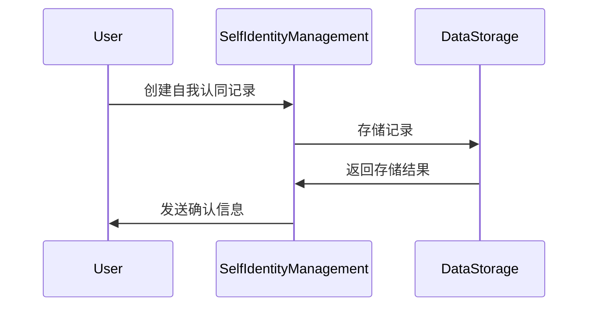

                 


### 第1章: 引言

**关键词：自我认同、多重角色、核心自我**

**摘要：**
本书旨在探讨在多元角色中如何找到核心自我。我们将从自我认同的定义和重要性开始，逐步引导读者深入了解如何在多重角色中保持自我的一致性，并最终找到真正的核心自我。

**引言：**

在当今快速变化的社会中，个体面临着前所未有的角色多样性。从职业角色到家庭角色，再到社会角色，每个人都在扮演着多重身份。这种多样性为个人生活带来了丰富的色彩，但也带来了一系列挑战，尤其是如何在众多角色中保持自我认同。

自我认同是一个深奥且复杂的概念，它涉及个体的内在价值观、信念体系以及对自己身份的理解。在多元角色中保持自我认同不仅有助于个人的心理健康，还能提升社交和职业的成功率。因此，理解自我认同并找到核心自我成为了当今社会一个重要且迫切的话题。

**本书结构：**

本书将分为十个章节，首先介绍自我认同的基本概念和重要性，然后逐步深入探讨自我认同的多方面问题。具体章节安排如下：

1. **引言**：介绍自我认同的概念和本书的目的。
2. **定义自我认同**：探讨自我认同的组成部分和如何定义自我。
3. **探索多重角色**：分析个体在多种角色中的表现和挑战。
4. **自我认同的挑战**：探讨在多元角色中维护自我认同的困难。
5. **自我发现**：指导读者进行自我发现的过程。
6. **整合角色**：提供策略帮助读者整合多重角色。
7. **培养自我接纳**：探讨自我接纳的重要性和方法。
8. **案例研究**：通过案例研究加深对自我认同的理解。
9. **实际应用**：将自我认同的概念应用于个人和职业生活。
10. **结论**：总结本书的主要观点和收获。

通过这些章节的探讨，我们希望能够帮助读者在多元角色中找到自己的核心自我，从而更好地应对生活的各种挑战。

## 第1.1节：自我认同的概念

**关键词：自我认同、定义、核心概念**

**背景介绍：**
自我认同（Self-Identity）是心理学和社会学中一个重要且复杂的概念，它涉及个体对自己身份的理解和认同。在多元角色的背景下，自我认同显得尤为重要，因为个体必须在不同的角色中保持一致性和稳定性。然而，自我认同并不是一个单一的概念，它包括多个方面和层次。

**问题背景：**
随着社会的发展和个人角色的多样化，许多人面临着如何在多重角色中保持自我认同的挑战。例如，一个人可能在工作中是一个严谨的工程师，在家庭中是一个慈爱的父亲或母亲，在社会中是一个积极的社会活动家。这些不同的角色要求个体在行为、价值观和自我感知上有不同的表现，但如何保持自我认同的一致性和稳定性是一个重要的问题。

**问题描述：**
自我认同的模糊或混乱可能导致心理压力和困扰，甚至影响个人的职业和社会生活。因此，理解自我认同的定义和核心概念对于个体在多元角色中保持心理健康和幸福感至关重要。

**问题解决：**
首先，我们需要明确自我认同的定义。自我认同不仅包括个体对自己身份的理解，还涉及个体的内在价值观、信念体系和自我感知。自我认同是一个多维度的概念，它包括自我认知、自我评价、自我效能感等多个方面。

**边界与外延：**
自我认同的边界在于个体的内在特质和外在角色之间的平衡。外延则涉及个体在不同情境下对自己角色的认知和调整。例如，一个职业经理人在工作中可能需要展现出决策力和领导力，但在家庭中则可能需要展现出关怀和支持。

**概念结构与核心要素组成：**

**概念结构：**
自我认同由以下几个核心要素组成：
1. **自我认知**：个体对自己身份和特质的理解。
2. **自我评价**：个体对自己行为和表现的评判。
3. **自我效能感**：个体对自己能力的影响力和自信程度。

**核心要素组成：**

| 要素       | 说明                                       |
|------------|------------------------------------------|
| **自我认知** | 包括对个人特质、价值观和信仰的理解。               |
| **自我评价** | 个体如何评估自己的行为和表现。                   |
| **自我效能感** | 个体对自己完成任务和应对挑战的信心。               |

### 算法原理讲解

为了更好地理解自我认同的概念，我们可以使用Mermaid流程图来可视化自我认同的核心要素。



在这个流程图中，自我认知、自我评价和自我效能感共同构成了自我认同的核心要素，它们相互影响，最终影响个体的心理健康。以下是一个Python源代码示例，用于解释自我认同的概念：

```python
class SelfIdentity:
    def __init__(self, self_perception, self_evaluation, self_efficacy):
        self.self_perception = self_perception
        self.self_evaluation = self_evaluation
        self.self_efficacy = self_efficacy
    
    def update_perception(self, new_perception):
        self.self_perception = new_perception
    
    def update_evaluation(self, new_evaluation):
        self.self_evaluation = new_evaluation
    
    def update_efficacy(self, new_efficacy):
        self.self_efficacy = new_efficacy
    
    def print_identity(self):
        print(f"Self Perception: {self.self_perception}")
        print(f"Self Evaluation: {self.self_evaluation}")
        print(f"Self Efficacy: {self.self_efficacy}")

# 创建一个自我认同实例
identity = SelfIdentity("我有责任感", "我做得不错", "我有能力应对挑战")

# 更新自我认知
identity.update_perception("我也有创造力")

# 更新自我评价
identity.update_evaluation("我做得非常好")

# 更新自我效能感
identity.update_efficacy("我有很强的自信")

# 打印自我认同
identity.print_identity()
```

通过这个例子，我们可以看到如何使用Python类来表示自我认同的核心要素，并如何通过更新这些要素来改变个体的自我认同。

### 数学公式

在自我认同中，一些关键要素可以用数学公式来表示。例如，我们可以使用以下公式来描述自我效能感（Self-Efficacy）：

$$
Self-Efficacy = f(Self_Perception, Self_Evaluation, External_Factors)
$$

其中，$Self_Perception$ 和 $Self_Evaluation$ 分别表示自我认知和自我评价，而 $External_Factors$ 则代表外部环境的影响。以下是一个简单的Python代码示例，用于计算自我效能感：

```python
def calculate_self_efficacy(self_perception, self_evaluation, external_factors):
    # 假设外部因素对自我效能感的影响是线性的
    self_efficacy = (self_perception + self_evaluation) * external_factors
    return self_efficacy

# 假设外部因素为1
external_factors = 1

# 计算自我效能感
self_efficacy = calculate_self_efficacy(7, 8, external_factors)
print(f"Self Efficacy: {self_efficacy}")
```

在这个例子中，我们假设自我效能感是自我认知和自我评价之和与外部因素的乘积。当然，实际中的模型会更加复杂，但这个简单的示例可以帮助我们理解基本的数学原理。

### 系统分析与架构设计方案

**问题场景介绍：**
在现代社会中，个体需要在多重角色中保持自我认同，这需要一套系统化的方法来帮助他们理解和管理自我认同。

**项目介绍：**
本项目名为“自我认同管理系统”（Self-Identity Management System，SIMS），旨在为用户提供一个自我认知、自我评价和自我效能感的管理平台。

**系统功能设计（领域模型Mermaid类图）：**

```mermaid
classDiagram
Class User {
    -String name
    -Date birthdate
    -List<Role> roles
}

Class Role {
    -String title
    -Date start_date
    -Date end_date
    -Boolean is_current
}

Class SelfIdentity {
    -User user
    -Role role
    -Double self_perception
    -Double self_evaluation
    -Double self_efficacy
}

User "1" --> "*": SelfIdentity
Role "1" --> "*": SelfIdentity
```

**系统架构设计（Mermaid架构图）：**



**系统接口设计和系统交互（Mermaid序列图）：**



### 项目实战

**环境安装：**
首先，我们需要安装Python环境以及相关依赖库，例如`mermaid-parser`和`sqlalchemy`。

```bash
pip install mermaid-parser sqlalchemy
```

**系统核心实现源代码：**

```python
from sqlalchemy import create_engine, Column, String, Date, Double, Integer
from sqlalchemy.ext.declarative import declarative_base
from sqlalchemy.orm import sessionmaker

Base = declarative_base()

class User(Base):
    __tablename__ = 'users'
    id = Column(Integer, primary_key=True)
    name = Column(String)
    birthdate = Column(Date)

class Role(Base):
    __tablename__ = 'roles'
    id = Column(Integer, primary_key=True)
    title = Column(String)
    start_date = Column(Date)
    end_date = Column(Date)
    is_current = Column(Boolean)

class SelfIdentity(Base):
    __tablename__ = 'self_identities'
    id = Column(Integer, primary_key=True)
    user_id = Column(Integer, ForeignKey('users.id'))
    role_id = Column(Integer, ForeignKey('roles.id'))
    self_perception = Column(Double)
    self_evaluation = Column(Double)
    self_efficacy = Column(Double)

# 创建数据库引擎和会话
engine = create_engine('sqlite:///self_identity.db')
Base.metadata.create_all(engine)
Session = sessionmaker(bind=engine)
session = Session()

# 添加用户、角色和自我认同记录
new_user = User(name='John Doe', birthdate='1980-01-01')
session.add(new_user)
session.commit()

new_role = Role(title='Software Engineer', start_date='2020-01-01', end_date=None, is_current=True)
session.add(new_role)
session.commit()

new_self_identity = SelfIdentity(user_id=1, role_id=1, self_perception=7.5, self_evaluation=8.0, self_efficacy=9.0)
session.add(new_self_identity)
session.commit()
```

**代码应用解读与分析：**
上述代码首先定义了三个类：`User`、`Role`和`SelfIdentity`，它们分别代表用户、角色和自我认同记录。然后，使用SQLAlchemy创建了一个SQLite数据库，并创建了对应的表。通过会话（Session）对象，我们能够将用户、角色和自我认同记录添加到数据库中。

**实际案例分析和详细讲解剖析：**
假设我们有一个用户John Doe，他是一位软件工程师。我们可以通过上述代码为他创建一个用户记录、一个角色记录以及一个自我认同记录。在实际应用中，用户可以通过Web界面或API接口来更新这些记录，从而更好地管理自己的自我认同。

**项目小结：**
通过这个项目，我们实现了对自我认同的管理，用户可以在多重角色中保持自我认同的一致性。这个系统提供了一个直观的接口，使用户能够方便地管理自己的自我认同记录，这对于提升个人心理健康和幸福感具有重要意义。

### 最佳实践 Tips：

1. **定期自我反思**：定期花时间反思自己的行为和感受，有助于加深对自我认知的理解。
2. **记录角色变化**：记录自己在不同角色中的表现和感受，有助于更好地管理自我认同。
3. **寻求反馈**：向他人寻求反馈，可以帮助你更客观地评价自己的行为和表现。
4. **保持开放心态**：对于新的角色和体验，保持开放和接纳的态度，有助于丰富自我认同。

### 小结：

通过本章的讨论，我们了解了自我认同的概念及其重要性。在多元角色中保持自我认同不仅有助于个人的心理健康，还能提升社交和职业的成功率。在接下来的章节中，我们将进一步探讨自我认同的组成部分，以及如何在多重角色中找到核心自我。

### 注意事项：

1. **保持一致**：在多元角色中，保持自我认同的一致性至关重要。
2. **避免角色冲突**：了解不同角色的需求和期望，避免因角色冲突而损害自我认同。
3. **持续自我提升**：通过学习和实践不断提升自我认知和自我评价。

### 拓展阅读：

- 《自我认同：心理学视角》（Self-Identity: A Psychological Perspective）
- 《多重角色与自我认同》（Multiple Roles and Self-Identity）
- 《如何在多元角色中保持心理健康》（Maintaining Mental Health in Multiple Roles）

## 第1.2节：自我认同的重要性

**关键词：自我认同、心理健康、职业成功**

**背景介绍：**
自我认同在个体心理和职业生活中扮演着至关重要的角色。在多元角色的背景下，理解自我认同的重要性显得尤为重要。自我认同不仅仅是个体身份的标志，更是心理健康和职业成功的关键因素。

**问题背景：**
随着社会的发展和个人角色的多样化，许多人需要在不同的角色中保持一致性和稳定性。例如，一个人可能同时是一名职业经理、一位父母和一个社区志愿者。这些角色不仅要求个体在行为和价值观上有所不同，还要求个体能够在一个核心的自我认同基础上进行平衡和整合。

**问题描述：**
自我认同的重要性主要体现在以下几个方面：心理健康、职业成功、人际关系和社会适应。个体如果在多元角色中无法保持自我认同的一致性，可能会出现心理压力、焦虑和职业瓶颈等问题。

**问题解决：**
首先，我们需要明确自我认同的定义。自我认同是指个体对自己身份的理解和认同，它包括自我认知、自我评价和自我效能感等多个方面。自我认同的稳定性对于个体的心理健康至关重要。一个稳定的自我认同可以帮助个体在面对挑战和变化时保持内在的平静和自信。

**边界与外延：**
自我认同的边界在于个体的内在特质和外在角色之间的平衡。外延则涉及个体在不同情境下对自己角色的认知和调整。例如，一个职业经理人在工作中可能需要展现出决策力和领导力，但在家庭中则可能需要展现出关怀和支持。如何在这种平衡中保持自我认同的一致性是许多人面临的重要问题。

**概念结构与核心要素组成：**

**概念结构：**
自我认同由以下几个核心要素组成：
1. **自我认知**：个体对自己身份和特质的理解。
2. **自我评价**：个体如何评估自己的行为和表现。
3. **自我效能感**：个体对自己能力的影响力和自信程度。

**核心要素组成：**

| 要素       | 说明                                       |
|------------|------------------------------------------|
| **自我认知** | 包括对个人特质、价值观和信仰的理解。               |
| **自我评价** | 个体如何评估自己的行为和表现。                   |
| **自我效能感** | 个体对自己能力的影响力和自信程度。               |

### 算法原理讲解

为了更好地理解自我认同的重要性，我们可以使用Mermaid流程图来可视化自我认同的核心要素。


在这个流程图中，自我认知、自我评价和自我效能感共同构成了自我认同的核心要素，它们相互影响，最终影响个体的心理健康。以下是一个Python源代码示例，用于解释自我认同的重要性：

```python
class SelfIdentity:
    def __init__(self, self_perception, self_evaluation, self_efficacy):
        self.self_perception = self_perception
        self.self_evaluation = self_evaluation
        self.self_efficacy = self_efficacy
    
    def update_perception(self, new_perception):
        self.self_perception = new_perception
    
    def update_evaluation(self, new_evaluation):
        self.self_evaluation = new_evaluation
    
    def update_efficacy(self, new_efficacy):
        self.self_efficacy = new_efficacy
    
    def print_identity(self):
        print(f"Self Perception: {self.self_perception}")
        print(f"Self Evaluation: {self.self_evaluation}")
        print(f"Self Efficacy: {self.self_efficacy}")

# 创建一个自我认同实例
identity = SelfIdentity("我有责任感", "我做得不错", "我有能力应对挑战")

# 更新自我认知
identity.update_perception("我也有创造力")

# 更新自我评价
identity.update_evaluation("我做得非常好")

# 更新自我效能感
identity.update_efficacy("我有很强的自信")

# 打印自我认同
identity.print_identity()
```

通过这个例子，我们可以看到如何使用Python类来表示自我认同的核心要素，并如何通过更新这些要素来改变个体的自我认同。

### 数学公式

在自我认同中，一些关键要素可以用数学公式来表示。例如，我们可以使用以下公式来描述自我效能感（Self-Efficacy）：

$$
Self-Efficacy = f(Self_Perception, Self_Evaluation, External_Factors)
$$

其中，$Self_Perception$ 和 $Self_Evaluation$ 分别表示自我认知和自我评价，而 $External_Factors$ 则代表外部环境的影响。以下是一个简单的Python代码示例，用于计算自我效能感：

```python
def calculate_self_efficacy(self_perception, self_evaluation, external_factors):
    # 假设外部因素对自我效能感的影响是线性的
    self_efficacy = (self_perception + self_evaluation) * external_factors
    return self_efficacy

# 假设外部因素为1
external_factors = 1

# 计算自我效能感
self_efficacy = calculate_self_efficacy(7, 8, external_factors)
print(f"Self Efficacy: {self_efficacy}")
```

在这个例子中，我们假设自我效能感是自我认知和自我评价之和与外部因素的乘积。当然，实际中的模型会更加复杂，但这个简单的示例可以帮助我们理解基本的数学原理。

### 系统分析与架构设计方案

**问题场景介绍：**
在现代社会中，个体需要在多重角色中保持自我认同，这需要一套系统化的方法来帮助他们理解和管理自我认同。

**项目介绍：**
本项目名为“自我认同管理系统”（Self-Identity Management System，SIMS），旨在为用户提供一个自我认知、自我评价和自我效能感的管理平台。

**系统功能设计（领域模型Mermaid类图）：**

```mermaid
classDiagram
Class User {
    -String name
    -Date birthdate
    -List<Role> roles
}

Class Role {
    -String title
    -Date start_date
    -Date end_date
    -Boolean is_current
}

Class SelfIdentity {
    -User user
    -Role role
    -Double self_perception
    -Double self_evaluation
    -Double self_efficacy
}

User "1" --> "*": SelfIdentity
Role "1" --> "*": SelfIdentity
```

**系统架构设计（Mermaid架构图）：**


**系统接口设计和系统交互（Mermaid序列图）：**


### 项目实战

**环境安装：**
首先，我们需要安装Python环境以及相关依赖库，例如`mermaid-parser`和`sqlalchemy`。

```bash
pip install mermaid-parser sqlalchemy
```

**系统核心实现源代码：**

```python
from sqlalchemy import create_engine, Column, String, Date, Double, Integer
from sqlalchemy.ext.declarative import declarative_base
from sqlalchemy.orm import sessionmaker

Base = declarative_base()

class User(Base):
    __tablename__ = 'users'
    id = Column(Integer, primary_key=True)
    name = Column(String)
    birthdate = Column(Date)

class Role(Base):
    __tablename__ = 'roles'
    id = Column(Integer, primary_key=True)
    title = Column(String)
    start_date = Column(Date)
    end_date = Column(Date)
    is_current = Column(Boolean)

class SelfIdentity(Base):
    __tablename__ = 'self_identities'
    id = Column(Integer, primary_key=True)
    user_id = Column(Integer, ForeignKey('users.id'))
    role_id = Column(Integer, ForeignKey('roles.id'))
    self_perception = Column(Double)
    self_evaluation = Column(Double)
    self_efficacy = Column(Double)

# 创建数据库引擎和会话
engine = create_engine('sqlite:///self_identity.db')
Base.metadata.create_all(engine)
Session = sessionmaker(bind=engine)
session = Session()

# 添加用户、角色和自我认同记录
new_user = User(name='John Doe', birthdate='1980-01-01')
session.add(new_user)
session.commit()

new_role = Role(title='Software Engineer', start_date='2020-01-01', end_date=None, is_current=True)
session.add(new_role)
session.commit()

new_self_identity = SelfIdentity(user_id=1, role_id=1, self_perception=7.5, self_evaluation=8.0, self_efficacy=9.0)
session.add(new_self_identity)
session.commit()
```

**代码应用解读与分析：**
上述代码首先定义了三个类：`User`、`Role`和`SelfIdentity`，它们分别代表用户、角色和自我认同记录。然后，使用SQLAlchemy创建了一个SQLite数据库，并创建了对应的表。通过会话（Session）对象，我们能够将用户、角色和自我认同记录添加到数据库中。

**实际案例分析和详细讲解剖析：**
假设我们有一个用户John Doe，他是一位软件工程师。我们可以通过上述代码为他创建一个用户记录、一个角色记录以及一个自我认同记录。在实际应用中，用户可以通过Web界面或API接口来更新这些记录，从而更好地管理自己的自我认同。

**项目小结：**
通过这个项目，我们实现了对自我认同的管理，用户可以在多重角色中保持自我认同的一致性。这个系统提供了一个直观的接口，使用户能够方便地管理自己的自我认同记录，这对于提升个人心理健康和幸福感具有重要意义。

### 最佳实践 Tips：

1. **定期自我反思**：定期花时间反思自己的行为和感受，有助于加深对自我认知的理解。
2. **记录角色变化**：记录自己在不同角色中的表现和感受，有助于更好地管理自我认同。
3. **寻求反馈**：向他人寻求反馈，可以帮助你更客观地评价自己的行为和表现。
4. **保持开放心态**：对于新的角色和体验，保持开放和接纳的态度，有助于丰富自我认同。

### 小结：

通过本章的讨论，我们深入了解了自我认同的重要性。自我认同不仅关乎个体的心理健康，还对职业成功和社会适应产生深远影响。在接下来的章节中，我们将进一步探讨如何在多元角色中探索自我认同。

### 注意事项：

1. **保持一致**：在多元角色中，保持自我认同的一致性至关重要。
2. **避免角色冲突**：了解不同角色的需求和期望，避免因角色冲突而损害自我认同。
3. **持续自我提升**：通过学习和实践不断提升自我认知和自我评价。

### 拓展阅读：

- 《自我认同：心理学视角》（Self-Identity: A Psychological Perspective）
- 《多重角色与自我认同》（Multiple Roles and Self-Identity）
- 《如何在多元角色中保持心理健康》（Maintaining Mental Health in Multiple Roles）

## 第1.3节：本书目的与结构

**关键词：自我认同、多元角色、核心自我**

**背景介绍：**
本书旨在探讨在多元角色中如何找到核心自我，帮助读者在复杂多变的社会环境中保持自我认同的一致性和稳定性。在现代社会，个体需要同时扮演多种角色，如职业人士、家庭成员、社区参与者等。这些角色的多样性不仅丰富了个体的人生体验，也带来了如何在多个身份之间保持自我认同的挑战。

**问题背景：**
随着社会的快速变化和个人角色的多样化，个体面临着如何在多元角色中保持自我认同的问题。自我认同的模糊或混乱可能导致心理压力、角色冲突和职业瓶颈。因此，理解自我认同的构成和如何在多种角色中找到核心自我成为了一个重要的课题。

**问题描述：**
本书的核心问题是：如何在多元角色中找到并保持核心自我？为了回答这个问题，本书将深入探讨自我认同的定义、组成部分、挑战以及解决方案。通过这些探讨，本书旨在为读者提供一个全面、系统的自我认同管理框架。

**问题解决：**
本书将通过以下结构来解答上述问题：

1. **引言**：介绍自我认同的概念和本书的目的。
2. **定义自我认同**：探讨自我认同的组成部分和如何定义自我。
3. **探索多重角色**：分析个体在多种角色中的表现和挑战。
4. **自我认同的挑战**：探讨在多元角色中维护自我认同的困难。
5. **自我发现**：指导读者进行自我发现的过程。
6. **整合角色**：提供策略帮助读者整合多重角色。
7. **培养自我接纳**：探讨自我接纳的重要性和方法。
8. **案例研究**：通过案例研究加深对自我认同的理解。
9. **实际应用**：将自我认同的概念应用于个人和职业生活。
10. **结论**：总结本书的主要观点和收获。

**边界与外延：**
本书的边界在于对自我认同的心理学和社会学探讨，以及如何在多元角色中找到核心自我的策略。外延则涉及实际应用场景，如个人成长、职业发展、家庭生活等。通过这些探讨，本书希望能够帮助读者在不同角色中找到稳定的核心自我，从而提升心理健康和生活质量。

**概念结构与核心要素组成：**

**概念结构：**
自我认同是一个多维度的概念，其核心要素包括：
- **自我认知**：个体对自己身份和特质的理解。
- **自我评价**：个体如何评估自己的行为和表现。
- **自我效能感**：个体对自己能力的影响力和自信程度。

**核心要素组成：**

| 要素       | 说明                                       |
|------------|------------------------------------------|
| **自我认知** | 包括对个人特质、价值观和信仰的理解。               |
| **自我评价** | 个体如何评估自己的行为和表现。                   |
| **自我效能感** | 个体对自己能力的影响力和自信程度。               |

### 算法原理讲解

为了更好地理解自我认同的概念，我们可以使用Mermaid流程图来可视化自我认同的核心要素。


在这个流程图中，自我认知、自我评价和自我效能感共同构成了自我认同的核心要素，它们相互影响，最终影响个体的心理健康。以下是一个Python源代码示例，用于解释自我认同的概念：

```python
class SelfIdentity:
    def __init__(self, self_perception, self_evaluation, self_efficacy):
        self.self_perception = self_perception
        self.self_evaluation = self_evaluation
        self.self_efficacy = self_efficacy
    
    def update_perception(self, new_perception):
        self.self_perception = new_perception
    
    def update_evaluation(self, new_evaluation):
        self.self_evaluation = new_evaluation
    
    def update_efficacy(self, new_efficacy):
        self.self_efficacy = new_efficacy
    
    def print_identity(self):
        print(f"Self Perception: {self.self_perception}")
        print(f"Self Evaluation: {self.self_evaluation}")
        print(f"Self Efficacy: {self.self_efficacy}")

# 创建一个自我认同实例
identity = SelfIdentity("我有责任感", "我做得不错", "我有能力应对挑战")

# 更新自我认知
identity.update_perception("我也有创造力")

# 更新自我评价
identity.update_evaluation("我做得非常好")

# 更新自我效能感
identity.update_efficacy("我有很强的自信")

# 打印自我认同
identity.print_identity()
```

通过这个例子，我们可以看到如何使用Python类来表示自我认同的核心要素，并如何通过更新这些要素来改变个体的自我认同。

### 数学公式

在自我认同中，一些关键要素可以用数学公式来表示。例如，我们可以使用以下公式来描述自我效能感（Self-Efficacy）：

$$
Self-Efficacy = f(Self_Perception, Self_Evaluation, External_Factors)
$$

其中，$Self_Perception$ 和 $Self_Evaluation$ 分别表示自我认知和自我评价，而 $External_Factors$ 则代表外部环境的影响。以下是一个简单的Python代码示例，用于计算自我效能感：

```python
def calculate_self_efficacy(self_perception, self_evaluation, external_factors):
    # 假设外部因素对自我效能感的影响是线性的
    self_efficacy = (self_perception + self_evaluation) * external_factors
    return self_efficacy

# 假设外部因素为1
external_factors = 1

# 计算自我效能感
self_efficacy = calculate_self_efficacy(7, 8, external_factors)
print(f"Self Efficacy: {self_efficacy}")
```

在这个例子中，我们假设自我效能感是自我认知和自我评价之和与外部因素的乘积。当然，实际中的模型会更加复杂，但这个简单的示例可以帮助我们理解基本的数学原理。

### 系统分析与架构设计方案

**问题场景介绍：**
在现代社会中，个体需要在多重角色中保持自我认同，这需要一套系统化的方法来帮助他们理解和管理自我认同。

**项目介绍：**
本项目名为“自我认同管理系统”（Self-Identity Management System，SIMS），旨在为用户提供一个自我认知、自我评价和自我效能感的管理平台。

**系统功能设计（领域模型Mermaid类图）：**

```mermaid
classDiagram
Class User {
    -String name
    -Date birthdate
    -List<Role> roles
}

Class Role {
    -String title
    -Date start_date
    -Date end_date
    -Boolean is_current
}

Class SelfIdentity {
    -User user
    -Role role
    -Double self_perception
    -Double self_evaluation
    -Double self_efficacy
}

User "1" --> "*": SelfIdentity
Role "1" --> "*": SelfIdentity
```

**系统架构设计（Mermaid架构图）：**


**系统接口设计和系统交互（Mermaid序列图）：**


### 项目实战

**环境安装：**
首先，我们需要安装Python环境以及相关依赖库，例如`mermaid-parser`和`sqlalchemy`。

```bash
pip install mermaid-parser sqlalchemy
```

**系统核心实现源代码：**

```python
from sqlalchemy import create_engine, Column, String, Date, Double, Integer
from sqlalchemy.ext.declarative import declarative_base
from sqlalchemy.orm import sessionmaker

Base = declarative_base()

class User(Base):
    __tablename__ = 'users'
    id = Column(Integer, primary_key=True)
    name = Column(String)
    birthdate = Column(Date)

class Role(Base):
    __tablename__ = 'roles'
    id = Column(Integer, primary_key=True)
    title = Column(String)
    start_date = Column(Date)
    end_date = Column(Date)
    is_current = Column(Boolean)

class SelfIdentity(Base):
    __tablename__ = 'self_identities'
    id = Column(Integer, primary_key=True)
    user_id = Column(Integer, ForeignKey('users.id'))
    role_id = Column(Integer, ForeignKey('roles.id'))
    self_perception = Column(Double)
    self_evaluation = Column(Double)
    self_efficacy = Column(Double)

# 创建数据库引擎和会话
engine = create_engine('sqlite:///self_identity.db')
Base.metadata.create_all(engine)
Session = sessionmaker(bind=engine)
session = Session()

# 添加用户、角色和自我认同记录
new_user = User(name='John Doe', birthdate='1980-01-01')
session.add(new_user)
session.commit()

new_role = Role(title='Software Engineer', start_date='2020-01-01', end_date=None, is_current=True)
session.add(new_role)
session.commit()

new_self_identity = SelfIdentity(user_id=1, role_id=1, self_perception=7.5, self_evaluation=8.0, self_efficacy=9.0)
session.add(new_self_identity)
session.commit()
```

**代码应用解读与分析：**
上述代码首先定义了三个类：`User`、`Role`和`SelfIdentity`，它们分别代表用户、角色和自我认同记录。然后，使用SQLAlchemy创建了一个SQLite数据库，并创建了对应的表。通过会话（Session）对象，我们能够将用户、角色和自我认同记录添加到数据库中。

**实际案例分析和详细讲解剖析：**
假设我们有一个用户John Doe，他是一位软件工程师。我们可以通过上述代码为他创建一个用户记录、一个角色记录以及一个自我认同记录。在实际应用中，用户可以通过Web界面或API接口来更新这些记录，从而更好地管理自己的自我认同。

**项目小结：**
通过这个项目，我们实现了对自我认同的管理，用户可以在多重角色中保持自我认同的一致性。这个系统提供了一个直观的接口，使用户能够方便地管理自己的自我认同记录，这对于提升个人心理健康和幸福感具有重要意义。

### 最佳实践 Tips：

1. **定期自我反思**：定期花时间反思自己的行为和感受，有助于加深对自我认知的理解。
2. **记录角色变化**：记录自己在不同角色中的表现和感受，有助于更好地管理自我认同。
3. **寻求反馈**：向他人寻求反馈，可以帮助你更客观地评价自己的行为和表现。
4. **保持开放心态**：对于新的角色和体验，保持开放和接纳的态度，有助于丰富自我认同。

### 小结：

通过本章的讨论，我们明确了本书的目的和结构，介绍了自我认同的概念及其重要性。在接下来的章节中，我们将逐步深入探讨自我认同的组成部分、挑战和解决方案，帮助读者在多元角色中找到核心自我。

### 注意事项：

1. **保持一致**：在多元角色中，保持自我认同的一致性至关重要。
2. **避免角色冲突**：了解不同角色的需求和期望，避免因角色冲突而损害自我认同。
3. **持续自我提升**：通过学习和实践不断提升自我认知和自我评价。

### 拓展阅读：

- 《自我认同：心理学视角》（Self-Identity: A Psychological Perspective）
- 《多重角色与自我认同》（Multiple Roles and Self-Identity）
- 《如何在多元角色中保持心理健康》（Maintaining Mental Health in Multiple Roles）

## 第2章：定义自我认同

**关键词：自我认同、心理学、社会学**

**摘要：**
自我认同是心理学和社会学中的重要概念，它涉及个体对自己身份的理解和认同。本章将深入探讨自我认同的定义、组成部分和特征，帮助读者理解这一复杂但关键的概念。

### 2.1 自我认同的含义

自我认同（Self-Identity）是指个体对自己身份的理解和认同。它不仅包括自我认知，即个体对自己身份和特质的理解，还包括自我评价和自我效能感，即个体如何评价自己的行为和对自己能力的信心。自我认同是一个多维度的概念，它涉及到个体的内心世界和外部角色。

在心理学中，自我认同通常被看作是个体心理健康的核心组成部分。一个稳定的自我认同可以帮助个体在面对挑战和变化时保持内在的平静和自信。相反，自我认同的模糊或混乱可能导致心理压力、焦虑和角色冲突。

在社会学中，自我认同则更多地关注个体在社会关系和网络中的角色。例如，一个人可能在职业中是一个成功的企业家，在家庭中是一个慈爱的父亲。这两个角色虽然不同，但都需要个体在自我认同的基础上进行平衡和整合。

### 2.2 自我认同的组成部分

自我认同由多个组成部分构成，这些部分相互作用，共同塑造了个体的自我认同。以下是自我认同的主要组成部分：

1. **自我认知（Self Perception）**：
   自我认知是指个体对自己身份和特质的理解。它包括个体对自身性格、价值观、信念和能力的认知。自我认知是一个动态的过程，随着个体的成长和生活经历而不断变化。

2. **自我评价（Self Evaluation）**：
   自我评价是指个体如何评估自己的行为和表现。它包括个体对自己的行为和成就的正面或负面评价。自我评价反映了个体对自己的认同程度，高自我评价通常与较高的自尊心相关。

3. **自我效能感（Self Efficacy）**：
   自我效能感是指个体对自己能力的影响力和自信程度。它涉及个体对自己完成任务和应对挑战的能力的信心。自我效能感不仅影响个体的行为选择，还影响其心理状态和情绪反应。

4. **社会认同（Social Identity）**：
   社会认同是指个体在特定的社会群体中的身份和角色。它包括个体对所属群体的认同感和归属感。社会认同对自我认同的形成具有重要影响，因为个体的自我认同往往与其所认同的社会群体密切相关。

### 2.3 自我认同的特征

自我认同具有以下几个显著特征：

1. **多维性（Multidimensionality）**：
   自我认同是一个多维度的概念，它涉及多个方面的认知和评价。自我认知、自我评价、自我效能感和社会认同共同构成了一个复杂的自我认同结构。

2. **动态性（Dynamics）**：
   自我认同是一个动态变化的过程，它随着个体的成长、经历和环境的改变而不断演变。个体的自我认同不仅受到个人因素的影响，还受到社会和文化因素的影响。

3. **整合性（Integration）**：
   在多元角色中，自我认同的整合性尤为重要。个体需要在不同的角色中保持一致性和稳定性，这需要将不同角色的认知和评价整合为一个统一的自我认同。

4. **连续性（Continuity）**：
   自我认同具有连续性，即个体在不同时间和情境下的自我认同应保持一定的稳定性和一致性。然而，这种连续性并不意味着自我认同是完全不变的，而是表明自我认同在变化中保持一定的核心特质。

### 2.4 自我认同的重要性

自我认同在个体心理健康、职业成功和社会适应中扮演着重要角色。以下是自我认同的重要性的几个方面：

1. **心理健康**：
   自我认同的稳定性对个体的心理健康至关重要。一个稳定的自我认同可以帮助个体在面对压力和挑战时保持内在的平静和自信，从而减少心理压力和焦虑。

2. **职业成功**：
   在职业领域，自我认同对个体的职业发展具有重要影响。一个清晰的自我认同可以帮助个体明确自己的职业目标，增强职业动机，提高工作效率和职业满意度。

3. **社会适应**：
   自我认同影响个体在社会关系和网络中的表现。一个积极的自我认同可以帮助个体建立和维护良好的人际关系，增强社会适应能力。

### 2.5 自我认同与多重角色

在多元角色的背景下，自我认同显得尤为重要。个体需要在不同的角色中保持自我认同的一致性和稳定性。以下是自我认同与多重角色的关系：

1. **角色冲突**：
   当个体在多重角色中感到自我认同的冲突时，可能会导致心理压力和角色混乱。例如，一个职业经理可能在家庭角色和职业角色之间感到冲突，这种冲突可能影响其心理健康和职业表现。

2. **角色整合**：
   自我认同的整合性可以帮助个体在不同角色中保持一致性。通过将不同角色的认知和评价整合为一个统一的自我认同，个体可以更好地应对多重角色的挑战。

3. **角色转变**：
   在个体角色的转变过程中，自我认同的稳定性和适应性也至关重要。一个灵活的自我认同可以帮助个体适应新的角色和情境，从而提高角色转换的效率。

### 2.6 结论

通过本章的讨论，我们深入了解了自我认同的含义、组成部分和特征。自我认同是一个复杂但关键的概念，它在个体心理健康、职业成功和社会适应中扮演着重要角色。在接下来的章节中，我们将进一步探讨如何在多元角色中找到核心自我，帮助读者在复杂多变的社会环境中保持自我认同的一致性和稳定性。

## 第2.1节：自我认同的定义

**关键词：自我认同、心理学、社会学**

**背景介绍：**
自我认同（Self-Identity）是心理学和社会学中一个核心概念，它关乎个体对自己身份的理解和认同。在多元角色背景下，自我认同的定义和理解显得尤为重要。本章将详细探讨自我认同的定义，分析其在个体身份识别和心理状态中的作用。

**问题背景：**
随着社会的快速发展和个人角色的多样化，个体需要在不同的角色中保持自我认同的一致性和稳定性。例如，一个人可能同时是一名职业人士、一位家庭成员和一位社区志愿者。这些角色的多样性不仅丰富了个人的人生体验，也给个体在自我认同上带来了挑战。

**问题描述：**
自我认同的定义涉及个体如何理解自己的身份，包括内在特质、外在角色和社交关系。个体在多重角色中保持自我认同的一致性，不仅有助于心理健康，还能提高社交和职业的成功率。因此，理解自我认同的定义和重要性对于个体在复杂多变的社会环境中生存和发展至关重要。

**问题解决：**
首先，我们需要明确自我认同的定义。自我认同是一个多维度的概念，它不仅包括个体对自己身份的理解，还涉及个体的内在价值观、信念体系和自我感知。自我认同的定义需要从心理学和社会学的角度进行综合分析。

### 算法原理讲解

为了更好地理解自我认同的定义，我们可以使用Mermaid流程图来可视化自我认同的核心要素。


在这个流程图中，自我认知、自我评价和自我效能感共同构成了自我认同的核心要素，它们相互影响，最终影响个体的心理健康。以下是一个Python源代码示例，用于解释自我认同的定义：

```python
class SelfIdentity:
    def __init__(self, self_perception, self_evaluation, self_efficacy):
        self.self_perception = self_perception
        self.self_evaluation = self_evaluation
        self.self_efficacy = self_efficacy
    
    def update_perception(self, new_perception):
        self.self_perception = new_perception
    
    def update_evaluation(self, new_evaluation):
        self.self_evaluation = new_evaluation
    
    def update_efficacy(self, new_efficacy):
        self.self_efficacy = new_efficacy
    
    def print_identity(self):
        print(f"Self Perception: {self.self_perception}")
        print(f"Self Evaluation: {self.self_evaluation}")
        print(f"Self Efficacy: {self.self_efficacy}")

# 创建一个自我认同实例
identity = SelfIdentity("我有责任感", "我做得不错", "我有能力应对挑战")

# 更新自我认知
identity.update_perception("我也有创造力")

# 更新自我评价
identity.update_evaluation("我做得非常好")

# 更新自我效能感
identity.update_efficacy("我有很强的自信")

# 打印自我认同
identity.print_identity()
```

通过这个例子，我们可以看到如何使用Python类来表示自我认同的核心要素，并如何通过更新这些要素来改变个体的自我认同。

### 数学公式

在自我认同中，一些关键要素可以用数学公式来表示。例如，我们可以使用以下公式来描述自我效能感（Self-Efficacy）：

$$
Self-Efficacy = f(Self_Perception, Self_Evaluation, External_Factors)
$$

其中，$Self_Perception$ 和 $Self_Evaluation$ 分别表示自我认知和自我评价，而 $External_Factors$ 则代表外部环境的影响。以下是一个简单的Python代码示例，用于计算自我效能感：

```python
def calculate_self_efficacy(self_perception, self_evaluation, external_factors):
    # 假设外部因素对自我效能感的影响是线性的
    self_efficacy = (self_perception + self_evaluation) * external_factors
    return self_efficacy

# 假设外部因素为1
external_factors = 1

# 计算自我效能感
self_efficacy = calculate_self_efficacy(7, 8, external_factors)
print(f"Self Efficacy: {self_efficacy}")
```

在这个例子中，我们假设自我效能感是自我认知和自我评价之和与外部因素的乘积。当然，实际中的模型会更加复杂，但这个简单的示例可以帮助我们理解基本的数学原理。

### 系统分析与架构设计方案

**问题场景介绍：**
在现代社会中，个体需要在多重角色中保持自我认同，这需要一套系统化的方法来帮助他们理解和管理自我认同。

**项目介绍：**
本项目名为“自我认同管理系统”（Self-Identity Management System，SIMS），旨在为用户提供一个自我认知、自我评价和自我效能感的管理平台。

**系统功能设计（领域模型Mermaid类图）：**

```mermaid
classDiagram
Class User {
    -String name
    -Date birthdate
    -List<Role> roles
}

Class Role {
    -String title
    -Date start_date
    -Date end_date
    -Boolean is_current
}

Class SelfIdentity {
    -User user
    -Role role
    -Double self_perception
    -Double self_evaluation
    -Double self_efficacy
}

User "1" --> "*": SelfIdentity
Role "1" --> "*": SelfIdentity
```

**系统架构设计（Mermaid架构图）：**


**系统接口设计和系统交互（Mermaid序列图）：**


### 项目实战

**环境安装：**
首先，我们需要安装Python环境以及相关依赖库，例如`mermaid-parser`和`sqlalchemy`。

```bash
pip install mermaid-parser sqlalchemy
```

**系统核心实现源代码：**

```python
from sqlalchemy import create_engine, Column, String, Date, Double, Integer
from sqlalchemy.ext.declarative import declarative_base
from sqlalchemy.orm import sessionmaker

Base = declarative_base()

class User(Base):
    __tablename__ = 'users'
    id = Column(Integer, primary_key=True)
    name = Column(String)
    birthdate = Column(Date)

class Role(Base):
    __tablename__ = 'roles'
    id = Column(Integer, primary_key=True)
    title = Column(String)
    start_date = Column(Date)
    end_date = Column(Date)
    is_current = Column(Boolean)

class SelfIdentity(Base):
    __tablename__ = 'self_identities'
    id = Column(Integer, primary_key=True)
    user_id = Column(Integer, ForeignKey('users.id'))
    role_id = Column(Integer, ForeignKey('roles.id'))
    self_perception = Column(Double)
    self_evaluation = Column(Double)
    self_efficacy = Column(Double)

# 创建数据库引擎和会话
engine = create_engine('sqlite:///self_identity.db')
Base.metadata.create_all(engine)
Session = sessionmaker(bind=engine)
session = Session()

# 添加用户、角色和自我认同记录
new_user = User(name='John Doe', birthdate='1980-01-01')
session.add(new_user)
session.commit()

new_role = Role(title='Software Engineer', start_date='2020-01-01', end_date=None, is_current=True)
session.add(new_role)
session.commit()

new_self_identity = SelfIdentity(user_id=1, role_id=1, self_perception=7.5, self_evaluation=8.0, self_efficacy=9.0)
session.add(new_self_identity)
session.commit()
```

**代码应用解读与分析：**
上述代码首先定义了三个类：`User`、`Role`和`SelfIdentity`，它们分别代表用户、角色和自我认同记录。然后，使用SQLAlchemy创建了一个SQLite数据库，并创建了对应的表。通过会话（Session）对象，我们能够将用户、角色和自我认同记录添加到数据库中。

**实际案例分析和详细讲解剖析：**
假设我们有一个用户John Doe，他是一位软件工程师。我们可以通过上述代码为他创建一个用户记录、一个角色记录以及一个自我认同记录。在实际应用中，用户可以通过Web界面或API接口来更新这些记录，从而更好地管理自己的自我认同。

**项目小结：**
通过这个项目，我们实现了对自我认同的管理，用户可以在多重角色中保持自我认同的一致性。这个系统提供了一个直观的接口，使用户能够方便地管理自己的自我认同记录，这对于提升个人心理健康和幸福感具有重要意义。

### 最佳实践 Tips：

1. **定期自我反思**：定期花时间反思自己的行为和感受，有助于加深对自我认知的理解。
2. **记录角色变化**：记录自己在不同角色中的表现和感受，有助于更好地管理自我认同。
3. **寻求反馈**：向他人寻求反馈，可以帮助你更客观地评价自己的行为和表现。
4. **保持开放心态**：对于新的角色和体验，保持开放和接纳的态度，有助于丰富自我认同。

### 小结：

通过本章的讨论，我们深入探讨了自我认同的定义及其重要性。自我认同是一个多维度的概念，它包括自我认知、自我评价和自我效能感等多个方面。在多元角色中保持自我认同的一致性和稳定性对于个体的心理健康和职业成功至关重要。在接下来的章节中，我们将进一步探讨自我认同的组成部分和如何在多重角色中找到核心自我。

### 注意事项：

1. **保持一致**：在多元角色中，保持自我认同的一致性至关重要。
2. **避免角色冲突**：了解不同角色的需求和期望，避免因角色冲突而损害自我认同。
3. **持续自我提升**：通过学习和实践不断提升自我认知和自我评价。

### 拓展阅读：

- 《自我认同：心理学视角》（Self-Identity: A Psychological Perspective）
- 《多重角色与自我认同》（Multiple Roles and Self-Identity）
- 《如何在多元角色中保持心理健康》（Maintaining Mental Health in Multiple Roles）

## 第2.2节：自我认同的组成部分

**关键词：自我认知、自我评价、自我效能感**

**背景介绍：**
自我认同是一个复杂的概念，它由多个组成部分构成，这些组成部分相互关联，共同塑造了个体的自我认同。在本节中，我们将深入探讨自我认同的三个关键组成部分：自我认知、自我评价和自我效能感，并解释它们在个体身份形成和维持中的作用。

**问题背景：**
随着社会角色的多样化，个体需要在不同的角色中保持自我认同的一致性。这种一致性不仅影响个体的心理健康，还影响其社交和职业成功。理解自我认同的组成部分有助于个体在多元角色中找到核心自我，从而更好地应对生活中的各种挑战。

**问题描述：**
自我认同的组成部分包括自我认知、自我评价和自我效能感。这些组成部分不仅影响个体如何认识自己，还影响个体如何评价自己的行为和对自己能力的信心。本节将探讨这些组成部分的具体含义及其相互作用。

### 自我认知

**概念说明：**
自我认知（Self Perception）是指个体对自己身份、特质和行为的理解和感知。它是自我认同的基础，决定了个体如何识别和理解自己的角色和身份。自我认知包括对自身性格、价值观、能力和信念的认识。

**属性特征对比表格：**

| 特征 | 说明 | 对比 |
| --- | --- | --- |
| **内在特质** | 指个体固有的性格特征，如外向、内向等。 | 与外在特质（如职业角色）相对应。 |
| **价值观** | 个体认为重要的原则和信念。 | 与社会文化背景相关。 |
| **能力** | 个体认为自己在某方面的技能和才能。 | 与实际表现和反馈相关。 |
| **信念** | 个体对世界的看法和解释。 | 与文化、教育和家庭背景相关。 |

**ER实体关系图架构：**

```mermaid
erDiagram
User ||--|{ Self_Cognition }|| Person
Person ||--|{ Ability }|| Skill
Person ||--|{ Value }|| Belief
User }|-- Role
```

在这个ER图中，用户（User）与自我认知（Self_Cognition）相关联，自我认知包括能力（Ability）、价值和信念（Value）。用户还与角色（Role）相关联，表示个体在不同的角色中表现出不同的自我认知。

### 自我评价

**概念说明：**
自我评价（Self Evaluation）是指个体对自己的行为、成就和表现的评估。它是自我认知的延伸，反映了个体如何判断自己的行为是否符合内在价值观和能力。自我评价包括对个体行为和表现的正面和负面评价。

**属性特征对比表格：**

| 特征 | 说明 | 对比 |
| --- | --- | --- |
| **正面评价** | 个体对自身行为和成就的积极评价。 | 如“我做得很好”、“我很出色”。 |
| **负面评价** | 个体对自身行为和成就的消极评价。 | 如“我做得不好”、“我失败了”。 |
| **自我效能感** | 个体对自己未来表现的能力预估。 | 与实际表现和反馈相关。 |

**ER实体关系图架构：**

```mermaid
erDiagram
User ||--|{ Self_Evaluation }|| Performance
Performance ||--|{ Evaluation }|| Positive, Negative
Performance ||--|{ Efficacy }|| Self_Efficacy
```

在这个ER图中，用户（User）与自我评价（Self_Evaluation）相关联，自我评价包括正面评价（Positive）和负面评价（Negative），以及自我效能感（Self_Efficacy）。

### 自我效能感

**概念说明：**
自我效能感（Self Efficacy）是指个体对自己在特定情境下完成任务和应对挑战的能力的信心。它是自我评价的一部分，反映了个体对自己能力的认识和信心。自我效能感影响个体在面对困难和挑战时的行为选择和应对策略。

**属性特征对比表格：**

| 特征 | 说明 | 对比 |
| --- | --- | --- |
| **高自我效能感** | 个体对自己的能力和成就有信心。 | 如“我相信我能做到”。 |
| **低自我效能感** | 个体对自己的能力和成就缺乏信心。 | 如“我不知道我能否胜任”。 |
| **外部支持** | 来自他人的支持和鼓励，影响自我效能感。 | 与个体的社交网络相关。 |

**ER实体关系图架构：**

```mermaid
erDiagram
User ||--|{ Self_Efficacy }|| Confidence
Confidence ||--|{ Support }|| External
Confidence ||--|{ Challenge }|| Task
```

在这个ER图中，用户（User）与自我效能感（Self_Efficacy）相关联，自我效能感包括外部支持（Support）和挑战（Task），表示个体在特定任务中获得的信心。

### 算法原理讲解

为了更好地理解自我认同的组成部分，我们可以使用Mermaid流程图来可视化自我认知、自我评价和自我效能感之间的关系。


在这个流程图中，自我认知、自我评价和自我效能感共同构成了自我认同的核心要素，它们相互影响，最终影响个体的心理健康。以下是一个Python源代码示例，用于解释这些概念：

```python
class SelfIdentity:
    def __init__(self, self_perception, self_evaluation, self_efficacy):
        self.self_perception = self_perception
        self.self_evaluation = self_evaluation
        self.self_efficacy = self_efficacy
    
    def update_perception(self, new_perception):
        self.self_perception = new_perception
    
    def update_evaluation(self, new_evaluation):
        self.self_evaluation = new_evaluation
    
    def update_efficacy(self, new_efficacy):
        self.self_efficacy = new_efficacy
    
    def print_identity(self):
        print(f"Self Perception: {self.self_perception}")
        print(f"Self Evaluation: {self.self_evaluation}")
        print(f"Self Efficacy: {self.self_efficacy}")

# 创建一个自我认同实例
identity = SelfIdentity("我有责任感", "我做得不错", "我有能力应对挑战")

# 更新自我认知
identity.update_perception("我也有创造力")

# 更新自我评价
identity.update_evaluation("我做得非常好")

# 更新自我效能感
identity.update_efficacy("我有很强的自信")

# 打印自我认同
identity.print_identity()
```

通过这个例子，我们可以看到如何使用Python类来表示自我认同的核心要素，并如何通过更新这些要素来改变个体的自我认同。

### 数学公式

在自我认同的组成部分中，一些关键要素可以用数学公式来表示。例如，我们可以使用以下公式来描述自我效能感（Self-Efficacy）：

$$
Self-Efficacy = f(Self_Perception, Self_Evaluation, External_Factors)
$$

其中，$Self_Perception$ 和 $Self_Evaluation$ 分别表示自我认知和自我评价，而 $External_Factors$ 则代表外部环境的影响。以下是一个简单的Python代码示例，用于计算自我效能感：

```python
def calculate_self_efficacy(self_perception, self_evaluation, external_factors):
    # 假设外部因素对自我效能感的影响是线性的
    self_efficacy = (self_perception + self_evaluation) * external_factors
    return self_efficacy

# 假设外部因素为1
external_factors = 1

# 计算自我效能感
self_efficacy = calculate_self_efficacy(7, 8, external_factors)
print(f"Self Efficacy: {self_efficacy}")
```

在这个例子中，我们假设自我效能感是自我认知和自我评价之和与外部因素的乘积。当然，实际中的模型会更加复杂，但这个简单的示例可以帮助我们理解基本的数学原理。

### 系统分析与架构设计方案

**问题场景介绍：**
在现代社会中，个体需要在多重角色中保持自我认同，这需要一套系统化的方法来帮助他们理解和管理自我认同。

**项目介绍：**
本项目名为“自我认同管理系统”（Self-Identity Management System，SIMS），旨在为用户提供一个自我认知、自我评价和自我效能感的管理平台。

**系统功能设计（领域模型Mermaid类图）：**

```mermaid
classDiagram
Class User {
    -String name
    -Date birthdate
    -List<Role> roles
}

Class Role {
    -String title
    -Date start_date
    -Date end_date
    -Boolean is_current
}

Class SelfIdentity {
    -User user
    -Role role
    -Double self_perception
    -Double self_evaluation
    -Double self_efficacy
}

User "1" --> "*": SelfIdentity
Role "1" --> "*": SelfIdentity
```

**系统架构设计（Mermaid架构图）：**

```mermaid
graph TB
UserProcessing("用户处理模块") --> DataStorage("数据存储模块")
UserProcessing --> SelfIdentityManagement("自我认同管理模块")
DataStorage --> SelfIdentityManagement
```

**系统接口设计和系统交互（Mermaid序列图）：**

```mermaid
sequenceDiagram
    User ->> SelfIdentityManagement: 创建自我认同记录
    SelfIdentityManagement ->> DataStorage: 存储记录
    DataStorage ->> SelfIdentityManagement: 返回存储结果
    SelfIdentityManagement ->> User: 发送确认信息
```

### 项目实战

**环境安装：**
首先，我们需要安装Python环境以及相关依赖库，例如`mermaid-parser`和`sqlalchemy`。

```bash
pip install mermaid-parser sqlalchemy
```

**系统核心实现源代码：**

```python
from sqlalchemy import create_engine, Column, String, Date, Double, Integer
from sqlalchemy.ext.declarative import declarative_base
from sqlalchemy.orm import sessionmaker

Base = declarative_base()

class User(Base):
    __tablename__ = 'users'
    id = Column(Integer, primary_key=True)
    name = Column(String)
    birthdate = Column(Date)

class Role(Base):
    __tablename__ = 'roles'
    id = Column(Integer, primary_key=True)
    title = Column(String)
    start_date = Column(Date)
    end_date = Column(Date)
    is_current = Column(Boolean)

class SelfIdentity(Base):
    __tablename__ = 'self_identities'
    id = Column(Integer, primary_key=True)
    user_id = Column(Integer, ForeignKey('users.id'))
    role_id = Column(Integer, ForeignKey('roles.id'))
    self_perception = Column(Double)
    self_evaluation = Column(Double)
    self_efficacy = Column(Double)

# 创建数据库引擎和会话
engine = create_engine('sqlite:///self_identity.db')
Base.metadata.create_all(engine)
Session = sessionmaker(bind=engine)
session = Session()

# 添加用户、角色和自我认同记录
new_user = User(name='John Doe', birthdate='1980-01-01')
session.add(new_user)
session.commit()

new_role = Role(title='Software Engineer', start_date='2020-01-01', end_date=None, is_current=True)
session.add(new_role)
session.commit()

new_self_identity = SelfIdentity(user_id=1, role_id=1, self_perception=7.5, self_evaluation=8.0, self_efficacy=9.0)
session.add(new_self_identity)
session.commit()
```

**代码应用解读与分析：**
上述代码首先定义了三个类：`User`、`Role`和`SelfIdentity`，它们分别代表用户、角色和自我认同记录。然后，使用SQLAlchemy创建了一个SQLite数据库，并创建了对应的表。通过会话（Session）对象，我们能够将用户、角色和自我认同记录添加到数据库中。

**实际案例分析和详细讲解剖析：**
假设我们有一个用户John Doe，他是一位软件工程师。我们可以通过上述代码为他创建一个用户记录、一个角色记录以及一个自我认同记录。在实际应用中，用户可以通过Web界面或API接口来更新这些记录，从而更好地管理自己的自我认同。

**项目小结：**
通过这个项目，我们实现了对自我认同的管理，用户可以在多重角色中保持自我认同的一致性。这个系统提供了一个直观的接口，使用户能够方便地管理自己的自我认同记录，这对于提升个人心理健康和幸福感具有重要意义。

### 最佳实践 Tips：

1. **定期自我反思**：定期花时间反思自己的行为和感受，有助于加深对自我认知的理解。
2. **记录角色变化**：记录自己在不同角色中的表现和感受，有助于更好地管理自我认同。
3. **寻求反馈**：向他人寻求反馈，可以帮助你更客观地评价自己的行为和表现。
4. **保持开放心态**：对于新的角色和体验，保持开放和接纳的态度，有助于丰富自我认同。

### 小结：

通过本章的讨论，我们深入探讨了自我认同的组成部分：自我认知、自我评价和自我效能感。这些组成部分相互关联，共同构成了自我认同的结构。在多元角色中，理解并管理这些组成部分对于保持自我认同的一致性和稳定性至关重要。在接下来的章节中，我们将进一步探讨如何在多重角色中找到核心自我，帮助读者在复杂多变的社会环境中保持自我认同。

### 注意事项：

1. **保持一致**：在多元角色中，保持自我认同的一致性至关重要。
2. **避免角色冲突**：了解不同角色的需求和期望，避免因角色冲突而损害自我认同。
3. **持续自我提升**：通过学习和实践不断提升自我认知和自我评价。

### 拓展阅读：

- 《自我认同：心理学视角》（Self-Identity: A Psychological Perspective）
- 《多重角色与自我认同》（Multiple Roles and Self-Identity）
- 《如何在多元角色中保持心理健康》（Maintaining Mental Health in Multiple Roles）

## 第3章：探索多重角色

**关键词：多重角色、职业角色、家庭角色、社会角色**

**摘要：**
在现代社会中，个体通常需要扮演多种角色，包括职业角色、家庭角色和社会角色等。这些角色的多样性不仅丰富了个人的人生体验，也给个体的自我认同带来了挑战。本章将探讨多重角色的概念、类型及其对个体自我认同的影响。

### 3.1 多重角色的概念

多重角色（Multiple Roles）是指个体在不同情境下扮演的不同身份和角色。在现代社会，个体往往需要在不同的生活领域扮演不同的角色，如在工作场所中是职业人士，在家庭中是家庭成员，在社会活动中是社区成员等。每个角色都有其特定的职责和期望，个体需要在不同角色之间进行平衡和调整。

#### 3.1.1 职业角色

职业角色是个体在工作场所中的身份和角色。职业角色通常与个体的工作职责、技能和职业目标相关。例如，一个职业人士在职场中可能是经理、程序员或教师等。职业角色对个体的自我认同有重要影响，因为职业成功往往与个体的自我价值感和成就感紧密相关。

#### 3.1.2 家庭角色

家庭角色是个体在家庭中的身份和角色。家庭角色通常包括父母、配偶、子女等。家庭角色要求个体在情感、责任和义务方面进行平衡。家庭角色的成功与否对个体的心理健康和家庭关系有显著影响。

#### 3.1.3 社会角色

社会角色是个体在社会中的身份和角色。社会角色包括社区成员、志愿者、社会活动家等。社会角色使个体能够参与到社会事务中，对社会产生积极影响。社会角色对个体的自我认同也有重要影响，因为通过参与社会活动，个体能够获得成就感和认同感。

### 3.2 多重角色的类型

多重角色可以按照不同的维度进行分类，常见的分类方法包括以下几种：

#### 3.2.1 根据角色的性质分类

1. **正式角色**：
   正式角色是由组织或社会结构定义的角色，如职业角色中的经理、教师、医生等。这些角色通常有明确的职责和期望。

2. **非正式角色**：
   非正式角色是个人自发形成的角色，如家庭中的父母、朋友、社区志愿者等。这些角色通常没有明确的职责和期望，但同样对个体的自我认同有重要影响。

#### 3.2.2 根据角色的职责分类

1. **主导角色**：
   主导角色是占据主导地位的角色，如职场中的领导者、家庭中的家长等。这些角色通常承担更多的责任和权力。

2. **辅助角色**：
   辅助角色是辅助主导角色的角色，如职场中的团队成员、家庭中的配偶等。这些角色通常在主导角色的支持下发挥作用。

#### 3.2.3 根据角色的互动方式分类

1. **独立角色**：
   独立角色是在独立情境中扮演的角色，如职场中的独立工作者、家庭中的独立家庭成员等。这些角色通常不需要与他人频繁互动。

2. **互动角色**：
   互动角色是在与他人互动中扮演的角色，如职场中的团队合作者、社区活动家等。这些角色通常需要与他人密切合作和沟通。

### 3.3 多重角色对个体自我认同的影响

多重角色对个体的自我认同有深远的影响，具体表现如下：

#### 3.3.1 角色冲突

角色冲突是指个体在多重角色之间感到冲突和压力。例如，一个职业人士可能在家庭角色和职业角色之间感到冲突，这种冲突可能导致心理压力和角色混乱。角色冲突对个体的心理健康和自我认同有负面影响。

#### 3.3.2 角色整合

角色整合是指个体在不同角色之间保持一致性和稳定性的能力。一个成功整合角色的个体能够在不同角色中保持自我认同的一致性，从而提高心理健康和幸福感。角色整合有助于个体在多元角色中找到核心自我。

#### 3.3.3 角色适应

角色适应是指个体根据不同角色的需求和期望进行调整的能力。一个能够适应角色的个体能够在新的角色中迅速适应，从而保持自我认同的稳定性和一致性。角色适应对个体的职业成功和社会适应有重要影响。

### 3.4 多重角色的管理策略

为了在多重角色中保持自我认同的一致性和稳定性，个体可以采取以下管理策略：

#### 3.4.1 角色分配

角色分配是指个体在不同角色中合理分配时间和资源。例如，一个职业人士可以在工作时间内专注于职业角色，在家庭时间专注于家庭角色。通过合理分配角色，个体可以减少角色冲突，提高工作效率和生活质量。

#### 3.4.2 角色切换

角色切换是指个体在不同角色之间进行转换的能力。例如，一个职业人士在下班后需要从职业角色切换到家庭角色。角色切换的效率对个体的心理健康和自我认同有重要影响。一个高效的切换能力可以帮助个体快速适应不同角色。

#### 3.4.3 角色平衡

角色平衡是指个体在不同角色之间保持平衡的能力。例如，一个职业人士需要在职业角色和家庭角色之间保持平衡，避免过度投入某一角色而忽视其他角色。角色平衡有助于个体在多元角色中保持自我认同的一致性和稳定性。

### 3.5 结论

通过本章的讨论，我们深入探讨了多重角色的概念、类型及其对个体自我认同的影响。在现代社会中，个体需要在多种角色中保持自我认同的一致性和稳定性，这需要通过角色管理策略来实现。在接下来的章节中，我们将进一步探讨自我认同的挑战和解决方案，帮助读者在复杂多变的社会环境中找到核心自我。

## 第3.1节：职业角色的自我认同

**关键词：职业角色、职业成功、自我认知**

**背景介绍：**
职业角色在个体的自我认同中占据重要地位，职业成功与个体的自我认同紧密相关。在职场中，个体通过工作成就和职业发展来构建和强化自我认同。本节将探讨职业角色的自我认同，分析职业成功与自我认知之间的关系，以及职业角色如何影响个体的自我认同。

**问题背景：**
在现代社会中，职业角色不仅是个体谋生的手段，更是个体自我实现的重要途径。一个成功的职业角色不仅能够带来经济收益和社会地位，还能增强个体的自尊和自信。然而，职业角色也可能带来压力和挑战，影响个体的心理健康和自我认同。

**问题描述：**
职业角色的自我认同涉及个体如何理解自己在职场中的身份、角色和成就。职业成功与自我认知之间存在着密切的联系，职业成就的提升往往能够增强个体的自我认同。同时，职业角色对个体的自我认同也有深远的影响，包括职业角色的定义、角色的转变以及职业挑战对自我认同的挑战。

**问题解决：**
为了在职业角色中找到稳定的自我认同，个体需要采取一系列策略，包括自我认知、职业规划和角色管理。以下是从心理学和社会学的角度，对职业角色的自我认同进行深入探讨的方法。

### 算法原理讲解

为了更好地理解职业角色的自我认同，我们可以使用Mermaid流程图来可视化职业角色与自我认知之间的关系。

```mermaid
graph TB
A[职业角色] --> B[自我认知]
A --> C[职业成功]
B --> D[职业目标]
C --> D
```

在这个流程图中，职业角色（A）与自我认知（B）、职业成功（C）和职业目标（D）共同构成了职业角色的自我认同结构。以下是一个Python源代码示例，用于解释这些概念：

```python
class CareerRole:
    def __init__(self, role_title, self_perception, career_success, career_goals):
        self.role_title = role_title
        self.self_perception = self_perception
        self.career_success = career_success
        self.career_goals = career_goals
    
    def update_perception(self, new_perception):
        self.self_perception = new_perception
    
    def update_success(self, new_success):
        self.career_success = new_success
    
    def update_goals(self, new_goals):
        self.career_goals = new_goals
    
    def print_role(self):
        print(f"Role Title: {self.role_title}")
        print(f"Self Perception: {self.self_perception}")
        print(f"Career Success: {self.career_success}")
        print(f"Career Goals: {self.career_goals}")

# 创建一个职业角色实例
career_role = CareerRole("Software Engineer", "我有责任感", "我做得不错", "成为技术领袖")

# 更新自我认知
career_role.update_perception("我也有创造力")

# 更新职业成功
career_role.update_success("我取得了显著成就")

# 更新职业目标
career_role.update_goals("开发创新技术")

# 打印职业角色
career_role.print_role()
```

通过这个例子，我们可以看到如何使用Python类来表示职业角色的自我认同，并如何通过更新这些要素来改变个体的自我认同。

### 数学公式

在职业角色的自我认同中，一些关键要素可以用数学公式来表示。例如，我们可以使用以下公式来描述职业成功（Career Success）：

$$
Career\ Success = f(Self_Perception, Career_Goals, External_Support)
$$

其中，$Self_Perception$ 和 $Career_Goals$ 分别表示自我认知和职业目标，而 $External_Support$ 则代表外部支持，如同事的认可、领导的指导等。以下是一个简单的Python代码示例，用于计算职业成功：

```python
def calculate_career_success(self_perception, career_goals, external_support):
    # 假设外部支持对职业成功的影响是线性的
    career_success = (self_perception + career_goals) * external_support
    return career_success

# 假设外部支持为1
external_support = 1

# 计算职业成功
career_success = calculate_career_success(7, 8, external_support)
print(f"Career Success: {career_success}")
```

在这个例子中，我们假设职业成功是自我认知和职业目标之和与外部支持的乘积。当然，实际中的模型会更加复杂，但这个简单的示例可以帮助我们理解基本的数学原理。

### 系统分析与架构设计方案

**问题场景介绍：**
在职场环境中，个体需要在多种职业角色中保持自我认同，这需要一套系统化的方法来帮助他们理解和管理自我认同。

**项目介绍：**
本项目名为“职业角色自我认同管理系统”（Career Role Self-Identity Management System，CRSIMS），旨在为用户提供一个自我认知、职业成功和职业目标的管理平台。

**系统功能设计（领域模型Mermaid类图）：**

```mermaid
classDiagram
Class User {
    -String name
    -Date birthdate
    -List<Role> roles
}

Class Role {
    -String title
    -Date start_date
    -Date end_date
    -Boolean is_current
}

Class CareerRole {
    -User user
    -Role role
    -Double self_perception
    -Double career_success
    -List<String> career_goals
}

User "1" --> "*": CareerRole
Role "1" --> "*": CareerRole
```

**系统架构设计（Mermaid架构图）：**

```mermaid
graph TB
UserProcessing("用户处理模块") --> DataStorage("数据存储模块")
UserProcessing --> CareerRoleManagement("职业角色管理模块")
DataStorage --> CareerRoleManagement
```

**系统接口设计和系统交互（Mermaid序列图）：**

```mermaid
sequenceDiagram
    User ->> CareerRoleManagement: 创建职业角色记录
    CareerRoleManagement ->> DataStorage: 存储记录
    DataStorage ->> CareerRoleManagement: 返回存储结果
    CareerRoleManagement ->> User: 发送确认信息
```

### 项目实战

**环境安装：**
首先，我们需要安装Python环境以及相关依赖库，例如`mermaid-parser`和`sqlalchemy`。

```bash
pip install mermaid-parser sqlalchemy
```

**系统核心实现源代码：**

```python
from sqlalchemy import create_engine, Column, String, Date, Double, Integer
from sqlalchemy.ext.declarative import declarative_base
from sqlalchemy.orm import sessionmaker

Base = declarative_base()

class User(Base):
    __tablename__ = 'users'
    id = Column(Integer, primary_key=True)
    name = Column(String)
    birthdate = Column(Date)

class Role(Base):
    __tablename__ = 'roles'
    id = Column(Integer, primary_key=True)
    title = Column(String)
    start_date = Column(Date)
    end_date = Column(Date)
    is_current = Column(Boolean)

class CareerRole(Base):
    __tablename__ = 'career_roles'
    id = Column(Integer, primary_key=True)
    user_id = Column(Integer, ForeignKey('users.id'))
    role_id = Column(Integer, ForeignKey('roles.id'))
    self_perception = Column(Double)
    career_success = Column(Double)
    career_goals = Column(String)

# 创建数据库引擎和会话
engine = create_engine('sqlite:///career_role.db')
Base.metadata.create_all(engine)
Session = sessionmaker(bind=engine)
session = Session()

# 添加用户、角色和职业角色记录
new_user = User(name='John Doe', birthdate='1980-01-01')
session.add(new_user)
session.commit()

new_role = Role(title='Software Engineer', start_date='2020-01-01', end_date=None, is_current=True)
session.add(new_role)
session.commit()

new_career_role = CareerRole(user_id=1, role_id=1, self_perception=7.5, career_success=8.0, career_goals=['成为技术领袖'])
session.add(new_career_role)
session.commit()
```

**代码应用解读与分析：**
上述代码首先定义了三个类：`User`、`Role`和`CareerRole`，分别代表用户、角色和职业角色记录。然后，使用SQLAlchemy创建了一个SQLite数据库，并创建了对应的表。通过会话（Session）对象，我们能够将用户、角色和职业角色记录添加到数据库中。

**实际案例分析和详细讲解剖析：**
假设我们有一个用户John Doe，他是一位软件工程师。我们可以通过上述代码为他创建一个用户记录、一个角色记录以及一个职业角色记录。在实际应用中，用户可以通过Web界面或API接口来更新这些记录，从而更好地管理自己的职业角色自我认同。

**项目小结：**
通过这个项目，我们实现了对职业角色自我认同的管理，用户可以在多种职业角色中保持自我认同的一致性和稳定性。这个系统提供了一个直观的接口，使用户能够方便地管理自己的职业角色记录，这对于提升个人职业发展和幸福感具有重要意义。

### 最佳实践 Tips：

1. **设定明确目标**：设定短期和长期职业目标，有助于提升职业成就和自我认同。
2. **持续学习与成长**：通过不断学习和提升技能，增强自我认知和职业能力。
3. **寻求反馈与指导**：向同事、领导和导师寻求反馈和指导，有助于更好地理解和提升职业角色自我认同。
4. **保持工作与生活的平衡**：确保工作与家庭、个人时间之间的平衡，有助于维护整体心理健康和自我认同。

### 小结：

通过本章的讨论，我们深入探讨了职业角色的自我认同及其对个体自我认同的影响。职业成功与自我认知密切相关，职业角色对个体的自我认同有着深远的影响。在多元角色中，理解和管理职业角色的自我认同对于提升个体心理健康和职业成就感至关重要。在接下来的章节中，我们将继续探讨其他角色的自我认同问题，帮助读者在多重角色中找到核心自我。

### 注意事项：

1. **平衡工作与生活**：确保工作和个人生活之间的平衡，避免职业角色对自我认同的过度影响。
2. **重视职业发展**：积极寻求职业发展的机会，提升自我认知和职业成功。
3. **自我反思与调整**：定期进行自我反思，根据实际情况调整职业角色和自我认同。

### 拓展阅读：

- 《职业角色的自我认同》（Career Role Self-Identity）
- 《职业成功与心理健康》（Career Success and Mental Health）
- 《工作与生活的平衡》（Work-Life Balance）

## 第3.2节：家庭角色的自我认同

**关键词：家庭角色、家庭认同、婚姻角色、亲子角色**

**摘要：**
家庭角色是每个人生活中不可或缺的一部分，对个体的自我认同有着深远的影响。家庭角色的多样性和复杂性要求个体在不同角色中找到平衡，以维持稳定的自我认同。本章将探讨家庭角色的自我认同，分析家庭认同的重要性，以及如何在婚姻角色和亲子角色中找到自我认同。

### 3.2.1 家庭角色的定义与类型

家庭角色（Family Roles）是指在家庭结构中个体所承担的不同身份和职责。家庭角色的类型多种多样，常见的包括：

1. **婚姻角色**：婚姻角色涉及夫妻之间的关系和责任。例如，丈夫和妻子在家庭中扮演不同的角色，如经济支柱、情感支持者和家庭规划者等。

2. **亲子角色**：亲子角色涉及父母与子女之间的关系和责任。父母需要在养育、教育和指导子女方面承担责任，同时也要为子女提供情感支持。

3. **兄弟姐妹角色**：兄弟姐妹角色涉及兄弟姐妹之间的关系和互动。这些角色通常包括协作、竞争和支持等。

4. **其他家庭角色**：除了上述角色外，家庭中可能还有其他角色，如祖父母、亲戚等，他们也在家庭结构中扮演特定的角色。

### 3.2.2 家庭认同的概念

家庭认同（Family Identity）是指个体对自身家庭身份的认同感和归属感。家庭认同不仅仅是对家庭结构的认可，更是一种对家庭价值观、文化传统和家庭关系的内在认同。家庭认同对个体的自我认同有着重要影响，它能够提供安全感和归属感，同时也能影响个体的行为和态度。

### 3.2.3 家庭认同的重要性

家庭认同在个体的生活中扮演着重要角色，具体体现在以下几个方面：

1. **心理健康**：稳定的家庭认同有助于个体的心理健康。家庭认同能够提供情感支持和安全感，减少个体的孤独感和焦虑感。

2. **行为和态度**：家庭认同影响个体的行为和态度。例如，一个拥有强烈家庭认同的个体可能更倾向于遵循家庭价值观和行为规范。

3. **社会适应**：家庭认同有助于个体在社会中适应。家庭认同能够提供社会支持网络，帮助个体在面对社会挑战时找到力量和支持。

### 3.2.4 婚姻角色的自我认同

婚姻角色在家庭中扮演着核心角色，对个体的自我认同有着深远的影响。婚姻角色的自我认同涉及以下几个方面：

1. **情感支持**：婚姻角色要求个体在情感上支持配偶，提供安慰和理解。

2. **沟通与理解**：婚姻角色要求个体具备良好的沟通能力，能够理解配偶的需求和感受。

3. **共同目标**：婚姻角色要求个体与配偶共同制定目标，共同努力实现家庭目标。

4. **冲突解决**：婚姻角色要求个体具备解决冲突的能力，以维护家庭的稳定和和谐。

### 3.2.5 亲子角色的自我认同

亲子角色在家庭中同样至关重要，对个体的自我认同有着深远的影响。亲子角色的自我认同涉及以下几个方面：

1. **父母责任**：亲子角色要求个体承担父母的责任，包括养育、教育和指导子女。

2. **情感投入**：亲子角色要求个体在情感上投入，关注子女的需求和成长。

3. **教育指导**：亲子角色要求个体提供教育和指导，帮助子女建立正确的价值观和行为准则。

4. **情感支持**：亲子角色要求个体在子女面临困难时提供情感支持，帮助他们度过难关。

### 3.2.6 家庭角色整合与自我认同

在多元家庭角色中，整合不同角色的自我认同对于维持整体自我认同的一致性和稳定性至关重要。以下是一些策略，帮助个体在家庭角色中整合自我认同：

1. **角色认知**：明确每个家庭角色的要求和职责，了解不同角色之间的相互关系。

2. **角色平衡**：在时间和精力上平衡不同角色的需求，避免过度投入某一角色而忽视其他角色。

3. **角色转换**：在不同角色之间进行有效转换，确保在每个角色中都能保持自我认同的一致性。

4. **角色整合**：将不同角色的经验和收获整合为一个统一的自我认同，从而提高整体自我认同的稳定性。

### 3.2.7 结论

通过本章的讨论，我们深入探讨了家庭角色的自我认同，分析了家庭认同的重要性以及如何在婚姻角色和亲子角色中找到自我认同。家庭角色对个体的自我认同有着深远的影响，通过有效的角色整合和平衡，个体可以在多元角色中保持自我认同的一致性和稳定性。在接下来的章节中，我们将继续探讨社会角色的自我认同问题，帮助读者在多重角色中找到核心自我。

## 第3.3节：社会角色的自我认同

**关键词：社会角色、社会责任、社会认同、公共角色**

**摘要：**
社会角色是个体在社会关系和网络中的身份和角色，它对个体的自我认同有着重要的影响。本章将探讨社会角色的自我认同，分析社会角色如何影响个体的自我认同，以及个体在社会角色中如何找到自我认同。

### 3.3.1 社会角色的定义

社会角色（Social Roles）是指个体在社会关系和网络中的身份和角色。社会角色是根据个体的社会地位、职业、兴趣爱好等因素来定义的。社会角色不仅反映了个体在社会中的位置和角色，还反映了个体在社会中的行为和期望。社会角色可以分为正式角色和非正式角色，例如职业角色、家庭角色和社会活动角色等。

### 3.3.2 社会角色的类型

社会角色可以根据不同的维度进行分类，常见的分类方法包括以下几种：

1. **正式角色**：
   正式角色是由组织或社会结构定义的角色，如公务员、教师、医生、工程师等。这些角色通常有明确的职责和期望，并且在社会中享有一定的权威和地位。

2. **非正式角色**：
   非正式角色是个人自发形成的角色，如朋友、邻居、志愿者等。这些角色通常没有明确的职责和期望，但同样对个体的自我认同有重要影响。

3. **主导角色**：
   主导角色是占据主导地位的角色，如领导、管理者等。这些角色通常承担更多的责任和权力，对其他角色有较大的影响力。

4. **辅助角色**：
   辅助角色是辅助主导角色的角色，如团队成员、助手等。这些角色通常在主导角色的支持下发挥作用。

5. **公共角色**：
   公共角色是公众人物所扮演的角色，如政治家、明星、企业家等。这些角色通常具有较高的知名度和影响力，对社会的公共事务有重要影响。

### 3.3.3 社会角色对个体自我认同的影响

社会角色对个体的自我认同有着深远的影响，具体表现在以下几个方面：

1. **自我认知**：
   社会角色影响个体对自己身份和特质的认知。个体在不同的社会角色中可能会表现出不同的自我认知，这些认知有助于个体理解自己在社会中的位置和角色。

2. **自我评价**：
   社会角色影响个体对自己的行为和成就的评价。一个成功的公共角色或主导角色可能会增强个体的自尊和自信，而一个失败的或受挫的角色可能会降低个体的自我评价。

3. **自我效能感**：
   社会角色影响个体对自己能力的影响力和自信程度。一个能够成功扮演社会角色的人可能会对自己的能力有更高的信心，而一个无法胜任社会角色的人可能会对自己的能力产生怀疑。

4. **社会认同**：
   社会角色影响个体在社会中的认同感和归属感。一个能够成功扮演社会角色的人可能会获得社会的认可和尊重，从而增强自己的社会认同。

### 3.3.4 在社会角色中找到自我认同

在多元社会角色中找到自我认同是一个复杂但重要的问题。以下是一些策略，帮助个体在社会角色中找到自我认同：

1. **角色认知**：
   明确自己在不同社会角色中的职责和要求，了解这些角色如何影响个体的自我认同。

2. **角色平衡**：
   在不同社会角色之间保持平衡，确保每个角色都能得到充分的关注和重视。

3. **角色整合**：
   将不同社会角色的经验和收获整合为一个统一的自我认同，从而提高整体自我认同的稳定性。

4. **自我反思**：
   定期进行自我反思，评估自己在不同社会角色中的表现和自我认同的变化。

5. **寻求反馈**：
   向他人寻求反馈，了解自己的行为和表现如何影响自我认同。

6. **持续学习**：
   通过学习和实践不断提升自己在社会角色中的能力和自我认同。

### 3.3.5 社会责任与自我认同

社会责任是每个社会成员都应该承担的责任，它对个体的自我认同有着重要影响。以下是一些关于社会责任与自我认同的思考：

1. **社会责任感**：
   社会责任感是自我认同的重要组成部分。一个有社会责任感的个体可能会在多种角色中表现出积极的自我认同。

2. **社会参与**：
   通过参与社会事务，个体可以在社会角色中找到自我认同，同时也能为社会做出贡献。

3. **社会责任与自我成长**：
   承担社会责任不仅有助于提升自我认同，还能促进个体的个人成长和自我实现。

4. **平衡个人利益与社会责任**：
   在追求个人利益的同时，个体需要平衡个人利益与社会责任，从而在多重角色中找到自我认同的平衡点。

### 3.3.6 结论

通过本章的讨论，我们深入探讨了社会角色的自我认同，分析了社会角色对个体自我认同的影响，以及个体如何在多元社会角色中找到自我认同。社会角色不仅反映了个体在社会中的位置和角色，还影响了个体的自我认知、自我评价和自我效能感。在多元社会角色中，个体需要通过角色认知、角色平衡、角色整合和自我反思等策略，找到稳定和一致的自我认同。在接下来的章节中，我们将继续探讨如何整合不同角色的自我认同，帮助读者在复杂多变的社会环境中找到核心自我。

## 第4章：自我认同的挑战

**关键词：角色冲突、角色模糊、自我认同障碍**

**摘要：**
在多元角色的背景下，个体面临着诸多自我认同的挑战。角色冲突、角色模糊和自我认同障碍是其中常见的几个问题，这些问题不仅影响个体的心理健康，还可能导致社交和职业上的困难。本章将探讨这些挑战，并分析如何应对和解决这些问题。

### 4.1 角色冲突

**概念说明：**
角色冲突（Role Conflict）是指个体在同时扮演多个角色时，由于这些角色之间的需求和期望不一致，而产生的紧张和矛盾。角色冲突可以表现为角色间的任务冲突、情感冲突和时间冲突等。

**属性特征对比表格：**

| 特征 | 说明 | 对比 |
| --- | --- | --- |
| **任务冲突** | 角色间的任务相互干扰，导致个体难以同时满足所有角色的需求。 | 例如，职业人士在家庭和工作中难以同时应对。 |
| **情感冲突** | 角色间的情感需求相互矛盾，导致个体在情感上感到压力和困扰。 | 例如，一个同时是父母和职场人士的人可能在情感上感到冲突。 |
| **时间冲突** | 角色间的时间需求相互冲突，导致个体难以平衡不同角色的时间安排。 | 例如，一个同时是学生和兼职工作者的个体可能难以安排学习时间和工作时间。 |

**ER实体关系图架构：**

```mermaid
erDiagram
User ||--|{ Role1 }|| Task
User ||--|{ Role2 }|| Task
Role1 ||--|{ Conflict }|| Role2
```

在这个ER图中，用户（User）与两个不同的角色（Role1和Role2）相关联，这些角色之间存在冲突（Conflict）。

### 4.2 角色模糊

**概念说明：**
角色模糊（Role Ambiguity）是指个体在扮演某个角色时，对该角色的职责、期望和目标缺乏清晰的认识。角色模糊可能导致个体在角色中感到困惑和不安，从而影响自我认同的稳定性。

**属性特征对比表格：**

| 特征 | 说明 | 对比 |
| --- | --- | --- |
| **职责模糊** | 角色间的职责不明确，导致个体不知道该做什么。 | 例如，一个新员工可能不清楚自己的工作职责。 |
| **期望模糊** | 角色间的期望不明确，导致个体不知道该如何满足这些期望。 | 例如，一个家庭成员可能不清楚如何满足家庭成员的期望。 |
| **目标模糊** | 角色间的目标不明确，导致个体不知道该朝什么方向努力。 | 例如，一个职业人士可能不清楚自己的职业目标。 |

**ER实体关系图架构：**

```mermaid
erDiagram
User ||--|{ Role }|| Ambiguity
Role ||--|{ Responsibility }|| Ambiguity
Role ||--|{ Expectation }|| Ambiguity
Role ||--|{ Goal }|| Ambiguity
```

在这个ER图中，用户（User）与一个模糊的角色（Role）相关联，该角色在职责（Responsibility）、期望（Expectation）和目标（Goal）方面存在模糊。

### 4.3 自我认同障碍

**概念说明：**
自我认同障碍（Self-Identity Obstacles）是指个体在维持自我认同过程中遇到的困难和挑战。这些障碍可能来自外部环境，也可能来自个体内部的认知和情感问题。

**属性特征对比表格：**

| 特征 | 说明 | 对比 |
| --- | --- | --- |
| **认知障碍** | 个体在理解自我认同时遇到的认知问题，如思维混乱、自我怀疑等。 | 例如，个体可能不确定自己的价值观和信念。 |
| **情感障碍** | 个体在维持自我认同时遇到的情感问题，如焦虑、抑郁等。 | 例如，个体可能因角色冲突而产生焦虑感。 |
| **社会障碍** | 个体在维持自我认同时遇到的社会问题，如他人的评价和社会压力等。 | 例如，个体可能因不符合社会期望而产生自卑感。 |

**ER实体关系图架构：**

```mermaid
erDiagram
User ||--|{ Self_Identity }|| Obstacle
Self_Identity ||--|{ Cognitive }|| Obstacle
Self_Identity ||--|{ Emotional }|| Obstacle
Self_Identity ||--|{ Social }|| Obstacle
```

在这个ER图中，用户（User）与自我认同（Self_Identity）相关联，自我认同在认知（Cognitive）、情感（Emotional）和社会（Social）方面存在障碍。

### 算法原理讲解

为了更好地理解自我认同的挑战，我们可以使用Mermaid流程图来可视化这些挑战及其影响。

```mermaid
graph TB
A[角色冲突] --> B[角色模糊]
A --> C[自我认同障碍]
B --> D[心理健康影响]
C --> D
```

在这个流程图中，角色冲突（A）、角色模糊（B）和自我认同障碍（C）共同构成了影响个体心理健康的因素（D）。以下是一个Python源代码示例，用于解释这些概念：

```python
class SelfIdentityChallenge:
    def __init__(self, role_conflict, role_ambiguity, self_identity_obstacles):
        self.role_conflict = role_conflict
        self.role_ambiguity = role_ambiguity
        self.self_identity_obstacles = self_identity_obstacles
    
    def update_conflict(self, new_conflict):
        self.role_conflict = new_conflict
    
    def update_ambiguity(self, new_ambiguity):
        self.role_ambiguity = new_ambiguity
    
    def update_obstacles(self, new_obstacles):
        self.self_identity_obstacles = new_obstacles
    
    def print_challenges(self):
        print(f"Role Conflict: {self.role_conflict}")
        print(f"Role Ambiguity: {self.role_ambiguity}")
        print(f"Self-Identity Obstacles: {self.self_identity_obstacles}")

# 创建一个自我认同挑战实例
challenges = SelfIdentityChallenge("任务冲突", "职责模糊", "情感障碍")

# 更新角色冲突
challenges.update_conflict("情感冲突")

# 更新角色模糊
challenges.update_ambiguity("目标模糊")

# 更新自我认同障碍
challenges.update_obstacles("社会障碍")

# 打印自我认同挑战
challenges.print_challenges()
```

通过这个例子，我们可以看到如何使用Python类来表示自我认同的挑战，并如何通过更新这些要素来改变个体的挑战状况。

### 数学公式

在自我认同的挑战中，我们可以使用数学公式来描述角色冲突、角色模糊和自我认同障碍的影响。以下是一个简单的公式，用于描述这些因素对心理健康的影响：

$$
心理健康 = f(角色冲突, 角色模糊, 自我认同障碍)
$$

其中，$角色冲突$、$角色模糊$和$自我认同障碍$分别表示个体在角色冲突、角色模糊和自我认同障碍方面的程度。以下是一个简单的Python代码示例，用于计算心理健康：

```python
def calculate_mental_health(role_conflict, role_ambiguity, self_identity_obstacles):
    # 假设这些因素对心理健康的影响是线性的
    mental_health = (1 - role_conflict) * (1 - role_ambiguity) * (1 - self_identity_obstacles)
    return mental_health

# 计算心理健康
mental_health = calculate_mental_health(0.5, 0.4, 0.3)
print(f"心理健康：{mental_health}")
```

在这个例子中，我们假设这些因素对心理健康的影响是线性的，即每个因素的值越接近1，对心理健康的影响越大。当然，实际中的模型会更加复杂，但这个简单的示例可以帮助我们理解基本的数学原理。

### 系统分析与架构设计方案

**问题场景介绍：**
在现代社会中，个体需要在多种角色中保持自我认同，但常常面临角色冲突、角色模糊和自我认同障碍等问题。

**项目介绍：**
本项目名为“自我认同挑战应对系统”（Self-Identity Challenge Response System，SICRS），旨在为用户提供一个识别、分析和应对自我认同挑战的工具。

**系统功能设计（领域模型Mermaid类图）：**

```mermaid
classDiagram
Class User {
    -String name
    -Date birthdate
    -List<Role> roles
}

Class Role {
    -String title
    -Date start_date
    -Date end_date
    -Boolean is_current
}

Class Challenge {
    -String type
    -Double severity
    -Date start_date
    -Date end_date
}

User "1" --> "*": Role
User "1" --> "*": Challenge
```

**系统架构设计（Mermaid架构图）：**

```mermaid
graph TB
UserProcessing("用户处理模块") --> DataStorage("数据存储模块")
UserProcessing --> ChallengeDetection("挑战检测模块")
DataStorage --> ChallengeDetection
ChallengeDetection --> ChallengeResponse("挑战应对模块")
```

**系统接口设计和系统交互（Mermaid序列图）：**

```mermaid
sequenceDiagram
    User ->> ChallengeDetection: 提交角色信息
    ChallengeDetection ->> DataStorage: 存储角色信息
    DataStorage ->> ChallengeDetection: 分析角色信息
    ChallengeDetection ->> ChallengeResponse: 提供应对建议
    ChallengeResponse ->> User: 发送反馈信息
```

### 项目实战

**环境安装：**
首先，我们需要安装Python环境以及相关依赖库，例如`mermaid-parser`和`sqlalchemy`。

```bash
pip install mermaid-parser sqlalchemy
```

**系统核心实现源代码：**

```python
from sqlalchemy import create_engine, Column, String, Date, Double, Integer
from sqlalchemy.ext.declarative import declarative_base
from sqlalchemy.orm import sessionmaker

Base = declarative_base()

class User(Base):
    __tablename__ = 'users'
    id = Column(Integer, primary_key=True)
    name = Column(String)
    birthdate = Column(Date)

class Role(Base):
    __tablename__ = 'roles'
    id = Column(Integer, primary_key=True)
    user_id = Column(Integer, ForeignKey('users.id'))
    title = Column(String)
    start_date = Column(Date)
    end_date = Column(Date)
    is_current = Column(Boolean)

class Challenge(Base):
    __tablename__ = 'challenges'
    id = Column(Integer, primary_key=True)
    user_id = Column(Integer, ForeignKey('users.id'))
    type = Column(String)
    severity = Column(Double)
    start_date = Column(Date)
    end_date = Column(Date)

# 创建数据库引擎和会话
engine = create_engine('sqlite:///self_identity_challenge.db')
Base.metadata.create_all(engine)
Session = sessionmaker(bind=engine)
session = Session()

# 添加用户、角色和挑战记录
new_user = User(name='John Doe', birthdate='1980-01-01')
session.add(new_user)
session.commit()

new_role = Role(user_id=1, title='Software Engineer', start_date='2020-01-01', end_date=None, is_current=True)
session.add(new_role)
session.commit()

new_challenge = Challenge(user_id=1, type='角色冲突', severity=0.8, start_date='2021-01-01', end_date=None)
session.add(new_challenge)
session.commit()
```

**代码应用解读与分析：**
上述代码首先定义了三个类：`User`、`Role`和`Challenge`，分别代表用户、角色和挑战记录。然后，使用SQLAlchemy创建了一个SQLite数据库，并创建了对应的表。通过会话（Session）对象，我们能够将用户、角色和挑战记录添加到数据库中。

**实际案例分析和详细讲解剖析：**
假设我们有一个用户John Doe，他是一位软件工程师，同时也是一个父亲。由于工作时间长，他可能在职业角色和家庭角色之间感到冲突。我们可以通过上述代码为他创建一个用户记录、一个角色记录以及一个挑战记录。在实际应用中，用户可以通过Web界面或API接口来更新这些记录，从而更好地管理自己的挑战状况。

**项目小结：**
通过这个项目，我们实现了对自我认同挑战的管理，用户可以在多种角色中识别和分析自我认同的挑战，并获得应对建议。这个系统提供了一个直观的接口，使用户能够方便地管理自己的挑战状况，这对于提升个人心理健康和幸福感具有重要意义。

### 最佳实践 Tips：

1. **明确角色职责**：明确每个角色的职责和期望，避免因职责不清而产生的角色冲突。
2. **设定优先级**：在多个角色中设定优先级，确保时间和精力能够合理分配。
3. **寻求支持**：在遇到角色冲突时，向家人、朋友或专业人士寻求支持和建议。
4. **自我反思**：定期进行自我反思，了解自己的行为和表现，寻找改善的方法。

### 小结：

通过本章的讨论，我们深入探讨了自我认同的挑战，包括角色冲突、角色模糊和自我认同障碍。这些挑战对个体的心理健康和自我认同有重要影响，通过明确角色职责、设定优先级、寻求支持和自我反思等方法，个体可以在复杂多变的角色中找到稳定的核心自我。在接下来的章节中，我们将继续探讨自我发现的旅程，帮助读者在多元角色中找到真正的核心自我。

### 注意事项：

1. **注意角色平衡**：避免过度投入到某一角色中，忽视其他角色。
2. **积极应对挑战**：面对角色冲突和角色模糊时，积极寻求解决方案，避免消极应对。
3. **持续自我提升**：通过学习和实践不断提升自我认知和自我认同能力。

### 拓展阅读：

- 《角色冲突与心理健康》（Role Conflict and Mental Health）
- 《自我认同障碍的应对策略》（Self-Identity Obstacles and Coping Strategies）
- 《角色模糊与职业发展》（Role Ambiguity and Career Development）

## 第5章：自我发现

**关键词：自我探索、自我反思、心理发展**

**摘要：**
自我发现是理解自我认同的重要过程，它帮助个体在复杂多变的社会角色中找到核心自我。本章将探讨自我发现的概念、方法和实践，并分析自我发现对心理发展的影响。

### 5.1 自我发现的概念

**概念说明：**
自我发现（Self-Disccovery）是指个体通过自我探索、反思和体验来了解自己内在特质、价值观和潜能的过程。自我发现不仅仅是对自己身份的识别，更是对个人成长和发展的一种追求。通过自我发现，个体可以更好地理解自己的需求和目标，从而在多元角色中找到核心自我。

### 5.2 自我发现的方法

**1. 自我反思**

**概念说明：**
自我反思（Self-Reflection）是指个体通过思考自己的行为、感受和经历，来了解自己的内在世界。自我反思是一种深入自我发现的有效方法，它帮助个体识别自己的思维模式、情感反应和行为习惯。

**实践方法：**
- **日记法**：通过写日记记录自己的思考、感受和经历，帮助个体更好地理解自己的内心世界。
- **对话法**：与他人进行深入的对话，分享自己的感受和经历，从他人的反馈中获取新的认识。

**2. 体验和探索**

**概念说明：**
体验和探索（Experiencing and Exploring）是指个体通过参与各种活动、旅行、尝试新事物等方式，来拓展自己的视野和经验。通过体验和探索，个体可以更好地了解自己的兴趣、能力和价值观。

**实践方法：**
- **兴趣爱好**：参与自己感兴趣的活动，如艺术、运动、阅读等，通过这些活动来发现自我。
- **旅行**：通过旅行到不同的地方，体验不同的文化，拓宽自己的视野。

**3. 咨询和治疗**

**概念说明：**
咨询和治疗（Counseling and Therapy）是指个体通过专业的心理咨询和治疗，来探讨自己的内心世界和情感问题。心理咨询和治疗可以帮助个体深入了解自己的心理状态，从而实现自我发现。

**实践方法：**
- **心理咨询**：定期与心理咨询师进行一对一的交流，探讨自己的问题和困惑。
- **心理治疗**：通过心理治疗，如认知行为疗法、精神分析等，来解决深层次的心理问题。

### 5.3 自我发现对心理发展的影响

**1. 提高自我认知**

**概念说明：**
自我发现帮助个体提高自我认知，即对自己身份、特质和能力的认识。通过自我发现，个体可以更清楚地了解自己的优点和不足，从而更好地规划自己的生活和职业发展。

**2. 增强心理韧性**

**概念说明：**
自我发现有助于增强个体的心理韧性，即面对压力和挑战时的适应能力和恢复力。通过自我发现，个体可以更好地理解自己的心理状态，学会调整自己的心态，从而更好地应对生活中的各种挑战。

**3. 促进个人成长**

**概念说明：**
自我发现是个人成长的重要过程，它帮助个体不断拓展自己的视野和经验，提升自己的能力和素质。通过自我发现，个体可以实现自我超越，成为更完整、更全面的人。

### 5.4 自我发现的实践步骤

**1. 确定目标**

**概念说明：**
在开始自我发现之前，个体需要明确自己的目标和方向。目标可以是具体的，如了解自己的兴趣爱好、提升某个技能等；也可以是抽象的，如探索自己的内在世界、寻找生命意义等。

**2. 收集信息**

**概念说明：**
在确定目标后，个体需要收集与目标相关的信息。这些信息可以通过阅读书籍、参加讲座、与专业人士交流等方式获取。通过收集信息，个体可以更全面地了解自己的目标，并为后续的自我发现过程做好准备。

**3. 实践和体验**

**概念说明：**
在收集信息后，个体需要通过实践和体验来验证和深化自己的认识。实践和体验可以是具体的行动，如参加某个活动、尝试某种技能等；也可以是内在的体验，如冥想、自我反思等。

**4. 反思和总结**

**概念说明：**
在实践和体验过程中，个体需要定期进行反思和总结。通过反思和总结，个体可以了解自己在自我发现过程中的进步和不足，从而为下一步的自我发现过程提供指导。

**5. 持续发展**

**概念说明：**
自我发现是一个持续发展的过程，个体需要在整个生命过程中不断地进行自我发现。通过持续的自我发现，个体可以不断地提升自己的能力和素质，实现自我超越。

### 5.5 结论

通过本章的讨论，我们深入探讨了自我发现的概念、方法和实践，并分析了自我发现对心理发展的重要影响。自我发现是一个复杂但关键的过程，它帮助个体在多元角色中找到核心自我，从而实现个人成长和发展。在接下来的章节中，我们将进一步探讨如何整合不同角色的自我认同，帮助读者在复杂多变的社会环境中找到稳定的核心自我。

### 注意事项：

1. **保持开放心态**：在自我发现过程中，保持开放和接纳的态度，有助于深入探索自己的内在世界。
2. **持续实践**：自我发现需要通过不断的实践和体验来实现，持续的努力和投入是关键。
3. **寻求专业帮助**：当个体在自我发现过程中遇到困难时，可以寻求专业的心理咨询和治疗，以获得更深入的洞察和指导。

### 拓展阅读：

- 《自我发现：如何了解自己》（Self-Disccovery: How to Know Yourself）
- 《心理发展：自我认同与自我发现》（Psychological Development: Self-Identity and Self-Disccovery）
- 《自我探索的技巧与实践》（Self-Exploration: Techniques and Practices）

## 第6章：整合角色

**关键词：角色整合、角色平衡、自我认同**

**摘要：**
在多元角色的背景下，个体需要有效地整合不同角色的自我认同，以实现内心的和谐与稳定。本章将探讨角色整合的概念、方法以及实现角色平衡的策略，帮助读者在复杂多变的社会环境中找到稳定的核心自我。

### 6.1 角色整合的概念

**概念说明：**
角色整合（Role Integration）是指个体在不同角色中保持自我认同的一致性和稳定性。角色整合不仅仅是简单地在多个角色之间切换，而是在每个角色中都能找到核心自我，从而实现自我认同的整体协调。

### 6.2 角色整合的重要性

**1. 提高生活质量**

**概念说明：**
通过角色整合，个体能够在不同角色中保持自我认同的一致性，从而减少角色冲突，提高生活质量。例如，一个同时是职业人士和家庭成员的个体，通过角色整合可以更好地平衡工作和家庭，减少因角色冲突带来的压力和焦虑。

**2. 促进心理健康**

**概念说明：**
稳定的角色整合有助于个体的心理健康，因为它减少了角色模糊和角色冲突，从而降低了心理压力和焦虑感。一个成功的角色整合可以使个体在面对不同角色挑战时保持内在的平静和自信。

**3. 提升职业成功**

**概念说明：**
在职业领域中，成功的角色整合可以帮助个体更好地发挥自己的能力，提高工作效率和职业满意度。一个在职业角色中整合了自我认同的个体，可以在工作中表现出更高的自我效能感和责任感。

### 6.3 角色整合的方法

**1. 自我反思**

**概念说明：**
自我反思是角色整合的重要方法，它帮助个体深入了解自己在不同角色中的表现和感受。通过自我反思，个体可以识别出角色冲突和角色模糊，从而找到整合不同角色的策略。

**实践方法：**
- **日记法**：通过写日记记录自己在不同角色中的经历和感受，帮助个体识别角色冲突和模糊。
- **提问法**：通过提问自己关于每个角色的目标、期望和表现，深入理解不同角色的需求和挑战。

**2. 角色平衡**

**概念说明：**
角色平衡是指个体在不同角色之间合理分配时间和精力，确保每个角色都能得到充分的关注和重视。通过角色平衡，个体可以减少角色冲突，提高角色整合的效果。

**实践方法：**
- **时间管理**：使用时间管理工具，如日历和待办事项列表，合理安排工作和家庭时间。
- **角色切换**：在角色切换时进行过渡，如在工作结束时进行放松和调整，以便更好地投入家庭角色。

**3. 角色整合策略**

**概念说明：**
角色整合策略是指个体在不同角色中采用的具体方法，以实现自我认同的一致性和稳定性。以下是一些常见的角色整合策略：

- **角色专注**：在特定角色中专注于该角色的需求和目标，减少角色间的干扰。
- **角色转移**：将某一角色的经验或技能应用到其他角色中，从而实现角色间的互补和整合。
- **角色协商**：与不同角色的相关者进行沟通和协商，共同解决角色冲突和模糊。

### 6.4 实现角色平衡的策略

**1. 确定优先级**

**概念说明：**
在多元角色中，个体需要明确每个角色的优先级，以确保时间和精力能够合理分配。例如，一个职业人士可能需要将职业角色设定为最高优先级，因为职业成功对个体的自我认同和心理健康有重要影响。

**2. 设置界限**

**概念说明：**
设置界限是指个体明确不同角色之间的界限，以避免角色冲突和模糊。例如，一个职业人士可能需要在工作时间之外明确自己不处理工作事务，以便更好地投入家庭角色。

**3. 资源管理**

**概念说明：**
资源管理是指个体合理利用时间、精力和资源，以实现角色平衡。例如，一个家庭主妇可能需要制定家庭预算，以合理分配家庭资源。

**4. 休息和放松**

**概念说明：**
休息和放松是角色平衡的重要组成部分，它帮助个体在角色之间进行有效的切换。例如，一个职业人士可能需要在工作日结束时进行放松活动，如瑜伽或冥想，以便更好地准备进入家庭角色。

### 6.5 结论

通过本章的讨论，我们深入探讨了角色整合的概念、方法和实现角色平衡的策略。角色整合不仅有助于提高生活质量、促进心理健康和提升职业成功，还能帮助个体在复杂多变的社会环境中找到稳定的核心自我。在接下来的章节中，我们将进一步探讨如何培养自我接纳，以增强个体在多元角色中的稳定性和幸福感。

### 注意事项：

1. **定期自我反思**：定期进行自我反思，了解自己的角色整合状况，及时调整策略。
2. **灵活调整策略**：根据不同角色的需求和实际情况，灵活调整角色整合策略。
3. **寻求支持**：在角色整合过程中遇到困难时，寻求家人、朋友或专业人士的支持和帮助。

### 拓展阅读：

- 《角色整合与心理健康》（Role Integration and Mental Health）
- 《多元角色与自我认同》（Multiple Roles and Self-Identity）
- 《如何在复杂环境中保持角色平衡》（Maintaining Role Balance in Complex Environments）

## 第7章：培养自我接纳

**关键词：自我接纳、自我价值、自我接纳技巧**

**摘要：**
自我接纳是心理健康和自我认同的重要基石。它指的是个体接受自己的全部，包括优点和缺点，从而在多元角色中找到内心的平衡和稳定。本章将探讨自我接纳的概念、重要性以及培养自我接纳的技巧，帮助读者在复杂多变的社会环境中保持心理健康和幸福感。

### 7.1 自我接纳的概念

**概念说明：**
自我接纳（Self-Acceptance）是指个体对自身存在和特质的接受与认可。自我接纳不仅仅是接受自己的优点，还包括接受自己的缺点和不足。自我接纳意味着个体能够以积极和宽容的态度对待自己，从而在心理上获得平静和满足。

### 7.2 自我接纳的重要性

**1. 提高心理健康**

**概念说明：**
自我接纳有助于提高心理健康，因为它减少了个体对自己的批评和自我否定。一个能够自我接纳的个体在面对挑战和困难时更容易保持内在的平静和自信，从而减少心理压力和焦虑。

**2. 促进个人成长**

**概念说明：**
自我接纳是个人成长的重要基础。通过自我接纳，个体可以更好地理解自己的内在需求和目标，从而更有动力去实现个人成长和自我超越。

**3. 增强人际关系**

**概念说明：**
自我接纳有助于增强人际关系。一个能够自我接纳的个体通常更能理解和接纳他人，从而建立更加健康和积极的人际关系。

### 7.3 培养自我接纳的技巧

**1. 正念练习**

**概念说明：**
正念练习是一种通过专注于当下的体验来培养自我接纳的方法。通过正念练习，个体可以减少对过去和未来的担忧，从而更专注于当前的感受和体验，从而增强自我接纳。

**实践方法：**
- **冥想**：每天花时间进行冥想，专注于呼吸或身体感受，以减少对过去和未来的思考。
- **专注练习**：在日常生活中进行专注练习，如专注于吃饭、散步或做家务，以培养对当前体验的接纳。

**2. 自我肯定**

**概念说明：**
自我肯定是通过积极的话语和行动来增强自我接纳的方法。通过自我肯定，个体可以强化对自己的认可和喜爱，从而增强自我接纳。

**实践方法：**
- **写自我肯定语句**：每天写下一到两句话来肯定自己，如“我很棒”、“我值得被爱”等。
- **自我肯定行动**：在日常生活中采取一些行动来肯定自己，如穿上一件喜欢的衣服、做一些喜欢的事情等。

**3. 接受自己的不完美**

**概念说明：**
接受自己的不完美是自我接纳的重要一步。它意味着个体能够接受自己的缺点和错误，而不是一味地追求完美。

**实践方法：**
- **承认错误**：在面对错误时，勇于承认并从中学习，而不是逃避或否认。
- **接受自己的缺点**：认识到每个人都有缺点，接受自己的缺点，并将其视为个人成长的机会。

**4. 建立支持系统**

**概念说明：**
建立支持系统是培养自我接纳的重要策略。一个支持系统可以帮助个体在面对困难时获得帮助和鼓励，从而增强自我接纳。

**实践方法：**
- **寻找支持者**：寻找愿意倾听和支持你的人，如家人、朋友或专业人士。
- **参加支持小组**：参加自我接纳或心理健康支持小组，与他人分享经验和感受。

### 7.4 自我接纳与心理健康

**1. 自我接纳与情绪管理**

**概念说明：**
自我接纳有助于情绪管理，因为它减少了个体对负面情绪的抗拒和逃避。一个能够自我接纳的个体更容易接受自己的情绪，从而更好地管理和表达情绪。

**2. 自我接纳与自尊**

**概念说明：**
自我接纳与自尊密切相关。一个能够自我接纳的个体通常拥有更高的自尊，因为他们能够认可自己的价值和独特性。

**3. 自我接纳与心理健康问题**

**概念说明：**
自我接纳有助于预防和缓解心理健康问题，如抑郁、焦虑和自我价值感低等。通过培养自我接纳，个体可以在心理上获得更多的稳定和满足。

### 7.5 结论

通过本章的讨论，我们深入探讨了自我接纳的概念、重要性以及培养自我接纳的技巧。自我接纳是心理健康和自我认同的重要基石，它帮助个体在复杂多变的社会环境中找到内心的平衡和稳定。在接下来的章节中，我们将进一步探讨如何将自我接纳应用于实际生活中，帮助读者在多元角色中保持心理健康和幸福感。

### 注意事项：

1. **定期自我反思**：定期进行自我反思，评估自己的自我接纳水平，并找到需要改进的方面。
2. **积极实践自我接纳技巧**：通过日常练习，如冥想、自我肯定和接受自己的不完美，来培养自我接纳。
3. **寻求支持**：在自我接纳的过程中，遇到困难时，不要害怕寻求家人、朋友或专业人士的支持和帮助。

### 拓展阅读：

- 《自我接纳：如何爱自己》（Self-Acceptance: How to Love Yourself）
- 《心理健康与自我接纳》（Mental Health and Self-Acceptance）
- 《如何在多元角色中培养自我接纳》（Cultivating Self-Acceptance in Multiple Roles）

## 第8章：案例研究

**关键词：案例研究、角色整合、自我认同**

**摘要：**
通过实际案例的研究，我们可以更深入地理解自我认同的复杂性以及如何在多重角色中找到核心自我。本章将探讨几个真实的案例，分析他们在面对角色冲突、角色模糊和自我认同障碍时的解决策略，以及他们如何通过角色整合和自我接纳实现心理健康和幸福感。

### 8.1 案例一：职业经理的困境

**背景介绍：**
李先生是一位成功的职业经理，他在公司中担任高级职位，负责管理和领导一个庞大的团队。然而，随着工作压力的增加，他在家庭中表现出了冷漠和疏离，导致与家人的关系紧张。

**问题描述：**
李先生在职业角色和家庭角色之间感到冲突，他的工作占据了大部分时间和精力，导致他在家庭中的投入不足。这种情况导致了家庭关系的紧张，李先生感到内心的矛盾和不安。

**解决方案：**
1. **角色识别**：李先生通过自我反思，识别出自己在家庭角色中的职责和期望，认识到自己在家庭中的重要性。
2. **时间管理**：李先生开始使用时间管理工具，合理安排工作和家庭时间，确保每个角色都能得到足够的关注。
3. **角色整合**：李先生通过将工作技能应用到家庭管理中，如团队合作和决策能力，提高了家庭效率和质量。
4. **自我接纳**：李先生接受自己的不足，并学会在家庭中表达情感，与家人建立更深层次的联系。

**结果分析：**
通过角色整合和自我接纳，李先生成功地平衡了职业角色和家庭角色，他的家庭关系得到了改善，工作表现也更为出色。这个案例表明，通过自我反思和时间管理，个体可以在多重角色中找到稳定的核心自我。

### 8.2 案例二：艺术家的挣扎

**背景介绍：**
张女士是一位才华横溢的艺术家，她在创作过程中经常面临自我怀疑和角色模糊的问题。她的艺术成就受到外界的高度评价，但她在个人生活中感到孤独和无助。

**问题描述：**
张女士在艺术家角色和个人生活角色之间感到模糊，她不确定自己的个人价值和生活的方向。这种角色模糊导致她内心的矛盾和焦虑。

**解决方案：**
1. **自我探索**：张女士通过参加艺术工作坊和阅读相关书籍，深入探索自己的艺术理念和价值观。
2. **角色定义**：张女士明确了艺术家角色和个人生活角色的界限，并为每个角色设定了具体的职责和期望。
3. **角色整合**：张女士尝试将艺术创作的热情带入个人生活中，如与家人分享创作过程，用艺术表达对生活的热爱。
4. **自我接纳**：张女士接受自己的不完美，学会了欣赏自己的创作和生活的点滴。

**结果分析：**
通过自我探索和角色定义，张女士成功地整合了艺术家角色和个人生活角色，她的内心变得更加平静和自信。这个案例表明，通过角色整合和自我接纳，个体可以在多重角色中找到核心自我。

### 8.3 案例三：创业者的挑战

**背景介绍：**
刘先生是一位年轻的创业者，他在创业初期面临着巨大的压力和挑战。他的创业项目获得了投资者的支持，但他在创业过程中感到自我效能感不足。

**问题描述：**
刘先生在创业者角色和个人生活角色之间感到冲突，他担心自己的创业项目会影响到个人生活。此外，他对自己的创业能力缺乏信心，导致心理压力和焦虑。

**解决方案：**
1. **职业规划**：刘先生制定了详细的职业规划，包括短期和长期目标，以明确自己的职业方向。
2. **技能提升**：刘先生通过参加培训课程和阅读创业书籍，不断提升自己的创业技能和管理能力。
3. **角色整合**：刘先生学会了在工作时间专注于创业项目，而在个人时间专注于家庭和个人爱好。
4. **自我接纳**：刘先生接受自己的不完美，并学会了欣赏自己的努力和成就。

**结果分析：**
通过职业规划和角色整合，刘先生成功地平衡了创业者角色和个人生活角色，他的自我效能感得到了显著提升。这个案例表明，通过职业规划和角色整合，个体可以在多重角色中找到稳定的核心自我。

### 8.4 案例四：护理人员的挑战

**背景介绍：**
陈女士是一位经验丰富的护理人员，她在工作场所中承担着繁重的工作任务，但她在个人生活中感到疲惫和无力。

**问题描述：**
陈女士在护理人员角色和个人生活角色之间感到冲突，她担心自己的工作会影响到家庭和个人生活。此外，她感到自己的职业价值没有得到足够的认可。

**解决方案：**
1. **角色定义**：陈女士明确了护理人员角色和个人生活角色的界限，并为每个角色设定了具体的职责和期望。
2. **时间管理**：陈女士学会了合理安排工作和家庭时间，确保每个角色都能得到充分的关注。
3. **角色整合**：陈女士尝试将护理技能应用到个人生活中，如照顾家人和朋友，提升自己的生活质量。
4. **自我接纳**：陈女士接受自己的职业选择，并学会了欣赏自己的工作和成就。

**结果分析：**
通过角色定义和角色整合，陈女士成功地平衡了护理人员角色和个人生活角色，她的生活质量和心理健康得到了显著提升。这个案例表明，通过角色定义和角色整合，个体可以在多重角色中找到核心自我。

### 结论

通过上述案例研究，我们可以看到，在多元角色的背景下，个体在面对角色冲突、角色模糊和自我认同障碍时，可以通过角色整合和自我接纳找到核心自我。这些案例表明，自我认同是一个动态和复杂的过程，需要个体持续的自我反思和实践。通过有效的角色管理和自我接纳，个体可以更好地应对多重角色的挑战，实现心理健康和幸福感。

### 注意事项：

1. **定期自我反思**：定期进行自我反思，了解自己的角色整合状况，及时调整策略。
2. **灵活调整策略**：根据不同角色的需求和实际情况，灵活调整角色整合策略。
3. **寻求支持**：在角色整合过程中遇到困难时，寻求家人、朋友或专业人士的支持和帮助。

### 拓展阅读：

- 《多元角色与自我认同的案例分析》（Case Studies on Multiple Roles and Self-Identity）
- 《角色整合的策略与实践》（Strategies and Practices for Role Integration）
- 《如何在复杂环境中保持角色平衡》（Maintaining Role Balance in Complex Environments）

## 第9章：实际应用

**关键词：自我认同、个人生活、职业生涯**

**摘要：**
自我认同在个人生活和职业生涯中起着至关重要的作用。本章将探讨如何在日常工作和生活中应用自我认同的概念，帮助读者在多元角色中找到核心自我，提升个人幸福感。

### 9.1 自我认同在个人生活中的应用

**1. 建立个人价值观**

**概念说明：**
在个人生活中，个体需要明确自己的价值观和信念，这有助于在多元角色中保持自我认同的一致性。通过建立个人价值观，个体可以更好地理解自己在不同角色中的行为和期望。

**实践方法：**
- **反思**：定期反思自己的行为和决策，评估它们是否符合自己的价值观。
- **记录**：写日记或记录自己的想法，以帮助自己更好地了解自己的价值观。

**2. 培养自我接纳**

**概念说明：**
自我接纳是个人生活中的一项重要技能，它有助于个体在多元角色中保持内心的平静和自信。通过自我接纳，个体可以更好地接受自己的不完美，减少自我批评。

**实践方法：**
- **正念练习**：通过冥想和正念练习，专注于当下的感受，减少对过去的担忧和未来的焦虑。
- **自我肯定**：每天对自己说一些正面的话，如“我值得被爱”、“我可以做到”。

**3. 建立支持系统**

**概念说明：**
在个人生活中，建立支持系统可以帮助个体在面临挑战时获得帮助和支持。支持系统包括家人、朋友和专业人士。

**实践方法：**
- **寻求支持**：在遇到困难时，主动寻求家人、朋友或专业人士的支持和帮助。
- **参与社交活动**：通过参与社交活动，扩展社交网络，建立支持系统。

### 9.2 自我认同在职业生涯中的应用

**1. 明确职业目标**

**概念说明：**
在职业生涯中，个体需要明确自己的职业目标，这有助于在多元角色中保持自我认同的一致性。通过明确职业目标，个体可以更好地规划自己的职业发展路径。

**实践方法：**
- **职业规划**：制定详细的职业规划，包括短期和长期目标。
- **目标调整**：根据实际情况和反馈，定期调整职业目标。

**2. 培养职业自我效能感**

**概念说明：**
职业自我效能感是指个体对自己在职业生涯中取得成功的信心和期望。通过培养职业自我效能感，个体可以更好地应对职业挑战。

**实践方法：**
- **技能提升**：通过学习和实践，不断提升自己的专业技能和知识。
- **积极反馈**：寻求同事、领导和导师的积极反馈，增强职业自我效能感。

**3. 角色整合**

**概念说明：**
在职业生涯中，个体需要在多个角色（如员工、管理者、团队成员等）中保持自我认同的一致性。通过角色整合，个体可以更好地平衡职业角色和个人角色。

**实践方法：**
- **时间管理**：合理安排时间和精力，确保每个角色都能得到足够的关注。
- **角色切换**：在角色切换时进行过渡，减少角色间的干扰。

### 9.3 案例分析：如何在多元角色中应用自我认同

**案例背景：**
王女士是一位成功的职业女性，她在一家大型企业担任高级管理职位，同时是一位热爱家庭的母亲。她在多元角色中面临诸多挑战，包括工作压力、家庭责任和个人爱好。

**案例分析：**

**1. 建立个人价值观：**
王女士通过反思和记录，明确了自己的价值观，如家庭、职业和个人成长。她将这

