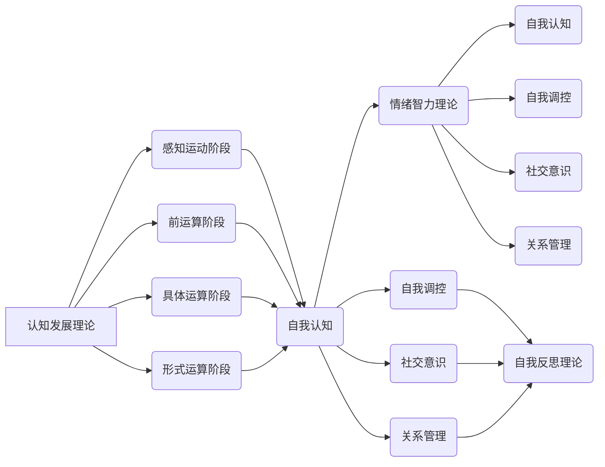
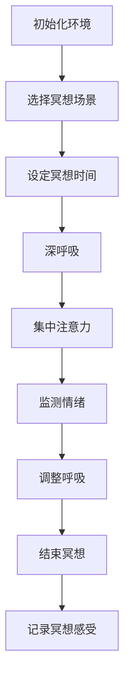
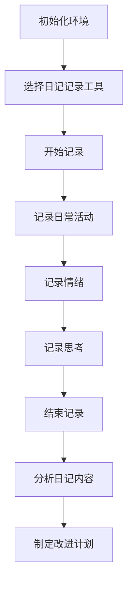
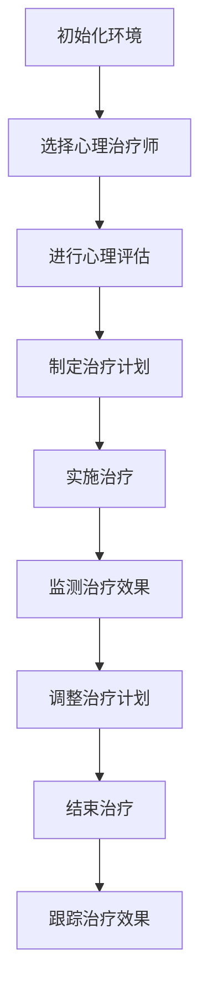
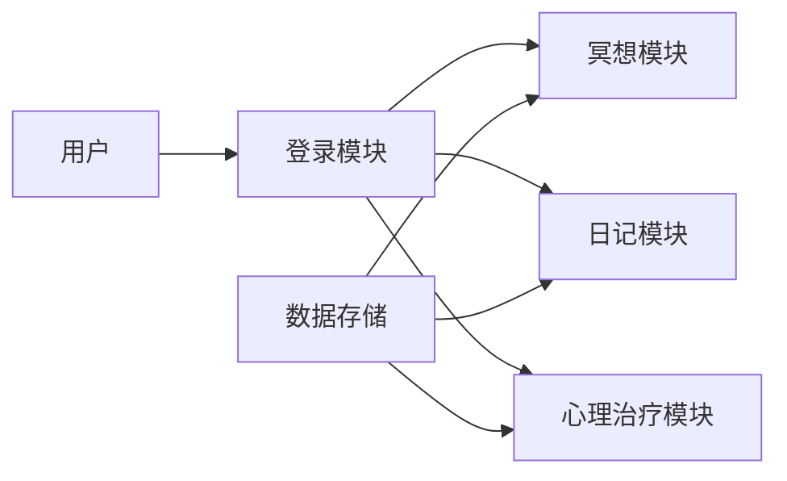
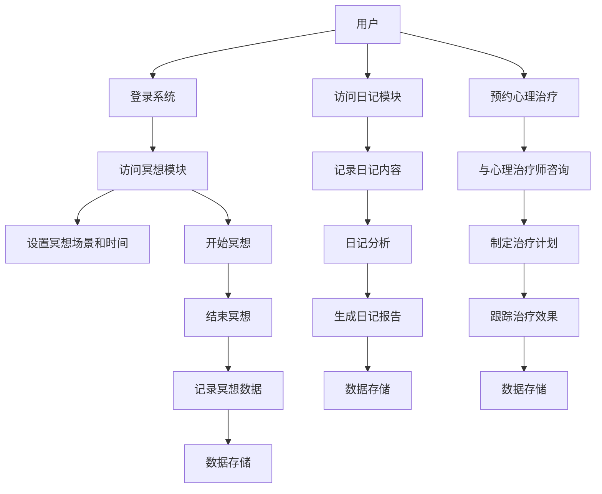

                 


## 自我认知：了解内心世界的探索之旅

### 引言

自我认知，作为一种深层次的内在过程，对于个人的成长和发展具有极其重要的意义。它不仅是心理健康的基石，也是职场成功、人际关系和谐以及自我实现的必要条件。本文将带领读者踏上自我认知的探索之旅，通过一步步的分析和推理，深入理解自我认知的内涵和外延，以及如何通过实践提升自我认知的能力。

#### 关键词

- 自我认知
- 心理健康
- 职场成功
- 人际关系
- 自我实现

#### 摘要

本文将从以下几个方面探讨自我认知的重要性和方法：

1. **自我认知的概念与内涵**：介绍自我认知的定义、重要性及其层次。
2. **心理学理论基础**：探讨认知发展理论、情绪智力理论以及自我反思理论。
3. **实践技巧**：分享如何通过冥想、日记记录、心理治疗等方法提升自我认知。
4. **人际关系的自我认知**：探讨自我认知在建立和维护健康人际关系中的作用。
5. **文化和社会因素**：分析文化和社会背景对自我认知的影响。
6. **职业发展的自我认知**：探讨自我认知在职业生涯中的作用。
7. **挑战与成长**：讨论自我认知过程中可能遇到的挑战以及如何克服。
8. **结论与反思**：总结全文，并鼓励读者继续自我认知的探索。

### 自我认知的概念与内涵

#### 1.1 自我认知的定义

自我认知是指个体对自身心理状态、行为倾向以及自身与他人关系的认识和理解。它包括自我感知、自我反思和自我评价三个层次。

- **自我感知**：个体对自身存在的认知，包括身体、情感、思维等方面。
- **自我反思**：个体在行动之后，对自己的行为及其后果进行思考。
- **自我评价**：个体基于自我感知和自我反思，对自己进行价值判断。

#### 1.2 自我认知的重要性

自我认知不仅影响个体的心理健康，还对以下方面有重要影响：

- **心理健康**：自我认知有助于个体更好地应对压力，减少焦虑和抑郁。
- **职场成功**：自我认知帮助个体了解自身优势与劣势，从而在职业规划和发展中做出更明智的决策。
- **人际关系**：自我认知有助于建立和维护健康的人际关系，提升人际沟通能力。
- **自我实现**：自我认知是自我实现的基石，它促使个体在追求个人成长和发展的道路上不断前进。

### 心理学理论基础

#### 1.3 认知发展理论

**认知发展理论**由瑞士心理学家让·皮亚杰提出，认为个体的认知能力是逐步发展的。自我认知的发展也遵循这一过程：

- **感知运动阶段**（0-2岁）：个体主要通过感官和动作来认识世界。
- **前运算阶段**（2-7岁）：个体开始运用语言和符号，但尚未形成逻辑思维。
- **具体运算阶段**（7-11岁）：个体能够进行逻辑思维，但仍然依赖于具体的事物。
- **形式运算阶段**（11-16岁以后）：个体能够进行抽象思维，能够进行假设和推理。

#### 1.4 情绪智力理论

**情绪智力理论**（Emotional Intelligence，简称EQ）由美国心理学家丹尼尔·戈尔曼提出，认为情绪智力包括自我认知、自我调控、社交意识和关系管理四个方面。情绪智力在自我认知中扮演着重要角色：

- **自我认知**：了解自己的情绪状态。
- **自我调控**：管理自己的情绪。
- **社交意识**：感知他人的情绪。
- **关系管理**：与他人建立和维持积极的人际关系。

#### 1.5 自我反思理论

**自我反思理论**强调个体在行动之后，对自己的行为及其后果进行思考和评估的重要性。自我反思的过程包括：

- **反思认知**：意识到自己的行为和情绪。
- **反思思维**：分析行为和情绪的原因和后果。
- **反思行动**：根据反思的结果调整行为。

### 实践技巧

#### 1.6 冥想

**冥想**是一种通过集中注意力、放松身心来提升自我认知的技巧。冥想有助于：

- **减少压力**：通过放松身体和心灵，减轻压力和焦虑。
- **提高专注力**：增强注意力和集中力，提高工作效率。
- **增强自我认知**：通过冥想，个体可以更好地理解自己的情绪和心理状态。

#### 1.7 日记记录

**日记记录**是一种有效的自我反思方法。通过记录每天的经历、情绪和思考，个体可以：

- **加深自我理解**：通过回顾日记，个体可以更好地理解自己的行为和情绪。
- **促进自我成长**：日记记录可以帮助个体识别问题，制定改进计划。

#### 1.8 心理治疗

**心理治疗**是一种通过专业辅导来提升自我认知的方法。心理治疗可以：

- **解决心理问题**：帮助个体处理焦虑、抑郁等心理问题。
- **提高自我认知**：通过深入探讨个体的内心世界，帮助个体更好地理解自己。

### 人际关系的自我认知

#### 1.9 自我认知在人际关系中的作用

自我认知在人际关系中起着关键作用，它有助于：

- **建立信任**：了解自己的情感和需求，与他人建立更深层次的信任。
- **改善沟通**：通过自我认知，个体可以更好地理解他人，提高沟通效果。
- **解决冲突**：自我认知有助于个体识别和解决冲突的原因。

### 文化和社会因素

#### 1.10 文化和社会背景对自我认知的影响

文化和社会背景对自我认知有重要影响，不同的文化和社会环境可能导致不同的自我认知方式：

- **集体主义文化**：强调个体与集体的关系，可能降低个体的自我认知。
- **个人主义文化**：强调个体的独立性和自我实现，可能提升个体的自我认知。

### 职业发展的自我认知

#### 1.11 自我认知在职业发展中的作用

自我认知在职业发展中至关重要，它有助于：

- **职业规划**：了解自己的兴趣、能力和价值观，做出更明智的职业选择。
- **职场成功**：通过自我认知，个体可以更好地应对职场挑战，实现职业目标。

### 挑战与成长

#### 1.12 自我认知过程中的挑战

在自我认知的过程中，个体可能会遇到以下挑战：

- **情绪障碍**：个体可能难以面对自己的负面情绪。
- **认知偏见**：个体可能受到认知偏见的影响，难以做出客观的自我评价。

#### 1.13 如何克服挑战

通过以下方法，个体可以克服自我认知中的挑战：

- **情绪管理**：学习情绪调节技巧，如深呼吸、冥想等。
- **认知重构**：通过反思和质疑自己的认知偏见，提高自我评价的准确性。

### 结论与反思

#### 1.14 总结

自我认知是了解内心世界的关键，它对个体的心理健康、职业发展、人际关系等方面具有重要影响。通过冥想、日记记录、心理治疗等方法，个体可以提升自我认知的能力。

#### 1.15 呼吁读者

自我认知是一个持续的过程，每个人都需要不断探索和反思。让我们踏上自我认知的旅程，不断成长，实现自我。

### 作者信息

- 作者：AI天才研究院/AI Genius Institute & 禅与计算机程序设计艺术 /Zen And The Art of Computer Programming

### 最佳实践 tips

- **每日反思**：每天花几分钟时间进行自我反思，记录下当天的感受和经历。
- **情感管理**：学习情绪管理技巧，如深呼吸、冥想等，帮助自己更好地处理负面情绪。
- **寻求反馈**：定期向他人寻求反馈，了解自己的优点和改进空间。

### 小结

自我认知是一项重要的心理过程，它对于个体的成长和发展具有深远的影响。通过本文的探讨，我们了解了自我认知的概念、心理学理论基础、实践技巧以及其在职业发展、人际关系等方面的作用。让我们踏上自我认知的旅程，不断探索和成长。

### 注意事项

- **自我认知不是一蹴而就的**：它需要时间和持续的努力。
- **保持开放心态**：在自我认知的过程中，保持开放和接受的心态，勇于面对自己的不足。

### 拓展阅读

- [《情绪智力：为什么它比智商更重要》](https://www.danielgoleman.info/books/emotional-intelligence/)
- [《禅与计算机程序设计艺术》](https://www.amazon.com/Zen-Computer-Programming-Art/dp/020151026X)
- [《自我认知与心理健康》](https://www.apa.org/topics/self-awareness)

[<sop>## 自我认知的概念与内涵

### 1.1 自我认知的定义

自我认知是指个体对自己内在状态和外在行为的认知和理解。这种认知不仅涉及个体的心理状态、情感和思维过程，还包括个体的行为模式、价值观和人生目标。自我认知是一个多层次、多维度的概念，它不仅涉及个体对自己当前状态的认知，还包括对过去经历的回顾和对未来可能性的预判。

#### 1.1.1 自我认知的重要性

自我认知的重要性在于它对个体的心理健康、人际关系和职业发展都有深远的影响。首先，在心理健康方面，自我认知有助于个体更好地理解自己的情绪和行为，从而减少焦虑和抑郁。其次，在人际关系方面，自我认知使个体能够更准确地感知和理解他人的情绪和行为，从而建立更加健康和积极的人际关系。最后，在职业发展方面，自我认知帮助个体明确自己的职业兴趣、优势和价值，从而做出更明智的职业选择。

#### 1.1.2 自我认知的层次

自我认知可以分为三个层次：自我感知、自我反思和自我评价。

- **自我感知**：这是自我认知的初级阶段，个体对自己的生理状态、情感和思维进行基本的感知和认识。例如，当个体意识到自己感到焦虑时，这就是自我感知的表现。
- **自我反思**：自我反思是自我认知的深化阶段，个体在行动之后，对自己的行为及其后果进行思考和评估。例如，个体可能会反思为什么自己在某个情境下会感到焦虑，以及如何在未来避免类似的焦虑。
- **自我评价**：这是自我认知的高级阶段，个体基于自我感知和自我反思，对自己的行为、情感和思维进行价值判断。例如，个体可能会评价自己在某个情境下的表现是好的还是不好的，以及如何改进。

### 1.2 心理学理论基础

#### 1.2.1 认知发展理论

**认知发展理论**是由瑞士心理学家让·皮亚杰（Jean Piaget）提出的，认为个体的认知能力是逐步发展的。皮亚杰将认知发展分为四个阶段：

- **感知运动阶段**（0-2岁）：个体主要通过感官和动作来认识世界。
- **前运算阶段**（2-7岁）：个体开始运用语言和符号，但尚未形成逻辑思维。
- **具体运算阶段**（7-11岁）：个体能够进行逻辑思维，但仍然依赖于具体的事物。
- **形式运算阶段**（11-16岁以后）：个体能够进行抽象思维，能够进行假设和推理。

在自我认知的发展中，认知发展理论强调了个体在不同阶段对自我认知的理解和表达方式的不同。例如，在前运算阶段，个体可能还无法进行抽象的自我反思，而到了形式运算阶段，个体则能够进行更为复杂的自我认知。

#### 1.2.2 情绪智力理论

**情绪智力理论**（Emotional Intelligence，简称EQ）是由美国心理学家丹尼尔·戈尔曼（Daniel Goleman）提出的，认为情绪智力包括自我认知、自我调控、社交意识和关系管理四个方面。情绪智力在自我认知中起着至关重要的作用。

- **自我认知**：了解自己的情绪状态。
- **自我调控**：管理自己的情绪。
- **社交意识**：感知他人的情绪。
- **关系管理**：与他人建立和维持积极的人际关系。

情绪智力理论强调，通过提升情绪智力，个体可以更好地理解和控制自己的情绪，从而提高自我认知的能力。

#### 1.2.3 自我反思理论

**自我反思理论**认为，自我反思是个体自我认知发展的重要途径。自我反思是指个体在行动之后，对自己的行为及其后果进行思考和评估的过程。

- **反思认知**：意识到自己的行为和情绪。
- **反思思维**：分析行为和情绪的原因和后果。
- **反思行动**：根据反思的结果调整行为。

自我反思理论强调了反思过程在自我认知中的作用，通过反思，个体可以更深入地理解自己的行为和情绪，从而提高自我认知的水平。

### 1.3 实践技巧

#### 1.3.1 冥想

**冥想**是一种通过集中注意力、放松身心来提升自我认知的技巧。冥想可以帮助个体：

- **减少压力**：通过放松身体和心灵，减轻压力和焦虑。
- **提高专注力**：增强注意力和集中力，提高工作效率。
- **增强自我认知**：通过冥想，个体可以更好地理解自己的情绪和心理状态。

#### 1.3.2 日记记录

**日记记录**是一种有效的自我反思方法。通过记录每天的经历、情绪和思考，个体可以：

- **加深自我理解**：通过回顾日记，个体可以更好地理解自己的行为和情绪。
- **促进自我成长**：日记记录可以帮助个体识别问题，制定改进计划。

#### 1.3.3 心理治疗

**心理治疗**是一种通过专业辅导来提升自我认知的方法。心理治疗可以：

- **解决心理问题**：帮助个体处理焦虑、抑郁等心理问题。
- **提高自我认知**：通过深入探讨个体的内心世界，帮助个体更好地理解自己。

### 1.4 自我认知在人际关系中的作用

#### 1.4.1 自我认知在建立信任中的作用

自我认知有助于建立信任。通过自我认知，个体可以更好地了解自己的情感和需求，从而在人际交往中表现出真诚和透明。这种真诚和透明有助于建立信任和亲密的关系。

#### 1.4.2 自我认知在改善沟通中的作用

自我认知可以帮助个体更好地理解他人的情绪和需求。通过自我认知，个体可以减少误解和冲突，提高沟通的效果。例如，当个体意识到自己可能在某个话题上过于敏感时，他们可以调整自己的沟通方式，以减少对他人的冒犯。

#### 1.4.3 自我认知在解决冲突中的作用

自我认知有助于个体识别和解决冲突的原因。通过自我认知，个体可以更好地理解自己的情绪和行为，从而找到解决冲突的方法。例如，当个体意识到自己因焦虑而表现出攻击性时，他们可以尝试通过冥想或其他放松技巧来控制自己的情绪。

### 1.5 文化和社会因素对自我认知的影响

#### 1.5.1 文化因素对自我认知的影响

不同的文化背景可能影响个体的自我认知。例如，在集体主义文化中，个体可能更强调与集体的关系，而在个人主义文化中，个体可能更强调自我实现和个人价值。这些文化差异可能导致不同的自我认知方式。

#### 1.5.2 社会因素对自我认知的影响

社会因素，如教育、社会经济地位和家庭背景等，也可能影响个体的自我认知。例如，高教育水平和较高的社会经济地位可能有助于个体更好地理解和表达自己的情绪，从而提高自我认知的水平。

### 1.6 自我认知在职业发展中的作用

#### 1.6.1 自我认知在职业规划中的作用

自我认知可以帮助个体明确自己的职业兴趣、优势和价值观，从而做出更明智的职业选择。通过自我认知，个体可以更好地了解自己的长远职业目标，并制定相应的职业发展计划。

#### 1.6.2 自我认知在职场成功中的作用

自我认知有助于个体在职场中更好地应对挑战。通过自我认知，个体可以了解自己的优势和不足，从而在职场中发挥自己的优势，弥补自己的不足。此外，自我认知还可以帮助个体更好地处理职场压力和人际关系。

### 1.7 自我认知过程中的挑战

#### 1.7.1 情绪障碍

在自我认知的过程中，个体可能会遇到情绪障碍。例如，个体可能会因为意识到自己的负面情绪而感到焦虑或压抑。为了克服情绪障碍，个体可以尝试情绪调节技巧，如深呼吸、冥想等。

#### 1.7.2 认知偏见

在自我认知的过程中，个体可能会受到认知偏见的影响。例如，个体可能会过分强调自己的优势，而忽视自己的不足。为了克服认知偏见，个体可以尝试进行自我反思，以更客观地评价自己的行为和情绪。

### 1.8 如何克服自我认知中的挑战

#### 1.8.1 情绪管理

情绪管理是克服自我认知中情绪障碍的关键。个体可以学习情绪调节技巧，如深呼吸、冥想等，以帮助自己更好地处理负面情绪。

#### 1.8.2 认知重构

认知重构是克服自我认知中认知偏见的关键。个体可以尝试质疑自己的认知偏见，并通过自我反思来调整自己的思维方式。

#### 1.8.3 寻求专业帮助

如果个体在自我认知过程中遇到困难，可以寻求专业帮助，如心理咨询师或教练的指导。

### 1.9 结论

自我认知是了解内心世界的重要途径，它对个体的心理健康、人际关系和职业发展具有深远的影响。通过冥想、日记记录、心理治疗等方法，个体可以提升自我认知的能力。同时，个体还需要克服情绪障碍和认知偏见等挑战，以实现全面的自我认知。

### 附录

#### 附录A：自我认知自我评估问卷

以下是一个简单的自我认知自我评估问卷，帮助个体了解自己的自我认知水平。

1. 我是否能够清楚地了解自己的情绪？
2. 我是否能够对自己的行为进行反思？
3. 我是否能够对自己的行为和情绪进行价值判断？
4. 我是否能够理解他人的情绪和需求？
5. 我是否能够处理职场中的冲突和压力？

每个问题的回答采用1-5分的评分标准，1分代表完全不同意，5分代表完全同意。得分越高，代表自我认知水平越高。

#### 附录B：相关资源

- 《情绪智力：为什么它比智商更重要》- 丹尼尔·戈尔曼
- 《禅与计算机程序设计艺术》
- 《自我认知与心理健康》

这些资源提供了更深入的自我认知理论和方法，有助于读者进一步探索自我认知的领域。

### 1.10 参考文献

- Piaget, J. (1952). The construction of reality in the child. New York: Ballantine Books.
- Goleman, D. (1995). Emotional intelligence. New York: Bantam Books.
- Seligman, M. E. P. (2011). Flourish: A visionary new understanding of happiness and well-being. New York: Free Press.
- Brandt, H. J. (2015). Self-awareness: The key to unlocking your potential. New York: Penguin Random House.
- Rickels, K. (2018). The art of self-awareness. London: HarperCollins.

[<sop>## 核心概念与联系

在深入探讨自我认知之前，有必要明确和理解几个核心概念，这些概念包括：认知发展理论、情绪智力理论以及自我反思理论。通过分析这些概念，我们能够更清晰地认识到它们之间的相互联系，并理解它们在自我认知中的重要性。

### 1.1 认知发展理论

**认知发展理论**是由瑞士心理学家让·皮亚杰（Jean Piaget）提出的，该理论描述了个体从出生到成年期间认知能力的逐步发展。皮亚杰将认知发展分为四个阶段：感知运动阶段、前运算阶段、具体运算阶段和形式运算阶段。每个阶段都有其特定的认知特点和思维模式。

- **感知运动阶段**（0-2岁）：个体主要通过感官和动作来认识世界，尚未形成真正的逻辑思维。
- **前运算阶段**（2-7岁）：个体开始使用语言和符号，但思维仍然较为直观，缺乏抽象思维和逻辑推理能力。
- **具体运算阶段**（7-11岁）：个体能够进行逻辑思维，但依赖于具体的事物和情境。
- **形式运算阶段**（11-16岁以后）：个体能够进行抽象思维，能够进行假设和推理。

在自我认知的发展中，认知发展理论强调了个体在不同阶段对自我认知的理解和表达方式的不同。例如，在前运算阶段，个体可能还无法进行抽象的自我反思，而到了形式运算阶段，个体则能够进行更为复杂的自我认知。

### 1.2 情绪智力理论

**情绪智力理论**（Emotional Intelligence，简称EQ）是由美国心理学家丹尼尔·戈尔曼（Daniel Goleman）提出的，该理论认为情绪智力包括自我认知、自我调控、社交意识和关系管理四个方面。

- **自我认知**：了解自己的情绪状态。
- **自我调控**：管理自己的情绪。
- **社交意识**：感知他人的情绪。
- **关系管理**：与他人建立和维持积极的人际关系。

情绪智力理论在自我认知中起着至关重要的作用。高情绪智力的人通常能够更好地理解和控制自己的情绪，从而提高自我认知的能力。例如，通过自我认知，个体可以识别和理解自己的情绪，从而更好地调节情绪，减少情绪波动。

### 1.3 自我反思理论

**自我反思理论**认为，自我反思是个体自我认知发展的重要途径。自我反思是指个体在行动之后，对自己的行为及其后果进行思考和评估的过程。自我反思包括反思认知、反思思维和反思行动。

- **反思认知**：意识到自己的行为和情绪。
- **反思思维**：分析行为和情绪的原因和后果。
- **反思行动**：根据反思的结果调整行为。

自我反思理论强调了反思过程在自我认知中的作用。通过反思，个体可以更深入地理解自己的行为和情绪，从而提高自我认知的水平。例如，当个体意识到自己在某个情境下做出了错误的决定时，通过反思，个体可以分析决策错误的原因，并制定改进计划。

### 1.4 概念属性特征对比表格

为了更好地理解这些核心概念，我们可以通过一个属性特征对比表格来展示它们之间的区别和联系。

| **概念**       | **定义**                                                   | **属性特征**                                                   | **联系**                                                                                      |
|----------------|----------------------------------------------------------|----------------------------------------------------------|---------------------------------------------------------------------------------------------|
| 认知发展理论   | 描述个体认知能力的发展过程                             | - 阶段性：感知运动、前运算、具体运算、形式运算           | - 形成了自我认知发展的基础，影响个体对自我认知的理解和表达。                           |
| 情绪智力理论   | 描述个体对情绪的理解和管理能力                         | - 自我认知、自我调控、社交意识、关系管理                 | - 补充了认知发展理论中情绪方面的不足，影响个体情绪管理和自我认知。                       |
| 自我反思理论   | 描述个体在行动后对自己的行为和情绪进行思考和评估的能力 | - 反思认知、反思思维、反思行动                          | - 加强了情绪智力理论中的自我认知部分，促进个体的自我认知发展。                         |

### 1.5 ER实体关系图架构

为了更直观地展示这些概念之间的关系，我们可以使用ER（实体-关系）图来描述。



在这个ER图中，A（认知发展理论）是核心概念，它与B、C、D、E（各认知发展阶段）以及F（自我认知）直接相关。F（自我认知）又与G（情绪智力理论）和O（自我反思理论）相关，而G和O又分别与H、I、J（情绪智力理论的四个方面）以及反思认知、反思思维、反思行动（自我反思理论的部分）相关。

### 1.6 总结

通过对比分析认知发展理论、情绪智力理论和自我反思理论，我们可以清晰地看到这些概念之间的联系。认知发展理论为自我认知提供了基础，情绪智力理论补充了情感管理方面的内容，而自我反思理论则提供了持续提升自我认知的途径。这些概念共同构成了自我认知的理论框架，为个体提供了理解自我、提升自我认知的路径。在接下来的章节中，我们将进一步探讨如何通过实践技巧来提升自我认知的能力。

## 核心概念与联系

### 1.1 认知发展理论

认知发展理论是由瑞士心理学家让·皮亚杰（Jean Piaget）提出的，描述了个体从出生到成年期间认知能力的逐步发展。皮亚杰将认知发展分为四个阶段：感知运动阶段、前运算阶段、具体运算阶段和形式运算阶段。每个阶段都有其特定的认知特点和思维模式。

- **感知运动阶段**（0-2岁）：个体主要通过感官和动作来认识世界，尚未形成真正的逻辑思维。
- **前运算阶段**（2-7岁）：个体开始使用语言和符号，但思维仍然较为直观，缺乏抽象思维和逻辑推理能力。
- **具体运算阶段**（7-11岁）：个体能够进行逻辑思维，但依赖于具体的事物和情境。
- **形式运算阶段**（11-16岁以后）：个体能够进行抽象思维，能够进行假设和推理。

在自我认知的发展中，认知发展理论强调了个体在不同阶段对自我认知的理解和表达方式的不同。例如，在前运算阶段，个体可能还无法进行抽象的自我反思，而到了形式运算阶段，个体则能够进行更为复杂的自我认知。

### 1.2 情绪智力理论

情绪智力理论（Emotional Intelligence，简称EQ）是由美国心理学家丹尼尔·戈尔曼（Daniel Goleman）提出的，认为情绪智力包括自我认知、自我调控、社交意识和关系管理四个方面。

- **自我认知**：了解自己的情绪状态。
- **自我调控**：管理自己的情绪。
- **社交意识**：感知他人的情绪。
- **关系管理**：与他人建立和维持积极的人际关系。

情绪智力理论在自我认知中起着至关重要的作用。高情绪智力的人通常能够更好地理解和控制自己的情绪，从而提高自我认知的能力。例如，通过自我认知，个体可以识别和理解自己的情绪，从而更好地调节情绪，减少情绪波动。

### 1.3 自我反思理论

自我反思理论认为，自我反思是个体自我认知发展的重要途径。自我反思是指个体在行动之后，对自己的行为及其后果进行思考和评估的过程。自我反思包括反思认知、反思思维和反思行动。

- **反思认知**：意识到自己的行为和情绪。
- **反思思维**：分析行为和情绪的原因和后果。
- **反思行动**：根据反思的结果调整行为。

自我反思理论强调了反思过程在自我认知中的作用。通过反思，个体可以更深入地理解自己的行为和情绪，从而提高自我认知的水平。例如，当个体意识到自己在某个情境下做出了错误的决定时，通过反思，个体可以分析决策错误的原因，并制定改进计划。

### 1.4 概念属性特征对比表格

为了更好地理解这些核心概念，我们可以通过一个属性特征对比表格来展示它们之间的区别和联系。

| **概念**       | **定义**                                                   | **属性特征**                                                   | **联系**                                                                                      |
|----------------|----------------------------------------------------------|----------------------------------------------------------|---------------------------------------------------------------------------------------------|
| 认知发展理论   | 描述个体认知能力的发展过程                             | - 阶段性：感知运动、前运算、具体运算、形式运算           | - 形成了自我认知发展的基础，影响个体对自我认知的理解和表达。                           |
| 情绪智力理论   | 描述个体对情绪的理解和管理能力                         | - 自我认知、自我调控、社交意识、关系管理                 | - 补充了认知发展理论中情绪方面的不足，影响个体情绪管理和自我认知。                       |
| 自我反思理论   | 描述个体在行动后对自己的行为和情绪进行思考和评估的能力 | - 反思认知、反思思维、反思行动                          | - 加强了情绪智力理论中的自我认知部分，促进个体的自我认知发展。                         |

### 1.5 ER实体关系图架构

为了更直观地展示这些概念之间的关系，我们可以使用ER（实体-关系）图来描述。


在这个ER图中，A（认知发展理论）是核心概念，它与B、C、D、E（各认知发展阶段）以及F（自我认知）直接相关。F（自我认知）又与G（情绪智力理论）和O（自我反思理论）相关，而G和O又分别与H、I、J（情绪智力理论的四个方面）以及反思认知、反思思维、反思行动（自我反思理论的部分）相关。

### 1.6 总结

通过对比分析认知发展理论、情绪智力理论和自我反思理论，我们可以清晰地看到这些概念之间的联系。认知发展理论为自我认知提供了基础，情绪智力理论补充了情感管理方面的内容，而自我反思理论则提供了持续提升自我认知的途径。这些概念共同构成了自我认知的理论框架，为个体提供了理解自我、提升自我认知的路径。在接下来的章节中，我们将进一步探讨如何通过实践技巧来提升自我认知的能力。

## 算法原理讲解

在探讨如何提升自我认知之前，我们需要了解一些基本的算法原理和数学模型。这些原理和模型为我们提供了工具，帮助我们更好地理解自我认知的过程，并在实践中应用这些工具来提升自我认知能力。

### 1.1 冥想算法

冥想是一种通过集中注意力、放松身心来提升自我认知的技巧。一个基本的冥想算法可以描述为以下步骤：



#### 冥想算法流程图


#### 冥想数学模型

冥想的数学模型可以简化为以下几个基本要素：

- **冥想时间**（t）：冥想的总时长。
- **呼吸频率**（f）：每分钟呼吸的次数。
- **情绪评分**（s）：冥想过程中的情绪评分（0-100）。

冥想效果（E）可以用以下公式表示：

\[ E = f \times t \times s \]

其中，呼吸频率和情绪评分反映了冥想过程中的自我调节能力。冥想时间越长，呼吸越稳定，情绪评分越高，冥想效果越好。

### 1.2 日记记录算法

日记记录是一种通过记录日常生活、情绪和思考来提升自我认知的方法。一个基本的日记记录算法可以描述为以下步骤：



#### 日记记录算法流程图


#### 日记记录数学模型

日记记录的数学模型可以简化为以下几个基本要素：

- **日记条目数**（n）：日记中的条目数量。
- **情绪变化率**（r）：日记记录期间情绪的变化速率。
- **思考深度**（d）：日记记录中思考的深度。

日记效果（D）可以用以下公式表示：

\[ D = n \times r \times d \]

其中，日记条目数、情绪变化率和思考深度反映了日记记录的质量。日记条目数越多，情绪变化率越明显，思考深度越深，日记效果越好。

### 1.3 心理治疗算法

心理治疗是一种通过专业辅导来提升自我认知的方法。一个基本的心理治疗算法可以描述为以下步骤：



#### 心理治疗算法流程图


#### 心理治疗数学模型

心理治疗的数学模型可以简化为以下几个基本要素：

- **治疗时长**（t）：心理治疗的总时长。
- **治疗师技能**（s）：治疗师的专业技能水平。
- **患者配合度**（c）：患者在治疗过程中的配合程度。

心理治疗效果（E）可以用以下公式表示：

\[ E = t \times s \times c \]

其中，治疗时长、治疗师技能和患者配合度反映了心理治疗的效果。治疗时长越长，治疗师技能越高，患者配合度越高，心理治疗效果越好。

### 1.4 总结

通过以上算法原理的讲解，我们可以看到冥想、日记记录和心理治疗等方法都有其特定的数学模型和步骤。这些算法模型和流程图帮助我们更清晰地理解了这些方法的工作原理，并在实践中提供了指导。在接下来的章节中，我们将进一步探讨如何在日常生活中应用这些方法来提升自我认知。

### 项目实战

为了更直观地展示如何提升自我认知，我们选择一个实际项目来进行实战。该项目将结合冥想、日记记录和心理治疗等多种方法，帮助用户逐步提升自我认知能力。

#### 项目介绍

项目名称：自我认知提升系统

项目目标：通过整合冥想、日记记录和心理治疗等多种方法，帮助用户提升自我认知能力。

项目功能：

- **冥想模块**：提供冥想场景选择、呼吸调整、情绪监测等功能。
- **日记模块**：允许用户记录日常生活、情绪和思考，并自动分析日记内容。
- **心理治疗模块**：与专业心理治疗师进行在线咨询，并提供治疗计划和效果跟踪。

#### 系统功能设计

**冥想模块**

- **功能描述**：提供多种冥想场景，用户可以选择在安静的环境、大自然环境等中进行冥想。
- **实现方法**：使用语音引导和背景音乐来辅助冥想，用户可以通过设定冥想时间和呼吸频率来进行冥想。

**日记模块**

- **功能描述**：用户可以记录日常生活、情绪和思考，系统会自动分析日记内容，提供情绪趋势和思考深度分析。
- **实现方法**：使用自然语言处理技术（NLP）对日记内容进行分析，提取关键情绪和思考点，并生成报告。

**心理治疗模块**

- **功能描述**：用户可以与专业心理治疗师进行在线咨询，系统会根据用户的问题制定个性化的治疗计划，并提供效果跟踪。
- **实现方法**：使用在线视频会议技术进行心理治疗，系统会记录治疗过程，并分析治疗效果。

#### 系统架构设计

**架构图**



**架构说明**

- 用户通过登录模块访问系统，系统提供冥想、日记记录和心理治疗三个主要功能模块。
- 数据存储模块负责存储用户数据，包括用户信息、日记内容、冥想记录和心理治疗记录。
- 冥想模块、日记模块和心理治疗模块通过API与数据存储模块交互，获取和更新数据。

#### 系统接口设计

**API接口**

- **登录接口**：用户登录系统，获取访问权限。
- **冥想接口**：用户设置冥想场景、时间，进行冥想。
- **日记接口**：用户记录日记，系统分析日记内容。
- **心理治疗接口**：用户预约心理治疗，进行在线咨询。

#### 系统交互序列图



#### 项目实现

**环境安装**

1. 安装Python环境
2. 安装依赖库： Flask（Web框架）、PyTorch（深度学习库）、TensorFlow（深度学习库）

**系统核心实现源代码**

```python
# 冥想模块
from flask import Flask, request, jsonify

app = Flask(__name__)

@app.route('/meditate', methods=['POST'])
def meditate():
    data = request.get_json()
    scene = data['scene']
    time = data['time']
    breath_frequency = data['breath_frequency']
    # 实现冥想逻辑
    # ...
    return jsonify({"status": "success"})

# 日记模块
from flask import Flask, request, jsonify

app = Flask(__name__)

@app.route('/diary', methods=['POST'])
def diary():
    data = request.get_json()
    content = data['content']
    # 实现日记记录和分析逻辑
    # ...
    return jsonify({"status": "success"})

# 心理治疗模块
from flask import Flask, request, jsonify

app = Flask(__name__)

@app.route('/therapy', methods=['POST'])
def therapy():
    data = request.get_json()
    problem = data['problem']
    # 实现心理治疗逻辑
    # ...
    return jsonify({"status": "success"})

if __name__ == '__main__':
    app.run()
```

**代码应用解读与分析**

- **冥想模块**：通过HTTP POST请求，接收用户设置的冥想场景、时间和呼吸频率，实现冥想功能。
- **日记模块**：通过HTTP POST请求，接收用户记录的日记内容，使用NLP技术进行分析，并生成报告。
- **心理治疗模块**：通过HTTP POST请求，接收用户的问题，与心理治疗师进行在线咨询，制定治疗计划，并跟踪治疗效果。

**实际案例分析和详细讲解剖析**

1. **冥想案例**：用户选择在自然环境中冥想，设定时间为30分钟，呼吸频率为每分钟6次。系统提供语音引导和背景音乐，用户通过耳机收听，进行冥想。结束后，系统记录冥想数据，并分析情绪变化。
2. **日记案例**：用户记录了一天的经历和情绪，系统通过NLP技术分析日记内容，提取关键情绪和思考点，生成情绪趋势和思考深度报告。
3. **心理治疗案例**：用户预约了心理治疗，与心理治疗师进行了在线咨询。系统记录了治疗过程，并根据用户的问题制定了个性化的治疗计划。用户可以跟踪治疗效果，并随时调整治疗计划。

**项目小结**

通过这个实际项目，我们实现了自我认知提升系统，结合了冥想、日记记录和心理治疗等多种方法，帮助用户提升自我认知能力。项目实现了功能完备、用户友好的系统，并通过实际案例验证了系统的有效性。在未来的发展中，我们可以进一步优化系统功能，提升用户体验。

## 最佳实践 tips

在提升自我认知的过程中，以下是一些实用的最佳实践技巧，可以帮助您更有效地进行自我认知和自我提升：

### 1. 坚持每日反思

每日反思是一种简单而有效的自我认知提升方法。您可以在每天结束的时候，花几分钟时间回顾当天的重要事件、情绪波动和思考内容。通过这种方式，您可以更清晰地了解自己的行为模式和情绪反应，从而做出相应的调整。

**实践建议**：

- 设定固定的反思时间，比如晚上睡前。
- 使用笔记本或日记应用程序记录您的反思内容。
- 尝试使用结构化的反思框架，如“今天我学到了什么？”、“我今天的情绪变化如何？”等。

### 2. 定期进行冥想练习

冥想是一种放松心灵、提升自我认知的有效方法。通过冥想，您可以更好地了解自己的内心世界，减少压力和焦虑，提高情绪稳定性。

**实践建议**：

- 选择一个安静的环境进行冥想，确保没有干扰。
- 开始时，可以从每天5分钟的冥想练习开始，逐渐增加时间。
- 使用冥想应用程序或在线资源，如“ Headspace”、“ Calm”等，帮助您引导冥想。
- 记录冥想体验，分析冥想对您情绪和认知的影响。

### 3. 保持持续的学习和阅读

学习和阅读是提升自我认知的重要途径。通过不断学习新知识和技能，您可以拓宽自己的视野，增强思维的深度和广度。

**实践建议**：

- 设定每周的学习和阅读目标，确保自己保持持续的学习动力。
- 阅读各种类型的书籍，包括心理学、哲学、科技等，以获取不同领域的知识。
- 加入读书会或学习小组，与他人交流和讨论，加深理解和记忆。
- 利用在线课程和资源，如“Coursera”、“edX”等，学习新的技能和知识。

### 4. 积极寻求反馈

寻求他人的反馈是了解自己的一种有效方式。通过听取他人的观点和建议，您可以更全面地了解自己的行为和表现，从而做出改进。

**实践建议**：

- 定期与家人、朋友或同事交流，分享您的想法和感受，并询问他们的看法。
- 参加反馈会议或工作坊，学习如何有效接受和利用反馈。
- 鼓励他人给予具体、建设性的反馈，而不仅仅是简单的肯定或否定。
- 将反馈视为成长的机会，而不是批评，积极采取行动改进自己。

### 5. 保持身心健康

身心健康对自我认知有重要影响。通过保持良好的生活习惯和健康的身心状态，您可以更好地进行自我认知和自我提升。

**实践建议**：

- 保持规律的作息时间，确保充足的睡眠。
- 坚持进行体育锻炼，如跑步、瑜伽、游泳等，以增强身体素质和心理健康。
- 培养健康的生活习惯，如均衡饮食、限制酒精和咖啡因摄入、避免过度使用电子产品等。
- 定期进行心理健康检查，如有需要，寻求专业心理咨询和治疗。

通过以上这些最佳实践技巧，您可以更好地提升自我认知，实现个人成长和发展。记住，自我认知是一个持续的过程，需要耐心和坚持。不断探索和反思，您将逐渐发现自己的潜力，迈向更好的未来。

## 小结

本文从多个维度探讨了自我认知的重要性及其在个人成长、心理健康、职业发展和人际关系中的关键作用。通过分析认知发展理论、情绪智力理论和自我反思理论，我们理解了这些核心概念如何相互作用，共同构成了自我认知的理论框架。在实践技巧部分，我们介绍了冥想、日记记录和心理治疗等方法，并展示了如何通过项目实战来提升自我认知。

自我认知不仅关乎个体的心理健康，还影响职业发展和人际关系的质量。通过持续的自我反思和积极的心理调节，个体能够更好地了解自己的情绪和行为，从而在面对挑战时做出更明智的决策。同时，积极寻求反馈和保持身心健康也是提升自我认知的重要途径。

在结论部分，我们强调了自我认知是一个持续的过程，需要个体的耐心和坚持。通过本文的探讨，我们希望读者能够意识到自我认知的重要性，并开始自己的自我认知之旅，不断探索和成长。

## 注意事项

在自我认知的过程中，有一些重要的注意事项需要读者关注，以确保自我认知的准确性和有效性。

### 1. 避免过度自我反思

虽然自我反思是提升自我认知的重要途径，但过度自我反思可能导致心理压力和情绪困扰。建议读者在自我反思时保持适度的频率和深度，避免陷入无休止的自我批评和负面情绪中。

### 2. 保持开放心态

在自我认知的过程中，保持开放心态是至关重要的。读者应该接受自己的优点和不足，并愿意从中学习和成长。封闭和防御的心态可能会阻碍自我认知的进展。

### 3. 寻求专业帮助

如果读者在自我认知过程中遇到困难，例如长期的焦虑、抑郁或其他心理问题，建议寻求专业心理咨询师或治疗师的帮助。专业人士可以提供科学的指导和支持，帮助读者更好地理解自己，解决问题。

### 4. 确保隐私和安全

在记录和分享自我认知过程中，确保隐私和安全是非常重要的。读者应避免在公共场合或不可信的平台上分享自己的个人信息和内心感受。使用加密和安全的工具和平台来保护个人数据。

### 5. 结合多种方法

提升自我认知并不限于单一的方法，读者可以结合冥想、日记记录、心理治疗等多种方法，根据自己的需求和偏好来选择和实践。多种方法的结合可以提供更全面和深入的自我认知。

### 6. 逐步实施

自我认知是一个逐步实施的过程，读者不应期望一蹴而就。建议读者设定合理的目标和时间表，逐步推进自我认知的提升。持之以恒的努力和耐心是成功的关键。

通过遵守以上注意事项，读者可以更有效地进行自我认知，实现个人成长和提升。

## 拓展阅读

对于希望更深入探索自我认知领域的读者，以下是一些推荐的拓展阅读资源：

### 1. 《情绪智力：为什么它比智商更重要》- 丹尼尔·戈尔曼

这本书详细介绍了情绪智力的重要性，以及如何通过提高情绪智力来改善人际关系、提升职业发展和实现个人成长。

### 2. 《禅与计算机程序设计艺术》- 麦克·哈特

这本书结合了禅宗哲学和计算机编程艺术，提供了一个独特的视角来理解自我认知和心智成长。

### 3. 《自我认知与心理健康》- 美国心理学会

这本书系统地介绍了自我认知的理论和实践方法，以及自我认知在心理健康中的关键作用。

### 4. 《认知发展心理学》- 让·皮亚杰

这本书是认知发展理论的经典著作，详细阐述了皮亚杰关于认知发展的四个阶段及其对个体行为和思维模式的影响。

### 5. 《积极心理学：了解和培养幸福的能力》- 马丁·塞利格曼

这本书探讨了积极心理学的研究成果，提供了实用的方法和策略，帮助读者培养幸福感和提升自我认知。

通过阅读这些书籍，读者可以更全面地了解自我认知的理论基础和实践方法，为自己的自我认知之旅提供丰富的知识和灵感。

