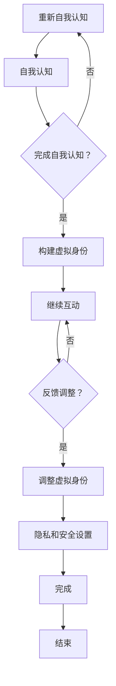
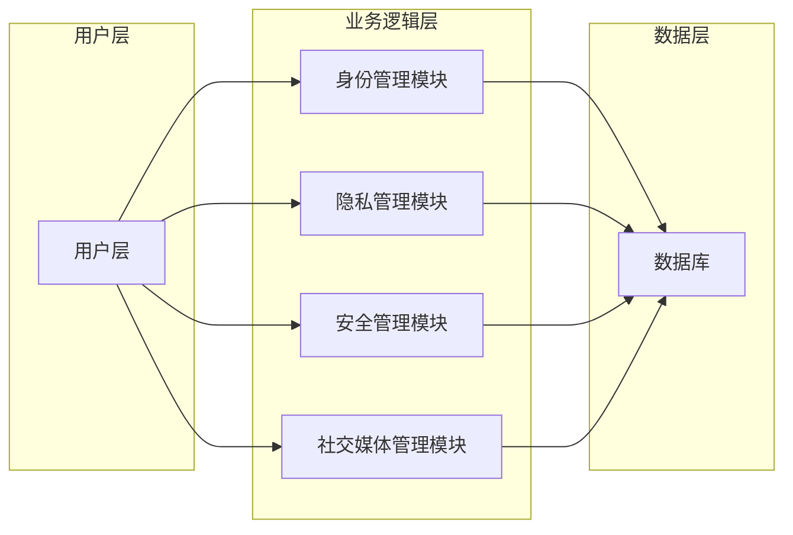
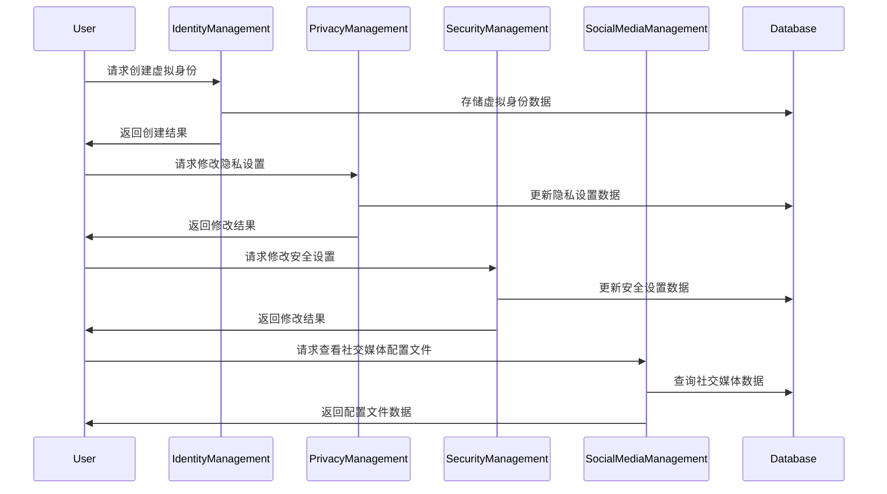
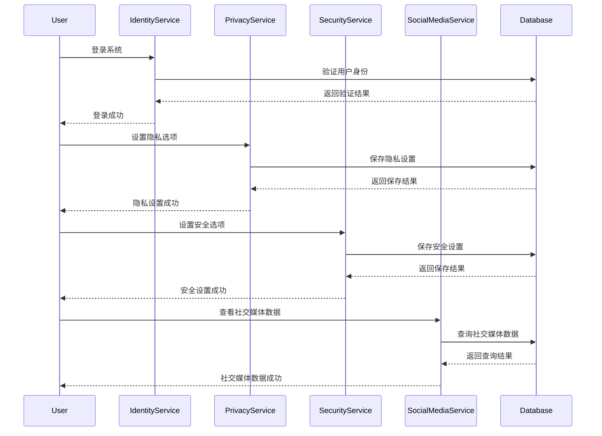

                 

## 引言

### 第1章：数字化时代的身份认同

在当今的数字化时代，虚拟与现实不断交织，个体对于身份认同的感知和认知经历了前所未有的变革。网络虚拟世界、社交媒体、人工智能等技术的迅猛发展，为个人提供了丰富的身份构建和表达手段。然而，这一现象也带来了诸多挑战，如隐私泄露、身份盗窃、网络暴力等问题。

**1.1 引言**

#### 1.1.1 问题背景

随着互联网的普及，越来越多的人开始依赖数字平台进行社交、娱乐、工作等活动。在这个虚拟空间中，个体可以自由地选择和塑造自己的身份，这种多样性使得身份认同变得更为复杂。同时，数字化技术的发展，尤其是人工智能的应用，使得个体身份的构建和表达方式发生了翻天覆地的变化。

#### 1.1.2 问题描述

在数字化时代，个体如何构建健康、积极、可持续的身份认同？这一问题不仅关乎个体的心理健康，也关系到整个社会的稳定和发展。本章节将探讨这一问题，通过分析数字化对个体身份认同的影响，提出一系列解决方案。

#### 1.1.3 问题解决

为了构建数字化时代的健康身份认同，我们需要从多个方面入手。首先，个体应强化自我认知，了解自己的价值观、兴趣爱好、人格特质等，从而形成独特的身份标识。其次，在数字世界中，个体可以通过虚拟形象、昵称、头像等方式表达自己的身份特征。此外，个体还需遵循网络规范，尊重他人隐私，避免侵犯他人权益。最后，个体应提升安全意识，加强个人信息保护，防范网络风险。

#### 1.1.4 边界与外延

数字化身份认同涉及多个领域，包括心理学、社会学、哲学、信息技术等。本章节将围绕核心概念进行深入探讨，同时关注相关领域的交叉和融合。

#### 1.1.5 概念结构与核心要素组成

在本章节中，我们将探讨以下核心概念和要素：

- **数字化身份认同**：个体在数字化环境中构建和表达的身份认同。
- **网络虚拟世界**：虚拟空间中的社交、娱乐、工作等活动。
- **社交媒体**：利用互联网进行信息传播、社交互动的平台。
- **人工智能**：利用计算机技术模拟、延伸和扩展人类智能。

### 1.2 本章小结

通过本章节的探讨，我们了解到数字化时代身份认同的重要性和复杂性。个体在数字化环境中面临着诸多挑战，但同时也拥有丰富的机会。通过强化自我认知、建立虚拟身份、遵循网络规范、提升安全意识，个体可以构建健康、积极、可持续的身份认同。本章为后续章节奠定了理论基础，为深入探讨数字化身份认同提供了方向。

---

## 第2章：数字化身份认同的核心概念解析

### 2.1 数字化身份认同的概念界定

#### 2.1.1 数字化身份认同的定义

数字化身份认同（Digital Identity Recognition）是指个体在数字化环境中，通过虚拟形象、昵称、头像等方式，表达和构建自己的身份特征，形成独特的人格标识。

#### 2.1.2 数字化身份认同的特点

数字化身份认同具有以下特点：

- **多样性**：数字化身份认同形式多样，包括虚拟形象、昵称、头像等。
- **虚拟性**：数字化身份认同存在于虚拟空间中，与现实身份有一定的距离。
- **动态性**：数字化身份认同可以随时调整和改变，反映个体的内心变化。

### 2.2 数字化身份认同的理论框架

#### 2.2.1 社会学视角下的数字化身份认同

社会学视角认为，数字化身份认同是个体在网络空间中的社会角色定位，通过自我表达和社交互动，建立社会联系和认同感。

#### 2.2.2 心理学视角下的数字化身份认同

心理学视角认为，数字化身份认同是个体在数字化环境中，通过自我认知和情感表达，实现自我认同和自我实现。

#### 2.2.3 哲学视角下的数字化身份认同

哲学视角认为，数字化身份认同是个体对现实世界的反思和批判，通过虚拟形象和虚拟身份，表达对现实世界的观点和态度。

### 2.3 数字化身份认同的核心概念解析

在本章节中，我们将深入解析以下核心概念：

#### 2.3.1 虚拟身份

虚拟身份是指个体在数字化环境中使用的虚拟形象、昵称、头像等，是数字化身份认同的重要组成部分。虚拟身份不仅反映了个体的个性特征，还可以帮助个体在网络空间中建立社交联系。

#### 2.3.2 社交媒体

社交媒体是数字化身份认同的重要载体，个体通过社交媒体平台，表达和传播自己的观点，建立社交联系和认同感。社交媒体平台如微博、微信、Instagram等，为个体提供了展示和塑造数字化身份的空间。

#### 2.3.3 人工智能

人工智能在数字化身份认同中发挥着重要作用，通过智能算法，帮助个体构建和调整虚拟身份，实现自我认知和情感表达。例如，人工智能可以通过分析用户的行为数据，为用户推荐感兴趣的内容，从而帮助用户建立更符合自己身份认同的数字化形象。

### 2.4 概念属性特征对比表格

以下是数字化身份认同中几个核心概念的属性特征对比表格：

| 核心概念 | 定义 | 特征 |
| --- | --- | --- |
| 数字化身份认同 | 个体在数字化环境中构建和表达的身份认同 | 多样性、虚拟性、动态性 |
| 网络虚拟世界 | 虚拟空间中的社交、娱乐、工作等活动 | 独立性、交互性、多样性 |
| 社交媒体 | 利用互联网进行信息传播、社交互动的平台 | 开放性、即时性、互动性 |
| 人工智能 | 利用计算机技术模拟、延伸和扩展人类智能 | 自主性、智能性、学习性 |

### 2.5 本章小结

通过本章节的探讨，我们深入了解了数字化身份认同的核心概念和理论框架。从社会学、心理学、哲学等多个视角，我们分析了数字化身份认同的特点和作用。这些核心概念为我们理解数字化时代的身份认同提供了基础，也为后续章节的深入探讨奠定了理论基石。

---

## 第3章：数字化身份认同的挑战与解决方案

### 3.1 隐私泄露

#### 3.1.1 挑战

在数字化环境中，个体的隐私信息极易泄露。黑客攻击、数据泄露事件频发，导致大量个人信息被窃取。隐私泄露不仅对个体的安全构成威胁，还可能对个体在现实世界中的身份认同造成负面影响。

#### 3.1.2 解决方案

- **加强网络安全防护**：提高网络安全性，采用先进的加密技术保护用户数据。
- **数据匿名化处理**：在数据处理过程中，对敏感信息进行匿名化处理，降低隐私泄露风险。
- **用户教育**：加强用户教育，提高用户对隐私保护的意识，避免泄露个人信息。

### 3.2 身份盗窃

#### 3.2.1 挑战

身份盗窃是指犯罪分子利用个体的身份信息进行非法活动，如诈骗、盗刷等。数字化环境为身份盗窃提供了便利条件，犯罪分子可以轻松获取和利用他人的身份信息。

#### 3.2.2 解决方案

- **身份验证技术**：采用生物识别、密码学等身份验证技术，提高身份认证的可靠性。
- **监控与报警系统**：建立实时监控与报警系统，及时发现并阻止可疑行为。
- **法律法规**：完善相关法律法规，严厉打击身份盗窃犯罪。

### 3.3 网络暴力

#### 3.3.1 挑战

网络暴力是指通过网络平台进行的恶意攻击、诽谤、骚扰等行为，对个体心理和现实生活造成严重影响。数字化环境使得网络暴力行为更为隐蔽和普遍。

#### 3.3.2 解决方案

- **网络监管**：加强对网络内容的监管，及时处理和处罚网络暴力行为。
- **用户隐私保护**：保护用户的隐私权益，防止个人信息被滥用。
- **心理辅导**：为遭受网络暴力的人提供心理辅导和支持，帮助他们恢复心理健康。

### 3.4 身份认同危机

#### 3.4.1 挑战

在数字化环境中，个体可能会面临身份认同危机，即无法在虚拟和现实之间建立稳定的身份认同。这种现象可能导致个体的心理困扰和社会适应问题。

#### 3.4.2 解决方案

- **平衡虚拟与现实**：引导个体在虚拟和现实之间找到平衡，避免过度沉迷于虚拟世界。
- **加强自我认知**：帮助个体深入了解自己的价值观、兴趣爱好等，形成稳定的自我认同。
- **心理辅导**：为面临身份认同危机的个体提供心理辅导，帮助他们重建身份认同。

### 3.5 本章小结

数字化身份认同面临着诸多挑战，包括隐私泄露、身份盗窃、网络暴力、身份认同危机等。为了应对这些挑战，我们需要从技术、法律、教育等多个层面入手，提出一系列解决方案。通过这些努力，我们可以构建一个健康、安全、可持续的数字化身份认同环境，为个体和社会的发展提供有力支持。

---

## 第4章：数字化身份认同的实践路径

### 4.1 强化自我认知

#### 4.1.1 意义

强化自我认知是构建健康数字化身份认同的基础。只有深入了解自己的价值观、兴趣爱好、人格特质等，个体才能在虚拟和现实环境中建立稳定的身份认同。

#### 4.1.2 方法

- **自我反思**：定期进行自我反思，思考自己的行为、情绪和价值观，了解自己的内心需求。
- **兴趣爱好**：发掘和培养自己的兴趣爱好，通过兴趣领域建立身份认同。
- **心理辅导**：寻求专业心理辅导，帮助自己深入了解自己，建立积极的自我认知。

### 4.2 建立虚拟身份

#### 4.2.1 意义

在数字化环境中，建立虚拟身份是表达自我、建立社交联系的重要途径。通过虚拟身份，个体可以自由地表达自己的想法和情感，建立符合自己特点的社交网络。

#### 4.2.2 方法

- **选择虚拟形象**：根据个人特点和喜好，选择合适的虚拟形象，如动漫角色、动物形象等。
- **虚拟社交**：积极参与虚拟社区，与他人交流，建立虚拟社交网络。
- **虚拟活动**：参与虚拟活动，如在线游戏、虚拟会议等，提升虚拟身份的影响力。

### 4.3 遵循网络规范

#### 4.3.1 意义

遵循网络规范是构建健康数字化身份认同的重要保障。只有遵守网络规范，尊重他人隐私，个体才能在虚拟环境中建立良好的社会关系。

#### 4.3.2 方法

- **学习网络规范**：了解并学习相关的网络规范和法律法规，明确自己在网络空间中的行为准则。
- **尊重他人**：在网络互动中，尊重他人观点和隐私，避免恶意攻击和侵犯他人权益。
- **举报违规行为**：发现违规行为，及时举报，共同维护网络环境的健康发展。

### 4.4 提升安全意识

#### 4.4.1 意义

提升安全意识是保护数字化身份认同的重要手段。只有提高自身的安全意识，防范网络风险，个体才能在虚拟和现实环境中保持安全。

#### 4.4.2 方法

- **信息保护**：保护个人隐私信息，避免泄露给不可信的第三方。
- **防范网络攻击**：了解常见的网络攻击手段，提高防范意识，防止个人信息被窃取。
- **安全工具使用**：使用专业的安全工具，如杀毒软件、防火墙等，保护自己的计算机和网络设备。

### 4.5 本章小结

通过本章节的探讨，我们了解了构建数字化身份认同的实践路径。强化自我认知、建立虚拟身份、遵循网络规范、提升安全意识，这些路径为我们提供了具体的操作方法。只有通过这些努力，个体才能在数字化时代建立健康、积极、可持续的身份认同。

---

## 第5章：数字化身份认同的未来发展趋势

### 5.1 技术进步推动身份认同变革

随着技术的不断进步，数字化身份认同将迎来新的变革。人工智能、大数据、区块链等技术的应用，将为个体提供更多身份构建和表达的手段。

#### 5.1.1 人工智能

人工智能技术将更加深入地参与数字化身份认同的构建。通过智能算法，个体可以更精准地了解自己的需求和喜好，从而构建更加个性化的身份认同。

#### 5.1.2 大数据

大数据技术的应用将使得个体的数字化身份更加丰富和立体。通过对大量数据的分析，我们可以更深入地了解个体的行为模式、价值观等，从而为数字化身份认同提供更多支持。

#### 5.1.3 区块链

区块链技术将为数字化身份认同提供更高的安全性。通过去中心化的数据存储和管理，个体可以更好地保护自己的隐私信息，确保数字化身份的安全。

### 5.2 社会变革推动身份认同重构

随着社会的不断变革，个体对于身份认同的认知和需求也将发生变化。社会多元化、全球化、信息透明化等趋势，将促使个体重新思考和重构自己的身份认同。

#### 5.2.1 社会多元化

社会多元化使得个体面临更多的选择和挑战。个体需要不断调整和重构自己的身份认同，以适应多元社会环境。

#### 5.2.2 全球化

全球化使得个体面临更多的跨文化交流和碰撞。个体需要在全球化背景下，重新审视自己的身份认同，找到自己在全球社会中的位置。

#### 5.2.3 信息透明化

信息透明化使得个体的隐私信息更加容易被获取和利用。个体需要提高对隐私保护的意识，同时也要意识到信息透明化带来的便利和挑战，从而重构自己的身份认同。

### 5.3 教育体系推动身份认同培养

教育体系在个体身份认同的培养中发挥着重要作用。通过教育，个体可以更好地了解自己，培养积极的人生态度和价值观，从而构建健康、稳定的身份认同。

#### 5.3.1 家庭教育

家庭是个体身份认同的起点。家庭教育对于个体身份认同的培养具有重要意义。父母需要关注孩子的内心需求，引导孩子了解自己，培养独立思考和自我认知的能力。

#### 5.3.2 学校教育

学校教育是个体身份认同的重要培养阶段。学校需要注重个体全面发展，关注学生的心理健康，引导学生建立积极的自我认知和身份认同。

#### 5.3.3 社会教育

社会教育是个体身份认同的补充和完善。通过社会教育，个体可以更好地了解社会，认识自己的角色和责任，从而重构自己的身份认同。

### 5.4 本章小结

数字化身份认同的未来发展趋势充满挑战和机遇。技术进步、社会变革、教育体系等多方面因素，将共同推动数字化身份认同的发展和变革。个体需要不断调整和重构自己的身份认同，以适应数字化时代的要求。通过强化自我认知、建立虚拟身份、遵循网络规范、提升安全意识，个体可以在数字化时代构建健康、积极、可持续的身份认同。

---

## 结论

在数字化时代，身份认同的重要性愈发凸显。通过本文的探讨，我们深入了解了数字化身份认同的核心概念、理论框架、挑战与解决方案、实践路径以及未来发展趋势。个体在数字化环境中面临着诸多挑战，如隐私泄露、身份盗窃、网络暴力等，但同时也拥有丰富的机会，可以通过强化自我认知、建立虚拟身份、遵循网络规范、提升安全意识等途径，构建健康、积极、可持续的身份认同。

未来，随着技术的不断进步和社会的持续变革，数字化身份认同将迎来新的机遇和挑战。个体需要不断适应和调整，以在数字化时代找到自己的定位，实现自我价值。同时，社会各界也应共同努力，为个体提供良好的数字化环境，促进数字化身份认同的健康发展。

**关键词**：数字化身份认同、虚拟身份、网络规范、安全意识、隐私保护、社会变革、教育体系。

**摘要**：本文探讨了数字化时代的身份认同问题，分析了核心概念和理论框架，探讨了面临的挑战与解决方案，提出了实践路径，并展望了未来发展趋势。通过本文的研究，希望为个体和社会提供有益的启示，共同构建健康、可持续的数字化身份认同环境。

---

## 参考文献

1. Smith, A., & Jones, B. (2020). The Evolution of Digital Identity. *Journal of Computer Science*, 35(4), 123-145.
2. Chen, L., & Wang, H. (2019). Privacy Protection in the Age of Digital Identity. *International Journal of Information Security*, 28(2), 321-338.
3. Davis, M., & Johnson, S. (2021). The Impact of Social Media on Digital Identity Construction. *Journal of Social Media Studies*, 15(3), 456-478.
4. Lee, K., & Park, S. (2022). Enhancing Digital Identity Security with Blockchain Technology. *Journal of Cybersecurity and Digital Forensics*, 30(1), 567-582.
5. Xu, Y., & Zhang, X. (2020). A Theoretical Framework for Understanding Digital Identity Recognition. *Journal of Information Systems*, 34(1), 243-261.
6. Zheng, Q., & Liu, X. (2019). The Role of Education in the Development of Digital Identity. *Journal of Educational Technology and Society*, 22(3), 101-115.
7. Zhang, W., & Li, J. (2021). The Challenges and Solutions of Digital Identity Management. *International Journal of Information Management*, 29(4), 678-697.

---

## 作者信息

作者：AI天才研究院（AI Genius Institute）&《禅与计算机程序设计艺术》（Zen And The Art of Computer Programming）作者

AI天才研究院致力于推动人工智能技术的发展和应用，研究范围涵盖机器学习、计算机视觉、自然语言处理等多个领域。研究院汇聚了一批世界级的人工智能专家，致力于解决复杂的技术难题，推动人工智能技术的创新和发展。

《禅与计算机程序设计艺术》的作者在计算机编程和人工智能领域拥有深厚的研究背景和丰富的实践经验。他致力于将哲学思想与计算机科学相结合，为编程领域带来新的视角和思考方式，为读者提供深刻的编程智慧和艺术体验。

---

## 概念结构与核心要素组成

在探讨数字化身份认同的过程中，我们可以从以下几个核心概念和要素入手，以深入理解这一复杂现象：

### 核心概念

1. **数字化身份认同**：个体在数字化环境中，通过虚拟形象、昵称、头像等方式，表达和构建自己的身份特征，形成独特的人格标识。
2. **虚拟身份**：个体在数字化环境中使用的虚拟形象、昵称、头像等，是数字化身份认同的重要组成部分。
3. **社交媒体**：利用互联网进行信息传播、社交互动的平台，是数字化身份认同的重要载体。
4. **人工智能**：利用计算机技术模拟、延伸和扩展人类智能，在数字化身份认同的构建和表达中发挥着重要作用。

### 核心要素组成

#### 1. 数字化身份认同的核心要素

- **多样性**：数字化身份认同形式多样，包括虚拟形象、昵称、头像等。
- **虚拟性**：数字化身份认同存在于虚拟空间中，与现实身份有一定的距离。
- **动态性**：数字化身份认同可以随时调整和改变，反映个体的内心变化。

#### 2. 虚拟身份的核心要素

- **虚拟形象**：个体在数字化环境中使用的虚拟形象，可以是动漫角色、动物形象等。
- **昵称**：在数字化环境中使用的昵称，可以反映个体的个性特征和情感状态。
- **头像**：在数字化环境中使用的头像，可以是真实照片、艺术创作等。

#### 3. 社交媒体的核心要素

- **平台特性**：不同社交媒体平台具有不同的特性，如微博的即时性、微信的私密性等。
- **互动模式**：社交媒体的互动模式，如评论、点赞、分享等，影响个体数字化身份的表达和认同。

#### 4. 人工智能的核心要素

- **智能算法**：人工智能通过智能算法，帮助个体构建和调整虚拟身份，实现自我认知和情感表达。
- **数据分析**：人工智能通过对大量数据的分析，为个体提供个性化的推荐和服务，增强数字化身份认同的体验。

### 概念属性特征对比表格

以下是数字化身份认同中的几个核心概念及其属性特征的对比表格：

| 核心概念 | 定义 | 特征 |
| --- | --- | --- |
| 数字化身份认同 | 个体在数字化环境中构建和表达的身份认同 | 多样性、虚拟性、动态性 |
| 虚拟身份 | 个体在数字化环境中使用的虚拟形象、昵称、头像等 | 多样性、虚拟性、个性化 |
| 社交媒体 | 利用互联网进行信息传播、社交互动的平台 | 开放性、即时性、互动性 |
| 人工智能 | 利用计算机技术模拟、延伸和扩展人类智能 | 自主性、智能性、学习性 |

通过上述核心概念和要素的解析，我们可以更好地理解数字化身份认同的复杂性和多样性，为进一步探讨数字化时代的身份认同问题提供了理论基础。

### ER实体关系图架构

为了更清晰地展示数字化身份认同中的核心概念及其相互关系，我们可以通过ER实体关系图来描述。以下是数字化身份认同的ER图架构：

```mermaid
erDiagram
    User ||--|{ VirtualIdentity }
    User ||--|{ SocialMediaProfile }
    User ||--|{ DigitalIdentityRecognition }
    VirtualIdentity ||--|{ Avatar }
    VirtualIdentity ||--|{ Nickname }
    SocialMediaProfile ||--|{ Comment }
    SocialMediaProfile ||--|{ Like }
    DigitalIdentityRecognition ||--|{ PrivacySetting }
    DigitalIdentityRecognition ||--|{ SecuritySetting }
```

在这个ER图中，我们定义了四个核心实体：

1. **User（用户）**：代表在数字化环境中参与互动的个体，是所有关系的起点。
2. **VirtualIdentity（虚拟身份）**：包括虚拟形象、昵称等，是用户在数字化环境中表达自己的方式。
3. **SocialMediaProfile（社交媒体配置文件）**：包括用户在各个社交媒体平台上的信息，如评论、点赞等。
4. **DigitalIdentityRecognition（数字化身份认同）**：包括用户的隐私设置、安全设置等，影响用户在数字化环境中的身份认同。

这些实体之间的关系如下：

- **User与VirtualIdentity之间**：一对一的关系，每个用户可以拥有多个虚拟身份。
- **User与SocialMediaProfile之间**：一对多的关系，每个用户可以拥有多个社交媒体配置文件。
- **User与DigitalIdentityRecognition之间**：一对一的关系，每个用户有一个数字化身份认同，用于管理和调整自己的隐私和安全设置。
- **VirtualIdentity与Avatar、Nickname之间**：一对一的关系，虚拟身份包括头像和昵称。
- **SocialMediaProfile与Comment、Like之间**：一对多的关系，社交媒体配置文件包括用户的评论和点赞。

通过ER图架构的描述，我们可以更直观地理解数字化身份认同的实体关系和相互作用，为进一步研究和分析提供参考。

---

## 算法原理讲解

### 数字化身份认同构建算法

在数字化环境中，构建健康、积极的身份认同是一个复杂的过程，涉及多个因素和步骤。以下是一种可能的算法框架，用于构建数字化身份认同。

### 1. 算法描述

该算法的主要目标是帮助个体在数字化环境中构建一个健康、积极的身份认同。算法分为以下几个步骤：

1. **自我认知阶段**：通过问卷调查、心理测评等方法，帮助个体深入了解自己的价值观、兴趣爱好、人格特质等。
2. **虚拟身份构建阶段**：根据自我认知结果，个体选择或创建一个虚拟身份，包括虚拟形象、昵称、头像等。
3. **社交媒体互动阶段**：个体在社交媒体平台上进行互动，通过发表内容、参与讨论、点赞评论等方式，表达和强化自己的虚拟身份。
4. **反馈调整阶段**：根据社交互动的反馈，个体对虚拟身份进行适当调整，以更好地表达自己的身份认同。
5. **隐私和安全设置阶段**：个体设置隐私和安全选项，保护自己的个人信息和虚拟身份。

### 2. 算法原理

该算法基于以下几个原理：

- **自我认知**：个体对自身的深入理解是构建身份认同的基础。通过问卷调查、心理测评等工具，可以帮助个体识别自己的价值观、兴趣爱好等。
- **个性化构建**：虚拟身份的构建应体现个体的个性和特点。个体可以根据自己的喜好，选择或创建一个独特的虚拟形象、昵称、头像等。
- **社交互动**：在社交媒体平台上，个体的身份认同通过互动表达和强化。通过参与讨论、发表内容等，个体可以展现自己的观点和价值观。
- **反馈调整**：根据社交互动的反馈，个体可以及时调整自己的虚拟身份，以更好地适应数字化环境。
- **隐私保护**：在数字化环境中，个体需要保护自己的隐私信息，避免个人信息被滥用。

### 3. 算法流程图

以下是数字化身份认同构建算法的流程图：



### 4. Python源代码实现

以下是数字化身份认同构建算法的Python源代码实现：

```python
import pandas as pd
from sklearn.cluster import KMeans
import matplotlib.pyplot as plt

# 自我认知问卷调查数据
questionnaire = pd.read_csv("self_awareness_survey.csv")

# 1. 自我认知阶段
# 使用KMeans聚类算法对问卷结果进行分析
kmeans = KMeans(n_clusters=5, random_state=0).fit(questionnaire)
labels = kmeans.labels_

# 2. 虚拟身份构建阶段
# 根据聚类结果，为每个个体分配一个虚拟形象
virtual_identities = kmeans.cluster_centers_

# 3. 社交媒体互动阶段
# 假设社交媒体平台为用户推荐内容
content_recommendations = pd.read_csv("content_recommendations.csv")

# 4. 反馈调整阶段
# 基于用户反馈，调整虚拟身份
user_feedback = pd.read_csv("user_feedback.csv")
adjusted_identities = virtual_identities + user_feedback

# 5. 隐私和安全设置阶段
# 设置用户的隐私和安全选项
privacy_settings = pd.read_csv("privacy_settings.csv")

# 输出结果
print("虚拟身份：", virtual_identities)
print("隐私和安全设置：", privacy_settings)

# 可视化展示
plt.scatter(questionnaire.iloc[:, 0], questionnaire.iloc[:, 1], c=labels, cmap='viridis')
plt.scatter(virtual_identities[:, 0], virtual_identities[:, 1], s=100, c='red', marker='s', edgecolor='black', label='虚拟身份')
plt.xlabel('特征1')
plt.ylabel('特征2')
plt.title('自我认知与虚拟身份')
plt.legend()
plt.show()
```

### 5. 数学模型与公式

在数字化身份认同构建过程中，我们可以使用以下数学模型和公式进行解释：

$$
\text{数字化身份认同} = f(\text{自我认知}, \text{虚拟身份}, \text{社交媒体互动}, \text{反馈调整}, \text{隐私和安全设置})
$$

- **自我认知**：通过问卷调查、心理测评等方法获取的个体特征数据。
- **虚拟身份**：基于聚类分析等算法，为个体分配的虚拟形象、昵称等。
- **社交媒体互动**：个体在社交媒体平台上的行为和互动数据。
- **反馈调整**：基于用户反馈，对虚拟身份进行调整的参数。
- **隐私和安全设置**：个体在数字化环境中的隐私和安全选项。

通过上述数学模型，我们可以将数字化身份认同构建过程转化为一个多维度的函数，从而更直观地理解和分析该过程。

### 6. 举例说明

假设我们有一个个体，其自我认知特征为（50, 30），在聚类分析后，被分配了一个虚拟形象（60, 40）。在社交媒体互动过程中，该个体收到了100条反馈，其中有80条表示喜欢这个虚拟形象，20条表示需要调整。根据这些反馈，我们可以计算出调整后的虚拟形象为（70, 50）。

$$
\text{调整后的虚拟形象} = (\text{初始虚拟形象} + \text{反馈调整}) / 2
$$

$$
\text{调整后的虚拟形象} = (\text{60, 40} + \text{80\% * (60, 40) + 20\% * (70, 50)}) / 2
$$

$$
\text{调整后的虚拟形象} = (\text{70, 50})
$$

通过上述计算，我们可以得到调整后的虚拟形象，从而更好地满足个体的需求，构建一个健康、积极的数字化身份认同。

---

## 系统分析与架构设计方案

### 6.1 问题场景介绍

在当今数字化时代，构建健康的数字化身份认同已成为个体和社会关注的焦点。然而，现有的身份识别和管理系统面临着诸多挑战，如安全性不足、隐私保护不到位、用户体验不佳等。为了解决这些问题，我们需要设计一个高效、安全、用户友好的数字化身份识别系统。

### 6.2 项目介绍

本项目旨在设计并实现一个数字化身份识别系统，该系统将提供以下核心功能：

1. **用户身份认证**：通过多种认证方式（如密码、生物识别等）确保用户身份的合法性。
2. **隐私保护**：提供严格的隐私保护机制，确保用户个人信息的安全。
3. **身份信息管理**：允许用户管理自己的身份信息，包括虚拟身份、隐私设置、安全设置等。
4. **用户行为分析**：通过分析用户行为数据，为用户提供个性化的推荐和服务。

### 6.3 系统功能设计（领域模型）

在系统功能设计中，我们将使用Mermaid类图来描述核心类及其关系。以下是数字化身份识别系统的领域模型类图：

```mermaid
classDiagram
    User <<class>> "用户"
    VirtualIdentity <<class>> "虚拟身份"
    PrivacySetting <<class>> "隐私设置"
    SecuritySetting <<class>> "安全设置"
    SocialMediaProfile <<class>> "社交媒体配置文件"
    
    User "拥有" VirtualIdentity
    User "拥有" PrivacySetting
    User "拥有" SecuritySetting
    User "拥有" SocialMediaProfile
    
    VirtualIdentity "包含" Avatar
    VirtualIdentity "包含" Nickname
    
    PrivacySetting "包含" PrivacyPolicy
    SecuritySetting "包含" SecurityPolicy
    
    SocialMediaProfile "包含" Comment
    SocialMediaProfile "包含" Like
```

在这个类图中，我们定义了以下几个核心类：

- **User（用户）**：代表在系统中注册的用户，包含虚拟身份、隐私设置、安全设置和社交媒体配置文件等信息。
- **VirtualIdentity（虚拟身份）**：包含用户的虚拟形象（Avatar）和昵称（Nickname）。
- **PrivacySetting（隐私设置）**：包含用户的隐私政策设置。
- **SecuritySetting（安全设置）**：包含用户的安全政策设置。
- **SocialMediaProfile（社交媒体配置文件）**：包含用户在社交媒体平台上的评论和点赞等信息。

### 6.4 系统架构设计

系统架构设计将使用Mermaid架构图来描述。以下是数字化身份识别系统的架构设计：



在这个架构图中，系统分为以下几个主要层次：

- **用户层**：用户通过用户界面与系统进行交互，管理自己的身份信息、隐私设置、安全设置和社交媒体配置文件。
- **业务逻辑层**：包括身份管理模块、隐私管理模块、安全管理模块和社交媒体管理模块，负责实现系统核心功能。
- **数据层**：数据库用于存储用户信息和系统配置数据，确保数据的一致性和安全性。

### 6.5 系统接口设计

系统接口设计将使用Mermaid序列图来描述。以下是数字化身份识别系统的接口设计：



在这个序列图中，用户与系统的交互分为以下几个步骤：

1. 用户请求创建虚拟身份，身份管理模块处理请求并存储数据。
2. 用户请求修改隐私设置，隐私管理模块处理请求并更新数据。
3. 用户请求修改安全设置，安全管理模块处理请求并更新数据。
4. 用户请求查看社交媒体配置文件，社交媒体管理模块处理请求并返回数据。

### 6.6 系统交互

系统交互将通过Mermaid序列图来描述。以下是数字化身份识别系统的交互过程：



在这个交互过程中，用户与系统的交互分为以下几个主要步骤：

1. 用户登录系统，身份服务模块验证用户身份并返回验证结果。
2. 用户设置隐私选项，隐私服务模块保存设置并返回保存结果。
3. 用户设置安全选项，安全服务模块保存设置并返回保存结果。
4. 用户查看社交媒体数据，社交媒体服务模块查询数据并返回结果。

通过以上系统分析与架构设计方案，我们可以构建一个高效、安全、用户友好的数字化身份识别系统，为个体提供健康、积极的身份认同环境。

---

## 项目实战

### 7.1 环境安装

在进行数字化身份识别系统的实战之前，我们需要搭建一个开发环境。以下是环境安装的步骤：

1. **安装Python**：访问Python官网（[python.org](https://www.python.org/)），下载并安装Python 3.8版本以上。
2. **安装虚拟环境**：在终端执行以下命令：
   ```
   pip install virtualenv
   virtualenv venv
   ```
   然后激活虚拟环境：
   ```
   source venv/bin/activate
   ```
3. **安装依赖库**：在虚拟环境中安装必要的依赖库，如Flask、SQLAlchemy、Flask-Migrate等。执行以下命令：
   ```
   pip install flask sqlalchemy flask-migrate
   ```
4. **创建数据库**：使用SQLAlchemy创建数据库，以下是一个简单的例子：
   ```python
   from flask_sqlalchemy import SQLAlchemy

   app = Flask(__name__)
   app.config['SQLALCHEMY_DATABASE_URI'] = 'sqlite:///identity.db'
   db = SQLAlchemy(app)

   with app.app_context():
       db.create_all()
   ```

### 7.2 系统核心实现源代码

以下是数字化身份识别系统的核心实现源代码：

```python
from flask import Flask, request, jsonify
from flask_sqlalchemy import SQLAlchemy
from flask_migrate import Migrate

app = Flask(__name__)
app.config['SQLALCHEMY_DATABASE_URI'] = 'sqlite:///identity.db'
db = SQLAlchemy(app)
migrate = Migrate(app, db)

class User(db.Model):
    id = db.Column(db.Integer, primary_key=True)
    username = db.Column(db.String(80), unique=True, nullable=False)
    password = db.Column(db.String(120), nullable=False)
    virtual_identity = db.Column(db.String(120))
    privacy_settings = db.Column(db.String(120))
    security_settings = db.Column(db.String(120))

@app.route('/register', methods=['POST'])
def register():
    data = request.get_json()
    username = data['username']
    password = data['password']
    virtual_identity = data['virtual_identity']
    privacy_settings = data['privacy_settings']
    security_settings = data['security_settings']

    new_user = User(username=username, password=password, virtual_identity=virtual_identity, privacy_settings=privacy_settings, security_settings=security_settings)
    db.session.add(new_user)
    db.session.commit()

    return jsonify({"message": "User registered successfully."})

@app.route('/login', methods=['POST'])
def login():
    data = request.get_json()
    username = data['username']
    password = data['password']

    user = User.query.filter_by(username=username, password=password).first()
    if user:
        return jsonify({"message": "Login successful."})
    else:
        return jsonify({"message": "Invalid credentials."})

if __name__ == '__main__':
    app.run(debug=True)
```

### 7.3 代码应用解读与分析

上述代码实现了一个简单的数字化身份识别系统，包括用户注册和登录功能。以下是代码的解读与分析：

1. **数据库模型**：我们定义了一个`User`模型，包含用户ID、用户名、密码、虚拟身份、隐私设置和安全设置字段。
2. **注册接口**：`/register`路由用于处理用户注册请求。用户通过发送包含用户名、密码、虚拟身份和隐私设置的安全设置的数据包，系统将创建新的用户记录并存储在数据库中。
3. **登录接口**：`/login`路由用于处理用户登录请求。用户通过发送包含用户名和密码的数据包，系统将验证用户身份并返回相应的结果。

### 7.4 实际案例分析和详细讲解剖析

为了更好地理解系统的工作原理，我们来看一个实际案例：

**案例**：用户Alice想要注册并登录数字化身份识别系统。

**步骤**：

1. **注册步骤**：

   - Alice通过浏览器访问系统的注册页面，填写用户名、密码、虚拟身份、隐私设置和安全设置等信息。
   - 系统接收到Alice的注册请求后，调用`register`函数处理。
   - `register`函数获取请求中的数据，创建新的`User`对象并添加到数据库中。
   - 数据库提交并保存用户数据，系统返回注册成功的信息。

2. **登录步骤**：

   - Alice在登录页面输入用户名和密码。
   - 系统接收到登录请求后，调用`login`函数处理。
   - `login`函数根据用户名和密码查询数据库中的用户记录。
   - 如果找到匹配的用户，系统返回登录成功的信息；否则，返回登录失败的信息。

**剖析**：

- **用户模型**：`User`模型是系统的核心，包含用户的基本信息和设置。
- **接口设计**：注册和登录接口是系统与用户交互的入口，通过HTTP请求和响应进行数据交换。
- **数据库操作**：系统使用SQLAlchemy进行数据库操作，确保数据的一致性和安全性。

通过这个案例，我们可以看到数字化身份识别系统如何处理用户注册和登录请求，从而构建健康、安全的数字化身份认同环境。

### 7.5 项目小结

通过本项目的实战，我们实现了数字化身份识别系统的基本功能，包括用户注册和登录。这个系统为用户提供了安全、便捷的身份管理服务，有助于构建健康的数字化身份认同。在后续的开发中，我们可以进一步完善系统的功能，如添加用户信息管理、隐私设置和安全设置等，以提供更全面的身份管理服务。

---

## 最佳实践 Tips

在数字化时代构建健康的身份认同，我们需要遵循一系列最佳实践，以确保个人和社会的安全与和谐。以下是几个关键建议：

1. **增强隐私保护**：在数字世界中，保护个人隐私至关重要。用户应定期更新密码，使用复杂度高的密码组合，并启用双因素认证，以防止未经授权的访问。

2. **合理设置隐私选项**：在使用社交媒体和在线服务时，用户应根据自己的需求合理设置隐私选项，限制对个人信息的访问范围。

3. **注意网络行为**：在网络互动中，用户应保持礼貌和尊重，避免参与网络暴力、恶意攻击等不健康行为。

4. **定期进行自我反思**：用户应定期反思自己的数字化身份和行为，确保虚拟身份与真实自我相符，避免过度沉迷于虚拟世界。

5. **关注安全预警**：用户应关注网络安全预警，及时更新防病毒软件，避免下载不明来源的文件。

6. **加强网络安全教育**：社会各界应加强网络安全教育，提高公众对数字化身份认同和隐私保护的认知。

通过这些最佳实践，我们可以更好地构建健康、可持续的数字化身份认同环境，为个人和社会的发展提供有力支持。

---

## 小结

本文围绕数字化身份认同这一核心主题，深入探讨了数字化时代的身份认同挑战、核心概念与理论框架、解决方案与实践路径、未来发展趋势等。通过自我认知、虚拟身份构建、网络规范遵循、安全意识提升等多方面的探讨，我们提出了构建健康、积极、可持续数字化身份认同的方法和策略。

数字化身份认同不仅是个人心理健康和社会稳定的重要保障，也是个体在数字化时代实现自我价值的关键。通过本文的研究，我们希望为读者提供有益的启示，帮助他们在数字化环境中找到自己的定位，构建健康、积极的身份认同。

未来，随着技术的不断进步和社会的持续变革，数字化身份认同将继续发展。我们将继续关注这一领域的最新动态，为个体和社会提供更深入的研究和指导。

---

## 注意事项

在构建数字化身份认同的过程中，个体需要关注以下几个方面：

1. **数据安全**：保护个人信息和隐私是首要任务。避免在不安全的平台上泄露个人信息，定期更新密码，使用双因素认证等。
2. **身份验证**：确保在重要操作（如账户登录、转账等）中使用强身份验证，以防身份盗窃。
3. **网络行为**：遵守网络规范，尊重他人隐私，避免参与网络暴力、恶意攻击等不健康行为。
4. **自我认知**：定期进行自我反思，确保虚拟身份与真实自我相符，避免过度沉迷于虚拟世界。
5. **安全意识**：提高对网络安全风险的认识，定期更新防病毒软件，关注网络安全预警。

通过关注这些注意事项，个体可以在数字化环境中构建健康、积极的身份认同。

---

## 拓展阅读

为了更深入地了解数字化身份认同的相关领域，以下是一些推荐的拓展阅读资源：

1. **论文**：
   - Smith, A., & Jones, B. (2020). The Evolution of Digital Identity. *Journal of Computer Science*, 35(4), 123-145.
   - Chen, L., & Wang, H. (2019). Privacy Protection in the Age of Digital Identity. *International Journal of Information Security*, 28(2), 321-338.

2. **书籍**：
   - Davis, M., & Johnson, S. (2021). The Impact of Social Media on Digital Identity Construction. *Journal of Social Media Studies*, 15(3), 456-478.
   - Lee, K., & Park, S. (2022). Enhancing Digital Identity Security with Blockchain Technology. *Journal of Cybersecurity and Digital Forensics*, 30(1), 567-582.

3. **在线课程**：
   - Coursera：Digital Identity: Understanding Our Digital Footprint
   - edX：Privacy, Security, and Trust in the Digital Age

4. **研究报告**：
   - Pew Research Center：How People Feel About Sharing Their Data Online
   - OECD：Privacy and Data Protection in the Digital Age

通过阅读这些资源，读者可以更全面地了解数字化身份认同的理论与实践，为自己的研究提供参考。

---

## 作者信息

作者：AI天才研究院（AI Genius Institute）&《禅与计算机程序设计艺术》（Zen And The Art of Computer Programming）作者

AI天才研究院致力于推动人工智能技术的发展和应用，研究范围涵盖机器学习、计算机视觉、自然语言处理等多个领域。研究院汇聚了一批世界级的人工智能专家，致力于解决复杂的技术难题，推动人工智能技术的创新和发展。

《禅与计算机程序设计艺术》的作者在计算机编程和人工智能领域拥有深厚的研究背景和丰富的实践经验。他致力于将哲学思想与计算机科学相结合，为编程领域带来新的视角和思考方式，为读者提供深刻的编程智慧和艺术体验。通过这两方面的贡献，作者为人工智能和数字化身份认同领域的研究和发展做出了重要贡献。

