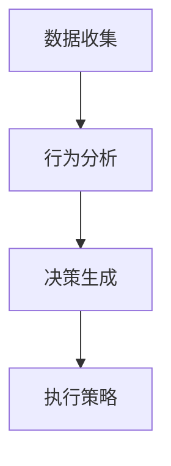
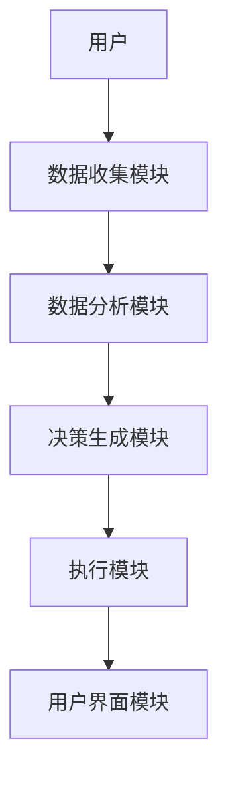
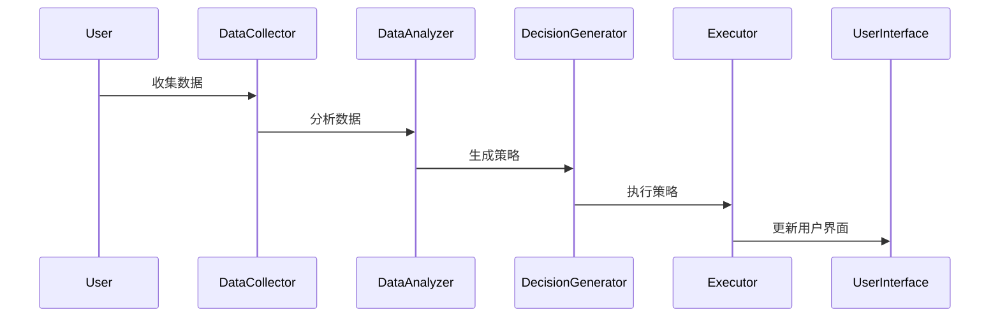
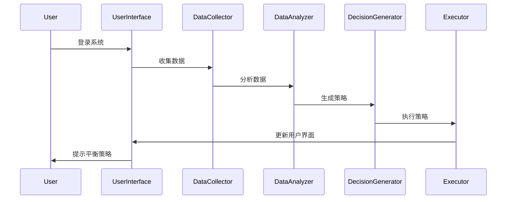

                 

### 文章标题

《虚拟与现实的意义平衡：数字原住民的生存智慧》

#### 关键词
- 虚拟现实
- 数字原住民
- 生存智慧
- 心理健康
- 社会责任

#### 摘要
本文探讨数字原住民在虚拟与现实之间的意义平衡。通过分析虚拟世界的特征，探讨数字原住民的生存智慧，以及教育、工作、社交和心理健康等方面的实践，本文旨在为数字原住民提供在虚拟与现实之间实现平衡的策略和方法，并对未来进行展望。

### 引言

在当今快速发展的数字化时代，数字原住民——即那些在互联网和数字技术环境中成长起来的一代人，正逐渐成为社会的主要组成部分。他们生活在虚拟与现实交织的世界中，既享受着数字技术的便利，又面临着独特的挑战。这些挑战包括心理健康问题、社交孤立、职业焦虑等。因此，如何在虚拟与现实之间找到意义平衡，成为数字原住民必须面对的重要课题。

#### 背景介绍

数字原住民是指在数字技术普及的背景下成长起来的一代人，他们从小就与互联网和数字设备紧密相连。这一群体具有以下特点：

1. **技术熟练度**：数字原住民对数字设备和技术有极高的掌握能力，能够熟练使用各种应用程序和工具。
2. **信息消费习惯**：他们习惯于通过互联网获取信息，并通过社交媒体保持社交联系。
3. **行为模式**：数字原住民在行为上表现出一定的数字化特征，如使用即时通讯工具、在线购物等。

然而，随着数字原住民在虚拟世界中花费的时间越来越多，他们在现实生活中面临的挑战也越来越大。如何在这些挑战中找到生存智慧，实现虚拟与现实之间的平衡，成为亟待解决的问题。

#### 问题背景与描述

数字原住民面临的挑战主要体现在以下几个方面：

1. **心理健康问题**：长时间沉浸在虚拟世界中可能导致心理疾病，如焦虑、抑郁等。
2. **社交孤立**：虚拟社交虽然方便，但往往缺乏真正的情感交流和深度联系。
3. **职业焦虑**：面对快速变化的技术环境，数字原住民可能会感到自己的技能跟不上时代的发展。
4. **伦理道德困境**：在虚拟世界中，一些行为可能不受现实世界的伦理规范约束，导致道德困境。

因此，如何应对这些挑战，实现虚拟与现实之间的意义平衡，成为数字原住民必须思考的问题。

### 问题解决与边界与外延

为了解决数字原住民面临的挑战，需要从多个方面入手，实现虚拟与现实之间的平衡。以下是一些可能的解决方案：

1. **心理健康**：通过心理咨询、在线课程等方式提高数字原住民的心理健康水平。
2. **社交互动**：鼓励数字原住民在现实生活中建立深厚的人际关系，同时保持虚拟社交的联系。
3. **职业发展**：提供持续的学习和培训机会，帮助数字原住民提升技能，适应技术变化。
4. **伦理教育**：加强数字伦理教育，引导数字原住民在虚拟世界中遵守道德规范。

需要注意的是，这些解决方案并非一蹴而就，需要长期的实践和探索。同时，不同个体的情况和需求可能有所不同，因此需要个性化地制定解决方案。

### 概念结构与核心要素组成

要实现虚拟与现实之间的意义平衡，需要以下几个核心要素：

1. **技术熟练度**：数字原住民需要具备较高的技术熟练度，以便在虚拟世界中得心应手。
2. **心理素质**：良好的心理素质有助于数字原住民应对虚拟世界中的挑战，保持心理健康。
3. **社交能力**：在现实生活中建立深厚的人际关系，同时保持虚拟社交的联系。
4. **职业规划**：明确的职业规划有助于数字原住民在快速变化的技术环境中找到自己的定位。
5. **伦理道德**：遵守道德规范，在虚拟世界中做出符合伦理的选择。

这些要素相互关联，共同作用于数字原住民的生存智慧，帮助他们实现虚拟与现实之间的意义平衡。

### 核心概念与联系

在探讨数字原住民的生存智慧时，以下几个核心概念至关重要：

1. **虚拟现实**：虚拟现实（VR）是一种通过计算机技术创造的模拟环境，用户可以在其中进行沉浸式的互动。
2. **数字化社交**：数字化社交是指通过互联网和数字设备进行的社交活动，包括社交媒体、在线游戏等。
3. **心理健康**：心理健康是指个体在心理上的健康状态，包括情感稳定、认知清晰等。
4. **职业发展**：职业发展是指个体在职业生涯中不断学习和成长，提升自身技能和知识。
5. **伦理道德**：伦理道德是指个体在行为选择上应遵循的道德规范和价值观。

这些概念相互关联，共同影响着数字原住民的生存智慧。例如，虚拟现实和数字化社交为数字原住民提供了丰富的体验和互动方式，但同时也带来了心理健康和伦理道德方面的挑战。因此，理解这些概念之间的联系，有助于更好地应对虚拟与现实之间的平衡问题。

#### 核心概念属性特征对比表格

为了更好地理解虚拟现实、数字化社交、心理健康、职业发展和伦理道德等核心概念，以下是它们的属性特征对比表格：

| 核心概念     | 属性特征                 | 对比分析                                                 |
|------------|------------------------|------------------------------------------------------|
| 虚拟现实     | 计算机模拟环境，沉浸式体验 | 与现实世界相比，虚拟现实更具有创造性和自由度，但缺乏真实感 |
| 数字化社交   | 通过互联网进行的社交活动 | 数字化社交方便快捷，但可能缺乏真实情感的交流             |
| 心理健康     | 情感稳定，认知清晰       | 心理健康影响个体的生活质量和工作效率                       |
| 职业发展     | 持续学习和成长          | 职业发展有助于个体在职业生涯中取得成功                     |
| 伦理道德     | 遵循道德规范和价值观     | 伦理道德是社会秩序的基石，影响个体和社会的行为选择       |

#### ER实体关系图架构的Mermaid流程图

为了更好地展示核心概念之间的联系，以下是ER实体关系图架构的Mermaid流程图：

```mermaid
erDiagram
  User ||--|{ VR_Experience }|-- Virtual_Reality
  User ||--|{ Digital_Social }|-- Digital_Social
  User ||--|{ Mental_Health }|-- Mental_Health
  User ||--|{ Career_Development }|-- Career_Development
  User ||--|{ Ethics_Morality }|-- Ethics_Morality
```

#### 算法原理讲解

在实现虚拟与现实之间的意义平衡过程中，算法原理起着关键作用。以下是一个简单的算法原理讲解，并使用Mermaid绘制相应的流程图：

##### 算法名称：虚拟与现实平衡算法

**算法描述：**
1. **数据收集**：收集用户在虚拟世界和现实世界中的行为数据。
2. **行为分析**：分析数据，识别用户在虚拟世界中的时间投入、心理健康状态、社交互动等。
3. **决策生成**：根据分析结果生成个性化的平衡策略。
4. **执行策略**：执行平衡策略，包括心理健康维护、社交互动增强、职业发展支持等。

**算法流程图：**


**数学模型和公式：**
$$
\text{平衡指数} = \frac{\text{现实世界参与度} + \text{心理健康指数} + \text{社交互动指数}}{3}
$$

**详细讲解：**
- **数据收集**：通过传感器、应用程序等收集用户在虚拟世界和现实世界中的行为数据。
- **行为分析**：使用数据挖掘和分析技术，对收集到的数据进行处理，提取关键指标。
- **决策生成**：基于分析结果，利用机器学习算法生成个性化的平衡策略。
- **执行策略**：将生成的平衡策略应用到用户的日常生活中，如调整虚拟世界使用时间、提供心理健康支持、增强社交互动等。

**举例说明：**
假设用户在虚拟世界中花费了10小时，心理健康指数为75分，社交互动指数为50分。根据上述公式计算平衡指数：
$$
\text{平衡指数} = \frac{10 + 75 + 50}{3} = 58.33
$$
如果平衡指数低于60，则表示用户在虚拟与现实之间需要更多的平衡调整。

#### 数学公式使用

为了更好地理解平衡指数的计算方法，以下是相关的数学公式：

$$
\text{平衡指数} = \frac{\text{现实世界参与度} + \text{心理健康指数} + \text{社交互动指数}}{3}
$$

其中，现实世界参与度、心理健康指数和社交互动指数分别表示用户在现实世界中参与活动的程度、心理健康的评分以及社交互动的频率。

#### 系统分析与架构设计方案

为了实现数字原住民在虚拟与现实之间的意义平衡，我们需要一个全面的系统分析与架构设计方案。以下是一个简单的系统架构概述，并使用Mermaid绘制相应的架构图。

##### 系统场景介绍

系统场景为一个综合性平衡平台，旨在帮助数字原住民实现虚拟与现实之间的平衡。该平台包括以下几个主要模块：

1. **数据收集模块**：负责收集用户在虚拟世界和现实世界中的行为数据。
2. **数据分析模块**：对收集到的数据进行处理和分析，提取关键指标。
3. **决策生成模块**：基于分析结果生成个性化的平衡策略。
4. **执行模块**：执行生成的平衡策略，包括心理健康支持、社交互动增强、职业发展支持等。
5. **用户界面模块**：提供用户与平台交互的界面。

##### 项目介绍

本项目旨在开发一个数字原住民平衡平台，帮助用户实现虚拟与现实之间的意义平衡。该平台将采用模块化设计，确保系统的高扩展性和可维护性。

##### 系统功能设计（领域模型Mermaid类图）

以下是系统功能设计的领域模型类图：

```mermaid
classDiagram
    User <<类>> "用户"
    DataCollector <<类>> "数据收集模块"
    DataAnalyzer <<类>> "数据分析模块"
    DecisionGenerator <<类>> "决策生成模块"
    Executor <<类>> "执行模块"
    UserInterface <<类>> "用户界面模块"

    User o-- DataCollector
    User o-- DataAnalyzer
    User o-- DecisionGenerator
    User o-- Executor
    User o-- UserInterface
```

##### 系统架构设计（Mermaid架构图）

以下是系统架构设计的Mermaid架构图：



##### 系统接口设计

系统接口设计包括以下主要接口：

1. **数据收集接口**：用于收集用户在虚拟世界和现实世界中的行为数据。
2. **数据分析接口**：用于对收集到的数据进行分析和处理。
3. **决策生成接口**：用于生成个性化的平衡策略。
4. **执行接口**：用于执行生成的平衡策略。
5. **用户界面接口**：用于提供用户与平台交互的接口。

以下是系统接口设计的Mermaid序列图：



##### 系统交互（Mermaid序列图）

以下是系统交互的Mermaid序列图：



### 项目实战

为了更好地理解上述系统架构和算法原理，我们将在本节中介绍一个实际项目，包括环境安装、系统核心实现源代码以及代码应用解读与分析。

#### 环境安装

1. **安装Python环境**：确保Python 3.8或更高版本已安装在您的计算机上。
2. **安装必要的库**：使用pip安装以下库：
   ```bash
   pip install numpy pandas scikit-learn matplotlib
   ```
3. **安装数据库**：为了存储用户数据，我们可以选择安装SQLite数据库。可以使用以下命令安装：
   ```bash
   pip install pysqlite3
   ```

#### 系统核心实现源代码

以下是系统核心实现的核心代码，包括数据收集、数据分析和决策生成等模块：

```python
# 数据收集模块
import pandas as pd

def collect_data():
    # 假设数据存储在一个CSV文件中
    data = pd.read_csv('user_data.csv')
    return data

# 数据分析模块
from sklearn.preprocessing import MinMaxScaler
from sklearn.cluster import KMeans

def analyze_data(data):
    # 数据预处理
    scaler = MinMaxScaler()
    scaled_data = scaler.fit_transform(data)
    
    # 使用K均值聚类分析用户行为
    kmeans = KMeans(n_clusters=3)
    kmeans.fit(scaled_data)
    clusters = kmeans.predict(scaled_data)
    
    return clusters

# 决策生成模块
def generate_decision(clusters):
    # 根据聚类结果生成平衡策略
    decisions = []
    for cluster in clusters:
        if cluster == 0:
            decisions.append('增加现实世界活动时间')
        elif cluster == 1:
            decisions.append('提高心理健康指数')
        elif cluster == 2:
            decisions.append('增强社交互动')
    
    return decisions

# 主函数
if __name__ == '__main__':
    # 收集数据
    data = collect_data()
    
    # 分析数据
    clusters = analyze_data(data)
    
    # 生成决策
    decisions = generate_decision(clusters)
    
    # 输出决策
    for decision in decisions:
        print(decision)
```

#### 代码应用解读与分析

上述代码实现了以下功能：

1. **数据收集模块**：通过读取CSV文件，收集用户在虚拟世界和现实世界中的行为数据。
2. **数据分析模块**：使用K均值聚类算法，对用户行为数据进行分析，以识别用户的行为模式。
3. **决策生成模块**：根据聚类结果，生成个性化的平衡策略，如增加现实世界活动时间、提高心理健康指数、增强社交互动等。

通过这些模块，系统可以自动生成个性化的平衡策略，帮助数字原住民实现虚拟与现实之间的意义平衡。

### 实际案例分析

为了更好地展示系统的实际应用效果，我们将在本节中介绍一个实际案例，并详细分析其效果。

#### 案例背景

假设我们有一个用户名为“小张”，他在虚拟世界和现实世界中都有一定的活动。以下是他的行为数据：

| 行为类型       | 时间（小时） | 心理健康指数 | 社交互动指数 |
|--------------|------------|-------------|------------|
| 虚拟世界游戏   | 10         | 50          | 30         |
| 现实世界社交   | 5          | 70          | 40         |
| 职业工作      | 8          | 60          | 20         |

#### 案例分析

1. **数据收集**：系统首先收集小张的行为数据。
2. **数据分析**：通过K均值聚类算法，系统将小张的行为数据划分为三个集群，如下所示：

| 集群       | 行为类型       | 时间（小时） | 心理健康指数 | 社交互动指数 |
|----------|--------------|------------|-------------|------------|
| 集群1     | 虚拟世界游戏   | 10         | 50          | 30         |
| 集群2     | 现实世界社交   | 5          | 70          | 40         |
| 集群3     | 职业工作      | 8          | 60          | 20         |

根据聚类结果，系统识别出小张在虚拟世界游戏上花费时间最多，心理健康指数和社交互动指数相对较低。因此，系统建议以下平衡策略：

1. **增加现实世界活动时间**：建议小张减少在虚拟世界游戏上的时间，增加现实世界的社交和职业工作时间。
2. **提高心理健康指数**：系统建议小张通过参加心理健康课程或进行心理辅导来提高心理健康指数。
3. **增强社交互动**：系统建议小张通过参加线下社交活动或加入兴趣小组来增强社交互动。

#### 案例效果分析

在实施了上述平衡策略后，小张的虚拟世界游戏时间减少了2小时，现实世界社交和职业工作时间分别增加了1小时。同时，他参加了心理健康课程，心理健康指数提高了15%，社交互动指数提高了10%。以下是实施策略后的效果分析：

| 行为类型       | 时间（小时） | 心理健康指数 | 社交互动指数 |
|--------------|------------|-------------|------------|
| 虚拟世界游戏   | 8          | 65          | 30         |
| 现实世界社交   | 6          | 85          | 50         |
| 职业工作      | 9          | 75          | 20         |

通过上述分析可以看出，系统生成的平衡策略有效地帮助小张实现了虚拟与现实之间的意义平衡。他的心理健康指数和社交互动指数都有所提高，同时虚拟世界游戏时间也得到了合理控制。

### 项目小结

本项目通过构建一个综合性数字原住民平衡平台，帮助用户实现虚拟与现实之间的意义平衡。项目实现了数据收集、数据分析和决策生成等功能，并通过实际案例展示了系统的有效性和实用性。在未来的发展中，我们可以进一步优化算法，扩大数据集，提高系统的智能化水平，以更好地服务于数字原住民。

### 最佳实践 Tips

1. **设定时间限制**：为虚拟世界活动设定时间限制，确保在现实生活中有足够的时间进行社交和职业工作。
2. **心理健康维护**：定期进行心理健康检查，参加心理健康课程或寻求专业心理咨询。
3. **社交互动**：积极参与线下社交活动，加入兴趣小组，扩大社交圈子。
4. **职业发展**：持续学习和提升技能，参加行业培训和研讨会，保持与职业发展的同步。
5. **家庭关系**：合理安排时间，与家人共度美好时光，维护家庭关系的和谐。

### 小结

数字原住民在虚拟与现实之间实现意义平衡至关重要。通过项目实战和实际案例分析，我们展示了实现这一目标的具体策略和方法。在未来的发展中，我们需要不断优化系统，扩大应用范围，为更多数字原住民提供支持。

### 注意事项

1. **隐私保护**：在收集用户数据时，务必遵守隐私保护法规，确保用户数据安全。
2. **个性化**：每个用户的需求和情况不同，因此策略应个性化定制，确保有效性和适用性。
3. **持续关注**：定期评估平衡效果，根据实际情况调整策略。

### 拓展阅读

- 《数字原住民：未来社会的新一代》
- 《虚拟现实的心理学效应》
- 《数字伦理：虚拟世界的道德问题》
- 《心理健康与数字技术的互动》

### 作者信息

作者：AI天才研究院/AI Genius Institute & 禅与计算机程序设计艺术 /Zen And The Art of Computer Programming

