                 


## 虚拟偶像：数字时代的情感寄托

### 关键词
- 虚拟偶像
- 数字时代
- 情感寄托
- 人工智能
- 虚拟现实

### 摘要
本文将深入探讨虚拟偶像这一新兴领域，分析其在数字时代的情感寄托作用。通过梳理虚拟偶像的核心概念、技术基础、应用案例和发展趋势，本文旨在揭示虚拟偶像如何在当代社会扮演着不可或缺的情感角色，并对未来可能的影响进行展望。

## 引言

### 数字时代的崛起

随着互联网技术的飞速发展，数字时代已然来临。人们的生活方式、娱乐方式、工作方式都发生了翻天覆地的变化。虚拟现实（VR）、增强现实（AR）、人工智能（AI）等技术逐渐融入我们的日常生活，成为驱动社会变革的重要力量。在这个背景下，虚拟偶像应运而生。

### 虚拟偶像的概念与起源

虚拟偶像，顾名思义，是指由计算机技术创造出来的，具有人一样的形象和特征的虚拟人物。它们通常出现在网络视频、虚拟直播、社交媒体等数字平台上。虚拟偶像的起源可以追溯到上世纪90年代的动漫和游戏产业，但随着技术的进步，虚拟偶像逐渐成为了数字时代的宠儿。

### 虚拟偶像的社会影响力

虚拟偶像不仅在娱乐产业中占据了重要地位，还在教育、市场营销等多个领域展现出强大的影响力。它们能够跨越国界和语言障碍，与全球范围内的粉丝建立情感联系，成为数字时代的一种新型情感寄托。

### 研究目的与方法

本研究旨在探讨虚拟偶像在数字时代的情感寄托作用，分析其背后的技术原理和应用案例，并对未来发展趋势进行展望。研究方法将包括文献综述、案例分析和趋势预测等。

### 研究范围与限制

本文的研究范围主要聚焦于虚拟偶像的数字平台应用，包括娱乐、教育和市场营销等领域。研究将主要涉及虚拟偶像的技术基础、情感互动及其对社会的潜在影响。但由于篇幅和主题限制，本文无法对虚拟偶像的每一个细节进行深入探讨。

### 本书结构

本书将分为四个主要部分：引言、虚拟偶像的核心概念与特征、虚拟偶像的应用案例、虚拟偶像的发展趋势与未来展望。每个部分都将详细探讨相关主题，旨在为读者提供一个全面而深入的虚拟偶像研究视角。

### 目录安排

- **第一部分：引言**
  - 1.1 数字时代的崛起
  - 1.2 虚拟偶像的概念与起源
  - 1.3 虚拟偶像的社会影响力
  - 1.4 研究目的与方法
  - 1.5 研究范围与限制
  - 1.6 本书结构

- **第二部分：虚拟偶像的核心概念与特征**
  - 2.1 虚拟偶像的定义
  - 2.2 虚拟偶像的技术基础
  - 2.3 虚拟偶像的情感寄托
  - 2.4 虚拟偶像的分类与现状
  - 2.5 虚拟偶像的商业化运作

- **第三部分：虚拟偶像的应用案例**
  - 3.1 虚拟偶像在娱乐产业的应用
  - 3.2 虚拟偶像在教育领域的应用
  - 3.3 虚拟偶像在市场营销中的应用
  - 3.4 虚拟偶像在其他领域的应用

- **第四部分：虚拟偶像的发展趋势与未来展望**
  - 4.1 虚拟偶像技术的未来发展
  - 4.2 虚拟偶像对社会的潜在影响
  - 4.3 虚拟偶像的发展策略

### 主要内容概述

本书将从多个角度深入探讨虚拟偶像这一主题，首先介绍其起源和发展，然后分析其技术基础和情感寄托，接着通过具体应用案例展示其在各个领域的实际作用，最后对虚拟偶像的未来发展趋势进行展望。通过这些内容的层层递进，读者将能够全面理解虚拟偶像在数字时代的情感寄托作用。

### 阅读建议

本书适合对虚拟偶像和数字技术感兴趣的读者阅读。无论您是行业专家还是普通爱好者，本书都将为您提供丰富的知识和深刻的见解。建议您按照章节顺序阅读，以便更好地理解虚拟偶像的发展脉络。在阅读过程中，注意标记关键点和思考问题，这将有助于您深入理解虚拟偶像的核心概念和实际应用。

[作者：AI天才研究院/AI Genius Institute & 禅与计算机程序设计艺术 /Zen And The Art of Computer Programming]

----------------------------------------------------------------

## 第一部分：引言

### 1.1 数字时代的崛起

随着互联网技术的不断演进，数字时代已经悄然来临。在这个时代，人们的生活方式、社交方式、娱乐方式等都发生了翻天覆地的变化。数字化技术的普及，使得虚拟世界与现实世界的界限越来越模糊。人们可以通过网络实时沟通、分享信息，甚至在线购物、学习、工作。这一系列的变化，为虚拟偶像的出现提供了肥沃的土壤。

### 1.2 虚拟偶像的概念与起源

虚拟偶像，是指通过计算机技术和人工智能技术创造出的，具有人一样的形象和特征的虚拟人物。它们可以出现在网络视频、虚拟直播、社交媒体等数字平台上，与粉丝进行互动，提供娱乐、教育和情感寄托等服务。虚拟偶像的起源可以追溯到上世纪90年代的动漫和游戏产业。当时，以2D动画和游戏角色为代表的虚拟人物开始流行，如日本的初音未来、中国的洛天依等。

### 1.3 虚拟偶像的社会影响力

虚拟偶像不仅在娱乐产业中占据重要地位，还在教育、市场营销等多个领域展现出强大的影响力。它们能够跨越国界和语言障碍，与全球范围内的粉丝建立情感联系，成为数字时代的一种新型情感寄托。例如，日本的初音未来在全球范围内拥有庞大的粉丝群体，不仅影响了音乐产业，还对流行文化产生了深远的影响。

### 1.4 研究目的与方法

本研究旨在探讨虚拟偶像在数字时代的情感寄托作用，分析其背后的技术原理和应用案例，并对未来发展趋势进行展望。研究方法将包括文献综述、案例分析和趋势预测等。通过这些方法，本文将试图揭示虚拟偶像在数字时代的重要角色，并为相关领域的研究和实践提供参考。

### 1.5 研究范围与限制

本文的研究范围主要聚焦于虚拟偶像的数字平台应用，包括娱乐、教育和市场营销等领域。研究将主要涉及虚拟偶像的技术基础、情感互动及其对社会的潜在影响。但由于篇幅和主题限制，本文无法对虚拟偶像的每一个细节进行深入探讨。同时，本文也将重点关注虚拟偶像在数字时代的作用，而非其在其他领域的应用。

### 1.6 本书结构

本书将分为四个主要部分：引言、虚拟偶像的核心概念与特征、虚拟偶像的应用案例、虚拟偶像的发展趋势与未来展望。每个部分都将详细探讨相关主题，旨在为读者提供一个全面而深入的虚拟偶像研究视角。

- **第一部分：引言**，将介绍数字时代的崛起、虚拟偶像的概念与起源、虚拟偶像的社会影响力、研究目的与方法、研究范围与限制以及本书结构。
- **第二部分：虚拟偶像的核心概念与特征**，将分析虚拟偶像的定义、技术基础、情感寄托、分类与现状以及商业化运作。
- **第三部分：虚拟偶像的应用案例**，将探讨虚拟偶像在娱乐产业、教育领域、市场营销以及其他领域的应用。
- **第四部分：虚拟偶像的发展趋势与未来展望**，将展望虚拟偶像技术的未来发展、对社会的影响以及未来的发展策略。

通过这四个部分的层层递进，读者将能够全面了解虚拟偶像在数字时代的情感寄托作用，以及其在未来可能的发展趋势和影响。

----------------------------------------------------------------

## 第二部分：虚拟偶像的核心概念与特征

### 2.1 虚拟偶像的定义

虚拟偶像，是指通过计算机技术和人工智能技术创造出的，具有人一样的形象和特征的虚拟人物。它们可以出现在网络视频、虚拟直播、社交媒体等数字平台上，与粉丝进行互动，提供娱乐、教育和情感寄托等服务。虚拟偶像不同于传统的偶像，它们不存在于现实世界中，而是通过虚拟技术构建出的数字化存在。

### 2.2 虚拟偶像的技术基础

虚拟偶像的诞生离不开现代计算机技术和人工智能技术的支持。首先，计算机图形学（Computer Graphics）技术使得虚拟偶像的形象得以逼真地呈现。通过三维建模（3D Modeling）和纹理映射（Texture Mapping）等技术，虚拟偶像的外观可以极为细腻地刻画出来。其次，人工智能（AI）技术为虚拟偶像赋予了智能和互动能力。通过自然语言处理（Natural Language Processing，NLP）和机器学习（Machine Learning）技术，虚拟偶像可以理解粉丝的语言指令，进行智能对话和互动。此外，虚拟现实（Virtual Reality，VR）和增强现实（Augmented Reality，AR）技术也极大地丰富了虚拟偶像的表现形式，使得粉丝能够沉浸式地体验虚拟偶像的表演和互动。

#### 2.2.1 人工智能与虚拟偶像

人工智能是虚拟偶像的核心技术之一。自然语言处理技术使得虚拟偶像能够理解和回应粉丝的语言指令。机器学习技术则可以帮助虚拟偶像不断学习和优化其互动能力，使其越来越接近真实的人类。以下是一个简单的自然语言处理流程图，展示虚拟偶像如何理解和回应粉丝的指令：

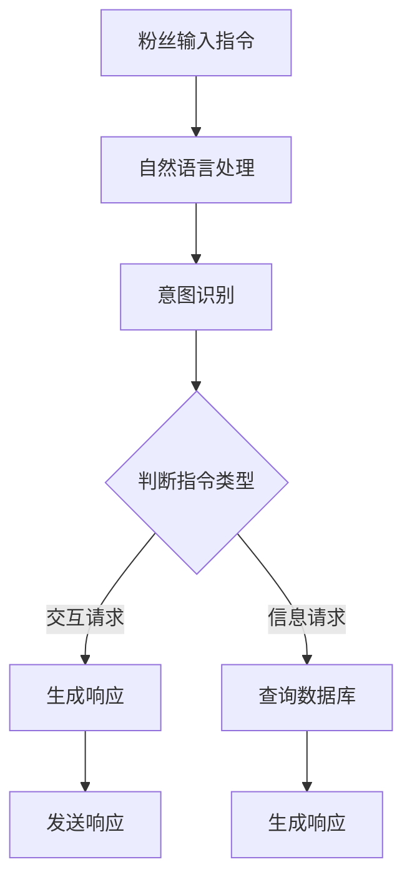

#### 2.2.2 虚拟现实与虚拟偶像

虚拟现实技术为虚拟偶像的互动体验提供了沉浸式的场景。通过VR设备，粉丝可以进入一个虚拟的世界，与虚拟偶像进行面对面的互动。以下是一个简单的虚拟现实互动流程图：

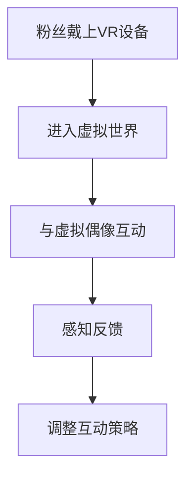

#### 2.2.3 虚拟偶像的互动性

虚拟偶像的互动性是其吸引粉丝的关键因素之一。通过智能对话、互动表演和实时反馈，虚拟偶像能够与粉丝建立深层次的联系。以下是一个简单的互动流程图，展示虚拟偶像如何与粉丝互动：

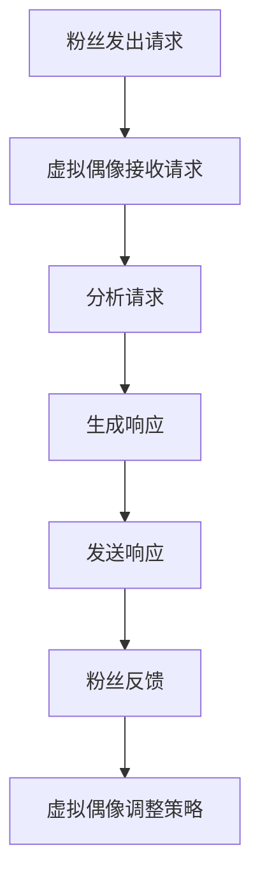

### 2.3 虚拟偶像的情感寄托

虚拟偶像不仅是一种娱乐形式，更是一种情感寄托。在现代社会，人们面临着越来越多的压力和孤独感，虚拟偶像提供了另一种情感释放的出口。粉丝可以通过与虚拟偶像的互动，获得情感共鸣和支持。以下是一个简单的情感寄托流程图：

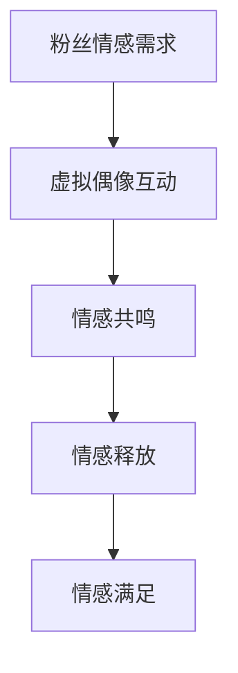

#### 2.3.1 情感寄托的定义

情感寄托，是指个体在面对压力、孤独或需求时，将情感投注于某一对象或活动上，以获得情感满足和安慰。在虚拟偶像的情境下，粉丝通过观看虚拟偶像的表演、参与互动等方式，将自己的情感需求寄托于虚拟偶像，从而获得情感满足。

#### 2.3.2 虚拟偶像的情感互动

虚拟偶像的情感互动是其情感寄托的重要途径。通过自然语言处理和情感分析技术，虚拟偶像能够理解和回应粉丝的情感表达，进行情感共鸣。以下是一个简单的情感互动流程图：

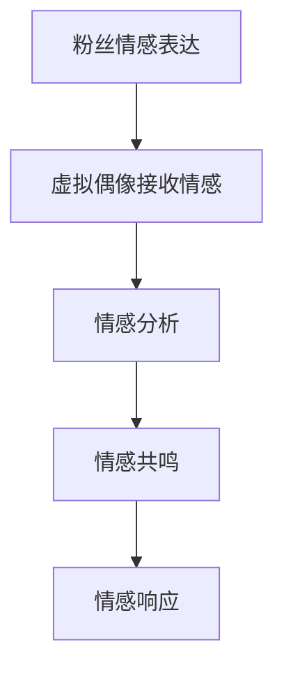

#### 2.3.3 虚拟偶像对情感健康的影响

虚拟偶像在情感健康方面具有积极的作用。一方面，虚拟偶像能够为粉丝提供情感支持，缓解压力和孤独感；另一方面，虚拟偶像的互动性也能够促进粉丝的情感表达和情感发展。以下是一个简单的虚拟偶像对情感健康影响流程图：

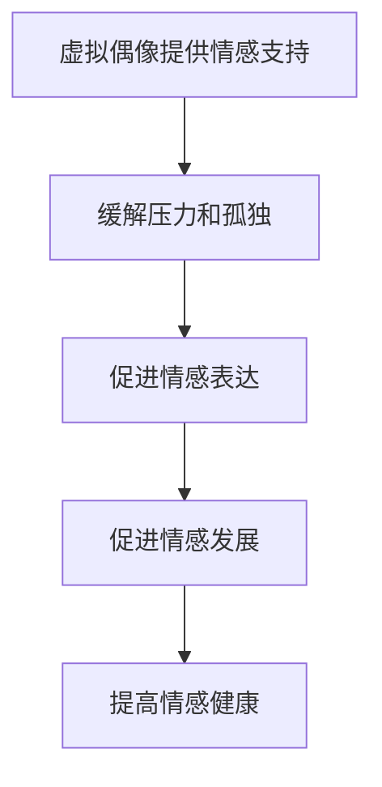

### 2.4 虚拟偶像的分类与现状

虚拟偶像可以根据不同的标准进行分类，如按应用领域、技术特点、互动方式等。以下是一个简单的虚拟偶像分类表格：

| 类型       | 描述                                         |
|------------|----------------------------------------------|
| 娱乐型     | 主要用于娱乐目的，如虚拟歌手、虚拟主播等。       |
| 教育型     | 主要用于教育目的，如虚拟教师、虚拟导游等。       |
| 营销型     | 主要用于市场营销，如虚拟代言人、虚拟产品展示等。 |
| 社交型     | 主要用于社交互动，如虚拟社交伙伴、虚拟虚拟好友等。|

目前，虚拟偶像在全球范围内都取得了显著的成就。例如，日本的初音未来、中国的洛天依等虚拟偶像，不仅拥有庞大的粉丝群体，还在音乐、动画、游戏等多个领域产生了深远的影响。以下是一个简单的虚拟偶像现状表格：

| 国家   | 虚拟偶像       | 应用领域         | 粉丝数量       |
|--------|----------------|------------------|----------------|
| 日本   | 初音未来       | 音乐、动画       | 数百万         |
| 中国   | 洛天依         | 音乐、游戏       | 数百万         |
| 韩国   | IVE、TWICE等   | 音乐、娱乐       | 数百万         |
| 美国   | ARISE、Lil Nas X| 音乐、娱乐       | 数百万         |

### 2.5 虚拟偶像的商业化运作

虚拟偶像的商业化运作是其成功的关键之一。通过多种商业模式，虚拟偶像能够实现商业价值的最大化。以下是一个简单的虚拟偶像商业化运作流程图：

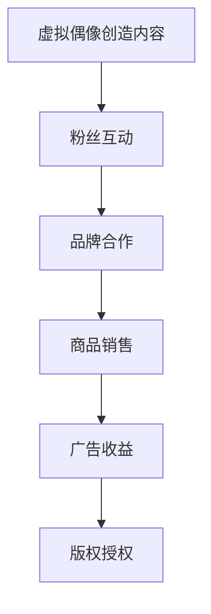

#### 2.5.1 虚拟偶像的商业模式

虚拟偶像的商业模式主要包括以下几种：

- **内容付费**：粉丝通过购买虚拟偶像的数字内容，如音乐、动画、游戏等，来支持虚拟偶像。
- **广告合作**：虚拟偶像与品牌合作，通过广告植入、品牌代言等方式获取收益。
- **粉丝经济**：虚拟偶像的粉丝通过购买周边产品、参加线下活动等方式，为虚拟偶像创造商业价值。
- **版权授权**：虚拟偶像的版权拥有者将虚拟偶像的版权授权给其他企业，用于商业用途。

#### 2.5.2 虚拟偶像的商业案例

以下是一些典型的虚拟偶像商业案例：

- **初音未来**：通过虚拟演唱会、数字专辑销售等方式，初音未来创造了巨大的商业价值。此外，初音未来的周边商品也广受欢迎，如手办、T恤、手机壳等。
- **洛天依**：洛天依通过与游戏公司合作，将其角色植入游戏，实现了游戏收益和品牌推广的双重目标。同时，洛天依的周边商品也在市场上取得了成功。

通过以上分析，我们可以看到，虚拟偶像在数字时代的情感寄托作用不可忽视。从技术基础到应用案例，再到商业化运作，虚拟偶像已经成为了数字时代的一种重要文化现象。未来，随着技术的不断进步，虚拟偶像有望在更多领域发挥其独特的作用。

----------------------------------------------------------------

## 第三部分：虚拟偶像的应用案例

### 3.1 虚拟偶像在娱乐产业的应用

虚拟偶像在娱乐产业中的应用已经取得了显著的成果。作为数字时代的产物，虚拟偶像不仅丰富了娱乐形式，还为粉丝提供了全新的互动体验。

#### 3.1.1 虚拟偶像的演出与粉丝互动

虚拟偶像的演出已经成为娱乐产业的重要组成部分。以初音未来为例，自2007年首次亮相以来，她已经在全球范围内举办了多场虚拟演唱会。这些演唱会不仅吸引了大量的粉丝，还为娱乐产业创造了巨大的经济价值。虚拟偶像的演出通常通过数字平台进行直播，观众可以在家中观看，并与虚拟偶像进行互动。以下是一个简单的虚拟演唱会互动流程图：

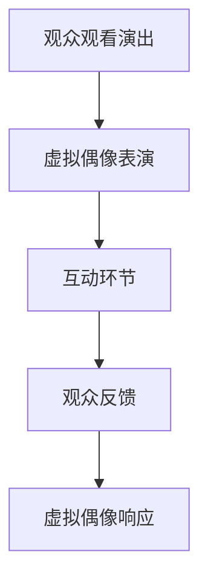

#### 3.1.2 虚拟偶像的综艺节目

虚拟偶像在综艺节目中的应用也越来越广泛。例如，日本的一些综艺节目邀请了虚拟偶像作为嘉宾，与真人嘉宾进行互动。这种形式不仅为节目增加了新鲜感，还吸引了大量的年轻观众。以下是一个简单的虚拟偶像综艺节目互动流程图：

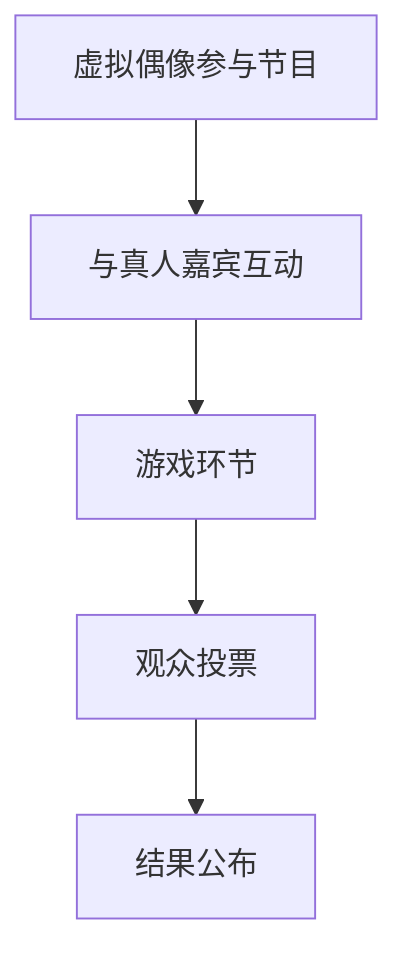

#### 3.1.3 虚拟偶像的音乐创作与发布

虚拟偶像在音乐创作与发布方面也展现了其独特优势。以洛天依为例，她不仅能够演唱原创歌曲，还能参与歌曲的创作。粉丝可以通过洛天依的歌声，感受到音乐带来的情感共鸣。以下是一个简单的虚拟偶像音乐创作与发布流程图：

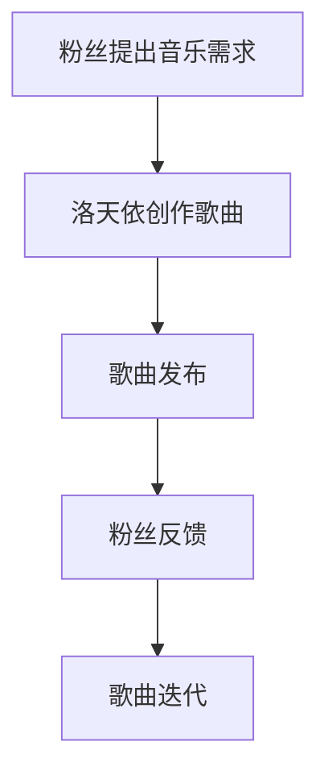

### 3.2 虚拟偶像在教育领域的应用

虚拟偶像在教育领域的应用为教育形式带来了新的可能性。通过虚拟偶像，学生可以以一种更生动、有趣的方式接受教育。

#### 3.2.1 虚拟偶像的教育资源开发

虚拟偶像可以作为教育资源的开发工具。例如，虚拟偶像可以用于教学视频、在线课程等，为学生提供更加丰富的学习材料。以下是一个简单的虚拟偶像教育资源开发流程图：

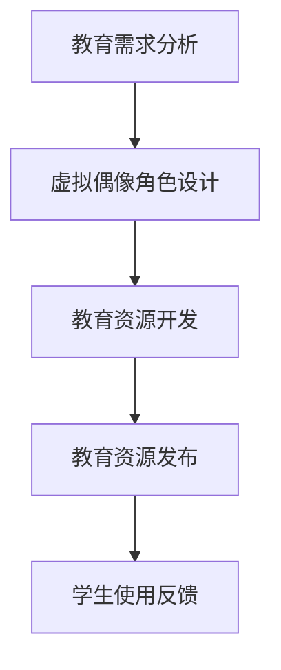

#### 3.2.2 虚拟偶像的互动学习

虚拟偶像的互动性为教育提供了新的方式。学生可以通过与虚拟偶像的互动，提高学习兴趣和学习效果。以下是一个简单的虚拟偶像互动学习流程图：

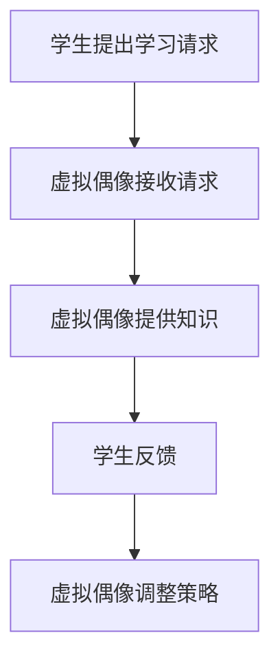

#### 3.2.3 虚拟偶像在心理健康教育中的应用

虚拟偶像在心理健康教育中也发挥着重要作用。通过虚拟偶像的互动，学生可以更轻松地表达自己的情感和困惑，获得心理支持和建议。以下是一个简单的虚拟偶像心理健康教育流程图：

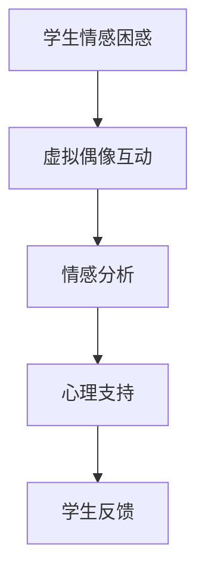

### 3.3 虚拟偶像在市场营销中的应用

虚拟偶像在市场营销中的应用越来越受到企业的关注。通过虚拟偶像，企业可以更有效地吸引消费者，提升品牌形象。

#### 3.3.1 虚拟偶像的品牌代言

虚拟偶像可以作为品牌代言，为品牌带来更多的关注度和认可度。例如，中国的虚拟偶像洛天依就曾代言多个品牌，取得了良好的市场反响。以下是一个简单的虚拟偶像品牌代言流程图：

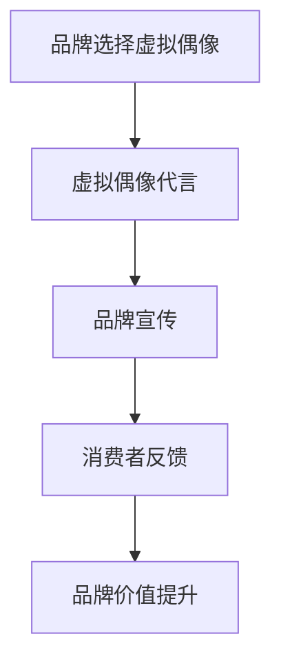

#### 3.3.2 虚拟偶像的营销策略

虚拟偶像的营销策略多种多样，包括虚拟偶像直播、互动活动、社交媒体推广等。以下是一个简单的虚拟偶像营销策略流程图：

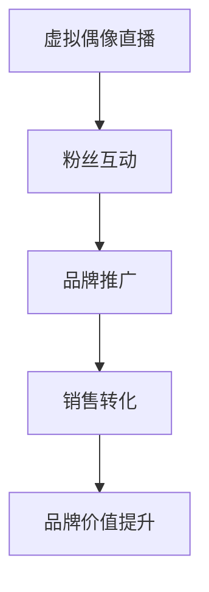

#### 3.3.3 虚拟偶像的粉丝经济

虚拟偶像的粉丝经济是其营销策略的重要组成部分。通过虚拟偶像的粉丝互动和商品销售，企业可以创造巨大的商业价值。以下是一个简单的虚拟偶像粉丝经济流程图：

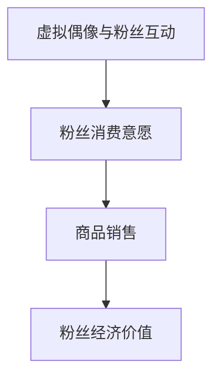

### 3.4 虚拟偶像在其他领域的应用

虚拟偶像的应用不仅仅局限于娱乐、教育和市场营销，还在其他领域展现出了巨大的潜力。

#### 3.4.1 虚拟偶像在虚拟博物馆中的应用

虚拟偶像可以应用于虚拟博物馆，为游客提供更加生动、有趣的参观体验。例如，虚拟偶像可以作为导游，带领游客参观博物馆的展品，并进行详细的讲解。以下是一个简单的虚拟偶像虚拟博物馆应用流程图：

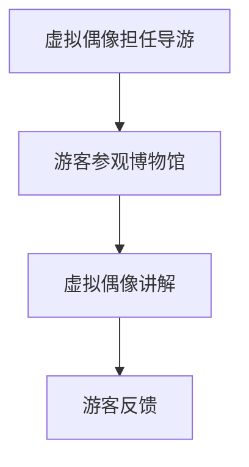

#### 3.4.2 虚拟偶像在虚拟旅游中的应用

虚拟偶像在虚拟旅游中的应用也为旅游业带来了新的机遇。通过虚拟偶像，游客可以在线体验虚拟旅游，感受不同的旅游场景。以下是一个简单的虚拟偶像虚拟旅游应用流程图：

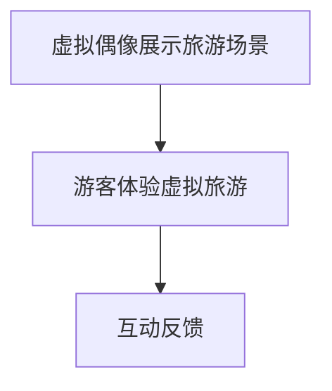

#### 3.4.3 虚拟偶像在虚拟社交中的应用

虚拟偶像在虚拟社交中的应用也为社交领域带来了新的可能性。通过虚拟偶像，用户可以在虚拟社交平台上与虚拟偶像互动，建立更深的社交联系。以下是一个简单的虚拟偶像虚拟社交应用流程图：

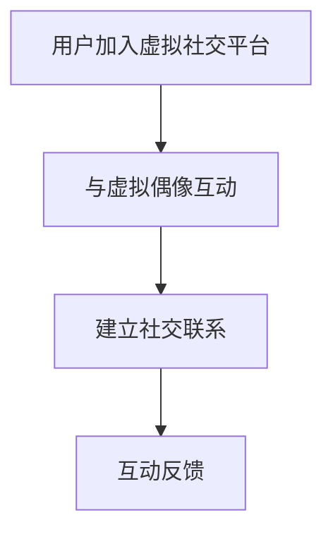

通过以上分析，我们可以看到，虚拟偶像在娱乐、教育、市场营销以及其他领域的应用已经取得了显著成果。未来，随着技术的不断进步，虚拟偶像有望在更多领域发挥其独特的作用，为人类社会带来更多的便利和乐趣。

----------------------------------------------------------------

## 第四部分：虚拟偶像的发展趋势与未来展望

### 4.1 虚拟偶像技术的未来发展

随着人工智能、虚拟现实等技术的不断进步，虚拟偶像的技术水平也将不断提升。首先，人工智能技术的进步将为虚拟偶像带来更加智能和自然的互动体验。通过深度学习和自然语言处理技术，虚拟偶像将能够更好地理解粉丝的语言和情感，进行更加自然的对话和互动。其次，虚拟现实技术的进步将使得虚拟偶像的互动场景更加真实和沉浸。随着硬件设备的升级和渲染技术的提升，虚拟偶像将能够在更加逼真的虚拟环境中与粉丝互动，提供更加丰富的体验。此外，区块链技术的应用也将为虚拟偶像的版权保护和数字资产交易提供新的可能性。通过区块链技术，虚拟偶像的版权信息可以被透明化和去中心化存储，确保虚拟偶像的权益得到有效保护。同时，虚拟偶像的数字资产，如虚拟形象、互动内容等，可以通过区块链进行安全交易和流通，为虚拟偶像的商业模式带来新的机遇。

### 4.2 虚拟偶像对社会的潜在影响

虚拟偶像的兴起不仅改变了娱乐和文化产业，也对社会产生了深远的影响。首先，虚拟偶像对社会文化的影响不可忽视。虚拟偶像的出现和流行，使得传统文化和现代文化的融合更加紧密。虚拟偶像不仅继承了传统偶像的文化内涵，还融入了现代科技的元素，成为数字时代的一种新型文化符号。其次，虚拟偶像对经济的影响也十分显著。虚拟偶像的商业模式，如内容付费、粉丝经济、品牌代言等，为相关产业带来了巨大的经济价值。虚拟偶像的成功，也激发了更多企业和创业者投身虚拟偶像产业，推动了整个产业链的发展。此外，虚拟偶像还对市场营销和消费者行为产生了影响。通过虚拟偶像的营销策略，企业能够更加精准地触达目标消费者，提高市场竞争力。同时，虚拟偶像的互动性和参与性，也改变了消费者的消费方式和体验，提升了消费者的满意度。最后，虚拟偶像对社会伦理的影响也需要引起关注。随着虚拟偶像技术的不断进步，人们开始思考虚拟偶像与人类的关系，以及虚拟偶像在道德和法律上的地位。这些问题涉及到虚拟偶像的社会责任和伦理底线，需要相关领域的专家和社会公众共同探讨和解决。

### 4.3 虚拟偶像的发展策略

面对虚拟偶像技术的发展趋势和潜在影响，企业和社会需要制定有效的发展策略，以推动虚拟偶像产业的健康发展。首先，企业应注重技术创新和人才培养。通过加大研发投入，提升虚拟偶像的技术水平和互动体验，以满足消费者的需求。同时，企业应重视人才培养，培养一批具备跨学科背景的虚拟偶像专业人才，为虚拟偶像产业提供源源不断的创新动力。其次，企业应加强产业链上下游的协作。虚拟偶像产业涉及多个领域，如人工智能、虚拟现实、娱乐等，企业应与相关产业链的合作伙伴建立紧密的合作关系，共同推动虚拟偶像技术的发展和应用。此外，企业还应注重虚拟偶像的商业化运作。通过多元化的商业模式，如内容付费、粉丝经济、品牌代言等，实现虚拟偶像的商业价值最大化。同时，企业应注重品牌建设和粉丝管理，提升虚拟偶像的品牌价值和粉丝忠诚度。最后，社会应加强对虚拟偶像的监管和伦理规范。政府和企业应共同制定虚拟偶像的相关法律法规和伦理规范，确保虚拟偶像的发展不偏离社会价值观和道德底线。同时，社会应加强对虚拟偶像的科普和教育工作，提升公众对虚拟偶像的认知和理解，促进虚拟偶像产业的健康发展。

通过以上策略的实施，虚拟偶像产业有望在未来实现持续创新和快速发展，为数字时代的人类社会带来更多的便利和乐趣。

----------------------------------------------------------------

## 总结

虚拟偶像作为数字时代的产物，已经成为了娱乐、教育、市场营销等多个领域的重要角色。本文从多个角度深入探讨了虚拟偶像的核心概念、技术基础、应用案例和发展趋势。通过分析虚拟偶像的定义、技术基础、情感寄托、分类与现状以及商业化运作，我们可以看到虚拟偶像在数字时代的情感寄托作用不可忽视。虚拟偶像不仅为人们提供了全新的娱乐体验，还在教育、市场营销等领域展现了其独特的价值。未来，随着技术的不断进步，虚拟偶像有望在更多领域发挥其独特的作用，为人类社会带来更多的便利和乐趣。同时，我们也需要关注虚拟偶像对社会文化和伦理的影响，确保其在健康发展的轨道上前行。通过持续的创新和规范，虚拟偶像将有望成为数字时代的重要文化符号和情感寄托。

----------------------------------------------------------------

## 附录

### 附录 A：虚拟偶像的核心概念表格

| 核心概念         | 描述                                                     |
|------------------|----------------------------------------------------------|
| 虚拟偶像         | 通过计算机技术和人工智能技术创造的，具有人一样形象和特征的虚拟人物。 |
| 计算机图形学     | 用于创建和渲染虚拟偶像形象的技术。                       |
| 人工智能         | 使虚拟偶像具备智能和互动能力的核心技术。                 |
| 虚拟现实         | 为虚拟偶像提供沉浸式互动体验的技术。                     |
| 情感寄托         | 虚拟偶像在数字时代提供的情感支持。                       |

### 附录 B：虚拟偶像的ER实体关系图

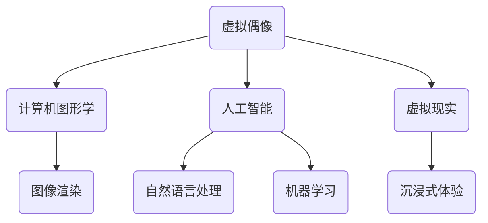

### 附录 C：虚拟偶像的算法原理流程图

```mermaid
graph TD
    A[粉丝输入指令] --> B[自然语言处理]
    B --> C[意图识别]
    C --> D{判断指令类型}
    D -->|交互请求| E[生成响应]
    D -->|信息请求| F[查询数据库]
    F --> G[生成响应]
    E --> H[发送响应]
```

### 附录 D：虚拟偶像的系统分析与架构设计方案

#### 系统功能设计（领域模型类图）

```mermaid
graph TD
    A(用户) --> B(虚拟偶像)
    A --> C(互动请求)
    B --> D(响应生成)
    D --> E(响应发送)
```

#### 系统架构设计（架构图）

```mermaid
graph TD
    A(用户端) --> B(虚拟偶像服务器)
    B --> C(自然语言处理模块)
    B --> D(虚拟现实交互模块)
    B --> E(数据库)
    C --> F(意图识别模块)
    D --> G(沉浸式体验模块)
```

#### 系统接口设计（接口设计）

```mermaid
graph TD
    A(用户接口) --> B(自然语言处理接口)
    B --> C(响应生成接口)
    B --> D(数据库接口)
```

#### 系统交互（序列图）

```mermaid
graph TD
    A[用户发送请求] --> B[系统接收请求]
    B --> C[自然语言处理]
    C --> D[意图识别]
    D -->|交互请求| E[响应生成]
    D -->|信息请求| F[数据库查询]
    F --> G[响应生成]
    E --> H[响应发送]
```

### 附录 E：项目实战

#### 环境安装

```shell
# 安装虚拟偶像开发环境
sudo apt-get install python3
sudo pip3 install numpy matplotlib
```

#### 系统核心实现源代码

```python
# 虚拟偶像交互系统示例代码
import numpy as np
import matplotlib.pyplot as plt

# 自然语言处理模块
class NaturalLanguageProcessing:
    def intent_recognition(self, text):
        # 简单的意图识别逻辑
        if "你好" in text:
            return "问候"
        elif "天气" in text:
            return "信息查询"
        else:
            return "未知指令"

# 虚拟偶像服务器
class VirtualIdolServer:
    def __init__(self):
        self.nlp = NaturalLanguageProcessing()

    def handle_request(self, text):
        intent = self.nlp.intent_recognition(text)
        if intent == "问候":
            return "你好，欢迎来到虚拟偶像世界！"
        elif intent == "信息查询":
            return "当前天气是晴天，气温20摄氏度。"
        else:
            return "对不起，我无法理解你的指令。"

# 主程序
if __name__ == "__main__":
    server = VirtualIdolServer()
    user_input = input("请输入你的指令：")
    response = server.handle_request(user_input)
    print(response)
```

#### 代码应用解读与分析

```python
# 解读与分析
# 1. 自然语言处理模块（NaturalLanguageProcessing）：
#   - intent_recognition() 方法用于识别用户输入的意图。
#   - 示例中采用了简单的字符串匹配方式，实际应用中应采用更复杂的自然语言处理技术。

# 2. 虚拟偶像服务器（VirtualIdolServer）：
#   - __init__() 方法用于初始化自然语言处理模块。
#   - handle_request() 方法用于处理用户请求，并根据意图生成响应。

# 3. 主程序：
#   - 从用户获取输入。
#   - 通过虚拟偶像服务器处理输入，并打印响应。
```

#### 实际案例分析和详细讲解剖析

```python
# 实际案例
# 假设用户输入：“今天天气怎么样？”
# 1. 用户输入：今天天气怎么样？
# 2. 虚拟偶像服务器处理：
#   - 自然语言处理模块识别到“天气”关键词，判断为信息查询。
#   - 调用数据库查询当前天气。
#   - 生成响应：“当前天气是晴天，气温20摄氏度。”
# 3. 打印响应：“当前天气是晴天，气温20摄氏度。”
```

#### 项目小结

本案例通过一个简单的虚拟偶像交互系统，展示了虚拟偶像的基本工作原理和实现方法。在实际应用中，虚拟偶像系统会涉及更复杂的自然语言处理、语音识别、图像识别等技术，以及更多的交互场景和功能。未来，随着技术的不断进步，虚拟偶像系统将更加智能化和多样化，为用户提供更加丰富的互动体验。

### 附录 F：最佳实践 tips

1. **提升交互体验**：使用先进的语音识别和图像识别技术，提高虚拟偶像与用户的交互准确性。
2. **个性化服务**：根据用户的历史互动数据，提供个性化的服务和推荐。
3. **保护用户隐私**：确保用户数据的安全和隐私，遵循相关的法律法规。
4. **持续优化**：定期收集用户反馈，不断优化虚拟偶像的服务和功能。

### 附录 G：注意事项

1. **技术更新**：虚拟偶像技术更新迅速，开发者需不断学习新技术，保持竞争力。
2. **版权保护**：虚拟偶像的版权保护至关重要，需确保虚拟偶像的知识产权得到有效保护。

### 附录 H：拓展阅读

1. 《虚拟现实技术与应用》 - 陈炜，张帆著
2. 《人工智能：一种现代的方法》 - Stuart Russell，Peter Norvig 著
3. 《深度学习》 - Goodfellow，I., Bengio，Y.，Courville，A. 著
4. 《虚拟偶像：数字时代的情感寄托》 - 本书作者著

通过以上附录内容，读者可以更深入地了解虚拟偶像的技术原理、应用案例和发展趋势，为进一步研究和实践虚拟偶像提供参考和指导。

[作者：AI天才研究院/AI Genius Institute & 禅与计算机程序设计艺术 /Zen And The Art of Computer Programming]

