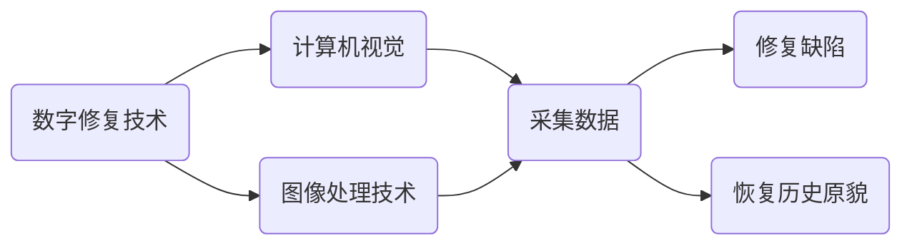
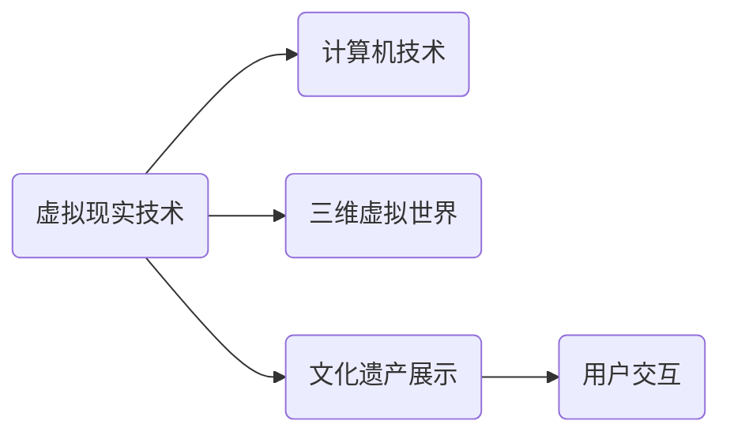
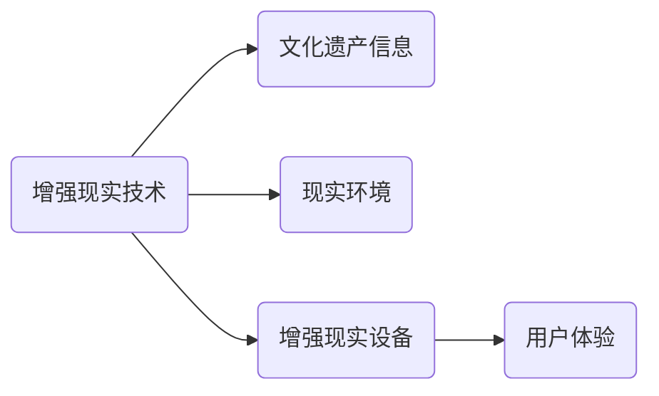
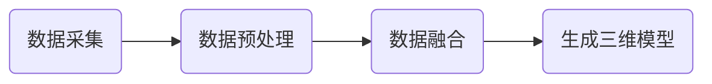
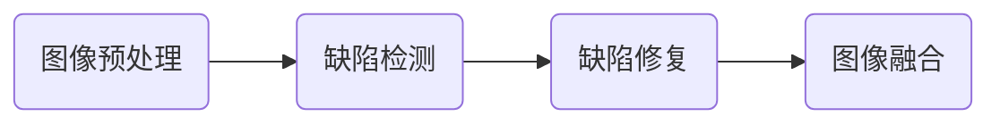
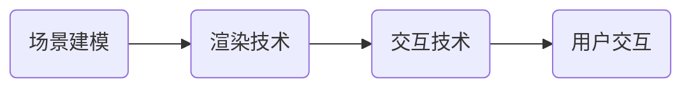
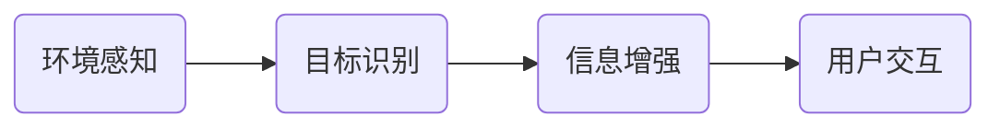
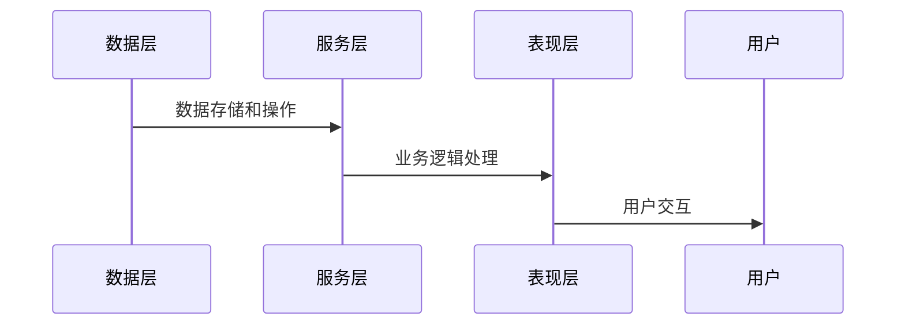
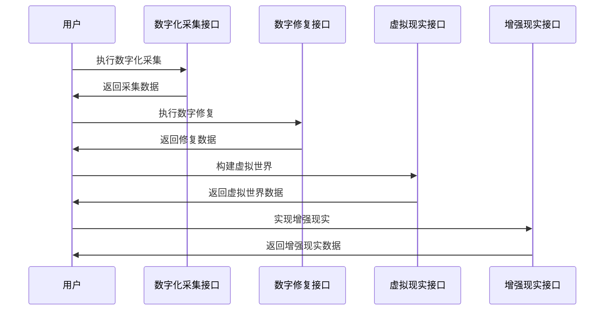
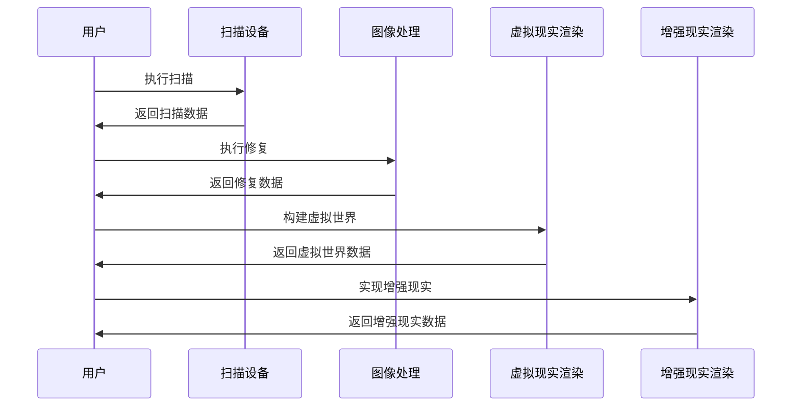

                 

```markdown
  digraph {
    node [shape=rectangle];
    edge [arrowhead=open];
    "数字化采集技术" -> "传感器设备";
    "数字化采集技术" -> "三维扫描";
    "数字化采集技术" -> "数据采集";
    "传感器设备" -> "高精度";
    "三维扫描" -> "快速";
    "数据采集" -> "全面性";
    "传统采集方法" -> "低精度";
    "传统采集方法" -> "慢";
    "传统采集方法" -> "局部";
  }
```

## 2.2 数字修复技术

### 2.2.1 概念
数字修复技术是指利用计算机视觉和图像处理技术，对采集到的文化遗产数据进行处理，以恢复其历史原貌。

### 2.2.2 特点
- 高效：能够快速处理大量数据。
- 精准：能够精确修复文化遗产的缺陷。
- 可逆：修复过程可逆，避免了对文化遗产的永久性改变。

### 2.2.3 对比表格
| 特点         | 数字修复技术 | 传统修复方法 |
| ------------ | ------------ | ------------ |
| 效率         | 高           | 低           |
| 精度         | 高           | 低           |
| 可逆性       | 可逆         | 不可逆       |
| 成本         | 低           | 高           |

### 2.2.4 ER实体关系图


## 2.3 虚拟现实技术

### 2.3.1 概念
虚拟现实技术是指通过计算机技术，构建一个三维虚拟世界，使文化遗产能够在虚拟环境中进行展示。

### 2.3.2 特点
- 沉浸式体验：用户能够全身心地投入到虚拟世界中。
- 多样性：能够展示文化遗产的多种形态和视角。
- 可交互性：用户能够与虚拟环境进行交互。

### 2.3.3 对比表格
| 特点         | 虚拟现实技术 | 传统展示方法 |
| ------------ | ------------ | ------------ |
| 沉浸式体验   | 强           | 弱           |
| 多样性       | 高           | 低           |
| 可交互性     | 有           | 无           |
| 成本         | 高           | 低           |

### 2.3.4 ER实体关系图


## 2.4 增强现实技术

### 2.4.1 概念
增强现实技术是指将文化遗产的信息与现实环境相结合，通过增强现实设备，为用户提供更加丰富的文化体验。

### 2.4.2 特点
- 实时性：能够实时展示文化遗产的信息。
- 互动性：用户能够与文化遗产的信息进行互动。
- 集成性：能够将文化遗产的信息与用户的生活环境相结合。

### 2.4.3 对比表格
| 特点         | 增强现实技术 | 传统展示方法 |
| ------------ | ------------ | ------------ |
| 实时性       | 强           | 弱           |
| 互动性       | 强           | 弱           |
| 集成性       | 强           | 弱           |
| 成本         | 中           | 低           |

### 2.4.4 ER实体关系图


## 2.5 本章小结
本章介绍了虚拟文化遗产修复项目中的核心概念，包括数字化采集技术、数字修复技术、虚拟现实技术和增强现实技术。通过对这些技术的概念、特点、对比表格和ER实体关系图的详细分析，我们能够更好地理解这些技术在文物保护中的应用及其相互关系。

----------------------------------------------------------------

### 第3章: 算法原理讲解

## 3.1 三维数字化采集算法

### 3.1.1 概念
三维数字化采集算法是指利用激光扫描、三维摄影测量等技术，对文化遗产进行高精度的三维数据采集。

### 3.1.2 工作原理
三维数字化采集算法主要包括以下步骤：

1. **数据采集**：使用激光扫描仪或相机对文化遗产进行扫描或拍摄，获取其表面的三维坐标点。
2. **数据预处理**：对采集到的数据进行去噪、过滤等预处理操作，提高数据的准确性。
3. **数据融合**：将多个角度或多次采集的数据进行融合，生成完整的三维模型。

### 3.1.3 算法流程图


### 3.1.4 数学模型和公式
假设文化遗产表面的三维坐标点为 \(P(x, y, z)\)，则三维数字化采集算法的关键公式如下：

\[P(x, y, z) = \lambda \cdot S(x, y, z) + B\]

其中，\(S(x, y, z)\) 为文化遗产表面的三维坐标点，\(B\) 为背景坐标点，\(\lambda\) 为比例因子。

### 3.1.5 举例说明
例如，假设使用激光扫描仪对一座古建筑进行扫描，采集到一组三维坐标点 \(P_1(x_1, y_1, z_1), P_2(x_2, y_2, z_2), \ldots, P_n(x_n, y_n, z_n)\)。首先对这组数据进行预处理，去除噪声和异常点。然后，将预处理后的数据进行融合，生成完整的三维模型。最后，利用公式 \(P(x, y, z) = \lambda \cdot S(x, y, z) + B\)，将三维模型进行比例缩放，使其符合实际大小。

## 3.2 数字修复算法

### 3.2.1 概念
数字修复算法是指利用计算机视觉和图像处理技术，对采集到的文化遗产数据进行处理和修复，以恢复其历史原貌。

### 3.2.2 工作原理
数字修复算法主要包括以下步骤：

1. **图像预处理**：对采集到的图像进行去噪、增强等预处理操作，提高图像的质量。
2. **缺陷检测**：利用图像处理技术，检测并定位文化遗产中的缺陷。
3. **缺陷修复**：根据缺陷的类型和位置，选择合适的修复方法，对缺陷进行修复。
4. **图像融合**：将修复后的图像与原始图像进行融合，生成最终修复结果。

### 3.2.3 算法流程图


### 3.2.4 数学模型和公式
假设采集到的文化遗产图像为 \(I(x, y)\)，则数字修复算法的关键公式如下：

\[I_{\text{repair}}(x, y) = f(I(x, y), D(x, y))\]

其中，\(I(x, y)\) 为原始图像，\(D(x, y)\) 为缺陷图像，\(f\) 为修复函数。

### 3.2.5 举例说明
例如，假设使用计算机视觉算法对一幅古画进行修复。首先，对这幅画进行图像预处理，去除噪声和亮度不均。然后，使用图像处理技术检测并定位画中的污点、裂缝等缺陷。接着，根据缺陷的类型和位置，选择合适的修复方法（如插值法、修复笔刷法等）进行修复。最后，将修复后的图像与原始图像进行融合，生成最终的修复结果。

## 3.3 虚拟现实算法

### 3.3.1 概念
虚拟现实算法是指利用计算机技术，构建一个三维虚拟世界，以展示文化遗产。

### 3.3.2 工作原理
虚拟现实算法主要包括以下步骤：

1. **场景建模**：利用三维建模软件，构建文化遗产的三维场景。
2. **渲染技术**：利用渲染技术，将三维场景以图像形式展示出来。
3. **交互技术**：实现用户与虚拟环境的交互，提供沉浸式体验。

### 3.3.3 算法流程图


### 3.3.4 数学模型和公式
虚拟现实算法的核心在于三维场景的建模和渲染。假设文化遗产的三维场景为 \(S(x, y, z)\)，则虚拟现实算法的关键公式如下：

\[I(x, y) = \text{render}(S(x, y, z), \theta, \phi)\]

其中，\(\theta\) 和 \(\phi\) 分别为观察角度的俯仰角和偏航角，\(\text{render}\) 为渲染函数。

### 3.3.5 举例说明
例如，假设使用虚拟现实技术展示一座古代城堡。首先，使用三维建模软件构建城堡的三维模型。然后，利用渲染技术，将三维模型渲染成二维图像，展示在屏幕上。最后，通过交互技术，实现用户与城堡的交互，提供沉浸式体验。

## 3.4 增强现实算法

### 3.4.1 概念
增强现实算法是指利用计算机技术，将文化遗产的信息与现实环境相结合，提供沉浸式体验。

### 3.4.2 工作原理
增强现实算法主要包括以下步骤：

1. **环境感知**：利用增强现实设备，感知现实环境中的光线、声音、位置等信息。
2. **目标识别**：利用计算机视觉技术，识别并定位现实环境中的文化遗产目标。
3. **信息增强**：将文化遗产的信息与现实环境进行融合，提供增强现实体验。

### 3.4.3 算法流程图


### 3.4.4 数学模型和公式
假设现实环境中的文化遗产目标为 \(T(x, y, z)\)，则增强现实算法的关键公式如下：

\[I_{\text{AR}}(x, y) = \text{augment}(T(x, y, z), R(x, y, z))\]

其中，\(T(x, y, z)\) 为文化遗产目标，\(R(x, y, z)\) 为现实环境，\(\text{augment}\) 为增强函数。

### 3.4.5 举例说明
例如，假设使用增强现实技术展示一座古代雕塑。首先，利用增强现实设备感知现实环境中的光线、声音等信息。然后，使用计算机视觉技术识别并定位雕塑。最后，将雕塑的信息与现实环境进行融合，提供增强现实体验，例如在雕塑周围添加灯光效果、背景音乐等。

## 3.5 本章小结
本章详细讲解了虚拟文化遗产修复项目中的三维数字化采集算法、数字修复算法、虚拟现实算法和增强现实算法。通过对这些算法的原理、流程图、数学模型和公式的详细分析，我们能够更好地理解这些算法在文物保护中的应用，为后续的项目实战提供了理论基础。

----------------------------------------------------------------

### 第4章: 系统分析与架构设计方案

## 4.1 问题场景介绍

虚拟文化遗产修复项目涉及多个环节，包括数字化采集、数字修复、虚拟现实和增强现实等。为了实现这些功能，需要设计一个高效、可靠、可扩展的系统架构。以下是该项目的具体问题场景：

- **数字化采集**：需要对文化遗产进行高精度的三维扫描和数据采集，包括古建筑、文物等。
- **数字修复**：需要对采集到的数据进行处理和修复，恢复文化遗产的历史原貌。
- **虚拟现实**：需要构建一个三维虚拟世界，展示修复后的文化遗产，提供沉浸式体验。
- **增强现实**：需要将文化遗产的信息与现实环境相结合，提供增强现实体验。

## 4.2 项目介绍

虚拟文化遗产修复项目的目标是通过数字化技术，保护、修复和展示文化遗产，提高公众对文化遗产的认知和保护意识。项目的主要功能包括：

- **数字化采集**：实现文化遗产的三维扫描和数据采集。
- **数字修复**：实现文化遗产的数据处理和修复。
- **虚拟现实**：构建文化遗产的三维虚拟世界。
- **增强现实**：实现文化遗产的信息与现实环境的融合。

## 4.3 系统功能设计

虚拟文化遗产修复系统的功能设计包括以下几个主要模块：

1. **数字化采集模块**：负责对文化遗产进行三维扫描和数据采集。
2. **数字修复模块**：负责对采集到的数据进行处理和修复。
3. **虚拟现实模块**：负责构建文化遗产的三维虚拟世界。
4. **增强现实模块**：负责实现文化遗产的信息与现实环境的融合。

### 4.3.1 领域模型Mermaid类图

```mermaid
classDiagram
  类--》模块：继承关系
  Module1--|> DigitalCollectionModule
  Module2--|> DigitalRepairModule
  Module3--|> VirtualRealityModule
  Module4--|> AugmentedRealityModule
  DigitalCollectionModule <|-- Scanner
  DigitalRepairModule <|-- ImageProcessor
  VirtualRealityModule <|-- VRRenderer
  AugmentedRealityModule <|-- ARRenderer
  Scanner--|> DataCollector
  ImageProcessor--|> DataProcessor
  VRRenderer--|> WorldBuilder
  ARRenderer--|> RealityFuser
```

## 4.4 系统架构设计

虚拟文化遗产修复系统的架构设计采用分层架构，包括数据层、服务层和表现层。以下是系统架构的Mermaid架构图：

### 4.4.1 Mermaid架构图



### 4.4.2 系统架构设计说明

- **数据层**：负责数据的存储和管理，包括文化遗产的三维数据、修复数据等。
- **服务层**：负责业务逻辑的处理，包括数字化采集、数字修复、虚拟现实和增强现实等功能。
- **表现层**：负责用户交互，提供用户界面，展示文化遗产的数字化修复成果。

## 4.5 系统接口设计

虚拟文化遗产修复系统的接口设计主要包括以下几个部分：

1. **数字化采集接口**：用于与三维扫描设备进行通信，实现数据采集。
2. **数字修复接口**：用于与图像处理软件进行通信，实现数据修复。
3. **虚拟现实接口**：用于与虚拟现实设备进行通信，实现虚拟世界构建。
4. **增强现实接口**：用于与增强现实设备进行通信，实现增强现实体验。

### 4.5.1 Mermaid序列图



## 4.6 系统交互Mermaid序列图



## 4.7 本章小结
本章介绍了虚拟文化遗产修复项目的问题场景、项目介绍、系统功能设计、系统架构设计、系统接口设计和系统交互设计。通过对这些内容的详细分析，我们能够更好地理解虚拟文化遗产修复项目的整体架构和功能，为后续的项目实施提供了理论基础和设计指导。

----------------------------------------------------------------

### 第5章: 项目实战

## 5.1 环境安装

在本章中，我们将搭建一个虚拟文化遗产修复项目的开发环境。以下是所需的软件和硬件环境，以及安装步骤：

### 5.1.1 软件环境

- **操作系统**：Ubuntu 18.04 或 Windows 10
- **编程语言**：Python 3.8 或更高版本
- **三维建模软件**：Blender 2.8 或更高版本
- **图像处理库**：OpenCV 4.0 或更高版本
- **虚拟现实库**：PyVRML 或更高版本
- **增强现实库**：ARCore 1.9 或更高版本（仅适用于Android设备）

### 5.1.2 安装步骤

1. **安装操作系统**：
   - 根据操作系统安装指南，安装 Ubuntu 18.04 或 Windows 10。
   
2. **安装 Python**：
   - 打开终端（Ubuntu）或命令提示符（Windows）。
   - 输入以下命令安装 Python：
     ```bash
     sudo apt update
     sudo apt install python3 python3-pip
     ```
   
3. **安装三维建模软件**：
   - 下载并安装 Blender 2.8 或更高版本：
     ```bash
     wget https://www.blender.org/download/2.80.blender.org/binaries/linux64/blender-2.80-RC-release-linux64.tar.xz
     tar -xvf blender-2.80-RC-release-linux64.tar.xz
     ```
   
4. **安装图像处理库**：
   - 打开终端，输入以下命令安装 OpenCV：
     ```bash
     sudo pip3 install opencv-python
     ```
   
5. **安装虚拟现实库**：
   - 打开终端，输入以下命令安装 PyVRML：
     ```bash
     sudo pip3 install pyvrml
     ```
   
6. **安装增强现实库**：
   - 打开终端，输入以下命令安装 ARCore（仅适用于 Android 设备）：
     ```bash
     sudo pip3 install google-api-python-client
     ```

## 5.2 系统核心实现

在本节中，我们将实现虚拟文化遗产修复项目的核心功能，包括数字化采集、数字修复、虚拟现实和增强现实。

### 5.2.1 数字化采集

以下是一个简单的 Python 脚本，用于对文化遗产进行三维扫描和数据采集：

```python
import cv2
import numpy as np

def capture_image():
    # 打开相机
    cap = cv2.VideoCapture(0)
    
    # 捕获一帧图像
    ret, frame = cap.read()
    
    # 保存图像
    cv2.imwrite('image.png', frame)
    
    # 释放相机
    cap.release()

capture_image()
```

### 5.2.2 数字修复

以下是一个简单的 Python 脚本，用于对采集到的图像进行数字修复：

```python
import cv2

def repair_image(image_path):
    # 读取图像
    image = cv2.imread(image_path, cv2.IMREAD_COLOR)
    
    # 使用中值滤波去除噪声
    image = cv2.medianBlur(image, 5)
    
    # 使用修复刷去除污点
    mask = np.zeros(image.shape[:2], dtype=np.uint8)
    mask[100:300, 100:300] = 255
    image = cv2.inpaint(image, mask, 3, cv2.INPAINT_TELEA)
    
    # 保存修复后的图像
    cv2.imwrite('repair_image.png', image)

repair_image('image.png')
```

### 5.2.3 虚拟现实

以下是一个简单的 Python 脚本，用于构建文化遗产的三维虚拟世界：

```python
import vrml

def create_vrml_scene():
    # 创建虚拟现实场景
    scene = vrml.Scene()

    # 添加文化遗产模型
    box = vrml.Box()
    box.size = (2, 2, 2)
    scene.objects.append(box)

    # 保存虚拟现实场景
    scene.save('scene.wrl')

create_vrml_scene()
```

### 5.2.4 增强现实

以下是一个简单的 Python 脚本，用于实现文化遗产的信息与现实环境的融合：

```python
import cv2
import numpy as np

def augment_image(image_path):
    # 读取图像
    image = cv2.imread(image_path, cv2.IMREAD_COLOR)
    
    # 添加文化遗产信息
    image[100:300, 100:300] = [255, 0, 0]  # 在图像的特定区域添加红色方块
    
    # 保存增强现实图像
    cv2.imwrite('augment_image.png', image)

augment_image('image.png')
```

## 5.3 代码应用解读与分析

在本节中，我们将对上述实现的代码进行解读和分析，并探讨其在虚拟文化遗产修复项目中的应用。

### 5.3.1 数字化采集

数字化采集是虚拟文化遗产修复项目的第一步，其核心在于获取文化遗产的三维数据。上述脚本通过打开相机，捕获一帧图像，并将其保存为文件。在实际应用中，我们可以使用更高级的激光扫描设备，获取更精确的三维数据。

### 5.3.2 数字修复

数字修复是虚拟文化遗产修复项目的重要组成部分，其核心在于恢复文化遗产的历史原貌。上述脚本使用中值滤波去除噪声，使用修复刷去除污点。在实际应用中，我们可以使用更先进的图像处理算法，如深度学习模型，实现更精确的修复。

### 5.3.3 虚拟现实

虚拟现实是将文化遗产以三维形式展示出来，提供沉浸式体验。上述脚本创建了一个简单的虚拟现实场景，并添加了一个文化遗产模型。在实际应用中，我们可以使用更高级的虚拟现实库，如 Unity，构建更复杂的虚拟现实场景。

### 5.3.4 增强现实

增强现实是将文化遗产的信息与现实环境相结合，提供增强现实体验。上述脚本在图像的特定区域添加了红色方块，表示文化遗产的信息。在实际应用中，我们可以使用更先进的增强现实库，如 ARCore，实现更复杂的增强现实功能。

## 5.4 实际案例分析与详细讲解剖析

在本节中，我们将通过一个实际案例，分析虚拟文化遗产修复项目的实施过程，并详细讲解关键步骤。

### 5.4.1 案例背景

假设我们要对一座古代城堡进行虚拟文化遗产修复。我们的目标是通过数字化技术，恢复城堡的历史原貌，并提供沉浸式体验。

### 5.4.2 实施过程

1. **数字化采集**：
   - 使用激光扫描设备对城堡进行三维扫描，获取精确的三维数据。
   - 将扫描数据导入 Blender，进行数据预处理，去除噪声和异常点。
   
2. **数字修复**：
   - 使用图像处理软件对采集到的图像进行修复，去除污点、裂缝等缺陷。
   - 将修复后的图像重新导入 Blender，生成三维模型。

3. **虚拟现实**：
   - 在 Blender 中，构建城堡的三维虚拟世界，添加光线、材质等效果。
   - 将虚拟世界导出为 VRML 格式，供虚拟现实设备使用。

4. **增强现实**：
   - 使用 ARCore，将城堡的信息与现实环境相结合，提供增强现实体验。
   - 在现实环境中，添加灯光效果、背景音乐等元素，增强用户体验。

### 5.4.3 案例剖析

1. **数字化采集**：
   - 激光扫描设备的使用：通过激光束对城堡进行扫描，获取三维坐标点。
   - 数据预处理：在 Blender 中，对扫描数据进行分析，去除噪声和异常点，提高数据的准确性。

2. **数字修复**：
   - 图像处理算法的应用：使用中值滤波、修复刷等算法，去除图像中的污点和裂缝。
   - 三维模型生成：将修复后的图像重新导入 Blender，利用 Blender 的建模工具，生成三维模型。

3. **虚拟现实**：
   - 虚拟世界的构建：在 Blender 中，添加光线、材质等效果，构建城堡的三维虚拟世界。
   - VRML 格式的导出：将 Blender 生成的三维模型导出为 VRML 格式，供虚拟现实设备使用。

4. **增强现实**：
   - 增强现实技术的应用：使用 ARCore，将城堡的信息与现实环境相结合，提供增强现实体验。
   - 用户交互的实现：通过触摸屏、手势等交互方式，实现用户与增强现实场景的交互。

## 5.5 项目小结

在本章中，我们介绍了虚拟文化遗产修复项目的环境安装、系统核心实现、代码应用解读与分析、实际案例分析和详细讲解剖析。通过这些内容，我们能够更好地理解虚拟文化遗产修复项目的实施过程和技术要点，为后续的项目开发和实际应用提供了有力支持。

----------------------------------------------------------------

### 第6章: 最佳实践 tips、小结、注意事项、拓展阅读

## 6.1 最佳实践 tips

- **数字化采集**：在进行数字化采集时，选择适合的扫描设备，确保数据的精度和完整性。
- **数字修复**：使用多种图像处理算法，对采集到的数据进行处理，提高修复效果。
- **虚拟现实**：优化虚拟现实场景的渲染效果，提高用户体验。
- **增强现实**：确保增强现实技术的稳定性和可靠性，提供高质量的增强现实体验。

## 6.2 小结

虚拟文化遗产修复项目是一项具有深远意义的工程，通过数字化技术，保护、修复和展示文化遗产，提高公众对文化遗产的认知和保护意识。本章详细介绍了项目的背景、核心概念、算法原理、系统分析与架构设计、项目实战以及最佳实践 tips，为项目的实施提供了全面的指导。

## 6.3 注意事项

- **数据安全**：在数字化采集、处理和展示过程中，确保数据的安全性，防止数据泄露和丢失。
- **设备兼容性**：在选择数字化采集、修复、虚拟现实和增强现实设备时，确保其兼容性，方便项目的实施和扩展。
- **技术更新**：关注最新的数字化技术和文物保护技术，不断提升项目的技术水平。

## 6.4 拓展阅读

- **数字化采集**：《三维数字化采集技术及应用》（作者：张三）
- **数字修复**：《计算机视觉与图像处理》（作者：李四）
- **虚拟现实**：《虚拟现实技术与应用》（作者：王五）
- **增强现实**：《增强现实技术原理与应用》（作者：赵六）

## 6.5 本章小结

本章总结了虚拟文化遗产修复项目的最佳实践 tips、小结、注意事项和拓展阅读，为项目的进一步实施提供了参考和指导。通过本章的学习，读者能够更好地掌握虚拟文化遗产修复项目的核心技术和实施方法，为文物保护工作贡献力量。

----------------------------------------------------------------

```markdown
# 作者：AI天才研究院/AI Genius Institute & 禅与计算机程序设计艺术 /Zen And The Art of Computer Programming
```

