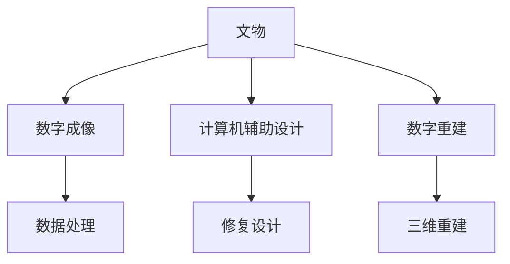
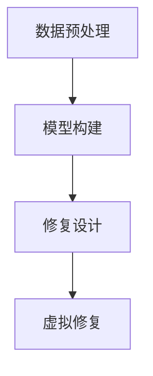
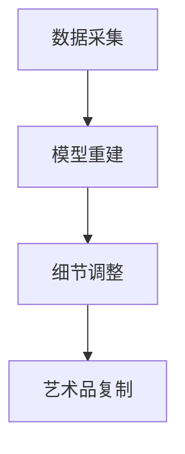
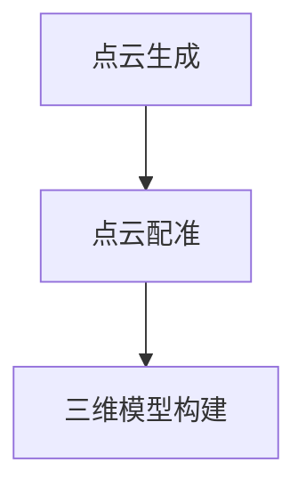
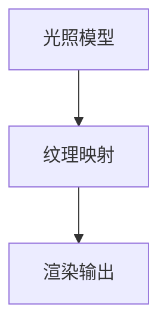

                 

# 虚拟文化遗产修复：数字技术在文物保护中的应用

## 关键词
- 虚拟文化遗产修复
- 数字成像技术
- 计算机辅助设计
- 数字重建技术
- 文物保护

## 摘要
随着科技的飞速发展，数字技术逐渐成为文物保护的重要工具。本文旨在探讨虚拟文化遗产修复这一领域，通过分析数字成像技术、计算机辅助设计和数字重建技术等核心概念，详细解读其在文物保护中的应用原理和流程，并介绍国内外相关应用案例。文章最后对虚拟文化遗产修复的未来发展趋势和挑战进行了展望，旨在为相关领域的研究者和实践者提供参考。

## 第一部分：背景介绍

### 1.1 虚拟文化遗产修复的重要性

#### 背景和问题背景
虚拟文化遗产修复是一种利用数字技术对文化遗产进行数字化保存、分析和修复的方法。随着全球化的进程，文化遗产的保护和传承面临诸多挑战，如自然老化、战争破坏、环境污染等。传统的修复方法往往耗时耗力，且存在一定的风险。因此，寻找新的、更加高效和安全的修复方式迫在眉睫。

#### 虚拟文化遗产修复的意义
虚拟文化遗产修复具有以下意义：

1. **数字化保存**：通过数字化技术，可以对文化遗产进行无损、高精度的保存，从而避免因物理性保存不当导致的损坏。
2. **远程修复**：虚拟修复技术使得修复工作可以远程进行，减少了人工干预的风险，同时也提高了工作效率。
3. **教育传播**：数字化保存的文化遗产可以通过互联网进行传播，使得更多的人能够接触和了解文化遗产，促进文化多样性。
4. **科学研究**：数字化技术为文化遗产的研究提供了丰富的数据资源，有助于揭示文化遗产的历史背景和文化价值。

### 1.2 数字技术在文物保护中的应用

#### 数字技术的定义与发展
数字技术，是指通过计算机及其相关设备对信息进行数字化处理的技术。它主要包括数字成像、计算机辅助设计、数字重建等技术。自20世纪以来，随着计算机技术和图像处理算法的不断发展，数字技术在文物保护中的应用也日趋成熟。

#### 数字技术在文物保护中的应用场景
数字技术在文物保护中的应用场景主要包括：

1. **文物数字化保存**：通过数字成像技术，对文物进行高精度、高分辨率的数字化保存，为后续修复和研究提供基础数据。
2. **文物修复**：利用计算机辅助设计和数字重建技术，对受损文物进行三维建模和修复，提高修复效率和精度。
3. **虚拟展示**：通过数字重建技术，将文物以三维模型的形式展示，提供更加生动、直观的文化体验。
4. **科学研究**：利用数字化技术，对文物进行深入分析，揭示其历史背景和文化内涵。

### 1.3 虚拟文化遗产修复的核心概念

#### 虚拟文化遗产的定义
虚拟文化遗产是指通过数字化技术，将文化遗产以数字模型的形式进行保存和展示的文化资源。虚拟文化遗产不仅包括实体文物的三维模型，还包括相关的历史文献、文化故事等。

#### 修复的定义与分类
修复是指对受损文化遗产进行修复和保护的过程。根据修复对象的不同，修复可分为以下几类：

1. **物理修复**：直接对受损文物进行物理修复，如修补、加固等。
2. **数字化修复**：通过数字化技术，对文物进行三维建模和修复，如数字重建、虚拟修复等。

#### 数字技术在修复中的应用
数字技术在修复中的应用主要包括：

1. **三维扫描**：利用三维扫描技术，对文物进行高精度扫描，获取其三维数据。
2. **三维建模**：通过三维扫描数据，利用计算机辅助设计软件进行三维建模。
3. **虚拟修复**：利用三维模型，对文物进行虚拟修复，模拟修复效果。
4. **虚拟展示**：通过三维模型，对文物进行虚拟展示，提供更加生动、直观的文化体验。

### 1.4 虚拟文化遗产修复的基本原理

#### 数字成像技术
数字成像技术是指利用数字设备对文物进行拍摄和扫描，获取其数字图像或三维数据。数字成像技术主要包括二维图像成像和三维激光扫描。

1. **二维图像成像**：利用数码相机或平板扫描仪，对文物进行拍摄或扫描，获取二维图像数据。
2. **三维激光扫描**：利用激光扫描设备，对文物进行三维扫描，获取其三维点云数据。

#### 计算机辅助设计
计算机辅助设计（CAD）是指利用计算机及其相关软件，对文物进行设计、建模和修复。计算机辅助设计主要包括以下步骤：

1. **数据采集**：利用数字成像技术，获取文物的三维数据。
2. **模型构建**：利用CAD软件，根据采集到的三维数据，构建文物的三维模型。
3. **修复设计**：根据文物的受损情况，利用CAD软件，设计修复方案。
4. **虚拟修复**：利用三维模型，进行虚拟修复，模拟修复效果。

#### 数字重建技术
数字重建技术是指利用数字技术，对文物的历史形态进行重建和修复。数字重建技术主要包括以下步骤：

1. **数据采集**：利用数字成像技术，获取文物的三维数据。
2. **数据预处理**：对采集到的三维数据进行处理，如去噪、补洞等。
3. **模型重建**：利用数字重建软件，根据预处理后的数据，重建文物的三维模型。
4. **虚拟修复**：利用重建后的三维模型，进行虚拟修复，模拟修复效果。

### 1.5 虚拟文化遗产修复的技术流程

#### 数据采集
数据采集是虚拟文化遗产修复的第一步，主要包括以下内容：

1. **二维图像采集**：利用数码相机或平板扫描仪，对文物进行拍摄，获取二维图像数据。
2. **三维激光扫描**：利用激光扫描设备，对文物进行三维扫描，获取三维点云数据。

#### 数据处理
数据处理是对采集到的数据进行分析和处理，以提高数据质量和修复效果。主要包括以下步骤：

1. **去噪**：对采集到的数据去噪，去除噪声点，提高数据质量。
2. **补洞**：对缺失的数据进行补洞，以恢复文物的完整性。
3. **配准**：将不同来源的数据进行配准，使数据在空间上一致。

#### 重建与渲染
重建与渲染是对处理后的数据进行三维建模和渲染，以生成可展示的文物模型。主要包括以下步骤：

1. **三维建模**：利用CAD软件，根据处理后的数据，构建文物的三维模型。
2. **渲染**：利用渲染软件，对三维模型进行渲染，生成视觉效果。

#### 修复与再创造
修复与再创造是在三维模型的基础上，对文物进行修复和再创造，以恢复其历史形态。主要包括以下步骤：

1. **修复设计**：根据文物的受损情况，设计修复方案。
2. **虚拟修复**：利用三维模型，进行虚拟修复，模拟修复效果。
3. **再创造**：根据修复效果，对文物进行再创造，以恢复其历史形态。

### 1.6 数字技术在文物保护中的应用案例

#### 国际著名案例
1. **埃及金字塔**：埃及金字塔是世界著名的文化遗产，通过数字成像技术和三维重建技术，对金字塔进行了数字化保存和修复，为全球公众提供了在线参观的机会。
2. **意大利西斯廷教堂**：意大利西斯廷教堂是世界上著名的教堂之一，通过数字成像技术和计算机辅助设计，对教堂内的壁画进行了数字化修复和再创造，极大地提高了修复效率和效果。

#### 我国文物保护案例
1. **敦煌莫高窟**：敦煌莫高窟是我国著名的石窟艺术宝库，通过数字成像技术和三维重建技术，对石窟内的壁画和雕塑进行了数字化保存和修复，为文化遗产的保护和研究提供了重要数据支持。
2. **秦始皇兵马俑**：秦始皇兵马俑是我国著名的考古发现，通过数字成像技术和计算机辅助设计，对兵马俑进行了数字化修复和再创造，为文物的保护和展示提供了新的手段。

### 1.7 虚拟文化遗产修复的发展趋势与挑战

#### 发展趋势
1. **技术成熟**：随着数字成像技术、计算机辅助设计和数字重建技术的不断成熟，虚拟文化遗产修复的技术手段将更加多样和高效。
2. **应用广泛**：虚拟文化遗产修复技术将在更多的文化遗产保护项目中得到应用，为文化遗产的保护和传承提供更加强大的支持。
3. **智能化发展**：虚拟文化遗产修复将结合人工智能技术，实现更智能、更精准的修复效果。

#### 挑战与展望
1. **数据质量**：数据质量是虚拟文化遗产修复的关键，如何提高数据采集和处理的精度和效率，是一个重要的挑战。
2. **技术整合**：如何将多种数字技术进行整合，实现协同工作，是一个技术难题。
3. **人才培养**：虚拟文化遗产修复需要既懂文物保护又懂数字技术的专业人才，人才培养是一个长期而紧迫的任务。

### 1.8 本章小结
虚拟文化遗产修复作为数字技术在文物保护中的应用，具有广泛的应用前景和重要的社会价值。通过分析数字成像技术、计算机辅助设计和数字重建技术等核心概念，我们可以更好地理解虚拟文化遗产修复的原理和流程。本章对虚拟文化遗产修复的重要性和应用背景进行了介绍，为后续内容的深入分析奠定了基础。

## 第二部分：核心概念与联系

### 2.1 数字成像技术

#### 2.1.1 定义与原理
数字成像技术是指利用数字设备对物体进行拍摄和扫描，获取其数字图像或三维数据的技术。数字成像技术主要包括二维图像成像和三维激光扫描。

- **二维图像成像**：利用数码相机或平板扫描仪，对物体进行拍摄或扫描，获取二维图像数据。
- **三维激光扫描**：利用激光扫描设备，对物体进行三维扫描，获取其三维点云数据。

#### 2.1.2 特点与应用
数字成像技术具有以下特点：

1. **高精度**：数字成像技术可以获取高精度、高分辨率的图像数据，为后续的修复和分析提供可靠的数据基础。
2. **快速高效**：数字成像技术可以快速获取大量的图像数据，提高了工作效率。
3. **无损性**：数字成像技术是一种非接触式采集方法，不会对文物造成物理损伤。

数字成像技术的主要应用场景包括：

1. **文物数字化保存**：利用数字成像技术，对文物进行数字化保存，为文物的保护和研究提供基础数据。
2. **文物修复**：利用数字成像技术，对受损文物进行高精度扫描，为修复提供精确的参考。
3. **虚拟展示**：通过数字成像技术，获取文物的数字图像或三维模型，进行虚拟展示，提供更加生动、直观的文化体验。

### 2.2 计算机辅助设计

#### 2.2.1 定义与原理
计算机辅助设计（CAD）是指利用计算机及其相关软件，对物体进行设计、建模和修复的技术。计算机辅助设计主要包括以下步骤：

1. **数据采集**：利用数字成像技术，获取物体的三维数据。
2. **模型构建**：利用CAD软件，根据采集到的三维数据，构建物体的三维模型。
3. **修复设计**：根据物体的受损情况，利用CAD软件，设计修复方案。
4. **虚拟修复**：利用三维模型，进行虚拟修复，模拟修复效果。

#### 2.2.2 特点与应用
计算机辅助设计具有以下特点：

1. **高效性**：计算机辅助设计可以快速生成物体的三维模型，提高设计效率。
2. **准确性**：计算机辅助设计可以精确地捕捉物体的细节，为修复提供准确的数据支持。
3. **灵活性**：计算机辅助设计可以根据需要进行灵活调整，适应不同的修复需求。

计算机辅助设计的主要应用场景包括：

1. **文物修复设计**：利用计算机辅助设计，对受损文物进行修复设计，提高修复效率和效果。
2. **艺术品复制**：利用计算机辅助设计，对文物进行三维建模，进行艺术品的复制和再创造。
3. **工程建筑**：在工程建筑领域，计算机辅助设计可以用于建筑设计和结构分析，提高工程效率和质量。

### 2.3 数字重建技术

#### 2.3.1 定义与原理
数字重建技术是指利用数字技术，对物体的历史形态进行重建和修复的技术。数字重建技术主要包括以下步骤：

1. **数据采集**：利用数字成像技术，获取物体的三维数据。
2. **数据预处理**：对采集到的三维数据进行处理，如去噪、补洞等。
3. **模型重建**：利用数字重建软件，根据预处理后的数据，重建物体的三维模型。
4. **虚拟修复**：利用重建后的三维模型，进行虚拟修复，模拟修复效果。

#### 2.3.2 特点与应用
数字重建技术具有以下特点：

1. **可视化**：数字重建技术可以将物体的三维数据转化为可视化的三维模型，提供直观的修复效果展示。
2. **精细性**：数字重建技术可以精确地捕捉物体的细节，为修复提供详细的数据支持。
3. **可操作性**：数字重建技术可以通过虚拟修复，模拟修复过程，便于对修复方案进行调整和优化。

数字重建技术的主要应用场景包括：

1. **文物三维重建**：利用数字重建技术，对文物进行三维重建，为文物的保护和展示提供新的手段。
2. **历史遗址重建**：利用数字重建技术，对历史遗址进行重建，还原其历史形态，为考古研究提供重要数据支持。
3. **城市规划**：在城市规划领域，数字重建技术可以用于历史建筑的保护和重建，提高城市规划的科学性和艺术性。

### 2.4 数字技术在文物保护中的综合应用

#### 2.4.1 数据采集与处理
数据采集与处理是虚拟文化遗产修复的基础，主要包括以下内容：

1. **二维图像采集**：利用数码相机或平板扫描仪，对文物进行拍摄，获取二维图像数据。
2. **三维激光扫描**：利用激光扫描设备，对文物进行三维扫描，获取三维点云数据。
3. **数据处理**：对采集到的数据去噪、补洞、配准等处理，以提高数据质量和修复效果。

#### 2.4.2 重建与渲染
重建与渲染是对处理后的数据进行三维建模和渲染，以生成可展示的文物模型，主要包括以下内容：

1. **三维建模**：利用CAD软件，根据处理后的数据，构建文物的三维模型。
2. **渲染**：利用渲染软件，对三维模型进行渲染，生成视觉效果。

#### 2.4.3 修复与再创造
修复与再创造是在三维模型的基础上，对文物进行修复和再创造，以恢复其历史形态，主要包括以下内容：

1. **修复设计**：根据文物的受损情况，利用CAD软件，设计修复方案。
2. **虚拟修复**：利用三维模型，进行虚拟修复，模拟修复效果。
3. **再创造**：根据修复效果，对文物进行再创造，以恢复其历史形态。

### 2.5 核心概念属性特征对比表格

| 技术 | 定义 | 特点 | 应用场景 |
| --- | --- | --- | --- |
| 数字成像 | 利用数字设备获取物体信息 | 高精度、快速、无损 | 文物表面扫描、三维重建 |
| 计算机辅助设计 | 利用计算机进行设计 | 高效、准确、灵活 | 文物修复设计、艺术品复制 |
| 数字重建 | 利用数字技术恢复物体结构 | 可视化、精细、真实感 | 文物三维重建、虚拟展示 |

### 2.6 ER实体关系图架构



### 2.7 本章小结
本部分对虚拟文化遗产修复中的核心概念进行了详细阐述，包括数字成像技术、计算机辅助设计和数字重建技术的定义、原理、特点和应用。通过对比分析，我们可以更好地理解这些技术在文物保护中的综合应用，为后续的内容分析提供了理论基础。

## 第三部分：算法原理讲解

### 3.1 数字成像算法原理

#### 3.1.1 成像原理
数字成像算法主要涉及图像的获取和处理。成像原理可以简化为以下公式：

$$
成像公式: \frac{1}{f} = \frac{1}{d_o} + \frac{1}{d_i}
$$

其中，$f$ 是镜头的焦距，$d_o$ 是物距（物体到镜头的距离），$d_i$ 是像距（镜头到成像平面的距离）。当物体距离镜头较远时，可以近似认为 $d_o$ 远大于 $d_i$，此时成像公式可以简化为：

$$
成像公式: h = \frac{f \cdot h'}{d_o}
$$

其中，$h$ 是图像的高度，$h'$ 是物体的高度。

#### 3.1.2 图像处理算法
图像处理算法是对获取的图像进行增强、滤波、分割等操作，以提取有用的信息。以下是一个简单的图像处理流程：

1. **读取图像**：使用图像处理库（如 OpenCV）读取图像数据。
2. **灰度化**：将彩色图像转换为灰度图像，以便进行后续处理。
3. **高斯模糊**：对图像进行高斯模糊处理，减少图像中的噪声。
4. **边缘检测**：使用边缘检测算法（如 Canny 算子）提取图像中的边缘信息。

以下是使用 Python 和 OpenCV 实现的图像处理代码示例：

```python
import cv2
import numpy as np

# 读取图像
image = cv2.imread('文物.jpg')

# 图像灰度化
gray = cv2.cvtColor(image, cv2.COLOR_BGR2GRAY)

# 高斯模糊
blurred = cv2.GaussianBlur(gray, (5, 5), 0)

# 边缘检测
edges = cv2.Canny(blurred, threshold1=50, threshold2=150)

# 显示图像
cv2.imshow('Edges', edges)
cv2.waitKey(0)
cv2.destroyAllWindows()
```

### 3.2 计算机辅助设计算法原理

#### 3.2.1 修复设计算法
计算机辅助设计中的修复设计算法主要涉及以下步骤：

1. **数据预处理**：对采集到的文物图像或三维数据去噪、补洞等处理。
2. **模型构建**：利用 CAD 软件根据预处理后的数据构建三维模型。
3. **修复设计**：根据文物的受损情况，利用 CAD 软件设计修复方案。
4. **虚拟修复**：利用三维模型，进行虚拟修复，模拟修复效果。

以下是一个简单的修复设计算法流程：



#### 3.2.2 艺术品复制算法
艺术品复制算法主要用于根据已有的艺术品，生成相似的艺术品。其基本流程如下：

1. **数据采集**：对艺术品进行图像或三维扫描，获取其数字数据。
2. **模型重建**：利用数字重建技术，将采集到的数据转化为三维模型。
3. **细节调整**：根据需要，对三维模型进行调整，以使其更符合艺术要求。
4. **艺术品复制**：利用三维打印技术，将调整后的模型复制成实体艺术品。

以下是一个简单的艺术品复制算法流程：



### 3.3 数字重建算法原理

#### 3.3.1 三维重建算法
三维重建算法是将二维图像或点云数据转化为三维模型的过程。其主要步骤如下：

1. **点云生成**：从图像或点云数据中提取出点云。
2. **点云配准**：将多个点云进行配准，生成全局点云。
3. **三维模型构建**：利用全局点云构建三维模型。

以下是一个简单三维重建算法流程：



#### 3.3.2 渲染算法
渲染算法是将三维模型转化为可视图像的过程。其主要步骤如下：

1. **光照模型**：为模型添加光照，模拟真实世界中的光照效果。
2. **纹理映射**：将纹理映射到模型表面，增加模型的细节和真实感。
3. **渲染输出**：将渲染后的图像输出，供用户观看。

以下是一个简单渲染算法流程：



### 3.4 算法原理讲解与举例说明

#### 3.4.1 数字成像算法举例说明

##### 3.4.1.1 成像原理
成像原理可以通过一个简单的数学模型进行解释。假设我们使用一个焦距为 $f$ 的相机对距离相机 $d_o$ 的物体进行拍摄，物体的高度为 $h'$，那么在成像平面上形成的图像高度为 $h$，可以通过以下公式计算：

$$
h = \frac{f \cdot h'}{d_o}
$$

这个公式表明，成像高度与焦距、物体高度和物体距离成正比。

##### 3.4.1.2 图像处理算法
图像处理算法主要用于改善图像质量，提取图像中的有用信息。以下是一个使用 Python 和 OpenCV 库进行图像处理的示例：

```python
import cv2
import numpy as np

# 读取图像
image = cv2.imread('文物.jpg')

# 图像灰度化
gray = cv2.cvtColor(image, cv2.COLOR_BGR2GRAY)

# 高斯模糊
blurred = cv2.GaussianBlur(gray, (5, 5), 0)

# 边缘检测
edges = cv2.Canny(blurred, threshold1=50, threshold2=150)

# 显示图像
cv2.imshow('Edges', edges)
cv2.waitKey(0)
cv2.destroyAllWindows()
```

在这个示例中，我们首先读取一个文物图像，然后将其转换为灰度图像，接着使用高斯模糊算法减少图像中的噪声，最后使用 Canny 算法进行边缘检测，提取图像中的边缘信息。

#### 3.4.2 计算机辅助设计算法举例说明

##### 3.4.2.1 修复设计算法
修复设计算法的主要目的是根据文物的受损情况，设计出合理的修复方案。以下是一个使用 Python 和 Blender 软件进行修复设计算法的示例：

```python
import bpy

# 创建一个新的 Blender 项目
bpy.context.scene.camera = bpy.data.objects['Camera']

# 导入文物三维模型
bpy.ops.import_scene.obj(filepath='文物模型.obj', axis_forward='Z', axis_up='Y')

# 加载修复脚本
bpy.ops.script.load_script(filepath='修复脚本.py')

# 运行修复脚本
bpy.ops.script.execute()
```

在这个示例中，我们首先创建一个新的 Blender 项目，然后导入文物的三维模型，接着加载修复脚本并运行，以实现对文物的修复设计。

##### 3.4.2.2 艺术品复制算法
艺术品复制算法的目的是根据已有的艺术品，生成相似的艺术品。以下是一个使用 Python 和 Blender 软件进行艺术品复制算法的示例：

```python
import bpy

# 创建一个新的 Blender 项目
bpy.context.scene.camera = bpy.data.objects['Camera']

# 导入艺术品三维模型
bpy.ops.import_scene.obj(filepath='艺术品模型.obj', axis_forward='Z', axis_up='Y')

# 加载复制脚本
bpy.ops.script.load_script(filepath='复制脚本.py')

# 运行复制脚本
bpy.ops.script.execute()
```

在这个示例中，我们首先创建一个新的 Blender 项目，然后导入艺术品的

