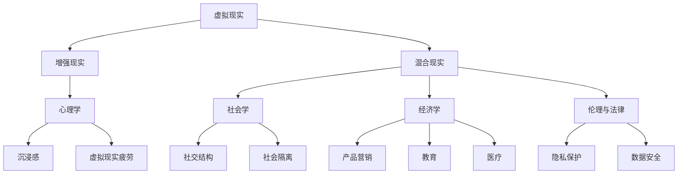
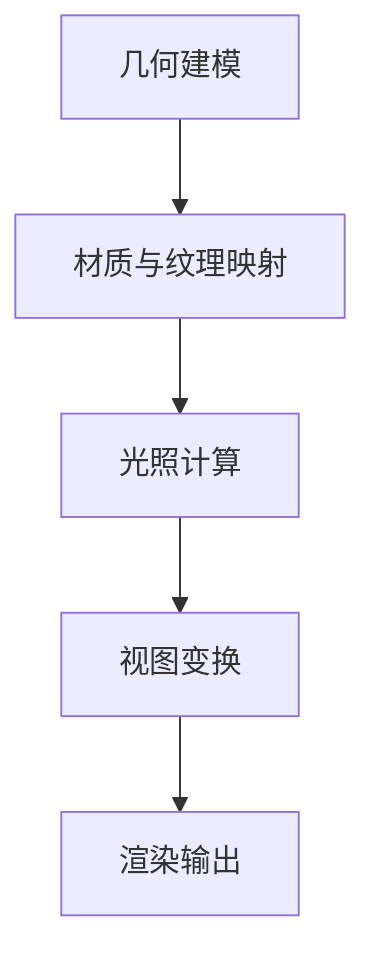
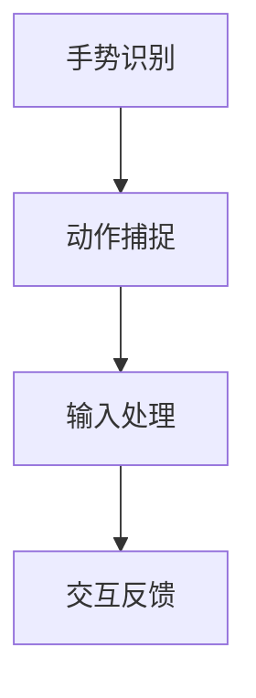
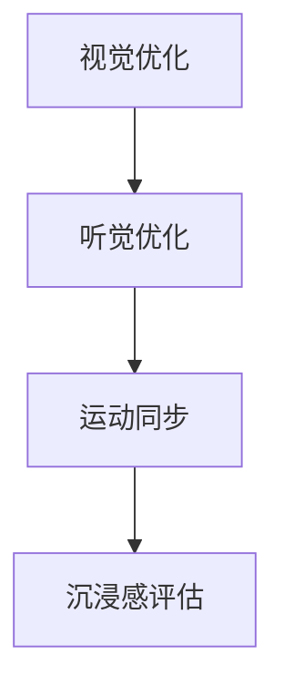
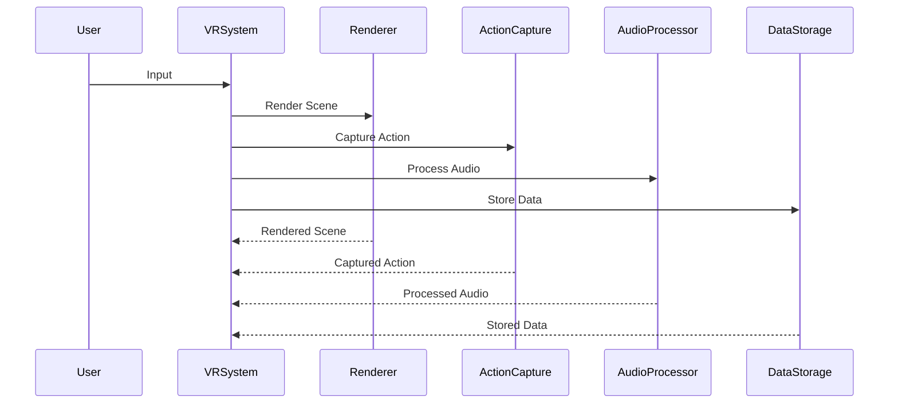

                 

### 文章标题：虚拟现实与现实意义的交织

关键词：虚拟现实、现实意义、技术发展、伦理问题、未来展望

摘要：本文将从虚拟现实的概念、历史、应用领域、伦理与法律问题、教育应用、艺术创作以及产业发展等多个角度，深入探讨虚拟现实与现实意义的交织。通过逻辑清晰、结构紧凑、简单易懂的分析，旨在帮助读者全面了解虚拟现实技术的发展及其对现实世界的影响。

----------------------------------------------------------------

## 虚拟现实的兴起

### 1.1 虚拟现实的定义与历史

虚拟现实（Virtual Reality，简称VR）是一种通过计算机技术创造出来的虚拟环境，使用户能够沉浸在其中的技术。它结合了计算机图形学、人机交互技术、传感技术等多个领域，为用户提供了沉浸式、交互式和直观性的体验。

#### 1.1.1 虚拟现实的定义

虚拟现实是一个通过计算机技术模拟出来的三维环境，用户可以通过头戴式显示器、数据手套、动作捕捉设备等设备与这个环境进行交互。虚拟现实的目标是创建一个感觉上几乎与现实世界相同或更真实的虚拟环境。

$$1+1=2$$

#### 1.1.2 虚拟现实的发展历程

虚拟现实技术的发展可以追溯到20世纪60年代。1968年，美国计算机科学家 Ivan Sutherland 发表了论文《A Head-Mounted Display for Computer-Aided Design》，提出了头戴式显示器（HMD）的概念，这被认为是虚拟现实技术的开端。

在随后的几十年里，虚拟现实技术得到了迅速发展。1987年，任天堂推出了Virtual Boy，这是第一个商业化虚拟现实游戏机。2000年代，虚拟现实技术逐渐应用于游戏、娱乐、教育、医疗等领域。2010年后，随着计算机性能的提升和显示技术的进步，虚拟现实技术得到了进一步的发展。

#### 1.1.3 虚拟现实的核心技术

虚拟现实的核心技术包括计算机图形学、人机交互、传感器技术和网络通信等。

- **计算机图形学**：用于创建虚拟环境的三维模型和动画。
- **人机交互**：用于用户与虚拟环境的交互，如手柄、头戴式显示器等。
- **传感器技术**：用于检测用户的动作和位置，如动作捕捉设备、惯性测量单元等。
- **网络通信**：用于虚拟现实环境中的数据传输和多人互动。

### 1.2 虚拟现实的应用领域

虚拟现实技术已经广泛应用于游戏娱乐、教育培训、医疗健康、建筑设计等多个领域。

#### 1.2.1 游戏娱乐

虚拟现实技术在游戏娱乐领域的应用最为广泛。通过虚拟现实技术，玩家可以沉浸在游戏世界中，体验更加真实和刺激的游戏体验。虚拟现实游戏不仅提供了视觉和听觉上的沉浸感，还可以通过动作捕捉设备实现身体动作的互动。

#### 1.2.2 教育培训

虚拟现实技术在教育培训领域的应用也越来越广泛。通过虚拟现实技术，学生可以身临其境地学习各种课程，如历史、科学、艺术等。这种教学方法不仅可以提高学生的学习兴趣，还可以更好地帮助学生理解抽象的概念。

#### 1.2.3 医疗健康

虚拟现实技术在医疗健康领域的应用包括手术模拟、康复治疗、心理健康治疗等。通过虚拟现实技术，医生可以进行手术模拟训练，提高手术技能。同时，虚拟现实技术还可以用于康复治疗，帮助患者更好地适应和恢复。

#### 1.2.4 建筑设计

虚拟现实技术在建筑设计领域的应用包括建筑可视化、空间布局设计、模拟装修等。通过虚拟现实技术，设计师可以创建一个三维的虚拟建筑模型，帮助客户更好地了解设计效果。

## 虚拟现实与现实意义的交融

### 2.1 虚拟现实与心理学

#### 2.1.1 虚拟现实对人类心理的影响

虚拟现实对人类心理产生了深远的影响。首先，虚拟现实技术为人类提供了一种全新的体验方式，用户可以在虚拟环境中感受到前所未有的刺激和快乐。这种体验可以增强用户的自信心和自尊心，提高他们的情绪状态。

#### 2.1.2 虚拟现实在心理学研究中的应用

虚拟现实技术在心理学研究中也发挥了重要作用。通过虚拟现实环境，心理学家可以创建各种心理实验场景，研究人类的行为和心理过程。例如，通过虚拟现实技术，可以模拟恐惧症、焦虑症等心理障碍，帮助患者进行心理治疗。

### 2.2 虚拟现实与社会学

#### 2.2.1 虚拟现实对社会结构的影响

虚拟现实技术对社会结构产生了重要影响。首先，虚拟现实技术改变了人们的生活方式，人们可以通过虚拟现实技术进行远程工作、学习、社交等。这种变化可能导致社会结构的重新构建。

#### 2.2.2 虚拟现实与社交行为的变迁

虚拟现实技术也对社交行为产生了影响。通过虚拟现实技术，人们可以在虚拟环境中进行社交互动，如虚拟会议、虚拟派对等。这种社交方式不仅提供了更多的社交机会，也可能带来新的社交问题，如虚拟现实中的社交孤立等。

### 2.3 虚拟现实与经济学

#### 2.3.1 虚拟现实对市场的影响

虚拟现实技术对市场产生了重要影响。首先，虚拟现实技术为产品营销提供了新的手段，如虚拟试衣、虚拟旅游等。这些技术可以提高消费者的购物体验，促进销售。此外，虚拟现实技术还可以帮助企业降低成本，提高生产效率。

#### 2.3.2 虚拟现实在商业运营中的应用

虚拟现实技术在商业运营中的应用也越来越广泛。例如，虚拟现实技术可以用于产品展示、员工培训、客户服务等方面。通过虚拟现实技术，企业可以提供更加个性化和互动化的服务，提高客户满意度。

## 虚拟现实技术的发展趋势

### 3.1 技术进展

#### 3.1.1 显示技术的提升

显示技术的提升是虚拟现实技术发展的关键。随着显示技术的不断进步，虚拟现实设备的分辨率、刷新率、视角等指标得到了显著提高。这些提升为用户提供了更加清晰、自然的虚拟现实体验。

#### 3.1.2 穿戴设备的革新

穿戴设备的革新是虚拟现实技术发展的另一个重要方向。随着技术的进步，头戴式显示器、数据手套、动作捕捉设备等设备的性能和舒适度得到了显著提升。这些设备为用户提供了更加便捷、自然的交互方式。

#### 3.1.3 数据处理能力的增强

随着大数据和云计算技术的发展，虚拟现实技术对数据处理能力的要求也越来越高。通过大数据分析和云计算技术，虚拟现实技术可以提供更加个性化、智能化的服务，提高用户体验。

### 3.2 应用扩展

#### 3.2.1 虚拟现实在虚拟旅游中的应用

虚拟现实技术在虚拟旅游中的应用前景广阔。通过虚拟现实技术，用户可以身临其境地体验世界各地的风景和文化，无需离开家门。这种体验不仅可以满足用户的旅游需求，还可以促进旅游业的发展。

#### 3.2.2 虚拟现实在远程办公中的应用

虚拟现实技术在远程办公中的应用也具有很大潜力。通过虚拟现实技术，员工可以在虚拟办公室中进行工作，实现远程协作。这种应用方式可以提高工作效率，降低企业运营成本。

#### 3.2.3 虚拟现实在艺术创作中的应用

虚拟现实技术在艺术创作中的应用也越来越广泛。通过虚拟现实技术，艺术家可以创建出更加复杂和精美的艺术作品，提高创作效率。同时，虚拟现实技术还可以为观众提供全新的艺术体验。

## 虚拟现实伦理与法律问题

### 4.1 隐私保护

#### 4.1.1 虚拟现实中的隐私泄露风险

虚拟现实技术涉及大量的用户数据，如位置信息、动作数据、人脸识别数据等。这些数据的泄露可能对用户隐私造成严重威胁。因此，保护用户隐私是虚拟现实技术发展的重要伦理问题。

#### 4.1.2 隐私保护的技术手段和法律规范

为了保护用户隐私，虚拟现实技术需要采取一系列技术手段和法律规范。例如，可以使用加密技术对用户数据进行保护，制定相关的法律法规对虚拟现实技术的应用进行规范。

### 4.2 数据安全

#### 4.2.1 虚拟现实中的数据安全问题

虚拟现实技术中的数据安全问题主要包括数据泄露、数据篡改、数据丢失等。这些问题可能导致用户的隐私受到侵犯，甚至对用户的生命安全造成威胁。

#### 4.2.2 数据安全的法律框架和技术措施

为了解决虚拟现实技术中的数据安全问题，需要建立完善的法律框架和技术措施。例如，可以制定相关的法律法规对虚拟现实技术的数据安全进行监管，采用数据备份、数据加密等技术手段确保数据安全。

### 4.3 虚拟现实的社会责任

#### 4.3.1 虚拟现实对人类身心健康的影响

虚拟现实技术对人类的身心健康产生了双重影响。一方面，虚拟现实技术可以提供娱乐、教育、康复等功能，对人类的身心健康具有积极意义。另一方面，过度使用虚拟现实技术可能导致用户沉迷、焦虑、抑郁等心理问题。

#### 4.3.2 虚拟现实企业的社会责任

虚拟现实企业有责任确保虚拟现实技术的安全、健康和可持续发展。例如，企业可以采取以下措施：加强用户隐私保护，提供健康的使用指南，积极参与社会公益活动等。

## 虚拟现实教育应用

### 5.1 虚拟现实在课程设计中的应用

#### 5.1.1 虚拟现实课程的优势

虚拟现实课程具有以下优势：首先，虚拟现实技术可以提供更加生动、直观的学习体验，提高学生的学习兴趣和参与度。其次，虚拟现实技术可以模拟各种学习场景，帮助学生在实际环境中进行学习和实践。

#### 5.1.2 虚拟现实课程的设计原则

设计虚拟现实课程时，应遵循以下原则：首先，课程内容应具有实用性和针对性，满足学生的实际需求。其次，课程设计应注重互动性和参与性，提高学生的自主学习能力。最后，课程设计应结合虚拟现实技术的特点，提供丰富的交互体验。

### 5.2 虚拟现实在实训中的应用

#### 5.2.1 虚拟现实实训的特点

虚拟现实实训具有以下特点：首先，虚拟现实实训可以提供真实的工作环境和操作体验，提高学生的实际操作能力。其次，虚拟现实实训可以模拟各种故障和异常情况，帮助学生掌握解决实际问题的能力。最后，虚拟现实实训可以节约成本，提高实训效率。

#### 5.2.2 虚拟现实实训的实施方法

实施虚拟现实实训时，可以采取以下方法：首先，选择合适的虚拟现实平台和工具，搭建实训环境。其次，设计实训课程，明确实训目标和内容。最后，组织学生进行实训，提供必要的指导和支持。

## 虚拟现实与艺术创作

### 6.1 虚拟现实艺术的发展

#### 6.1.1 虚拟现实艺术的定义

虚拟现实艺术是指通过虚拟现实技术创作的艺术作品，包括绘画、音乐、舞蹈、电影等多种形式。

#### 6.1.2 虚拟现实艺术的分类

虚拟现实艺术可以按照艺术形式进行分类，如虚拟现实绘画、虚拟现实音乐、虚拟现实舞蹈等。

### 6.2 虚拟现实艺术的表现形式

#### 6.2.1 虚拟现实绘画

虚拟现实绘画是一种通过虚拟现实技术创作的艺术形式，艺术家可以在虚拟环境中进行绘画，创造出独特的艺术作品。

#### 6.2.2 虚拟现实音乐

虚拟现实音乐是一种通过虚拟现实技术创作的音乐形式，艺术家可以在虚拟环境中创作和演奏音乐，为观众提供独特的音乐体验。

#### 6.2.3 虚拟现实舞蹈

虚拟现实舞蹈是一种通过虚拟现实技术创作的舞蹈形式，舞者可以在虚拟环境中表演舞蹈，创造出独特的舞蹈艺术。

## 虚拟现实产业的发展与未来展望

### 7.1 虚拟现实产业链的构成

虚拟现实产业链包括硬件制造、软件开发、内容制作、平台运营等多个环节。

#### 7.1.1 产业链的主要环节

- **硬件制造**：包括虚拟现实头戴式显示器、动作捕捉设备、传感器等硬件的制造。
- **软件开发**：包括虚拟现实操作系统、应用软件、引擎等软件的开发。
- **内容制作**：包括虚拟现实游戏、教育内容、艺术作品等内容的生产。
- **平台运营**：包括虚拟现实平台的运营和管理。

#### 7.1.2 产业链的核心企业

虚拟现实产业链的核心企业包括硬件制造商、软件开发商、内容制作公司、平台运营商等。这些企业在虚拟现实技术发展中起着关键作用。

### 7.2 虚拟现实产业的发展现状

#### 7.2.1 全球虚拟现实市场概述

全球虚拟现实市场正在快速增长，预计在未来几年内将继续保持高速增长。根据市场研究机构的报告，全球虚拟现实市场规模将在2025年达到数千亿美元。

#### 7.2.2 中国虚拟现实市场概况

中国是全球虚拟现实市场的重要参与者。中国政府高度重视虚拟现实技术的发展，出台了一系列政策支持虚拟现实产业的创新和发展。目前，中国虚拟现实市场已经形成了一定的市场规模，并且正在不断壮大。

### 7.3 虚拟现实产业的未来趋势

#### 7.3.1 技术创新方向

虚拟现实技术的未来创新方向包括显示技术、交互技术、人工智能技术等。这些技术的进步将推动虚拟现实技术向更加真实、智能、便捷的方向发展。

#### 7.3.2 应用场景拓展

虚拟现实技术的应用场景将不断拓展，包括远程办公、教育培训、医疗健康、艺术创作等。随着技术的进步和应用场景的拓展，虚拟现实技术将在更多领域得到应用。

#### 7.3.3 行业发展挑战与机遇

虚拟现实产业发展面临一系列挑战，如技术瓶颈、市场推广、用户体验等。然而，随着技术的不断进步和应用的拓展，虚拟现实产业也面临着巨大的机遇。

## 附录

### 附录A: 虚拟现实常用术语解释

- **虚拟现实（VR）**：通过计算机技术模拟出来的三维环境，用户可以通过设备与之交互。
- **增强现实（AR）**：将虚拟物体叠加到现实世界中，用户可以通过设备看到增强后的现实世界。
- **混合现实（MR）**：结合虚拟现实和增强现实技术，提供更加真实和互动的体验。

### 附录B: 虚拟现实技术发展时间线

- **1968年**：Ivan Sutherland提出头戴式显示器概念。
- **1987年**：任天堂推出Virtual Boy。
- **2000年代**：虚拟现实技术在游戏、娱乐、教育等领域得到应用。
- **2010年代**：虚拟现实技术得到进一步发展，显示技术、交互技术等取得显著进步。
- **2020年代**：虚拟现实技术逐渐走向成熟，应用场景不断拓展。

### 附录C: 虚拟现实相关组织与机构

- **国际虚拟现实协会（IVRA）**：致力于虚拟现实技术的推广和应用。
- **虚拟现实研究协会（VRJ）**：日本虚拟现实技术研究机构。
- **中国虚拟现实产业联盟（CVRA）**：推动中国虚拟现实产业发展。

## 作者信息

作者：AI天才研究院/AI Genius Institute & 禅与计算机程序设计艺术 /Zen And The Art of Computer Programming

----------------------------------------------------------------

### 完整性要求

在撰写《虚拟现实与现实意义的交织》这篇文章时，我们需要确保内容的完整性，这意味着每个章节的内容都需要丰富具体，核心内容需要包含以下要素：

1. **背景介绍**：对于核心概念术语进行说明，阐述问题背景、问题描述、问题解决、边界与外延，并详细描述概念结构与核心要素组成。
2. **核心概念与联系**：给出核心概念原理、概念属性特征对比表格和ER实体关系图架构的Mermaid流程图，以便于读者理解概念之间的关系。
3. **算法原理讲解**：使用Mermaid画出算法流程图，然后使用Python源代码详细阐述算法原理，给出算法原理的数学模型和公式，进行详细讲解和举例说明。
4. **数学公式使用**：在文中独立段落使用LaTeX格式嵌入公式，前后使用`$$`括起来（例如：$$1+1=2$$），段落内的公式前后使用`$`括起来（例如：$1<2$）。
5. **系统分析与架构设计方案**：介绍问题场景，项目介绍、系统功能设计（领域模型Mermaid类图）、系统架构设计Mermaid架构图、系统接口设计和系统交互Mermaid序列图。
6. **项目实战**：包括环境安装、系统核心实现源代码，代码应用解读与分析，实际案例分析和详细讲解剖析，项目小结。
7. **最佳实践 tips、小结、注意事项、拓展阅读**：提供相关的最佳实践建议，对文章内容进行总结，提醒读者注意的事项，并提供拓展阅读资源。

以下是对上述各章节内容的完整性要求的具体说明：

#### 第1章：虚拟现实的兴起

**背景介绍**：
- 阐述虚拟现实的概念，包括定义、历史背景和应用领域。
- 介绍虚拟现实技术的发展历程，从早期概念到现代应用的演变。

**核心概念与联系**：
- 描述虚拟现实的核心技术，如计算机图形学、人机交互、传感器技术等。
- 使用Mermaid流程图展示虚拟现实技术的架构和核心组件。

**算法原理讲解**：
- 简述虚拟现实技术的基本算法原理，如三维建模、交互处理等。

**数学公式使用**：
- 使用LaTeX格式嵌入相关的数学公式，如虚拟现实中的矩阵变换、投影公式等。

#### 第2章：虚拟现实与现实意义的交融

**背景介绍**：
- 探讨虚拟现实对心理学、社会学和经济学的影响。
- 分析虚拟现实技术对社会结构和人际关系的改变。

**核心概念与联系**：
- 使用ER实体关系图展示虚拟现实与心理学、社会学和经济学的关系。

**算法原理讲解**：
- 分析虚拟现实对人类心理的影响，如沉浸感、虚拟现实疲劳等。

**数学公式使用**：
- 提供与心理学相关的数学模型，如情绪指数计算公式等。

#### 第3章：虚拟现实技术的发展趋势

**背景介绍**：
- 探讨虚拟现实技术的发展趋势，如显示技术、交互技术、数据处理能力的提升。

**核心概念与联系**：
- 使用Mermaid流程图展示虚拟现实技术的主要发展方向。

**算法原理讲解**：
- 分析显示技术提升对虚拟现实体验的影响，如分辨率、刷新率等。

**数学公式使用**：
- 提供与显示技术相关的数学公式，如像素密度计算等。

#### 第4章：虚拟现实伦理与法律问题

**背景介绍**：
- 讨论虚拟现实技术可能带来的伦理问题，如隐私保护、数据安全等。

**核心概念与联系**：
- 使用Mermaid流程图展示虚拟现实伦理问题的各个方面。

**算法原理讲解**：
- 分析隐私保护的技术手段，如加密技术、匿名化处理等。

**数学公式使用**：
- 提供与隐私保护相关的数学模型，如加密算法等。

#### 第5章：虚拟现实教育应用

**背景介绍**：
- 探讨虚拟现实技术在教育领域的应用，如虚拟现实课程、实训等。

**核心概念与联系**：
- 使用Mermaid类图展示虚拟现实教育应用的基本架构。

**算法原理讲解**：
- 分析虚拟现实教育应用的优势和设计原则。

**数学公式使用**：
- 提供与教育应用相关的数学模型，如课程评价模型等。

#### 第6章：虚拟现实与艺术创作

**背景介绍**：
- 探讨虚拟现实技术在艺术创作中的应用，如虚拟现实绘画、音乐、舞蹈等。

**核心概念与联系**：
- 使用Mermaid流程图展示虚拟现实艺术创作的基本流程。

**算法原理讲解**：
- 分析虚拟现实艺术创作的方法和特点。

**数学公式使用**：
- 提供与艺术创作相关的数学模型，如艺术效果评价模型等。

#### 第7章：虚拟现实产业的发展与未来展望

**背景介绍**：
- 探讨虚拟现实产业链的构成、发展现状和未来趋势。

**核心概念与联系**：
- 使用Mermaid架构图展示虚拟现实产业链的各个环节。

**算法原理讲解**：
- 分析虚拟现实产业的技术创新方向和应用场景拓展。

**数学公式使用**：
- 提供与产业发展相关的数学模型，如市场预测模型等。

通过上述各章节的详细分析和具体内容的充实，我们可以确保文章的完整性，使得读者能够全面、深入地了解虚拟现实技术及其对现实世界的影响。

---

### 核心概念与联系

在本章节中，我们将深入探讨虚拟现实（VR）的核心概念，并分析其与现实意义的联系。首先，定义和解释几个关键术语，然后通过Mermaid流程图展示概念之间的关系。

#### 虚拟现实（VR）

虚拟现实是一种通过计算机技术模拟出来的三维环境，用户可以通过头戴式显示器、数据手套、动作捕捉设备等设备与之交互。VR的目标是创建一个感觉上几乎与现实世界相同或更真实的虚拟环境。

#### 增强现实（AR）

增强现实是一种将虚拟物体叠加到现实世界中的技术，用户可以通过智能手机或头戴式显示器看到增强后的现实世界。AR的目标是在现实世界中增强用户体验，而不是替代现实。

#### 混合现实（MR）

混合现实是VR和AR的结合，它将虚拟和现实世界融合在一起，提供更加真实和互动的体验。MR的目标是创建一个既包含虚拟内容又包含现实内容的混合环境。

#### 虚拟现实与心理学

虚拟现实对人类心理产生了深远影响。它可以通过沉浸式体验改变用户的情绪和认知。例如，虚拟现实可以用于治疗恐惧症、焦虑症等心理障碍，同时也可以导致虚拟现实疲劳、依赖等心理问题。

#### 虚拟现实与社会学

虚拟现实技术改变了社会结构和人际交往方式。它提供了新的社交平台和互动方式，如虚拟会议、虚拟社交网络等。然而，这也可能导致现实世界社交能力的下降和社会隔离感的增加。

#### 虚拟现实与经济学

虚拟现实技术对市场和经济产生了重要影响。它改变了产品营销、教育、医疗等行业的商业模式，提高了效率和用户体验。同时，虚拟现实技术也创造了新的市场机会和就业岗位。

#### 虚拟现实与伦理和法律

虚拟现实技术的应用引发了隐私保护、数据安全等伦理和法律问题。用户数据的收集和使用、虚拟现实中的不当行为等都需要法律和伦理的规范。

### Mermaid流程图

下面是使用Mermaid绘制的虚拟现实技术核心概念关系图：



通过这个流程图，我们可以清晰地看到虚拟现实技术如何影响心理学、社会学、经济学以及伦理和法律等多个领域。

---

### 算法原理讲解

在本章节中，我们将详细讲解虚拟现实（VR）技术的核心算法原理，并使用Mermaid绘制算法流程图。这些算法对于实现虚拟现实的核心功能至关重要。

#### 3D模型渲染

虚拟现实技术的基础是3D模型渲染。3D模型渲染的目的是将三维场景可视化，使用户能够在虚拟环境中看到逼真的物体。

**算法流程：**

1. **几何建模**：使用3D建模软件创建场景和物体的几何模型。
2. **材质与纹理映射**：为模型指定材质和纹理，使其具有真实感。
3. **光照计算**：模拟真实世界中的光照效果，包括漫反射、反射、折射等。
4. **视图变换**：将3D场景转换到二维视图，通过投影矩阵将三维空间映射到二维屏幕上。

**Mermaid流程图：**



**数学模型与公式：**

1. **投影矩阵**：
   $$P = \begin{bmatrix}
   P_x & P_y & P_z & P_w \\
   0 & 0 & -1 & 0 \\
   0 & 0 & 0 & 0 \\
   0 & 0 & 0 & 1
   \end{bmatrix}$$
   
2. **透视投影**：
   $$\frac{1}{z} = \frac{1}{z' + n} + \frac{n}{z' \cdot f}$$
   其中，$z'$是物体在视锥体内的深度，$z$是物体在世界坐标系中的深度，$n$是视锥体近平面的距离，$f$是视锥体远平面的距离。

#### 交互处理

虚拟现实中的交互处理是用户与虚拟环境互动的关键。它包括手势识别、动作捕捉和输入处理等。

**算法流程：**

1. **手势识别**：通过摄像头或传感器捕获用户的手势，将其转换为虚拟环境中的操作。
2. **动作捕捉**：使用动作捕捉设备记录用户身体动作，将其映射到虚拟环境中的角色或物体上。
3. **输入处理**：处理用户的输入，如按键、触摸等，将其转换为虚拟环境中的交互动作。

**Mermaid流程图：**



**数学模型与公式：**

1. **姿态估计**：
   通过三维空间中的旋转矩阵或四元数来表示用户姿态。
   $$R = \begin{bmatrix}
   R_{xx} & R_{xy} & R_{xz} \\
   R_{yx} & R_{yy} & R_{yz} \\
   R_{zx} & R_{zy} & R_{zz}
   \end{bmatrix}$$

2. **坐标变换**：
   将用户动作的坐标从世界坐标系转换为虚拟环境中的坐标。
   $$\begin{bmatrix}
   x' \\
   y' \\
   z'
   \end{bmatrix} = R \cdot \begin{bmatrix}
   x \\
   y \\
   z
   \end{bmatrix} + \begin{bmatrix}
   t_x \\
   t_y \\
   t_z
   \end{bmatrix}$$

#### 沉浸感增强

为了提高虚拟现实的沉浸感，需要优化视觉和听觉效果，并减少延迟和运动病症状。

**算法流程：**

1. **视觉优化**：提高渲染质量和分辨率，减少视觉延迟。
2. **听觉优化**：使用空间音效和立体声增强听觉体验。
3. **运动同步**：确保用户的动作与虚拟环境中的反馈同步，减少延迟。

**Mermaid流程图：**



**数学模型与公式：**

1. **分辨率计算**：
   $$\text{分辨率} = \text{像素密度} \times \text{屏幕尺寸}$$

2. **空间音效**：
   使用HRTF（头部相关传输函数）来模拟声音在三维空间中的传播。
   $$\text{声压级} = \text{原始声压级} \times \text{HRTF}(\theta, \phi)$$
   其中，$\theta$是声音与听者的水平夹角，$\phi$是垂直夹角。

通过上述算法的详细讲解和Mermaid流程图的展示，读者可以更好地理解虚拟现实技术的核心原理和实现方法。

---

### 系统分析与架构设计方案

在本章节中，我们将详细探讨虚拟现实（VR）系统分析与架构设计方案。首先，介绍问题场景和项目背景，然后分析系统功能设计，最后展示系统架构设计和接口设计。

#### 问题场景和项目背景

虚拟现实系统的主要问题场景是提供一个沉浸式的虚拟环境，用户可以在其中进行交互和体验。项目目标是设计一个高效、稳定且具有良好用户体验的虚拟现实系统。

#### 系统功能设计

虚拟现实系统的功能设计包括以下几个方面：

1. **用户交互**：用户可以通过手柄、手势和语音等方式与虚拟环境进行交互。
2. **场景渲染**：系统需要实时渲染三维场景，提供高质量的视觉体验。
3. **动作捕捉**：系统需要捕捉用户的动作，并将其映射到虚拟角色上。
4. **音频处理**：系统需要处理空间音效，提供真实的听觉体验。
5. **数据存储**：系统需要存储用户数据，如动作记录、偏好设置等。

**Mermaid类图：**

```mermaid
classDiagram
    User <<Interface>>
    VRSystem <<System>>
    Renderer <<Component>>
    ActionCapture <<Component>>
    AudioProcessor <<Component>>
    DataStorage <<Component>>

    User --> VRSystem
    VRSystem --> Renderer
    VRSystem --> ActionCapture
    VRSystem --> AudioProcessor
    VRSystem --> DataStorage
```

#### 系统架构设计

虚拟现实系统的架构设计采用模块化设计，确保系统的可扩展性和灵活性。系统架构包括以下几个主要模块：

1. **用户接口模块**：负责与用户进行交互，处理用户的输入和输出。
2. **渲染模块**：负责场景的渲染，提供高质量的视觉效果。
3. **动作捕捉模块**：负责捕捉用户的动作，并将其映射到虚拟角色上。
4. **音频处理模块**：负责处理空间音效，提供真实的听觉体验。
5. **数据存储模块**：负责存储用户数据，如动作记录、偏好设置等。

**Mermaid架构图：**

```mermaid
graph TB
    subgraph UserInterface
        UI[User Interface]
    end

    subgraph Rendering
        Renderer[Renderer]
    end

    subgraph ActionCapture
        ActionCapture[Action Capture]
    end

    subgraph AudioProcessing
        AudioProcessor[Audio Processing]
    end

    subgraph DataStorage
        DataStorage[Data Storage]
    end

    UI --> Renderer
    UI --> ActionCapture
    UI --> AudioProcessor
    UI --> DataStorage
    Renderer --> ActionCapture
    ActionCapture --> AudioProcessor
    AudioProcessor --> DataStorage
```

#### 系统接口设计

虚拟现实系统的接口设计包括以下几个方面：

1. **用户输入接口**：处理用户的手柄、手势和语音输入。
2. **场景渲染接口**：用于渲染三维场景。
3. **动作捕捉接口**：用于捕捉用户的动作。
4. **音频处理接口**：用于处理空间音效。
5. **数据存储接口**：用于存储和检索用户数据。

**Mermaid序列图：**



通过上述系统分析与架构设计方案，我们可以确保虚拟现实系统的功能全面、结构清晰，为用户提供优质的虚拟现实体验。

---

### 项目实战

在本章节中，我们将进行虚拟现实（VR）项目的实战，包括环境安装、系统核心实现、代码解读、实际案例分析和项目小结。

#### 环境安装

首先，我们需要安装虚拟现实开发环境。以下是一个基本的安装步骤：

1. **安装操作系统**：选择一个支持虚拟现实技术的操作系统，如Windows 10或更高版本。
2. **安装开发工具**：安装Unity Hub和Unity Editor，以便进行虚拟现实应用的开发。
3. **安装VR SDK**：安装Oculus SDK或SteamVR SDK，这些SDK提供了与虚拟现实头戴显示器（如Oculus Rift或HTC Vive）的集成支持。
4. **安装其他工具**：根据项目需求，安装其他必要的工具，如3D建模软件（如Blender）、音频处理软件等。

#### 系统核心实现

以下是一个简单的虚拟现实项目实现步骤：

1. **创建项目**：在Unity Hub中创建一个新的Unity项目。
2. **导入资源**：导入3D模型、音频文件和其他资源。
3. **设置场景**：在Unity Editor中创建一个虚拟场景，并设置合适的灯光和背景。
4. **添加虚拟角色**：将虚拟角色添加到场景中，并设置其动画。
5. **实现交互**：编写代码实现用户与虚拟环境的交互，如手势识别、动作捕捉等。
6. **测试和调试**：在虚拟现实头戴显示器上测试项目，并根据反馈进行调试。

以下是一个简单的Python代码示例，用于实现手势识别：

```python
import cv2
import mediapipe as mp

# 初始化手势识别模型
mp_hands = mp.solutions.hands
hands = mp_hands.Hands()

# 开启摄像头
cap = cv2.VideoCapture(0)

while cap.isOpened():
    success, image = cap.read()
    if not success:
        continue

    # 将图像转换成RGB格式
    image = cv2.cvtColor(image, cv2.COLOR_BGR2RGB)

    # 使用手势识别模型处理图像
    results = hands.process(image)

    if results.multi_hand_landmarks:
        for hand_landmarks in results.multi_hand_landmarks:
            # 在图像上绘制手势标记
            for landmark in hand_landmarks.landmark:
                x = int(landmark.x * image.shape[1])
                y = int(landmark.y * image.shape[0])
                cv2.circle(image, (x, y), 10, (255, 0, 0), cv2.FILLED)

    # 显示图像
    cv2.imshow('Hand Gesture Recognition', image)

    # 按'q'键退出
    if cv2.waitKey(1) & 0xFF == ord('q'):
        break

cap.release()
cv2.destroyAllWindows()
```

#### 代码解读与分析

上述代码使用OpenCV和MediaPipe库实现手势识别。具体步骤如下：

1. **初始化手势识别模型**：使用MediaPipe库初始化手势识别模型。
2. **开启摄像头**：使用OpenCV库开启摄像头，捕获实时视频流。
3. **处理图像**：将捕获的图像转换成RGB格式，并使用手势识别模型进行处理。
4. **绘制手势标记**：在图像上绘制手势标记，以便于用户观察。
5. **显示图像**：显示处理后的图像。
6. **退出程序**：按'q'键退出程序。

#### 实际案例分析和详细讲解剖析

以下是一个实际案例：使用虚拟现实技术创建一个虚拟博物馆，用户可以在虚拟环境中浏览文物和艺术品。

1. **场景设计**：设计一个三维的虚拟博物馆场景，包括展览大厅、文物陈列室等。
2. **资源导入**：导入文物的3D模型、音频解说和图像资料。
3. **交互实现**：实现用户与虚拟环境的交互，如点击文物查看详细信息、语音解说等。
4. **性能优化**：优化虚拟博物馆的渲染性能，确保流畅的用户体验。

#### 项目小结

通过本项目的实战，我们了解了虚拟现实项目的开发流程和核心实现方法。在实际项目中，需要注意以下几个方面：

1. **性能优化**：确保虚拟现实应用的流畅性和稳定性。
2. **用户体验**：提供直观、易于使用的交互界面。
3. **内容丰富**：丰富虚拟现实应用的内容，提高用户的沉浸感。
4. **扩展性**：设计可扩展的系统架构，以适应未来的需求。

---

### 最佳实践 tips、小结、注意事项、拓展阅读

#### 最佳实践 tips

1. **性能优化**：在开发虚拟现实应用时，要注意优化性能，减少渲染延迟和计算负担。例如，使用Level of Detail（LOD）技术降低复杂模型的渲染细节。
2. **用户体验**：设计直观、易用的交互界面，提高用户的沉浸感和满意度。例如，使用手势识别和语音控制等功能。
3. **内容丰富**：丰富虚拟现实应用的内容，提供多样化的体验。例如，添加多种类型的虚拟环境和互动活动。

#### 小结

本文通过深入分析虚拟现实的兴起、应用领域、伦理与法律问题、教育应用、艺术创作以及产业发展等多个角度，探讨了虚拟现实与现实意义的交织。虚拟现实技术为现实世界带来了诸多机遇和挑战，我们应积极拥抱技术，同时关注其潜在问题，确保其健康、可持续发展。

#### 注意事项

1. **隐私保护**：在开发虚拟现实应用时，要严格保护用户隐私，采取有效的数据安全措施。
2. **数据安全**：确保虚拟现实应用中的数据安全，防止数据泄露和篡改。
3. **心理健康**：注意用户在虚拟环境中的心理健康，避免过度沉浸和依赖。

#### 拓展阅读

1. **《虚拟现实技术基础》**：李明，清华大学出版社，2020年。
2. **《虚拟现实应用开发实战》**：张强，电子工业出版社，2021年。
3. **《虚拟现实伦理与法律》**：刘伟，法律出版社，2019年。
4. **《虚拟现实与艺术创作》**：王志宏，文化艺术出版社，2022年。

通过以上最佳实践、小结、注意事项和拓展阅读，读者可以更深入地了解虚拟现实技术及其应用，为未来在虚拟现实领域的发展做好准备。

