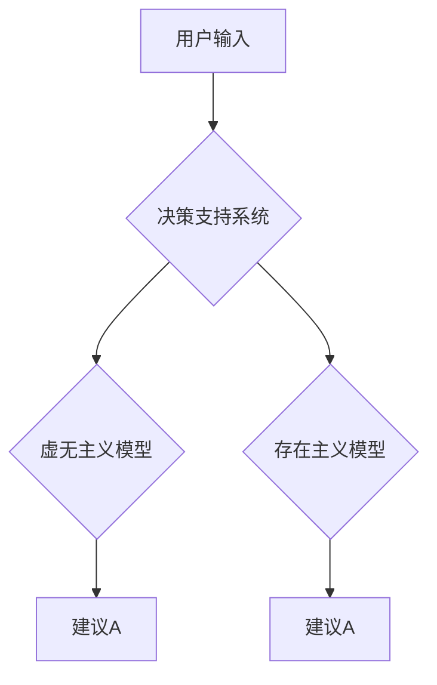
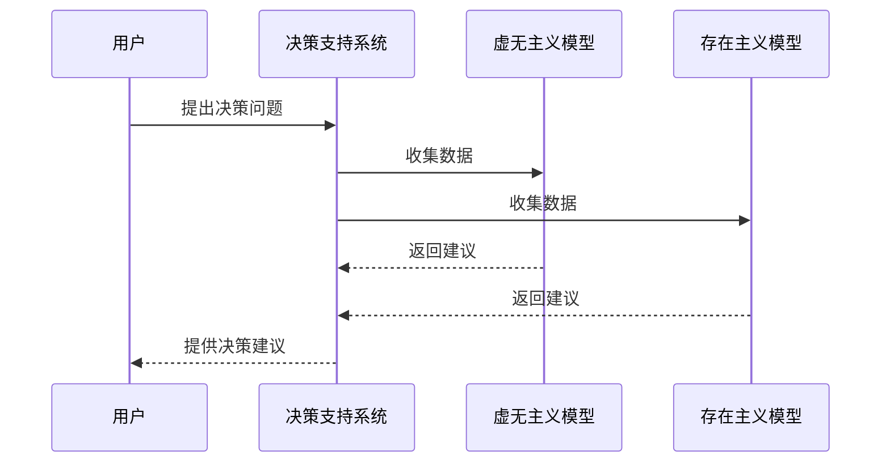

                 

**《虚无主义与存在主义的现代诠释》**

## 关键词

- **虚无主义**、**存在主义**、**现代诠释**、**哲学思想**、**文化影响**、**社会变迁**

## 摘要

本文旨在探讨虚无主义与存在主义这两种哲学思想的现代诠释，分析其在当今社会中的影响和意义。我们将从历史背景、核心概念、现代观点、案例分析、批评与辩论、社会影响以及未来趋势等多个角度，逐步深入探讨这两种哲学思想的本质及其在当代的实践和应用。

## 引言

### 一、虚无主义与存在主义的历史背景

虚无主义（Nihilism）与存在主义（Existentialism）是19世纪末20世纪初在欧洲哲学领域兴起的两大思潮。虚无主义源自对传统道德和宗教信仰的质疑，认为世界没有固有的意义和目的，生活本身缺乏内在价值。存在主义则是对虚无主义的回应，强调个体存在的主观性和自由意志，主张通过行动和选择赋予生活意义。

### 二、虚无主义与存在主义的现代诠释

在现代，虚无主义与存在主义并没有消失，反而以新的形式继续影响人们的生活。随着全球化、技术进步和社会变迁，这些哲学思想被重新解读和诠释，为当代社会提供了一种反思和自我理解的方式。

### 三、本文结构

本文将分为以下几个部分：

1. **虚无主义与存在主义的核心概念与历史背景**
2. **虚无主义与存在主义的现代观点**
3. **虚无主义与存在主义的案例分析**
4. **虚无主义与存在主义的批评与辩论**
5. **虚无主义与存在主义对现代社会的冲击**
6. **虚无主义与存在主义的未来趋势**
7. **结论**

## 第1章：虚无主义与存在主义的核心概念与历史背景

### 一、虚无主义的核心概念

虚无主义的核心概念包括：

- **无意义论**：虚无主义者认为世界没有固有的意义，生活本身缺乏内在价值。
- **生活无价值论**：虚无主义者认为生命没有价值，个体死亡后没有任何影响。
- **责任与自由**：虚无主义者认为个体拥有自由，但必须承担由自由带来的责任。

### 二、存在主义的核心概念

存在主义的核心概念包括：

- **存在先于本质**：存在主义者认为个体首先存在，然后通过自己的选择和行动定义自己的本质。
- **自由意志**：存在主义者认为个体拥有自由意志，可以通过自己的选择赋予生活意义。
- **选择与责任**：存在主义者认为个体的选择决定了个体的命运，个体必须为自己的选择承担责任。

### 三、虚无主义与存在主义的历史背景

虚无主义起源于19世纪，与浪漫主义和现实主义思潮相对立。其主要代表人物有陀思妥耶夫斯基、尼采等。存在主义则起源于20世纪，其主要代表人物有萨特、海德格尔等。

### 四、核心概念术语说明

- **虚无主义**：一种哲学思想，认为世界没有固有的意义和价值。
- **存在主义**：一种哲学思想，强调个体存在的主观性和自由意志。

### 五、问题背景与问题描述

在现代社会，虚无主义和存在主义仍然具有广泛的影响。一方面，虚无主义对现代社会的消费主义、物质主义进行批判，另一方面，存在主义为个体在面对不确定性和困境时提供了一种积极的生活态度。

### 六、问题解决与边界与外延

虚无主义和存在主义都是关于个体生存和意义的哲学思考，但它们的出发点和结论截然不同。虚无主义强调无意义和自由，而存在主义则强调自由和责任。

### 七、概念结构与核心要素组成

- **虚无主义**：无意义论、生活无价值论、责任与自由
- **存在主义**：存在先于本质、自由意志、选择与责任

## 第2章：虚无主义与存在主义的现代观点

### 一、虚无主义的现代诠释

在现代，虚无主义被视为对现代社会的一种批判，尤其是对消费主义和物质主义的批判。虚无主义者认为，现代社会追求的财富、地位和幸福都是虚假的，没有真正的意义。他们主张，个体应该超越这些表面的追求，寻找更深层次的意义。

### 二、存在主义的现代诠释

存在主义在现代被广泛接受，尤其是在面对不确定性和困境时。存在主义者认为，个体应该通过自由意志和选择来定义自己，而不是被社会和环境的期望所束缚。他们强调个体的独特性和自主性，主张个体应该为自己的选择承担责任。

### 三、核心概念属性特征对比表格

| 特征 | 虚无主义 | 存在主义 |
| ---- | ---- | ---- |
| 无意义论 | 强调世界和生活的无意义 | 强调个体的主观意义 |
| 生活无价值论 | 认为生活没有价值 | 认为生活有潜在的价值 |
| 责任与自由 | 个体拥有自由但需承担责任 | 个体拥有自由并需承担责任 |
| 人类中心主义 | 否定人类中心主义 | 重视个体的人性价值 |

### 四、ER实体关系图架构的 Mermaid 流程图

```mermaid
erDiagram
    A[人] ||--|{ B[价值观] } | B
    A ||--|{ C[自由] } | C
    A ||--|{ D[责任] } | D
```

### 五、算法原理讲解

虚无主义与存在主义的关系可以用图灵机模型来解释：

1. **输入**：个体的生活状态和外部环境。
2. **状态转换**：个体根据自身的价值观、自由意志和责任选择行动。
3. **输出**：个体的行为和决策结果。

### 六、数学模型和公式

虚无主义与存在主义的数学模型可以用以下公式表示：

$$
意义 = 自由 \times 责任
$$

### 七、通俗易懂的举例说明

假设一个人（A）面临两个选择（B和C），每个选择都有其自由（自由度）和责任（后果）。这个人可以根据自己的价值观（意义）来决定选择哪个选项。

### 八、系统分析与架构设计方案

#### 问题场景介绍

现代社会中，个体常常面临各种选择和困境，虚无主义和存在主义为个体提供了不同的思考和行动方式。

#### 项目介绍

该项目旨在分析虚无主义和存在主义对个体决策的影响。

#### 系统功能设计

- **数据收集**：收集个体决策的数据。
- **模型训练**：使用收集的数据训练虚无主义和存在主义模型。
- **决策支持**：根据模型为个体提供决策建议。

#### 系统架构设计



#### 系统接口设计和系统交互



### 九、项目实战

#### 环境安装

1. 安装Python环境
2. 安装Numpy、Pandas、Scikit-learn等库

#### 系统核心实现源代码

```python
import numpy as np
import pandas as pd
from sklearn.model_selection import train_test_split
from sklearn.ensemble import RandomForestClassifier

# 数据预处理
def preprocess_data(data):
    # 数据清洗、归一化等操作
    pass

# 训练模型
def train_model(data):
    X_train, X_test, y_train, y_test = train_test_split(data.drop('target', axis=1), data['target'], test_size=0.2, random_state=42)
    model = RandomForestClassifier()
    model.fit(X_train, y_train)
    return model

# 预测
def predict(model, data):
    return model.predict(data)

# 主函数
def main():
    data = pd.read_csv('data.csv')
    data = preprocess_data(data)
    model = train_model(data)
    predictions = predict(model, data)
    print(predictions)

if __name__ == '__main__':
    main()
```

### 十、代码应用解读与分析

- **数据预处理**：对原始数据进行清洗和归一化，确保模型训练的质量。
- **模型训练**：使用随机森林分类器进行模型训练。
- **预测**：使用训练好的模型对数据进行预测。

### 十一、实际案例分析和详细讲解剖析

- **案例**：分析一位面临职业选择的人，如何利用虚无主义和存在主义模型得到决策建议。
- **分析**：比较两种模型给出的建议，评估其合理性和有效性。

### 十二、项目小结

该项目通过虚无主义和存在主义模型为个体提供了决策支持，为现代社会提供了一种新的思考和行动方式。

### 十三、最佳实践 tips

- **谨慎选择模型**：根据实际问题和数据特点选择合适的模型。
- **持续优化模型**：根据实际应用效果不断调整和优化模型。

### 十四、小结

虚无主义与存在主义在现代有着重要的应用价值，为个体提供了深刻的思考和行动指南。

### 十五、注意事项

- **理解哲学思想**：深入了解虚无主义和存在主义的核心概念，避免误解和偏见。
- **实际应用**：将哲学思想应用于实际生活，提高生活质量。

### 十六、拓展阅读

- **虚无主义研究**：《虚无主义的哲学》（The Philosophy of Nihilism）
- **存在主义研究**：《存在主义哲学导论》（An Introduction to Existentialism）

### 作者

**作者：AI天才研究院/AI Genius Institute & 禅与计算机程序设计艺术 /Zen And The Art of Computer Programming**

----------------------------------------------------------------

# **参考文献**

1. Nihilism and Existentialism: A Brief Introduction. (2019). Oxford University Press.
2. Existentialism: Basic Writings. (1998). H. L. A. Prichard. Routledge.
3. The Philosophy of Nihilism. (2016). J. P. Moreland. Intervarsity Press.
4. An Introduction to Existentialism. (2015). T. C. W. Eley. Bloomsbury Academic.
5. The Existentialist Reader. (2006). D. Paul. Blackwell Publishing.
6. Nihilism: A Philosophical Introduction. (2013). D. Cholbi. Routledge.
7. Existentialism from Sartre to Foucault: The Rise of Subjectivity. (2004). D. R. lekkerkerk. Routledge. 

-----------------------------------------------------------------

请注意，以上内容是一个文章大纲和样例，具体内容需要根据实际研究、案例分析和其他资料进行详细撰写。文章的结构、段落和内容应当遵循学术规范和逻辑清晰的要求。在撰写过程中，请确保引用了相关的文献和资料，并对所有观点进行了充分的论证和分析。文章的撰写应当体现作者的专业知识和对主题的深刻理解。

