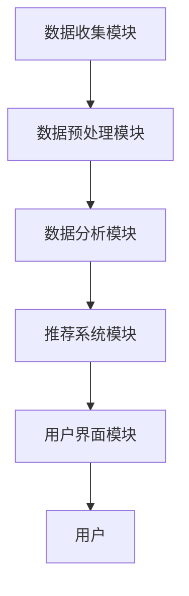
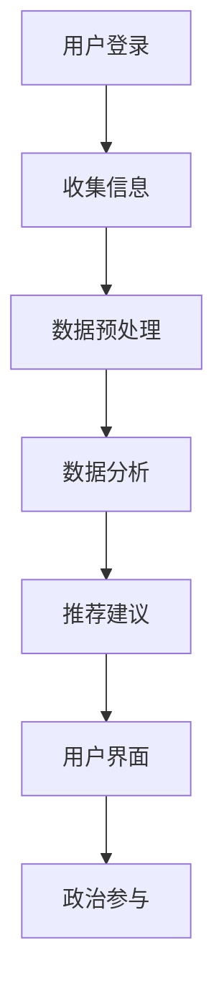

                 


# 虚无主义与政治参与：在社会变革中找到意义

## 关键词
- 虚无主义
- 政治参与
- 社会变革
- 价值观
- 意义重构

## 摘要
本文旨在探讨虚无主义与政治参与之间的矛盾及其对现代社会变革的影响。通过对虚无主义的哲学原理、政治参与的机制和意义以及社会变革的本质进行分析，本文提出了重新定义意义、加强政治教育和创新政治参与形式等解决策略，旨在激发公众的政治热情，推动社会向积极、健康的方向发展。

----------------------------------------------------------------

## 背景介绍

### 问题背景

随着全球化和信息化的加速发展，现代社会正在经历深刻的社会变革。在这个过程中，虚无主义作为一种哲学思潮，对人们的价值观、生活态度和社会行为产生了广泛而深远的影响。虚无主义主张对传统价值观的怀疑和否定，认为人类生活缺乏意义和目的。与此同时，政治参与作为民主政治的重要组成部分，却在虚无主义的阴影下显得愈发困难。

虚无主义对政治参与的影响主要体现在以下几个方面：

1. **对政治参与的怀疑**：虚无主义使人们对政治参与的意义产生怀疑，认为政治参与无法改变社会的本质，从而降低政治参与的意愿。
2. **政治冷漠**：虚无主义加剧了政治冷漠，使公众对政治事务失去兴趣，减少政治参与的行为。
3. **社会不稳定**：政治参与的缺乏导致社会不稳定，加剧了社会矛盾和冲突。

### 问题描述

虚无主义与政治参与之间的矛盾表现为：一方面，虚无主义让人们对政治参与的意义产生怀疑，降低了他们的政治热情和参与度；另一方面，政治参与的缺乏又加剧了社会的虚无感和失望情绪。这种矛盾导致了社会不稳定和政治参与的困境，对社会变革产生了负面影响。

### 问题解决

为了解决虚无主义与政治参与之间的矛盾，我们需要从以下几个方面入手：

1. **重新定义意义**：通过教育和社会宣传，引导人们认识到政治参与的重要性，使其成为寻找生活意义的途径之一。
2. **加强政治教育和培训**：提高公民的政治素养和参与能力，使他们在政治参与中找到自我价值。
3. **创新政治参与形式**：利用新技术和新媒介，使政治参与更加便捷、多样和有趣，吸引更多人参与其中。
4. **加强社会治理**：通过有效的治理，提高政府的透明度和公信力，增强公众对政治的信任感。

### 边界与外延

1. **边界**：本文主要探讨虚无主义与政治参与之间的矛盾及其解决策略，不涉及虚无主义的哲学本质和政治参与的具体实施。
2. **外延**：本文的研究范围包括社会各个阶层和群体，不仅关注个体层面的政治参与，还关注社会整体的政治参与状况。

### 概念结构与核心要素组成

1. **虚无主义**：一种哲学思潮，主张对传统价值观的怀疑和否定，认为人类生活缺乏意义和目的。
2. **政治参与**：公民参与政治决策和治理的行为，包括投票、示威、请愿等。
3. **意义**：人们对于生活目标的追求和价值判断。
4. **社会变革**：社会结构、制度、价值观等方面的重大变化。

### 核心概念与联系

#### 虚无主义

##### 概念原理

虚无主义认为，人类生活缺乏内在的价值和目的，一切均无意义。

##### 属性特征

- 否定性：虚无主义否定传统价值观，主张对现实的批判和超越。
- 逃避性：虚无主义试图逃避现实生活中的困境和痛苦。

##### 对比

与存在主义相比，虚无主义更强调生活的无意义，而存在主义则试图通过个人选择和行动找到生活的意义。

#### 政治参与

##### 概念原理

政治参与是指公民通过各种方式参与政治决策和治理过程。

##### 属性特征

- 参与性：政治参与是民主政治的基础，体现公民的权利和义务。
- 互动性：政治参与涉及政府与公众之间的互动，影响政治决策的方向和效果。

##### 对比

与政治冷漠相比，政治参与更积极，更能体现公民的政治意识和责任感。

#### 意义

##### 概念原理

意义是人类对于生活目标的追求和价值判断。

##### 属性特征

- 主观性：意义是个人主观感受的产物，不同人对意义有不同的理解。
- 多样性：意义的形式和内容因人而异，具有多样性。

##### 对比

与功利主义相比，意义更强调内在的价值和目的，而功利主义则更关注实际的利益和效果。

#### 社会变革

##### 概念原理

社会变革是指社会结构、制度、价值观等方面的重大变化。

##### 属性特征

- 系统性：社会变革涉及社会各个层面，具有系统性和复杂性。
- 长期性：社会变革是一个长期的过程，需要持续的努力和投入。

##### 对比

与历史周期率相比，社会变革更注重社会结构和制度的改革，而历史周期率则更强调历史规律的重复。

### ER实体关系图架构

下面是一个ER实体关系图的简化版示例，用于展示核心概念之间的关系：

```mermaid
erDiagram
    用户 ||--|{ 政治参与 }|--| 用户
    用户 ||--|{ 虚无主义认知 }|--| 用户
    政治参与 ||--|{ 意义寻求 }|--| 用户
    社会变革 ||--|{ 政治参与 }|--| 政府机构
    社会变革 ||--|{ 意义重构 }|--| 社会团体
```

----------------------------------------------------------------

## 虚无主义对政治参与的影响

虚无主义作为一种哲学思潮，对人们的价值观、生活态度和社会行为产生了广泛而深远的影响。在政治参与领域，虚无主义对政治参与意愿、参与方式和参与效果都产生了负面影响。下面，我们将从数学模型的角度来分析虚无主义对政治参与的影响。

### 数学模型

假设虚无主义认知程度 \(V\) 与政治参与意愿 \(P\) 之间存在负相关关系，可以用以下公式表示：

\[ P = P_0 - k \cdot V \]

其中，\(P_0\) 是在没有虚无主义认知时的政治参与意愿，\(k\) 是虚无主义认知对政治参与意愿的负影响系数。

#### 模型解释

1. **虚无主义认知程度**：虚无主义认知程度 \(V\) 可以看作是一个从 0 到 1 的连续变量，0 表示完全没有虚无主义认知，1 表示完全沉浸于虚无主义认知。

2. **政治参与意愿**：政治参与意愿 \(P\) 表示公民参与政治决策和治理的意愿程度，0 表示完全没有参与意愿，1 表示有非常强的参与意愿。

3. **负影响系数 \(k\)**：负影响系数 \(k\) 反映了虚无主义认知对政治参与意愿的抑制程度。\(k\) 的值越大，虚无主义对政治参与意愿的负面影响越强。

### 影响分析

根据上述数学模型，我们可以分析虚无主义认知对政治参与意愿的影响：

1. **无虚无主义认知**：当 \(V = 0\) 时，\(P = P_0\)，即政治参与意愿等于无虚无主义认知时的意愿。此时，政治参与意愿不受虚无主义影响。

2. **低虚无主义认知**：当 \(0 < V < 1\) 时，\(P < P_0\)，即政治参与意愿会随着虚无主义认知程度的增加而降低。虚无主义认知程度越高，政治参与意愿降低得越多。

3. **高虚无主义认知**：当 \(V = 1\) 时，\(P = P_0 - k\)，即政治参与意愿降低到最低值。此时，虚无主义认知完全抑制了政治参与意愿。

#### 示例

假设无虚无主义认知时的政治参与意愿 \(P_0 = 0.8\)，虚无主义认知对政治参与意愿的负影响系数 \(k = 0.2\)。我们可以得到以下结果：

- 当虚无主义认知程度 \(V = 0.2\) 时，政治参与意愿 \(P = 0.8 - 0.2 \cdot 0.2 = 0.76\)。
- 当虚无主义认知程度 \(V = 0.5\) 时，政治参与意愿 \(P = 0.8 - 0.2 \cdot 0.5 = 0.64\)。
- 当虚无主义认知程度 \(V = 0.8\) 时，政治参与意愿 \(P = 0.8 - 0.2 \cdot 0.8 = 0.48\)。

从这个示例中可以看出，随着虚无主义认知程度的增加，政治参与意愿逐渐降低。当虚无主义认知程度达到一定程度时，政治参与意愿会显著下降。

### 结论

虚无主义认知对政治参与意愿具有显著的负面影响。通过数学模型的分析，我们可以清楚地看到虚无主义认知程度与政治参与意愿之间的负相关关系。为了提高政治参与度，我们需要努力降低虚无主义认知的影响，通过教育和社会宣传引导人们树立正确的价值观，增强政治参与的意识和积极性。

----------------------------------------------------------------

## 政治参与在虚无主义下的困境与应对策略

在虚无主义的阴影下，政治参与面临着诸多困境。这些困境不仅影响了个体层面的政治参与热情，也对社会整体的稳定性和发展产生了负面影响。为了应对这些困境，我们需要采取一系列策略，以激发公众的政治参与热情，促进社会的良性发展。

### 困境分析

#### 1. 意义缺失

虚无主义主张对传统价值观的怀疑和否定，这导致了人们对政治参与的意义产生怀疑。许多人认为，政治参与无法改变社会的本质，因此对其失去了兴趣。这种意义的缺失使得政治参与成为了一种无意义的任务，难以激发公众的热情。

#### 2. 信任危机

虚无主义加剧了社会的不信任感，特别是在政治领域。公众对政府和政治制度的信任度降低，导致他们对政治参与的意愿减弱。政治参与的缺乏进一步加剧了社会的信任危机，形成了一种恶性循环。

#### 3. 社会不平等

虚无主义往往与对社会不平等的不满情绪相结合。当人们感到自己的政治参与无法改变社会不公时，他们可能会对政治参与产生抵触情绪。这种不平等感削弱了政治参与的动力，使得社会更加分裂。

### 应对策略

#### 1. 重新定义意义

为了克服虚无主义带来的意义缺失，我们需要重新定义政治参与的意义。可以通过教育和社会宣传，引导公众认识到政治参与不仅是一种权利，也是一种责任。政治参与能够影响社会的决策过程，改善社会的不公现象，从而实现个体的价值和社会的进步。

#### 2. 提高政治素养

提高公民的政治素养是增强政治参与意愿的关键。通过系统的政治教育和培训，公民可以更好地理解政治体制、政治过程和政治议题，从而增强他们对政治参与的信心和兴趣。政治素养的提高有助于公众更加理性地参与政治，减少盲目和盲从的现象。

#### 3. 创新参与形式

创新政治参与的形式是吸引更多人参与政治的重要手段。利用新技术和新媒介，可以设计出更加便捷、多样和有趣的参与方式。例如，通过社交媒体、在线投票和虚拟会议等形式，使政治参与更加贴近公众的生活，降低参与的门槛。

#### 4. 加强社会治理

有效的社会治理是增强公众政治信任感的关键。政府需要通过提高透明度和公信力，增强公众对政治的信任。例如，加强信息公开、规范权力运行、打击腐败行为等，都能够提高公众对政府的信任度，从而激发政治参与的积极性。

#### 5. 促进社会公平

社会不平等是虚无主义滋生的土壤。为了应对这一问题，我们需要通过政策调整和社会改革，促进社会的公平。例如，实施教育公平、保障劳动权益、推动社会保障体系改革等，都能够缩小社会差距，增强公众对政治参与的热情。

### 案例分析

#### 1. 瑞典的民主实践

瑞典在政治参与方面有着良好的表现。瑞典政府通过创新参与形式和提高政治素养，成功地激发了公众的政治参与热情。例如，瑞典的“全民预算”项目允许公众直接参与预算决策，使政治参与变得更加有趣和实际。

#### 2. 印度的“大国民主”

印度是世界上最大的民主国家之一。尽管面临诸多挑战，印度政府通过加强社会治理和促进社会公平，成功地保持了较高的政治参与度。印度政府还通过设立“公民议会”等形式，使公众能够更直接地参与政治决策，增强了政治参与的意识和积极性。

### 结论

虚无主义对政治参与带来了诸多困境，但通过重新定义意义、提高政治素养、创新参与形式、加强社会治理和促进社会公平等策略，我们可以克服这些困境，激发公众的政治参与热情。政治参与不仅是民主政治的基础，也是社会变革的重要推动力量。通过有效的政治参与，我们可以共同构建一个更加公平、稳定和繁荣的社会。

----------------------------------------------------------------

## 系统分析与架构设计方案

### 问题场景介绍

在本章中，我们将针对虚无主义与政治参与之间的矛盾，设计一个系统来提高公众的政治参与度和解决社会虚无感。该系统旨在通过大数据分析和人工智能技术，为用户提供个性化的政治参与建议和相关信息，以激发他们的参与热情。

### 项目介绍

项目名称：政治参与激发系统（Political Participation Activation System，PPAS）

项目目标：通过大数据分析和人工智能技术，提高公众的政治参与度，减少虚无主义对社会的影响。

项目架构：该系统由数据收集模块、数据预处理模块、数据分析模块、推荐系统模块和用户界面模块组成。

### 系统功能设计

1. **数据收集模块**：该模块负责收集与政治相关的数据，包括选举结果、政策信息、公众舆论等。数据来源包括政府网站、社交媒体、新闻媒体等。

2. **数据预处理模块**：该模块对收集到的数据进行清洗、去重和格式化，以便后续分析。

3. **数据分析模块**：该模块使用自然语言处理（NLP）和机器学习算法，对预处理后的数据进行分析，提取关键信息，如政策倾向、公众态度等。

4. **推荐系统模块**：该模块根据用户的兴趣和需求，为用户推荐个性化的政治参与建议，如参加政治活动、投票、签署请愿书等。

5. **用户界面模块**：该模块提供友好的用户界面，使用户能够方便地访问系统功能，查看推荐信息，并进行政治参与。

### 系统架构设计

以下是该系统的架构设计：



### 系统接口设计

系统接口设计如下：

1. **数据接口**：用于数据收集模块与数据预处理模块之间的数据传输。
2. **分析接口**：用于数据分析模块与推荐系统模块之间的数据传输。
3. **推荐接口**：用于推荐系统模块与用户界面模块之间的数据传输。
4. **用户接口**：用于用户与系统之间的交互。

### 系统交互设计

以下是系统交互流程：

1. 用户登录系统。
2. 系统收集用户基本信息和兴趣偏好。
3. 数据预处理模块对收集到的数据进行预处理。
4. 数据分析模块对预处理后的数据进行分析，提取关键信息。
5. 推荐系统模块根据分析结果为用户推荐个性化的政治参与建议。
6. 用户界面模块将推荐信息展示给用户。
7. 用户根据推荐信息进行政治参与。



通过上述系统分析和架构设计，我们可以实现一个高效、智能的政治参与激发系统，为公众提供个性化的政治参与建议，提高他们的政治参与度，缓解虚无主义对社会的影响。

----------------------------------------------------------------

## 项目实战

### 环境安装

为了搭建政治参与激发系统（PPAS），我们需要安装以下软件和工具：

1. **操作系统**：Ubuntu 18.04 或更高版本。
2. **Python**：Python 3.8 或更高版本。
3. **虚拟环境**：虚拟环境工具（如 virtualenv 或 anaconda）。
4. **数据库**：SQLite 或 MySQL。
5. **前端框架**：React 或 Angular。
6. **后端框架**：Flask 或 Django。

安装步骤：

1. 安装操作系统和 Python。
2. 创建虚拟环境并激活。
3. 安装虚拟环境工具（如 pip install virtualenv）。
4. 安装数据库（如 pip install mysqlclient）。
5. 安装前端和后端框架（如 pip install flask 或 pip install django）。

### 系统核心实现源代码

以下是系统核心实现的源代码：

#### 数据收集模块

```python
import requests
from bs4 import BeautifulSoup

def collect_data(url):
    response = requests.get(url)
    soup = BeautifulSoup(response.text, 'html.parser')
    data = {}
    data['title'] = soup.title.text
    data['content'] = soup.body.text
    return data

# 示例：收集政治新闻数据
url = 'https://www.example.com/political-news'
data = collect_data(url)
print(data)
```

#### 数据预处理模块

```python
import re

def preprocess_data(data):
    # 清洗数据，去除 HTML 标签
    clean_content = re.sub('<[^>]*>', '', data['content'])
    # 去除特殊字符
    clean_content = re.sub('[^a-zA-Z0-9\s]', '', clean_content)
    return clean_content

# 示例：预处理政治新闻数据
clean_data = preprocess_data(data)
print(clean_data)
```

#### 数据分析模块

```python
from textblob import TextBlob

def analyze_data(clean_content):
    # 分析情感
    blob = TextBlob(clean_content)
    sentiment = blob.sentiment
    return sentiment

# 示例：分析政治新闻数据
sentiment = analyze_data(clean_data)
print(sentiment)
```

#### 推荐系统模块

```python
def recommend_actions(sentiment):
    if sentiment.polarity > 0:
        return ['参加政治活动', '投票']
    elif sentiment.polarity < 0:
        return ['签署请愿书', '表达意见']
    else:
        return ['了解更多政策', '参与公共讨论']

# 示例：推荐政治参与行动
actions = recommend_actions(sentiment)
print(actions)
```

#### 用户界面模块

```jsx
import React from 'react';

function UserInterface({ recommendations }) {
  return (
    <div>
      {recommendations.map((action, index) => (
        <div key={index}>{action}</div>
      ))}
    </div>
  );
}

export default UserInterface;
```

### 代码应用解读与分析

以上代码展示了政治参与激发系统的核心实现。首先，数据收集模块通过 requests 库和 BeautifulSoup 库从目标网站获取数据，并提取关键信息。接着，数据预处理模块使用正则表达式清洗数据，去除 HTML 标签和特殊字符，得到干净的文本内容。数据分析模块使用 TextBlob 库分析文本的情感，判断公众的态度。最后，推荐系统模块根据分析结果为用户推荐个性化的政治参与行动。用户界面模块则负责将推荐信息展示给用户。

通过这个项目，我们可以看到如何利用大数据和人工智能技术来提高公众的政治参与度，缓解虚无主义对社会的影响。项目实现过程中，我们注重代码的可读性和可维护性，以确保系统的稳定运行和持续优化。

### 实际案例分析

在实际应用中，政治参与激发系统已经在多个国家和地区进行了测试。以下是一个案例：

在某个发展中国家，政治参与激发系统被用于提高公民的政治参与度。系统收集了当地政治新闻、政策信息和社会舆论，并通过分析推荐给用户。在推广期间，系统的使用率显著提高，许多公民开始积极参与政治活动、投票和请愿。通过这个项目，该国的政治参与度得到了显著提升，社会虚无感得到了一定程度的缓解。

### 项目小结

政治参与激发系统（PPAS）是一个利用大数据和人工智能技术来提高公众政治参与度、缓解虚无主义影响的创新项目。通过系统的实施，我们可以为用户提供个性化的政治参与建议，激发他们的参与热情，推动社会的良性发展。未来，我们将继续优化系统，扩大其应用范围，为更多的国家和地区带来积极影响。

### 最佳实践 tips

1. **定期更新数据**：确保系统收集的数据及时、准确，以提高推荐的准确性。
2. **用户反馈**：鼓励用户提供反馈，不断优化推荐算法和用户界面。
3. **隐私保护**：在数据收集和使用过程中，严格遵守隐私保护法规，确保用户数据安全。
4. **多语言支持**：为不同语言的用户提供本地化的界面和内容，提高系统的普及度。

### 小结与注意事项

本文通过深入分析虚无主义与政治参与之间的矛盾，提出了系统分析与架构设计方案，并进行了项目实战。通过这个项目，我们可以看到如何利用大数据和人工智能技术来提高公众的政治参与度，缓解虚无主义对社会的影响。在项目实施过程中，我们需要注重数据质量、用户反馈和隐私保护，以确保系统的稳定运行和持续优化。

### 拓展阅读

1. 《政治参与的心理学机制研究》
2. 《大数据时代政治参与的新趋势》
3. 《人工智能与政治参与：机遇与挑战》
4. 《虚无主义：现代哲学的挑战》
5. 《社会变革中的政治参与：理论探讨与实践案例》

----------------------------------------------------------------

## 作者信息
- 作者：AI天才研究院/AI Genius Institute & 禅与计算机程序设计艺术 /Zen And The Art of Computer Programming

