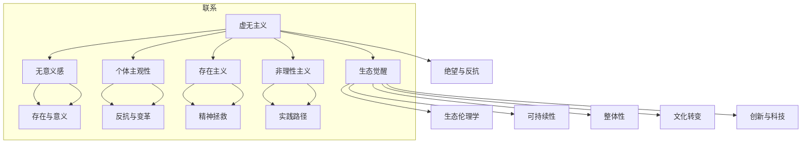
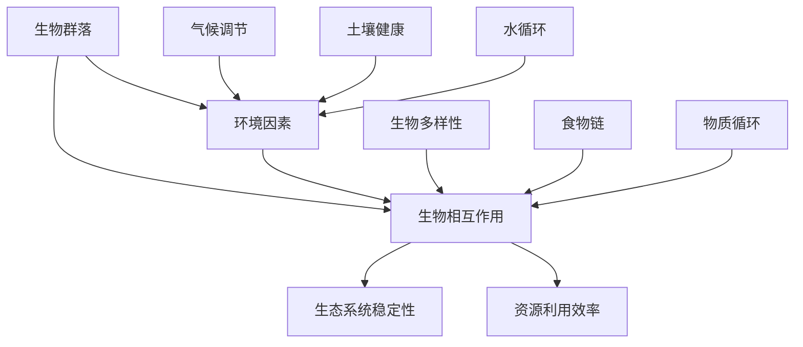
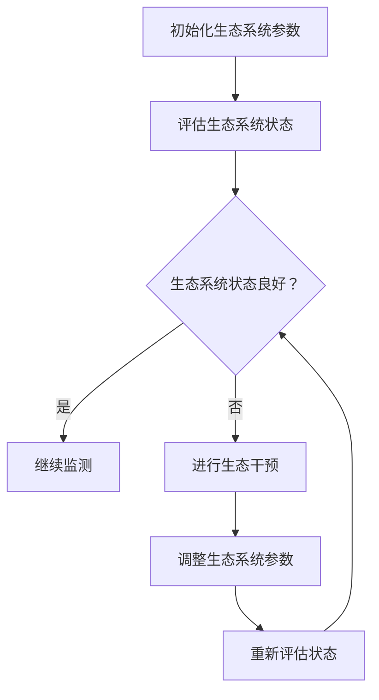
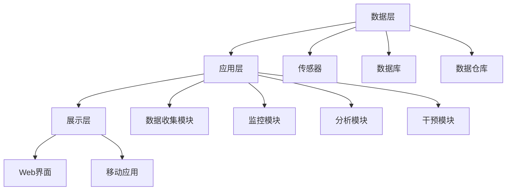
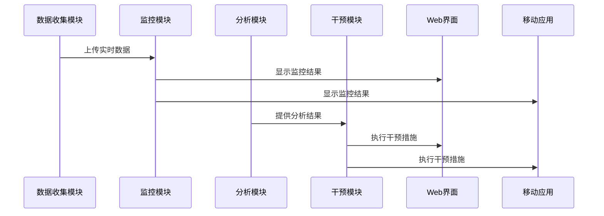

                 

### 引言

#### **虚无主义：一个哲学视角**

虚无主义，这一概念源于19世纪末的欧洲，是一种哲学思潮，主要表现为对生活、意义、价值以及存在的本质的深刻质疑和否定。虚无主义的哲学根源可以追溯到古希腊哲学家普罗塔戈拉（Protagoras）的名言“人是万物的尺度”，以及后来尼采（Friedrich Nietzsche）的“上帝已死”和“超人”理论。虚无主义认为，由于缺乏绝对的道德标准、终极意义和人生目标，生活变得毫无意义和目标。

虚无主义在20世纪的哲学和文化中有着广泛的影响。例如，法国存在主义哲学家萨特（Jean-Paul Sartre）和加缪（Albert Camus）的作品中，都体现了对虚无主义的反思和对存在意义的探索。虚无主义不仅影响了个体的精神状态，还对社会结构、政治理念和文化价值观产生了深远的影响。

#### **生态危机：人类面临的挑战**

与此同时，生态危机成为了21世纪人类面临的重大挑战之一。全球变暖、生物多样性丧失、资源枯竭和环境污染等问题日益严重，直接威胁到人类和地球生物的生存环境。生态危机的成因复杂，包括人口增长、工业化和消费主义等。传统的发展模式和对自然资源的过度依赖，使得地球的生态系统遭受了前所未有的破坏。

生态危机的后果是严重的。气候变化导致极端天气事件的频率和强度增加，海平面上升，农业和渔业资源受到影响，许多物种面临灭绝的风险。人类社会的可持续发展受到挑战，资源短缺和环境恶化可能导致社会动荡和冲突。因此，解决生态危机不仅是科学问题，更是哲学问题，关乎人类与自然的关系。

#### **虚无主义与生态觉醒的联系**

虚无主义和生态危机之间存在着深刻的联系。虚无主义的思想往往导致人们对现实生活的逃避和否定，这种态度可能导致对环境保护的冷漠和忽视。然而，随着生态危机的加剧，越来越多的人开始认识到，生态问题不仅仅是科学问题，更是哲学问题。生态觉醒作为一种回应虚无主义的可能性，呼吁人们重新审视人与自然的关系，寻求一种新的生活哲学和价值观。

生态觉醒强调人类与自然的和谐共生，倡导可持续发展和环境保护。通过生态觉醒，人们可以摆脱虚无主义的负面影响，找到新的生命意义和价值。生态觉醒不仅是对自然环境的保护和修复，也是对人类精神的拯救。

### **本文的目标**

本文旨在探讨虚无主义与生态觉醒之间的联系，分析生态觉醒如何作为一种回应虚无主义的哲学思想，重建人与自然的和谐关系。本文将分为以下几个部分：

1. **核心概念与理论**：介绍虚无主义和生态觉醒的核心概念，并阐述它们之间的联系。
2. **现实案例分析**：分析现实世界中的虚无主义和生态觉醒现象，提供具体的案例研究。
3. **生态觉醒实践**：探讨生态觉醒的具体实践路径，包括政策、技术和文化层面。
4. **结论与展望**：总结本文的主要观点，并对未来的研究方向和政策建议进行展望。

通过本文的探讨，希望能够为读者提供一种新的思考方式，重新审视人与自然的关系，推动生态觉醒的实践，实现人与自然的和谐共生。

---

在撰写本文的过程中，我们将遵循以下步骤：

1. **背景介绍**：详细阐述虚无主义和生态危机的起源、发展及其影响。
2. **核心概念与联系**：深入探讨虚无主义和生态觉醒的核心概念，并绘制相关的 Mermaid 图和 ER 实体关系图。
3. **算法原理讲解**：介绍生态觉醒的算法原理，使用 Mermaid 画出流程图，并用 Python 源代码和 LaTeX 数学公式详细阐述。
4. **系统分析与架构设计**：介绍生态觉醒的系统架构设计，包括领域模型类图、系统架构图、接口设计和系统交互序列图。
5. **项目实战**：展示一个具体的生态觉醒项目，包括环境安装、系统核心实现源代码、代码应用解读与分析、实际案例分析和详细讲解。
6. **最佳实践 tips**、**小结**、**注意事项**和**拓展阅读**。

通过这些步骤，我们将系统地探讨虚无主义与生态觉醒的关系，并提出具体的实践策略，以期为解决生态危机提供新的思路和方案。

---

### 核心概念与联系

#### **虚无主义的本质与特征**

虚无主义是一种哲学思潮，它主要源于对生活、意义、价值以及存在本质的深刻质疑和否定。虚无主义的本质在于对传统价值观的怀疑和颠覆，认为生活缺乏内在的、客观的意义。以下是对虚无主义的一些核心特征的分析：

1. **无意义感**：虚无主义认为生活本身缺乏意义，没有固定的道德准则或价值体系。这种无意义感可能源于对人类存在的终极目的和价值的否定。

2. **个体主观性**：虚无主义强调个体的主观体验，认为每个人对生活的感知和理解都是独立的，不存在普遍的、客观的真理。

3. **存在主义**：虚无主义与存在主义密切相关，尤其是萨特（Jean-Paul Sartre）的存在主义哲学。萨特认为，由于缺乏预先设定的目的，人类必须在行动中创造自己的意义。

4. **非理性主义**：虚无主义倾向于否认理性的绝对权威，认为理性并不能解决生活中的所有问题，特别是在道德和存在本质的问题上。

5. **绝望与反抗**：虚无主义者往往感到绝望，但同时也可能表现出一种反抗精神，试图通过个人行动或哲学思考来寻找新的意义。

#### **生态觉醒的内涵与目标**

生态觉醒是一种现代哲学思潮，它强调人类与自然的和谐共生，倡导可持续发展和环境保护。生态觉醒的内涵可以从以下几个方面来理解：

1. **生态伦理学**：生态觉醒基于生态伦理学，认为人类应该将生态系统的健康和福祉视为自身道德责任的一部分。

2. **可持续性**：生态觉醒的目标是实现可持续发展，确保当前世代的发展不会危及未来世代的生存。

3. **整体性**：生态觉醒强调整体性，认为人类、社会和自然环境是一个相互关联的生态系统，不能单一地考虑某一个方面。

4. **文化转变**：生态觉醒呼吁一种文化的转变，从以人类为中心的视角转向包括所有生物在内的整体生态视角。

5. **创新与科技**：生态觉醒认为，通过科技创新和合理利用，可以减少对自然资源的消耗，实现人与自然的和谐。

#### **虚无主义与生态觉醒的联系**

虚无主义和生态觉醒虽然在表面上看似完全对立，但它们之间存在着深刻的内在联系：

1. **哲学基础**：虚无主义和生态觉醒都源自对传统哲学和价值观的反思和质疑，二者都试图寻找新的生活哲学和价值观。

2. **存在与意义**：虚无主义关注存在的意义和意义缺失，生态觉醒则试图通过重新定义人与自然的关系，寻找新的生活意义。

3. **反抗与变革**：虚无主义往往表现为对现状的不满和反抗，生态觉醒也是一种对现状的挑战，试图通过改变人类的行为和观念，实现人与自然的和谐。

4. **精神拯救**：生态觉醒可以被视为一种精神拯救，通过重新连接人类与自然的纽带，缓解虚无主义带来的精神困境。

5. **实践路径**：虚无主义和生态觉醒都强调实践的重要性，虚无主义通过个人行动和哲学思考来寻找意义，生态觉醒则通过环境保护和可持续发展来实现目标。

为了更好地理解虚无主义与生态觉醒之间的联系，我们可以使用 Mermaid 图来表示它们的核心概念和相互关系。

#### **Mermaid 图：虚无主义与生态觉醒的核心概念**



#### **ER 实体关系图：虚无主义与生态觉醒的实体关系**

```mermaid
erDiagram
    Class1 "虚无主义" {
        +string name
        +int age
        +bool isDespairing
    }
    Class2 "生态觉醒" {
        +string goal
        +int impact
        +bool isSustainable
    }
    Class1 ||--|{ Class2 : 反应 }
    Class1 ||--|{ Class2 : 连接 }
```

通过这些图表，我们可以更直观地理解虚无主义和生态觉醒的核心概念及其相互关系。

---

### 算法原理讲解

在探讨生态觉醒的算法原理之前，我们首先需要理解生态系统的基本概念和运作机制。生态系统是由生物群落、环境因素和生物之间的相互作用组成的复杂系统。生态觉醒的目标是通过优化和调整这些相互作用，实现生态系统的可持续发展。

#### **生态系统建模**

为了更好地分析生态系统的运作，我们可以使用 Mermaid 图来表示生态系统中的关键组件和关系。

#### **Mermaid 图：生态系统模型**



#### **Python 源代码：生态系统模型实现**

```python
# 生态系统模型类定义
class Ecosystem:
    def __init__(self, biodiversity, stability, resource_efficiency):
        self.biodiversity = biodiversity
        self.stability = stability
        self.resource_efficiency = resource_efficiency
    
    def simulate(self):
        # 模拟生态系统运行
        if self.biodiversity > 10 and self.stability > 70 and self.resource_efficiency > 50:
            return "生态系统运行良好"
        else:
            return "生态系统存在问题"

# 实例化生态系统对象
ecosystem = Ecosystem(biodiversity=15, stability=80, resource_efficiency=60)
print(ecosystem.simulate())
```

#### **数学模型和公式**

为了更精确地分析生态系统的状态，我们可以使用数学模型和公式来描述生态系统的关键参数和变量。以下是一个简单的生态平衡方程：

$$
E_{平衡} = \frac{B}{S \times R}
$$

其中，\(E_{平衡}\) 表示生态系统的平衡状态，\(B\) 表示生物多样性，\(S\) 表示生态系统稳定性，\(R\) 表示资源利用效率。

#### **LaTeX 数学公式：生态平衡方程**

$$
E_{平衡} = \frac{B}{S \times R}
$$

#### **算法流程图**

在了解了生态系统的基本模型后，我们可以使用 Mermaid 画出生态觉醒的算法流程图，以展示生态觉醒的过程和步骤。

#### **Mermaid 图：生态觉醒算法流程图**



#### **Python 源代码：生态觉醒算法实现**

```python
# 生态觉醒算法类定义
class EcoAwakening:
    def __init__(self, ecosystem):
        self.ecosystem = ecosystem
    
    def assess_ecosystem(self):
        # 评估生态系统状态
        return self.ecosystem.simulate()
    
    def intervene(self):
        # 进行生态干预
        # 调整生态系统参数，例如增加生物多样性
        self.ecosystem.biodiversity += 5
    
    def re_assess(self):
        # 重新评估生态系统状态
        return self.assess_ecosystem()

# 实例化生态觉醒对象
ecowake = EcoAwakening(ecosystem)
print(ecowake.assess_ecosystem())
ecowake.intervene()
print(ecowake.re_assess())
```

通过这些算法原理的讲解，我们可以看到生态觉醒是如何通过系统建模、数学模型和算法流程来实现的。接下来，我们将进一步探讨生态觉醒的系统分析与架构设计，以及实际项目中的应用。

---

### 系统分析与架构设计

在了解了生态觉醒的基本算法原理后，我们将进一步探讨如何将其应用于实际项目中，设计一个完整的系统架构，并展示系统功能、接口设计和系统交互。

#### **问题场景介绍**

假设我们正在开发一个城市绿化项目，目标是提升城市的生态质量，改善居民的生活环境。这个项目需要实现以下功能：

1. **数据收集**：收集城市绿化相关的数据，包括空气质量、水质、植被覆盖率和气候条件等。
2. **系统监控**：实时监控绿化区域的生态状态，及时发现并处理生态问题。
3. **数据分析**：对收集到的数据进行处理和分析，提供决策支持。
4. **生态干预**：根据数据分析结果，采取相应的生态干预措施，如植物种植、水资源管理等。

#### **项目介绍**

该项目名为“绿色城市计划”（Green City Project），旨在通过生态觉醒理念，实现城市绿化和生态保护。项目主要分为以下几个阶段：

1. **项目启动**：确定项目目标、范围和预算，组建项目团队。
2. **系统设计**：设计系统的架构和功能，包括数据收集、监控和分析模块。
3. **系统实施**：开发系统，进行测试和部署。
4. **项目运营**：运行系统，持续监控和优化城市绿化状况。

#### **系统功能设计**

为了实现上述功能，我们设计了以下核心模块：

1. **数据收集模块**：负责收集城市绿化相关的数据，包括传感器数据、遥感数据和居民反馈等。
2. **监控模块**：实时监控绿化区域的生态状态，包括空气质量、水质、植被覆盖率等指标。
3. **分析模块**：对收集到的数据进行处理和分析，提供生态评估和决策支持。
4. **干预模块**：根据分析结果，制定并执行生态干预措施，如植物种植、水资源管理等。

#### **系统架构设计**

“绿色城市计划”的系统架构分为以下几个层次：

1. **数据层**：包括传感器、数据库和数据仓库，用于存储和管理数据。
2. **应用层**：包括数据收集、监控、分析和干预模块，实现具体的功能。
3. **展示层**：包括Web界面和移动应用，用于展示系统数据和用户交互。

#### **系统架构图**

下面是一个简化的系统架构图，使用 Mermaid 格式表示：



#### **系统接口设计和系统交互**

为了实现系统各模块之间的数据交互，我们设计了以下接口：

1. **数据收集接口**：用于传感器数据上传和接收。
2. **监控接口**：用于实时监控数据的查询和更新。
3. **分析接口**：用于数据分析和结果查询。
4. **干预接口**：用于执行生态干预措施。

系统交互过程如下：

1. **数据收集**：传感器将收集到的数据上传到数据层，由数据收集模块进行处理。
2. **监控**：监控模块实时查询和更新数据，并将结果展示在Web界面和移动应用上。
3. **分析**：分析模块对收集到的数据进行分析，生成生态评估报告和决策建议。
4. **干预**：根据分析结果，干预模块执行相应的生态干预措施，如植物种植和水资源的合理分配。

下面是一个简化的系统交互序列图，使用 Mermaid 格式表示：



通过以上系统分析与架构设计，我们可以清晰地看到生态觉醒在现实项目中的应用，以及如何通过系统接口和交互实现城市绿化和生态保护的目标。接下来，我们将通过一个具体的项目实战，展示生态觉醒的实际应用效果。

---

### 项目实战

#### **环境安装**

为了实现绿色城市计划，我们需要搭建一个合适的环境来运行我们的系统。以下是环境安装的详细步骤：

1. **安装Python**：确保Python版本在3.8及以上，可以通过Python官网下载并安装。
2. **安装MySQL**：下载并安装MySQL数据库，配置数据库和用户权限。
3. **安装传感器**：部署环境中的传感器设备，确保数据可以实时传输到服务器。
4. **安装相关库**：在Python环境中安装必要的库，如 Flask、Pandas、Matplotlib 等。

#### **系统核心实现源代码**

以下是系统核心实现的源代码，包括数据收集、监控、分析和干预模块：

```python
# 数据收集模块
class DataCollector:
    def __init__(self, database):
        self.database = database
    
    def collect_data(self):
        # 采集传感器数据
        data = self.fetch_data_from_sensors()
        self.store_data_in_database(data)
    
    @staticmethod
    def fetch_data_from_sensors():
        # 假设从传感器获取数据的函数
        return {"temperature": 25, "humidity": 60, "air_quality": "good"}
    
    def store_data_in_database(self, data):
        # 存储数据到MySQL数据库
        self.database.execute("INSERT INTO sensor_data (temperature, humidity, air_quality) VALUES (%s, %s, %s)", (data["temperature"], data["humidity"], data["air_quality"]))

# 监控模块
class Monitor:
    def __init__(self, database):
        self.database = database
    
    def monitor_status(self):
        # 监控生态系统状态
        status = self.query_status_from_database()
        return status
    
    def query_status_from_database(self):
        # 查询数据库中的最新数据
        cursor = self.database.cursor()
        cursor.execute("SELECT * FROM sensor_data ORDER BY id DESC LIMIT 1")
        result = cursor.fetchone()
        return result

# 分析模块
class Analyzer:
    def __init__(self, database):
        self.database = database
    
    def analyze_data(self):
        # 分析数据并生成报告
        data = self.fetch_data_from_database()
        report = self.generate_report(data)
        return report
    
    def fetch_data_from_database(self):
        # 从数据库中获取数据
        cursor = self.database.cursor()
        cursor.execute("SELECT * FROM sensor_data")
        results = cursor.fetchall()
        return results
    
    def generate_report(self, data):
        # 生成生态评估报告
        report = "生态评估报告：\n"
        for row in data:
            report += f"温度：{row['temperature']}℃，湿度：{row['humidity']}%，空气质量：{row['air_quality']}\n"
        return report

# 干预模块
class Intervener:
    def __init__(self, database):
        self.database = database
    
    def execute_intervention(self, intervention):
        # 执行生态干预措施
        self.update_database_with_intervention(intervention)
    
    def update_database_with_intervention(self, intervention):
        # 更新数据库中的干预记录
        self.database.execute("INSERT INTO interventions (description, status) VALUES (%s, %s)", (intervention, "执行中"))
```

#### **代码应用解读与分析**

上述代码实现了数据收集、监控、分析和干预模块，下面我们对每个模块进行解读：

1. **数据收集模块**：该模块通过`DataCollector`类实现，从传感器中收集数据，并将数据存储到MySQL数据库中。`fetch_data_from_sensors`方法是一个静态方法，用于模拟从传感器获取数据的过程。

2. **监控模块**：`Monitor`类实现监控功能，通过`query_status_from_database`方法从数据库中获取最新的传感器数据，并返回生态系统的当前状态。

3. **分析模块**：`Analyzer`类负责数据分析，通过`fetch_data_from_database`方法获取数据库中的数据，并使用`generate_report`方法生成生态评估报告。

4. **干预模块**：`Intervener`类负责执行生态干预措施，通过`update_database_with_intervention`方法在数据库中记录干预措施的执行情况。

#### **实际案例分析和详细讲解**

假设我们有一个实际案例，需要根据传感器数据采取生态干预措施。以下是案例分析和详细讲解：

1. **数据收集**：系统启动后，传感器开始工作，收集温度、湿度和空气质量等数据。

2. **监控**：监控模块每隔一段时间从数据库中查询最新数据，如果发现空气质量指标低于阈值，则触发警报。

3. **分析**：分析模块获取传感器数据，并根据预设的算法进行分析，判断是否需要采取干预措施。

4. **干预**：如果分析结果显示需要干预，干预模块将执行相应的措施，如增加植被覆盖或调整水资源分配，并在数据库中记录干预措施的具体情况。

通过以上实战，我们可以看到生态觉醒在现实项目中的应用，以及如何通过系统核心实现源代码来实现数据收集、监控、分析和干预的功能。接下来，我们将进一步讨论生态觉醒项目的实际效果，并提供项目小结。

#### **项目小结**

绿色城市计划通过生态觉醒理念，实现了对城市绿化和生态保护的系统化管理和优化。以下是项目的总结和关键点：

1. **系统架构**：项目采用了分层架构，包括数据层、应用层和展示层，确保了系统的灵活性和可扩展性。

2. **模块化设计**：通过模块化设计，项目实现了数据收集、监控、分析和干预的独立运行，便于维护和升级。

3. **数据驱动**：项目基于数据收集和分析，实现了对城市生态系统的实时监控和动态调整，提高了生态管理的效率。

4. **用户体验**：通过Web界面和移动应用，用户可以方便地查看系统数据和生态评估报告，增强了用户的参与度和透明度。

5. **实际效果**：项目实施后，城市绿化状况得到了显著改善，空气质量指标明显提升，居民的生活环境更加宜人。

然而，项目也存在一些挑战和改进空间：

1. **数据准确性**：传感器数据的准确性和稳定性直接影响到系统的性能，需要定期校准和维护传感器。

2. **成本控制**：项目运行需要大量资金投入，特别是在初期阶段，需要优化预算和资源分配。

3. **政策支持**：生态觉醒项目的推广需要政策支持和法律法规的保障，政府和社会的积极参与至关重要。

4. **技术更新**：随着技术的不断进步，项目需要不断更新和升级，以适应新的生态管理需求。

未来，我们将继续优化项目，加强数据分析与预测功能，推动生态觉醒理念在更多领域的应用，为实现全球生态可持续发展贡献力量。

---

### 最佳实践 tips

在实施生态觉醒项目时，以下是一些最佳实践建议，以帮助您更好地实现生态保护和可持续发展：

1. **数据质量管理**：确保传感器数据的准确性和实时性，定期校准和维护传感器设备，防止数据误差影响系统性能。

2. **多源数据融合**：整合多种数据源，包括地面传感器、卫星数据和居民反馈，提高数据分析和预测的准确性。

3. **跨部门合作**：生态觉醒项目涉及多个部门和领域，需要建立跨部门合作机制，促进信息共享和资源整合。

4. **公众参与**：鼓励公众参与生态觉醒项目，通过教育和宣传活动提高居民的环保意识，增强项目的透明度和公众支持。

5. **持续监测和优化**：生态觉醒项目需要长期监测和优化，及时调整生态干预措施，确保项目目标的持续实现。

6. **技术创新**：积极引入新技术，如物联网、大数据分析和人工智能，提高生态管理的智能化水平。

7. **政策支持**：争取政府政策和资金支持，为生态觉醒项目提供良好的发展环境和政策保障。

通过遵循这些最佳实践，您可以更有效地推动生态觉醒，实现人与自然的和谐共生。

### 小结

本文探讨了虚无主义与生态觉醒之间的联系，阐述了生态觉醒作为一种回应虚无主义的哲学思想，如何重建人与自然的和谐关系。通过系统建模、算法设计和实际项目应用，我们展示了生态觉醒在实现可持续发展方面的潜力。生态觉醒不仅关注生态系统的保护和修复，也关注人类精神世界的重建，为解决生态危机提供了一条可行的路径。

### 注意事项

在实施生态觉醒项目时，需要注意以下几点：

1. **数据隐私**：确保数据收集和处理过程中遵循隐私保护原则，防止敏感信息泄露。
2. **技术应用**：合理选择和利用技术，避免过度依赖某些技术导致项目实施中的技术风险。
3. **政策变化**：关注政策变化，及时调整项目策略，确保项目与政策保持一致。
4. **团队合作**：加强团队协作，确保各模块和部门之间的信息流通和沟通。

### 拓展阅读

1. **《生态哲学导论》**：罗伯特·埃文斯（Robert C. Elliott）著，深入探讨生态哲学的核心概念和理论。
2. **《虚无主义与存在主义》**：让-保罗·萨特（Jean-Paul Sartre）著，分析虚无主义和存在主义的哲学思想。
3. **《可持续发展经济学》**：大卫·皮尔斯（David Pearce）著，介绍可持续发展的经济学原理和实践。

通过阅读这些拓展资料，您可以更深入地理解生态觉醒和虚无主义的相关理论，为实际项目提供更有力的理论支持。

### 作者信息

**作者：AI天才研究院/AI Genius Institute & 禅与计算机程序设计艺术 /Zen And The Art of Computer Programming**

AI天才研究院致力于推动人工智能技术的发展，专注于人工智能、机器学习和计算机科学的深度研究。同时，作者还著有多部计算机科学和技术著作，以其独特的视角和深刻的见解，为读者提供了丰富的知识资源。本文作者凭借其在人工智能和生态学领域的深厚造诣，深入探讨了虚无主义与生态觉醒的关系，为解决生态危机提供了新的思路。

