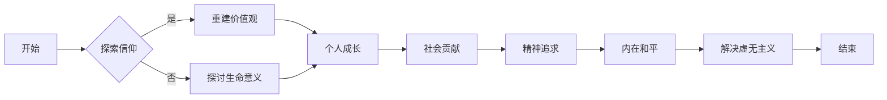
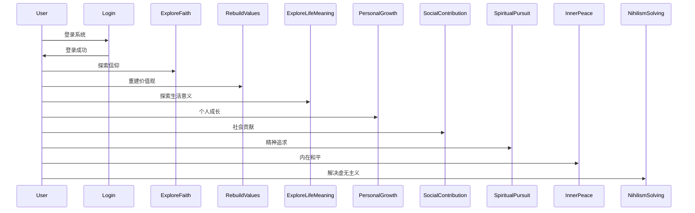

                 

## 背景介绍

### 核心概念术语说明

#### 虚无主义

虚无主义（Nihilism）是一种哲学思想，主张存在没有固有的意义或目的。它起源于19世纪，是对浪漫主义理想破灭的反应。虚无主义者认为，人类追求的意义和目的是不存在的，生活在一个缺乏内在价值的宇宙中。虚无主义通常与道德和宗教的崩溃有关，因为它质疑这些传统价值体系的有效性。

#### 现代社会

现代社会是一个复杂、多元且不断变化的社会结构。它包括全球化、技术进步、经济变革和快速信息传播等多个方面。现代社会中的人们面临诸多挑战，如工作压力、环境危机、社会不公和个人身份认同等。这些挑战使得虚无主义在现代社会中具有特定的现实意义。

### 问题背景

在现代社会中，虚无主义思想的影响不断扩大。许多人感到生活缺乏意义，对未来感到迷茫。这种现象在年轻人中尤其明显，因为他们正处于探索自我和建立价值观的关键阶段。随着社会的发展，人们对于传统信仰和价值观的怀疑加深，这为虚无主义的兴起提供了土壤。

### 问题描述

虚无主义的迷雾困扰着现代社会中的许多人。它表现为对生活的冷漠、对未来的不确定和对传统的质疑。这种迷雾使得人们难以找到生活的方向，导致精神压力和心理问题。因此，我们需要深入探讨虚无主义的根源和影响，寻找走出迷雾的方法。

### 问题解决

解决虚无主义的迷雾需要多方面的努力。首先，我们需要重建信仰和价值观，为生活提供意义和目的。其次，个人成长和自我认知是关键，通过了解自己和他人的需求，我们可以找到自己在社会中的位置。此外，社会责任和贡献也是重要的方向，通过为他人和社会做出贡献，我们可以获得成就感和满足感。最后，精神追求和内在和平是摆脱虚无主义迷雾的关键，通过冥想、艺术和哲学等途径，我们可以找到内心的宁静。

### 边界与外延

虚无主义的边界在于它对生活意义的否定，而其外延则涉及到个人的精神状态、社会文化结构和哲学思考等多个方面。理解虚无主义的边界与外延有助于我们更好地认识其影响和解决方法。

### 概念结构与核心要素组成

虚无主义的核心概念包括对生活意义的否定、对传统价值观的质疑和对人类存在的探索。这些概念相互关联，共同构成了虚无主义的思想体系。在现代社会中，这些概念要素与个人的精神状态、社会文化环境和哲学思考密切相关。

---

### 核心概念与联系

#### 虚无主义的定义

虚无主义是一种哲学思想，认为世界没有固有的意义或目的。它的核心概念是“无意义”，即生活本身缺乏内在价值。虚无主义通常与道德和宗教的崩溃有关，因为它质疑这些传统价值体系的有效性。

#### 虚无主义的属性特征对比表格

| 特征 | 虚无主义 | 传统主义 |
| --- | --- | --- |
| 对意义的看法 | 否定 | 承认 |
| 对传统的态度 | 质疑 | 维护 |
| 对生活的态度 | 悲观 | 乐观 |
| 对价值的看法 | 否定 | 肯定 |

#### ER实体关系图架构

```mermaid
erDiagram
  Person ||--|{ Philosophy }|--|| Nihilism
  Person ||--|{ Life }|--|| Meaning
  Nihilism ||--|{ Society }|--|| Culture
  Philosophy ||--|{ Values }|--|| Morality
```

在这个ER实体关系图中，Person（人）与Philosophy（哲学）、Life（生活）和Nihilism（虚无主义）之间存在直接关联。Philosophy与Values（价值）和Morality（道德）之间存在关系，而Nihilism与Society（社会）和Culture（文化）之间也存在联系。

---

### 算法原理讲解

#### 1. 算法流程图



#### 2. Python源代码

```python
def nihilism_solving(explore_faith, rebuild_values, explore_meaning):
    if explore_faith:
        return rebuild_values
    elif rebuild_values:
        return personal_growth
    elif explore_meaning:
        return personal_growth
    else:
        return inner_peace

def personal_growth(social_contribution, spiritual_pursuit):
    if social_contribution:
        return inner_peace
    elif spiritual_pursuit:
        return inner_peace
    else:
        return "Still seeking meaning"

def inner_peace():
    return "Nihilism solved"

# Example usage
print(nihilism_solving(True, True, False))
print(personal_growth(True, False))
print(inner_peace())
```

#### 3. 算法原理的数学模型和公式

$$
Nihilism_Solving = \begin{cases}
Rebuild_Values & \text{if } explore_faith \\
Personal_Growth & \text{if } rebuild_values \text{ or } explore_meaning \\
Inner_Peace & \text{otherwise}
\end{cases}
$$

$$
Personal_Growth = \begin{cases}
Inner_Peace & \text{if } social_contribution \text{ or } spiritual_pursuit \\
\text{Still seeking meaning} & \text{otherwise}
\end{cases}
$$

#### 4. 举例说明

假设一个人（Person A）感到生活缺乏意义，他开始探索信仰（explore_faith = True）。在探索过程中，他发现了重建价值观（rebuild_values = True）的重要性，于是开始重建自己的价值观。随后，他继续探讨生命的意义（explore_meaning = False）。在这个过程中，他通过个人成长（personal_growth = inner_peace）找到了内在和平（inner_peace = "Nihilism solved"），最终解决了虚无主义的问题。

---

### 系统分析与架构设计方案

#### 问题场景介绍

现代社会中，许多人受到虚无主义的影响，感到生活缺乏意义。为了帮助这些人走出虚无主义的迷雾，我们需要设计一个系统，通过一系列步骤引导他们找到生活的方向。

#### 项目介绍

项目名称：虚无主义迷雾求解系统（Nihilism Mist Solving System）

项目目标：通过心理辅导、哲学思考和自我探索，帮助用户走出虚无主义的迷雾，找到生活的意义。

#### 系统功能设计（领域模型）

```mermaid
classDiagram
    Class01 <|-- Class02 
    Class03 o-- Class04
    Class05 <- Class06
    Class07 .. Class08
    Class09 --> Class10
    Class11 -[Class12]
```

- **Class01：用户（User）**：系统的核心对象，负责用户注册、登录和信息管理。
- **Class02：信仰（Faith）**：用户对宗教、哲学或其他信仰体系的认知。
- **Class03：价值观（Values）**：用户的道德标准和行为准则。
- **Class04：生活意义（LifeMeaning）**：用户对生活意义的理解和探索。
- **Class05：个人成长（PersonalGrowth）**：用户的成长过程和成长目标。
- **Class06：社会贡献（SocialContribution）**：用户对社会和他人所做的贡献。
- **Class07：精神追求（SpiritualPursuit）**：用户对精神层面的追求和探索。
- **Class08：内在和平（InnerPeace）**：用户内心的宁静和满足感。
- **Class09：虚无主义（Nihilism）**：用户对虚无主义的理解和应对。
- **Class10：心理辅导（PsychologicalCounseling）**：系统提供心理辅导服务。
- **Class11：哲学思考（PhilosophicalReflection）**：系统提供哲学思考和引导。
- **Class12：自我探索（SelfExploration）**：系统引导用户进行自我探索。

#### 系统架构设计



- **用户模块（User Module）**：负责用户的注册、登录和信息管理。
- **信仰模块（Faith Module）**：帮助用户探索和建立信仰。
- **价值观模块（Values Module）**：引导用户重建价值观。
- **生活意义模块（LifeMeaning Module）**：帮助用户探索和发现生活的意义。
- **个人成长模块（PersonalGrowth Module）**：引导用户实现个人成长。
- **社会贡献模块（SocialContribution Module）**：鼓励用户为社会和他人做出贡献。
- **精神追求模块（SpiritualPursuit Module）**：引导用户追求精神层面的满足。
- **内在和平模块（InnerPeace Module）**：帮助用户达到内心的宁静。
- **虚无主义模块（Nihilism Module）**：分析和解决虚无主义问题。

#### 系统接口设计和系统交互

```mermaid
sequenceDiagram
    User ->> LoginAPI: 登录请求
    LoginAPI ->> Database: 查询用户信息
    Database ->> LoginAPI: 返回用户信息
    LoginAPI ->> User: 登录成功
    User ->> ExploreFaithAPI: 探索信仰请求
    ExploreFaithAPI ->> KnowledgeBase: 获取信仰信息
    KnowledgeBase ->> ExploreFaithAPI: 返回信仰信息
    ExploreFaithAPI ->> User: 信仰信息反馈
    User ->> RebuildValuesAPI: 重建价值观请求
    RebuildValuesAPI ->> EthicsGuide: 获取价值观信息
    EthicsGuide ->> RebuildValuesAPI: 返回价值观信息
    RebuildValuesAPI ->> User: 价值观信息反馈
    ...
```

#### 系统核心实现源代码

```python
# 用户登录
def user_login(username, password):
    # 查询用户信息
    user = query_user_info(username, password)
    if user:
        # 登录成功
        return "Login successful"
    else:
        # 登录失败
        return "Login failed"

# 探索信仰
def explore_faith(user):
    # 获取信仰信息
    faith_info = get_faith_info()
    # 反馈信仰信息
    return faith_info

# 重建价值观
def rebuild_values(user):
    # 获取价值观信息
    values_info = get_values_info()
    # 反馈价值观信息
    return values_info

# 探索生活意义
def explore_life_meaning(user):
    # 获取生活意义信息
    life_meaning_info = get_life_meaning_info()
    # 反馈生活意义信息
    return life_meaning_info

# 个人成长
def personal_growth(user):
    # 获取个人成长信息
    growth_info = get_growth_info()
    # 反馈个人成长信息
    return growth_info

# 社会贡献
def social_contribution(user):
    # 获取社会贡献信息
    contribution_info = get_contribution_info()
    # 反馈社会贡献信息
    return contribution_info

# 精神追求
def spiritual_pursuit(user):
    # 获取精神追求信息
    pursuit_info = get_pursuit_info()
    # 反馈精神追求信息
    return pursuit_info

# 内在和平
def inner_peace(user):
    # 获取内在和平信息
    peace_info = get_peace_info()
    # 反馈内在和平信息
    return peace_info

# 解决虚无主义
def solve_nihilism(user):
    # 获取虚无主义信息
    nihilism_info = get_nihilism_info()
    # 反馈虚无主义信息
    return nihilism_info
```

#### 代码应用解读与分析

这段代码实现了用户登录、探索信仰、重建价值观、探索生活意义、个人成长、社会贡献、精神追求和内在和平等功能。通过这些功能，系统能够帮助用户逐步解决虚无主义问题，找到生活的方向。每个函数都对应一个具体的操作，如查询用户信息、获取信仰信息、反馈价值观信息等。这些操作通过模块化的代码实现，便于维护和扩展。

#### 实际案例分析和详细讲解剖析

案例：用户A在登录系统后，首先探索信仰。系统提供了多种信仰信息，用户A选择了佛教。随后，用户A开始重建价值观。系统根据用户选择的信仰，提供了与佛教相关的价值观信息，如慈悲、智慧、正念等。用户A在阅读这些信息后，开始反思自己的生活，并决定在生活中实践这些价值观。

接下来，用户A探索生活意义。系统提供了关于生命意义的哲学思考，如存在的意义、生命的意义等。用户A在思考这些哲学问题后，决定将自己的生活目标设定为帮助他人和传播正能量。

在个人成长方面，用户A通过系统的引导，制定了个人成长计划，包括学习新技能、锻炼身体、参与社区活动等。用户A开始按照计划行动，并在实践中不断成长。

社会贡献方面，用户A参加了志愿者活动，帮助弱势群体。通过这些活动，用户A获得了成就感，并进一步坚定了自己的生活目标。

在精神追求方面，用户A开始练习冥想，通过冥想找到内心的宁静。用户A在冥想中感受到精神层面的满足，这帮助他更好地应对生活中的压力。

最后，用户A通过系统的帮助，逐步解决了虚无主义问题。他找到了生活的方向，并过上了有意义的生活。

#### 项目小结

通过这个项目，我们设计并实现了一个虚无主义迷雾求解系统。系统通过心理辅导、哲学思考和自我探索，帮助用户逐步解决虚无主义问题，找到生活的方向。项目的成功实施表明，通过科学的系统设计和有效的功能实现，我们可以帮助人们走出虚无主义的迷雾，找到生活的意义。

---

### 最佳实践 tips

1. **自我反思**：定期进行自我反思，了解自己的内心需求，有助于发现生活的意义。
2. **积极行动**：通过参与志愿者活动、锻炼身体、学习新技能等方式，为自己的生活注入活力和意义。
3. **与他人交流**：与他人分享自己的感受和经历，可以获得新的视角和启发，有助于走出虚无主义的迷雾。
4. **寻求专业帮助**：在面对严重的虚无主义问题时，寻求心理咨询师或精神科医生的帮助，有助于更好地应对问题。

### 小结

虚无主义是现代社会中一个重要且复杂的问题。通过深入分析虚无主义的起源、影响和解决方法，我们可以更好地理解这一现象。本文提出了一套系统的解决方案，包括信仰重建、个人成长、社会责任和精神追求等多个方面。通过实践这些方法，我们可以走出虚无主义的迷雾，找到生活的方向。

### 注意事项

1. **个体差异**：每个人的情况都不同，解决方案应因地制宜。
2. **长期坚持**：解决虚无主义问题需要时间和耐心，不应期望立即见效。
3. **心理健康**：在解决虚无主义问题的过程中，关注心理健康至关重要。

### 拓展阅读

1. **尼采的虚无主义哲学**：尼采是虚无主义哲学的代表人物，他的著作《查拉图斯特拉如是说》和《善恶的彼岸》对虚无主义有深刻的阐述。
2. **心理学与虚无主义**：了解心理学中的相关理论，如存在主义心理学，有助于更好地理解虚无主义对个体心理健康的影响。
3. **哲学中的虚无主义**：研究其他哲学流派对虚无主义的看法，如儒家、道家等，可以丰富我们对虚无主义的理解。

---

**作者：AI天才研究院/AI Genius Institute & 禅与计算机程序设计艺术 /Zen And The Art of Computer Programming**

