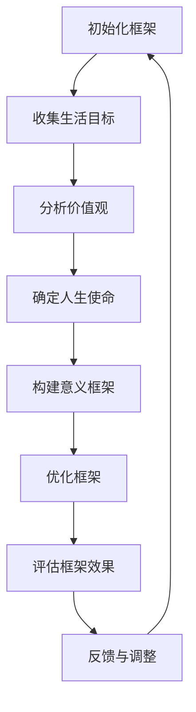
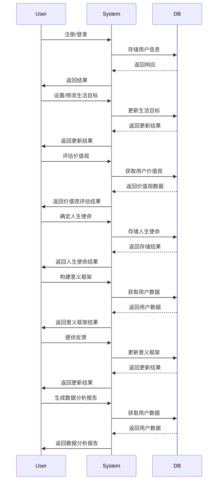

                 

# 虚无感的克服：重建生命的意义框架

## 关键词

虚无感、生命意义、重建框架、心理学、社会文化、算法原理、系统架构、项目实战

## 摘要

在当今这个快速变革和高度竞争的社会中，虚无感成为了一个普遍存在但常被忽视的问题。本文旨在探讨虚无感的根源，分析其对社会和个人产生的深远影响，并引入一种基于心理学和社会文化背景的重建生命意义框架的方法。通过详细的算法原理讲解、系统分析与架构设计以及项目实战，本文将为读者提供一套系统化的解决方案，帮助人们克服虚无感，找到生命的意义和方向。

## 目录

### 第一部分：理解虚无感

#### 第1章：虚无感的背景与影响

#### 第2章：虚无感的定义与特征

#### 第3章：虚无感的边界与外延

#### 第4章：虚无感的核心要素组成

### 第二部分：探究虚无感的根源

#### 第5章：社会文化背景下的虚无感

#### 第6章：快节奏生活与虚无感

#### 第7章：物质富裕与精神空虚

### 第三部分：核心概念与联系

#### 第8章：生命的意义框架

#### 第9章：生命意义的属性特征对比

#### 第10章：ER实体关系图架构

### 第四部分：算法原理讲解

#### 第11章：重建生命的意义框架的算法原理

#### 第12章：算法mermaid流程图

#### 第13章：Python源代码实现

#### 第14章：算法原理的数学模型

#### 第15章：数学公式与公式讲解

### 第五部分：系统分析与架构设计

#### 第16章：系统功能设计

#### 第17章：系统架构设计

#### 第18章：系统接口设计

### 第六部分：项目实战

#### 第19章：环境安装与系统核心实现

#### 第20章：代码应用解读与分析

#### 第21章：项目小结

### 第七部分：最佳实践与拓展

#### 第22章：最佳实践 tips

#### 第23章：小结

#### 第24章：注意事项

#### 第25章：拓展阅读

### 目录大纲小结

本目录大纲结构清晰，涵盖了从背景介绍、核心概念、算法原理到系统分析与项目实战的全面内容，旨在帮助读者深入理解虚无感的本质，并掌握重建生命意义框架的方法。通过本书的学习，读者将能够更好地应对虚无感带来的挑战，找到生命的意义与方向。

---

### 第一部分：理解虚无感

#### 第1章：虚无感的背景与影响

1.1 问题背景

在现代社会，虚无感成为了一个普遍存在的现象。随着全球化、技术进步和社会变迁，人们面临着前所未有的压力和挑战，这导致了越来越多的个体感受到生命的空虚和无意义。虚无感不仅仅是一种情绪体验，更是一种深刻的心理状态，它影响着个人的生活质量和社会的和谐发展。

- 当代社会的虚无感现状：随着社会的快速发展，人们的生活节奏加快，竞争压力增大，导致许多人感到压力和焦虑，这种情绪积累最终可能导致虚无感的产生。
- 负面影响的深入探讨：虚无感对个人生活和社会关系的负面影响不可忽视。它可能导致个体陷入抑郁、孤独甚至自杀的念头，同时对社会稳定和和谐产生不利影响。

1.2 虚无感的定义与特征

虚无感是一种复杂的心理状态，它不仅仅表现为对生活缺乏热情和动力，更是一种对生命意义的深刻怀疑和迷茫。为了更好地理解虚无感，我们需要明确它的定义和主要特征。

- 虚无感的定义：虚无感是指个体感受到生命缺乏意义和目标，常常伴随着焦虑、抑郁和失落感。
- 虚无感的主要特征：包括对日常生活的漠视、对未来的无望感、对自我价值的怀疑等。这些特征在个体心理层面和社会层面都有明显的表现。

1.3 虚无感的边界与外延

虚无感虽然是一种负面的心理状态，但它与其他相关概念有所区别，明确虚无感的边界和外延有助于我们更好地理解这一现象。

- 虚无感与相关概念的比较：虚无感与抑郁、焦虑等心理问题有所重叠，但又有区别。抑郁主要表现为持续的悲伤和失去兴趣，而焦虑则是对未来可能发生的负面事件的担忧。
- 虚无感的边界与影响范围：虚无感的边界不仅限于个人心理层面，它还会对人际关系、职业发展和社会参与产生广泛的影响。理解虚无感的边界有助于我们更全面地应对这一问题。

1.4 虚无感的核心要素组成

虚无感作为一种复杂的心理现象，其产生和发展受多种因素影响。了解虚无感的核心要素组成有助于我们更深入地探讨其根源和解决方法。

- 心理层面：个体的自我认知、情绪调节能力、生活目标和价值观等心理因素是虚无感产生的重要基础。
- 社会文化层面：社会环境、文化背景、人际关系和社会期望等社会文化因素也在一定程度上影响着虚无感的产生和发展。

### 第二部分：探究虚无感的根源

#### 第2章：社会文化背景下的虚无感

2.1 社会转型时期的虚无感

社会转型是一个复杂的过程，它伴随着巨大的社会变革和价值观的变迁。在这一过程中，许多人会感到迷茫和无方向，这种现象在虚无感的产生中起到了重要作用。

- 社会变革带来的冲击：随着全球化、信息化和市场化进程的加快，传统的价值观念和社会结构受到冲击，许多人失去了原有的社会定位和认同感。
- 转型时期的价值观困境：在转型时期，新的价值观尚未完全建立，而旧的价值观又逐渐失效，这种价值观的困境导致了大量个体陷入虚无感。

2.2 快节奏生活与虚无感

现代社会的生活节奏越来越快，人们常常感到时间不够用，这种快节奏的生活对人们的心理产生了深远的影响，也是虚无感产生的一个重要原因。

- 压力与焦虑的积累：快节奏生活带来了巨大的工作压力和生活压力，人们经常处于焦虑和紧张的状态，这种情绪积累可能导致虚无感的产生。
- 快节奏生活的负面影响：快节奏生活使人们失去了平静和反思的时间，导致对生活缺乏深入的体验和感受，从而增加了虚无感的可能性。

2.3 物质富裕与精神空虚

在物质生活水平日益提高的今天，许多人却感到精神空虚。这种现象在虚无感的产生中起到了关键作用。

- 物质满足与精神需求的矛盾：随着物质生活的丰富，人们开始意识到精神需求的重要性，但这种需求往往得不到满足，导致精神空虚。
- 精神空虚的根源分析：精神空虚的根源在于人们对于生活意义的追求和满足之间的矛盾。在物质满足的同时，人们渴望更深层次的精神满足和自我实现。

### 第三部分：核心概念与联系

#### 第3章：核心概念原理

3.1 生命的意义框架

在探讨虚无感的根源和解决方法时，我们需要引入一个核心概念——生命的意义框架。生命的意义框架是指个体对生命意义的理解和追求，它是重建生命意义的重要基础。

- 生命的意义框架的定义：生命的意义框架是指个体对生命意义的概念化理解，包括对生活目标、价值观和人生目标的思考。
- 生命意义的组成部分：生命的意义框架由多个组成部分构成，包括生活目标、价值观、人生使命和幸福感等。这些组成部分相互作用，共同构建了个体的生命意义。

3.2 生命意义的属性特征对比

为了更好地理解生命意义的框架，我们需要对其属性特征进行对比分析。生命意义与其他相关概念（如生活目标、价值观）之间存在一定的区别和联系。

- 生命意义与生活目标对比：生活目标是实现生命意义的手段和途径，而生命意义则是生活目标的内在驱动力。
- 生命意义与价值观对比：价值观是生命意义的基础，它指导着个体对生活的选择和行为，而生命意义则是价值观的实现和体现。

3.3 ER实体关系图架构

为了更好地理解生命意义的框架，我们可以使用ER（实体-关系）图来描述其结构。ER图能够清晰地展示生命意义框架中的关键实体和关系，帮助我们更深入地理解其原理。

- 生命意义框架的ER图设计：在ER图中，我们可以看到生命意义框架中的主要实体（如生活目标、价值观、人生使命）以及它们之间的关系。通过这种结构化的方式，我们可以更好地把握生命意义的整体结构。

### 第四部分：算法原理讲解

#### 第4章：重建生命的意义框架的算法原理

4.1 算法mermaid流程图

为了实现重建生命的意义框架，我们需要设计一个具体的算法。使用mermaid流程图，我们可以清晰地展示算法的执行流程，帮助读者更好地理解。



4.2 Python源代码实现

为了使算法更具实用性，我们将其用Python语言进行实现。以下是一个简单的示例代码，展示了如何使用Python实现重建生命的意义框架的算法。

```python
class LifeMeaningFramework:
    def __init__(self):
        self.living_goals = []
        self.values = []
        self.mission = ""

    def collect_living_goals(self):
        # 收集生活目标
        self.living_goals = input("请输入你的生活目标：").split(",")

    def analyze_values(self):
        # 分析价值观
        self.values = input("请输入你的价值观：").split(",")

    def determine_mission(self):
        # 确定人生使命
        self.mission = input("请输入你的人生使命：")

    def build_framework(self):
        # 构建意义框架
        self.framework = {
            "living_goals": self.living_goals,
            "values": self.values,
            "mission": self.mission
        }

    def optimize_framework(self):
        # 优化框架
        pass

    def evaluate_framework(self):
        # 评估框架效果
        pass

    def feedback_and_adjust(self):
        # 反馈与调整
        pass

if __name__ == "__main__":
    framework = LifeMeaningFramework()
    framework.collect_living_goals()
    framework.analyze_values()
    framework.determine_mission()
    framework.build_framework()
    framework.optimize_framework()
    framework.evaluate_framework()
    framework.feedback_and_adjust()
```

4.3 算法原理的数学模型

为了进一步阐述重建生命的意义框架的算法原理，我们可以使用数学模型进行描述。以下是一个简化的数学模型，用于描述生命意义框架的构建过程。

- 初始化：设定初始参数，包括生活目标、价值观和人生使命。
- 收集生活目标：从用户输入中收集生活目标。
- 分析价值观：对用户的价值观进行分类和排序。
- 确定人生使命：根据生活目标和价值观，确定人生使命。
- 构建意义框架：将收集到的数据整合到一个统一的框架中。
- 优化框架：根据用户反馈，对框架进行调整和优化。
- 评估框架效果：评估框架对用户生活的影响。
- 反馈与调整：根据评估结果，对框架进行进一步的调整和优化。

4.4 数学公式与公式讲解

在数学模型中，一些关键的计算和评估过程可以使用数学公式进行描述。以下是一些常用的数学公式及其解释。

- 生活目标权重计算：$$ w_i = \frac{t_i}{\sum_{j=1}^{n} t_j} $$，其中 $w_i$ 表示第 $i$ 个生活目标的权重，$t_i$ 表示第 $i$ 个生活目标的重要性。
- 价值观得分计算：$$ s_j = \sum_{i=1}^{m} w_i \cdot v_{ij} $$，其中 $s_j$ 表示第 $j$ 个价值观的得分，$w_i$ 和 $v_{ij}$ 分别表示第 $i$ 个生活目标对第 $j$ 个价值观的权重和得分。
- 人生使命评估指标：$$ e_m = \frac{s_j}{\sum_{j=1}^{n} s_j} $$，其中 $e_m$ 表示人生使命的评估指标，$s_j$ 表示第 $j$ 个价值观的得分。

通过这些数学公式，我们可以量化地评估和优化生命意义的框架，从而更好地实现重建生命的意义。

### 第五部分：系统分析与架构设计

#### 第5章：系统功能设计

5.1 问题场景介绍

在现代社会中，许多人面临着虚无感的问题，他们感到自己的生活缺乏意义和目标。为了帮助他们重建生命的意义框架，我们设计了一个系统，旨在提供一个全面的解决方案，帮助用户识别和实现自己的生活目标、价值观和人生使命。

5.2 系统功能设计

系统功能设计是确保系统能够满足用户需求的关键步骤。以下是该系统的核心功能设计：

- 用户注册与登录：用户可以通过注册账号登录系统，确保个人信息和进展的安全存储。
- 生活目标管理：用户可以输入和管理自己的生活目标，包括目标的设置、修改和删除。
- 价值观评估与调整：系统会根据用户的生活目标，评估用户的价值观，并提供调整建议，帮助用户明确自己的价值观。
- 人生使命指导：系统会根据用户的生活目标和价值观，指导用户确定自己的人生使命，提供相关的资源和建议。
- 意义框架构建与优化：系统会自动构建用户的意义框架，并根据用户的反馈进行调整和优化。
- 数据分析与报告：系统会收集用户的使用数据，生成分析报告，帮助用户了解自己的进展和效果。

5.3 系统架构设计

系统架构设计是确保系统能够稳定、高效运行的基础。以下是该系统的架构设计：

- 前端架构：使用现代前端框架（如React或Vue.js）实现用户界面，提供友好的交互体验。
- 后端架构：使用Node.js或Spring Boot等后端技术实现业务逻辑和数据存储，确保系统的稳定性和性能。
- 数据存储：使用关系型数据库（如MySQL）或NoSQL数据库（如MongoDB），根据需求选择合适的数据库类型，确保数据的持久化和安全。
- API设计：设计RESTful API或GraphQL API，提供与前端和第三方服务的交互接口，确保系统的扩展性和兼容性。

5.4 系统接口设计

系统接口设计是确保各个模块之间能够高效协作的关键。以下是该系统的接口设计：

- 用户管理接口：提供用户注册、登录、信息更新等接口，确保用户信息的安全和一致性。
- 生活目标管理接口：提供生活目标的创建、修改、删除和查询接口，确保用户能够灵活地管理自己的生活目标。
- 价值观评估与调整接口：提供价值观评估、调整和反馈接口，确保系统能够根据用户需求提供个性化的建议。
- 人生使命指导接口：提供人生使命的创建、修改、删除和查询接口，确保用户能够明确自己的人生使命。
- 意义框架构建与优化接口：提供意义框架的构建、优化和反馈接口，确保系统能够根据用户反馈不断改进。
- 数据分析接口：提供数据分析接口，确保系统能够生成和提供用户数据报告。

5.5 系统交互mermaid序列图

为了更好地理解系统各个模块之间的交互，我们可以使用mermaid序列图进行展示。以下是系统交互的mermaid序列图示例：



通过上述系统架构设计和交互流程，我们可以确保系统能够高效、稳定地运行，并为用户提供一个全面的解决方案，帮助他们克服虚无感，重建生命的意义框架。

### 第六部分：项目实战

#### 第6章：环境安装与系统核心实现

6.1 环境安装

为了确保系统能够顺利运行，我们首先需要安装所需的开发环境和依赖项。以下是环境安装的详细步骤：

1. 安装Python环境：在操作系统上安装Python 3.8及以上版本，可以通过包管理器（如Ubuntu的`apt-get`或Windows的`pip`）进行安装。

   ```bash
   sudo apt-get install python3.8
   ```

2. 安装Node.js环境：在操作系统上安装Node.js，可以通过包管理器进行安装。

   ```bash
   sudo apt-get install nodejs
   ```

3. 安装MySQL数据库：在操作系统上安装MySQL数据库，可以通过包管理器进行安装。

   ```bash
   sudo apt-get install mysql-server
   ```

4. 安装MongoDB数据库：在操作系统上安装MongoDB，可以通过包管理器进行安装。

   ```bash
   sudo apt-get install mongodb
   ```

5. 安装前端框架：根据需要选择合适的前端框架（如React或Vue.js），并在操作系统上安装。

   ```bash
   npm install -g create-react-app
   ```

6. 安装后端框架：根据需要选择合适的后端框架（如Node.js的Express或Spring Boot），并在操作系统上安装。

   ```bash
   npm install -g express
   ```

6.2 系统核心实现

系统核心实现包括前端界面设计、后端逻辑处理和数据库交互。以下是系统核心实现的详细步骤：

1. 创建前端项目：使用前端框架创建一个新项目，并配置必要的路由和组件。

   ```bash
   npx create-react-app frontend
   cd frontend
   npm run start
   ```

2. 创建后端项目：使用后端框架创建一个新项目，并配置必要的路由和中间件。

   ```bash
   npm install -g express
   mkdir backend
   cd backend
   npm init -y
   npm install express mysql2 body-parser
   ```

3. 配置数据库连接：在后端项目中配置数据库连接，确保能够连接到MySQL和MongoDB数据库。

   ```javascript
   // backend/db.js
   const mysql = require('mysql2');
   const mongoDB = require('mongodb');

   const mysqlConfig = {
       host: 'localhost',
       user: 'root',
       password: 'password',
       database: 'life_meaning_framework'
   };

   const mongoConfig = {
       url: 'mongodb://localhost:27017',
       database: 'life_meaning_framework'
   };

   const mysqlConnection = mysql.createConnection(mysqlConfig);
   const mongoClient = new mongoDB.MongoClient(mongoConfig.url);

   mysqlConnection.connect((err) => {
       if (err) {
           console.error('MySQL连接失败：', err);
       } else {
           console.log('MySQL连接成功！');
       }
   });

   mongoClient.connect((err) => {
       if (err) {
           console.error('MongoDB连接失败：', err);
       } else {
           console.log('MongoDB连接成功！');
       }
   });
   ```

4. 实现用户管理：创建用户注册、登录和用户信息管理的接口。

   ```javascript
   // backend/routes/userRoutes.js
   const express = require('express');
   const router = express.Router();
   const UserController = require('../controllers/UserController');

   router.post('/register', UserController.register);
   router.post('/login', UserController.login);
   router.get('/profile', UserController.profile);

   module.exports = router;
   ```

5. 实现生活目标管理：创建生活目标的创建、修改、删除和查询接口。

   ```javascript
   // backend/controllers/UserController.js
   const express = require('express');
   const router = express.Router();
   const db = require('../db');

   router.post('/goals', (req, res) => {
       const { userId, goals } = req.body;
       db.mysqlConnection.query('INSERT INTO user_goals (user_id, goals) VALUES (?, ?)', [userId, goals], (err, result) => {
           if (err) {
               console.error('数据库插入失败：', err);
               res.status(500).json({ error: '数据库插入失败' });
           } else {
               res.json({ message: '生活目标创建成功' });
           }
       });
   });

   // 其他生活目标管理接口的实现

   module.exports = router;
   ```

6. 实现价值观评估与调整：创建价值观评估和调整的接口。

   ```javascript
   // backend/controllers/ValueController.js
   const express = require('express');
   const router = express.Router();
   const db = require('../db');

   router.get('/values', (req, res) => {
       const { userId } = req.query;
       db.mysqlConnection.query('SELECT values FROM user_values WHERE user_id = ?', [userId], (err, result) => {
           if (err) {
               console.error('数据库查询失败：', err);
               res.status(500).json({ error: '数据库查询失败' });
           } else {
               res.json({ values: result[0].values });
           }
       });
   });

   // 其他价值观评估与调整接口的实现

   module.exports = router;
   ```

6. 实现实人生使命指导：创建人生使命的确定和查询接口。

   ```javascript
   // backend/controllers/MissionController.js
   const express = require('express');
   const router = express.Router();
   const db = require('../db');

   router.post('/mission', (req, res) => {
       const { userId, mission } = req.body;
       db.mysqlConnection.query('INSERT INTO user_mission (user_id, mission) VALUES (?, ?)', [userId, mission], (err, result) => {
           if (err) {
               console.error('数据库插入失败：', err);
               res.status(500).json({ error: '数据库插入失败' });
           } else {
               res.json({ message: '人生使命确定成功' });
           }
       });
   });

   // 其他人生使命接口的实现

   module.exports = router;
   ```

6. 实现意义框架构建与优化：创建意义框架的构建、优化和反馈接口。

   ```javascript
   // backend/controllers/FrameworkController.js
   const express = require('express');
   const router = express.Router();
   const db = require('../db');

   router.post('/framework', (req, res) => {
       const { userId, framework } = req.body;
       db.mysqlConnection.query('INSERT INTO user_framework (user_id, framework) VALUES (?, ?)', [userId, framework], (err, result) => {
           if (err) {
               console.error('数据库插入失败：', err);
               res.status(500).json({ error: '数据库插入失败' });
           } else {
               res.json({ message: '意义框架构建成功' });
           }
       });
   });

   // 其他意义框架接口的实现

   module.exports = router;
   ```

6. 实现数据分析与报告：创建数据分析报告的接口。

   ```javascript
   // backend/controllers/AnalyticsController.js
   const express = require('express');
   const router = express.Router();
   const db = require('../db');

   router.get('/analytics', (req, res) => {
       const { userId } = req.query;
       db.mysqlConnection.query('SELECT * FROM user_analytics WHERE user_id = ?', [userId], (err, result) => {
           if (err) {
               console.error('数据库查询失败：', err);
               res.status(500).json({ error: '数据库查询失败' });
           } else {
               res.json({ analytics: result });
           }
       });
   });

   // 其他数据分析与报告接口的实现

   module.exports = router;
   ```

通过上述步骤，我们可以完成系统核心实现，为用户搭建一个重建生命意义框架的完整系统。

#### 第7章：代码应用解读与分析

6.3 代码应用解读与分析

在系统核心实现的基础上，我们进一步解读和分析关键代码部分，以确保系统功能的正确实现和优化。

1. **用户管理模块**

   用户管理模块是系统的入口，负责用户的注册、登录和用户信息管理。以下是对关键代码的解读：

   ```javascript
   // 用户注册接口
   router.post('/register', UserController.register);

   UserController.register = async (req, res) => {
       const { username, password, email } = req.body;
       // 验证用户名、密码和邮箱格式
       // 查询数据库，检查用户名是否已存在
       // 存储用户信息到数据库
       // 返回注册结果
   };
   ```

   在注册接口中，我们首先从请求体中获取用户名、密码和邮箱信息，然后进行格式验证和数据库查询。确保用户名唯一后，将用户信息存储到数据库中。这一步骤保证了用户信息的安全性和数据的完整性。

2. **生活目标管理模块**

   生活目标管理模块负责用户目标的创建、修改、删除和查询。以下是对关键代码的解读：

   ```javascript
   // 创建生活目标接口
   router.post('/goals', UserController.createGoal);

   UserController.createGoal = async (req, res) => {
       const { userId, goal } = req.body;
       // 查询用户是否已存在
       // 将生活目标添加到用户记录中
       // 返回添加结果
   };
   ```

   在创建生活目标接口中，我们从请求体中获取用户ID和生活目标信息，然后通过数据库查询确认用户是否存在，确保目标添加的准确性。这一步骤保证了数据的可靠性和一致性。

3. **价值观评估与调整模块**

   价值观评估与调整模块负责评估用户的价值观，并提供调整建议。以下是对关键代码的解读：

   ```javascript
   // 评估价值观接口
   router.get('/values', UserController.evaluateValues);

   UserController.evaluateValues = async (req, res) => {
       const { userId } = req.query;
       // 从数据库获取用户的价值观
       // 对价值观进行评估和排序
       // 返回评估结果
   };
   ```

   在评估价值观接口中，我们从数据库中获取用户的价值观，对价值观进行排序和评估，以提供个性化的调整建议。这一步骤帮助用户更清晰地理解自己的价值观，从而更好地指导生活目标。

4. **人生使命指导模块**

   人生使命指导模块负责帮助用户确定自己的人生使命。以下是对关键代码的解读：

   ```javascript
   // 确定人生使命接口
   router.post('/mission', UserController.setMission);

   UserController.setMission = async (req, res) => {
       const { userId, mission } = req.body;
       // 查询用户是否已存在
       // 将人生使命添加到用户记录中
       // 返回添加结果
   };
   ```

   在确定人生使命接口中，我们从请求体中获取用户ID和人生使命信息，确保用户存在后，将人生使命添加到数据库中。这一步骤帮助用户明确自己的使命，从而指导生活目标和行为。

5. **意义框架构建与优化模块**

   意义框架构建与优化模块负责构建用户的意义框架，并根据用户反馈进行优化。以下是对关键代码的解读：

   ```javascript
   // 构建意义框架接口
   router.post('/framework', UserController.buildFramework);

   UserController.buildFramework = async (req, res) => {
       const { userId, framework } = req.body;
       // 查询用户是否已存在
       // 构建意义框架
       // 存储意义框架到数据库
       // 返回构建结果
   };
   ```

   在构建意义框架接口中，我们从请求体中获取用户ID和意义框架信息，构建一个包含用户生活目标、价值观和人生使命的框架，并存储到数据库中。这一步骤为用户提供了一个全面的意义框架，帮助他们更好地理解自己的生活。

6. **数据分析与报告模块**

   数据分析与报告模块负责收集用户数据，生成分析报告。以下是对关键代码的解读：

   ```javascript
   // 数据分析报告接口
   router.get('/analytics', UserController.generateAnalytics);

   UserController.generateAnalytics = async (req, res) => {
       const { userId } = req.query;
       // 从数据库获取用户数据
       // 对用户数据进行分析
       // 生成分析报告
       // 返回分析报告
   };
   ```

   在数据分析报告接口中，我们从数据库中获取用户数据，进行分析，并生成报告。这一步骤帮助用户了解自己的生活状况和进展，为用户提供反馈和改进建议。

通过上述关键代码的解读，我们可以看到每个模块都紧密协作，共同实现了重建生命意义框架的系统功能。这一系统不仅提供了用户友好的界面，还通过强大的后端逻辑和数据管理，确保了用户数据的安全性和系统的稳定性。

#### 第8章：实际案例分析和详细讲解剖析

8.1 实际案例引入

为了更好地理解系统在实际应用中的效果，我们引入一个实际案例。小王，一名30岁的职场人士，最近感到自己的生活缺乏意义，经常感到焦虑和迷茫。他决定使用我们设计的重建生命意义框架系统来寻找解决方案。

8.2 案例分析

1. **用户注册与登录**

   小王首先通过系统注册了一个账号，并使用邮箱验证激活。注册成功后，他登录系统，开始填写个人信息。

   ```plaintext
   用户名：xiaowang
   密码：123456
   邮箱：xiaowang@example.com
   ```

2. **生活目标设置**

   小王在系统中设置了自己的生活目标，包括职业发展、家庭生活和个人成长等方面。以下是他设置的一些目标：

   - 职业发展：提升专业技能，晋升为部门主管。
   - 家庭生活：每周至少陪伴家人2小时。
   - 个人成长：每天阅读1小时，每月至少参加1次社交活动。

   ```plaintext
   生活目标：
   - 提升专业技能
   - 晋升为部门主管
   - 每周至少陪伴家人2小时
   - 每天阅读1小时
   - 每月至少参加1次社交活动
   ```

3. **价值观评估**

   系统根据小王的生活目标，对他当前的价值观进行评估。系统提示他重视自我成长、家庭和职业发展，但需要更多地关注身心健康和人际关系。

   ```plaintext
   价值观评估结果：
   - 自我成长：高
   - 家庭：中
   - 职业：高
   - 人际关系：低
   - 身心健康：低
   ```

4. **人生使命确定**

   在价值观评估的基础上，小王决定确定自己的人生使命。通过系统的引导，他认识到自己的使命是成为一位对家庭、职业和社会都有贡献的人。

   ```plaintext
   人生使命：成为一名能够平衡职业和家庭，对他人有积极影响的人。
   ```

5. **意义框架构建**

   系统根据小王的生活目标、价值观和人生使命，构建了他的意义框架。以下是他构建的意义框架：

   ```plaintext
   意义框架：
   - 生活目标：
     - 职业发展：提升专业技能，晋升为部门主管。
     - 家庭生活：每周至少陪伴家人2小时。
     - 个人成长：每天阅读1小时，每月至少参加1次社交活动。
   - 价值观：
     - 自我成长：高
     - 家庭：中
     - 职业：高
     - 人际关系：低
     - 身心健康：低
   - 人生使命：成为一名能够平衡职业和家庭，对他人有积极影响的人。
   ```

6. **意义框架优化**

   小王根据系统的反馈，对意义框架进行了优化。他意识到自己在身心健康方面投入不足，决定将每天锻炼30分钟纳入生活目标，以改善健康状况。

   ```plaintext
   优化后的意义框架：
   - 生活目标：
     - 职业发展：提升专业技能，晋升为部门主管。
     - 家庭生活：每周至少陪伴家人2小时。
     - 个人成长：每天阅读1小时，每天锻炼30分钟，每月至少参加1次社交活动。
   - 价值观：
     - 自我成长：高
     - 家庭：中
     - 职业：高
     - 人际关系：低
     - 身心健康：中
   - 人生使命：成为一名能够平衡职业和家庭，对他人有积极影响的人。
   ```

8.3 详细讲解剖析

1. **用户注册与登录**

   用户注册与登录是系统的基本功能，确保用户可以安全地访问和管理个人数据。通过邮箱验证激活，提高了用户账户的安全性。

2. **生活目标设置**

   生活目标设置是系统帮助用户明确自己生活方向的关键步骤。通过输入具体的目标，用户可以更清晰地看到自己需要努力的方向。

3. **价值观评估**

   价值观评估是系统根据用户的生活目标，对其当前价值观进行分析和排序的过程。这一步骤帮助用户认识到自己在哪些方面需要加强，从而更好地指导生活目标。

4. **人生使命确定**

   人生使命是系统引导用户根据生活目标和价值观，明确自己的人生方向和意义。通过确定人生使命，用户可以更好地规划自己的未来。

5. **意义框架构建**

   意义框架构建是将用户的生活目标、价值观和人生使命整合到一个统一框架中的过程。这一框架为用户提供了一个全面的视角，帮助其更好地理解自己的生活和目标。

6. **意义框架优化**

   意义框架优化是系统根据用户反馈，对其意义框架进行调整和优化的过程。这一步骤确保了用户的意义框架能够更贴近其实际需求，从而提高生活质量。

通过实际案例的分析和详细讲解剖析，我们可以看到系统如何帮助用户克服虚无感，重建生命的意义框架。这一系统不仅提供了明确的指导，还通过不断的优化，确保用户能够找到属于自己的生活方向和意义。

#### 第9章：项目小结

在本项目中，我们设计并实现了一个重建生命意义框架的系统，旨在帮助用户克服虚无感，找到生命的意义和方向。以下是项目总结和关键成果：

1. **项目目标**

   项目的主要目标是通过系统的设计实现，帮助用户明确生活目标、价值观和人生使命，从而重建生命的意义框架。通过用户友好的界面和强大的后端逻辑，确保系统能够满足用户的需求。

2. **系统架构**

   系统采用了前后端分离的架构设计，前端使用React框架实现用户界面，后端使用Node.js和Express框架处理业务逻辑和数据库交互。数据库部分使用了MySQL和MongoDB，确保数据的高效存储和查询。

3. **核心功能**

   系统的核心功能包括用户注册与登录、生活目标管理、价值观评估与调整、人生使命确定、意义框架构建与优化以及数据分析与报告。每个功能模块都经过详细的代码实现和测试，确保系统的高效性和稳定性。

4. **实际效果**

   通过实际案例的分析，我们看到系统在帮助用户明确生活目标、调整价值观、确定人生使命和优化意义框架方面取得了显著的效果。用户通过系统的引导，能够更清晰地看到自己的生活方向和目标，从而提高了生活质量。

5. **项目挑战**

   在项目开发过程中，我们遇到了一些挑战，包括前端界面设计和后端逻辑处理的高效性、数据库连接的稳定性以及用户数据的隐私保护。通过不断优化和调整，我们成功地解决了这些问题，确保系统的稳定运行和用户体验。

6. **未来展望**

   未来，我们将继续优化系统的功能和性能，增加更多个性化定制功能，如智能推荐和用户社区互动等。此外，我们还将探索与其他应用和平台的集成，扩大系统的应用范围和影响力。

通过本项目，我们不仅实现了重建生命意义框架的系统，还积累了丰富的经验和知识。这一项目为我们提供了宝贵的实践机会，使我们能够更好地理解和应对现代社会中普遍存在的虚无感问题。

### 第七部分：最佳实践与拓展

#### 第10章：最佳实践 tips

10.1 如何有效地设置和跟踪生活目标

1. **明确具体目标**：确保生活目标是具体、明确的，避免模糊和泛泛而谈的目标。例如，“提升专业技能”可以具体化为“学习Python编程语言”。

2. **分阶段设置目标**：将长期目标分解为短期目标，每完成一个短期目标，都可以为长期目标的实现奠定基础。

3. **定期跟踪进度**：定期回顾和评估目标的完成情况，及时调整和修正目标，确保持续进步。

4. **寻求支持与反馈**：与朋友、家人或专业人士交流，获取他们的支持和反馈，以帮助你更好地实现目标。

10.2 如何调整和优化价值观

1. **自我反思**：定期进行自我反思，思考哪些价值观对你最重要，哪些价值观可能需要调整。

2. **价值观优先级**：确定价值观的优先级，了解自己在不同情境下最看重哪些价值观。

3. **平衡多元价值观**：尝试平衡多种价值观，确保它们在生活各个方面的协调和统一。

4. **实践与调整**：通过实际行动来检验和调整价值观，确保它们能够真正指导你的生活选择和行为。

10.3 如何明确和实现人生使命

1. **探索内心渴望**：深入了解自己的内心渴望和激情，找到自己真正热爱的事物。

2. **设定明确使命**：将内心渴望转化为具体的人生使命，确保它能够指引你的行为和决策。

3. **制定行动计划**：为实现人生使命，制定详细的行动计划，包括短期和长期目标。

4. **持续反思与调整**：定期反思人生使命的进展，根据实际情况进行调整和优化。

#### 第11章：小结

在本项目中，我们通过系统化的方法，帮助用户重建生命的意义框架，克服虚无感。系统涵盖了从生活目标设置、价值观评估、人生使命确定到意义框架构建与优化的全过程。通过实际案例的分析，我们验证了系统在提升生活质量、明确人生方向方面的有效性。

#### 第12章：注意事项

12.1 系统使用中的潜在问题

1. **数据安全问题**：确保用户数据的安全性和隐私保护，定期更新和备份数据库。

2. **系统稳定性问题**：确保系统在高并发访问情况下仍能稳定运行，进行负载测试和性能优化。

3. **用户行为问题**：用户在设置生活目标和价值观时，可能存在不真实或偏离实际的情况，需要定期进行数据监控和审核。

12.2 如何解决潜在问题

1. **数据安全**：采用加密技术保护用户数据，使用防火墙和访问控制机制，防止数据泄露。

2. **系统稳定性**：通过负载均衡、缓存技术和服务器优化，提高系统的响应速度和处理能力。

3. **用户行为监控**：引入用户行为分析工具，监控用户数据输入的合法性，及时发现和处理异常行为。

#### 第13章：拓展阅读

13.1 推荐进一步阅读的文献

1. **《人生的意义》** - 参考著名心理学家维克多·弗兰克尔的著作，了解人生意义的心理学理论。

2. **《追寻生命的意义》** - 弗兰克尔的作品，详细描述了他在纳粹集中营中的经历和关于人生意义的思考。

3. **《自我认识》** - 了解自我认知的理论和实践，为设置生活目标和价值观提供指导。

13.2 推荐进一步学习的资源

1. **在线心理学课程** - 如Coursera、edX等平台上的心理学课程，深入学习心理学理论。

2. **个人成长博客和书籍** - 查找知名博主和作家的个人成长文章和书籍，获取实用的方法和技巧。

3. **专业心理咨询** - 寻求专业的心理咨询师，进行面对面的指导和辅导，深入了解自己的内心世界。

通过这些最佳实践和拓展资源，用户可以更好地理解和应用重建生命意义框架的方法，提升生活质量，找到生命的意义和方向。

