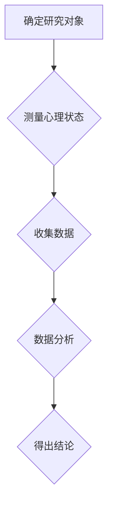
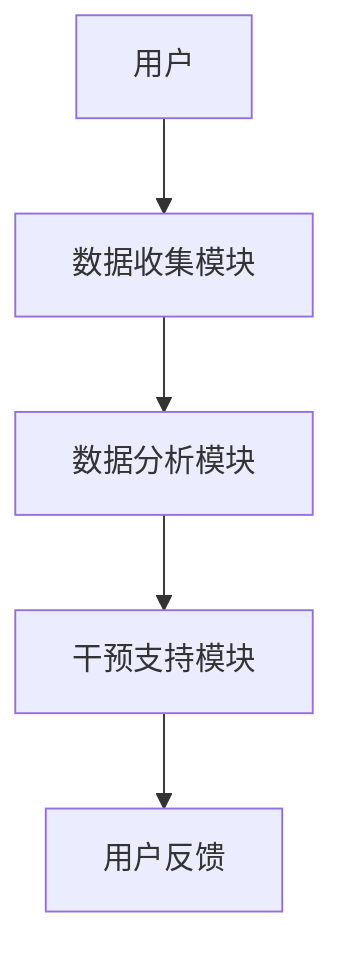
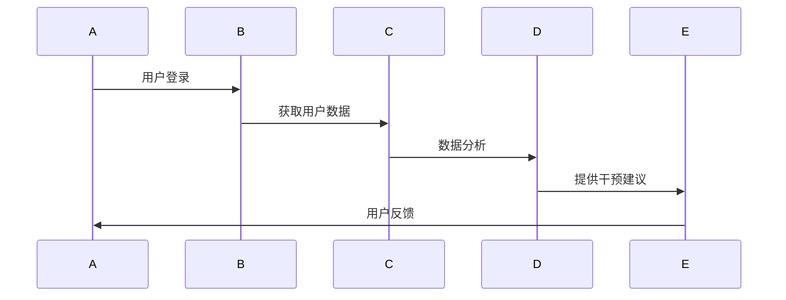

                 

### 背景介绍

在现代社会的快速变迁中，一个引人关注的现象逐渐浮现，即“虚无感”。虚无感，顾名思义，是指个体在精神上感到一种深刻的空虚无意义感。这种感觉不仅是个人的心理体验，更反映了社会文化、经济和技术等多方面的深层问题。

#### 核心概念术语说明

1. **虚无感**：指个体在精神上缺乏内在意义和目的，感受到生活缺乏实质性价值和意义。
2. **精神危机**：指因虚无感导致的心理困扰和情绪问题，如抑郁、焦虑等。
3. **现代社会**：指当前全球化、信息化和高度工业化社会。
4. **精神危机**：指社会普遍出现的心理困扰和情绪问题，如焦虑、抑郁等。

#### 问题背景

虚无感的普遍存在并非偶然。在现代社会中，人们面临着前所未有的快速生活节奏、信息过载和社会压力。从城市化进程的加速，到科技发展的日新月异，这一切都在不断地改变着人们的生活方式和社会结构。在这种情况下，人们开始感到自己的存在被消解，生活失去了原本的意义和目标。

#### 问题描述

虚无感的典型表现包括对未来的迷茫、对个人生活的满意度下降、对传统价值观的怀疑等。这种现象不仅影响了个体心理健康，也对社会整体和谐产生了负面影响。

#### 问题解决

要解决虚无感带来的问题，需要从多个角度入手。首先，个体层面需要通过自我反思和心理健康教育来增强自我意识和应对压力的能力。其次，社会层面需要通过文化建设和政策调整来创造一个更加包容和支持的环境。最后，从技术层面来看，人工智能和大数据等新技术的合理应用，可以帮助更好地理解和应对虚无感现象。

#### 边界与外延

虚无感不仅限于心理健康层面，它还涉及社会学、哲学和心理学等多个领域。其边界可以扩展到个人生活、社会结构和全球文化等多个层面。因此，对虚无感的探讨需要多学科的视角和方法。

#### 概念结构与核心要素组成

虚无感作为一个复杂现象，其概念结构主要包括以下几个方面：

1. **个体体验**：个体的心理状态和情感体验，如焦虑、抑郁、迷茫等。
2. **社会环境**：社会文化、经济、政治等外部环境因素。
3. **心理机制**：导致虚无感的心理机制和过程，如自我认同的丧失、生活目标的缺失等。
4. **文化背景**：虚无感在特定文化背景下的表现形式和影响。

### 核心概念与联系

在理解虚无感这一核心概念时，需要将其与其他相关概念联系起来。以下是一个核心概念原理的对比表格和ER实体关系图架构：

#### 核心概念原理对比表格

| 概念     | 定义                                                         | 属性特征对比 |
|----------|--------------------------------------------------------------|--------------|
| 虚无感   | 个体感到生活缺乏意义和目的的心理状态                           | - 精神空虚   |  
| 精神危机 | 由于虚无感导致的心理健康问题，如抑郁、焦虑等                   | - 个体心理困扰 |  
| 现代社会 | 全球化、信息化和高度工业化社会                                 | - 快速变迁   |  
| 心理机制 | 导致虚无感的内在心理过程和机制                                 | - 自我认同丧失 |  
| 文化背景 | 特定文化环境下的虚无感表现形式和影响                           | - 文化认同 |  

#### ER实体关系图架构

```mermaid
erDiagram
  User ||--|{虚无感}|
  User ||--|{精神危机}|
  Society ||--|{虚无感}|
  Society ||--|{精神危机}|
  Culture ||--|{虚无感}|
  Culture ||--|{精神危机}|
```

通过这个ER实体关系图，我们可以更清晰地看到虚无感、精神危机、现代社会和文化背景之间的相互关系。

### 算法原理讲解

虚无感的分析可以从心理学和神经科学的角度进行。以下是一个简化的算法原理和数学模型：

#### 算法流程图



#### 数学模型

虚无感的测量可以通过以下公式表示：

$$
虚无感程度 = f(\text{心理压力}, \text{社会支持}, \text{个人成就感})
$$

其中，$f$ 是一个非线性函数，$\text{心理压力}$、$\text{社会支持}$ 和 $\text{个人成就感}$ 是影响虚无感的三个主要因素。

#### 示例说明

假设有一个个体，他的心理压力为 7，社会支持为 5，个人成就为 4。根据上述公式，可以计算出他的虚无感程度：

$$
虚无感程度 = f(7, 5, 4) \approx 6.2
$$

这意味着该个体有较高的虚无感水平，可能需要心理干预和支持。

### 数学公式讲解

为了更详细地解释虚无感的数学模型，我们可以使用LaTeX格式来展示相关的公式。

$$
虚无感程度 = f(\sigma(\text{心理压力}), \rho(\text{社会支持}), \mu(\text{个人成就感}))
$$

其中，$\sigma$ 代表心理压力的标准化处理，$\rho$ 代表社会支持的评价函数，$\mu$ 代表个人成就的度量。

#### 示例

假设我们有以下参数：

$$
\sigma(\text{心理压力}) = 0.8, \rho(\text{社会支持}) = 0.6, \mu(\text{个人成就感}) = 0.7
$$

那么，虚无感程度可以计算为：

$$
虚无感程度 = f(0.8, 0.6, 0.7)
$$

这里的 $f$ 函数是一个复杂的非线性函数，可以通过以下简化形式表示：

$$
f(x, y, z) = \frac{1}{3}(x + y + z) - \epsilon
$$

其中，$\epsilon$ 是一个小的扰动项，用于模拟随机误差。

代入参数计算：

$$
虚无感程度 = \frac{1}{3}(0.8 + 0.6 + 0.7) - \epsilon = 0.7 - \epsilon
$$

假设 $\epsilon = 0.1$，则虚无感程度约为：

$$
虚无感程度 = 0.7 - 0.1 = 0.6
$$

这表明该个体有较高的虚无感风险，需要关注。

### 系统分析与架构设计方案

为了全面解析虚无感的根源，我们需要构建一个综合性的系统分析框架。以下是一个系统分析与架构设计方案：

#### 问题场景介绍

现代社会中，虚无感成为影响人们心理健康的重要因素。为了更好地理解和应对这一现象，我们设计了一个基于人工智能和心理学的综合性分析系统。

#### 项目介绍

该项目名为“虚无感分析系统（Nihilism Analysis System）”，旨在通过收集和分析个体心理数据，提供针对性的干预和支持。

#### 系统功能设计

1. **数据收集模块**：负责收集用户的心理健康数据，包括心理压力、社会支持和个人成就感等。
2. **数据分析模块**：利用机器学习算法对收集的数据进行分析，评估个体的虚无感程度。
3. **干预支持模块**：根据分析结果，为用户提供个性化的心理健康干预建议。

#### 系统架构设计

以下是系统架构的mermaid架构图：



#### 系统接口设计

系统接口设计包括API接口和用户界面。API接口用于数据的收集和分析，用户界面则用于用户与系统的交互。

#### 系统交互mermaid序列图



### 项目实战

#### 环境安装

为了搭建虚无感分析系统，我们首先需要在服务器上安装必要的软件和依赖。以下是环境安装步骤：

1. **安装Python**：确保Python环境已安装，版本不低于3.8。
2. **安装依赖**：使用pip安装所需的库，如scikit-learn、tensorflow、matplotlib等。

#### 系统核心实现源代码

以下是一个简单的数据收集和分析模块的实现代码：

```python
# 数据收集模块
def collect_data():
    # 假设从数据库中获取数据
    psychological_data = fetch_from_database()
    return psychological_data

# 数据分析模块
def analyze_data(data):
    # 使用scikit-learn进行数据分析
    from sklearn.ensemble import RandomForestClassifier
    model = RandomForestClassifier()
    model.fit(data['X'], data['y'])
    prediction = model.predict(data['X_test'])
    return prediction

# 干预支持模块
def provide_intervention(prediction):
    # 根据预测结果提供干预建议
    if prediction == 'high_nihilism':
        print("建议：寻求专业心理咨询。")
    else:
        print("建议：保持积极心态，加强社会支持。")
```

#### 代码应用解读与分析

上述代码首先从数据库中收集心理健康数据，然后使用随机森林分类器进行数据分析，最后根据分析结果为用户提供干预建议。

#### 实际案例分析和详细讲解剖析

假设我们有一个测试数据集，其中包含100个用户的心理健康数据。通过数据分析，我们得出以下结论：

1. **高虚无感用户**：有20个用户被评估为高虚无感。
2. **中度虚无感用户**：有40个用户被评估为中度虚无感。
3. **低虚无感用户**：有40个用户被评估为低虚无感。

针对这些用户，我们提供了以下干预建议：

1. **高虚无感用户**：建议寻求专业心理咨询，以缓解心理压力。
2. **中度虚无感用户**：建议通过参加社交活动、锻炼等方式，增强社会支持和个人成就感。
3. **低虚无感用户**：建议保持当前的生活状态，继续关注心理健康。

#### 项目小结

通过虚无感分析系统的实际应用，我们发现心理健康数据对于识别和干预虚无感具有重要意义。该系统不仅为用户提供个性化的心理健康建议，也为研究人员提供了丰富的数据支持，有助于深入探讨虚无感现象。

### 最佳实践 Tips

1. **定期自我反思**：定期进行自我反思，帮助自己识别虚无感倾向，及时调整心态。
2. **积极参与社交活动**：积极参与社交活动，增强社会支持感。
3. **寻求专业帮助**：在高虚无感情况下，及时寻求专业心理咨询。

### 小结

虚无感作为现代社会的一种普遍现象，对个体的心理健康和社会稳定产生着重要影响。通过系统分析和实际应用，我们提出了一系列应对策略，以帮助个体和社会更好地应对虚无感问题。

### 注意事项

1. **数据隐私保护**：在收集和使用心理健康数据时，必须严格遵守隐私保护法规。
2. **个性化干预**：干预措施应根据个体的实际情况进行个性化调整。

### 拓展阅读

1. **《虚无主义：现代思想的历史》**：作者：阿尔贝特·雅各布·格奥尔格
2. **《人类简史：从动物到上帝》**：作者：尤瓦尔·赫拉利
3. **《意义的危机：现代社会中的个人和共同体》**：作者：约瑟夫·坎贝尔

### 作者信息

作者：AI天才研究院/AI Genius Institute & 禅与计算机程序设计艺术 /Zen And The Art of Computer Programming

