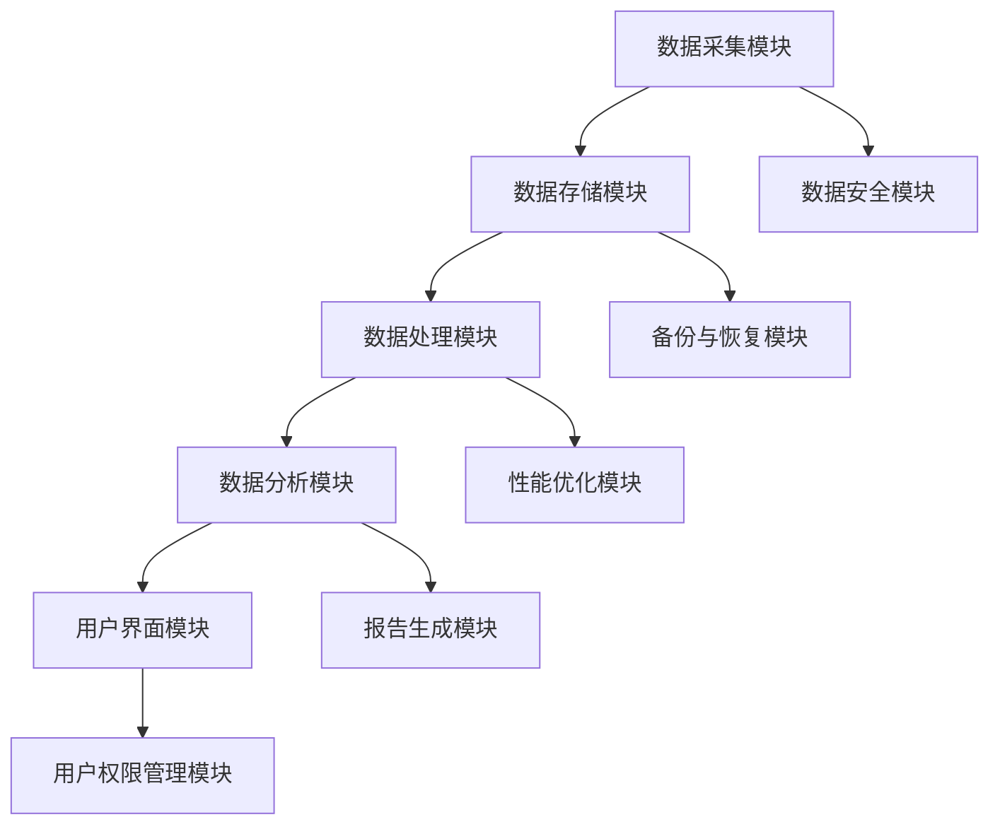
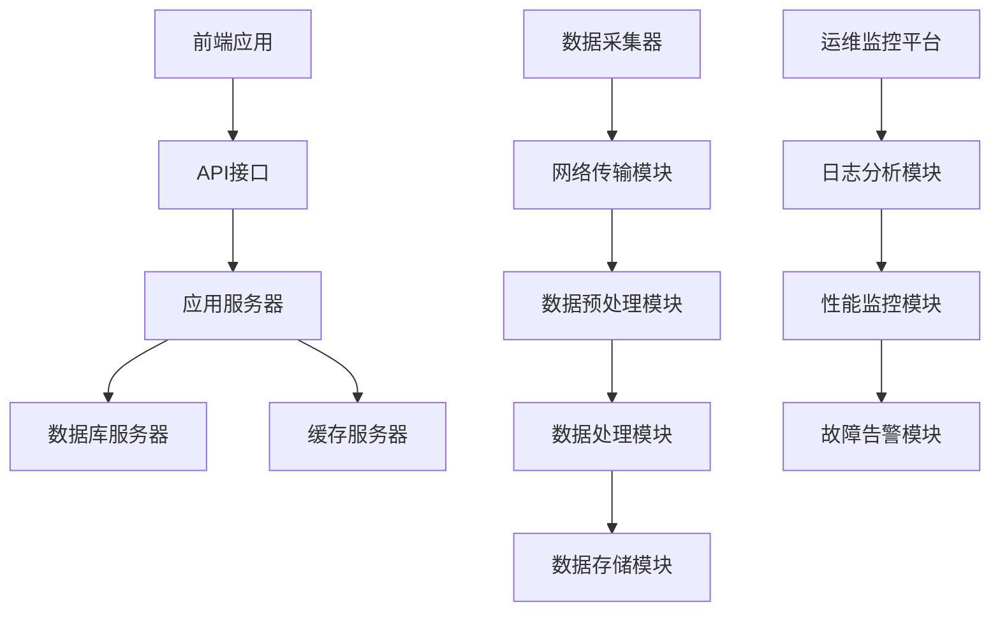
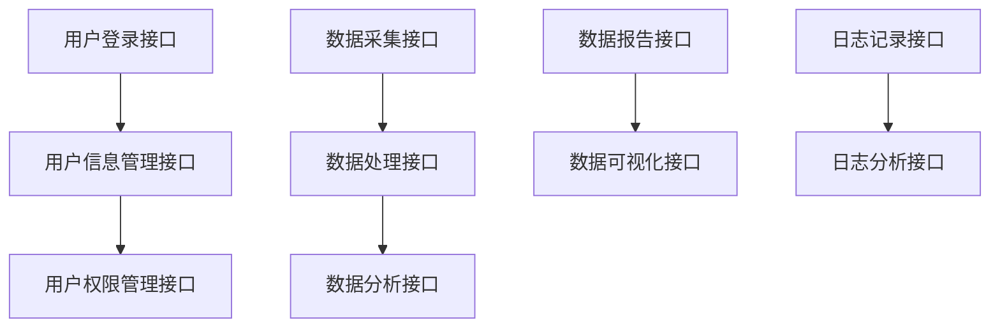
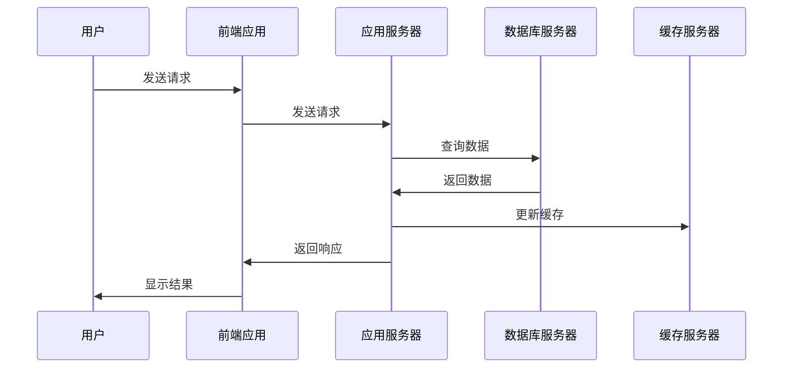

                 

### 认知地图绘制工坊背景介绍

#### 1.1 问题背景

在当今快速发展的信息时代，人们面对的海量信息日益增长，如何有效地理解和整理这些信息，提高信息处理效率，成为了一个亟待解决的问题。随着社会的不断进步和科技的发展，信息过载现象愈发明显，传统的方法如笔记、文档整理等已无法满足高效处理信息的需求。因此，如何借助现代技术手段来提升信息处理能力，成为当前研究的热点之一。

#### 1.1.1 问题提出

信息过载现象带来的主要问题包括：1）难以快速找到所需信息；2）信息处理效率低下；3）记忆负担加重。面对这些问题，传统的笔记和文档整理方法已经显得力不从心。例如，当需要回顾过去的学习内容时，难以快速找到相关的笔记；在处理复杂项目时，文档整理的繁琐过程降低了工作效率；而在面对复杂的信息结构时，传统的线性笔记方法难以全面、系统地整理信息。

#### 1.1.2 问题解决

认知地图作为一种思维可视化的工具，可以有效解决上述问题。认知地图通过将概念、关系和知识以可视化方式组织起来，使得复杂的信息结构变得更加清晰和易于理解。具体来说，认知地图有以下优势：

1. **结构化信息**：认知地图可以将大量的信息按照一定的结构进行组织和分类，使得信息更加系统化、模块化，便于理解和记忆。
2. **可视化表达**：通过图形、符号和颜色等元素，认知地图可以直观地展示信息之间的关系，使得信息更加易于理解和记忆。
3. **提高效率**：使用认知地图可以帮助人们快速地浏览和检索信息，从而提高信息处理效率。

#### 1.1.3 边界与外延

虽然认知地图在个人学习和信息整理方面有着广泛的应用，但其应用场景并不局限于个人层面。在团队协作、知识管理等领域，认知地图同样发挥着重要作用。例如：

1. **团队协作**：在团队项目中，认知地图可以帮助团队成员更好地理解项目的整体结构和关键信息，促进知识共享和协同工作。
2. **知识管理**：在组织内部，认知地图可以作为知识管理工具，帮助组织整理和利用知识资源，提升整体知识管理水平。

#### 1.2 核心概念

要深入理解认知地图，我们需要先了解其背后的核心概念。以下是几个关键概念的定义：

##### 1.2.1 认知地图

认知地图（Cognitive Map）是一种将概念、关系和知识以可视化方式组织起来的工具。它帮助人们更好地理解和记忆信息，是一种有效的思维可视化工具。

##### 1.2.2 思维可视化

思维可视化（Mind Mapping）是一种将抽象思维过程转化为可视形象的技术。通过使用图形、符号、颜色等元素，思维可视化可以直观地展示思维过程和概念之间的关系，提高思维的清晰度和逻辑性。

##### 1.2.3 认知元素

认知地图中的基本元素包括：

1. **概念（Concept）**：描述某一类事物的基本特征，是认知地图中的核心元素。
2. **关系（Relationship）**：描述概念之间的相互作用和联系。
3. **符号（Symbol）**：用于表示概念和关系的符号，可以是文字、图形、颜色等。
4. **图表（Diagram）**：用于组织和管理概念的图形化结构。

##### 1.2.4 绘制技巧

认知地图的绘制需要掌握一系列技巧，包括：

1. **颜色与形状**：使用不同的颜色和形状来区分不同的概念和关系，使得信息更加直观。
2. **层次结构**：通过层次结构来表示概念之间的关系，使得信息更加系统化。
3. **关系表示**：使用线条、箭头等元素来表示概念之间的联系，提高信息的清晰度。

#### 1.3 关键要素

为了更好地理解和应用认知地图，我们需要关注以下几个关键要素：

##### 1.3.1 认知元素

认知元素是认知地图的基本组成部分，包括概念、关系、符号和图表等。它们共同构成了认知地图的结构和内容。

1. **概念**：概念是认知地图的核心元素，用于描述某一类事物的基本特征。例如，在绘制学习笔记的认知地图时，可以将不同学科的知识点作为概念进行组织。
2. **关系**：关系描述了概念之间的相互作用和联系。例如，在学习笔记中，不同知识点之间的关联和逻辑关系可以通过关系进行表示。
3. **符号**：符号用于表示概念和关系，可以是文字、图形、颜色等。符号的选择和运用可以增强认知地图的可读性和直观性。
4. **图表**：图表是认知地图的图形化表现形式，通过层次结构、关系表示等手段，将概念和关系直观地展示出来。

##### 1.3.2 绘制技巧

认知地图的绘制需要一定的技巧和方法，以下是一些常用的绘制技巧：

1. **颜色与形状**：使用不同的颜色和形状来区分不同的概念和关系，使得信息更加直观。例如，可以使用不同颜色的文字来标注不同领域的知识点，使用不同形状的图标来表示不同类型的关系。
2. **层次结构**：通过层次结构来表示概念之间的关系，使得信息更加系统化。例如，在绘制项目规划的认知地图时，可以将项目分为不同的层次，如项目目标、任务、子任务等。
3. **关系表示**：使用线条、箭头等元素来表示概念之间的联系，提高信息的清晰度。例如，在绘制学习笔记的认知地图时，可以使用箭头来表示知识点之间的逻辑关系。

##### 1.3.3 应用场景

认知地图可以在多种应用场景中使用，以下是一些常见的应用场景：

1. **个人学习与记忆**：认知地图可以帮助个人在学习过程中更好地理解和记忆知识。例如，在学习新的编程语言时，可以使用认知地图来整理和记忆语言的基本概念、语法规则和编程实例。
2. **团队协作与沟通**：认知地图在团队协作中可以用于知识共享和问题解决。例如，在项目开发过程中，团队成员可以使用认知地图来记录项目的关键信息、任务分工和进度。
3. **知识管理**：认知地图在知识管理中可以帮助组织整理和利用知识资源。例如，企业可以使用认知地图来整理内部知识库，以便员工能够快速查找和利用相关知识。

#### 1.4 应用场景

认知地图在多个领域有着广泛的应用，以下是一些典型的应用场景：

##### 1.4.1 个人学习与记忆

在个人学习与记忆方面，认知地图可以帮助人们更好地理解和记忆复杂的信息。例如，在学习一门新的编程语言时，可以通过认知地图来整理语言的基本概念、语法规则和编程实例。认知地图的结构化和可视化特点，使得学习过程更加高效和直观。

##### 1.4.2 团队协作与沟通

在团队协作与沟通方面，认知地图可以帮助团队成员更好地理解项目的整体结构和关键信息，促进知识共享和协同工作。例如，在项目开发过程中，项目经理可以使用认知地图来记录项目的关键任务、进度和风险点，团队成员可以随时查阅和更新相关信息。

##### 1.4.3 知识管理

在知识管理方面，认知地图可以帮助组织整理和利用知识资源，提升整体知识管理水平。例如，企业可以使用认知地图来整理内部知识库，以便员工能够快速查找和利用相关知识。认知地图的可视化特性，使得知识资源的管理更加高效和便捷。

#### 1.5 本章小结

本章介绍了认知地图绘制工坊的背景，包括问题背景、核心概念和关键要素。通过本章的内容，我们可以了解到认知地图作为一种思维可视化工具，在个人学习、团队协作和知识管理等领域具有广泛的应用价值。认知地图通过结构化和可视化的方式，帮助人们更好地理解和处理信息，提高信息处理效率。在后续章节中，我们将进一步探讨思维可视化的基础理论和技巧，以及如何在实际应用中运用这些技巧来提升认知效率。

---

### 第一部分: 认知地图绘制工坊背景介绍

#### 1.1 问题背景

在当今快速发展的信息时代，人们面对的海量信息日益增长，如何有效地理解和整理这些信息，提高信息处理效率，成为了一个亟待解决的问题。随着社会的不断进步和科技的发展，信息过载现象愈发明显，传统的方法如笔记、文档整理等已无法满足高效处理信息的需求。因此，如何借助现代技术手段来提升信息处理能力，成为当前研究的热点之一。

#### 1.1.1 问题提出

信息过载现象带来的主要问题包括：1）难以快速找到所需信息；2）信息处理效率低下；3）记忆负担加重。面对这些问题，传统的笔记和文档整理方法已经显得力不从心。例如，当需要回顾过去的学习内容时，难以快速找到相关的笔记；在处理复杂项目时，文档整理的繁琐过程降低了工作效率；而在面对复杂的信息结构时，传统的线性笔记方法难以全面、系统地整理信息。

#### 1.1.2 问题解决

认知地图作为一种思维可视化的工具，可以有效解决上述问题。认知地图通过将概念、关系和知识以可视化方式组织起来，使得复杂的信息结构变得更加清晰和易于理解。具体来说，认知地图有以下优势：

1. **结构化信息**：认知地图可以将大量的信息按照一定的结构进行组织和分类，使得信息更加系统化、模块化，便于理解和记忆。
2. **可视化表达**：通过图形、符号和颜色等元素，认知地图可以直观地展示信息之间的关系，使得信息更加易于理解和记忆。
3. **提高效率**：使用认知地图可以帮助人们快速地浏览和检索信息，从而提高信息处理效率。

#### 1.1.3 边界与外延

虽然认知地图在个人学习和信息整理方面有着广泛的应用，但其应用场景并不局限于个人层面。在团队协作、知识管理等领域，认知地图同样发挥着重要作用。例如：

1. **团队协作**：在团队项目中，认知地图可以帮助团队成员更好地理解项目的整体结构和关键信息，促进知识共享和协同工作。
2. **知识管理**：在组织内部，认知地图可以作为知识管理工具，帮助组织整理和利用知识资源，提升整体知识管理水平。

#### 1.2 核心概念

要深入理解认知地图，我们需要先了解其背后的核心概念。以下是几个关键概念的定义：

##### 1.2.1 认知地图

认知地图（Cognitive Map）是一种将概念、关系和知识以可视化方式组织起来的工具。它帮助人们更好地理解和记忆信息，是一种有效的思维可视化工具。

##### 1.2.2 思维可视化

思维可视化（Mind Mapping）是一种将抽象思维过程转化为可视形象的技术。通过使用图形、符号、颜色等元素，思维可视化可以直观地展示思维过程和概念之间的关系，提高思维的清晰度和逻辑性。

##### 1.2.3 认知元素

认知地图中的基本元素包括：

1. **概念（Concept）**：描述某一类事物的基本特征，是认知地图中的核心元素。
2. **关系（Relationship）**：描述概念之间的相互作用和联系。
3. **符号（Symbol）**：用于表示概念和关系的符号，可以是文字、图形、颜色等。
4. **图表（Diagram）**：用于组织和管理概念的图形化结构。

##### 1.2.4 绘制技巧

认知地图的绘制需要掌握一系列技巧，包括：

1. **颜色与形状**：使用不同的颜色和形状来区分不同的概念和关系，使得信息更加直观。
2. **层次结构**：通过层次结构来表示概念之间的关系，使得信息更加系统化。
3. **关系表示**：使用线条、箭头等元素来表示概念之间的联系，提高信息的清晰度。

#### 1.3 关键要素

为了更好地理解和应用认知地图，我们需要关注以下几个关键要素：

##### 1.3.1 认知元素

认知元素是认知地图的基本组成部分，包括概念、关系、符号和图表等。它们共同构成了认知地图的结构和内容。

1. **概念**：概念是认知地图的核心元素，用于描述某一类事物的基本特征。例如，在绘制学习笔记的认知地图时，可以将不同学科的知识点作为概念进行组织。
2. **关系**：关系描述了概念之间的相互作用和联系。例如，在学习笔记中，不同知识点之间的关联和逻辑关系可以通过关系进行表示。
3. **符号**：符号用于表示概念和关系，可以是文字、图形、颜色等。符号的选择和运用可以增强认知地图的可读性和直观性。
4. **图表**：图表是认知地图的图形化表现形式，通过层次结构、关系表示等手段，将概念和关系直观地展示出来。

##### 1.3.2 绘制技巧

认知地图的绘制需要一定的技巧和方法，以下是一些常用的绘制技巧：

1. **颜色与形状**：使用不同的颜色和形状来区分不同的概念和关系，使得信息更加直观。例如，可以使用不同颜色的文字来标注不同领域的知识点，使用不同形状的图标来表示不同类型的关系。
2. **层次结构**：通过层次结构来表示概念之间的关系，使得信息更加系统化。例如，在绘制项目规划的认知地图时，可以将项目分为不同的层次，如项目目标、任务、子任务等。
3. **关系表示**：使用线条、箭头等元素来表示概念之间的联系，提高信息的清晰度。例如，在绘制学习笔记的认知地图时，可以使用箭头来表示知识点之间的逻辑关系。

##### 1.3.3 应用场景

认知地图可以在多种应用场景中使用，以下是一些常见的应用场景：

1. **个人学习与记忆**：认知地图可以帮助个人在学习过程中更好地理解和记忆知识。例如，在学习新的编程语言时，可以通过认知地图来整理和记忆语言的基本概念、语法规则和编程实例。
2. **团队协作与沟通**：认知地图在团队协作中可以用于知识共享和问题解决。例如，在项目开发过程中，团队成员可以使用认知地图来记录项目的关键信息、任务分工和进度。
3. **知识管理**：认知地图在知识管理中可以帮助组织整理和利用知识资源，提升整体知识管理水平。例如，企业可以使用认知地图来整理内部知识库，以便员工能够快速查找和利用相关知识。

#### 1.4 应用场景

认知地图在多个领域有着广泛的应用，以下是一些典型的应用场景：

##### 1.4.1 个人学习与记忆

在个人学习与记忆方面，认知地图可以帮助人们更好地理解和记忆复杂的信息。例如，在学习一门新的编程语言时，可以通过认知地图来整理和记忆语言的基本概念、语法规则和编程实例。认知地图的结构化和可视化特点，使得学习过程更加高效和直观。

##### 1.4.2 团队协作与沟通

在团队协作与沟通方面，认知地图可以帮助团队成员更好地理解项目的整体结构和关键信息，促进知识共享和协同工作。例如，在项目开发过程中，项目经理可以使用认知地图来记录项目的关键任务、进度和风险点，团队成员可以随时查阅和更新相关信息。

##### 1.4.3 知识管理

在知识管理方面，认知地图可以帮助组织整理和利用知识资源，提升整体知识管理水平。例如，企业可以使用认知地图来整理内部知识库，以便员工能够快速查找和利用相关知识。认知地图的可视化特性，使得知识资源的管理更加高效和便捷。

#### 1.5 本章小结

本章介绍了认知地图绘制工坊的背景，包括问题背景、核心概念和关键要素。通过本章的内容，我们可以了解到认知地图作为一种思维可视化工具，在个人学习、团队协作和知识管理等领域具有广泛的应用价值。认知地图通过结构化和可视化的方式，帮助人们更好地理解和处理信息，提高信息处理效率。在后续章节中，我们将进一步探讨思维可视化的基础理论和技巧，以及如何在实际应用中运用这些技巧来提升认知效率。

---

### 第一部分: 认知地图绘制工坊背景介绍

#### 1.1 问题背景

在当今快速发展的信息时代，人们面对的海量信息日益增长，如何有效地理解和整理这些信息，提高信息处理效率，成为了一个亟待解决的问题。随着社会的不断进步和科技的发展，信息过载现象愈发明显，传统的方法如笔记、文档整理等已无法满足高效处理信息的需求。因此，如何借助现代技术手段来提升信息处理能力，成为当前研究的热点之一。

##### 1.1.1 问题提出

信息过载现象带来的主要问题包括：1）难以快速找到所需信息；2）信息处理效率低下；3）记忆负担加重。面对这些问题，传统的笔记和文档整理方法已经显得力不从心。例如，当需要回顾过去的学习内容时，难以快速找到相关的笔记；在处理复杂项目时，文档整理的繁琐过程降低了工作效率；而在面对复杂的信息结构时，传统的线性笔记方法难以全面、系统地整理信息。

##### 1.1.2 问题解决

认知地图作为一种思维可视化的工具，可以有效解决上述问题。认知地图通过将概念、关系和知识以可视化方式组织起来，使得复杂的信息结构变得更加清晰和易于理解。具体来说，认知地图有以下优势：

1. **结构化信息**：认知地图可以将大量的信息按照一定的结构进行组织和分类，使得信息更加系统化、模块化，便于理解和记忆。
2. **可视化表达**：通过图形、符号和颜色等元素，认知地图可以直观地展示信息之间的关系，使得信息更加易于理解和记忆。
3. **提高效率**：使用认知地图可以帮助人们快速地浏览和检索信息，从而提高信息处理效率。

##### 1.1.3 边界与外延

虽然认知地图在个人学习和信息整理方面有着广泛的应用，但其应用场景并不局限于个人层面。在团队协作、知识管理等领域，认知地图同样发挥着重要作用。例如：

1. **团队协作**：在团队项目中，认知地图可以帮助团队成员更好地理解项目的整体结构和关键信息，促进知识共享和协同工作。
2. **知识管理**：在组织内部，认知地图可以作为知识管理工具，帮助组织整理和利用知识资源，提升整体知识管理水平。

#### 1.2 核心概念

要深入理解认知地图，我们需要先了解其背后的核心概念。以下是几个关键概念的定义：

##### 1.2.1 认知地图

认知地图（Cognitive Map）是一种将概念、关系和知识以可视化方式组织起来的工具。它帮助人们更好地理解和记忆信息，是一种有效的思维可视化工具。

##### 1.2.2 思维可视化

思维可视化（Mind Mapping）是一种将抽象思维过程转化为可视形象的技术。通过使用图形、符号、颜色等元素，思维可视化可以直观地展示思维过程和概念之间的关系，提高思维的清晰度和逻辑性。

##### 1.2.3 认知元素

认知地图中的基本元素包括：

1. **概念（Concept）**：描述某一类事物的基本特征，是认知地图中的核心元素。
2. **关系（Relationship）**：描述概念之间的相互作用和联系。
3. **符号（Symbol）**：用于表示概念和关系的符号，可以是文字、图形、颜色等。
4. **图表（Diagram）**：用于组织和管理概念的图形化结构。

##### 1.2.4 绘制技巧

认知地图的绘制需要掌握一系列技巧，包括：

1. **颜色与形状**：使用不同的颜色和形状来区分不同的概念和关系，使得信息更加直观。
2. **层次结构**：通过层次结构来表示概念之间的关系，使得信息更加系统化。
3. **关系表示**：使用线条、箭头等元素来表示概念之间的联系，提高信息的清晰度。

#### 1.3 关键要素

为了更好地理解和应用认知地图，我们需要关注以下几个关键要素：

##### 1.3.1 认知元素

认知元素是认知地图的基本组成部分，包括概念、关系、符号和图表等。它们共同构成了认知地图的结构和内容。

1. **概念**：概念是认知地图的核心元素，用于描述某一类事物的基本特征。例如，在绘制学习笔记的认知地图时，可以将不同学科的知识点作为概念进行组织。
2. **关系**：关系描述了概念之间的相互作用和联系。例如，在学习笔记中，不同知识点之间的关联和逻辑关系可以通过关系进行表示。
3. **符号**：符号用于表示概念和关系，可以是文字、图形、颜色等。符号的选择和运用可以增强认知地图的可读性和直观性。
4. **图表**：图表是认知地图的图形化表现形式，通过层次结构、关系表示等手段，将概念和关系直观地展示出来。

##### 1.3.2 绘制技巧

认知地图的绘制需要一定的技巧和方法，以下是一些常用的绘制技巧：

1. **颜色与形状**：使用不同的颜色和形状来区分不同的概念和关系，使得信息更加直观。例如，可以使用不同颜色的文字来标注不同领域的知识点，使用不同形状的图标来表示不同类型的关系。
2. **层次结构**：通过层次结构来表示概念之间的关系，使得信息更加系统化。例如，在绘制项目规划的认知地图时，可以将项目分为不同的层次，如项目目标、任务、子任务等。
3. **关系表示**：使用线条、箭头等元素来表示概念之间的联系，提高信息的清晰度。例如，在绘制学习笔记的认知地图时，可以使用箭头来表示知识点之间的逻辑关系。

##### 1.3.3 应用场景

认知地图可以在多种应用场景中使用，以下是一些常见的应用场景：

1. **个人学习与记忆**：认知地图可以帮助个人在学习过程中更好地理解和记忆知识。例如，在学习新的编程语言时，可以通过认知地图来整理和记忆语言的基本概念、语法规则和编程实例。
2. **团队协作与沟通**：认知地图在团队协作中可以用于知识共享和问题解决。例如，在项目开发过程中，团队成员可以使用认知地图来记录项目的关键信息、任务分工和进度。
3. **知识管理**：认知地图在知识管理中可以帮助组织整理和利用知识资源，提升整体知识管理水平。例如，企业可以使用认知地图来整理内部知识库，以便员工能够快速查找和利用相关知识。

#### 1.4 应用场景

认知地图在多个领域有着广泛的应用，以下是一些典型的应用场景：

##### 1.4.1 个人学习与记忆

在个人学习与记忆方面，认知地图可以帮助人们更好地理解和记忆复杂的信息。例如，在学习一门新的编程语言时，可以通过认知地图来整理和记忆语言的基本概念、语法规则和编程实例。认知地图的结构化和可视化特点，使得学习过程更加高效和直观。

##### 1.4.2 团队协作与沟通

在团队协作与沟通方面，认知地图可以帮助团队成员更好地理解项目的整体结构和关键信息，促进知识共享和协同工作。例如，在项目开发过程中，项目经理可以使用认知地图来记录项目的关键任务、进度和风险点，团队成员可以随时查阅和更新相关信息。

##### 1.4.3 知识管理

在知识管理方面，认知地图可以帮助组织整理和利用知识资源，提升整体知识管理水平。例如，企业可以使用认知地图来整理内部知识库，以便员工能够快速查找和利用相关知识。认知地图的可视化特性，使得知识资源的管理更加高效和便捷。

#### 1.5 本章小结

本章介绍了认知地图绘制工坊的背景，包括问题背景、核心概念和关键要素。通过本章的内容，我们可以了解到认知地图作为一种思维可视化工具，在个人学习、团队协作和知识管理等领域具有广泛的应用价值。认知地图通过结构化和可视化的方式，帮助人们更好地理解和处理信息，提高信息处理效率。在后续章节中，我们将进一步探讨思维可视化的基础理论和技巧，以及如何在实际应用中运用这些技巧来提升认知效率。

---

### 第二部分: 思维可视化的基础理论与技巧

#### 2.1 认知心理学原理

思维可视化技术的兴起，与认知心理学的研究成果密切相关。认知心理学是研究人类认知过程和心理活动的学科，它为我们提供了理解思维过程和如何通过可视化手段来提升思维效率的理论基础。

##### 2.1.1 认知心理学的基本理论

认知心理学主要基于以下几个基本理论：

1. **知觉理论**：知觉理论探讨的是人类如何感知和理解外部世界。其中，格式塔心理学派强调知觉的整体性，认为人们倾向于将刺激视为有意义的整体，而不是单独的部分。这一理论对思维可视化的启发在于，通过整体性的视觉呈现，可以提高信息处理的效率。

2. **记忆理论**：记忆理论关注人类如何记住和处理信息。艾宾浩斯遗忘曲线指出，新信息的记忆随着时间推移会逐渐减弱。思维可视化通过将信息以图像和结构化的形式呈现，可以增强记忆的持久性和准确性。

3. **思维理论**：思维理论涉及的是人类如何进行抽象思维和解决问题。认知心理学中的信息加工模型，如多阶段加工模型，说明了思维过程包括知觉、记忆、判断和决策等环节。思维可视化通过直观的图像化工具，可以帮助我们更清晰地追踪和优化这些思维过程。

##### 2.1.2 思维可视化与认知心理学的联系

思维可视化与认知心理学的联系主要体现在以下几个方面：

1. **对认知过程的影响**：思维可视化技术通过将抽象的认知过程转化为视觉形式，使得思维过程更加具体、直观。这种可视化手段有助于人们更好地理解和记忆复杂的信息，同时也有助于提高问题解决和决策的效率。

2. **促进学习与记忆**：根据认知心理学的记忆理论，视觉信息比文字信息更容易被大脑记住。思维可视化通过图形、颜色、形状等元素，增强了信息的可识别性和记忆性。例如，通过创建思维导图，学习者可以将复杂的概念和知识点以视觉化的形式呈现，从而提高学习效果。

#### 2.2 核心概念与联系

思维可视化涉及多个核心概念，这些概念相互联系，共同构成了思维可视化的理论基础。

##### 2.2.1 核心概念

1. **概念**：概念是思维可视化的基础元素，它是对某一类事物的基本特征和属性的抽象描述。在思维可视化中，概念通常通过节点或图标表示，每个概念代表一个独立的信息单元。

2. **关系**：关系描述了概念之间的相互作用和联系。在思维可视化中，关系通常通过线条或箭头表示，它连接了不同的概念节点，表示它们之间的逻辑或语义关系。

3. **符号系统**：符号系统是用于表示概念和关系的视觉元素，包括文字、颜色、形状、图标等。符号的选择和运用是思维可视化中非常关键的一环，它决定了可视化效果和信息的传达效率。

##### 2.2.2 概念属性特征对比表格

为了更好地理解这些核心概念，我们可以通过一个对比表格来展示它们的主要特征：

| 特征         | 概念            | 关系            | 符号系统               |
| ------------ | --------------- | --------------- | ---------------------- |
| 定义         | 描述某一类事物的基本特征 | 描述概念之间的相互作用 | 用于表示概念和关系的视觉元素 |
| 形式         | 节点或图标       | 线条或箭头      | 文字、颜色、形状、图标   |
| 功能         | 基本信息单元     | 连接概念节点    | 提高信息传达的清晰度和效率 |

通过这个对比表格，我们可以更清晰地看到概念、关系和符号系统在思维可视化中的角色和功能。

##### 2.2.3 ER实体关系图架构

实体-关系图（Entity-Relationship Diagram，ER图）是数据库设计中常用的一种数据建模工具，它也可以用于描述思维可视化中的概念和关系。以下是ER图的Mermaid格式表示：

```mermaid
erDiagram
  Concept_1 ||--|{ Relationship_1 } Concept_2
  Concept_2 ||--|{ Relationship_2 } Concept_3
  Concept_3 ||--|{ Relationship_3 } Concept_4
```

在这个ER图中，`Concept_1`、`Concept_2`、`Concept_3`和`Concept_4`是四个不同的概念节点，`Relationship_1`、`Relationship_2`和`Relationship_3`是它们之间的关系。通过这种图形化的表示，我们可以直观地看到概念和它们之间的联系，从而更好地理解和分析信息。

#### 2.3 绘制技巧

在思维可视化中，如何有效地绘制认知地图是一个关键问题。以下是一些基本的绘制技巧，可以帮助我们创建清晰、易于理解的认知地图。

##### 2.3.1 基本绘图工具

1. **线条与连接符**：线条是连接不同概念节点的主要工具。在绘制时，应选择适当的线条类型和长度，以确保连接符既美观又清晰。

2. **形状与颜色**：使用不同的形状和颜色可以区分不同的概念和关系。例如，使用圆形节点表示基本概念，使用矩形节点表示更复杂的概念；使用不同的颜色来区分不同类型的概念或关系。

##### 2.3.2 高级绘图技巧

1. **层次结构表示**：在复杂的信息中，层次结构可以帮助我们更好地组织信息。例如，可以通过使用不同的层级缩进来表示概念的不同层级，或者使用不同大小的节点来表示概念的重要性。

2. **关系表示**：使用线条和箭头可以清晰地表示概念之间的关系。在表示复杂关系时，可以结合文字注释来进一步解释关系的性质。

3. **动态可视化**：随着技术的发展，动态可视化工具也越来越受到欢迎。通过动画和交互，动态可视化可以更好地展示信息的动态变化和关系。

#### 2.4 应用案例分析

为了更好地理解思维可视化的实际应用，以下是一些案例分析：

##### 2.4.1 个人应用案例

1. **学习笔记**：在学习新知识时，可以使用认知地图来整理和记忆关键概念、知识点和关系。例如，在学习一门编程语言时，可以通过认知地图来整理语法规则、函数、模块等概念及其关系。

2. **项目规划**：在项目管理中，认知地图可以帮助我们梳理项目的关键任务、里程碑和资源分配。通过可视化的项目规划，团队成员可以更清晰地了解项目的整体结构和进度。

##### 2.4.2 团队应用案例

1. **团队协作**：在团队项目中，认知地图可以帮助团队成员共享知识、协作完成任务。例如，在软件开发生命周期中，认知地图可以用于记录需求分析、设计文档、测试计划和用户反馈等关键信息。

2. **知识共享**：在企业内部，认知地图可以作为知识管理工具，帮助员工快速查找和利用相关知识。通过认知地图，企业可以建立一套结构化的知识库，提高知识传递和利用效率。

#### 2.5 本章小结

本章介绍了思维可视化的基础理论与技巧，包括认知心理学原理、核心概念与联系、以及绘制技巧和应用案例分析。通过本章的内容，我们了解到思维可视化是一种有效的信息整理和知识管理工具，它通过结构化和可视化的方式，帮助人们更好地理解和处理信息，提高认知效率。在后续章节中，我们将进一步探讨如何将思维可视化应用于实际场景，提升个人和团队的工作效率。

---

### 第三部分: 创新技巧培训

#### 3.1 创新思维的基本原理

创新思维（Innovative Thinking）是指通过独特的视角、灵活的思路和创造性的方法，解决问题和发现新机会的思维方式。它是推动科技进步、产业发展和社会进步的重要力量。了解创新思维的基本原理，有助于我们在实际工作中更好地运用这一思维方式。

##### 3.1.1 创新思维的定义

创新思维可以定义为一种思维过程，它涉及对现有知识、技术和方法进行重新组合或重新解释，以产生新的观点、解决方案或产品。创新思维不仅仅是简单的创造，而是一种综合性的、系统性的思维方式，它包括以下几个核心要素：

1. **创造性**：创新思维强调突破传统的限制，采用新颖的方法和视角来解决问题。
2. **系统性**：创新思维需要将问题放在一个更广泛的背景下进行考虑，理解不同因素之间的相互作用。
3. **灵活性**：创新思维要求思维者能够快速适应变化，灵活调整思路和方法。
4. **可持续性**：创新思维强调解决方案的长期可行性和可持续性，而不仅仅是短期的成果。

##### 3.1.2 创新思维的外延

创新思维的外延非常广泛，它可以应用于各个领域和层面，包括：

1. **科学研究**：在科学研究中，创新思维可以促进新的理论发现和技术突破。
2. **工程设计**：在工程设计中，创新思维可以带来更高效、更安全的解决方案。
3. **企业管理**：在企业管理中，创新思维可以帮助企业适应市场变化，开拓新市场。
4. **产品开发**：在产品开发中，创新思维可以带来新的产品设计和用户体验。
5. **社会创新**：在社会创新领域，创新思维可以推动社会问题的解决和社会进步。

##### 3.1.3 创新思维的类型

根据创新思维的不同特点和应用场景，可以将其分为以下几种类型：

1. **发散思维**：发散思维（Divergent Thinking）是指从一个中心点出发，产生多个不同的想法和解决方案。它强调思维的多样性和灵活性，是创新思维的初级阶段。
2. **收敛思维**：收敛思维（Convergent Thinking）是指通过分析和评估不同的想法，选择出最佳的解决方案。它强调逻辑性和系统性，是创新思维的高级阶段。
3. **交叉思维**：交叉思维（Cross-Disciplinary Thinking）是指将不同领域或学科的知识和理论进行交叉融合，以产生新的观点和方法。它强调跨学科的合作和综合创新能力。
4. **逆向思维**：逆向思维（Reverse Thinking）是指从相反的角度来思考问题，寻找新的解决方案。它强调对现有假设和理论的质疑和挑战。

#### 3.2 创新思维的培养方法

要培养创新思维，我们需要从多个方面进行努力，包括知识积累、思维训练、环境营造等。

##### 3.2.1 知识积累

1. **广泛阅读**：通过阅读不同领域的书籍、文章和报告，可以拓宽知识视野，了解最新的理论、技术和应用。
2. **持续学习**：保持持续学习的态度，不断更新知识体系，跟上科技和行业的发展。
3. **跨学科学习**：尝试学习不同学科的知识，培养跨学科的综合思维能力。

##### 3.2.2 思维训练

1. **思维导图**：使用思维导图（Mind Map）来整理和梳理信息，通过图形化的方式直观地展示思维过程。
2. **联想训练**：通过练习联想思维，提高思维的灵活性和创造性。例如，给一个关键词列出尽可能多的相关词汇或想法。
3. **问题解决训练**：通过解决实际问题，培养分析问题和解决问题的能力。

##### 3.2.3 环境营造

1. **开放氛围**：在团队或组织中营造开放、包容的氛围，鼓励不同意见和观点的碰撞和交流。
2. **合作与协作**：鼓励团队合作和跨部门协作，通过多样化的思维和视角来激发创新。
3. **资源支持**：提供必要的资源和支持，如技术工具、培训机会和资金，为创新活动提供保障。

#### 3.3 创新思维在实际应用中的案例分析

以下是一些创新思维在实际应用中的成功案例：

##### 3.3.1 科学研究

1. **量子计算机的发明**：量子计算机的发明是创新思维的典范。科学家们通过借鉴量子力学的原理，提出了一种全新的计算模型，突破了传统计算机的性能极限。
2. **CRISPR基因编辑技术**：CRISPR基因编辑技术的发明，通过结合生物信息和分子生物学知识，提供了一种高效、精准的基因编辑工具，极大地推动了生物科技的发展。

##### 3.3.2 工程设计

1. **3D打印技术**：3D打印技术的发明和应用，通过数字化设计和打印，实现了从设计到成品的一体化生产，大大提高了制造效率和质量。
2. **特斯拉电动车**：特斯拉电动车的设计和制造，通过创新性的电池技术和智能驾驶系统，改变了传统汽车的设计理念和运行模式。

##### 3.3.3 企业管理

1. **阿里巴巴的商业模式**：阿里巴巴通过创新性的电子商务平台和支付系统，构建了一个全新的商业模式，颠覆了传统的零售业和支付行业。
2. **谷歌的搜索算法**：谷歌通过创新性的PageRank算法，提供了一种更加精准和高效的搜索服务，改变了人们的获取信息的方式。

##### 3.3.4 社会创新

1. **共享单车**：共享单车的创新模式，通过互联网和物联网技术，解决了城市交通“最后一公里”的问题，提升了城市交通的效率和可持续性。
2. **绿色能源技术**：绿色能源技术的创新，如太阳能、风能等，为全球可持续发展提供了重要的解决方案。

#### 3.4 创新思维的最佳实践

为了更有效地培养和创新思维，以下是一些建议的最佳实践：

1. **持续学习和思考**：保持对知识和新事物的敏感度，不断学习和思考，培养批判性思维和创造性思维。
2. **多角度分析和解决问题**：在面对问题时，尝试从不同的角度进行分析和思考，寻找不同的解决方案。
3. **实践和验证**：将创新思维应用于实际工作和生活中，通过实践来验证和改进思路和方法。
4. **团队合作和知识共享**：通过团队合作和知识共享，激发思维碰撞，产生更多的创新点子。
5. **拥抱变化和挑战**：勇于接受变化和挑战，将创新思维视为一种解决问题的工具和策略。

#### 3.5 本章小结

本章介绍了创新思维的基本原理、培养方法和实际应用案例。通过了解和创新思维，我们可以更好地应对复杂的问题和挑战，推动个人和团队的发展。创新思维不仅是一种技能，更是一种生活方式。只有不断学习和实践，才能不断提升创新思维能力，为未来的发展做好准备。

---

### 第四部分: 认知地图在实际项目中的应用与案例分析

#### 4.1 项目背景

在当今快速变化的技术环境中，软件开发项目面临着越来越复杂的需求和挑战。如何高效地管理项目、确保项目按期交付、提升产品质量，成为项目经理们关注的焦点。认知地图作为一种有效的思维可视化工具，在项目管理和团队协作中发挥着重要作用。本节将介绍几个实际项目中的案例，分析如何利用认知地图提高项目效率。

#### 4.2 项目介绍

以下是一个实际的项目案例：某科技公司计划开发一款基于云计算的智能数据分析平台。该项目涉及多个模块，包括数据采集、存储、处理和分析。为了确保项目的顺利进行，项目经理决定采用认知地图来管理项目各个阶段的关键任务和资源。

##### 4.2.1 项目目标

1. **按期交付**：确保项目在预定的时间内完成，满足客户需求。
2. **高质量**：确保项目交付的产品具有高质量，满足用户的使用体验。
3. **成本控制**：在预算范围内完成项目，避免超支。

##### 4.2.2 项目阶段

1. **需求分析**：与客户沟通，明确项目需求和功能规格。
2. **设计**：设计系统的架构和技术方案。
3. **开发**：进行软件编码和模块集成。
4. **测试**：进行系统测试，确保软件质量。
5. **部署**：将软件部署到生产环境。
6. **维护**：后续的维护和更新。

#### 4.3 系统功能设计

在认知地图中，系统功能设计是项目管理的核心环节。以下是一个系统功能设计的认知地图示例：



在这个认知地图中，每个模块都表示一个功能单元，它们通过线条连接表示模块之间的关系。例如，数据采集模块需要将数据存储到数据存储模块，数据处理模块需要对数据进行加工处理，并最终通过数据分析模块生成报告。

#### 4.4 系统架构设计

系统架构设计是项目成功的关键。以下是一个系统架构设计的认知地图示例：



在这个认知地图中，我们可以看到系统的主要组成部分及其关系。前端应用通过API接口与应用服务器通信，应用服务器连接到数据库服务器和缓存服务器，实现数据的存储和缓存。同时，数据采集器通过网络传输模块和数据处理模块，将数据存储到数据存储模块。运维监控平台则负责对系统的运行状态进行监控和分析。

#### 4.5 系统接口设计

在系统设计中，接口设计是确保系统模块之间有效通信的关键。以下是一个系统接口设计的认知地图示例：



在这个认知地图中，每个接口都表示系统模块之间的交互点。例如，用户登录接口用于用户的身份验证，用户信息管理接口用于管理用户的基本信息，用户权限管理接口用于分配和管理用户的权限。数据采集接口、数据处理接口和数据分析接口分别负责数据的采集、处理和分析，而数据报告接口和数据可视化接口则用于生成和展示分析结果。

#### 4.6 系统交互

在项目实施过程中，系统交互是确保项目顺利进行的另一个重要方面。以下是一个系统交互设计的认知地图示例：



在这个交互设计中，用户通过前端应用发送请求，前端应用将请求转发给应用服务器。应用服务器与数据库服务器和缓存服务器进行交互，获取数据并更新缓存。最后，应用服务器将响应返回给前端应用，前端应用将结果展示给用户。

#### 4.7 代码实现与分析

为了更深入地理解项目实现，我们来看一段具体的代码实现，以及对其的分析：

```python
# 数据采集模块代码示例
class DataCollector:
    def __init__(self, source):
        self.source = source

    def collect_data(self):
        # 从数据源采集数据
        data = self.source.fetch_data()
        return data

# 数据处理模块代码示例
class DataProcessor:
    def __init__(self, data):
        self.data = data

    def process_data(self):
        # 处理数据
        processed_data = self.data.transform()
        return processed_data

# 数据分析模块代码示例
class DataAnalyzer:
    def __init__(self, data):
        self.data = data

    def analyze_data(self):
        # 分析数据
        analysis_results = self.data.analyze()
        return analysis_results

# 数据存储模块代码示例
class DataStorage:
    def __init__(self, database):
        self.database = database

    def store_data(self, data):
        # 存储数据到数据库
        self.database.insert(data)
```

在这段代码中，我们定义了数据采集模块、数据处理模块、数据分析模块和数据存储模块。每个模块都有明确的职责，数据采集模块负责从数据源采集数据，数据处理模块负责对数据进行处理，数据分析模块负责对数据进行分析，数据存储模块负责将数据存储到数据库。

通过这段代码的实现，我们可以看到认知地图中的各个模块是如何在代码中具体实现的。每个模块都有明确的输入和输出，通过模块之间的交互，实现了系统的整体功能。

#### 4.8 实际案例分析

以下是一个实际项目的案例分析，说明如何利用认知地图提高项目效率：

**案例背景**：某企业开发一款企业资源规划（ERP）系统，项目涉及多个模块，包括财务管理、供应链管理、人力资源管理等。由于项目规模庞大，项目经理面临协调各模块开发进度和资源分配的挑战。

**解决方案**：项目经理决定采用认知地图来管理项目。首先，项目经理使用认知地图来梳理各个模块的功能和关系，确保项目目标明确。然后，项目经理将每个模块的关键任务和资源分配情况以认知地图的形式呈现，便于团队随时查阅和更新。

**效果评估**：通过使用认知地图，项目经理和团队成员能够更清晰地了解项目的整体结构和关键任务。这有助于提高团队协作效率，减少信息传递的误差。同时，项目经理可以根据认知地图的实时更新，及时调整项目进度和资源分配，确保项目按期交付。

#### 4.9 本章小结

本章通过实际项目和案例分析，介绍了认知地图在项目管理和团队协作中的应用。通过认知地图，项目经理和团队成员能够更清晰地了解项目的整体结构和关键任务，提高协作效率。认知地图不仅是一种有效的项目管理工具，也是提升团队创新能力和工作效率的重要手段。在后续章节中，我们将继续探讨如何通过认知地图来优化个人学习、团队协作和知识管理。

---

### 第五部分：认知地图绘制工坊的实践经验与总结

#### 5.1 实践经验

在认知地图绘制工坊的实践中，我们积累了丰富的经验，以下是几个关键的经验点：

1. **个体与团队的结合**：认知地图在个体学习和团队协作中都发挥了重要作用。个体通过认知地图整理自己的学习内容和工作任务，提高个人效率；团队则通过共享认知地图来促进知识共享和协作，增强团队凝聚力。

2. **动态调整**：在项目开发和知识管理中，认知地图需要根据实际情况动态调整。随着项目进展和知识更新的需要，认知地图的内容和结构也会不断变化，因此，灵活性和适应性是认知地图的重要特性。

3. **可视化效果**：认知地图的可视化效果直接影响其使用效果。通过合理使用颜色、形状和层次结构，认知地图可以更加直观、清晰地展示信息，提高信息传递效率。

4. **持续迭代**：认知地图不是一次性的成果，而是一个持续迭代的过程。通过不断更新和优化，认知地图可以更好地反映实际情况，提供更有效的支持。

#### 5.2 不足之处

尽管认知地图在许多方面表现出色，但在实践中也存在一些不足之处：

1. **时间成本**：绘制认知地图需要投入一定的时间和精力。对于一些复杂的系统或项目，构建详细的认知地图可能会耗费大量时间。

2. **复杂度管理**：随着认知地图的复杂度增加，维护和管理难度也会增大。特别是在团队协作中，如何确保认知地图的清晰性和一致性，是一个需要解决的问题。

3. **技术工具依赖**：认知地图的绘制依赖于特定的工具和技术，如思维导图软件。对于不熟悉这些工具的团队或个人，使用认知地图的门槛可能会较高。

#### 5.3 总结

认知地图作为一种有效的思维可视化工具，在个人学习、团队协作和知识管理中具有广泛的应用价值。通过认知地图，我们可以更高效地整理和利用信息，提高工作效率和知识传递效率。然而，在应用过程中，我们也需要注意其时间成本、复杂度管理和技术工具依赖等问题。

在未来的工作中，我们可以进一步优化认知地图的绘制流程，提高其灵活性和适应性；同时，探索更多实用的可视化技术和工具，以降低认知地图的使用门槛。通过持续迭代和优化，认知地图将在各个领域中发挥更大的作用，助力个人和团队的发展。

### 5.4 最佳实践 tips

1. **制定清晰的目标**：在绘制认知地图之前，明确目标和用途，这有助于确保地图的结构和内容更有针对性和实用性。

2. **使用简洁的语言**：认知地图应该使用简洁、明确的语言，避免过多的冗余信息，以确保信息的清晰传递。

3. **定期更新**：认知地图不是一次性的成果，而是一个持续迭代的过程。定期更新和优化地图，可以确保其反映最新的实际情况。

4. **团队协作**：鼓励团队成员共同参与认知地图的绘制和更新，通过团队协作，可以提高认知地图的质量和一致性。

5. **使用多样化的元素**：通过合理使用颜色、形状、图标等元素，可以增强认知地图的可视化效果，提高信息的传递效率。

### 5.5 小结

认知地图作为一种思维可视化工具，在个人学习和团队协作中具有广泛的应用价值。通过本章的内容，我们介绍了认知地图的背景、核心概念、绘制技巧、实际应用和最佳实践。通过认知地图，我们可以更高效地整理和利用信息，提高工作效率和知识传递效率。在未来的工作中，我们可以进一步探索认知地图的优化和应用，以更好地支持个人和团队的发展。

### 5.6 注意事项

1. **避免过度复杂化**：在绘制认知地图时，应避免过度复杂化，确保信息的清晰和简洁。
2. **注意信息的更新**：认知地图需要定期更新，以反映最新的信息和变化。
3. **确保团队协作**：在团队协作中，应确保所有成员对认知地图的内容和结构有共同的理解。

### 5.7 拓展阅读

- 《认知地图：思维可视化的艺术》（作者：David Hyland）
- 《思维导图应用与实践》（作者：Tony Buzan）
- 《团队协作技巧：使用认知地图提高工作效率》（作者：玛丽·乔治）

通过阅读这些拓展材料，可以进一步了解认知地图的理论和实践，提升其在实际应用中的效果。

### 作者信息

作者：AI天才研究院/AI Genius Institute & 禅与计算机程序设计艺术 /Zen And The Art of Computer Programming

---

## 认知地图绘制工坊：思维可视化的创新技巧培训

> 关键词：认知地图、思维可视化、创新技巧、项目协作、知识管理

> 摘要：本文介绍了认知地图绘制工坊的背景、核心概念、绘制技巧、应用场景和创新技巧培训。通过认知地图，我们可以更高效地整理和利用信息，提高工作效率和知识传递效率。文章通过实际项目和案例分析，展示了认知地图在个人学习、团队协作和知识管理中的广泛应用，并提供了最佳实践 tips 和注意事项，为读者在认知地图应用中提供了实用指导。作者为 AI 天才研究院和禅与计算机程序设计艺术领域的专家，具有丰富的理论和实践经验。

