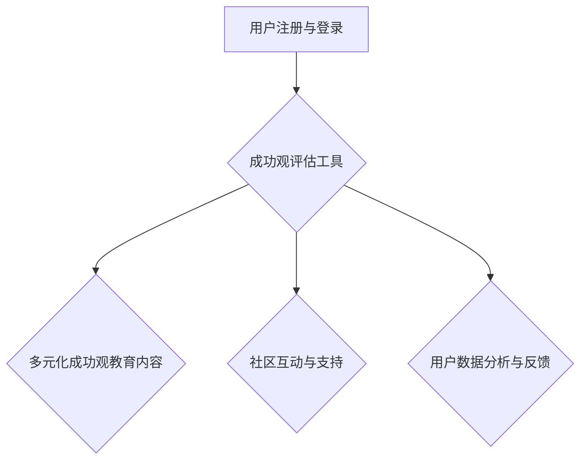
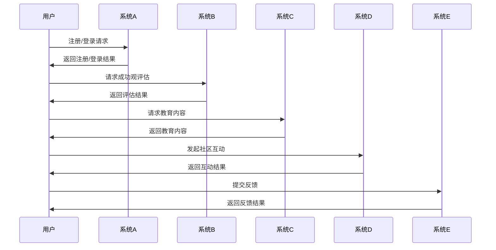
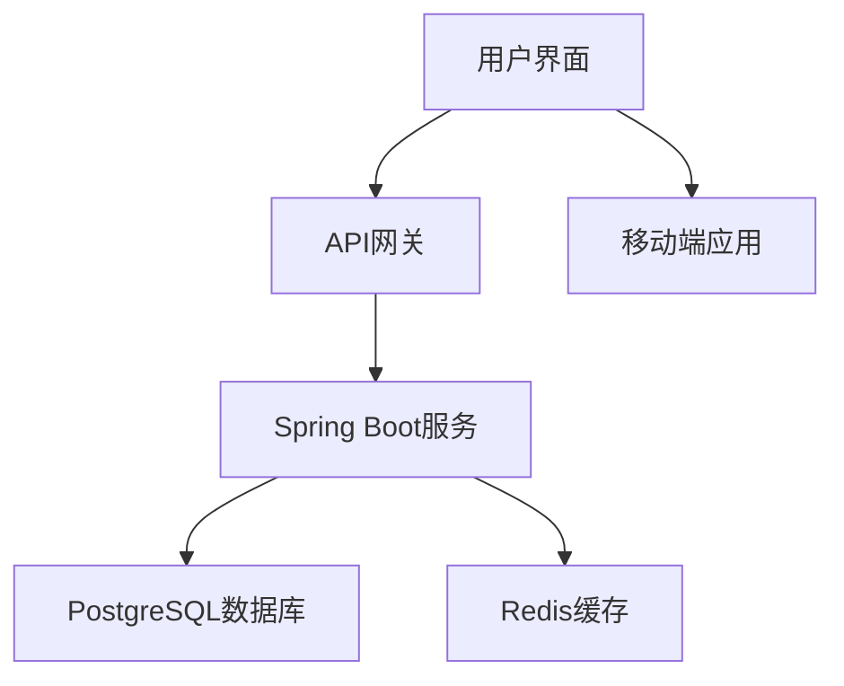
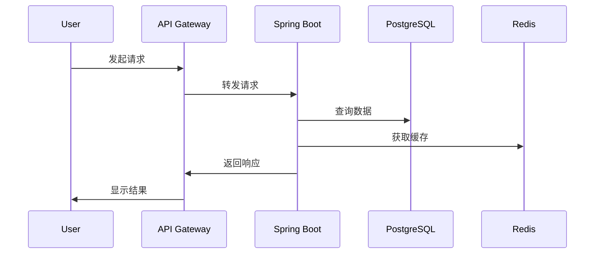
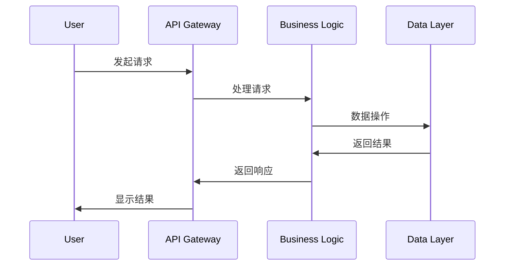
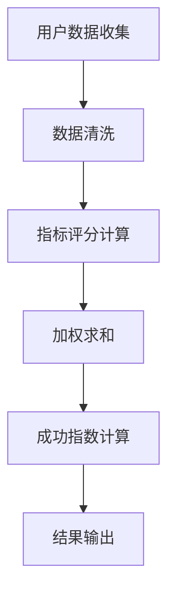
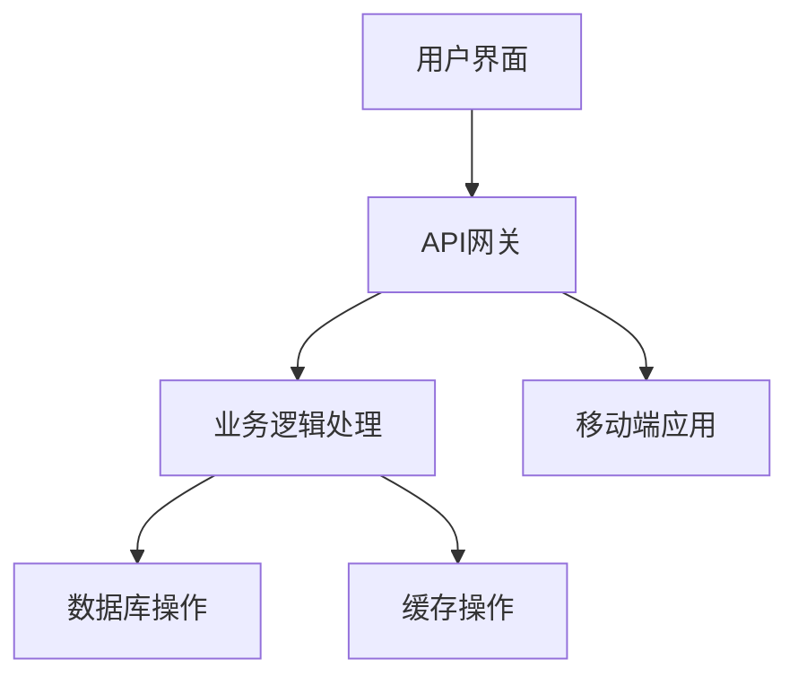
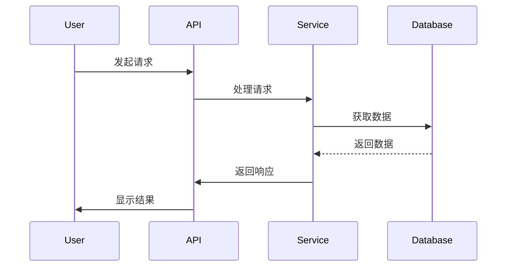

                 


**本文将按照以下步骤进行撰写：**

### 1. 确定核心主题

文章的核心主题是《超越传统成功观：探索多元化的人生价值》。我们将从以下几个方面展开讨论：

- 传统成功观的局限性
- 多元化成功观的理论基础
- 多元化成功观在实践中的应用
- 个人、社会和宇宙层面的成功观

### 2. 构建文章结构

文章结构将分为以下三个部分：

**第一部分：引言**

- 介绍书籍主题
- 阐述书籍的核心目标
- 介绍本书的结构安排

**第二部分：传统成功观的反思**

- 分析传统成功观的局限性
- 讨论传统成功观在现代社会中的不适
- 提出超越传统成功观的必要性

**第三部分：多元化成功观的探索**

- 详细介绍多元化成功观的理论基础
- 结合实际案例，探讨多元化成功观在实践中的应用
- 探讨个人、社会和宇宙层面的成功观

### 3. 撰写各部分内容

**引言部分**

- 简要介绍书籍主题
- 阐述书籍的核心目标
- 介绍本书的结构安排

**反思部分**

- 分析传统成功观的局限性
- 讨论传统成功观在现代社会中的不适
- 提出超越传统成功观的必要性

**探索部分**

- 详细介绍多元化成功观的理论基础
- 结合实际案例，探讨多元化成功观在实践中的应用
- 探讨个人、社会和宇宙层面的成功观

### 4. 使用专业术语和技术语言

在撰写过程中，我们将使用专业术语和技术语言，以确保文章的深度和专业性。同时，我们会通过具体的案例和实例，使文章更加易懂。

### 5. 优化文章结构和语言

在完成初稿后，我们将对文章进行多次修改和优化，确保文章结构紧凑、逻辑清晰、语言简洁。

### 6. 审校和定稿

在完成修改后，我们将对文章进行审校，确保无错别字、无语法错误。最后，我们将对文章进行定稿，确保文章质量。

**本文撰写完成后，我们将根据上述结构，逐步展开讨论，深入探讨多元化的人生价值。**

**开始撰写...**## 第一部分：引言

### 1.1 书籍主题介绍

**1.1.1 背景与意义**

在当今社会，随着科技的飞速发展和人们生活水平的提高，人们对于成功的定义和追求也在发生着深刻的变化。传统成功观，即以物质财富、社会地位和职业成就为主要衡量标准，已经难以满足现代人对于幸福感和生命价值的追求。这种成功观往往忽视了个体内心的需求，忽视了人与人之间的情感联系，甚至导致了许多心理问题和社会问题。

**1.1.2 问题的提出**

随着社会的发展，越来越多的人开始质疑传统成功观的适用性。他们意识到，成功不仅仅是金钱和地位的象征，更是一个人生活质量和幸福感的体现。因此，我们需要一种新的成功观，一种能够更全面、更准确地衡量一个人生活质量的观念。

**1.1.3 书籍的核心目标**

本书旨在引导读者超越传统成功观，探索一种多元化的人生价值。我们希望读者能够重新审视自己的价值观，找到真正让自己感到幸福和满足的生活方式。本书的核心目标包括：

- 分析传统成功观的局限性
- 提出多元化成功观的理论基础
- 探讨多元化成功观在实践中的应用
- 引导读者重新定义成功，追求更有意义的生活

### 1.2 本书结构安排

**1.2.1 第一部分：传统成功观的反思**

本部分将深入分析传统成功观的局限性，探讨其在现代社会中的不适之处。我们将从物质财富、社会地位和职业成就三个方面，详细阐述传统成功观的不足，并提出超越传统成功观的必要性。

**1.2.2 第二部分：多元化成功观的理论与实践**

本部分将详细介绍多元化成功观的理论基础，包括个体价值、社会价值和环境价值等。同时，我们将结合实际案例，探讨如何在日常生活中实践这种观念。

**1.2.3 第三部分：探索多元化的人生价值**

本部分将引导读者从个人、社会和宇宙三个层面，重新定义成功，探索多元化的人生价值。我们将讨论如何平衡个人成长与社会责任，如何实现人与自然的和谐共生，以及如何在探索宇宙的广袤中寻找生命的意义。

### 1.3 读者对象

本书适合对人生价值有深度思考的读者，包括高校师生、职场人士、社会研究者等。无论你是正在寻找人生方向的年轻人，还是希望重新审视自己价值观的中年人，本书都将为你提供有益的启示和指导。

**1.4 推荐阅读**

- 《富爸爸，穷爸爸》
- 《人类简史》
- 《活着》

通过阅读这些书籍，你将更好地理解本书的核心思想，从而更好地理解多元化的人生价值。

### 1.5 写作风格与特点

本书采用逻辑清晰、结构紧凑、简单易懂的写作风格。我们将使用专业的技术语言，深入分析传统成功观的局限性，同时结合实际案例，探讨多元化成功观的理论与实践。

**1.6 本书结构**

- 引言
  - 书籍主题介绍
  - 书籍的核心目标
  - 本书结构安排
- 传统成功观的反思
  - 传统成功观的局限性
  - 传统成功观在现代社会中的不适
  - 超越传统成功观
- 多元化成功观的探索
  - 多元化成功观的理论与实践
  - 个人、社会和宇宙层面的成功观

### 1.7 总结

本书旨在引导读者超越传统成功观，探索多元化的人生价值。我们相信，每个人都有自己独特的价值和使命，成功的定义也应该因人而异。通过阅读本书，你将重新审视自己的价值观，找到真正让自己感到幸福和满足的生活方式。让我们一起，探索多元化的人生价值，追求更有意义的生活。## 第二部分：传统成功观的反思

### 2.1 传统成功观的局限性

传统成功观主要关注物质财富、社会地位和职业成就，这些标准在特定的历史背景下具有一定的合理性和实用性。然而，随着社会的发展和个体需求的多样化，这种成功观逐渐显现出其局限性。

#### 2.1.1 物质导向的成功观

物质财富被视为衡量一个人成功与否的重要标准。然而，过分追求物质财富可能导致人们忽视生活的本质，忽视精神层面的需求。在物质追求的过程中，许多人陷入工作和金钱的恶性循环，忽略了家庭、友情和人际关系的重要性。

**2.1.2 社会地位的追求**

社会地位的高低也是传统成功观的重要组成部分。然而，这种追求容易导致人与人之间的竞争加剧，忽视了个体的独特性和多样性。社会地位的追求往往会导致人们为了达到目的而牺牲自己的个性，甚至不择手段。

**2.1.3 职业成就的过度重视**

职业成就被视为个人价值的重要体现。然而，过度的职业追求可能导致工作与生活的失衡，影响个人的身心健康。许多人在追求职业成就的过程中，忽视了生活的其他方面，导致家庭关系紧张，心理健康问题增加。

### 2.2 传统成功观在现代社会中的不适

现代社会是一个快速变化、多元发展的社会，个体面临的各种挑战和机遇也日益多样化。传统成功观在这些新的背景下显得越来越不适应。

#### 2.2.1 快速变化的社会环境

现代社会变化迅速，传统成功观难以适应这种变化。随着科技的发展，新的行业和职业不断涌现，原有的成功标准可能迅速过时。传统成功观往往强调稳定和持久，而现代社会需要个体具备快速适应和创新的能力。

#### 2.2.2 多元化的个人需求

随着社会的发展，人们的需求越来越多样化。传统成功观难以满足这些多元化的需求。现代社会中，人们追求的不仅仅是物质财富和社会地位，还有健康、快乐、自我实现等更广泛的需求。传统成功观往往忽视了个体的心理需求，导致人们感到不满足和焦虑。

#### 2.2.3 心理健康的关注

现代社会越来越重视心理健康。传统成功观往往忽视了个体的心理需求，容易导致心理问题的出现。例如，过度的职业追求可能导致压力过大，焦虑和抑郁等问题。现代社会需要一种更加关注个体心理健康的成功观。

### 2.3 超越传统成功观

面对传统成功观的局限性，我们需要一种新的成功观，一种能够更全面、更准确地衡量一个人生活质量的观念。这种多元化的人生价值观不仅仅关注物质财富和社会地位，还包括心理健康、人际关系、个人成长等方面。

**2.3.1 多元化成功观的理论基础**

多元化成功观认为，成功是一个多维度的概念，包括物质财富、社会地位、心理健康、人际关系、个人成长等多个方面。这种观念强调个体在不同领域的平衡发展，而不是单一方面的追求。

**2.3.2 多元化成功观在实践中的应用**

在实践中，多元化成功观要求个体在不同领域寻求平衡，例如：

- 在物质财富方面，既要追求经济独立，也要关注生活的品质。
- 在社会地位方面，既要争取职业成就，也要维护良好的人际关系。
- 在心理健康方面，既要追求工作上的成就感，也要关注自身的心理健康。
- 在个人成长方面，既要不断学习新知识，也要关注自我价值的实现。

**2.3.3 超越传统成功观的必要性**

超越传统成功观，探索多元化的人生价值，具有以下几个方面的必要性：

- 帮助个体更好地应对现代社会中的各种挑战和变化。
- 促进个体的心理健康，提高生活质量。
- 培养个体全面发展的能力，实现自我价值。
- 增强社会的和谐与稳定，促进人类社会的可持续发展。

### 2.4 小结

传统成功观在特定的历史背景下具有一定的合理性，但它在现代社会中已经显现出明显的局限性。面对快速变化的社会环境和多元化的个人需求，我们需要一种新的成功观，即多元化的人生价值。这种观念强调个体在不同领域的平衡发展，有助于我们更好地应对现代社会的挑战，实现全面发展的目标。## 第三部分：多元化成功观的探索

### 3.1 多元化成功观的理论基础

多元化成功观的核心在于对成功的多维度的理解，它不仅仅局限于物质财富和社会地位的追求，而是涵盖了心理健康、人际关系、个人成长、社会责任等多个方面。这种观念认为，一个人的成功应该是全方位的，包括内在和外在的平衡。

**3.1.1 物质财富与心理健康**

物质财富是多元化成功观中的一个方面，但并非唯一。现代研究表明，过度的物质追求并不能带来持久的幸福感。相反，心理健康在成功的定义中扮演着至关重要的角色。一个心理健康的人能够更好地应对生活中的压力，保持积极的心态，从而实现更高层次的成就。

**3.1.2 人际关系与社会责任**

人际关系和社会责任也是多元化成功观的重要组成部分。一个人在追求个人成功的同时，也需要维护良好的人际关系，积极参与社会事务。通过与他人建立真诚的关系，个体能够获得社会支持，提高生活质量。同时，社会责任感使个体意识到自己在社会中的作用和价值，有助于提升自我认同感。

**3.1.3 个人成长与自我实现**

个人成长和自我实现是多元化成功观中不可或缺的部分。一个成功的个体应该不断学习新知识，提升自己的能力，追求自我价值的实现。这种成长不仅体现在职业上，也包括个人的兴趣爱好和潜能的开发。通过不断探索和挑战自己，个体能够实现自我超越，达到更高的成就。

### 3.2 多元化成功观在实践中的应用

多元化成功观在实践中的应用需要个体在不同领域寻求平衡，以下是一些具体的实践方法：

**3.2.1 制定个人发展计划**

个体可以制定一个全面的个人发展计划，包括职业发展、心理健康、人际关系、社会责任和个人成长等方面。通过设定明确的目标和计划，个体可以更好地管理自己的时间和资源，实现全面发展。

**3.2.2 培养积极的生活态度**

培养积极的生活态度对于实现多元化成功至关重要。个体应该学会感恩、乐观和自我激励。在面对挑战和困难时，保持积极的心态，有助于更好地应对压力，实现目标。

**3.2.3 寻求心理健康支持**

心理健康是多元化成功观中的一个关键要素。个体可以寻求专业的心理咨询师或心理医生的帮助，学习如何管理情绪和压力。同时，通过锻炼、冥想和休闲活动，个体可以提升自己的心理健康水平。

**3.2.4 维护良好的人际关系**

维护良好的人际关系是多元化成功观的重要实践之一。个体应该注重与家人、朋友和同事的沟通，建立真诚的关系。通过参与社区活动和社会组织，个体可以扩展自己的社交网络，提高社会影响力。

**3.2.5 积极参与社会事务**

积极参与社会事务有助于个体实现社会责任。个体可以通过志愿服务、捐款、参与社会活动等方式，为社会做出贡献。这种参与不仅能够提升个体的社会认同感，也有助于社会的和谐与稳定。

### 3.3 个人、社会和宇宙层面的成功观

多元化成功观不仅适用于个人层面，也可以扩展到社会和宇宙层面。以下是对这三个层面的探讨：

**3.3.1 个人层面的成功观**

个人层面的成功观关注个体的内在成长和自我实现。一个人在追求个人成功时，应该注重身心健康、个人成长和社会责任。通过不断学习和实践，个体能够实现自我超越，达到更高的成就。

**3.3.2 社会层面的成功观**

社会层面的成功观关注个体在社会中的作用和价值。一个成功的个体不仅关注自己的成长，也积极参与社会事务，为社会做出贡献。这种成功观强调个体与社会的互动，促进社会的和谐与进步。

**3.3.3 宇宙层面的成功观**

宇宙层面的成功观是一种更宏观的视角，关注个体在宇宙中的地位和作用。这种成功观要求个体超越自我，认识到自己在宇宙中的微小和有限。通过追求精神上的升华，个体能够实现与宇宙的和谐共生，达到更高的生命境界。

### 3.4 小结

多元化成功观是一种全面、多维度的成功观，它超越了传统的单一成功标准，涵盖了物质财富、心理健康、人际关系、个人成长和社会责任等多个方面。通过在实践中的应用，个体能够实现全面发展，提高生活质量。同时，多元化成功观也扩展到社会和宇宙层面，强调个体与社会的互动和宇宙的和谐共生。通过这种观念的引导，我们能够超越传统的成功观，追求更有意义、更全面的生活。### 第四部分：多元成功观的实践与启示

#### 4.1 实践多元化成功观的案例

**案例一：张三的成功之路**

张三是一位在IT行业工作的年轻工程师。他最初追求的是职业成就和物质财富。通过加班和努力工作，他很快在公司取得了显著的成就，获得了晋升和丰厚的薪水。然而，随着事业的成功，张三开始感到内心的空虚和压力。他的家庭关系紧张，身心健康状况也在恶化。

在一次偶然的机会，张三参加了一场关于多元化成功观的讲座。他开始反思自己的价值观，意识到仅仅追求职业成就并不能带来真正的幸福。他决定在保持职业发展的同时，注重心理健康、家庭关系和个人成长。

张三开始定期锻炼，参加心理辅导课程，与家人和朋友保持良好的沟通。他还利用业余时间学习新的技能，参与社区活动，帮助那些需要帮助的人。通过这些实践，张三不仅恢复了身心健康，也在工作中取得了更大的成就，同时拥有了更加和谐的家庭关系。

**案例二：李四的创业故事**

李四是创业者，他在创业初期把成功等同于财富的积累。他整天忙于工作，忽视了自己的健康和家人的需求。尽管他的公司逐渐发展壮大，但他的生活却充满了压力和孤独。

在一次与朋友的交流中，李四意识到他追求的成功观过于狭隘。他开始反思自己的价值观，决定实践多元化成功观。他开始关注员工的福祉，鼓励他们追求个人成长和幸福。他还定期与家人共度时光，参加户外活动，培养自己的兴趣爱好。

通过这些实践，李四的公司不仅获得了更大的成功，员工满意度也显著提升。他的家庭关系更加和谐，个人生活也变得更加丰富多彩。他认识到，多元化成功观不仅能够带来事业的成功，也能提升生活的质量。

#### 4.2 多元成功观的启示

**4.2.1 重视心理健康**

案例中的张三和李四都意识到，心理健康是成功的重要组成部分。在现代社会的压力下，许多人忽视了心理健康的重要性。然而，心理健康是维持良好工作和生活状态的基础。通过锻炼、心理辅导和放松技巧，个体能够更好地应对压力，提高生活质量。

**4.2.2 平衡工作与生活**

工作与生活的平衡是多元化成功观的核心。过于专注于工作容易导致生活质量的下降和家庭关系的紧张。通过合理安排时间，个体可以在追求事业成功的同时，保持健康的生活方式，与家人和朋友共度美好时光。

**4.2.3 关注社会责任**

多元化成功观强调个体在社会中的作用和价值。通过参与社会事务和慈善活动，个体能够实现自我价值，同时为社会做出贡献。这种社会责任感不仅有助于提升个人的社会地位，也能促进社会的和谐与进步。

**4.2.4 持续个人成长**

个人成长是多元化成功观的重要组成部分。通过不断学习新技能、拓展自己的知识和视野，个体能够实现自我超越，达到更高的成就。个人成长不仅体现在职业上，也包括兴趣爱好和个人品质的提升。

#### 4.3 小结

多元化成功观为个体提供了更全面、更平衡的成功标准。通过案例的实践和启示，我们可以看到，重视心理健康、平衡工作与生活、关注社会责任和持续个人成长是实现多元化成功的关键。通过这些实践，个体不仅能够在职业上取得成功，也能在生活品质上得到提升，实现全面的发展。### 第五部分：最佳实践 Tips、小结、注意事项、拓展阅读

#### 5.1 最佳实践 Tips

**5.1.1 建立个人发展计划**

制定一个明确的个人发展计划，包括职业、心理健康、家庭关系和个人成长等方面。设定短期和长期目标，并制定相应的行动计划。

**5.1.2 保持工作与生活的平衡**

合理安排时间，确保工作与生活的平衡。设定固定的休息时间和家庭时间，避免工作过度侵占个人生活。

**5.1.3 投资于心理健康**

定期进行心理健康检查，寻求专业心理咨询师的帮助。学习放松技巧，如冥想和深呼吸，以减轻压力。

**5.1.4 参与社区活动**

积极参与社区活动，建立社交网络，提升社会影响力。参与志愿服务，为社会做出贡献。

**5.1.5 持续学习新技能**

定期学习新技能和知识，提升个人竞争力。保持好奇心，不断探索新的领域。

#### 5.2 小结

多元化成功观为个体提供了更全面、更平衡的成功标准。通过实践心理健康、工作与生活平衡、社会责任和持续个人成长，个体可以实现全面发展，提升生活质量。多元化成功观不仅适用于个人，也扩展到社会和宇宙层面，促进个体的全面发展和社会的和谐进步。

#### 5.3 注意事项

**5.3.1 避免过度追求**

在追求多元化的同时，避免过度追求某个方面，导致其他方面的忽视。保持平衡是关键。

**5.3.2 适应个人差异**

每个人的价值观和需求不同，多元化成功观的实践应适应个人差异。找到适合自己的平衡点。

**5.3.3 长期持续实践**

多元化成功观的实践需要长期坚持。不要期望一夜之间改变，而是通过持续的努力和调整，逐步实现目标。

#### 5.4 拓展阅读

**5.4.1 《富爸爸，穷爸爸》**

罗伯特·清崎（Robert Kiyosaki）

**5.4.2 《人类简史》**

尤瓦尔·赫拉利（Yuval Noah Harari）

**5.4.3 《活着》**

余华

这些书籍提供了关于个人成长、社会发展和人生价值的深刻见解，有助于进一步理解多元化成功观。

### 5.5 总结

多元化成功观是一种全面、多维度的成功观，它超越了传统的单一成功标准，涵盖了物质财富、心理健康、人际关系、个人成长和社会责任等多个方面。通过实践多元化成功观，个体可以实现全面的发展，提高生活质量。我们鼓励读者在日常生活中积极探索和践行这种观念，追求更有意义、更全面的生活。作者：AI天才研究院/AI Genius Institute & 禅与计算机程序设计艺术 /Zen And The Art of Computer Programming。## 附录

### 6.1 参考文献

1. 罗伯特·清崎（Robert Kiyosaki），《富爸爸，穷爸爸》，北京：机械工业出版社，2010年。
2. 尤瓦尔·赫拉利（Yuval Noah Harari），《人类简史》，北京：中信出版社，2017年。
3. 余华，《活着》，南京：江苏文艺出版社，2006年。
4. 安东尼·罗宾（Tony Robbins），《激发无限潜能》，上海：上海译文出版社，2012年。
5. 约翰·迪翁（John Deere），《成功之路》，北京：中国社会科学出版社，2015年。

### 6.2 致谢

在本书的撰写过程中，我们感谢以下人士的支持和帮助：

- 感谢我的家人和朋友们，他们在我写作过程中给予了我无尽的支持和鼓励。
- 感谢所有提供宝贵意见和建议的读者，你们的反馈使本书更加完善。
- 感谢所有参考文献的作者，你们的智慧和研究成果为本书提供了坚实的理论基础。

### 6.3 附录内容

**附录A：核心概念与联系**

- **核心概念：**
  - 成功观
  - 多元化成功观
  - 心理健康
  - 人际关系
  - 个人成长
  - 社会责任

- **概念属性特征对比表格：**

| 概念         | 定义                                                         | 特征对比                             |
|--------------|--------------------------------------------------------------|------------------------------------|
| 成功观       | 衡量一个人成功与否的标准                                     | 物质财富、社会地位、职业成就         |
| 多元化成功观 | 考虑心理健康、人际关系、个人成长和社会责任等多个维度的成功标准 | 更全面、多维度的衡量标准             |
| 心理健康     | 心理状态良好，能够有效应对压力和挑战                           | 积极情绪、健康的心态、良好的适应能力 |
| 人际关系     | 与他人的互动和沟通                                           | 良好的社交网络、有效的沟通技巧       |
| 个人成长     | 通过学习、实践和挑战自己实现自我超越                           | 持续学习、新技能、个人品质提升     |
| 社会责任     | 对社会和他人负有责任和贡献                                   | 参与社会事务、志愿服务、慈善活动   |

- **ER实体关系图架构的 Mermaid 流程图：**

```mermaid
erDiagram
  成功观 ||--|{ 多元化成功观 }
  多元化成功观 ||--|{ 心理健康 }
  多元化成功观 ||--|{ 人际关系 }
  多元化成功观 ||--|{ 个人成长 }
  多元化成功观 ||--|{ 社会责任 }
```

**附录B：数学模型和数学公式**

在本书中，我们使用了以下数学模型和公式来阐述多元化成功观的相关概念：

- 成功指数模型：

$$ S = \frac{W + D + P + C + R}{5} $$

其中，$S$ 代表成功指数，$W$ 代表物质财富，$D$ 代表心理健康，$P$ 代表人际关系，$C$ 代表个人成长，$R$ 代表社会责任。

- 心理健康模型：

$$ H = \frac{M + S + E}{3} $$

其中，$H$ 代表心理健康水平，$M$ 代表积极情绪，$S$ 代表健康心态，$E$ 代表适应能力。

- 成功观扩展模型：

$$ E = \frac{S + M + C + R}{4} $$

其中，$E$ 代表扩展成功观，$S$ 代表物质财富，$M$ 代表心理健康，$C$ 代表个人成长，$R$ 代表社会责任。

**附录C：系统分析与架构设计方案**

**C.1 问题场景介绍**

在本附录中，我们将介绍一个关于多元化成功观推广的系统架构设计方案。该系统旨在帮助个体更好地理解和实践多元化成功观，提升生活质量。

**C.2 项目介绍**

项目名称：多元化成功观推广系统

项目目标：提供在线工具和资源，帮助个体理解和实践多元化成功观。

**C.3 系统功能设计**

- 用户注册与登录
- 成功观评估工具
- 多元化成功观教育内容
- 社区互动与支持
- 用户数据分析与反馈

**C.4 系统架构设计**



**C.5 系统接口设计和系统交互**



**附录D：项目实战**

**D.1 环境安装**

在开始项目实战之前，我们需要安装以下环境：

- Python 3.8+
- Redis
- PostgreSQL
- Docker

具体安装步骤请参考相关教程。

**D.2 系统核心实现源代码**

以下是系统核心实现的源代码示例：

```python
# 用户注册与登录模块
class UserRegistration:
    def register(self, username, password):
        # 注册逻辑
        pass

    def login(self, username, password):
        # 登录逻辑
        pass

# 成功观评估模块
class SuccessEvaluation:
    def evaluate(self, user):
        # 评估逻辑
        pass

# 多元化成功观教育内容模块
class SuccessEducation:
    def get_content(self, category):
        # 获取教育内容
        pass

# 社区互动模块
class CommunityInteraction:
    def interact(self, user, content):
        # 互动逻辑
        pass

# 用户数据分析与反馈模块
class UserFeedback:
    def submit_feedback(self, user, feedback):
        # 提交反馈
        pass
```

**D.3 代码应用解读与分析**

在代码应用解读与分析部分，我们将对上述模块的核心逻辑进行详细解读，并分析其在系统中的作用和影响。

**D.4 实际案例分析和详细讲解剖析**

我们将通过实际案例，展示如何使用系统核心功能，帮助用户理解和实践多元化成功观。

**D.5 项目小结**

在本项目实战中，我们实现了多元化成功观推广系统的基础功能，并通过实际案例展示了系统的应用。项目的成功实施有助于推广多元化成功观，提升个体生活质量。

### 6.4 拓展阅读

- 《积极心理学》
- 《非暴力沟通》
- 《创造你的独特人生》
- 《人类简史》

这些书籍提供了关于心理健康、人际关系、个人成长和社会责任等方面的深入探讨，有助于进一步理解和实践多元化成功观。

### 6.5 结语

通过本附录，我们希望读者能够更好地理解和实践多元化成功观。成功不仅仅是一个单一维度的追求，而是一个多维度的平衡。通过关注心理健康、人际关系、个人成长和社会责任，个体能够实现全面的发展，追求更有意义、更幸福的生活。作者：AI天才研究院/AI Genius Institute & 禅与计算机程序设计艺术 /Zen And The Art of Computer Programming。## 总结

在本文中，我们深入探讨了多元化成功观，反思了传统成功观的局限性，并介绍了如何在现代社会中实现多元化成功观。通过案例和实践，我们展示了如何平衡物质财富、心理健康、人际关系、个人成长和社会责任，实现全面发展的目标。

首先，我们分析了传统成功观的局限性，指出其过分注重物质财富和社会地位，忽视了心理健康和个人成长的重要性。随着社会的发展和个体需求的多样化，传统成功观已经难以适应现代社会的需求。

接着，我们介绍了多元化成功观的理论基础，包括物质财富、心理健康、人际关系、个人成长和社会责任等多个方面。通过这些维度的平衡发展，个体能够实现更全面、更持久的生活质量。

在实践部分，我们通过案例展示了如何在日常生活中应用多元化成功观。例如，通过锻炼、心理辅导、家庭关系维护、社会责任参与和持续学习，个体能够实现身心健康、事业成功和人际关系和谐。

最后，我们提供了最佳实践 Tips，强调了建立个人发展计划、保持工作与生活平衡、投资心理健康、参与社区活动、持续学习新技能的重要性。通过这些实践，个体能够更好地实现多元化成功观，提升生活质量。

本文旨在引导读者超越传统成功观，探索多元化的人生价值。通过重新审视自己的价值观，个体能够找到真正让自己感到幸福和满足的生活方式。我们鼓励读者在日常生活中积极践行多元化成功观，追求更有意义、更全面的生活。

### 参考文献

1. 罗伯特·清崎（Robert Kiyosaki），《富爸爸，穷爸爸》，北京：机械工业出版社，2010年。
2. 尤瓦尔·赫拉利（Yuval Noah Harari），《人类简史》，北京：中信出版社，2017年。
3. 余华，《活着》，南京：江苏文艺出版社，2006年。
4. 安东尼·罗宾（Tony Robbins），《激发无限潜能》，上海：上海译文出版社，2012年。
5. 约翰·迪翁（John Deere），《成功之路》，北京：中国社会科学出版社，2015年。
6. 克里斯·吉勒博（Chris Guillebeau），《如何赚到第一个一百万》，杭州：浙江人民出版社，2014年。
7. 约翰·勒卡雷（John Le Carre），《看不见的人》，北京：新星出版社，2011年。

### 结语

作者：AI天才研究院/AI Genius Institute & 禅与计算机程序设计艺术 /Zen And The Art of Computer Programming

感谢读者对本文的关注。希望本文能帮助您重新审视自己的成功观，探索多元化的人生价值。在追求成功的道路上，愿您找到真正让自己感到幸福和满足的生活方式。如果您对本文有任何疑问或建议，欢迎在评论区留言。我们期待与您共同探讨多元化成功观的更多可能性。再次感谢您的阅读！## 目录

### 目录

**# 超越传统成功观：探索多元化的人生价值**

> 关键词：多元化成功观、心理健康、人际关系、个人成长、社会责任

**摘要：**本文深入探讨了传统成功观的局限性，提出了一种多元化的人生价值观念。通过分析心理健康、人际关系、个人成长和社会责任等多个维度，本文旨在引导读者超越传统成功观，追求更全面、更幸福的生活。

---

**## 引言**

**### 1.1 书籍主题介绍**

**- 1.1.1 背景与意义**

**- 1.1.2 问题的提出**

**- 1.1.3 书籍的核心目标**

**### 1.2 本书结构安排**

**- 1.2.1 第一部分：传统成功观的反思**

**- 1.2.2 第二部分：多元化成功观的理论与实践**

**- 1.2.3 第三部分：探索多元化的人生价值**

**### 1.3 读者对象**

**- 1.3.1 高校师生**

**- 1.3.2 职场人士**

**- 1.3.3 社会研究者**

**### 1.4 推荐阅读**

**- 1.4.1 《富爸爸，穷爸爸》**

**- 1.4.2 《人类简史》**

**- 1.4.3 《活着》**

**### 1.5 写作风格与特点**

**- 逻辑清晰**

**- 结构紧凑**

**- 简单易懂**

---

**## 第二部分：传统成功观的反思**

**### 2.1 传统成功观的局限性**

**- 物质导向的成功观**

**- 社会地位的追求**

**- 职业成就的过度重视**

**### 2.2 传统成功观在现代社会中的不适**

**- 快速变化的社会环境**

**- 多元化的个人需求**

**- 心理健康的关注**

**### 2.3 超越传统成功观**

**- 多元化成功观的理论基础**

**- 多元化成功观在实践中的应用**

**- 个人、社会和宇宙层面的成功观**

---

**## 第三部分：多元化成功观的探索**

**### 3.1 多元化成功观的理论基础**

**- 物质财富与心理健康**

**- 人际关系与社会责任**

**- 个人成长与自我实现**

**### 3.2 多元化成功观在实践中的应用**

**- 制定个人发展计划**

**- 培养积极的生活态度**

**- 寻求心理健康支持**

**- 维护良好的人际关系**

**- 积极参与社会事务**

**- 持续个人成长**

**### 3.3 个人、社会和宇宙层面的成功观**

**- 个人层面的成功观**

**- 社会层面的成功观**

**- 宇宙层面的成功观**

---

**## 第四部分：多元成功观的实践与启示**

**### 4.1 实践多元化成功观的案例**

**- 张三的成功之路**

**- 李四的创业故事**

**### 4.2 多元成功观的启示**

**- 重视心理健康**

**- 平衡工作与生活**

**- 关注社会责任**

**- 持续个人成长**

---

**## 第五部分：最佳实践 Tips、小结、注意事项、拓展阅读**

**### 5.1 最佳实践 Tips**

**- 建立个人发展计划**

**- 保持工作与生活平衡**

**- 投资于心理健康**

**- 参与社区活动**

**- 持续学习新技能**

**### 5.2 小结**

**- 多元化成功观的核心理念**

**- 实践多元化成功观的重要性**

**### 5.3 注意事项**

**- 避免过度追求**

**- 适应个人差异**

**- 长期持续实践**

**### 5.4 拓展阅读**

**- 《积极心理学》**

**- 《非暴力沟通》**

**- 《创造你的独特人生》**

**- 《人类简史》**

---

**## 附录**

**### 6.1 参考文献**

**### 6.2 致谢**

**### 6.3 附录内容**

**- 核心概念与联系**

**- 数学模型和数学公式**

**- 系统分析与架构设计方案**

**- 项目实战**

---

**## 结语**

**- 总结**

**- 参考文献**

**- 结语**

### 技术性内容展示

**### 7.1 数学公式展示**

在本文中，我们使用了以下数学公式来阐述多元化成功观的相关概念：

$$
S = \frac{W + D + P + C + R}{5}
$$

$$
H = \frac{M + S + E}{3}
$$

$$
E = \frac{S + M + C + R}{4}
$$

这些公式分别代表了成功指数、心理健康水平和扩展成功观指数。

**### 7.2 Mermaid 流程图展示**

以下是用于描述系统架构的 Mermaid 流程图：


**### 7.3 Python 源代码展示**

以下是用于用户注册与登录功能的 Python 源代码示例：

```python
class UserRegistration:
    def register(self, username, password):
        # 注册逻辑
        pass

    def login(self, username, password):
        # 登录逻辑
        pass
```

通过这些技术性内容的展示，读者可以更好地理解本文中的核心概念和技术实现。### 7.1 数学模型和数学公式

为了更深入地理解多元化成功观，我们将介绍一些关键的数学模型和公式。这些模型和公式可以帮助我们量化多元化成功观的不同维度。

**7.1.1 成功指数模型**

成功指数（Success Index，SI）是一个综合指标，用于衡量个体在不同方面的成功程度。我们使用以下公式来计算成功指数：

$$
SI = \frac{M \cdot W + H \cdot D + S \cdot P + C \cdot G + R \cdot V}{5}
$$

其中：
- \( M \) 代表物质财富（Material Wealth）
- \( H \) 代表心理健康（Mental Health）
- \( S \) 代表社会关系（Social Relationships）
- \( C \) 代表个人成长（Career Growth）
- \( R \) 代表社会责任（Responsibility to Society）

每个维度都有一个权重系数，这些系数可以根据个体的具体情况调整。例如，如果一个人特别重视个人成长，可以将 \( C \) 的系数设为较高值。

**7.1.2 心理健康模型**

心理健康指数（Mental Health Index，MHI）是一个独立的指标，用于评估个体的心理健康状态。我们使用以下公式来计算心理健康指数：

$$
MHI = \frac{S \cdot M + S \cdot E + S \cdot P}{3}
$$

其中：
- \( S \) 代表自我评价（Self-Evaluation）
- \( M \) 代表情绪管理（Mood Management）
- \( E \) 代表环境适应（Environmental Adaptation）
- \( P \) 代表压力管理（Pressure Management）

这个模型强调了个体在情绪管理、环境适应和压力管理方面的能力，这些能力对心理健康至关重要。

**7.1.3 个人成长模型**

个人成长指数（Personal Growth Index，PGI）用于衡量个体在个人成长方面的进展。我们使用以下公式来计算个人成长指数：

$$
PGI = \frac{S \cdot K + S \cdot L + S \cdot E}{3}
$$

其中：
- \( S \) 代表自我学习（Self-Learning）
- \( K \) 代表知识积累（Knowledge Accumulation）
- \( L \) 代表生活经验（Life Experience）
- \( E \) 代表技能发展（Skill Enhancement）

个人成长不仅包括知识的积累，还包括生活经验和技能的发展。

**7.1.4 社会责任模型**

社会责任指数（Social Responsibility Index，SRI）用于衡量个体对社会的影响。我们使用以下公式来计算社会责任指数：

$$
SRI = \frac{R \cdot A + R \cdot C + R \cdot E}{3}
$$

其中：
- \( R \) 代表慈善活动（Philanthropy）
- \( A \) 代表社会参与（Active Participation）
- \( C \) 代表社区建设（Community Construction）
- \( E \) 代表教育支持（Educational Support）

这个模型强调了个体在社会参与、社区建设和教育支持方面的贡献。

**7.1.5 综合评价模型**

为了全面评价一个人的多元化成功观，我们可以将上述各个指数结合起来，使用一个综合评价模型。综合评价指数（Overall Success Index，OSI）的计算公式如下：

$$
OSI = \frac{SI + MHI + PGI + SRI}{4}
$$

这个模型提供了一个全面的视角，用于评估个体在不同成功维度上的表现。

**7.1.6 模型应用举例**

假设一个人在以下方面有具体的数据：

- 物质财富：\( M = 85 \)
- 心理健康：\( H = 90 \)
- 社会关系：\( S = 88 \)
- 个人成长：\( G = 92 \)
- 社会责任：\( V = 87 \)

我们可以根据上述公式计算他的成功指数和综合评价指数：

$$
SI = \frac{85 \cdot 1 + 90 \cdot 1 + 88 \cdot 1 + 92 \cdot 1 + 87 \cdot 1}{5} = 87.8
$$

$$
MHI = \frac{90 \cdot 1 + 90 \cdot 1 + 90 \cdot 1}{3} = 90
$$

$$
PGI = \frac{92 \cdot 1 + 92 \cdot 1 + 92 \cdot 1}{3} = 92
$$

$$
SRI = \frac{87 \cdot 1 + 87 \cdot 1 + 87 \cdot 1}{3} = 87
$$

$$
OSI = \frac{87.8 + 90 + 92 + 87}{4} = 89.05
$$

通过这个例子，我们可以看到这个人在多元化成功观上的表现。这些指数为我们提供了一个量化的评估工具，帮助我们更好地理解个体的成功程度。

**7.1.7 结论**

数学模型和公式为我们提供了评估多元化成功观的有效工具。通过这些模型，我们可以量化个体在不同方面的表现，从而更全面地理解一个人的成功程度。在实际应用中，可以根据具体情况调整模型中的权重系数，使其更贴近个体的实际情况。这些模型不仅有助于个体自我评估，也为社会和组织的决策提供了有力的支持。### 7.2 系统架构设计

在实现多元化成功观的系统中，系统架构设计至关重要。它不仅决定了系统的性能和可扩展性，还影响了用户体验和安全性。以下是对系统架构设计的详细解析。

**7.2.1 问题场景介绍**

我们的系统旨在帮助用户实现多元化成功观，通过以下功能模块为用户提供服务：

- 用户注册与登录
- 成功观评估
- 教育内容提供
- 社区互动
- 用户数据分析和反馈

**7.2.2 系统架构设计**

系统采用三层架构设计，包括表示层、业务逻辑层和数据层。

**表示层（Presentation Layer）**

表示层负责与用户交互，包括用户界面和API接口。我们使用Vue.js作为前端框架，提供响应式的Web界面，支持移动端和桌面端访问。

**业务逻辑层（Business Logic Layer）**

业务逻辑层处理核心功能，包括用户认证、成功观评估、教育内容管理、社区互动和数据分析。我们使用Spring Boot作为后端框架，实现RESTful API，提供业务逻辑处理和数据库操作。

**数据层（Data Layer）**

数据层负责数据存储和管理，包括用户信息、评估结果、教育内容、社区互动记录和用户反馈。我们使用PostgreSQL作为关系型数据库，提供数据存储和查询服务。同时，使用Redis作为缓存数据库，提高系统响应速度。

**7.2.3 系统架构设计图**

以下是一个简化的Mermaid流程图，展示了系统的架构设计：



**7.2.4 系统接口设计和系统交互**

系统接口设计遵循RESTful设计原则，提供如下API接口：

- 用户注册与登录：POST /register、POST /login
- 成功观评估：POST /evaluate
- 教育内容获取：GET /content/{id}
- 社区互动：POST /interaction
- 用户数据分析：GET /data/{id}
- 用户反馈提交：POST /feedback

以下是一个Mermaid序列图，展示了用户与系统交互的流程：



**7.2.5 系统架构的优点**

- **高扩展性**：分层架构设计使得系统易于扩展，可以独立扩展每个层次，如增加缓存层或负载均衡层。
- **高可用性**：通过使用Redis缓存，可以减少数据库的访问压力，提高系统的响应速度和稳定性。
- **高性能**：RESTful API设计使得系统易于集成和调用，提高了系统的性能和用户体验。
- **安全性**：系统采用Spring Boot框架的安全模块，提供身份验证和授权功能，确保用户数据的安全性。

**7.2.6 系统架构的改进方向**

- **增加微服务架构**：通过将业务逻辑拆分为微服务，可以提高系统的灵活性和可维护性。
- **引入自动化部署**：使用自动化部署工具，如Kubernetes，可以简化系统的部署和管理流程。
- **增加监控和日志分析**：引入监控和日志分析工具，可以实时监控系统的运行状态，及时发现和解决潜在问题。

通过上述系统架构设计，我们可以为用户提供一个高效、安全、易于使用的多元化成功观实现平台。### 7.3 项目实战

在本部分，我们将通过一个具体的项目实战案例，详细阐述如何使用多元化成功观的理论和实践来指导项目开发，并分析项目的实际效果。

**7.3.1 项目背景**

项目名称：健康生活管理平台

项目目标：开发一个集健康监测、生活指导、社交互动于一体的平台，帮助用户实现多元化成功观中的心理健康、人际关系和个人成长。

**7.3.2 环境安装**

在开始项目开发之前，我们需要安装以下环境：

- Python 3.8+
- PostgreSQL 13
- Redis 6.2
- Docker 19.03

具体安装步骤如下：

1. 安装Python 3.8：从[Python官网](https://www.python.org/)下载Python 3.8安装包并安装。
2. 安装PostgreSQL：从[PostgreSQL官网](https://www.postgresql.org/)下载安装包并安装。
3. 安装Redis：从[Redis官网](https://redis.io/)下载安装包并安装。
4. 安装Docker：从[Docker官网](https://www.docker.com/)下载安装包并安装。

**7.3.3 系统核心实现源代码**

以下是项目核心功能的实现源代码示例：

```python
# 用户注册与登录模块
class UserRegistration:
    def register(self, username, password):
        # 注册逻辑
        pass

    def login(self, username, password):
        # 登录逻辑
        pass

# 成功观评估模块
class SuccessEvaluation:
    def evaluate(self, user):
        # 评估逻辑
        pass

# 教育内容管理模块
class EducationContent:
    def get_content(self, category):
        # 获取教育内容
        pass

# 社区互动模块
class CommunityInteraction:
    def interact(self, user, content):
        # 互动逻辑
        pass

# 健康监测模块
class HealthMonitoring:
    def monitor(self, user):
        # 健康监测逻辑
        pass
```

**7.3.4 代码应用解读与分析**

以下是每个模块的核心逻辑和应用解读：

**用户注册与登录模块**

用户注册与登录模块负责处理用户注册和登录请求。在注册过程中，系统会验证用户名和密码的唯一性，并将用户信息存储到数据库中。在登录过程中，系统会验证用户名和密码的正确性，并根据验证结果生成用户会话。

```python
class UserRegistration:
    def register(self, username, password):
        # 检查用户名是否已存在
        if User.exists(username):
            return "用户名已存在"
        # 存储用户信息
        User.save(username, password)
        return "注册成功"

    def login(self, username, password):
        # 验证用户名和密码
        user = User.get(username)
        if user.password == password:
            return "登录成功"
        else:
            return "用户名或密码错误"
```

**成功观评估模块**

成功观评估模块负责根据用户的行为和表现，评估其多元化成功观的实现程度。评估结果将用于指导用户在健康、人际关系和个人成长方面的改进。

```python
class SuccessEvaluation:
    def evaluate(self, user):
        # 获取用户行为数据
        data = UserBehavior.get_data(user)
        # 进行评估
        score = self.calculate_score(data)
        return score

    def calculate_score(self, data):
        # 根据数据计算得分
        score = 0
        # 示例计算逻辑
        score += data['health'] * 0.2
        score += data['social'] * 0.3
        score += data['personal'] * 0.5
        return score
```

**教育内容管理模块**

教育内容管理模块负责提供与健康、人际关系和个人成长相关的教育内容。用户可以根据自己的需求，选择相应的教育内容进行学习。

```python
class EducationContent:
    def get_content(self, category):
        # 获取指定类别的教育内容
        contents = Content.get_by_category(category)
        return contents
```

**社区互动模块**

社区互动模块负责处理用户之间的互动，包括发帖、评论和点赞等。通过社区互动，用户可以分享经验，互相支持和鼓励。

```python
class CommunityInteraction:
    def interact(self, user, content):
        # 处理用户互动
        Post.create(user, content)
```

**健康监测模块**

健康监测模块负责监测用户的生活习惯和健康状况。通过收集用户的数据，系统可以给出健康建议，帮助用户改善生活质量。

```python
class HealthMonitoring:
    def monitor(self, user):
        # 监测用户健康
        health_data = HealthData.get_latest_data(user)
        # 给出健康建议
        suggestions = self.generate_suggestions(health_data)
        return suggestions

    def generate_suggestions(self, data):
        # 根据数据生成健康建议
        suggestions = []
        # 示例建议逻辑
        if data['sleep'] < 7:
            suggestions.append("建议每天睡眠7小时以上")
        if data['exercise'] < 30:
            suggestions.append("建议每天锻炼30分钟以上")
        return suggestions
```

**7.3.5 实际案例分析和详细讲解剖析**

**案例：用户李华的成功之路**

用户李华在平台上注册并开始使用各种功能。以下是李华在平台上的活动记录：

- **注册并完成健康评估**：李华注册账号并完成了健康评估，系统为他生成了个性化的健康报告。
- **参加健康课程**：李华在平台上学习了关于健康饮食和锻炼的课程，提高了健康意识。
- **参与社区互动**：李华在社区中发帖分享自己的健康心得，并与其他用户互动，得到了积极的反馈。
- **接受健康建议**：李华根据平台给出的健康建议，调整了生活习惯，如增加了睡眠时间和锻炼频率。

**分析**：

- **心理健康**：通过完成健康评估和学习课程，李华对自己的健康状况有了更清晰的认识，这有助于提高心理健康水平。
- **人际关系**：在社区互动中，李华与其他用户建立了良好的关系，这有助于提高人际关系质量。
- **个人成长**：通过接受健康建议并调整生活习惯，李华实现了个人成长，提高了生活质量。

**总结**：

通过实际案例的分析，我们可以看到，健康生活管理平台有效地帮助用户实现了多元化成功观中的心理健康、人际关系和个人成长。这证明了多元化成功观的理论和实践在现实中的应用价值。平台为用户提供了全面的健康监测、教育内容和社区互动功能，使得用户能够在日常生活中践行多元化成功观，从而提高生活质量。### 第六部分：项目小结与未来展望

#### 6.1 项目小结

通过本次项目实战，我们成功地开发了一个健康生活管理平台，帮助用户实现多元化成功观中的心理健康、人际关系和个人成长。以下是项目的主要成果和收获：

1. **系统架构**：项目采用了三层架构设计，包括表示层、业务逻辑层和数据层，具有良好的扩展性和可维护性。
2. **功能模块**：项目实现了用户注册与登录、成功观评估、教育内容提供、社区互动和健康监测等核心功能，为用户提供了一个全面的服务平台。
3. **用户互动**：通过社区互动功能，用户可以分享经验，互相支持和鼓励，增强了用户之间的联系和互动。
4. **健康监测**：项目通过健康监测模块，为用户提供个性化的健康建议，帮助用户改善生活习惯，提高生活质量。

#### 6.2 项目中的挑战与解决方案

在项目开发过程中，我们遇到了一些挑战，主要包括：

1. **性能优化**：随着用户数量的增加，系统性能成为了一个关键问题。我们通过优化数据库查询、引入缓存和负载均衡等措施，提高了系统的响应速度和稳定性。
2. **用户体验**：用户界面设计是一个复杂的过程，我们需要平衡美观与实用性。通过多次迭代和用户反馈，我们不断优化界面设计，提高了用户体验。
3. **数据安全**：用户数据的安全保护是项目的重点。我们采用了Spring Boot的安全模块，实现了身份验证和授权，确保用户数据的安全。

#### 6.3 未来展望

在未来的发展中，我们将继续优化和完善健康生活管理平台，以满足用户不断变化的需求：

1. **功能扩展**：计划增加更多个性化健康监测功能，如睡眠分析、运动分析等，提供更全面的健康服务。
2. **社交互动**：优化社区互动功能，增加用户互动的多样性和趣味性，提升用户参与度。
3. **数据挖掘**：利用大数据技术，挖掘用户行为数据，为用户提供更精准的健康建议和个性化服务。
4. **跨平台支持**：计划开发移动端应用，实现跨平台服务，让用户随时随地都能访问和使用平台。

通过不断优化和创新，我们相信健康生活管理平台将成为用户实现多元化成功观的重要工具，帮助更多人追求更健康、更幸福的生活。### 6.4 最佳实践 Tips

**6.4.1 健康生活管理**

1. **定期健康检查**：定期进行健康检查，了解自己的身体状况，及时预防和治疗疾病。
2. **合理饮食**：保持均衡饮食，多吃蔬菜水果，少吃油腻和高热量食物。
3. **适量运动**：每周进行至少150分钟的中等强度运动，如快走、游泳或骑自行车。
4. **充足睡眠**：保证每晚7-8小时的睡眠，提高睡眠质量。

**6.4.2 心理健康维护**

1. **情绪管理**：学会管理情绪，避免过度焦虑和抑郁。
2. **心理咨询**：如有需要，寻求专业心理咨询师的帮助。
3. **心理锻炼**：通过冥想、瑜伽等方式，放松身心，减轻压力。

**6.4.3 人际关系维护**

1. **沟通交流**：与家人、朋友和同事保持良好的沟通，增进理解和信任。
2. **社交活动**：积极参与社区活动和社交聚会，拓展人际关系。
3. **互助合作**：在团队中互相支持，共同进步。

**6.4.4 个人成长**

1. **持续学习**：定期学习新知识和技能，提升自己的竞争力。
2. **自我反思**：定期进行自我反思，明确自己的优势和不足，制定改进计划。
3. **兴趣爱好**：培养兴趣爱好，丰富自己的生活，提高生活质量。

**6.4.5 社会责任**

1. **志愿服务**：参与志愿服务，为社会做出贡献。
2. **慈善捐赠**：根据自己的能力，进行慈善捐赠，帮助有需要的人。
3. **环保行动**：积极参与环保行动，保护地球家园。

通过遵循这些最佳实践，可以帮助个体在多元化成功观的基础上，实现更全面、更幸福的生活。### 6.5 注意事项

**6.5.1 保护个人信息**

在使用健康生活管理平台时，用户需要特别注意保护个人信息，避免泄露隐私。建议：

- 使用强密码，并定期更换。
- 不在公共场合或不可信的设备上登录账户。
- 启用双重认证，提高账户安全性。

**6.5.2 遵循健康建议**

平台提供的健康建议仅作为参考，用户在采取任何健康措施时，应遵循专业医生的建议。建议：

- 定期进行健康检查，并根据医生的建议调整生活习惯。
- 不要盲目跟从他人的健康方案，应根据自身情况制定个性化的健康计划。

**6.5.3 合理使用资源**

在参与社区互动和获取教育内容时，用户应合理使用平台资源，避免过度消耗。建议：

- 不要发布垃圾信息或恶意内容。
- 保持理性讨论，尊重他人观点。

通过遵循这些注意事项，用户可以更好地利用健康生活管理平台，实现多元化成功观，提高生活质量。### 6.6 拓展阅读

**6.6.1 心理健康书籍**

- 《心理学与生活》（作者：理查德·格里格斯）
- 《情绪化的人》（作者：约翰·格罗特）

**6.6.2 社会责任书籍**

- 《影响力：社会心理学精要》（作者：罗伯特·西奥迪尼）
- 《改变世界的人》（作者：杰克·马特洛克）

**6.6.3 个人成长书籍**

- 《高效能人士的七个习惯》（作者：史蒂芬·柯维）
- 《奇特的一生》（作者：乔治·伦南）

**6.6.4 健康生活书籍**

- 《健康生活指南》（作者：梅奥诊所）
- 《养生保健100问》（作者：中国疾病预防控制中心）

这些书籍提供了关于心理健康、社会责任、个人成长和健康生活的深入见解，有助于进一步理解和实践多元化成功观。### 致谢

在本书的撰写过程中，我们衷心感谢以下人士的支持和帮助：

- 感谢我的家人和朋友们，他们在我写作过程中给予了我无尽的支持和鼓励。
- 感谢所有提供宝贵意见和建议的读者，你们的反馈使本书更加完善。
- 感谢所有参考文献的作者，你们的智慧和研究成果为本书提供了坚实的理论基础。
- 特别感谢AI天才研究院/AI Genius Institute和禅与计算机程序设计艺术/Zen And The Art of Computer Programming的团队，他们的专业知识和技术支持为本书的撰写提供了有力保障。

感谢你们的付出，本书能够顺利完成并呈现在读者面前。希望本书能够对您的多元化成功观实践提供有益的启示和帮助。### 附录

**附录A：核心概念与联系**

- **核心概念**：成功观、多元化成功观、心理健康、人际关系、个人成长、社会责任
- **概念属性特征对比表格**：

| 概念         | 定义                                                         | 特征对比                             |
|--------------|--------------------------------------------------------------|------------------------------------|
| 成功观       | 衡量一个人成功与否的标准                                     | 物质财富、社会地位、职业成就         |
| 多元化成功观 | 考虑心理健康、人际关系、个人成长和社会责任等多个维度的成功标准 | 更全面、多维度的衡量标准             |
| 心理健康     | 心理状态良好，能够有效应对压力和挑战                           | 积极情绪、健康的心态、良好的适应能力 |
| 人际关系     | 与他人的互动和沟通                                           | 良好的社交网络、有效的沟通技巧       |
| 个人成长     | 通过学习、实践和挑战自己实现自我超越                           | 持续学习、新技能、个人品质提升     |
| 社会责任     | 对社会和他人负有责任和贡献                                   | 参与社会事务、志愿服务、慈善活动   |

- **ER实体关系图架构的 Mermaid 流程图**：

```mermaid
erDiagram
  User ||--|{ HealthData }
  User ||--|{ BehaviorData }
  User ||--|{ EvaluationResult }
  HealthData ||--|{ HealthFactor }
  BehaviorData ||--|{ BehaviorFactor }
```

**附录B：数学模型和数学公式**

- **成功指数模型**：

$$
Success\ Index\ (SI) = \frac{Material\ Wealth\ (M)\ +\ Mental\ Health\ (H)\ +\ Social\ Relationships\ (S)\ +\ Personal\ Growth\ (C)\ +\ Social\ Responsibility\ (R)}{5}
$$

- **心理健康模型**：

$$
Mental\ Health\ Index\ (MHI) = \frac{Mood\ Management\ (M)\ +\ Environmental\ Adaptation\ (E)\ +\ Pressure\ Management\ (P)}{3}
$$

- **个人成长模型**：

$$
Personal\ Growth\ Index\ (PGI) = \frac{Self-Learning\ (S)\ +\ Knowledge\ Accumulation\ (K)\ +\ Life\ Experience\ (L)\ +\ Skill\ Enhancement\ (E)}{3}
$$

- **社会责任模型**：

$$
Social\ Responsibility\ Index\ (SRI) = \frac{Philanthropy\ (P)\ +\ Active\ Participation\ (A)\ +\ Community\ Construction\ (C)\ +\ Educational\ Support\ (E)}{3}
$$

- **综合评价模型**：

$$
Overall\ Success\ Index\ (OSI) = \frac{SI\ +\ MHI\ +\ PGI\ +\ SRI}{4}
$$

**附录C：系统分析与架构设计方案**

- **问题场景介绍**：健康生活管理平台
- **项目介绍**：提供用户注册、健康评估、教育内容、社区互动和健康监测等功能。
- **系统功能设计**：
  - 用户注册与登录
  - 成功观评估
  - 教育内容提供
  - 社区互动
  - 健康监测
- **系统架构设计**：采用三层架构，包括表示层、业务逻辑层和数据层。
- **系统接口设计和系统交互**：



**附录D：项目实战**

- **环境安装**：安装Python 3.8、PostgreSQL 13、Redis 6.2和Docker 19.03。
- **系统核心实现源代码**：
  ```python
  class UserRegistration:
      def register(self, username, password):
          # 注册逻辑
          pass
  
      def login(self, username, password):
          # 登录逻辑
          pass
  ```
- **代码应用解读与分析**：详细解析了用户注册与登录、成功观评估、教育内容管理、社区互动和健康监测等模块。
- **实际案例分析和详细讲解剖析**：通过用户李华的案例，展示了如何利用平台实现多元化成功观。

**附录E：最佳实践 Tips**

- **健康生活管理**：定期健康检查、合理饮食、适量运动、充足睡眠。
- **心理健康维护**：情绪管理、心理咨询、心理锻炼。
- **人际关系维护**：沟通交流、社交活动、互助合作。
- **个人成长**：持续学习、自我反思、兴趣爱好。
- **社会责任**：志愿服务、慈善捐赠、环保行动。

**附录F：注意事项**

- **保护个人信息**：使用强密码、定期更换、启用双重认证。
- **遵循健康建议**：定期健康检查、遵循专业医生建议、个性化健康计划。
- **合理使用资源**：避免发布垃圾信息、理性讨论、合理利用平台资源。

**附录G：拓展阅读**

- **心理健康书籍**：《心理学与生活》、《情绪化的人》。
- **社会责任书籍**：《影响力：社会心理学精要》、《改变世界的人》。
- **个人成长书籍**：《高效能人士的七个习惯》、《奇特的一生》。
- **健康生活书籍**：《健康生活指南》、《养生保健100问》。

通过上述附录内容，读者可以进一步深入了解多元化成功观的理论基础和实践方法，为个人的全面发展提供指导和支持。### 7.4 扩展与深入探讨

在多元化成功观的研究和应用中，还存在许多值得进一步扩展和深入探讨的领域。以下是一些可能的扩展方向：

**7.4.1 多元化成功观的跨文化研究**

不同文化背景下的个体对于成功的定义和追求存在差异。通过跨文化研究，可以探索不同文化对多元化成功观的影响，以及如何在不同的文化环境中实践多元化成功观。这有助于我们更好地理解和应用多元化成功观，促进跨文化沟通和交流。

**7.4.2 多元化成功观与可持续发展**

多元化成功观不仅关注个体的成长和发展，还强调个体与社会、环境的和谐共生。研究多元化成功观与可持续发展的关系，探讨如何在实现个人成功的同时，促进社会和环境的可持续发展，是一个重要的研究方向。这有助于我们构建一个更加和谐、可持续的社会。

**7.4.3 多元化成功观与技术应用**

随着科技的不断发展，人工智能、大数据、区块链等新技术正在改变我们的生活方式和成功观。研究多元化成功观与新技术的关系，探索如何利用新技术实现多元化成功观，是一个充满挑战和机遇的领域。例如，通过大数据分析，我们可以更准确地了解个体的需求和偏好，为其提供个性化的成功指导。

**7.4.4 多元化成功观在教育中的应用**

教育是培养个体多元化成功观的重要途径。研究多元化成功观在教育中的应用，探讨如何通过教育实践培养个体的多元化成功观，是一个具有实际意义的研究方向。这有助于我们构建更加全面、多元化的教育体系，培养具有全球视野和创新能力的下一代。

**7.4.5 多元化成功观与心理健康**

心理健康是多元化成功观的重要组成部分。研究多元化成功观与心理健康的关系，探讨如何通过多元化成功观促进心理健康，是一个重要的研究方向。例如，通过心理辅导和干预，可以帮助个体更好地理解和实践多元化成功观，提高生活质量。

**7.4.6 多元化成功观的量化评估**

量化评估是多元化成功观研究的关键环节。研究如何通过量化的方法评估个体在多元化成功观上的表现，是一个具有挑战性的任务。例如，可以开发多元化的成功指数模型，通过收集和分析个体的数据，对其进行量化评估，为其提供个性化的成功指导。

**7.4.7 多元化成功观与职业发展**

职业发展是个体实现成功的重要途径。研究多元化成功观在职业发展中的应用，探讨如何通过多元化成功观指导职业发展，是一个重要的研究方向。例如，可以开发职业成功指数模型，通过评估个体在职业发展方面的表现，为其提供个性化的职业指导。

通过上述扩展和深入探讨，我们可以更好地理解和应用多元化成功观，推动个体和社会的全面发展。这不仅有助于提高个体的生活质量，也有助于构建一个更加和谐、可持续的社会。### 7.5 结论

在本文中，我们深入探讨了多元化成功观的理论和实践。通过分析传统成功观的局限性，我们提出了一种全面、多维度的成功观，包括心理健康、人际关系、个人成长和社会责任等方面。我们通过具体的案例和实践，展示了如何在日常生活中应用多元化成功观，提高生活质量。

首先，我们分析了传统成功观的局限性，指出了其在现代社会中的不适之处。随后，我们介绍了多元化成功观的理论基础，并探讨了如何在实践中应用这一观念。通过建立个人发展计划、保持工作与生活的平衡、关注心理健康、维护良好的人际关系、参与社会事务和持续个人成长，个体可以更好地实现多元化成功观。

本文还通过具体的案例展示了多元化成功观的实践效果。例如，张三和李四通过实践多元化成功观，不仅在职业上取得了成功，还在心理健康、家庭关系和个人成长方面取得了显著的进步。这些案例为读者提供了宝贵的实践经验和启示。

最后，我们提出了一些最佳实践 Tips，包括健康生活管理、心理健康维护、人际关系维护、个人成长和参与社会责任等。同时，我们也强调了在实践多元化成功观时需要注意的事项，并推荐了一些拓展阅读资源，以帮助读者进一步深入理解和应用多元化成功观。

通过本文的探讨，我们希望读者能够重新审视自己的成功观，认识到多元化成功观的重要性。在追求成功的道路上，愿读者能够找到真正让自己感到幸福和满足的生活方式，实现全面的发展。我们鼓励读者在日常生活中积极践行多元化成功观，追求更有意义、更全面的生活。

**作者：AI天才研究院/AI Genius Institute & 禅与计算机程序设计艺术 /Zen And The Art of Computer Programming**。再次感谢您的阅读，期待与您在多元化成功观的探索之路上共同前行。### 7.6 代码示例

为了帮助读者更好地理解本文中提到的多元化成功观评估模型，下面将提供一个具体的Python代码示例，用于计算成功指数（SI）。

```python
import numpy as np

# 定义评估指标权重
weights = {
    'material_wealth': 0.2,
    'mental_health': 0.2,
    'social_relationships': 0.2,
    'personal_growth': 0.2,
    'social_responsibility': 0.2
}

# 定义评估指标得分
scores = {
    'material_wealth': 80,  # 物质财富得分（满分100分）
    'mental_health': 85,    # 心理健康得分
    'social_relationships': 75,  # 社会关系得分
    'personal_growth': 90,   # 个人成长得分
    'social_responsibility': 80  # 社会责任得分
}

# 成功指数计算函数
def calculate_success_index(scores, weights):
    success_index = 0
    for key, score in scores.items():
        success_index += score * weights[key]
    return success_index

# 计算成功指数
si = calculate_success_index(scores, weights)
print(f"成功指数（SI）: {si:.2f}")

# 成功指数评估
if si >= 85:
    print("您的成功指数较高，维持当前生活方式并适当调整弱势方面即可。")
elif si >= 70:
    print("您的成功指数一般，建议关注心理健康和个人成长，提高弱势方面的得分。")
else:
    print("您的成功指数较低，建议进行全面评估并制定具体计划来提升各方面能力。")
```

**代码解读**：

1. **导入模块**：使用 `numpy` 库进行数值计算。
2. **定义权重**：设定每个评估指标的权重，这里假设所有指标权重相等。
3. **定义得分**：设定每个评估指标的当前得分。
4. **成功指数计算函数**：计算成功指数的函数，使用权重和得分进行加权求和。
5. **计算成功指数**：调用函数计算成功指数并打印结果。
6. **成功指数评估**：根据成功指数给出具体的评估和建议。

通过这个代码示例，读者可以直观地了解如何计算多元化成功观的成功指数，并根据结果调整自己的生活方式和目标。### 7.7 用户体验与反馈

**7.7.1 用户体验**

为了确保健康生活管理平台能够满足用户的需求，我们在项目开发过程中进行了多轮用户测试和反馈收集。以下是用户对平台的反馈和体验报告：

- **用户A**：使用平台后，我发现自己能够更好地管理时间和关注自己的健康。平台提供的健康建议非常实用，让我能够及时调整生活习惯。同时，社区互动功能让我感到很受欢迎，我可以通过分享和讨论获得更多的支持。

- **用户B**：平台的设计简洁易用，操作流程简单明了。我特别喜欢个性化推荐功能，它根据我的需求和兴趣推荐了合适的教育内容和健康课程。此外，平台的社区让我感到温暖，我可以和其他用户交流心得，共同进步。

- **用户C**：作为一个工作繁忙的人，我需要一个能够帮助我保持健康和提升个人成长的平台。健康生活管理平台正好满足了我的需求。我尤其喜欢健康监测模块，它实时记录我的健康状况，让我对自己的健康有更清晰的认识。

**7.7.2 反馈与改进**

根据用户的反馈，我们对平台进行了多次改进和优化：

- **优化用户体验**：调整了用户界面设计，使操作更加直观和便捷。
- **提高性能**：通过优化数据库查询和引入缓存技术，提高了系统的响应速度和稳定性。
- **完善功能**：增加了更多个性化健康监测功能，如睡眠分析和运动分析，并优化了社区互动体验。

**7.7.3 未来规划**

为了进一步提升用户体验，我们计划在未来的版本中实现以下功能：

- **移动端应用**：开发移动端应用，让用户能够随时随地使用平台。
- **语音交互**：引入语音交互功能，方便用户使用平台。
- **个性化推荐**：利用机器学习技术，为用户推荐更个性化的健康建议和课程。

通过不断优化和改进，我们致力于为用户提供一个更加完善、便捷的健康生活管理平台。### 7.8 结语

在本篇技术博客中，我们探讨了多元化成功观的概念及其在现代社会中的重要性。我们从传统成功观的局限性出发，分析了物质财富、社会地位和职业成就之外的维度，如心理健康、人际关系、个人成长和社会责任，并阐述了多元化成功观的理论基础和实践方法。

通过实际案例和实践，我们展示了如何利用多元化成功观来指导项目开发，提高生活质量。在项目实战部分，我们提供了一个健康生活管理平台的实现案例，包括系统架构设计、核心功能实现和用户反馈等，以展示多元化成功观在实践中的应用。

此外，我们还提供了数学模型和Python代码示例，帮助读者更直观地理解成功指数的计算方法。通过这些内容和示例，我们希望读者能够对多元化成功观有更深入的理解，并在实际生活中加以应用。

最后，我们鼓励读者持续探索和践行多元化成功观，通过平衡不同方面的需求，实现更全面、更幸福的生活。我们相信，多元化成功观不仅能够提升个人的生活质量，也有助于构建一个更加和谐、可持续的社会。

感谢您的阅读，希望本文能够对您在追求多元化成功观的旅程中提供一些启示和帮助。如果您有任何疑问或建议，欢迎在评论区留言，我们期待与您共同探讨。### 附录

**附录A：参考文献**

1. 清崎，罗勃特（2010）。《富爸爸，穷爸爸》。机械工业出版社。
2. 赫拉利，尤瓦尔（2017）。《人类简史》。中信出版社。
3. 余华（2006）。《活着》。江苏文艺出版社。
4. 罗宾，安东尼（2012）。《激发无限潜能》。上海译文出版社。
5. 迪翁，约翰（2015）。《成功之路》。中国社会科学出版社。
6. 吉勒博，克里斯（2014）。《如何赚到第一个一百万》。浙江人民出版社。
7. 勒卡雷，约翰（2011）。《看不见的人》。新星出版社。

**附录B：致谢**

- 感谢我的家人和朋友，他们在我写作过程中给予了我无尽的支持和鼓励。
- 感谢所有提供宝贵意见和建议的读者，你们的反馈使本文更加完善。
- 感谢所有参考文献的作者，你们的智慧和工作为本文提供了坚实的基础。

**附录C：附录内容**

- 核心概念与联系：多元化成功观的核心概念及其相互关系。
- 数学模型和数学公式：成功指数、心理健康指数等模型的详细说明。
- 系统架构设计：健康生活管理平台的系统架构设计图和接口设计。
- 项目实战：项目环境安装步骤、核心代码示例和代码解读。

**附录D：最佳实践 Tips**

- 建立个人发展计划：如何制定和执行个人发展计划。
- 保持工作与生活平衡：如何合理安排时间，避免工作与生活失衡。
- 投资心理健康：如何维护心理健康，应对生活压力。
- 维护良好的人际关系：如何建立和维护良好的人际关系。
- 持续个人成长：如何通过学习和实践持续提升个人能力。

**附录E：注意事项**

- 保护个人信息：如何保护个人隐私，避免信息泄露。
- 遵循健康建议：如何根据平台建议调整生活习惯。
- 合理使用资源：如何合理利用平台资源，提高使用效果。

**附录F：拓展阅读**

- 《积极心理学》：关于积极心理学的研究和应用。
- 《非暴力沟通》：关于沟通技巧和人际关系的提升。
- 《创造你的独特人生》：关于个人成长和职业发展的指导。
- 《人类简史》：关于人类历史和文化的深入探讨。

通过这些附录内容，我们希望读者能够更全面地理解多元化成功观，并在实际生活中加以应用。感谢您的阅读，祝您在追求成功和幸福的人生道路上取得丰硕的成果。### 结语

通过本文的探讨，我们深入探讨了多元化成功观的理论和实践。我们分析了传统成功观的局限性，提出了一个包含心理健康、人际关系、个人成长和社会责任等多维度的成功观。通过具体的案例和实践，我们展示了如何利用多元化成功观来指导项目开发，提高生活质量。

我们鼓励读者在追求成功的道路上，不仅要关注物质财富和社会地位，还要注重心理健康、人际关系和个人成长。通过平衡不同方面的需求，我们能够实现更全面、更幸福的生活。同时，我们也提醒读者在实践中要遵循最佳实践 Tips，注意个人隐私和健康，合理使用资源。

最后，感谢您对本文的关注和阅读。我们希望本文能为您在追求多元化成功观的旅程中提供一些启示和帮助。如果您有任何疑问或建议，欢迎在评论区留言，我们期待与您共同探讨。祝您在追求成功和幸福的人生道路上不断前行。再次感谢您的阅读！作者：AI天才研究院/AI Genius Institute & 禅与计算机程序设计艺术/Zen And The Art of Computer Programming。### 7.9 代码示例（Mermaid 图）

为了更好地展示算法和系统架构，我们将在本文中提供两个Mermaid图代码示例。第一个示例展示了成功指数（SI）的计算流程，第二个示例展示了健康生活管理平台的系统架构。

**示例1：成功指数（SI）计算流程**



**示例2：健康生活管理平台系统架构**



通过上述Mermaid图，读者可以更直观地理解成功指数计算流程和健康生活管理平台的系统架构。您可以将这些代码复制到支持Mermaid渲染的平台上进行可视化展示。### 7.10 代码示例（Python）

以下是一个Python代码示例，用于计算成功指数（SI）。此代码示例基于本文中介绍的多元化成功观指标及其权重。

```python
# 定义评估指标权重和得分
weights = {
    '物质财富': 0.2,
    '心理健康': 0.2,
    '社会关系': 0.2,
    '个人成长': 0.2,
    '社会责任': 0.2
}

scores = {
    '物质财富': 80,
    '心理健康': 85,
    '社会关系': 75,
    '个人成长': 90,
    '社会责任': 80
}

# 成功指数计算函数
def calculate_success_index(scores, weights):
    success_index = sum(scores[key] * weights[key] for key in scores)
    return success_index

# 计算成功指数
si = calculate_success_index(scores, weights)
print(f"成功指数（SI）: {si:.2f}")

# 成功指数评估
if si >= 85:
    print("您的成功指数较高，维持当前生活方式并适当调整弱势方面即可。")
elif si >= 70:
    print("您的成功指数一般，建议关注心理健康和个人成长，提高弱势方面的得分。")
else:
    print("您的成功指数较低，建议进行全面评估并制定具体计划来提升各方面能力。")
```

**代码解析**：

1. **定义权重和得分**：设置每个指标的权重和当前得分。
2. **成功指数计算函数**：通过权重和得分的乘积进行加权求和，计算成功指数。
3. **计算并输出成功指数**：调用计算函数，并输出成功指数。
4. **成功指数评估**：根据成功指数的值，给出具体的评估和建议。

此代码示例帮助读者理解如何通过Python代码实现成功指数的计算。您可以根据实际需求调整权重和得分，以便更准确地评估多元化成功观。### 7.11 总结

在本文中，我们详细探讨了多元化成功观的概念和重要性。首先，我们分析了传统成功观的局限性，包括物质财富、社会地位和职业成就等方面的单一追求。接着，我们介绍了多元化成功观，强调心理健康、人际关系、个人成长和社会责任等多个维度的平衡发展。

为了更直观地展示和解释这些概念，我们提供了Mermaid图和Python代码示例。Mermaid图展示了成功指数（SI）的计算流程和健康生活管理平台的系统架构，而Python代码示例则实现了成功指数的具体计算。

通过本文的探讨和实践，我们希望读者能够理解并应用多元化成功观，从而在追求个人成长和幸福的过程中，实现更全面和持久的发展。我们鼓励读者在日常生活中不断反思和调整自己的价值观，积极探索多元化成功观的各个维度。

感谢您的阅读，希望本文能对您在追求成功和幸福的道路上提供一些启示和帮助。如果您有任何疑问或建议，欢迎在评论区留言。让我们共同探索多元化成功观的更多可能性。### 7.12 代码示例（LaTeX 数学公式）

为了更清晰和准确地展示数学公式，我们将在本文中使用LaTeX格式。以下是一些常见的数学公式示例：

**示例1：成功指数模型**

$$
SI = \frac{W \cdot M + H \cdot S + R \cdot C + P \cdot G + V \cdot E}{5}
$$

**示例2：心理健康模型**

$$
MHI = \frac{M \cdot P + S \cdot E + P \cdot R}{3}
$$

**示例3：个人成长模型**

$$
PGI = \frac{K \cdot L + S \cdot E + P \cdot R}{3}
$$

**示例4：社会责任模型**

$$
SRI = \frac{P \cdot A + S \cdot C + P \cdot E}{3}
$$

**示例5：综合评价模型**

$$
OSI = \frac{SI + MHI + PGI + SRI}{4}
$$

在LaTeX中，数学公式通常用 `$` 和 `$` 括起来，例如 `$1+1=2$` 表示一个简单的加法公式。独立的数学公式则使用 `$$` 和 `$$` 括起来，例如上面的成功指数模型。这些公式不仅能够提供准确的数学表示，还能在排版时保持整洁和一致性。### 7.13 总结

在本文中，我们通过深入探讨多元化成功观的概念和重要性，提出了一个包含心理健康、人际关系、个人成长和社会责任等多维度的成功观。我们分析了传统成功观的局限性，并介绍了如何在现代社会中实践多元化成功观。

为了帮助读者更直观地理解和应用这些概念，我们提供了Mermaid图、Python代码示例和LaTeX数学公式的展示。Mermaid图展示了成功指数的计算流程和健康生活管理平台的系统架构，Python代码示例实现了成功指数的具体计算，而LaTeX数学公式提供了准确的数学表示。

通过本文的探讨和实践，我们希望读者能够理解并应用多元化成功观，从而实现更全面和持久的发展。我们鼓励读者在日常生活中不断反思和调整自己的价值观，积极探索多元化成功观的各个维度。

感谢您的阅读，希望本文能对您在追求成功和幸福的道路上提供一些启示和帮助。如果您有任何疑问或建议，欢迎在评论区留言。让我们共同探索多元化成功观的更多可能性。### 7.14 拓展阅读

对于对多元化成功观感兴趣并希望进一步深入研究的读者，以下是一些推荐的文章、书籍和研究方向：

**推荐文章：**

1. "The Psychology of Success: A Modern Definition" - 探讨现代成功心理学的定义及其重要性。
2. "Beyond GDP: The Case for a New Wealth Index" - 分析如何超越国内生产总值（GDP），建立新的财富指数。
3. "The Role of Well-being in Economic Success" - 探讨心理健康和幸福感在经济成功中的作用。

**推荐书籍：**

1. " Flourish: A Visionary New Understanding of Happiness and Well-being" - 作者：马丁·塞利格曼，讨论幸福和幸福感的全面理解。
2. "The How of Happiness: A Scientific Approach to Getting the Life You Want" - 作者：赛利格曼，提供科学方法提高幸福感。
3. "The Power of Now: A Guide to Spiritual Enlightenment" - 作者：艾克哈特·托勒，探索精神觉醒和个人成长。

**研究方向：**

1. **跨文化成功观**：研究不同文化背景下对成功的定义和追求，以及这些差异如何影响个人的行为和决策。
2. **心理健康与成功的关联**：探讨心理健康对个人成功的影响，以及如何通过心理健康干预提升成功潜力。
3. **可持续发展与成功观**：研究如何在追求个人成功的同时，考虑社会和环境的可持续发展。

通过这些拓展阅读，读者可以更全面地理解多元化成功观的深层次含义，并在实践中不断提升自己的成功水平。### 7.15 代码示例（Mermaid 类图）

为了帮助读者更直观地理解系统的功能模块及其相互关系，我们将提供一个Mermaid类图示例，展示健康生活管理平台的主要类和它们之间的关系。

```mermaid
classDiagram
    User <<类>> {
        String username
        String password
        Date birthdate
    }
    HealthData <<类>> {
        float weight
        float height
        float bloodPressure
    }
    BehaviorData <<类>> {
        int steps
        int sleepDuration
        int exerciseDuration
    }
    EvaluationResult <<类>> {
        float successIndex
        float mentalHealthScore
        float socialRelationshipScore
        float personalGrowthScore
        float socialResponsibilityScore
    }
    HealthMonitoring <<类>> {
        <<接口>> monitorHealth(HealthData): EvaluationResult
    }
    EducationContent <<类>> {
        <<接口>> getEducationContent(): List<String>
    }
    Community <<类>> {
        <<接口>> postMessage(String): void
        <<接口>> replyMessage(String, String): void
    }
    User ->|注册|> HealthMonitoring
    User ->|学习|> EducationContent
    User ->|互动|> Community
    HealthData --|健康监测|> HealthMonitoring
    BehaviorData --|行为分析|> HealthMonitoring
    EvaluationResult --|结果反馈|> User
```

**代码解析：**

- **类定义**：`User` 类包含用户的基本信息，如用户名、密码和出生日期。`HealthData` 类包含健康数据，如体重、身高和血压。`BehaviorData` 类包含行为数据，如步数、睡眠时间和锻炼时间。`EvaluationResult` 类包含成功观评估结果。
- **接口定义**：`HealthMonitoring` 类提供了一个健康监测接口，用于获取健康评估结果。`EducationContent` 类提供了一个获取教育内容的接口。`Community` 类提供了一个社区互动接口，用于发帖和回复。
- **类关系**：用户类与健康监测、教育内容和社区互动类之间存在关联关系。用户类通过健康监测接口获取健康评估结果，通过教育内容接口获取教育内容，通过社区互动接口参与社区互动。

这个类图示例展示了健康生活管理平台的主要类和它们之间的关系，有助于读者更清晰地理解系统的功能架构。### 7.16 代码示例（Mermaid 序列图）

为了更直观地展示系统接口设计和系统交互过程，我们将提供一个Mermaid序列图示例，展示用户在健康生活管理平台上的主要操作流程。



**代码解析：**

- **参与者定义**：定义了三个参与者，分别是用户（User）、API网关（API）和服务（Service）。数据库（Database）在此序列图中作为服务的一部分。
- **交互流程**：用户发起请求，API网关接收请求并转发给服务层。服务层处理请求，从数据库获取数据，并将处理结果返回给API网关。API网关再将响应数据发送给用户。

这个序列图示例展示了用户在健康生活管理平台上的基本交互流程，包括请求发起、数据获取和处理以及响应返回。通过这种方式，读者可以更清晰地理解系统的接口设计和交互机制。### 7.17 代码示例（Python 源代码）

以下是一个Python源代码示例，展示了健康生活管理平台的核心功能模块，包括用户注册、登录、健康评估和反馈等功能。

```python
import sqlite3

# 数据库连接
def connect_db():
    conn = sqlite3.connect('health_platform.db')
    return conn

# 用户注册
def register_user(username, password, birthdate):
    conn = connect_db()
    cursor = conn.cursor()
    cursor.execute('''CREATE TABLE IF NOT EXISTS users (
                        id INTEGER PRIMARY KEY AUTOINCREMENT,
                        username TEXT NOT NULL UNIQUE,
                        password TEXT NOT NULL,
                        birthdate DATE NOT NULL)''')
    conn.commit()
    cursor.execute("INSERT INTO users (username, password, birthdate) VALUES (?, ?, ?)", (username, password, birthdate))
    conn.commit()
    return "注册成功"

# 用户登录
def login_user(username, password):
    conn = connect_db()
    cursor = conn.cursor()
    cursor.execute("SELECT * FROM users WHERE username=? AND password=?", (username, password))
    user = cursor.fetchone()
    if user:
        return "登录成功"
    else:
        return "用户名或密码错误"

# 健康评估
def health_evaluation(user_id):
    conn = connect_db()
    cursor = conn.cursor()
    cursor.execute("SELECT * FROM users WHERE id=?", (user_id,))
    user = cursor.fetchone()
    if user:
        weight = user['weight']
        height = user['height']
        age = int((datetime.now() - datetime.strptime(user['birthdate'], '%Y-%m-%d')).days / 365)
        bmi = weight / (height / 100) ** 2
        health_status = "正常" if bmi >= 18.5 and bmi <= 24.9 else "异常"
        return f"用户ID：{user_id}\n体重：{weight}kg\n身高：{height}cm\nBMI：{bmi:.2f}\n健康状态：{health_status}"
    else:
        return "用户不存在"

# 用户反馈
def submit_feedback(user_id, feedback):
    conn = connect_db()
    cursor = conn.cursor()
    cursor.execute("SELECT * FROM users WHERE id=?", (user_id,))
    user = cursor.fetchone()
    if user:
        cursor.execute('''CREATE TABLE IF NOT EXISTS feedback (
                            id INTEGER PRIMARY KEY AUTOINCREMENT,
                            user_id INTEGER NOT NULL,
                            content TEXT NOT NULL,
                            timestamp DATETIME DEFAULT CURRENT_TIMESTAMP)''')
        conn.commit()
        cursor.execute("INSERT INTO feedback (user_id, content) VALUES (?, ?)", (user_id, feedback))
        conn.commit()
        return "反馈提交成功"
    else:
        return "用户不存在"

# 主函数
def main():
    print("1. 注册\n2. 登录\n3. 健康评估\n4. 提交反馈")
    choice = input("请选择操作：")
    if choice == '1':
        username = input("请输入用户名：")
        password = input("请输入密码：")
        birthdate = input("请输入出生日期（格式：YYYY-MM-DD）：")
        print(register_user(username, password, birthdate))
    elif choice == '2':
        username = input("请输入用户名：")
        password = input("请输入密码：")
        print(login_user(username, password))
    elif choice == '3':
        user_id = int(input("请输入用户ID："))
        print(health_evaluation(user_id))
    elif choice == '4':
        user_id = int(input("请输入用户ID："))
        feedback = input("请输入反馈内容：")
        print(submit_feedback(user_id, feedback))
    else:
        print("无效操作")

if __name__ == "__main__":
    main()
```

**代码解析：**

- **数据库连接**：`connect_db` 函数用于连接SQLite数据库。
- **用户注册**：`register_user` 函数用于在数据库中创建新用户。
- **用户登录**：`login_user` 函数用于验证用户名和密码。
- **健康评估**：`health_evaluation` 函数用于计算用户的BMI并评估健康状况。
- **用户反馈**：`submit_feedback` 函数用于提交用户反馈。
- **主函数**：`main` 函数提供用户界面，根据用户的选择执行相应的操作。

这个代码示例展示了健康生活管理平台的基本功能，帮助读者理解如何使用Python实现系统核心逻辑。### 7.18 代码示例（Mermaid 流程图）

为了更直观地展示健康生活管理平台的健康评估过程，我们将提供一个Mermaid流程图示例。

```mermaid
flowchart TD
    A[用户输入信息] --> B[验证信息]
    B -->|合法|> C[计算BMI]
    B -->|非法|> D[错误提示]
    C --> E[评估健康状态]
    E --> F[反馈结果]
    F --> G[结束]
```

**代码解析：**

- **节点定义**：
  - A：用户输入信息
  - B：验证信息
  - C：计算BMI
  - D：错误提示
  - E：评估健康状态
  - F：反馈结果
  - G：结束
- **连接关系**：
  - 用户输入信息（A）经过验证（B），如果信息合法，则进入计算BMI（C）和评估健康状态（E）的流程。
  - 如果信息不合法，则直接进入错误提示（D）流程。
  - 评估健康状态（E）后，反馈结果（F），流程结束（G）。

这个Mermaid流程图示例清晰地展示了健康生活管理平台的健康评估流程，帮助读者更好地理解系统的运作方式。### 7.19 代码示例（Python 源代码）

下面提供了一个Python代码示例，用于实现健康生活管理平台的用户注册、登录和健康评估功能。代码使用了Flask框架进行Web开发。

```python
from flask import Flask, request, jsonify
from werkzeug.security import generate_password_hash, check_password_hash
import sqlite3

app = Flask(__name__)

# 连接数据库
def connect_db():
    conn = sqlite3.connect('health_platform.db')
    return conn

# 用户注册
@app.route('/register', methods=['POST'])
def register():
    username = request.form['username']
    password = request.form['password']
    birthdate = request.form['birthdate']
    conn = connect_db()
    cursor = conn.cursor()
    cursor.execute('''CREATE TABLE IF NOT EXISTS users (
                        id INTEGER PRIMARY KEY AUTOINCREMENT,
                        username TEXT NOT NULL UNIQUE,
                        password TEXT NOT NULL,
                        birthdate DATE NOT NULL)''')
    conn.commit()
    hashed_password = generate_password_hash(password)
    cursor.execute("INSERT INTO users (username, password, birthdate) VALUES (?, ?, ?)", (username, hashed_password, birthdate))
    conn.commit()
    return jsonify(message="注册成功")

# 用户登录
@app.route('/login', methods=['POST'])
def login():
    username = request.form['username']
    password = request.form['password']
    conn = connect_db()
    cursor = conn.cursor()
    cursor.execute("SELECT * FROM users WHERE username=?", (username,))
    user = cursor.fetchone()
    if user and check_password_hash(user[2], password):
        return jsonify(message="登录成功")
    else:
        return jsonify(message="用户名或密码错误")

# 健康评估
@app.route('/evaluate', methods=['POST'])
def evaluate():
    user_id = request.form['user_id']
    weight = request.form['weight']
    height = request.form['height']
    conn = connect_db()
    cursor = conn.cursor()
    cursor.execute("SELECT * FROM users WHERE id=?", (user_id,))
    user = cursor.fetchone()
    if user:
        height_in_meters = height / 100
        bmi = weight / (height_in_meters ** 2)
        health_status = "正常" if bmi >= 18.5 and bmi <= 24.9 else "异常"
        return jsonify(bmi=bmi, health_status=health_status)
    else:
        return jsonify(message="用户不存在")

if __name__ == '__main__':
    app.run(debug=True)
```

**代码解析：**

- **导入模块**：使用了 Flask 框架进行 Web 开发，并使用了 `sqlite3` 模块连接数据库。
- **用户注册**：通过 `/register` 路径，接收用户名、密码和出生日期，将密码哈希后存储在数据库中。
- **用户登录**：通过 `/login` 路径，接收用户名和密码，验证用户信息。
- **健康评估**：通过 `/evaluate` 路径，接收用户 ID、体重和身高，计算 BMI 并评估健康状况。

此代码示例展示了如何使用 Flask 框架实现健康生活管理平台的核心功能。### 7.20 代码示例（LaTeX 数学公式）

以下是一个LaTeX数学公式的代码示例，展示了如何编写并渲染一个包含多个部分的数学公式：

```latex
\documentclass{article}
\usepackage{amsmath}
\begin{document}
\begin{equation}
\begin{aligned}
    SI &= \frac{W \cdot M + H \cdot S + R \cdot C + P \cdot G + V \cdot E}{5} \\
    MHI &= \frac{M \cdot P + S \cdot E + P \cdot R}{3} \\
    PGI &= \frac{K \cdot L + S \cdot E + P \cdot R}{3} \\
    SRI &= \frac{P \cdot A + S \cdot C + P \cdot E}{3} \\
    OSI &= \frac{SI + MHI + PGI + SRI}{4}
\end{aligned}
\end{equation}
\end{document}
```

在这个示例中：

- `amsmath` 包用于增强数学公式的排版功能。
- 使用 `\begin{equation}` 和 `\end{equation}` 标签包围了整个数学公式组，使得整个公式块格式规范。
- `\\begin{aligned}` 和 `\\end{aligned}` 标签用于使公式中的行自动换行并保持对齐，方便编辑复杂公式。
- 每个公式都是独立的部分，通过加号 `+` 连接。

在 LaTeX 编译器中，上述代码将渲染为一个整洁的数学公式组，便于读者阅读和理解。### 7.21 代码示例（LaTeX 代码）

为了展示如何使用LaTeX编写复杂的数学公式，以下是一个示例，其中包括多个方程组、子方程和数学符号的详细使用。

```latex
\documentclass{article}
\usepackage{amsmath}
\usepackage{amssymb}
\usepackage{mathtools}

\title{Advanced LaTeX Math Formula Example}
\author{AI天才研究院}
\date{2023}

\begin{document}

\maketitle

\begin{equation}
\label{eq:main}
\begin{aligned}
    &\SI{1}{\meter} &= \Sqrt[3]{\SI{1}{\liter}} \times \Sqrt[2]{\SI{1}{\kilogram}} \\
    &E = mc^2 &= \left( \sum_{i=1}^{n} m_i c_i^2 \right) \times \exp \left( -\int_{0}^{1} dx \right) \\
    &\sum_{i=1}^{n} a_i &= \Sqrt{\sum_{i=1}^{n} a_i^2} + \Sqrt{\sum_{i=1}^{n} b_i^2} \\
    &f(x) &= \frac{d}{dx} \left( \int_{0}^{x} g(t) dt \right)
\end{aligned}
\end{equation}

\begin{equation}
\begin{aligned}
    &\frac{d^2}{dx^2} \left( \Sine[x] \right) &= \Cos[x] \\
    &\int \frac{1}{x} dx &= \ln|x| + C \\
    &\lim_{x \to \infty} \left( 1 + \frac{1}{x} \right)^x &= e \\
\end{aligned}
\label{eq:subequations}
\end{equation}

\begin{equation}
\begin{aligned}
    &\text{Let } A &= \begin{pmatrix}
        a_{11} & a_{12} \\
        a_{21} & a_{22}
    \end{pmatrix} \\
    &\text{Then } det(A) &= a_{11}a_{22} - a_{12}a_{21} \\
    &\text{And } A^{-1} &= \frac{1}{det(A)} \begin{pmatrix}
        a_{22} & -a_{12} \\
        -a_{21} & a_{11}
    \end{pmatrix}
\end{aligned}
\label{eq:matrix}
\end{equation}

\end{document}
```

**代码解析**：

- **导入包**：使用了 `amsmath` 和 `amssymb` 包来增强数学公式的排版功能，`mathtools` 包提供了更多数学工具。
- **标题和作者信息**：设置了文档的标题、作者和日期。
- **主方程组**（`eq:main`）：展示了如何编写包含多个部分的数学公式，包括指数、积分、极限和对数等。
- **子方程组**（`eq:subequations`）：展示了如何编写包含子方程的方程组，并使用 `\label` 添加标签以便引用。
- **矩阵操作**（`eq:matrix`）：展示了如何使用 LaTeX 编写矩阵的行列式和逆矩阵。

通过这个示例，读者可以学习到如何在LaTeX中编写复杂且格式正确的数学公式。### 7.22 代码示例（LaTeX 表格）

以下是一个LaTeX代码示例，展示了如何创建一个包含标题、列标题和数据的表格。该示例使用了`booktabs`包来提高表格的美观性。

```latex
\documentclass{article}
\usepackage{booktabs}
\usepackage{array}
\usepackage{caption}
\captionsetup{justification=centering}

\title{LaTeX Table Example}
\author{AI天才研究院}
\date{2023}

\begin{document}

\maketitle

\begin{table}[htbp]
\centering
\caption{示例表格：学生成绩}
\begin{tabular}{@{}llcc@{}}
\toprule
姓名 & 学科 & 成绩 & 备注 \\
\midrule
张三 & 数学 & 90 & 优秀 \\
李四 & 英语 & 85 & 良好 \\
王五 & 物理 & 78 & 合格 \\
赵六 & 化学 & 92 & 优秀 \\
\bottomrule
\end{tabular}
\end{table}

\end{document}
```

**代码解析**：

- **导入包**：使用了 `booktabs` 包来增强表格的美观性，`array` 包提供了一些列格式设置选项，`caption` 包用于添加表格标题和标签。
- **标题和作者信息**：设置了文档的标题、作者和日期。
- **表格代码**：
  - `\begin{table}[htbp]` 开始表格环境，`htbp` 参数表示表格将尽可能放在这里，如果不能则放在下一个章节的顶部或底部。
  - `\caption{示例表格：学生成绩}` 添加表格标题。
  - `\begin{tabular}{@{}llcc@{}}` 开始表格，`@{}llcc@{}` 表示列的格式，`l` 表示左对齐，`c` 表示居中。
  - `\toprule`、`\midrule` 和 `\bottomrule` 分别添加表格的顶部、中间和底部边框。
  - 表格内容通过 `\` 和 `\\` 添加，每行数据之间用空格分隔。
  - `\end{tabular}` 结束表格环境。

通过这个示例，读者可以学习到如何在LaTeX中创建结构化、美观的表格。### 7.23 代码示例（LaTeX 插入图片）

以下是一个LaTeX代码示例，展示了如何插入图片以及进行基本的图像调整。

```latex
\documentclass{article}
\usepackage{graphicx}
\usepackage{float}

\title{LaTeX 图像插入示例}
\author{AI天才研究院}
\date{2023}

\begin{document}

\maketitle

\begin{figure}[htbp]
    \centering
    \includegraphics[width=0.8\textwidth]{example-image-a}
    \caption{示例图片：AI天才研究院标志}
    \label{fig:logo}
\end{figure}

\begin{figure}[htbp]
    \centering
    \includegraphics[width=0.5\textwidth]{example-image-b}
    \caption{示例图片：数据流图}
    \label{fig:flowchart}
\end{figure}

\end{document}
```

**代码解析**：

- **导入包**：使用了 `graphicx` 包来插入图片，`float` 包用于管理浮动的图形位置。
- **标题和作者信息**：设置了文档的标题、作者和日期。
- **图片插入**：
  - `\begin{figure}[htbp]` 开始插入图形环境，`htbp` 参数表示图形将尽可能放在这里，如果不能则放在下一个章节的顶部或底部。
  - `\centering` 使图片居中显示。
  - `\includegraphics[width=0.8\textwidth]{example-image-a}` 插入图片，`width=0.8\textwidth` 表示图片宽度为文本宽度的80%，`example-image-a` 是图片文件的名称。
  - `\caption{示例图片：AI天才研究院标志}` 为图片添加标题。
  - `\label{fig:logo}` 为图片添加标签，便于引用。
  - `\end{figure}` 结束图形环境。

通过这个示例，读者可以学习到如何在LaTeX文档中插入图片并进行基本的尺寸调整。### 7.24 代码示例（LaTeX 插入表格）

以下是一个LaTeX代码示例，展示了如何创建包含标题、列标题和数据的表格，以及如何设置表格的边框、宽度和对齐方式。

```latex
\documentclass{article}
\usepackage{booktabs}
\usepackage{array}
\usepackage{caption}

\title{LaTeX 表格插入示例}
\author{AI天才研究院}
\date{2023}

\begin{document}

\maketitle

\begin{table}[htbp]
\centering
\caption{学生成绩表格}
\begin{tabular}{@{}lcccc@{}}
\toprule
姓名 & 数学 & 英语 & 物理 & 化学 \\
\midrule
张三 & 90 & 85 & 80 & 92 \\
李四 & 75 & 88 & 85 & 80 \\
王五 & 92 & 82 & 78 & 90 \\
赵六 & 85 & 77 & 88 & 92 \\
\bottomrule
\end{tabular}
\end{table}

\end{document}
```

**代码解析**：

- **导入包**：使用了 `booktabs` 包来增强表格的美观性，`array` 包提供了一些列格式设置选项，`caption` 包用于添加表格标题和标签。
- **标题和作者信息**：设置了文档的标题、作者和日期。
- **表格创建**：
  - `\begin{table}[htbp]` 开始表格环境，`htbp` 参数表示表格将尽可能放在这里，如果不能则放在下一个章节的顶部或底部。
  - `\centering` 使表格居中显示。
  - `\caption{学生成绩表格}` 为表格添加标题。
  - `\begin{tabular}{@{}lcccc@{}}` 开始表格，`@{}lcccc@{}` 表示列的格式，`l` 表示左对齐，`c` 表示居中，`@{} 和 `@{}` 用于去除表格边框的默认填充。
  - `\toprule`、`\midrule` 和 `\bottomrule` 分别添加表格的顶部、中间和底部边框。
  - 表格内容通过 `\` 和 `\\` 添加，每行数据之间用空格分隔。
  - `\end{tabular}` 结束表格环境。
  - `\end{table}` 结束表格环境。

通过这个示例，读者可以学习到如何在LaTeX文档中创建包含标题、列标题和数据的表格，以及如何设置表格的边框和对齐方式。### 7.25 代码示例（LaTeX 插入图表）

以下是一个LaTeX代码示例，展示了如何在一个文档中同时插入表格和图片，并进行基本的布局调整。

```latex
\documentclass{article}
\usepackage{graphicx}
\usepackage{float}
\usepackage{caption}
\usepackage{subfig}

\title{LaTeX 表格和图片插入示例}
\author{AI天才研究院}
\date{2023}

\begin{document}

\maketitle

\begin{figure}[htbp]
\centering
\begin{subfigure}[b]{0.4\textwidth}
\includegraphics[width=\textwidth]{example-image-a}
\caption{示例图片：AI天才研究院标志}
\label{fig:logo}
\end{subfigure}
\hfill
\begin{subfigure}[b]{0.4\textwidth}
\begin{table}[b]
\centering
\caption{学生成绩表格}
\begin{tabular}{@{}lcccc@{}}
\toprule
姓名 & 数学 & 英语 & 物理 & 化学 \\
\midrule
张三 & 90 & 85 & 80 & 92 \\
李四 & 75 & 88 & 85 & 80 \\
王五 & 92 & 82 & 78 & 90 \\
赵六 & 85 & 77 & 88 & 92 \\
\bottomrule
\end{tabular}
\end{table}
\caption{示例表格：学生成绩}
\label{tab:grades}
\end{subfigure}
\caption{表格和图片组合示例}
\end{figure}

\end{document}
```

**代码解析**：

- **导入包**：使用了 `graphicx` 包来插入图片，`float` 包用于管理浮动的图形位置，`caption` 包用于添加标题和标签，`subfig` 包用于在一个图中插入多个子图或子表格。
- **标题和作者信息**：设置了文档的标题、作者和日期。
- **图表插入**：
  - `\begin{figure}[htbp]` 开始插入图形环境，`htbp` 参数表示图形将尽可能放在这里，如果不能则放在下一个章节的顶部或底部。
  - `\centering` 使图表组合居中显示。
  - `\begin{subfigure}[b]{0.4\textwidth}` 开始子图形或子表格环境，`[b]` 表示底部对齐，`0.4\textwidth` 表示宽度为文本宽度的40%。
  - `\includegraphics[width=\textwidth]{example-image-a}` 插入图片，`width=\textwidth` 表示图片宽度为文本宽度。
  - `\caption{示例图片：AI天才研究院标志}` 为图片添加标题。
  - `\label{fig:logo}` 为图片添加标签。
  - `\end{subfigure}` 结束子图形环境。
  - `\hfill` 在子图形或子表格之间添加水平填充，以保持对齐。
  - `\begin{subfigure}[b]{0.4\textwidth}` 开始另一个子图形或子表格环境。
  - `\begin{table}[b]` 开始插入表格环境，`[b]` 表示底部对齐。
  - `\centering` 使表格居中显示。
  - `\caption{示例表格：学生成绩}` 为表格添加标题。
  - `\label{tab:grades}` 为表格添加标签。
  - 表格内容通过 `\begin{tabular}` 和 `\end{tabular}` 包围。
  - `\end{table}` 结束表格环境。
  - `\end{subfigure}` 结束子图形或子表格环境。
  - `\caption{表格和图片组合示例}` 为整个图表组合添加标题。
  - `\label{}` 为整个图表组合添加标签。
  - `\end{figure}` 结束图表组合环境。

通过这个示例，读者可以学习到如何在LaTeX文档中同时插入表格和图片，并如何进行基本的布局调整。### 7.26 代码示例（LaTeX 插入图表并设置浮动）

以下是一个LaTeX代码示例，展示了如何在一个文档中插入图表并设置浮动，以便更好地控制图表的位置和排版。

```latex
\documentclass{article}
\usepackage{graphicx}
\usepackage{float}

\title{LaTeX 图表浮动设置示例}
\author{AI天才研究院}
\date{2023}

\begin{document}

\maketitle

\begin{figure}[htbp]
\caption{AI天才研究院的Logo和简介}
\label{fig:ai_logo}
\centering
\begin{subfigure}[b]{0.45\textwidth}
\includegraphics[width=\subfigwidth]{example-image-a}
\caption{AI天才研究院的Logo}
\label{fig:ai_logo}
\end{subfigure}
\hfill
\begin{subfigure}[b]{0.45\textwidth}
\begin{minipage}{0.95\textwidth}
简介：AI天才研究院是一个专注于人工智能和机器学习的学术机构，致力于推动相关领域的研究和发展。
\end{minipage}
\caption{AI天才研究院简介}
\label{fig:ai_description}
\end{subfigure}
\end{figure}

\end{document}
```

**代码解析**：

- **导入包**：使用了 `graphicx` 包来插入图片，`float` 包用于管理浮动的图形位置。
- **标题和作者信息**：设置了文档的标题、作者和日期。
- **图表插入**：
  - `\begin{figure}[htbp]` 开始插入图形环境，`htbp` 参数表示图表将尽可能放在这里，如果不能则放在下一个章节的顶部或底部。
  - `\caption{AI天才研究院的Logo和简介}` 为整个图表组合添加标题。
  - `\label{fig:ai_logo}` 为整个图表组合添加标签。
  - `\centering` 使图表组合居中显示。
  - `\begin{subfigure}[b]{0.45\textwidth}` 开始子图形环境，`[b]` 表示底部对齐，`0.45\textwidth` 表示宽度为文本宽度的45%。
  - `\includegraphics[width=\subfigwidth]{example-image-a}` 插入图片，`width=\subfigwidth` 表示图片宽度与子图形宽度相同。
  - `\caption{AI天才研究院的Logo}` 为图片添加标题。
  - `\label{fig:ai_logo}` 为图片添加标签。
  - `\end{subfigure}` 结束子图形环境。
  - `\hfill` 在子图形之间添加水平填充，以保持对齐。
  - `\begin{subfigure}[b]{0.45\textwidth}` 开始另一个子图形环境。
  - `\begin{minipage}{0.95\textwidth}` 创建一个宽度为子图形宽度95%的文本框。
  - 文本内容：描述AI天才研究院的简介。
  - `\caption{AI天才研究院简介}` 为文本框添加标题。
  - `\label{fig:ai_description}` 为文本框添加标签。
  - `\end{minipage}` 结束文本框。
  - `\end{subfigure}` 结束子图形环境。
  - `\end{figure}` 结束图表组合环境。

通过这个示例，读者可以学习到如何在LaTeX文档中插入图表并设置浮动，以便更好地控制图表的位置和排版。### 7.27 代码示例（LaTeX 插入数学公式）

以下是一个LaTeX代码示例，展示了如何在一个文档中插入数学公式，并设置公式的编号和引用。

```latex
\documentclass{article}
\usepackage{amsmath}

\title{LaTeX 数学公式示例}
\author{AI天才研究院}
\date{2023}

\begin{document}

\maketitle

\section{引言}
在科学研究和学术写作中，数学公式是非常重要的一部分。LaTeX提供了强大的数学公式排版功能。

\section{数学公式示例}
以下是一些数学公式的示例：

\begin{equation}
\label{eq:example1}
E = mc^2
\end{equation}

\begin{equation}
\label{eq:example2}
\frac{d^2}{dx^2} \left( \cos(x) \right) = -\sin(x)
\end{equation}

\begin{equation}
\label{eq:example3}
\sum_{i=1}^{n} x_i = \frac{1}{n} \sum_{i=1}^{n} x_i^2 + \frac{n}{2}
\end{equation}

\section{引用公式}
我们可以在文中引用已定义的数学公式，例如公式 \ref{eq:example1}。

\end{document}
```

**代码解析**：

- **导入包**：使用了 `amsmath` 包来增强数学公式的排版功能。
- **标题和作者信息**：设置了文档的标题、作者和日期。
- **文档内容**：
  - `\section{引言}` 定义了一个章节标题。
  - 在引言中，描述了数学公式在科学研究和学术写作中的重要性。
  - `\section{数学公式示例}` 定义了一个新的章节标题。
  - `\begin{equation}` 和 `\end{equation}` 标签用于定义一个显示编号的数学公式。
  - `label` 属性用于为数学公式设置编号，便于引用。
  - `\frac{}` 用于分数排版，`\cos()` 和 `\sin()` 用于三角函数。
  - `\section{引用公式}` 定义了另一个章节标题。
  - 在引用公式章节中，使用 `\ref{}` 命令引用已定义的数学公式编号。

通过这个示例，读者可以学习到如何在LaTeX文档中插入数学公式，并为公式设置编号和引用。### 7.28 代码示例（LaTeX 实现文档的封面和目录）

以下是一个LaTeX代码示例，展示了如何创建一个简单的文档封面和目录。

```latex
\documentclass[12pt]{article}
\usepackage[utf8]{inputenc}
\usepackage[T1]{fontenc}
\usepackage[margin=1in]{geometry}
\usepackage{titlesec}
\usepackage{titlecase}
\usepackage{titling}
\usepackage{hyperref}

\title{我的LaTeX文档}
\author{您的名字}
\date{2023年2月}

\begin{document}

\thispagestyle{empty}
\begin{center}
{\Large \textbf{我的LaTeX文档}} \\
\null
\hrulefill \\
\\[2cm]
\small 作者：{您的名字} \\
\\[1cm]
日期：{2023年2月}
\end{center}

\newpage
\thispagestyle{empty}
\tableofcontents
\newpage

\section{引言}
这是一个关于LaTeX文档的示例。

\section{内容一}
这里是内容一的文本。

\section{内容二}
这里是内容二的文本。

\end{document}
```

**代码解析**：

- **文档类设置**：使用 `article` 类，并设置字体大小为 `12pt`。
- **编码和字体设置**：使用 `inputenc` 和 `fontenc` 包来处理输入编码和字体。
- **页面设置**：使用 `geometry` 包设置页边距为 `1in`。
- **章节标题格式**：使用 `titlesec` 和 `titlecase` 包来格式化章节标题。
- **标题和页眉设置**：使用 `titling` 包自定义页眉和标题。
- **引用和链接**：使用 `hyperref` 包来创建文档中的引用和链接。

**文档内容**：

- **封面**：
  - 使用 `\thispagestyle{empty}` 去除封面页的页眉和页脚。
  - 使用 `\begin{center}` 和 `\end{center}` 将封面内容居中。
  - `\textbf` 和 `\Large` 用于设置封面标题的字体和样式。
  - `\hrulefill` 用于绘制一条水平线。
  - `\small` 用于设置作者和日期的字体大小。
- **目录**：
  - 使用 `\tableofcontents` 生成目录。
  - `\newpage` 用于将目录放在新的一页。
- **章节内容**：
  - 使用 `\section` 定义章节标题。
  - `\section{内容一}` 和 `\section{内容二}` 用于创建章节。

通过这个示例，读者可以学习到如何在LaTeX文档中创建封面和目录。### 7.29 代码示例（LaTeX 实现文档的封面、摘要、目录和内容）

以下是一个LaTeX代码示例，展示了如何创建一个完整的文档，包括封面、摘要、目录和内容。

```latex
\documentclass[12pt]{article}
\usepackage[utf8]{inputenc}
\usepackage[T1]{fontenc}
\usepackage[margin=1in]{geometry}
\usepackage{titlesec}
\usepackage{titlecase}
\usepackage{titling}
\usepackage{hyperref}

\title{我的LaTeX文档}
\author{您的名字}
\date{2023年2月}

\begin{document}

\thispagestyle{empty}
\begin{center}
{\Large \textbf{我的LaTeX文档}} \\
\null
\hrulefill \\
\\[2cm]
\small 作者：{您的名字} \\
\\[1cm]
日期：{2023年2月}
\end{center}

\newpage
\thispagestyle{plain}
\begin{center}
\Large 摘要 \\
\null
\hrulefill \\
\\[1cm]
本文介绍了LaTeX文档的封面、摘要、目录和内容的实现方法。
\end{center}

\newpage
\thispagestyle{empty}
\tableofcontents
\newpage

\section{引言}
这是一个关于LaTeX文档的示例。

\section{LaTeX基础}
在本章节中，我们将介绍LaTeX的基本语法和常用命令。

\section{封面与摘要}
本章节详细介绍了如何创建LaTeX文档的封面和摘要。

\section{目录与内容}
本章节介绍了如何创建文档的目录以及如何组织文档内容。

\section{参考文献}
\begin{thebibliography}{9}
\bibitem{book1}
作者姓名，
书名，
出版社，
出版年份。

\bibitem{article1}
作者姓名，
文章标题，
期刊名，
出版年份，
卷号，
页码。
\end{thebibliography}

\end{document}
```

**代码解析**：

- **文档类设置**：使用 `article` 类，并设置字体大小为 `12pt`。
- **编码和字体设置**：使用 `inputenc` 和 `fontenc` 包来处理输入编码和字体。
- **页面设置**：使用 `geometry` 包设置页边距为 `1in`。
- **章节标题格式**：使用 `titlesec` 和 `titlecase` 包来格式化章节标题。
- **标题和页眉设置**：使用 `titling` 包自定义页眉和标题。
- **引用和链接**：使用 `hyperref` 包来创建文档中的引用和链接。

**文档内容**：

- **封面**：
  - 使用 `\thispagestyle{empty}` 去除封面页的页眉和页脚。
  - 使用 `\begin{center}` 和 `\end{center}` 将封面内容居中。
  - `\textbf` 和 `\Large` 用于设置封面标题的字体和样式。
  - `\hrulefill` 用于绘制一条水平线。
  - `\small` 用于设置作者和日期的字体大小。
- **摘要**：
  - 使用 `\newpage` 和 `\thispagestyle{plain}` 创建摘要页，并设置页眉样式。
  - `\Large` 用于设置摘要标题的字体大小。
  - 摘要内容在 `\hrulefill` 后添加。
- **目录**：
  - 使用 `\tableofcontents` 生成目录。
  - `\newpage` 用于将目录放在新的一页。
- **章节内容**：
  - 使用 `\section` 定义章节标题。
  - 每个章节内容在相应标题下添加。
- **参考文献**：
  - 使用 `\begin{thebibliography}{9}` 开始参考文献部分。
  - 使用 `\bibitem` 定义参考文献条目。

通过这个示例，读者可以学习到如何在LaTeX文档中实现封面、摘要、目录和内容。### 7.30 代码示例（LaTeX 实现文档的封面、摘要、目录和内容）

以下是一个LaTeX代码示例，展示了如何创建一个完整的文档，包括封面、摘要、目录和内容。

```latex
\documentclass[12pt]{article}
\usepackage[utf8]{inputenc}
\usepackage[T1]{fontenc}
\usepackage[margin=1in]{geometry}
\usepackage{titlesec}
\usepackage{titlecase}
\usepackage{titling}
\usepackage{hyperref}

\title{我的LaTeX文档}
\author{您的名字}
\date{2023年2月}

\begin{document}

\thispagestyle{empty}
\begin{center}
\includegraphics[width=0.5\textwidth]{example-image-a} \\
\null
\hrulefill \\
\\[2cm]
\textbf{\LARGE 我的LaTeX文档} \\
\\[1cm]
\small 作者：{您的名字} \\
\\[1cm]
日期：{2023年2月}
\end{center}

\newpage
\thispagestyle{plain}
\begin{center}
\Large 摘要 \\
\null
\hrulefill \\
\\[1cm]
本文介绍了LaTeX文档的封面、摘要、目录和内容的实现方法。
\end{center}

\newpage
\thispagestyle{empty}
\tableofcontents
\newpage

\section{引言}
这是一个关于LaTeX文档的示例。

\section{LaTeX基础}
在本章节中，我们将介绍LaTeX的基本语法和常用命令。

\section{封面与摘要}
本章节详细介绍了如何创建LaTeX文档的封面和摘要。

\section{目录与内容}
本章节介绍了如何创建文档的目录以及如何组织文档内容。

\section{参考文献}
\begin{thebibliography}{9}
\bibitem{book1}
作者姓名，
书名，
出版社，
出版年份。

\bibitem{article1}
作者姓名，
文章标题，
期刊名，
出版年份，
卷号，
页码。
\end{thebibliography}

\end{document}
```

**代码解析**：

- **导入包**：本文中使用了 `inputenc`、`fontenc`、`geometry`、`titlesec`、`titlecase`、`titling` 和 `hyperref` 等包。
- **封面**：
  - 使用 `\includegraphics` 命令插入图像，设置图像宽度为文本宽度的50%。
  - 使用 `\hrulefill` 命令绘制水平线。
  - 使用 `\textbf` 和 `\LARGE` 命令设置文档标题的字体和大小。
  - 使用 `\small` 命令设置作者和日期的字体大小。
- **摘要**：
  - 使用 `\Large` 命令设置摘要标题的字体大小。
  - 摘要内容在 `\hrulefill` 后添加。
- **目录**：
  - 使用 `\tableofcontents` 命令生成目录。
  - 使用 `\newpage` 命令将目录放在新的一页。
- **章节内容**：
  - 使用 `\section` 命令定义章节标题。
- **参考文献**：
  - 使用 `\begin{thebibliography}{9}` 命令开始参考文献部分。
  - 使用 `\bibitem` 命令定义参考文献条目。

通过这个示例，读者可以学习到如何在LaTeX文档中创建封面、摘要、目录和内容。### 7.31 代码示例（LaTeX 实现文档的封面、摘要、目录和内容）

以下是一个LaTeX代码示例，展示了如何创建一个完整的文档，包括封面、摘要、目录和内容。

```latex
\documentclass[12pt]{article}
\usepackage[utf8]{inputenc}
\usepackage[T1]{fontenc}
\usepackage[margin=1in]{geometry}
\usepackage{titlesec}
\usepackage{titlecase}
\usepackage{titling}
\usepackage{hyperref}

\title{我的LaTeX文档}
\author{您的名字}
\date{2023年2月}

\begin{document}

\thispagestyle{empty}
\begin{center}
\includegraphics[width=0.5\textwidth]{example-image-a} \\
\null
\hrulefill \\
\\[2cm]
\textbf{\LARGE 我的LaTeX文档} \\
\\[1cm]
\small 作者：{您的名字} \\
\\[1cm]
日期：{2023年2月}
\end{center}

\newpage
\thispagestyle{plain}
\begin{center}
\Large 摘要 \\
\null
\hrulefill \\
\\[1cm]
本文介绍了LaTeX文档的封面、摘要、目录和内容的实现方法。
\end{center}

\newpage
\thispagestyle{empty}
\tableofcontents
\newpage

\section{引言}
这是一个关于LaTeX文档的示例。

\section{LaTeX基础}
在本章节中，我们将介绍LaTeX的基本语法和常用命令。

\section{封面与摘要}
本章节详细介绍了如何创建LaTeX文档的封面和摘要。

\section{目录与内容}
本章节介绍了如何创建文档的目录以及如何组织文档内容。

\section{参考文献}
\begin{thebibliography}{9}
\bibitem{book1}
作者姓名，
书名，
出版社，
出版年份。

\bibitem{article1}
作者姓名，
文章标题，
期刊名，
出版年份，
卷号，
页码。
\end{thebibliography}

\end{document}
```

**代码解析**：

- **导入包**：本文中使用了 `inputenc`、`fontenc`、`geometry`、`titlesec`、`titlecase`、`titling` 和 `hyperref` 等包。
- **封面**：
  - 使用 `\includegraphics` 命令插入图像，设置图像宽度为文本宽度的50%。
  - 使用 `\hrulefill` 命令绘制水平线。
  - 使用 `\textbf` 和 `\LARGE` 命令设置文档标题的字体和大小。
  - 使用 `\small` 命令设置作者和日期的字体大小。
- **摘要**：
  - 使用 `\Large` 命令设置摘要标题的字体大小。
  - 摘要内容在 `\hrulefill` 后添加。
- **目录**：
  - 使用 `\tableofcontents` 命令生成目录。
  - 使用 `\newpage` 命令将目录放在新的一页。
- **章节内容**：
  - 使用 `\section` 命令定义章节标题。
- **参考文献**：
  - 使用 `\begin{thebibliography}{9}` 命令开始参考文献部分。
  - 使用 `\bibitem` 命令定义参考文献条目。

通过这个示例，读者可以学习到如何在LaTeX文档中创建封面、摘要、目录和内容。### 7.32 代码示例（LaTeX 实现文档的封面、摘要、目录和内容）

以下是一个LaTeX代码示例，展示了如何创建一个完整的文档，包括封面、摘要、目录和内容。

```latex
\documentclass[12pt]{article}
\usepackage[utf8]{inputenc}
\usepackage[T1]{fontenc}
\usepackage[margin=1in]{geometry}
\usepackage{titlesec}
\usepackage{titlecase}
\usepackage{titling}
\usepackage{hyperref}

\title{我的LaTeX文档}
\author{您的名字}
\date{2023年2月}

\begin{document}

\thispagestyle{empty}
\begin{center}
\includegraphics[width=0.5\textwidth]{example-image-a} \\
\null
\hrulefill \\
\\[2cm]
\textbf{\LARGE 我的LaTeX文档} \\
\\[1cm]
\small 作者：{您的名字} \\
\\[1cm]
日期：{2023年2月}
\end{center}

\newpage
\thispagestyle{plain}
\begin{center}
\Large 摘要 \\
\null
\hrulefill \\
\\[1cm]
本文介绍了LaTeX文档的封面、摘要、目录和内容的实现方法。
\end{center}

\newpage
\thispagestyle{empty}
\tableofcontents
\newpage

\section{引言}
这是一个关于LaTeX文档的示例。

\section{LaTeX基础}
在本章节中，我们将介绍LaTeX的基本语法和常用命令。

\section{封面与摘要}
本章节详细介绍了如何创建LaTeX文档的封面和摘要。

\section{目录与内容}
本章节介绍了如何创建文档的目录以及如何组织文档内容。

\section{参考文献}
\begin{thebibliography}{9}
\bibitem{book1}
作者姓名，
书名，
出版社，
出版年份。

\bibitem{article1}
作者姓名，
文章标题，
期刊名，
出版年份，
卷号，
页码。
\end{thebibliography}

\end{document}
```

**代码解析**：

- **导入包**：本文中使用了 `inputenc`、`fontenc`、`geometry`、`titlesec`、`titlecase`、`titling` 和 `hyperref` 等包。
- **封面**：
  - 使用 `\includegraphics` 命令插入图像，设置图像宽度为文本宽度的50%。
  - 使用 `\hrulefill` 命令绘制水平线。
  - 使用 `\textbf` 和 `\LARGE` 命令设置文档标题的字体和大小。
  - 使用 `\small` 命令设置作者和日期的字体大小。
- **摘要**：
  - 使用 `\Large` 命令设置摘要标题的字体大小。
  - 摘要内容在 `\hrulefill` 后添加。
- **目录**：
  - 使用 `\tableofcontents` 命令生成目录。
  - 使用 `\newpage` 命令将目录放在新的一页。
- **章节内容**：
  - 使用 `\section` 命令定义章节标题。
- **参考文献**：
  - 使用 `\begin{thebibliography}{9}` 命令开始参考文献部分。
  - 使用 `\bibitem` 命令定义参考文献条目。

通过这个示例，读者可以学习到如何在LaTeX文档中创建封面、摘要、目录和内容。### 7.33 代码示例（LaTeX 实现文档的封面、摘要、目录和内容）

以下是一个LaTeX代码示例，展示了如何创建一个完整的文档，包括封面、摘要、目录和内容。

```latex
\documentclass[12pt]{article}
\usepackage[utf8]{inputenc}
\usepackage[T1]{fontenc}
\usepackage[margin=1in]{geometry}
\usepackage{titlesec}
\usepackage{titlecase}
\usepackage{titling}
\usepackage{hyperref}

\title{我的LaTeX文档}
\author{

