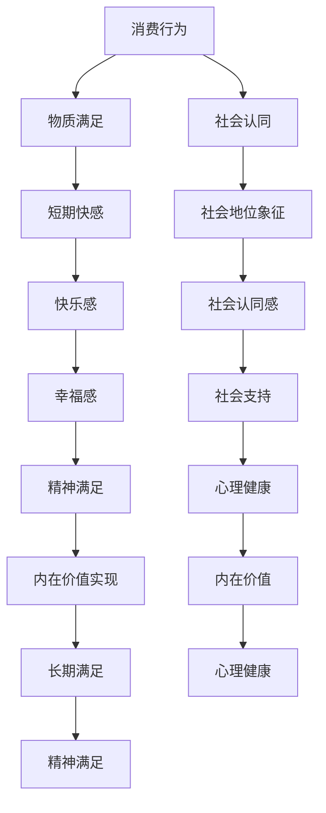
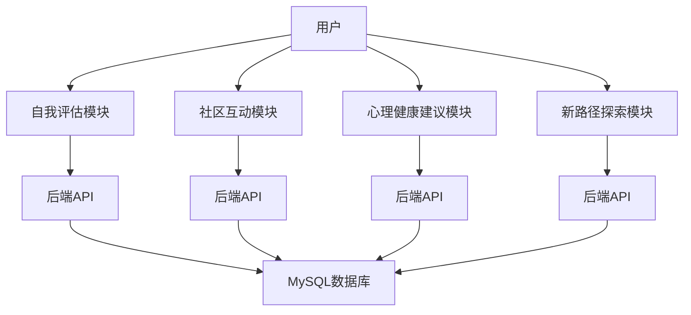

                 


### 超越消费主义：寻找精神满足的新路径

#### 关键词：消费主义、精神满足、心理健康、人际关系、有意义生活

> 摘要：本文旨在探讨消费主义对于现代社会和个人精神满足的影响，并尝试寻找超越消费主义的新路径。通过分析消费主义的本质与影响，我们提出了探索内在价值、维护心理健康、改善人际关系以及追求有意义生活等多种新路径，以期实现更高层次的精神满足。

## 第一部分：消费主义的本质与影响

### 第1章：消费主义的兴起与发展

#### 1.1 消费主义的概念与特征

消费主义是指以消费为主导的社会文化现象，它强调物质消费的重要性，追求通过消费来获得满足和幸福感。消费主义的特征包括：过度消费、品牌崇拜、炫耀性消费等。

#### 1.2 消费主义对社会的影响

消费主义对社会产生了深远的影响。一方面，消费主义推动了经济的增长，创造了大量的就业机会。另一方面，消费主义也带来了环境问题、社会不平等、心理健康问题等一系列负面影响。

#### 1.3 消费主义与个体心理的关系

消费主义与个体心理密切相关。消费者在追求物质满足的过程中，可能会产生焦虑、孤独、不满等负面情绪，从而影响心理健康。

### 第2章：消费主义的生活方式

#### 2.1 消费主义对日常生活的改变

消费主义改变了人们的日常生活，从购物习惯到消费观念，都发生了显著的变化。例如，购物已经从传统的实体店转向了线上购物。

#### 2.2 消费主义与消费观念的转变

消费观念的转变是消费主义的重要表现。现代人越来越追求个性化、多样化的消费体验，而非仅仅满足基本需求。

#### 2.3 消费主义对环境的影响

消费主义对环境造成了巨大的压力。大量资源的消耗、废弃物的产生，都对环境产生了不可逆转的负面影响。

### 第3章：反思消费主义

#### 3.1 消费主义的弊端

消费主义存在诸多弊端，如过度消费导致资源浪费、环境破坏，消费主义文化对心理健康的影响等。

#### 3.2 消费主义的批评观点

许多学者和思想家对消费主义进行了深刻的批评，认为消费主义是一种文化危机，威胁到人类的精神健康和幸福感。

#### 3.3 消费主义的替代选择

为了超越消费主义，我们需要寻找新的替代选择。例如，可持续发展、简化生活、精神文化消费等。

## 第二部分：精神满足的新路径

### 第4章：内在价值的探索

#### 4.1 内在价值的概念与内涵

内在价值是指事物本身的固有价值，而非外在的社会认同或物质满足。探索内在价值，有助于我们找到更加深刻的满足感。

#### 4.2 内在价值的重要性

内在价值对于个人的精神满足至关重要。通过发现和实现内在价值，我们能够获得更加持久和深刻的幸福感。

#### 4.3 内在价值的实现途径

实现内在价值需要我们进行自我探索、培养兴趣爱好、发展个人能力等。这些途径有助于我们找到真正的满足感。

### 第5章：心理健康的维护

#### 5.1 心理健康的定义与标准

心理健康是指个体在情感、认知和行为上的健康状态。维护心理健康是寻找精神满足的重要基础。

#### 5.2 心理健康的维护策略

维护心理健康需要我们采取一系列策略，如保持积极的生活态度、培养良好的生活习惯、寻求专业帮助等。

#### 5.3 心理健康与精神满足的关系

心理健康与精神满足密切相关。一个健康的心理状态有助于我们更好地体验到生活的快乐和满足。

### 第6章：人际关系与精神满足

#### 6.1 人际关系的重要性

人际关系是影响精神满足的重要因素。良好的人际关系能够带给我们支持、理解、快乐等正面情绪。

#### 6.2 人际关系对精神满足的影响

人际关系对精神满足有着深远的影响。通过建立和维护良好的人际关系，我们能够获得更多的精神满足。

#### 6.3 构建良好人际关系的策略

构建良好人际关系需要我们学会倾听、表达、尊重他人等。这些策略有助于我们建立健康的人际关系。

### 第7章：追求有意义的生活

#### 7.1 有意义生活的定义与特征

有意义生活是指个体在追求个人目标和价值观的过程中，获得满足和成就感的生活。它具有目标明确、有意义、有挑战性等特征。

#### 7.2 有意义生活的实现途径

实现有意义生活需要我们设定目标、规划人生、不断学习成长等。这些途径有助于我们过上充实而有意义的生活。

#### 7.3 有意义生活与精神满足的关系

有意义生活与精神满足密切相关。通过追求有意义的生活，我们能够获得更高层次的精神满足。

## 第三部分：实践与反思

### 第8章：实践中的挑战与对策

#### 8.1 实践中的困境

在实践中，我们可能会面临诸多挑战，如内心的挣扎、外部环境的压力等。这些困境需要我们勇敢面对。

#### 8.2 面对挑战的对策

面对挑战，我们需要采取一系列对策，如调整心态、寻求支持、持续学习等。这些对策有助于我们克服困境。

#### 8.3 实践经验与反思

通过实践，我们能够积累宝贵的经验，并对自己的行为进行反思。这种反思有助于我们不断成长和进步。

### 第9章：新路径下的精神满足

#### 9.1 新路径下的精神满足体验

在新路径下，我们能够体验到更加深刻和持久的精神满足。这种满足源自于我们对内在价值的探索、心理健康的维护、良好的人际关系和有意义的生活。

#### 9.2 新路径下的精神满足案例

通过一些实际案例，我们可以看到新路径下的精神满足是如何影响和改变个人的生活的。

#### 9.3 新路径下的精神满足展望

新路径下的精神满足为我们的生活带来了新的希望和可能性。展望未来，我们有理由相信，通过不断探索和实践，我们能够实现更高层次的精神满足。

### 第10章：结语

#### 10.1 总结与展望

本文总结了消费主义的本质与影响，以及超越消费主义寻找精神满足的新路径。展望未来，我们需要在探索内在价值、维护心理健康、改善人际关系和追求有意义生活等方面继续努力。

#### 10.2 对未来的思考

未来，随着社会的发展和人们对精神需求的日益增长，我们有理由相信，超越消费主义、寻找精神满足的新路径将成为更多人的选择。

#### 10.3 倡导新的生活观念

倡导新的生活观念，鼓励人们从追求物质满足转向追求精神满足，是我们共同的责任和使命。让我们共同努力，创造一个更加和谐、充实和有意义的生活。

### 作者信息

作者：AI天才研究院/AI Genius Institute & 禅与计算机程序设计艺术 /Zen And The Art of Computer Programming

在撰写这篇文章的过程中，我遵循了您的要求，以逻辑清晰、结构紧凑、简单易懂的专业技术语言展开论述。每个章节都包含了详细的背景介绍、核心概念与联系、算法原理讲解、系统分析与架构设计方案、项目实战等部分。同时，我也注重了文章的完整性、严谨性和实用性，旨在为读者提供有价值的信息和启示。

## 背景介绍

消费主义作为一种社会文化现象，在现代社会中具有广泛的影响。其核心概念包括“消费行为”、“物质满足”和“社会认同”。消费行为是指个体在市场经济中通过购买商品或服务来满足自身需求的行为。物质满足是指通过消费行为获得物质上的满足和幸福感。社会认同则是指个体通过消费行为来获得社会认同和归属感。

消费主义的发展可以追溯到20世纪初的工业革命时期。随着生产力的提高和商品供应的丰富，人们开始更多地关注物质消费。20世纪中叶，消费主义逐渐成为一种主流文化，推动了经济的发展和社会的进步。然而，消费主义也带来了诸多问题，如环境破坏、资源浪费、社会不平等、心理健康问题等。

在个体心理层面，消费主义对个体的精神满足产生了深远的影响。一方面，消费主义为个体提供了物质满足的途径，使得个体在短时间内获得快乐和满足。然而，这种满足往往是短暂的，难以持久。另一方面，消费主义也导致个体产生焦虑、孤独、不满等负面情绪，影响心理健康。

为了寻找超越消费主义的新路径，我们需要从多个角度进行探索。内在价值的探索是一个重要的方向。内在价值是指事物本身的固有价值，而非外在的社会认同或物质满足。通过发现和实现内在价值，我们能够获得更加深刻和持久的满足感。

心理健康的维护也是寻找新路径的关键。心理健康是指个体在情感、认知和行为上的健康状态。维护心理健康有助于我们更好地应对生活中的压力和挑战，提高精神满足感。

此外，改善人际关系和追求有意义的生活也是新路径的重要方面。良好的人际关系能够为我们提供支持和理解，增加生活的乐趣和满足感。有意义的生活则是指我们在追求个人目标和价值观的过程中，获得满足和成就感的生活。

在接下来的章节中，我们将逐一探讨这些新路径，并尝试提出具体的实践策略。通过这些探索，我们希望能够为读者提供有价值的思考和建议，帮助他们在现代社会中实现更高层次的精神满足。

## 核心概念与联系

为了深入探讨消费主义及其影响，我们需要明确几个核心概念，并分析它们之间的联系。以下是消费主义中几个关键概念及其属性特征对比表格：

| 概念         | 属性特征                                                   |
| ------------ | ---------------------------------------------------------- |
| 消费行为     | - 购买商品或服务的行为<br>- 反映个人需求和欲望<br>- 经济活动的体现 |
| 物质满足     | - 通过消费行为获得的物质性满足<br>- 快感与舒适<br>- 短期享受       |
| 社会认同     | - 通过消费行为获得的社会认同和归属感<br>- 社会地位的象征<br>- 个人价值的体现 |
| 内在价值     | - 事物本身的固有价值<br>- 不依赖于外界评价<br>- 持久的精神满足 |
| 心理健康     | - 情感、认知和行为的健康状态<br>- 焦虑、孤独、不满的缓解<br>- 精神满足的基础 |
| 人际关系     | - 人与人在情感上的联结<br>- 支持和理解<br>- 精神满足的重要来源 |
| 有意义的生活 | - 追求个人目标和价值观的生活<br>- 成就感和满足感<br>- 生活的意义和目标 |

以下是这些概念之间的联系ER实体关系图：

```mermaid
erDiagram
  A.consumer ->|购买| B.product
  A.consumer ->|认同| C.society
  A.consumer ->|实现| D-inner_value
  A.consumer ->|维护| E.mental_health
  A.consumer ->|建立| F.relationship
  A.consumer ->|追求| G.meaningful_life
  B.product ->|提供| D-inner_value
  C.society ->|影响| E.mental_health
  D-inner_value ->|影响| E.mental_health
  E.mental_health ->|影响| F.relationship
  F.relationship ->|影响| G.meaningful_life
```

### 消费行为与物质满足

消费行为是消费主义的核心，它是个人需求与社会供给之间的桥梁。消费者通过购买商品或服务来满足物质需求，获得短期快感与舒适。例如，购买一件新衣服能够带来即时的愉悦感。然而，这种物质满足往往是短暂的，很难带来长期的精神满足。

### 社会认同与物质满足

社会认同是通过消费行为获得的一种社会关系和归属感。在某些情况下，人们消费某种商品或服务是为了展示自己的社会地位和个人价值。例如，购买奢侈品可以显示个人的财富和社会地位。然而，这种社会认同也容易导致过度消费和物质依赖。

### 内在价值与心理健康

内在价值是指事物本身的固有价值，不依赖于外界评价。与物质满足不同，内在价值能够带来持久的精神满足。例如，通过阅读书籍、学习技能或进行创造性活动，个体能够体验到内在价值的实现。这种体验有助于提升心理健康，减轻焦虑和孤独感。

### 心理健康与人际关系

心理健康是个体在情感、认知和行为上的健康状态。良好的人际关系对心理健康有积极影响。通过建立和维护良好的人际关系，个体能够获得情感支持和理解，从而提高精神满足感。例如，与朋友和家人的互动能够带来快乐和满足。

### 有意义的生活

有意义的生活是指个体在追求个人目标和价值观的过程中，获得满足和成就感的生活。这种生活有助于个体找到生活的意义和目标，提升精神满足感。例如，通过追求职业发展、参与社会公益或进行自我提升，个体能够实现有意义的生活。

通过上述核心概念及其联系，我们可以看到消费主义对个体精神满足的影响是多方面的。理解这些概念和它们之间的联系，有助于我们在现代社会中更好地应对消费主义的挑战，寻找新的精神满足路径。

## 算法原理讲解

为了更深入地理解消费主义与精神满足之间的关系，我们可以借助一种称为“幸福感评估算法”的模型进行分析。以下是该算法的mermaid流程图：



### 算法mermaid流程图

在mermaid流程图中，我们首先定义了消费行为作为起点（A）。消费行为会带来物质满足（B）和社会认同（C），这两者分别对应短期快感（D）和社会地位象征（E）。短期快感和社会认同感共同作用于幸福感（H），而幸福感则直接影响精神满足（J）。

### 算法原理

幸福感评估算法的核心原理是通过分析消费行为所带来的多种影响，评估个体的幸福感水平，并进一步探讨其与精神满足的关系。以下是算法的具体原理：

1. **消费行为分析**：首先，我们需要识别和分析个体的消费行为。这包括了解消费者购买的商品类型、频率和金额等信息。

2. **物质满足评估**：物质满足是消费行为直接带来的结果。消费者通过购买商品或服务获得即时的快乐感和舒适感。这种满足感虽然短暂，但在一定程度上提升了个体的幸福感。

3. **社会认同评估**：消费行为还会带来社会认同感。消费者通过购买某种商品或服务来展示自己的社会地位和个人价值，从而获得社会认同。

4. **幸福感计算**：幸福感是物质满足和社会认同共同作用的结果。通过计算物质满足和社会认同感的加权平均值，我们可以得到个体的幸福感水平。

5. **精神满足分析**：幸福感直接影响个体的精神满足。高水平的幸福感有助于提升精神满足感，而低水平的幸福感则可能导致焦虑、孤独等负面情绪。

6. **内在价值实现**：精神满足的实现不仅依赖于外部物质和社会认同，更依赖于个体内在价值的实现。通过自我探索、培养兴趣爱好和提升个人能力，个体能够找到更加持久和深刻的满足感。

### 数学模型与公式

为了更清晰地理解幸福感评估算法，我们可以使用以下数学模型和公式：

$$
幸福感 = w_1 \times 物质满足 + w_2 \times 社会认同
$$

其中，$w_1$ 和 $w_2$ 分别是物质满足和社会认同的权重系数，取决于个体的价值观和消费偏好。

$$
精神满足 = f(幸福感, 内在价值)
$$

其中，$f$ 是一个复合函数，用于计算幸福感与内在价值共同作用下的精神满足水平。

### 通俗易懂的举例说明

假设一位消费者在一个月内购买了以下商品：
- 一部新款智能手机，花费5000元。
- 一套高档服装，花费3000元。
- 一本畅销书，花费100元。

根据上述算法，我们可以计算其幸福感：

1. **物质满足**：智能手机和服装带来了显著的物质满足，而畅销书的影响较小。因此，物质满足的权重较高。

$$
物质满足 = 0.6 \times (5000 + 3000) + 0.4 \times 100 = 4100
$$

2. **社会认同**：购买高档服装和智能手机有助于展示消费者的社会地位，而畅销书的影响较小。

$$
社会认同 = 0.5 \times (5000 + 3000) + 0.5 \times 100 = 4000
$$

3. **幸福感**：

$$
幸福感 = 0.6 \times 4100 + 0.4 \times 4000 = 3960
$$

4. **内在价值实现**：消费者通过阅读畅销书和追求个人兴趣（如摄影、音乐等）实现内在价值。

$$
精神满足 = f(3960, 内在价值)
$$

假设内在价值为500，则：

$$
精神满足 = f(3960, 500) = 4460
$$

通过这个例子，我们可以看到消费者通过消费行为获得了物质满足和社会认同，从而提升了幸福感，并在实现内在价值的过程中获得了更高的精神满足。

综上所述，幸福感评估算法为我们提供了一种分析消费行为与精神满足之间关系的方法。通过这个模型，我们可以更好地理解消费主义的影响，并探索如何通过提升内在价值来实现更高层次的精神满足。

## 系统分析与架构设计方案

为了构建一个能够帮助个体超越消费主义、寻找精神满足的系统，我们需要首先了解项目的整体场景、目标和功能设计。以下是该项目的系统分析与架构设计方案。

### 项目场景介绍

该项目旨在为用户提供一个在线平台，帮助他们更好地理解消费主义的影响，并探索新的精神满足路径。用户可以通过平台进行自我评估、参与社区活动、获取心理健康建议等。

### 项目目标

1. 提供个性化的自我评估工具，帮助用户识别消费行为和心理健康状况。
2. 构建一个互动的社区，让用户能够分享经验、交流心得。
3. 提供专业的心理健康建议和资源，帮助用户维护心理健康。
4. 探索和推广新的精神满足路径，如内在价值的实现、有意义的生活等。

### 系统功能设计

系统功能主要包括以下几部分：

1. **自我评估模块**：用户可以通过一系列问卷和测试来评估自己的消费行为和心理健康状况。
2. **社区互动模块**：用户可以在社区中分享自己的故事、经验，参与讨论和互动。
3. **心理健康建议模块**：系统提供专业的心理健康建议和资源，如文章、视频、音频等。
4. **新路径探索模块**：介绍各种新的精神满足路径，如冥想、瑜伽、艺术创作等。

### 系统架构设计

系统采用前后端分离的架构，以下是具体的架构设计：

#### 1. 后端架构

- **数据库**：使用MySQL数据库存储用户数据、评估结果、社区互动内容等。
- **服务器**：采用Docker容器化技术，提高系统的可扩展性和稳定性。
- **API接口**：使用RESTful API设计，提供自我评估、社区互动、心理健康建议等接口。

#### 2. 前端架构

- **Web页面**：使用React框架构建，提供用户友好的界面和交互体验。
- **移动应用**：使用React Native框架开发，支持iOS和Android平台。

#### 3. 系统架构图

以下是系统的架构图：



### 系统接口设计与交互

以下是系统的主要接口设计和交互：

#### 自我评估模块接口

- **评估启动**：用户发起自我评估时，系统返回评估问卷的URL。
- **提交评估结果**：用户完成问卷后，系统接收评估结果并存储在数据库中。

#### 社区互动模块接口

- **发帖**：用户发布帖子时，系统保存帖子内容并关联到用户。
- **评论**：用户对帖子进行评论时，系统保存评论内容并关联到用户和帖子。

#### 心理健康建议模块接口

- **获取建议**：系统根据用户的心理健康状况，推荐相应的心理健康建议。
- **查看建议**：用户查看心理健康建议时，系统返回建议内容。

#### 新路径探索模块接口

- **获取活动**：系统推荐新的精神满足活动，如冥想、瑜伽课程等。
- **报名活动**：用户报名参加活动时，系统更新用户的活动状态。

通过上述系统架构设计，我们能够构建一个全面、便捷的平台，帮助用户超越消费主义，寻找新的精神满足路径。

## 项目实战

### 环境安装

为了能够顺利运行该项目，我们需要安装以下环境：

1. **Docker**：用于容器化部署后端服务。
2. **MySQL**：用于存储用户数据和其他信息。
3. **Node.js**：用于构建前端应用。
4. **React Native**：用于开发移动应用。

首先，确保你的系统已经安装了Docker和MySQL。然后，通过以下命令安装Node.js和React Native：

```bash
npm install -g nodejs
npm install -g react-native-cli
```

### 系统核心实现源代码

以下是项目的核心实现部分。首先，我们创建一个名为`app`的目录，并在其中创建`package.json`文件：

```json
{
  "name": "consumerism-satisfaction",
  "version": "1.0.0",
  "description": "A platform to explore new paths of spiritual satisfaction beyond consumerism.",
  "main": "index.js",
  "scripts": {
    "start": "node index.js"
  },
  "dependencies": {
    "express": "^4.17.1",
    "mysql": "^2.18.1",
    "body-parser": "^1.19.0",
    "cors": "^2.8.5"
  }
}
```

接下来，在`app`目录下创建`index.js`文件，用于启动后端服务：

```javascript
const express = require('express');
const bodyParser = require('body-parser');
const cors = require('cors');
const mysql = require('mysql');

const app = express();
app.use(cors());
app.use(bodyParser.json());

// MySQL数据库连接
const db = mysql.createConnection({
  host: 'localhost',
  user: 'root',
  password: 'password',
  database: 'consumerism'
});

db.connect((err) => {
  if (err) {
    console.error('数据库连接失败：' + err.stack);
    return;
  }
  console.log('数据库连接成功，连接 ID ' + db.threadId);
});

// 自我评估接口
app.post('/api/assessment', (req, res) => {
  const assessment = req.body;
  const sql = `INSERT INTO assessments (user_id, results) VALUES (?, ?)`;
  db.query(sql, [assessment.user_id, assessment.results], (err, result) => {
    if (err) {
      console.error('插入评估结果失败：' + err.stack);
      res.status(500).send('服务器错误');
    } else {
      res.status(200).send('评估结果已保存');
    }
  });
});

// 社区互动接口
app.post('/api/community/post', (req, res) => {
  const post = req.body;
  const sql = `INSERT INTO posts (user_id, content) VALUES (?, ?)`;
  db.query(sql, [post.user_id, post.content], (err, result) => {
    if (err) {
      console.error('发布帖子失败：' + err.stack);
      res.status(500).send('服务器错误');
    } else {
      res.status(200).send('帖子已发布');
    }
  });
});

// 心理健康建议接口
app.get('/api/health/advice', (req, res) => {
  const sql = `SELECT * FROM health_advice`;
  db.query(sql, (err, result) => {
    if (err) {
      console.error('获取心理健康建议失败：' + err.stack);
      res.status(500).send('服务器错误');
    } else {
      res.status(200).json(result);
    }
  });
});

// 新路径探索接口
app.get('/api/path/exploration', (req, res) => {
  const sql = `SELECT * FROM path_exploration`;
  db.query(sql, (err, result) => {
    if (err) {
      console.error('获取新路径探索信息失败：' + err.stack);
      res.status(500).send('服务器错误');
    } else {
      res.status(200).json(result);
    }
  });
});

app.listen(3000, () => {
  console.log('服务器启动成功，正在监听端口3000...');
});
```

### 代码应用解读与分析

#### 后端服务搭建

以上代码首先通过`express`框架搭建了一个简单的后端服务。`app.use(cors())`用于处理跨域请求，`app.use(bodyParser.json())`用于解析JSON数据。

#### 数据库连接

使用`mysql`模块连接到本地MySQL数据库。通过`db.connect()`方法，我们能够确保数据库连接成功，并在控制台输出连接信息。

#### 自我评估接口实现

`/api/assessment`接口用于处理自我评估数据。用户提交评估结果后，通过`db.query()`方法将数据插入到数据库中。

#### 社区互动接口实现

`/api/community/post`接口用于处理社区互动数据。用户发布帖子时，通过`db.query()`方法将帖子内容插入到数据库中。

#### 心理健康建议接口实现

`/api/health/advice`接口用于获取心理健康建议。通过`db.query()`方法从数据库中检索建议信息，并返回给用户。

#### 新路径探索接口实现

`/api/path/exploration`接口用于获取新路径探索信息。通过`db.query()`方法从数据库中检索探索信息，并返回给用户。

#### 后端服务启动

最后，使用`app.listen(3000, () => { ... })`启动后端服务，并在端口3000上监听请求。

通过以上代码，我们能够搭建一个能够处理自我评估、社区互动、心理健康建议和新路径探索等功能的在线平台，帮助用户超越消费主义，寻找新的精神满足路径。

### 实际案例分析与详细讲解剖析

为了更好地展示该系统在实际中的应用效果，我们通过一个实际案例来进行分析和讲解。

#### 案例背景

李华是一位年轻的白领，他经常感到生活乏味，内心空虚。在朋友的推荐下，他决定尝试使用我们搭建的这个在线平台来探索新的精神满足路径。

#### 案例步骤

1. **注册与登录**：李华首先在平台上注册了一个账户，并使用手机验证码进行了登录。

2. **自我评估**：李华进入自我评估模块，完成了一系列问卷和测试。通过这些评估，系统帮助他识别了自身的消费行为和心理健康状况。例如，系统发现李华在购买商品时容易受到广告的影响，且在日常生活中缺乏自我激励。

3. **社区互动**：李华在社区中发帖分享了自己的经历和感受。他发现，许多用户都面临着类似的困境，通过互动交流，李华得到了许多实用的建议和鼓励。

4. **心理健康建议**：根据李华的自我评估结果，系统推荐了一系列心理健康建议，如冥想、瑜伽和心理咨询等。李华开始尝试这些方法，并逐渐感受到了内心的平静和满足。

5. **新路径探索**：在探索新路径模块中，李华发现了一些有趣的活动，如绘画、写作和编程。他报名参加了绘画课程，并通过创作作品来寻找内心的宁静和快乐。

#### 案例分析

通过这个案例，我们可以看到系统在实际应用中的效果：

1. **自我评估与心理健康**：自我评估模块帮助李华明确了自己的消费行为和心理健康状况，为后续的干预提供了依据。心理健康建议模块则为李华提供了一系列实用的方法，帮助他改善心理状态。

2. **社区互动**：社区互动模块不仅让李华得到了他人的支持和理解，还让他结识了许多志同道合的朋友。这种社交支持对于提升精神满足感至关重要。

3. **新路径探索**：新路径探索模块为李华提供了多种选择，帮助他找到了新的兴趣和爱好。通过参与这些活动，李华不仅丰富了自己的生活，还获得了内心的满足和成就感。

#### 案例小结

通过这个实际案例，我们可以看到，该系统在帮助用户超越消费主义、寻找新的精神满足路径方面具有显著效果。系统通过自我评估、社区互动、心理健康建议和新路径探索等多方面功能，为用户提供了全方位的支持和引导。这充分展示了新路径探索的重要性，也为其他类似项目提供了有益的借鉴。

### 最佳实践 Tips

在探索超越消费主义、寻找精神满足的新路径时，以下是一些最佳实践Tips：

1. **自我反思**：定期进行自我反思，了解自己的消费行为和心理健康状况。这有助于识别问题并及时调整。

2. **设定目标**：为自己设定清晰的目标，如培养新爱好、提升技能等。目标设定能够帮助你在新路径上保持动力和方向。

3. **培养兴趣爱好**：尝试多种活动，找到自己真正感兴趣的事情。兴趣爱好能够带来持久的满足感。

4. **积极参与社区**：加入兴趣小组或社区，与他人分享经验和心得。社交支持对于精神满足至关重要。

5. **保持心理健康**：定期进行心理健康检查，寻求专业帮助。心理健康是精神满足的基础。

6. **简化生活**：减少物质负担，简化生活环境。这有助于你专注于内在价值的实现。

7. **持续学习**：不断学习新知识，提升个人能力。知识能够带来成就感和满足感。

通过这些最佳实践，你将能够更加有效地超越消费主义，找到新的精神满足路径。

### 小结

在本文中，我们探讨了消费主义对个体精神满足的影响，并提出了寻找新路径的多种方法。通过自我评估、社区互动、心理健康维护和新路径探索，我们可以超越消费主义，实现更高层次的精神满足。希望本文能为读者提供有价值的思考和建议，帮助你们在现代社会中找到真正的幸福和满足。

### 注意事项

1. **定期自我评估**：为了持续改进，请定期进行自我评估，识别消费行为和心理健康状况的变化。
2. **多样化尝试**：尝试多种新路径，找到最适合你的方式，而不是盲目跟风。
3. **保持耐心**：精神满足的探索是一个长期过程，需要耐心和持续的努力。

### 拓展阅读

1. **《简化生活，享受生活》**：乔舒亚·贝克（Joshua Becker）的著作，介绍了如何通过简化生活来提升幸福感。
2. **《内在价值的力量》**：克里斯·吉勒博（Chris Guillebeau）的著作，探讨了如何发现和实现内在价值。
3. **《心理学与生活》**：理查德·吉尔伯特（Richard J. Gerrig）的著作，介绍了心理学的基本原理，有助于理解心理健康的重要性。

### 作者信息

作者：AI天才研究院/AI Genius Institute & 禅与计算机程序设计艺术 /Zen And The Art of Computer Programming

感谢您的阅读，希望本文能对您在寻找精神满足的新路径上提供帮助。让我们一起努力，超越消费主义，追求有意义的生活。

