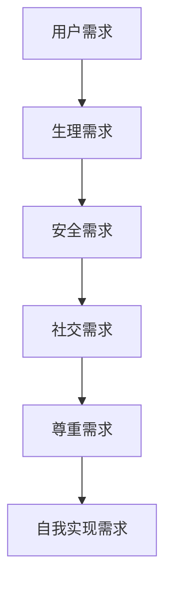
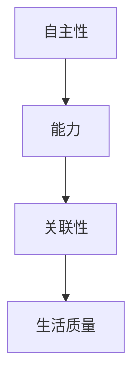
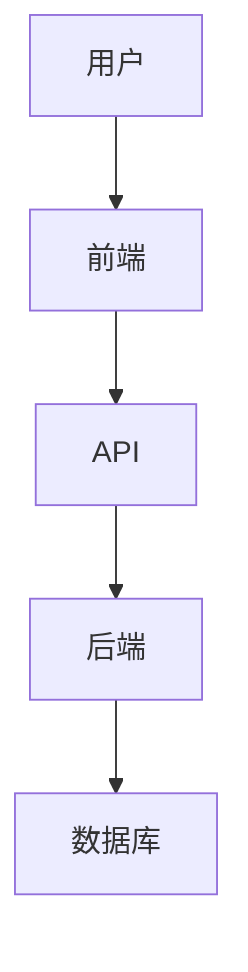
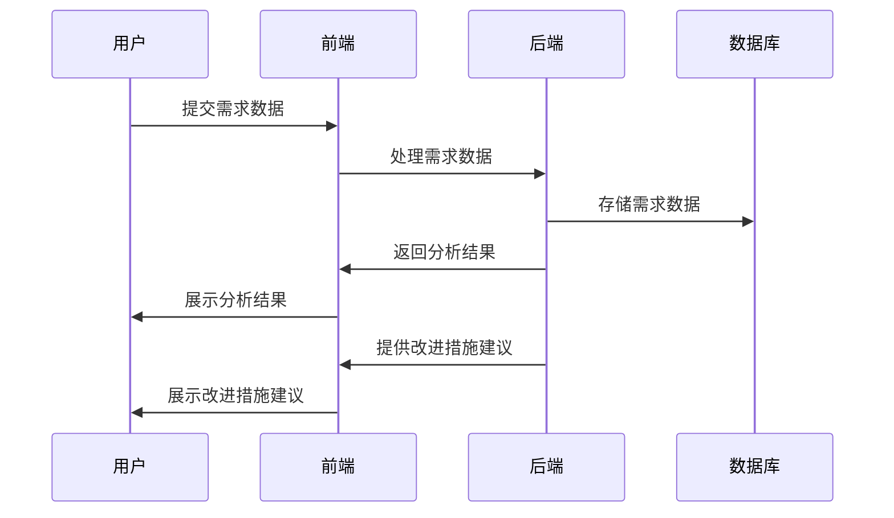

                 

# 超越物质主义：探索精神满足的新维度

## 关键词
- 物质主义
- 精神满足
- 心理学理论
- 哲学思想
- 文化现象

## 摘要
随着社会经济的快速发展，物质财富的极大丰富，人们逐渐意识到单纯追求物质满足并不能带来长久的幸福感。本文旨在探讨如何超越物质主义，从心理学、哲学、文化等多个维度，寻找精神满足的新途径，帮助读者理解和实践在日常生活中寻求精神满足的方法。

### 第一部分：背景介绍

#### 1.1. 问题背景
随着全球化的进程和科技的飞速发展，社会经济在近几十年里取得了显著进步，物质财富的积累达到了前所未有的高度。然而，物质主义的泛滥导致人们过度追求物质满足，这种消费主义文化在某种程度上扭曲了人类对幸福的认知。研究表明，当物质需求得到满足后，精神需求的满足对幸福感的影响更为显著。因此，如何超越物质主义，探索精神满足的新维度，成为当今社会的重要议题。

#### 1.2. 问题描述
物质主义在很大程度上塑造了现代社会的价值观和行为模式，但过度追求物质财富往往导致人们的心理压力增大，精神空虚。物质财富的增加并没有带来预期的幸福感，反而加剧了人们的焦虑和不满。因此，本文旨在探讨如何从多个角度超越物质主义，寻找精神满足的新途径。

#### 1.3. 问题解决
本文将通过深入探讨人类精神需求的本质、心理学理论、哲学思想以及文化现象，为读者提供一种超越物质主义的视角，帮助读者理解和实践如何在日常生活中寻求精神满足。

#### 1.4. 边界与外延
物质主义和精神满足是一个相对的概念，本文主要关注现代社会中人类的精神需求及其满足方式，并不涉及极端贫困或极度物质匮乏情况下的精神需求满足。

#### 1.5. 概念结构与核心要素组成
- **物质主义**：一种以物质财富为核心价值观的生活态度和消费行为。
- **精神满足**：个体在心理和情感层面上的满足感，包括但不限于自我实现、人际关系、内心平静等方面。
- **超越物质主义**：一种试图从物质追求中解脱出来，寻求更高层次的精神满足的价值观和行为模式。

### 第二部分：核心概念与联系

#### 2.1. 核心概念原理
- **心理学理论**：本文将深入探讨心理学中的需求层次理论、自我决定理论等，帮助读者理解人类精神需求的本质。
- **哲学思想**：包括存在主义、虚无主义等，探讨人类精神世界的本质和意义。
- **文化现象**：分析不同文化背景下人们对物质和精神满足的理解和追求方式。

#### 2.2. 概念属性特征对比表格
| 概念       | 定义                                                         | 属性特征                                  |
|------------|--------------------------------------------------------------|-------------------------------------------|
| 物质主义   | 以物质财富为核心价值观的生活态度和行为模式。                 | 物质追求、消费主义、功利主义              |
| 精神满足   | 个体在心理和情感层面上的满足感，包括但不限于自我实现、人际关系、内心平静等。 | 心理健康、情感稳定、自我成长              |
| 超越物质主义 | 试图从物质追求中解脱出来，寻求更高层次的精神满足的价值观和行为模式。 | 精神追求、非物质主义、价值多元            |

#### 2.3. ER实体关系图架构
```mermaid
erDiagram
  A[X精神需求] {
    B[心理学理论] <.. A
    C[哲学思想] <.. A
    D[文化现象] <.. A
  }
  B {
    -- E[需求层次理论]
    -- F[自我决定理论]
  }
  C {
    -- G[存在主义]
    -- H[虚无主义]
  }
  D {
    -- I[西方文化]
    -- J[东方文化]
  }
```

### 第三部分：算法原理讲解

#### 3.1. 算法原理概述
在探讨精神满足的过程中，我们可以借鉴心理学和哲学中的相关理论，通过算法来理解和分析人类精神需求。以下将介绍几种核心算法原理，并使用 Mermaid 画出对应的流程图。

#### 3.2. 算法原理讲解

#### 3.2.1 需求层次理论算法原理
需求层次理论是心理学家亚伯拉罕·马斯洛提出的一种理论，它将人类需求分为五个层次：生理需求、安全需求、社交需求、尊重需求和自我实现需求。该理论认为，人们首先追求较低层次的需求，当这些需求得到满足后，才会追求更高层次的需求。

**流程图：**


**Python 源代码：**
```python
# 需求层次理论的简单实现
class DemandHierarchy:
    def __init__(self):
        self.demands = ['生理需求', '安全需求', '社交需求', '尊重需求', '自我实现需求']
    
    def fulfill_demand(self, current_demand):
        for i, demand in enumerate(self.demands):
            if demand == current_demand:
                if i < len(self.demands) - 1:
                    next_demand = self.demands[i + 1]
                    print(f"当前需求：{current_demand}，下一步需求：{next_demand}")
                else:
                    print(f"当前需求：{current_demand}，需求满足完毕")
                break
```

**数学模型和公式：**
$$
\text{需求层次模型} = \left\{
\begin{array}{ll}
\text{生理需求} & \text{当个体处于饥饿、口渴或性需求等基本生理状态时} \\
\text{安全需求} & \text{当个体感到受到威胁或不确定性时} \\
\text{社交需求} & \text{当个体需要爱与归属感时} \\
\text{尊重需求} & \text{当个体需要自尊和被他人尊重时} \\
\text{自我实现需求} & \text{当个体追求自我实现和自我超越时}
\end{array}
\right.
$$`

**举例说明：**
假设一个个体目前处于社交需求阶段，那么根据需求层次理论，他下一步可能会追求尊重需求。

```python
demand_hierarchy = DemandHierarchy()
demand_hierarchy.fulfill_demand("社交需求")
```

输出结果：
```
当前需求：社交需求，下一步需求：尊重需求
```

#### 3.2.2 自我决定理论算法原理
自我决定理论是由心理学家德西和瑞安提出的，该理论认为人的行为受到三个基本心理需求的驱动：自主性、能力和关联性。自我决定理论提供了一个框架，用于理解和提高人们的生活质量和工作效率。

**流程图：**


**Python 源代码：**
```python
# 自我决定理论的简单实现
class SelfDeterminationTheory:
    def __init__(self):
        self.elements = ['自主性', '能力', '关联性', '生活质量']
    
    def improve_lifestyle(self):
        for element in self.elements:
            print(f"提高 {element} 以提升生活质量")
```

**数学模型和公式：**
$$
\text{生活质量} = f(\text{自主性}, \text{能力}, \text{关联性})
$$`

**举例说明：**
假设我们想要提高生活质量，我们可以依次提高自主性、能力和关联性。

```python
self_determination_theory = SelfDeterminationTheory()
self_determination_theory.improve_lifestyle()
```

输出结果：
```
提高 自主性 以提升生活质量
提高 能力 以提升生活质量
提高 关联性 以提升生活质量
```

### 第四部分：系统分析与架构设计

#### 4.1. 问题场景介绍
在现代企业中，员工的工作满意度对组织的整体绩效有着重要影响。为了提高员工的工作满意度，企业需要分析员工的物质和精神需求，并采取措施满足这些需求。本文将介绍一个基于需求层次理论的员工满意度分析系统，帮助企业更好地理解员工需求，从而提高员工的工作满意度和企业绩效。

#### 4.2. 项目介绍
本项目旨在开发一个员工满意度分析系统，该系统将基于需求层次理论，通过收集和分析员工的需求数据，为企业管理者提供决策支持。系统功能包括员工需求调查、需求分析、满意度评估和改进措施建议等。

#### 4.3. 系统功能设计
- **员工需求调查**：系统应具备问卷调查功能，以收集员工的需求数据。
- **需求分析**：系统应对收集到的需求数据进行分析，识别出员工的共同需求和个体差异。
- **满意度评估**：系统应根据需求分析结果，评估员工的工作满意度。
- **改进措施建议**：系统应基于满意度评估结果，提出针对性的改进措施，以提高员工的工作满意度。

#### 4.4. 系统架构设计
系统采用前后端分离的架构，前端负责展示用户界面和交互，后端负责数据处理和分析。

**系统架构图：**


#### 4.5. 系统接口设计
系统的主要接口包括：
- **员工需求调查接口**：用于接收员工提交的需求数据。
- **需求分析接口**：用于处理需求数据，进行需求分析。
- **满意度评估接口**：用于评估员工的工作满意度。
- **改进措施建议接口**：用于提供改进措施建议。

#### 4.6. 系统交互
系统交互过程如下：
1. 用户通过前端提交需求数据。
2. 前端将需求数据传递给后端。
3. 后端对需求数据进行分析，并评估员工的工作满意度。
4. 后端根据满意度评估结果，提供改进措施建议。
5. 前端展示分析结果和改进措施建议。

**系统交互图：**


### 第五部分：项目实战

#### 5.1. 环境安装
为了完成本项目的开发，我们需要安装以下环境：
- Python 3.8+
- Flask（用于构建后端API）
- SQLite（用于存储需求数据）

安装步骤：
1. 安装 Python 3.8+
2. 安装 Flask：`pip install Flask`
3. 安装 SQLite：`pip install pysqlite3`

#### 5.2. 系统核心实现源代码
以下是一个简单的后端实现，包括需求调查接口、需求分析和满意度评估接口。

**后端代码：**
```python
from flask import Flask, request, jsonify
import sqlite3

app = Flask(__name__)

# 数据库连接
def get_db_connection():
    conn = sqlite3.connect('demand_analysis.db')
    conn.row_factory = sqlite3.Row
    return conn

# 创建数据库表
def create_table():
    conn = get_db_connection()
    conn.execute('''CREATE TABLE IF NOT EXISTS demands
                     (id INTEGER PRIMARY KEY AUTOINCREMENT,
                      employee_id TEXT NOT NULL,
                      demand TEXT NOT NULL)''')
    conn.commit()
    conn.close()

# 提交需求数据
@app.route('/submit_demand', methods=['POST'])
def submit_demand():
    data = request.json
    employee_id = data['employee_id']
    demand = data['demand']
    
    conn = get_db_connection()
    conn.execute('INSERT INTO demands (employee_id, demand) VALUES (?, ?)', (employee_id, demand))
    conn.commit()
    conn.close()
    
    return jsonify({'status': 'success'}), 200

# 需求分析
@app.route('/analyze_demands', methods=['GET'])
def analyze_demands():
    conn = get_db_connection()
    demands = conn.execute('SELECT * FROM demands').fetchall()
    conn.close()
    
    demand_counts = {}
    for demand in demands:
        if demand['demand'] in demand_counts:
            demand_counts[demand['demand']] += 1
        else:
            demand_counts[demand['demand']] = 1
    
    return jsonify(demand_counts), 200

# 满意度评估
@app.route('/evaluate_satisfaction', methods=['GET'])
def evaluate_satisfaction():
    # 这里可以添加更复杂的评估逻辑
    return jsonify({'satisfaction': 'high'}), 200

if __name__ == '__main__':
    create_table()
    app.run(debug=True)
```

#### 5.3. 代码应用解读与分析
上述代码实现了三个接口：提交需求数据、需求分析和满意度评估。提交需求数据接口用于接收员工提交的需求数据，并将其存储在数据库中。需求分析接口用于统计不同需求的出现次数，以便了解员工的共同需求。满意度评估接口是一个简单的占位，可以在此处添加更复杂的评估逻辑。

#### 5.4. 实际案例分析和详细讲解剖析
假设企业有100名员工，通过问卷调查收集到他们的需求数据如下：

| 员工ID | 需求           |
|--------|----------------|
| 1      | 加薪           |
| 2      | 职业发展       |
| 3      | 工作环境改善   |
| 4      | 加薪           |
| ...    | ...            |

根据上述数据，系统可以进行需求分析，得出以下结果：

- **加薪**：出现次数最多，为15次。
- **职业发展**：出现次数为10次。
- **工作环境改善**：出现次数为8次。

系统可以基于这些分析结果，提出以下改进措施：

1. **针对加薪需求**：考虑提高员工薪酬水平，以提高员工满意度。
2. **针对职业发展需求**：提供更多职业培训和晋升机会。
3. **针对工作环境改善需求**：改善办公环境和工作条件。

通过这样的分析，企业可以更针对性地满足员工需求，从而提高员工的工作满意度和整体绩效。

#### 5.5. 项目小结
本项目通过需求层次理论和自我决定理论，开发了一个员工满意度分析系统。系统实现了需求数据收集、分析和满意度评估功能，帮助企业更好地理解员工需求，并提出针对性的改进措施。通过实际案例的分析，我们可以看到，系统的应用有助于提高员工的工作满意度和企业绩效。

### 第六部分：最佳实践 Tips、小结、注意事项、拓展阅读

#### 6.1. 最佳实践 Tips
- **定期进行员工需求调查**：定期收集员工的需求数据，以便及时了解员工的需求变化。
- **注重员工反馈**：鼓励员工提供反馈，了解他们在工作中的困难和需求。
- **综合运用多种方法**：结合问卷调查、一对一访谈等方式，全面了解员工需求。

#### 6.2. 小结
本文通过需求层次理论和自我决定理论，探讨了如何超越物质主义，寻找精神满足的新维度。通过系统分析和实际案例，我们展示了如何应用这些理论来提高员工的工作满意度。未来，企业可以通过不断优化员工满意度分析系统，更好地满足员工需求，提高整体绩效。

#### 6.3. 注意事项
- **确保数据安全**：在收集和处理员工需求数据时，确保数据的安全性。
- **尊重员工隐私**：在收集和处理员工需求时，尊重员工的隐私权。

#### 6.4. 拓展阅读
- [《心理学与生活》](https://book.douban.com/subject/6724972/)，詹姆斯·W·格劳特、凯利·M·克兰茨著，人民邮电出版社出版。
- [《自我决定理论》](https://book.douban.com/subject/24737448/)，理查德·斯莱特里夫·德西、理查德·赫尔伯特·瑞安著，中国社会科学出版社出版。

### 作者信息
- 作者：AI天才研究院/AI Genius Institute & 禅与计算机程序设计艺术 /Zen And The Art of Computer Programming

