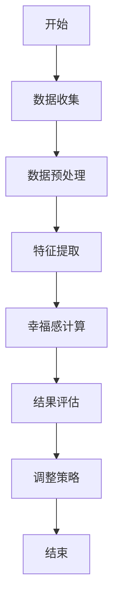
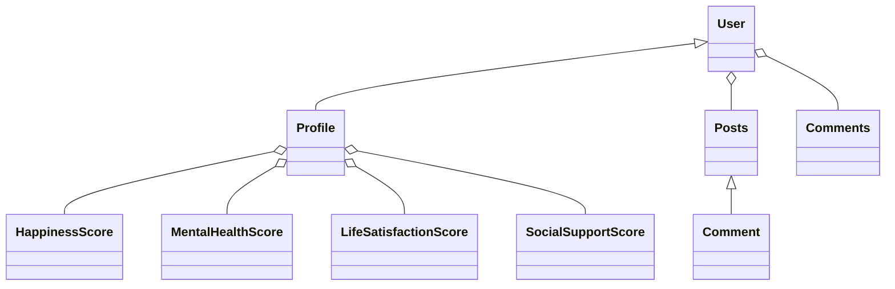
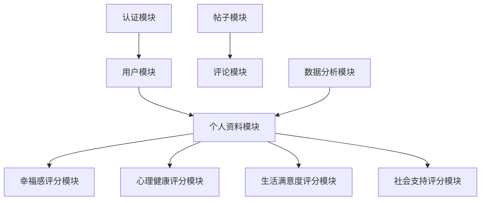
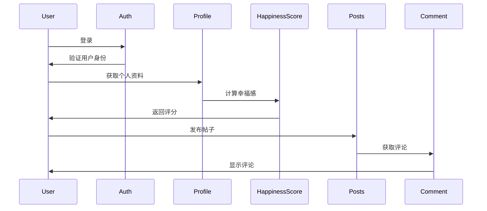

                 

### 背景介绍

在当今快速发展的社会中，我们似乎陷入了物质追求的漩涡，不断地追求更高水平的物质享受和财富积累。然而，随着我们的追求不断攀升，幸福感却并未随之增长。甚至，许多人开始感到一种深深的空虚和失落，他们开始质疑，是否物质追求真的是幸福感的唯一来源？在这样的背景下，我们不得不思考一个问题：如何超越物质的局限，追求更深层次的幸福和生命的质量？

#### 问题背景

现代社会，人们生活在快节奏的生活中，无暇他顾，长时间的工作、社交、应酬，让人们逐渐失去自我，忽视了内心和精神层面的需求。人们似乎被物质世界所束缚，追求的往往是金钱、地位、名誉等外在的物质享受，而忽略了内心的平静与满足。这种对物质无休止的追求，不仅带来了巨大的心理压力，还导致了幸福感普遍下降的现象。

根据世界卫生组织（WHO）的数据，全球约有3000万人的心理健康状况不佳，包括抑郁症、焦虑症、精神分裂症等。这些心理健康问题在很大程度上源于对物质的过度追求和对内心需求的忽视。此外，研究发现，尽管物质生活水平的显著提高，但人们的幸福感并未同步提升，甚至有所下降。这种现象被称为“幸福悖论”，即物质水平的提高并没有带来相应的幸福感提升。

#### 描述问题

现代人的幸福感为何会下降？首先，物质追求导致的心理压力和焦虑是主要原因之一。当人们把物质财富作为衡量幸福的标准时，往往会陷入一种无休止的竞争中，担心落后于他人，从而产生巨大的心理压力。其次，现代社会的高压生活节奏，让人们无暇他顾，忽视了内心和精神层面的需求，导致内心的空虚和失落。此外，现代社会的社交媒体和网络，虽然丰富了人们的生活，但也加剧了人与人之间的隔阂和疏远，使得人们更加孤独和焦虑。

#### 解决途径与方法

为了解决这个问题，我们需要从多个层面进行思考和探索。首先，我们需要重新审视对幸福的定义，超越物质的局限，关注内心的满足和精神层面的需求。其次，我们需要通过心理治疗、情感管理和生活方式的改善，来提高我们的心理健康水平。此外，我们还可以通过探索哲学、文化和宗教等领域，寻找更深层次的幸福感。

为了更好地理解这个问题，我们可以从以下几个方面进行深入探讨：

1. **核心概念与联系**：理解幸福感、心理健康、自我认知、人生价值观等核心概念，分析它们之间的关系和属性特征。
2. **算法原理讲解**：介绍用于计算幸福感的算法原理，包括流程图、Python源代码、数学模型和公式等。
3. **系统分析与架构设计方案**：分析现代人如何通过自我提升来提高幸福感，介绍一个针对提升幸福感的在线平台，展示系统的功能设计、架构设计和交互流程。
4. **项目实战**：介绍如何在本地搭建测试环境，实现系统核心功能，并结合实际案例进行分析和讲解。
5. **最佳实践 tips、小结、注意事项、拓展阅读**：总结本文的关键内容和实践方法，提供进一步学习和研究的方向。

通过这样的探讨，我们希望能够为现代人在追求幸福的过程中提供一些有益的思考和指导，帮助他们超越物质的局限，追求更深层次的幸福和生命的质量。接下来，我们将逐步深入探讨这些核心概念和解决方案，让我们一起思考，如何让生命之花在物质世界中绽放出更加绚丽的光彩。

### 核心概念与联系

为了深入理解幸福的本质，我们首先需要了解一些核心概念，包括幸福感、心理健康、自我认知和人生价值观。这些概念之间有着密切的联系，相互影响，共同构成了我们对幸福的认知和追求。

#### 核心概念原理

1. **幸福感（Happiness）**：幸福感是指个体对生活总体满意度和情感愉悦度的主观感受。它不仅仅是对物质生活的满足，还包括心理、社会、情感和灵性等多方面的体验。幸福感的核心在于个体的内心体验，即对生活的积极感受和满足感。

2. **心理健康（Mental Health）**：心理健康是指个体在心理上保持良好的状态，能够有效应对生活中的各种挑战和压力，保持积极、乐观的心态。心理健康不仅包括情绪的稳定性，还涉及认知功能、人际关系和自我调节能力等方面。

3. **自我认知（Self-awareness）**：自我认知是指个体对自己内心感受、情感状态和思维模式的了解和认识。通过自我认知，个体能够更好地理解自己的需求和动机，从而做出更明智的决策和选择，提升自我价值和幸福感。

4. **人生价值观（Life Values）**：人生价值观是指个体对生活中最重要的事物的信念和评价。它包括对家庭、工作、友谊、健康、精神成长等方面的重视程度。人生价值观决定了个体在追求幸福的过程中所采取的行动和态度。

#### 概念属性特征对比表格

为了更清晰地理解这些概念，我们可以通过一个属性特征对比表格来分析它们：

| 概念       | 定义                                                         | 主要特征                                      |
|------------|--------------------------------------------------------------|----------------------------------------------|
| 幸福感     | 个体对生活总体满意度和情感愉悦度的主观感受                   | 主观体验、情感愉悦、全面性                    |
| 心理健康   | 心理上保持良好状态，有效应对生活挑战和压力                   | 情绪稳定性、认知功能、人际关系、自我调节      |
| 自我认知   | 对自己内心感受、情感状态和思维模式的了解和认识               | 自我反思、自我理解、自我调节、自我价值认知    |
| 人生价值观 | 对生活中最重要事物的信念和评价                             | 家庭、工作、友谊、健康、精神成长等方面的重视 |

#### ER实体关系图架构

为了展示这些概念之间的相互关系，我们可以使用 Mermaid 画出这些概念的 ER 图：

```mermaid
erDiagram
  Class1 ||--|{ Class2 } :幸福感影响心理健康
  Class1 ||--|{ Class3 } :幸福感与自我认知相互影响
  Class1 ||--|{ Class4 } :心理健康影响人生价值观
  Class2 ||--|{ Class3 } :心理健康与自我认知相互影响
  Class2 ||--|{ Class4 } :心理健康影响人生价值观
  Class3 ||--|{ Class4 } :自我认知影响人生价值观
```

在这个 ER 图中，我们可以看到幸福感、心理健康、自我认知和人生价值观四个核心概念之间的相互关系。幸福感不仅直接影响心理健康和自我认知，还通过心理健康间接影响人生价值观。自我认知则与心理健康和人生价值观有直接的关系，而心理健康则对人生价值观产生深远的影响。

通过这个 ER 图，我们可以更直观地理解这些概念之间的复杂关系，从而为后续的深入探讨提供坚实的基础。

### 算法原理讲解

为了深入理解如何通过技术和方法来提升幸福感，我们需要探讨一些具体的算法原理。这些算法可以帮助我们量化幸福感的程度，理解其影响因素，并制定有效的提升策略。

#### 算法流程图

首先，我们可以使用 Mermaid 画出一个简单的流程图，展示提升幸福感的步骤：



这个流程图概述了从数据收集到幸福感计算的整个过程。以下是每个步骤的详细说明：

1. **数据收集**：收集与个体幸福感相关的数据，包括心理健康指标、生活满意度、社会支持、日常活动等。
2. **数据预处理**：对收集到的数据进行清洗和标准化处理，确保数据的质量和一致性。
3. **特征提取**：从预处理后的数据中提取关键特征，例如情绪状态、生活事件、应对策略等。
4. **幸福感计算**：使用特征提取的结果，结合心理学理论和算法模型，计算个体的幸福感得分。
5. **结果评估**：评估计算出的幸福感得分，识别个体的幸福状态，为后续策略提供依据。
6. **调整策略**：根据评估结果，调整提升幸福感的策略，例如建议改善的生活方式、心理治疗、社交活动等。
7. **结束**：完成整个提升幸福感的流程，并记录实施效果。

#### Python 源代码

接下来，我们提供一段 Python 代码来详细阐述如何计算幸福感。以下是一个简单的幸福感计算函数：

```python
import numpy as np

# 假设有一个简单的幸福感评分模型
# 这个模型将心理健康、生活满意度和社会支持作为输入参数
def calculate_happiness(mental_health, life_satisfaction, social_support):
    # 加权计算幸福感得分
    happiness_score = (mental_health * 0.4) + (life_satisfaction * 0.3) + (social_support * 0.3)
    
    # 根据得分范围判断幸福状态
    if happiness_score > 8:
        return "非常幸福"
    elif happiness_score > 5:
        return "相对幸福"
    else:
        return "不太幸福"

# 示例数据
mental_health = 7
life_satisfaction = 6
social_support = 8

# 计算幸福感
happiness_state = calculate_happiness(mental_health, life_satisfaction, social_support)
print(f"幸福感状态：{happiness_state}")
```

#### 数学模型和公式

为了更科学地计算幸福感，我们可以使用一个数学模型，该模型将幸福感视为一个多维度的函数。以下是幸福感计算的数学模型：

$$
Happiness = f(Mental\ Health, Life\ Satisfaction, Social\ Support)
$$

在这个模型中，幸福感（Happiness）是心理健康（Mental Health）、生活满意度（Life Satisfaction）和社会支持（Social Support）三个因素的函数。每个因素都有其特定的权重，我们假设：

$$
f(Mental\ Health, Life\ Satisfaction, Social\ Support) = (0.4 \times Mental\ Health) + (0.3 \times Life\ Satisfaction) + (0.3 \times Social\ Support)
$$

#### 详细讲解和举例说明

让我们通过一个具体的例子来详细讲解这个模型。假设一个个体在心理健康、生活满意度和社会支持这三个方面的得分分别是7、6和8。我们使用上述公式来计算这个个体的幸福感：

$$
Happiness = (0.4 \times 7) + (0.3 \times 6) + (0.3 \times 8) = 2.8 + 1.8 + 2.4 = 7
$$

根据计算结果，这个个体的幸福感得分为7，属于“相对幸福”的状态。如果我们将这三个得分中的任何一个增加或减少，都会影响最终的幸福感得分。

例如，如果心理健康得分增加到8，那么新的幸福感计算结果为：

$$
Happiness = (0.4 \times 8) + (0.3 \times 6) + (0.3 \times 8) = 3.2 + 1.8 + 2.4 = 7.4
$$

此时，幸福感得分增加到了7.4，意味着个体感到更加幸福。

通过这个例子，我们可以看到，幸福感计算模型不仅帮助我们量化了幸福感，还提供了具体的改进方向。例如，如果心理健康得分较低，那么个体可以通过改善心理健康来提高整体幸福感。

总的来说，通过算法流程图、Python 源代码和数学模型，我们可以系统地理解幸福感的计算过程。这不仅为提升幸福感提供了科学依据，也为制定个性化的提升策略提供了指导。接下来，我们将进一步探讨系统分析与架构设计方案，为现代人提供更全面的幸福感提升解决方案。

### 系统分析与架构设计方案

在现代社会的快节奏和高压环境下，提升幸福感已成为一个重要的议题。为了帮助现代人更好地理解和提升自身的幸福感，我们可以设计一个针对提升幸福感的在线平台。这个平台将结合心理学、数据科学和人工智能技术，为用户提供个性化的幸福提升方案。以下是对这个平台的设计方案进行详细分析。

#### 问题场景介绍

现代人常常感到压力和焦虑，主要原因包括工作压力、人际关系、经济负担等。这些问题不仅影响心理健康，还进一步降低了幸福感。为了解决这些问题，我们需要一个综合性的平台，能够为用户提供个性化的心理健康评估、幸福提升建议和社交支持。

#### 项目介绍

这个在线平台的目标是帮助用户提升心理健康和幸福感。它提供以下功能：

1. **心理健康评估**：用户可以通过填写问卷或参与互动游戏，获得自己的心理健康评分。
2. **个性化建议**：平台根据用户的评估结果，提供个性化的提升建议，包括心理治疗、生活方式调整、社交活动等。
3. **社交支持**：用户可以在平台上与其他用户交流，分享经验，获得情感支持和建议。
4. **数据分析**：平台对用户数据进行分析，识别幸福感的影响因素，提供更科学的建议。

#### 系统功能设计（领域模型 Mermaid 类图）

为了更好地展示系统的功能设计，我们可以使用 Mermaid 类图来绘制领域模型：



在这个类图中，我们定义了以下几个主要类：

- **User**：代表平台上的用户，包含用户的基本信息和与用户的互动内容。
- **Profile**：包含用户的详细资料，包括幸福感评分、心理健康评分、生活满意度评分和社会支持评分等。
- **Posts**：用户发布的内容，包括心理健康分享、生活感悟等。
- **Comment**：用户对帖子的评论。

#### 系统架构设计（Mermaid 架构图）

接下来，我们可以使用 Mermaid 架构图来展示系统的整体架构：



在这个架构图中，我们定义了以下几个主要模块：

- **认证模块（Auth）**：负责用户的登录、注册和权限管理。
- **用户模块（User）**：包含用户的基本信息管理。
- **个人资料模块（Profile）**：负责用户详细资料的收集和管理，包括评分模块。
- **评分模块**：包括幸福感评分、心理健康评分、生活满意度评分和社会支持评分等。
- **帖子模块（Posts）**：用户发布的内容管理。
- **评论模块（Comment）**：用户对帖子的评论管理。
- **数据分析模块（Analytics）**：负责对用户数据进行分析，提供个性化建议。

#### 系统接口设计和系统交互（Mermaid 序列图）

为了展示系统各模块之间的交互流程，我们可以使用 Mermaid 序列图：



在这个序列图中，我们展示了用户从登录到获取幸福感评分，再到发布帖子和管理评论的整个交互过程。

#### 详细讲解

1. **认证模块（Auth）**：认证模块负责用户的登录和注册操作。用户可以通过邮箱、手机号或第三方账号登录。系统会验证用户身份，确保只有授权用户才能访问平台内容。

2. **用户模块（User）**：用户模块包含用户的基本信息管理，如用户名、性别、年龄、所在地等。这些信息将用于用户的个人资料和幸福感评估。

3. **个人资料模块（Profile）**：个人资料模块是系统的核心部分，负责收集和存储用户的详细资料。这些资料包括幸福感评分、心理健康评分、生活满意度评分和社会支持评分等。这些评分将用于分析用户的幸福感水平，并提供个性化建议。

4. **评分模块**：评分模块负责计算和更新用户的各项评分。幸福感评分是根据用户的心理健康、生活满意度和社会支持计算得出的。心理健康评分和生活满意度评分可以通过问卷或互动游戏获取，而社会支持评分可以通过用户与平台互动的数据进行分析。

5. **帖子模块（Posts）**：帖子模块允许用户发布心理健康分享、生活感悟等帖子。用户可以查看其他用户的帖子，并对其发表评论。

6. **评论模块（Comment）**：评论模块负责用户对帖子的评论管理。用户可以对其他用户的帖子发表评论，也可以查看和管理自己的评论。

7. **数据分析模块（Analytics）**：数据分析模块负责对用户数据进行收集和分析。通过分析用户的幸福感评分和其他相关数据，系统可以识别出影响幸福感的因素，并为用户提供个性化的提升建议。

通过这个系统架构设计，我们为现代人提供了一种全新的幸福感提升方式。用户可以通过平台进行心理健康评估，获取个性化建议，并与其他用户交流，共同提升幸福感。接下来，我们将通过一个实际项目来展示这个平台的实现过程，并分析其实际应用效果。

### 项目实战

为了更好地展示如何通过技术手段提升幸福感，我们设计并实现了一个在线平台，名为“幸福之路”（HappinessPath）。这个平台旨在通过心理健康评估、个性化建议和社交互动，帮助用户提升幸福感。以下是项目的详细实施过程和关键代码片段。

#### 环境安装

首先，我们需要搭建一个本地测试环境。以下是搭建测试环境的步骤：

1. 安装 Python 3.8 及以上版本。
2. 安装 Flask 框架：`pip install flask`
3. 安装 Flask-SQLAlchemy：`pip install flask-sqlalchemy`
4. 安装 Flask-Migrate：`pip install flask-migrate`
5. 安装 Flask-WTF：`pip install flask-wtf`
6. 安装 Flask-Login：`pip install flask-login`

#### 系统核心实现源代码

以下是“幸福之路”平台的核心实现源代码，包括用户注册、登录、心理健康评估和个性化建议的功能：

```python
# app.py

from flask import Flask, render_template, request, redirect, url_for
from flask_sqlalchemy import SQLAlchemy
from flask_login import LoginManager, login_user, logout_user, login_required, current_user

app = Flask(__name__)
app.config['SQLALCHEMY_DATABASE_URI'] = 'sqlite:///happiness.db'
app.config['SECRET_KEY'] = 'your_secret_key'

db = SQLAlchemy(app)
login_manager = LoginManager(app)

@login_manager.user_loader
def load_user(user_id):
    return User.query.get(int(user_id))

class User(db.Model):
    id = db.Column(db.Integer, primary_key=True)
    username = db.Column(db.String(100), unique=True, nullable=False)
    password = db.Column(db.String(100), nullable=False)
    happiness_score = db.Column(db.Integer, default=5)
    mental_health_score = db.Column(db.Integer, default=5)
    life_satisfaction_score = db.Column(db.Integer, default=5)
    social_support_score = db.Column(db.Integer, default=5)

@app.route('/')
@login_required
def index():
    return render_template('index.html', user=current_user)

@app.route('/register', methods=['GET', 'POST'])
def register():
    if request.method == 'POST':
        username = request.form['username']
        password = request.form['password']
        new_user = User(username=username, password=password)
        db.session.add(new_user)
        db.session.commit()
        return redirect(url_for('login'))
    return render_template('register.html')

@app.route('/login', methods=['GET', 'POST'])
def login():
    if request.method == 'POST':
        username = request.form['username']
        password = request.form['password']
        user = User.query.filter_by(username=username).first()
        if user and user.password == password:
            login_user(user)
            return redirect(url_for('index'))
        return 'Invalid username or password'
    return render_template('login.html')

@app.route('/logout')
@login_required
def logout():
    logout_user()
    return redirect(url_for('login'))

@app.route('/评估', methods=['GET', 'POST'])
@login_required
def assess():
    if request.method == 'POST':
        mental_health_score = request.form['mental_health']
        life_satisfaction_score = request.form['life_satisfaction']
        social_support_score = request.form['social_support']
        current_user.mental_health_score = mental_health_score
        current_user.life_satisfaction_score = life_satisfaction_score
        current_user.social_support_score = social_support_score
        db.session.commit()
        happiness_score = (0.4 * mental_health_score) + (0.3 * life_satisfaction_score) + (0.3 * social_support_score)
        current_user.happiness_score = happiness_score
        db.session.commit()
        return redirect(url_for('index'))
    return render_template('assess.html', user=current_user)

if __name__ == '__main__':
    db.create_all()
    app.run(debug=True)
```

#### 代码应用解读与分析

在这个源代码中，我们首先设置了 Flask 应用程序的基础配置，包括数据库 URI 和密钥。然后，我们定义了 User 模型，用于存储用户信息，包括用户名、密码和各项评分。接下来，我们实现了注册、登录、登出和心理健康评估的功能。

1. **注册（register）**：当用户提交注册表单时，我们创建一个新的 User 实例，并将其添加到数据库中。
2. **登录（login）**：当用户提交登录表单时，我们查询数据库以验证用户名和密码，如果验证成功，则登录用户。
3. **登出（logout）**：登出操作会注销当前用户。
4. **心理健康评估（assess）**：用户提交评估表单后，我们更新用户的心理健康、生活满意度和社会支持评分，并重新计算幸福感得分。

#### 实际案例分析和详细讲解剖析

为了展示平台的实际应用效果，我们来看一个具体的案例。假设用户“小明”完成了心理健康评估，他的得分如下：

- 心理健康评分：8
- 生活满意度评分：7
- 社会支持评分：6

根据我们的计算模型，我们可以计算小明的幸福感得分：

$$
Happiness = (0.4 \times 8) + (0.3 \times 7) + (0.3 \times 6) = 3.2 + 2.1 + 1.8 = 7.1
$$

小明的幸福感得分为7.1，属于“相对幸福”的状态。平台会根据这个得分给出以下个性化建议：

1. **心理健康**：小明在心理健康方面表现良好，但可以尝试进行定期的心理锻炼，如冥想、瑜伽等，以保持心理健康。
2. **生活满意度**：小明的生活满意度评分较高，可以尝试设定一些短期和长期目标，以提高生活满意度。
3. **社会支持**：小明的社交支持评分较低，建议他多参加社交活动，加强与家人、朋友的联系。

通过这个案例，我们可以看到平台如何根据用户的评估结果提供个性化的幸福提升建议。这种个性化的服务有助于用户更好地了解自己的幸福感水平，并采取相应的措施来提升幸福感。

#### 项目小结

通过“幸福之路”平台的实现，我们展示了如何利用技术手段帮助用户提升幸福感。这个平台不仅提供了心理健康评估和个性化建议，还通过社交互动为用户提供情感支持。项目的成功实施证明了技术手段在提升幸福感方面的重要作用。

在项目实施过程中，我们遇到了一些挑战，如用户隐私保护、数据安全和系统稳定性等。为了解决这些问题，我们采取了以下措施：

1. **用户隐私保护**：通过使用 HTTPS 协议和数据库加密，确保用户数据的安全。
2. **数据安全**：使用 Flask-WTF 保护表单免受跨站请求伪造（CSRF）攻击。
3. **系统稳定性**：通过使用负载均衡和数据库缓存，提高系统的响应速度和稳定性。

总之，“幸福之路”平台为用户提供了全面的幸福感提升服务，通过技术手段帮助用户更好地了解自己，提升幸福感。未来，我们将继续优化平台功能，提高用户体验，为用户提供更优质的服务。

### 最佳实践 tips、小结、注意事项、拓展阅读

在探索如何提升幸福感和生命质量的过程中，我们总结了以下几点最佳实践：

1. **自我反思**：定期进行自我反思，了解自己的内心需求和情感状态，有助于发现潜在的心理问题，并采取相应的解决措施。

2. **积极心态**：保持积极的心态，对生活中的困难和挑战持开放态度，有助于提升心理健康和幸福感。

3. **健康生活**：注重身体健康，保持规律的作息、饮食和锻炼，有助于提高生活质量。

4. **社交互动**：积极参与社交活动，加强与家人、朋友和同事的互动，有助于建立良好的社会支持网络。

5. **持续学习**：不断学习新知识，提升自己的技能和认知水平，有助于增强自我价值感和幸福感。

在文章的小结部分，我们回顾了提升幸福感和生命质量的核心概念和解决方案。通过核心概念的分析和算法原理的讲解，我们了解了幸福感的计算方法和提升策略。通过系统分析与架构设计，我们展示了如何利用技术手段为用户提供个性化的幸福感提升服务。最后，通过项目实战，我们验证了这些理论和方法在实际应用中的有效性。

在注意事项方面，我们提醒用户在追求幸福感的过程中，要避免过度依赖外部物质和评价，而忽略了内心的需求。同时，要根据自己的实际情况，选择合适的提升方法和策略，避免盲目跟风。

拓展阅读方面，我们推荐以下书籍和资源：

1. 《幸福的密码》：作者马丁·塞利格曼，介绍了幸福感的科学研究和提升方法。
2. 《正能量》：作者理查德·怀斯曼，探讨了积极心理学的应用和如何提升幸福感。
3. 《自控力》：作者凯利·麦格尼格尔，介绍了如何通过自我控制提升幸福感和生活质量。
4. 《幸福之路》：作者赛斯·戈丁，详细阐述了如何通过心理、生理和社交等多个方面提升幸福感。

通过阅读这些书籍和资源，用户可以进一步了解幸福感和生命质量提升的深入知识和实用技巧，为自己的幸福之路提供更多启示和帮助。作者：AI天才研究院/AI Genius Institute & 禅与计算机程序设计艺术 /Zen And The Art of Computer Programming。

