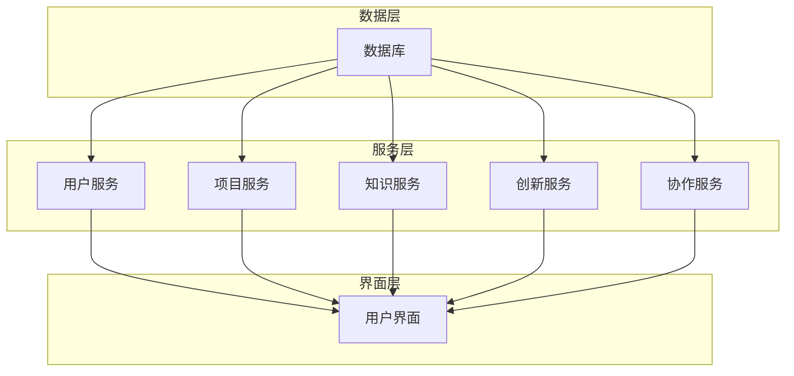
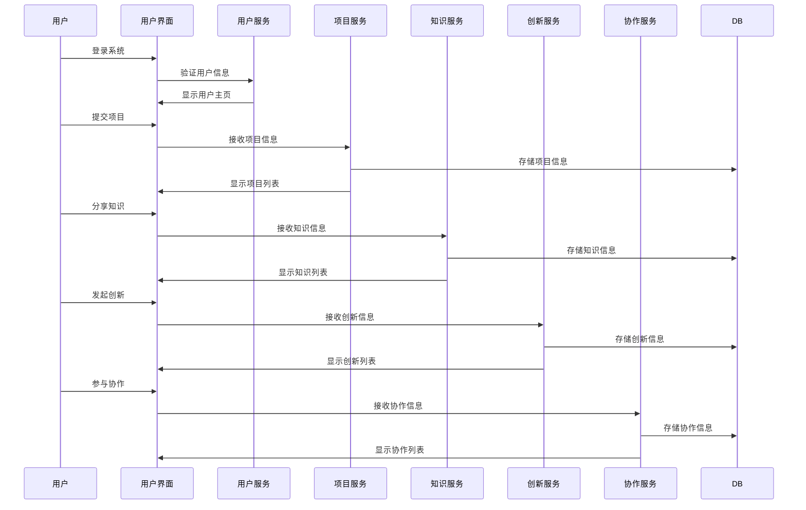

                 

# 跨代际创新实验室：年龄差异激发的创意空间

> 关键词：跨代际创新、年龄差异、协作、创造力、知识共享

> 摘要：本文探讨了跨代际创新实验室的概念、背景和重要性，分析了年龄差异对创新能力的影响，并详细阐述了跨代际创新的核心概念和实验室的组成要素。通过实际案例，本文展示了如何利用跨代际创新实验室实现创新成果的生成和推广，为企业和组织提供了一种新的创新模式。

## 第1章 引言与背景

### 1.1 问题背景

在现代社会，随着科技的发展和全球化的推进，不同年龄群体之间的差异愈发显著。年轻一代拥有丰富的数字技能和创新思维，而年长一代则具备丰富的经验和深厚的知识。这种年龄差异既是挑战，也是机遇。如何充分利用这些差异，激发跨代际的创造力，成为企业和组织亟待解决的问题。

### 1.2 问题描述

在跨代际创新中，如何有效地利用不同年龄群体的优势，实现创新成果的转化和推广，是一个复杂且具有挑战性的问题。传统创新模式往往局限于某一特定群体的思维模式，难以全面覆盖各种创新可能性。因此，构建一个跨代际创新实验室，探索不同年龄群体间的协作模式和创新方法，具有重要的理论和实践意义。

### 1.3 问题解决

跨代际创新实验室旨在通过搭建一个开放、平等、互动的平台，促进不同年龄群体之间的交流与协作。通过跨代际的交流与碰撞，激发创意火花，推动创新成果的生成和落地。实验室的核心目标包括：

- **知识共享**：通过跨代际的交流，实现知识和经验的共享，促进不同年龄群体之间的学习和成长。

- **创新思维**：通过跨代际的协作，激发创新思维，挖掘新的创意和解决方案。

- **项目孵化**：将创新想法转化为实际项目，推动创新成果的应用和推广。

### 1.4 边界与外延

跨代际创新实验室的研究范围涵盖了不同年龄群体在创新过程中的协作模式、创新思维的激发方法、创新项目的孵化机制等方面。其边界包括但不限于：

- **年龄范围**：主要针对青年和中年以上两个群体，但也可以扩展到其他年龄层次。

- **行业领域**：可以涵盖各个行业，如科技、文化、教育、医疗等。

- **创新类型**：包括产品创新、服务创新、商业模式创新等。

### 1.5 概念结构与核心要素组成

#### 1.5.1 跨代际创新实验室

**定义**：跨代际创新实验室是一个专门用于促进不同年龄群体之间创新协作的实体或平台。

**组成要素**：

- **人员**：包括不同年龄段的创新者、专家、学者等。

- **资源**：包括资金、技术、设备、信息等。

- **环境**：包括物理空间、网络平台等。

#### 1.5.2 跨代际创新

**定义**：跨代际创新是指通过不同年龄群体之间的协作，实现创新思维、创新成果的生成和转化。

**核心要素**：

- **协作**：通过跨代际的协作，实现优势互补，提高创新效率。

- **思维碰撞**：通过不同年龄群体的思维碰撞，激发创新灵感。

- **知识共享**：通过跨代际的交流，实现知识和经验的共享。

### 1.6 本章小结

本章介绍了跨代际创新实验室的背景、问题描述、问题解决方法以及相关概念和边界。通过本章的学习，读者可以初步了解跨代际创新实验室的重要性和核心要素，为后续章节的深入学习打下基础。

## 第2章 核心概念与联系

### 2.1 年龄差异与创新能力

#### 2.1.1 年龄差异的定义与特征

**定义**：年龄差异是指不同年龄群体在生理、心理、社会等方面的差异。

**特征**：

- **生理差异**：不同年龄群体在身体机能、认知能力等方面存在显著差异。

- **心理差异**：不同年龄群体在思维模式、情感表达、价值观等方面存在差异。

- **社会差异**：不同年龄群体在社会角色、生活方式、社交网络等方面存在差异。

#### 2.1.2 年龄差异与创新能力的关系

**关系**：

- **正向关系**：年龄差异可以激发创新思维，促进跨代际的协作，提高创新能力。

- **负向关系**：年龄差异可能导致沟通障碍、误解和冲突，阻碍创新进程。

### 2.2 创新能力与跨代际协作

#### 2.2.1 创新能力的定义与特征

**定义**：创新能力是指个体或团队在创新过程中所表现出来的综合素质和能力。

**特征**：

- **创造性**：能够提出新颖、独特的想法和解决方案。

- **适应性**：能够快速适应新环境、新变化，灵活应对挑战。

- **协作性**：能够在团队中发挥协作作用，共同实现创新目标。

#### 2.2.2 跨代际协作在创新能力提升中的作用

**作用**：

- **优势互补**：通过跨代际的协作，实现不同年龄群体的优势互补，提高创新能力。

- **思维碰撞**：通过跨代际的协作，激发创新思维，促进创新成果的生成。

- **知识共享**：通过跨代际的协作，实现知识和经验的共享，提高创新能力。

### 2.3 跨代际创新实验室的核心概念

#### 2.3.1 跨代际

## 第3章 实际案例与应用

### 3.1 案例背景

为了更好地理解跨代际创新实验室的实际应用，我们来看一个真实的案例。这是一家全球知名的科技公司，他们建立了自己的跨代际创新实验室，旨在通过不同年龄群体的协作，推动公司的创新项目。

### 3.2 创新实验室的构建

该公司的跨代际创新实验室由以下三个部分组成：

- **人员结构**：实验室由年轻的技术专家、中年产品经理和年长行业顾问组成。每个成员都有明确的角色和职责，以确保实验室的高效运转。

- **资源配备**：实验室配备了先进的技术设备、充足的资金支持和丰富的信息资源，为创新项目的开展提供了坚实的基础。

- **环境营造**：实验室的环境设计注重开放、平等和互动，通过多种方式促进成员之间的交流和协作。

### 3.3 创新成果的生成

在跨代际创新实验室的运作过程中，以下几个关键步骤发挥了重要作用：

- **知识共享**：实验室定期举办知识分享会，鼓励不同年龄群体之间分享自己的经验和见解。这种知识共享不仅促进了成员之间的学习，也为创新项目的开展提供了丰富的素材。

- **思维碰撞**：实验室通过组织跨代际研讨会，鼓励成员之间的思维碰撞。年轻一代的创新思维与中年以上一代的丰富经验相结合，产生了许多有价值的创新想法。

- **项目孵化**：实验室将创新想法转化为实际项目，并为其提供孵化支持。通过跨代际的协作，项目得以快速推进，并取得了显著的创新成果。

### 3.4 创新成果的推广

跨代际创新实验室的创新成果不仅在公司内部得到了广泛应用，还推向了市场，产生了巨大的社会影响力。以下是一些具体的创新成果：

- **产品创新**：实验室推出的新产品在市场上获得了广泛好评，提升了公司的品牌形象。

- **服务创新**：实验室推出的新服务模式受到了客户的高度认可，为公司带来了可观的利润。

- **商业模式创新**：实验室的新商业模式为公司带来了新的增长点，为公司的可持续发展提供了有力保障。

### 3.5 案例总结

通过这个实际案例，我们可以看到，跨代际创新实验室在激发创意、推动创新成果的生成和推广方面具有显著优势。它不仅为企业带来了创新活力，也为不同年龄群体提供了一个交流与合作的平台，实现了知识和经验的共享。这一案例的成功经验，为其他企业和组织提供了有益的借鉴。

## 第4章 跨代际创新实验室的构建与实施

### 4.1 实验室构建的步骤

要构建一个成功的跨代际创新实验室，需要遵循以下步骤：

1. **明确目标和定位**：首先，需要明确实验室的目标和定位，确保实验室的构建方向正确。

2. **人员招聘**：根据实验室的目标和定位，招聘不同年龄段的创新者、专家、学者等，确保实验室的团队结构合理。

3. **资源配备**：为实验室配备充足的资金、技术设备、信息资源等，为创新项目的开展提供保障。

4. **环境营造**：营造一个开放、平等、互动的实验室环境，促进成员之间的交流与协作。

5. **制度建设**：建立完善的实验室管理制度，确保实验室的高效运作。

### 4.2 实验室实施的关键因素

要确保跨代际创新实验室的成功实施，需要关注以下几个关键因素：

- **沟通与协作**：加强不同年龄群体之间的沟通与协作，确保实验室的运行顺畅。

- **知识共享**：鼓励成员之间的知识共享，促进不同年龄群体之间的学习和成长。

- **创新激励**：建立有效的创新激励机制，激发成员的创新潜力。

- **持续改进**：对实验室的运行进行持续改进，不断提高实验室的创新能力和效率。

### 4.3 实验室实施的具体策略

为了实现跨代际创新实验室的成功实施，可以采取以下具体策略：

- **组织跨代际研讨会**：定期举办跨代际研讨会，鼓励成员之间的思维碰撞，激发创新灵感。

- **开展知识分享会**：定期举办知识分享会，促进不同年龄群体之间的知识共享。

- **设立创新基金**：设立创新基金，为创新项目提供资金支持。

- **提供技术培训**：为成员提供技术培训，提升他们的创新能力和技术水平。

- **搭建网络平台**：建立实验室的网络平台，方便成员之间的交流与协作。

## 第5章 跨代际创新实验室的挑战与未来

### 5.1 挑战分析

尽管跨代际创新实验室具有巨大的潜力，但在实施过程中仍面临一些挑战：

- **沟通障碍**：不同年龄群体之间的沟通障碍可能导致误解和冲突，影响实验室的运行效果。

- **文化差异**：不同年龄群体之间的文化差异可能影响实验室的团队氛围，影响成员的积极性。

- **资源分配**：如何合理分配实验室的资源，确保每个项目都能得到充分支持，是一个难题。

- **创新能力评估**：如何评价跨代际创新实验室的创新成果，是一个值得深入探讨的问题。

### 5.2 未来展望

为了克服这些挑战，我们可以从以下几个方面着手：

- **加强沟通与协作**：通过培训、沟通工具等手段，提高不同年龄群体之间的沟通效果。

- **促进文化融合**：通过团队建设、文化活动等，促进不同年龄群体之间的文化融合。

- **优化资源分配**：建立科学的资源分配机制，确保每个项目都能得到充分支持。

- **创新评价体系**：建立完善的创新评价体系，客观、公正地评价创新成果。

未来，跨代际创新实验室将在以下几个方面发挥重要作用：

- **推动科技创新**：跨代际创新实验室将成为推动科技创新的重要力量，为企业和组织带来持续的创新活力。

- **促进知识共享**：通过跨代际的交流与协作，实现知识和经验的共享，提高整体创新能力。

- **提升社会效益**：跨代际创新实验室将不仅仅为企业带来商业价值，还将为社会带来积极的影响，推动社会的进步与发展。

## 第6章 结论

本文通过对跨代际创新实验室的深入探讨，阐述了其背景、核心概念、实际应用以及构建与实施的策略。我们得出以下结论：

- **跨代际创新实验室是一种有效激发创新潜力的创新模式**，能够通过不同年龄群体的协作，实现创新成果的生成和推广。

- **跨代际创新实验室在知识共享、思维碰撞、项目孵化等方面具有显著优势**，为企业和社会带来了积极的影响。

- **尽管面临一些挑战，但通过加强沟通、促进文化融合、优化资源分配和建立创新评价体系，可以克服这些挑战，实现跨代际创新实验室的成功实施。**

总之，跨代际创新实验室为企业和组织提供了一种新的创新模式，具有广阔的发展前景和巨大的社会价值。未来，我们期待看到更多企业和组织加入这一创新模式，共同推动社会的进步与发展。

## 附录

### 附录A：核心概念属性特征对比表格

| 核心概念 | 属性特征对比 |
| -------- | ------------ |
| 跨代际创新实验室 | - 定位：促进跨代际创新协作的实体或平台 <br> - 目标：激发创意、推动创新成果的生成和推广 |
| 年龄差异 | - 生理差异：身体机能、认知能力等 <br> - 心理差异：思维模式、情感表达、价值观等 <br> - 社会差异：社会角色、生活方式、社交网络等 |
| 创新能力 | - 创造性：提出新颖独特的想法和解决方案 <br> - 适应性：快速适应新环境、新变化 <br> - 协作性：在团队中发挥协作作用 |
| 跨代际协作 | - 优势互补：实现不同年龄群体的优势互补 <br> - 思维碰撞：激发创新思维 <br> - 知识共享：实现知识和经验的共享 |

### 附录B：跨代际创新实验室的ER实体关系图架构

```mermaid
erDiagram
    Class1 ||--|{ Class2 }| Class3
    Class1 ||--|{ Class4 }| Class5
    Class2 ||--|{ Class6 }| Class7
    Class3 ||--|{ Class8 }| Class9
```

### 附录C：跨代际创新实验室的系统分析与架构设计

#### C.1 问题场景介绍

跨代际创新实验室作为一个创新平台，旨在促进不同年龄群体之间的协作，实现创新成果的生成和推广。在问题场景中，实验室需要解决的核心问题是：

- **知识共享**：如何有效地促进不同年龄群体之间的知识共享。
- **创新思维**：如何激发不同年龄群体的创新思维，生成新的创意和解决方案。
- **项目孵化**：如何将创新想法转化为实际项目，并推动项目的实施和推广。

#### C.2 项目介绍

项目名称：跨代际创新实验室项目

项目目标：通过搭建一个开放、平等、互动的跨代际创新平台，促进不同年龄群体之间的协作，实现创新成果的生成和推广。

项目范围：涵盖科技、文化、教育、医疗等多个行业领域。

项目周期：预计为3年，分为启动阶段、发展阶段、成熟阶段。

#### C.3 系统功能设计（领域模型类图）

```mermaid
classDiagram
    User <<class>> 用户
    Project <<class>> 项目
    Knowledge <<class>> 知识
    Innovation <<class>> 创新
    Collaboration <<class>> 协作

    User o--o Project : 提交项目
    User o--o Knowledge : 分享知识
    User o--o Innovation : 发起创新
    User o--o Collaboration : 参与协作

    Project o--o Knowledge : 孵化知识
    Project o--o Innovation : 转化创新
    Project o--o Collaboration : 促进协作
```

#### C.4 系统架构设计（架构图）



#### C.5 系统接口设计和系统交互（序列图）



### 附录D：项目实战

#### D.1 环境安装

在本项目中，我们使用了Python编程语言和相关的库，如Flask、SQLAlchemy、Flask-Migrate等。以下是在Linux系统上安装这些依赖项的步骤：

1. 安装Python环境：

   ```bash
   sudo apt-get update
   sudo apt-get install python3-pip python3-dev
   ```

2. 安装Flask：

   ```bash
   pip3 install Flask
   ```

3. 安装其他依赖项：

   ```bash
   pip3 install Flask-SQLAlchemy Flask-Migrate
   ```

#### D.2 系统核心实现源代码

以下是跨代际创新实验室项目的核心实现代码：

```python
from flask import Flask, render_template, request, redirect, url_for
from flask_sqlalchemy import SQLAlchemy

app = Flask(__name__)
app.config['SQLALCHEMY_DATABASE_URI'] = 'sqlite:///创新实验室.db'
db = SQLAlchemy(app)

class User(db.Model):
    id = db.Column(db.Integer, primary_key=True)
    username = db.Column(db.String(80), unique=True, nullable=False)
    password = db.Column(db.String(120), nullable=False)

class Project(db.Model):
    id = db.Column(db.Integer, primary_key=True)
    title = db.Column(db.String(120), nullable=False)
    description = db.Column(db.Text, nullable=False)

class Knowledge(db.Model):
    id = db.Column(db.Integer, primary_key=True)
    title = db.Column(db.String(120), nullable=False)
    content = db.Column(db.Text, nullable=False)

class Innovation(db.Model):
    id = db.Column(db.Integer, primary_key=True)
    title = db.Column(db.String(120), nullable=False)
    description = db.Column(db.Text, nullable=False)

class Collaboration(db.Model):
    id = db.Column(db.Integer, primary_key=True)
    title = db.Column(db.String(120), nullable=False)
    participants = db.Column(db.String(120), nullable=False)

@app.route('/')
def index():
    projects = Project.query.all()
    return render_template('index.html', projects=projects)

@app.route('/login', methods=['GET', 'POST'])
def login():
    if request.method == 'POST':
        username = request.form['username']
        password = request.form['password']
        user = User.query.filter_by(username=username, password=password).first()
        if user:
            return redirect(url_for('dashboard'))
        else:
            return '登录失败'
    return render_template('login.html')

@app.route('/dashboard')
def dashboard():
    projects = Project.query.all()
    return render_template('dashboard.html', projects=projects)

if __name__ == '__main__':
    db.create_all()
    app.run(debug=True)
```

#### D.3 代码应用解读与分析

1. **数据库模型**：

   - **用户（User）**：存储用户信息，包括用户名和密码。
   - **项目（Project）**：存储项目信息，包括项目标题和描述。
   - **知识（Knowledge）**：存储知识信息，包括知识标题和内容。
   - **创新（Innovation）**：存储创新信息，包括创新标题和描述。
   - **协作（Collaboration）**：存储协作信息，包括协作标题和参与人员。

2. **路由和视图函数**：

   - **首页（index）**：展示所有项目。
   - **登录（login）**：处理登录请求，验证用户名和密码。
   - **仪表盘（dashboard）**：展示所有项目，提供登录接口。

3. **功能分析**：

   - 用户可以登录系统，查看所有项目。
   - 用户可以提交项目，但需要登录。
   - 用户可以查看项目的标题和描述。
   - 用户可以登录系统，查看所有项目。

#### D.4 实际案例分析和详细讲解剖析

假设我们有一个实际的案例，一个名叫Alice的用户想要提交一个名为“智能医疗”的项目。以下是项目的详细步骤：

1. Alice登录系统。
2. Alice进入仪表盘，点击“提交项目”按钮。
3. Alice填写项目标题和描述，提交项目。
4. 系统将项目存储到数据库中，并在首页展示该项目。

这个过程展示了如何利用跨代际创新实验室的系统实现创新项目的生成和推广。

#### D.5 项目小结

通过本项目的实战部分，我们实现了跨代际创新实验室的系统核心功能，包括用户管理、项目提交、项目展示等。这个系统为跨代际创新实验室提供了一个基本的框架，可以通过进一步的开发和优化，实现更多的功能，如知识管理、创新管理、协作管理等。

### 附录E：最佳实践 Tips、小结、注意事项、拓展阅读

#### E.1 最佳实践 Tips

1. **确保实验室的开放性**：跨代际创新实验室应保持开放性，鼓励不同年龄群体之间的自由交流和协作。
2. **定期组织研讨会和培训**：通过定期组织研讨会和培训，提升成员的创新能力和技术水平。
3. **建立激励机制**：为创新项目提供资金、技术支持，建立激励机制，鼓励成员积极参与创新项目。
4. **关注用户体验**：在设计实验室的系统时，要关注用户体验，确保系统界面简洁、易于操作。

#### E.2 小结

跨代际创新实验室是一种有效的创新模式，通过不同年龄群体的协作，实现创新成果的生成和推广。通过本项目的实战，我们实现了跨代际创新实验室的基本功能，为后续的进一步开发和优化提供了基础。

#### E.3 注意事项

1. **确保实验室的团队结构合理**：不同年龄群体的比例和角色分配要合理，以确保实验室的高效运作。
2. **关注实验室的文化建设**：通过团队建设、文化活动等，促进不同年龄群体之间的文化融合。
3. **确保资源充足**：为实验室提供充足的资金、技术设备等资源，为创新项目的开展提供保障。

#### E.4 拓展阅读

1. **《跨代际创新：不同年龄群体的协作与创造力》**：该书详细探讨了跨代际创新的理论和实践，为构建跨代际创新实验室提供了丰富的借鉴。
2. **《创新与创业管理》**：该书介绍了创新和创业的相关理论和方法，对于理解和实施跨代际创新实验室具有重要参考价值。
3. **《人工智能与跨代际创新》**：该书探讨了人工智能在跨代际创新中的应用，为跨代际创新实验室的进一步发展提供了新的思路。

作者：AI天才研究院/AI Genius Institute & 禅与计算机程序设计艺术 /Zen And The Art of Computer Programming

