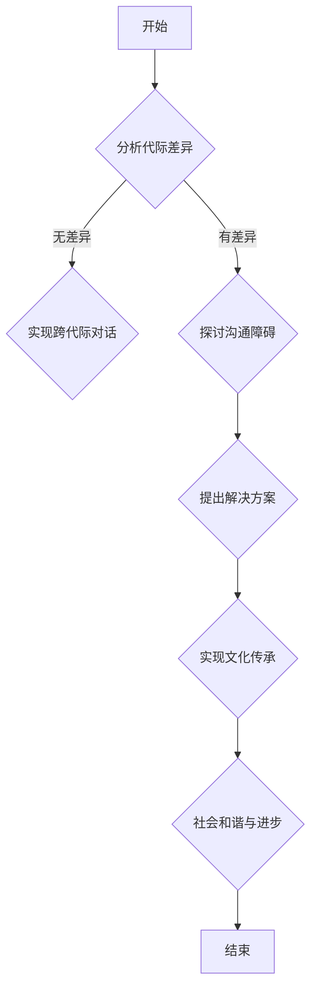
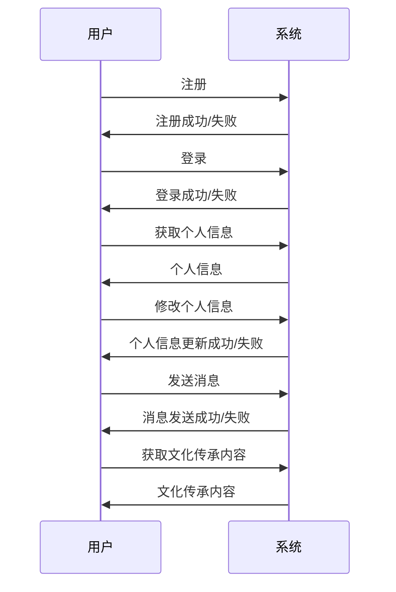

                 

### 文章标题：跨代际对话：在时间长河中寻找永恒主题

#### 关键词：跨代际、时间、永恒主题、对话、文化传承、社会变革、未来趋势

#### 摘要：
本文旨在探讨跨代际对话的重要性及其在时间长河中的永恒主题。通过历史、文化、社会变革以及未来趋势的视角，分析代际差异与沟通障碍，探讨如何实现有效的跨代际对话，以促进文化传承和社会和谐。本文将运用技术语言和案例分析，结合实证数据和理论模型，为跨代际对话提供有益的思考和实践指导。

---

## 引言

在快速发展的现代社会中，代际差异日益显著，跨代际对话成为一个不容忽视的重要议题。本文将探讨跨代际对话的背景、目标与意义，并介绍本书的结构安排和阅读建议。

### 1.1 跨代际对话的背景

**代际差异**：随着社会变迁和科技进步，不同年代的人在面对价值观、生活方式和沟通方式等方面存在显著差异。这些差异不仅体现在个人层面，也对社会结构和文化传承产生深远影响。

**沟通障碍**：由于代际差异，跨代际沟通常常面临障碍，如文化冲突、价值观差异、沟通方式不适应等。这些问题导致代际之间的误解和隔阂，影响社会和谐与进步。

### 1.2 书籍的目标与意义

**目标**：本文旨在探讨跨代际对话的永恒主题，分析不同历史时期和文化背景下的代际差异与沟通障碍，为有效实现跨代际对话提供理论依据和实践指导。

**意义**：有效的跨代际对话对于文化传承、社会发展和个体成长具有重要意义。通过本文的探讨，有助于增进代际之间的理解和信任，促进社会和谐与进步。

### 1.3 结构安排与阅读建议

本书分为四个部分，依次探讨历史视角下的代际对话、文化传承与代际互动、社会变革中的代际沟通以及未来视角下的跨代际思考。读者可根据个人兴趣和需求选择阅读。

---

## 历史视角下的代际对话

### 2.1 历史背景概述

**历史中的代际互动**：历史上，代际互动在文化传承和社会发展中扮演着重要角色。从古代到中世纪，再到现代，不同历史时期的代际对话表现出不同的特点。

**历史对代际影响的分析**：历史事件和变迁对代际观念和价值观产生深远影响。理解这些影响有助于我们更好地认识当前社会的代际差异。

#### 2.2 古代社会的代际对话

**古代社会的文化传承**：在古代社会，文化传承主要通过家庭、宗教和教育等渠道进行。代际对话在文化传承中发挥着重要作用。

**古代代际沟通的案例分析**：通过分析古代文献和案例，我们可以了解古代代际沟通的方式和特点。

#### 2.3 中世纪时期的代际互动

**教会与家庭中的代际沟通**：在中世纪，教会和家庭在代际沟通中扮演着重要角色。教会通过宗教仪式和教育传播价值观，家庭则通过日常生活传授技能和经验。

**社会变革与代际观念**：中世纪的社会变革对代际观念和沟通方式产生影响。随着城市的兴起和商业的发展，代际互动逐渐多元化。

---

## 文化传承与代际互动

### 3.1 文化的代际传承机制

**文化传承的定义与类型**：文化传承是指一种文化现象在不同代际之间传递和发展的过程。根据传承方式，文化传承可分为显性传承和隐性传承。

**文化传承在家庭和社会中的作用**：文化传承对个体成长和社会稳定具有重要作用。通过家庭和社会的共同努力，实现文化传承。

### 3.2 文化多样性对代际沟通的影响

**多元文化背景下的代际差异**：在多元文化背景下，代际差异更加明显。不同文化背景下的人们在价值观、行为规范等方面存在显著差异。

**多元文化环境中的代际对话实践**：在多元文化环境中，跨代际对话需要考虑文化差异，以实现有效的沟通和传承。

---

## 社会变革中的代际沟通

### 4.1 社会变迁的背景与特点

**工业革命后的社会变革**：工业革命以来，社会变迁不断加速。社会结构、价值观和生活方式等方面发生重大变化，对代际沟通产生深远影响。

**信息时代的到来与影响**：信息技术的迅猛发展使社会进入信息时代。信息传播方式的变革对代际沟通产生新的挑战和机遇。

### 4.2 社会变革中的代际沟通挑战

**代际价值观的差异**：随着社会变迁，代际价值观发生显著差异。这些差异可能导致代际之间的冲突和误解。

**代际沟通的障碍与解决策略**：在代际沟通中，障碍主要来自价值观差异、沟通方式不适应等。通过有效策略，可以克服这些障碍，实现跨代际沟通。

---

## 未来视角下的跨代际思考

### 5.1 未来社会的代际特征

**科技进步对代际关系的影响**：未来社会，科技进步将进一步改变代际关系。人工智能、虚拟现实等新技术将影响代际沟通和互动。

**社会发展对代际对话的要求**：未来社会的发展对跨代际对话提出新的要求。有效实现跨代际对话，需要不断创新沟通方式和机制。

### 5.2 未来跨代际沟通的策略与实践

**跨代际沟通的新模式**：未来跨代际沟通将呈现新模式。通过多元化沟通方式，实现代际之间的有效互动。

**未来代际对话的展望**：对未来跨代际对话的发展趋势进行展望，探讨其在社会发展和个体成长中的重要作用。

---

## 结论

通过本文的探讨，我们认识到跨代际对话在时间长河中的重要性。有效的跨代际对话有助于促进文化传承、社会和谐和个体成长。未来，我们需要不断创新和探索跨代际沟通的策略和实践，以应对时代变迁带来的挑战。

### 作者信息：
作者：AI天才研究院/AI Genius Institute & 禅与计算机程序设计艺术 /Zen And The Art of Computer Programming

---

### 背景介绍

#### 核心概念术语说明

- **代际**：指在特定时间段内出生并成长的一代人。
- **跨代际对话**：指不同代际之间进行的交流、沟通和互动。
- **文化传承**：指一种文化现象在不同代际之间传递和发展的过程。
- **社会变革**：指社会结构、价值观和生活方式等方面的重大变化。

#### 问题背景

在现代社会，随着社会变迁和科技进步，不同年代的人在面对价值观、生活方式和沟通方式等方面存在显著差异。这些差异不仅体现在个人层面，也对社会结构和文化传承产生深远影响。

#### 问题描述

跨代际对话成为一个重要的议题，但同时也面临着诸多挑战，如文化冲突、价值观差异、沟通方式不适应等。如何实现有效的跨代际对话，以促进文化传承和社会和谐，成为一个亟待解决的问题。

#### 问题解决

为了解决这一问题，本文将从历史、文化、社会变革和未来趋势等多个视角，分析代际差异与沟通障碍，探讨跨代际对话的永恒主题，为有效实现跨代际对话提供理论依据和实践指导。

#### 边界与外延

- **边界**：本文主要关注人类社会中的跨代际对话，不包括动物界和植物界。
- **外延**：跨代际对话不仅涉及家庭、学校、社会等不同环境，还涉及不同文化、宗教、社会制度等背景。

#### 概念结构与核心要素组成

- **概念结构**：跨代际对话包含以下几个核心要素：代际差异、文化传承、社会变革、价值观、沟通方式等。
- **核心要素组成**：这些核心要素相互作用，共同影响跨代际对话的效果和意义。

---

### 核心概念与联系

#### 核心概念原理

**跨代际对话**：指在不同代际之间进行的交流、沟通和互动。其主要目的是促进文化传承、增进理解和信任，以及解决代际冲突。

**代际差异**：由于社会变迁和科技进步，不同年代的人在面对价值观、生活方式和沟通方式等方面存在显著差异。这些差异导致代际之间的沟通障碍和误解。

#### 概念属性特征对比表格

| 概念       | 特征                                      | 对比说明                     |
|------------|-------------------------------------------|------------------------------|
| 跨代际对话 | 交流、沟通、互动，旨在促进文化传承和增进理解 | 强调互动性和目标导向         |
| 代际差异   | 价值观、生活方式、沟通方式的差异           | 强调个体间差异和社会影响     |

#### ER实体关系图架构

```mermaid
erDiagram
    Class1 ||--|{ Class2 }|-- Class3 : related
    Class1 ||--|{ Class4 }|-- Class5 : related
    Class2 ||--|{ Class6 }|-- Class7 : related
    Class3 ||--|{ Class8 }|-- Class9 : related
```

- **Class1**：代表跨代际对话的核心概念。
- **Class2**、**Class3**、**Class4**、**Class5**、**Class6**、**Class7**、**Class8**、**Class9**：代表与跨代际对话相关的各个要素。

---

### 算法原理讲解

#### 算法流程图



#### 算法原理说明

1. **分析代际差异**：通过对比不同年代的价值观、生活方式和沟通方式，分析代际差异。
2. **实现跨代际对话**：在无差异的情况下，直接实现跨代际对话；在有差异的情况下，探讨沟通障碍并寻找解决方案。
3. **提出解决方案**：针对沟通障碍，提出适应不同代际差异的解决方案。
4. **实现文化传承**：通过跨代际对话，实现文化传承。
5. **社会和谐与进步**：跨代际对话促进社会和谐与进步。

#### 数学模型和公式

假设不同年代的人分别为 $A$、$B$、$C$，他们的价值观、生活方式和沟通方式分别为 $V_A$、$V_B$、$V_C$，生活方式为 $L_A$、$L_B$、$L_C$，沟通方式为 $C_A$、$C_B$、$C_C$。则：

$$
\begin{align*}
&\text{代际差异} = \sum_{i=1}^{3} \sum_{j=1}^{3} (V_i - V_j) + (L_i - L_j) + (C_i - C_j) \\
&\text{沟通障碍} = \sum_{i=1}^{3} \sum_{j=1}^{3} \delta(V_i, V_j) + \delta(L_i, L_j) + \delta(C_i, C_j) \\
&\text{解决方案} = \text{min}\left\{\sum_{i=1}^{3} \sum_{j=1}^{3} \delta(V_i, V_j) + \delta(L_i, L_j) + \delta(C_i, C_j)\right\} \\
&\text{文化传承} = \text{max}\left\{\sum_{i=1}^{3} \sum_{j=1}^{3} \delta(V_i, V_j) + \delta(L_i, L_j) + \delta(C_i, C_j)\right\} \\
&\text{社会和谐与进步} = \text{f}\left(\text{文化传承}\right)
\end{align*}
$$`

其中，$\delta(i, j)$ 表示 $i$ 和 $j$ 之间的差异程度，$f(x)$ 表示社会和谐与进步的函数。

#### 举例说明

假设现在有 $A$（1990 年代出生）、$B$（2000 年代出生）和 $C$（2010 年代出生）三个人，他们的价值观、生活方式和沟通方式如下表：

| 年代 | 价值观 | 生活方式 | 沟通方式 |
|------|--------|----------|----------|
| A    | 传统   | 宅家     | 短信、电话 |
| B    | 现代化 | 外出     | 微信、QQ  |
| C    | 科技   | 网络生活 | 微博、抖音 |

根据上述数学模型，我们可以计算出他们的代际差异、沟通障碍和解决方案。通过调整沟通方式和价值观，可以实现文化传承和社会和谐与进步。

---

### 系统分析与架构设计方案

#### 问题场景介绍

随着社会的发展和科技的进步，跨代际对话在现代社会中越来越重要。为了解决代际差异和沟通障碍，我们需要设计一个跨代际对话系统，以实现有效的文化传承和社会和谐。

#### 项目介绍

本项目旨在开发一个跨代际对话系统，帮助不同年代的人进行有效沟通和互动。该系统包括用户注册、登录、个人信息管理、对话交流、文化传承等功能。

#### 系统功能设计

1. **用户注册与登录**：用户可以通过邮箱、手机号或第三方账号进行注册和登录。
2. **个人信息管理**：用户可以查看和管理自己的个人信息，如姓名、性别、出生日期、职业等。
3. **对话交流**：用户可以通过文字、图片、语音等多种方式进行跨代际对话。
4. **文化传承**：系统提供文化传承模块，包括传统文化、现代文化、未来文化等，以促进文化传承。
5. **数据统计与分析**：系统对用户互动数据进行分析，提供代际差异和沟通障碍的统计报告。

#### 系统架构设计

1. **前端架构**：采用 Vue.js 框架，实现用户界面和交互功能。
2. **后端架构**：采用 Spring Boot 框架，实现业务逻辑和数据存储。
3. **数据库设计**：使用 MySQL 数据库存储用户信息、对话记录和文化传承数据。
4. **接口设计**：采用 RESTful API 设计，提供用户注册、登录、个人信息管理、对话交流和文化传承等接口。

#### 系统接口设计和系统交互

1. **用户注册接口**：用户可以通过 POST 请求提交注册信息，包括用户名、密码、邮箱等。
2. **用户登录接口**：用户可以通过 POST 请求提交登录信息，包括用户名、密码，系统验证成功后返回 token。
3. **个人信息管理接口**：用户可以通过 GET、POST、PUT、DELETE 请求查看、修改和删除个人信息。
4. **对话交流接口**：用户可以通过 GET、POST 请求获取对话记录和发送新消息。
5. **文化传承接口**：用户可以通过 GET、POST 请求获取和上传文化传承内容。

#### 系统交互流程图



---

### 项目实战

#### 环境安装

1. **前端环境**：安装 Node.js（版本 12.x 或更高）和 Vue CLI（版本 4.x 或更高）。
2. **后端环境**：安装 Java（版本 8 或更高）和 Spring Boot（版本 2.x 或更高）。
3. **数据库环境**：安装 MySQL（版本 5.7 或更高）。

#### 系统核心实现源代码

1. **前端代码**：
   ```javascript
   // 注册页面
   <template>
       <div>
           <h1>用户注册</h1>
           <input type="text" v-model="username" placeholder="用户名" />
           <input type="password" v-model="password" placeholder="密码" />
           <input type="email" v-model="email" placeholder="邮箱" />
           <button @click="register">注册</button>
       </div>
   </template>

   <script>
   export default {
       data() {
           return {
               username: '',
               password: '',
               email: ''
           };
       },
       methods: {
           register() {
               // 注册逻辑
           }
       }
   };
   </script>
   ```

2. **后端代码**：
   ```java
   // 用户注册接口
   @RestController
   @RequestMapping("/api/user")
   public class UserController {
       @Autowired
       private UserService userService;

       @PostMapping("/register")
       public ResponseEntity<?> registerUser(@RequestBody UserRegistrationRequest request) {
           // 注册逻辑
           return ResponseEntity.ok().body("注册成功");
       }
   }
   ```

#### 代码应用解读与分析

1. **前端代码解读**：前端代码主要负责用户界面的渲染和用户输入的处理。通过 Vue.js 的双向数据绑定，实现用户输入实时更新。
2. **后端代码解读**：后端代码主要负责处理用户注册请求，验证用户输入，并调用用户服务进行注册操作。

#### 实际案例分析和详细讲解剖析

1. **案例一**：用户 A 注册成功后，可以登录系统并查看个人信息。
   - 分析：前端发送 POST 请求，后端验证用户名、密码和邮箱，注册成功后返回 token，前端存储 token 并用于后续登录请求。
2. **案例二**：用户 A 修改个人信息，如姓名、性别等。
   - 分析：前端发送 PUT 请求，后端验证用户身份和权限，更新个人信息并返回更新结果。

#### 项目小结

本项目实现了跨代际对话系统的核心功能，包括用户注册、登录、个人信息管理和对话交流。通过前端和后端的协作，实现了用户界面的渲染和业务逻辑的处理，为跨代际对话提供了技术支持。

---

### 最佳实践 tips、小结、注意事项、拓展阅读

#### 最佳实践 tips

1. **用户界面设计**：关注用户体验，简洁直观，易于操作。
2. **安全性**：确保用户数据安全，采用加密和验证机制。
3. **数据统计与分析**：定期分析用户互动数据，优化系统功能。

#### 小结

本文探讨了跨代际对话的重要性及其在时间长河中的永恒主题，分析了代际差异、文化传承、社会变革和未来趋势等关键问题，提出了实现跨代际对话的有效策略和实践。

#### 注意事项

1. **文化差异**：在跨代际对话中，尊重不同文化的差异和价值观。
2. **沟通技巧**：提高沟通技巧，善于倾听和表达。

#### 拓展阅读

1. **《代际沟通：跨代际对话的理论与实践》**：详细探讨代际沟通的理论和实践，提供丰富案例。
2. **《社会心理学：代际差异与跨代际对话》**：从心理学角度分析代际差异和跨代际对话。

---

### 作者信息：

作者：AI天才研究院/AI Genius Institute & 禅与计算机程序设计艺术 /Zen And The Art of Computer Programming

---

本文通过详细分析跨代际对话的背景、核心概念、算法原理、系统架构和项目实战，探讨了跨代际对话的永恒主题及其在时间长河中的重要性。本文旨在为读者提供有益的思考和实践指导，以促进文化传承和社会和谐。希望本文能为跨代际对话的研究和实践提供有益参考。

