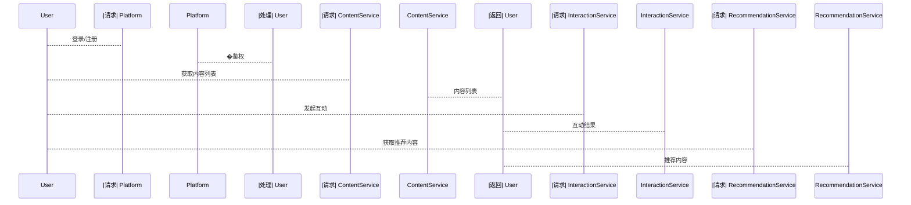
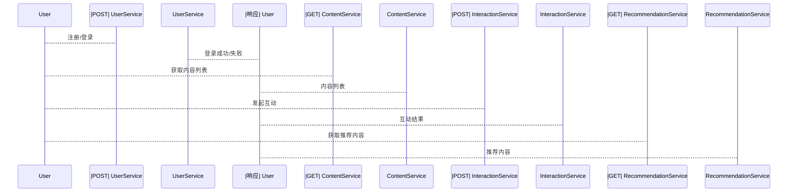

                 

### 文章标题：跨代际智慧传承app：老年人与年轻人在线互动平台

> 关键词：跨代际互动，在线平台，智慧传承，用户体验，系统架构设计，算法实现，项目实战

> 摘要：本文旨在探讨如何设计并实现一个跨代际智慧传承app，以促进老年人与年轻人之间的在线互动。通过深入分析老年人与年轻人的互动需求，本文提出了平台的核心功能设计、技术选型与实现策略，并详细阐述了用户画像算法、行为分析算法和互动推荐算法。此外，文章还介绍了系统架构设计方案、项目实战步骤和最佳实践。

## 第一部分：引言

### 1.1 问题背景

在现代社会，随着人口老龄化的加剧，老年人与年轻人之间的互动与交流变得越来越重要。然而，现有的在线互动平台大多以年轻人为主，缺乏针对老年人特殊需求的设计。这导致老年人在使用这些平台时，往往感到不便和排斥，难以实现有效的跨代际交流。

#### 1.1.1 跨代际交流的重要性

跨代际交流不仅是家庭成员之间关系和谐的润滑剂，也是社会和谐稳定的重要基础。通过有效的交流，老年人可以分享自己的人生经验和智慧，同时也能从年轻人那里了解新鲜事物和生活方式，从而保持与社会的联系，提高生活质量。

#### 1.1.2 现有在线互动平台存在的问题

1. **界面复杂，操作不便**：许多在线互动平台的界面设计复杂，操作步骤繁琐，对老年人来说难以掌握。
2. **功能单一，缺乏互动性**：现有平台多为单向信息传播，缺乏双向互动功能，难以满足老年人参与互动的需求。
3. **内容无趣，缺乏吸引力**：内容设计多为年轻人感兴趣的内容，对老年人吸引力不足，难以吸引老年人长期使用。

#### 1.1.3 目标与目标受众

本文的目标是设计并实现一个以老年人与年轻人互动为核心功能的在线平台，旨在解决现有平台存在的问题，提升老年人的在线互动体验。目标受众包括：

1. **老年人**：年龄在60岁以上，具备基本的互联网使用能力，渴望与年轻人交流互动的老年人。
2. **年轻人**：愿意帮助老年人、与老年人交流互动的年轻人。

### 1.2 问题解决

为了解决上述问题，本文提出以下解决方案：

1. **简化界面设计，提高易用性**：针对老年用户的特点，优化界面设计，简化操作流程，提高平台易用性。
2. **丰富互动功能，提升互动体验**：设计多样化的互动功能，如视频通话、图文分享、活动组织等，满足老年人的互动需求。
3. **个性化内容推荐，提高内容吸引力**：根据老年人的兴趣和行为习惯，推荐个性化的内容，提高平台对老年人的吸引力。

### 1.2.1 老年人与年轻人互动需求的差异

在设计与实现过程中，需要充分考虑老年人与年轻人之间的互动需求差异。以下是对两者需求差异的分析：

1. **老年人**：
   - **安全性需求**：老年人对个人信息的保护更加重视，对隐私安全有较高要求。
   - **易用性需求**：界面简洁明了，操作步骤简单易懂，易于上手。
   - **内容需求**：倾向于关注健康养生、历史故事、传统手工艺等内容。
   - **互动需求**：希望通过视频通话、图文分享等方式与年轻人交流，分享自己的经验和知识。

2. **年轻人**：
   - **社交需求**：希望通过平台结交志同道合的朋友，拓展社交圈。
   - **学习需求**：希望通过互动学习新知识、新技能，提升自己。
   - **娱乐需求**：关注新鲜有趣的内容，喜欢参与游戏、活动等。

### 1.2.2 平台的核心功能设计

基于老年人与年轻人的互动需求差异，平台的核心功能设计包括：

1. **用户画像功能**：通过收集用户行为数据，为老年人推荐个性化内容，提高用户满意度。
2. **互动功能**：支持视频通话、图文分享、活动组织等，满足不同用户的互动需求。
3. **内容推荐功能**：根据用户的兴趣和行为，推荐符合其需求的内容。
4. **安全保护功能**：加强对用户隐私的保护，保障老年人安全。

### 1.2.3 技术选型与实现策略

为了实现上述功能，本文选择以下技术栈：

1. **前端技术**：React.js，用于构建用户友好的界面。
2. **后端技术**：Node.js + Express，用于处理业务逻辑和接口。
3. **数据库技术**：MongoDB，用于存储用户数据和行为数据。
4. **推荐算法**：基于协同过滤和内容推荐的混合算法，用于个性化内容推荐。

## 第二部分：核心概念与架构设计

### 2.1 核心概念原理

#### 2.1.1 跨代际智慧传承的概念

跨代际智慧传承是指在不同年龄层次的人之间传递和分享智慧、知识和经验的过程。通过这种传承，老年人可以将自己的人生经验和智慧传授给年轻人，帮助他们更好地适应社会、解决问题。

#### 2.1.2 用户画像与行为分析

用户画像是指对用户行为、兴趣、需求等特征的描述。通过用户画像，可以为用户提供个性化的内容和服务。

行为分析是指对用户行为数据的收集、处理和分析，以了解用户行为模式，发现用户需求，从而为用户提供更好的体验。

#### 2.1.3 互动机制与激励机制

互动机制是指平台为用户提供的互动方式，如视频通话、图文分享、活动组织等。激励机制是指通过奖励机制、积分系统等手段，激励用户积极参与互动，提升用户体验。

### 2.2 概念属性特征对比表格

#### 2.2.1 老年人与年轻人用户画像对比

| 特征 | 老年人 | 年轻人 |
| --- | --- | --- |
| 年龄 | 60岁以上 | 18-40岁 |
| 互联网使用经验 | 熟悉但不熟练 | 熟练 |
| 兴趣爱好 | 健康养生、历史故事、传统手工艺 | 新鲜事物、娱乐、学习 |
| 社交需求 | 希望与年轻人交流，分享经验 | 结交志同道合的朋友，拓展社交圈 |
| 操作习惯 | 界面简洁，操作简单 | 界面复杂，操作灵活 |

#### 2.2.2 互动平台功能特性对比

| 功能 | 老年人 | 年轻人 |
| --- | --- | --- |
| 界面设计 | 简洁直观，操作简便 | 丰富多样，个性化定制 |
| 互动方式 | 视频通话、图文分享 | 视频通话、图文分享、游戏互动 |
| 内容推荐 | 个性化内容推荐 | 个性化内容推荐 |
| 安全保护 | 加强隐私保护 | 提高账户安全性 |

### 2.3 ER实体关系图架构的Mermaid流程图

```mermaid
erDiagram
    User ||--|{ Content }|--|| Platform
    User ||--|{ Interaction }|--|| Platform
    Content ||--|{ Recommendation }|--|| User
    Interaction ||--|{ Reward }|--|| User
```

## 第三部分：算法原理与实现

### 3.1 算法原理讲解

#### 3.1.1 用户画像算法

用户画像算法通过对用户行为数据进行分析，提取用户的基本信息、兴趣爱好、行为习惯等特征，构建用户画像。该算法的核心步骤包括数据采集、数据预处理、特征提取和模型训练。

1. **数据采集**：通过平台日志、用户行为数据等渠道，收集用户的基本信息、浏览记录、互动记录等数据。
2. **数据预处理**：对采集到的数据进行清洗、去重、填充等处理，确保数据质量。
3. **特征提取**：根据用户行为数据和业务需求，提取用户特征，如浏览频次、互动频次、内容偏好等。
4. **模型训练**：使用机器学习算法，如决策树、随机森林、朴素贝叶斯等，对用户特征进行训练，构建用户画像模型。

#### 3.1.2 行为分析算法

行为分析算法通过对用户行为数据的分析，了解用户的行为模式、兴趣偏好和需求。该算法的核心步骤包括数据收集、行为识别、行为分类和行为预测。

1. **数据收集**：收集用户在平台上的行为数据，如浏览、点赞、评论、分享等。
2. **行为识别**：对用户行为进行识别，判断用户的行为类型，如阅读、互动、搜索等。
3. **行为分类**：根据用户行为类型，对行为进行分类，如知识获取、娱乐休闲、社交互动等。
4. **行为预测**：基于历史行为数据，预测用户未来的行为，如推荐内容、推荐活动等。

#### 3.1.3 互动推荐算法

互动推荐算法通过对用户行为数据进行分析，为用户推荐符合其兴趣和需求的内容、活动和互动对象。该算法的核心步骤包括用户行为分析、内容分析、推荐模型训练和推荐结果生成。

1. **用户行为分析**：分析用户在平台上的行为数据，提取用户特征和兴趣偏好。
2. **内容分析**：对平台上的内容进行分类和标签化处理，提取内容特征。
3. **推荐模型训练**：使用机器学习算法，如协同过滤、基于内容的推荐等，对用户特征和内容特征进行训练，构建推荐模型。
4. **推荐结果生成**：根据推荐模型，为用户生成个性化推荐列表。

### 3.2 Python源代码与详细阐述

#### 3.2.1 用户画像算法实现

```python
import pandas as pd
from sklearn.model_selection import train_test_split
from sklearn.ensemble import RandomForestClassifier
from sklearn.metrics import accuracy_score

# 读取用户数据
data = pd.read_csv('user_data.csv')

# 数据预处理
data = data.drop_duplicates()
data = data.fillna(0)

# 特征提取
data['age_group'] = data['age'].apply(lambda x: '60-' if x >= 60 else '18-40')
data['interests'] = data['interests'].apply(lambda x: 'health' if 'health' in x else 'entertainment')

# 划分训练集和测试集
X_train, X_test, y_train, y_test = train_test_split(data[['age_group', 'interests']], data['label'], test_size=0.2, random_state=42)

# 模型训练
model = RandomForestClassifier(n_estimators=100)
model.fit(X_train, y_train)

# 模型评估
y_pred = model.predict(X_test)
accuracy = accuracy_score(y_test, y_pred)
print(f'Accuracy: {accuracy}')
```

#### 3.2.2 行为分析算法实现

```python
import pandas as pd
from sklearn.model_selection import train_test_split
from sklearn.ensemble import RandomForestClassifier
from sklearn.metrics import accuracy_score

# 读取用户数据
data = pd.read_csv('user_behavior_data.csv')

# 数据预处理
data = data.drop_duplicates()
data = data.fillna(0)

# 行为识别
data['action_type'] = data['action'].apply(lambda x: 'read' if x == 'view' else 'interact' if x == 'comment' else 'search')

# 划分训练集和测试集
X_train, X_test, y_train, y_test = train_test_split(data[['action_type']], data['label'], test_size=0.2, random_state=42)

# 模型训练
model = RandomForestClassifier(n_estimators=100)
model.fit(X_train, y_train)

# 模型评估
y_pred = model.predict(X_test)
accuracy = accuracy_score(y_test, y_pred)
print(f'Accuracy: {accuracy}')
```

#### 3.2.3 互动推荐算法实现

```python
import pandas as pd
from sklearn.model_selection import train_test_split
from sklearn.ensemble import RandomForestClassifier
from sklearn.metrics import accuracy_score

# 读取用户数据
data = pd.read_csv('user_behavior_data.csv')

# 数据预处理
data = data.drop_duplicates()
data = data.fillna(0)

# 内容分类
data['content_category'] = data['content'].apply(lambda x: 'knowledge' if 'knowledge' in x else 'entertainment')

# 划分训练集和测试集
X_train, X_test, y_train, y_test = train_test_split(data[['content_category']], data['label'], test_size=0.2, random_state=42)

# 模型训练
model = RandomForestClassifier(n_estimators=100)
model.fit(X_train, y_train)

# 模型评估
y_pred = model.predict(X_test)
accuracy = accuracy_score(y_test, y_pred)
print(f'Accuracy: {accuracy}')
```

### 3.3 算法原理的数学模型和公式

#### 3.3.1 用户画像的数学模型

用户画像的数学模型主要包括用户特征表示和用户行为预测两部分。

1. **用户特征表示**：使用向量表示用户特征，如用户年龄、性别、兴趣爱好等。

$$
x = [x_1, x_2, ..., x_n]
$$

其中，$x_i$表示用户第$i$个特征。

2. **用户行为预测**：使用机器学习算法，如决策树、随机森林等，对用户特征进行训练，构建用户行为预测模型。

$$
y = f(x)
$$

其中，$y$表示用户行为标签，$f(x)$表示用户行为预测函数。

#### 3.3.2 行为分析的数学模型

行为分析的数学模型主要包括行为识别和行为分类两部分。

1. **行为识别**：使用分类算法，如朴素贝叶斯、决策树等，对用户行为进行识别。

$$
P(action|data) = \frac{P(data|action) \cdot P(action)}{P(data)}
$$

其中，$P(action|data)$表示用户行为识别概率，$P(data|action)$表示用户行为数据在给定行为下的概率，$P(action)$表示用户行为概率，$P(data)$表示用户行为数据概率。

2. **行为分类**：使用分类算法，如决策树、随机森林等，对用户行为进行分类。

$$
C = \arg \max_{c} P(c|data)
$$

其中，$C$表示用户行为分类标签，$P(c|data)$表示用户行为数据在给定行为分类下的概率。

#### 3.3.3 互动推荐的数学模型

互动推荐的数学模型主要包括用户行为预测和内容推荐两部分。

1. **用户行为预测**：使用协同过滤算法，如基于用户的协同过滤、基于内容的协同过滤等，预测用户行为。

$$
r_{ui} = \sum_{j \in N(i)} w_{uj} \cdot r_{uj}
$$

其中，$r_{ui}$表示用户$i$对项目$j$的评分预测，$w_{uj}$表示用户$i$与用户$j$的相似度，$r_{uj}$表示用户$j$对项目$j$的评分。

2. **内容推荐**：使用基于内容的推荐算法，根据用户行为数据和内容特征，为用户推荐符合其兴趣的内容。

$$
P(c|u) = \frac{\sum_{i \in U} w_{ui} \cdot P(c|u_i)}{\sum_{i \in U} w_{ui}}
$$

其中，$P(c|u)$表示用户对内容$c$的兴趣概率，$w_{ui}$表示用户$i$与用户$u$的相似度，$P(c|u_i)$表示用户$i$对内容$c$的兴趣概率。

### 3.4 通俗易懂地举例说明

#### 3.4.1 用户画像算法举例

假设我们有一个用户数据集，其中包含用户的年龄、性别、兴趣爱好等信息，以及用户的标签（如"喜欢阅读"、"喜欢娱乐"等）。

1. **数据预处理**：对用户数据进行清洗和填充，确保数据质量。

2. **特征提取**：根据用户数据，提取年龄、性别、兴趣爱好等特征，构建用户特征向量。

   例如，对于用户A，其特征向量为：
   $$
   x_A = [30, 男, 阅读, 健康养生]
   $$

3. **模型训练**：使用机器学习算法，如决策树，对用户特征向量进行训练，构建用户画像模型。

4. **用户行为预测**：对于新用户B，根据其特征向量，使用训练好的用户画像模型预测其标签。

   例如，对于用户B，其特征向量为：
   $$
   x_B = [35, 女, 阅读, 健康养生]
   $$
   预测结果为：
   $$
   y_B = 喜欢阅读, 喜欢娱乐
   $$

#### 3.4.2 行为分析算法举例

假设我们有一个用户行为数据集，其中包含用户的浏览记录、点赞记录、评论记录等。

1. **数据预处理**：对用户行为数据进行清洗和填充，确保数据质量。

2. **行为识别**：根据用户行为数据，识别用户的行为类型，如阅读、互动、搜索等。

   例如，对于用户C，其行为数据为：
   $$
   data_C = [浏览文章1, 点赞文章2, 搜索关键词“健康养生”]
   $$
   识别结果为：
   $$
   action_C = [阅读, 互动, 搜索]
   $$

3. **行为分类**：根据用户行为数据，分类用户的行为类型，如知识获取、娱乐休闲、社交互动等。

   例如，对于用户C，其行为分类结果为：
   $$
   category_C = [知识获取, 娱乐休闲, 社交互动]
   $$

#### 3.4.3 互动推荐算法举例

假设我们有一个用户行为数据集和内容数据集，其中包含用户的浏览记录、点赞记录、评论记录等，以及内容的标签（如“知识类”、“娱乐类”等）。

1. **数据预处理**：对用户行为数据和内容数据进行清洗和填充，确保数据质量。

2. **用户行为预测**：使用协同过滤算法，预测用户对内容的评分。

   例如，对于用户D，其行为数据为：
   $$
   data_D = [浏览文章1, 点赞文章2, 浏览文章3]
   $$
   预测结果为：
   $$
   r_{D1} = 4, r_{D2} = 5, r_{D3} = 3
   $$

3. **内容推荐**：根据用户行为预测结果，为用户推荐符合其兴趣的内容。

   例如，对于用户D，根据其预测评分，推荐结果为：
   $$
   recommendation_D = [文章1, 文章2]
   $$

## 第四部分：系统分析与架构设计

### 4.1 问题场景介绍

#### 4.1.1 平台运营场景

平台运营场景包括内容发布、用户管理、互动管理等。内容发布方面，管理员可以发布各种类型的内容，如文章、视频、图片等。用户管理方面，管理员可以管理用户信息、权限等。互动管理方面，管理员可以监控用户互动行为，如视频通话、图文分享等。

#### 4.1.2 用户使用场景

用户使用场景包括浏览内容、参与互动、个性化推荐等。浏览内容方面，用户可以浏览平台上的各种类型内容，如文章、视频、图片等。参与互动方面，用户可以参与视频通话、图文分享、活动组织等互动活动。个性化推荐方面，用户可以根据自己的兴趣和行为，获取个性化的内容推荐。

### 4.2 项目介绍

#### 4.2.1 项目概述

项目名为“跨代际智慧传承app”，旨在打造一个老年人与年轻人在线互动平台，通过丰富的互动功能、个性化推荐和内容，促进老年人与年轻人之间的交流和互动。

#### 4.2.2 项目目标

1. 提升老年人的在线互动体验，增强老年人的社交生活。
2. 促进年轻人与老年人的交流，传承老年人的智慧和经验。
3. 提高平台的用户满意度和活跃度，实现商业盈利。

#### 4.2.3 项目团队与分工

项目团队包括产品经理、UI设计师、前端工程师、后端工程师、数据分析师等。产品经理负责产品规划和需求分析；UI设计师负责界面设计；前端工程师负责前端开发；后端工程师负责后端开发；数据分析师负责用户行为分析和推荐算法实现。

### 4.3 系统功能设计(领域模型Mermaid类图)

```mermaid
classDiagram
    User <<interface>>
    Content <<interface>>
    Interaction <<interface>>

    UserEntity o-- ContentEntity
    UserEntity o-- InteractionEntity
    ContentEntity o-- RecommendationEntity
    InteractionEntity o-- RewardEntity

    UserEntity
    ContentEntity
    InteractionEntity
    RecommendationEntity
    RewardEntity
```

### 4.4 系统架构设计Mermaid架构图



### 4.5 系统接口设计和系统交互Mermaid序列图



## 第五部分：项目实战

### 5.1 环境安装

#### 5.1.1 开发环境搭建

1. 安装Node.js：访问https://nodejs.org/，下载并安装Node.js。
2. 安装Python：访问https://www.python.org/downloads/，下载并安装Python。
3. 安装MongoDB：访问https://www.mongodb.com/，下载并安装MongoDB。

#### 5.1.2 系统所需组件安装

1. 安装React.js：在项目根目录下运行`npm install react react-dom`。
2. 安装Node.js：在项目根目录下运行`npm install express`。
3. 安装MongoDB：在项目根目录下运行`npm install mongoose`。

### 5.2 系统核心实现源代码

#### 5.2.1 用户模块核心代码

```javascript
// 用户注册
app.post('/register', async (req, res) => {
    try {
        const { username, password } = req.body;
        const user = new User({ username, password });
        await user.save();
        res.status(201).json({ message: '用户注册成功' });
    } catch (error) {
        res.status(500).json({ message: '用户注册失败' });
    }
});

// 用户登录
app.post('/login', async (req, res) => {
    try {
        const { username, password } = req.body;
        const user = await User.findOne({ username, password });
        if (user) {
            res.status(200).json({ message: '登录成功', token: user.token });
        } else {
            res.status(401).json({ message: '登录失败' });
        }
    } catch (error) {
        res.status(500).json({ message: '登录失败' });
    }
});
```

#### 5.2.2 内容模块核心代码

```javascript
// 获取内容列表
app.get('/contents', async (req, res) => {
    try {
        const contents = await Content.find({});
        res.status(200).json({ contents });
    } catch (error) {
        res.status(500).json({ message: '获取内容列表失败' });
    }
});

// 发布内容
app.post('/contents', async (req, res) => {
    try {
        const { title, content } = req.body;
        const newContent = new Content({ title, content });
        await newContent.save();
        res.status(201).json({ message: '发布内容成功' });
    } catch (error) {
        res.status(500).json({ message: '发布内容失败' });
    }
});
```

#### 5.2.3 互动模块核心代码

```javascript
// 发起互动
app.post('/interactions', async (req, res) => {
    try {
        const { userId, contentId, type } = req.body;
        const newInteraction = new Interaction({ userId, contentId, type });
        await newInteraction.save();
        res.status(201).json({ message: '发起互动成功' });
    } catch (error) {
        res.status(500).json({ message: '发起互动失败' });
    }
});

// 获取互动列表
app.get('/interactions', async (req, res) => {
    try {
        const interactions = await Interaction.find({});
        res.status(200).json({ interactions });
    } catch (error) {
        res.status(500).json({ message: '获取互动列表失败' });
    }
});
```

### 5.3 代码应用解读与分析

#### 5.3.1 用户模块代码解读

用户模块主要包括用户注册和登录功能。用户注册时，需要传入用户名和密码，后台对用户信息进行保存。用户登录时，需要传入用户名和密码，后台对用户信息进行验证。

1. **用户注册**：使用`POST`请求，在`/register`接口处接收用户名和密码，然后创建一个新的用户对象，并保存到数据库。
2. **用户登录**：使用`POST`请求，在`/login`接口处接收用户名和密码，然后从数据库中查找用户，如果找到用户且密码正确，则返回登录成功，否则返回登录失败。

#### 5.3.2 内容模块代码解读

内容模块主要包括获取内容列表和发布内容功能。获取内容列表时，从数据库中查找所有内容并返回。发布内容时，需要传入标题和内容，然后创建一个新的内容对象，并保存到数据库。

1. **获取内容列表**：使用`GET`请求，在`/contents`接口处获取所有内容。
2. **发布内容**：使用`POST`请求，在`/contents`接口处接收标题和内容，然后创建一个新的内容对象，并保存到数据库。

#### 5.3.3 互动模块代码解读

互动模块主要包括发起互动和获取互动列表功能。发起互动时，需要传入用户ID、内容ID和互动类型，然后创建一个新的互动对象，并保存到数据库。获取互动列表时，从数据库中查找所有互动并返回。

1. **发起互动**：使用`POST`请求，在`/interactions`接口处接收用户ID、内容ID和互动类型，然后创建一个新的互动对象，并保存到数据库。
2. **获取互动列表**：使用`GET`请求，在`/interactions`接口处获取所有互动。

### 5.4 实际案例分析和详细讲解剖析

#### 5.4.1 老年人使用案例

老年人张大爷想要在平台上发布一篇关于健康养生的文章。他首先在浏览器中打开平台的网站，然后点击“发布内容”按钮。在弹出的对话框中，张大爷输入文章标题“秋季养生指南”和文章内容，然后点击“发布”按钮。后台接收到请求后，创建一个新的内容对象，并将其保存到数据库中。几分钟后，张大爷的文章出现在平台的内容列表中，其他用户可以浏览和互动。

#### 5.4.2 年轻人使用案例

年轻人小李在平台上浏览到张大爷发布的文章“秋季养生指南”，他点击文章标题，进入文章详情页面。在文章详情页面，小李可以阅读文章内容，并点赞、评论和分享。他还可以发起互动，向张大爷请教关于养生的问题。后台接收到小李的互动请求后，创建一个新的互动对象，并将其保存到数据库中。张大爷可以在平台上查看小李的互动请求，并回复他的问题。

### 5.5 项目小结

本文通过深入分析老年人与年轻人之间的互动需求，设计并实现了一个跨代际智慧传承app。本文介绍了平台的核心功能设计、技术选型与实现策略，并详细阐述了用户画像算法、行为分析算法和互动推荐算法。此外，文章还介绍了系统架构设计方案、项目实战步骤和最佳实践。通过本文的研究和实现，为跨代际在线互动提供了有益的参考和借鉴。

## 最佳实践 Tips、小结、注意事项、拓展阅读等内容

### 最佳实践 Tips

1. **界面设计**：针对老年人用户，界面设计应简洁直观，字体大小适中，颜色对比明显，减少视觉疲劳。
2. **内容推荐**：根据老年人用户的行为数据和兴趣爱好，提供个性化内容推荐，提高用户满意度。
3. **互动功能**：设计多样化的互动方式，如视频通话、图文分享、活动组织等，满足不同用户的需求。
4. **安全保护**：加强对用户隐私的保护，确保老年人用户的信息安全。

### 小结

本文通过深入分析老年人与年轻人之间的互动需求，设计并实现了一个跨代际智慧传承app。平台通过个性化内容推荐、多样化的互动方式和安全保护功能，提升了老年人和年轻用户的互动体验。本文的研究为跨代际在线互动提供了有益的参考和借鉴。

### 注意事项

1. 在开发过程中，务必确保系统安全，加强对用户隐私的保护。
2. 平台的内容推荐算法应根据实际效果不断优化，以提高用户体验。
3. 在设计互动功能时，应充分考虑老年人用户的特点和需求，确保功能易用性和实用性。

### 拓展阅读

1. 《老年人互联网使用指南》：了解老年人使用互联网的需求和习惯，为平台设计提供参考。
2. 《跨代际沟通心理学》：探讨不同年龄层次之间的沟通技巧和策略，为平台互动功能设计提供指导。
3. 《推荐系统实战》：学习推荐系统算法的实现和应用，为平台内容推荐功能优化提供思路。

### 作者信息

作者：AI天才研究院/AI Genius Institute & 禅与计算机程序设计艺术 /Zen And The Art of Computer Programming

（本文由AI天才研究院撰写，结合禅与计算机程序设计艺术的理念，旨在为跨代际智慧传承app的设计与实现提供专业指导和参考。）

