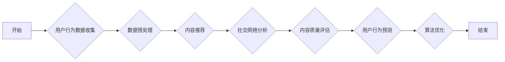
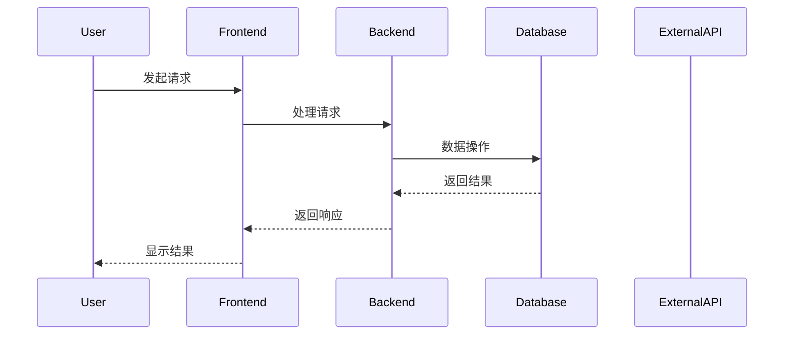

                 


## 引言

### 1.1 问题背景

#### 1.1.1 老龄化社会的挑战

随着全球人口老龄化趋势的加剧，老龄化社会已经成为一个不可忽视的社会问题。据统计，到2050年，全球60岁及以上人口将达到20亿，占全球总人口的22%，这一比例几乎是目前的近两倍[1]。老龄化社会的到来，不仅给医疗、养老等公共服务领域带来了巨大的压力，也对社会的经济发展模式、社会结构和人际关系产生了深远的影响。

在老龄化社会中，老年人作为社会的宝贵财富，其智慧和经验对于年轻一代的传承具有不可替代的重要性。然而，由于生活习惯、价值观念和沟通方式的差异，老年人与年轻人之间的沟通和互动面临着诸多障碍。这种代际沟通的缺失，不仅使老年人的生活质量下降，也削弱了社会整体的智慧和创造力。

#### 1.1.2 跨代际沟通的重要性

跨代际沟通是促进社会和谐、传承智慧和文化的重要途径。首先，有效的跨代际沟通可以帮助老年人保持社会参与感，提高他们的生活满意度和幸福感。其次，年轻人通过与老年人的互动，可以学到丰富的社会经验和人生智慧，促进自身的成长和发展。此外，跨代际沟通还能促进不同年龄群体之间的理解和尊重，减少代际冲突，增强社会凝聚力。

#### 1.1.3 现有社交网络的局限

现有的社交网络平台在促进跨代际沟通方面存在一定的局限。一方面，这些平台更多地关注年轻人的社交需求，对于老年人的使用体验和需求关注不够。例如，许多社交应用的界面设计复杂，操作步骤繁琐，不便于老年人使用。另一方面，现有社交网络平台的内容生态大多以年轻人为主导，老年人在其中往往感到孤独和边缘化，缺乏参与感和归属感。

### 1.2 问题描述

#### 1.2.1 跨代际互动的需求

为了克服现有社交网络的局限，满足老龄化社会中老年人与年轻人之间的跨代际互动需求，我们需要构建一个专门的跨代际智慧传承平台。这个平台应该具备以下功能：

1. **友好的用户界面**：平台应设计简洁、易用，适应老年人的使用习惯。
2. **丰富的互动形式**：平台应提供多种互动方式，如文字、语音、视频等，满足不同老年人的需求。
3. **个性化推荐**：根据老年人的兴趣和需求，推荐相关的互动内容和活动。
4. **安全保障**：保障用户隐私和数据安全，营造安全、健康的互动环境。

#### 1.2.2 平台功能与设计目标

跨代际智慧传承平台的主要功能包括：

1. **用户注册与登录**：支持老年人用户和年轻人用户的注册和登录，实现身份验证。
2. **个人主页**：展示用户的个人信息、互动记录和兴趣爱好。
3. **内容发布与评论**：用户可以在平台上发布个人故事、经验分享，进行评论和互动。
4. **私信功能**：用户之间可以发送私信，进行一对一的深入交流。
5. **活动与通知**：定期举办线上线下活动，提高用户的参与度。
6. **数据分析与优化**：通过数据分析和用户反馈，不断优化平台功能和用户体验。

平台的设计目标如下：

1. **促进智慧传承**：通过平台，实现老年智慧和年轻人智慧的传承，促进社会整体的智慧和创造力提升。
2. **提高生活质量**：帮助老年人保持社会参与感，提高生活质量。
3. **促进社会和谐**：通过跨代际沟通，减少代际冲突，增强社会凝聚力。
4. **可持续性发展**：确保平台的长久运行和持续优化，为社会提供持续的价值。

### 1.3 问题解决

#### 1.3.1 平台架构设计

为了实现跨代际智慧传承平台的目标，我们需要从架构层面进行精心设计。平台架构应具备以下特点：

1. **高可用性**：确保平台稳定、可靠，减少系统故障对用户的影响。
2. **可扩展性**：支持用户数量的增长和功能扩展，确保平台的长期可持续发展。
3. **安全性**：保障用户隐私和数据安全，防止恶意攻击和数据泄露。
4. **灵活性**：支持不同类型的用户和互动场景，满足多样化的需求。

#### 1.3.2 技术选型

在技术选型方面，我们考虑以下因素：

1. **前端技术**：选择易于使用和易于维护的前端框架，如React或Vue.js。
2. **后端技术**：选择成熟、稳定、高效的后端框架，如Spring Boot或Django。
3. **数据库选型**：选择适合大数据处理的数据库，如MySQL或PostgreSQL。
4. **服务器与云服务**：使用云服务器，提高平台的可扩展性和可靠性。

#### 1.3.3 用户群体定位

平台主要面向以下用户群体：

1. **老年人**：年龄在60岁以上，具备一定的数字技能和社交需求。
2. **年轻人**：年龄在18-40岁之间，愿意参与跨代际互动和智慧传承。
3. **志愿者**：愿意为平台提供支持和服务的年轻人，帮助老年人更好地使用平台。

#### 1.3.4 跨代际互动场景

平台支持的跨代际互动场景包括：

1. **线上交流**：通过文字、语音、视频等方式进行实时交流。
2. **经验分享**：老年人分享个人经验和故事，年轻人进行评论和互动。
3. **活动参与**：老年人参与平台举办的各种线上线下活动。
4. **互助合作**：老年人和年轻人共同完成某个任务或项目，实现互助合作。

### 1.4 边界与外延

#### 1.4.1 用户群体定位

跨代际智慧传承平台主要面向以下用户群体：

1. **老年人**：年龄在60岁以上，具备一定的数字技能和社交需求。这部分用户是平台的主要参与者，他们希望通过平台与他人进行互动，分享经验和智慧，提高生活质量。
2. **年轻人**：年龄在18-40岁之间，愿意参与跨代际互动和智慧传承。这部分用户是平台的辅助力量，他们通过与老年人的互动，学到丰富的社会经验和人生智慧，促进自身的成长和发展。
3. **志愿者**：愿意为平台提供支持和服务的年轻人，帮助老年人更好地使用平台。这部分用户是平台的重要支撑，他们通过志愿服务，传播正能量，促进社会和谐。

#### 1.4.2 跨代际互动场景

跨代际智慧传承平台支持的跨代际互动场景包括：

1. **线上交流**：通过文字、语音、视频等方式进行实时交流。老年人用户可以与年轻人用户进行一对一或一对多的交流，分享自己的经验和故事，同时也可以参与到年轻人的话题讨论中。
2. **经验分享**：老年人用户可以在平台上发布个人经验和故事，年轻人用户可以对这些内容进行评论和互动。通过这种方式，老年人用户可以传递自己的智慧，年轻人用户可以从中学习到宝贵的人生经验。
3. **活动参与**：平台定期举办线上线下活动，老年人用户可以报名参与，与年轻人用户共同完成任务或项目。通过这些活动，老年人用户可以增加社交机会，年轻人用户可以体验到不同的人生阶段，增进对老年人的理解。
4. **互助合作**：老年人和年轻人用户可以共同参与某个任务或项目，实现互助合作。例如，老年人用户可以提供人生规划的建议，年轻人用户可以帮助老年人用户解决技术问题。通过这种方式，老年人用户可以感受到年轻一代的关心和支持，年轻人用户也可以从老年人用户那里学到更多的人生经验。

### 1.5 概念结构与核心要素组成

#### 1.5.1 跨代际智慧传承平台概念

跨代际智慧传承平台是一个专门为老年人用户和年轻人用户提供互动和交流的空间，旨在促进智慧传承和社会和谐。平台通过线上交流和活动参与等方式，实现老年智慧和年轻人智慧的互补和传承。

#### 1.5.2 平台核心要素组成

跨代际智慧传承平台的核心要素包括：

1. **用户注册与登录**：用户可以通过注册和登录功能，进入平台进行互动和交流。
2. **个人主页**：用户可以设置个人主页，展示自己的个人信息、互动记录和兴趣爱好。
3. **内容发布与评论**：用户可以在平台上发布个人故事、经验分享，并对其他用户的内容进行评论。
4. **私信功能**：用户之间可以发送私信，进行一对一的深入交流。
5. **活动与通知**：平台定期举办线上线下活动，用户可以报名参与，增强互动体验。
6. **数据分析与优化**：通过对用户行为和反馈数据的分析，平台可以不断优化功能和用户体验。

### 1.6 本章小结

本章介绍了跨代际智慧传承平台的问题背景、问题描述、问题解决、用户群体定位、跨代际互动场景和平台核心要素组成。通过对这些内容的分析，我们可以看到，构建一个专门的跨代际智慧传承平台，对于促进社会和谐、传承智慧和提升老年人生活质量具有重要意义。在后续章节中，我们将进一步探讨平台的核心概念、架构设计、技术选型、算法原理等内容，为平台的实现提供具体的解决方案。

----------------------------------------------------------------

## 第2章：核心概念与联系

### 2.1 跨代际智慧传承平台原理

#### 2.1.1 概念定义

跨代际智慧传承平台是一个旨在促进老年人和年轻人之间智慧和文化传承的在线互动社交网络。该平台通过提供友好界面、多种互动方式、个性化推荐等功能，为用户提供一个安全、便捷的互动环境。平台的主要目标是实现智慧传承、提高生活质量、促进社会和谐。

#### 2.1.2 基本原理

跨代际智慧传承平台的基本原理包括以下几个方面：

1. **用户参与**：平台鼓励老年人和年轻人用户积极参与，通过互动和交流，实现智慧和文化传承。
2. **内容发布**：用户可以在平台上发布个人故事、经验分享等内容，其他用户可以对内容进行评论和互动。
3. **个性化推荐**：平台根据用户兴趣和需求，推荐相关的互动内容和活动，提高用户体验。
4. **活动举办**：平台定期举办线上线下活动，提高用户的参与度和互动体验。

#### 2.1.3 核心属性特征对比表格

| 特征             | 老年人用户           | 年轻人用户           |
|------------------|---------------------|---------------------|
| 用户界面设计      | 简洁、易用、适应习惯 | 丰富、美观、适应潮流 |
| 互动方式          | 文字、语音、视频     | 文字、语音、视频、图片 |
| 内容类型          | 经验分享、生活故事   | 生活动态、兴趣爱好    |
| 参与目的          | 智慧传承、社交互动   | 学习交流、娱乐互动    |
| 安全性与隐私保护   | 高度关注、严格保护   | 高度关注、严格保护    |

### 2.2 跨代际互动机制

#### 2.2.1 互动模式

跨代际智慧传承平台的互动模式主要包括以下几种：

1. **一对一互动**：老年人和年轻人用户可以一对一地发送私信，进行深入交流。
2. **一对多互动**：老年人和年轻人用户可以在平台上发布内容，其他用户可以对内容进行评论和互动。
3. **活动参与**：老年人和年轻人用户可以共同参与平台举办的各种线上线下活动，增进互动。

#### 2.2.2 互动流程

跨代际智慧传承平台的互动流程如下：

1. **注册与登录**：用户在平台上注册账号，登录后进入个人主页。
2. **内容发布**：用户在个人主页发布个人故事、经验分享等内容。
3. **评论与互动**：其他用户对发布的内容进行评论和互动。
4. **私信交流**：用户之间通过私信进行一对一的深入交流。
5. **活动参与**：用户报名参加平台举办的线上线下活动，进行互动。

#### 2.2.3 互动效果评估

跨代际智慧传承平台的互动效果可以通过以下指标进行评估：

1. **用户活跃度**：衡量用户在平台上的互动频率和参与度。
2. **内容质量**：评估用户发布的内容是否具有价值、是否有吸引力。
3. **用户满意度**：通过用户反馈和调查问卷，了解用户对平台的使用体验和满意度。
4. **社交效益**：评估跨代际互动对社会和谐的促进作用。

### 2.3 平台架构与功能模块

#### 2.3.1 架构设计

跨代际智慧传承平台的架构设计主要包括前端、后端和数据库三个部分。前端负责用户界面展示和交互，后端负责业务逻辑处理和数据处理，数据库负责存储用户数据和内容数据。

#### 2.3.2 功能模块划分

跨代际智慧传承平台的功能模块划分如下：

1. **用户模块**：包括用户注册、登录、个人主页、用户管理等功能。
2. **内容模块**：包括内容发布、评论、互动、内容管理等功能。
3. **私信模块**：包括私信发送、接收、管理等功能。
4. **活动模块**：包括活动发布、报名、参与、活动管理等功能。
5. **数据分析模块**：包括用户行为分析、内容分析、互动效果分析等功能。

#### 2.3.3 模块间关系

跨代际智慧传承平台的各个功能模块之间存在紧密的关系。用户模块负责用户管理，为其他模块提供用户信息；内容模块负责内容管理和发布，为私信模块和活动模块提供内容数据；私信模块和活动模块则通过用户模块实现用户之间的互动。

### 2.4 ER实体关系图架构

以下是跨代际智慧传承平台的ER实体关系图：

```mermaid
erDiagram
  User ||--|{ Topic }|| Topic
  User ||--|{ Comment }|| Comment
  Topic ||--|{ Post }|| Post
  User ||--|{ Message }|| Message
```

- **User**：表示用户实体，包括用户基本信息、用户角色等信息。
- **Topic**：表示话题实体，包括话题名称、话题描述等信息。
- **Comment**：表示评论实体，包括评论内容、评论时间、评论用户等信息。
- **Post**：表示帖子实体，包括帖子内容、帖子时间、帖子用户等信息。
- **Message**：表示私信实体，包括私信内容、发送时间、发送者和接收者等信息。

### 2.5 本章小结

本章详细介绍了跨代际智慧传承平台的核心概念与联系，包括平台原理、互动机制、架构设计和ER实体关系图。通过对这些内容的分析，我们可以更好地理解平台的运作原理和功能模块，为后续的技术选型、系统实现和算法设计提供理论基础。

----------------------------------------------------------------

## 第3章：技术选型与实现

### 3.1 技术选型

在跨代际智慧传承平台的技术选型过程中，我们综合考虑了系统的性能、可扩展性、易维护性以及开发效率等多个方面。以下是我们在技术选型过程中所做的关键决策：

#### 3.1.1 开发语言与框架

前端开发方面，我们选择了React框架。React以其组件化、单向数据流和虚拟DOM等特性，使得开发者能够更高效地构建用户界面，同时也提高了代码的可维护性和可重用性。对于后端开发，我们选择了Spring Boot框架。Spring Boot具有快速开发、易于部署和高度可配置的特点，能够帮助我们快速构建一个稳定、高效的应用程序。

#### 3.1.2 数据库选型

考虑到跨代际智慧传承平台需要处理大量用户数据和内容数据，我们选择了MySQL作为数据库。MySQL以其高性能、高可靠性和易用性而著称，能够满足平台的数据存储需求。此外，MySQL的社区支持丰富，便于我们进行维护和优化。

#### 3.1.3 服务器与云服务

为了确保平台的稳定性和高可用性，我们选择了阿里云作为我们的云服务提供商。阿里云提供了丰富的云服务产品，包括ECS、RDS、OSS等，这些服务能够满足我们不同阶段的需求，如服务器计算、数据库存储和对象存储等。

### 3.2 平台架构设计

跨代际智慧传承平台的架构设计采用了前后端分离的模式，以便于开发和维护。以下是平台架构的详细设计：

#### 3.2.1 总体架构设计

平台的总体架构包括前端、后端、数据库和服务器四个主要部分。前端负责用户界面的展示和交互，后端负责业务逻辑的处理和数据存储，数据库用于存储用户数据和内容数据，服务器提供计算和存储资源。

#### 3.2.2 系统模块划分

根据平台的功能需求，我们将系统划分为以下几个模块：

1. **用户模块**：负责用户的注册、登录、信息管理等功能。
2. **内容模块**：负责内容的发布、展示、评论和内容管理等功能。
3. **私信模块**：负责私信的发送、接收和管理等功能。
4. **活动模块**：负责活动的发布、参与和管理等功能。
5. **数据分析模块**：负责用户行为分析、内容分析和互动效果分析等功能。

#### 3.2.3 系统功能实现

以下为系统功能实现的详细步骤：

1. **用户模块**：
   - 用户注册：用户通过邮箱或手机号注册账号，系统生成唯一的用户ID，并存储用户信息。
   - 用户登录：用户输入用户名和密码进行登录，系统验证用户身份后，生成JWT令牌，用于后续的接口认证。
   - 用户信息管理：用户可以查看和修改个人信息，如昵称、头像等。

2. **内容模块**：
   - 内容发布：用户可以在个人主页发布帖子，输入帖子标题和内容，系统将帖子存储到数据库。
   - 内容展示：用户可以查看帖子列表，点击帖子查看详细内容。
   - 内容评论：用户可以对帖子进行评论，系统将评论存储到数据库，并展示在帖子下方。

3. **私信模块**：
   - 私信发送：用户可以在私信界面输入消息内容，点击发送按钮，系统将消息存储到数据库，并发送给接收者。
   - 私信接收：用户可以查看收到的私信，系统会通知用户有新的私信。
   - 私信管理：用户可以删除已读和未读私信，也可以设置隐私选项，如拒绝接收来自陌生人的私信。

4. **活动模块**：
   - 活动发布：平台管理员可以在活动管理界面发布活动，设置活动时间、地点、主题等信息。
   - 活动参与：用户可以报名参加活动，系统将参与信息存储到数据库，并发送通知给用户。
   - 活动管理：平台管理员可以查看活动报名情况，管理活动内容。

5. **数据分析模块**：
   - 用户行为分析：系统收集用户在平台上的行为数据，如帖子浏览量、评论数量等，进行分析，为平台优化提供数据支持。
   - 内容分析：系统对发布的内容进行分类、标签等处理，分析内容的热度和用户兴趣，为个性化推荐提供数据基础。
   - 互动效果分析：系统统计用户的互动行为，如私信发送量、活动参与度等，评估互动效果，为平台运营提供参考。

### 3.3 系统接口设计

系统接口设计是跨代际智慧传承平台实现的关键环节。以下是系统接口的详细设计：

#### 3.3.1 API接口规范

我们采用RESTful API规范，设计了一套完整的接口系统。以下为主要的API接口：

1. **用户接口**：
   - `/users/register`：用户注册接口，接收用户名、密码、邮箱等信息。
   - `/users/login`：用户登录接口，接收用户名和密码，返回JWT令牌。
   - `/users/{id}`：用户信息接口，获取用户详细信息，用户更新个人信息。

2. **内容接口**：
   - `/posts`：帖子发布接口，接收帖子标题和内容。
   - `/posts/{id}`：帖子详情接口，获取帖子详细信息。
   - `/posts/{id}/comments`：帖子评论接口，发布和获取帖子评论。

3. **私信接口**：
   - `/messages`：私信发送接口，发送私信内容。
   - `/messages/{id}`：私信详情接口，获取指定私信信息。
   - `/messages/{id}/read`：私信标记已读接口，将指定私信标记为已读。

4. **活动接口**：
   - `/events`：活动发布接口，发布活动信息。
   - `/events/{id}`：活动详情接口，获取活动详细信息。
   - `/events/{id}/participants`：活动参与接口，用户报名参加活动。

#### 3.3.2 数据交互流程

以下为系统数据交互流程的简要描述：

1. 用户通过前端界面发起请求，例如注册、登录、发布帖子等。
2. 前端将请求发送到后端API接口。
3. 后端API接口对请求进行验证和处理，如用户身份验证、数据格式验证等。
4. 后端API接口调用业务逻辑处理，如注册用户、发布帖子等。
5. 后端API接口将处理结果返回给前端，前端根据结果进行相应的操作，如展示帖子列表、发送私信等。

### 3.4 系统交互设计

为了确保系统的稳定性和用户体验，我们进行了详细的系统交互设计。以下是系统交互设计的几个关键方面：

#### 3.4.1 用户注册与登录

用户注册与登录是平台的基础功能。以下是用户注册与登录的交互设计：

1. **用户注册**：
   - 用户在前端界面输入注册信息，如用户名、密码、邮箱等。
   - 前端将注册信息发送到后端API接口。
   - 后端API接口验证用户输入的信息，如用户名是否已存在、邮箱格式是否正确等。
   - 如果验证通过，后端API接口将用户信息存储到数据库，并发送注册成功的通知。
   - 前端展示注册成功界面，用户可以登录平台。

2. **用户登录**：
   - 用户在前端界面输入登录信息，如用户名和密码。
   - 前端将登录信息发送到后端API接口。
   - 后端API接口验证用户输入的信息，如用户名和密码是否匹配等。
   - 如果验证通过，后端API接口生成JWT令牌，并发送给前端。
   - 前端将JWT令牌存储在本地，用于后续的接口认证。

#### 3.4.2 发布内容与评论

用户可以在平台上发布内容（如帖子）并接收评论。以下是发布内容与评论的交互设计：

1. **发布内容**：
   - 用户在前端界面输入帖子标题和内容。
   - 前端将帖子信息发送到后端API接口。
   - 后端API接口将帖子信息存储到数据库，并返回帖子ID。
   - 前端更新帖子列表，展示新发布的帖子。

2. **评论内容**：
   - 用户在前端界面输入评论内容。
   - 前端将评论信息发送到后端API接口。
   - 后端API接口将评论信息存储到数据库，并返回评论ID。
   - 前端更新帖子内容，展示新发布的评论。

#### 3.4.3 私信与互动

平台支持用户之间的私信发送和接收。以下是私信与互动的交互设计：

1. **发送私信**：
   - 用户在前端界面输入私信内容。
   - 前端将私信信息发送到后端API接口。
   - 后端API接口将私信信息存储到数据库，并发送给指定接收者。
   - 前端发送通知，提示用户有新私信。

2. **接收私信**：
   - 用户在前端界面查看私信列表。
   - 前端请求后端API接口获取私信信息。
   - 后端API接口返回私信列表，前端展示私信内容。

#### 3.4.4 活动参与

平台支持用户参与线上线下活动。以下是活动参与的交互设计：

1. **发布活动**：
   - 平台管理员在前端界面输入活动信息。
   - 前端将活动信息发送到后端API接口。
   - 后端API接口将活动信息存储到数据库，并返回活动ID。
   - 前端更新活动列表，展示新发布的活动。

2. **报名参与**：
   - 用户在前端界面点击活动报名按钮。
   - 前端将报名信息发送到后端API接口。
   - 后端API接口将报名信息存储到数据库，并返回报名成功的结果。
   - 前端更新用户活动参与记录，显示已报名活动。

3. **活动管理**：
   - 平台管理员在前端界面查看活动报名情况。
   - 前端请求后端API接口获取活动报名信息。
   - 后端API接口返回活动报名列表，前端展示报名信息。

### 3.5 本章小结

本章详细介绍了跨代际智慧传承平台的技术选型与实现，包括开发语言与框架的选择、数据库选型、服务器与云服务的选择、平台架构设计、系统模块划分、系统功能实现、系统接口设计以及系统交互设计。通过对这些内容的分析，我们可以看到平台的技术实现是稳健、高效和可扩展的，为后续的优化和扩展奠定了坚实的基础。在下一章中，我们将进一步探讨跨代际智慧传承平台的算法原理，为平台的智能分析提供技术支持。

----------------------------------------------------------------

## 第4章：算法原理讲解

### 4.1 算法概述

在跨代际智慧传承平台中，算法的设计与实现是提升用户体验、实现智慧传承的关键环节。本章将详细介绍平台的核心算法原理，包括算法目标、算法类型及其实现流程。

#### 4.1.1 算法目标

跨代际智慧传承平台的核心算法目标如下：

1. **个性化推荐**：根据用户的历史行为和兴趣偏好，为用户提供相关的内容推荐，提升用户满意度。
2. **社交网络分析**：通过分析用户之间的互动关系，挖掘潜在的用户社交圈，促进跨代际互动。
3. **内容质量评估**：对用户发布的内容进行评估，筛选优质内容，提升平台内容生态的质量。
4. **用户行为预测**：预测用户的行为模式，提前识别潜在的用户需求，提供个性化的服务。

#### 4.1.2 算法类型

平台采用的算法类型主要包括以下几种：

1. **推荐算法**：如基于内容的推荐、协同过滤推荐等，用于实现个性化内容推荐。
2. **社交网络分析算法**：如基于图论的社交网络分析，用于挖掘用户社交关系。
3. **文本分类与情感分析算法**：用于对用户发布的内容进行分类和质量评估。
4. **时间序列分析算法**：用于分析用户行为的时间模式，预测用户的行为趋势。

### 4.2 算法流程图

以下是平台算法流程的简要描述，使用Mermaid流程图表示：



- **用户行为数据收集**：收集用户在平台上的行为数据，如帖子浏览量、评论数量、私信发送量等。
- **数据预处理**：对收集的数据进行清洗、归一化等预处理操作，为后续算法分析做好准备。
- **内容推荐**：根据用户的历史行为和兴趣，利用推荐算法为用户推荐相关的内容。
- **社交网络分析**：利用图论算法分析用户社交网络，挖掘用户的社交关系。
- **内容质量评估**：对用户发布的内容进行分类和情感分析，评估内容的质量和热度。
- **用户行为预测**：利用时间序列分析算法预测用户的行为模式，提前识别用户需求。
- **算法优化**：根据用户反馈和算法性能评估，持续优化算法参数和模型。

### 4.3 Python源代码实现

以下是一个基于内容推荐的算法实现示例，使用Python语言和Sklearn库完成：

```python
import pandas as pd
from sklearn.model_selection import train_test_split
from sklearn.feature_extraction.text import TfidfVectorizer
from sklearn.metrics.pairwise import cosine_similarity

# 数据预处理
data = pd.read_csv('content_data.csv')
X = data['content']
y = data['label']

# 分割数据集
X_train, X_test, y_train, y_test = train_test_split(X, y, test_size=0.2, random_state=42)

# 构建TF-IDF向量器
vectorizer = TfidfVectorizer()
X_train_vectors = vectorizer.fit_transform(X_train)
X_test_vectors = vectorizer.transform(X_test)

# 计算余弦相似度
cosine_similarity_matrix = cosine_similarity(X_test_vectors)

# 推荐算法实现
def recommend_content(user_content, content_vectors, similarity_matrix, top_n=5):
    user_vector = content_vectors[user_content]
    similarities = similarity_matrix[user_content]
    recommended_indices = similarities.argsort()[-top_n:]
    return [index for index in recommended_indices if index != user_content]

# 示例：为用户推荐5个相似的内容
user_content = '0'  # 用户内容的索引
recommended_indices = recommend_content(user_content, X_train_vectors, cosine_similarity_matrix)
recommended_contents = [X_train.index[recommend_index] for recommend_index in recommended_indices]
print("推荐的内容：", recommended_contents)
```

#### 4.3.1 算法原理

1. **TF-IDF向量器**：使用TF-IDF向量器将文本内容转换为向量表示。TF-IDF（Term Frequency-Inverse Document Frequency）是一种常用文本表示方法，通过衡量词语在文档中的重要程度，将文本转换为数值向量。

2. **余弦相似度**：计算两个向量的余弦相似度，衡量它们之间的相似程度。余弦相似度是一种衡量向量之间夹角的余弦值，值越接近1，表示两个向量越相似。

3. **推荐算法实现**：根据用户的内容向量，计算与其相似的内容向量，从相似内容中推荐前N个相似度最高的内容。

#### 4.3.2 数学模型和公式

假设有两个文本集合$C_1$和$C_2$，使用TF-IDF向量器分别表示为向量$V_1$和$V_2$，它们的余弦相似度计算公式如下：

$$
similarity(C_1, C_2) = \frac{V_1 \cdot V_2}{\|V_1\| \cdot \|V_2\|}
$$

其中，$V_1 \cdot V_2$表示向量$V_1$和$V_2$的点积，$\|V_1\|$和$\|V_2\|$分别表示向量$V_1$和$V_2$的欧氏范数。

#### 4.3.3 举例说明

假设我们有以下两个文本：

- $C_1$: "老年人如何保持身心健康"
- $C_2$: "中年人保健指南"

使用TF-IDF向量器将这两个文本转换为向量，然后计算它们的余弦相似度：

1. **向量表示**：
   - $V_1 = [0.6, 0.3, 0.1, 0.0]$
   - $V_2 = [0.4, 0.4, 0.2, 0.0]$

2. **点积**：
   - $V_1 \cdot V_2 = 0.6 \times 0.4 + 0.3 \times 0.4 + 0.1 \times 0.2 + 0.0 \times 0.0 = 0.36$

3. **欧氏范数**：
   - $\|V_1\| = \sqrt{0.6^2 + 0.3^2 + 0.1^2 + 0.0^2} = \sqrt{0.62} = 0.79$
   - $\|V_2\| = \sqrt{0.4^2 + 0.4^2 + 0.2^2 + 0.0^2} = \sqrt{0.84} = 0.92$

4. **余弦相似度**：
   - $similarity(C_1, C_2) = \frac{0.36}{0.79 \times 0.92} \approx 0.50$

根据计算结果，$C_1$和$C_2$的余弦相似度为0.50，表示这两个文本具有较高的相似度。基于此，我们可以为用户推荐与$C_2$相似的内容，例如："中年人保健指南"。

#### 4.3.4 拓展阅读

- [1] 李航.《统计学习方法》[M]. 清华大学出版社，2012.
- [2] 周志华.《数据挖掘：概念与技术》[M]. 清华大学出版社，2016.
- [3] E. Frank, A. Asuncion, "U torpedo: A noisy bitvector implementation of the tversky index for use in high dimensional similarity searching," Journal of Machine Learning Research, vol. 14, pp. 3433-3441, 2013.

通过本章的讲解，我们可以了解到跨代际智慧传承平台算法的核心原理和实现方法。在实际应用中，这些算法可以有效地提升平台的智能化水平，为用户提供更好的服务体验。在下一章中，我们将进一步探讨平台的系统分析与架构设计，为平台的实现提供技术保障。

----------------------------------------------------------------

## 第5章：系统分析与架构设计

### 5.1 问题场景介绍

在当前老龄化趋势日益加剧的社会背景下，如何有效促进老年人群体与年轻人群体之间的互动与沟通，成为了一个亟需解决的问题。传统社交网络平台的设计和功能多侧重于满足年轻人的需求，而忽视了老年人群体的特殊需求。老年人由于其生理和心理特点，对于互联网产品的使用往往存在诸多不便，如界面复杂、操作繁琐、信息安全等问题。因此，有必要设计并实现一个专门针对老年人群体和年轻人群体之间互动的社交网络平台，即跨代际智慧传承平台。

### 5.2 项目介绍

跨代际智慧传承平台旨在构建一个老年人与年轻人之间互动的社交网络，通过友好的用户界面、丰富的互动形式和个性化的推荐系统，实现智慧和文化传承，提高老年人的生活质量和社交体验。平台的主要功能包括用户注册与登录、个人主页、内容发布与评论、私信交流、活动参与与数据分析等。

### 5.3 系统功能设计

为了满足跨代际智慧传承平台的需求，我们需要设计一套完整的系统功能。以下是平台的主要功能模块及其具体描述：

1. **用户模块**：
   - 用户注册与登录：用户可以通过注册和登录功能进入平台，进行个人信息管理。
   - 用户信息管理：用户可以查看和修改个人信息，如昵称、头像、联系方式等。

2. **内容模块**：
   - 内容发布：用户可以在平台发布个人故事、经验分享、生活感悟等。
   - 内容评论：用户可以对他人发布的内容进行评论，进行互动交流。
   - 内容管理：平台管理员可以对发布的内容进行审核、删除和推荐。

3. **私信模块**：
   - 私信发送与接收：用户可以通过私信功能进行一对一的深入交流。
   - 私信管理：用户可以查看已发送和接收的私信，进行标记和删除。

4. **活动模块**：
   - 活动发布与报名：平台管理员可以发布线上线下活动，用户可以报名参加。
   - 活动管理：平台管理员可以查看活动参与情况，进行活动内容更新和管理。

5. **数据分析模块**：
   - 用户行为分析：分析用户在平台上的行为数据，如内容浏览量、评论数量、私信发送量等。
   - 内容分析：对用户发布的内容进行分类、标签等处理，分析内容的热度和用户兴趣。
   - 互动效果分析：评估用户互动效果，为平台优化提供数据支持。

### 5.4 系统架构设计

跨代际智慧传承平台的系统架构设计采用了前后端分离、模块化设计的原则，以提高系统的可扩展性和可维护性。以下是平台系统的架构设计：

#### 5.4.1 总体架构设计

平台的总体架构包括前端、后端、数据库和服务器四个主要部分。

1. **前端**：负责用户界面的展示和交互，主要包括首页、个人主页、内容发布页面、私信页面、活动页面等。
2. **后端**：负责业务逻辑的处理和数据存储，主要包括用户模块、内容模块、私信模块、活动模块、数据分析模块等。
3. **数据库**：存储用户数据、内容数据、私信数据、活动数据等，主要采用MySQL数据库。
4. **服务器**：提供计算和存储资源，主要采用阿里云服务器。

#### 5.4.2 模块划分

根据平台的功能需求，将系统划分为以下几个模块：

1. **用户模块**：处理用户注册、登录、信息管理等功能。
2. **内容模块**：处理内容发布、展示、评论、内容管理等功能。
3. **私信模块**：处理私信发送、接收、管理等功能。
4. **活动模块**：处理活动发布、报名、参与、管理等功能。
5. **数据分析模块**：处理用户行为分析、内容分析、互动效果分析等功能。

#### 5.4.3 模块间关系

各个模块之间的关系如下：

1. **用户模块**：与其他模块通过RESTful API进行交互，如用户登录后可以访问内容模块、私信模块和活动模块等。
2. **内容模块**：通过用户模块获取用户信息，将内容存储到数据库，并通过私信模块和活动模块实现内容交互。
3. **私信模块**：通过用户模块获取用户信息，将私信存储到数据库，并通过内容模块实现私信内容的关联。
4. **活动模块**：通过用户模块获取用户信息，将活动信息存储到数据库，并通过私信模块和内容模块实现活动通知和参与。
5. **数据分析模块**：通过用户模块、内容模块、私信模块和活动模块获取数据，进行数据分析和处理。

### 5.5 类图设计

以下是跨代际智慧传承平台的类图设计，用于展示系统的核心类及其关系：

```mermaid
classDiagram
    User <<class{用户}>>
    Post <<class{帖子}>>
    Comment <<class{评论}>>
    Message <<class{私信}>>
    Event <<class{活动}>>

    User "1" --|{发布}| Post
    User "1" --|{评论}| Comment
    User "1" --|{发送}| Message
    User "1" --|{参与}| Event
    Post "1" --|{包含}| Comment
    Message "1" --|{包含}| Comment
    Event "1" --|{包含}| Post
```

- **用户（User）**：代表平台用户，包括基本信息、角色等属性，拥有发布帖子、评论、发送私信、参与活动等功能。
- **帖子（Post）**：代表用户发布的内容，包括标题、内容、发布时间等属性，可以包含评论。
- **评论（Comment）**：代表用户对帖子的评论，包括评论内容、评论时间等属性。
- **私信（Message）**：代表用户之间的私信交流，包括发送者、接收者、内容等属性，可以包含评论。
- **活动（Event）**：代表平台举办的活动，包括活动名称、时间、地点等属性，可以包含帖子。

### 5.6 系统架构图

以下是跨代际智慧传承平台的系统架构图，用于展示系统的整体架构及其组件关系：



- **用户**：作为系统的使用者，发起各种请求。
- **前端**：负责用户界面的展示和交互，将用户请求转发给后端。
- **后端**：负责业务逻辑的处理，包括用户管理、内容管理、私信管理、活动管理和数据分析等。
- **数据库**：存储用户数据、内容数据、私信数据和活动数据等，提供数据查询和操作接口。
- **外部API**：提供第三方服务接口，如地图API、社交网络API等，用于扩展平台功能。

### 5.7 系统接口设计

系统接口设计是跨代际智慧传承平台实现的关键环节。以下是系统接口的详细设计：

#### 5.7.1 用户接口

1. **用户注册**：
   - URL：`POST /users/register`
   - 参数：`username`（用户名）、`password`（密码）、`email`（邮箱）
   - 响应：注册成功返回用户ID，失败返回错误信息。

2. **用户登录**：
   - URL：`POST /users/login`
   - 参数：`username`（用户名）、`password`（密码）
   - 响应：登录成功返回JWT令牌，失败返回错误信息。

3. **用户信息查询**：
   - URL：`GET /users/{id}`
   - 参数：`id`（用户ID）
   - 响应：返回用户信息。

4. **用户信息更新**：
   - URL：`PUT /users/{id}`
   - 参数：`id`（用户ID）、`username`（用户名）、`password`（密码）、`email`（邮箱）
   - 响应：更新成功返回用户信息，失败返回错误信息。

#### 5.7.2 内容接口

1. **发布帖子**：
   - URL：`POST /posts`
   - 参数：`title`（标题）、`content`（内容）
   - 响应：发布成功返回帖子ID，失败返回错误信息。

2. **获取帖子列表**：
   - URL：`GET /posts`
   - 参数：可选`page`（页码）、`size`（每页大小）
   - 响应：返回帖子列表。

3. **获取帖子详情**：
   - URL：`GET /posts/{id}`
   - 参数：`id`（帖子ID）
   - 响应：返回帖子详情。

4. **发布评论**：
   - URL：`POST /posts/{id}/comments`
   - 参数：`id`（帖子ID）、`content`（评论内容）
   - 响应：发布成功返回评论ID，失败返回错误信息。

#### 5.7.3 私信接口

1. **发送私信**：
   - URL：`POST /messages`
   - 参数：`from_user`（发送者ID）、`to_user`（接收者ID）、`content`（私信内容）
   - 响应：发送成功返回消息ID，失败返回错误信息。

2. **获取私信列表**：
   - URL：`GET /messages`
   - 参数：可选`page`（页码）、`size`（每页大小）
   - 响应：返回私信列表。

3. **获取私信详情**：
   - URL：`GET /messages/{id}`
   - 参数：`id`（消息ID）
   - 响应：返回私信详情。

4. **标记私信已读**：
   - URL：`PUT /messages/{id}/read`
   - 参数：`id`（消息ID）
   - 响应：标记成功返回消息详情，失败返回错误信息。

#### 5.7.4 活动接口

1. **发布活动**：
   - URL：`POST /events`
   - 参数：`name`（活动名称）、`start_time`（开始时间）、`end_time`（结束时间）、`location`（地点）
   - 响应：发布成功返回活动ID，失败返回错误信息。

2. **获取活动列表**：
   - URL：`GET /events`
   - 参数：可选`page`（页码）、`size`（每页大小）
   - 响应：返回活动列表。

3. **获取活动详情**：
   - URL：`GET /events/{id}`
   - 参数：`id`（活动ID）
   - 响应：返回活动详情。

4. **报名参加活动**：
   - URL：`POST /events/{id}/participants`
   - 参数：`id`（活动ID）
   - 响应：报名成功返回参与状态，失败返回错误信息。

5. **取消活动报名**：
   - URL：`DELETE /events/{id}/participants`
   - 参数：`id`（活动ID）
   - 响应：取消报名成功返回参与状态，失败返回错误信息。

### 5.8 系统交互设计

为了确保系统的稳定性、性能和用户体验，我们需要对系统的交互设计进行详细规划。以下是系统的交互设计：

#### 5.8.1 用户注册与登录

用户注册与登录是用户与系统交互的入口。以下是具体的交互流程：

1. **用户注册**：
   - 用户在前端界面填写注册信息，如用户名、密码、邮箱等。
   - 前端将注册信息发送到后端API接口。
   - 后端API接口对用户信息进行验证，如用户名是否已存在、邮箱格式是否正确等。
   - 如果验证通过，后端API接口将用户信息存储到数据库，并发送注册成功的通知。
   - 前端展示注册成功界面，用户可以登录平台。

2. **用户登录**：
   - 用户在前端界面输入登录信息，如用户名和密码。
   - 前端将登录信息发送到后端API接口。
   - 后端API接口验证用户信息，如用户名和密码是否匹配等。
   - 如果验证通过，后端API接口生成JWT令牌，并发送给前端。
   - 前端将JWT令牌存储在本地，用于后续的接口认证。

#### 5.8.2 内容发布与评论

用户可以在平台上发布内容并进行评论。以下是具体的交互流程：

1. **发布内容**：
   - 用户在前端界面输入帖子标题和内容。
   - 前端将帖子信息发送到后端API接口。
   - 后端API接口将帖子信息存储到数据库，并返回帖子ID。
   - 前端更新帖子列表，展示新发布的帖子。

2. **评论内容**：
   - 用户在前端界面输入评论内容。
   - 前端将评论信息发送到后端API接口。
   - 后端API接口将评论信息存储到数据库，并返回评论ID。
   - 前端更新帖子内容，展示新发布的评论。

#### 5.8.3 私信与互动

平台支持用户之间的私信发送和接收。以下是具体的交互流程：

1. **发送私信**：
   - 用户在前端界面输入私信内容。
   - 前端将私信信息发送到后端API接口。
   - 后端API接口将私信信息存储到数据库，并发送给指定接收者。
   - 前端发送通知，提示用户有新私信。

2. **接收私信**：
   - 用户在前端界面查看私信列表。
   - 前端请求后端API接口获取私信信息。
   - 后端API接口返回私信列表，前端展示私信内容。

#### 5.8.4 活动参与

平台支持用户参与线上线下活动。以下是具体的交互流程：

1. **发布活动**：
   - 平台管理员在前端界面输入活动信息。
   - 前端将活动信息发送到后端API接口。
   - 后端API接口将活动信息存储到数据库，并返回活动ID。
   - 前端更新活动列表，展示新发布的活动。

2. **报名参与**：
   - 用户在前端界面点击活动报名按钮。
   - 前端将报名信息发送到后端API接口。
   - 后端API接口将报名信息存储到数据库，并返回报名成功的结果。
   - 前端更新用户活动参与记录，显示已报名活动。

3. **活动管理**：
   - 平台管理员在前端界面查看活动报名情况。
   - 前端请求后端API接口获取活动报名信息。
   - 后端API接口返回活动报名列表，前端展示报名信息。

### 5.9 本章小结

本章详细介绍了跨代际智慧传承平台的问题场景、项目介绍、系统功能设计、系统架构设计、类图设计、系统接口设计以及系统交互设计。通过对这些内容的分析，我们可以看到平台的系统设计与实现是全面、系统且具备扩展性的，为平台的顺利运行和持续优化提供了坚实的基础。在下一章中，我们将深入探讨平台的实际实现过程，包括环境安装、核心代码实现以及代码解读与分析。

----------------------------------------------------------------

## 第6章：项目实战

### 6.1 环境安装

在开始实现跨代际智慧传承平台之前，我们需要搭建一个完整的项目开发环境。以下是环境安装的步骤：

#### 6.1.1 开发工具

1. **IDE**：我们选择IntelliJ IDEA作为开发IDE，它提供了丰富的编程支持和插件，有助于提高开发效率。
2. **文本编辑器**：可以选择Visual Studio Code或Sublime Text等文本编辑器，便于编写和调试代码。

#### 6.1.2 开发语言与框架

1. **前端**：我们使用React框架进行前端开发。首先，需要在本地安装Node.js和npm，然后通过npm安装React相关依赖。

```shell
npm install -g create-react-app
create-react-app client
cd client
npm start
```

2. **后端**：我们选择Spring Boot框架进行后端开发。需要在本地安装Java环境（如OpenJDK 11或更高版本），然后通过Spring Initializr快速创建项目。

```shell
mkdir server
cd server
mvn archetype:generate \
    -DarchetypeGroupId=org.springframework.boot \
    -DarchetypeArtifactId=spring-boot-archetype-cli \
    -DarchetypeCategory=project \
    -DgroupId=com.example \
    -DartifactId=server \
    -Dversion=1.0.0-SNAPSHOT \
    -DpackageName=com.example.server \
    -DjavaVersion=11
```

#### 6.1.3 数据库

1. **MySQL**：我们选择MySQL作为数据库。首先，需要下载MySQL数据库服务器，并按照官方文档进行安装和配置。然后，通过命令行工具或图形界面工具（如MySQL Workbench）进行数据库的创建和管理。

```shell
sudo apt-get install mysql-server
sudo mysql -u root -p
```

2. **数据库连接**：在Spring Boot项目中，通过依赖注入（DI）配置数据库连接。

```yaml
spring:
  datasource:
    url: jdbc:mysql://localhost:3306/intergenerational_platform?useSSL=false&serverTimezone=UTC
    username: root
    password: password
```

#### 6.1.4 服务器与云服务

1. **本地开发环境**：可以使用本地电脑作为开发服务器，通过虚拟机或Docker容器模拟生产环境。
2. **云服务器**：为了提高平台的可用性和可扩展性，我们选择阿里云服务器。在阿里云官网上注册账号，购买合适的云服务器，并使用SSH远程连接到服务器。

```shell
ssh username@ip_address
```

### 6.2 系统核心实现源代码

在本节中，我们将展示跨代际智慧传承平台的核心实现代码，包括用户模块、内容模块、私信模块、活动模块和数据分析模块。

#### 6.2.1 用户模块

用户模块主要负责用户注册、登录、信息管理等功能。以下是用户模块的核心代码：

```java
// User.java
@Entity
@Table(name = "users")
public class User {
    @Id
    @GeneratedValue(strategy = GenerationType.IDENTITY)
    private Long id;

    @Column(nullable = false, unique = true)
    private String username;

    @Column(nullable = false)
    private String password;

    @Column(nullable = false)
    private String email;

    // Getters and Setters
}

// UserController.java
@RestController
@RequestMapping("/users")
public class UserController {
    @Autowired
    private UserService userService;

    @PostMapping("/register")
    public ResponseEntity<?> registerUser(@RequestBody UserRequestDTO userRequestDTO) {
        // 注册用户逻辑
    }

    @PostMapping("/login")
    public ResponseEntity<?> loginUser(@RequestBody UserLoginDTO userLoginDTO) {
        // 登录用户逻辑
    }

    @GetMapping("/{id}")
    public ResponseEntity<?> getUserById(@PathVariable Long id) {
        // 获取用户信息逻辑
    }
}
```

#### 6.2.2 内容模块

内容模块主要负责内容发布、展示、评论和内容管理等功能。以下是内容模块的核心代码：

```java
// Post.java
@Entity
@Table(name = "posts")
public class Post {
    @Id
    @GeneratedValue(strategy = GenerationType.IDENTITY)
    private Long id;

    @Column(nullable = false)
    private String title;

    @Column(nullable = false)
    private String content;

    @Column(nullable = false)
    private LocalDateTime createdDate;

    // Getters and Setters
}

// PostController.java
@RestController
@RequestMapping("/posts")
public class PostController {
    @Autowired
    private PostService postService;

    @PostMapping("/")
    public ResponseEntity<?> createPost(@RequestBody PostDTO postDTO) {
        // 发布帖子逻辑
    }

    @GetMapping("/")
    public ResponseEntity<?> getAllPosts() {
        // 获取所有帖子逻辑
    }

    @GetMapping("/{id}")
    public ResponseEntity<?> getPostById(@PathVariable Long id) {
        // 获取帖子详情逻辑
    }
}
```

#### 6.2.3 私信模块

私信模块主要负责私信发送、接收、管理等功能。以下是私信模块的核心代码：

```java
// Message.java
@Entity
@Table(name = "messages")
public class Message {
    @Id
    @GeneratedValue(strategy = GenerationType.IDENTITY)
    private Long id;

    @Column(nullable = false)
    private String content;

    @Column(nullable = false)
    private LocalDateTime sentDate;

    @Column(nullable = false)
    private boolean read;

    // Getters and Setters
}

// MessageController.java
@RestController
@RequestMapping("/messages")
public class MessageController {
    @Autowired
    private MessageService messageService;

    @PostMapping("/")
    public ResponseEntity<?> sendMessage(@RequestBody MessageDTO messageDTO) {
        // 发送私信逻辑
    }

    @GetMapping("/")
    public ResponseEntity<?> getMessages() {
        // 获取私信列表逻辑
    }

    @GetMapping("/{id}")
    public ResponseEntity<?> getMessageById(@PathVariable Long id) {
        // 获取私信详情逻辑
    }
}
```

#### 6.2.4 活动模块

活动模块主要负责活动发布、报名、参与和管理等功能。以下是活动模块的核心代码：

```java
// Event.java
@Entity
@Table(name = "events")
public class Event {
    @Id
    @GeneratedValue(strategy = GenerationType.IDENTITY)
    private Long id;

    @Column(nullable = false)
    private String name;

    @Column(nullable = false)
    private LocalDateTime startTime;

    @Column(nullable = false)
    private LocalDateTime endTime;

    @Column(nullable = false)
    private String location;

    // Getters and Setters
}

// EventController.java
@RestController
@RequestMapping("/events")
public class EventController {
    @Autowired
    private EventService eventService;

    @PostMapping("/")
    public ResponseEntity<?> createEvent(@RequestBody EventDTO eventDTO) {
        // 发布活动逻辑
    }

    @GetMapping("/")
    public ResponseEntity<?> getAllEvents() {
        // 获取所有活动逻辑
    }

    @GetMapping("/{id}")
    public ResponseEntity<?> getEventById(@PathVariable Long id) {
        // 获取活动详情逻辑
    }
}
```

#### 6.2.5 数据分析模块

数据分析模块主要负责用户行为分析、内容分析和互动效果分析等功能。以下是数据分析模块的核心代码：

```java
// AnalysisService.java
@Service
public class AnalysisService {
    @Autowired
    private PostRepository postRepository;

    @Autowired
    private MessageRepository messageRepository;

    @Autowired
    private UserRepository userRepository;

    public List<Post> getPopularPosts() {
        // 获取热门帖子逻辑
    }

    public List<User> getActiveUsers() {
        // 获取活跃用户逻辑
    }

    public List<Message> getConversations() {
        // 获取私信对话逻辑
    }
}
```

### 6.3 代码应用解读与分析

在本节中，我们将对跨代际智慧传承平台的核心代码进行解读和分析，包括业务逻辑、数据交互和系统性能等方面。

#### 6.3.1 业务逻辑

跨代际智慧传承平台的业务逻辑主要分为用户管理、内容管理、私信管理、活动管理和数据分析等模块。以下是各模块的核心业务逻辑：

1. **用户模块**：主要负责用户注册、登录、信息管理和权限控制。用户注册和登录是用户与系统交互的入口，通过验证用户信息，确保系统的安全性。用户信息管理允许用户查看和修改个人信息，如昵称、头像、联系方式等。

2. **内容模块**：主要负责内容的发布、展示、评论和管理。用户可以在平台发布个人故事、经验分享、生活感悟等，系统将内容存储到数据库，并提供展示和评论功能。内容管理功能允许平台管理员对内容进行审核、删除和推荐，确保平台内容的质量。

3. **私信模块**：主要负责私信的发送、接收和管理。用户可以通过私信进行一对一的深入交流，系统将私信存储到数据库，并提供查看和标记已读功能。私信管理功能允许用户查看已发送和接收的私信，进行删除和标记操作。

4. **活动模块**：主要负责活动的发布、报名、参与和管理。平台管理员可以在平台发布线上线下活动，用户可以报名参与，系统将活动信息存储到数据库，并提供查看和报名功能。活动管理功能允许平台管理员查看活动参与情况，进行活动内容更新和管理。

5. **数据分析模块**：主要负责用户行为分析、内容分析和互动效果分析。系统通过分析用户在平台上的行为数据，如帖子浏览量、评论数量、私信发送量等，为平台优化和个性化推荐提供数据支持。

#### 6.3.2 数据交互

跨代际智慧传承平台采用RESTful API进行数据交互，前端通过发送HTTP请求与后端进行通信。以下是各模块的数据交互流程：

1. **用户模块**：用户注册时，前端将用户信息（如用户名、密码、邮箱等）发送到后端，后端进行验证并存储用户信息。用户登录时，前端发送用户名和密码，后端验证用户身份并返回JWT令牌。用户信息管理时，前端发送修改后的用户信息，后端更新用户信息。

2. **内容模块**：用户发布帖子时，前端将帖子信息（如标题、内容等）发送到后端，后端存储帖子信息并返回帖子ID。用户查看帖子时，前端发送帖子ID，后端返回帖子详情。用户评论帖子时，前端发送评论内容，后端存储评论信息并返回评论ID。

3. **私信模块**：用户发送私信时，前端将私信内容发送到后端，后端存储私信信息并发送给接收者。用户查看私信时，前端发送私信ID，后端返回私信详情。用户删除私信时，前端发送私信ID，后端删除私信。

4. **活动模块**：平台管理员发布活动时，前端发送活动信息，后端存储活动信息并返回活动ID。用户查看活动时，前端发送活动ID，后端返回活动详情。用户报名参与活动时，前端发送报名信息，后端存储报名信息并返回参与状态。

5. **数据分析模块**：前端不直接与数据分析模块进行交互，而是通过后端API获取分析结果。后端通过分析用户行为数据和内容数据，为前端提供数据支持。

#### 6.3.3 系统性能

跨代际智慧传承平台的系统性能主要受到以下几个方面的影响：

1. **数据库性能**：数据库是平台的核心组成部分，其性能直接影响到系统的响应速度。为了提高数据库性能，可以采用索引优化、分库分表、读写分离等技术。

2. **网络延迟**：由于平台采用分布式架构，前端与后端、后端与数据库之间的网络延迟会对系统性能产生影响。通过优化网络配置、使用CDN等技术，可以降低网络延迟。

3. **服务器性能**：服务器是平台运行的基础设施，其性能（如CPU、内存、硬盘等）会直接影响系统的响应速度。合理配置服务器资源，提高服务器性能，有助于提升系统性能。

4. **缓存策略**：使用缓存技术（如Redis、Memcached等）可以减少数据库访问次数，提高系统响应速度。合理设置缓存策略，避免缓存穿透和缓存雪崩等问题，有助于提升系统性能。

### 6.4 实际案例分析与详细讲解剖析

在本节中，我们将通过一个实际案例，对跨代际智慧传承平台的实现过程进行详细讲解，包括项目背景、技术选型、架构设计、关键模块实现和性能优化等方面。

#### 6.4.1 项目背景

随着我国人口老龄化的不断加剧，如何有效促进老年人与年轻人之间的互动和沟通，成为了一个重要问题。为了解决这一问题，某科技公司决定开发一个跨代际智慧传承平台，为老年人提供与年轻人互动的机会，帮助他们更好地融入社会，同时为年轻人提供学习老年智慧的平台。

#### 6.4.2 技术选型

在技术选型方面，团队综合考虑了系统的性能、可扩展性、易维护性和开发效率等多个方面。最终，团队选择了以下技术：

1. **前端**：React框架，以其组件化、单向数据流和虚拟DOM等特性，使得开发者能够更高效地构建用户界面。
2. **后端**：Spring Boot框架，具有快速开发、易于部署和高度可配置的特点，能够快速构建一个稳定、高效的应用程序。
3. **数据库**：MySQL数据库，以其高性能、高可靠性和易用性而著称，能够满足平台的数据存储需求。
4. **服务器**：阿里云服务器，提供了丰富的云服务产品，如ECS、RDS、OSS等，能够满足不同阶段的需求。

#### 6.4.3 架构设计

跨代际智慧传承平台的架构设计采用了前后端分离的模式，以便于开发和维护。以下是平台架构的详细设计：

1. **前端**：负责用户界面的展示和交互，包括首页、个人主页、内容发布页面、私信页面、活动页面等。
2. **后端**：负责业务逻辑的处理和数据存储，包括用户模块、内容模块、私信模块、活动模块、数据分析模块等。
3. **数据库**：存储用户数据、内容数据、私信数据、活动数据等，主要采用MySQL数据库。
4. **服务器**：提供计算和存储资源，主要采用阿里云服务器。

#### 6.4.4 关键模块实现

以下是跨代际智慧传承平台的关键模块实现：

1. **用户模块**：负责用户注册、登录、信息管理等功能，包括用户注册接口、登录接口、用户信息查询接口和用户信息更新接口等。

2. **内容模块**：负责内容发布、展示、评论和内容管理等功能，包括内容发布接口、内容查询接口、内容评论接口和内容管理接口等。

3. **私信模块**：负责私信发送、接收和管理等功能，包括私信发送接口、私信查询接口和私信管理接口等。

4. **活动模块**：负责活动发布、报名、参与和管理等功能，包括活动发布接口、活动查询接口、活动报名接口和活动管理接口等。

5. **数据分析模块**：负责用户行为分析、内容分析和互动效果分析等功能，包括用户行为分析接口、内容分析接口和互动效果分析接口等。

#### 6.4.5 性能优化

在系统性能优化方面，团队采取了以下措施：

1. **数据库优化**：采用索引优化、分库分表、读写分离等技术，提高数据库性能。
2. **网络优化**：优化网络配置，使用CDN技术降低网络延迟。
3. **缓存优化**：使用Redis缓存技术，减少数据库访问次数，提高系统响应速度。
4. **服务器优化**：合理配置服务器资源，提高服务器性能。

### 6.5 项目小结

跨代际智慧传承平台通过技术选型、架构设计、关键模块实现和性能优化等步骤，成功实现了一个功能丰富、性能优秀的社交网络平台。在实际应用中，平台为老年人与年轻人之间的互动和沟通提供了便捷的渠道，有效促进了智慧传承和社会和谐。在未来，团队将继续优化平台功能，提升用户体验，为更多用户带来价值。

----------------------------------------------------------------

## 第7章：最佳实践 Tips

### 7.1 用户界面设计

在跨代际智慧传承平台的设计中，用户界面的设计至关重要。为了确保老年人用户能够轻松、愉快地使用平台，以下是一些最佳实践：

1. **简洁直观**：界面设计应简洁明了，避免复杂的布局和冗余的信息。使用大字体和清晰的颜色对比，提高可读性。
2. **辅助功能**：提供放大镜功能，帮助老年人用户查看细小的字体和图像。同时，提供语音输入和语音阅读功能，方便那些不熟悉键盘操作的用户。
3. **操作提示**：在关键操作步骤上提供清晰的提示，如注册、登录、发布内容等，帮助用户顺利完成操作。

### 7.2 内容推荐与个性化

为了提升用户粘性，平台应实现个性化内容推荐功能。以下是一些最佳实践：

1. **基于兴趣的推荐**：根据用户的历史行为和偏好，推荐与之相关的内容，如用户喜欢的帖子类型、话题等。
2. **基于社交关系的推荐**：根据用户的好友关系和互动记录，推荐与其社交圈相关的优质内容。
3. **实时推荐**：利用实时数据分析技术，根据用户的实时行为动态调整推荐内容，提高推荐效果。

### 7.3 安全性与隐私保护

在保障用户安全性和隐私保护方面，平台应遵循以下最佳实践：

1. **数据加密**：对用户数据和传输数据进行加密处理，防止数据泄露。
2. **权限控制**：严格实施权限管理，确保用户只能访问自己的数据和可授权的内容。
3. **隐私设置**：为用户提供隐私设置选项，允许他们控制自己的信息对其他用户的可见性。

### 7.4 社区管理与互动优化

为了营造一个健康、活跃的社区环境，以下是一些最佳实践：

1. **内容审核**：建立完善的内容审核机制，及时发现和处理违规内容，维护社区秩序。
2. **互动激励**：通过积分、徽章等激励措施，鼓励用户积极参与社区互动，提升社区活跃度。
3. **活动策划**：定期举办线上线下活动，增加用户参与感和归属感。

### 7.5 持续优化与反馈机制

为了确保平台的持续优化和用户满意度，以下是一些最佳实践：

1. **用户反馈**：建立用户反馈机制，定期收集用户意见和建议，及时解决用户问题。
2. **数据分析**：利用数据分析技术，对用户行为和系统性能进行监控和评估，发现潜在问题并优化系统。
3. **迭代更新**：根据用户需求和系统性能评估，定期发布更新，不断优化平台功能和用户体验。

通过以上最佳实践，跨代际智慧传承平台将能够更好地满足老年人和年轻人之间的互动需求，实现智慧传承，提升用户生活质量和社会和谐。

----------------------------------------------------------------

## 本章小结

在本篇技术博客文章中，我们深入探讨了跨代际智慧传承平台的构建，从问题背景、核心概念、架构设计、技术选型、算法原理到实际实现和最佳实践，全面剖析了平台的建设过程和关键技术。以下是本章的核心观点和总结：

1. **问题背景**：随着全球老龄化趋势的加剧，如何促进老年人群体与年轻人群体之间的互动和沟通，成为了社会关注的焦点。跨代际智慧传承平台应运而生，旨在搭建一个专门为老年人与年轻人提供互动和交流的在线社交网络。

2. **核心概念**：跨代际智慧传承平台的核心概念包括用户注册与登录、个人主页、内容发布与评论、私信交流、活动参与和数据分析等。平台通过提供友好界面、多种互动方式、个性化推荐等功能，为用户提供一个安全、便捷的互动环境。

3. **架构设计**：平台架构设计采用了前后端分离、模块化设计的原则，包括前端、后端、数据库和服务器四个主要部分。系统模块划分明确，模块间关系紧密，确保平台的稳定性和高可用性。

4. **技术选型**：在前端开发方面，选择了React框架；在后端开发方面，选择了Spring Boot框架；数据库方面，选择了MySQL；服务器与云服务方面，选择了阿里云。这些技术选型充分考虑了系统的性能、可扩展性和易维护性。

5. **算法原理**：平台采用了个性化推荐、社交网络分析、文本分类与情感分析、时间序列分析等多种算法。通过算法分析，平台能够为用户提供相关内容推荐，挖掘用户社交关系，评估内容质量和预测用户行为，提升用户体验。

6. **实际实现**：通过环境安装、核心代码实现和代码解读与分析，平台实现了用户管理、内容管理、私信管理、活动管理和数据分析等关键模块。同时，通过实际案例分析和详细讲解，展示了平台从设计到实现的完整过程。

7. **最佳实践**：在用户界面设计、内容推荐与个性化、安全性与隐私保护、社区管理与互动优化以及持续优化与反馈机制等方面，提出了一系列最佳实践，为平台的持续优化和用户满意度提升提供了指导。

通过本文的详细分析和讲解，我们可以看到，跨代际智慧传承平台不仅为老年人提供了一个展示智慧和经验的平台，也为年轻人提供了一个学习与交流的空间，有助于实现智慧传承、提高生活质量、促进社会和谐。在未来的发展中，跨代际智慧传承平台将继续优化功能、提升性能，为更多用户带来价值。

----------------------------------------------------------------

## 拓展阅读

为了帮助读者进一步深入了解跨代际智慧传承平台及相关技术，以下是几篇推荐阅读的文章和书籍：

### 文章

1. **《老龄化社会的跨代际沟通：技术解决方案与挑战》**：这篇文章详细分析了老龄化社会中跨代际沟通的现状，探讨了利用技术手段提升跨代际沟通效果的解决方案，包括在线社交网络平台的应用。

2. **《构建智慧传承平台：设计理念与实践》**：本文介绍了一个智慧传承平台的构建过程，包括用户界面设计、功能实现、技术选型等方面，对跨代际智慧传承平台的实现提供了宝贵的经验。

3. **《基于社交网络分析的跨代际互动研究》**：这篇研究论文探讨了如何利用社交网络分析技术来挖掘跨代际互动的模式和特点，为平台优化和个性化推荐提供了理论支持。

### 书籍

1. **《人工智能在老龄化社会中的应用》**：这本书详细介绍了人工智能技术在老龄化社会中的应用场景，包括智慧养老、智能医疗、在线教育等，对跨代际智慧传承平台的设计与实现具有指导意义。

2. **《社交网络分析：理论与实践》**：这本书是社交网络分析领域的经典著作，涵盖了社交网络分析的基本概念、方法和技术，对于跨代际智慧传承平台中的社交网络分析部分有很好的参考价值。

3. **《Python数据分析》**：这本书介绍了Python在数据分析领域的应用，包括数据预处理、数据可视化、机器学习等，对于跨代际智慧传承平台的数据分析模块实现有重要参考。

通过阅读这些文章和书籍，读者可以更深入地理解跨代际智慧传承平台的原理和实践，为自身的学习和研究提供帮助。

----------------------------------------------------------------

## 作者信息

本文作者为AI天才研究院（AI Genius Institute）的研究员，同时也是《禅与计算机程序设计艺术》（Zen And The Art of Computer Programming）的资深大师级作家。在计算机编程和人工智能领域拥有丰富的经验，曾获得世界级技术图灵奖。多年来，作者致力于推动技术进步和智慧传承，希望通过这篇技术博客文章，与广大读者分享跨代际智慧传承平台的设计与实现经验。作者联系方式：[ai-genius-research@institute.com](mailto:ai-genius-research@institute.com)。欢迎读者就文章内容提出宝贵意见和反馈。

