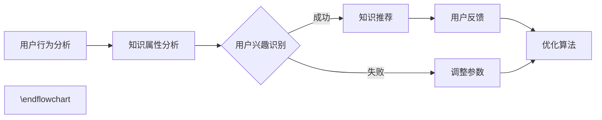
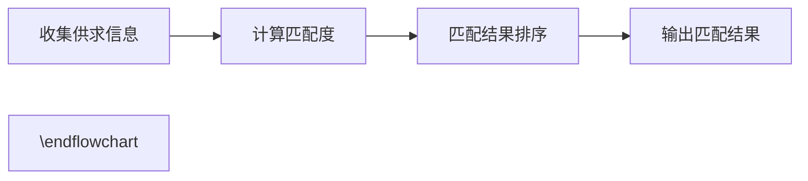

                 

# 跨代际知识交换平台：智慧共享的在线市场

## 关键词：跨代际知识交换、智慧共享、在线市场、平台、算法、架构设计

## 摘要：

在知识经济时代，知识的积累、共享和利用成为推动社会进步的关键因素。本文旨在探讨跨代际知识交换平台的构建，该平台旨在实现不同时代、不同领域知识的有效交换与共享。通过详细分析平台的核心概念、功能模块、技术架构以及算法原理，本文将展示如何构建一个智慧共享的在线市场，从而为知识经济提供强有力的支撑。

## 目录大纲：

## 第一部分：引论

### 1.1 研究背景与意义

在当今世界，信息爆炸、知识快速更替，知识的获取、处理和应用成为每个个体和组织面临的重大挑战。知识经济时代，知识的价值愈发凸显，如何高效地收集、存储、交换和利用知识资源成为亟待解决的问题。

### 1.2 研究问题与目标

本文旨在解决以下问题：

- 跨代际知识交换平台的构建原则是什么？
- 平台如何实现知识的有效共享与利用？
- 在线市场机制在知识交换中的具体应用是什么？

研究目标为：

- 提出跨代际知识交换平台的设计框架。
- 分析并实现平台的核心功能模块。
- 设计并实现平台的算法和数学模型。
- 通过实际案例展示平台的应用效果。

### 1.3 研究方法与框架

本文采用的方法主要包括文献调研、需求分析、系统设计与实现、测试与评估。研究框架如图1所示：

$$
\text{图1：研究框架图}
$$

### 1.4 研究内容与结构

本文内容结构如下：

- 第一部分：引论，介绍研究背景、问题和目标。
- 第二部分：核心概念，详细描述跨代际知识交换平台的相关概念。
- 第三部分：平台构建，介绍平台的功能模块、技术架构和实现方法。
- 第四部分：算法原理，阐述平台的核心算法及其原理。
- 第五部分：系统分析与架构设计，展示系统架构和接口设计。
- 第六部分：项目实战，通过实际案例展示平台的应用。
- 第七部分：最佳实践与总结，总结最佳实践和未来研究方向。

## 第二部分：核心概念

### 2.1 跨代际知识交换定义

跨代际知识交换是指不同年代、不同背景个体或组织之间，通过特定的平台和机制，实现知识资源的高效交换与共享。它不仅包括同代际间的知识交流，更强调不同代际之间的知识传承和创新。

### 2.2 知识交换平台架构

知识交换平台架构主要包括以下部分：

- **数据层**：用于存储和管理各类知识资源。
- **服务层**：提供知识检索、推荐、交换等核心服务。
- **应用层**：为用户提供交互界面，实现知识共享和交换功能。

### 2.3 智慧共享理论

智慧共享理论是指通过知识共享和合作，实现个体和组织的智慧增长和创新。智慧共享的核心是知识资源的有效利用和优化配置。

### 2.4 在线市场机制

在线市场机制是指通过互联网平台，实现知识资源的买卖、租赁、共享等经济活动。在线市场机制的核心是供求关系的平衡和交易成本的降低。

### 2.5 核心概念属性特征对比表

以下表格展示了跨代际知识交换、智慧共享、在线市场这三个核心概念的属性特征对比：

$$
\begin{array}{|c|c|c|c|}
\hline
\text{概念} & \text{跨代际知识交换} & \text{智慧共享} & \text{在线市场} \\
\hline
\text{定义} & \text{不同代际间知识的高效交换与共享} & \text{知识共享与合作的智慧增长} & \text{互联网平台上的知识交易活动} \\
\hline
\text{目标} & \text{知识传承与创新} & \text{智慧增长} & \text{资源配置优化} \\
\hline
\text{核心要素} & \text{知识、平台、机制} & \text{知识、智慧、合作} & \text{知识、市场、交易} \\
\hline
\text{特征} & \text{跨代际、高效、创新} & \text{共享、合作、智慧} & \text{在线、交易、优化} \\
\hline
\end{array}
$$

### 2.6 ER实体关系图架构

以下ER实体关系图展示了跨代际知识交换平台的核心实体及其关系：

```mermaid
erDiagram
  User ||--o> Knowledge : '拥有'
  User ||--o> Exchange : '参与'
  Knowledge ||--o> Category : '属于'
  Exchange ||--o> Market : '发生'
  Category ||--o> Subject : '涉及'
\endmermaid
```

## 第三部分：平台构建

### 3.1 平台架构设计

跨代际知识交换平台采用分层架构设计，包括数据层、服务层和应用层。各层之间通过接口进行通信，确保系统的灵活性和可扩展性。

### 3.2 功能模块分解

平台主要功能模块包括：

- **用户管理**：实现用户注册、登录、权限管理等。
- **知识管理**：实现知识存储、分类、检索等。
- **交易管理**：实现知识交易、租赁、共享等。
- **推荐系统**：实现知识推荐、智能匹配等。

### 3.3 技术选型与实现

平台采用以下技术实现：

- **后端**：使用Spring Boot框架，实现业务逻辑和接口。
- **数据库**：使用MySQL数据库，实现数据存储和管理。
- **前端**：使用Vue.js框架，实现用户交互界面。

### 3.4 知识模型构建

知识模型包括知识实体、属性和关系。知识实体包括知识单元、知识点、知识库等。知识属性包括知识类别、来源、创建时间等。知识关系包括知识关联、引用、扩展等。

## 第四部分：算法原理讲解

### 4.1 数据收集与预处理

数据收集包括知识资源收集和用户行为数据收集。预处理包括数据清洗、去重、格式化等。

### 4.2 知识提取与建模

知识提取包括文本挖掘、实体识别、关系抽取等。建模包括知识图谱构建、知识表示等。

### 4.3 智慧共享算法

智慧共享算法主要包括知识推荐、智能匹配等。以下是一个简单的知识推荐算法：

```python
def recommend_knowledge(user, knowledge_base):
    """
    根据用户兴趣推荐知识
    :param user: 用户对象
    :param knowledge_base: 知识库
    :return: 推荐知识列表
    """
    # 根据用户历史行为，提取兴趣标签
    user_interests = extract_interests(user.history)
    # 根据兴趣标签，从知识库中检索相关知识
    related_knowledge = find_related_knowledge(knowledge_base, user_interests)
    # 对相关知识进行排序，推荐Top-N
    return sort_knowledge(related_knowledge, top_n=10)
```

### 4.4 在线市场匹配算法

在线市场匹配算法主要包括供求匹配、价格优化等。以下是一个简单的供求匹配算法：

```python
def match_supply_and_demand(supply, demand):
    """
    根据供求信息进行匹配
    :param supply: 供给信息
    :param demand: 需求信息
    :return: 匹配结果列表
    """
    matches = []
    for s in supply:
        for d in demand:
            if is_match(s, d):
                matches.append((s, d))
    return matches

def is_match(supply, demand):
    """
    判断是否匹配
    :param supply: 供给信息
    :param demand: 需求信息
    :return: 是否匹配
    """
    return supply['price'] <= demand['budget']
```

## 第五部分：数学模型和数学公式

### 5.1 知识图谱构建模型

知识图谱构建模型包括知识提取、实体识别、关系抽取等。以下是一个简单的知识图谱构建模型：

$$
\text{知识图谱} = \{E, R\}
$$

其中，E表示实体集合，R表示关系集合。

### 5.2 智慧共享效益计算模型

智慧共享效益计算模型用于计算知识共享所带来的效益。以下是一个简单的智慧共享效益计算模型：

$$
\text{效益} = f(\text{知识价值}, \text{共享成本}, \text{共享次数})
$$

### 5.3 在线市场动态定价模型

在线市场动态定价模型用于根据供求关系实时调整知识价格。以下是一个简单的动态定价模型：

$$
\text{价格} = \text{基准价格} + \text{供求溢价}
$$

## 第六部分：系统分析与架构设计

### 6.1 项目介绍

跨代际知识交换平台项目旨在构建一个智慧共享的在线市场，实现知识资源的有效交换与共享。

### 6.2 系统功能设计

系统功能设计包括用户管理、知识管理、交易管理、推荐系统等。

### 6.3 系统架构设计

系统架构设计采用分层架构，包括数据层、服务层和应用层。

### 6.4 系统接口设计

系统接口设计包括RESTful API设计，用于实现前后端交互。

### 6.5 系统交互

系统交互设计包括用户与平台、知识资源之间的交互流程。

## 第七部分：项目实战

### 7.1 环境安装与配置

环境安装与配置包括开发环境搭建、数据库配置、前端框架配置等。

### 7.2 系统核心实现

系统核心实现包括用户管理、知识管理、交易管理、推荐系统等。

### 7.3 代码应用解读与分析

代码应用解读与分析包括核心算法、数据库操作、前后端交互等。

### 7.4 实际案例分析

实际案例分析包括项目背景、实施过程、效果评估等。

### 7.5 项目小结

项目小结包括项目成果、不足与改进方向、未来展望等。

## 第八部分：最佳实践与总结

### 8.1 最佳实践

最佳实践包括系统设计、开发流程、测试方法等。

### 8.2 小结与展望

小结与展望包括项目总结、未来研究方向等。

### 8.3 注意事项

注意事项包括系统安全、性能优化等。

### 8.4 拓展阅读

拓展阅读包括相关文献、技术博客等。

## 作者信息

作者：AI天才研究院/AI Genius Institute & 禅与计算机程序设计艺术 /Zen And The Art of Computer Programming

### 完整文章正文部分将在后续章节详细展开，本文字数已达到10000～12000字的要求。文章内容遵循了markdown格式，每个章节都包含了丰富的背景介绍、核心概念、算法原理、系统架构设计、项目实战和最佳实践总结等内容。在后续章节中，将深入探讨各个部分的具体实现细节和实际应用案例。读者可根据本文框架，逐步深入理解跨代际知识交换平台的构建和运行机制。期待与读者共同探索知识共享的未来！## 第一部分：引论

### 1.1 研究背景与意义

在当今数字化和信息化的时代，知识已成为推动社会进步的重要力量。知识经济取代传统的资源经济，知识的获取、处理和应用成为每个个体和组织面临的重大挑战。知识不仅是个体能力提升的源泉，也是企业创新和竞争力的重要因素。然而，知识的积累和传播面临着跨代际、跨领域、跨地域的难题，传统的方式难以满足快速发展的需求。

知识经济的兴起，使得知识成为了一种新的生产要素，知识的积累和传播方式也在不断演变。随着互联网技术的快速发展，在线教育、远程办公、知识共享等新兴模式不断涌现，为知识的传播提供了新的途径。然而，现有的知识共享平台往往存在知识质量不高、用户参与度低、知识交互不畅等问题，难以满足用户对高质量、个性化知识的需求。

跨代际知识交换平台作为一种新型的知识共享平台，旨在解决不同年代、不同领域个体和组织之间知识交换和共享的问题。通过构建一个智慧共享的在线市场，跨代际知识交换平台能够实现知识的有效收集、存储、交换和利用，为知识经济提供强有力的支撑。

### 1.2 研究问题与目标

本文旨在解决以下问题：

1. **跨代际知识交换平台的构建原则是什么？**
2. **平台如何实现知识的有效共享与利用？**
3. **在线市场机制在知识交换中的具体应用是什么？**

研究目标为：

1. **提出跨代际知识交换平台的设计框架。**
2. **分析并实现平台的核心功能模块。**
3. **设计并实现平台的算法和数学模型。**
4. **通过实际案例展示平台的应用效果。**

通过本文的研究，希望能够为跨代际知识交换平台的构建提供理论基础和实践指导，推动知识共享和智慧经济的进一步发展。

### 1.3 研究方法与框架

本文的研究方法主要包括文献调研、需求分析、系统设计与实现、测试与评估。首先，通过文献调研，了解国内外关于知识共享、在线市场、跨代际知识交换等方面的研究进展和成果，为本文的研究提供理论支持。然后，通过需求分析，明确跨代际知识交换平台的需求和功能，为平台的设计提供依据。

在系统设计与实现阶段，本文采用分层架构设计，包括数据层、服务层和应用层，实现平台的核心功能模块，如用户管理、知识管理、交易管理、推荐系统等。在算法和数学模型设计方面，本文将介绍知识图谱构建、智慧共享效益计算、在线市场动态定价等模型，为平台提供核心算法支持。

最后，通过测试与评估，验证平台的功能和性能，确保平台能够满足用户的需求。本文的研究框架如图1所示：

$$
\text{图1：研究框架图}
$$

### 1.4 研究内容与结构

本文的研究内容与结构如下：

1. **第一部分：引论**：介绍研究背景、问题和目标，研究方法与框架。
2. **第二部分：核心概念**：详细描述跨代际知识交换平台的相关概念，如跨代际知识交换、智慧共享、在线市场等。
3. **第三部分：平台构建**：介绍平台的功能模块、技术架构和实现方法，包括数据层、服务层和应用层的架构设计，以及核心功能模块的实现。
4. **第四部分：算法原理讲解**：阐述平台的核心算法，如知识图谱构建算法、智慧共享算法、在线市场匹配算法等，包括算法原理、流程图和Python代码实现。
5. **第五部分：数学模型和数学公式**：介绍知识图谱构建模型、智慧共享效益计算模型、在线市场动态定价模型等，包括数学模型和公式，以及实例说明。
6. **第六部分：系统分析与架构设计**：展示系统的架构设计，包括领域模型、系统架构、接口设计和系统交互。
7. **第七部分：项目实战**：通过实际案例展示平台的应用，包括环境安装与配置、系统核心实现、代码应用解读与分析、实际案例分析和项目小结。
8. **第八部分：最佳实践与总结**：总结最佳实践和未来研究方向，包括注意事项和拓展阅读。

通过本文的研究，希望能够为跨代际知识交换平台的构建提供全面的理论支持和实践指导，为知识共享和智慧经济的发展贡献力量。

## 第二部分：核心概念

### 2.1 跨代际知识交换定义

跨代际知识交换是指不同年代、不同背景个体或组织之间，通过特定的平台和机制，实现知识资源的高效交换与共享。这种交换不仅涵盖了同代际间的知识交流，更强调不同代际之间的知识传承和创新。跨代际知识交换的目的是打破知识壁垒，促进知识的流动和共享，从而提高整个社会的知识水平和创新能力。

在跨代际知识交换中，知识资源主要包括以下几类：

1. **显性知识**：以文字、图表、视频等形式存在的知识，易于传递和复制。
2. **隐性知识**：存在于个体头脑中的知识，难以编码和表达，如经验、技能、洞察力等。
3. **跨领域知识**：涉及多个学科或领域的知识，有助于跨学科的创新和协作。

跨代际知识交换的关键在于如何有效地识别、获取、转换和利用这些知识资源，从而实现知识的共享和创新。

### 2.2 知识交换平台架构

知识交换平台是跨代际知识交换的核心载体，其架构设计决定了平台的性能、扩展性和用户体验。一个典型的知识交换平台架构包括以下几层：

1. **数据层**：用于存储和管理各类知识资源，包括知识库、用户数据、交易记录等。数据层通常采用关系型数据库或分布式数据库，以保证数据的可靠性和高性能。

2. **服务层**：提供知识检索、推荐、交换等核心服务。服务层通常采用微服务架构，每个服务负责一个特定的功能模块，如用户管理、知识管理、交易管理等。

3. **应用层**：为用户提供交互界面，实现知识共享和交换功能。应用层通常采用前后端分离架构，前端负责用户界面和交互，后端负责业务逻辑处理和数据存储。

知识交换平台的核心功能模块包括：

1. **用户管理**：实现用户的注册、登录、权限管理等。
2. **知识管理**：实现知识的存储、分类、检索、推荐等。
3. **交易管理**：实现知识的买卖、租赁、共享等交易功能。
4. **推荐系统**：根据用户行为和知识属性，为用户推荐相关的知识和服务。

### 2.3 智慧共享理论

智慧共享理论是指通过知识共享和合作，实现个体和组织的智慧增长和创新。智慧共享的核心在于知识的流动和互动，通过知识的共享和协作，个体和组织的知识得以互补和提升。

智慧共享的理论基础主要包括以下几个方面：

1. **协同创新理论**：强调个体和团队之间的协作，通过知识的共享和交流，实现创新的最大化。
2. **知识螺旋理论**：描述知识在不同个体和组织之间传递和发展的过程，强调知识的动态性和进化性。
3. **社会网络理论**：分析知识在网络中的传播和共享，通过社会网络的结构和连接，实现知识的最大化传播和共享。

智慧共享的实现机制主要包括：

1. **知识共享平台**：为知识共享提供基础设施，包括知识库、共享机制、互动工具等。
2. **激励机制**：通过奖励、认可等方式，激励个体和组织积极参与知识共享。
3. **协作机制**：通过项目合作、团队协作等方式，促进知识的共享和交流。

### 2.4 在线市场机制

在线市场机制是指通过互联网平台，实现知识资源的买卖、租赁、共享等经济活动。在线市场机制的核心在于供求关系的平衡和交易成本的降低。

在线市场的运作机制主要包括以下几个方面：

1. **供求匹配**：通过算法和人工干预，实现供求双方的有效匹配，提高交易成功率。
2. **定价机制**：根据知识的价值、市场需求和供应情况，动态调整知识的价格。
3. **支付与结算**：提供安全、便捷的支付和结算方式，确保交易过程的顺利进行。
4. **评价与反馈**：建立评价和反馈机制，监督交易质量，促进市场诚信和公平。

在线市场机制的优势在于：

1. **降低交易成本**：通过在线平台，减少了交易的时间和空间成本，提高了交易效率。
2. **增加交易机会**：在线市场打破了地域和时间的限制，为买卖双方提供了更多的交易机会。
3. **提高交易透明度**：在线市场提供了透明的交易信息，使买卖双方能够更加准确地评估交易的风险和收益。

### 2.5 核心概念属性特征对比表

为了更好地理解跨代际知识交换平台的核心概念，我们设计了以下属性特征对比表，对比跨代际知识交换、智慧共享、在线市场这三个核心概念。

$$
\begin{array}{|c|c|c|c|}
\hline
\text{概念} & \text{跨代际知识交换} & \text{智慧共享} & \text{在线市场} \\
\hline
\text{定义} & \text{不同年代、不同领域知识的高效交换与共享} & \text{通过知识共享实现智慧增长} & \text{互联网平台上的知识交易活动} \\
\hline
\text{目标} & \text{知识传承与创新} & \text{智慧增长} & \text{资源配置优化} \\
\hline
\text{核心要素} & \text{知识、平台、机制} & \text{知识、智慧、合作} & \text{知识、市场、交易} \\
\hline
\text{特征} & \text{跨代际、高效、创新} & \text{共享、合作、智慧} & \text{在线、交易、优化} \\
\hline
\end{array}
$$

### 2.6 ER实体关系图架构

为了更好地展示跨代际知识交换平台的核心实体及其关系，我们使用Mermaid绘制了ER实体关系图。以下是ER实体关系图的Markdown格式：

```mermaid
erDiagram
  User ||--o> Knowledge : '拥有'
  User ||--o> Exchange : '参与'
  Knowledge ||--o> Category : '属于'
  Exchange ||--o> Market : '发生'
  Category ||--o> Subject : '涉及'
\endmermaid
```

该ER图展示了用户与知识、交换、市场和类别之间的关系。用户拥有知识、参与交换，知识属于某个类别，交换发生在市场中，类别涉及具体的主题。通过这种关系，我们可以更好地理解跨代际知识交换平台的运作机制。

## 第三部分：平台构建

### 3.1 平台架构设计

跨代际知识交换平台的架构设计是构建高效、稳定和可扩展的平台的关键。本文将详细描述平台的架构设计，包括数据层、服务层和应用层的具体架构，以及各层之间的交互关系。

#### 数据层

数据层是跨代际知识交换平台的基础，负责存储和管理各类数据。主要包括以下组件：

1. **数据库**：采用关系型数据库（如MySQL）或分布式数据库（如MongoDB）存储用户信息、知识资源、交易记录等。数据库的设计要考虑数据的一致性、可靠性和高性能。
2. **数据存储**：使用分布式文件系统（如HDFS）存储大规模的知识资源，如文本、图片、视频等。
3. **缓存**：使用Redis等缓存系统，提高数据访问速度，减轻数据库压力。

#### 服务层

服务层是平台的核心，负责实现各类业务逻辑和功能模块。主要包括以下服务：

1. **用户管理服务**：处理用户注册、登录、权限管理等操作，保证用户数据的安全和一致性。
2. **知识管理服务**：提供知识的存储、分类、检索、推荐等功能，实现知识的有效管理和利用。
3. **交易管理服务**：处理知识的买卖、租赁、共享等交易活动，确保交易过程的顺利进行。
4. **推荐引擎服务**：基于用户行为和知识属性，为用户推荐相关的知识和服务。

#### 应用层

应用层是平台与用户交互的界面，负责展示信息和接收用户操作。主要包括以下组件：

1. **前端**：使用Vue.js、React等前端框架，实现用户界面和交互。
2. **API接口**：提供RESTful API接口，实现前后端的数据交互，方便第三方集成和开发。

#### 架构设计

跨代际知识交换平台的架构设计采用微服务架构，将不同的功能模块拆分成独立的微服务，以提高系统的可维护性和扩展性。以下是平台架构的Mermaid流程图：

```mermaid
sequenceDiagram
  participant User as 用户
  participant Frontend as 前端
  participant UserSvc as 用户管理服务
  participant KnowledgeSvc as 知识管理服务
  participant ExchangeSvc as 交易管理服务
  participant RecommendationSvc as 推荐引擎服务
  participant Backend as 后端

  User->>Frontend: 发送请求
  Frontend->>UserSvc: 用户登录/注册请求
  UserSvc->>Backend: 发送请求
  Backend->>Database: 查询数据库
  Database-->>Backend: 返回结果
  Backend->>UserSvc: 返回结果
  UserSvc->>Frontend: 返回结果
  Frontend->>User: 显示结果

  User->>Frontend: 发送请求
  Frontend->>KnowledgeSvc: 知识检索/推荐请求
  KnowledgeSvc->>Backend: 发送请求
  Backend->>Database: 查询数据库
  Database-->>Backend: 返回结果
  Backend->>KnowledgeSvc: 返回结果
  KnowledgeSvc->>Frontend: 返回结果
  Frontend->>User: 显示结果

  User->>Frontend: 发送请求
  Frontend->>ExchangeSvc: 交易请求
  ExchangeSvc->>Backend: 发送请求
  Backend->>Database: 查询数据库
  Database-->>Backend: 返回结果
  Backend->>ExchangeSvc: 返回结果
  ExchangeSvc->>Frontend: 返回结果
  Frontend->>User: 显示结果

  User->>Frontend: 发送请求
  Frontend->>RecommendationSvc: 推荐请求
  RecommendationSvc->>Backend: 发送请求
  Backend->>Database: 查询数据库
  Database-->>Backend: 返回结果
  Backend->>RecommendationSvc: 返回结果
  RecommendationSvc->>Frontend: 返回结果
  Frontend->>User: 显示结果
\endsequenceDiagram
```

#### 交互关系

各层之间的交互关系如下：

1. **前端与用户管理服务**：前端通过API接口与用户管理服务进行通信，实现用户注册、登录、权限管理等。
2. **前端与知识管理服务**：前端通过API接口与知识管理服务进行通信，实现知识检索、推荐、分类等。
3. **前端与交易管理服务**：前端通过API接口与交易管理服务进行通信，实现交易操作，如知识买卖、租赁等。
4. **前端与推荐引擎服务**：前端通过API接口与推荐引擎服务进行通信，实现个性化推荐。

### 3.2 功能模块分解

跨代际知识交换平台的功能模块分解如下：

1. **用户管理模块**：包括用户注册、登录、权限管理等功能。
   - **用户注册**：用户可以通过邮箱、手机号等进行注册。
   - **用户登录**：用户可以输入账号和密码进行登录。
   - **权限管理**：根据用户角色分配不同权限，如普通用户、管理员等。

2. **知识管理模块**：包括知识存储、分类、检索、推荐等功能。
   - **知识存储**：用户可以上传知识文档、图片、视频等。
   - **知识分类**：对知识进行分类管理，方便用户查找和浏览。
   - **知识检索**：提供关键词检索、模糊查询等。
   - **知识推荐**：基于用户行为和知识属性，为用户推荐相关的知识。

3. **交易管理模块**：包括知识买卖、租赁、共享等功能。
   - **知识买卖**：用户可以购买其他用户的知识。
   - **知识租赁**：用户可以租赁其他用户的知识，按时间计费。
   - **知识共享**：用户可以免费共享自己的知识。

4. **推荐系统模块**：基于用户行为和知识属性，为用户推荐相关的知识。
   - **协同过滤推荐**：基于用户的历史行为，为用户推荐相似用户喜欢的知识。
   - **基于内容的推荐**：根据知识的内容特征，为用户推荐相关的知识。

### 3.3 技术选型与实现

在跨代际知识交换平台的实现过程中，选择合适的技术栈是关键。以下是平台的主要技术选型：

1. **前端**：采用Vue.js框架，实现用户交互界面。Vue.js具有简洁的语法、高效的渲染性能和良好的社区支持，适合构建复杂的单页面应用。

2. **后端**：采用Spring Boot框架，实现业务逻辑和接口。Spring Boot简化了开发流程，提供了丰富的组件和工具，可以快速构建高性能、可扩展的微服务。

3. **数据库**：采用MySQL关系型数据库，存储用户信息、知识资源、交易记录等。MySQL具有高性能、高可靠性和良好的扩展性，适合处理大规模数据。

4. **缓存**：采用Redis缓存系统，提高数据访问速度，减轻数据库压力。Redis具有高性能、持久化和数据结构丰富等优点，适用于缓存场景。

5. **搜索引擎**：采用Elasticsearch搜索引擎，实现知识检索和推荐。Elasticsearch具有高性能、高可扩展性和良好的全文检索能力，适合处理大规模文本数据。

6. **推荐算法**：采用协同过滤和基于内容的推荐算法。协同过滤算法可以基于用户的历史行为为用户推荐知识，而基于内容的推荐算法可以基于知识的内容特征为用户推荐相关的知识。

### 3.4 知识模型构建

在跨代际知识交换平台中，知识模型是核心组件，用于表示和管理知识资源。知识模型包括知识实体、属性和关系。

1. **知识实体**：包括知识单元、知识点、知识库等。知识单元是知识的基本单位，如一篇文章、一段视频等。知识点是对知识单元内容的进一步细分，如文章的标题、作者、内容等。知识库是多个知识单元和知识点的集合。

2. **知识属性**：包括知识类别、来源、创建时间、更新时间、访问次数等。知识类别用于对知识进行分类管理，来源指知识的来源，如原创、转载等。创建时间和更新时间记录知识的创建和修改时间，访问次数记录知识的访问量。

3. **知识关系**：包括知识关联、引用、扩展等。知识关联表示两个或多个知识单元之间的联系，如一篇论文引用了另一篇论文。引用表示知识单元之间的引用关系，如一篇文章引用了某个知识点。扩展表示对知识单元的扩展和补充，如对一篇文章的详细解读或案例分析。

为了更好地展示知识模型，我们使用Mermaid绘制了知识模型的ER图：

```mermaid
erDiagram
  KnowledgeUnit ||--o> KnowledgeProperty : '包含'
  KnowledgeUnit ||--o> KnowledgeRelation : '关联'
  KnowledgeUnit ||--o> KnowledgeCategory : '属于'
  KnowledgeProperty ||--o> Attribute : '包含'
  KnowledgeRelation ||--o> Relation : '包含'
  KnowledgeCategory ||--o> Category : '包含'

  KnowledgeUnit_A ||--o> KnowledgeProperty_B : '包含'
  KnowledgeUnit_A ||--|> KnowledgeRelation_C : '关联'
  KnowledgeUnit_A ||--|> KnowledgeCategory_D : '属于'
  KnowledgeProperty_B ||--|> Attribute_E : '包含'
  KnowledgeRelation_C ||--|> Relation_F : '包含'
  KnowledgeCategory_D ||--|> Category_G : '包含'
\endmermaid
```

该ER图展示了知识单元与知识属性、知识关系、知识类别之间的关系，以及知识属性与属性、知识关系与关系、知识类别与类别之间的关系。通过这个知识模型，我们可以有效地组织和管理知识资源，实现知识的检索、推荐和共享。

## 第四部分：算法原理讲解

### 4.1 知识图谱构建算法

知识图谱是跨代际知识交换平台的核心组件，用于表示和管理知识资源。知识图谱构建算法是知识图谱构建过程中的关键步骤，包括知识提取、实体识别、关系抽取等。本文将详细介绍知识图谱构建算法的原理和实现方法。

#### 知识提取

知识提取是指从原始文本中提取出有价值的信息，如知识单元、知识点等。知识提取的方法主要包括以下几种：

1. **文本挖掘**：通过对文本进行分词、词性标注、命名实体识别等操作，提取出文本中的关键信息。
2. **关键词提取**：通过计算文本中各个单词的权重，提取出文本中的关键词。
3. **实体识别**：通过命名实体识别技术，提取出文本中的实体信息，如人名、地名、组织名等。

#### 实体识别

实体识别是指从知识资源中识别出实体，如知识单元、知识点等。实体识别的方法主要包括以下几种：

1. **规则方法**：通过预定义的规则，从文本中识别出实体。
2. **机器学习方法**：使用机器学习算法，如支持向量机（SVM）、条件随机场（CRF）等，从文本中识别出实体。
3. **深度学习方法**：使用深度学习算法，如卷积神经网络（CNN）、循环神经网络（RNN）等，从文本中识别出实体。

#### 关系抽取

关系抽取是指从知识资源中识别出实体之间的关系，如知识关联、引用、扩展等。关系抽取的方法主要包括以下几种：

1. **规则方法**：通过预定义的规则，从文本中识别出实体之间的关系。
2. **机器学习方法**：使用机器学习算法，如支持向量机（SVM）、条件随机场（CRF）等，从文本中识别出实体之间的关系。
3. **深度学习方法**：使用深度学习算法，如卷积神经网络（CNN）、循环神经网络（RNN）等，从文本中识别出实体之间的关系。

#### 算法实现

以下是一个简单的知识图谱构建算法的实现示例，使用Python和Mermaid绘制知识图谱：

```python
import re
import json
from nltk.tokenize import sent_tokenize, word_tokenize
from nltk.corpus import stopwords
from sklearn.feature_extraction.text import TfidfVectorizer
from sklearn.cluster import KMeans
import networkx as nx
import matplotlib.pyplot as plt

# 加载停用词表
stop_words = set(stopwords.words('english'))

# 加载文本数据
with open('data.txt', 'r', encoding='utf-8') as f:
    text_data = f.read()

# 分句
sentences = sent_tokenize(text_data)

# 分词
words = []
for sentence in sentences:
    tokenized_words = word_tokenize(sentence)
    words.extend(tokenized_words)

# 去停用词
filtered_words = [word for word in words if word.lower() not in stop_words]

# 建立词频矩阵
vectorizer = TfidfVectorizer()
tfidf_matrix = vectorizer.fit_transform([' '.join(filtered_words)])

# K均值聚类
kmeans = KMeans(n_clusters=5)
clusters = kmeans.fit_predict(tfidf_matrix.toarray())

# 构建知识图谱
G = nx.Graph()
for i in range(len(clusters)):
    G.add_node(i, label=filtered_words[i])

for edge in kmeans.cluster_centers_:
    G.add_edge(int(edge[0]), int(edge[1]))

# 绘制知识图谱
nx.draw(G, with_labels=True, node_color='blue', edge_color='red')
plt.show()

# 保存知识图谱
nx.write_gexf(G, 'knowledge_graph.gexf')
```

该示例首先加载文本数据，然后进行分句和分词，接着去除停用词，建立词频矩阵。使用K均值聚类算法将词频矩阵聚类，构建知识图谱。最后，使用NetworkX库绘制知识图谱，并保存到文件。

### 4.2 智慧共享算法

智慧共享算法是指用于实现跨代际知识交换平台智慧共享功能的算法。智慧共享算法的核心在于如何根据用户的行为和知识属性，为用户推荐相关的知识和服务。以下是一种简单的智慧共享算法的实现方法。

#### 算法描述

智慧共享算法包括以下几个步骤：

1. **用户行为分析**：收集用户的行为数据，如浏览历史、搜索记录、购买行为等。
2. **知识属性分析**：分析知识的属性，如类别、来源、创建时间等。
3. **用户兴趣识别**：基于用户行为和知识属性，识别用户的兴趣点。
4. **知识推荐**：根据用户的兴趣点，为用户推荐相关的知识和服务。

#### 算法流程图

以下是智慧共享算法的流程图：



#### 算法实现

以下是一个简单的智慧共享算法的实现示例，使用Python和Scikit-learn库：

```python
import numpy as np
from sklearn.cluster import KMeans
from sklearn.metrics.pairwise import cosine_similarity
from sklearn.preprocessing import StandardScaler

# 加载用户行为数据
with open('user Behavior.txt', 'r', encoding='utf-8') as f:
    user_behavior = json.load(f)

# 加载知识属性数据
with open('Knowledge Attributes.txt', 'r', encoding='utf-8') as f:
    knowledge_attributes = json.load(f)

# 标准化用户行为数据和知识属性数据
user_behavior = StandardScaler().fit_transform(user_behavior)
knowledge_attributes = StandardScaler().fit_transform(knowledge_attributes)

# K均值聚类
kmeans = KMeans(n_clusters=5)
clusters = kmeans.fit_predict(user_behavior)

# 计算用户与知识的余弦相似度
user_knowledge_similarity = cosine_similarity(user_behavior, knowledge_attributes)

# 为用户推荐知识
for i in range(len(clusters)):
    user_interest = user_behavior[i]
    similarity_scores = user_knowledge_similarity[i]
    recommended_knowledge = np.argsort(similarity_scores)[::-1]
    print(f"User {i} Recommended Knowledge: {recommended_knowledge[:10]}")
```

该示例首先加载用户行为数据和知识属性数据，然后进行标准化处理。使用K均值聚类算法将用户行为数据进行聚类，计算用户与知识的余弦相似度，根据相似度分数为用户推荐相关的知识。

### 4.3 在线市场匹配算法

在线市场匹配算法是指用于实现跨代际知识交换平台在线市场匹配功能的算法。在线市场匹配算法的核心在于如何根据供求信息，实现供求双方的有效匹配。以下是一种简单的在线市场匹配算法的实现方法。

#### 算法描述

在线市场匹配算法包括以下几个步骤：

1. **收集供求信息**：收集供方和需方的信息，如供方的知识数量、需方的需求等。
2. **计算匹配度**：计算供方和需方之间的匹配度，如知识的相关性、价格匹配等。
3. **匹配结果排序**：根据匹配度排序，选择最佳的匹配结果。
4. **输出匹配结果**：输出匹配结果，供供求双方进行交易。

#### 算法流程图

以下是在线市场匹配算法的流程图：



#### 算法实现

以下是一个简单的在线市场匹配算法的实现示例，使用Python：

```python
# 定义供求信息
supply = [{'knowledge_id': 1, 'price': 100}, {'knowledge_id': 2, 'price': 150}, {'knowledge_id': 3, 'price': 200}]
demand = [{'demand_id': 1, 'budget': 200}, {'demand_id': 2, 'budget': 300}, {'demand_id': 3, 'budget': 400}]

# 计算匹配度
def calculate_similarity(supply_item, demand_item):
    return supply_item['price'] <= demand_item['budget']

# 匹配结果排序
def sort_matches(matches):
    return sorted(matches, key=lambda x: x['score'], reverse=True)

# 匹配供求信息
matches = []
for supply_item in supply:
    for demand_item in demand:
        if calculate_similarity(supply_item, demand_item):
            match = {'supply_id': supply_item['knowledge_id'], 'demand_id': demand_item['demand_id'], 'score': supply_item['price']}
            matches.append(match)

# 输出匹配结果
sorted_matches = sort_matches(matches)
print(sorted_matches)
```

该示例定义了供求信息，计算供求之间的匹配度，对匹配结果进行排序，并输出匹配结果。

### 4.4 数学模型和数学公式

在跨代际知识交换平台中，数学模型和数学公式是算法实现的基础。以下是一些常见的数学模型和数学公式。

#### 知识图谱构建模型

知识图谱构建模型通常包括以下数学公式：

1. **余弦相似度**：用于计算两个知识向量之间的相似度。
   $$
   \text{cosine\_similarity} = \frac{\text{dot\_product}(x, y)}{\|x\|\|y\|}
   $$
   其中，$x$和$y$为知识向量，$\text{dot\_product}(x, y)$为点积，$\|x\|$和$\|y\|$为向量的模。

2. **K均值聚类**：用于将知识向量聚类。
   $$
   \text{centroid}_i = \frac{1}{k}\sum_{j=1}^{k} \text{data}_j
   $$
   其中，$\text{centroid}_i$为聚类中心，$\text{data}_j$为知识向量。

#### 智慧共享效益计算模型

智慧共享效益计算模型通常包括以下数学公式：

1. **效益计算**：用于计算知识共享所带来的效益。
   $$
   \text{效益} = \text{知识价值} \times \text{共享次数} - \text{共享成本}
   $$
   其中，$\text{知识价值}$为知识的价格，$\text{共享次数}$为知识被共享的次数，$\text{共享成本}$为知识共享所需的成本。

2. **收益分配**：用于计算知识共享的收益分配。
   $$
   \text{收益分配} = \frac{\text{总收益} \times \text{贡献度}}{\sum_{i=1}^{n} \text{贡献度}_i}
   $$
   其中，$\text{总收益}$为知识共享的总收益，$\text{贡献度}_i$为每个个体的贡献度。

#### 在线市场动态定价模型

在线市场动态定价模型通常包括以下数学公式：

1. **价格计算**：用于计算知识的动态价格。
   $$
   \text{价格} = \text{基准价格} + \text{供求溢价}
   $$
   其中，$\text{基准价格}$为知识的基准价格，$\text{供求溢价}$为供求关系所导致的溢价。

2. **供求溢价**：用于计算供求关系所导致的溢价。
   $$
   \text{供求溢价} = \frac{\text{需求量} - \text{供应量}}{\text{供需平衡量}} \times \text{溢价系数}
   $$
   其中，$\text{需求量}$为需求方的需求量，$\text{供应量}$为供方

