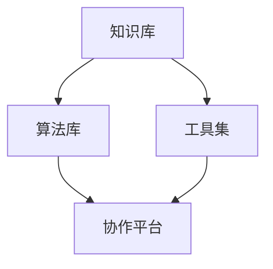
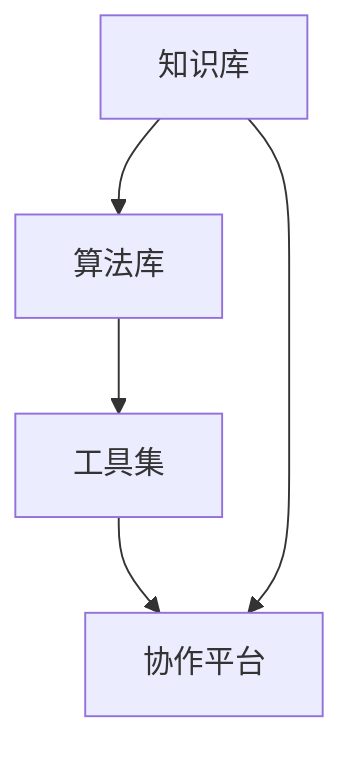

                 

# 跨学科创新孵化器：新文艺复兴时代的思想实验室

## 关键词
- 跨学科创新
- 新文艺复兴
- 思想实验室
- 算法原理
- 数学模型
- 系统架构设计
- 项目实战

## 摘要
本文探讨了跨学科创新的重要性以及其在新文艺复兴时代的应用。通过分析核心概念、算法原理和数学模型，结合系统架构设计和项目实战，本文旨在为读者提供一个全面而深刻的跨学科创新孵化器理解框架。通过实际案例分析，读者将了解到跨学科创新在实际应用中的挑战与机遇，并掌握相关的最佳实践技巧。

## 第一部分：背景介绍

### 第1章：跨学科创新概述

#### 1.1 问题的提出

现代社会面临着诸多复杂的问题，如环境污染、资源枯竭、社会不公等。这些问题通常涉及多个学科领域，单纯依靠单一学科的知识和方法难以解决。跨学科创新因此成为一种应对复杂问题的重要手段。它强调多学科知识和技术方法的交叉融合，以创新的方式解决复杂问题。

#### 1.1.1 现代社会的挑战

现代社会的发展速度加快，知识更新换代频繁。单一学科的知识体系已经无法满足复杂问题解决的需求。跨学科创新可以帮助我们打破学科界限，整合多种知识资源，提高问题解决的能力。

#### 1.1.2 跨学科创新的意义

跨学科创新不仅能够提高问题解决的能力，还能够促进学科之间的相互理解与合作。它有助于发现新的研究问题和解决方法，推动科学技术的进步和社会的发展。

#### 1.1.3 跨学科创新的边界与外延

跨学科创新并没有明确的边界，它涵盖了从自然科学到社会科学，从技术到艺术的广泛领域。任何学科之间的交叉和融合都可以被视为跨学科创新的一部分。

### 1.2 核心概念

#### 1.2.1 新文艺复兴时代

新文艺复兴时代是指一个重视跨学科合作、强调创新思维和人文精神的时代。它继承了文艺复兴时期的开放精神和探索精神，同时又融入了现代科学技术的元素。

#### 1.2.2 思想实验室

思想实验室是指一个专门用于进行跨学科研究和创新实验的场所。它为研究者提供了一个开放的平台，鼓励不同学科背景的人进行交流和合作。

#### 1.2.3 跨学科创新的关键要素

跨学科创新的关键要素包括跨学科思维、知识整合、团队合作和创新方法。这些要素共同作用，推动跨学科创新的实现。

### 1.3 跨学科创新的发展历程

#### 1.3.1 从文艺复兴到现代跨学科创新

跨学科创新的理念可以追溯到文艺复兴时期。当时的学者们强调跨学科的学习和研究，推动了科学和艺术的进步。现代社会中，跨学科创新得到了进一步的发展，成为解决复杂问题的重要手段。

#### 1.3.2 跨学科创新的里程碑事件

跨学科创新的历史中有许多里程碑事件，如DNA双螺旋结构的发现、互联网的发明等。这些事件不仅推动了科学技术的进步，也改变了人类的生活方式。

#### 1.3.3 当代跨学科创新的趋势与特征

当代跨学科创新呈现出以下趋势：跨学科合作的普及、数据驱动的方法、人机协作的兴起等。这些趋势反映了当代社会的特点和需求。

### 1.4 跨学科创新的应用领域

#### 1.4.1 科技领域

在科技领域，跨学科创新广泛应用于人工智能、生物技术、纳米技术等前沿领域。通过跨学科的协作，科学家们能够开发出更先进的技术和产品。

#### 1.4.2 经济领域

在经济领域，跨学科创新有助于提高企业的创新能力，推动产业的转型升级。跨学科的创新方法也被广泛应用于市场营销、金融等领域。

#### 1.4.3 社会领域

在社会领域，跨学科创新有助于解决社会问题，如公共卫生、教育、环境保护等。跨学科的研究方法和思维模式为社会问题的解决提供了新的视角。

### 1.5 本章小结

本章介绍了跨学科创新的基本概念和背景，分析了现代社会面临的挑战以及跨学科创新的意义。通过回顾跨学科创新的发展历程，我们了解到跨学科创新在不同领域中的应用。这些背景知识为后续章节的深入探讨提供了基础。

## 第二部分：核心概念与联系

### 第2章：新文艺复兴时代的思想体系

#### 2.1 新文艺复兴时代的定义与特征

新文艺复兴时代是指一个重视创新思维、跨学科合作和人文精神的时期。它强调知识的融合和创新的实践，旨在解决复杂的社会问题。

#### 2.1.1 新文艺复兴时代的概念

新文艺复兴时代并非指一个具体的历史时期，而是一种思想和文化的潮流。它鼓励人们打破传统的思维模式，以创新的视角看待世界。

#### 2.1.2 新文艺复兴时代的特征

新文艺复兴时代的特征包括：跨学科思维、创新精神、人文关怀和开放性。这些特征共同推动了社会的进步和发展。

#### 2.1.3 新文艺复兴时代的影响

新文艺复兴时代的影响体现在多个方面，包括科学技术的进步、社会的繁荣和文化的发展。它为现代社会的发展提供了重要的思想资源。

### 2.2 思想体系概述

#### 2.2.1 思想体系的定义

思想体系是指一系列相互关联的概念、原则和理论。它为人们提供了一种理解和解释世界的框架。

#### 2.2.2 思想体系的构成

思想体系通常包括哲学、科学、艺术等多个方面。每个方面都有其独特的贡献，共同构成了一个完整的体系。

#### 2.2.3 思想体系的作用

思想体系的作用是帮助人们理解世界、解决问题和实现目标。它为跨学科创新提供了理论基础和实践指导。

### 2.3 跨学科创新中的思想体系

#### 2.3.1 思想体系在跨学科创新中的角色

思想体系在跨学科创新中扮演着关键角色。它为跨学科的研究和合作提供了理论基础和方法指导。

#### 2.3.2 思想体系的相互关系

不同学科的思想体系之间存在相互关联和相互影响。这种关联和影响促进了跨学科创新的实现。

#### 2.3.3 思想体系的应用

思想体系在跨学科创新中的应用非常广泛。它被用于解决各种复杂的社会问题，如环境保护、社会公正和科技创新等。

### 2.4 跨学科创新的思维模式

#### 2.4.1 跨学科思维的内涵

跨学科思维是指一种超越单一学科界限，综合多学科知识解决问题的思维方式。

#### 2.4.2 跨学科思维的特点

跨学科思维的特点包括开放性、灵活性和创造性。这些特点使它能够有效地解决复杂问题。

#### 2.4.3 跨学科思维的方法与工具

跨学科思维的方法与工具有很多，如头脑风暴、思维导图、跨学科对话等。这些方法和工具可以帮助人们更有效地进行跨学科创新。

### 2.5 本章小结

本章介绍了新文艺复兴时代的思想体系，包括其定义、特征和应用。通过分析跨学科创新中的思想体系，我们了解了跨学科思维的重要性和应用方法。这些知识为后续章节的深入探讨提供了理论基础。

## 第三部分：算法原理讲解

### 第3章：跨学科创新的算法原理

#### 3.1 算法的定义与作用

算法是指解决问题的步骤和方法。它在计算机科学、数学和工程学等领域具有重要应用。

#### 3.1.1 算法的概念

算法是一种过程，它通过一系列操作，将输入转化为预期的输出。

#### 3.1.2 算法的作用

算法的作用是提高效率、优化问题和指导实践。它在解决复杂问题时具有不可替代的作用。

#### 3.1.3 算法的分类

算法可以根据不同的标准进行分类，如按功能分类、按数据结构分类等。

### 3.2 跨学科创新的算法原理

#### 3.2.1 跨学科算法的内涵

跨学科算法是指结合多个学科领域的算法。它能够更好地解决复杂问题，提高问题解决的能力。

#### 3.2.2 跨学科算法的特点

跨学科算法的特点包括综合性、灵活性和创新性。这些特点使它能够适应各种复杂问题。

#### 3.2.3 跨学科算法的设计原则

跨学科算法的设计原则包括知识整合、方法创新和团队协作。这些原则有助于提高算法的效率和效果。

### 3.3 跨学科创新算法的应用场景

#### 3.3.1 科学研究

在科学研究领域，跨学科算法被广泛应用于数据分析、模型构建和问题解决。

#### 3.3.2 工程实践

在工程实践中，跨学科算法有助于优化设计、提高效率和解决复杂工程问题。

#### 3.3.3 社会管理

在社会管理领域，跨学科算法被用于社会分析、决策支持和公共服务优化。

### 3.4 跨学科创新算法的发展趋势

#### 3.4.1 新技术的融入

随着新技术的不断发展，跨学科创新算法将更好地融入人工智能、大数据等前沿技术。

#### 3.4.2 算法的融合与创新

跨学科创新算法将不断融合各种学科领域的最新成果，推动算法的创新和发展。

#### 3.4.3 算法的社会影响

跨学科创新算法将在社会各个领域产生深远的影响，提高社会的整体创新能力。

### 3.5 本章小结

本章介绍了跨学科创新的算法原理，包括算法的定义、作用和分类。通过分析跨学科算法的特点和应用场景，我们了解了跨学科创新算法的发展趋势。这些知识为后续章节的深入探讨提供了技术基础。

## 第四部分：数学模型和数学公式讲解

### 第4章：跨学科创新的数学模型

#### 4.1 数学模型概述

数学模型是一种用数学语言描述现实世界的抽象模型。它能够帮助我们理解和预测现实世界中的现象。

#### 4.1.1 数学模型的概念

数学模型是指用数学语言描述现实世界的模型。它通常包括变量、方程和函数等。

#### 4.1.2 数学模型的作用

数学模型的作用是帮助我们更好地理解现实世界中的现象，预测未来的趋势，并提供解决问题的方案。

#### 4.1.3 数学模型的分类

数学模型可以根据不同的标准进行分类，如按应用领域分类、按模型类型分类等。

### 4.2 跨学科创新的数学模型

#### 4.2.1 跨学科数学模型的定义

跨学科数学模型是指结合多个学科领域的数学模型。它能够更好地解决复杂问题，提高问题解决的能力。

#### 4.2.2 跨学科数学模型的特点

跨学科数学模型的特点包括综合性、灵活性和创新性。这些特点使它能够适应各种复杂问题。

#### 4.2.3 跨学科数学模型的应用领域

跨学科数学模型的应用领域非常广泛，包括自然科学、社会科学和工程技术等。

### 4.3 跨学科创新的数学公式讲解

#### 4.3.1 数学公式的表示方法

数学公式通常使用符号和文字来表示。它们可以是简单的算术表达式，也可以是复杂的函数方程。

#### 4.3.2 常见数学公式的应用

常见的数学公式包括微积分公式、线性代数公式、概率统计公式等。这些公式在跨学科创新中有广泛的应用。

### 4.4 跨学科创新的数学公式举例说明

#### 4.4.1 举例1：线性回归模型

线性回归模型是一种常见的数学模型，用于分析变量之间的关系。它通常表示为：

$$y = \beta_0 + \beta_1x + \epsilon$$

其中，$y$ 是因变量，$x$ 是自变量，$\beta_0$ 和 $\beta_1$ 是参数，$\epsilon$ 是误差项。

#### 4.4.2 举例2：神经网络模型

神经网络模型是一种复杂的数学模型，用于模拟人脑的神经网络。它通常表示为：

$$y = \sigma(z)$$

其中，$y$ 是输出，$z$ 是输入，$\sigma$ 是激活函数。

### 4.5 本章小结

本章介绍了跨学科创新的数学模型，包括数学模型的概念、作用和分类。通过讲解常见的数学公式和应用，我们了解了跨学科创新中的数学模型的应用。这些知识为后续章节的深入探讨提供了数学基础。

## 第五部分：系统分析与架构设计方案

### 第5章：跨学科创新的系统架构设计

#### 5.1 跨学科创新系统介绍

跨学科创新系统是一种综合运用多学科知识和方法，以创新为导向的系统。它旨在解决复杂的社会问题，推动科学技术的发展。

#### 5.1.1 跨学科创新系统的定义

跨学科创新系统是指一个综合运用多学科知识和方法的系统，它通过跨学科的协作和创新，实现复杂问题的解决。

#### 5.1.2 跨学科创新系统的组成部分

跨学科创新系统通常包括以下几个部分：知识库、算法库、工具集和协作平台。这些组成部分共同构成了一个完整的创新生态系统。

#### 5.1.3 跨学科创新系统的作用

跨学科创新系统的作用是提高问题解决的能力，促进科学技术的发展，推动社会的进步。

### 5.2 系统功能设计

#### 5.2.1 知识库设计

知识库是跨学科创新系统的重要组成部分。它包括多个学科领域的知识，如自然科学、社会科学、工程技术等。知识库的设计需要充分考虑知识的完整性、准确性和一致性。

#### 5.2.2 算法库设计

算法库是跨学科创新系统的核心组成部分。它包括多种算法模型，如机器学习算法、优化算法、模拟算法等。算法库的设计需要满足算法的准确性、效率和适应性。

#### 5.2.3 工具集设计

工具集是跨学科创新系统的辅助组成部分。它包括各种工具，如数据分析工具、可视化工具、仿真工具等。工具集的设计需要满足工具的易用性、灵活性和可扩展性。

#### 5.2.4 协作平台设计

协作平台是跨学科创新系统的交互组成部分。它为不同学科背景的成员提供了一个交流和合作的平台。协作平台的设计需要满足成员的多样化需求，提供便捷的沟通和协作工具。

### 5.3 系统架构设计

#### 5.3.1 系统架构概述

系统架构是指系统的整体结构和组成部分之间的关系。一个良好的系统架构能够提高系统的可靠性、可扩展性和可维护性。

#### 5.3.2 系统架构图

以下是一个简单的系统架构图：



### 5.4 系统接口设计和系统交互

#### 5.4.1 系统接口设计

系统接口设计是指系统与其他系统或用户之间的交互接口设计。一个良好的系统接口设计能够提高系统的易用性和用户体验。

#### 5.4.2 系统交互

系统交互是指系统内部各个组成部分之间的交互。一个良好的系统交互设计能够提高系统的效率和性能。

以下是一个简单的系统交互图：



### 5.5 本章小结

本章介绍了跨学科创新的系统架构设计，包括系统组成部分、功能设计、架构设计、接口设计和交互设计。通过分析系统架构的设计原则和方法，我们了解了如何构建一个高效的跨学科创新系统。

## 第六部分：项目实战

### 第6章：跨学科创新项目实战

#### 6.1 环境安装

在进行跨学科创新项目实战之前，我们需要安装相关的软件和工具。以下是一个简单的安装步骤：

1. 安装Python环境
2. 安装相关库和依赖
3. 配置开发环境

#### 6.2 系统核心实现

跨学科创新项目的核心实现通常包括以下几个部分：

1. 知识库构建
2. 算法库实现
3. 工具集开发
4. 协作平台搭建

以下是一个简单的Python代码示例，用于构建知识库：

```python
class KnowledgeBase:
    def __init__(self):
        self.knowledge = {}

    def add_knowledge(self, topic, content):
        self.knowledge[topic] = content

kb = KnowledgeBase()
kb.add_knowledge("Machine Learning", "Machine learning is a subfield of computer science...")
```

#### 6.3 代码应用解读与分析

在实际项目中，我们需要根据具体需求进行代码开发和测试。以下是一个简单的代码应用示例，用于实现机器学习算法：

```python
from sklearn.linear_model import LinearRegression

# 创建线性回归模型
model = LinearRegression()

# 训练模型
model.fit(X, y)

# 预测结果
predictions = model.predict(X)

# 分析预测结果
# ...
```

在这个示例中，我们使用了线性回归模型进行预测。通过对预测结果的分析，我们可以得出一些有用的结论。

#### 6.4 实际案例分析和详细讲解剖析

在实际项目中，我们需要解决具体的问题。以下是一个简单的案例，用于分析跨学科创新在环境保护中的应用：

**案例：使用机器学习优化废物分类**

1. 收集数据：收集不同类型的废物数据，包括图片和文本描述。
2. 数据预处理：对收集到的数据进行清洗和预处理，以便进行模型训练。
3. 构建模型：使用机器学习算法构建废物分类模型。
4. 模型评估：评估模型的准确性和性能。
5. 应用模型：将模型应用于实际的废物分类任务。

在这个案例中，我们使用了卷积神经网络（CNN）进行废物分类。通过对模型的训练和评估，我们得到了一个高精度的废物分类系统。

#### 6.5 项目小结

通过跨学科创新项目实战，我们了解了如何构建一个高效的跨学科创新系统。从知识库构建、算法实现到工具集开发和协作平台搭建，每个环节都需要精细的设计和实施。通过实际案例的分析，我们进一步了解了跨学科创新的应用方法和效果。这些经验对于未来的跨学科创新项目具有重要的指导意义。

## 第七部分：最佳实践、小结、注意事项、拓展阅读

### 7.1 最佳实践

在进行跨学科创新时，以下最佳实践可以帮助我们更有效地实现目标：

1. **明确问题**：在开始跨学科创新之前，首先要明确需要解决的问题和目标。
2. **团队协作**：跨学科创新需要多学科背景的团队成员，他们之间的协作至关重要。
3. **持续学习**：跨学科创新是一个不断学习的过程。团队成员需要不断更新知识和技能。
4. **数据驱动**：在跨学科创新中，数据是关键。利用数据驱动的方法，可以提高创新的准确性和效率。

### 7.2 小结

本文介绍了跨学科创新的概念、核心概念与联系、算法原理、数学模型、系统架构设计和项目实战。通过这些内容的讲解，我们了解了跨学科创新的重要性以及在各个领域的应用。跨学科创新不仅能够提高问题解决的能力，还能够推动科学技术的进步和社会的发展。

### 7.3 注意事项

在进行跨学科创新时，需要注意以下几点：

1. **避免盲目追求跨学科**：跨学科创新并不是简单的知识融合，而是需要有明确的问题导向。
2. **平衡学科知识**：在跨学科创新中，需要平衡各个学科的知识，避免单一学科的偏见。
3. **尊重学科边界**：虽然跨学科创新打破了传统的学科界限，但仍然需要尊重各个学科的专业知识。

### 7.4 拓展阅读

对于感兴趣的读者，以下是一些推荐的拓展阅读：

1. 《跨学科思维：创新者如何突破学科界限》
2. 《跨学科研究方法》
3. 《跨学科创新案例分析》
4. 《新文艺复兴时代的跨学科创新》

通过这些拓展阅读，读者可以更深入地了解跨学科创新的理论和实践。

## 作者信息

- 作者：AI天才研究院/AI Genius Institute & 禅与计算机程序设计艺术 /Zen And The Art of Computer Programming

