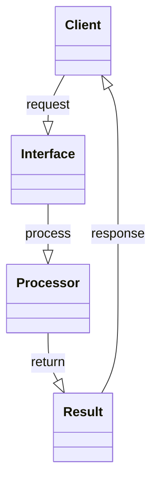
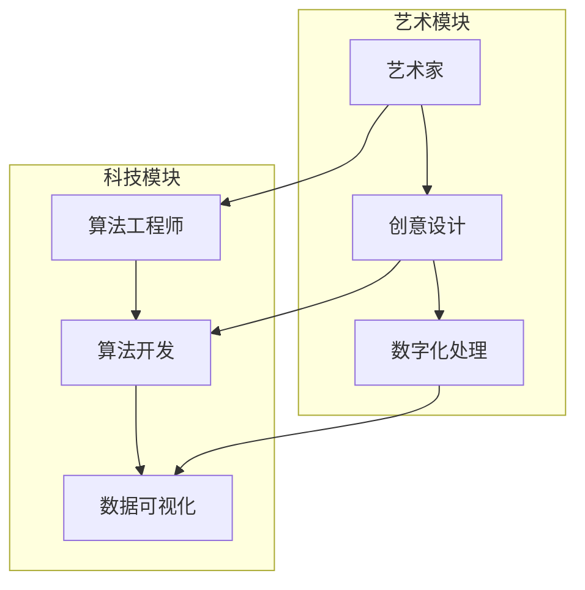
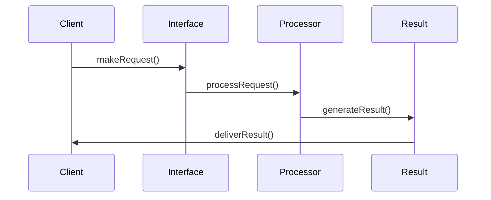
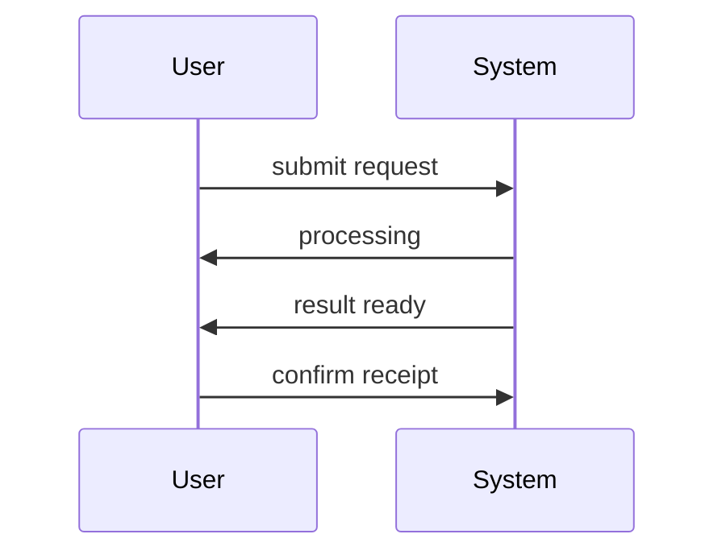
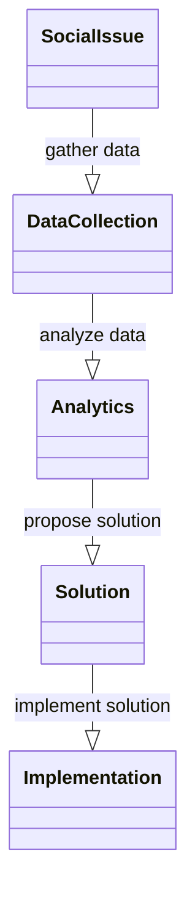
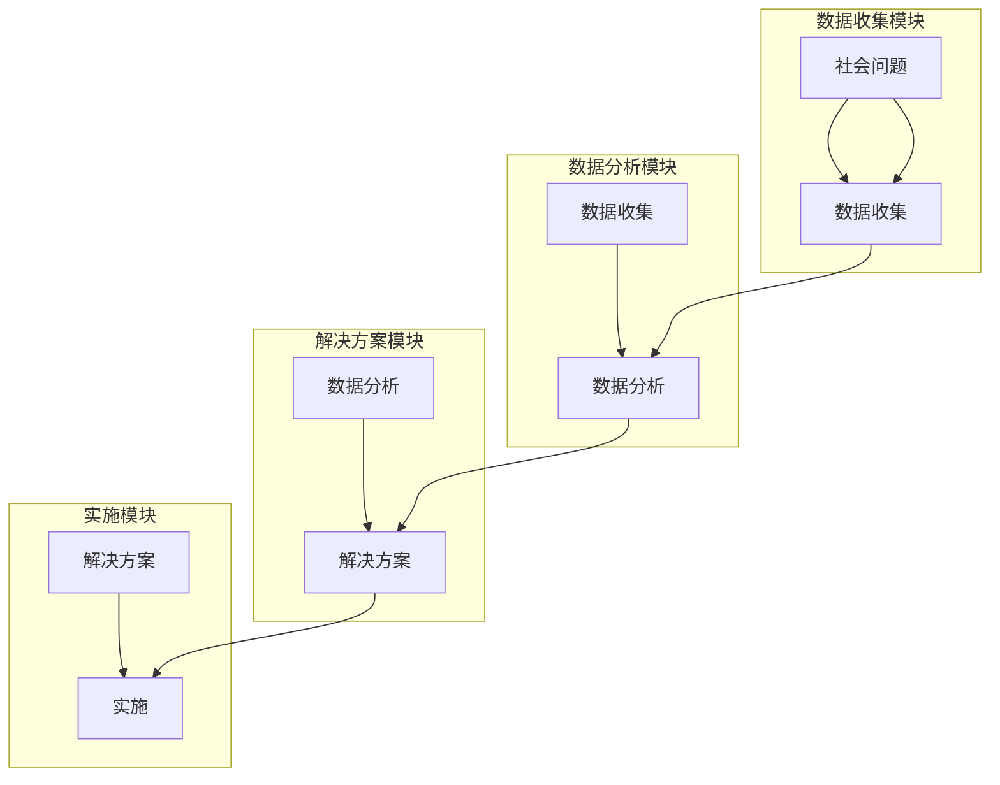
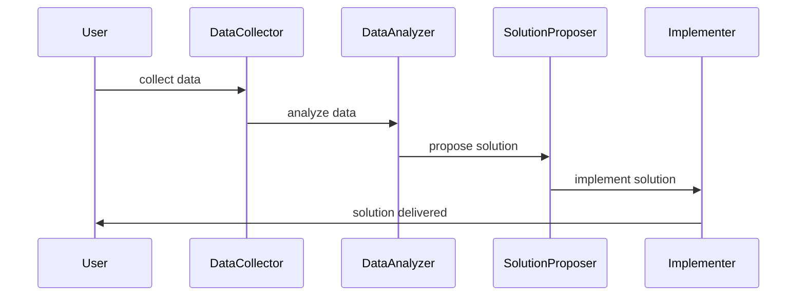
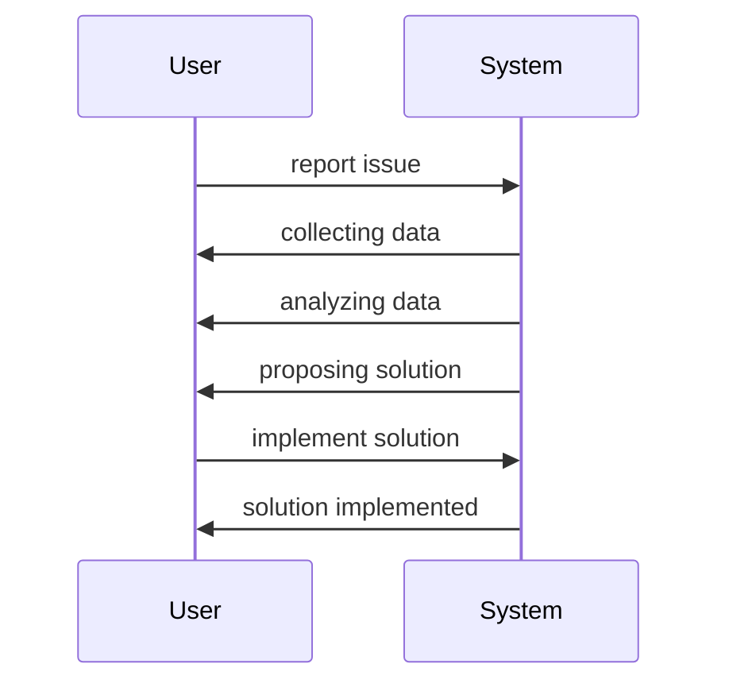
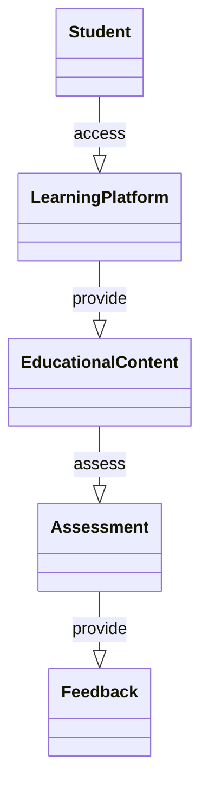

                 

```markdown
# 跨学科创新实验室：新文艺复兴的孵化器

## 引言

随着科技的迅猛发展和社会的深刻变革，传统的学科边界逐渐模糊，跨学科创新成为推动社会进步的重要动力。本文以“跨学科创新实验室：新文艺复兴的孵化器”为主题，旨在探讨跨学科创新的重要性、方法与实践，以及其对未来发展的潜在影响。

### 关键词

- 跨学科创新
- 实验室
- 新文艺复兴
- 孵化器
- 方法论
- 实践案例
- 未来展望

### 摘要

本文首先介绍了跨学科创新的背景和核心概念，探讨了其与传统学科的对比和价值。接着，分析了跨学科创新的方法论，包括思维的培养、团队建设和项目管理。随后，通过具体的实验室建设案例，展示了跨学科创新在创意产业、社会创新和教育创新中的应用。最后，本文展望了跨学科创新实验室的未来发展，提出了国际化策略和未来趋势，并进行了实践反思和拓展阅读。

## 目录大纲

### 第一部分：跨学科创新概述

#### 第1章：跨学科创新的时代背景

##### 1.1 新文艺复兴的崛起

- 背景介绍
- 问题背景与描述
- 问题解决途径
- 边界与外延
- 概念结构与核心要素组成

##### 1.2 跨学科创新的核心概念

- 跨学科创新的定义
- 跨学科创新的特点
- 跨学科创新与传统学科的对比

##### 1.3 跨学科创新的价值

- 创新驱动发展
- 解决复杂问题
- 促进交叉领域融合

##### 1.4 跨学科创新的挑战与机遇

- 挑战
- 机遇
- 潜在应用领域

### 第2章：跨学科创新的方法论

##### 2.1 跨学科思维的培养

- 跨学科思维的重要性
- 培养跨学科思维的途径
- 案例分析

##### 2.2 跨学科团队建设

- 跨学科团队的优势
- 团队建设的策略
- 团队协作工具

##### 2.3 跨学科项目的管理

- 项目管理的方法
- 跨学科项目的特殊挑战
- 项目成功的要素

### 第二部分：跨学科创新实验室的实践

#### 第3章：跨学科创新实验室的构建

##### 3.1 实验室的基本概念

- 实验室的定义
- 实验室的功能
- 实验室的组织结构

##### 3.2 实验室的建设策略

- 资源配置
- 技术支撑
- 人才引进

##### 3.3 实验室的管理模式

- 管理体系
- 运营机制
- 激励机制

#### 第4章：跨学科创新实验室的项目案例

##### 4.1 创意产业：艺术与科技的融合

- 项目介绍
- 系统功能设计（领域模型类图）
- 系统架构设计（架构图）
- 系统接口设计（接口设计图）
- 系统交互（序列图）

##### 4.2 社会创新：科技与人文的结合

- 项目介绍
- 系统功能设计（领域模型类图）
- 系统架构设计（架构图）
- 系统接口设计（接口设计图）
- 系统交互（序列图）

##### 4.3 教育创新：科技与教育的交融

- 项目介绍
- 系统功能设计（领域模型类图）
- 系统架构设计（架构图）
- 系统接口设计（接口设计图）
- 系统交互（序列图）

### 第三部分：跨学科创新实验室的未来发展

#### 第5章：跨学科创新实验室的国际化

##### 5.1 国际化背景

- 全球化趋势
- 跨国合作的重要性

##### 5.2 国际化策略

- 文化融合
- 人才交流
- 国际合作项目

##### 5.3 国际化挑战与机遇

- 挑战
- 机遇
- 潜在应用领域

#### 第6章：跨学科创新实验室的未来展望

##### 6.1 新技术的影响

- 人工智能
- 大数据
- 虚拟现实

##### 6.2 未来发展趋势

- 新兴领域的探索
- 产业融合
- 创新生态的构建

##### 6.3 跨学科创新实验室的使命与责任

- 社会责任
- 人才培养
- 科技创新

#### 第7章：跨学科创新实验室的实践反思

##### 7.1 成功经验

- 成功案例分析
- 最佳实践分享

##### 7.2 挑战与反思

- 面临的挑战
- 反思与改进

##### 7.3 拓展阅读

- 相关书籍推荐
- 学术论文参考
- 实践指南

## 结语

跨学科创新实验室作为新文艺复兴的孵化器，承载着推动社会进步的重要使命。本文通过详细的论述，揭示了跨学科创新的重要性、方法与实践，以及未来发展的方向。我们期待跨学科创新实验室能够在未来的科技发展中发挥更大的作用，引领新文艺复兴的潮流。

### 参考文献

- ...（列出参考文献）


## 作者信息

- 作者：AI天才研究院/AI Genius Institute & 禅与计算机程序设计艺术 /Zen And The Art of Computer Programming```

[文章正文内容部分请继续按照大纲结构撰写，内容应包括背景介绍、核心概念、方法论、实践案例、未来发展等部分，并使用markdown格式进行排版。以下是文章正文部分的初步框架，具体内容需要进一步填充和细化。]

## 第一部分：跨学科创新概述

### 第1章：跨学科创新的时代背景

#### 1.1 新文艺复兴的崛起

在全球化进程加速和信息科技迅猛发展的背景下，跨学科创新成为推动社会进步的重要力量。新文艺复兴的崛起标志着人类文明进入了新的发展阶段，这一阶段的核心特征是跨学科思维和创新能力的培养。

**背景介绍**

新文艺复兴并不是简单的文艺复兴的回归，而是指在科技、艺术、文化等领域产生的新一轮创新浪潮。这一浪潮源于对传统学科的重新审视和对新领域的探索，它不仅涉及科技领域的突破，还涵盖了艺术、文化、经济等各个领域的融合与发展。

**问题背景与描述**

随着社会问题的日益复杂，传统的单一学科方法已经无法解决许多复杂的问题。例如，环境保护、社会公平、科技创新等问题，需要跨学科的知识和技能来共同解决。这种背景下，跨学科创新应运而生，它通过不同领域的知识和方法的融合，提供了解决复杂问题的全新途径。

**问题解决途径**

跨学科创新的解决途径主要包括以下几个方面：

1. **知识融合**：通过不同学科的交叉与融合，形成新的知识体系和方法论。
2. **思维转变**：培养跨学科思维，提高个体和团队解决复杂问题的能力。
3. **团队合作**：建立跨学科的团队，充分利用各领域的专业知识和技能。

**边界与外延**

跨学科创新的边界在于对传统学科边界的打破，而其外延则涉及科技、艺术、文化、经济等多个领域。这种创新不仅局限于某一特定领域，而是具有广泛的跨领域应用潜力。

**概念结构与核心要素组成**

跨学科创新的概念结构可以概括为：

1. **知识结构**：不同学科领域的知识融合。
2. **思维模式**：跨学科思维和方法论的培养。
3. **组织形式**：跨学科团队和项目的建设与管理。

#### 1.2 跨学科创新的核心概念

**跨学科创新的定义**

跨学科创新是指将不同学科领域的知识、方法和技术融合在一起，以解决复杂问题或创造新的知识、产品或服务的过程。

**跨学科创新的特点**

1. **跨领域性**：涉及多个学科领域的知识和技术。
2. **复杂性**：解决复杂问题，需要多方面的协同合作。
3. **创新性**：产生新的知识、方法或产品。

**跨学科创新与传统学科的对比**

传统学科注重单一领域的深入研究和知识积累，而跨学科创新则强调不同领域知识的融合和应用。与传统学科相比，跨学科创新具有以下优势：

1. **解决问题的多样性**：能够应对复杂多样的社会问题。
2. **知识创新的突破**：产生新的理论、方法和产品。

#### 1.3 跨学科创新的价值

**创新驱动发展**

跨学科创新能够推动科学技术和社会经济的快速发展，提高国家的创新能力和竞争力。

**解决复杂问题**

许多复杂问题需要跨学科的知识和技能来解决，跨学科创新为此提供了有效的途径。

**促进交叉领域融合**

跨学科创新促进了不同学科领域的交叉与融合，推动了新学科和新领域的发展。

#### 1.4 跨学科创新的挑战与机遇

**挑战**

1. **知识体系不完善**：跨学科知识体系尚不完整，需要进一步构建和完善。
2. **学科壁垒**：不同学科之间的壁垒仍然存在，需要加强跨学科的合作与交流。
3. **人才短缺**：跨学科创新需要具备多学科背景的人才，但目前这类人才较为稀缺。

**机遇**

1. **全球化趋势**：全球化为跨学科创新提供了广阔的空间和资源。
2. **科技发展**：科技的迅猛发展为跨学科创新提供了强大的支撑。
3. **社会需求**：社会对复杂问题的解决需求，为跨学科创新提供了广阔的应用场景。

### 第2章：跨学科创新的方法论

#### 2.1 跨学科思维的培养

**跨学科思维的重要性**

跨学科思维是跨学科创新的核心，它能够帮助个体和团队从不同角度看待问题，找到创新的解决方案。

**培养跨学科思维的途径**

1. **学习跨学科知识**：通过学习不同学科的知识，拓宽视野，提高跨学科思维的能力。
2. **参与跨学科项目**：通过实际参与跨学科项目，锻炼跨学科思维和解决问题的能力。
3. **跨学科交流**：加强不同学科领域的交流和合作，促进跨学科思维的培养。

**案例分析**

以某创意产业项目为例，该项目结合了艺术、科技和商业领域的知识，通过跨学科团队的共同努力，成功打造了一款创新产品，取得了显著的市场反响。

#### 2.2 跨学科团队建设

**跨学科团队的优势**

1. **多元化的知识结构**：跨学科团队能够整合不同领域的专业知识和技能。
2. **创新能力的提升**：跨学科团队在解决问题时，能够从多个角度出发，提出创新的解决方案。
3. **解决问题的效率**：跨学科团队能够高效地整合资源和知识，快速应对复杂问题。

**团队建设的策略**

1. **明确目标**：明确跨学科团队的目标和任务，确保团队成员方向一致。
2. **尊重差异**：尊重团队成员的个性和专业知识，促进团队内部的良性竞争和合作。
3. **建立激励机制**：建立合理的激励机制，激发团队成员的积极性和创造力。

**团队协作工具**

1. **协作平台**：利用协作平台，实现团队成员之间的实时沟通和协作。
2. **项目管理工具**：使用项目管理工具，确保项目进度和质量。
3. **知识共享平台**：建立知识共享平台，促进团队成员之间的知识交流与共享。

#### 2.3 跨学科项目的管理

**项目管理的方法**

1. **项目规划**：明确项目的目标和任务，制定详细的项目计划。
2. **风险管理**：识别项目风险，制定风险应对策略。
3. **质量控制**：建立质量控制机制，确保项目成果的质量。

**跨学科项目的特殊挑战**

1. **沟通障碍**：跨学科团队成员来自不同的领域，可能存在沟通障碍。
2. **知识共享**：跨学科团队需要高效地共享知识和信息。
3. **资源分配**：跨学科项目需要合理分配资源，确保项目顺利进行。

**项目成功的要素**

1. **团队协作**：跨学科团队的成功离不开有效的协作。
2. **创新思维**：项目成功的关键在于创新思维的运用。
3. **持续改进**：项目过程中不断进行反思和改进，确保项目目标的实现。

## 第二部分：跨学科创新实验室的实践

### 第3章：跨学科创新实验室的构建

#### 3.1 实验室的基本概念

**实验室的定义**

跨学科创新实验室是一个专门为跨学科创新提供支持和服务的平台，它集合了多个学科领域的专家和资源，旨在推动跨学科创新的发展。

**实验室的功能**

1. **跨学科研究**：为跨学科研究提供实验设备和资源支持。
2. **项目孵化**：为跨学科创新项目提供孵化和支持。
3. **人才培养**：为跨学科创新人才提供培训和发展机会。

**实验室的组织结构**

跨学科创新实验室通常包括以下几个部分：

1. **研究部门**：负责跨学科研究的开展。
2. **项目管理部门**：负责项目孵化和管理。
3. **培训部门**：负责跨学科创新人才的培训和培养。

#### 3.2 实验室的建设策略

**资源配置**

1. **资金支持**：确保实验室的稳定运行和发展。
2. **设备采购**：采购先进的实验设备和工具。
3. **人才引进**：吸引跨学科领域的优秀人才加入实验室。

**技术支撑**

1. **信息技术**：利用信息技术，实现实验室的数字化和智能化管理。
2. **跨学科技术**：引进和研发跨学科的核心技术，提升实验室的创新能力。

**人才引进**

1. **跨学科背景**：优先引进具有跨学科背景的人才。
2. **专业培训**：为员工提供跨学科专业培训，提升其跨学科能力。
3. **激励机制**：建立激励机制，鼓励人才发挥跨学科创新潜力。

#### 3.3 实验室的管理模式

**管理体系**

1. **项目管理**：采用项目管理方法，确保实验室项目的顺利进行。
2. **质量控制**：建立质量控制机制，保证实验室项目的质量。
3. **知识管理**：建立知识管理系统，促进知识的共享和传承。

**运营机制**

1. **项目立项**：根据实验室的愿景和目标，筛选和立项创新项目。
2. **项目执行**：组织跨学科团队，执行项目计划。
3. **项目评估**：对项目进行定期评估，确保项目的顺利进行。

**激励机制**

1. **绩效考核**：建立绩效考核机制，激励员工的工作积极性。
2. **奖励机制**：对在跨学科创新方面做出突出贡献的员工给予奖励。
3. **职业发展**：为员工提供职业发展机会，激发其创新潜力。

### 第4章：跨学科创新实验室的项目案例

#### 4.1 创意产业：艺术与科技的融合

**项目介绍**

本项目是一个结合艺术和科技的创新项目，旨在通过艺术与科技的融合，打造出具有创意和科技感的产品。

**系统功能设计（领域模型类图）**



**系统架构设计（架构图）**



**系统接口设计（接口设计图）**



**系统交互（序列图）**



#### 4.2 社会创新：科技与人文的结合

**项目介绍**

本项目旨在通过科技与人文的结合，解决社会问题，促进社会进步。

**系统功能设计（领域模型类图）**



**系统架构设计（架构图）**



**系统接口设计（接口设计图）**



**系统交互（序列图）**



#### 4.3 教育创新：科技与教育的交融

**项目介绍**

本项目旨在通过科技与教育的交融，提高教育质量和效果，推动教育创新。

**系统功能设计（领域模型类图）**



**系统架构设计（架构图）**

```mermaid
graph TB
    subgraph 学生理

