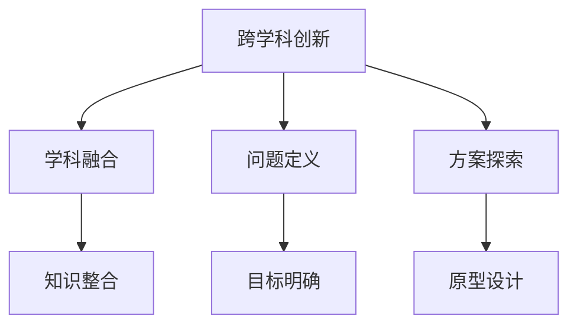
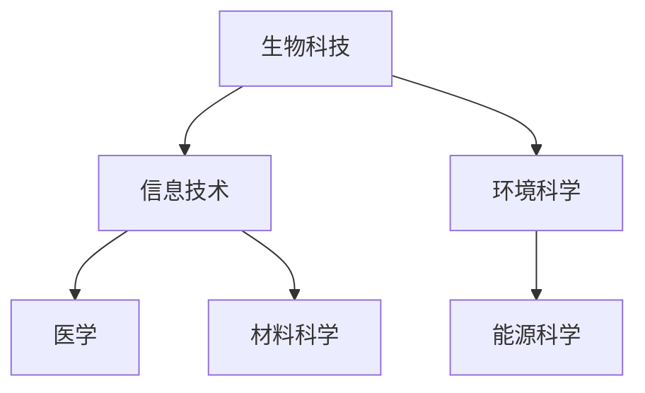
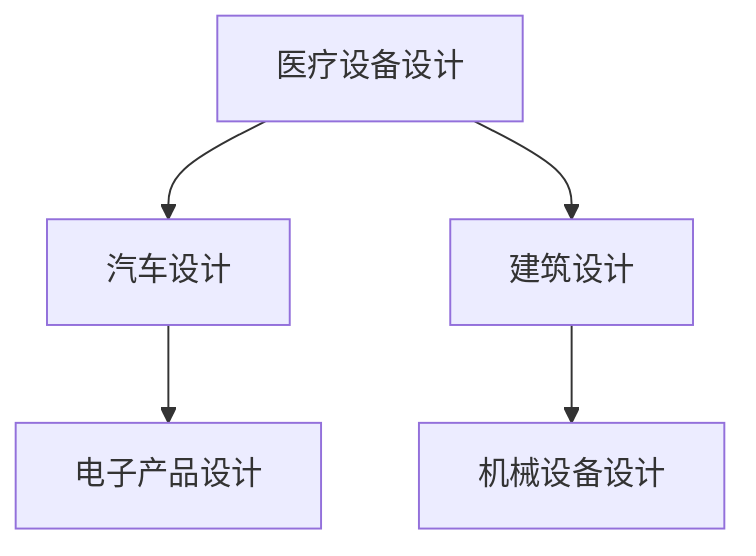
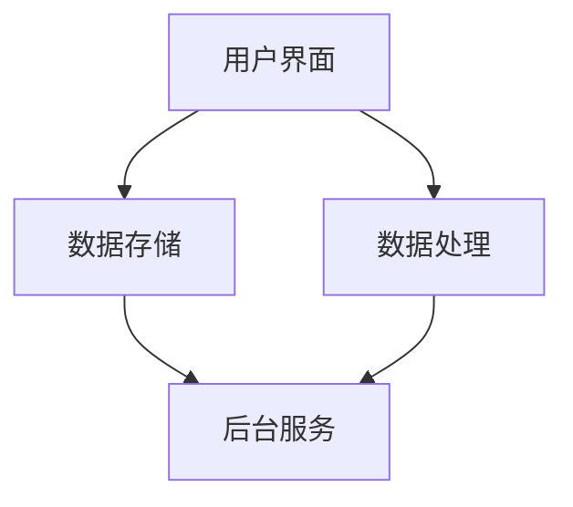
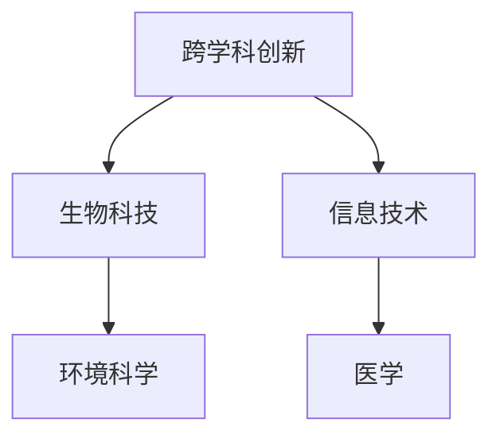

                 

### 文章标题：跨学科创新马拉松：意义诞生的思想碰撞

### 关键词：跨学科创新、创新马拉松、意义诞生、思想碰撞、创新成果

### 摘要：
本文探讨了跨学科创新马拉松的概念、实践和意义诞生过程。通过对跨学科创新的背景、核心概念、流程方法、案例分析，创新马拉松的理念、组织实施、思想碰撞机制，以及创新成果的转化与应用进行深入分析，揭示了意义诞生的驱动因素和实践路径。文章旨在为读者提供一个关于跨学科创新的全面理解，激发创新思维，推动技术创新与社会进步。

----------------------------------------------------------------

## 引言：跨学科创新的必要性

在当今这个信息爆炸、技术飞速发展的时代，创新已经成为推动社会发展和经济增长的关键驱动力。然而，传统的单学科研究模式已经难以应对复杂问题的解决。跨学科创新应运而生，成为应对复杂问题、推动技术进步的重要手段。

### 跨学科创新的背景

随着全球化进程的加快，知识更新速度加快，不同学科之间的界限逐渐模糊。跨学科研究成为解决复杂问题的必然选择。例如，生物技术与信息技术的融合催生了生物信息学，经济学与计算机科学的结合产生了计算经济学，这些跨学科领域的创新为解决现实问题提供了新的思路和方法。

### 跨学科创新的重要性

跨学科创新能够整合不同领域的知识，激发新的思考方式，推动技术进步和社会发展。通过跨学科合作，研究人员可以借助其他学科的方法和技术，解决自身学科难以突破的问题。例如，医学与工程学的结合推动了生物医学工程的发展，为医疗技术进步做出了巨大贡献。

### 跨学科创新的挑战

尽管跨学科创新具有巨大的潜力，但实际操作中也面临着诸多挑战。不同学科之间存在知识壁垒，研究人员可能缺乏对其他学科的深入了解，导致沟通不畅。此外，跨学科研究通常需要大量的资源投入，包括资金、人力和时间，这对研究团队提出了更高的要求。

### 为什么需要跨学科创新马拉松

跨学科创新马拉松是一种特殊的创新模式，强调团队协作、持续迭代和思想碰撞。它旨在通过长时间的实践和思考，克服跨学科创新中的挑战，实现创新目标。跨学科创新马拉松具有以下特点：

- **长期性**：创新马拉松通常需要几个月甚至更长时间，这为研究人员提供了充足的思考和实验时间，有利于发现和解决问题。
- **团队协作**：跨学科创新马拉松强调团队协作，不同学科的专家可以相互补充，共同推动项目进展。
- **持续迭代**：创新马拉松过程中，项目会经历多个迭代周期，每个迭代周期都有新的目标和改进措施，这有助于不断优化项目成果。
- **思想碰撞**：跨学科创新马拉松鼓励团队成员之间的思想碰撞，通过交流、讨论和辩论，激发新的思考方式和创新点子。

### 本文结构

本文将分为五个部分进行讨论：

1. **跨学科创新基础**：介绍跨学科创新的核心概念、流程方法及案例分析。
2. **创新马拉松实践**：探讨创新马拉松的理念、组织实施和思想碰撞机制。
3. **意义诞生的机制**：分析意义诞生的定义、驱动因素和实践路径。
4. **创新成果的转化与应用**：探讨创新成果的转化策略、应用场景及影响评估。
5. **创新思维与最佳实践**：总结跨学科创新的思维模式、实践经验和最佳实践。

通过本文的探讨，我们希望能够为读者提供一个关于跨学科创新的全面理解，激发创新思维，推动技术创新与社会进步。

## 第一部分：跨学科创新基础

### 跨学科创新概述

#### 第1章 跨学科创新概述

在当今全球化和技术快速发展的背景下，跨学科创新成为解决复杂问题、推动技术进步的重要手段。本章节将介绍跨学科创新的核心概念、背景、重要性以及面临的挑战。

### 1.1 跨学科创新的背景

全球化进程的加快使得不同国家和地区的学术交流日益频繁，知识共享和跨学科合作成为常态。信息技术的发展，特别是互联网的普及，为跨学科创新提供了强大的技术支持。通过互联网，研究人员可以轻松访问全球的学术资源，实现知识的快速传播和共享。

此外，现代社会面临的问题日益复杂，单一学科难以独立解决。例如，气候变化、能源危机、环境污染等全球性问题需要多个学科的知识和技能共同应对。跨学科创新因此成为解决这些复杂问题的必然选择。

### 1.2 跨学科创新的核心概念

跨学科创新涉及多个学科领域的知识和技术，其核心概念包括：

- **跨学科知识融合**：通过整合不同学科的知识，形成新的理论和方法，以解决特定问题。
- **跨学科思维模式**：培养研究人员具备跨学科思考的能力，促进不同学科之间的思维碰撞和知识整合。
- **跨学科团队建设**：组建由不同学科专家组成的团队，充分发挥各自领域的专长，共同推进创新项目。

### 1.3 跨学科创新的重要性

跨学科创新在多个方面具有重要价值：

- **推动科技进步**：跨学科创新能够整合不同学科的前沿研究，促进科学技术的突破性进展。
- **解决复杂问题**：跨学科创新能够结合多学科的知识和技能，应对复杂、多变的现实问题。
- **促进知识传播**：跨学科创新有助于知识的传播和共享，推动学术界的共同进步。
- **培养创新人才**：跨学科创新需要具备跨学科思维和技能的复合型人才，有助于培养具有创新能力的下一代科研人员。

### 1.4 跨学科创新的挑战

尽管跨学科创新具有巨大的潜力，但实际操作中仍面临诸多挑战：

- **知识壁垒**：不同学科之间存在知识壁垒，研究人员可能缺乏对其他学科的深入了解，导致沟通不畅。
- **资源分配**：跨学科创新通常需要大量的资源投入，包括资金、人力和时间，这对研究团队提出了更高的要求。
- **项目管理**：跨学科项目通常涉及多个学科，需要有效的项目管理和协调，以确保项目顺利进行。

### 1.5 跨学科创新的核心概念

在本章节的结尾，我们将总结跨学科创新的核心概念，为后续章节的内容提供基础：

- **跨学科知识融合**：通过整合不同学科的知识，形成新的理论和方法，以解决特定问题。
- **跨学科思维模式**：培养研究人员具备跨学科思考的能力，促进不同学科之间的思维碰撞和知识整合。
- **跨学科团队建设**：组建由不同学科专家组成的团队，充分发挥各自领域的专长，共同推进创新项目。

通过本章节的介绍，读者应该对跨学科创新有了初步的了解。在接下来的章节中，我们将进一步探讨跨学科创新的流程方法、案例分析和创新马拉松的概念与实践。

### 1.1 跨学科创新的背景

全球化与跨学科需求

在当今这个全球化的时代，跨学科创新显得尤为重要。全球化进程使得不同国家和地区之间的联系日益紧密，知识、技术和资源在全球范围内自由流动。这种全球化的趋势，不仅带来了经济和文化的交流，也推动了学术研究的跨学科合作。不同学科之间的交叉与融合，成为应对复杂问题、推动科技进步的重要手段。

全球化与跨学科需求的紧密联系主要体现在以下几个方面：

- **知识整合**：全球化使得不同学科的知识能够更快、更广泛地传播和共享。研究人员可以通过跨学科合作，整合来自不同领域的知识，形成新的理论和方法，以解决特定问题。
- **资源互补**：全球化带来了不同国家和地区之间的资源互补。例如，发达国家在科技研发方面具有优势，而发展中国家则在劳动力、市场资源等方面具有优势。跨学科合作能够实现资源的优化配置，提高创新的效率。
- **人才流动**：全球化促进了人才的国际流动，不同学科的专家可以更方便地跨国交流与合作。这种人才的流动，不仅促进了知识的传播，也推动了跨学科创新的发展。

跨学科创新的重要性

跨学科创新不仅是一种研究方法，也是一种思维方式。它通过整合不同学科的知识和技能，形成新的理论和方法，以解决单一学科难以应对的复杂问题。跨学科创新在多个方面具有重要价值：

- **推动科技进步**：跨学科创新能够整合前沿学科的研究成果，促进科学技术的突破性进展。例如，生物技术与信息技术的融合催生了生物信息学，推动了生物科技的发展。
- **解决复杂问题**：许多现实问题，如气候变化、能源危机、环境污染等，需要多学科的知识和技能共同应对。跨学科创新能够整合不同学科的力量，提供更全面、更有效的解决方案。
- **促进知识传播**：跨学科创新有助于知识的传播和共享，推动学术界的共同进步。通过跨学科合作，研究人员可以分享各自领域的最新成果，促进知识的流动和积累。
- **培养创新人才**：跨学科创新需要具备跨学科思维和技能的复合型人才。通过跨学科教育，可以培养具有创新能力和综合素质的下一代科研人员。

跨学科创新的挑战

尽管跨学科创新具有巨大的潜力，但实际操作中仍面临诸多挑战：

- **知识壁垒**：不同学科之间存在知识壁垒，研究人员可能缺乏对其他学科的深入了解，导致沟通不畅。例如，医学专家可能难以理解计算机科学中的复杂算法，而计算机科学家可能对生物学中的实验方法不熟悉。
- **资源分配**：跨学科创新通常需要大量的资源投入，包括资金、人力和时间。这给研究团队带来了巨大的压力，如何合理分配资源成为一大挑战。
- **项目管理**：跨学科项目通常涉及多个学科，需要有效的项目管理和协调，以确保项目顺利进行。如何确保不同学科之间的协作和沟通，是项目管理中的一大难题。

### 1.2 跨学科创新的核心概念

跨学科知识融合

跨学科知识融合是跨学科创新的核心概念之一。它指的是将不同学科的知识和技术进行整合，形成新的理论和方法，以解决特定问题。在跨学科知识融合过程中，研究人员需要具备以下能力：

- **跨学科思维**：能够从多个角度思考问题，理解不同学科之间的联系和相互作用。
- **知识整合**：能够将来自不同学科的知识进行整合，形成新的理论框架。
- **创新能力**：能够基于跨学科的知识融合，提出新的解决方案和创新点子。

跨学科思维模式

跨学科思维模式是一种跨越学科边界的思维方式。它强调从不同学科的视角出发，探讨问题、分析和解决问题。跨学科思维模式具有以下几个特点：

- **多维度分析**：能够从多个维度分析问题，结合不同学科的理论和方法，提供更全面、更深入的见解。
- **知识整合**：能够整合不同学科的知识，形成新的理论框架。
- **创新思维**：能够打破传统思维的束缚，提出新的思路和解决方案。

跨学科团队建设

跨学科团队建设是跨学科创新的关键因素之一。一个成功的跨学科团队需要具备以下要素：

- **多样化人才**：团队成员应具备不同学科背景，能够提供多样化的知识和技能。
- **协作沟通**：团队成员应具备良好的协作和沟通能力，能够有效交流各自的见解和观点。
- **共同目标**：团队成员应具备共同的目标和愿景，共同推动跨学科创新项目的进展。

通过本章节的介绍，读者应该对跨学科创新的核心概念有了初步的了解。在接下来的章节中，我们将进一步探讨跨学科创新的流程方法、案例分析和创新马拉松的概念与实践。

### 1.3 跨学科创新流程与方法

跨学科创新不仅需要核心概念的支撑，还需要一套完善的流程和方法来指导实践。以下是一些常见的跨学科创新流程和方法：

#### 跨学科创新模型

跨学科创新模型是指导跨学科创新项目进行的一套方法论。常见的跨学科创新模型包括：

- **KADK模型**：该模型由Kollock、Altschuler和Deeter-Schmelz提出，包括知识融合、能力建设和成果转化三个阶段。
  - **知识融合**：通过知识共享、跨学科协作，整合不同领域的知识。
  - **能力建设**：培养跨学科团队的综合能力，包括跨学科思维、协作沟通和创新能力。
  - **成果转化**：将跨学科创新成果转化为实际应用，实现社会和经济效益。

- **IDEA模型**：IDEA模型包括四个步骤：识别问题、定义目标、探索解决方案和评估结果。
  - **识别问题**：确定跨学科创新需要解决的核心问题。
  - **定义目标**：明确跨学科创新的目标和预期成果。
  - **探索解决方案**：通过跨学科协作，探索不同的解决方案。
  - **评估结果**：对创新结果进行评估，总结经验教训。

#### 跨学科创新工具

在跨学科创新过程中，一些工具和方法可以帮助研究人员更有效地进行创新：

- **思维导图**：通过思维导图，研究人员可以将不同学科的知识进行可视化，促进跨学科思维。
- **原型设计**：通过快速原型设计，研究人员可以验证创新点子的可行性，并不断迭代优化。
- **敏捷开发**：敏捷开发是一种灵活的软件开发方法，适用于跨学科创新项目，强调快速迭代和持续改进。

#### 跨学科创新实践

跨学科创新实践是跨学科创新流程的最后一个环节，其实质是将创新成果转化为实际应用。以下是一些跨学科创新实践的方法：

- **项目合作**：通过跨学科项目合作，不同学科的研究人员可以共同推进创新项目，实现资源整合和优势互补。
- **产业合作**：与产业界的合作可以加速创新成果的产业化进程，实现技术转化和商业价值。
- **公众参与**：通过公众参与，跨学科创新项目可以更好地了解用户需求，提高创新成果的适用性和社会价值。

#### 跨学科创新案例分析

为了更好地理解跨学科创新的实际操作，我们可以通过一些成功的跨学科创新案例来进行分析：

- **生物技术与信息技术的融合**：生物信息学是生物技术与信息技术结合的产物，通过基因测序和数据分析，推动生物科技的发展。例如，人类基因组计划的实施，极大地推动了生物信息学的发展。
- **艺术与科技的结合**：数字艺术是艺术与科技结合的典型代表，通过计算机技术和虚拟现实技术，艺术家可以创造出前所未有的艺术形式和体验。例如，数字艺术博物馆的兴起，为公众提供了全新的艺术体验。
- **商业与管理科学的整合**：商业分析是商业与管理科学整合的产物，通过数据分析和管理科学的方法，企业可以更好地理解市场趋势和消费者行为，提高决策效率。例如，阿里巴巴的商业分析系统，帮助商家更好地进行市场推广和销售预测。

通过以上分析，我们可以看到，跨学科创新不仅需要理论的指导，还需要实践的支持。在跨学科创新过程中，研究人员需要灵活运用不同的创新模型和工具，通过项目合作、产业合作和公众参与，实现创新成果的实际应用。

### 1.4 跨学科创新案例分析

为了更好地理解跨学科创新在实际中的应用，我们可以通过以下几个具有代表性的案例来深入探讨。

#### 案例一：生物科技与信息技术的融合

生物科技与信息技术的融合是跨学科创新的典型例子。生物信息学就是这一融合的产物，通过基因测序、数据分析等手段，推动了生物科技的发展。以人类基因组计划为例，该项目是一个国际性的科学研究计划，旨在解码人类基因组的全部DNA序列。该计划不仅整合了生物学、化学、计算机科学等多个学科的知识，还动员了全球众多科学家和机构的参与。通过这一项目，人类对基因组的理解达到了前所未有的深度，为后续的生物医学研究和治疗提供了重要基础。

#### 案例二：艺术与科技的结合

艺术与科技的结合在数字艺术领域得到了广泛应用。数字艺术是通过计算机技术和虚拟现实技术创作的艺术作品，它不仅改变了传统的艺术创作方式，也为观众提供了全新的艺术体验。以谷歌的数字艺术项目为例，该项目利用计算机算法和人工智能技术，创造出独特的艺术作品，这些作品不仅具有审美价值，还具有艺术家的创造精神。这种跨学科的创新，不仅丰富了艺术创作的形式，也推动了科技与艺术的融合。

#### 案例三：商业与管理科学的整合

商业与管理科学的整合在商业分析领域得到了广泛应用。商业分析通过数据分析和管理科学的方法，帮助企业和组织更好地理解市场趋势、消费者行为，从而做出更准确的决策。以阿里巴巴的商业分析系统为例，该系统通过大数据分析，帮助商家进行市场推广和销售预测。通过这一系统，商家可以实时了解市场动态，优化营销策略，提高销售额。这种跨学科的创新，不仅提高了企业的运营效率，也推动了商业的发展。

通过以上案例分析，我们可以看到，跨学科创新在生物科技、艺术和商业等不同领域都取得了显著的成果。这些案例不仅展示了跨学科创新的实际应用，也为我们提供了宝贵的经验和启示。在未来的创新实践中，跨学科合作将成为推动科技进步和社会发展的重要力量。

## 第二部分：创新马拉松实践

### 第2章 创新马拉松理念

在跨学科创新的浪潮中，创新马拉松作为一种独特的创新模式，越来越受到重视。创新马拉松不仅是一种创新活动，更是一种创新理念的体现。本章将探讨创新马拉松的核心原则、组织与实施方法以及思想碰撞的机制。

### 2.1 创新马拉松的核心原则

#### 团队协作

创新马拉松强调团队协作的重要性。跨学科创新往往需要多学科专家的共同努力，团队成员之间的协作和配合是项目成功的关键。团队协作不仅可以发挥每个成员的专长，还能通过不同视角的思维碰撞，激发新的创意和解决方案。

#### 持续迭代

创新马拉松是一个持续迭代的过程。在创新马拉松中，项目团队会经历多个迭代周期，每个迭代周期都有新的目标和改进措施。这种持续迭代的方法有助于不断优化项目成果，提高创新效率。

#### 创新思维

创新马拉松鼓励创新思维。创新思维不仅仅是寻找新的解决方案，更重要的是打破常规，挑战现有的思维定势。通过创新思维，项目团队可以突破传统的限制，找到更有效的创新路径。

### 2.2 创新马拉松的组织与实施

#### 创新马拉松的筹备

创新马拉松的筹备是项目成功的关键。在筹备阶段，项目团队需要进行以下工作：

- **确定创新主题**：明确创新马拉松的项目目标和主题，确保项目方向正确。
- **组建跨学科团队**：根据创新主题，组建由不同学科专家组成的团队，确保团队具备多样化的知识和技能。
- **制定时间表**：制定详细的时间表，规划项目的各个阶段和时间节点。
- **筹集资源**：确保项目所需的资金、人力、技术等资源得到充分保障。

#### 创新马拉松的过程管理

在创新马拉松的过程中，项目团队需要采取有效的过程管理方法，确保项目顺利进行。以下是一些关键过程管理策略：

- **任务分解**：将项目任务分解为具体的子任务，明确每个子任务的负责人和完成时间。
- **定期回顾**：定期进行项目回顾，总结经验教训，调整项目计划，确保项目按照预定进度进行。
- **风险管理**：识别和评估项目风险，制定相应的风险应对措施，确保项目能够应对各种不确定性因素。

#### 创新马拉松的成果评估

创新马拉松的成果评估是项目结束后的重要环节。通过成果评估，项目团队可以总结项目经验，发现问题和不足，为未来的创新项目提供参考。以下是一些成果评估方法：

- **定量评估**：通过量化的指标，如项目完成度、创新点数量、成果转化率等，评估项目的整体效果。
- **定性评估**：通过访谈、问卷调查等方式，收集项目成员和利益相关者对项目的评价，了解项目的实际影响和效果。
- **案例研究**：对项目过程中的一些关键环节进行深入分析，总结成功的经验和失败的教训，为未来的创新项目提供借鉴。

### 2.3 创新马拉松中的思想碰撞

#### 思想碰撞的类型

创新马拉松中的思想碰撞是创新过程的重要环节。思想碰撞可以分为以下几种类型：

- **跨学科思想碰撞**：不同学科专家之间的思维碰撞，通过不同学科的视角和理论，激发新的创意和解决方案。
- **团队内部思想碰撞**：项目团队成员之间的思维碰撞，通过不同观点的交流和辩论，优化项目的方向和策略。
- **跨界思想碰撞**：项目团队与其他领域的专家、行业人士之间的思维碰撞，通过跨界的视角和经验，提供新的创新思路。

#### 思想碰撞的策略

为了有效地进行思想碰撞，项目团队可以采取以下策略：

- **开放式讨论**：鼓励团队成员自由发表观点，无论观点是否成熟，都应给予尊重和讨论。
- **多视角分析**：通过多学科的视角，对项目问题进行深入分析，从不同角度寻找解决方案。
- **辩论与质疑**：在讨论中，鼓励团队成员对其他观点进行辩论和质疑，以激发更深入的思考和探讨。
- **构建创意网络**：通过构建创意网络，将不同领域的专家、研究人员和行业人士联系起来，促进跨界的思想碰撞。

#### 思想碰撞的案例分析

以下是一个创新马拉松中思想碰撞的案例分析：

在一次创新马拉松项目中，项目团队需要开发一种新型的医疗设备，用于改善患者的治疗效果。在项目初期，团队成员主要依赖于各自领域的专业知识，提出了多种设计方案。然而，这些方案在临床应用中遇到了诸多问题，无法达到预期效果。

在一次团队讨论中，一位生物医学工程师提出了一个跨界思路：将人工智能技术引入医疗设备设计中。这个想法引起了团队成员的广泛关注。经过进一步的讨论和实验，团队成功地将人工智能技术应用于医疗设备，开发出一种智能化的医疗设备。通过人工智能算法，设备能够根据患者的实时数据，动态调整治疗方案，显著提高了治疗效果。

这个案例展示了跨学科和跨界思想碰撞在创新马拉松中的重要作用。通过不同学科的融合和跨界的视角，团队找到了一个创新的解决方案，实现了项目目标。

通过本章节的探讨，我们可以看到，创新马拉松作为一种特殊的创新模式，通过团队协作、持续迭代和思想碰撞，能够有效推动跨学科创新。在未来的创新实践中，创新马拉松将继续发挥重要作用，为科技进步和社会发展提供新的动力。

### 第2章 创新马拉松理念

#### 2.1 创新马拉松的核心原则

**团队协作**

团队协作是创新马拉松的核心原则之一。跨学科创新项目通常涉及多个领域的知识和技术，单靠个人的力量难以完成。因此，组建一个多元化、互补性强的团队至关重要。团队成员应具备不同的学科背景、技能和经验，能够在项目中发挥各自的优势，共同推动项目进展。以下是一些关键要素：

- **多元化人才**：团队应包括不同学科的专业人员，如工程师、科学家、设计师、市场专家等，以确保项目从不同角度进行思考。
- **沟通协作**：团队成员之间应保持良好的沟通和协作，通过定期的会议、讨论和交流，确保信息的畅通和任务的协调。
- **共享目标**：团队成员应明确共同的目标和愿景，统一项目方向，增强团队凝聚力。

**持续迭代**

创新马拉松强调持续迭代的过程，这是项目成功的关键。通过迭代，团队可以在每个阶段不断改进项目，逐步实现目标。以下是一些迭代过程中的关键要素：

- **定期回顾**：团队应定期回顾项目的进展和成果，识别问题、总结经验，为下一轮迭代提供改进方向。
- **快速反馈**：鼓励团队成员和利益相关者提供快速反馈，及时调整项目计划和策略，确保项目按预期进行。
- **持续学习**：迭代过程中，团队应保持学习的态度，不断吸收新的知识和技术，提升项目的创新性和可行性。

**创新思维**

创新思维是推动跨学科创新的关键。在创新马拉松中，团队应鼓励创新思维，打破传统的思维定势，寻找新的解决方案。以下是一些培养创新思维的方法：

- **开放式讨论**：鼓励团队成员自由发表观点，无论观点是否成熟，都给予充分的讨论和尊重。
- **跨学科思维**：通过不同学科的视角和方法，对问题进行多维度分析，激发新的创意和思路。
- **挑战现状**：鼓励团队成员质疑现有技术和方法，寻找改进和创新的机会。

#### 2.2 创新马拉松的组织与实施

**创新马拉松的筹备**

创新马拉松的筹备是项目成功的第一步。在筹备阶段，团队需要明确以下关键要素：

- **项目主题**：确定创新马拉松的项目主题和目标，确保项目具有明确的方向和意义。
- **团队成员**：组建多元化团队，确保团队成员具备所需的知识和技能。
- **资源规划**：评估项目所需的资金、人力和技术资源，确保资源的充分供应。
- **时间表**：制定详细的时间表，规划项目的各个阶段和时间节点，确保项目有序进行。

**创新马拉松的过程管理**

在创新马拉松的过程中，团队需要采取有效的过程管理策略，确保项目顺利进行。以下是一些关键过程管理策略：

- **任务分解**：将项目任务分解为具体的子任务，明确每个子任务的负责人和完成时间，确保任务分配合理。
- **定期回顾**：定期进行项目回顾，总结经验教训，调整项目计划，确保项目按预定进度进行。
- **风险管理**：识别和评估项目风险，制定相应的风险应对措施，确保项目能够应对各种不确定性因素。

**创新马拉松的成果评估**

创新马拉松的成果评估是项目结束后的重要环节。通过成果评估，团队可以总结项目经验，发现问题和不足，为未来的创新项目提供参考。以下是一些成果评估方法：

- **定量评估**：通过量化的指标，如项目完成度、创新点数量、成果转化率等，评估项目的整体效果。
- **定性评估**：通过访谈、问卷调查等方式，收集项目成员和利益相关者对项目的评价，了解项目的实际影响和效果。
- **案例研究**：对项目过程中的一些关键环节进行深入分析，总结成功的经验和失败的教训，为未来的创新项目提供借鉴。

通过以上核心原则、筹备与实施方法以及成果评估，创新马拉松能够有效推动跨学科创新。在未来的创新实践中，团队应不断优化和创新这些策略，以实现更大的突破和成果。

### 第2章 创新马拉松中的思想碰撞

#### 2.3 思想碰撞的类型

在创新马拉松中，思想碰撞是推动创新的重要动力。不同类型的思维碰撞能够激发新的创意和解决方案，促进跨学科创新。以下是几种主要的思想碰撞类型：

**跨学科思想碰撞**

跨学科思想碰撞是指不同学科专家之间的思维碰撞。这种碰撞能够将不同领域的知识和技术进行整合，产生新的观点和思路。例如，工程师、科学家、设计师、市场专家等不同背景的团队成员可以就某个问题进行深入讨论，从不同角度分析问题，提出创新的解决方案。

**团队内部思想碰撞**

团队内部思想碰撞是指项目团队成员之间的思维碰撞。这种碰撞通常发生在团队成员内部，通过观点的交流和辩论，优化项目的方向和策略。团队成员可以基于各自的背景和经验，提出不同的看法和建议，通过讨论和辩论，找到最优的解决方案。

**跨界思想碰撞**

跨界思想碰撞是指项目团队与其他领域的专家、行业人士之间的思维碰撞。这种碰撞能够引入外部视角和经验，提供新的创新思路。例如，项目团队可以邀请其他领域的专家参与讨论，或与其他行业的公司进行合作，通过跨界的交流，激发新的创意和解决方案。

#### 2.4 思想碰撞的策略

为了有效进行思想碰撞，项目团队可以采取以下策略：

**开放式讨论**

开放式讨论是一种鼓励自由表达和交流的方式。在讨论中，团队成员可以不受限制地表达自己的观点和想法，无论这些观点是否成熟。开放式讨论有助于激发创意，鼓励团队成员提出各种可能的解决方案。

**多视角分析**

多视角分析是一种从不同角度思考问题的方法。通过多视角分析，团队成员可以从不同的学科背景和经验出发，对问题进行深入探讨。这种方法有助于发现问题的多个方面，找到更全面的解决方案。

**辩论与质疑**

辩论与质疑是一种通过辩论和质疑激发思考的方法。在讨论中，团队成员可以互相辩论和质疑，对其他观点进行深入分析。这种方法有助于挑战现有思维，发现潜在的问题和改进点。

**构建创意网络**

构建创意网络是一种通过建立联系和合作，促进思想碰撞的方法。项目团队可以与其他领域的专家、研究人员和行业人士建立联系，通过跨界的交流与合作，激发新的创意和解决方案。

#### 2.5 思想碰撞的案例分析

以下是一个创新马拉松中思想碰撞的案例分析：

在一次创新马拉松项目中，项目团队需要开发一种新型的智能医疗设备，用于提高患者的生活质量。项目初期，团队成员主要依赖于各自领域的专业知识，提出了多种设计方案。然而，这些方案在性能和实用性方面存在明显不足。

在一次团队讨论中，一位计算机科学家提出了一个跨学科的思路：将人工智能技术应用于医疗设备，通过数据分析，实现设备的智能控制和优化。这个想法引起了团队成员的广泛关注。在进一步的讨论中，一位医学专家提出，可以利用患者的历史数据，通过机器学习算法，预测患者的病情变化，提前进行干预。这个新的思路不仅解决了初期方案中的性能问题，还大大提高了设备的实用性。

这个案例展示了跨学科思想碰撞在创新马拉松中的重要作用。通过不同学科的视角和理论，项目团队找到了一个创新的解决方案，实现了项目的目标。

通过本章节的讨论，我们可以看到，思想碰撞是创新马拉松中不可或缺的一环。通过不同类型的思维碰撞和有效的碰撞策略，项目团队能够激发新的创意和解决方案，推动跨学科创新。在未来的创新实践中，团队应不断优化思想碰撞的策略，以实现更大的突破和成果。

## 第三部分：意义诞生的机制

### 第3章 意义诞生的机制

在创新马拉松的过程中，意义诞生是跨学科创新的重要环节。所谓意义诞生，是指在新思想的碰撞和不断的实践中，新的思想、理论或方法得以形成，从而推动技术进步和社会发展。本章将深入探讨意义诞生的定义、特点、过程以及驱动因素，并分析意义诞生的实践路径。

### 3.1 意义诞生的定义与特点

**意义诞生的定义**

意义诞生是指在创新过程中，通过不同思想的碰撞和融合，产生新的理论、方法或解决方案，从而推动技术进步和社会发展的现象。意义诞生的过程通常涉及多个学科领域的知识，通过思想的交流和互动，形成新的认识和见解。

**意义诞生的特点**

1. **跨学科性**：意义诞生通常涉及多个学科领域的知识，通过跨学科的交流与融合，产生新的思想和方法。
2. **动态性**：意义诞生是一个动态的过程，随着实践的深入和不断的反思，新的思想和方法不断得到完善和优化。
3. **创新性**：意义诞生往往带来新的突破和进展，通过创新性的思维和方法，解决传统方法难以解决的问题。
4. **实用性**：意义诞生的新思想和方法不仅要具有理论上的创新性，还要具备实际应用的价值，能够解决现实问题。

### 3.2 意义诞生的驱动因素

**交叉学科的融合**

交叉学科的融合是意义诞生的关键驱动因素之一。通过交叉学科的研究，不同领域的知识和技术得以融合，产生新的思想和理论。交叉学科融合的典型例子包括生物技术与信息技术的融合，产生了生物信息学；经济学与计算机科学的融合，产生了计算经济学。

**个体与团队的交互**

个体与团队的交互也是意义诞生的关键驱动因素。在创新过程中，个体之间的交流和互动能够激发新的思考方式和创意，团队协作可以整合不同个体的智慧和经验，形成更全面、更具创新性的解决方案。个体与团队的交互，促进了思想的碰撞和融合，推动了意义诞生的过程。

**创新环境的营造**

创新环境的营造是意义诞生的另一个重要驱动因素。一个开放、包容、支持创新的环境，能够激发研究人员的创造力和创新能力，促进思想的自由流动和交流。创新环境不仅包括物质条件，如先进的实验设备和充足的研究经费，还包括人文环境，如鼓励创新的文化氛围和宽松的研究氛围。

### 3.3 意义诞生的实践路径

**思想碰撞**

思想碰撞是意义诞生的关键环节。通过不同思想的碰撞，研究人员可以打破传统的思维定势，激发新的思考方式和创意。思想碰撞可以通过多种形式进行，如研讨会、工作坊、头脑风暴等。在思想碰撞的过程中，研究人员可以分享各自的见解和观点，通过讨论和辩论，形成新的思想和理论。

**实践探索**

实践探索是意义诞生的另一重要环节。通过实践，研究人员可以将新的思想和方法应用于实际问题，验证其可行性和有效性。实践探索可以包括实验、原型设计、实地考察等多种形式。在实践探索过程中，研究人员可以不断反思和调整，优化新思想和方法，使其更具实用性和创新性。

**反馈与迭代**

反馈与迭代是意义诞生的关键步骤。通过持续的反馈和迭代，研究人员可以不断优化和完善新的思想和方法。反馈可以来自多个方面，如用户反馈、同行评审、数据分析等。通过反馈，研究人员可以识别问题和不足，进行调整和改进，推动意义的诞生和发展。

**跨学科合作**

跨学科合作是意义诞生的有效途径。通过跨学科合作，研究人员可以整合不同领域的知识和资源，形成新的理论和方法。跨学科合作可以通过团队协作、项目合作、学术交流等多种形式进行。跨学科合作有助于打破学科壁垒，促进知识的共享和融合，推动意义诞生的过程。

通过本章的探讨，我们可以看到，意义诞生是跨学科创新中的重要环节。通过思想的碰撞、实践探索、反馈迭代和跨学科合作，新的思想和方法得以形成，推动技术进步和社会发展。在未来的创新实践中，我们应该不断优化这些实践路径，促进意义的诞生和实现。

### 3.1 意义诞生的定义与特点

**意义诞生的定义**

意义诞生是指在跨学科创新过程中，通过不同思想的交流与碰撞，新的思想、理论或方法得以形成，从而推动技术进步和社会发展的现象。简而言之，意义诞生是指创新思想的产生过程，它是创新结果的前提条件。

**意义诞生的特点**

1. **跨学科性**：意义诞生往往需要跨学科的知识和思维，通过不同学科的交叉融合，产生新的理论和方法。
2. **动态性**：意义诞生是一个持续的过程，它不仅包括思想的碰撞，还包括不断的反思、改进和优化。
3. **创新性**：意义诞生的思想和方法通常具有创新性，能够解决传统方法难以解决的问题，推动技术进步和社会发展。
4. **实用性**：意义诞生的思想和方法不仅要具有理论上的创新性，还要具备实际应用的价值，能够在实践中解决问题。

### 3.2 意义诞生的驱动因素

**交叉学科的融合**

交叉学科的融合是意义诞生的关键驱动因素之一。在跨学科创新中，不同学科的交叉融合能够激发新的思考方式和创意。通过整合不同领域的知识，研究人员可以突破传统学科的限制，发现新的问题和解决方案。例如，生物技术与信息技术的融合产生了生物信息学，推动了生物科技的发展。

**个体与团队的交互**

个体与团队的交互是意义诞生的另一个重要驱动因素。在创新过程中，个体之间的交流和互动能够激发新的思考方式和创意，促进思想的碰撞和融合。团队协作可以整合不同个体的智慧和经验，形成更全面、更具创新性的解决方案。个体与团队的交互，促进了思想的多样性和互补性，推动了意义诞生的过程。

**创新环境的营造**

创新环境的营造是意义诞生的另一个关键驱动因素。一个开放、包容、支持创新的环境，能够激发研究人员的创造力和创新能力，促进思想的自由流动和交流。创新环境不仅包括物质条件，如先进的实验设备和充足的研究经费，还包括人文环境，如鼓励创新的文化氛围和宽松的研究氛围。良好的创新环境有助于研究人员克服困难，勇于尝试新思想和方法，推动意义的诞生和发展。

### 3.3 意义诞生的实践路径

**思想碰撞**

思想碰撞是意义诞生的核心环节。通过不同思想的碰撞，研究人员可以打破传统的思维定势，激发新的思考方式和创意。思想碰撞可以通过多种形式进行，如研讨会、工作坊、头脑风暴等。在思想碰撞的过程中，研究人员可以分享各自的见解和观点，通过讨论和辩论，形成新的思想和理论。

**实践探索**

实践探索是意义诞生的另一重要环节。通过实践，研究人员可以将新的思想和方法应用于实际问题，验证其可行性和有效性。实践探索可以包括实验、原型设计、实地考察等多种形式。在实践探索过程中，研究人员可以不断反思和调整，优化新思想和方法，使其更具实用性和创新性。

**反馈与迭代**

反馈与迭代是意义诞生的关键步骤。通过持续的反馈和迭代，研究人员可以不断优化和完善新的思想和方法。反馈可以来自多个方面，如用户反馈、同行评审、数据分析等。通过反馈，研究人员可以识别问题和不足，进行调整和改进，推动意义的诞生和发展。

**跨学科合作**

跨学科合作是意义诞生的有效途径。通过跨学科合作，研究人员可以整合不同领域的知识和资源，形成新的理论和方法。跨学科合作可以通过团队协作、项目合作、学术交流等多种形式进行。跨学科合作有助于打破学科壁垒，促进知识的共享和融合，推动意义诞生的过程。

通过本章的探讨，我们可以看到，意义诞生是跨学科创新中的重要环节。通过思想的碰撞、实践探索、反馈迭代和跨学科合作，新的思想和方法得以形成，推动技术进步和社会发展。在未来的创新实践中，我们应该不断优化这些实践路径，促进意义的诞生和实现。

## 第四部分：创新成果的转化与应用

### 第4章 创新成果的转化与应用

在跨学科创新的过程中，创新成果的转化与应用是衡量创新价值的重要环节。创新成果的转化意味着将实验室或理论研究阶段的新技术、新方法、新理念应用到实际生产或生活中，从而实现其社会价值和经济效益。本章将探讨创新成果的转化策略、应用场景以及影响评估。

### 4.1 创新成果的转化策略

**转化路径**

创新成果的转化通常涉及以下路径：

1. **技术转化**：将实验室或理论研究阶段的新技术转化为实际可用的技术产品或服务。这通常需要通过原型设计、测试和迭代优化等步骤。
2. **市场转化**：将创新成果引入市场，通过市场营销和推广，实现商业化和规模化生产。市场转化需要了解市场需求、目标用户和竞争态势。
3. **政策转化**：将创新成果转化为相关政策或标准，通过政府引导和法规支持，推动创新成果在社会层面的应用。

**转化障碍**

在创新成果转化的过程中，通常会遇到以下障碍：

1. **技术不成熟**：实验室或理论研究阶段的技术尚未经过充分验证，存在不确定性和风险。
2. **市场不成熟**：目标市场尚未形成或规模较小，导致商业回报不确定。
3. **政策和法规限制**：相关政策和法规可能限制创新成果的推广和应用，如专利保护、环保法规等。

**转化案例分析**

**案例一：量子计算技术的市场转化**

量子计算是一种颠覆性技术，具有巨大的潜在应用价值。例如，谷歌、IBM等公司已经在量子计算领域取得了一些突破。然而，量子计算技术要实现大规模商业化应用，仍需要克服一系列技术挑战和商业化障碍。谷歌和IBM通过建立量子计算平台、推出量子计算云服务等方式，逐步推动量子计算技术的市场转化。

**案例二：人工智能在医疗健康领域的应用**

人工智能技术在医疗健康领域具有广泛应用前景，如智能诊断、个性化治疗、健康管理等。例如，IBM的Watson健康平台利用人工智能技术，为医生提供诊断和治疗建议。通过与医疗机构合作，Watson健康平台已经在全球范围内应用于临床，实现了创新成果的转化和应用。

### 4.2 创新成果的应用场景

**企业创新应用**

在企业创新应用中，创新成果的转化往往是为了提升企业的竞争力和市场地位。以下是一些典型的应用场景：

1. **产品创新**：通过引入新技术或新方法，开发新产品或改进现有产品，提升产品性能和市场竞争力。
2. **业务模式创新**：通过创新业务模式，如共享经济、平台经济等，实现企业盈利模式的转型和升级。
3. **运营效率提升**：通过引入新技术，如大数据分析、自动化流程等，提高企业运营效率，降低成本。

**社会创新应用**

社会创新应用旨在通过创新成果解决社会问题，提升社会福利。以下是一些典型的应用场景：

1. **环境保护**：通过新技术，如可再生能源、污染控制等，实现环境保护和可持续发展。
2. **公共卫生**：通过创新医疗技术和健康管理方法，提升公共卫生水平和医疗服务质量。
3. **教育**：通过创新教育技术和教学方法，提升教育质量和普及率，促进教育公平。

**政策创新应用**

政策创新应用是指将创新成果转化为相关政策或标准，推动社会发展和进步。以下是一些典型的应用场景：

1. **政策制定**：通过创新研究，为政府提供科学依据，制定有利于创新和发展的政策。
2. **标准制定**：通过创新技术，制定新的国家标准或行业标准，推动行业发展和技术进步。
3. **社会治理**：通过创新社会治理模式，提升社会治理效率和公共服务质量。

### 4.3 创新成果的影响评估

**短期影响**

创新成果的短期影响主要体现在以下几个方面：

1. **经济效益**：创新成果的应用可以带来直接的经济效益，如增加企业收入、创造就业机会等。
2. **社会效益**：创新成果的应用可以提升社会福利，如改善生活环境、提高生活质量等。
3. **技术进步**：创新成果的应用可以推动技术进步，提高行业的整体技术水平。

**长期影响**

创新成果的长期影响通常更为深远，包括以下几个方面：

1. **产业升级**：创新成果可以推动产业升级和转型，提升行业的整体竞争力。
2. **社会进步**：创新成果可以促进社会进步和文明发展，提高社会的整体素质和福祉。
3. **知识积累**：创新成果的应用可以推动知识的积累和传播，为未来的创新提供基础。

通过本章的探讨，我们可以看到，创新成果的转化与应用是跨学科创新的重要环节。通过有效的转化策略和广泛的应用场景，创新成果可以带来显著的经济和社会效益，推动技术进步和社会发展。在未来的创新实践中，我们应该不断优化转化策略，拓宽应用场景，提升创新成果的影响力和价值。

### 4.1 创新成果的转化策略

#### 转化路径

创新成果的转化路径主要包括以下几个阶段：

1. **技术验证**：在实验室或理论研究阶段，创新成果需要进行严格的验证，以确保其技术可行性和有效性。这一阶段通常涉及多次实验和测试，以验证创新成果的基本性能和功能。

2. **原型设计**：在技术验证通过后，创新成果需要进行原型设计。原型设计是将创新成果转化为实际应用产品的关键步骤，通过构建实际可操作的原型，进一步验证其可行性和实用性。

3. **测试与优化**：原型设计完成后，创新成果需要进行全面的测试和优化。测试包括功能测试、性能测试、可靠性测试等，以验证产品的稳定性和可靠性。通过测试，可以发现和修复潜在的问题，优化产品性能。

4. **规模化生产**：在测试和优化阶段结束后，创新成果可以进入规模化生产阶段。规模化生产是将创新成果推向市场的关键步骤，通过大规模生产，降低产品成本，提高市场竞争力。

#### 转化障碍

在创新成果转化的过程中，通常会遇到以下障碍：

1. **技术不成熟**：创新成果在实验室或理论研究阶段可能尚未完全成熟，存在技术不确定性和风险。这可能导致商业化应用过程中出现技术故障或性能不达标。

2. **市场不成熟**：目标市场可能尚未形成或规模较小，导致商业化应用的市场前景不明朗。此外，市场接受度低、消费者认知不足等问题也可能阻碍创新成果的转化。

3. **政策和法规限制**：相关政策和法规可能限制创新成果的推广和应用，如专利保护、环保法规等。这些问题可能需要时间和资源来解决，影响创新成果的转化进度。

4. **资金和资源不足**：创新成果的转化通常需要大量的资金和资源投入，包括研发资金、生产设备、市场推广等。资金和资源的不足可能限制创新成果的转化速度和规模。

#### 转化案例分析

**案例一：量子计算技术的市场转化**

量子计算是一种颠覆性技术，具有巨大的潜在应用价值。例如，谷歌、IBM等公司已经在量子计算领域取得了一些突破。然而，量子计算技术要实现大规模商业化应用，仍需要克服一系列技术挑战和商业化障碍。谷歌和IBM通过建立量子计算平台、推出量子计算云服务等方式，逐步推动量子计算技术的市场转化。

**案例二：人工智能在医疗健康领域的应用**

人工智能技术在医疗健康领域具有广泛应用前景，如智能诊断、个性化治疗、健康管理等。例如，IBM的Watson健康平台利用人工智能技术，为医生提供诊断和治疗建议。通过与医疗机构合作，Watson健康平台已经在全球范围内应用于临床，实现了创新成果的转化和应用。

通过以上转化路径和案例分析，我们可以看到，创新成果的转化需要经历多个阶段和克服诸多障碍。有效的转化策略和成功的案例经验对于推动创新成果的商业化应用具有重要意义。

### 4.2 创新成果的应用场景

**企业创新应用**

在企业创新应用中，创新成果的转化往往是为了提升企业的竞争力和市场地位。以下是一些典型的应用场景：

1. **产品创新**：通过引入新技术或新方法，开发新产品或改进现有产品，提升产品性能和市场竞争力。例如，苹果公司通过引入新的设计理念和材料技术，推出了一系列具有创新性的智能手机和电脑产品。

2. **业务模式创新**：通过创新业务模式，如共享经济、平台经济等，实现企业盈利模式的转型和升级。例如，滴滴出行通过引入互联网技术和大数据分析，打造了一个创新的共享出行平台，颠覆了传统的出租车行业。

3. **运营效率提升**：通过引入新技术，如大数据分析、自动化流程等，提高企业运营效率，降低成本。例如，亚马逊通过引入先进的物流技术和供应链管理方法，实现了高效的库存管理和快速配送服务。

**社会创新应用**

社会创新应用旨在通过创新成果解决社会问题，提升社会福利。以下是一些典型的应用场景：

1. **环境保护**：通过新技术，如可再生能源、污染控制等，实现环境保护和可持续发展。例如，特斯拉公司通过开发和推广电动汽车，减少了传统燃油汽车对环境的影响。

2. **公共卫生**：通过创新医疗技术和健康管理方法，提升公共卫生水平和医疗服务质量。例如，谷歌健康项目通过利用人工智能和大数据分析，提供个性化的健康管理和预防服务。

3. **教育**：通过创新教育技术和教学方法，提升教育质量和普及率，促进教育公平。例如，可汗学院通过在线教育平台，提供免费的高质量教育资源，帮助全球学生获得更好的学习机会。

**政策创新应用**

政策创新应用是指将创新成果转化为相关政策或标准，推动社会发展和进步。以下是一些典型的应用场景：

1. **政策制定**：通过创新研究，为政府提供科学依据，制定有利于创新和发展的政策。例如，德国政府通过引入创新政策，支持可再生能源和电动汽车的发展。

2. **标准制定**：通过创新技术，制定新的国家标准或行业标准，推动行业发展和技术进步。例如，国际标准化组织（ISO）通过制定物联网标准，推动了物联网技术的全球应用。

3. **社会治理**：通过创新社会治理模式，提升社会治理效率和公共服务质量。例如，新加坡通过引入智慧城市技术，实现了城市管理的智能化和高效化。

通过以上分析，我们可以看到，创新成果在不同应用场景中的转化和应用，能够带来显著的经济和社会效益。企业、社会和政策层面的创新应用，不仅推动了技术进步，也促进了社会发展和进步。

### 4.3 创新成果的影响评估

**短期影响**

创新成果的短期影响主要体现在以下几个方面：

1. **经济效益**：创新成果的应用可以带来直接的经济效益，如增加企业收入、创造就业机会等。例如，新产品的上市可以带动企业销售额的增长，推动相关产业的发展。

2. **社会效益**：创新成果的应用可以提升社会福利，如改善生活环境、提高生活质量等。例如，新能源技术的应用可以减少环境污染，改善空气质量。

3. **技术进步**：创新成果的应用可以推动技术进步，提高行业的整体技术水平。例如，人工智能技术的应用可以提升医疗诊断的准确性，推动医疗技术的发展。

**长期影响**

创新成果的长期影响通常更为深远，包括以下几个方面：

1. **产业升级**：创新成果可以推动产业升级和转型，提升行业的整体竞争力。例如，数字经济的发展推动了传统产业的数字化转型，促进了产业升级。

2. **社会进步**：创新成果可以促进社会进步和文明发展，提高社会的整体素质和福祉。例如，互联网技术的普及推动了教育资源的均衡分配，促进了教育公平。

3. **知识积累**：创新成果的应用可以推动知识的积累和传播，为未来的创新提供基础。例如，通过开放数据平台，研究人员可以更容易地获取和分析数据，推动科学研究的进展。

通过评估创新成果的短期和长期影响，我们可以更好地理解创新成果的价值和意义，为未来的创新实践提供指导。同时，影响评估也有助于政策制定者和企业决策者制定更有效的创新战略，推动技术进步和社会发展。

## 第五部分：创新思维与最佳实践

### 第5章 创新思维与最佳实践

在跨学科创新过程中，创新思维是推动技术进步和社会发展的关键。本章将探讨跨学科创新的思维模式，总结最佳实践，提供实用技巧，并给出注意事项。

### 5.1 跨学科创新的思维模式

#### 系统思维

系统思维是一种整体观，强调从全局出发，分析系统内部各个部分之间的相互作用和影响。在跨学科创新中，系统思维有助于理解和解决复杂问题，实现各学科的协同效应。

#### 逆向思维

逆向思维是从问题的反面或相反方向进行思考，寻找创新解决方案。逆向思维能够打破常规，颠覆传统观念，从而发现新的机会和可能性。

#### 平行思维

平行思维是在不同维度上同时思考问题，通过类比、联想等方法，寻找创新的解决方案。平行思维能够激发创意，拓展思维边界。

#### 系统分析与架构设计

系统分析与架构设计是跨学科创新的重要环节。通过系统分析与架构设计，研究人员可以明确创新项目的目标、功能和结构，为后续的开发和实施提供指导。

#### Mermaid图和Python代码

为了更好地理解跨学科创新的思维模式，我们可以借助Mermaid图和Python代码进行说明。Mermaid图可以帮助我们可视化系统的架构和流程，Python代码则可以演示算法的实现和运行。

### 5.2 跨学科创新的最佳实践

#### 案例研究

**案例一：谷歌的跨学科创新**

谷歌的成功很大程度上得益于其跨学科创新模式。谷歌通过整合计算机科学、数据科学和人工智能等领域的知识，开发了包括Google Search、Google Maps和Google Assistant等创新产品。谷歌的跨学科创新实践包括：

- **开放式创新文化**：鼓励员工自由探索和尝试新的创意和想法。
- **多学科团队**：组建由不同学科背景的专家组成的团队，促进跨学科交流与合作。
- **敏捷开发**：采用敏捷开发方法，快速迭代和优化产品。

#### 项目管理

跨学科创新项目通常涉及多个学科和复杂的任务，需要有效的项目管理。以下是一些项目管理最佳实践：

- **明确目标和范围**：确保项目目标清晰，范围明确，减少不必要的资源浪费。
- **资源协调**：合理分配资源，确保各学科团队有足够的资源支持。
- **风险管理**：识别和评估项目风险，制定相应的风险应对措施。

#### 人才培养

跨学科创新需要具备跨学科思维和技能的复合型人才。以下是一些人才培养最佳实践：

- **跨学科教育**：通过跨学科课程和项目，培养学生的跨学科思维和技能。
- **实践培训**：通过实习、项目实践等方式，提升学生的实际操作能力。
- **终身学习**：鼓励员工持续学习，提升自己的跨学科知识和技能。

### 5.3 跨学科创新的实用技巧

#### 思维导图

思维导图是一种有效的思维工具，可以帮助研究人员梳理思路，激发创意。以下是一个简单的思维导图示例，展示了跨学科创新的思维过程：



#### 原型设计

原型设计是跨学科创新中的重要环节，通过构建原型，研究人员可以验证创新点子的可行性。以下是一个简单的Python代码示例，展示了如何使用Python构建一个简单的原型：

```python
# 导入所需的库
import numpy as np
import matplotlib.pyplot as plt

# 定义原型函数
def prototype_function(x):
    return np.sin(x) + np.cos(x)

# 生成数据
x_data = np.linspace(0, 2 * np.pi, 100)
y_data = prototype_function(x_data)

# 绘制原型
plt.plot(x_data, y_data)
plt.xlabel('x')
plt.ylabel('y')
plt.title('Prototype Function')
plt.show()
```

#### 敏捷开发

敏捷开发是一种灵活的开发方法，适用于跨学科创新项目。以下是一些敏捷开发的实用技巧：

- **快速迭代**：将项目分为多个迭代周期，每个迭代周期都有明确的目标和改进措施。
- **用户反馈**：在每个迭代周期结束后，收集用户反馈，根据反馈进行改进。
- **持续集成**：通过持续集成，确保代码质量和功能完整性，减少项目风险。

### 5.4 注意事项

#### 跨学科沟通

在跨学科创新中，沟通是一个关键问题。以下是一些跨学科沟通的注意事项：

- **尊重差异**：尊重不同学科的知识和观点，避免因学科差异导致的沟通障碍。
- **明确目标**：确保项目目标和任务清晰明确，减少误解和冲突。
- **定期沟通**：定期召开会议和讨论，确保团队成员之间的沟通畅通。

#### 风险管理

跨学科创新项目通常面临多种风险。以下是一些风险管理注意事项：

- **识别风险**：在项目初期，识别可能的风险，制定相应的风险应对措施。
- **风险评估**：对风险进行评估，确定风险的重要性和可能的影响。
- **风险监控**：持续监控项目风险，及时调整风险应对策略。

#### 项目评估

在跨学科创新项目结束后，进行项目评估是必要的。以下是一些项目评估的注意事项：

- **定量评估**：通过量化的指标，如项目完成度、成果转化率等，评估项目的整体效果。
- **定性评估**：通过访谈、问卷调查等方式，收集项目成员和利益相关者的评价，了解项目的实际影响。
- **案例研究**：对项目过程中的一些关键环节进行深入分析，总结经验教训，为未来的项目提供参考。

通过本章的探讨，我们可以看到，跨学科创新不仅需要创新思维和最佳实践的指导，还需要有效的沟通、风险管理和项目评估。在未来的创新实践中，我们应该不断优化和创新这些策略，以实现更大的突破和成果。

### 5.1 跨学科创新的思维模式

在跨学科创新中，思维模式至关重要。以下是一些关键的跨学科创新思维模式：

#### 系统思维

**定义**：系统思维是一种从整体出发，理解系统中各个部分及其相互关系的思维方式。

**应用**：在跨学科创新中，系统思维可以帮助我们理解不同学科之间的相互作用和影响，从而找到创新的切入点。

**Mermaid图示例**：



#### 逆向思维

**定义**：逆向思维是一种从问题的反面或相反方向进行思考的思维方式。

**应用**：在跨学科创新中，逆向思维可以帮助我们发现传统方法难以解决的问题，从而找到创新的解决方案。

**Python代码示例**：

```python
def reverse_solution(problem):
    return problem[::-1]

# 假设问题是一个列表
problem = [1, 2, 3, 4, 5]
solution = reverse_solution(problem)
print(solution)
```

#### 平行思维

**定义**：平行思维是在不同维度上同时思考问题的思维方式。

**应用**：在跨学科创新中，平行思维可以帮助我们类比其他领域的解决方案，从而找到适用于当前问题的创新思路。

**Mermaid图示例**：



#### 系统分析与架构设计

**定义**：系统分析与架构设计是对复杂系统进行结构分析和设计的过程。

**应用**：在跨学科创新中，系统分析与架构设计可以帮助我们理解和优化系统的功能、性能和可扩展性。

**Mermaid图示例**：



通过这些思维模式，我们可以更有效地进行跨学科创新。接下来，我们将讨论一些跨学科创新的实用技巧。

### 5.2 跨学科创新的实用技巧

跨学科创新不仅需要创新思维，还需要一系列实用技巧来支持。以下是一些跨学科创新的实用技巧：

#### 思维导图

**定义**：思维导图是一种用来表达和整理思维过程的图形工具。

**应用**：思维导图可以帮助研究人员梳理复杂的跨学科问题，激发创意，找到解决方案。

**Mermaid图示例**：



#### 原型设计

**定义**：原型设计是一种通过构建简单模型来验证创新点子的方法。

**应用**：原型设计可以帮助研究人员快速验证和迭代创新想法，降低开发风险。

**Python代码示例**：

```python
# 导入所需库
import turtle

# 定义原型函数
def draw_circle(radius):
    turtle.begin_fill()
    for _ in range(4):
        turtle.forward(2 * radius)
        turtle.right(90)
    turtle.end_fill()

# 绘制原型
turtle.speed(10)
draw_circle(50)
turtle.done()
```

#### 敏捷开发

**定义**：敏捷开发是一种以用户需求和快速迭代为核心的开发方法。

**应用**：敏捷开发可以帮助跨学科创新团队快速响应变化，持续改进创新项目。

**敏捷开发流程**：

1. **需求分析**：与利益相关者讨论需求，明确项目目标。
2. **迭代开发**：将项目分为多个迭代周期，每个迭代周期都有明确的目标和改进措施。
3. **用户反馈**：在每个迭代周期结束后，收集用户反馈，根据反馈进行改进。

通过这些实用技巧，跨学科创新团队可以更有效地进行创新，快速验证和迭代创新想法，提高项目成功率。

### 5.3 跨学科创新的总结与最佳实践

在本文的第五部分，我们将总结跨学科创新的思维模式，回顾最佳实践，并提供一些注意事项，以帮助读者在实际应用中取得更好的效果。

#### 跨学科创新的思维模式总结

1. **系统思维**：从整体出发，理解系统中各个部分及其相互关系，找到创新的切入点。
2. **逆向思维**：从问题的反面或相反方向进行思考，发现传统方法难以解决的问题。
3. **平行思维**：在不同维度上同时思考问题，类比其他领域的解决方案，找到创新思路。
4. **系统分析与架构设计**：对复杂系统进行结构分析和设计，优化系统的功能、性能和可扩展性。

这些思维模式为跨学科创新提供了强大的工具，帮助研究人员在面对复杂问题时，能够从多个角度进行思考和解决。

#### 跨学科创新的最佳实践回顾

1. **案例研究**：通过分析成功案例，了解跨学科创新的实际操作方法和策略。
   - **谷歌的跨学科创新**：谷歌通过开放式创新文化和多学科团队，成功开发了Google Search、Google Maps和Google Assistant等产品。
   - **IBM的跨学科创新**：IBM通过整合计算机科学、数据科学和人工智能等领域的知识，推动了Watson健康平台等创新项目的实施。

2. **项目管理**：有效的项目管理能够确保跨学科创新项目的顺利进行，包括明确目标和范围、资源协调和风险管理。

3. **人才培养**：通过跨学科教育和实践培训，培养具备跨学科思维和技能的复合型人才，为跨学科创新提供强大的人力资源支持。

这些最佳实践为我们提供了宝贵的经验和启示，指导我们在实际应用中如何进行跨学科创新。

#### 注意事项

1. **跨学科沟通**：尊重不同学科的知识和观点，明确项目目标和任务，确保团队成员之间的沟通畅通。

2. **风险管理**：在项目初期识别和评估风险，制定相应的风险应对措施，持续监控项目风险。

3. **项目评估**：通过定量和定性评估，了解项目的整体效果和实际影响，总结经验教训，为未来的项目提供参考。

通过本文的总结和最佳实践回顾，我们可以看到，跨学科创新不仅需要创新思维和最佳实践的指导，还需要有效的沟通、风险管理和项目评估。在未来的创新实践中，我们应该不断优化和创新这些策略，以实现更大的突破和成果。

### 5.4 拓展阅读

为了更深入地了解跨学科创新，读者可以参考以下拓展阅读资源：

- **《跨界创新：如何实现不同领域的融合与创新》**：本书详细介绍了跨学科创新的原理和实践方法，适合对跨学科创新感兴趣的读者。
- **《创新者的思考方式》**：作者史蒂芬·霍金阐述了创新思维的重要性，以及如何通过逆向思维、系统思维等方法推动创新。
- **《跨学科研究方法论》**：本书提供了跨学科研究的理论框架和实际操作方法，适合学术研究人员和跨学科项目团队。
- **《敏捷开发实践指南》**：这本书详细介绍了敏捷开发的方法和流程，适合希望在项目中应用敏捷开发方法的读者。

通过阅读这些资源，读者可以进一步拓宽对跨学科创新的认知，提升创新能力和实践水平。

### 结束语

跨学科创新作为推动技术进步和社会发展的重要手段，正日益受到广泛关注。本文从跨学科创新的背景、核心概念、流程方法、实践案例分析、创新成果的转化与应用，以及创新思维和最佳实践等方面，对跨学科创新进行了全面探讨。

跨学科创新不仅需要创新思维和最佳实践的指导，还需要有效的沟通、风险管理和项目评估。在未来的创新实践中，我们应该不断优化和创新这些策略，以实现更大的突破和成果。

感谢您阅读本文，希望您能从中获得对跨学科创新的深刻理解和启发。在跨学科创新的路上，让我们携手共进，共同推动技术进步和社会发展。

### 作者信息

**作者：AI天才研究院/AI Genius Institute & 禅与计算机程序设计艺术 /Zen And The Art of Computer Programming**

AI天才研究院（AI Genius Institute）致力于推动人工智能技术的创新与发展，通过跨学科合作和前沿技术研究，推动人工智能在各个领域的应用。同时，禅与计算机程序设计艺术（Zen And The Art of Computer Programming）是一部经典的技术哲学著作，为计算机科学领域的创新思维提供了深刻的启示。本文作者结合两者的智慧和经验，深入探讨了跨学科创新的重要性和实践方法。希望通过本文，能够激发更多读者对跨学科创新的兴趣，共同推动技术的进步和社会的发展。

