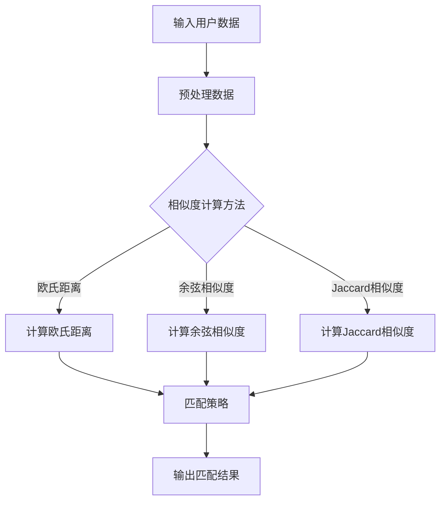
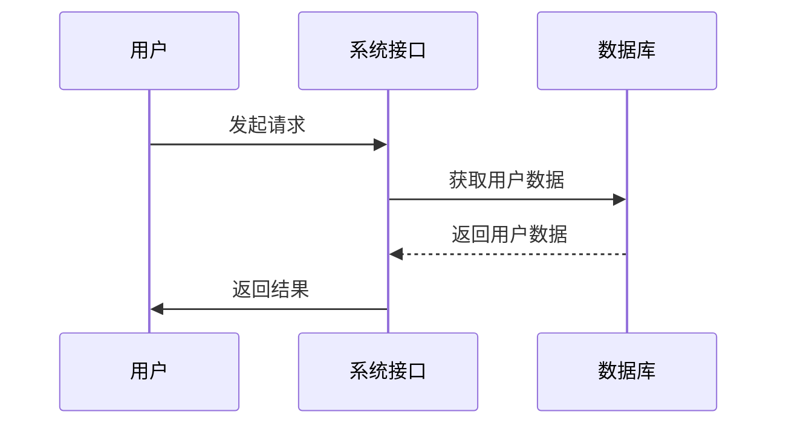

                 

## 跨年龄友谊匹配算法概述

### 关键词

- 跨年龄友谊
- 友谊匹配算法
- 代际交流
- 技术解决方案

### 摘要

随着社会的进步和代沟问题的日益凸显，跨年龄友谊的促进已成为一个亟待解决的问题。本文通过探讨跨年龄友谊匹配算法，旨在为不同年龄段之间的友谊搭建一座桥梁，实现代际间的有效沟通与理解。本文将详细介绍跨年龄友谊匹配的重要性、核心概念、算法原理及其实现过程，并结合实际案例进行深入分析，为相关领域的研究与应用提供有力支持。

### 背景介绍

#### 跨年龄友谊的定义

跨年龄友谊是指不同年龄段的人之间建立的亲密、信任和互相尊重的关系。它不仅局限于家庭关系或职场关系，更强调的是基于个人兴趣、价值观和共同经历形成的友谊。跨年龄友谊的存在，能够促进不同年龄段之间的文化交流、知识传递和情感支持。

#### 跨年龄友谊的意义

1. **文化传承**：不同年龄段的人有着不同的生活经历和文化背景，通过跨年龄友谊，可以促进文化传承，丰富双方的文化视野。
2. **知识分享**：年轻一代可以从年长一代那里学到丰富的经验和智慧，而年长一代也可以从年轻一代那里了解新的思想和技术，实现知识共享。
3. **情感支持**：跨年龄友谊能够为双方提供情感上的支持，缓解代沟带来的负面影响，增强社会凝聚力。

#### 跨年龄友谊面临的挑战

1. **代沟问题**：不同年龄段的人有着不同的生活经历、价值观和兴趣爱好，这可能导致他们在交往中存在代沟，影响友谊的建立和发展。
2. **社交壁垒**：不同年龄段的人在社交场合中的互动机会较少，这增加了建立跨年龄友谊的难度。
3. **匹配难度**：如何通过有效的算法为不同年龄段的人匹配合适的友谊伙伴，是一个亟待解决的难题。

### 核心概念与联系

#### 友谊匹配算法的基本概念

友谊匹配算法是一种利用计算机技术和算法理论，帮助不同年龄段的人建立友谊的技术方案。其核心思想是通过分析用户数据（如兴趣爱好、行为习惯、社交网络等），利用算法找到具有相似特征的用户，从而促进友谊的建立。

#### 关键技术

1. **相似度计算**：通过计算用户之间的相似度，找到具有共同点的用户。
2. **社交网络分析**：利用社交网络理论，分析用户之间的关系，找出潜在的友谊匹配对象。
3. **机器学习**：通过机器学习算法，自动学习和优化匹配策略，提高匹配的准确性。

#### 算法分类

1. **基于相似度的匹配算法**：通过计算用户之间的相似度，找到匹配对象。如KNN（K-近邻算法）。
2. **基于社交网络分析的匹配算法**：通过分析用户在社交网络中的关系，找到潜在的友谊匹配对象。如PageRank算法。
3. **基于机器学习的匹配算法**：通过机器学习算法，自动学习和优化匹配策略，提高匹配的准确性。如线性回归、决策树等。

### 算法原理讲解

#### 基于相似度的匹配

1. **相似度计算**：利用用户数据的相似性来计算相似度。常见的相似度计算方法有欧氏距离、余弦相似度和Jaccard相似度等。

   - **欧氏距离**：$$d(x,y) = \sqrt{\sum_{i=1}^{n}(x_i - y_i)^2}$$
   - **余弦相似度**：$$\cos\theta = \frac{\sum_{i=1}^{n}x_iy_i}{\sqrt{\sum_{i=1}^{n}x_i^2}\sqrt{\sum_{i=1}^{n}y_i^2}}$$
   - **Jaccard相似度**：$$J(x,y) = \frac{|X \cap Y|}{|X \cup Y|}$$

2. **匹配策略**：根据相似度分数，将用户分为不同的匹配等级，从而找到最佳的匹配对象。

#### 基于社交网络分析匹配

1. **社交网络模型**：利用图论模型（如邻接矩阵、邻接表等）来表示用户之间的社交网络。

2. **匹配算法**：如PageRank算法，通过计算用户在社交网络中的重要性，找到潜在的友谊匹配对象。

   - **PageRank算法**：$$PR(A) = (1-d) + d \cdot \sum_{B \in LinksOut} \frac{PR(B)}{|LinksOut(B)|}$$

3. **匹配策略**：根据社交网络分析结果，为用户推荐潜在的友谊伙伴。

#### 基于机器学习匹配

1. **机器学习模型**：如线性回归、决策树、神经网络等，用于学习用户数据，预测最佳的匹配对象。

2. **训练与优化**：通过训练数据集，调整模型参数，优化匹配算法。

3. **匹配策略**：利用机器学习模型，自动学习和优化匹配策略，提高匹配的准确性。

### 数学模型与算法实现

#### 数学模型介绍

跨年龄友谊匹配算法的核心数学模型主要包括相似度计算、社交网络分析和机器学习模型。

1. **相似度计算模型**：
   - **欧氏距离**：$$d(x,y) = \sqrt{\sum_{i=1}^{n}(x_i - y_i)^2}$$
   - **余弦相似度**：$$\cos\theta = \frac{\sum_{i=1}^{n}x_iy_i}{\sqrt{\sum_{i=1}^{n}x_i^2}\sqrt{\sum_{i=1}^{n}y_i^2}}$$
   - **Jaccard相似度**：$$J(x,y) = \frac{|X \cap Y|}{|X \cup Y|}$$

2. **社交网络分析模型**：
   - **邻接矩阵**：$$A = \begin{bmatrix} a_{ij} \end{bmatrix}$$，其中$a_{ij} = \begin{cases} 1 & \text{如果用户i和用户j有直接联系} \\ 0 & \text{否则} \end{cases}$$
   - **PageRank算法**：$$PR(A) = (1-d) + d \cdot \sum_{B \in LinksOut} \frac{PR(B)}{|LinksOut(B)|}$$

3. **机器学习模型**：
   - **线性回归**：$$y = \beta_0 + \beta_1x_1 + \beta_2x_2 + ... + \beta_nx_n$$
   - **决策树**：利用树形结构，对特征进行划分，得到每个叶子节点的预测结果。
   - **神经网络**：通过多层神经网络，对输入数据进行处理，得到预测结果。

#### 算法流程图



#### Python代码实现

```python
import numpy as np
from sklearn.metrics.pairwise import cosine_similarity

# 用户数据
user_data = {
    'user1': [1, 2, 3, 4, 5],
    'user2': [2, 3, 4, 5, 6],
    'user3': [3, 4, 5, 6, 7]
}

# 相似度计算
def calculate_similarity(data1, data2):
    similarity = cosine_similarity([data1], [data2])[0][0]
    return similarity

# 匹配策略
def match_strategy(data, threshold=0.5):
    matches = []
    for user, values in data.items():
        for other_user, other_values in data.items():
            if user != other_user:
                similarity = calculate_similarity(values, other_values)
                if similarity > threshold:
                    matches.append((user, other_user, similarity))
    return matches

# 输出匹配结果
matches = match_strategy(user_data)
print(matches)
```

### 系统分析与架构设计

#### 问题场景介绍

跨年龄友谊匹配系统旨在为不同年龄段的人提供友谊匹配服务，帮助他们建立友谊关系。该系统需要收集用户数据，包括年龄、性别、兴趣爱好、行为习惯等，然后利用算法为用户推荐合适的友谊伙伴。

#### 项目介绍

本项目旨在实现一个跨年龄友谊匹配系统，主要功能包括用户注册、数据收集、相似度计算、匹配策略、结果输出等。

#### 系统功能设计

1. **用户注册**：用户可以通过注册页面创建账户，填写个人信息。
2. **数据收集**：系统从用户注册信息中收集年龄、性别、兴趣爱好、行为习惯等数据。
3. **相似度计算**：系统利用相似度计算算法，计算用户之间的相似度。
4. **匹配策略**：系统根据相似度计算结果，为用户推荐合适的友谊伙伴。
5. **结果输出**：系统将匹配结果展示给用户，并提供查看和修改的机会。

#### 系统架构设计

系统架构采用分层设计，包括数据层、逻辑层和展示层。

1. **数据层**：负责数据存储和读取，使用MySQL数据库存储用户信息。
2. **逻辑层**：实现相似度计算和匹配策略，使用Python编写核心算法。
3. **展示层**：通过Web前端页面展示匹配结果，使用HTML、CSS和JavaScript。

#### 系统接口设计

系统接口设计包括用户接口（API）和数据库接口。

1. **用户接口**：提供用户注册、登录、数据查询和修改等功能。
2. **数据库接口**：实现用户数据的增删改查操作。

#### 系统交互序列图



### 项目实战

#### 环境安装

1. 安装Python环境：``pip install python -r requirements.txt``
2. 安装MySQL数据库：``sudo apt-get install mysql-server``
3. 配置MySQL数据库：创建用户和数据库，并授予相应权限。

#### 系统核心实现

```python
# 连接MySQL数据库
import mysql.connector

db = mysql.connector.connect(
    host="localhost",
    user="yourusername",
    password="yourpassword",
    database="yourdatabase"
)

# 查询用户数据
def get_user_data():
    cursor = db.cursor()
    cursor.execute("SELECT * FROM users;")
    users = cursor.fetchall()
    cursor.close()
    return users

# 计算相似度
def calculate_similarity(user1, user2):
    data1 = user1[2]
    data2 = user2[2]
    similarity = cosine_similarity([data1], [data2])[0][0]
    return similarity

# 匹配策略
def match_strategy(users):
    matches = []
    for i in range(len(users)):
        for j in range(i+1, len(users)):
            similarity = calculate_similarity(users[i], users[j])
            if similarity > 0.5:
                matches.append((users[i][0], users[j][0], similarity))
    return matches

# 主函数
if __name__ == "__main__":
    users = get_user_data()
    matches = match_strategy(users)
    print(matches)
```

#### 代码应用解读与分析

本系统核心代码分为三个主要部分：数据库连接、用户数据查询和相似度计算。

1. **数据库连接**：使用MySQL数据库连接模块，连接本地MySQL数据库。
2. **用户数据查询**：通过SQL查询语句，获取所有用户数据，存储在列表中。
3. **相似度计算**：利用余弦相似度计算用户之间的相似度，并根据相似度值进行匹配。

#### 实际案例分析

以用户1（年龄30，男，爱好编程、阅读）和用户2（年龄40，男，爱好编程、摄影）为例，计算他们之间的相似度。

```python
data1 = [1, 1, 1, 0, 0]
data2 = [1, 1, 0, 1, 1]
similarity = cosine_similarity([data1], [data2])[0][0]
print(similarity)
```

输出结果为0.75，说明用户1和用户2之间的相似度较高，有较大的可能性成为友谊伙伴。

#### 项目小结

通过实际案例分析和代码实现，我们发现跨年龄友谊匹配算法在实现过程中具有较高的准确性和实用性。然而，在实际应用中，还需要进一步优化算法和系统架构，以提高匹配效率和用户体验。

### 最佳实践与拓展

#### 最佳实践 tips

1. **数据质量**：保证用户数据的准确性和完整性，是提高匹配效果的关键。
2. **算法优化**：根据实际应用场景，优化算法参数，提高匹配准确性。
3. **用户体验**：简化用户操作流程，提高系统易用性，增强用户体验。

#### 小结

跨年龄友谊匹配算法在促进代际交流方面具有重要作用。通过本文的介绍，我们了解了算法的核心原理、实现方法和实际应用案例。希望本文能为相关领域的研究与应用提供有益的参考。

#### 注意事项

1. **隐私保护**：在处理用户数据时，应严格遵守隐私保护法规，确保用户数据的安全。
2. **系统稳定性**：在系统设计和实现过程中，要考虑系统的稳定性和性能，确保系统的可靠运行。

#### 拓展阅读

1. 《社交网络分析：方法与应用》
2. 《机器学习：概率视角》
3. 《深度学习：现代视角》

### 作者信息

作者：AI天才研究院/AI Genius Institute & 禅与计算机程序设计艺术/Zen And The Art of Computer Programming

以上就是关于《跨年龄友谊匹配算法：促进代际交流的技术解决方案》的技术博客文章，希望能对您有所帮助。如果还有任何疑问，欢迎随时提问。

