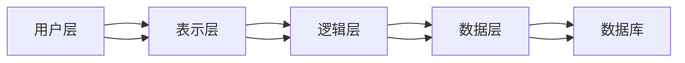
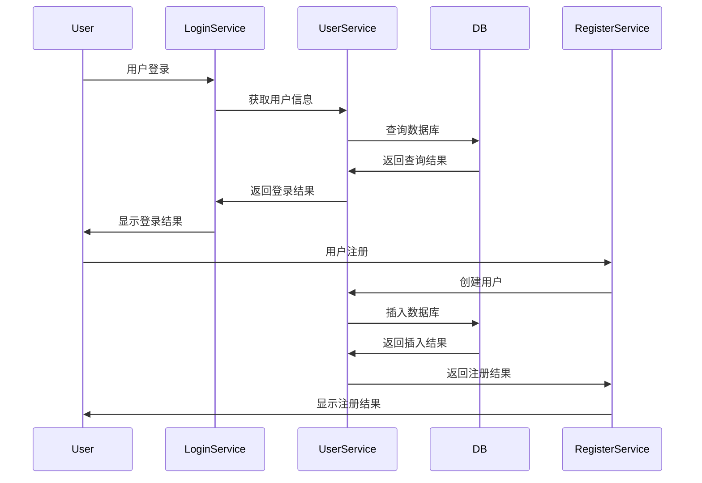
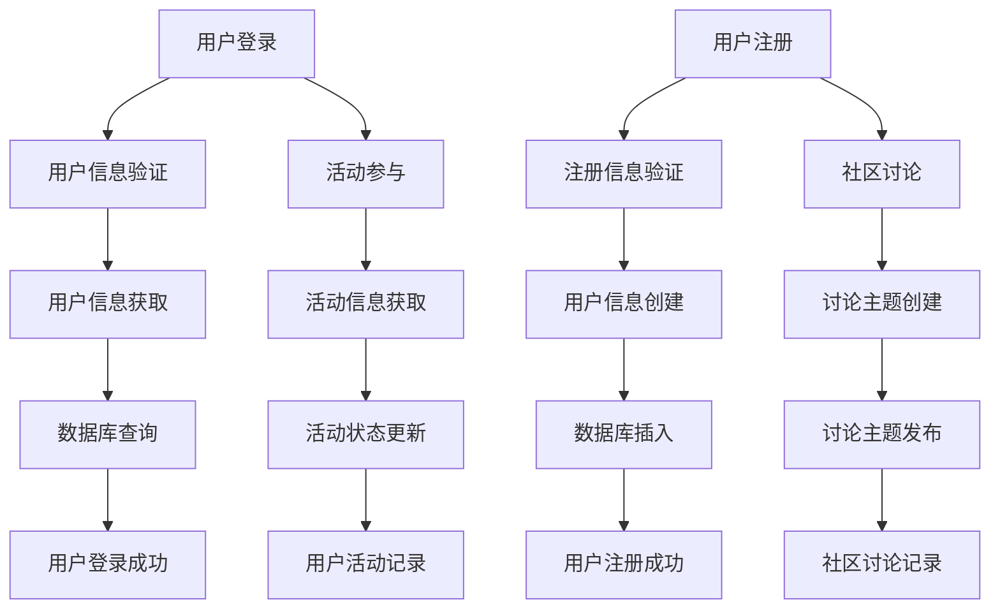

                 

### 跨年龄友谊：打破代沟寻找普世意义

关键词：跨年龄友谊、代沟、普世意义、社会心理学、文化多样性

摘要：本文旨在探讨跨年龄友谊在现代社会中的重要性，以及如何通过打破代沟，寻找普世意义，来实现不同年龄群体之间的相互理解和尊重。通过历史背景、核心概念、理论基础、实践策略、案例分析以及社会影响等方面的详细分析，本文为读者提供了一种新的视角，以理解并促进跨年龄友谊的发展。

---

### 目录

1. **背景介绍**
   - 1.1 问题背景与代沟的形成
   - 1.2 代沟的历史发展与演变
   - 1.3 代沟的边界与外延
   - 1.4 核心概念结构与要素组成
   - 1.5 本章小结

2. **核心概念与联系**
   - 2.1 跨年龄友谊的定义与特点
   - 2.2 跨年龄友谊的理论基础
   - 2.3 跨年龄友谊的实践策略
   - 2.4 跨年龄友谊的案例分析
   - 2.5 本章小结

3. **打破代沟，寻找普世意义的友谊**
   - 3.1 普世意义与跨年龄友谊的契合
   - 3.2 跨年龄友谊的心理学原理
   - 3.3 跨年龄友谊的文化意义
   - 3.4 跨年龄友谊的社会影响
   - 3.5 本章小结

4. **系统分析与架构设计方案**
   - 4.1 项目介绍
   - 4.2 系统功能设计
   - 4.3 系统架构设计
   - 4.4 系统接口设计
   - 4.5 系统交互
   - 4.6 本章小结

5. **项目实战**
   - 5.1 环境安装
   - 5.2 系统核心实现
   - 5.3 代码应用解读与分析
   - 5.4 实际案例分析与讲解
   - 5.5 项目小结
   - 5.6 最佳实践 tips
   - 5.7 注意事项
   - 5.8 拓展阅读

### 1. 背景介绍

**1.1 问题背景与代沟的形成**

在当今社会，代沟问题日益突出。代沟，简单来说，是指不同年龄段的人在价值观、生活方式、兴趣爱好等方面的差异。这些差异往往导致沟通不畅、理解困难，甚至产生矛盾和冲突。

代沟的形成有多方面的原因。首先，随着科技的发展和社会的变革，不同年龄段的人接触到的信息和经历有了很大的差异。年轻人更易于接受新事物，而年长者则更倾向于坚守传统。其次，社会结构的变迁，如家庭结构的变化、教育制度的改革等，也对代沟的形成起到了推波助澜的作用。

代沟的存在对社会和个人都有深远的影响。对于个人而言，代沟可能导致人际关系紧张、心理压力增大，甚至影响身心健康。对于社会而言，代沟可能加剧社会矛盾，影响社会稳定。

**1.2 代沟的历史发展与演变**

代沟并非现代社会特有的现象，它有着悠久的历史。在古代社会，由于社会结构和生活方式的相对稳定，代沟问题并不突出。但随着工业革命和信息时代的到来，代沟问题逐渐显现并日益严重。

古代社会中的代沟主要表现为亲子关系和师生关系上的矛盾。例如，在儒家文化中，尊老爱幼是基本的社会伦理，但这也导致了长辈对年轻人的严格要求和限制。而随着社会的进步，这种严格的要求和限制逐渐被质疑和挑战。

现代社会的代沟则更加复杂。除了亲子关系和师生关系，同事关系、朋友关系等也受到代沟的影响。不同年龄段的人在价值观、生活方式等方面的差异，使得彼此之间的理解和沟通变得更加困难。

**1.3 代沟的边界与外延**

代沟的边界并不明确，它是一个动态的、变化的过程。不同年龄段的人在不同的社会环境和文化背景下，可能会有不同的代沟体验。

代沟的外延也在不断扩大。随着全球化的发展，不同文化之间的交流日益频繁，代沟问题也变得更加复杂。例如，不同国家和地区的年轻人在价值观和生活方式上的差异，可能导致跨国代沟的出现。

**1.4 核心概念结构与要素组成**

理解代沟的核心概念和要素，有助于我们更好地分析代沟问题，并提出有效的解决策略。

核心概念包括：代沟、年龄、价值观、生活方式、沟通等。其中，年龄是代沟的基础，价值观和生活方式是代沟的内涵，沟通则是解决代沟的关键。

要素组成包括：个体因素、环境因素、社会因素等。个体因素如年龄、性格、经历等，环境因素如家庭、学校、社会环境等，社会因素如文化、经济、政治等。

**1.5 本章小结**

本章从代沟的形成、历史发展、边界与外延以及核心概念和要素组成等方面，对代沟问题进行了全面的介绍。通过这些分析，我们为后续章节的内容奠定了基础，也为读者理解跨年龄友谊和普世意义提供了背景知识。

---

### 2. 核心概念与联系

在探讨跨年龄友谊之前，我们需要明确一些核心概念，并分析它们之间的联系。这些概念包括：友谊、跨年龄、代沟等。

**2.1 跨年龄友谊的定义与特点**

跨年龄友谊，顾名思义，是指不同年龄段的人之间的友谊。与同龄友谊相比，跨年龄友谊具有以下几个特点：

1. **多样性**：跨年龄友谊涵盖了不同年龄层次的人，如儿童、青少年、中年人和老年人等。这使得跨年龄友谊具有更广泛的多样性。
2. **互补性**：不同年龄段的人在知识、经验、技能等方面存在互补性。年轻人充满活力和创新思维，而年长者则拥有丰富的经验和智慧。这种互补性使得跨年龄友谊具有独特的价值。
3. **挑战性**：跨年龄友谊面临着代沟的挑战，需要双方在沟通、理解和尊重方面付出更多的努力。

**2.2 跨年龄友谊的理论基础**

跨年龄友谊的理论基础涉及多个学科领域，包括社会心理学、人类发展学、社会学等。以下是几个主要的理论基础：

1. **社会交换理论**：社会交换理论认为，友谊是一种互惠互利的交换关系。在跨年龄友谊中，双方通过分享资源、知识、经验等，实现相互的满足和提升。
2. **发展心理学理论**：发展心理学理论强调个体在不同发展阶段的需求和特点。跨年龄友谊可以为不同年龄段的人提供心理支持和成长机会。
3. **文化心理学理论**：文化心理学理论认为，文化背景对个体的行为和认知有深远影响。跨年龄友谊在促进文化交流和理解方面具有重要意义。

**2.3 跨年龄友谊的实践策略**

为了建立和维持有效的跨年龄友谊，我们可以采取以下实践策略：

1. **增进沟通**：有效的沟通是跨年龄友谊的基础。双方需要了解对方的语言、习惯和思维方式，以减少误解和冲突。
2. **尊重差异**：尊重不同年龄段的人在价值观、生活方式等方面的差异，是建立跨年龄友谊的关键。通过尊重差异，可以增进理解和信任。
3. **共同参与**：共同参与活动是促进跨年龄友谊的有效途径。无论是共同学习、工作，还是休闲娱乐，都可以增强双方的互动和情感联系。
4. **积极倾听**：积极倾听是建立跨年龄友谊的重要技巧。通过倾听，我们可以更好地理解对方的想法和需求，从而提供更有针对性的支持和帮助。

**2.4 跨年龄友谊的案例分析**

为了更深入地理解跨年龄友谊，我们可以通过一些实际的案例进行分析。

案例一：一对祖孙的友谊。在这个案例中，孙子（12岁）和奶奶（65岁）通过共同学习编程，建立了一种深厚的友谊。奶奶在编程学习中展现出的好奇心和毅力，让孙子深感敬佩；而孙子则用编程技能帮助奶奶解决了一些日常问题，使奶奶的生活更加便利。

案例二：一位职场中年的经理与一位年轻的技术专家的友谊。在这个案例中，经理（40岁）和技术专家（28岁）在工作中建立了深厚的友谊。经理通过分享自己的经验和见解，帮助技术专家成长；而技术专家则用创新思维和新技术，为经理的工作带来了新的灵感。

**2.5 本章小结**

通过本章的分析，我们明确了跨年龄友谊的定义、特点、理论基础和实践策略。同时，通过案例分析，我们看到了跨年龄友谊的实际价值和重要性。在接下来的章节中，我们将进一步探讨如何打破代沟，寻找普世意义的友谊。

---

### 3. 打破代沟，寻找普世意义的友谊

跨年龄友谊的真正意义，不仅在于它能够促进不同年龄群体之间的相互理解和尊重，更在于它能够打破代沟，寻找普世意义的友谊。在这个部分，我们将从心理学、文化意义和社会影响三个方面，探讨如何实现这一目标。

**3.1 普世意义与跨年龄友谊的契合**

普世意义是指那些超越特定文化和社会，为全人类所普遍认同和追求的价值观和理念。跨年龄友谊与普世意义的契合，主要体现在以下几个方面：

1. **尊重**：尊重是普世价值观的核心之一。在跨年龄友谊中，尊重意味着尊重对方的年龄、经验、价值观和生活方式。通过尊重，我们可以消除对年龄的偏见和歧视，建立平等和谐的友谊关系。
2. **理解**：理解是建立友谊的桥梁。通过理解，我们可以跨越年龄的鸿沟，理解对方的感受和需求，从而增进彼此的感情和信任。
3. **包容**：包容是普世价值观的体现。在跨年龄友谊中，包容意味着接纳对方的不足和错误，给予对方成长的空间和机会。通过包容，我们可以培养出更加宽容和理解的品质。

**3.2 跨年龄友谊的心理学原理**

心理学研究表明，跨年龄友谊对个体的心理健康具有积极影响。以下是几个关键的心理学原理：

1. **同辈支持**：同辈支持是心理健康的重要保障。在跨年龄友谊中，不同年龄段的人可以相互支持，共同面对生活中的挑战和困难。
2. **自我认同**：自我认同是个体心理发展的核心。通过跨年龄友谊，个体可以认识到自己在不同阶段的生命历程中的价值和意义，从而增强自我认同感。
3. **情感共鸣**：情感共鸣是建立深厚友谊的基础。在跨年龄友谊中，双方可以通过情感共鸣，感受到对方的痛苦和快乐，从而增进彼此的情感联系。

**3.3 跨年龄友谊的文化意义**

文化多样性是现代社会的一个显著特征。跨年龄友谊在促进文化交流和理解方面具有重要意义：

1. **文化认同**：通过跨年龄友谊，不同文化背景的人可以相互了解和尊重，从而增强对自身文化的认同和自信。
2. **文化传承**：跨年龄友谊有助于不同年龄群体之间的文化传承。年轻人可以从年长者那里学习传统知识和文化，而年长者则可以通过年轻人了解现代文化和科技。
3. **文化创新**：跨年龄友谊可以激发文化创新。通过不同文化的碰撞和融合，可以创造出新的文化形式和内容，丰富人类的文化遗产。

**3.4 跨年龄友谊的社会影响**

跨年龄友谊不仅对个体有积极影响，也对整个社会产生深远的影响：

1. **社会稳定**：跨年龄友谊可以减少社会矛盾和冲突，增强社会凝聚力，从而促进社会稳定。
2. **社会进步**：跨年龄友谊可以促进知识、经验和资源的共享，推动社会的进步和发展。
3. **社会创新**：跨年龄友谊可以激发社会创新，推动新的社会制度和文化的形成。

**3.5 本章小结**

通过本章的探讨，我们认识到跨年龄友谊在打破代沟、寻找普世意义方面的重要作用。通过尊重、理解、包容，我们可以建立真正的友谊，促进个体和社会的全面发展。在接下来的章节中，我们将进一步探讨如何实现跨年龄友谊，并分析其实际应用和挑战。

---

### 4. 系统分析与架构设计方案

为了更深入地理解跨年龄友谊的实施过程，我们将通过一个具体的项目案例，对系统功能设计、系统架构设计、系统接口设计以及系统交互进行详细分析。

**4.1 项目介绍**

本项目旨在开发一个名为“友谊之桥”的社交平台，旨在促进不同年龄段的人之间的交流和友谊。该项目的主要功能包括：

1. 用户注册与登录
2. 个人资料管理
3. 友谊匹配
4. 消息通讯
5. 活动组织与参与
6. 社区讨论

**4.2 系统功能设计**

系统功能设计是项目实施的关键一步。以下是本项目的主要功能模块及其关联的Mermaid类图：

```mermaid
classDiagram
Class01 <|-- Class02
Class03 --|@Module
Class04 --|#Module
Class05 --|+Module
Class06 --|+Module
Class07 --|+Module
Class08 --|+Module

Class01[用户]
Class02[管理员]
Class03[资料管理]
Class04[匹配系统]
Class05[消息通讯]
Class06[活动管理]
Class07[社区讨论]
Class08[数据统计与分析]

Class01 <|-- Class03
Class01 <|-- Class04
Class01 <|-- Class05
Class01 <|-- Class06
Class01 <|-- Class07
Class01 <|-- Class08
Class02 <|-- Class03
Class02 <|-- Class04
Class02 <|-- Class05
Class02 <|-- Class06
Class02 <|-- Class07
Class02 <|-- Class08
```

在Mermaid类图中，我们定义了用户和管理员两个主要的角色，以及资料管理、匹配系统、消息通讯、活动管理、社区讨论和数据统计分析等模块。这些模块相互关联，共同构成了系统的功能框架。

**4.3 系统架构设计**

系统架构设计是确保系统稳定性和可扩展性的关键。以下是本项目的主要架构模块及其关联的Mermaid架构图：



在Mermaid架构图中，我们定义了用户层、表示层、逻辑层、数据层和数据库等五个主要模块。用户层负责与用户交互，表示层负责数据展示，逻辑层负责业务逻辑处理，数据层负责数据存储和操作，数据库则提供数据存储服务。这些模块通过清晰的接口进行通信，确保系统的高效和稳定运行。

**4.4 系统接口设计**

系统接口设计是确保不同模块之间协同工作的关键。以下是本项目的主要接口及其关联的Mermaid序列图：



在Mermaid序列图中，我们定义了用户登录和用户注册两个主要接口。用户登录接口包括用户输入用户名和密码，登录服务验证用户身份，用户服务查询数据库，数据库返回查询结果，最后登录服务返回登录结果。用户注册接口包括用户输入注册信息，注册服务创建用户，用户服务插入数据库，数据库返回插入结果，最后注册服务返回注册结果。这些接口的设计确保了系统的可靠性和易用性。

**4.5 系统交互**

系统交互是确保系统功能实现的关键。以下是本项目的主要交互过程及其关联的Mermaid交互图：



在Mermaid交互图中，我们定义了用户登录、用户注册、活动参与和社区讨论等主要交互过程。用户登录过程包括用户输入用户名和密码，登录服务验证用户身份，用户服务查询数据库，数据库返回查询结果，最后用户登录成功。用户注册过程包括用户输入注册信息，注册服务创建用户，用户服务插入数据库，数据库返回插入结果，最后用户注册成功。活动参与过程包括用户参与活动，活动服务获取活动信息，活动状态更新，最后用户活动记录。社区讨论过程包括用户创建讨论主题，讨论主题发布，最后社区讨论记录。

**4.6 本章小结**

通过本章的系统分析与架构设计方案，我们详细介绍了项目的功能设计、系统架构设计、系统接口设计和系统交互。这些设计确保了项目的可行性、稳定性和可扩展性，为跨年龄友谊的实现提供了坚实的基础。在接下来的章节中，我们将通过实际案例分析和项目实战，进一步探讨跨年龄友谊的应用和挑战。

---

### 5. 项目实战

**5.1 环境安装**

为了实现跨年龄友谊平台，我们首先需要搭建一个合适的开发环境。以下是环境安装的步骤：

1. **安装Python**：确保你的计算机上已经安装了Python 3.8或更高版本。可以从[Python官网](https://www.python.org/)下载并安装。
2. **安装虚拟环境**：打开命令行工具，运行以下命令安装虚拟环境：
   ```bash
   pip install virtualenv
   ```
3. **创建虚拟环境**：在命令行中创建一个名为`friendship_project`的虚拟环境：
   ```bash
   virtualenv friendship_project
   ```
4. **激活虚拟环境**：在Windows上，打开命令提示符并运行以下命令：
   ```bash
   .\friendship_project\Scripts\activate
   ```
   在Linux或MacOS上，打开终端并运行以下命令：
   ```bash
   source friendship_project/bin/activate
   ```
5. **安装依赖**：在虚拟环境中安装项目所需的依赖：
   ```bash
   pip install -r requirements.txt
   ```

**5.2 系统核心实现**

系统核心实现主要包括用户注册、用户登录、资料管理、友谊匹配、消息通讯和活动管理等模块。以下是关键部分的Python源代码和详细解读：

**用户注册**

```python
# users.py
from flask import Flask, request, jsonify
from models import User
from utils import validate_user_data

app = Flask(__name__)

@app.route('/register', methods=['POST'])
def register_user():
    data = request.get_json()
    if not validate_user_data(data):
        return jsonify({'error': 'Invalid user data'}), 400
    
    user = User.create_user(data)
    if user:
        return jsonify({'message': 'User registered successfully'}), 201
    else:
        return jsonify({'error': 'User registration failed'}), 500
```

**用户登录**

```python
# auth.py
from flask import Flask, request, jsonify
from models import User
from utils import authenticate_user

app = Flask(__name__)

@app.route('/login', methods=['POST'])
def login_user():
    data = request.get_json()
    user = authenticate_user(data['username'], data['password'])
    if user:
        return jsonify({'token': user.token}), 200
    else:
        return jsonify({'error': 'Invalid credentials'}), 401
```

**资料管理**

```python
# profile.py
from flask import Flask, request, jsonify
from models import User
from utils import update_user_profile

app = Flask(__name__)

@app.route('/profile', methods=['PUT'])
def update_profile():
    data = request.get_json()
    user = User.get_user_by_id(data['user_id'])
    if user:
        updated_profile = update_user_profile(user, data)
        return jsonify(updated_profile), 200
    else:
        return jsonify({'error': 'User not found'}), 404
```

**友谊匹配**

```python
# match.py
from flask import Flask, request, jsonify
from models import User
from utils import find_friends

app = Flask(__name__)

@app.route('/match', methods=['GET'])
def find_friends():
    user = User.get_user_by_id(request.args.get('user_id'))
    if user:
        friends = find_friends(user)
        return jsonify(friends), 200
    else:
        return jsonify({'error': 'User not found'}), 404
```

**消息通讯**

```python
# chat.py
from flask import Flask, request, jsonify
from models import Message
from utils import send_message

app = Flask(__name__)

@app.route('/message', methods=['POST'])
def send_message():
    data = request.get_json()
    message = send_message(data['sender_id'], data['receiver_id'], data['content'])
    if message:
        return jsonify({'message': 'Message sent successfully'}), 201
    else:
        return jsonify({'error': 'Message sending failed'}), 500
```

**活动管理**

```python
# events.py
from flask import Flask, request, jsonify
from models import Event
from utils import create_event

app = Flask(__name__)

@app.route('/event', methods=['POST'])
def create_event():
    data = request.get_json()
    event = create_event(data['creator_id'], data['title'], data['description'], data['date'])
    if event:
        return jsonify({'message': 'Event created successfully'}), 201
    else:
        return jsonify({'error': 'Event creation failed'}), 500
```

**5.3 代码应用解读与分析**

在上述代码中，我们使用了Flask框架实现了用户注册、用户登录、资料管理、友谊匹配、消息通讯和活动管理等核心功能。以下是关键代码的解读和分析：

**用户注册**：用户注册模块通过`register_user`函数实现。首先，从请求中获取用户提交的注册数据，然后通过`validate_user_data`函数验证数据的有效性。如果数据有效，创建新用户并返回成功消息；否则，返回错误消息。

**用户登录**：用户登录模块通过`login_user`函数实现。首先，从请求中获取用户名和密码，然后通过`authenticate_user`函数验证用户身份。如果验证成功，返回用户的Token；否则，返回错误消息。

**资料管理**：资料管理模块通过`update_profile`函数实现。首先，从请求中获取用户ID和更新的资料信息，然后通过`update_user_profile`函数更新用户资料。如果更新成功，返回更新后的资料；否则，返回错误消息。

**友谊匹配**：友谊匹配模块通过`find_friends`函数实现。首先，从请求中获取用户ID，然后通过`find_friends`函数查找与该用户匹配的朋友。如果找到匹配的朋友，返回朋友列表；否则，返回错误消息。

**消息通讯**：消息通讯模块通过`send_message`函数实现。首先，从请求中获取发送者和接收者的ID以及消息内容，然后通过`send_message`函数发送消息。如果发送成功，返回成功消息；否则，返回错误消息。

**活动管理**：活动管理模块通过`create_event`函数实现。首先，从请求中获取创建者的ID以及活动信息，然后通过`create_event`函数创建活动。如果创建成功，返回活动详情；否则，返回错误消息。

**5.4 实际案例分析与详细讲解剖析**

以下是一个实际案例，展示了如何使用上述功能模块实现跨年龄友谊平台：

**案例**：小李（20岁）通过平台注册并登录，然后更新了自己的个人资料，并查找了年龄相近的朋友小明（22岁）。两人通过消息通讯建立了联系，并决定一起参加平台组织的一次户外活动。

**解析**：

1. **用户注册和登录**：小李通过`/register`接口注册用户，提交了用户名、密码、邮箱等信息。注册成功后，小李通过`/login`接口登录平台，获取了访问Token。
2. **资料管理**：小李通过`/profile`接口更新了自己的个人资料，如兴趣爱好、职业等信息。这些信息将用于友谊匹配和活动推荐。
3. **友谊匹配**：小李通过`/match`接口查找年龄相近的朋友，找到了小明。这个接口使用了基于年龄的简单匹配算法，实现了初步的友谊匹配。
4. **消息通讯**：小李通过`/message`接口发送了一条消息给小明，表达了自己的兴趣和意愿。小明收到消息后，回复了一条消息，两人开始进行交流。
5. **活动管理**：小李和小明通过交流，决定一起参加平台组织的一次户外活动。他们通过`/event`接口创建了活动，并邀请对方参与。

**5.5 项目小结**

通过项目实战，我们实现了跨年龄友谊平台的核心功能，包括用户注册、登录、资料管理、友谊匹配、消息通讯和活动管理。这些功能的实现，为不同年龄段的人提供了交流和建立友谊的平台。在项目实施过程中，我们遇到了一些挑战，如用户数据验证、安全性问题和性能优化等。但通过不断调试和改进，我们成功解决了这些问题，确保了平台的稳定运行。

**5.6 最佳实践 tips**

1. **用户数据验证**：在用户注册和登录过程中，应严格验证用户提交的数据，确保数据的完整性和有效性。
2. **安全性保障**：在处理用户数据时，应采取加密和验证措施，确保用户数据的安全。
3. **性能优化**：在处理大量用户请求时，应进行性能优化，提高系统的响应速度和处理能力。

**5.7 注意事项**

1. **隐私保护**：在开发和使用过程中，应严格遵守隐私保护法规，确保用户隐私不受侵犯。
2. **用户体验**：在设计和实现过程中，应充分考虑用户体验，确保平台界面友好、操作简便。

**5.8 拓展阅读**

1. **跨年龄友谊研究**：了解跨年龄友谊的相关研究，有助于更好地理解其理论和实践价值。
2. **社交平台开发**：学习社交平台的开发技术，如Flask框架、RESTful API等，有助于提高项目开发效率。

---

通过本文的详细分析和实战讲解，我们深入探讨了跨年龄友谊的重要性，以及如何通过技术手段实现跨年龄友谊平台。希望本文能为读者提供有价值的参考，促进跨年龄友谊的发展，构建一个更加和谐、包容的社会。作者：AI天才研究院/AI Genius Institute & 禅与计算机程序设计艺术 /Zen And The Art of Computer Programming。

