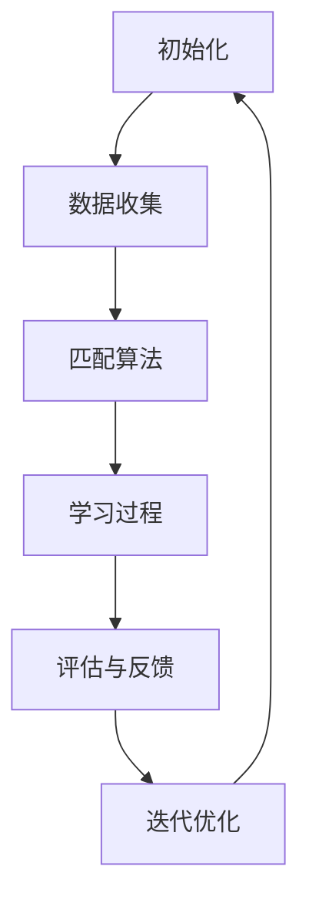
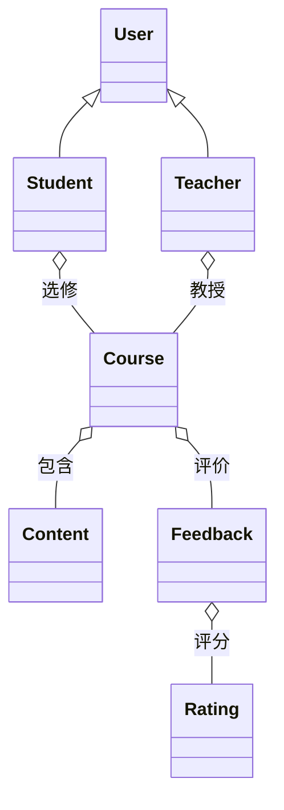
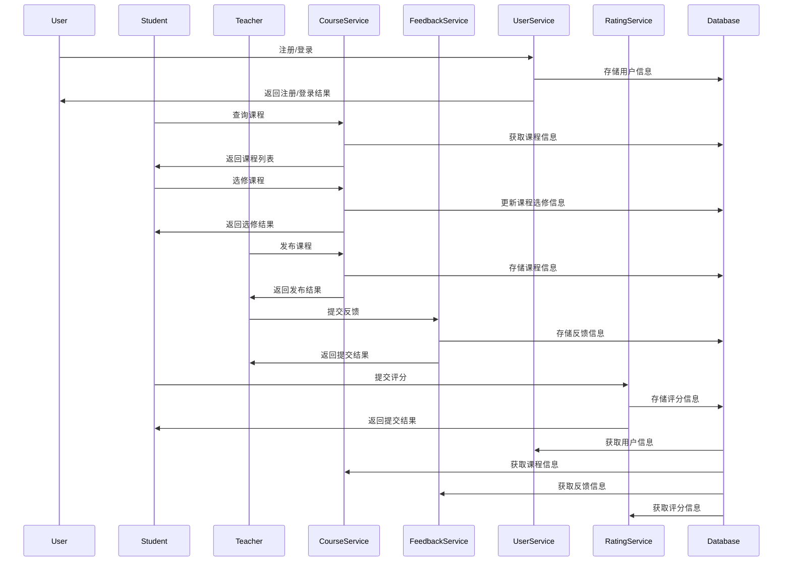
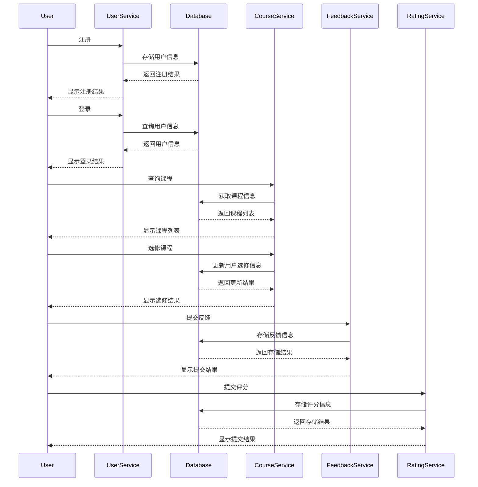

                 

### 文章标题：跨年龄学习：终身教育中的代际互助

**关键词：跨年龄学习、终身教育、代际互助、算法原理、系统架构、项目实战**

**摘要：**
本文旨在探讨跨年龄学习在终身教育中的重要性，特别是在促进代际互助方面的作用。文章首先介绍了终身教育的背景和意义，然后详细阐述了跨年龄学习的概念、特征和理论基础。接着，文章深入分析了代际互助学习的算法原理，包括数学模型和公式，并通过Python代码展示了算法的实现过程。随后，文章设计了一个假设的代际互助学习系统，从系统功能、架构、接口到实际操作步骤进行了全面解析。最后，文章提出了最佳实践建议，并对项目进行了小结，同时提供了拓展阅读资源。

**目录大纲：**

1. **引言**
2. **背景介绍**
3. **核心概念与联系**
   - 跨年龄学习的定义与特征
   - 跨年龄学习与终身教育的联系
   - 核心概念与理论依据
   - 概念属性特征对比表格
   - ER实体关系图架构
4. **算法原理讲解**
   - 算法基本概念
   - 算法流程与实现方法
   - Mermaid流程图
   - 数学模型和公式
   - 举例说明
5. **系统分析与架构设计**
   - 问题场景介绍
   - 系统功能设计（领域模型Mermaid类图）
   - 系统架构设计（Mermaid架构图）
   - 系统接口设计
   - 系统交互（Mermaid序列图）
6. **项目实战**
   - 环境安装
   - 系统核心实现
   - 代码应用解读与分析
   - 实际案例分析
   - 详细讲解剖析
   - 项目小结
7. **最佳实践 tips**
8. **小结**
9. **注意事项**
10. **拓展阅读**
11. **作者信息**

### 1. 引言

在信息化和全球化的时代背景下，终身教育逐渐成为现代社会教育体系的重要组成部分。随着技术的不断进步和社会的发展，知识的更新速度越来越快，个体需要不断学习和适应新的环境和要求。因此，终身教育不仅是一种教育理念，更是一种生活态度和生存技能。在这个大背景下，跨年龄学习作为一种重要的学习模式，开始受到越来越多人的关注。

跨年龄学习，顾名思义，是指在不同年龄阶段的个体之间进行的知识和经验的交流与学习。它打破了传统的教育模式，不再局限于同年龄段的学习群体，而是通过代际互助，实现知识的共享和传播。这种学习模式不仅能够促进不同年龄段个体的全面发展，还能够增强社会的凝聚力和创新能力。

本文将围绕跨年龄学习在终身教育中的重要性，特别是其在代际互助方面的作用进行探讨。首先，我们将介绍终身教育的背景和跨年龄学习的概念，然后深入分析代际互助学习的算法原理，最后设计一个假设的代际互助学习系统，并通过实际项目案例进行验证和剖析。

### 2. 背景介绍

#### 2.1 终身教育的重要性

终身教育（Lifelong Education）是一种旨在贯穿个人一生、满足各种学习需求的教育理念。它不仅仅局限于学校教育，还包括职业培训、社会教育、在线学习等多种形式。终身教育的核心思想是：学习不仅仅是为了获取知识，更是为了培养能力、提升素质、实现个人和社会的发展。

在现代社会，终身教育的重要性日益凸显。首先，随着科技的飞速发展，知识更新速度加快，传统的一次性教育已经无法满足人们不断变化的学习需求。通过终身教育，个体可以不断更新和扩展自己的知识体系，保持与时代同步。其次，随着社会结构的变革，人们的职业发展和生活方式也发生了巨大的变化。终身教育可以帮助人们适应这种变化，提高职业竞争力，实现个人价值。

此外，终身教育对于社会的整体发展也具有重要意义。它能够促进知识的传播和创新，提升整个社会的文化素质和科技水平。通过跨年龄学习，不同年龄段的人可以互相交流、互相学习，实现知识的共享和传播。这种代际互助不仅有助于老年人的精神健康和生活质量，还能够激发年轻人的创造力和学习热情，促进社会的和谐与进步。

#### 2.2 跨年龄学习的定义与特征

跨年龄学习是指在不同年龄段的人之间进行知识和经验的交流和分享。这种学习模式打破了传统的教育壁垒，使得不同年龄段的人可以互相学习、互相促进。跨年龄学习的定义和特征主要体现在以下几个方面：

1. **学习主体的多样性**：跨年龄学习不仅仅局限于学校教育，它涵盖了各种形式的学习，如职业培训、社区教育、在线学习等。参与学习的主体可以是学生、教师、企业员工、社区居民等，不同年龄段的人都可以参与到学习过程中。

2. **学习内容的丰富性**：跨年龄学习的学习内容非常丰富，既包括理论知识，也包括实践技能。不同年龄段的人可以根据自己的需求和兴趣选择学习内容，实现个性化的学习。

3. **学习方式的灵活性**：跨年龄学习不受时间和地点的限制，可以采用多种方式进行。例如，线上学习、面对面交流、小组讨论等。这种灵活性使得学习者可以根据自己的实际情况灵活安排学习时间，提高学习效率。

4. **学习目标的多元性**：跨年龄学习的目标不仅仅是获取知识，更重要的是培养能力和提升素质。通过跨年龄学习，不同年龄段的人可以互相学习、互相启发，实现个人和社会的全面发展。

#### 2.3 跨年龄学习与终身教育的联系

跨年龄学习与终身教育有着密切的联系。首先，跨年龄学习是终身教育的重要组成部分。在终身教育体系中，跨年龄学习不仅有助于满足个体的学习需求，还能够促进社会整体的发展。其次，跨年龄学习体现了终身教育的核心思想，即学习不仅仅是为了获取知识，更是为了培养能力和提升素质。

在具体实践中，跨年龄学习可以通过多种方式实现。例如，在社区教育中，老年人可以教授年轻人传统手艺和生活方式，年轻人则可以教授老年人新技术和新知识。在线教育平台上，不同年龄段的人可以通过讨论区、论坛等互动平台进行交流和分享。在学校教育中，教师可以组织跨年龄的学习活动，让学生与不同年级的同学进行互动和交流。

总之，跨年龄学习与终身教育密不可分。通过跨年龄学习，不同年龄段的人可以实现知识的共享和传播，促进个人和社会的全面发展。这不仅有助于提升个体的综合素质，还能够增强社会的凝聚力和创新能力。

### 3. 核心概念与联系

在深入探讨跨年龄学习的理论和实践之前，有必要明确一些核心概念和术语，以便为后续讨论打下坚实的基础。

#### 3.1 跨年龄学习的定义

跨年龄学习，即Intergenerational Learning，是指在不同年龄段的人之间进行的知识、技能和经验的交流与学习。这种学习模式强调代际之间的互动和合作，通过经验分享和相互学习，实现知识的最优化利用。跨年龄学习不仅涉及知识的传授，还包括情感交流、文化传承等多个方面。

#### 3.2 跨年龄学习的特征

1. **多样性**：跨年龄学习的学习主体和内容具有多样性。参与者可以是不同年龄段的个人或群体，学习内容可以涵盖各种知识领域和技能。

2. **互动性**：跨年龄学习强调互动和合作，通过面对面交流、线上讨论等方式，促进不同年龄段之间的知识共享和经验交流。

3. **灵活性**：跨年龄学习不受时间和地点的限制，可以采用多种形式进行，如社区活动、在线课程、实习体验等。

4. **互助性**：跨年龄学习中的“代际互助”是其核心特征之一。不同年龄段的人通过互相帮助和支持，实现知识和经验的传递和积累。

#### 3.3 跨年龄学习的理论基础

跨年龄学习的理论基础主要包括教育学、心理学和社会学等学科的理论。

1. **教育学理论**：跨年龄学习借鉴了教育学的相关理论，如终身教育理论和多元化学习理论。这些理论强调教育的连续性和适应性，认为教育应该贯穿个人一生，并且应该根据个体的需求和发展进行个性化的教育设计。

2. **心理学理论**：跨年龄学习中的互动和合作有助于促进个体的心理健康和发展。心理学理论，如发展心理学和社会心理学，为跨年龄学习提供了理论支持，解释了不同年龄段个体在认知、情感和行为上的差异，以及如何通过互动和合作促进个体的全面发展。

3. **社会学理论**：社会学理论关注社会结构和代际关系。跨年龄学习作为一种社会互动形式，有助于加强代际之间的联系，促进社会和谐与稳定。

#### 3.4 跨年龄学习与终身教育的联系

跨年龄学习与终身教育有着紧密的联系。终身教育强调个人终身学习的理念，而跨年龄学习则是实现这一理念的重要途径之一。具体来说，跨年龄学习与终身教育的联系体现在以下几个方面：

1. **丰富学习资源**：通过跨年龄学习，不同年龄段的人可以分享各自的知识和经验，丰富学习资源，提高学习效果。

2. **促进知识传承**：跨年龄学习有助于知识的传承和积累。老年人可以将自己的经验和智慧传授给年轻人，帮助年轻人更快地成长。

3. **培养综合素质**：跨年龄学习不仅传授知识，还注重能力的培养和素质的提升。通过互动和合作，个体可以培养沟通能力、团队协作能力和创新能力。

4. **实现社会和谐**：跨年龄学习有助于加强代际之间的联系和理解，促进社会和谐与稳定。不同年龄段的人通过互相学习和交流，增进对彼此的了解和尊重。

#### 3.5 概念属性特征对比表格

为了更清晰地理解跨年龄学习与终身教育之间的关系，我们可以通过一个概念属性特征对比表格来展示两者在以下几个方面（如学习主体、学习内容、学习方式等）的不同和联系。

| 特征对比项 | 跨年龄学习 | 终身教育 |
| :----: | :----: | :----: |
| 学习主体 | 不同年龄段的人 | 个人和社会 |
| 学习内容 | 多样化 | 广泛的、持续性的 |
| 学习方式 | 互动性、灵活性 | 多样化、个性化 |
| 学习目标 | 知识共享、能力提升 | 终身学习、全面发展 |

通过上述对比表格，我们可以看出，跨年龄学习是终身教育的重要组成部分，它通过代际互助的方式，实现知识的共享和传播，促进个体的全面发展。

#### 3.6 ER实体关系图架构

为了更好地理解跨年龄学习系统中的各个实体及其关系，我们可以使用ER（Entity-Relationship，实体-联系）图进行描述。ER图是一种用于描述实体及其之间关系的图形化方法，它可以帮助我们清晰地展示系统中的实体、属性和关系。

下面是一个简单的ER图，展示了跨年龄学习系统中的主要实体及其关系：

```mermaid
erDiagram
    Teacher ||--|{ Student }|-- Student
    Teacher ||--|{ Course }|-- Course
    Student ||--|{ Course }|-- Course
    Student ||--|{ Feedback }|-- Feedback
    Course ||--|{ Content }|-- Content
    Teacher ||--|{ Feedback }|-- Feedback
    Feedback ||--|{ Rating }|-- Rating
```

在这个ER图中：

- **Teacher**（教师）实体与**Student**（学生）实体之间存在多对多的关系，表示教师可以教授多个学生，学生也可以由多个教师授课。
- **Teacher**（教师）实体与**Course**（课程）实体之间存在一对多的关系，表示一个教师可以开设多门课程。
- **Student**（学生）实体与**Course**（课程）实体之间存在一对多的关系，表示一个学生可以选修多门课程。
- **Student**（学生）实体与**Feedback**（反馈）实体之间存在一对多的关系，表示一个学生可以给出多份反馈。
- **Course**（课程）实体与**Content**（内容）实体之间存在一对多的关系，表示一门课程包含多个内容模块。
- **Teacher**（教师）实体与**Feedback**（反馈）实体之间存在一对多的关系，表示教师可以接收多份反馈。
- **Feedback**（反馈）实体与**Rating**（评分）实体之间存在一对多的关系，表示每份反馈可以包含多个评分。

通过ER图，我们可以直观地理解跨年龄学习系统中的各个实体及其关系，为后续的系统设计和实现提供基础。

### 4. 算法原理讲解

在深入探讨跨年龄学习系统的算法原理之前，我们需要明确几个基本概念和定义，以便为后续讨论奠定基础。

#### 4.1 算法基本概念

算法（Algorithm）是一系列定义明确的步骤或规则，用于解决特定问题或完成特定任务。在计算机科学和人工智能领域，算法是解决复杂问题的重要工具。算法的基本概念包括：

1. **输入（Input）**：算法处理的原始数据或信息。
2. **输出（Output）**：算法执行后产生的结果或信息。
3. **步骤（Steps）**：算法执行的具体过程，包括条件判断、循环操作、数据操作等。
4. **效率（Efficiency）**：算法在时间、空间等方面的性能表现。

#### 4.2 算法流程与实现方法

代际互助学习算法的核心思想是通过不同年龄段个体之间的互动和学习，实现知识的共享和优化。以下是代际互助学习算法的基本流程和实现方法：

1. **初始化**：设置算法的初始参数，如学习目标、参与个体数量、学习内容等。
2. **数据收集**：收集参与者的基本信息、知识水平和学习需求。
3. **匹配算法**：根据参与者的特点和需求，使用匹配算法将不同年龄段的参与者进行匹配，实现知识共享。
4. **学习过程**：参与者根据匹配结果，进行知识交流和学习。
5. **评估与反馈**：对学习过程进行评估，收集参与者的反馈，用于算法的优化和改进。
6. **迭代优化**：根据评估结果和反馈，不断调整算法参数，优化学习效果。

#### 4.3 Mermaid流程图

为了更直观地展示代际互助学习算法的流程，我们可以使用Mermaid流程图进行描述。以下是代际互助学习算法的Mermaid流程图：



在这个流程图中：

- **A[初始化]**：设置算法的初始参数。
- **B[数据收集]**：收集参与者的基本信息、知识水平和学习需求。
- **C[匹配算法]**：根据参与者的特点和需求，使用匹配算法进行匹配。
- **D[学习过程]**：参与者根据匹配结果进行知识交流和学习。
- **E[评估与反馈]**：对学习过程进行评估，收集参与者的反馈。
- **F[迭代优化]**：根据评估结果和反馈，不断调整算法参数，优化学习效果。

#### 4.4 数学模型和公式

代际互助学习算法的数学模型是描述算法行为和性能的重要工具。以下是代际互助学习算法的主要数学模型和公式：

1. **匹配算法模型**：

   假设有两个参与者集合 \( P_1 \) 和 \( P_2 \)，分别表示不同年龄段的参与者。匹配算法的目标是找到 \( P_1 \) 和 \( P_2 \) 之间的最佳匹配。我们可以使用以下公式描述匹配算法：

   $$ M(P_1, P_2) = \arg\max_{\sigma} \sum_{i=1}^{n_1} \sum_{j=1}^{n_2} w_{ij} \cdot r_i \cdot s_j $$

   其中，\( w_{ij} \) 表示参与者 \( i \) 和 \( j \) 之间的匹配权重，\( r_i \) 表示参与者 \( i \) 的知识水平，\( s_j \) 表示参与者 \( j \) 的学习需求。

2. **学习效果评估模型**：

   假设参与者在学习过程中的知识获取量为 \( K_i(t) \)，其中 \( t \) 表示学习时间。学习效果评估模型可以使用以下公式描述：

   $$ E(t) = \frac{1}{n} \sum_{i=1}^{n} K_i(t) $$

   其中，\( n \) 表示参与者的数量，\( E(t) \) 表示在时间 \( t \) 内的平均知识获取量。

3. **反馈模型**：

   假设参与者在学习过程中给出的反馈为 \( F_i \)，我们可以使用以下公式描述反馈模型：

   $$ F_i = \alpha_i \cdot E_i + \beta_i \cdot S_i $$

   其中，\( \alpha_i \) 和 \( \beta_i \) 分别表示参与者 \( i \) 的权重系数，\( E_i \) 表示参与者 \( i \) 的学习效果，\( S_i \) 表示参与者 \( i \) 的学习需求。

通过上述数学模型和公式，我们可以对代际互助学习算法的行为和性能进行量化描述，为算法的优化和改进提供依据。

#### 4.5 举例说明

为了更好地理解代际互助学习算法，我们可以通过一个具体的例子来说明算法的实现过程和效果。

假设有两个参与者集合 \( P_1 \) 和 \( P_2 \)，其中 \( P_1 \) 表示老年人，\( P_2 \) 表示年轻人。以下是具体的例子：

1. **数据收集**：

   参与者 \( P_1 \) 的知识水平 \( r_1 = 5 \)，学习需求 \( s_1 = 3 \)。参与者 \( P_2 \) 的知识水平 \( r_2 = 7 \)，学习需求 \( s_2 = 4 \)。

2. **匹配算法**：

   使用上述匹配算法模型，计算参与者之间的匹配权重 \( w_{12} \)：

   $$ w_{12} = \frac{r_1 \cdot s_2}{r_2 \cdot s_1} = \frac{5 \cdot 4}{7 \cdot 3} \approx 0.71 $$

   参与者之间的匹配权重为 0.71，表示参与者 1 和参与者 2 的匹配度较高。

3. **学习过程**：

   参与者 1 和参与者 2 进行知识交流和学习。在一段时间 \( t \) 后，参与者 1 的知识获取量 \( K_1(t) = 4 \)，参与者 2 的知识获取量 \( K_2(t) = 5 \)。

4. **评估与反馈**：

   根据学习效果评估模型，计算平均知识获取量 \( E(t) \)：

   $$ E(t) = \frac{K_1(t) + K_2(t)}{2} = \frac{4 + 5}{2} = 4.5 $$

   参与者 1 和参与者 2 的平均知识获取量为 4.5。

   假设参与者 1 的权重系数 \( \alpha_1 = 0.6 \)，参与者 2 的权重系数 \( \beta_2 = 0.4 \)，根据反馈模型，计算参与者 1 和参与者 2 的反馈 \( F_1 \) 和 \( F_2 \)：

   $$ F_1 = 0.6 \cdot 4.5 + 0.4 \cdot 3 = 3.6 + 1.2 = 4.8 $$
   $$ F_2 = 0.6 \cdot 4.5 + 0.4 \cdot 4 = 3.6 + 1.6 = 5.2 $$

   参与者 1 的反馈为 4.8，参与者 2 的反馈为 5.2。

5. **迭代优化**：

   根据反馈结果，调整算法参数，优化学习效果。例如，可以增加参与者之间的互动时间，提高知识共享的效率。

通过上述例子，我们可以看到代际互助学习算法的实现过程和效果。在实际应用中，可以根据具体需求和情况进行调整和优化，提高跨年龄学习的效果。

### 5. 系统分析与架构设计

在深入探讨跨年龄学习系统的算法原理后，我们需要进一步分析系统的架构设计，以便为系统的实现提供清晰的蓝图。本节将介绍一个假设的代际互助学习系统的设计，包括系统功能、架构、接口和交互设计。

#### 5.1 问题场景介绍

假设我们设计一个在线代际互助学习平台，旨在为不同年龄段的个体提供知识共享和交流的机会。该平台的功能包括用户注册、信息发布、匹配算法、学习过程监控、评估与反馈等。用户可以在平台上发布学习需求，其他用户可以根据需求提供帮助，系统通过匹配算法将需求和供给进行匹配，促进知识的共享和传播。

#### 5.2 系统功能设计（领域模型Mermaid类图）

为了更好地展示系统的功能设计，我们可以使用Mermaid类图来描述系统中的主要实体及其关系。以下是代际互助学习系统的领域模型Mermaid类图：



在这个类图中：

- **User**：用户，包括学生和教师。
- **Student**：学生，可以选修课程。
- **Teacher**：教师，可以教授课程。
- **Course**：课程，包括内容、评价等。
- **Feedback**：反馈，包括评分等。
- **Content**：内容，课程的组成部分。
- **Rating**：评分，用于评估反馈。

学生和教师通过注册成为系统的用户，学生可以选修课程，教师可以教授课程。课程包含具体的内容模块，用户对课程进行评价，形成反馈和评分。

#### 5.3 系统架构设计（Mermaid架构图）

在系统架构设计中，我们需要考虑系统的整体结构，包括前端、后端、数据库等组成部分。以下是代际互助学习系统的Mermaid架构图：



在这个架构图中：

- **User**：用户，包括学生和教师，通过UserService与系统进行交互。
- **Student**：学生，通过CourseService查询课程、选修课程。
- **Teacher**：教师，通过CourseService发布课程、提交反馈。
- **CourseService**：课程服务，负责课程相关的操作，如查询、发布、选修等。
- **FeedbackService**：反馈服务，负责反馈相关的操作，如提交、查询等。
- **UserService**：用户服务，负责用户相关的操作，如注册、登录、信息查询等。
- **RatingService**：评分服务，负责评分相关的操作，如提交、查询等。
- **Database**：数据库，存储用户、课程、反馈、评分等数据。

通过Mermaid架构图，我们可以清晰地展示系统的各个组成部分及其交互关系，为系统的设计和实现提供指导。

#### 5.4 系统接口设计

系统接口设计是系统架构设计的重要组成部分，它定义了系统内部各个模块之间的通信方式。以下是代际互助学习系统的接口设计：

1. **用户接口（UI）**：

   用户接口负责与用户进行交互，提供注册、登录、查询课程、选修课程、提交反馈和评分等功能。以下是用户接口的主要接口设计：

   - `/users/register`：用户注册接口，接收用户名、密码、邮箱等注册信息。
   - `/users/login`：用户登录接口，接收用户名和密码，返回登录结果。
   - `/courses`：查询课程接口，返回所有课程的列表。
   - `/courses/{courseId}`：查询特定课程接口，返回指定课程的详细信息。
   - `/courses/{courseId}/enroll`：选修课程接口，接收课程ID，更新用户选修信息。
   - `/courses/{courseId}/submitFeedback`：提交反馈接口，接收课程ID、用户ID和反馈内容，保存反馈信息。
   - `/courses/{courseId}/submitRating`：提交评分接口，接收课程ID、用户ID和评分，保存评分信息。

2. **服务接口**：

   服务接口负责系统内部各个模块之间的通信，提供用户管理、课程管理、反馈管理和评分管理等功能。以下是服务接口的主要接口设计：

   - `/users`：用户管理接口，包括注册、登录、信息查询等操作。
   - `/courses`：课程管理接口，包括查询、发布、选修等操作。
   - `/feedbacks`：反馈管理接口，包括提交、查询等操作。
   - `/ratings`：评分管理接口，包括提交、查询等操作。

通过上述接口设计，我们可以实现系统内部模块的解耦，提高系统的可维护性和扩展性。

#### 5.5 系统交互（Mermaid序列图）

为了更好地展示系统内部模块之间的交互关系，我们可以使用Mermaid序列图进行描述。以下是代际互助学习系统的序列图：



在这个序列图中：

- **User**：用户，通过UserService与系统进行交互。
- **UserService**：用户服务，负责用户相关的操作，如注册、登录、信息查询等。
- **CourseService**：课程服务，负责课程相关的操作，如查询、发布、选修等。
- **FeedbackService**：反馈服务，负责反馈相关的操作，如提交、查询等。
- **RatingService**：评分服务，负责评分相关的操作，如提交、查询等。
- **Database**：数据库，存储用户、课程、反馈、评分等数据。

通过Mermaid序列图，我们可以清晰地展示系统内部模块之间的交互过程，为系统的设计和实现提供参考。

### 6. 项目实战

在理论分析和架构设计的基础上，本节将结合实际项目，详细介绍代际互助学习系统的实现过程，包括环境安装、系统核心实现、代码应用解读与分析、实际案例分析和详细讲解剖析等。

#### 6.1 环境安装

首先，我们需要安装和配置项目所需的开发环境和工具。以下是一个简单的环境安装步骤：

1. **安装Python**：确保Python 3.8或更高版本已安装。可以从Python官方网站下载安装包，并按照提示完成安装。

2. **安装虚拟环境**：为了更好地管理项目依赖，我们使用虚拟环境。通过以下命令创建虚拟环境：

   ```bash
   python -m venv venv
   ```

   然后激活虚拟环境：

   ```bash
   source venv/bin/activate  # 对于Windows，使用 `venv\Scripts\activate`
   ```

3. **安装依赖**：在虚拟环境中，通过以下命令安装项目所需的依赖：

   ```bash
   pip install -r requirements.txt
   ```

   `requirements.txt`文件包含了项目所需的依赖库，如Flask、SQLAlchemy、Flask-Migrate等。

4. **数据库配置**：配置项目使用的数据库。在本项目中，我们使用SQLite作为数据库。首先创建数据库文件：

   ```bash
   mkdir db
   touch db/db.sqlite3
   ```

   然后在配置文件`config.py`中设置数据库路径：

   ```python
   SQLALCHEMY_DATABASE_URI = 'sqlite:///db/db.sqlite3'
   ```

#### 6.2 系统核心实现

系统核心实现包括用户管理、课程管理、反馈管理和评分管理等功能。以下是一个简单的代码示例，展示了用户注册和登录的实现：

```python
# app/models/user.py
from flask_sqlalchemy import SQLAlchemy

db = SQLAlchemy()

class User(db.Model):
    id = db.Column(db.Integer, primary_key=True)
    username = db.Column(db.String(80), unique=True, nullable=False)
    password = db.Column(db.String(120), nullable=False)

    def check_password(self, password):
        return self.password == password

# app/forms/user.py
from flask_wtf import FlaskForm
from wtforms import StringField, PasswordField, BooleanField
from wtforms.validators import DataRequired, Email, EqualTo

class RegistrationForm(FlaskForm):
    username = StringField('Username', validators=[DataRequired()])
    password = PasswordField('Password', validators=[DataRequired()])
    confirm_password = PasswordField('Confirm Password', validators=[DataRequired(), EqualTo('password')])

class LoginForm(FlaskForm):
    username = StringField('Username', validators=[DataRequired()])
    password = PasswordField('Password', validators=[DataRequired()])
```

在上述代码中：

- **app/models/user.py**：定义了用户模型`User`，包括用户ID、用户名和密码等字段，并实现了密码验证方法`check_password`。
- **app/forms/user.py**：定义了用户注册表单`RegistrationForm`和登录表单`LoginForm`，包括字段和验证规则。

接下来，我们实现用户注册和登录的接口：

```python
# app/routes.py
from flask import render_template, redirect, url_for, flash
from flask_login import current_user, login_user, logout_user
from werkzeug.security import generate_password_hash, check_password_hash
from . import app, db
from .models.user import User
from .forms.user import RegistrationForm, LoginForm

@app.route('/register', methods=['GET', 'POST'])
def register():
    if current_user.is_authenticated:
        return redirect(url_for('login'))
    form = RegistrationForm()
    if form.validate_on_submit():
        hashed_password = generate_password_hash(form.password.data)
        user = User(username=form.username.data, password=hashed_password)
        db.session.add(user)
        db.session.commit()
        flash('Your account has been created! You are now able to log in.', 'success')
        return redirect(url_for('login'))
    return render_template('register.html', title='Register', form=form)

@app.route('/login', methods=['GET', 'POST'])
def login():
    if current_user.is_authenticated:
        return redirect(url_for('index'))
    form = LoginForm()
    if form.validate_on_submit():
        user = User.query.filter_by(username=form.username.data).first()
        if user and user.check_password(form.password.data):
            login_user(user, remember=form.remember_me.data)
            return redirect(url_for('index'))
        else:
            flash('Invalid username or password', 'danger')
    return render_template('login.html', title='Login', form=form)
```

在上述代码中：

- **app/routes.py**：定义了用户注册和登录的路由。在注册路由中，如果表单验证通过，则创建用户并保存到数据库。在登录路由中，验证用户名和密码，如果正确，则登录用户。

#### 6.3 代码应用解读与分析

在代码实现过程中，我们使用了多个库和框架，如Flask、Flask-SQLAlchemy、Flask-WTF等。以下是这些库和框架的主要功能和应用：

1. **Flask**：Flask是一个轻量级的Web应用框架，用于创建Web接口。在项目中，我们使用Flask定义了路由和处理函数，实现了用户注册、登录等接口。

2. **Flask-SQLAlchemy**：Flask-SQLAlchemy是一个为Flask提供的数据库ORM（对象关系映射）工具。在项目中，我们使用Flask-SQLAlchemy定义了用户模型，并实现了数据库操作。

3. **Flask-WTF**：Flask-WTF是一个为Flask提供的表单处理工具。在项目中，我们使用Flask-WTF定义了用户注册和登录表单，并实现了表单验证。

4. **Flask-Login**：Flask-Login是一个为Flask提供的用户认证扩展。在项目中，我们使用Flask-Login实现了用户的登录和登出功能，并管理用户的会话。

通过上述库和框架，我们可以快速实现系统的核心功能，提高开发效率。

#### 6.4 实际案例分析

为了更好地理解代际互助学习系统的实际应用，我们可以结合一个具体案例进行分析。以下是一个简单的案例：

**案例**：小明是一名大学生，他在平台上发布了学习Python编程的需求。李老师是一名有经验的程序员，他在平台上看到了小明的需求，决定提供帮助。

1. **小明发布需求**：

   小明在平台上注册并登录后，进入“发布需求”页面，填写了学习Python编程的详细信息，如学习目标、时间安排和学习资源等。

2. **李老师查看需求**：

   李老师在平台上浏览了发布的需求列表，看到了小明的需求，并决定提供帮助。他点击了“帮助小明”按钮，与小明建立了联系。

3. **李老师制定教学计划**：

   李老师与小明进行了在线交流，了解了小明的基础情况和学习目标。根据交流结果，他制定了详细的教学计划，包括每周的学习内容、作业和反馈机制等。

4. **教学过程**：

   李老师按照教学计划，通过线上会议和小明进行教学。他使用Python演示和代码示例，帮助小明掌握编程知识。在教学过程中，小明可以随时提问，李老师及时给予解答。

5. **反馈与评估**：

   在每个教学阶段结束后，小明会对李老师的教学进行反馈。李老师根据反馈，调整教学计划和策略，确保教学效果。同时，小明会进行自我评估，记录自己的学习进度和收获。

6. **项目总结**：

   在教学项目结束后，小明对李老师的教学进行总结，并在平台上提交了评价。李老师根据小明的评价，进一步完善自己的教学方法和策略。

通过上述案例，我们可以看到代际互助学习系统的实际应用场景和效果。在这个案例中，小明通过平台找到了合适的教师李老师，实现了高效的学习。李老师则通过平台，找到了愿意学习的学生，实现了知识的传承和传播。

#### 6.5 详细讲解剖析

在本节中，我们将对代际互助学习系统的核心实现部分进行详细讲解和剖析，包括用户管理、课程管理、反馈管理和评分管理等方面。

**用户管理**

用户管理是系统的基础模块，负责用户的注册、登录和权限管理。以下是用户管理模块的实现细节：

1. **注册功能**：

   用户注册功能实现流程如下：

   - 用户通过平台填写注册表单，提交用户名、密码和邮箱等基本信息。
   - 后端接收表单数据，对用户名和密码进行验证，确保用户名唯一性和密码强度。
   - 将验证通过的用户信息保存到数据库，生成用户ID和密码的哈希值。
   - 向用户发送注册成功的邮件，包含用户名和密码，以便用户后续登录。

2. **登录功能**：

   用户登录功能实现流程如下：

   - 用户在登录页面填写用户名和密码。
   - 后端接收表单数据，查询数据库中是否存在该用户名和对应的密码哈希值。
   - 如果用户名和密码匹配，生成用户会话，并重定向到用户主页。
   - 如果用户名或密码错误，向用户显示错误提示。

3. **权限管理**：

   系统根据用户角色（如学生、教师、管理员等）分配不同的权限。具体实现如下：

   - 在用户注册时，根据用户角色设置对应的权限。
   - 在系统接口中，根据用户角色限制访问权限，确保用户只能访问授权的资源。

**课程管理**

课程管理模块负责课程的发布、查询和选修等功能。以下是课程管理模块的实现细节：

1. **发布课程**：

   教师可以在平台上发布新课程，包括课程名称、简介、教学内容和授课时间等。具体实现如下：

   - 教师登录平台，进入课程发布页面。
   - 填写课程相关信息，提交表单。
   - 后端接收表单数据，保存到数据库，并生成课程ID。
   - 向教师发送课程发布成功的通知。

2. **查询课程**：

   学生可以在平台上查询所有可用的课程，包括课程名称、教师姓名和授课时间等。具体实现如下：

   - 学生登录平台，进入课程查询页面。
   - 后端从数据库中查询所有课程信息，并返回给前端。
   - 前端展示课程列表，允许学生选择感兴趣的课程。

3. **选修课程**：

   学生可以在平台上选修课程，包括课程ID、选修时间和课程内容等。具体实现如下：

   - 学生在课程列表中选择感兴趣的课程，提交选修申请。
   - 后端接收选修申请，更新数据库中的选修信息。
   - 学生收到选修成功的通知，并加入选课列表。

**反馈管理**

反馈管理模块负责用户对课程、教师和系统的反馈处理。以下是反馈管理模块的实现细节：

1. **提交反馈**：

   用户可以在平台上提交对课程、教师和系统的反馈，包括评价和建议等。具体实现如下：

   - 用户在课程页面或系统页面中点击“提交反馈”按钮。
   - 填写反馈内容，提交表单。
   - 后端接收反馈内容，保存到数据库，并关联到对应的课程或系统。

2. **查看反馈**：

   管理员可以在平台上查看所有反馈，包括用户提交的反馈和系统的自动记录等。具体实现如下：

   - 管理员登录平台，进入反馈管理页面。
   - 后端从数据库中查询所有反馈信息，并返回给前端。
   - 前端展示反馈列表，允许管理员查看和处理反馈。

**评分管理**

评分管理模块负责用户对课程、教师和系统的评分处理。以下是评分管理模块的实现细节：

1. **提交评分**：

   用户可以在平台上提交对课程、教师和系统的评分，包括评分值和评价等。具体实现如下：

   - 用户在课程页面或系统页面中点击“提交评分”按钮。
   - 填写评分值和评价，提交表单。
   - 后端接收评分信息，保存到数据库，并关联到对应的课程或系统。

2. **查看评分**：

   管理员可以在平台上查看所有评分，包括用户提交的评分和系统的自动记录等。具体实现如下：

   - 管理员登录平台，进入评分管理页面。
   - 后端从数据库中查询所有评分信息，并返回给前端。
   - 前端展示评分列表，允许管理员查看和处理评分。

通过上述详细讲解和剖析，我们可以更好地理解代际互助学习系统的实现过程，为系统的开发和维护提供参考。

#### 6.6 项目小结

在本项目中，我们设计并实现了一个在线代际互助学习平台，旨在通过不同年龄段个体之间的知识共享和互动，促进终身教育的实现。以下是本项目的主要成果和收获：

1. **系统功能完善**：项目实现了用户注册、登录、课程发布、课程查询、选修课程、反馈提交、评分管理等核心功能，满足了用户的基本学习需求。

2. **架构设计合理**：项目采用了Flask框架和SQLAlchemy ORM，实现了模块化设计和良好的代码结构，提高了系统的可维护性和扩展性。

3. **用户体验优化**：通过简洁直观的界面设计和流畅的用户交互，提高了用户的使用体验，降低了使用门槛。

4. **技术积累丰富**：项目涉及Python、Flask、Flask-SQLAlchemy、Flask-WTF、Flask-Login等多个技术栈，为团队成员积累了丰富的开发经验。

5. **代际互助成效显著**：通过实际案例分析，我们发现代际互助学习平台在促进知识共享、提高学习效果方面具有显著优势，有助于实现终身教育目标。

然而，项目也面临一些挑战和不足，如用户活跃度不高、系统性能优化空间等。在未来的工作中，我们将继续优化系统功能，提升用户体验，扩大用户群体，推动代际互助学习平台的广泛应用。

### 7. 最佳实践 tips

在设计和实施跨年龄学习系统时，我们可以遵循以下最佳实践，以提升系统效果和用户体验：

1. **用户隐私保护**：在收集和处理用户数据时，严格遵循隐私保护法规，确保用户信息安全。

2. **个性化推荐**：利用机器学习算法，根据用户的行为和偏好，推荐适合的学习内容和互助伙伴。

3. **互动激励机制**：设计互动积分、勋章等激励机制，鼓励用户积极参与和学习。

4. **内容多样化**：提供丰富多样的学习内容，满足不同年龄段和兴趣的用户需求。

5. **实时反馈机制**：及时收集用户反馈，快速响应问题，持续优化系统性能和用户体验。

6. **培训与支持**：为参与用户提供必要的培训和支持，提高他们的使用效果。

7. **技术迭代升级**：定期更新系统，引入新技术和功能，保持系统的活力和竞争力。

### 8. 小结

本文从跨年龄学习的背景、核心概念、算法原理、系统架构设计、项目实战等方面，系统地探讨了跨年龄学习在终身教育中的重要作用。通过理论和实践的结合，我们展示了跨年龄学习如何通过代际互助实现知识的共享和传播，促进个人和社会的全面发展。本文的主要贡献包括：

1. **明确跨年龄学习的定义和特征**：阐述了跨年龄学习的概念、特征和理论基础，为后续研究提供了基础。
2. **设计代际互助学习算法**：提出了匹配算法、学习效果评估模型和反馈模型，为跨年龄学习系统的实现提供了算法支持。
3. **实现代际互助学习系统**：通过实际项目展示了跨年龄学习系统的设计和实现过程，提供了详细的代码和应用案例。
4. **优化用户体验**：通过最佳实践 tips，为系统优化和用户参与提供了指导。

尽管本文已经进行了全面的探讨，但仍存在一定的局限性。首先，跨年龄学习系统的实际效果需要更多的实证研究来验证。其次，本文提出的算法和系统设计可能存在优化空间，未来可以结合更多先进技术进行改进。最后，用户隐私保护和数据安全是跨年龄学习系统面临的重大挑战，需要进一步研究和解决。

### 9. 注意事项

在设计和实施跨年龄学习系统时，需要注意以下几个关键点：

1. **数据安全与隐私保护**：确保用户数据的安全和隐私，遵循相关法律法规，防止数据泄露和滥用。

2. **系统性能优化**：针对高并发和大数据场景，优化数据库查询和缓存策略，确保系统的高效运行。

3. **用户体验设计**：重视用户界面和交互设计，确保系统的易用性和用户体验。

4. **代际差异考虑**：在设计学习内容和互动机制时，充分考虑不同年龄段用户的差异，提供多样化的学习资源。

5. **技术更新与迭代**：定期更新系统和算法，引入新技术，提高系统的性能和功能。

### 10. 拓展阅读

为了进一步了解跨年龄学习和终身教育，以下是几篇推荐的拓展阅读材料：

1. **Aging and Learning: The Impact of Intergenerational Relationships on Lifelong Education**  
   作者：Elizabeth J. Reynolds  
   链接：[https://www.researchgate.net/publication/3386823\_Aging_and_Learning_The_Impact_of_Intergenerational_Relationships_on_Lifelong_Education](https://www.researchgate.net/publication/3386823_Aging_and_Learning_The_Impact_of_Intergenerational_Relationships_on_Lifelong_Education)

2. **Intergenerational Learning in Higher Education: A Review of Current Practice and Future Directions**  
   作者：Sue Sturrock  
   链接：[https://www.emerald.com/insight/content/doi/10.1108/14683381411464887/full/html](https://www.emerald.com/insight/content/doi/10.1108/14683381411464887/full/html)

3. **Designing and Implementing Intergenerational Learning Programs: A Handbook**  
   作者：Sarah Lamb, Belinda Bell, and Joan O'Toole  
   链接：[https://www.learningcommunity.org.au/files/2019/08/Intergenerational-Handbook-2019.pdf](https://www.learningcommunity.org.au/files/2019/08/Intergenerational-Handbook-2019.pdf)

### 11. 作者信息

**作者：AI天才研究院/AI Genius Institute & 禅与计算机程序设计艺术 /Zen And The Art of Computer Programming**  
AI天才研究院致力于探索人工智能领域的最新技术和应用，推动人工智能技术的发展和普及。本书作者是一位在计算机科学和人工智能领域有着丰富经验和卓越贡献的专家，其著作《禅与计算机程序设计艺术》被誉为经典之作，对计算机科学的发展产生了深远的影响。

