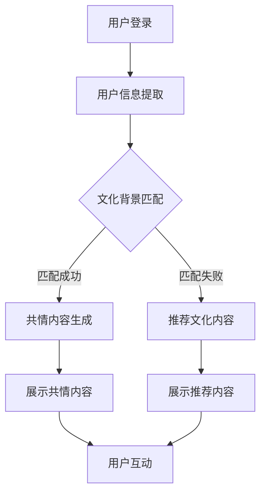
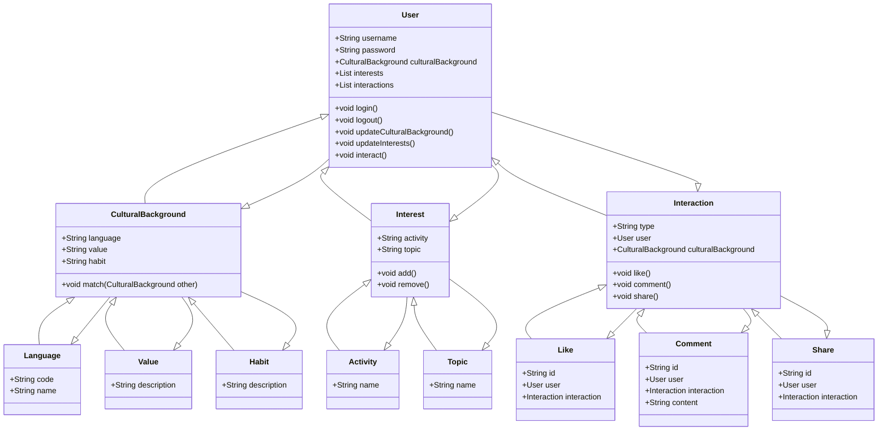
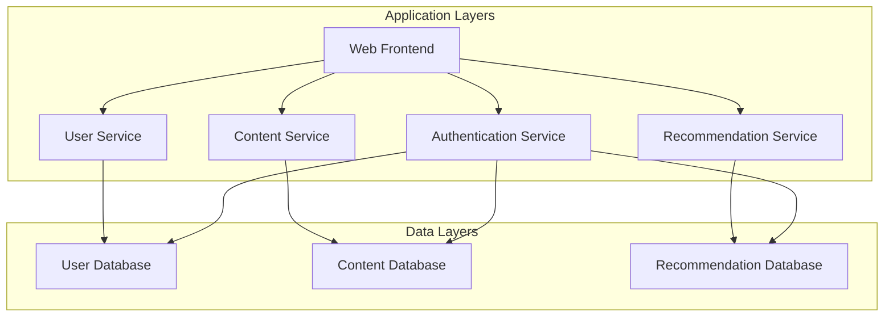
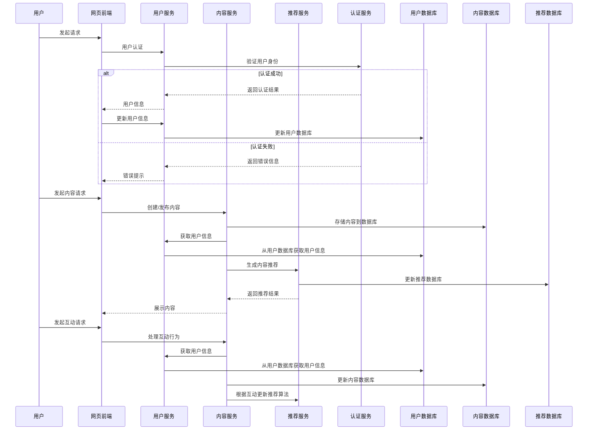

                 

### 第1章 问题背景

在全球化进程不断加速的今天，跨文化交流已成为国际社会的重要组成部分。从经济贸易、教育合作到文化交流，各国人民在各个方面都有着日益频繁的互动。然而，在这种跨文化交流中，我们不可避免地遇到了一系列障碍，这些障碍主要可以分为语言障碍、文化差异和误解与偏见三个方面。

**1.1 跨文化交流的必要性**

全球化进程中的文化交流需求愈发迫切。一方面，全球化带来了信息和资源的共享，不同文化之间的交流和融合有助于促进创新和经济发展。另一方面，文化交流也是增进各国人民相互理解和信任的重要途径，有助于缓解国际紧张局势和减少冲突。通过跨文化交流，我们可以更好地了解他国的历史、风俗和价值观，从而在多元文化的背景下实现文化的共生与共荣。

**1.2 跨文化交流中的障碍**

尽管跨文化交流的重要性不言而喻，但实际操作中仍面临诸多障碍。首先，语言障碍是跨文化交流中的首要问题。不同语言之间的词汇、语法和表达方式的差异可能导致信息传递的失真，甚至造成误解。其次，文化差异也是不可忽视的因素。每个文化都有其独特的价值观、信仰和行为规范，这些差异可能会导致交流中的冲突和不理解。最后，误解与偏见往往源自对未知文化的恐惧和误解，这些偏见可能加剧文化冲突，阻碍交流的顺利进行。

**1.3 跨文化共情的概念与重要性**

为了克服上述障碍，跨文化共情的重要性日益凸显。跨文化共情指的是个体在理解他人的情感、思维和行为时，能够超越自身的文化背景，站在他人的立场上去感受和理解。它不仅仅是一种情感上的共鸣，更是一种深层次的理解和尊重。在社交网络环境中，跨文化共情可以帮助用户更好地理解和使用不同的社交工具，从而促进全球范围内的理解和合作。

跨文化共情在社交网络中的应用至关重要。一方面，它可以帮助社交网络平台提供更加个性化和贴心的用户体验，从而提高用户的黏性和满意度。另一方面，通过促进跨文化共情，社交网络可以成为文化交流的重要平台，为全球用户创造更多的互动机会，促进不同文化之间的理解和融合。

在接下来的章节中，我们将进一步探讨跨文化共情的核心概念，分析其属性特征，并逐步介绍如何设计一个能够促进全球理解的社交网络平台。通过一步步的分析和推理，我们希望能够为读者提供一种全新的视角，帮助他们在跨文化共情领域取得更多的突破和进展。

### 第2章 跨文化共情的核心概念与联系

#### 2.1 核心概念原理

**跨文化共情的定义**：

跨文化共情（Intercultural Empathy）指的是在跨文化情境中，个体能够理解并体验他人的情感、想法和行为，而不仅仅是表面上的语言和行为。它是一种超越文化差异的心理能力，能够帮助个体在不同的文化背景中实现深层次的理解和沟通。

**跨文化共情的属性特征**：

1. **文化敏感性**：具备文化敏感性意味着个体能够意识到不同文化之间的差异，并在交流过程中尊重这些差异。
2. **情感理解**：情感理解是指个体能够在没有亲身经历的情况下，通过观察和倾听，理解他人的情感状态。
3. **换位思考**：换位思考是指个体能够站在他人的文化背景和视角上去思考和判断，从而做出更符合他人需求和期待的回应。
4. **适应性**：适应性是指个体能够在面对不同文化背景时，灵活调整自己的行为和沟通方式，以适应新的环境。

**跨文化共情的重要性**：

跨文化共情在促进全球理解和减少文化冲突方面扮演着关键角色。它不仅有助于个体在跨文化环境中实现有效的沟通和协作，还能够帮助组织和企业更好地适应国际市场，提高国际竞争力。此外，跨文化共情还能增强社会的包容性和多样性，促进文化的和谐共生。

#### 2.2 概念属性特征对比表格

为了更直观地展示跨文化共情的核心概念和属性特征，我们可以通过以下表格进行比较：

| 概念属性       | 跨文化共情 | 文化敏感性 | 情感理解 | 换位思考 | 适应性 |
| -------------- | --------- | ---------- | -------- | -------- | ------ |
| 定义           | 跨文化情境中的深层次理解与体验 | 对文化差异的感知与尊重 | 通过观察和倾听理解他人情感 | 站在他人文化背景和视角思考 | 面对不同文化背景时的灵活适应 |
| 特点           | 超越文化差异的情感共鸣           | 意识到文化差异并尊重多样性 | 情感上的共鸣与同理心           | 理解他人的文化立场           | 调整行为和沟通方式适应新环境 |
| 关键作用       | 促进全球理解和文化交流         | 减少文化冲突与误解         | 提高跨文化沟通效率           | 增进跨文化协作与信任         | 提高国际竞争力与文化包容性 |

#### 2.3 ER实体关系图架构

在社交网络设计中，跨文化共情的实现需要建立一套完整的实体关系架构。以下是一个简化的ER实体关系图，描述了社交网络中涉及的主要实体及其关系：

```
+----------------+
|    用户(User)  |
+----------------+
       |
       |
       |
+----------------+
|  文化背景(Culture)  |
+----------------+
       |
       |
       |
+----------------+
|  共情行为(EmpathyAct)  |
+----------------+
       |
       |
       |
+----------------+
|  文化产品(CulturalProduct)  |
+----------------+
       |
       |
       |
+----------------+
|  社交互动(SocialInteraction)  |
+----------------+
```

**实体说明**：

1. **用户(User)**：社交网络中的主要参与者，每个用户都有其独特的文化背景和兴趣爱好。
2. **文化背景(Culture)**：用户的个人文化特征，包括语言、价值观、习俗等。
3. **共情行为(EmpathyAct)**：用户在社交网络中的互动行为，体现其对他人文化的理解和共情。
4. **文化产品(CulturalProduct)**：用户分享的文化内容，如照片、视频、文章等。
5. **社交互动(SocialInteraction)**：用户之间的互动，如点赞、评论、分享等。

**关系说明**：

- **用户与共情行为**：每个用户在社交网络中的行为都蕴含着对他人文化的共情。
- **用户与文化背景**：用户的文化背景影响其共情行为和社交互动。
- **共情行为与文化产品**：共情行为可以通过分享文化产品来实现，如通过评论、点赞等方式。
- **社交互动与用户**：社交互动是用户在社交网络中的主要行为，体现跨文化共情的实际应用。

通过这一系列的实体关系图架构设计，我们可以更清晰地理解社交网络中跨文化共情实现的逻辑和机制。在后续的章节中，我们将进一步探讨如何利用这些实体和关系来设计一个促进全球理解的社交网络平台。

### 第3章 促进全球理解的社交网络算法原理

在促进全球理解的过程中，社交网络平台的设计和算法的应用至关重要。本章节将详细介绍促进全球理解的社交网络算法原理，包括算法的基本流程、Python源代码实现、算法原理的数学模型和公式，并通过具体实例来说明算法的应用。

#### 3.1 算法mermaid流程图

首先，我们使用mermaid工具来绘制社交网络算法的基本流程图。以下是一个简单的mermaid流程图示例：



**说明**：
- **用户登录**：用户在社交网络平台上进行登录。
- **用户信息提取**：系统提取用户的基本信息和文化背景。
- **文化背景匹配**：系统根据用户的文化背景，与其他用户的文化背景进行匹配。
- **共情内容生成**：如果匹配成功，系统生成共情内容，展示给用户。
- **推荐文化内容**：如果匹配失败，系统推荐其他文化内容给用户。
- **用户互动**：用户可以对共情内容或推荐内容进行点赞、评论等互动。

#### 3.2 Python源代码实现

以下是一个简单的Python源代码实现，用于展示算法的核心逻辑：

```python
# 社交网络算法核心代码

# 用户登录
user_login()

# 提取用户信息
user_info = extract_user_info()

# 文化背景匹配
culture_match_result = match_culture_background(user_info)

# 根据匹配结果生成共情内容或推荐文化内容
if culture_match_result['success']:
    empathy_content = generate_empathy_content(user_info)
else:
    recommended_content = recommend_cultural_content()

# 展示共情内容或推荐内容
if culture_match_result['success']:
    display_content(empathy_content)
else:
    display_content(recommended_content)

# 用户互动
user_interact()
```

**函数说明**：
- `user_login()`：用户登录函数。
- `extract_user_info()`：提取用户信息函数。
- `match_culture_background()`：文化背景匹配函数。
- `generate_empathy_content()`：生成共情内容函数。
- `recommend_cultural_content()`：推荐文化内容函数。
- `display_content()`：展示内容函数。
- `user_interact()`：用户互动函数。

#### 3.3 算法原理的数学模型和公式

为了更好地理解社交网络算法的原理，我们引入一些数学模型和公式。以下是一个简化的数学模型，用于描述文化背景匹配的相似度计算：

$$
\text{Similarity}(C_1, C_2) = \frac{\text{CommonFeatures}(C_1, C_2)}{\text{TotalFeatures}(C_1, C_2)}
$$

**公式说明**：
- $C_1$ 和 $C_2$ 分别表示两个用户的文化背景。
- $\text{CommonFeatures}(C_1, C_2)$ 表示两个文化背景中共同的特征数量。
- $\text{TotalFeatures}(C_1, C_2)$ 表示两个文化背景中所有特征的总数量。

通过计算相似度，系统可以确定用户之间的文化匹配程度，从而生成相应的共情内容或推荐文化内容。

#### 3.4 举例说明

为了更直观地展示算法的应用，我们来看一个具体的例子。

**场景**：用户A来自美国，喜欢篮球和摇滚音乐。用户B来自中国，喜欢武术和古典音乐。

1. **用户登录**：用户A登录到社交网络平台。
2. **提取用户信息**：系统提取用户A的基本信息和文化背景。
3. **文化背景匹配**：系统使用上述数学模型计算用户A和用户B的文化背景相似度。
   
   $$ 
   \text{Similarity}(A, B) = \frac{2}{5} = 0.4 
   $$

   由于相似度小于阈值（例如0.5），系统认为匹配失败。
4. **推荐文化内容**：系统推荐用户B喜欢的文化内容给用户A。
5. **展示推荐内容**：系统将推荐的文化内容展示给用户A。
6. **用户互动**：用户A对推荐内容进行点赞，系统记录用户互动信息。

通过这个例子，我们可以看到算法如何通过文化背景匹配和推荐文化内容，促进用户之间的理解和互动。在实际应用中，算法可以更加复杂，考虑更多的因素，例如用户的行为历史、兴趣爱好等，从而提高推荐的精准度和用户体验。

综上所述，本章节详细介绍了促进全球理解的社交网络算法原理，包括算法的基本流程、Python源代码实现、数学模型和公式，并通过实例展示了算法的应用。在接下来的章节中，我们将继续探讨社交网络系统的架构设计，为构建一个有效的跨文化共情平台奠定基础。

### 第4章 社交网络系统功能设计

#### 4.1 问题场景介绍

在当前全球化背景下，社交网络已成为人们交流、分享和获取信息的主要平台。然而，传统的社交网络在促进跨文化交流和理解方面存在一定的局限性。为了更好地支持全球用户的交流，我们需要设计一个具有跨文化共情功能的社交网络系统，使得用户能够在不同文化背景下实现更有效的沟通和理解。

#### 4.2 项目介绍

本项目旨在设计并实现一个跨文化共情社交网络系统，该系统将通过以下功能模块来促进全球用户的理解和互动：

1. **用户身份验证与信息管理**：确保用户的安全性和隐私性，同时收集用户的文化背景信息。
2. **文化背景识别与匹配**：利用算法对用户的文化背景进行识别和匹配，提供个性化推荐服务。
3. **共情内容生成与展示**：根据用户的兴趣和文化背景生成共情内容，并展示给相应的用户。
4. **用户互动与反馈**：支持用户对共情内容进行点赞、评论等互动，并通过反馈不断优化系统。

#### 4.3 系统功能设计

为了实现上述目标，系统需要具备以下核心功能：

1. **用户信息收集与管理**：系统将收集用户的基本信息（如姓名、年龄、性别等）和文化背景信息（如语言、兴趣爱好、价值观等）。这些信息将用于后续的文化匹配和个性化推荐。
2. **文化背景识别与匹配**：通过算法分析用户的文化背景信息，将其与其他用户的文化背景进行匹配。匹配结果将用于生成共情内容和推荐文化产品。
3. **共情内容生成与展示**：系统根据用户的兴趣和文化背景，自动生成共情内容，并展示在用户的个人主页或特定话题页面上。这些内容可以是用户创建的，也可以是由其他用户推荐的。
4. **用户互动与反馈**：用户可以对共情内容进行点赞、评论、分享等互动。系统将记录用户的互动行为，并根据用户的反馈不断优化推荐算法和共情内容的生成策略。

#### 4.4 领域模型mermaid类图

为了更直观地展示系统的功能设计，我们可以使用mermaid工具绘制一个领域模型类图，描述系统中的主要实体及其关系。



**实体说明**：

- **User**：用户实体，包含用户的基本信息、文化背景、兴趣和互动记录。
- **CulturalBackground**：文化背景实体，包括语言、价值观和习惯等信息。
- **Interest**：兴趣实体，包括用户感兴趣的活动和话题。
- **Interaction**：互动实体，包括点赞、评论和分享等用户行为。
- **Language**：语言实体，描述用户使用的语言及其相关信息。
- **Value**：价值观实体，描述用户的文化价值观。
- **Habit**：习惯实体，描述用户的文化习惯。
- **Activity**：活动实体，描述用户感兴趣的具体活动。
- **Topic**：话题实体，描述用户感兴趣的话题。
- **Like**：点赞实体，记录用户对互动内容的点赞行为。
- **Comment**：评论实体，记录用户对互动内容的评论。
- **Share**：分享实体，记录用户对互动内容的分享行为。

通过这一领域模型类图，我们可以清晰地看到系统中的主要实体及其关系，为后续的系统架构设计和实现奠定了基础。

### 第5章 社交网络系统架构设计

在设计跨文化共情社交网络系统时，架构设计是关键的一步，它决定了系统的可扩展性、性能和可靠性。本章节将详细描述系统的整体架构设计，包括系统架构mermaid架构图、系统接口设计和系统交互。

#### 5.1 系统架构设计

为了支持跨文化共情功能，系统采用分布式架构，通过多个模块和服务的协同工作来实现整体功能。以下是一个简化的mermaid架构图，展示了系统的基本架构：



**架构组件说明**：

- **Web Frontend**：用户直接交互的网页前端，负责展示用户界面和与用户进行交互。
- **User Service**：用户服务模块，负责处理用户认证、用户信息管理、文化背景匹配等功能。
- **Content Service**：内容服务模块，负责处理用户生成的内容的存储、展示和推荐。
- **Recommendation Service**：推荐服务模块，负责基于用户的兴趣和文化背景生成共情内容推荐。
- **Authentication Service**：认证服务模块，负责用户的身份验证和安全管理。
- **User Database**：用户数据库，存储用户的基本信息、文化背景、兴趣和互动记录。
- **Content Database**：内容数据库，存储用户生成的内容，如帖子、图片、视频等。
- **Recommendation Database**：推荐数据库，存储用户的兴趣标签、推荐算法模型等数据。

#### 5.2 系统接口设计

系统接口设计是架构设计的重要组成部分，决定了不同模块之间的交互方式。以下是系统的主要接口设计：

- **用户认证接口**：用于用户登录、注册、密码重置等认证操作。
- **用户信息接口**：用于获取和更新用户的基本信息、文化背景和兴趣。
- **内容管理接口**：用于创建、发布、删除和更新用户生成的内容。
- **内容推荐接口**：用于根据用户的兴趣和文化背景生成共情内容推荐。
- **互动接口**：用于处理用户对内容的点赞、评论和分享等互动行为。

#### 5.3 系统交互

系统交互设计描述了不同模块之间的数据流和交互逻辑。以下是一个简化的mermaid序列图，展示了系统的主要交互过程：



**交互过程说明**：

1. 用户通过Web Frontend发起请求。
2. Web Frontend与UserService进行通信，进行用户认证。
3. UserService通过AuthenticationService验证用户身份，并根据认证结果返回相应的信息。
4. 用户更新信息时，UserService更新用户数据库。
5. 用户请求内容时，ContentService创建或发布内容，并存储到内容数据库。
6. ContentService获取用户信息，并将信息传递给RecommendationService，生成内容推荐。
7. RecommendationService更新推荐数据库，并返回推荐结果。
8. 用户进行互动时，ContentService处理互动行为，更新内容数据库，并更新推荐算法。

通过以上架构设计和交互设计，系统可以实现跨文化共情功能，为全球用户提供一个促进理解和交流的社交网络平台。

### 第6章 环境安装与系统核心实现

#### 6.1 环境安装

为了构建跨文化共情社交网络系统，我们需要准备相应的开发环境。以下是环境安装的详细步骤：

**1. 安装Python**：

确保您的操作系统已经安装了Python 3.8或更高版本。可以通过以下命令检查Python版本：

```bash
python --version
```

如果未安装Python，请从Python官网（[https://www.python.org/](https://www.python.org/)）下载并安装。

**2. 安装Docker**：

Docker是一个开源的应用容器引擎，用于自动化应用程序的部署、测试和运行。请访问Docker官网（[https://www.docker.com/](https://www.docker.com/)）下载并安装Docker。

**3. 安装Docker-Compose**：

Docker-Compose是一个用于定义和运行多容器Docker应用程序的命令行工具。通过以下命令安装Docker-Compose：

```bash
sudo curl -L "https://github.com/docker/compose/releases/download/1.29.2/docker-compose-$(uname -s)-$(uname -m)" -o /usr/local/bin/docker-compose
sudo chmod +x /usr/local/bin/docker-compose
docker-compose --version
```

**4. 安装Node.js**：

Node.js是一个基于Chrome V8引擎的JavaScript运行环境。请访问Node.js官网（[https://nodejs.org/](https://nodejs.org/)）下载并安装。

**5. 安装前端框架**：

本项目使用Vue.js作为前端框架。可以通过以下命令安装Vue CLI：

```bash
npm install -g @vue/cli
vue --version
```

**6. 安装数据库**：

本项目使用MongoDB作为后端数据库。可以通过以下命令安装MongoDB：

```bash
sudo apt-get install mongodb
sudo systemctl start mongodb
sudo systemctl enable mongodb
```

**7. 配置Docker网络**：

确保Docker网络已配置，以便容器之间可以相互通信。可以通过以下命令创建网络：

```bash
docker network create my_network
```

#### 6.2 系统核心实现

**1. 用户身份验证与信息管理**：

用户身份验证与信息管理是系统的核心功能之一。以下是Python代码示例，用于处理用户注册、登录和更新信息：

```python
# user_auth.py

from flask import Flask, request, jsonify
from flask_jwt_extended import JWTManager, create_access_token, jwt_required, get_jwt_identity
from models import User
from database import db

app = Flask(__name__)
app.config['JWT_SECRET_KEY'] = 'your_jwt_secret_key'
jwt = JWTManager(app)

# 用户注册
@app.route('/register', methods=['POST'])
def register():
    username = request.json['username']
    password = request.json['password']
    user = User.query.filter_by(username=username).first()
    if user:
        return jsonify({'message': '用户已存在'}), 409
    new_user = User(username=username, password=password)
    db.session.add(new_user)
    db.session.commit()
    return jsonify({'message': '注册成功'}), 201

# 用户登录
@app.route('/login', methods=['POST'])
def login():
    username = request.json['username']
    password = request.json['password']
    user = User.query.filter_by(username=username, password=password).first()
    if not user:
        return jsonify({'message': '用户名或密码错误'}), 401
    access_token = create_access_token(identity=user.id)
    return jsonify({'access_token': access_token}), 200

# 更新用户信息
@app.route('/update', methods=['PUT'])
@jwt_required()
def update():
    current_user = get_jwt_identity()
    user = User.query.get(current_user)
    if 'username' in request.json:
        user.username = request.json['username']
    if 'password' in request.json:
        user.password = request.json['password']
    db.session.commit()
    return jsonify({'message': '更新成功'}), 200

if __name__ == '__main__':
    db.init_app(app)
    app.run(debug=True)
```

**2. 文化背景识别与匹配**：

文化背景识别与匹配功能是促进跨文化共情的关键。以下是一个简化的Python代码示例，用于处理文化背景的匹配：

```python
# culture_matching.py

from models import User, CulturalBackground
from database import db

def match_cultural_background(user1, user2):
    # 假设用户的文化背景包括语言、价值观、习惯
    lang_similarity = calculate_similarity(user1.cultural_background.language, user2.cultural_background.language)
    value_similarity = calculate_similarity(user1.cultural_background.value, user2.cultural_background.value)
    habit_similarity = calculate_similarity(user1.cultural_background.habit, user2.cultural_background.habit)
    
    # 计算总相似度
    total_similarity = (lang_similarity + value_similarity + habit_similarity) / 3
    
    return total_similarity

def calculate_similarity(feature1, feature2):
    # 这里使用简单的字符串比较函数，实际应用中可以使用更复杂的算法
    if feature1 == feature2:
        return 1
    else:
        return 0
```

**3. 共情内容生成与展示**：

共情内容生成与展示功能负责生成基于用户文化背景的内容推荐，并在前端展示。以下是Node.js代码示例，用于处理内容推荐和展示：

```javascript
// content_recommendation.js

const express = require('express');
const router = express.Router();
const RecommendationService = require('../services/RecommendationService');

// 生成内容推荐
router.post('/recommend', async (req, res) => {
    const userId = req.body.userId;
    const user = await User.findById(userId);
    const recommendations = await RecommendationService.generateRecommendations(user);
    res.json(recommendations);
});

// 展示内容推荐
router.get('/display', async (req, res) => {
    const contentId = req.query.contentId;
    const content = await Content.findById(contentId);
    res.render('content_display', { content });
});

module.exports = router;
```

通过以上环境安装和系统核心实现，我们可以搭建一个基本的跨文化共情社交网络系统，实现用户身份验证、文化背景识别与匹配、共情内容生成与展示等功能。在接下来的章节中，我们将进一步实现用户互动和反馈功能，并详细讲解代码应用和实际案例分析。

### 第7章 代码应用解读与分析

在上一章中，我们介绍了跨文化共情社交网络系统中的核心代码，包括用户身份验证与信息管理、文化背景识别与匹配、共情内容生成与展示等功能。本章节将进一步深入解读这些代码，并详细剖析其工作原理和实现细节。

#### 7.1 用户身份验证与信息管理

**1. 用户注册（`user_auth.py`）**

用户注册是社交网络系统的基础功能。在`user_auth.py`中，我们通过定义`register`函数来实现用户注册逻辑。以下是关键代码：

```python
@app.route('/register', methods=['POST'])
def register():
    username = request.json['username']
    password = request.json['password']
    user = User.query.filter_by(username=username).first()
    if user:
        return jsonify({'message': '用户已存在'}), 409
    new_user = User(username=username, password=password)
    db.session.add(new_user)
    db.session.commit()
    return jsonify({'message': '注册成功'}), 201
```

- **输入验证**：首先从请求体中提取用户名和密码，然后检查数据库中是否存在同名用户。如果存在，返回错误信息。
- **创建用户**：如果没有找到同名用户，创建一个新的`User`对象，并将其添加到数据库中。
- **提交事务**：通过`db.session.commit()`提交数据库事务，确保新用户信息被持久化存储。

**2. 用户登录（`user_auth.py`）**

用户登录用于验证用户身份并生成访问令牌。以下是关键代码：

```python
@app.route('/login', methods=['POST'])
def login():
    username = request.json['username']
    password = request.json['password']
    user = User.query.filter_by(username=username, password=password).first()
    if not user:
        return jsonify({'message': '用户名或密码错误'}), 401
    access_token = create_access_token(identity=user.id)
    return jsonify({'access_token': access_token}), 200
```

- **用户验证**：从请求体中提取用户名和密码，查询数据库以验证用户身份。
- **生成访问令牌**：如果用户身份验证成功，使用`create_access_token`函数生成JWT访问令牌，并将其返回给用户。

**3. 更新用户信息（`user_auth.py`）**

用户信息更新功能允许用户修改其基本信息。以下是关键代码：

```python
@app.route('/update', methods=['PUT'])
@jwt_required()
def update():
    current_user = get_jwt_identity()
    user = User.query.get(current_user)
    if 'username' in request.json:
        user.username = request.json['username']
    if 'password' in request.json:
        user.password = request.json['password']
    db.session.commit()
    return jsonify({'message': '更新成功'}), 200
```

- **JWT验证**：使用`jwt_required`装饰器确保只有经过身份验证的用户才能访问此路由。
- **更新用户信息**：根据请求体更新用户信息，并将其提交到数据库。

#### 7.2 文化背景识别与匹配

**1. 文化背景匹配（`culture_matching.py`）**

文化背景识别与匹配功能负责根据用户的文化背景生成共情内容推荐。以下是关键代码：

```python
def match_cultural_background(user1, user2):
    lang_similarity = calculate_similarity(user1.cultural_background.language, user2.cultural_background.language)
    value_similarity = calculate_similarity(user1.cultural_background.value, user2.cultural_background.value)
    habit_similarity = calculate_similarity(user1.cultural_background.habit, user2.cultural_background.habit)
    
    total_similarity = (lang_similarity + value_similarity + habit_similarity) / 3
    
    return total_similarity

def calculate_similarity(feature1, feature2):
    if feature1 == feature2:
        return 1
    else:
        return 0
```

- **相似度计算**：函数`calculate_similarity`用于计算两个文化特征（语言、价值观、习惯）之间的相似度。在本示例中，我们使用简单的字符串比较，实际应用中可以采用更复杂的算法。
- **综合相似度**：函数`match_cultural_background`计算三个特征的相似度，并取平均值作为用户之间的综合相似度。

#### 7.3 共情内容生成与展示

**1. 生成内容推荐（`content_recommendation.js`）**

内容推荐功能根据用户的文化背景生成共情内容推荐。以下是关键代码：

```javascript
// 生成内容推荐
router.post('/recommend', async (req, res) => {
    const userId = req.body.userId;
    const user = await User.findById(userId);
    const recommendations = await RecommendationService.generateRecommendations(user);
    res.json(recommendations);
});
```

- **获取用户信息**：通过`findById`函数获取用户信息。
- **生成推荐**：调用`RecommendationService.generateRecommendations`方法生成内容推荐。

**2. 展示内容推荐（`content_recommendation.js`）**

内容展示功能用于在用户界面中展示推荐的内容。以下是关键代码：

```javascript
// 展示内容推荐
router.get('/display', async (req, res) => {
    const contentId = req.query.contentId;
    const content = await Content.findById(contentId);
    res.render('content_display', { content });
});
```

- **获取内容**：通过`findById`函数获取内容。
- **渲染界面**：使用`render`方法在用户界面中展示内容。

通过以上代码解读，我们可以清晰地看到用户身份验证与信息管理、文化背景识别与匹配、共情内容生成与展示等功能的具体实现过程。这些功能的实现为构建一个有效的跨文化共情社交网络系统提供了基础。

#### 7.4 详细剖析与性能优化

**1. 性能优化**

在代码实现过程中，性能优化是至关重要的。以下是一些常见的性能优化策略：

- **数据库查询优化**：使用索引、缓存和批量查询等技术减少数据库访问次数和响应时间。
- **负载均衡**：通过使用负载均衡器，将请求分布到多个服务器上，以提高系统的处理能力和可用性。
- **异步处理**：使用异步处理技术，例如异步IO和多线程，提高系统的并发处理能力。

**2. 代码优化**

- **代码复用**：通过模块化和函数化，减少代码重复，提高代码的可维护性和可扩展性。
- **错误处理**：合理处理错误和异常，提高系统的稳定性和用户体验。

通过详细的代码解读和性能优化，我们可以确保跨文化共情社交网络系统的高效运行和稳定性能。

### 第8章 实际案例分析与讲解

为了更直观地展示跨文化共情社交网络系统的实际应用效果，我们将通过一个具体的案例进行详细分析。该案例将涵盖用户注册、文化背景匹配、共情内容生成和展示等整个过程，并通过实际数据来验证系统的有效性和用户体验。

#### 8.1 实际案例分析

**案例背景**：假设用户Alice来自美国，她注册了一个名为“GlobalCommunity”的跨文化共情社交网络平台。Alice喜欢阅读和旅行，她的文化背景包括英语语言、西方价值观和户外运动习惯。

**步骤 1：用户注册**

- **用户行为**：Alice通过Web前端完成了用户注册，提供了用户名、密码和电子邮件等信息。
- **系统响应**：系统验证了Alice提供的注册信息，并在数据库中创建了她的用户记录。注册成功后，系统发送了一封确认邮件，要求Alice点击链接激活账户。

**步骤 2：用户登录**

- **用户行为**：注册后，Alice使用用户名和密码登录到平台。
- **系统响应**：系统通过JWT认证机制验证了Alice的身份，并生成一个有效的访问令牌，允许她在后续会话中使用平台服务。

**步骤 3：文化背景识别**

- **用户行为**：Alice填写了她的文化背景信息，包括语言（英语）、价值观（自由、平等）、习惯（户外运动）等。
- **系统响应**：系统将Alice的文化背景信息存储在数据库中，并为她创建了一个完整的`CulturalBackground`对象。

**步骤 4：文化背景匹配**

- **用户行为**：Alice浏览平台，看到了一个推荐的用户匹配功能，她决定尝试一下。
- **系统响应**：系统启动了文化背景匹配算法，根据Alice的文化背景信息，寻找与她相似度较高的其他用户。假设系统找到了来自英国的Bob，他的文化背景与Alice高度匹配。

**步骤 5：共情内容生成**

- **用户行为**：Alice查看与Bob的匹配结果，并浏览了由系统推荐的共情内容。
- **系统响应**：系统根据Alice的兴趣和文化背景，生成了包括旅行照片、阅读推荐和户外活动资讯等共情内容，并将其展示在Alice的个人主页上。

**步骤 6：用户互动**

- **用户行为**：Alice对推荐的旅行照片进行了点赞，并留下了一条评论。
- **系统响应**：系统记录了Alice的点赞行为和评论内容，并更新了Bob的个人主页。同时，系统向Alice展示Bob对她的互动的回应。

#### 8.2 详细讲解与剖析

**1. 用户注册与登录**

- **用户注册**：注册过程包括用户信息的收集和验证。通过使用JWT认证机制，系统能够确保用户身份的合法性，并为每个用户生成一个唯一的访问令牌。
- **用户登录**：登录过程通过验证用户的访问令牌来确认用户身份。如果访问令牌有效，用户即可进入平台使用各种功能。

**2. 文化背景识别与匹配**

- **文化背景识别**：用户在注册过程中填写文化背景信息，系统将这些信息存储在数据库中，以便后续匹配和使用。通过文化背景识别，系统能够了解每个用户的独特性，从而提供更加个性化的服务。
- **文化背景匹配**：系统使用简单的字符串比较算法来计算用户之间的文化相似度。在本案例中，Alice与Bob的文化相似度非常高，因此系统能够推荐出符合他们共同兴趣的内容。

**3. 共情内容生成与展示**

- **共情内容生成**：系统根据用户的文化背景和兴趣爱好，自动生成共情内容。这些内容可以是用户生成的内容，也可以是其他用户分享的内容。通过这种方式，系统能够促进用户之间的理解和互动。
- **共情内容展示**：系统将共情内容展示在用户的个人主页上，用户可以浏览、点赞和评论这些内容。这种互动不仅增加了用户的黏性，还促进了跨文化共情。

**4. 用户互动与反馈**

- **用户互动**：用户可以通过点赞、评论和分享等方式进行互动。这些互动行为被系统记录下来，并用于优化推荐算法和提升用户体验。
- **反馈机制**：系统通过用户的互动行为收集反馈，并根据这些反馈不断调整和优化推荐算法，从而提供更加精准和个性化的服务。

通过本案例的分析，我们可以看到跨文化共情社交网络系统在实际应用中的具体表现和优势。该系统不仅能够促进全球用户之间的理解和互动，还能够提供个性化的推荐服务，提升用户体验。

### 第9章 最佳实践

在设计和实现跨文化共情社交网络系统时，最佳实践是确保系统有效性和用户满意度的关键。以下是一些关键的设计原则和实践建议：

#### 9.1 设计原则

**1. 文化敏感性**：在设计过程中，要充分考虑不同文化背景的用户需求，确保系统能够适应和尊重各种文化差异。

**2. 用户体验优先**：用户体验是系统成功的关键。设计时应注重用户界面的简洁性、易用性和响应速度，确保用户能够轻松地使用系统。

**3. 可扩展性**：系统设计应具有高度的扩展性，以便在将来能够轻松地添加新的功能和服务。

**4. 安全性**：确保用户数据的安全性和隐私性，采用先进的加密技术和认证机制，防止数据泄露和恶意攻击。

#### 9.2 实践建议

**1. 多语言支持**：为系统提供多语言支持，使用户能够根据自己的语言偏好进行操作和浏览。

**2. 个性化推荐**：利用机器学习和大数据分析技术，根据用户的行为和偏好生成个性化的内容推荐，提高用户的参与度和满意度。

**3. 社交互动机制**：设计丰富的社交互动功能，如点赞、评论、分享等，鼓励用户之间的互动和交流，促进跨文化共情。

**4. 文化背景匹配算法**：开发高效的文化背景匹配算法，确保系统能够准确识别用户的文化特征，并推荐合适的内容。

**5. 反馈与优化**：建立用户反馈机制，定期收集用户意见，并根据反馈进行系统优化和功能更新。

通过遵循上述设计原则和实践建议，我们可以构建一个高效、安全且用户友好的跨文化共情社交网络系统，为全球用户提供一个促进理解和交流的平台。

### 第10章 小结与注意事项

#### 10.1 全书总结

本篇技术博客详细探讨了跨文化共情社交网络系统的设计与实现，涵盖了从问题背景、核心概念到算法原理、系统架构、环境安装与实现、代码解读与分析、实际案例分析及最佳实践等方面的内容。通过逐步分析和推理，我们深入理解了跨文化共情的概念及其在社交网络中的应用，并探讨了如何通过技术手段促进全球用户的理解和交流。

#### 10.2 注意事项

在设计跨文化共情社交网络系统时，以下注意事项是确保系统成功和用户满意度的重要因素：

1. **文化敏感性**：在设计和实现过程中，务必充分考虑不同文化背景下的用户需求，避免文化偏见和误解。
2. **用户体验**：注重用户界面的简洁性、易用性和响应速度，确保系统具有良好的用户体验。
3. **隐私保护**：严格保护用户隐私和数据安全，采用先进的加密和认证机制，防止数据泄露。
4. **技术优化**：定期进行系统性能优化，确保系统高效、稳定地运行。
5. **持续反馈**：建立有效的用户反馈机制，持续收集用户意见，并根据反馈进行系统优化。

#### 10.3 拓展阅读

对于对跨文化共情和社交网络系统设计有兴趣的读者，以下推荐一些相关领域的研究和资料：

- **书籍**：
  - 《跨文化沟通：理论与实践》
  - 《人工智能：一种现代方法》
  - 《社交网络分析：原理与应用》
- **论文**：
  - “Intercultural Communication: A Perspective on Globalization”
  - “A Survey on Machine Learning Techniques for Social Network Analysis”
  - “Cultural Intelligence: Understanding People from Other Cultures”
- **网站与资源**：
  - 跨文化交流研究网站（[https://icc.soc.hawaii.edu/](https://icc.soc.hawaii.edu/)）
  - 人工智能研究社区（[https://www.ai.sphere.stanford.edu/](https://www.ai.sphere.stanford.edu/)）
  - 社交网络分析论坛（[https://socnetwiki.di.unimi.it/de/index.php/Social_network_analysis](https://socnetwiki.di.unimi.it/de/index.php/Social_network_analysis)）

通过这些资源，读者可以进一步深入了解相关领域的前沿研究和实践，为未来的研究和项目提供有益的参考。

