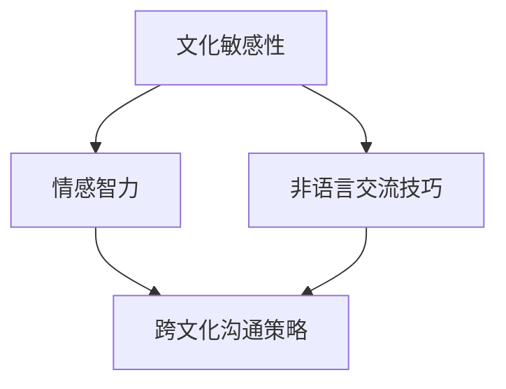
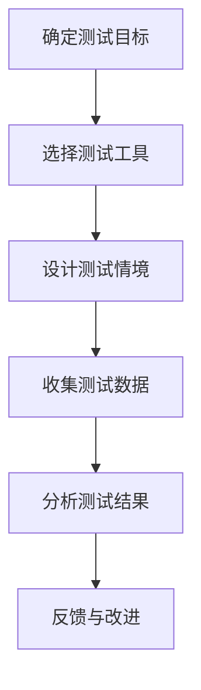

                 


# 跨文化共情能力测试：全球化时代的社交技能评估

## 关键词：跨文化共情能力、全球化、社交技能、评估、测试工具、数据分析

## 摘要：
在全球化日益深入的今天，跨文化共情能力成为了一个关键的社会技能。本文旨在探讨跨文化共情能力的定义、测试方法以及其实施和应用。通过一步步的分析，我们将深入理解这一能力的重要性，并探讨其在实际应用中的挑战与解决方案。

## 目录大纲设计步骤

### 1. 确定章节结构
- 引言与背景
- 跨文化共情能力的定义与核心概念
- 跨文化共情能力测试的理论基础与方法
- 跨文化共情能力测试的工具与量表
- 跨文化共情能力测试的实施过程与评估
- 结果分析与解读
- 应用与最佳实践
- 拓展与未来展望

### 2. 细化章节内容
对每个章节进行详细的规划，确保每个部分都有具体的内容和目标。

### 3. 设计核心概念
- **跨文化共情能力的定义与核心概念**
  - **概念属性特征对比表格**
  - **ER实体关系图架构的Mermaid流程图**

### 4. 算法原理讲解
- 使用mermaid画出跨文化共情能力测试的算法流程图，并使用Python源代码详细阐述。

### 5. 数学模型与公式讲解
- 使用latex格式给出数学模型和公式的详细讲解。

### 6. 系统分析与架构设计方案
- 介绍问题场景、系统功能设计、系统架构设计、系统接口设计、系统交互等内容。

### 7. 项目实战
- 描述环境安装、系统核心实现源代码，并对代码应用进行解读与分析。

### 8. 最佳实践 tips、小结、注意事项、拓展阅读
- 总结章节内容，提供实践建议，指出注意事项，推荐拓展阅读。

### 9. 撰写目录大纲
- 使用markdown格式撰写目录大纲，确保简洁明了。

## 目录大纲示例

```markdown
----------------------------------------------------------------
# 第一部分：引言与背景

## 1. 引言
### 1.1 跨文化共情能力的重要性
### 1.2 全球化时代的社交技能需求
### 1.3 本书的目的与结构

## 2. 跨文化共情能力的定义与核心概念
### 2.1 跨文化共情能力的定义
### 2.2 核心概念与联系
    - **概念属性特征对比表格**
    - **ER实体关系图架构的Mermaid流程图**

## 3. 跨文化共情能力测试的理论基础与方法
### 3.1 测试的理论基础
### 3.2 测试方法与流程
    - **Mermaid流程图**

----------------------------------------------------------------
```

在完成目录大纲的设计后，我们可以按照这个结构逐步撰写每一章节的内容，确保文章的逻辑清晰、结构紧凑、简单易懂。

----------------------------------------------------------------

## 第一部分：引言与背景

### 1.1 跨文化共情能力的重要性

在全球化进程中，人们的生活和交流越来越跨越国界和文化，跨文化共情能力的重要性日益凸显。这种能力不仅关乎个人职业发展，更是国家间合作与和谐的重要基石。跨文化共情能力指的是个体在理解不同文化背景的人的情感、态度和行为时所表现出的敏感度和适应性。它包括了语言、非语言交流技巧、文化敏感性、情感共鸣等多个方面。

随着全球化的发展，企业越来越需要跨文化共情能力强的员工来应对多元化的工作环境。跨国公司需要员工具备跨文化沟通能力，以便更好地协调不同国家和地区的团队，提升工作效率和团队凝聚力。同时，对于国际关系来说，跨文化共情能力也是建立互信、促进合作的重要手段。

### 1.2 全球化时代的社交技能需求

全球化时代对人们的社交技能提出了更高的要求。传统的沟通模式已经无法满足日益复杂的跨文化互动需求。现代社交技能不仅包括传统的语言交流能力，还需要具备以下几方面的技能：

- **跨文化沟通技巧**：包括对文化差异的敏感性、对不同文化价值观的尊重和理解。
- **情感智力**：能够识别和解读他人的情感，建立情感共鸣。
- **冲突解决能力**：能够在不同文化背景下有效地解决冲突，维护和谐关系。
- **团队合作能力**：能够与不同文化背景的人协同工作，共同达成目标。

### 1.3 本书的目的与结构

本书旨在深入探讨跨文化共情能力的重要性，并通过理论与实践相结合的方式，提供一套系统的跨文化共情能力测试方法。本书的结构分为以下几个部分：

1. **引言与背景**：介绍跨文化共情能力的定义、重要性以及全球化时代的社交技能需求。
2. **跨文化共情能力的定义与核心概念**：详细阐述跨文化共情能力的概念，核心概念及其联系。
3. **跨文化共情能力测试的理论基础与方法**：介绍跨文化共情能力测试的理论基础，包括测试工具和量表的选择。
4. **跨文化共情能力测试的工具与量表**：具体介绍常用的跨文化共情能力测试工具和量表。
5. **跨文化共情能力测试的实施过程与评估**：详细描述跨文化共情能力测试的实施流程和评估方法。
6. **结果分析与解读**：介绍如何对测试结果进行分析和解读，以及如何应用这些结果。
7. **应用与最佳实践**：提供跨文化共情能力在实际应用中的最佳实践案例。
8. **拓展与未来展望**：探讨跨文化共情能力测试的未来发展趋势和研究方向。

通过本书的阅读，读者将能够深入理解跨文化共情能力的重要性，掌握跨文化共情能力测试的方法，并在实际应用中提升自己的跨文化沟通能力和社交技能。

### 1.4 跨文化共情能力的定义与核心概念

跨文化共情能力是指个体在理解不同文化背景的人的情感、态度和行为时所表现出的敏感度和适应性。这一能力不仅仅涉及到语言上的交流，更重要的是在非语言层面上的理解和互动。以下是跨文化共情能力的一些核心概念：

- **文化敏感性**：指的是个体对于不同文化背景的人的行为、态度和价值观的敏感程度。一个具有高文化敏感性的个体能够快速识别和理解不同文化之间的差异，并在交流中表现出尊重和包容。
  
- **情感智力**：指的是个体识别、理解和管理自己和他人的情绪的能力。情感智力高的人能够更好地理解他人的情感状态，并在交流中表现出同情心和同理心。
  
- **非语言交流技巧**：包括肢体语言、面部表情、语调等非语言因素。不同文化背景的人可能会使用不同的非语言交流方式，因此，具备跨文化共情能力的人需要能够识别和理解这些差异。
  
- **跨文化沟通策略**：指的是在跨文化交流中采取的沟通策略，如清晰表达、避免假设、倾听和反馈等。这些策略有助于减少误解和冲突，提高沟通效果。

为了更直观地理解这些概念之间的关系，我们可以使用Mermaid流程图来展示它们的相互联系：



通过这个流程图，我们可以看到，文化敏感性、情感智力、非语言交流技巧和跨文化沟通策略是相辅相成的，共同构成了跨文化共情能力的基础。以下是一个简化的ER实体关系图，用以展示这些概念之间的实体关系：

```mermaid
erDiagram
    A[个体] ||--|{ B[文化敏感性] }
    A ||--|{ C[情感智力] }
    A ||--|{ D[非语言交流技巧] }
    A ||--|{ E[跨文化沟通策略] }
```

这个ER图展示了个体与跨文化共情能力各个核心概念之间的联系，为后续章节的详细探讨提供了基础。

### 1.5 跨文化共情能力测试的理论基础与方法

跨文化共情能力测试的理论基础主要建立在心理学和文化研究的基础上。心理学家乔治·米德（George Herbert Mead）提出了符号互动理论，强调通过语言和其他符号系统进行社会互动的重要性。文化研究则提供了关于不同文化背景下的行为、态度和价值观的理论框架。

在测试方法上，常用的方法包括自我报告问卷、情境模拟、行为观察和生理反应测量。自我报告问卷是最常见的方法，通过让受试者回答一系列问题，评估其在跨文化共情能力方面的自我感知。情境模拟则通过模拟跨文化交流的情境，观察受试者在实际操作中的表现。行为观察则是在自然环境中观察个体的跨文化互动行为。生理反应测量则通过生理指标（如心率、皮肤电反应等）来评估个体的情绪反应。

以下是一个简化的Mermaid流程图，展示了跨文化共情能力测试的基本流程：



通过这个流程图，我们可以看到，跨文化共情能力测试的过程包括确定测试目标、选择合适的测试工具、设计测试情境、收集测试数据、分析测试结果以及提供反馈和改进建议。

在具体实施过程中，需要考虑以下几个关键点：

1. **测试工具的选择**：根据测试目标和受试者的特点，选择合适的测试工具。例如，对于自我感知较强的个体，可以采用自我报告问卷；对于需要观察实际行为的测试，可以选择情境模拟或行为观察方法。

2. **测试情境的设计**：设计符合跨文化共情能力评估要求的情境，确保情境具有代表性和真实性。情境设计需要考虑到不同文化的差异，以确保测试的公平性和有效性。

3. **测试数据的收集**：在测试过程中，需要确保数据的准确性和完整性。对于自我报告问卷，需要设计清晰、明确的问题；对于情境模拟和行为观察，需要详细记录受试者的表现和行为。

4. **测试结果的分析**：对收集到的测试数据进行分析，识别受试者在跨文化共情能力方面的优势和不足。分析结果可以用于个人发展计划或组织培训。

5. **反馈与改进**：根据测试结果，提供反馈和建议，帮助受试者提升跨文化共情能力。同时，通过持续的反馈和改进，优化测试流程和方法。

通过系统地实施跨文化共情能力测试，可以有效地评估个体或团队的跨文化共情能力，并为提升这一能力提供科学依据和具体策略。

### 1.6 跨文化共情能力测试的工具与量表

在评估跨文化共情能力时，选择合适的测试工具和量表至关重要。以下是一些常用的工具和量表，以及它们的特点和适用场景。

#### 1. 自我报告问卷

自我报告问卷是最常见的评估工具之一，通过受试者回答一系列问题来评估他们的跨文化共情能力。常见的问卷包括：

- **跨文化共情量表（Intercultural Communication Competence Scale, ICCTS）**：ICCTS是一个广泛使用的量表，包含多个维度，如文化敏感性、情感智力、跨文化沟通策略等。它适用于不同文化背景的个体，适用于学术研究和实际应用。

- **跨文化情感量表（Intercultural Emotional Competence Scale, ICECS）**：ICECS专注于评估个体在跨文化情境下识别、理解和管理情感的能力，适用于需要强调情感智力的情境。

#### 2. 情境模拟

情境模拟通过模拟实际的跨文化交流情境，评估受试者在具体场景中的表现。这种方法能够直观地展示个体的跨文化共情能力，适用于职业培训和招聘评估。

- **跨文化沟通模拟（Intercultural Communication Simulation Test, ICST）**：ICST提供了一个互动的环境，让受试者在模拟的跨文化交流任务中展示他们的沟通技能和适应能力。

#### 3. 行为观察

行为观察是在自然环境中观察个体的跨文化互动行为，评估其在实际情境中的表现。这种方法适用于长期跟踪研究和团队评估。

- **跨文化行为评估量表（Intercultural Behavior Assessment Scale, IBA

