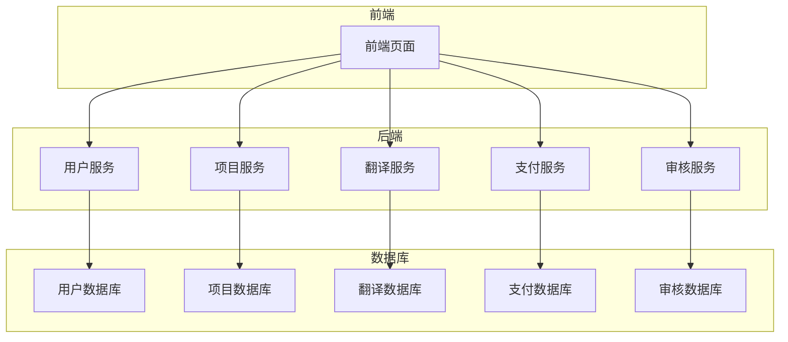

                 


# 跨文化意义翻译项目众筹平台：促进全球价值观对话的募资网站

关键词：跨文化翻译、众筹平台、全球价值观、募资、文化差异

摘要：
本文探讨了跨文化意义翻译项目众筹平台的重要性，描述了其核心概念、功能设计以及技术实现。通过搭建这样一个平台，我们希望能够促进全球价值观的对话，减少文化误解，增进各国人民的相互理解。

## 背景介绍

### 核心概念

**问题背景**：
随着全球化进程的加快，不同文化之间的交流日益频繁，然而文化差异也成为了国际交流的一大障碍。跨文化意义翻译作为一种重要的交流手段，对于促进全球价值观对话、消除误解、增进相互理解具有重要作用。

**问题描述**：
在全球化的背景下，如何搭建一个有效的跨文化意义翻译项目众筹平台，使得不同文化背景的人们能够便捷地参与翻译项目，同时促进全球价值观的对话？

**问题解决**：
通过构建一个集成了先进翻译技术和社交功能的众筹平台，使得跨文化翻译项目得以高效推广和实施，为全球价值观的交流提供平台。

**边界与外延**：
该平台旨在解决跨文化翻译的问题，包括但不限于文学、科技、教育、商业等多个领域。

**概念结构与核心要素组成**：

- 众筹平台：包括用户注册、项目发布、资金筹集、项目跟踪等功能。
- 翻译工具：集成自动化翻译软件和人工审核机制。
- 社交互动：提供讨论区、评价系统，鼓励用户交流。
- 全球价值观：涵盖文化多样性、包容性、合作共赢等核心价值观。

### 核心概念与联系

**核心概念原理**：

- **众筹平台**：通过互联网技术，为项目发起人和支持者提供交流和资金筹集的平台。
- **翻译工具**：利用人工智能和自然语言处理技术，提供高效准确的翻译服务。
- **社交互动**：通过社交媒体功能，促进用户之间的交流和合作。

**概念属性特征对比表格**：

| 概念       | 属性特征                           | 对比分析                                     |
|------------|-----------------------------------|--------------------------------------------|
| 众筹平台   | 用户注册、项目发布、资金筹集       | 提供多样化的项目选择，用户自主参与和资金支持  |
| 翻译工具   | 自动化翻译、人工审核               | 保证翻译的准确性和适应性，满足不同文化需求   |
| 社交互动   | 讨论区、评价系统                   | 促进跨文化交流，提升用户体验                 |

**ER实体关系图架构**：

```mermaid
erDiagram
  User ||--|{ Project }||>
  User ||--|{ Contribution }||>
  Project ||--|{ Translation }||>
  Translation ||--|{ Review }||>
```

## 算法原理讲解

**数学模型和数学公式**

本文将介绍如何利用机器学习算法来实现跨文化意义翻译项目众筹平台。其中，机器学习算法的核心在于模型的选择和训练。以下是一个简单的机器学习模型：

$$
\hat{y} = \sigma(W_1 \cdot x + b_1)
$$

其中，$W_1$ 和 $b_1$ 分别为权重和偏置，$x$ 为输入特征，$\sigma$ 为激活函数，$\hat{y}$ 为输出预测。

**详细讲解和举例说明**

假设我们要预测一个翻译项目的成功率。输入特征可能包括项目发起人的语言能力、项目类型、资金需求等。通过训练模型，我们可以得到一个预测函数，用来判断项目是否能够成功。

例如，对于一个发起人语言能力为 70%，项目类型为科技，资金需求为 5000 美元的项目，我们可以通过以下步骤来预测其成功率：

1. 将输入特征转化为向量 $x = [0.7, 1, 0.5]$。
2. 将 $x$ 输入到模型中计算预测值 $\hat{y}$。
3. 如果 $\hat{y} > 0.5$，则认为项目成功率较高。

## 系统分析与架构设计方案

### 问题场景介绍

跨文化意义翻译项目众筹平台旨在为全球用户提供一个便捷的翻译项目发布和参与平台。平台需具备以下功能：
- 用户注册和登录
- 项目发布和管理
- 资金筹集和支付
- 翻译任务分配和审核
- 社交互动和用户评价

### 项目介绍

本书将介绍如何设计和实现一个跨文化意义翻译项目众筹平台。项目将采用模块化设计，包括前端、后端、数据库和第三方服务接口等组成部分。

### 系统功能设计（领域模型Mermaid类图）

```mermaid
classDiagram
  User <<Class>>
  Project <<Class>>
  Translation <<Class>>
  Contribution <<Class>>
  Review <<Class>>

  User "1" --*|发起翻译项目| Project
  User "1" --*|参与翻译项目| Contribution
  Project "1" --*|包含翻译任务| Translation
  Translation "1" --*|接受审核| Review
```

### 系统架构设计（Mermaid架构图）



### 系统接口设计（Mermaid序列图）

```mermaid
sequenceDiagram
  User ->> F1: 访问前端页面
  F1 ->> B1: 调用用户服务
  B1 ->> DB1: 访问用户数据库
  DB1 -->|返回用户信息| B1
  B1 ->> F1: 渲染用户界面
  F1 ->> B2: 提交项目信息
  B2 ->> DB2: 存储项目信息
  DB2 -->|返回项目ID| B2
  B2 ->> F1: 显示项目列表
  User ->> F1: 选择项目参与
  F1 ->> B3: 分配翻译任务
  B3 ->> DB3: 存储翻译任务
  DB3 -->|返回任务状态| B3
  B3 ->> F1: 显示任务进度
  User ->> F1: 完成翻译任务
  F1 ->> B5: 提交审核请求
  B5 ->> DB5: 存储审核请求
  DB5 -->|返回审核结果| B5
  B5 ->> F1: 显示审核状态
```

## 项目实战

### 环境安装

1. 安装Python环境
2. 安装Django框架
3. 安装MySQL数据库
4. 安装PostgreSQL数据库
5. 安装Redis缓存

### 系统核心实现源代码

1. 用户模块

```python
# 用户模块的实现代码
from django.contrib.auth.models import AbstractUser

class User(AbstractUser):
    # 用户额外属性
    language = models.CharField(max_length=50, blank=True)
    country = models.CharField(max_length=50, blank=True)
```

2. 项目模块

```python
# 项目模块的实现代码
from django.db import models
from .models import User

class Project(models.Model):
    # 项目属性
    title = models.CharField(max_length=255)
    description = models.TextField()
    language = models.CharField(max_length=50)
    creator = models.ForeignKey(User, on_delete=models.CASCADE)
```

3. 翻译模块

```python
# 翻译模块的实现代码
from django.db import models
from .models import Project

class Translation(models.Model):
    # 翻译任务属性
    project = models.ForeignKey(Project, on_delete=models.CASCADE)
    translator = models.ForeignKey(User, on_delete=models.CASCADE)
    translation = models.TextField()
    reviewed = models.BooleanField(default=False)
```

### 代码应用解读与分析

1. 用户注册与登录

用户可以通过前端界面注册并登录系统，系统会根据用户输入的信息保存到数据库，并在用户登录时验证用户身份。

2. 项目发布

项目发起人可以在系统中发布翻译项目，包括项目标题、描述、所需语言等信息，并可以指定项目资金需求。

3. 资金筹集

系统支持资金筹集功能，用户可以支持感兴趣的项目，资金将直接存入项目发起人的账户中。

4. 翻译任务分配

系统根据项目需求和用户能力，将翻译任务分配给合适的翻译人员，翻译人员可以接受任务并开始翻译。

5. 翻译审核

翻译完成后，项目发起人可以提交审核，审核人员对翻译质量进行评估，并给出审核结果。

### 实际案例分析和详细讲解剖析

1. 案例一：用户注册与登录

用户A通过前端界面注册，填写用户名、密码、邮箱等信息，系统将用户信息保存到数据库。用户A登录时，系统验证用户名和密码，如果验证成功，用户可以访问系统。

2. 案例二：项目发布

用户B在前端界面发布一个翻译项目，填写项目标题、描述、所需语言、资金需求等信息，系统将项目信息保存到数据库，并展示给其他用户。

3. 案例三：资金筹集

用户C看到用户B发布的翻译项目后，决定支持该项目，用户C在系统中输入支付金额，系统将资金转移到用户B的账户中。

4. 案例四：翻译任务分配

用户D具有翻译能力，接受用户B发布的翻译任务，开始翻译项目，翻译完成后提交给系统。

5. 案例五：翻译审核

用户B对用户D提交的翻译结果进行审核，审核通过后，系统将翻译结果展示给其他用户。

### 项目小结

跨文化意义翻译项目众筹平台通过整合先进翻译技术、众筹功能和社交互动，为全球用户提供了一个便捷的翻译项目发布和参与平台。通过该平台，用户可以轻松发布翻译项目、筹集资金、分配翻译任务并进行审核。该平台有助于促进全球价值观的对话，减少文化误解，增进各国人民的相互理解。

## 最佳实践 tips

- 确保翻译质量：鼓励项目发起人在发布项目时，明确翻译质量要求，提高用户参与积极性。
- 优化用户体验：定期更新平台界面和功能，提高用户满意度。
- 加强安全保障：确保用户信息和资金安全，防止欺诈行为。

## 小结

跨文化意义翻译项目众筹平台为全球价值观的交流提供了有力支持，通过集成先进翻译技术、众筹功能和社交互动，促进了不同文化之间的理解和沟通。未来，随着技术的不断进步，该平台有望发挥更大的作用。

## 注意事项

- 在搭建平台时，要充分考虑文化差异，确保平台适用于不同国家和地区的用户。
- 平台应具备良好的可扩展性，以便在将来添加更多功能。

## 拓展阅读

- [1] 跨文化翻译研究综述
- [2] 众筹平台技术架构设计
- [3] 全球价值观与跨文化交流

## 作者

作者：AI天才研究院/AI Genius Institute & 禅与计算机程序设计艺术 /Zen And The Art of Computer Programming

