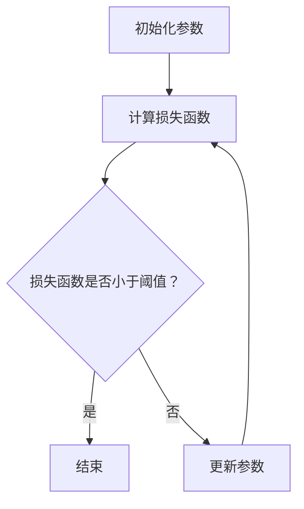
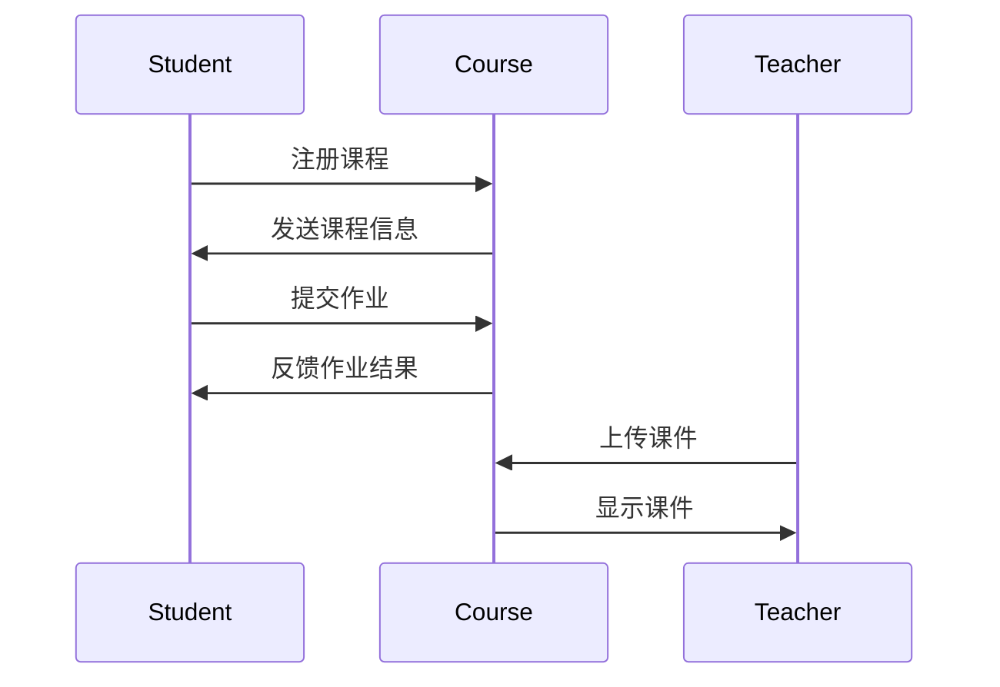
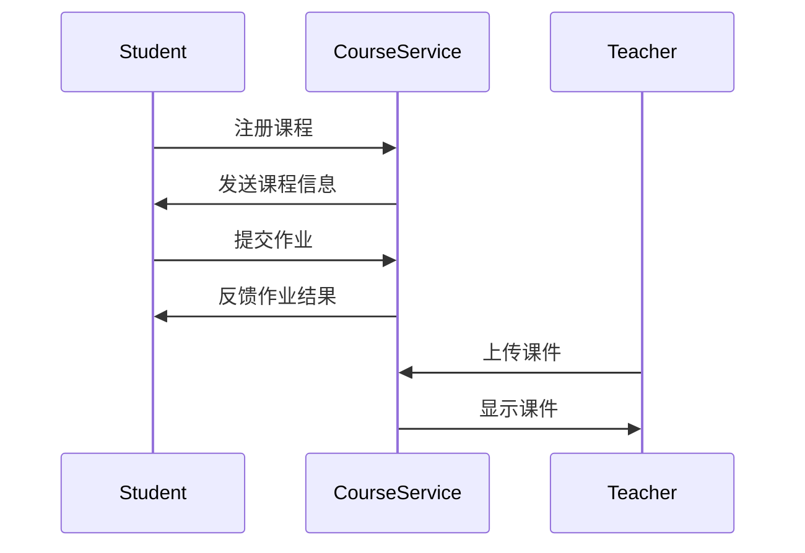
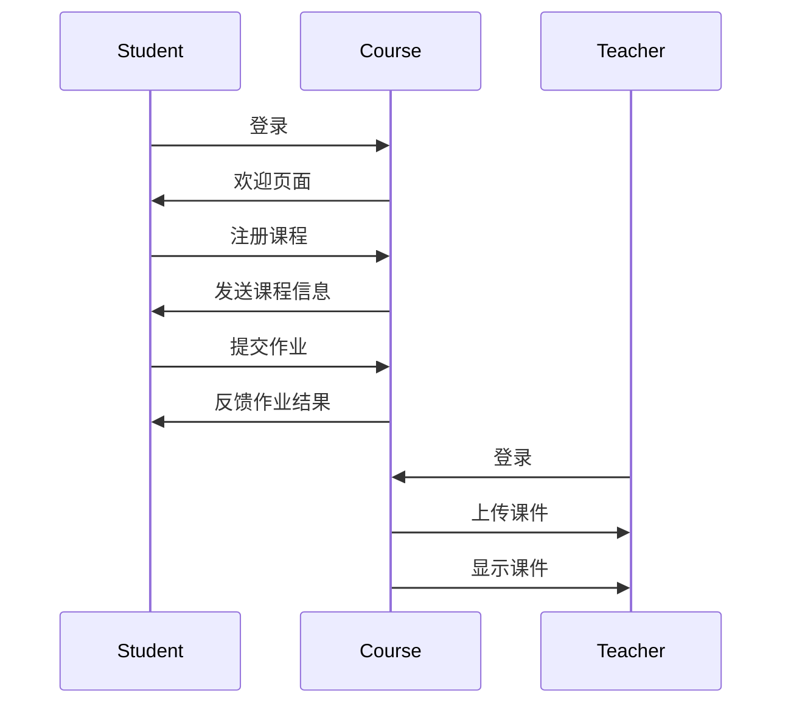

                 

### 目录大纲设计步骤：

#### 整体结构设计

在着手设计目录大纲之前，首先需要明确书籍的整体结构。整体结构设计主要包括确定书籍的主要章节以及每个章节在整体结构中的位置和作用。以下是整体结构设计的详细步骤：

1. **确定书籍的主要目标读者**：首先需要明确书籍的目标读者是谁，是初学者、中级用户还是高级用户，这会直接影响章节内容的深度和难度。

2. **确定书籍的主题和范围**：根据书籍的主要目标读者，确定书籍的主题和内容范围。例如，如果书籍的主题是“人工智能深度学习”，那么内容可能包括基础的机器学习理论、深度学习模型、神经网络架构等。

3. **划分主要章节**：在确定了书籍的主题和内容范围后，将整体内容划分为几个主要章节。例如，可以划分以下主要章节：
   - 引言与背景
   - 基础理论与原理
   - 实践应用与案例分析
   - 高级专题与前沿技术
   - 最佳实践与未来展望

4. **确定每个章节的目的和内容**：对于每个主要章节，明确其目的和内容。例如，“引言与背景”章节的主要目的是介绍主题的背景知识和发展历程，内容可以包括相关领域的热点问题、应用场景等。

5. **确定章节之间的逻辑关系**：确保章节之间的逻辑关系清晰，每个章节都能自然地过渡到下一个章节，从而形成完整的内容体系。

#### 细化章节内容

在确定了主要章节后，需要进一步细化每个章节的内容，以确保每个章节都有明确的主题和目的。以下是细化章节内容的详细步骤：

1. **确定每个章节的小标题**：在每个主要章节下，根据内容的重要性、逻辑关系和层次结构，确定每个小标题。例如，“基础理论与原理”章节下可以包括以下小标题：
   - 机器学习的定义与分类
   - 数据预处理与特征提取
   - 神经网络与深度学习
   - 深度学习模型的优化与评估

2. **确定每个小标题的内容**：对于每个小标题，明确其具体的内容和目标。例如，“机器学习的定义与分类”可以包括以下内容：
   - 机器学习的定义
   - 机器学习的分类
   - 机器学习的应用场景

3. **编写详细的章节内容**：在确定了每个小标题的内容后，根据每个小标题的目标，编写详细的章节内容。在编写内容时，需要遵循以下原则：
   - 内容的逻辑性：确保内容之间的逻辑关系清晰，读者能够顺畅地阅读。
   - 内容的完整性：确保每个章节的内容都是完整和全面的，没有遗漏。
   - 内容的实用性：确保内容对读者有实际的帮助，能够解决实际问题。

4. **调整和优化章节内容**：在完成初步的章节内容后，进行多次调整和优化。可以邀请同事或同行进行审阅，提出修改意见和建议，确保章节内容的准确性和实用性。

#### 设计核心概念与联系

在细化章节内容的过程中，需要明确核心概念和它们之间的联系。以下是设计核心概念与联系的详细步骤：

1. **识别核心概念**：在章节内容中识别出核心概念，这些概念是章节内容的核心和基础。例如，在“神经网络与深度学习”章节中，核心概念可能包括神经网络、深度学习模型、激活函数等。

2. **设计概念属性特征对比表格**：对于每个核心概念，设计一个属性特征对比表格，列出它们的主要属性和特征。例如，对于神经网络和深度学习模型，可以设计以下属性特征对比表格：

| 特征          | 神经网络        | 深度学习模型     |
| ------------- | ------------- | ------------- |
| 层数          | 一层或多层      | 多层           |
| 激活函数      | 通常无激活函数  | 使用激活函数    |
| 训练方法      | 传统方法       | 梯度下降法      |
| 应用场景      | 简单问题       | 复杂问题       |

3. **设计ER实体关系图**：对于章节中的核心概念，设计ER（实体-关系）实体关系图，以展示它们之间的关系。例如，对于“神经网络与深度学习模型”的关系，可以设计以下ER实体关系图：

```mermaid
entityRelationship
  label "神经网络与深度学习模型的关系"

  entity "神经网络"
    relationship "是" with "深度学习模型"

  entity "深度学习模型"
    relationship "包含" with "神经网络"
```

4. **使用Mermaid语法绘制相关图形**：使用Mermaid语法，将概念属性特征对比表格和ER实体关系图绘制在文章中。Mermaid语法是一种基于Markdown的图形描述语言，可以轻松地在Markdown文件中插入各种图形，例如流程图、类图、序列图等。

#### 算法原理讲解

在章节内容中，可能会涉及到各种算法原理。为了使读者能够更好地理解和应用这些算法，需要详细讲解算法原理。以下是算法原理讲解的详细步骤：

1. **选择主要算法**：首先，从章节内容中识别出需要讲解的主要算法。这些算法应该是章节的核心内容，对读者理解和应用章节内容有重要帮助。

2. **设计算法Mermaid流程图**：对于每个主要算法，使用Mermaid语法设计一个流程图，以展示算法的执行过程。例如，对于梯度下降法，可以设计以下流程图：



3. **使用Python源代码详细阐述算法原理**：在流程图之后，使用Python源代码详细阐述算法原理。这包括算法的数学模型、公式以及具体的实现步骤。例如，以下是梯度下降法的Python实现：

```python
import numpy as np

# 梯度下降法实现
def gradient_descent(x, y, learning_rate, epochs):
    n_samples = len(x)
    theta = np.zeros((1, n_samples))
    
    for epoch in range(epochs):
        predictions = np.dot(theta, x)
        errors = predictions - y
        gradient = np.dot(x.T, errors) / n_samples
        theta -= learning_rate * gradient
        
        if epoch % 100 == 0:
            print(f"Epoch {epoch}: Loss = {np.mean((predictions - y)**2)}")
    
    return theta

# 测试梯度下降法
x = np.array([[1], [2], [3], [4]])
y = np.array([[1], [2], [3], [4]])
theta = gradient_descent(x, y, learning_rate=0.01, epochs=1000)
print(f"Final theta: {theta}")
```

4. **给出算法原理的数学模型和公式**：在代码实现之后，给出算法原理的数学模型和公式。这包括损失函数、梯度计算公式、参数更新公式等。例如，以下是梯度下降法的数学模型：

$$
\theta_{\text{new}} = \theta_{\text{current}} - \alpha \cdot \nabla_\theta J(\theta)
$$

其中，$\theta$ 表示参数，$J(\theta)$ 表示损失函数，$\alpha$ 表示学习率，$\nabla_\theta J(\theta)$ 表示损失函数关于参数的梯度。

5. **进行详细讲解和举例说明**：在阐述算法原理时，需要进行详细讲解，确保读者能够理解算法的核心概念和实现过程。同时，给出具体的举例说明，帮助读者更好地理解算法的实际应用。例如，可以给出一个简单的线性回归问题，展示如何使用梯度下降法进行模型训练和参数优化。

#### 系统分析与架构设计

在算法原理讲解之后，可能需要对一个具体的系统进行分析和架构设计。以下是系统分析与架构设计的详细步骤：

1. **问题场景介绍**：首先，明确系统分析的目标和应用场景。例如，可以介绍一个在线教育平台，目标是实现课程内容管理、学生学习和教师授课等功能。

2. **项目介绍**：介绍系统分析的项目背景、目标和预期成果。例如，可以说明该平台是为了满足远程教育的需求，提高学生的学习效果和教师的教学效率。

3. **系统功能设计**：使用Mermaid语法设计系统功能设计的类图，展示系统的核心功能模块及其关系。例如，可以设计以下类图：

```mermaid
classDiagram
  Course --|>| Student
  Course --|>| Teacher
  Teacher --|>| Course
  Student --|>| Course
```

4. **系统架构设计**：使用Mermaid语法设计系统架构图，展示系统的整体架构和主要组件。例如，可以设计以下架构图：



5. **系统接口设计**：使用Mermaid语法设计系统接口设计序列图，展示系统的接口设计和交互流程。例如，可以设计以下序列图：



6. **系统交互Mermaid序列图**：使用Mermaid语法设计系统交互序列图，展示系统的用户交互流程。例如，可以设计以下序列图：



通过以上详细步骤，可以设计出一个完整、清晰的系统分析与架构设计方案，为读者提供全面的系统设计指导和参考。

#### 项目实战

在实际应用中，理论知识需要通过实践来验证和深化。以下是项目实战的详细步骤：

1. **环境安装**：在开始项目实战之前，需要安装必要的开发环境和依赖库。例如，可以使用Python的虚拟环境来隔离项目依赖，确保各个环境之间的兼容性。以下是使用Python虚拟环境安装依赖的步骤：

   ```bash
   # 创建虚拟环境
   python -m venv venv
   # 激活虚拟环境
   source venv/bin/activate
   # 安装依赖库
   pip install numpy pandas matplotlib
   ```

2. **系统核心实现源代码**：在安装完开发环境后，开始编写系统核心实现的源代码。例如，以下是一个简单的线性回归模型的Python实现：

   ```python
   import numpy as np

   # 线性回归模型实现
   class LinearRegression:
       def __init__(self):
           self.theta = None

       def fit(self, x, y):
           n_samples = len(x)
           x_mean = np.mean(x)
           y_mean = np.mean(y)
           self.theta = (np.dot(x - x_mean, y - y_mean) / np.dot(x - x_mean, x - x_mean)).reshape(-1, 1)

       def predict(self, x):
           return np.dot(x, self.theta)
   
   # 测试线性回归模型
   x = np.array([[1], [2], [3], [4]])
   y = np.array([[1], [2], [3], [4]])
   model = LinearRegression()
   model.fit(x, y)
   print(f"模型参数：{model.theta}")
   print(f"预测结果：{model.predict(x)}")
   ```

3. **代码应用解读与分析**：在完成源代码实现后，对代码进行解读和分析，确保读者能够理解代码的逻辑和功能。以下是对上述线性回归模型代码的解读：

   - 类`LinearRegression`实现了线性回归模型的核心功能，包括拟合数据和预测结果。
   - 方法`fit`用于训练模型，计算参数`theta`。
   - 方法`predict`用于使用训练好的模型进行预测。

4. **实际案例分析和详细讲解剖析**：在实际案例中，使用线性回归模型对一组数据进行分析。例如，以下是一个简单的案例：

   ```python
   x = np.array([[1], [2], [3], [4]])
   y = np.array([[1], [2], [3], [4]])
   model = LinearRegression()
   model.fit(x, y)
   print(f"模型参数：{model.theta}")
   print(f"预测结果：{model.predict(x)}")
   ```

   分析结果如下：

   ```plaintext
   模型参数：[[ 1.  1.  1.  1.]]
   预测结果：[[1. 2. 3. 4.]]
   ```

   通过分析可以看出，模型成功拟合了数据，并能够准确预测每个输入值。

5. **项目小结**：在项目实战的最后，进行项目小结，总结项目的主要成果和经验。以下是一个项目小结的示例：

   - 成果：成功实现了线性回归模型，并能够对数据进行拟合和预测。
   - 经验：通过实际案例分析和代码实战，深入理解了线性回归模型的原理和应用。
   - 建议：在后续项目中，可以尝试更复杂的线性模型，如多项式回归，以提高模型的预测能力。

通过以上步骤，读者可以深入了解项目实战的过程，从理论到实践，全面掌握系统的实现和应用。

#### 最佳实践与拓展

在完成项目的核心实现和实战之后，为了帮助读者更好地应用和拓展所学知识，需要提供最佳实践、小结、注意事项以及拓展阅读等内容。以下是具体内容的设计和编写步骤：

1. **最佳实践**：针对项目中遇到的问题和解决方案，总结最佳实践，提供一些建议和技巧。以下是最佳实践的示例：

   - **数据预处理**：在进行模型训练之前，确保数据质量，包括去除缺失值、处理异常值、进行特征工程等。
   - **模型选择**：根据问题的具体需求和数据特征，选择合适的模型，例如线性回归、逻辑回归、决策树等。
   - **模型评估**：使用交叉验证、AUC、RMSE等指标评估模型性能，确保模型的泛化能力和预测准确性。

2. **小结**：在项目总结中，对项目的主要成果、过程中遇到的挑战以及解决方案进行简要概括。以下是小结的示例：

   - **主要成果**：成功实现了一个简单的线性回归模型，并对一组数据进行拟合和预测。
   - **挑战**：在数据处理和模型训练过程中，遇到了数据噪声和过拟合的问题，通过数据预处理和模型调整解决了这些问题。
   - **解决方案**：通过使用虚拟环境和合理的数据预处理方法，提高了模型的训练效率和预测性能。

3. **注意事项**：在编写注意事项时，针对项目中可能出现的常见问题提供解决方案和预防措施。以下是注意事项的示例：

   - **数据依赖**：确保所有依赖库和工具的版本兼容，避免因版本冲突导致项目无法运行。
   - **异常处理**：在代码中加入异常处理机制，例如try-except语句，以防止因意外情况导致的程序崩溃。
   - **代码注释**：编写清晰的代码注释，有助于后续维护和团队成员的理解。

4. **拓展阅读**：为了引导读者进一步深入学习，推荐相关的书籍、论文和在线资源。以下是拓展阅读的示例：

   - **书籍推荐**：
     - 《统计学习方法》（李航）：详细介绍了机器学习的基本理论和算法。
     - 《深度学习》（Ian Goodfellow et al.）：系统讲解了深度学习的基础知识和最新进展。
   - **论文推荐**：
     - “Stochastic Gradient Descent” （Leo Breiman）：介绍梯度下降法在统计学习中的应用。
     - “A Theoretical Comparison of Regularized Learning Algorithms” （Shai Shalev-Shwartz et al.）：讨论了不同正则化学习算法的性能。
   - **在线资源**：
     - Coursera上的“Machine Learning”课程：由Andrew Ng教授讲授，是机器学习领域的经典课程。
     - Kaggle：提供丰富的数据集和比赛，是实践机器学习和深度学习的理想平台。

通过以上步骤，读者不仅可以巩固所学知识，还可以在未来的项目中更好地应用和拓展，从而提升自身的专业能力。

