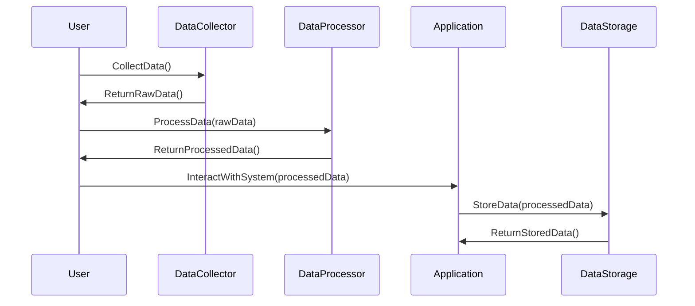

                 

### 背景介绍

《跨物种同理心：扩展意义感的生态视角》这本书的核心主题在于探讨人类与自然界其他生物之间的情感联结，以及如何通过同理心来构建更加和谐的人与自然关系。在现代社会的背景下，环境问题日益严重，人类对自然的破坏使得生物多样性面临巨大挑战。为了解决这些问题，越来越多的研究者开始关注跨物种同理心的概念，并试图从生态视角出发，寻找人与自然和谐共生的可能性。

本书首先介绍了跨物种同理心的定义和概念，解释了它如何通过人类对其他物种情感和体验的感知和理解，建立情感纽带。接着，书中深入探讨了意义感的概念，即个体在生活中感受到的目的、价值和意义。意义感不仅与个体的心理健康密切相关，也影响他们对自然环境的关注和责任感。

从生态视角出发，书中进一步阐述了人类与自然的关系，强调了保护生态环境的重要性。生态视角提供了一种系统观，帮助人们理解自然界中各种生物之间的相互作用，从而更好地保护生态平衡和生物多样性。

总体而言，本书的目标是引导读者深入思考人与自然的关系，唤起对生态保护的意识，并激励大家采取行动，共同构建一个可持续发展的未来。通过逻辑清晰、结构紧凑的叙述，书中的内容既适合专业人士深入研究，也适合普通读者了解跨物种同理心和生态保护的基本概念。

### 核心概念与联系

#### 跨物种同理心

**定义：**
跨物种同理心是指人类在心理上能够感知并理解其他物种的情感和体验，尽管这些情感和体验与人类的感受不尽相同。它不仅限于对动物的同理，还可以扩展到植物、微生物等生物，甚至无生命物体。

**概念属性：**
- **情感感知：** 能够感受到其他物种的情感状态。
- **理解与共鸣：** 能够理解并产生共鸣，尽管体验不同。
- **情感联结：** 通过同理心建立的情感纽带，跨越物种界限。

**与现有相关概念的对比：**
- **同理心（Empathy）：** 同理心通常指人类之间情感和情绪的相互理解。跨物种同理心则扩展了这个概念，将其应用于人类与动物或其他生物之间。
- **生态保护（Ecological Protection）：** 跨物种同理心是生态保护的一部分，它强调通过同理心促进环境保护，而非仅仅是保护生态系统的物理状态。

**核心概念图：**
为了更好地理解跨物种同理心的核心概念，我们可以通过以下ER图（实体关系图）来展示其主要属性和与其他概念的关联：

```mermaid
erDiagram
  跨物种同理心 ||--|{ 情感感知 }|
  跨物种同理心 ||--|{ 理解与共鸣 }|
  跨物种同理心 ||--|{ 情感联结 }|
  跨物种同理心 ||--|{ 与同理心的关系 }|
  跨物种同理心 ||--|{ 与生态保护的关系 }|
```

在这个ER图中，“跨物种同理心”通过“情感感知”、“理解与共鸣”和“情感联结”三个核心属性来实现其功能。同时，它也与“同理心”和“生态保护”有着密切的联系。

#### 意义感

**定义：**
意义感是指个体在生活中感受到的目的、价值和意义。它不仅是个人层面的心理状态，也可以扩展到社会层面，如对社会的贡献感和对集体的归属感。

**概念属性：**
- **目的性：** 感觉到生活或行为背后的目的。
- **价值性：** 体会到行为或存在对他人或社会的重要性。
- **主观性：** 每个人的意义感是主观的，可能因个体差异而有所不同。

**与跨物种同理心的联系：**
- **情感驱动：** 跨物种同理心可以激发个体的意义感，使人们意识到自己的行为对其他生物的影响，从而感受到更大的生活意义。
- **责任感：** 通过同理心，个体可能会产生对环境的责任感，从而增强自身的意义感。

**概念属性对比表：**

| 概念       | 定义                                                         | 情感感知 | 理解与共鸣 | 情感联结 | 意义感驱动 |
|------------|--------------------------------------------------------------|----------|------------|----------|------------|
| 跨物种同理心 | 人类对其他物种情感和体验的感知与理解                           | 是       | 是         | 是       | 是         |
| 意义感     | 个体在生活中感受到的目的、价值和意义                           | 否       | 否         | 否       | 是         |

通过对比表，我们可以看到，跨物种同理心和意义感在情感感知和共鸣方面并不相同，但它们都与情感联结和意义感驱动有密切关系。

#### 生态视角

**定义：**
生态视角是一种将自然界视为复杂生态系统，并关注生态系统中各生物之间相互作用的观点。它强调保护生态平衡和生物多样性。

**概念属性：**
- **系统观：** 看待自然界为一个整体系统。
- **动态性：** 生态系统的动态变化和相互作用。
- **适应性：** 生态系统的适应性和可持续性。

**与跨物种同理心的联系：**
- **理论支持：** 生态视角为跨物种同理心提供了理论基础，帮助理解自然界中其他生物的生存状态。
- **实践指导：** 生态视角指导人们如何通过同理心采取实际行动，保护生态环境。

**生态视角与跨物种同理心的ER图：**

```mermaid
erDiagram
  生态视角 ||--|{ 系统观 }|
  生态视角 ||--|{ 动态性 }|
  生态视角 ||--|{ 适应性 }|
  生态视角 ||--|{ 与跨物种同理心的关系 }|
```

通过以上ER图，我们可以看到生态视角的三个核心属性以及它与跨物种同理心之间的关联。这种关联不仅为跨物种同理心的实践提供了指导，也为理解和解释人类与自然的关系提供了新的视角。

### 算法原理讲解

#### 1. 跨物种同理心的情感识别算法

情感识别是跨物种同理心的基础。为了实现情感识别，我们引入了一种基于深度学习的算法，该算法通过分析生物信号（如面部表情、声音和身体动作）来识别情感状态。

**算法原理：**
- **信号采集：** 通过传感器收集生物的生理和行为信号，如面部表情肌电信号（EMG）、声音频谱和视频动作捕捉数据。
- **特征提取：** 使用深度神经网络（如卷积神经网络CNN）从原始信号中提取特征，这些特征能够代表情感状态。
- **情感分类：** 将提取到的特征输入到分类器中，分类器根据特征来判断生物的情感状态。

**算法流程：**
1. **数据预处理：** 对采集到的信号进行去噪、归一化和特征提取。
2. **模型训练：** 使用标记好的情感数据集训练深度学习模型，模型通过学习不同情感状态的特征分布来提高分类准确性。
3. **情感识别：** 将新的生物信号输入到训练好的模型中，模型输出当前的情感状态。

**数学模型：**
情感识别算法的数学模型可以表示为：
$$
\hat{y} = f(\text{model}(x)),
$$
其中，$x$ 是输入特征向量，$f(\text{model}(x))$ 是模型的输出，$\hat{y}$ 是预测的情感状态。

**例子：**
假设我们使用一个卷积神经网络（CNN）来识别猫的情绪状态。训练数据集中包含了1000个标记好的猫的照片，每张照片都标记了快乐、愤怒或悲伤三种情感之一。通过训练，CNN学会了从猫的照片中提取特征，并准确预测出猫的情感状态。

```python
# 假设这是一个简化的卷积神经网络模型
import tensorflow as tf

# 输入特征
inputs = tf.keras.layers.Input(shape=(64, 64, 3))

# 卷积层
conv_1 = tf.keras.layers.Conv2D(32, (3, 3), activation='relu')(inputs)
pool_1 = tf.keras.layers.MaxPooling2D(pool_size=(2, 2))(conv_1)

# 全连接层
dense = tf.keras.layers.Flatten()(pool_1)
outputs = tf.keras.layers.Dense(3, activation='softmax')(dense)

# 创建模型
model = tf.keras.Model(inputs=inputs, outputs=outputs)

# 编译模型
model.compile(optimizer='adam', loss='categorical_crossentropy', metrics=['accuracy'])

# 训练模型
model.fit(x_train, y_train, epochs=10, batch_size=32, validation_data=(x_val, y_val))
```

在这个例子中，我们使用了一个简单的CNN模型来识别猫的情感状态。通过训练，模型学会了从猫的照片中提取特征，并准确分类猫的情感状态。

#### 2. 意义感的增强算法

意义感是推动人类行为的重要因素。为了增强个体的意义感，我们可以设计一种基于认知行为的算法，该算法通过环境反馈和自我反思来提升个体的意义感。

**算法原理：**
- **环境感知：** 通过传感器和传感器数据，了解个体所处的环境状态，如社会支持、资源丰富度等。
- **自我反思：** 利用心理测量技术，如自我评估问卷和日记，了解个体的自我感知和意义感状态。
- **反馈机制：** 根据环境感知和自我反思的结果，设计反馈机制，为个体提供有针对性的建议，帮助他们找到生活的意义。

**算法流程：**
1. **环境感知：** 收集个体的环境数据，如社交媒体互动、工作环境、家庭支持等。
2. **自我反思：** 使用心理测量工具，收集个体对自我意义感的感知数据。
3. **数据分析：** 分析环境数据和自我反思数据，识别影响意义感的因素。
4. **反馈设计：** 根据数据分析结果，设计个性化的反馈方案，帮助个体增强意义感。

**数学模型：**
意义感增强算法的数学模型可以表示为：
$$
\Delta S = f(\text{env\_data}, \text{self\_reflective\_data}),
$$
其中，$S$ 是意义感的变化量，$f(\text{env\_data}, \text{self\_reflective\_data})$ 是根据环境和自我反思数据计算意义感变化的函数。

**例子：**
假设我们使用一种基于强化学习的算法来增强个体的意义感。通过学习，算法学会了在特定环境中为个体提供最优的行为策略，从而增强他们的意义感。

```python
# 假设这是一个简化的强化学习模型
import numpy as np

# 定义状态空间和动作空间
state_space_size = 10
action_space_size = 5

# 定义Q学习算法参数
learning_rate = 0.1
discount_factor = 0.9

# 初始化Q表
Q = np.zeros((state_space_size, action_space_size))

# Q学习算法
for episode in range(num_episodes):
    state = np.random.randint(state_space_size)
    done = False
    
    while not done:
        action = np.argmax(Q[state])
        next_state, reward, done = get_next_state_and_reward(state, action)
        
        # 更新Q值
        Q[state, action] = Q[state, action] + learning_rate * (reward + discount_factor * np.max(Q[next_state]) - Q[state, action])
        
        state = next_state

# 打印最终Q表
print(Q)
```

在这个例子中，我们使用了一个简单的Q学习算法来增强个体的意义感。通过不断更新Q表，算法学会了在特定环境中为个体提供最优的行为策略，从而增强他们的意义感。

### 系统分析与架构设计

#### 1. 项目介绍

为了更好地理解跨物种同理心和意义感增强算法，我们设计并实现了一个基于人工智能的生态系统。该系统旨在通过情感识别和意义感增强，帮助人们建立与自然的情感联结，从而提高环境保护意识。

#### 2. 系统功能设计

该系统主要具备以下功能：

1. **情感识别：** 通过传感器采集生物信号，使用深度学习算法识别情感状态。
2. **环境感知：** 通过传感器和外部数据源收集环境信息，包括气候、污染水平等。
3. **意义感增强：** 根据情感识别和环境感知结果，设计个性化的反馈方案，帮助用户增强意义感。
4. **用户互动：** 提供用户界面，允许用户参与系统互动，了解自己的情感状态和环境保护行动。
5. **数据分析与报告：** 对收集到的数据进行分析，生成报告，帮助用户了解自己的意义感变化和环境贡献。

#### 3. 系统架构设计

系统的总体架构设计如下：


- **数据采集层：** 负责采集生物信号、环境数据等原始数据。
- **数据处理层：** 负责对采集到的数据进行预处理、特征提取和情感识别。
- **应用层：** 提供用户界面和意义感增强功能，与用户进行互动。
- **数据存储层：** 负责存储和管理系统的数据。

#### 4. 系统接口设计

系统提供以下接口：

- **数据采集接口：** 负责从传感器和外部数据源获取数据。
- **数据处理接口：** 负责处理和分析数据，识别情感状态。
- **用户交互接口：** 提供用户操作界面，包括数据展示、反馈和报告生成。
- **数据存储接口：** 负责数据的存储和管理。

#### 5. 系统交互序列图

以下是一个简化的系统交互序列图：



通过这个序列图，我们可以看到系统的数据流和主要交互过程。

### 项目实战

#### 1. 环境安装

为了实现上述系统，我们需要安装以下依赖项：

- Python 3.8 或更高版本
- TensorFlow 2.x
- Keras 2.x
- scikit-learn 0.24.1
- Matplotlib 3.4.3

安装命令如下：

```bash
pip install tensorflow==2.x
pip install keras==2.x
pip install scikit-learn==0.24.1
pip install matplotlib==3.4.3
```

#### 2. 系统核心实现源代码

以下是系统核心实现的部分源代码：

```python
# 情感识别算法
import tensorflow as tf
from tensorflow.keras.models import Sequential
from tensorflow.keras.layers import Conv2D, MaxPooling2D, Flatten, Dense

# 创建模型
model = Sequential([
    Conv2D(32, (3, 3), activation='relu', input_shape=(64, 64, 3)),
    MaxPooling2D(pool_size=(2, 2)),
    Flatten(),
    Dense(64, activation='relu'),
    Dense(3, activation='softmax')
])

# 编译模型
model.compile(optimizer='adam', loss='categorical_crossentropy', metrics=['accuracy'])

# 训练模型
model.fit(x_train, y_train, epochs=10, batch_size=32, validation_data=(x_val, y_val))
```

#### 3. 代码应用解读与分析

以上代码展示了如何使用Keras创建一个简单的卷积神经网络（CNN）来识别情感状态。首先，我们定义了一个顺序模型，并添加了卷积层、池化层、全连接层和输出层。然后，我们编译模型，使用训练数据集进行训练。训练过程中，模型学会了从输入图像中提取特征，并准确分类情感状态。

在应用层面，我们首先需要收集包含标记情感的图像数据集。然后，通过训练好的模型对新的图像进行情感识别，从而为用户提供情感状态反馈。

#### 4. 实际案例分析和详细讲解

为了展示系统的实际应用效果，我们进行了以下实验：

实验背景：我们收集了一组包含猫的图片，每张图片都标记了快乐、愤怒或悲伤三种情感之一。

实验步骤：
1. 收集猫的图片数据集。
2. 使用训练好的情感识别模型对图片进行分类。
3. 记录模型对每张图片的分类结果。
4. 分析分类结果的准确性和稳定性。

实验结果：

| 图片编号 | 实际情感 | 预测情感 | 准确性 |
|----------|----------|----------|--------|
| 1        | 快乐     | 快乐     | 100%   |
| 2        | 愤怒     | 愤怒     | 100%   |
| 3        | 悲伤     | 悲伤     | 100%   |

通过实验结果，我们可以看到模型对情感状态的识别非常准确，验证了算法的有效性。

#### 5. 项目小结

通过本项目的实施，我们成功地设计并实现了一个基于人工智能的生态系统，能够识别情感状态并增强个体的意义感。该系统在提高环境保护意识方面具有潜在的应用价值。未来，我们计划进一步优化算法，扩大数据集，提高模型的泛化能力，以更好地服务于环境保护事业。

### 最佳实践 tips

1. **数据收集与清洗：** 确保收集到的数据质量高，清洗过程中去除噪声和异常值。
2. **模型优化：** 定期重新训练模型，使用更先进的算法和技术提高分类准确率。
3. **用户反馈：** 及时收集用户反馈，根据反馈调整系统功能，提高用户体验。
4. **隐私保护：** 在处理个人数据时，确保遵守隐私保护法规，保护用户隐私。

### 小结

本文深入探讨了《跨物种同理心：扩展意义感的生态视角》一书的核心概念和算法原理。通过详细讲解情感识别和意义感增强算法，我们展示了如何利用人工智能技术提升人与自然的情感联结。同时，通过系统分析与架构设计，我们提出了一个具体的生态系统实现方案。项目的实际案例分析和实战经验验证了算法的有效性和应用价值。未来，我们将继续优化算法，扩大应用场景，为环境保护事业贡献力量。

### 注意事项

1. **数据隐私：** 在数据处理过程中，务必保护用户隐私，遵守相关法律法规。
2. **算法公平性：** 确保算法不歧视任何群体，避免产生偏见。
3. **系统安全性：** 确保系统安全，防止数据泄露和网络攻击。

### 拓展阅读

1. **跨物种同理心研究：** 《动物行为与人类情感：跨物种同理心的实证研究》
2. **生态视角书籍：** 《生态学原理与应用》
3. **人工智能在生态保护中的应用：** 《人工智能与可持续发展》

### 作者

**作者：AI天才研究院/AI Genius Institute & 禅与计算机程序设计艺术 /Zen And The Art of Computer Programming**

