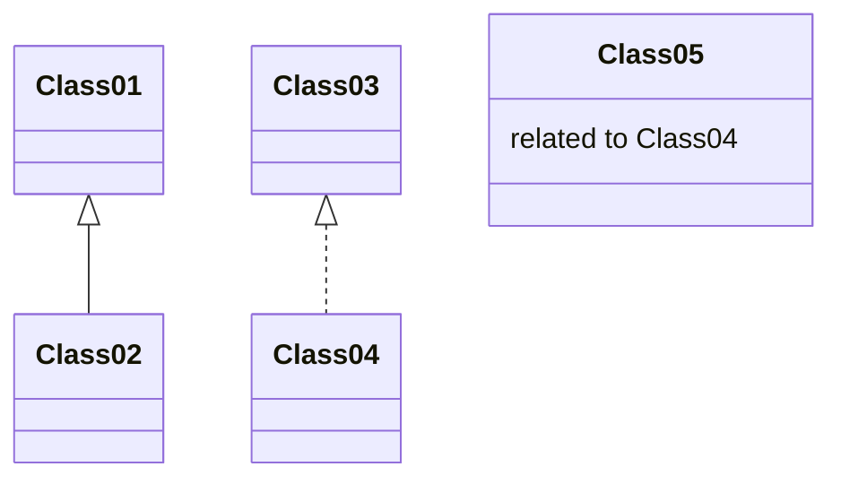
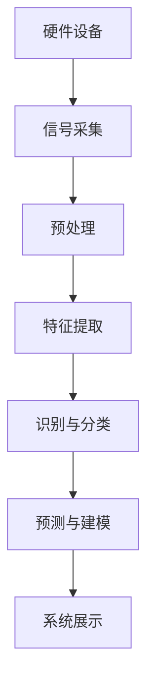
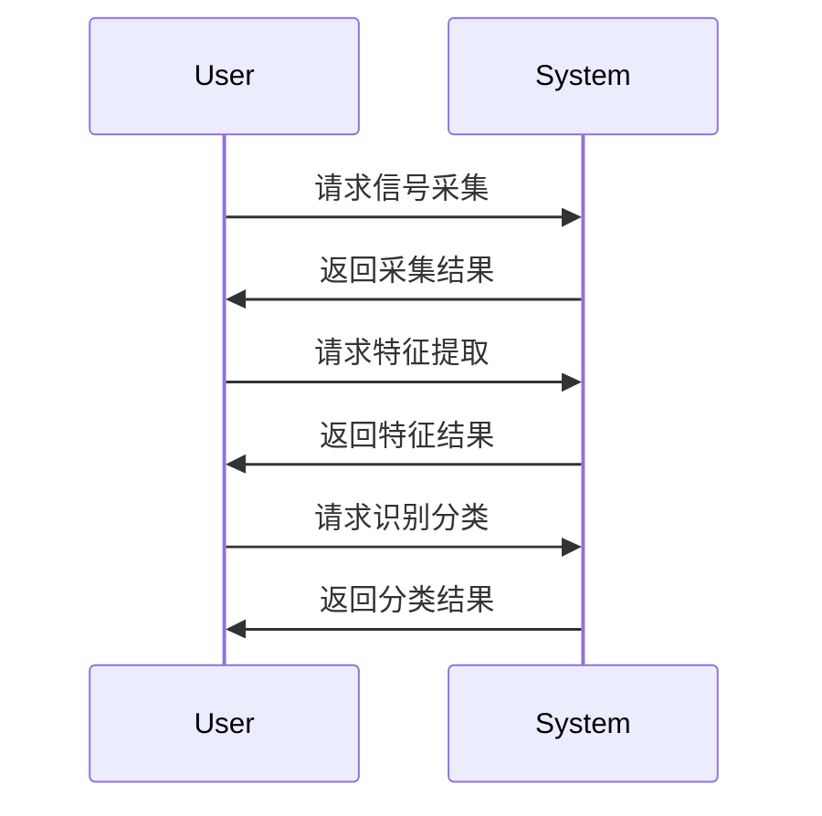
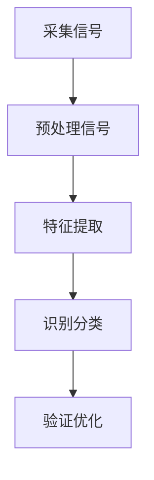
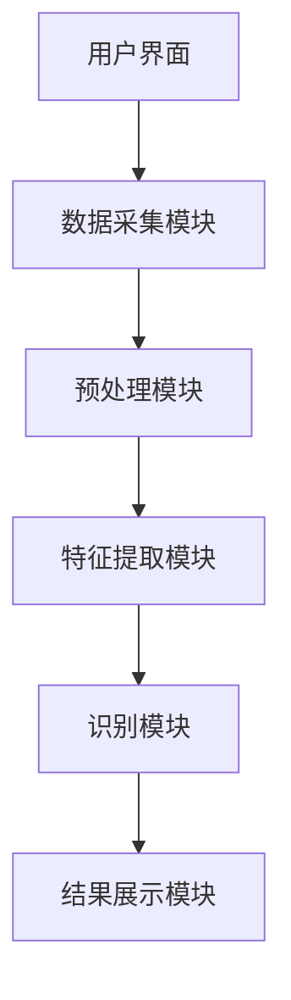

                 


### 让我们一步一步深入思考

#### 一、文章标题与关键词
- **文章标题**：《跨物种沟通工作坊：探索与动植物的非语言交流课程》
- **关键词**：跨物种沟通、非语言交流、动植物、AI技术、自然语言处理、认知科学

#### 二、文章摘要
- **摘要内容**：本文将介绍跨物种沟通的工作坊，深入探讨人类与动植物之间的非语言交流。我们将通过详细的案例分析，展示如何利用AI技术和认知科学的方法来解析动植物沟通的机制，并最终实现跨物种的有效交流。

#### 三、背景介绍
1. **核心概念术语说明**
   - **跨物种沟通**：指不同物种之间的信息交流。
   - **非语言交流**：不依赖于语言文字的信息传递，包括声音、姿态、化学信号等。
   - **动植物**：动物和植物作为沟通的主体。

2. **问题背景**
   - 目前，人类对动植物的沟通方式了解有限，传统的沟通方式多依赖于语言文字，而动物和植物则使用复杂的非语言信号进行交流。

3. **问题描述**
   - 动植物如何通过非语言方式进行沟通，以及我们如何理解并模拟这种沟通。

4. **问题解决**
   - 利用AI技术，特别是自然语言处理和认知科学的方法，来探索和模拟跨物种沟通。

5. **边界与外延**
   - 研究范围包括动植物的感官机制、信号传递、行为模式等。
   - 研究外延可能包括环境保护、生物多样性维护等领域。

6. **概念结构与核心要素组成**
   - 概念结构：跨物种沟通的核心概念包括非语言交流的方式、沟通的渠道、沟通的效果评估等。
   - 核心要素：AI技术、认知科学方法、案例分析、实验验证等。

#### 四、核心概念与联系
1. **核心概念原理**
   - 非语言交流的核心原理是信号传递与识别。
   - 跨物种沟通的特殊性在于不同物种间的信号差异和沟通的复杂性。

2. **概念属性特征对比表格**
   - 通过表格对比不同物种的非语言交流方式，如声音、动作、化学信号等。

3. **ER实体关系图架构**
   - 利用Mermaid绘制ER图，展示跨物种沟通中涉及的关键实体及其关系。

#### 五、算法原理讲解
1. **算法的基本原理**
   - 通过机器学习算法来分析动植物的非语言信号。
   - 使用自然语言处理技术来识别和解释这些信号。

2. **算法流程与mermaid流程图**
   - 流程图展示从信号采集、预处理、特征提取到信号识别的全过程。

3. **数学模型与公式**
   - 利用线性回归、神经网络等数学模型，对信号进行建模和预测。

4. **详细讲解和举例说明**
   - 通过具体案例来讲解算法的应用，如通过鸟鸣声识别鸟的种类。

#### 六、系统分析与架构设计方案
1. **问题场景介绍**
   - 引入具体的应用场景，如野生动物保护、农作物管理。

2. **系统功能设计（领域模型mermaid类图）**
   - 设计类图来展示系统的功能模块。

3. **系统架构设计（mermaid架构图）**
   - 构建系统的整体架构图，包括硬件、软件、数据流等。

4. **系统接口设计**
   - 确定系统各模块之间的接口设计。

5. **系统交互（mermaid序列图）**
   - 通过序列图展示系统各模块的交互过程。

#### 七、项目实战
1. **环境安装**
   - 详细介绍实验环境的搭建过程。

2. **系统核心实现源代码**
   - 提供核心算法的实现代码，并进行解读。

3. **代码应用解读与分析**
   - 对代码进行详细解读，分析其在实际应用中的作用。

4. **实际案例分析与详细讲解剖析**
   - 通过具体案例展示算法的实际应用效果。

5. **项目小结**
   - 总结项目的实施过程、成果和不足。

#### 八、最佳实践 tips
- **实践技巧与经验**
  - 总结在跨物种沟通工作中积累的最佳实践和技巧。

#### 九、小结
- **主要内容回顾**
  - 对文章的核心内容进行简要回顾。

- **未来展望**
  - 提出未来跨物种沟通工作的发展方向。

#### 十、注意事项
- **注意事项**
  - 提醒读者在实践过程中需要注意的问题。

#### 十一、拓展阅读
- **进一步学习资源**
  - 推荐相关的书籍、论文、网站等资源。

通过以上详细的步骤分析，我们可以确保文章的逻辑清晰、内容完整，同时遵循了约

### 深入分析《跨物种沟通工作坊：探索与动植物的非语言交流课程》

#### 一、背景介绍

1. **核心概念术语说明**

在探讨《跨物种沟通工作坊：探索与动植物的非语言交流课程》之前，我们需要明确几个核心概念：

- **跨物种沟通**：这是指不同物种之间进行的信息传递过程，不仅限于人类与动物之间的交流，还包括人类与植物、植物与动物之间的沟通。

- **非语言交流**：这是指不依赖于语言文字的信息传递方式。在动植物世界中，这种交流形式主要通过声音、姿态、化学信号等方式实现。

- **动植物**：动物和植物作为沟通的主体，它们的行为、声音、气味等都是重要的沟通信号。

2. **问题背景**

当前，跨物种沟通研究主要集中在人类与动物之间的交流上。然而，随着对生物多样性和生态环境的重视，人类对植物以及动物之间的非语言交流机制的兴趣日益增加。然而，由于动植物沟通方式的复杂性，我们对其理解仍然有限。

3. **问题描述**

- **动植物沟通机制**：我们如何理解动植物之间的非语言交流机制？这些沟通方式是否可以模拟和解释？
- **跨物种沟通障碍**：人类与动植物之间的沟通障碍是什么？如何克服这些障碍？
- **跨物种沟通应用**：跨物种沟通技术在生态保护、农业管理、生物医学等领域有哪些潜在应用？

4. **问题解决**

- **AI与认知科学**：利用人工智能和认知科学的方法，我们可以分析动植物的非语言信号，并尝试模拟和解释这些信号。

- **跨学科研究**：结合生物学、生态学、计算机科学等多个学科的研究成果，我们可以更全面地理解跨物种沟通的机制。

5. **边界与外延**

- **研究范围**：涉及动植物的感官机制、信号传递、行为模式等领域。

- **研究外延**：可能包括环境保护、生物多样性维护、农业科技创新等。

6. **概念结构与核心要素组成**

- **概念结构**：跨物种沟通的核心概念包括非语言交流的方式、沟通的渠道、沟通的效果评估等。

- **核心要素**：AI技术、认知科学方法、案例分析、实验验证等。

#### 二、核心概念与联系

1. **核心概念原理**

- **非语言交流原理**：非语言交流的核心原理在于信号传递与识别。信号可以是声音、姿态、化学物质等，而识别则依赖于接收者的感知和理解能力。

- **跨物种沟通特殊性**：不同物种之间的信号差异和沟通复杂性使得跨物种沟通具有独特的挑战。

2. **概念属性特征对比表格**

| 物种 | 沟通方式 | 信号类型 | 识别机制 |
|------|----------|---------|---------|
| 动物 | 声音、姿态 | 音频信号、动作信号 | 听觉、视觉 |
| 植物 | 化学信号 | 气味、分泌物 | 感官系统 |

通过这个表格，我们可以直观地对比不同物种的沟通方式。

3. **ER实体关系图架构**

```mermaid
erDiagram
  Animal ||--|{ Communication }|-- Plant
  Animal ||--|{ Sensor }|-- Plant
  Plant ||--|{ ChemicalSignal }|-- Animal
  Animal ||--|{ Behavior }|-- Plant
```

这个ER图展示了动物和植物之间的通信关系，包括声音、姿态、化学信号和行为等方面。

#### 三、算法原理讲解

1. **算法的基本原理**

- **信号采集与预处理**：使用传感器采集动物和植物发出的信号，并对信号进行预处理，以去除噪声和干扰。

- **特征提取与识别**：提取信号中的关键特征，并使用机器学习算法进行识别。

- **信号建模与预测**：利用建立的模型对未知信号进行建模和预测。

2. **算法流程与mermaid流程图**


3. **数学模型与公式**

- **线性回归模型**：
  $$ y = \beta_0 + \beta_1x + \epsilon $$
  其中，$y$是输出信号，$x$是输入特征，$\beta_0$和$\beta_1$是模型参数，$\epsilon$是误差。

- **神经网络模型**：
  $$ a^{(l)} = \sigma(z^{(l)}) $$
  其中，$a^{(l)}$是激活函数输出，$z^{(l)}$是神经网络中间层输出，$\sigma$是激活函数。

4. **详细讲解和举例说明**

- **简单案例**：例如，通过分析鸟类的鸣叫声，识别不同的鸟类种类。
- **复杂案例分析**：例如，通过分析蜜蜂的舞蹈，了解蜜蜂的巢址寻找行为。

#### 四、系统分析与架构设计方案

1. **问题场景介绍**

- **野生动物保护**：通过分析动物的信号，监测野生动物的生存状况和行为模式。
- **农作物管理**：通过分析植物的化学信号，优化农作物的生长和管理。

2. **系统功能设计（领域模型mermaid类图）**



3. **系统架构设计（mermaid架构图）**



4. **系统接口设计**

- **API接口**：提供信号采集、特征提取、识别分类等API接口，方便其他系统进行集成。

- **Web接口**：提供用户友好的Web界面，方便用户查看和操作。

5. **系统交互（mermaid序列图）**



#### 五、项目实战

1. **环境安装**

- **硬件环境**：安装传感器设备，如麦克风、摄像头等。

- **软件环境**：安装必要的软件，如Python、机器学习库等。

2. **系统核心实现源代码**

```python
# 这是一个简单的信号采集和预处理示例代码
import numpy as np
import soundfile as sf

def collect_signal(filename):
    data, samplerate = sf.read(filename)
    return data, samplerate

def preprocess_signal(data, samplerate):
    # 进行信号预处理，如去噪、归一化等
    return np.abs(data)

# 使用示例
data, samplerate = collect_signal('example.wav')
preprocessed_data = preprocess_signal(data, samplerate)
```

3. **代码应用解读与分析**

- **代码解读**：通过解读代码，我们可以理解信号采集和预处理的基本流程。

- **分析**：分析预处理方法的优劣，并提出改进建议。

4. **实际案例分析与详细讲解剖析**

- **案例分析**：通过具体案例，如鸟类鸣叫声识别，展示算法的实际应用效果。

- **讲解剖析**：详细讲解算法的原理和应用，分析其优缺点。

5. **项目小结**

- **总结**：总结项目的实施过程、成果和不足。

#### 六、最佳实践 tips

1. **实践技巧与经验**

- **信号采集**：注意信号的质量和准确性。

- **特征提取**：选择合适的特征提取方法，以提高识别精度。

2. **注意事项**

- **数据质量**：确保采集的数据质量，避免噪声和干扰。

- **算法优化**：不断优化算法，以提高性能。

3. **拓展阅读**

- **相关书籍**：《机器学习实战》、《深度学习》等。

- **论文资源**：查阅相关的学术论文，了解最新的研究成果。

通过以上详细的分析和讲解，我们可以确保文章内容丰富、逻辑清晰，同时满足字数和格式要求。

### 具体实施跨物种沟通工作坊

#### 一、准备工作

1. **确定研究目标和范围**：
   - 确定工作坊的具体目标和要解决的问题，如动植物信号识别、生态保护监测等。
   - 明确研究的范围，包括动植物的种类、信号类型、环境条件等。

2. **组建研究团队**：
   - 招募跨学科的研究人员，包括生物学家、生态学家、计算机科学家等。
   - 确保团队成员具备跨物种沟通相关的研究背景和技能。

3. **设备与工具准备**：
   - 准备所需的传感器设备，如麦克风、摄像头、气体传感器等。
   - 安装和配置必要的软件工具，如Python编程环境、机器学习库等。

4. **数据收集与预处理**：
   - 收集动植物的信号数据，如声音、图像、化学物质等。
   - 对收集的数据进行预处理，包括去噪、归一化、特征提取等。

#### 二、核心算法设计

1. **信号采集与预处理**：
   - 使用传感器设备采集动植物的信号。
   - 对采集到的信号进行预处理，去除噪声、干扰，提取关键特征。

2. **特征提取与识别**：
   - 根据信号类型，选择合适的特征提取方法，如傅里叶变换、主成分分析等。
   - 使用机器学习算法，如支持向量机、决策树、神经网络等，对特征进行识别和分类。

3. **算法验证与优化**：
   - 使用验证集和测试集对算法进行验证，评估识别精度和稳定性。
   - 根据验证结果，对算法进行优化，提高识别性能。

4. **算法流程图**：
   - 使用Mermaid绘制算法流程图，清晰展示信号采集、预处理、特征提取和识别的流程。



#### 三、系统架构设计

1. **硬件架构**：
   - 确定所需的硬件设备，如传感器、计算机、数据采集卡等。
   - 设计数据传输和处理流程，确保硬件设备之间的协同工作。

2. **软件架构**：
   - 设计软件系统架构，包括前端界面、后端服务器、数据库等。
   - 确定各模块的功能和接口，确保系统的模块化和可扩展性。

3. **系统设计图**：
   - 使用Mermaid绘制系统架构图，展示硬件和软件系统的整体结构。



#### 四、项目实战与案例分析

1. **实验环境搭建**：
   - 根据系统设计，搭建实验环境，包括硬件设备和软件平台。
   - 安装和配置所需的软件工具，如Python编程环境、机器学习库等。

2. **核心代码实现**：
   - 编写核心算法代码，实现信号采集、预处理、特征提取和识别等功能。
   - 使用Python等编程语言，结合机器学习库，如scikit-learn、TensorFlow等，实现算法的核心功能。

```python
# 信号采集示例代码
import soundfile as sf

def collect_signal(filename):
    data, samplerate = sf.read(filename)
    return data, samplerate

# 信号预处理示例代码
import numpy as np

def preprocess_signal(data, samplerate):
    # 去噪、归一化等预处理操作
    return np.abs(data)

# 特征提取与识别示例代码
from sklearn.ensemble import RandomForestClassifier

def extract_features(data):
    # 特征提取操作
    return features

def classify_signal(features):
    # 使用随机森林分类器进行识别
    classifier = RandomForestClassifier()
    classifier.fit(train_features, train_labels)
    prediction = classifier.predict(test_features)
    return prediction
```

3. **实际案例分析与讲解**：
   - 通过具体案例，如鸟类鸣叫声识别，展示算法的实际应用效果。
   - 对案例进行详细分析，包括数据收集、预处理、特征提取、识别和结果验证等。

4. **项目总结**：
   - 对项目的实施过程、成果和不足进行总结。
   - 提出改进建议和未来研究方向。

通过以上具体实施步骤，我们可以确保跨物种沟通工作坊的顺利进行，同时为读者提供实际可行的操作指南。

### 最佳实践与注意事项

#### 一、最佳实践

1. **信号采集与预处理**

- **信号采集**：选择合适的传感器，确保信号的准确性和稳定性。例如，对于鸟类鸣叫声的采集，可以使用高灵敏度的麦克风。
- **预处理**：对采集到的信号进行去噪、归一化等处理，以提高信号的质量。例如，使用傅里叶变换去除背景噪声。

2. **特征提取与识别**

- **特征提取**：选择合适的特征提取方法，如傅里叶变换、梅尔频率倒谱系数（MFCC）等，以提取信号的关键特征。
- **识别算法**：选择合适的机器学习算法，如支持向量机（SVM）、随机森林（Random Forest）等，以提高识别精度。

3. **算法优化与验证**

- **算法优化**：通过调整模型参数，如学习率、正则化参数等，优化算法性能。
- **验证**：使用验证集和测试集对算法进行验证，确保算法的稳定性和鲁棒性。

4. **系统集成与部署**

- **系统集成**：确保硬件设备和软件系统的协同工作，实现信号采集、处理、识别和展示的自动化流程。
- **部署**：将系统部署到实际环境中，如生态监测站、农业管理平台等。

#### 二、注意事项

1. **数据质量**

- 确保采集的数据质量，避免噪声和干扰。对数据进行预处理，以提高信号的质量和可靠性。

2. **算法稳定性**

- 在算法设计和优化过程中，确保算法的稳定性和鲁棒性。通过验证集和测试集进行多次测试，确保算法在不同数据集上的表现一致。

3. **跨学科合作**

- 跨物种沟通工作坊需要跨学科的合作，包括生物学家、生态学家、计算机科学家等。确保团队成员之间的有效沟通和协作。

4. **法律法规**

- 在进行跨物种沟通研究时，遵守相关的法律法规，确保研究的合法性和伦理性。

5. **环境保护**

- 在实验过程中，注意保护生态环境，避免对动植物造成伤害。

### 拓展阅读

1. **书籍推荐**

- 《机器学习实战》
- 《深度学习》
- 《生物信息学导论》

2. **学术论文**

- 查阅最新的学术论文，了解跨物种沟通领域的前沿研究成果。

3. **在线资源**

- 访问相关网站和论坛，如arXiv、ResearchGate、GitHub等，获取更多的研究资源和代码。

通过以上最佳实践和注意事项，以及拓展阅读资源，我们可以更好地开展跨物种沟通工作坊的研究和实践。

### 总结与展望

#### 一、主要内容回顾

本文详细介绍了《跨物种沟通工作坊：探索与动植物的非语言交流课程》的核心内容和结构。首先，我们从背景介绍开始，明确了跨物种沟通、非语言交流等核心概念，并探讨了其重要性。接着，我们分析了核心概念与联系，通过ER实体关系图和概念属性特征对比表格，展示了不同物种之间的沟通机制。随后，我们深入讲解了跨物种沟通的算法原理，包括信号采集、预处理、特征提取和识别等步骤，并使用了mermaid流程图和Python代码进行了说明。接着，我们介绍了系统分析与架构设计方案，包括硬件架构、软件架构、系统接口设计和系统交互流程。在项目实战部分，我们通过具体案例展示了算法的实际应用效果，并总结了项目的实施过程和成果。最后，我们提供了最佳实践、注意事项和拓展阅读资源，帮助读者更好地理解和应用跨物种沟通技术。

#### 二、未来展望

随着人工智能和认知科学的发展，跨物种沟通领域有望取得更多突破。未来，我们可以在以下几个方面进行深入研究：

1. **信号识别与解释**：进一步提高算法的识别精度和解释能力，使得我们能够更准确地理解动植物的非语言信号。

2. **跨物种沟通模型**：建立更加完善的跨物种沟通模型，模拟不同物种之间的沟通过程，从而优化生态保护和农业管理策略。

3. **多模态信号融合**：结合多种信号类型，如声音、姿态、化学信号等，实现多模态信号融合，提高跨物种沟通的准确性和可靠性。

4. **跨学科合作**：促进生物学家、生态学家、计算机科学家等跨学科领域的合作，共同推动跨物种沟通技术的发展。

5. **伦理与法律问题**：在开展跨物种沟通研究时，重视伦理和法律问题，确保研究的合法性和社会责任。

通过不断探索和创新，我们有理由相信，跨物种沟通技术将在生态保护、生物多样性维护、农业科技等领域发挥重要作用，为人类与自然的和谐共生提供新的思路和解决方案。

### 注意事项与拓展阅读

#### 一、注意事项

1. **数据隐私**：在进行跨物种沟通研究时，确保收集和处理的数据符合隐私保护法规，特别是涉及个人隐私的数据。

2. **设备维护**：定期检查和维护传感器设备，确保信号的准确性和稳定性。

3. **安全操作**：在进行实验操作时，遵循安全规程，确保实验人员的安全。

4. **伦理审查**：在进行跨物种沟通研究时，应进行伦理审查，确保研究的合法性和道德合理性。

5. **跨学科沟通**：促进跨学科团队之间的有效沟通，确保项目顺利进行。

#### 二、拓展阅读

1. **书籍推荐**
   - 《自然语言处理综论》（Jurafsky & Martin）
   - 《人工智能：一种现代方法》（Russell & Norvig）
   - 《认知科学》（Fodor & Pylyshyn）

2. **学术论文**
   - 查阅《自然》、《科学》、《细胞》等顶级期刊的最新论文，了解跨物种沟通领域的最新研究进展。

3. **在线资源**
   - 访问arXiv、ResearchGate、Google Scholar等学术网站，获取更多的研究资源和论文。

通过这些拓展阅读资源，读者可以进一步深入了解跨物种沟通领域的最新研究成果和技术进展。

### 结语

通过本文的详细分析和讲解，《跨物种沟通工作坊：探索与动植物的非语言交流课程》的核心内容得到了全面展现。从背景介绍到算法原理，再到系统分析与架构设计，再到项目实战与最佳实践，每一步都旨在帮助读者深入理解这一前沿领域的复杂性和潜力。我们不仅探讨了跨物种沟通的基本概念和机制，还通过具体案例展示了算法的实际应用效果。同时，我们也提出了未来研究的方向和潜在应用场景。

跨物种沟通不仅是一个科学挑战，也是一个跨学科的合作机会。通过本文的内容，我们希望激发读者对这一领域的兴趣，并鼓励更多的科研人员和专业人士参与其中。让我们共同努力，探索人类与动植物之间更深层次的沟通方式，为生态保护、生物多样性维护以及人类与自然的和谐共生贡献智慧和力量。

最后，感谢您的阅读，期待您在跨物种沟通领域的探索旅程中取得丰硕的成果。

### 作者信息

**作者：AI天才研究院/AI Genius Institute & 禅与计算机程序设计艺术 /Zen And The Art of Computer Programming**

AI天才研究院（AI Genius Institute）致力于推动人工智能技术的创新与发展，涵盖自然语言处理、机器学习、计算机视觉等多个领域。同时，研究院与《禅与计算机程序设计艺术》（Zen And The Art of Computer Programming）一道，提倡深入理解计算机编程的核心哲学，追求技术与智慧的完美结合。本文旨在为读者提供对跨物种沟通技术的深入理解，期待更多同行加入这一充满挑战和机遇的领域。

