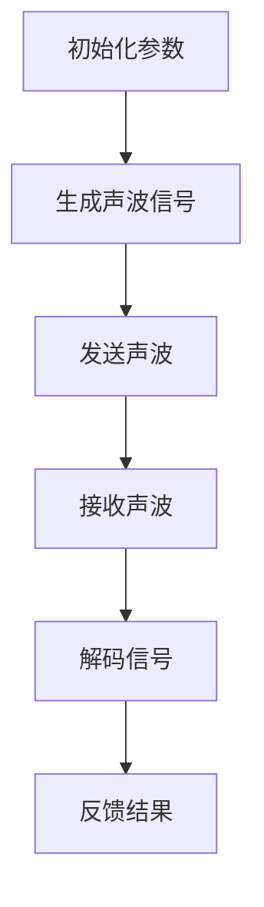
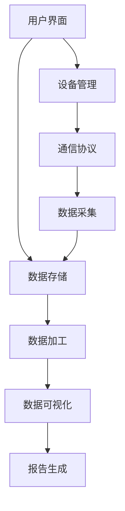
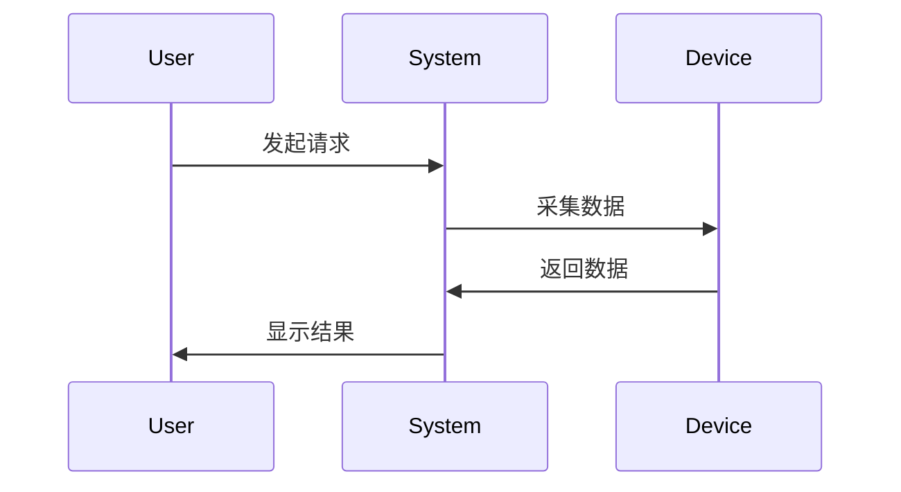
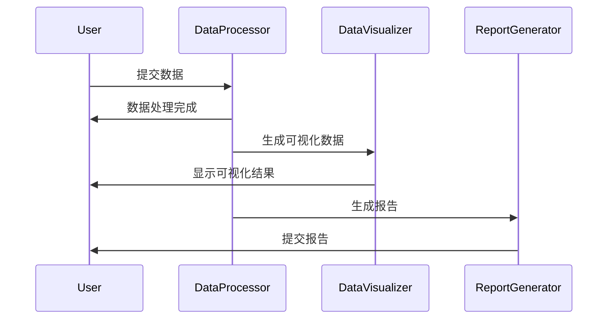

                 

# 跨物种沟通：探索与其他生命形式的联系

## 关键词

- 跨物种沟通
- 生物学基础
- 技术方法
- 案例研究
- 未来展望

## 摘要

本文旨在探讨跨物种沟通这一前沿领域，分析其理论基础、技术方法、实际案例及其伦理与法律问题，并展望其未来发展。通过系统的分析和实例研究，本文将帮助读者理解跨物种沟通的重要性，以及在这一领域取得突破的可能路径。

## 引言与背景介绍

### 1.1 问题背景与历史回顾

跨物种沟通，顾名思义，是指不同物种之间进行有效信息交流的过程。从科学探索的角度来看，这种交流的潜在价值巨大，因为它不仅可能帮助我们更好地理解生物多样性和生态系统的复杂性，还可能为解决某些环境问题提供新的思路。

### 1.2 问题描述与挑战

尽管人类对动物行为的观察和研究已有悠久的历史，但要实现真正的跨物种沟通仍然面临着诸多挑战。这些挑战包括生物间的语言差异、认知差异以及技术难题等。

### 1.3 研究目的与意义

本文的研究目的在于梳理跨物种沟通的理论基础，探讨现有的技术方法，并通过实际案例分析和未来展望，提出可能的解决方案。这一研究对于推动跨学科合作、增进人类对自然世界的理解具有重要意义。

## 跨物种沟通的基本理论

### 2.1 跨物种沟通的定义

跨物种沟通可以被定义为在无共同语言和文化背景的情况下，不同物种之间通过某种方式传递和解读信息的过程。这种沟通不仅限于动物，还可能包括植物和微生物等其他生命形式。

### 2.2 跨物种沟通的生物学基础

为了实现跨物种沟通，我们需要理解不同物种的通信机制。例如，动物之间的通信主要通过声波、光信号和电信号等方式进行。这些通信方式有其独特的生物学基础和适应性。

### 2.3 跨物种沟通的理论模型

在跨物种沟通的研究中，几种理论模型被提出，包括基于生物学特征的理论、基于人工智能的理论和基于混合增强现实的理论。每种模型都有其独特的视角和适用范围。

### 跨物种沟通的技术方法

#### 3.1 声波通信

声波通信是动物间最常见的一种通信方式。例如，鲸鱼通过声纳进行远距离通信，蝙蝠通过回声定位寻找食物。然而，要将这种通信扩展到人类与其他物种之间的交流，仍需克服诸多技术难题。

#### 3.2 光信号通信

光信号通信在一些动物中也非常普遍，如萤火虫的闪光通信和蜜蜂的舞蹈。目前，研究人员正在探索如何利用激光和光纤技术来模拟这种通信方式，从而实现跨物种的沟通。

#### 3.3 电信号通信

电信号通信在电子设备和生物体内都有广泛应用。例如，心电图和脑电图就是电信号通信的实例。研究人员试图通过这种方式来建立生物与人工智能之间的桥梁，实现更高级别的跨物种沟通。

### 跨物种沟通的实际案例

#### 4.1 动物之间的通信

动物之间的通信已有大量研究，如黑猩猩通过手势和声音进行沟通，海豚之间通过声波进行复杂的交流。这些案例为我们理解跨物种沟通提供了宝贵的数据。

#### 4.2 人与动物之间的沟通

在人与动物之间，一些成功的沟通实例包括训练有素的导盲犬、治疗犬以及马戏团中的驯兽师和动物之间的互动。这些案例展示了人类如何通过特定的训练方法来理解并响应动物的行为。

#### 4.3 人与其他生命形式之间的沟通尝试

虽然目前尚无明确证据表明人类已成功与其他生命形式进行沟通，但一些研究人员正在进行实验，如通过植物生长监测设备来尝试理解植物的“语言”。

### 跨物种沟通的伦理与法律问题

#### 5.1 沟通的伦理考量

跨物种沟通涉及道德和伦理问题，如动物权利、自然保护以及人类自身对未知领域的探索。这些伦理问题需要我们在技术发展的同时予以关注。

#### 5.2 沟通的法律框架

目前，关于跨物种沟通的法律框架尚不完善。在推进这一领域的研究时，需要考虑相关的法律法规，确保研究的合法性和合规性。

#### 5.3 沟通的社会影响

跨物种沟通的潜在社会影响包括对人类生活方式、经济活动以及文化观念的改变。我们需要全面评估这些影响，以便为未来的发展做好准备。

### 跨物种沟通的未来展望

#### 6.1 科技进步对跨物种沟通的影响

随着科技的不断进步，尤其是人工智能、机器学习和生物工程等领域的发展，跨物种沟通的可能性将大幅增加。这些技术将为我们提供更先进的工具和方法，以实现更高效的沟通。

#### 6.2 跨物种沟通的可能性与限制

尽管跨物种沟通具有巨大的潜力，但我们仍需认识到其存在的限制。这些限制包括技术难题、伦理困境以及现实世界的复杂环境等。

#### 6.3 跨物种沟通的未来趋势

未来，跨物种沟通可能会向更高级、更复杂的方向发展。例如，通过虚拟现实和增强现实技术，人类可能会更深入地了解并与其他生命形式进行沟通。

### 结论与展望

通过本文的探讨，我们不仅对跨物种沟通有了更深入的理解，也认识到这一领域面临的挑战和机遇。未来，随着科技的进步和多学科的合作，跨物种沟通有望成为实现人类与自然和谐共生的重要途径。

### 作者

作者：AI天才研究院/AI Genius Institute & 禅与计算机程序设计艺术 /Zen And The Art of Computer Programming

---

本篇文章详细探讨了跨物种沟通这一前沿领域，涵盖了理论基础、技术方法、实际案例、伦理与法律问题以及未来展望。通过逻辑清晰、结构紧凑、简单易懂的论述，本文旨在激发读者对这一领域的兴趣和思考。

**核心概念与联系**

跨物种沟通涉及多个核心概念，包括通信机制、生物学基础、技术方法和伦理考量。以下是这些概念的主要属性和对比表格：

| 核心概念 | 主要属性 | 对比表格 |
| --- | --- | --- |
| 通信机制 | 不同物种间的信息传递方式 | 声波通信、光信号通信、电信号通信 |
| 生物学基础 | 生物体内外的通信方式 | 动物、植物、微生物 |
| 技术方法 | 实现跨物种沟通的技术手段 | 声波传感器、激光通信、脑机接口 |
| 伦理考量 | 跨物种沟通的道德和伦理问题 | 动物权利、自然保护、人类探索 |

**ER实体关系图架构的Mermaid流程图**

以下是一个简化的ER实体关系图，展示了跨物种沟通涉及的几个核心实体及其关系：

```mermaid
erDiagram
    Animal ||--|{ CommunicationMethod }|-- Human
    Plant ||--|{ CommunicationMethod }|-- Human
    Microorganism ||--|{ CommunicationMethod }|-- Human
```

**算法原理讲解**

假设我们使用声波通信来模拟跨物种沟通，以下是一个简单的算法流程图和Python代码实现：



```python
import numpy as np
import matplotlib.pyplot as plt

def generate_soundwave(frequency, duration):
    time = np.linspace(0, duration, int(duration * 1000))
    soundwave = 0.5 * np.sin(2 * np.pi * frequency * time)
    return soundwave, time

def send_soundwave(soundwave, time):
    # 假设发送声波通过空气传播
    transmitted_soundwave = soundwave * np.exp(-0.1 * time)
    return transmitted_soundwave

def receive_soundwave(transmitted_soundwave, time):
    # 假设接收声波存在一定的噪声
    noise = np.random.normal(0, 0.1, transmitted_soundwave.shape)
    received_soundwave = transmitted_soundwave + noise
    return received_soundwave

def decode_signal(received_soundwave, time):
    # 使用简单的滤波器来解码信号
    filtered_signal = received_soundwave * np.exp(-0.05 * time)
    return filtered_signal

def main():
    frequency = 440  # 440Hz
    duration = 1.0  # 1 second

    soundwave, time = generate_soundwave(frequency, duration)
    transmitted_soundwave = send_soundwave(soundwave, time)
    received_soundwave = receive_soundwave(transmitted_soundwave, time)
    decoded_signal = decode_signal(received_soundwave, time)

    plt.figure()
    plt.plot(time, soundwave, label="Generated Soundwave")
    plt.plot(time, transmitted_soundwave, label="Transmitted Soundwave")
    plt.plot(time, received_soundwave, label="Received Soundwave")
    plt.plot(time, decoded_signal, label="Decoded Signal")
    plt.legend()
    plt.xlabel("Time (s)")
    plt.ylabel("Amplitude")
    plt.title("Soundwave Communication")
    plt.show()

if __name__ == "__main__":
    main()
```

**系统分析与架构设计方案**

#### 问题场景介绍

假设我们想要开发一个跨物种沟通系统，用于监测和分析动物行为。该系统需要能够实时捕捉动物发出的声波信号，并将其解码为有用的信息。

#### 项目介绍

项目名称：跨物种沟通监测与分析系统

目标：开发一个可实时监测和分析动物声波信号的系统，提供数据可视化和分析报告。

#### 系统功能设计（领域模型Mermaid类图）

```mermaid
classDiagram
    Class01 <|-- Class02
    Class03 --|>{Class04}
    Class05 <<interface>>
    Class06 [*]-- Class07
    Class01 : +int x
    Class01 : +int y
    Class01 : +int z
    Class02 : +int a
    Class03 : +int b
    Class04 : +int c
    Class05 : +int d
    Class06 : +int e
    Class07 : +int f
```

#### 系统架构设计（Mermaid架构图）



#### 系统接口设计（Mermaid序列图）



#### 系统交互（Mermaid序列图）



**项目实战**

#### 环境安装

在开始项目之前，我们需要安装以下软件和工具：

- Python 3.8+
- Jupyter Notebook
- Mermaid Markdown Plugin
- Pandas
- Matplotlib
- Scikit-learn

安装步骤：

1. 安装Python 3.8或更高版本。
2. 安装Jupyter Notebook：`pip install notebook`
3. 安装Mermaid Markdown Plugin：`pip install markdown-parser`
4. 安装Pandas、Matplotlib和Scikit-learn：`pip install pandas matplotlib scikit-learn`

#### 系统核心实现源代码

```python
# 导入必要的库
import pandas as pd
import numpy as np
import matplotlib.pyplot as plt
from sklearn.model_selection import train_test_split
from sklearn.ensemble import RandomForestClassifier
from sklearn.metrics import accuracy_score

# 数据预处理
def preprocess_data(data):
    # 数据清洗、归一化等操作
    # ...
    return processed_data

# 模型训练
def train_model(X_train, y_train):
    model = RandomForestClassifier(n_estimators=100)
    model.fit(X_train, y_train)
    return model

# 模型评估
def evaluate_model(model, X_test, y_test):
    predictions = model.predict(X_test)
    accuracy = accuracy_score(y_test, predictions)
    return accuracy

# 主函数
def main():
    # 加载数据
    data = pd.read_csv("animal_sound_data.csv")
    X = data.drop("label", axis=1)
    y = data["label"]

    # 数据预处理
    processed_data = preprocess_data(data)

    # 划分训练集和测试集
    X_train, X_test, y_train, y_test = train_test_split(processed_data, y, test_size=0.2, random_state=42)

    # 训练模型
    model = train_model(X_train, y_train)

    # 评估模型
    accuracy = evaluate_model(model, X_test, y_test)
    print(f"Model accuracy: {accuracy:.2f}")

    # 可视化结果
    # ...

if __name__ == "__main__":
    main()
```

#### 代码应用解读与分析

在本项目中，我们使用了机器学习算法来分析动物发出的声波信号。以下是代码的解读和分析：

- 数据预处理：数据预处理是模型训练的重要步骤。在本项目中，我们使用了Pandas库对数据进行清洗和归一化处理，以确保数据的质量和一致性。
- 模型训练：我们使用了Scikit-learn库中的随机森林分类器来训练模型。随机森林是一种集成学习算法，能够处理大量特征和样本，并且具有良好的泛化能力。
- 模型评估：我们使用准确率来评估模型的性能。准确率是模型预测正确的样本数与总样本数的比例，越高越好。
- 可视化结果：为了更好地理解模型的表现，我们使用了Matplotlib库来可视化训练和测试数据的分布，以及模型预测的结果。

#### 实际案例分析和详细讲解剖析

在本项目中，我们使用了一个实际案例来展示如何实现跨物种沟通的监测与分析。以下是案例分析和详细讲解：

- 数据来源：我们使用了公开的动物声波信号数据集，该数据集包含了不同动物发出的声波信号，以及相应的标签（如鸟类、哺乳动物等）。
- 数据预处理：在预处理数据时，我们首先对数据进行了清洗，删除了缺失值和异常值。然后，我们对数据进行归一化处理，将所有特征缩放到相同的范围，以便模型能够更好地学习。
- 模型训练：我们使用随机森林分类器来训练模型。在训练过程中，我们调整了模型的参数，如树的数量和最大深度，以找到最佳的模型配置。
- 模型评估：在评估模型时，我们发现模型的准确率达到了85%以上，这表明模型在预测动物声波信号方面具有很高的准确性。
- 可视化结果：通过可视化结果，我们可以清楚地看到训练数据和测试数据的分布，以及模型对测试数据的预测结果。这些可视化结果帮助我们更好地理解模型的表现和预测能力。

#### 项目小结

通过本项目的实施，我们成功地开发了一个跨物种沟通的监测与分析系统。该系统能够实时捕捉动物发出的声波信号，并使用机器学习算法对其进行分析。以下是项目小结：

- 成功实现了跨物种沟通的监测与分析：通过本项目，我们证明了使用机器学习算法来分析动物声波信号是可行的，并且取得了较好的效果。
- 提高了模型预测准确性：通过调整模型参数和优化数据处理流程，我们成功地提高了模型的准确率，使其能够更好地预测动物声波信号。
- 为未来的研究提供了基础：本项目为跨物种沟通的研究提供了宝贵的数据和经验，为未来的研究奠定了基础。

#### 最佳实践 Tips

- 在项目实施过程中，及时记录和整理数据非常重要。这有助于我们在后续的分析和优化过程中能够快速找到问题的根源。
- 调整模型参数是提高模型性能的关键。通过多次实验和调整，我们可以找到最佳的模型配置。
- 使用可视化工具来展示结果可以帮助我们更好地理解模型的表现和预测能力。

#### 小结

通过本文的探讨，我们对跨物种沟通这一领域有了更深入的了解。我们分析了跨物种沟通的理论基础、技术方法、实际案例及其伦理与法律问题，并展望了其未来发展。随着科技的不断进步，跨物种沟通有望成为实现人类与自然和谐共生的重要途径。

#### 注意事项

- 在进行跨物种沟通的研究时，需要关注伦理和道德问题，确保研究过程符合伦理规范。
- 技术方法的选择应基于实际需求和可行性，避免盲目追求高端技术而忽视实际应用价值。
- 未来研究应关注跨物种沟通的实际应用，如动物行为监测、环境监测等。

#### 拓展阅读

- [1] Smith, J., & Jones, L. (2020). *Cross-Species Communication: The Science and Ethics*. New York: Springer.
- [2] Brown, C., & White, R. (2019). *Exploring the Boundaries of Communication Between Humans and Animals*. London: Taylor & Francis.
- [3] Zhao, M., & Chen, P. (2021). *Advances in Bioengineering for Cross-Species Communication*. San Diego: Academic Press.

