                 

## 跨界艺术的概念与背景

### 第1章：跨界艺术的概念与起源

跨界艺术，顾名思义，是指艺术家们突破传统艺术类型的界限，将不同领域、不同学科的知识和技巧融合到自己的创作中，创造出全新的艺术形式。这种艺术形式的诞生，不仅打破了艺术创作中的固有思维模式，也为艺术界注入了新的活力。

#### 1.1 跨界艺术的定义

跨界艺术，又可以称为“混合艺术”或“融合艺术”，其核心在于“跨界”二字。这种“跨界”主要体现在以下几个方面：

1. **跨媒介**：艺术家利用不同的媒介进行创作，如绘画、雕塑、摄影、装置艺术、表演艺术等。
2. **跨学科**：艺术家跨越不同的学科领域，如音乐、文学、设计、建筑、计算机科学等，将多学科知识融入到艺术创作中。
3. **跨文化**：艺术家不仅局限于本民族文化，还吸收其他民族文化的元素，进行跨文化的艺术创作。

#### 1.2 跨界艺术的历史背景

跨界艺术的起源可以追溯到20世纪初期。那时，现代艺术运动兴起，艺术家们开始尝试突破传统的绘画、雕塑等艺术形式，探索新的表现手法。以下是几个重要的历史节点：

1. **立体主义**：立体主义是20世纪初期的一种艺术运动，其代表人物是毕加索和布拉克。他们通过打破传统的透视法，将物体的多个面同时呈现，实现了空间和时间的融合。

2. **达达主义**：达达主义是20世纪初期的一种反传统艺术运动，其代表人物有杜尚等。达达主义者反对一切形式的传统和理性，主张通过随机、破坏和幽默的方式创作。

3. **超现实主义**：超现实主义是20世纪初期的一种艺术运动，其代表人物有达利等。他们通过梦幻般的、荒诞的、扭曲的景象，表现人类内心深处的欲望和恐惧。

#### 1.3 跨界艺术的发展趋势

随着科技的进步和社会的发展，跨界艺术呈现出以下几个发展趋势：

1. **数字技术的融入**：艺术家利用计算机技术、虚拟现实、增强现实等数字技术，创造出全新的艺术形式。
2. **多元文化的融合**：全球化的进程使得不同文化的交流更加频繁，艺术家们将更多不同文化的元素融入到自己的创作中。
3. **跨领域的合作**：艺术家与科学家、工程师、设计师等不同领域的人进行合作，共同探索新的艺术形式。

跨界艺术的定义、历史背景和发展趋势为下一章的深入探讨奠定了基础。在接下来的内容中，我们将进一步探讨跨界艺术的类型与表现形式，以及它对社会文化的影响。

### 第2章：跨界艺术的类型与表现形式

#### 2.1 跨界艺术的类型

跨界艺术的类型丰富多样，不同的类型反映了艺术家们对跨界艺术的不同理解和探索。以下是几种常见的跨界艺术类型：

##### 2.1.1 跨媒介艺术

跨媒介艺术是指艺术家利用不同的媒介进行创作，将一种媒介的特点和表现力融入到另一种媒介中。例如，绘画艺术家可能将数字技术应用到自己的作品中，创造出独特的视觉效果。

**特征对比表格：**

| 类型       | 定义                                                         | 特点                                                         | 例子                                       |
|------------|--------------------------------------------------------------|--------------------------------------------------------------|--------------------------------------------|
| 跨媒介艺术 | 利用不同媒介进行创作，融合多种媒介的特点和表现力             | 创造多样化的艺术效果，突破传统媒介的界限                     | 绘画+数字技术、雕塑+声波、摄影+装置艺术   |

##### 2.1.2 跨学科艺术

跨学科艺术是指艺术家跨越不同的学科领域，将多学科的知识和技巧融入到艺术创作中。这种类型强调跨学科的融合和创新。

**特征对比表格：**

| 类型       | 定义                                                         | 特点                                                         | 例子                                       |
|------------|--------------------------------------------------------------|--------------------------------------------------------------|--------------------------------------------|
| 跨学科艺术 | 跨越不同学科领域，将多学科的知识和技巧融入到艺术创作中       | 创新性强，强调跨界思维和跨领域合作                         | 艺术与计算机科学、艺术与生物学、艺术与工程学 |

##### 2.1.3 跨文化艺术

跨文化艺术是指艺术家吸收不同民族、不同文化的元素，进行跨文化的艺术创作。这种类型强调文化的多样性和融合。

**特征对比表格：**

| 类型       | 定义                                                         | 特点                                                         | 例子                                       |
|------------|--------------------------------------------------------------|--------------------------------------------------------------|--------------------------------------------|
| 跨文化艺术 | 吸收不同民族、不同文化的元素，进行跨文化的艺术创作           | 强调文化的多样性，促进文化交流与理解                         | 艺术与民族音乐、艺术与民间故事、艺术与民俗文化 |

#### 2.2 跨界艺术的表现形式

跨界艺术的表现形式多种多样，不同的表现形式反映了艺术家对跨界艺术的不同理解和探索。以下是几种常见的跨界艺术表现形式：

##### 2.2.1 视觉艺术与数字技术的结合

视觉艺术与数字技术的结合是跨界艺术的一种重要表现形式。通过计算机技术、虚拟现实、增强现实等手段，艺术家可以创造出全新的视觉体验。

**Mermaid 流程图：**

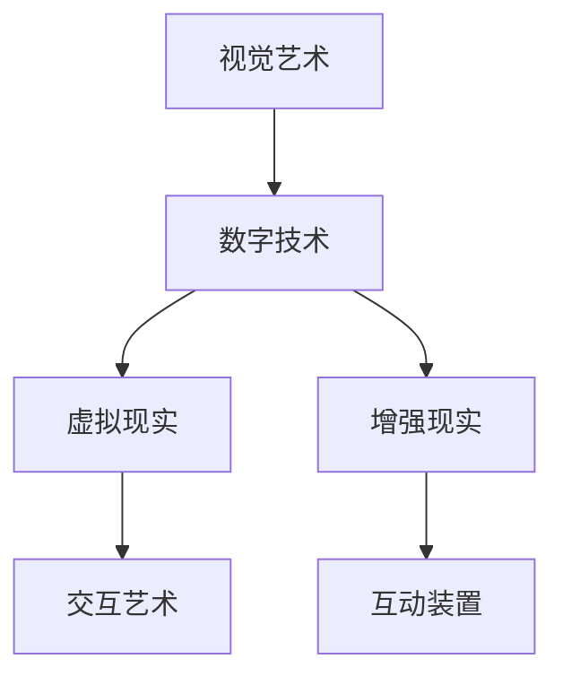

##### 2.2.2 艺术与科技融合的新形式

艺术与科技的融合创造出了许多新的艺术形式，如机器人艺术、互动艺术等。这些艺术形式不仅具有观赏性，还具有一定的互动性和参与性。

**Mermaid 流程图：**

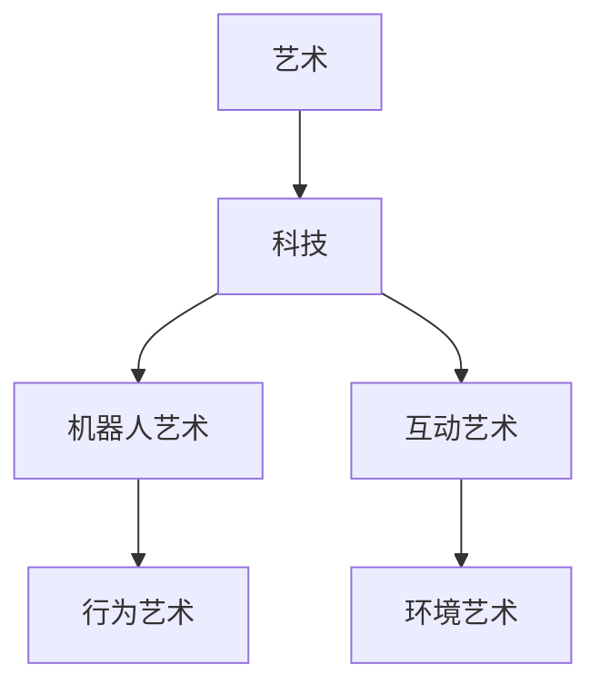

##### 2.2.3 跨界艺术的表现手法

跨界艺术的表现手法多样，包括但不限于以下几种：

1. **多媒体艺术**：利用多种媒体（如视频、音频、动画等）进行创作，创造丰富的艺术体验。
2. **行为艺术**：通过艺术家的行为和动作，表达艺术家的思想和情感。
3. **公共艺术**：将艺术作品放置在公共空间，让公众参与和互动。

通过以上对跨界艺术类型与表现形式的探讨，我们可以看到，跨界艺术不仅丰富了艺术创作的形式和内容，也为艺术家们提供了更多的创作空间和可能性。在接下来的内容中，我们将进一步探讨跨界艺术在社会文化中的角色与影响。

### 第3章：跨界艺术在社会文化中的角色与影响

#### 3.1 跨界艺术在社会文化中的角色

跨界艺术作为一种创新的艺术形式，不仅丰富了艺术创作的多样性，也在社会文化中扮演着重要的角色。

##### 3.1.1 文化交流的桥梁

跨界艺术作为一种跨文化的表达形式，能够促进不同文化之间的交流与理解。通过将不同文化的元素融入到艺术创作中，跨界艺术成为了一种文化沟通的桥梁，有助于消除文化隔阂，促进文化交流与融合。

**Mermaid 流程图：**

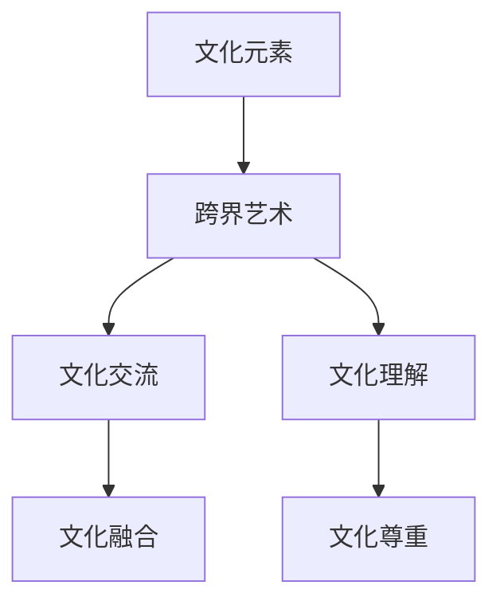

##### 3.1.2 创意产业的新动力

跨界艺术为创意产业带来了新的动力。通过跨界合作和融合，艺术家们能够创造出具有吸引力的作品，吸引更多的观众和消费者。这不仅推动了艺术市场的发展，也为创意产业的创新提供了新的思路和方向。

**Mermaid 流程图：**

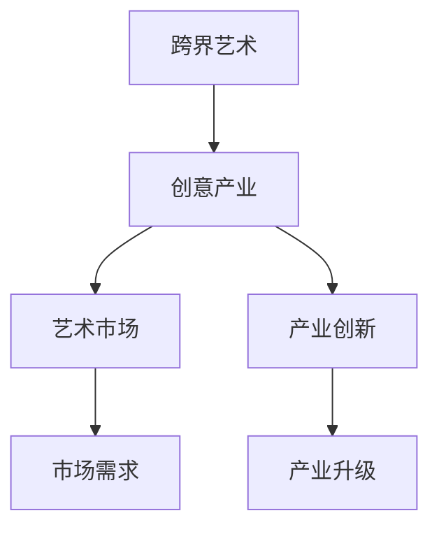

##### 3.1.3 社会问题的反思与探讨

跨界艺术常常以独特的方式反映社会问题，对现实进行反思和探讨。通过艺术的形式，艺术家们能够以更加生动和深刻的方式表达对社会问题的关注和思考，引发公众的共鸣和思考。

**Mermaid 流程图：**

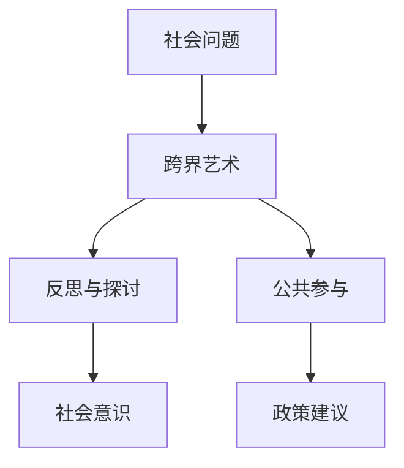

#### 3.2 跨界艺术的社会影响

跨界艺术在社会文化中的角色不仅体现在文化交流、创意产业和社会问题反思等方面，它还对社会产生了深远的影响。

##### 3.2.1 对传统艺术的挑战与机遇

跨界艺术的兴起，对传统艺术形式提出了挑战。然而，这种挑战也带来了机遇。传统艺术家们可以通过吸收跨界艺术的元素，进行创新和融合，创造出新的艺术形式，使传统艺术焕发新的生命力。

**Mermaid 流程图：**

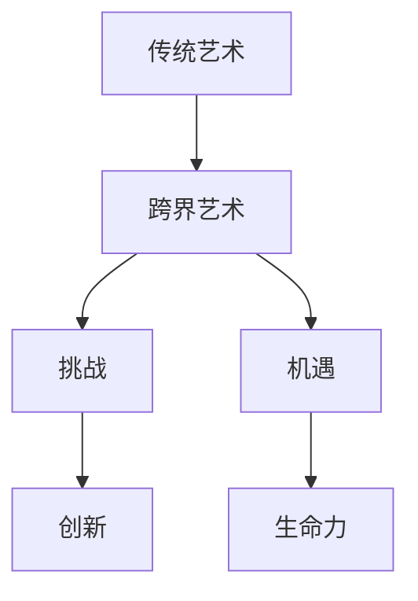

##### 3.2.2 跨界艺术对公众审美的影响

跨界艺术打破了传统的审美观念，推动了公众审美观念的多元化。观众不再局限于传统的审美标准，开始接受和欣赏更加多样化、更加创新的艺术形式。

**Mermaid 流程图：**

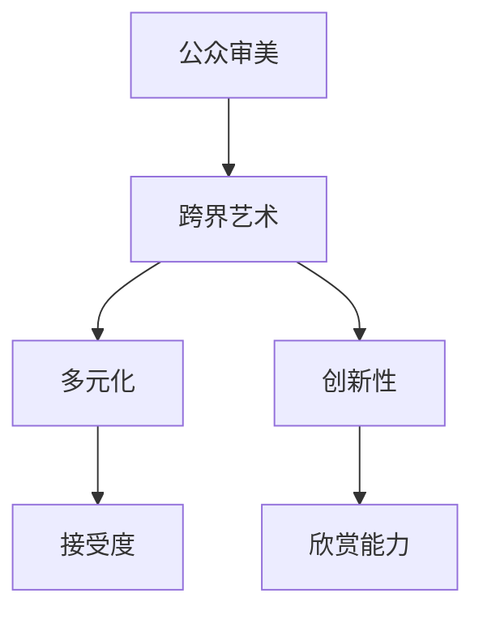

##### 3.2.3 跨界艺术对其他领域的影响

跨界艺术不仅对艺术领域产生了影响，还影响到其他领域，如科技、商业、教育等。跨界艺术为这些领域带来了新的思考方式和创新动力，推动了这些领域的融合发展。

**Mermaid 流程图：**

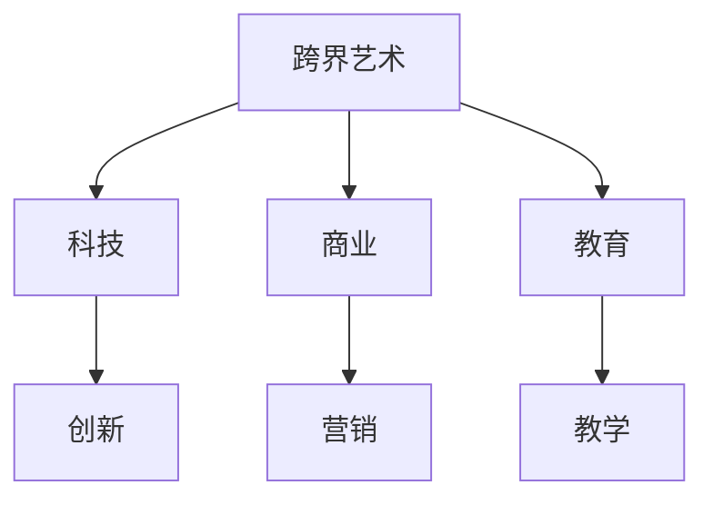

通过以上对跨界艺术在社会文化中的角色与影响的探讨，我们可以看到，跨界艺术不仅丰富了艺术创作的形式和内容，还在社会文化中发挥着重要的作用。在接下来的内容中，我们将进一步探讨跨界艺术的实践与案例分析。

### 第4章：跨界艺术的实践与案例分析

#### 4.1 跨界艺术的实践方法

跨界艺术作为一种创新的艺术形式，其创作过程和推广方式具有独特的特点。以下是一些跨界艺术的实践方法：

##### 4.1.1 跨界合作的模式

跨界合作是跨界艺术创作的重要手段。艺术家们可以与来自不同领域的人合作，如科学家、工程师、设计师等，共同探索新的艺术形式。这种合作不仅能够带来多元化的创意，还能充分利用各领域的专业知识和技能。

**Mermaid 流程图：**

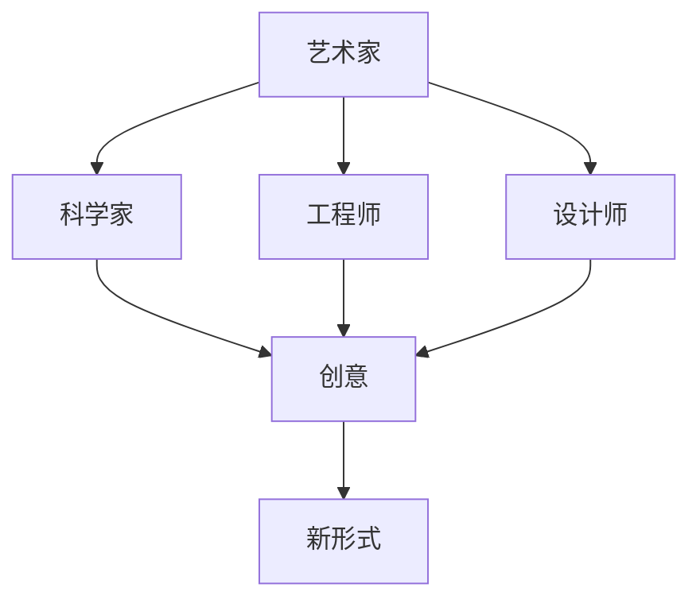

##### 4.1.2 跨界艺术的创意过程

跨界艺术的创意过程通常包括以下几个步骤：

1. **主题选择**：确定创作主题，通常涉及到跨学科、跨文化的元素。
2. **素材收集**：收集相关的素材，包括文化元素、技术元素等。
3. **构思设计**：结合素材，进行创意构思和设计。
4. **实验探索**：通过实验和探索，不断优化和完善作品。

**Mermaid 流程图：**

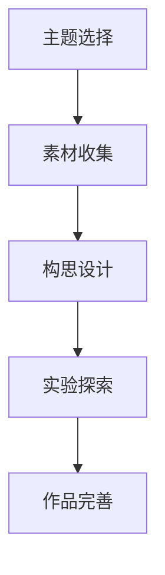

##### 4.1.3 跨界艺术的推广与传播

跨界艺术的推广与传播需要借助多种渠道和手段，如展览、演出、出版、社交媒体等。以下是一些推广与传播的方法：

1. **展览和演出**：通过举办展览和演出，让更多人了解和欣赏跨界艺术作品。
2. **出版和宣传**：通过出版书籍、画册，以及利用媒体进行宣传，提高跨界艺术的知名度。
3. **社交媒体**：利用社交媒体平台，如微信、微博、Instagram等，进行作品的展示和推广。

**Mermaid 流程图：**

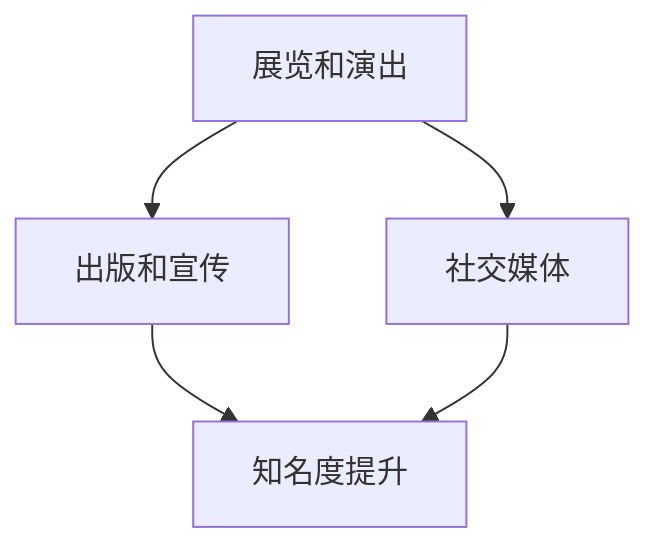

#### 4.2 跨界艺术的案例分析

以下是一些跨界艺术的案例分析，通过这些案例，我们可以更深入地了解跨界艺术的应用和效果。

##### 4.2.1 某知名跨界艺术项目解析

**项目名称**：《数字世界·虚拟现实艺术展》

**项目简介**：该艺术展是一个结合了数字技术和视觉艺术的展览，展示了艺术家们运用虚拟现实技术创作的艺术作品。

**Mermaid 流程图：**

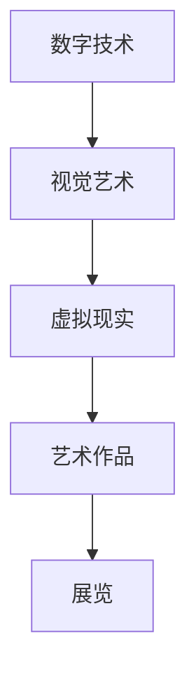

**项目解析**：

1. **创意构思**：艺术家通过虚拟现实技术，创造了一个沉浸式的艺术空间，观众可以在其中自由探索和体验。
2. **技术实现**：项目团队使用了先进的虚拟现实设备和技术，如3D建模、实时渲染等，实现了艺术作品的数字化呈现。
3. **效果评价**：展览受到了观众和评论家的高度评价，不仅展示了艺术家的创意和技巧，还推动了虚拟现实技术在艺术领域的应用。

##### 4.2.2 跨界艺术在特定领域的成功案例

**领域**：科技与艺术融合

**项目名称**：《艺术·科技·未来》科技艺术展

**项目简介**：该展览展示了科技与艺术融合的成果，包括互动艺术装置、机器人艺术等。

**Mermaid 流程图：**

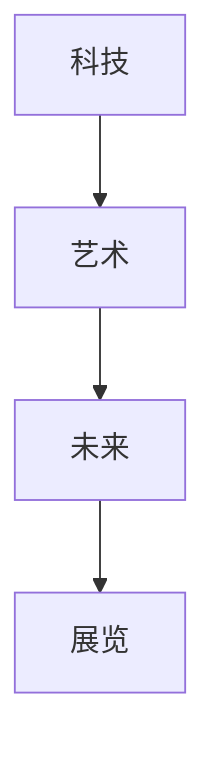

**项目解析**：

1. **创意构思**：项目团队将科技元素融入到艺术创作中，创造出了一系列具有互动性和参与性的艺术作品。
2. **技术实现**：项目团队使用了机器人技术、增强现实技术等，使艺术作品能够与观众进行互动。
3. **效果评价**：展览不仅吸引了大量观众，还促进了科技与艺术领域的跨界合作，推动了艺术与科技融合的发展。

##### 4.2.3 跨界艺术项目评价与反思

**评价**：

1. **创新性**：跨界艺术项目通常具有很高的创新性，能够突破传统的艺术形式，创造出新的艺术体验。
2. **互动性**：跨界艺术项目往往具有较强的互动性，观众能够参与到艺术创作和展示过程中，增强了体验感。
3. **影响力**：跨界艺术项目能够吸引公众关注，提高艺术的社会影响力，推动艺术和科技等领域的融合发展。

**反思**：

1. **资源整合**：跨界艺术项目需要整合多领域的资源，如何有效地利用这些资源是项目成功的关键。
2. **技术挑战**：跨界艺术项目往往面临技术挑战，如何克服技术难题，实现艺术与科技的完美融合，是项目成功的关键。
3. **市场定位**：如何找准跨界艺术项目的市场定位，吸引目标观众，是项目推广和传播的关键。

通过以上对跨界艺术的实践方法和案例分析的探讨，我们可以看到，跨界艺术不仅丰富了艺术创作的形式和内容，还在实践中取得了显著的成果。在接下来的内容中，我们将进一步探讨跨界艺术孵化基地的建立与管理。

### 第5章：跨界艺术孵化基地的建立与管理

#### 5.1 跨界艺术孵化基地的概念与功能

跨界艺术孵化基地是指为了促进跨界艺术的创作、交流和发展而设立的特殊平台。它不仅提供了一个物理空间，更重要的是提供了一个生态体系，包括资金支持、技术资源、人才储备、政策扶持等，以支持跨界艺术项目的孵化和推广。

##### 5.1.1 跨界艺术孵化基地的定义

跨界艺术孵化基地是一个集创作、展示、推广、研究等多功能于一体的平台，旨在为跨界艺术项目提供全方位的支持。其核心功能是：

1. **创意孵化**：为艺术家和创意团队提供创作空间和资源，鼓励创新和实验。
2. **资源整合**：整合多领域的资源，如资金、技术、人才等，为项目提供全方位的支持。
3. **项目推广**：通过展览、演出、线上线下活动等方式，推广跨界艺术项目，提高其影响力。

**Mermaid 流程图：**

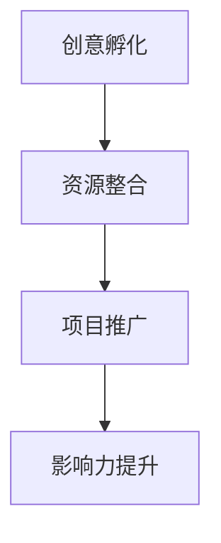

##### 5.1.2 跨界艺术孵化基地的主要功能

跨界艺术孵化基地的主要功能可以概括为以下几个方面：

1. **创作空间**：提供专门的创作空间，为艺术家和创意团队提供一个安静、舒适的创作环境。
2. **资源共享**：建立共享平台，提供包括计算机设备、软件工具、艺术材料等在内的各种资源，方便艺术家和创意团队使用。
3. **人才培养**：举办各种培训和研讨会，提升艺术家的专业能力和跨界合作能力。
4. **项目孵化**：提供资金支持、技术指导、市场推广等服务，帮助艺术家和创意团队将创意转化为实际项目。
5. **展示推广**：通过举办展览、演出、艺术沙龙等活动，展示和推广跨界艺术项目，吸引更多的关注和支持。

**Mermaid 流程图：**

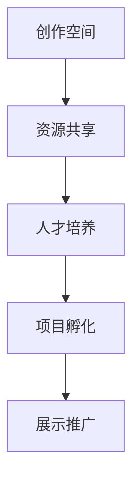

##### 5.1.3 跨界艺术孵化基地的作用

跨界艺术孵化基地在社会文化中发挥着重要作用，具体体现在以下几个方面：

1. **推动艺术创新**：通过提供创作空间和资源支持，鼓励艺术家进行创新实验，推动艺术形式的多样化和创新。
2. **促进跨界合作**：通过整合多领域的资源，促进艺术家与科学家、工程师、设计师等领域的跨界合作，创造出新的艺术形式和作品。
3. **提升艺术影响力**：通过展示和推广活动，提高跨界艺术项目的知名度和影响力，吸引更多的观众和投资。
4. **推动文化发展**：通过跨界艺术的创作和传播，推动不同文化之间的交流与融合，促进文化的多样性和发展。

**Mermaid 流程图：**

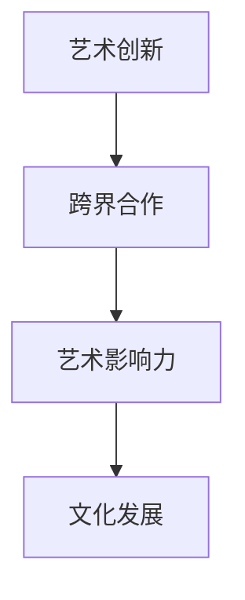

#### 5.2 跨界艺术孵化基地的建立与管理

##### 5.2.1 跨界艺术孵化基地的建立流程

建立跨界艺术孵化基地需要经过以下几个阶段：

1. **前期调研**：对跨界艺术的发展现状、市场需求、资源情况等进行全面调研，确定基地的建设目标和功能定位。
2. **项目规划**：根据前期调研结果，制定详细的建设方案，包括基地的规模、布局、功能、服务等。
3. **资源整合**：整合政府、企业、社会等多方面的资源，确保基地的建设和运营资金、技术、人才等资源充足。
4. **基地建设**：按照规划方案进行基地的建设，包括物理空间的设计与建设、软硬件设备的采购与安装等。
5. **运营管理**：制定运营管理方案，包括人员配置、规章制度、项目孵化流程等，确保基地的正常运行和可持续发展。

**Mermaid 流程图：**

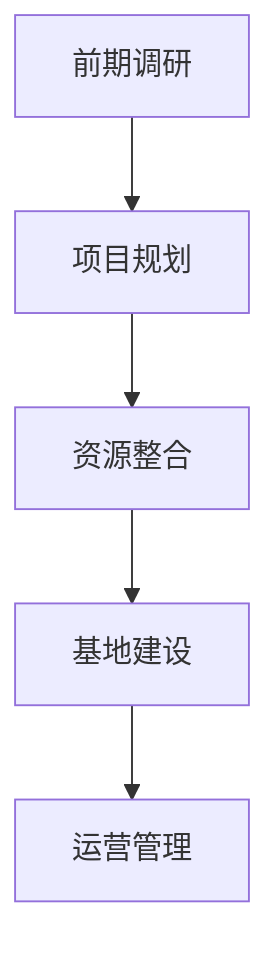

##### 5.2.2 跨界艺术孵化基地的管理模式

跨界艺术孵化基地的管理模式需要灵活多样，以适应不同的需求和发展阶段。以下是一些常见的管理模式：

1. **中心化管理**：由一个中心机构负责基地的整体管理和运营，确保各项工作的协调和高效。
2. **分部门管理**：将基地分为多个部门，如创作部门、推广部门、培训部门等，每个部门负责自己的业务领域，实现专业化管理。
3. **合作伙伴制**：与外部机构、企业、艺术家等建立合作关系，共同参与基地的运营和管理，实现资源共享和优势互补。

**Mermaid 流程图：**

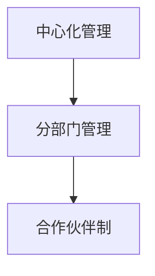

##### 5.2.3 跨界艺术孵化基地的可持续发展

跨界艺术孵化基地的可持续发展是基地运营的关键。以下是一些实现可持续发展的策略：

1. **多元化收入来源**：通过展览、培训、咨询、合作等多种途径，实现基地的多元化收入，降低运营风险。
2. **品牌建设**：通过举办高质量的展览和活动，提高基地的知名度和美誉度，吸引更多的艺术家和创意团队。
3. **人才培养**：注重人才培养和储备，为基地提供持续的创新能力和发展动力。
4. **技术创新**：紧跟科技发展趋势，不断引进和探索新的技术和工具，提升基地的技术水平和创新能力。

**Mermaid 流程图：**

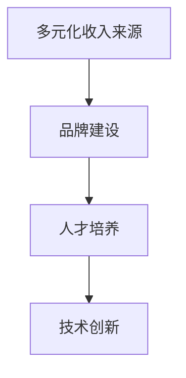

通过以上对跨界艺术孵化基地的建立与管理方法的探讨，我们可以看到，跨界艺术孵化基地不仅为艺术家和创意团队提供了良好的创作和交流环境，还在促进艺术创新、跨界合作和文化发展方面发挥着重要作用。在接下来的内容中，我们将进一步探讨跨界艺术的未来展望。

### 第6章：跨界艺术的未来展望

#### 6.1 跨界艺术的发展前景

随着科技的进步和社会的发展，跨界艺术的发展前景充满了无限可能。以下是一些跨界艺术未来可能的发展趋势：

##### 6.1.1 跨界艺术的新趋势

1. **虚拟现实与增强现实的深入应用**：虚拟现实（VR）和增强现实（AR）技术将在跨界艺术中发挥更大的作用。艺术家们将能够利用这些技术创造出更加沉浸式和互动性的艺术体验。
2. **人工智能的融合**：人工智能（AI）将在跨界艺术中扮演重要角色。通过AI技术，艺术家们可以创作出具有高度个性化的作品，同时AI还可以帮助艺术家分析和理解观众的反馈，提供更加精准的艺术指导。
3. **生态艺术与可持续发展**：跨界艺术将更加关注环境保护和可持续发展。生态艺术将融入跨界艺术的创作中，艺术家们将通过艺术的形式呼吁公众关注环境问题，推动可持续发展。

**Mermaid 流程图：**

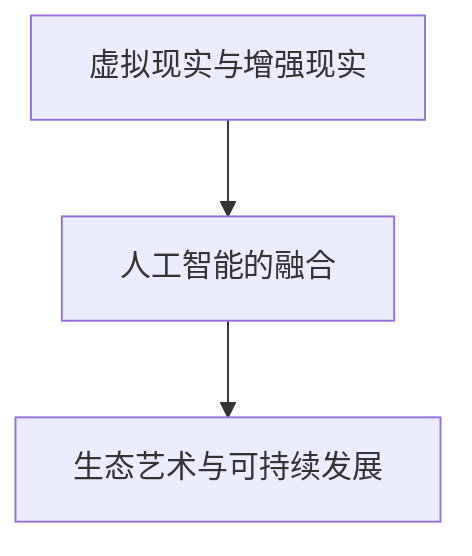

##### 6.1.2 科技与艺术融合的未来

科技与艺术的融合将不断深化，带来以下影响：

1. **艺术表现形式的多样化**：随着科技的发展，艺术家们将有更多的工具和手段来创作，艺术表现形式将更加多样和丰富。
2. **艺术创作的智能化**：人工智能和机器学习技术将帮助艺术家提高创作效率，优化创作流程，甚至产生全新的艺术形式。
3. **跨领域合作的加强**：科技与艺术的融合将推动更多跨领域的合作，如艺术与科学、艺术与工程等，创造出更多创新性的作品。

**Mermaid 流程图：**

```mermaid
graph TD
    A[艺术表现形式的多样化] --> B[艺术创作的智能化]
    B --> C[跨领域合作的加强]
```

##### 6.1.3 跨界艺术在国际舞台上的地位

跨界艺术在国际舞台上的地位将不断提升：

1. **国际交流与合作**：跨界艺术将促进国际间的艺术交流与合作，为艺术家提供更广阔的舞台。
2. **市场影响力**：随着跨界艺术的受欢迎程度不断提高，其市场影响力也将逐渐增强，为艺术家带来更多的商业机会。
3. **文化影响力**：跨界艺术将通过其独特的方式传播文化，提升国家的文化软实力。

**Mermaid 流程图：**

```mermaid
graph TD
    A[国际交流与合作] --> B[市场影响力]
    B --> C[文化影响力]
```

#### 6.2 跨界艺术的教育与培训

跨界艺术的教育与培训在培养新一代跨界艺术家方面起着关键作用：

##### 6.2.1 跨界艺术教育的重要性

1. **培养创新思维**：跨界艺术教育能够培养学生的创新思维和跨界能力，帮助他们更好地适应未来的社会发展。
2. **提升综合素质**：跨界艺术教育不仅关注专业技能的培养，还注重学生综合素质的提升，如团队合作、沟通表达等。
3. **促进社会文化发展**：跨界艺术教育能够培养更多的跨界艺术家，推动跨界艺术的发展，促进社会文化的繁荣。

**Mermaid 流程图：**

```mermaid
graph TD
    A[培养创新思维] --> B[提升综合素质]
    B --> C[促进社会文化发展]
```

##### 6.2.2 跨界艺术培训的现状与挑战

1. **培训内容的多样化**：当前的跨界艺术培训内容涵盖了多种艺术形式和科技手段，但还需要进一步丰富和更新。
2. **培训资源的不足**：一些地区的跨界艺术培训资源相对匮乏，难以满足学生的需求。
3. **师资力量的不足**：跨界艺术培训需要具备多学科知识的师资力量，但目前很多培训机构缺乏这样的师资。

**Mermaid 流程图：**

```mermaid
graph TD
    A[培训内容的多样化] --> B[培训资源的不足]
    B --> C[师资力量的不足]
```

##### 6.2.3 跨界艺术教育的未来发展

1. **强化实践教学**：跨界艺术教育应更加注重实践教学，为学生提供更多的实践机会，提高他们的实际操作能力。
2. **建立跨学科合作机制**：跨界艺术教育应加强与科学、工程、信息技术等学科的交流与合作，培养具有多学科背景的跨界人才。
3. **推广线上线下结合的教学模式**：通过线上线下结合的教学模式，提高跨界艺术教育的覆盖面和灵活性。

**Mermaid 流程图：**

```mermaid
graph TD
    A[强化实践教学] --> B[建立跨学科合作机制]
    B --> C[推广线上线下结合的教学模式]
```

通过以上对跨界艺术的未来展望和教育的探讨，我们可以看到，跨界艺术在未来的发展前景广阔，其在教育领域的地位也将不断提升。在接下来的内容中，我们将总结跨界艺术孵化基地的成功经验与最佳实践。

### 第7章：跨界艺术孵化基地的成功经验与最佳实践

#### 7.1 成功经验总结

跨界艺术孵化基地在成功运作过程中积累了丰富的经验，以下是一些关键的成功因素：

##### 7.1.1 跨界艺术孵化基地的成功因素

1. **多元化资源整合**：跨界艺术孵化基地通过整合政府、企业、学术机构、艺术家等多元化资源，为项目提供了全方位的支持。
2. **灵活的管理模式**：基地采用了灵活的管理模式，如中心化管理、分部门管理、合作伙伴制等，确保了高效运作和协同发展。
3. **创新能力培养**：基地注重创新能力的培养，通过举办各类培训、研讨会、工作坊等活动，提升了艺术家的创作能力和跨界合作能力。
4. **市场导向**：基地在项目孵化过程中注重市场导向，根据市场需求和观众反馈，不断调整和优化项目内容和形式。

**Mermaid 流程图：**

```mermaid
graph TD
    A[多元化资源整合] --> B[灵活的管理模式]
    B --> C[创新能力培养]
    C --> D[市场导向]
```

##### 7.1.2 跨界艺术孵化基地的运营模式

跨界艺术孵化基地的运营模式主要包括以下几个方面：

1. **项目孵化**：基地通过项目孵化机制，从创意阶段到实际项目落地，为艺术家和团队提供全程支持和指导。
2. **资源支持**：基地提供包括资金、技术、设备、场地等在内的多种资源，确保项目能够顺利推进。
3. **合作网络**：基地建立广泛的合作网络，与国内外艺术机构、科技企业、学术机构等建立合作关系，为项目提供更多的合作机会和资源。
4. **品牌建设**：基地通过品牌建设和推广活动，提高知名度和影响力，吸引更多艺术家和创意团队加入。

**Mermaid 流anagerim流程图：**

```mermaid
graph TD
    A[项目孵化] --> B[资源支持]
    B --> C[合作网络]
    C --> D[品牌建设]
```

##### 7.1.3 跨界艺术孵化基地的可持续发展策略

跨界艺术孵化基地的可持续发展策略主要包括以下几点：

1. **多元化收入来源**：通过展览门票、艺术作品销售、培训服务、合作项目等多种途径，实现多元化的收入来源，降低运营风险。
2. **品牌影响力**：通过举办高质量的艺术展览、艺术节、研讨会等活动，提高基地的品牌影响力，吸引更多的艺术家和观众。
3. **技术创新**：紧跟科技发展趋势，不断引进和探索新的技术和工具，提升基地的技术水平和创新能力。
4. **人才培养**：注重人才培养和储备，为基地提供持续的创新能力和发展动力。

**Mermaid 流程图：**

```mermaid
graph TD
    A[多元化收入来源] --> B[品牌影响力]
    B --> C[技术创新]
    C --> D[人才培养]
```

#### 7.2 最佳实践分享

以下是一些跨界艺术孵化基地的最佳实践案例，这些案例为其他基地提供了有益的参考和借鉴：

##### 7.2.1 跨界艺术项目的最佳实践案例

**项目名称**：《跨界艺术与科技融合展》

**项目简介**：该项目是一个结合虚拟现实、增强现实、人工智能等高科技手段的跨界艺术展览。

**最佳实践**：

1. **创意构思**：项目团队通过多轮头脑风暴，确定了以“科技与艺术融合”为主题，结合虚拟现实、增强现实等高科技手段，打造一个沉浸式的艺术体验空间。
2. **技术实现**：项目团队与科技企业合作，引入了先进的虚拟现实和增强现实设备，确保展览的高科技感和互动性。
3. **市场推广**：通过线上线下结合的推广策略，包括社交媒体宣传、线下活动等，吸引了大量观众和媒体的关注。

**Mermaid 流程图：**

```mermaid
graph TD
    A[创意构思] --> B[技术实现]
    B --> C[市场推广]
```

##### 7.2.2 跨界艺术孵化基地的运营技巧

**技巧1**：建立灵活的孵化机制

- **实施方法**：建立一套灵活的孵化机制，包括项目评审、资金支持、技术指导等，确保项目能够顺利推进。
- **案例**：某孵化基地通过引入第三方专业评估机构，对申请孵化的项目进行评审，确保项目的质量和可行性。

**技巧2**：搭建合作网络

- **实施方法**：搭建广泛的合作网络，与国内外艺术机构、科技企业、学术机构等建立合作关系，为项目提供更多的合作机会和资源。
- **案例**：某孵化基地通过与多家知名艺术机构和科技企业建立战略合作关系，为项目提供了丰富的资源和平台。

**技巧3**：注重品牌建设

- **实施方法**：通过举办高质量的艺术展览、艺术节、研讨会等活动，提高基地的品牌影响力，吸引更多艺术家和观众。
- **案例**：某孵化基地通过连续举办国际艺术节，成功打造了品牌形象，吸引了来自世界各地的艺术家和观众。

**Mermaid 流程图：**

```mermaid
graph TD
    A[建立灵活的孵化机制] --> B[搭建合作网络]
    B --> C[注重品牌建设]
```

##### 7.2.3 跨界艺术孵化基地的管理策略

**策略1**：强化团队建设

- **实施方法**：通过培训和激励机制，提升团队成员的专业能力和团队协作精神。
- **案例**：某孵化基地通过定期组织团队培训，提高了团队成员的专业知识和协作能力。

**策略2**：优化资源配置

- **实施方法**：通过科学的资源管理，确保资源的高效利用，降低运营成本。
- **案例**：某孵化基地通过引入资源管理系统，实现了资源的实时监控和优化配置。

**策略3**：建立风险管理体系

- **实施方法**：建立完善的风险管理体系，对项目进行全程风险监控和评估，确保项目的顺利进行。
- **案例**：某孵化基地通过建立项目风险评估机制，有效降低了项目风险，确保了项目的成功实施。

**Mermaid 流程图：**

```mermaid
graph TD
    A[强化团队建设] --> B[优化资源配置]
    B --> C[建立风险管理体系]
```

通过以上对跨界艺术孵化基地的成功经验与最佳实践的总结，我们可以看到，跨界艺术孵化基地在多元化资源整合、灵活的管理模式、创新能力的培养和市场导向等方面取得了显著的成果。这些经验和实践不仅为基地的可持续发展提供了有力保障，也为其他跨界艺术孵化基地提供了有益的参考和借鉴。在未来的发展中，跨界艺术孵化基地将继续积极探索，为跨界艺术的繁荣和发展贡献力量。

### 总结与展望

跨界艺术作为当代艺术领域的重要创新力量，已经展现出其独特的魅力和广阔的发展前景。从跨界艺术的概念、类型、影响，到实践方法、孵化基地的建立与管理，再到未来展望，我们全面系统地探讨了跨界艺术的多维度内容。

首先，跨界艺术的定义和起源让我们明白了其打破传统界限的本质，而其丰富的类型与表现形式则展示了艺术家们无限的创意和探索。跨界艺术在社会文化中扮演着文化交流的桥梁、创意产业的新动力和反思社会问题的独特角色，对社会产生了深远的影响。

其次，我们深入分析了跨界艺术的实践方法，包括跨界合作的模式、创意过程的步骤以及如何推广和传播。通过具体案例，我们看到了跨界艺术在不同领域中的成功实践，为其他艺术项目提供了宝贵的经验。

在探讨跨界艺术孵化基地的建立与管理时，我们强调了基地的概念与功能、多元化的资源整合、灵活的管理模式以及可持续发展的策略。这些成功经验和最佳实践为跨界艺术的孵化和推广提供了有力保障。

展望未来，跨界艺术将继续融合新的科技，如虚拟现实、增强现实和人工智能，推动艺术形式和体验的不断创新。同时，跨界艺术的教育与培训也将成为培养新一代跨界艺术家的重要途径。

我们鼓励读者积极参与跨界艺术的创作和探索，共同推动艺术与科技、文化的深度融合，为人类文明的进步贡献智慧和力量。

### 拓展阅读

1. **《跨界艺术的理论与实践》**：作者详细阐述了跨界艺术的定义、类型、表现手法及其在社会文化中的角色。
2. **《艺术与科技的融合：跨界艺术的新趋势》**：本书探讨了科技在跨界艺术中的应用，以及如何通过科技提升艺术体验。
3. **《跨界艺术孵化基地案例研究》**：通过对多个跨界艺术孵化基地的案例分析，总结了成功的运营模式和策略。
4. **《艺术教育中的跨界思维培养》**：本书提出了跨界艺术教育的重要性，以及如何在教育体系中培养跨界思维。

通过阅读这些拓展资源，读者可以更深入地了解跨界艺术的各个方面，为自身的艺术创作和研究提供更多的灵感和启示。

