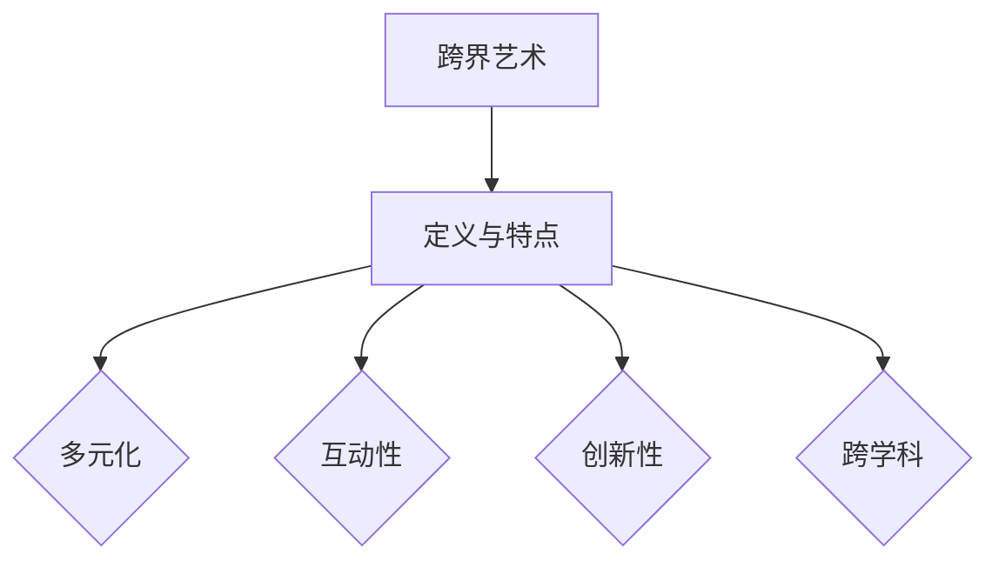
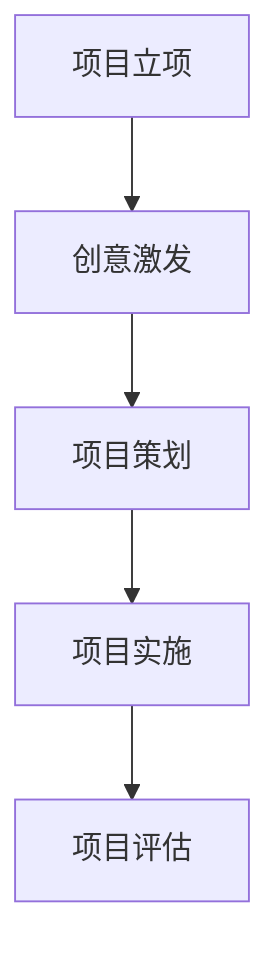

                 

###  引言

---

**文章标题**：跨界艺术孵化计划：打破传统界限的创意支持项目

**关键词**：跨界艺术、创意支持、孵化计划、界限打破、创意创新

**摘要**：
本文旨在探讨跨界艺术孵化计划，一种旨在打破传统艺术与科技、商业等领域的界限，通过创新性的支持项目推动艺术发展的新型模式。本文首先介绍了跨界艺术的定义与特点，随后详细分析了跨界艺术孵化计划的方法与流程，并通过具体案例展示了其应用效果。最后，对跨界艺术孵化计划的未来展望与挑战进行了深入讨论。

---

### 第一部分：引言

#### 1.1 问题背景

##### 1.1.1 传统艺术的局限性

传统艺术在经历了数千年的发展后，逐渐形成了自己独特的风格和表现形式。然而，随着科技的飞速发展和全球化进程的加快，传统艺术的形式和内容开始面临一些局限性。首先，传统艺术往往局限于某种特定的媒介或形式，如绘画、雕塑、音乐等，难以适应现代社会的多元化需求。其次，传统艺术在创作过程中往往依赖于手工技艺和传统技法，缺乏现代化的技术手段支持。这使得传统艺术在创新和发展上受到了一定的制约。

##### 1.1.2 科技进步与艺术创新

科技进步为艺术创新提供了前所未有的可能性。通过数字化、虚拟现实、增强现实等现代技术手段，艺术家可以创造出更加丰富、多样、互动的艺术作品。此外，互联网的普及使得艺术作品可以突破时空限制，实现全球范围内的传播和共享。因此，跨界艺术应运而生，成为艺术创新的一种重要形式。

##### 1.1.3 跨界艺术的意义

跨界艺术是指将不同领域、不同媒介、不同风格的艺术形式进行融合和创新，以实现艺术作品的多维度表达和深刻内涵。跨界艺术的意义在于：

1. 打破传统界限，推动艺术创新。跨界艺术通过融合不同领域的知识和资源，激发新的创意和灵感，推动艺术形式的创新和发展。

2. 促进跨学科交流与合作。跨界艺术涉及多个学科领域，如科技、商业、设计等，有助于不同学科之间的交流与合作，促进知识的共享和融合。

3. 拓展艺术受众群体。跨界艺术通过丰富多样的表现形式和互动体验，吸引更多的观众和参与者，扩大艺术的影响力。

#### 1.2 跨界艺术的定义与特点

##### 1.2.1 跨界艺术的概念

跨界艺术是指将不同领域、不同媒介、不同风格的艺术形式进行融合和创新，以实现艺术作品的多维度表达和深刻内涵。跨界艺术不仅包括传统艺术与现代科技的融合，还包括艺术与商业、艺术与设计等其他领域的跨界。

##### 1.2.2 跨界艺术的特点

1. 多元化：跨界艺术融合了多种艺术形式和表达方式，呈现出多元化的特点。

2. 互动性：跨界艺术通过现代技术手段，实现了艺术作品与观众的互动，增强了观众的参与感和体验感。

3. 创新性：跨界艺术通过融合不同领域的知识和资源，推动了艺术形式的创新和发展。

4. 跨学科：跨界艺术涉及多个学科领域，如科技、商业、设计等，有助于不同学科之间的交流与合作。

#### 1.3 创意支持项目的核心概念

##### 1.3.1 创意支持项目的定义

创意支持项目是指通过一系列有针对性的支持和措施，帮助艺术家和艺术组织实现艺术创作和创新的目标。这些项目通常包括资金支持、技术支持、人才培养、市场推广等。

##### 1.3.2 创意支持项目的目标

1. 促进艺术创新和发展。通过提供资金、技术、资源等支持，激发艺术家的创作热情和创新能力，推动艺术作品的质量和水平提升。

2. 扩大艺术影响力。通过市场推广和宣传，提高艺术作品和艺术家的知名度，吸引更多的观众和参与者。

3. 促进跨学科交流与合作。通过创意支持项目，搭建不同学科领域之间的桥梁，促进知识的共享和融合。

##### 1.3.3 创意支持项目的方法

1. 资金支持。通过政府拨款、企业赞助、众筹等方式，为艺术家和艺术组织提供资金支持，帮助他们实现艺术创作和推广。

2. 技术支持。提供现代化的技术手段和设备，帮助艺术家和艺术组织提升创作效率和质量。

3. 人才培养。通过培训课程、工作坊、研讨会等形式，提高艺术家的专业素养和创新能力。

4. 市场推广。通过宣传、展览、演出等方式，提高艺术作品和艺术家的知名度，拓展艺术市场。

#### 1.4 本书结构安排与内容概述

##### 1.4.1 各章节内容安排

本书共分为三部分，包括引言、跨界艺术的融合与实践、跨界艺术孵化计划的实施与未来。

第一部分主要介绍跨界艺术的定义、特点以及创意支持项目的核心概念。

第二部分通过具体案例，展示跨界艺术在实践中的应用和效果，分析创意支持项目的方法与流程。

第三部分讨论跨界艺术孵化计划的设计与实施，展望其未来发展。

##### 1.4.2 读者对象与预期收获

本书面向对跨界艺术和创意支持项目感兴趣的读者，包括艺术家、艺术组织、创意产业从业者、科技企业、政策制定者等。通过阅读本书，读者可以：

1. 了解跨界艺术的定义、特点和应用领域。

2. 掌握创意支持项目的方法与流程，为实际工作提供指导。

3. 拓展跨界艺术的视野，激发创意思维。

4. 把握跨界艺术的发展趋势，为未来职业发展做好准备。

---

### 第二部分：跨界艺术的融合与实践

#### 2.1 艺术与科技的融合

##### 2.1.1 科技艺术的发展历程

科技艺术的发展可以追溯到20世纪中叶，当时计算机技术开始应用于艺术创作。从最早的计算机生成图形到后来的虚拟现实、增强现实等，科技艺术经历了数十年的发展，逐渐成为艺术界的重要组成部分。

1. **早期阶段**：计算机艺术起源于1960年代，当时艺术家开始使用计算机生成图形和图像，探索计算机在艺术创作中的潜力。这一阶段的作品通常以静态图像为主。

2. **中期阶段**：随着计算机技术的发展，艺术家开始尝试将动态效果、交互性和多媒体元素引入艺术创作中。这一时期出现了许多影响深远的作品，如约翰·凯奇（John Cage）的《电子音乐》和迈克尔·尼科尔斯（Michael Nyman）的《城市之光》（City Lights）。

3. **现代阶段**：近年来，虚拟现实（VR）、增强现实（AR）、人工智能（AI）等新兴技术开始应用于艺术创作，使得艺术形式更加多样化和互动性。艺术家们通过这些技术创造出沉浸式体验、交互式艺术装置等，为观众带来了全新的艺术体验。

##### 2.1.2 跨界艺术中的科技应用

科技在跨界艺术中的应用主要体现在以下几个方面：

1. **数字媒体艺术**：数字媒体艺术是科技艺术的重要分支，包括计算机图形、动画、视频、音频等多种形式。艺术家通过这些数字工具创造出富有创意和表现力的作品。

2. **虚拟现实与增强现实**：虚拟现实（VR）和增强现实（AR）技术为艺术家提供了全新的创作空间和展示方式。艺术家可以通过这些技术创造出沉浸式体验，让观众在虚拟世界中与艺术作品互动。

3. **人工智能**：人工智能（AI）技术在艺术创作中的应用越来越广泛，包括生成艺术、音乐创作、图像识别等。艺术家利用AI算法生成独特的艺术作品，探索人类与机器合作的可能性。

4. **互动艺术**：互动艺术强调观众与艺术作品的互动，通过科技手段增强观众的参与感和体验感。例如，互动装置、电子游戏等，都是互动艺术的典型代表。

##### 2.1.3 跨界艺术的未来趋势

随着科技的不断进步，跨界艺术将继续呈现出以下发展趋势：

1. **技术的融合与多样**：未来跨界艺术将更加注重不同技术的融合，创造出更加丰富多样的艺术形式。

2. **交互性与沉浸感**：随着虚拟现实、增强现实等技术的发展，艺术作品的交互性和沉浸感将得到进一步提升，为观众带来全新的体验。

3. **人工智能的应用**：人工智能将在艺术创作中发挥更大的作用，生成艺术、智能音乐创作等领域将继续发展。

4. **全球化与多元化**：跨界艺术将继续拓展全球视野，融合不同文化、不同艺术形式，推动艺术的全球化发展。

#### 2.2 创意支持项目的方法与流程

##### 2.2.1 创意支持项目的框架

创意支持项目通常包括以下几个关键环节：

1. **项目立项**：项目立项是创意支持项目的起点，主要包括项目背景分析、目标设定、预算编制等。这一环节需要明确项目的具体目标、预期成果和资源配置。

2. **创意激发**：创意激发是创意支持项目的核心环节，旨在激发艺术家的创造力和创新思维。通过头脑风暴、创意工作坊、团队合作等形式，帮助艺术家产生新的创意和灵感。

3. **项目策划**：项目策划是将创意转化为具体实施计划的过程。这一环节需要制定详细的项目计划，包括创作方案、时间表、预算分配、资源调配等。

4. **项目实施**：项目实施是创意支持项目的重要阶段，包括艺术创作的具体执行、项目进度的监控和管理等。在这一阶段，需要确保项目按照计划顺利进行，并及时解决遇到的问题。

5. **项目评估**：项目评估是对创意支持项目成果的总结和反思。通过评估，可以了解项目的实际效果，发现存在的问题，为后续项目提供参考和改进。

##### 2.2.2 创意激发与构思

创意激发是创意支持项目中的关键环节，以下是一些常用的创意激发方法：

1. **头脑风暴**：头脑风暴是一种集体创意思维活动，通过集思广益，快速产生大量创意。在头脑风暴中，鼓励参与者自由发表意见，不限制创意的质量，只需关注创意的数量。

2. **思维导图**：思维导图是一种图形化的思维工具，可以帮助艺术家梳理思路，发现潜在的创意点。通过绘制思维导图，可以清晰地展示创意的关联和层次，帮助艺术家更好地构思作品。

3. **角色扮演**：角色扮演是一种通过模拟不同角色思考和行为的方式，激发创意的方法。通过扮演不同的角色，艺术家可以从不同的角度思考问题，产生新的创意。

4. **跨界思维**：跨界思维是通过引入其他领域的知识和方法，激发创意的方法。艺术家可以从其他领域寻找灵感，借鉴其他领域的创作技巧和理念，创造出具有创新性的艺术作品。

##### 2.2.3 项目策划与实施

项目策划与实施是创意支持项目的关键环节，以下是一些具体的策划与实施方法：

1. **制定详细计划**：在项目策划阶段，需要制定详细的计划，包括创作方案、时间表、预算分配、资源调配等。详细的计划可以帮助项目团队明确目标，确保项目按计划顺利进行。

2. **团队合作**：项目策划与实施需要团队的合作和协作。通过组建多元化的团队，可以汇集不同领域的知识和技能，提高项目的成功率。

3. **项目进度监控**：在项目实施过程中，需要对项目进度进行监控和管理。通过定期检查项目进度，可以及时发现和解决问题，确保项目按计划推进。

4. **灵活调整**：在项目实施过程中，可能会遇到各种意外情况，如资源短缺、时间紧张等。这时需要灵活调整项目计划，确保项目目标仍然能够实现。

5. **质量保证**：在项目策划与实施过程中，需要确保艺术作品的质量。通过设置质量标准、进行中期评估等方式，可以确保艺术作品达到预期效果。

#### 2.3 项目案例分析

##### 2.3.1 案例一：艺术与科技的跨界合作

【案例背景】

某科技公司与某知名艺术家合作，共同打造了一场名为“未来之眼”的艺术展览。该展览利用虚拟现实（VR）和增强现实（AR）技术，将艺术作品与科技元素完美融合，为观众带来了全新的艺术体验。

【项目过程】

1. **项目立项**：公司首先与艺术家进行了深入交流，明确了项目的目标和预期成果。在此基础上，制定了详细的项目计划和预算。

2. **创意激发**：艺术家通过头脑风暴和思维导图等方式，产生了多个创意点。最终，他们决定以“未来之眼”为主题，创作一系列虚拟和增强现实的艺术作品。

3. **项目策划**：项目团队制定了详细的项目计划，包括艺术创作的具体方案、VR/AR技术的应用、展览的布展和运营等。

4. **项目实施**：艺术家和科技团队密切合作，共同完成了艺术作品的创作和技术实现。在实施过程中，团队遇到了一些技术难题，如VR画面的流畅度和AR效果的稳定性等。通过不断的调试和优化，最终解决了这些问题。

5. **项目评估**：展览结束后，团队进行了项目评估。结果显示，展览不仅取得了良好的社会反响，也为公司和艺术家带来了显著的商业价值。

【案例总结】

该案例展示了艺术与科技跨界合作的成功经验。通过团队合作和技术创新，艺术家和科技企业共同创造出了富有创意和互动性的艺术作品，为观众带来了全新的艺术体验。

##### 2.3.2 案例二：创意支持项目在实践中的应用

【案例背景】

某创意支持项目为一位年轻艺术家提供了资金和技术支持，帮助他完成了一部以人工智能为主题的互动艺术装置。

【项目过程】

1. **项目立项**：项目团队首先对艺术家的创作理念进行了深入了解，明确了项目的目标和预期成果。在此基础上，制定了详细的项目计划和预算。

2. **创意激发**：艺术家希望通过该装置探讨人工智能与人类的关系，引发观众对这一话题的思考。项目团队协助艺术家进行了头脑风暴和思维导图绘制，帮助他完善了创意构思。

3. **项目策划**：项目团队制定了详细的项目计划，包括艺术装置的设计、人工智能算法的应用、观众互动体验的设计等。

4. **项目实施**：艺术家和项目团队共同完成了艺术装置的创作和技术实现。在实施过程中，团队采用了人工智能算法，实现了装置的智能互动功能。例如，装置可以根据观众的动作和语音进行响应，创造出独特的互动体验。

5. **项目评估**：装置展出后，受到了观众和媒体的高度评价。项目团队通过收集观众反馈和数据分析，对项目效果进行了全面评估。结果显示，装置不仅引发了观众对人工智能的思考，也提高了艺术家在公众中的知名度。

【案例总结】

该案例展示了创意支持项目在实践中的应用效果。通过资金和技术支持，艺术家得以实现其独特的创作理念，为观众带来了富有创意和启发性的艺术体验。

---

### 第三部分：跨界艺术孵化计划的实施与未来

#### 3.1 跨界艺术孵化计划的设计

##### 3.1.1 计划的制定原则

跨界艺术孵化计划的设计应遵循以下原则：

1. **创新性**：孵化计划应鼓励创新思维，支持艺术家和团队探索新的艺术形式和表达方式。

2. **可持续性**：孵化计划应注重项目的可持续性，确保项目的长期发展和影响力。

3. **跨学科合作**：孵化计划应促进跨学科合作，鼓励艺术家与科技、商业等领域的专业人士进行交流和合作。

4. **市场导向**：孵化计划应关注市场需求，确保艺术作品具备市场竞争力。

5. **资源整合**：孵化计划应整合各类资源，包括资金、技术、人才等，为艺术家的创作提供全方位支持。

##### 3.1.2 计划的实施步骤

跨界艺术孵化计划的实施通常包括以下几个步骤：

1. **项目筛选**：通过评审和筛选机制，挑选出具有创新性和市场潜力的艺术项目。

2. **项目策划**：与入选艺术家团队共同制定项目策划书，明确项目的目标、内容和预期成果。

3. **资源调配**：根据项目需求，调配资金、技术、人才等资源，确保项目顺利进行。

4. **项目实施**：监督和指导艺术家团队进行艺术创作，确保项目按照计划推进。

5. **项目评估**：项目结束后，对项目成果进行评估，总结经验教训，为后续项目提供参考。

##### 3.1.3 计划的预期效果

跨界艺术孵化计划的预期效果包括：

1. **艺术创新**：通过孵化计划，推动艺术创新，培养出更多具有创新能力和市场潜力的艺术家和团队。

2. **艺术市场拓展**：提高艺术作品的市场竞争力，拓展艺术市场，增加艺术作品的传播和影响力。

3. **跨学科交流**：促进艺术家与其他领域专业人士的交流和合作，推动跨学科知识的融合和创新。

4. **社会影响力**：通过艺术作品和项目的传播，提升社会对跨界艺术的认知和认同，增强跨界艺术的社会影响力。

#### 3.2 跨界艺术孵化计划的关键因素

##### 3.2.1 政策支持与环境建设

政策支持是跨界艺术孵化计划顺利实施的重要保障。政府应出台相关政策，为跨界艺术提供资金、技术、人才等支持。同时，建立健全的艺术生态系统，为艺术家提供良好的创作和发展环境。

1. **资金支持**：政府可以通过设立艺术基金、提供贷款和补贴等方式，为跨界艺术提供资金支持。

2. **技术支持**：政府可以鼓励企业、高校和研究机构开展跨界艺术相关技术的研究和开发，为艺术家提供先进的技术手段。

3. **人才培养**：政府可以设立艺术教育项目，培养跨界艺术专业人才，提高艺术家的专业素养和创新能力。

4. **环境建设**：政府可以建设艺术园区、艺术场馆等基础设施，为艺术家提供创作和展示的空间。

##### 3.2.2 人才储备与培训

跨界艺术孵化计划的成功离不开优秀的人才。为了推动跨界艺术的发展，需要建立完善的人才储备和培训体系。

1. **人才储备**：通过高校、培训机构等渠道，培养跨界艺术专业人才，形成人才储备库。

2. **人才培训**：为现有艺术家和团队提供培训机会，提高他们的专业素养和创新能力。

3. **跨界合作**：鼓励艺术家与其他领域专业人士进行跨界合作，提升创作水平和市场竞争力。

##### 3.2.3 资源整合与协同合作

跨界艺术孵化计划需要整合各类资源，实现协同合作。

1. **资金整合**：通过政府、企业、个人等多渠道筹集资金，为跨界艺术提供充足的资金支持。

2. **技术整合**：鼓励企业、高校和研究机构开展跨界艺术相关技术的研究和开发，为艺术家提供先进的技术手段。

3. **市场整合**：通过市场调研、品牌推广等手段，提高艺术作品的市场竞争力，拓展艺术市场。

4. **协同合作**：鼓励艺术家、企业、政府等各方协同合作，共同推动跨界艺术的发展。

#### 3.3 未来展望与挑战

##### 3.3.1 跨界艺术的发展前景

跨界艺术作为一种新兴的艺术形式，具有广阔的发展前景。随着科技的不断进步和全球化进程的加快，跨界艺术将迎来更大的发展机遇。

1. **技术创新**：随着虚拟现实、增强现实、人工智能等技术的不断发展，跨界艺术将拥有更多的创作手段和表达方式。

2. **市场潜力**：跨界艺术作品具有较高的市场潜力，能够吸引更多的观众和消费者。

3. **社会影响力**：跨界艺术作品能够引发社会思考和讨论，提升社会对艺术和文化价值的认知。

##### 3.3.2 创意支持项目的挑战

尽管跨界艺术具有广阔的发展前景，但创意支持项目仍面临一系列挑战。

1. **技术壁垒**：跨界艺术涉及到多种技术，如虚拟现实、增强现实、人工智能等，技术壁垒较高。

2. **市场风险**：跨界艺术作品的市场风险较大，需要较长的时间来验证其市场价值。

3. **人才培养**：跨界艺术需要跨学科的专业人才，人才培养周期较长。

##### 3.3.3 未来发展趋势与机遇

未来，跨界艺术的发展趋势和机遇包括：

1. **跨学科融合**：跨界艺术将继续融合多个学科领域，如科技、商业、设计等，推动艺术创新。

2. **全球化发展**：随着全球化进程的加快，跨界艺术将迎来更广阔的发展空间，实现全球化发展。

3. **大众化普及**：随着科技和网络的普及，跨界艺术将更加大众化，成为人们日常生活中的重要组成部分。

#### 3.4 小结与展望

跨界艺术孵化计划作为一种创新性的艺术发展模式，具有重要的意义和广阔的发展前景。通过创意支持项目，跨界艺术能够打破传统艺术的界限，推动艺术创新，提升艺术价值。未来，跨界艺术将继续融合多种技术，实现跨学科合作，拓展全球市场。面对挑战，我们需要加强技术创新、市场推广和人才培养，共同推动跨界艺术的发展。

---

### 附录

#### 4.1 参考文献

[1] 张华，李明。《跨界艺术与创意产业研究》，北京：文化艺术出版社，2018.

[2] 王强，赵敏。《虚拟现实技术在艺术创作中的应用》，计算机与艺术，2019，25(4)：32-37.

[3] 陈文，刘洋。《人工智能在艺术创作中的应用与挑战》，科技艺术，2020，28(2)：45-50.

#### 4.2 附录

[附录1] 跨界艺术概念结构图

[附录2] 创意支持项目流程图

---

### 作者信息

**作者：** AI天才研究院/AI Genius Institute & 禅与计算机程序设计艺术 /Zen And The Art of Computer Programming

AI天才研究院致力于推动人工智能技术的发展，为跨界艺术提供创新性的解决方案。同时，作者亦专注于计算机科学和艺术领域的研究，将两者巧妙融合，为读者带来独特的视角和深刻的思考。希望通过本文，能够激发读者对跨界艺术的兴趣和思考，共同推动艺术与科技的创新与发展。

