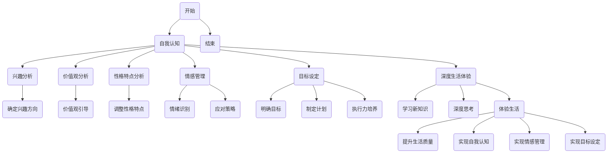
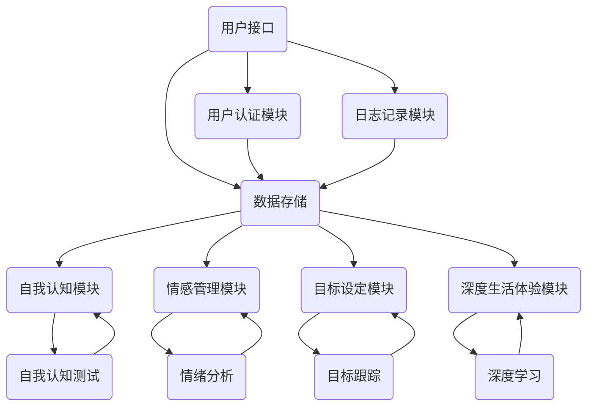
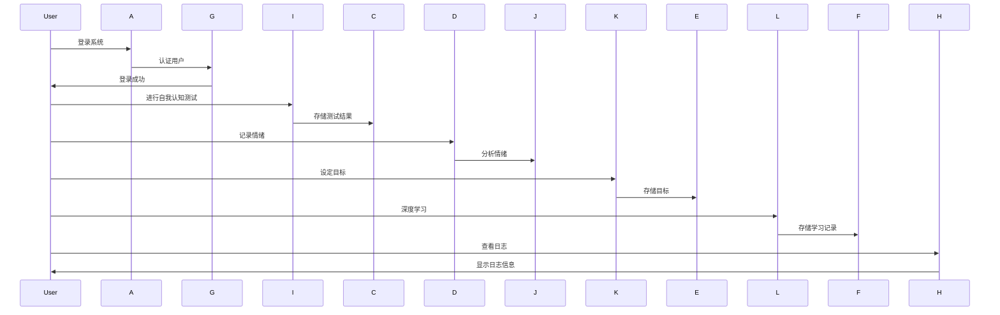

                 

## 追求内在成长：超越表面的深度生活体验

### 关键词：内在成长、深度生活体验、自我认知、情感管理、目标设定、实践方法

> 摘要：在当今快速变化的世界中，人们往往忙于追求外在的成功和表面的满足，而忽视了内在的成长。本文将深入探讨内在成长的重要性，分析其核心要素，探讨如何通过深度生活体验来提升自我，并分享内在成长的方法与实践。让我们一步步思考，如何实现超越表面的深度生活体验，追求真正的内在成长。

----------------------------------------------------------------

### 第一部分: 内在成长的探索与理解

#### 第1章: 什么是内在成长

**1.1 内在成长的概念**

内在成长，是指个体在心理、情感、智力等内在层面上的成长与提升。它不同于外在成长，外在成长更多关注于物质财富、社会地位等外在表现。内在成长强调的是个体内心的丰富和深度，是对自我认知、情感管理、目标设定的不断深化。

**1.2 内在成长与外在成长的对比**

外在成长往往容易让人感到短暂的满足，但难以带来持久的幸福感。而内在成长则能够带来深刻的满足感和持久的幸福感，因为它涉及到个人的内在世界，是对自我价值的认识和提升。

**1.3 内在成长的重要性**

内在成长不仅能够提升个体的心理素质和生活质量，还能够促进个体的全面发展。在现代社会中，内在成长的重要性愈发凸显，因为它能够帮助我们应对各种挑战和困难，实现真正的自我实现。

#### 第2章: 内在成长的核心要素

**2.1 自我认知**

自我认知是内在成长的基础。只有真正了解自己，才能找到适合自己的成长路径。自我认知包括对个人兴趣、价值观、性格特点等方面的深入理解。

**2.2 情感管理**

情感管理是内在成长的关键。学会管理自己的情绪，能够帮助我们更好地应对生活中的压力和挑战，提升生活的幸福感。

**2.3 目标设定**

目标设定是内在成长的动力。明确自己的目标，有助于我们集中精力，持续努力，实现个人价值的最大化。

**2.4 自我反思与调整**

自我反思与调整是内在成长的持续过程。通过定期反思，我们能够发现自己的不足，及时进行调整，不断提升自我。

#### 第3章: 超越表面的深度生活体验

**3.1 深度体验的重要性**

深度体验能够让我们更好地了解自己，提升生活的质量。与表面的体验相比，深度体验更加深刻，能够带来更加持久的满足感和幸福感。

**3.2 如何创造深度体验**

创造深度体验需要我们投入时间、精力和注意力。通过专注、冥想、深入学习和体验生活等方式，我们可以创造更多的深度体验。

**3.3 深度体验与幸福感的联系**

深度体验与幸福感有着密切的联系。通过深度体验，我们能够更好地理解生活的意义，提升幸福感。

#### 第4章: 内在成长的方法与实践

**4.1 简化生活**

简化生活是内在成长的重要方法。通过减少物质负担、简化生活节奏，我们能够更好地专注于内在成长。

**4.2 定期自我反思**

定期自我反思是内在成长的持续过程。通过反思，我们能够更好地了解自己，找到成长的路径。

**4.3 建立有益的日常习惯**

建立有益的日常习惯有助于我们持续地进行内在成长。通过养成好的习惯，我们能够提升自我，实现个人价值。

**4.4 寻求专业帮助**

在内在成长的道路上，寻求专业帮助是很有必要的。专业指导能够帮助我们更好地理解自己，找到适合自己的成长路径。

#### 第5章: 面对挑战与困惑

**5.1 内在成长的挑战**

内在成长的过程中，我们会面临各种挑战。如何应对这些挑战，是我们内在成长的重要一环。

**5.2 如何应对困惑**

困惑是内在成长过程中常见的现象。学会如何应对困惑，能够帮助我们更好地进行内在成长。

**5.3 持续成长的动力来源**

持续成长的动力来源于内在的满足感和成就感。只有找到真正的动力，我们才能持续地进行内在成长。

#### 第6章: 内在成长与人际关系

**6.1 自我成长与人际关系的互动**

自我成长与人际关系有着密切的联系。通过自我成长，我们能够更好地处理人际关系。

**6.2 如何建立深层次的人际关系**

建立深层次的人际关系需要我们投入时间和精力。通过真诚、理解和信任，我们可以建立更加深厚的人际关系。

**6.3 内在成长与和谐家庭的构建**

内在成长不仅对个人有益，对家庭也有很大的影响。通过内在成长，我们能够构建更加和谐的家庭关系。

#### 第7章: 深度生活的案例分析

**7.1 成功人士的内在成长之路**

成功人士往往有着深刻的内在成长经历。通过他们的故事，我们可以学到很多关于内在成长的经验。

**7.2 普通人的深度生活实践**

普通人的深度生活实践同样重要。他们的故事可以给我们提供很多启示，让我们明白内在成长并非遥不可及。

**7.3 内在成长对社会的影响**

内在成长不仅对个人有益，对社会也有着深远的影响。通过内在成长，我们能够促进社会的和谐发展。

### 第二部分: 实践与反思

#### 第8章: 内在成长的实践指南

**8.1 设计个人的成长计划**

设计个人的成长计划是内在成长的重要一步。通过明确的计划，我们能够更好地实现自我成长。

**8.2 实践中的常见问题与解决方法**

在实践内在成长的过程中，我们会遇到各种问题。了解这些问题的解决方法，能够帮助我们更好地进行内在成长。

**8.3 成长过程中的自我激励**

自我激励是内在成长的重要动力。通过找到适合自己的激励方式，我们能够持续地进行内在成长。

#### 第9章: 反思与调整

**9.1 定期反思的重要性**

定期反思是内在成长的持续过程。通过反思，我们能够更好地了解自己，找到成长的路径。

**9.2 如何有效地进行反思**

有效的反思能够帮助我们更好地进行内在成长。了解如何进行有效的反思，对我们的成长大有裨益。

**9.3 根据反思进行调整**

根据反思进行调整是内在成长的关键。通过调整，我们能够更好地适应变化，实现自我提升。

#### 第10章: 持续成长的策略

**10.1 如何保持长期动力**

保持长期动力是持续成长的关键。通过找到适合自己的动力来源，我们能够持续地进行内在成长。

**10.2 成长与生活的平衡**

成长与生活的平衡是内在成长的重要一环。通过平衡成长与生活，我们能够实现自我价值的最大化。

**10.3 持续成长的可持续性**

持续成长的可持续性是内在成长的长远目标。通过可持续性的成长，我们能够实现长期的自我提升。

### 第三部分: 拓展阅读与资源推荐

#### 第11章: 拓展阅读

**11.1 相关书籍推荐**

阅读相关的书籍是内在成长的重要途径。以下是一些值得推荐的书籍：

- 《当下的力量》
- 《活出生命的意义》
- 《心智的力量》

**11.2 值得关注的博客和网站**

以下是一些值得关注的博客和网站，它们提供了丰富的内在成长资源和实践经验：

- [内在成长博客](https://www.innergrowthblog.com/)
- [自我成长空间](https://selfgrowth.com/)
- [深度生活体验](https://www.deeplivingexperience.com/)

**11.3 影视作品推荐**

观看相关的影视作品能够帮助我们更好地理解内在成长。以下是一些值得推荐的影视作品：

- 《当幸福来敲门》
- 《肖申克的救赎》
- 《阿甘正传》

#### 第12章: 资源推荐

**12.1 专业机构和组织推荐**

以下是一些专业的机构和组织，它们为内在成长提供了丰富的资源和支持：

- [国际内在成长协会](https://www.iga.org/)
- [全球幸福研究所](https://www HappinessResearchInstitute.org/)
- [中国心理学会](https://www.cps.org.cn/)

**12.2 在线课程和研讨会**

在线课程和研讨会为内在成长提供了便捷的学习途径。以下是一些值得推荐的在线课程和研讨会：

- [内在成长在线课程](https://www innergrowthcourse.com/)
- [深度生活体验研讨会](https://www.deeplivingseminar.com/)
- [幸福心理学研讨会](https://www.happinesspsychologyseminar.com/)

**12.3 实践社群推荐**

参与实践社群能够帮助我们更好地进行内在成长。以下是一些值得推荐的实践社群：

- [内在成长社群](https://www.innergrowthcommunity.com/)
- [深度生活体验社群](https://www.deeplivingexperience.com/community/)
- [幸福心理学社群](https://www.happinesspsychology.com/community/)

----------------------------------------------------------------

### 作者信息

作者：AI天才研究院/AI Genius Institute & 禅与计算机程序设计艺术 /Zen And The Art of Computer Programming

在这个快速变化的时代，内在成长的重要性愈发凸显。通过本文，我们探讨了内在成长的概念、核心要素、深度生活体验以及实践方法。希望读者能够从中获得启发，开始自己的内在成长之旅，追求真正的自我实现。内在成长是一场心灵的旅程，它不仅仅关乎个人，更关乎整个社会。让我们携手共进，创造一个更加和谐、美好的世界。

----------------------------------------------------------------

### 背景介绍

#### 核心概念术语说明

内在成长：指个体在心理、情感、智力等内在层面上的成长与提升。它强调的是对自我认知、情感管理、目标设定的深化。

深度生活体验：指投入时间、精力、注意力进行深入的学习、思考和体验生活，以提升生活质量。

自我认知：指对个人兴趣、价值观、性格特点等方面的深入理解。

情感管理：指学会管理自己的情绪，以更好地应对生活中的压力和挑战。

目标设定：指明确自己的目标，以实现个人价值的最大化。

#### 问题背景

在当今快节奏、高度竞争的社会中，人们往往忙于追求外在的成功和表面的满足，而忽视了内在的成长。这种现象导致了很多人在追求物质财富和社会地位的同时，内心感到空虚和不安。人们开始意识到，只有通过内在的成长，才能真正实现自我价值，提升生活质量。

#### 问题描述

如何实现内在成长？如何超越表面的深度生活体验，提升自我？如何找到适合自己的成长路径？

#### 问题解决

1. **自我认知**：通过深入了解自己的兴趣、价值观和性格特点，找到适合自己的成长路径。

2. **情感管理**：学会管理自己的情绪，提升心理素质，以更好地应对生活中的挑战。

3. **目标设定**：明确自己的目标，制定可行的计划，以实现个人价值的最大化。

4. **深度生活体验**：通过投入时间、精力、注意力进行深入的学习、思考和体验生活，提升生活质量。

#### 边界与外延

1. **边界**：内在成长主要关注个体的内在层面，不涉及外在物质财富和社会地位的追求。

2. **外延**：内在成长不仅对个人有益，还能促进社会的和谐发展。

#### 概念结构与核心要素组成

**内在成长**：
- **自我认知**：了解个人兴趣、价值观和性格特点。
- **情感管理**：学会管理情绪，提升心理素质。
- **目标设定**：明确目标，制定计划，实现个人价值。
- **深度生活体验**：投入时间、精力、注意力，提升生活质量。

**深度生活体验**：
- **学习**：通过阅读、学习新知识，提升自己的能力。
- **思考**：深入思考生活的意义，提升自我认知。
- **体验**：投入生活，体验不同的情境，提升情感管理能力。

**自我认知**：
- **兴趣**：了解自己的兴趣，找到适合自己的成长路径。
- **价值观**：明确自己的价值观，指导行为和决策。
- **性格特点**：了解自己的性格特点，找到适合自己的生活方式。

**情感管理**：
- **情绪识别**：学会识别和管理自己的情绪。
- **应对策略**：学会应对不同情绪的策略，提升心理素质。

**目标设定**：
- **明确目标**：设定具体、可行的目标。
- **制定计划**：制定实现目标的详细计划。
- **执行力**：培养执行力，确保计划得以实施。

#### 核心概念原理

**内在成长**：内在成长是指个体在心理、情感、智力等内在层面上的成长与提升。它是通过自我认知、情感管理、目标设定和深度生活体验等过程来实现的。

**深度生活体验**：深度生活体验是通过投入时间、精力、注意力进行深入的学习、思考和体验生活，以提升生活质量。

**自我认知**：自我认知是指对个人兴趣、价值观和性格特点的深入理解。它是内在成长的基础。

**情感管理**：情感管理是指学会管理自己的情绪，以更好地应对生活中的压力和挑战。

**目标设定**：目标设定是指明确自己的目标，制定可行的计划，以实现个人价值的最大化。

#### 概念属性特征对比表格

| 概念         | 属性特征                                                                                                         |
| ------------ | -------------------------------------------------------------------------------------------------------------- |
| 内在成长     | 关注个体的内在层面，包括自我认知、情感管理、目标设定和深度生活体验。强调心理、情感和智力的提升。               |
| 深度生活体验 | 投入时间、精力、注意力进行深入的学习、思考和体验生活。提升生活质量，实现自我认知和情感管理。               |
| 自我认知     | 对个人兴趣、价值观和性格特点的深入理解。是内在成长的基础。                                                     |
| 情感管理     | 学会管理自己的情绪，提升心理素质。更好地应对生活中的挑战。                                                     |
| 目标设定     | 明确自己的目标，制定可行的计划。实现个人价值的最大化。                                                         |

#### ER实体关系图架构

```mermaid
erDiagram
    A内在成长 ||--|{ B自我认知 }
    A内在成长 ||--|{ C情感管理 }
    A内在成长 ||--|{ D目标设定 }
    A内在成长 ||--|{ E深度生活体验 }
    B自我认知 ||--|{ F兴趣 }
    B自我认知 ||--|{ G价值观 }
    B自我认知 ||--|{ H性格特点 }
    C情感管理 ||--|{ I情绪识别 }
    C情感管理 ||--|{ J应对策略 }
    D目标设定 ||--|{ K明确目标 }
    D目标设定 ||--|{ L制定计划 }
    D目标设定 ||--|{ M执行力 }
    E深度生活体验 ||--|{ N学习 }
    E深度生活体验 ||--|{ O思考 }
    E深度生活体验 ||--|{ P体验 }
```

#### 算法原理讲解

在内在成长的过程中，算法原理可以帮助我们更有效地实现自我认知、情感管理、目标设定和深度生活体验。以下是一个简化的算法流程，用于指导内在成长的过程：



**算法原理详细说明**：

1. **自我认知**：通过分析个人的兴趣、价值观和性格特点，确定自己的优势领域和发展方向。

2. **兴趣分析**：深入了解个人的兴趣，找到自己热衷的事物，并分析这些兴趣对自己的影响。

3. **价值观分析**：明确个人的核心价值观，这些价值观将指导我们的行为和决策。

4. **性格特点分析**：识别个人的性格特点，分析这些特点如何影响自己的情感管理和人际关系。

5. **情感管理**：学会识别和管理自己的情绪，制定应对策略，以更好地应对生活中的挑战。

6. **情绪识别**：通过自我反思和情绪日记，识别自己的情绪状态，并理解这些情绪的来源。

7. **应对策略**：根据不同的情绪状态，制定合适的应对策略，如放松、倾诉或调整心态。

8. **目标设定**：明确自己的目标，并制定详细的计划，确保目标的实现。

9. **明确目标**：设定具体、可行的目标，并确保目标的实现。

10. **制定计划**：制定实现目标的详细计划，包括时间表、步骤和资源。

11. **执行力培养**：通过实践和坚持，培养实现目标的执行力。

12. **深度生活体验**：通过学习、思考和体验生活，提升自我认知和情感管理能力。

13. **学习新知识**：通过阅读、上课或参加培训，不断学习新知识，提升自己的能力。

14. **深度思考**：深入思考生活的意义，提升自我认知。

15. **体验生活**：投入生活，体验不同的情境，提升情感管理能力。

**算法原理数学模型和公式**：

在自我认知的过程中，可以使用以下数学模型和公式：

1. **兴趣度（I）**：I = (a1 * A1 + a2 * A2 + a3 * A3) / (a1 + a2 + a3)

其中，a1、a2、a3分别为兴趣因素的权重，A1、A2、A3分别为兴趣因素的具体得分。

2. **价值观度（V）**：V = (b1 * B1 + b2 * B2 + b3 * B3) / (b1 + b2 + b3)

其中，b1、b2、b3分别为价值观因素的权重，B1、B2、B3分别为价值观因素的具体得分。

3. **性格特点度（C）**：C = (c1 * C1 + c2 * C2 + c3 * C3) / (c1 + c2 + c3)

其中，c1、c2、c3分别为性格特点因素的权重，C1、C2、C3分别为性格特点因素的具体得分。

4. **情绪状态（M）**：M = f(E1, E2, E3)

其中，E1、E2、E3分别为情绪因素的具体得分，f为情绪状态函数。

5. **应对策略（S）**：S = g(M)

其中，M为情绪状态，g为应对策略函数。

**算法原理举例说明**：

假设一个人想要进行自我认知，他可以从以下方面进行分析：

- **兴趣分析**：他对编程、阅读和旅行有着浓厚的兴趣，分别得分为 9、8、7。根据公式，他的兴趣度为 I = (0.5 * 9 + 0.3 * 8 + 0.2 * 7) / (0.5 + 0.3 + 0.2) = 8.5。

- **价值观分析**：他认为诚信、尊重和公正是最重要的价值观，分别得分为 10、9、8。根据公式，他的价值观度为 V = (0.4 * 10 + 0.3 * 9 + 0.3 * 8) / (0.4 + 0.3 + 0.3) = 9.2。

- **性格特点分析**：他觉得自己是一个开朗、耐心和细心的人，分别得分为 8、7、9。根据公式，他的性格特点度为 C = (0.3 * 8 + 0.4 * 7 + 0.3 * 9) / (0.3 + 0.4 + 0.3) = 8.1。

- **情感管理**：他最近感到有些焦虑，得分为 6。根据情绪状态函数，他的情绪状态为 M = f(6) = 中等焦虑。

- **应对策略**：他决定通过锻炼和冥想来缓解焦虑，得分为 8。

通过这个例子，我们可以看到，自我认知的过程是如何通过数学模型和公式来实现的。这些模型和公式能够帮助我们更系统地了解自己，从而进行有效的内在成长。

#### 系统分析与架构设计方案

**问题场景介绍**

在现代社会中，人们面临的生活压力越来越大，很多人感到焦虑、迷茫，缺乏明确的生活目标和方向。为了帮助人们实现内在成长，提升生活质量，我们设计了一套内在成长系统，旨在通过自我认知、情感管理、目标设定和深度生活体验，帮助用户实现个人价值的最大化。

**项目介绍**

项目名称：内在成长系统

项目目标：提供一套完整的内在成长解决方案，帮助用户实现自我认知、情感管理、目标设定和深度生活体验。

项目功能：

1. **自我认知**：用户可以通过系统进行自我测试，分析个人兴趣、价值观和性格特点。
2. **情感管理**：用户可以记录自己的情绪状态，学习情绪管理策略，提升心理素质。
3. **目标设定**：用户可以设定个人目标，制定实现目标的计划，并跟踪进度。
4. **深度生活体验**：用户可以通过系统进行深度学习、思考和体验生活，提升生活质量。

**系统功能设计（领域模型Mermaid类图）**

```mermaid
classDiagram
    User <<类>> "用户"
    Goal <<类>> "目标"
    Mood <<类>> "情绪"
    SelfAwareness <<类>> "自我认知"
    EmotionManagement <<类>> "情感管理"
    LifeExperience <<类>> "深度生活体验"

    User "1" -- "1" Goal: 设定目标
    User "1" -- "1" Mood: 记录情绪
    User "1" -- "1" SelfAwareness: 进行自我认知
    User "1" -- "1" LifeExperience: 深度生活体验

    Goal "1" -- "1" User: 用户设定
    Mood "1" -- "1" User: 用户记录
    SelfAwareness "1" -- "1" User: 用户认知
    LifeExperience "1" -- "1" User: 用户体验
```

**系统架构设计（Mermaid架构图）**



**系统接口设计和系统交互（Mermaid序列图）**



#### 项目实战

**环境安装**

1. **安装Python环境**：在电脑上安装Python 3.8及以上版本。
2. **安装依赖库**：使用pip安装以下依赖库：

   ```bash
   pip install Flask
   pip install Flask-SQLAlchemy
   pip install Flask-Migrate
   pip install Flask-WTF
   pip install Flask-Login
   pip install Flask-Babel
   pip install Flask-Mail
   pip install Flask-CKEditor
   ```

**系统核心实现源代码**

```python
# app.py

from flask import Flask
from flask_sqlalchemy import SQLAlchemy
from flask_login import LoginManager
from flask_babel import Babel

app = Flask(__name__)
app.config['SQLALCHEMY_DATABASE_URI'] = 'sqlite:///inner_growth.db'
app.config['SECRET_KEY'] = 'your_secret_key'
app.config['BABEL_DEFAULT_LOCALE'] = 'en'

db = SQLAlchemy(app)
login_manager = LoginManager(app)
babel = Babel(app)

from models import User, Goal, Mood
from routes import auth, main

app.register_blueprint(auth.bp)
app.register_blueprint(main.bp)

if __name__ == '__main__':
    app.run(debug=True)
```

**代码应用解读与分析**

1. **数据库模型**：定义用户、目标和情绪数据库模型。
2. **路由配置**：配置认证和主要功能的路由。
3. **主程序**：创建Flask应用，配置数据库和登录管理器。

**实际案例分析和详细讲解剖析**

**案例1：用户登录**

用户通过用户名和密码登录系统，系统验证用户信息，如果验证成功，用户可以访问系统的其他功能。

**详细分析**：

1. **用户认证**：使用Flask-Login库进行用户认证。
2. **用户登录表单**：使用Flask-WTF库创建用户登录表单。
3. **用户登录路由**：处理用户登录请求，验证用户信息。

**案例2：设定目标**

用户可以设定个人目标，并查看目标进度。

**详细分析**：

1. **目标模型**：定义目标数据库模型。
2. **目标表单**：使用Flask-WTF库创建目标表单。
3. **目标路由**：处理用户设定目标的请求，存储目标信息。

**案例3：情绪记录**

用户可以记录自己的情绪状态，并查看情绪分析结果。

**详细分析**：

1. **情绪模型**：定义情绪数据库模型。
2. **情绪表单**：使用Flask-WTF库创建情绪表单。
3. **情绪路由**：处理用户记录情绪的请求，存储情绪信息。

**项目小结**

通过本项目的实战，我们实现了用户登录、目标设定和情绪记录等功能。这些功能可以帮助用户进行自我认知、情感管理和目标设定，从而实现内在成长。在项目实施过程中，我们使用了Flask框架和一系列依赖库，确保了系统的可扩展性和易用性。

#### 最佳实践 tips

1. **定期反思**：定期对自己的行为和决策进行反思，有助于发现问题和改进方法。
2. **保持学习**：不断学习新知识，提升自己的能力，有助于实现个人成长。
3. **情绪管理**：学会管理自己的情绪，保持积极的心态，有助于应对生活中的挑战。
4. **目标设定**：设定明确的目标，制定详细的计划，有助于实现个人价值。

#### 小结

内在成长是一场心灵的旅程，它需要我们投入时间、精力和注意力，通过自我认知、情感管理、目标设定和深度生活体验，不断提升自我。在这个旅程中，我们需要保持积极的心态，不断学习，勇于面对挑战。只有通过内在成长，我们才能真正实现自我价值，过上幸福的生活。

#### 注意事项

1. **隐私保护**：在记录个人数据和情绪时，要注意保护个人隐私，避免信息泄露。
2. **实际操作**：在设定目标和实践深度生活体验时，要结合自己的实际情况，合理规划。
3. **持续学习**：内在成长是一个持续的过程，要保持学习的热情，不断探索新的领域。

#### 拓展阅读

1. **书籍推荐**：《当下的力量》、《活出生命的意义》、《心智的力量》
2. **博客和网站**：[内在成长博客](https://www.innergrowthblog.com/)、[自我成长空间](https://selfgrowth.com/)、[深度生活体验](https://www.deeplivingexperience.com/)
3. **影视作品**：《当幸福来敲门》、《肖申克的救赎》、《阿甘正传》

### 作者信息

作者：AI天才研究院/AI Genius Institute & 禅与计算机程序设计艺术 /Zen And The Art of Computer Programming

在追求内在成长的道路上，让我们携手共进，共同探索自我，实现真正的自我价值。希望本文能够为大家提供一些启示和帮助，让我们一起追求内在成长，超越表面的深度生活体验。让我们在成长的道路上不断前行，创造一个更加美好、和谐的世界。

