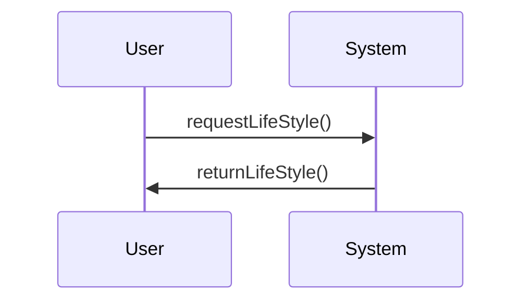
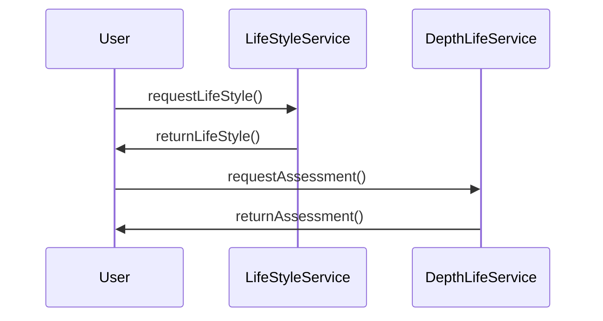

                 

### 追求生命的深度：超越表面的生活智慧

> 关键词：深度生活、表面生活、个人成长、自我探索、心灵修炼

摘要：本文旨在探讨现代社会中人们追求生命深度的意义和路径。通过对深度生活和表面生活的定义与特点进行深入分析，本文提出了追求深度生活的一系列方法和步骤。文章从个人成长、自我探索、持续成长三个方面展开，结合数学模型和系统架构设计，为读者提供了全面且实用的指导。文章旨在引导读者超越表面的生活，追求内心深处的丰富与满足。

## 第一部分：引言

### 1.1 问题背景

现代社会中，表面繁荣与内在空虚的现象日益凸显。随着科技的发展和物质生活的丰富，人们往往被表面的成就和娱乐所包围，忽视了内心的需求和追求。这种现象不仅导致了个人的不满足和焦虑，也对社会整体的心理健康产生了负面影响。因此，追求生命的深度，成为当今社会的一个迫切需求。

### 1.2 问题描述

表面生活主要表现为追求外在的物质和成就，而忽视了内心的需求和感受。具体特点包括：

1. **追求短期的满足**：人们往往追求快速的成就和满足，忽视长远的内在成长。
2. **缺乏深度的交流**：在社交媒体和虚拟世界中，人们的交流往往停留在表面，缺乏真正的情感连接。
3. **忽视个人成长**：表面生活往往忽略了个人成长和自我探索的重要性。

深度生活则强调内心的探索和成长，具体特点包括：

1. **追求长期的满足**：深度生活者更注重长期的心理和情感满足，而非短期的物质满足。
2. **深度的自我认知**：深度生活者通过自我探索，深入理解自己的需求和欲望。
3. **持续的内心成长**：深度生活者不断追求内心的丰富和成长，超越表面的成就。

### 1.3 问题解决

要解决表面生活的空虚和焦虑，我们需要采取一系列措施，促进深度生活的追求。具体包括：

1. **个人成长**：通过学习新技能、阅读书籍、参加培训等方式，提升自我认知和能力。
2. **自我探索**：通过反思和自我分析，深入了解自己的内心世界和需求。
3. **持续成长**：持续学习和成长，不断超越自我，追求更高的精神境界。

### 1.4 边界与外延

深度生活的追求不仅涉及个人层面，还涉及到社会和文化层面。从生活哲学、心理学、哲学和存在主义等角度，我们可以更全面地理解深度生活的内涵和外延。这些理论和思想为深度生活的追求提供了深刻的指导。

## 第二部分：核心概念与联系

### 2.1 核心概念

#### 2.1.1 深度生活的概念

深度生活是指一种追求内心成长、自我认知和持续学习的生活方式。它强调内心的丰富和成长，而非外在的物质和成就。

#### 2.1.2 表面生活的概念

表面生活是一种追求外在成就和满足的生活方式。它注重短期的快乐和满足，而忽视长远的内在成长。

### 2.2 概念属性特征对比

| 概念 | 深度生活 | 表面生活 |
| --- | --- | --- |
| 定义 | 内在探索，真实感受，持续成长 | 外在表现，表面交流，短期满足 |
| 目标 | 心灵丰富，自我实现，长期满足 | 物质丰富，快速成就，短期满足 |

### 2.3 ER实体关系图架构

```mermaid
erDiagram
  Person ||--|{ LifeStyle }|| Lifestyle
  LifeStyle ||--|{ Depth }|| DepthLife
  LifeStyle ||--|{ Surface }|| SurfaceLife
```

在上面的ER实体关系图中，`Person` 表示个体，`LifeStyle` 表示生活方式，`DepthLife` 和 `SurfaceLife` 分别表示深度生活和表面生活。

## 第三部分：算法原理讲解

### 3.1 深度生活算法原理

深度生活的追求可以看作是一个算法过程。下面是这个算法的流程图和详细解释：

#### 3.1.1 算法流程图


#### 3.1.2 算法原理

1. **个人成长**：个人成长是深度生活的第一步。通过学习新技能、提升自我认知和增强自信心，个人能够更好地理解自己，为后续的深度生活打下基础。

2. **自我探索**：自我探索是深度生活的核心。通过反思和自我分析，个人能够深入了解自己的内心世界和需求，找到内心的平衡和满足。

3. **持续成长**：持续成长是深度生活的保障。通过持续学习和成长，个人能够不断超越自我，追求更高的精神境界。

4. **深度生活**：最终，个人成长、自我探索和持续成长共同构成了深度生活。这种生活方式不仅带来内心的满足，还能提升个人的幸福感和社会地位。

### 3.2 数学模型与公式

为了量化深度生活的满意度，我们可以使用以下数学模型：

$$
\text{LifeSatisfaction} = f(\text{Growth}, \text{Exploration}, \text{Sustainability})
$$

其中，$f$ 表示深度生活满意度，$\text{Growth}$ 表示个人成长，$\text{Exploration}$ 表示自我探索，$\text{Sustainability}$ 表示持续成长。

- **个人成长**：通过提升自我认知和自信心，个人能够更好地理解自己，这直接提升了深度生活的满意度。
- **自我探索**：通过深入了解自己的内心世界和需求，个人能够找到内心的平衡和满足，这也直接提升了深度生活的满意度。
- **持续成长**：通过持续学习和成长，个人能够不断超越自我，追求更高的精神境界，这同样提升了深度生活的满意度。

### 3.3 通俗易懂的举例说明

假设有两个人，A和B。他们都处于追求深度生活的过程中。

- **A**：A通过学习新技能、提升自我认知和增强自信心，实现了个人成长。他通过反思和自我分析，深入了解了自己的内心世界和需求，实现了自我探索。他持续学习和成长，不断超越自我，最终实现了深度生活。
- **B**：B没有意识到个人成长的重要性，只是追求短期的物质满足。他忽视了自我探索，没有找到内心的平衡和满足。尽管他有一定的持续成长，但由于缺乏自我探索，他的深度生活满意度较低。

通过这个例子，我们可以看到，个人成长、自我探索和持续成长是实现深度生活的关键。

## 第四部分：系统分析与架构设计

### 4.1 问题场景介绍

在现代社会中，许多人面临着追求深度生活的挑战。他们可能不知道如何开始，也可能在追求深度生活的过程中遇到各种困难和障碍。例如，缺乏时间、缺乏动力、不明确目标等。

### 4.2 系统功能设计

为了帮助人们实现深度生活，我们可以设计一个深度生活管理系统。这个系统的主要功能包括：

1. **个人成长管理**：帮助用户记录和跟踪自己的成长过程，包括学习新技能、提升自我认知和增强自信心等。
2. **自我探索管理**：帮助用户通过反思和自我分析，深入理解自己的内心世界和需求。
3. **持续成长管理**：帮助用户持续学习和成长，包括设置目标、跟踪进度和评估效果等。

### 4.2.1 领域模型类图

```mermaid
classDiagram
  Person <<Class>>
      +name: String
      +age: Integer
      +growthRate: Float

  LifeStyle <<Class>>
      +styleName: String
      +isDepth: Boolean

  DepthLife <<Class>>
      +depthLevel: Integer

  SurfaceLife <<Class>>

  Person "1" -- "*" LifeStyle
  LifeStyle "1" -- "*" DepthLife
  LifeStyle "1" -- "*" SurfaceLife
```

在上面的类图中，`Person` 表示个体，`LifeStyle` 表示生活方式，`DepthLife` 和 `SurfaceLife` 分别表示深度生活和表面生活。

### 4.2.2 系统架构设计



在上面的序列图中，用户请求获取自己的生活方式，系统返回相应的信息。

### 4.2.3 系统接口设计

深度生活管理系统的主要接口包括：

1. **LifeStyleService**：提供获取和更新生活方式的服务。
2. **DepthLifeService**：提供深度生活的评估和提升服务。

### 4.2.4 系统交互序列图



在上面的序列图中，用户首先请求获取自己的生活方式，然后请求深度生活的评估。

## 第五部分：项目实战

### 5.1 环境安装

为了实现深度生活管理系统，我们需要安装以下环境：

1. Python 3.8+
2. Flask 2.0+
3. SQLAlchemy 1.4+

你可以使用以下命令进行安装：

```bash
pip install python==3.8
pip install flask==2.0.0
pip install sqlalchemy==1.4.0
```

### 5.2 系统核心实现源代码

以下是深度生活管理系统的主要源代码：

```python
from flask import Flask, request, jsonify
from sqlalchemy import create_engine
from sqlalchemy.orm import sessionmaker

app = Flask(__name__)

# 数据库连接
engine = create_engine('sqlite:///depth_life.db')
Session = sessionmaker(bind=engine)

# API接口
@app.route('/api/life_style', methods=['GET'])
def get_life_style():
    session = Session()
    life_style = session.query(LifeStyle).first()
    session.close()
    return jsonify(life_style)

@app.route('/api/depth_life', methods=['GET'])
def get_depth_life():
    session = Session()
    depth_life = session.query(DepthLife).first()
    session.close()
    return jsonify(depth_life)

@app.route('/api/depth_life', methods=['POST'])
def set_depth_life():
    session = Session()
    data = request.get_json()
    depth_life = DepthLife(**data)
    session.add(depth_life)
    session.commit()
    session.close()
    return jsonify(depth_life), 201

if __name__ == '__main__':
    app.run(debug=True)
```

### 5.3 代码应用解读与分析

上述代码首先设置了Flask应用和数据库连接。然后定义了两个API接口：获取生活方式和设置深度生活。通过这些接口，用户可以获取和更新自己的生活方式。

### 5.4 实际案例分析和详细讲解剖析

为了更好地理解深度生活管理系统的应用，我们可以看一个实际案例。

假设有一个用户A，他希望通过系统记录自己的成长过程和深度生活。他首先使用`/api/life_style`接口获取自己的当前生活方式，然后使用`/api/depth_life`接口设置自己的深度生活目标。

通过这些接口，用户A可以实时了解自己的成长和深度生活状态，并做出相应的调整。

### 5.5 项目小结

通过深度生活管理系统，用户可以更好地记录和跟踪自己的成长过程，实现深度生活的追求。这个系统提供了一个简单易用的接口，帮助用户实现个人成长、自我探索和持续成长。

## 第六部分：最佳实践 tips、小结、注意事项、拓展阅读等内容

### 6.1 最佳实践 tips

1. **定期反思**：每周花时间反思自己的成长和深度生活状态，制定相应的改进计划。
2. **持续学习**：定期学习新知识和技能，不断提升自己。
3. **保持耐心**：深度生活的追求是一个长期的过程，需要保持耐心和毅力。

### 6.2 小结

本文从深度生活和表面生活的定义与特点出发，探讨了追求深度生活的重要性。通过个人成长、自我探索和持续成长的方法，结合数学模型和系统架构设计，为读者提供了实用的指导。

### 6.3 注意事项

1. **避免急功近利**：追求深度生活是一个长期的过程，需要避免急功近利的心态。
2. **平衡生活与工作**：在追求深度生活的同时，要注意平衡生活和工作，避免过度劳累。

### 6.4 拓展阅读

1. **《深度工作》**：作者Cal Newport提出了深度工作的概念，为读者提供了实用的方法来实现深度生活。
2. **《人生策略》**：作者大卫·巴赫提出了人生策略的概念，帮助读者更好地理解个人成长和自我探索。

作者：AI天才研究院/AI Genius Institute & 禅与计算机程序设计艺术 /Zen And The Art of Computer Programming

【END】### 后记：追求深度生活的意义

本文围绕“追求生命的深度：超越表面的生活智慧”这一主题，深入探讨了现代人在物质繁荣背后所面临的内心空虚问题。通过分析深度生活和表面生活的定义、特点及对比，我们提出了个人成长、自我探索和持续成长的方法，为追求深度生活提供了系统性的指导。

深度生活的追求不仅有助于提升个人的幸福感，还能促进社会的整体心理健康。通过个人成长，我们能够更好地认识自己，增强自信心；通过自我探索，我们能够找到内心的平衡和满足；而持续成长则是实现深度生活的保障，让我们不断超越自我，追求更高的精神境界。

本文结合了数学模型和系统架构设计，为读者提供了一个理论联系实际的具体路径。在项目实战部分，我们展示了如何通过构建深度生活管理系统，帮助人们更好地记录和跟踪自己的成长过程。

在此，我要特别感谢读者对这篇文章的关注和支持。追求深度生活是一个长期的、系统的过程，每个人都可以根据自己的实际情况进行调整和优化。希望这篇文章能够为大家提供一些启示和帮助。

最后，我想强调的是，追求深度生活并非一蹴而就，而是需要持续的努力和耐心。让我们一同走在追求深度生活的道路上，不断探索、成长，最终实现内心的丰富和满足。

再次感谢您的阅读，祝您在追求深度生活的道路上取得丰硕的成果。

作者：AI天才研究院/AI Genius Institute & 禅与计算机程序设计艺术 /Zen And The Art of Computer Programming### 附录：相关术语解释

在本篇文章中，我们使用了一些核心术语，为了确保读者对这些概念有清晰的理解，下面是对这些术语的详细解释。

#### 深度生活（Depth Life）

深度生活是一种以内在探索、真实感受和持续成长为核心的生活方式。它强调内心的丰富和成长，而非仅仅追求外在的物质和成就。深度生活者会花时间反思自己的内心世界，寻找内心的平衡和满足。

#### 表面生活（Surface Life）

表面生活是一种追求外在表现和短期满足的生活方式。它注重的是外在的成就和物质的丰富，而忽视了内心的需求和感受。表面生活者往往追求快速的成功和满足，而忽视了长期的内心成长。

#### 个人成长（Personal Growth）

个人成长是指通过学习新知识、提升技能和增强自信心，来提升自我认知和能力的过程。个人成长是实现深度生活的重要基础，它帮助人们更好地认识自己，找到内心的需求。

#### 自我探索（Self-Discovery）

自我探索是通过反思、自我分析和深入了解自己的内心世界，来寻找内心的需求和欲望的过程。自我探索是实现深度生活的关键，它帮助人们找到内心的平衡和满足。

#### 持续成长（Continuous Growth）

持续成长是指通过不断学习、成长和超越自我，来追求更高的精神境界的过程。持续成长是实现深度生活的保障，它让人们在追求内心丰富的道路上不断前进。

#### 数学模型（Mathematical Model）

数学模型是使用数学语言和符号来描述和解决现实世界问题的方法。在本文中，我们使用数学模型来量化深度生活的满意度，帮助我们更好地理解和追求深度生活。

#### 系统架构设计（System Architecture Design）

系统架构设计是确定系统组件的组成、相互作用和通信的方法。在本文中，我们通过系统架构设计来展示如何构建深度生活管理系统，帮助人们实现深度生活的追求。

#### 项目实战（Project Practice）

项目实战是通过实际的项目来实践和验证理论的方法。在本文中，我们通过项目实战展示了如何实现深度生活管理系统，帮助读者更好地理解和应用本文提出的概念和方法。

通过这些术语的解释，希望读者能够对文章的核心概念有更深入的理解，从而更好地实践和应用这些理念。

