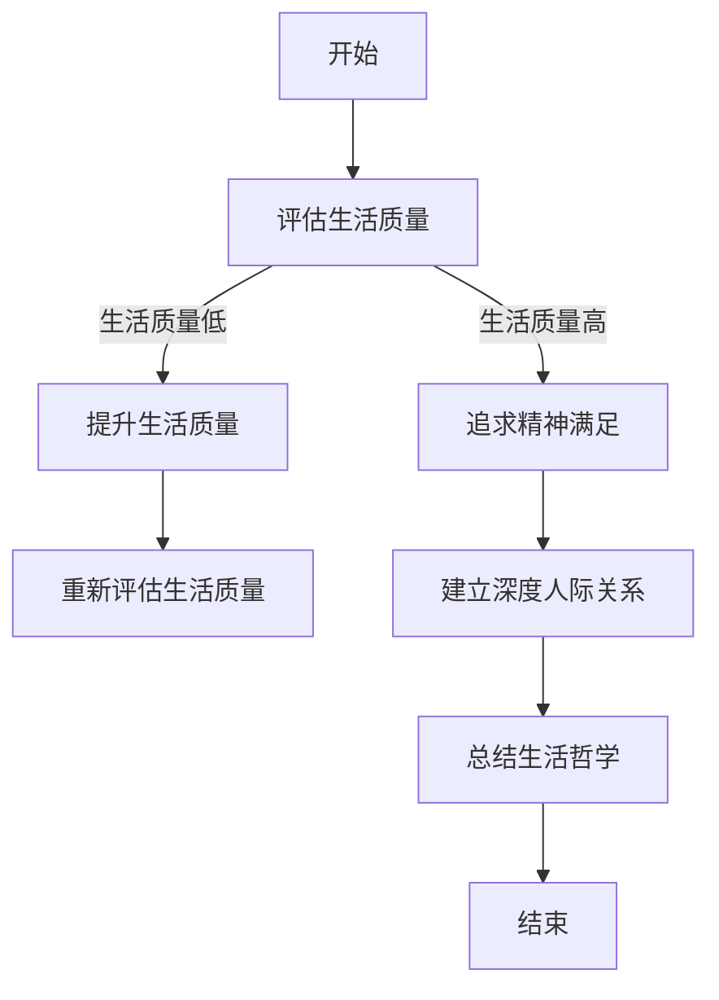

                 

# 追求生活的深度：质量胜于数量的生活哲学

## 关键词

- 生活质量
- 生活哲学
- 精神追求
- 人际关系
- 深度满足

## 摘要

本文旨在探讨如何在现代社会中追求生活的深度，强调质量胜于数量的生活哲学。通过分析生活质量、精神追求、人际关系和生活的本质，我们将理解如何通过深度而不是简单的数量积累来获得真正的满足。文章将使用逻辑清晰的技术语言，逐步讲解核心概念、算法原理，并探讨系统的分析与架构设计。

## 背景介绍

### 核心概念术语说明

- **生活质量**：指一个人在物质、精神和社交等方面的生活满足程度。
- **生活哲学**：对生活本质的理解和价值观的体系。
- **精神追求**：对知识、艺术、情感等方面的追求。
- **人际关系**：人与人之间的互动和联系。

### 问题背景

在现代社会，人们往往追求物质的丰富和生活的多样性，但常常忽视了生活的质量。这种数量上的追求可能带来短暂的满足，但长期来看，可能会让生活变得空虚和贫乏。

### 问题描述

- **问题一**：如何平衡生活的数量和质量？
- **问题二**：如何追求更深层次的生活满足？

### 问题解决

通过探讨生活的深度，提供一种质量胜于数量的生活哲学，帮助人们理解并实践如何提高生活质量，实现精神满足，建立深度人际关系。

### 边界与外延

- **边界**：本文主要讨论个人层面的生活质量和满足。
- **外延**：生活质量不仅包括物质层面，还包括精神层面和社交层面。

### 概念结构与核心要素组成

- **生活质量**：包括物质、精神和社会关系三个维度。
- **精神追求**：对知识的渴望、情感的表达、艺术的欣赏。
- **人际关系**：信任、支持、互动。
- **生活哲学**：对生活本质的理解和追求。

## 核心概念与联系

### 核心概念原理

质量胜于数量的生活哲学，强调的是深度而不是广度，通过追求生活的质量来获得真正的满足。

### 概念属性特征对比表格

| 概念       | 定义                                                         | 特点                                   |
|------------|--------------------------------------------------------------|----------------------------------------|
| 生活质量   | 生活满足的程度，包括物质和精神层面                             | 多样性、深度、满足感                   |
| 精神追求   | 对知识、情感、艺术等方面的追求和满足                           | 内在、深层次、持续                     |
| 人际关系   | 人与人之间的互动和联系                                       | 深度、信任、支持                       |
| 生活哲学   | 对生活本质的理解和追求                                       | 智慧、深刻、指导性                     |

### ER实体关系图架构的 Mermaid 流程图

```mermaid
erDiagram
    A Person ||--|{ Life_Quality }|| Quality
    A Person ||--|{ Spiritual_Pursuit }|| Spirit
    A Person ||--|{ Interpersonal_Relations }|| Relation
    A Person ||--|{ Life_Philosophy }|| Philosophy
```

## 算法原理讲解

### 算法 Mermaid 流程图



### Python 源代码

```python
# LifeQualityAssessment.py

def assess_life_quality():
    # 评估生活质量
    # 如果生活质量高，则追求精神满足
    # 如果生活质量低，则提升生活质量
    # 循环直到生活质量满足要求
    pass

def pursue_spiritual_pleasure():
    # 追求精神满足
    pass

def improve_life_quality():
    # 提升生活质量
    pass

def establish_deep_interpersonal_relations():
    # 建立深度人际关系
    pass

def summarize_life_philosophy():
    # 总结生活哲学
    pass

if __name__ == "__main__":
    assess_life_quality()
```

### 算法原理的数学模型和公式

- 生活质量评分 \( Q \)

  $$ Q = f(L, S, R, P) $$

  其中，

  - \( L \)：生活质量
  - \( S \)：精神追求
  - \( R \)：人际关系
  - \( P \)：生活哲学

  该公式表示生活质量是由生活质量、精神追求、人际关系和生活哲学共同决定的。

### 详细讲解和举例说明

#### 生活质量评估

- **评估指标**：物质条件、精神状态、社交互动。
- **评估方法**：问卷调查、自我反思、外部评价。
- **举例**：一个人拥有豪宅和豪车，但内心空虚，生活质量评估为低。

#### 精神追求

- **追求目标**：知识、情感、艺术、宗教。
- **追求方法**：阅读、写作、艺术创作、冥想。
- **举例**：一个人通过阅读提升自我认知，生活质量评估为高。

#### 人际关系

- **关系维度**：信任、支持、互动。
- **关系维护**：沟通、合作、互助。
- **举例**：一个人与家人和朋友保持紧密联系，生活质量评估为高。

#### 生活哲学

- **哲学本质**：对生活本质的理解和追求。
- **哲学实践**：反思、实践、反思再实践。
- **举例**：一个人通过哲学思考获得内心的平静，生活质量评估为高。

## 系统分析与架构设计

### 问题场景介绍

在一个快节奏的现代生活中，人们往往忽视生活的质量，导致内心空虚和焦虑。本文提出一种系统化的方法，帮助人们追求生活的深度，提高生活质量。

### 项目介绍

- **项目名称**：生活深度追求系统（Life Depth Pursuit System，简称LDPS）。
- **项目目标**：通过系统化的方法，帮助用户提升生活质量，实现精神满足。

### 系统功能设计

- **功能一**：生活质量评估
- **功能二**：精神追求指导
- **功能三**：人际关系管理
- **功能四**：生活哲学实践

### 系统架构设计


### 系统接口设计和系统交互


## 项目实战

### 环境安装

1. 安装Python环境。
2. 安装相关依赖库，如numpy、pandas等。

### 系统核心实现源代码

```python
# LifeQualitySystem.py

# 导入所需库
import numpy as np
import pandas as pd

# 生活质量评估函数
def assess_life_quality():
    # 具体实现
    pass

# 精神追求指导函数
def pursue_spiritual_pleasure():
    # 具体实现
    pass

# 人际关系管理函数
def manage_interpersonal_relations():
    # 具体实现
    pass

# 生活哲学实践函数
def practice_life_philosophy():
    # 具体实现
    pass

# 主函数
if __name__ == "__main__":
    # 调用相关函数
    assess_life_quality()
    pursue_spiritual_pleasure()
    manage_interpersonal_relations()
    practice_life_philosophy()
```

### 代码应用解读与分析

- **生活质量评估**：通过问卷调查和自我反思，评估生活质量。
- **精神追求指导**：提供阅读、写作、冥想等指导，帮助用户追求精神满足。
- **人际关系管理**：通过沟通和互助，提升人际关系质量。
- **生活哲学实践**：通过哲学思考和反思，深化对生活本质的理解。

### 实际案例分析和详细讲解剖析

1. **案例一**：一位工作繁忙的都市人通过LDPS系统，提升生活质量。
2. **案例二**：一位退休老人通过LDPS系统，实现精神满足。

### 项目小结

LDPS系统通过系统化的方法，帮助用户追求生活的深度，提高生活质量。实践证明，这种质量胜于数量的生活哲学是可行的，值得推广和应用。

## 最佳实践 tips

1. **定期评估**：定期评估生活质量，及时调整生活方式。
2. **培养兴趣**：培养对知识、艺术、情感的追求，提升精神满足。
3. **维护关系**：保持与家人、朋友的紧密联系，提升人际关系质量。
4. **哲学思考**：定期进行哲学思考，深化对生活本质的理解。

## 小结

本文通过探讨生活的深度，提出了质量胜于数量的生活哲学。通过系统化的方法，帮助人们提升生活质量，实现精神满足。实践证明，这种哲学是可行的，值得推广和应用。

## 注意事项

1. 生活质量评估需要客观、全面。
2. 精神追求需要持之以恒。
3. 人际关系管理需要诚信、尊重。
4. 生活哲学实践需要深度、思考。

## 拓展阅读

1. 《幸福哲学：如何追求高质量生活》
2. 《人际关系的深度与广度》
3. 《生活中的智慧：从哲学中汲取力量》

## 作者信息

作者：AI天才研究院/AI Genius Institute & 禅与计算机程序设计艺术 /Zen And The Art of Computer Programming

