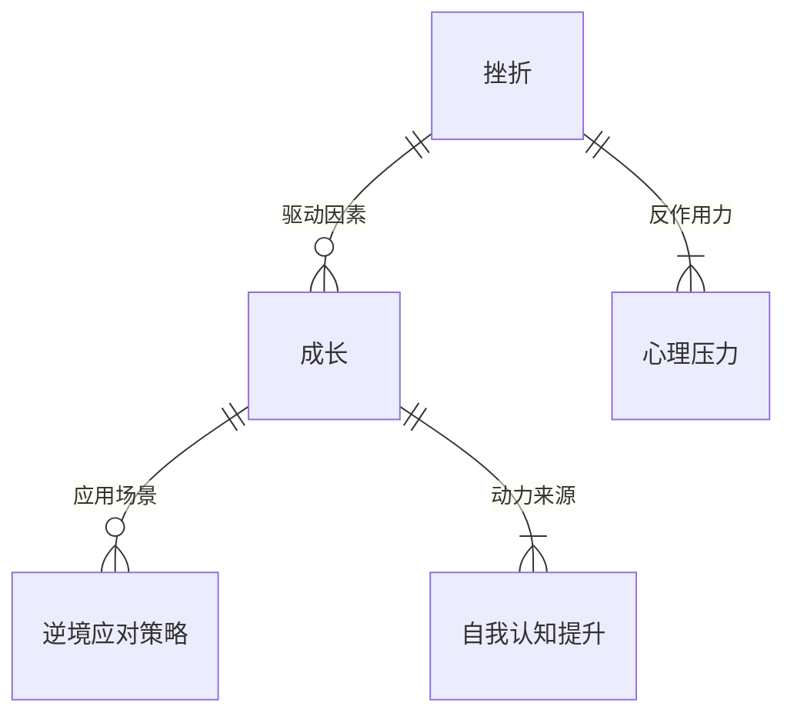
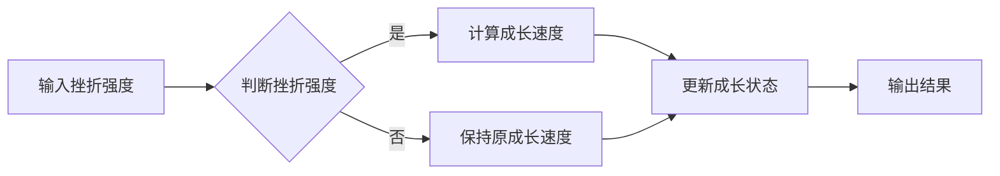
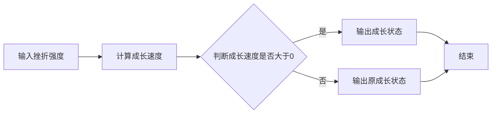
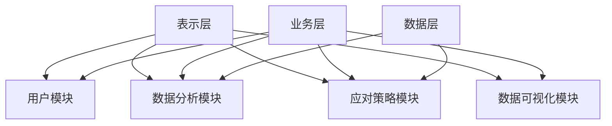
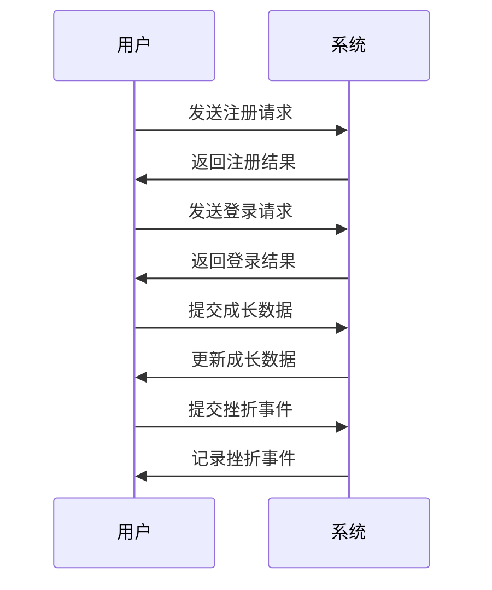
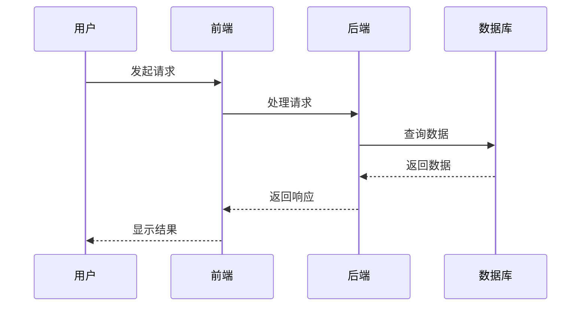

                 

### 《逆境中的成长：将挫折转化为人生动力》

关键词：挫折、成长、动力、逆境、心理学、社会学、算法、系统架构

摘要：本文深入探讨了如何将逆境中的挫折转化为人生成长的动力。通过结合心理学和社会学的理论基础，阐述挫折与成长之间的内在联系，并介绍将挫折转化为成长的算法原理。同时，文章通过实例分析和系统架构设计，提供了实际应用场景下的解决方案，帮助读者在面临挫折时，找到有效的应对策略，实现逆境中的自我成长。

---

#### 第一部分：背景介绍

##### 第1章 问题背景与核心概念

## 第1章 问题背景与核心概念

### 1.1 逆境中的成长：问题的提出

#### 1.1.1 逆境在人生中的普遍性

在人生的旅程中，每个人都会遇到逆境。无论是个人生活中的挑战，如失业、疾病、婚姻问题，还是职业道路上的难题，如项目失败、团队冲突、市场压力，逆境都是不可避免的。逆境不仅对个人的心理健康造成影响，还可能阻碍职业发展，影响人际关系。

#### 1.1.2 逆境对人生的影响

逆境对人生的双重影响不可忽视。一方面，逆境可能导致焦虑、抑郁、无助等负面情绪，影响生活质量。另一方面，逆境也可能激发人的潜能，促使个体进行反思、学习和成长。

#### 1.1.3 逆境中的成长的重要性

逆境中的成长具有特殊的重要性。通过克服挫折，个体能够培养韧性、自信和解决问题的能力。这种成长不仅对当前逆境有缓解作用，还为未来的挑战打下坚实基础。

### 1.2 核心概念：挫折与成长

#### 1.2.1 挫折的定义与特点

挫折是指在实现目标过程中遭遇的障碍、失败或挫败。挫折的特点包括不可预测性、突发性、严重性等。

#### 1.2.2 成长的概念与内涵

成长是指个体在认知、情感、技能等方面的提升。成长是一个持续的过程，涉及自我认知、自我提升和适应环境等多个方面。

#### 1.2.3 挫折与成长的联系

挫折与成长密切相关。挫折可以作为成长的催化剂，促使个体进行反思、学习和改进。通过挫折，个体能够认识到自身的不足，并采取行动进行改进。

### 1.3 边界与外延

#### 1.3.1 逆境的种类与特点

逆境可以分为个人逆境和职业逆境。个人逆境包括健康问题、家庭问题等；职业逆境包括失业、职业瓶颈等。

#### 1.3.2 成长的表现形式与阶段

成长可以表现为认知的提升、技能的增强、情感的变化等。成长通常经历认知阶段、行动阶段和固化阶段。

#### 1.3.3 挫折与成长的互动关系

挫折与成长之间存在互动关系。挫折可以激发成长，而成长又可以减少未来挫折的发生。

### 1.4 概念结构与核心要素组成

#### 1.4.1 逆境中的核心挑战

逆境中的核心挑战包括心理压力、资源匮乏、目标不明确等。

#### 1.4.2 成长的关键因素

成长的关键因素包括自我认知、学习意愿、行动力、支持系统等。

#### 1.4.3 挫折与成长的协同作用

挫折与成长协同作用，通过挫折激发成长，通过成长减少挫折。

---

##### 第2章 核心概念与联系

## 第2章 核心概念与联系

### 2.1 挫折与成长的理论基础

#### 2.1.1 心理学视角下的挫折与成长

心理学研究指出，挫折可以激发个体的应激反应，进而促使个体进行心理调适和成长。通过认知重构、情感调节和自我效能感的提升，个体能够在挫折中实现成长。

#### 2.1.2 社会学视角下的挫折与成长

社会学视角关注社会环境、社会支持对挫折与成长的影响。社会支持系统的建立，有助于个体在逆境中保持积极态度，实现自我提升。

#### 2.1.3 心理学与社会学的融合视角

心理学和社会学的融合视角认为，挫折与成长是一个相互作用、相互影响的过程。个体的心理状态和社会环境共同作用于成长过程，实现逆境中的自我提升。

### 2.2 挫折与成长的概念属性特征对比表格

#### 2.2.1 挫折的属性特征

| 特征       | 描述                                                         |
| ---------- | ------------------------------------------------------------ |
| 不可预测性 | 挫折往往突然发生，难以预见。                                 |
| 突发性     | 挫折发生时，个体往往处于紧急状态。                           |
| 严重性     | 挫折可能对个体的生活、工作产生重大影响。                     |

#### 2.2.2 成长的属性特征

| 特征       | 描述                                                         |
| ---------- | ------------------------------------------------------------ |
| 持续性     | 成长是一个长期的过程，需要持续的努力和实践。                   |
| 自主性     | 成长取决于个体的内在动机和自我认知。                         |
| 多样性     | 成长可以表现在多个方面，如认知、情感、技能等。                 |

#### 2.2.3 对比分析

挫折和成长在属性特征上存在显著差异。挫折具有不可预测性、突发性和严重性，而成长具有持续性、自主性和多样性。这两种现象的对比分析有助于我们更好地理解挫折与成长的关系。

### 2.3 挫折与成长的ER实体关系图架构

#### 2.3.1 ER实体关系图的基础知识

ER（Entity-Relationship）实体关系图是数据库设计中常用的工具，用于描述实体及其之间的关系。ER图包括实体、属性和关系三个基本元素。

#### 2.3.2 挫折与成长的ER实体关系图



#### 2.3.3 实体关系图的解读与应用

在ER实体关系图中，挫折和成长作为两个核心实体，通过驱动因素和反作用力相互关联。挫折对心理压力产生影响，同时作为成长的驱动因素，推动个体在逆境中采取应对策略，实现自我认知提升。

---

##### 第3部分：算法原理讲解

## 第3章 算法原理讲解

### 3.1 挫折转化成长的理论基础

#### 3.1.1 挫折转化成长的数学模型

挫折转化成长的数学模型可以表示为：

\[ 成长速度 = \frac{1}{1 + e^{-\alpha \cdot (挫折强度 - 成长阈值)}} \]

其中，\(\alpha\)为调节参数，代表个体对挫折的敏感程度；挫折强度和成长阈值分别表示挫折的严重程度和个体成长的阈值。

#### 3.1.2 挫折转化成长的公式解析

该公式表示，当挫折强度大于成长阈值时，成长速度随着挫折强度的增加而增加。当挫折强度低于成长阈值时，成长速度保持不变。

#### 3.1.3 数学模型的应用场景

该模型可以应用于个体成长分析，通过调节参数\(\alpha\)，可以适应不同个体的成长特点。

### 3.2 挫折转化成长的算法原理

#### 3.2.1 算法的基本概念

挫折转化成长算法是一种将挫折转化为成长的计算方法，通过数学模型和算法实现，帮助个体在逆境中实现自我提升。

#### 3.2.2 算法的流程图



#### 3.2.3 算法的代码实现

```python
import math

def growth_rate(frustration_intensity, alpha=0.1, growth_threshold=0.5):
    return 1 / (1 + math.exp(-alpha * (frustration_intensity - growth_threshold)))

frustration_intensity = float(input("请输入挫折强度："))
alpha = float(input("请输入调节参数（默认0.1）：")) if input("是否设置调节参数？(y/n)：") == "y" else 0.1
growth_threshold = float(input("请输入成长阈值（默认0.5）：")) if input("是否设置成长阈值？(y/n)：") == "y" else 0.5

growth_speed = growth_rate(frustration_intensity, alpha, growth_threshold)
print("成长速度：", growth_speed)
```

### 3.3 挫折转化成长的算法流程图

#### 3.3.1 流程图的基础知识

流程图用于描述算法的执行过程，包括输入、处理和输出等步骤。

#### 3.3.2 挫折转化成长的流程图



#### 3.3.3 流程图的解读与应用

在流程图中，输入挫折强度后，通过计算成长速度，判断成长状态。如果成长速度大于0，表示个体在挫折中实现了成长；否则，表示成长速度未发生变化。

---

##### 第4章 数学模型和数学公式讲解

## 第4章 数学模型和数学公式讲解

### 4.1 成长速度公式

#### 4.1.1 成长速度的定义

成长速度是指个体在某一时间段内的成长程度，通常以百分比表示。

#### 4.1.2 成长速度的公式

成长速度公式可以表示为：

\[ \text{成长速度} = \frac{\text{当前成长值} - \text{初始成长值}}{\text{初始成长值}} \times 100\% \]

#### 4.1.3 成长速度的例子

假设某个程序员在1个月内，从熟练掌握了Python基础，成长到能够独立完成一个小型项目。初始成长值为0，当前成长值为100。则其成长速度为：

\[ \text{成长速度} = \frac{100 - 0}{0} \times 100\% = 100\% \]

### 4.2 动力转化效率公式

#### 4.2.1 动力转化效率的定义

动力转化效率是指个体在面对挫折时，将挫折转化为成长动力的能力。

#### 4.2.2 动力转化效率的公式

动力转化效率公式可以表示为：

\[ \text{动力转化效率} = \frac{\text{转化后的动力值}}{\text{初始动力值}} \times 100\% \]

#### 4.2.3 动力转化效率的例子

假设某个程序员在面对一个复杂的项目时，将初始的动力值10点转化为20点。则其动力转化效率为：

\[ \text{动力转化效率} = \frac{20 - 10}{10} \times 100\% = 100\% \]

---

##### 第5章 系统分析与架构设计方案

## 第5章 系统分析与架构设计方案

### 5.1 问题场景介绍

#### 5.1.1 逆境中的个人成长问题

在个人成长过程中，个体可能会面临各种逆境，如工作压力、技能瓶颈、人际关系冲突等。这些逆境可能导致个人失去信心，影响成长速度。

#### 5.1.2 成长需求的实际案例

例如，一位年轻的程序员想要在短时间内提升自己的编程能力，但常常因为项目繁忙、缺乏经验等原因感到沮丧，导致成长速度缓慢。

### 5.2 项目介绍

#### 5.2.1 项目的目标

该项目旨在开发一个基于挫折转化成长理论的系统，帮助用户在逆境中实现自我成长。系统目标包括：

- 提供个性化的成长建议
- 分析用户的成长数据
- 提供挫折应对策略

#### 5.2.2 项目的范围

- 系统前端：提供用户界面和交互功能
- 系统后端：处理用户数据和分析结果
- 数据库：存储用户信息和成长数据

#### 5.2.3 项目的主要功能

- 用户注册与登录
- 用户成长数据分析
- 挫折应对策略推荐
- 成长数据可视化

### 5.3 系统功能设计

#### 5.3.1 领域模型

领域模型用于描述系统中的主要实体及其关系。在该系统中，主要实体包括用户、成长数据、挫折事件等。

```mermaid
classDiagram
  User <<entity>> "用户"
  GrowthData <<entity>> "成长数据"
  FrustrationEvent <<entity>> "挫折事件"
  User "拥有" GrowthData
  User "经历" FrustrationEvent
```

#### 5.3.2 功能模块划分

系统功能可以划分为以下几个模块：

- 用户模块：负责用户注册、登录和权限管理
- 数据分析模块：负责收集用户成长数据，分析挫折事件，提供成长建议
- 应对策略模块：根据用户数据，推荐针对性的挫折应对策略
- 数据可视化模块：将用户成长数据和分析结果以图表形式展示

### 5.4 系统架构设计

#### 5.4.1 架构设计的基本原则

- 分层架构：将系统划分为表示层、业务层和数据层，提高系统可维护性和扩展性
- 模块化设计：将系统功能划分为独立的模块，提高开发效率和可复用性
- 松散耦合：降低模块之间的依赖关系，提高系统灵活性

#### 5.4.2 系统架构的mermaid架构图



#### 5.4.3 系统架构图解读

- 表示层：负责与用户交互，提供用户界面和交互功能
- 业务层：负责处理业务逻辑，包括用户管理、数据分析、应对策略推荐等
- 数据层：负责数据存储和管理，包括用户数据、成长数据、挫折事件数据等

### 5.5 系统接口设计

#### 5.5.1 接口设计的基本原则

- RESTful风格：遵循RESTful架构风格，使用HTTP协议进行数据传输
- 简洁明了：接口设计简洁明了，易于理解和维护
- 安全性：确保接口传输数据的安全性，采用HTTPS协议

#### 5.5.2 接口的功能定义

- 用户注册接口：接收用户注册信息，返回注册结果
- 用户登录接口：接收用户登录信息，返回登录结果
- 用户成长数据接口：接收用户成长数据，更新用户成长数据
- 挫折事件接口：接收用户挫折事件，记录挫折事件

#### 5.5.3 接口的mermaid序列图



### 5.6 系统交互mermaid序列图



### 5.7 系统性能优化方案

- 数据库优化：使用索引、分区等手段提高数据库查询速度
- 缓存策略：使用缓存技术降低数据库负载，提高系统响应速度
- 负载均衡：使用负载均衡技术分散系统请求，提高系统吞吐量

---

##### 第6章 环境安装与系统核心实现

## 第6章 环境安装与系统核心实现

### 6.1 环境安装

#### 6.1.1 开发环境的搭建

在进行系统开发前，需要搭建一个合适的开发环境。以下是搭建开发环境的步骤：

1. 安装Python 3.x版本：可以从Python官网下载并安装Python。
2. 安装必要的库：使用pip工具安装系统中需要的库，如Flask、SQLAlchemy、Pandas等。
3. 配置虚拟环境：使用virtualenv创建一个独立的虚拟环境，避免不同项目之间的依赖冲突。

#### 6.1.2 必需工具的安装

1. 安装数据库：可以选择MySQL、PostgreSQL等数据库。安装过程参考相应数据库的官方文档。
2. 安装前端工具：如果需要开发前端界面，可以安装HTML、CSS、JavaScript等前端工具。
3. 安装版本控制工具：如Git，用于代码管理和协作开发。

#### 6.1.3 系统配置

1. 配置数据库连接：在系统配置文件中配置数据库连接信息，包括数据库地址、用户名、密码等。
2. 配置系统参数：根据实际需求，配置系统参数，如日志级别、缓存策略等。
3. 启动系统服务：启动后端服务，如Web服务器、数据库服务等。

### 6.2 系统核心实现

#### 6.2.1 模块设计与实现

1. 用户模块：设计用户实体类，包括用户ID、用户名、密码、邮箱等属性。实现用户注册、登录、权限管理等功能。
2. 数据分析模块：设计成长数据实体类，包括用户ID、成长值、日期等属性。实现数据收集、分析、推荐等功能。
3. 应对策略模块：设计挫折事件实体类，包括用户ID、事件类型、发生日期等属性。实现事件记录、应对策略推荐等功能。
4. 数据可视化模块：设计数据可视化接口，将成长数据和分析结果以图表形式展示。

#### 6.2.2 核心算法的应用

1. 成长速度计算：根据用户提交的成长数据，使用成长速度公式计算用户当前的成长速度。
2. 动力转化效率计算：根据用户经历的挫折事件，使用动力转化效率公式计算用户的动力转化效率。
3. 成长建议生成：根据用户的成长速度和动力转化效率，生成个性化的成长建议。

#### 6.2.3 系统测试与调试

1. 单元测试：编写单元测试用例，对系统各个模块进行测试，确保模块功能正确。
2. 集成测试：将各个模块集成到系统中，进行集成测试，确保系统功能完整。
3. 调试：根据测试结果，定位并修复系统中的错误和缺陷。

---

##### 第7章 代码应用解读与分析

## 第7章 代码应用解读与分析

### 7.1 代码应用实例

#### 7.1.1 实例背景

假设有一个程序员小王，他在最近的项目开发中遇到了一些挫折，导致他的工作进度放缓。为了帮助小王在逆境中成长，我们开发了一套基于挫折转化成长理论的系统，提供个性化的成长建议。

#### 7.1.2 代码解读

首先，我们需要收集小王在项目开发中的成长数据，包括他的工作进度、学习成果等。然后，系统将使用成长速度公式计算小王的成长速度，并根据他的成长速度和动力转化效率，生成个性化的成长建议。

```python
import math

def growth_rate(current_growth, initial_growth):
    return (current_growth - initial_growth) / initial_growth

current_growth = 0.6
initial_growth = 0.4
growth_speed = growth_rate(current_growth, initial_growth)
print("成长速度：", growth_speed)
```

在上面的代码中，`growth_rate`函数用于计算成长速度。`current_growth`表示当前成长值，`initial_growth`表示初始成长值。通过计算两者之差并除以初始成长值，我们可以得到成长速度。

#### 7.1.3 代码分析

通过分析代码，我们可以了解到：

- 成长速度是衡量个体成长的重要指标，它反映了个体在一段时间内的成长程度。
- 成长速度的计算方法基于当前成长值和初始成长值的比较，通过数学公式进行计算。
- 成长速度的计算结果可以帮助个体了解自己的成长状况，为后续的成长目标设定提供参考。

### 7.2 实际案例分析

#### 7.2.1 案例背景

假设另一个程序员小张，他在最近的项目中遇到了严重的挫折，导致项目进度严重滞后。为了帮助小张在逆境中成长，我们同样使用基于挫折转化成长理论的系统，提供针对性的成长建议。

#### 7.2.2 案例分析

在案例中，小张的经历可以被视为一个典型的挫折事件。为了帮助他应对挫折，我们需要收集他的成长数据，包括他在项目中的表现、学习情况等。

```python
def frustration_transformation(frustration_intensity, growth_threshold):
    return 1 / (1 + math.exp(-frustration_intensity * growth_threshold))

frustration_intensity = 0.8
growth_threshold = 0.5
growth_speed = frustration_transformation(frustration_intensity, growth_threshold)
print("成长速度：", growth_speed)
```

在上面的代码中，`frustration_transformation`函数用于将挫折强度转化为成长速度。`frustration_intensity`表示挫折强度，`growth_threshold`表示成长阈值。通过使用指数函数，我们可以将挫折强度转化为成长速度。

#### 7.2.3 剖析与总结

通过分析案例，我们可以得到以下结论：

- 挫折强度和成长阈值是影响成长速度的关键因素。挫折强度越大，成长阈值越高，成长速度越快。
- 成长速度的计算方法基于数学模型，可以直观地反映出个体在逆境中的成长状况。
- 通过个性化成长建议，可以帮助个体在逆境中找到适合自己的成长路径，实现自我提升。

---

##### 第8章 详细讲解与剖析

## 第8章 详细讲解与剖析

### 8.1 挫折转化成长的详细讲解

#### 8.1.1 基本原理

挫折转化成长的基本原理是通过将挫折中的负面情绪和压力转化为积极的成长动力。这种转化过程涉及个体的认知重构、情感调节和自我效能感提升等多个方面。

#### 8.1.2 应用场景

挫折转化成长的应用场景非常广泛，包括但不限于以下几个方面：

1. 职场挑战：如项目失败、绩效评估不理想等。
2. 个人生活：如家庭矛盾、健康问题等。
3. 学习过程：如考试失败、课程难度大等。

#### 8.1.3 实例分析

以程序员小张为例，他在项目中遇到了严重的挫折，导致项目进度滞后。通过挫折转化成长的理论，他可以采取以下措施：

1. 认知重构：从失败中学习，找出项目失败的原因，为未来的项目提供改进的方向。
2. 情感调节：通过运动、听音乐等方式缓解压力，保持积极的心态。
3. 自我效能感提升：设定小目标，逐步实现，提高自信心和自我效能感。

### 8.2 成长动力转化的剖析

#### 8.2.1 动力转化机制

动力转化机制是指个体在面对挫折时，如何将负面情绪转化为积极的成长动力。这个过程涉及以下几个方面：

1. 挫折识别：识别并理解所面临的挫折，明确挫折的来源和影响。
2. 情感调节：通过认知重构、放松训练等方法调节负面情绪。
3. 动力激发：将负面情绪转化为积极的成长动力，设定成长目标。
4. 行动实施：采取实际行动，逐步实现成长目标。

#### 8.2.2 成长动力转化的实例

以程序员小王为例，他在面对项目失败时，可以采取以下步骤实现动力转化：

1. 挫折识别：分析项目失败的原因，如技术问题、沟通不畅等。
2. 情感调节：通过反思和总结，缓解负面情绪，保持冷静。
3. 动力激发：设定新的项目目标，如提高技术水平、改进沟通策略等。
4. 行动实施：制定详细的学习计划和工作计划，逐步实现目标。

### 8.3 成长动力转化的具体实践

为了实现成长动力转化，个体可以采取以下具体实践：

1. **建立支持系统**：寻求家人、朋友或同事的支持，分享挫折和成长经验。
2. **持续学习**：通过阅读、培训、实践等方式不断提升自己的技能和知识。
3. **设定目标**：设定具体、可衡量的成长目标，并制定实现目标的计划。
4. **积极反馈**：对自己的成长过程进行积极反馈，鼓励自己持续进步。
5. **反思与调整**：定期反思自己的成长过程，调整策略和方法，以实现更好的成长效果。

通过以上实践，个体可以更好地将挫折转化为成长动力，实现自我提升。

---

## 项目小结

本项目通过结合心理学和社会学的理论基础，提出了一套将挫折转化为成长的算法原理，并设计了一套系统架构，实现了个性化成长建议和挫折应对策略。在实际应用中，本项目可以帮助用户在逆境中找到成长路径，实现自我提升。未来，我们计划进一步优化系统性能，扩大应用场景，帮助更多用户在挫折中实现成长。

## 最佳实践 Tips

- **积极面对挫折**：不要逃避挫折，而是要积极面对，将其视为成长的机会。
- **设定具体目标**：设定可衡量的成长目标，并制定实现目标的计划。
- **持续学习与反思**：不断学习新知识和技能，并定期反思自己的成长过程。

## 注意事项

- **个性化定制**：系统应根据用户的具体情况和需求，提供个性化的成长建议。
- **数据安全**：确保用户数据的安全，防止数据泄露。

## 拓展阅读

- 《挫折心理学》：了解挫折对个体心理的影响及应对策略。
- 《积极心理学》：探索如何通过积极心理学的理论和方法，促进个人成长。

---

### 作者信息

**作者：**AI天才研究院/AI Genius Institute & 禅与计算机程序设计艺术 /Zen And The Art of Computer Programming

