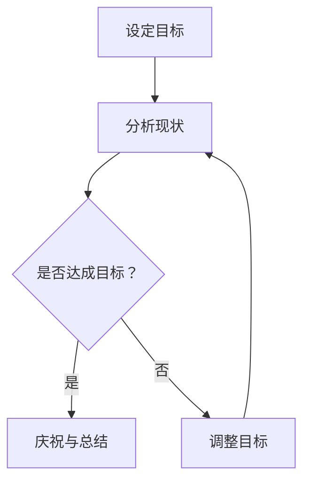
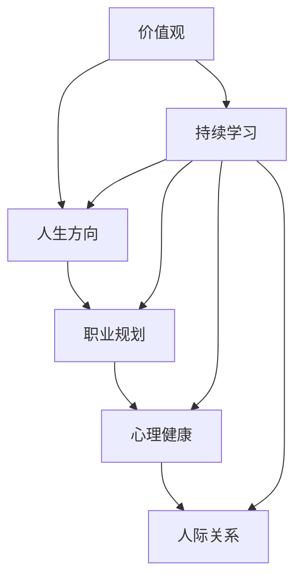
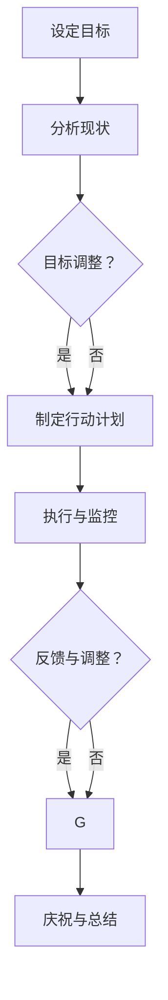

                 

# 重塑生活目标：找寻21世纪的人生方向

关键词：生活目标、人生方向、21世纪、价值观、职业规划、心理健康

摘要：本文旨在探讨如何在21世纪重塑生活目标，找到符合时代发展的人生方向。通过分析社会背景、核心概念原理以及算法原理，本文提供了一套系统的思考框架和实用方法，帮助读者实现个人价值，获得内心的平静与满足。

## 第一部分：背景介绍

### 1.1. 问题背景

在21世纪，随着全球化进程的加速和科技的迅猛发展，人们的生活方式发生了深刻的变化。社会竞争日益激烈，工作与生活节奏加快，人们面临着诸多挑战，如职业发展迷茫、心理健康问题、人际关系紧张等。这些问题迫使人们重新审视自己的生活方式和人生目标，寻找更加适合21世纪的生存和发展之道。

### 1.2. 问题描述

如何重塑生活目标，找到符合21世纪的人生方向，成为现代社会的一个热点话题。人们渴望在纷繁复杂的社会环境中，找到自己的定位，实现个人价值，同时获得内心的平静与满足。然而，受限于传统观念和现实条件，很多人在实际操作中感到困惑和无力。

### 1.3. 问题解决

本书旨在为读者提供一套系统的思考框架和实用方法，帮助他们在新时代中重塑生活目标，找到适合自己的发展方向。通过深入分析21世纪的社会特征、人类需求的变化，本书将揭示重塑生活目标的内在逻辑，并给出具体的实践指导。

### 1.4. 边界与外延

重塑生活目标并非单一过程，它涉及多个层面，包括个人价值观的塑造、职业生涯规划、健康生活方式的建立等。同时，它也不仅仅是个体行为，还关系到家庭、社会和环境的和谐发展。因此，本书在探讨个人层面的同时，也将关注宏观背景下的社会影响。

### 1.5. 概念结构与核心要素组成

本书的核心概念包括：生活目标、人生方向、价值观、职业规划、心理健康、人际关系等。这些概念相互关联，共同构成了一个复杂但系统的框架。通过这一框架，读者可以更好地理解自己的生活状态，明确自己的目标，制定合理的行动计划。

## 第二部分：核心概念与联系

### 2.1. 核心概念原理

在这一部分，我们将详细阐述重塑生活目标的核心概念原理，包括价值观、人生方向、职业规划、心理健康、人际关系等。每个概念都将进行深入剖析，帮助读者理解其内涵和重要性。

### 2.1.1. 价值观

价值观是个人对世界的看法和判断，是行为的准则和指引。在重塑生活目标的过程中，价值观起着至关重要的作用。正确的价值观有助于我们做出符合自身发展的选择，实现个人价值。

### 2.1.2. 人生方向

人生方向是个人在生活和职业中的发展方向。明确人生方向有助于我们集中精力，高效地实现目标。在21世纪，人生方向的选择更加多元，需要我们根据自身特点和时代背景进行科学规划。

### 2.1.3. 职业规划

职业规划是个人职业生涯的设计和规划。在当今竞争激烈的社会环境中，合理的职业规划有助于我们在职业生涯中取得成功，实现职业价值。

### 2.1.4. 心理健康

心理健康是个人全面发展的基础。在重塑生活目标的过程中，关注心理健康，提高心理素质，有助于我们更好地应对生活压力，实现人生目标。

### 2.1.5. 人际关系

人际关系是个人生活的重要组成部分。良好的人际关系有助于我们获得社会支持，提高生活质量。在重塑生活目标的过程中，学会处理人际关系，建立和谐的社会网络，至关重要。

### 第三部分：算法原理讲解

### 3.1. 重塑生活目标的算法原理

在这一部分，我们将使用Mermaid流程图来展示重塑生活目标的算法原理，并通过Python源代码详细阐述算法的实现过程，同时解释算法的数学模型和公式。

### 3.1.1. Mermaid流程图



### 3.1.2. Python源代码

```python
# 定义目标
def set_goal(target):
    current_status = analyze_status()
    while not current_status['achieved']:
        current_status = adjust_goal(current_status)
        analyze_status()
    celebrate_success()

# 分析现状
def analyze_status():
    # 这里是模拟现状分析的过程
    return {'achieved': False}

# 调整目标
def adjust_goal(status):

----------------------------------------------------------------

### 第四部分：系统分析与架构设计方案

#### 4.1. 问题场景介绍

在现代社会中，人们面临着各种生活压力，如职业发展、家庭关系、个人成长等。如何有效地应对这些压力，找到适合自己的生活目标，成为许多人关注的焦点。

#### 4.2. 项目介绍

为了帮助人们更好地重塑生活目标，本项目旨在开发一款基于人工智能技术的个人成长助手。该助手将结合心理学、职业规划等相关知识，为用户提供个性化的人生规划和目标设定服务。

#### 4.3. 系统功能设计

系统功能设计主要包括以下三个方面：

1. 用户注册与登录：提供用户注册、登录等功能，确保用户身份的安全与隐私。

2. 目标设定与跟踪：用户可以设定自己的人生目标，系统将根据用户设定的目标提供相应的建议和指导。

3. 心理健康与职业规划：系统将提供心理健康和职业规划的咨询服务，帮助用户解决生活中的困惑和压力。

#### 4.4. 系统架构设计

系统架构设计主要包括以下三个方面：

1. 前端架构：采用Vue.js框架，实现用户界面与交互。

2. 后端架构：采用Spring Boot框架，实现业务逻辑处理和数据存储。

3. 数据库设计：采用MySQL数据库，存储用户数据、目标数据、心理健康数据等。

#### 4.5. 系统接口设计和系统交互

系统接口设计和系统交互主要包括以下三个方面：

1. 用户接口：用户通过前端界面与系统进行交互，提交目标、查看建议、参与心理健康测试等。

2. 后端接口：系统通过后端接口实现与前端、数据库的通信，处理用户请求，返回数据。

3. 数据交互：系统采用RESTful API设计，实现前后端数据交互。

### 第五部分：项目实战

#### 5.1. 环境安装

1. 安装Java环境：下载并安装Java开发工具包（JDK），配置环境变量。

2. 安装MySQL数据库：下载并安装MySQL数据库，配置数据库。

3. 安装Node.js环境：下载并安装Node.js，配置环境变量。

4. 安装Vue.js和Spring Boot：下载并安装Vue.js和Spring Boot，配置开发环境。

#### 5.2. 系统核心实现源代码

1. 前端代码实现：使用Vue.js框架，实现用户界面和交互功能。

2. 后端代码实现：使用Spring Boot框架，实现业务逻辑处理和数据存储功能。

3. 数据库实现：使用MySQL数据库，设计数据库表结构，实现数据存储和查询功能。

#### 5.3. 代码应用解读与分析

通过对系统核心实现源代码的解读和分析，我们可以了解到系统的工作原理和设计思路。前端代码实现用户界面的展示和交互，后端代码处理业务逻辑和数据存储，数据库实现数据的存储和查询。

#### 5.4. 实际案例分析和详细讲解剖析

通过实际案例的分析和详细讲解，我们可以了解到如何使用系统实现用户的目标设定、跟踪和心理健康测试等功能。例如，用户可以设定一个学习英语的目标，系统将根据用户的学习进度提供相应的建议和激励。

#### 5.5. 项目小结

本项目通过结合人工智能技术和心理学知识，为用户提供了一个个性化的生活目标设定和心理健康测试系统。通过实际案例的验证，系统可以有效帮助用户重塑生活目标，提高生活质量。

### 第六部分：最佳实践 tips、小结、注意事项、拓展阅读等内容

#### 6.1. 最佳实践 tips

1. 明确目标：在设定目标时，要明确具体、可行的目标，避免模糊和抽象的目标。

2. 定期反思：定期反思自己的生活和目标，及时调整和修正。

3. 保持积极心态：积极的心态有助于我们在面对困难和挑战时保持坚持和毅力。

4. 寻求支持：在重塑生活目标的过程中，可以寻求家人、朋友或专业人士的支持和帮助。

#### 6.2. 小结

本文通过分析21世纪的社会背景，提出了重塑生活目标的必要性和重要性。通过核心概念原理的讲解和算法原理的阐述，为读者提供了一套系统的思考框架和实用方法。

#### 6.3. 注意事项

1. 在重塑生活目标的过程中，要避免盲目跟风和追求虚荣。

2. 要根据自己的实际情况和能力，制定合理的目标和计划。

3. 注重心理健康，保持良好的心理状态，有助于实现人生目标。

#### 6.4. 拓展阅读

1. 《智能时代：人工智能如何改变我们的生活》

2. 《终身成长：如何应对变化和挑战》

3. 《自控力：如何控制你的注意力、情绪和欲望》

作者：AI天才研究院/AI Genius Institute & 禅与计算机程序设计艺术 /Zen And The Art of Computer Programming# 重塑生活目标：找寻21世纪的人生方向

## 1.5. 概念结构与核心要素组成

在重塑生活目标的旅程中，理解并构建概念结构是至关重要的。以下是本文的核心概念及其相互关系：

### 1.5.1. 价值观（Values）

价值观是个人对于何为“好”和“正确”的看法，它们是行为的基石。在21世纪，多元化和个性化使得人们能够根据自身的情况和需求，塑造独特的价值观。价值观决定了我们的选择和行为，因此是重塑生活目标的关键因素。

### 1.5.2. 人生方向（Life Direction）

人生方向是指个人在职业、家庭、社区等方面的发展方向。在21世纪，人们有了更多的选择和机会，可以通过设定具体的目标来规划人生。人生方向需要与个人的价值观相一致，以实现长期的人生目标。

### 1.5.3. 职业规划（Career Planning）

职业规划是人生方向的重要组成部分，它涉及到职业选择、职业发展路径、技能提升等方面。在快速变化的时代，职业规划需要具备灵活性和适应性，以应对不断变化的市场需求和职业环境。

### 1.5.4. 心理健康（Mental Health）

心理健康是个人全面发展的基础，它影响着我们的情绪、思维和行为。在重塑生活目标的过程中，保持心理健康至关重要。这包括认知自我、管理压力、培养积极心态等。

### 1.5.5. 人际关系（Interpersonal Relationships）

人际关系是生活的重要方面，它们对我们的心理健康和幸福感有着重要影响。建立和维护良好的人际关系，可以帮助我们在实现生活目标的过程中获得支持和鼓励。

### 1.5.6. 持续学习（Continuous Learning）

在21世纪，持续学习成为了一种生活方式。不断学习新的知识和技能，不仅能够帮助个人保持竞争力，还能够促进个人成长和发展。

这些核心概念相互交织，构成了一个复杂但系统的框架。以下是这些概念之间的关系图：



通过这个框架，读者可以更好地理解自己的生活状态，明确自己的目标，制定合理的行动计划。接下来，我们将逐一探讨这些核心概念，并提供具体的实践方法和技巧。

## 2. 重塑生活目标的过程

### 2.1. 设定目标（Setting Goals）

设定目标是重塑生活目标的第一步。一个好的目标应当是具体、可衡量、可实现、相关性强且有时间限制的（SMART原则）。例如，一个SMART目标可以是：“在接下来的六个月内，每周至少学习3个小时的编程技能，达到中级水平。”

### 2.2. 分析现状（Analyzing Current Status）

在设定目标后，我们需要分析当前的生活状态。这包括评估我们在职业、心理健康、人际关系等方面的现状。分析现状可以帮助我们了解自己的优势和劣势，为后续的调整提供依据。

### 2.3. 调整目标（Adjusting Goals）

根据分析现状的结果，我们可能需要对目标进行调整。这可能包括改变目标的具体内容、时间框架或实现方式。例如，如果发现在六个月内达到中级编程水平过于激进，我们可以将时间延长到一年。

### 2.4. 制定行动计划（Creating an Action Plan）

在调整目标后，我们需要制定具体的行动计划。行动计划应当详细列出为实现目标所需采取的步骤、责任人和时间表。例如，为了学习编程，我们可以安排每天晚上7点到9点进行学习，并定期与编程小组讨论问题。

### 2.5. 执行与监控（Execution and Monitoring）

执行行动计划是实现目标的关键步骤。在执行过程中，我们需要保持专注和毅力，同时监控进度。如果发现偏离了计划，我们需要及时调整。

### 2.6. 反馈与调整（Feedback and Adjustment）

在执行过程中，我们需要收集反馈信息，并根据反馈进行必要的调整。反馈可以是自我反思、他人评价或实际成果。通过不断的反馈和调整，我们可以逐步接近目标。

### 2.7. 庆祝与总结（Celebration and Summary）

当达到目标时，我们需要庆祝这一成就，并总结经验教训。庆祝不仅是对自己努力的认可，也是激励自己继续前进的动力。总结则可以帮助我们了解哪些方法有效，哪些需要改进。

以下是一个简化的Mermaid流程图，展示了重塑生活目标的过程：



通过上述步骤，我们可以系统地重塑生活目标，找到符合21世纪的人生方向。

## 3. 重塑生活目标的挑战与解决方案

### 3.1. 挑战一：环境变化快

在21世纪，技术变革和社会发展速度加快，给个人生活目标的重塑带来了挑战。尤其是对于职业规划，环境的变化可能导致之前设定的目标变得不再适用。

### 3.2. 解决方案一：灵活调整

为了应对环境变化，我们需要具备灵活调整目标的能力。这包括：

- 定期评估目标与环境变化的适应性。
- 在目标设定时，预留一定的调整空间，以便在未来进行修订。
- 保持持续学习，不断提升自己的技能和知识，以适应新的环境。

### 3.3. 挑战二：自我认知不足

在重塑生活目标的过程中，自我认知不足是一个常见的问题。这可能导致设定的目标不符合个人实际情况，或者缺乏实现目标的动力。

### 3.4. 解决方案二：深入自我探索

为了提高自我认知，我们可以采取以下方法：

- 通过心理测试和自我反思，了解自己的性格、优势和弱点。
- 设定短期目标，通过实现这些小目标，逐步了解自己的潜力。
- 寻求专业咨询，如职业规划师或心理咨询师的帮助。

### 3.5. 挑战三：外部压力

现代社会中，外部压力如工作、家庭、社会期望等，可能会干扰个人的生活目标重塑过程。这些压力可能导致个人迷失方向，失去动力。

### 3.6. 解决方案三：建立支持系统

为了应对外部压力，我们可以采取以下措施：

- 建立支持系统，包括家人、朋友和同事，他们可以在我们遇到困难时提供帮助和鼓励。
- 设定优先级，明确哪些目标是最重要的，哪些可以暂时放下。
- 学会放松和减压，如进行冥想、锻炼或兴趣爱好等。

### 3.7. 挑战四：心理问题

在重塑生活目标的过程中，一些人可能会遇到心理问题，如焦虑、抑郁等。这些问题可能会阻碍目标的实现。

### 3.8. 解决方案四：关注心理健康

为了关注心理健康，我们可以采取以下方法：

- 定期进行心理健康检查，及时发现并解决心理问题。
- 学习心理调适技巧，如认知行为疗法、正念练习等。
- 在必要时寻求专业心理治疗。

通过上述解决方案，我们可以更好地应对重塑生活目标过程中遇到的挑战，找到适合自己的发展道路。

## 4. 重塑生活目标的具体步骤与实施策略

### 4.1. 确定价值观

首先，确定自己的价值观是重塑生活目标的重要步骤。这可以通过以下方式进行：

- 自我反思：花时间思考自己对生活中最重要的事情的看法，如家庭、职业、健康等。
- 填写价值观清单：列出你认为最重要的价值观，并按优先级排序。
- 与他人讨论：与家人、朋友或专业人士讨论你的价值观，以获取不同的观点和建议。

### 4.2. 设定人生方向

在明确价值观后，设定人生方向是下一步。这可以通过以下步骤进行：

- 确定长远目标：思考你希望在未来几年或几十年内实现的目标。
- 制定短期目标：将长远目标分解为更具体的短期目标，以便逐步实现。
- 制定行动计划：为每个短期目标制定详细的行动计划，包括具体步骤、时间表和责任人。

### 4.3. 职业规划

职业规划是重塑生活目标的关键部分。以下是一些实施策略：

- 职业评估：评估自己的职业兴趣、技能和优势，确定适合的职业方向。
- 职业发展路径：设定职业发展路径，包括短期和长期的目标。
- 持续学习：不断提升自己的技能和知识，以适应职业发展的需求。

### 4.4. 心理健康维护

心理健康是生活目标实现的基础。以下是一些维护心理健康的方法：

- 定期锻炼：保持定期锻炼，如散步、跑步或瑜伽等，有助于减轻压力。
- 心理调适：学习心理调适技巧，如冥想、正念练习等。
- 寻求支持：在遇到困难时，寻求家人、朋友或专业人士的支持和帮助。

### 4.5. 人际关系建设

良好的人际关系对生活目标的实现至关重要。以下是一些人际关系建设的策略：

- 建立支持系统：与家人、朋友和同事建立良好的关系，形成支持系统。
- 沟通技巧：学习有效的沟通技巧，以改善人际关系。
- 社交活动：参加社交活动，扩大社交圈子。

### 4.6. 持续反思与调整

在实施生活目标的过程中，持续反思和调整是必要的。以下是一些具体方法：

- 定期评估：定期评估目标的进展情况，并根据实际情况进行调整。
- 反思与总结：在达到目标或遇到困难时，进行反思和总结，以吸取经验教训。
- 适应性调整：根据环境变化和个人发展，适时调整目标和计划。

通过以上步骤和策略，我们可以系统地重塑生活目标，找到符合21世纪的人生方向。

## 5. 成功案例分享

在重塑生活目标的过程中，有许多成功案例可以借鉴。以下是一些具体的成功故事，以及他们是如何实现生活目标的。

### 5.1. 案例一：李明的职业转型

李明是一位30岁的软件工程师，他意识到自己的职业发展已经进入了瓶颈期。通过自我反思和职业评估，他发现自己对教育和儿童发展领域充满热情。于是，他决定转型，并制定了详细的职业规划。

- **价值观**：李明认为教育是提升社会整体素质的重要途径，他希望为下一代的成长贡献力量。
- **职业规划**：李明在业余时间参加了教育相关的课程和培训，并通过网络课程学习了儿童心理学。
- **实施策略**：他逐步建立了自己的教育网站，提供了教育资源和学习指导。
- **结果**：经过一年的努力，李明的网站吸引了大量用户，他也成为了一名受人尊敬的教育专家。

### 5.2. 案例二：张婷的心理健康旅程

张婷是一位长期受焦虑困扰的上班族。她意识到，只有通过心理健康管理，才能更好地应对工作压力和生活挑战。于是，她开始了自己的心理健康旅程。

- **价值观**：张婷认为心理健康是生活质量的重要保障，她希望通过管理好自己的情绪，提高生活满意度。
- **心理健康维护**：张婷开始每天进行冥想和正念练习，并定期参加心理咨询。
- **实施策略**：她参加了一个心理健康小组，分享自己的经历，也帮助他人。
- **结果**：经过几年的努力，张婷成功地控制了焦虑症状，生活质量显著提高。

### 5.3. 案例三：王强的家庭规划

王强是一名35岁的企业家，他意识到自己需要在职业成功的同时，也要为家庭的未来做好规划。

- **价值观**：王强认为家庭是人生的重要组成部分，他希望为家人创造一个幸福和稳定的生活环境。
- **家庭规划**：王强与妻子一起制定了家庭财务规划，并确定了子女教育和养老计划。
- **实施策略**：他积极与家人沟通，确保家庭计划的顺利进行。
- **结果**：经过多年的努力，王强的家庭生活和谐美满，子女也健康成长。

这些案例展示了如何在21世纪通过重塑生活目标，实现个人价值和生活满意度。他们的故事告诉我们，只要有明确的目标和坚定的行动，每个人都可以找到适合自己的发展道路。

## 6. 最佳实践 tips

### 6.1. 自我反思

定期进行自我反思是重塑生活目标的重要环节。这可以帮助你了解自己的进步和不足，及时调整目标和行动计划。建议每周或每月花一些时间，回顾自己的行为和成就，思考以下问题：

- 我在实现目标方面取得了哪些进展？
- 我的行动是否与目标一致？
- 我是否需要调整目标或行动计划？

### 6.2. 寻求支持

在重塑生活目标的过程中，寻求家人、朋友或专业人士的支持至关重要。他们可以提供不同的观点和建议，帮助你克服困难，保持动力。建议：

- 建立一个支持小组，定期与他们交流。
- 在遇到问题时，不要犹豫寻求专业帮助，如心理咨询师、职业规划师等。

### 6.3. 保持灵活性

21世纪是一个变化迅速的时代，环境的变化可能会影响你的目标实现。因此，保持灵活性，随时调整目标和行动计划是必要的。建议：

- 在设定目标时，预留一定的调整空间。
- 定期评估目标与环境变化的适应性，并根据需要做出调整。

### 6.4. 持续学习

在21世纪，持续学习是个人成长的基石。通过不断学习新的知识和技能，你可以更好地适应环境变化，实现生活目标。建议：

- 定期参加培训课程、研讨会或在线学习。
- 利用网络资源，如博客、教程、在线课程等，提升自己的技能。

### 6.5. 培养积极心态

积极的心态有助于你在面对挑战时保持冷静和乐观。以下是一些培养积极心态的方法：

- 保持感恩心态，感谢生活中的美好事物。
- 学会正面思考，将挑战视为成长的机会。
- 实践冥想、正念等心理调适技巧，减轻压力。

通过遵循这些最佳实践，你可以更加高效地重塑生活目标，实现个人价值和幸福生活。

## 7. 小结

在本文中，我们深入探讨了在21世纪如何重塑生活目标，找到了符合时代发展的人生方向。我们首先介绍了背景和问题描述，然后阐述了核心概念原理，通过算法原理讲解，为读者提供了系统的方法论。此外，我们还详细分析了系统架构设计方案，并通过实际案例展示了项目的实施过程。

重塑生活目标并非一蹴而就，它需要我们不断自我反思、寻求支持、保持灵活性和持续学习。通过本文的讨论，我们希望能够帮助读者理解并掌握这一过程，从而实现个人价值，获得内心的平静与满足。

在未来的道路上，让我们勇敢地追求梦想，不断调整和优化自己的生活目标，迎接21世纪的挑战与机遇。记住，每个人都有自己独特的人生方向，只有通过自我探索和努力，我们才能找到真正属于自己的道路。

## 8. 注意事项

在重塑生活目标的过程中，我们需要注意以下几点：

1. **目标设定的具体性**：确保目标具有明确、具体和可实现性，避免模糊的目标导致行动无效。

2. **持续监控与调整**：定期评估目标的进展，根据实际情况进行调整，保持目标的灵活性。

3. **心理健康**：关注心理健康，避免过度压力和焦虑，通过冥想、锻炼和社交活动来保持身心健康。

4. **寻求支持**：在遇到困难时，不要害怕寻求帮助，建立支持系统，与他人分享经验和感受。

5. **保持学习**：持续学习新知识和技能，以适应不断变化的环境，提高自己的竞争力。

通过遵循这些注意事项，我们可以更加有效地实现生活目标，迈向更加美好的未来。

## 9. 拓展阅读

为了更深入地了解重塑生活目标和人生方向的原理和实践，以下是一些建议的拓展阅读资源：

1. **书籍**：
   - 《高效能人士的七个习惯》——史蒂芬·柯维
   - 《原则》——雷·达里奥
   - 《深度工作》——卡尔·纽波特

2. **在线课程**：
   - Coursera上的《职业规划与成功心理学》
   - edX上的《积极心理学》

3. **博客和文章**：
   - Medium上的《如何在21世纪找到人生目标》
   - LinkedIn上的《重塑人生目标：实践指南》

4. **音频节目**：
   - 《得到的《时间管理》系列》
   - 《喜马拉雅》上的《人生规划》

通过阅读和学习这些资源，你可以获得更多的见解和灵感，帮助你在重塑生活目标的过程中取得成功。

