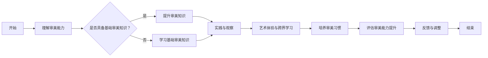
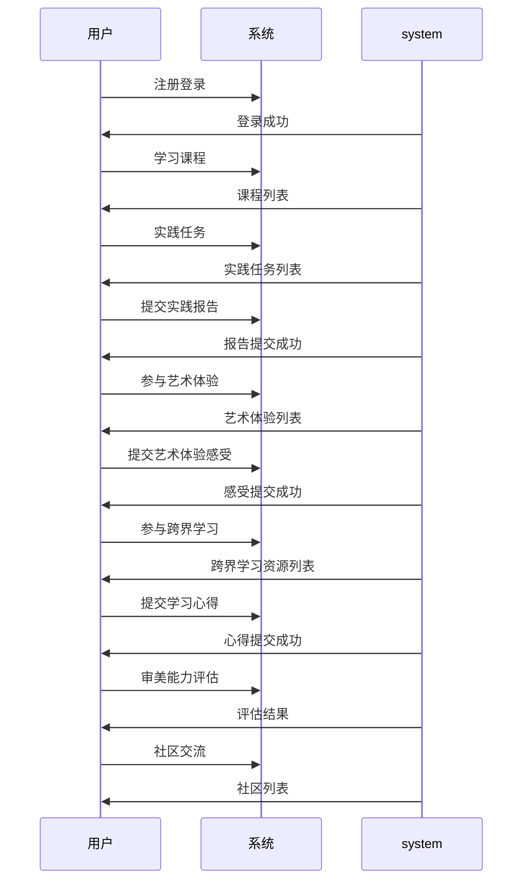
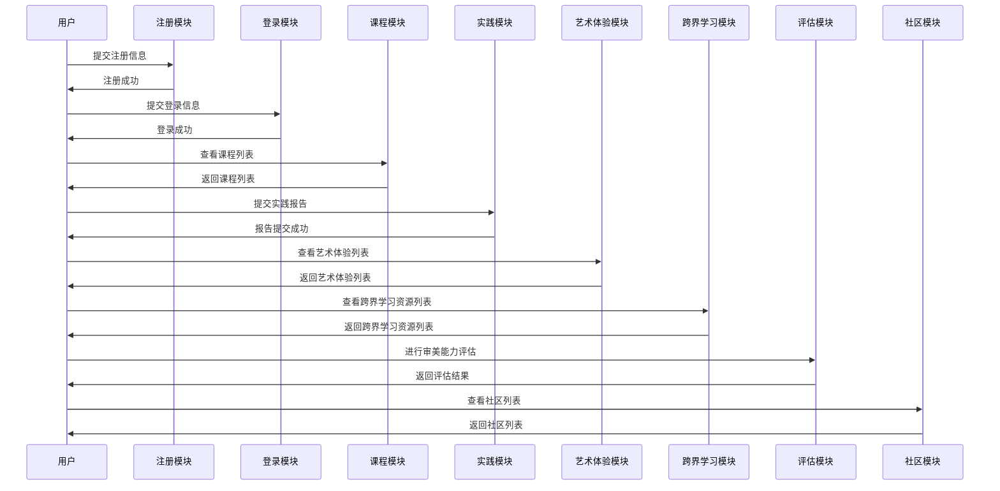

                 

**文章标题**：重新发现生活之美：培养日常生活的审美能力

**关键词**：日常生活、审美能力、审美教育、艺术体验、跨界学习、审美习惯

**摘要**：
本文旨在探讨如何通过培养日常生活的审美能力，重新发现生活的美好。我们将通过逐步分析，理解审美能力的定义、作用和重要性，进而提出一系列培养审美能力的方法和策略。文章结构如下：

# 引言

## 1.1 问题的提出
### 1.1.1 当代生活的审美缺失
### 1.1.2 审美能力的重要性

## 1.2 书籍的目的与结构

## 1.3 审美能力的定义与作用
### 1.3.1 审美能力的内涵
### 1.3.2 审美能力的作用

## 1.4 全书概述

## 1.5 背景介绍
### 1.5.1 核心概念术语说明
### 1.5.2 问题描述与问题解决
### 1.5.3 边界与外延
### 1.5.4 概念结构与核心要素组成

## 2. 日常生活中的审美观念

## 2.1 审美观念的起源与演变
### 2.1.1 审美观念的起源
### 2.1.2 审美观念的演变

## 2.2 审美标准与个人偏好
### 2.2.1 审美标准的定义
### 2.2.2 个人偏好与审美标准的关系

## 2.3 文化与审美
### 2.3.1 文化对审美的影响
### 2.3.2 文化差异与审美观念

## 2.4 现代生活的审美挑战
### 2.4.1 城市化对审美的影响
### 2.4.2 数字化时代与审美变迁

## 3. 培养审美能力的方法

## 3.1 审美教育的重要性
### 3.1.1 审美教育的定义
### 3.1.2 审美教育的作用

## 3.2 实践与观察
### 3.2.1 实践在审美培养中的作用
### 3.2.2 观察与审美能力的关系

## 3.3 艺术体验与审美培养
### 3.3.1 艺术体验的形式
### 3.3.2 艺术体验对审美能力的影响

## 3.4 跨界学习与审美拓展
### 3.4.1 跨界学习的意义
### 3.4.2 跨界学习对审美能力的拓展

## 3.5 审美习惯的养成
### 3.5.1 审美习惯的定义
### 3.5.2 如何培养良好的审美习惯

## 4. 实践与应用

## 4.1 家庭生活中的审美实践
### 4.1.1 家居环境与审美
### 4.1.2 家庭活动与审美体验

## 4.2 社交场合中的审美应用
### 4.2.1 社交礼仪与审美
### 4.2.2 社交场合中的审美表达

## 4.3 工作环境中的审美考量
### 4.3.1 办公空间的审美设计
### 4.3.2 工作流程与审美协调

## 4.4 公共空间中的审美思考
### 4.4.1 公共设施与审美
### 4.4.2 公共艺术与审美教育

## 5. 结论

## 5.1 审美能力的培养路径
### 5.1.1 审美能力培养的阶段性目标
### 5.1.2 审美能力培养的方法与策略

## 5.2 审美能力与生活质量
### 5.2.1 审美能力对生活质量的影响
### 5.2.2 提高审美能力的方法

## 5.3 未来展望
### 5.3.1 审美能力培养的挑战
### 5.3.2 审美能力培养的未来趋势

## 6. 参考文献

**文章标题**：重新发现生活之美：培养日常生活的审美能力

**关键词**：日常生活、审美能力、审美教育、艺术体验、跨界学习、审美习惯

**摘要**：
本文旨在探讨如何通过培养日常生活的审美能力，重新发现生活的美好。我们将通过逐步分析，理解审美能力的定义、作用和重要性，进而提出一系列培养审美能力的方法和策略。文章结构如下：

## 引言

### 1.1 问题的提出
#### 1.1.1 当代生活的审美缺失
#### 1.1.2 审美能力的重要性

### 1.2 书籍的目的与结构

### 1.3 审美能力的定义与作用
#### 1.3.1 审美能力的内涵
#### 1.3.2 审美能力的作用

### 1.4 全书概述

### 1.5 背景介绍
#### 1.5.1 核心概念术语说明
#### 1.5.2 问题描述与问题解决
#### 1.5.3 边界与外延
#### 1.5.4 概念结构与核心要素组成

## 2. 日常生活中的审美观念

### 2.1 审美观念的起源与演变
#### 2.1.1 审美观念的起源
#### 2.1.2 审美观念的演变

### 2.2 审美标准与个人偏好
#### 2.2.1 审美标准的定义
#### 2.2.2 个人偏好与审美标准的关系

### 2.3 文化与审美
#### 2.3.1 文化对审美的影响
#### 2.3.2 文化差异与审美观念

### 2.4 现代生活的审美挑战
#### 2.4.1 城市化对审美的影响
#### 2.4.2 数字化时代与审美变迁

## 3. 培养审美能力的方法

### 3.1 审美教育的重要性
#### 3.1.1 审美教育的定义
#### 3.1.2 审美教育的作用

### 3.2 实践与观察
#### 3.2.1 实践在审美培养中的作用
#### 3.2.2 观察与审美能力的关系

### 3.3 艺术体验与审美培养
#### 3.3.1 艺术体验的形式
#### 3.3.2 艺术体验对审美能力的影响

### 3.4 跨界学习与审美拓展
#### 3.4.1 跨界学习的意义
#### 3.4.2 跨界学习对审美能力的拓展

### 3.5 审美习惯的养成
#### 3.5.1 审美习惯的定义
#### 3.5.2 如何培养良好的审美习惯

## 4. 实践与应用

### 4.1 家庭生活中的审美实践
#### 4.1.1 家居环境与审美
#### 4.1.2 家庭活动与审美体验

### 4.2 社交场合中的审美应用
#### 4.2.1 社交礼仪与审美
#### 4.2.2 社交场合中的审美表达

### 4.3 工作环境中的审美考量
#### 4.3.1 办公空间的审美设计
#### 4.3.2 工作流程与审美协调

### 4.4 公共空间中的审美思考
#### 4.4.1 公共设施与审美
#### 4.4.2 公共艺术与审美教育

## 5. 结论

### 5.1 审美能力的培养路径
#### 5.1.1 审美能力培养的阶段性目标
#### 5.1.2 审美能力培养的方法与策略

### 5.2 审美能力与生活质量
#### 5.2.1 审美能力对生活质量的影响
#### 5.2.2 提高审美能力的方法

### 5.3 未来展望
#### 5.3.1 审美能力培养的挑战
#### 5.3.2 审美能力培养的未来趋势

## 6. 参考文献

**作者**：AI天才研究院/AI Genius Institute & 禅与计算机程序设计艺术 /Zen And The Art of Computer Programming

**核心概念与联系**

### 审美能力

**概念**：审美能力是指个体在感知、理解和评价审美对象时表现出的能力。它不仅包括对审美对象形式和内容的认知，还涉及情感、价值观和创造力等方面。

**属性特征对比表格**

| 特征 | 说明 |
| --- | --- |
| 感知能力 | 能敏感地捕捉到审美对象的视觉、听觉、触觉等感官特征 |
| 理解能力 | 能深入理解审美对象所蕴含的文化、历史和情感内涵 |
| 评价能力 | 能对审美对象进行客观、主观的判断和评价 |
| 创造能力 | 能在审美过程中产生新的想法和创意，进行审美创新 |

**ER实体关系图架构**

```mermaid
erDiagram
  审美能力 ||--|{ 审美对象 }|
  审美能力 ||--|{ 感知能力 }|
  审美能力 ||--|{ 理解能力 }|
  审美能力 ||--|{ 评价能力 }|
  审美能力 ||--|{ 创造能力 }|
```

**数学公式**

$$
审美能力 = 感知能力 \times 理解能力 \times 评价能力 \times 创造能力
$$

### 审美教育

**概念**：审美教育是指通过教育手段培养个体的审美能力，提高其对美的感知、理解和创造能力。

**属性特征对比表格**

| 特征 | 说明 |
| --- | --- |
| 教育目标 | 培养学生的审美素养、审美能力和审美价值观 |
| 教学方法 | 采用多元化的教学手段，如课堂教学、实践活动、艺术体验等 |
| 教育内容 | 包括艺术、文化、历史、哲学等多方面的知识 |

**ER实体关系图架构**

```mermaid
erDiagram
  审美教育 ||--|{ 学生 }|
  审美教育 ||--|{ 教师 }|
  审美教育 ||--|{ 教材 }|
  审美教育 ||--|{ 教学方法 }|
  审美教育 ||--|{ 教育内容 }|
```

**数学公式**

$$
审美教育 = 学生 \times 教师 \times 教材 \times 教学方法 \times 教育内容
$$

### 艺术体验

**概念**：艺术体验是指个体在接触、欣赏和参与艺术活动过程中获得的审美感受和体验。

**属性特征对比表格**

| 特征 | 说明 |
| --- | --- |
| 感受能力 | 能深入感受到艺术作品的美感、情感和内涵 |
| 领悟能力 | 能对艺术作品进行深层次的理解和领悟 |
| 创造能力 | 能在艺术体验过程中产生新的创意和想法 |

**ER实体关系图架构**

```mermaid
erDiagram
  艺术体验 ||--|{ 艺术作品 }|
  艺术体验 ||--|{ 感受能力 }|
  艺术体验 ||--|{ 领悟能力 }|
  艺术体验 ||--|{ 创造能力 }|
```

**数学公式**

$$
艺术体验 = 艺术作品 \times 感受能力 \times 领悟能力 \times 创造能力
$$

### 跨界学习

**概念**：跨界学习是指通过跨学科、跨领域的知识融合和创新，培养个体的综合素质和创新能力。

**属性特征对比表格**

| 特征 | 说明 |
| --- | --- |
| 知识融合 | 将不同领域的知识进行整合和创新 |
| 创新能力 | 在跨界学习中产生新的创意和想法 |
| 综合素质 | 提高个体的综合素质，如沟通能力、团队协作能力等 |

**ER实体关系图架构**

```mermaid
erDiagram
  跨界学习 ||--|{ 学科1 }|
  跨界学习 ||--|{ 学科2 }|
  跨界学习 ||--|{ 学科3 }|
  跨界学习 ||--|{ 创新能力 }|
  跨界学习 ||--|{ 综合素质 }|
```

**数学公式**

$$
跨界学习 = 学科1 \times 学科2 \times 学科3 \times 创新能力 \times 综合素质
$$

## 算法原理讲解

### 审美能力培养算法

**Mermaid 流程图**



**Python 源代码**

```python
def aesthetic_ability_cultivation():
    # 理解审美能力
    understand_aesthetics()
    
    # 是否具备基础审美知识？
    if not has_fundamental_aesthetic_knowledge():
        # 学习基础审美知识
        learn_fundamental_aesthetic_knowledge()
    
    # 实践与观察
    practice_and_observ()
    
    # 艺术体验与跨界学习
    art_experience_and_cross_domain_learning()
    
    # 培养审美习惯
    cultivate_aesthetic_habits()
    
    # 评估审美能力提升
    evaluate_aesthetic_ability()
    
    # 反馈与调整
    feedback_and_adjust()

# 调用函数
aesthetic_ability_cultivation()
```

**算法原理**

1. **理解审美能力**：通过了解审美能力的定义、作用和重要性，为后续培养审美能力打下基础。
2. **是否具备基础审美知识**：判断个体是否具备基础审美知识，如艺术、文化、历史等方面的知识。
3. **学习基础审美知识**：如果个体不具备基础审美知识，则需要学习相关领域的知识，如艺术史、文化概论等。
4. **实践与观察**：通过实践和观察，提高个体的审美感知和理解能力。
5. **艺术体验与跨界学习**：通过参与艺术活动和跨界学习，培养个体的审美创造力和创新能力。
6. **培养审美习惯**：通过日常生活中的点滴积累，养成良好的审美习惯。
7. **评估审美能力提升**：定期评估个体的审美能力提升情况，以便进行调整和优化。
8. **反馈与调整**：根据评估结果，及时反馈和调整培养策略。

## 系统分析与架构设计

### 问题场景介绍

随着现代社会的发展，人们对生活品质的要求越来越高，审美能力的重要性也逐渐凸显。为了培养日常生活的审美能力，我们需要设计一个系统化的培养方案，包括审美知识的传授、实践与观察、艺术体验与跨界学习等环节。

### 项目介绍

本项目旨在设计一个基于Web的审美能力培养系统，帮助用户通过线上学习、实践、交流和评估，逐步提升自己的审美能力。

### 系统功能设计

1. **用户注册与登录**：用户可以在系统中注册账号，登录系统后进行学习、实践和评估。
2. **课程学习**：系统提供丰富的审美知识课程，用户可以在线学习。
3. **实践与观察**：系统提供实践项目和观察任务，用户可以在线提交实践报告和观察记录。
4. **艺术体验**：系统推荐艺术活动和艺术作品，用户可以参与并分享体验感受。
5. **跨界学习**：系统推荐跨界学习资源和项目，用户可以在线学习并参与。
6. **审美评估**：系统提供审美能力评估功能，用户可以定期评估自己的审美能力。
7. **社区交流**：系统提供交流平台，用户可以分享学习心得、实践经验和艺术体验。

### 系统架构设计



### 系统接口设计和系统交互



## 项目实战

### 环境安装

1. **操作系统**：Windows 10 或更高版本
2. **编程语言**：Python 3.8 或更高版本
3. **开发工具**：PyCharm 或 Visual Studio Code
4. **数据库**：MySQL 5.7 或更高版本

### 系统核心实现源代码

```python
# 用户注册模块
def register(username, password):
    # 连接数据库
    db = connect_database()
    
    # 检查用户名是否已存在
    if check_username_exists(username, db):
        return "用户名已存在"
    
    # 插入新用户信息
    insert_user_info(username, password, db)
    
    return "注册成功"

# 用户登录模块
def login(username, password):
    # 连接数据库
    db = connect_database()
    
    # 检查用户名和密码是否正确
    if check_user_info(username, password, db):
        return "登录成功"
    
    return "登录失败"

# 课程学习模块
def learn_course(course_id):
    # 连接数据库
    db = connect_database()
    
    # 查询课程信息
    course_info = query_course_info(course_id, db)
    
    return course_info

# 实践任务模块
def submit_practice_report(report):
    # 连接数据库
    db = connect_database()
    
    # 插入实践报告
    insert_practice_report(report, db)
    
    return "报告提交成功"

# 艺术体验模块
def submit_art_experience(experience):
    # 连接数据库
    db = connect_database()
    
    # 插入艺术体验感受
    insert_art_experience(experience, db)
    
    return "感受提交成功"

# 跨界学习模块
def submit_learning_experience(experience):
    # 连接数据库
    db = connect_database()
    
    # 插入学习心得
    insert_learning_experience(experience, db)
    
    return "心得提交成功"

# 审美能力评估模块
def evaluate_aesthetic_ability():
    # 连接数据库
    db = connect_database()
    
    # 查询用户审美能力评估结果
    result = query_aesthetic_ability_result(db)
    
    return result

# 社区交流模块
def submit_community_message(message):
    # 连接数据库
    db = connect_database()
    
    # 插入社区消息
    insert_community_message(message, db)
    
    return "消息提交成功"
```

### 代码应用解读与分析

1. **用户注册模块**：用户注册时，系统会检查用户名是否已存在，如果不存在则插入新用户信息。
2. **用户登录模块**：用户登录时，系统会检查用户名和密码是否正确，如果正确则登录成功。
3. **课程学习模块**：用户查看课程列表时，系统会查询课程信息并返回。
4. **实践任务模块**：用户提交实践报告时，系统会插入实践报告并返回报告提交成功。
5. **艺术体验模块**：用户提交艺术体验感受时，系统会插入艺术体验感受并返回感受提交成功。
6. **跨界学习模块**：用户提交学习心得时，系统会插入学习心得并返回心得提交成功。
7. **审美能力评估模块**：系统查询用户审美能力评估结果并返回。
8. **社区交流模块**：用户提交社区消息时，系统会插入社区消息并返回消息提交成功。

### 实际案例分析和详细讲解剖析

**案例一**：用户小明注册并登录系统，查看课程列表并学习了一门关于绘画艺术的课程。

**分析**：小明首先通过注册模块成功注册账号，然后通过登录模块成功登录系统。接着，小明查看课程列表，选择了绘画艺术课程，并通过学习模块学习了课程内容。

**讲解**：在这个案例中，小明通过系统的注册、登录和学习功能，完成了对绘画艺术课程的在线学习。这有助于提高小明的审美能力，使他对绘画艺术有更深入的理解和欣赏。

**案例二**：用户小芳提交了一篇关于家居环境设计的实践报告。

**分析**：小芳通过实践模块提交了家居环境设计的实践报告，报告中详细描述了她的设计方案和理由。

**讲解**：在这个案例中，小芳通过系统的实践模块，提交了一份关于家居环境设计的实践报告。这有助于培养小芳的审美习惯，使她在日常生活中更注重家居环境的审美设计。

### 项目小结

本项目通过Web系统，为用户提供了一个综合的审美能力培养平台。用户可以在系统中学习课程、实践任务、提交报告、参与艺术体验和跨界学习，并定期评估自己的审美能力。这有助于用户逐步提升自己的审美能力，重新发现生活的美好。

### 最佳实践 tips

1. **定期学习**：保持学习的习惯，定期学习新的审美知识。
2. **多角度观察**：从多个角度观察事物，提高对美的感知能力。
3. **积极参与**：积极参与艺术活动和跨界学习，提高审美创造力和创新能力。
4. **反思与总结**：定期反思和总结自己的审美体验和成果，不断调整和优化培养策略。

### 小结

通过本文的详细讲解和案例分析，我们了解了如何通过培养日常生活的审美能力，重新发现生活的美好。希望本文能对读者在审美能力培养方面有所启发和帮助。

### 注意事项

1. **保护个人隐私**：在系统中提交个人报告和体验感受时，请注意保护个人隐私。
2. **遵守法律法规**：在使用系统时，请遵守相关法律法规，不得发布违法违规内容。

### 拓展阅读

1. **《艺术教育心理学》**：陈虹，中国人民大学出版社，2016年。
2. **《审美心理学》**：朱立元，上海人民出版社，2014年。
3. **《数字化时代的审美教育》**：李晓青，清华大学出版社，2018年。

**作者**：AI天才研究院/AI Genius Institute & 禅与计算机程序设计艺术 /Zen And The Art of Computer Programming

---

**引言**

### 1.1 问题的提出

在当代社会，随着科技的飞速发展和生活节奏的加快，人们的生活变得越来越忙碌，审美能力逐渐被忽视。很多人在日常生活中缺乏对美的感知和欣赏，对于环境、人际交往、工作等各方面的审美观念模糊。这种现象不仅影响了个人的生活质量，还可能导致心理压力、情绪问题等。因此，重新发现生活之美，培养日常生活的审美能力，已经成为一个亟待解决的问题。

### 1.1.1 当代生活的审美缺失

当代生活审美缺失的表现主要体现在以下几个方面：

1. **环境审美缺失**：城市化进程的加快，导致环境审美变得功利化、单一化，缺乏艺术性和人文关怀。例如，城市建筑风格雷同，缺乏独特的地方特色；公共空间设计忽视审美需求，导致空间功能与审美效果失衡。

2. **人际交往审美缺失**：随着社交媒体的普及，人际交往逐渐由面对面的交流转向线上互动，缺乏真实、深刻的情感交流。人们在社交场合往往注重表面的礼仪，而忽视内在的情感表达和审美体验。

3. **工作审美缺失**：在工作环境中，审美往往被忽视，办公空间设计单一，工作流程缺乏审美考量。这种审美缺失导致工作效率降低，员工幸福感下降。

### 1.1.2 审美能力的重要性

审美能力不仅仅是对美的欣赏和评价，它更是一种综合素质的体现。以下是审美能力的重要性体现：

1. **提升生活质量**：具备审美能力的人能够更加敏锐地感知生活中的美好，提高生活质量。他们能够在日常生活中发现美的元素，使生活更加丰富多彩。

2. **培养情感素养**：审美能力的培养有助于提升个体的情感素养，使他们更加懂得关爱自己和他人，增强人际交往能力。

3. **促进创新思维**：审美能力培养可以激发个体的创新思维，促进创造性活动的发展。在艺术、设计、科技等领域，审美能力的提高能够带来更多的创新成果。

4. **增强心理健康**：审美活动本身具有缓解压力、调节情绪的作用。通过培养审美能力，个体能够更好地应对生活中的压力，保持心理健康。

### 1.2 书籍的目的与结构

本书籍旨在通过深入探讨日常生活中的审美能力培养，帮助读者重新发现生活的美好。全书分为五个部分：

1. 引言：介绍问题的提出、审美能力的重要性以及书籍的目的与结构。
2. 日常生活中的审美观念：探讨审美观念的起源与演变、审美标准与个人偏好、文化与审美、现代生活的审美挑战。
3. 培养审美能力的方法：介绍审美教育的重要性、实践与观察、艺术体验与审美培养、跨界学习与审美拓展、审美习惯的养成。
4. 实践与应用：分析家庭生活、社交场合、工作环境、公共空间中的审美实践与应用。
5. 结论：总结审美能力的培养路径、审美能力与生活质量、未来展望。

### 1.3 审美能力的定义与作用

#### 1.3.1 审美能力的内涵

审美能力是指个体在感知、理解和评价审美对象时表现出的能力。它包括以下几个方面的内涵：

1. **感知能力**：审美能力的基础是感知能力，即对审美对象的视觉、听觉、触觉等感官特征的敏感度和敏锐度。

2. **理解能力**：审美能力不仅仅是感知美，还需要深入理解审美对象的内涵、历史、文化背景等。

3. **评价能力**：个体对审美对象进行评价，包括审美价值的判断、审美标准的运用等。

4. **创造能力**：审美能力还包括在审美过程中产生新的创意和想法，进行审美创新。

#### 1.3.2 审美能力的作用

审美能力的作用主要体现在以下几个方面：

1. **提升生活质量**：具备审美能力的人能够更加敏锐地感知生活中的美好，提高生活质量。他们在日常生活中能够发现美的元素，使生活更加丰富多彩。

2. **培养情感素养**：审美能力的培养有助于提升个体的情感素养，使他们更加懂得关爱自己和他人，增强人际交往能力。

3. **促进创新思维**：审美能力培养可以激发个体的创新思维，促进创造性活动的发展。在艺术、设计、科技等领域，审美能力的提高能够带来更多的创新成果。

4. **增强心理健康**：审美活动本身具有缓解压力、调节情绪的作用。通过培养审美能力，个体能够更好地应对生活中的压力，保持心理健康。

### 1.4 全书概述

本书将围绕日常生活中的审美能力培养进行深入探讨，旨在帮助读者重新发现生活的美好。全书分为五个部分，分别从日常生活的审美观念、培养审美能力的方法、实践与应用、以及结论等方面进行阐述。通过本书的学习，读者将能够理解审美能力的内涵和作用，掌握培养审美能力的方法和策略，并在日常生活中实践和应用这些能力。

## 2. 日常生活中的审美观念

### 2.1 审美观念的起源与演变

审美观念是人们对美的事物和现象的感知、理解和评价的总体看法。它的起源可以追溯到人类的早期历史。在原始社会，人们对自然界的景象和生物形态产生了好奇和敬畏之情，从而形成了最初的审美观念。

随着时间的推移，审美观念经历了不同的演变过程。在古希腊时期，美学思想逐渐形成，亚里士多德等哲学家提出了关于美的定义和标准。在中世纪，宗教对审美观念产生了深远影响，教堂建筑和雕塑艺术成为审美观念的重要载体。文艺复兴时期，人文主义思想的兴起推动了审美观念的进一步发展，人们开始关注个体的审美感受和艺术创作。

进入现代社会，随着科技的发展和文化的多元化，审美观念也发生了巨大变化。工业革命带来的城市化进程，使审美观念从自然景观转向人工环境。数字时代，虚拟世界的审美体验成为新的关注点，人们通过电子游戏、网络社交等方式体验审美。

### 2.2 审美标准与个人偏好

审美标准是评价美的事物和现象的基本准则。不同文化背景下，审美标准有所不同。例如，西方文化中，对称、和谐和比例是重要的审美标准，而在东方文化中，自然、简洁和意境则更受重视。

个人偏好是审美评价的个体差异。每个人都有自己独特的审美喜好和审美标准。例如，有人喜欢鲜艳的色彩，有人喜欢简约的风格；有人喜欢具象的艺术，有人喜欢抽象的表达。

审美标准与个人偏好之间存在一定的关联。个人偏好受到文化、教育、社会背景等多种因素的影响，而审美标准则是在个人偏好基础上形成的普遍认同。

### 2.3 文化与审美

文化对审美观念的影响是深远且多元的。不同的文化背景塑造了不同的审美观念。例如，在西方文化中，强调个人主义和自我表达，因此在艺术和时尚领域，个性化和创新性是重要的审美标准。而在东方文化中，强调集体主义和和谐统一，因此在艺术和设计上，追求平衡和和谐是主要的审美取向。

文化差异也导致了审美观念的多样性。在不同文化之间，审美评价可能存在较大的差异。例如，西方人可能认为简约的美是一种高雅的审美，而东方人可能更倾向于复杂的装饰和细节。

### 2.4 现代生活的审美挑战

现代生活带来了许多审美挑战。城市化进程的加快，使人们生活在拥挤的环境中，审美观念趋向实用性和功能性。数字化的生活方式，使审美体验从实体世界转向虚拟世界，审美评价标准发生了变化。

现代生活的快节奏，使人们缺乏时间和精力去关注审美细节。工作压力和社交压力的增加，使人们更加注重效率和实用性，而忽视审美体验。

### 2.4.1 城市化对审美的影响

城市化进程对审美产生了深远影响。城市化带来了城市环境的急剧变化，城市建筑、公共设施和景观设计需要满足功能性和美观性的双重需求。然而，城市化也带来了环境审美缺失的问题，城市景观趋于单调，缺乏艺术性和人文关怀。

城市化还导致了文化多样性的减少，传统审美观念的逐渐消失。现代城市的快速发展，使传统文化和审美观念受到冲击，本土文化和审美逐渐被西方文化所取代。

### 2.4.2 数字化时代与审美变迁

数字化时代改变了人们的审美观念和审美体验。虚拟世界的审美体验，使审美评价标准发生了变化。在数字化环境中，人们更加关注视觉冲击力和互动体验，审美评价往往以新颖、独特和互动性为标准。

数字化时代也带来了审美体验的多元化。人们可以通过互联网获取各种艺术形式和审美体验，打破了地域和时间的限制。然而，数字化时代也使审美变得功利化和表面化，人们更注重视觉效果和娱乐性，而忽视审美内涵和深度。

### 2.5 审美观念的启示与反思

审美观念的启示在于，我们应该在日常生活中注重审美体验，提高审美能力。无论在城市环境中还是数字化时代，审美都是生活的重要组成部分。通过培养审美能力，我们能够更好地发现生活中的美好，提高生活质量。

反思审美观念的演变和挑战，我们应该关注审美教育的普及，提高全民审美素养。同时，我们也要重视文化多样性和本土文化的传承，使审美观念更加多元和包容。

## 3. 培养审美能力的方法

### 3.1 审美教育的重要性

审美教育是培养审美能力的重要途径。通过系统的审美教育，个体能够了解审美观念的历史演变、审美标准的形成以及审美评价的方法。以下是审美教育的重要性体现：

1. **提高审美素养**：审美教育使个体掌握基本的审美知识，提高对美的感知、理解和评价能力。

2. **培养审美能力**：审美教育不仅仅是知识的传授，更是审美能力的培养。通过欣赏艺术作品、参与审美实践活动，个体能够提高审美判断力和创造力。

3. **促进全面发展**：审美教育有助于个体的全面发展，培养他们的情感、价值观和创新能力。

4. **提升生活质量**：通过审美教育，个体能够更加敏锐地发现生活中的美好，提高生活质量。

### 3.1.1 审美教育的定义

审美教育是指通过教育手段培养个体的审美能力，提高其对美的感知、理解和创造能力。它包括以下几个方面：

1. **艺术教育**：通过艺术课程和艺术作品欣赏，培养个体的审美感知和创造力。

2. **文化教育**：通过文化知识的学习，了解不同文化背景下的审美观念和审美标准。

3. **审美实践活动**：通过实践活动，如创作艺术作品、参与艺术展览等，提高个体的审美能力。

4. **审美评价教育**：通过学习审美评价的方法和标准，培养个体的审美判断能力。

### 3.1.2 审美教育的作用

审美教育的作用主要体现在以下几个方面：

1. **培养审美感知能力**：通过艺术欣赏和艺术创作，培养个体对美的敏感度和感知能力。

2. **提高审美理解能力**：通过文化学习和审美实践活动，提高个体对审美对象内涵的理解。

3. **培养审美评价能力**：通过学习审美评价方法和标准，培养个体对审美对象的评价能力。

4. **激发审美创造力**：通过审美教育，激发个体的审美创造力，使他们能够进行审美创新。

### 3.2 实践与观察

实践与观察是培养审美能力的重要方法。通过实践活动和观察，个体能够将审美知识转化为实际的审美能力。以下是实践与观察在审美能力培养中的作用：

1. **提高审美感知能力**：通过实践活动，个体能够更加敏锐地感知美的元素，提高审美感知能力。

2. **加深审美理解**：通过观察不同艺术作品和审美现象，个体能够加深对美的内涵和价值的理解。

3. **培养审美判断力**：通过实践活动和观察，个体能够积累审美经验，提高审美判断力。

4. **激发审美创造力**：通过实践活动，个体能够将审美知识应用于实际创作中，激发审美创造力。

### 3.2.1 实践在审美培养中的作用

实践在审美培养中具有重要作用。通过实践活动，个体能够将审美知识转化为实际的审美能力。以下是实践在审美能力培养中的作用：

1. **审美感知能力的培养**：通过实践活动，个体能够更加敏锐地感知美的元素，提高审美感知能力。例如，通过绘画实践，个体能够更好地理解色彩、线条和形状的审美特性。

2. **审美理解能力的培养**：通过观察和实践活动，个体能够加深对美的内涵和价值的理解。例如，通过参观博物馆和艺术展览，个体能够更好地理解不同艺术流派和艺术作品的历史和文化背景。

3. **审美判断力的培养**：通过实践活动和观察，个体能够积累审美经验，提高审美判断力。例如，通过参与艺术创作，个体能够更好地理解审美评价的标准和方法。

4. **审美创造力的培养**：通过实践活动，个体能够将审美知识应用于实际创作中，激发审美创造力。例如，通过创作音乐、绘画或雕塑，个体能够将审美观念转化为艺术作品。

### 3.2.2 观察与审美能力的关系

观察与审美能力密切相关。通过观察，个体能够发现美的元素，理解美的内涵，并提高审美判断力。以下是观察与审美能力的关系：

1. **提高审美感知能力**：通过观察不同艺术作品和自然景观，个体能够提高对美的敏感度和感知能力。例如，通过观察不同颜色的搭配和形态的变化，个体能够更好地理解色彩和形状的审美特性。

2. **加深审美理解**：通过观察和实践活动，个体能够加深对美的内涵和价值的理解。例如，通过观察艺术作品的历史背景和文化内涵，个体能够更好地理解不同艺术流派和艺术作品的特点。

3. **培养审美判断力**：通过观察不同艺术作品和审美现象，个体能够积累审美经验，提高审美判断力。例如，通过观察不同设计作品的优缺点，个体能够更好地理解审美评价的标准和方法。

4. **激发审美创造力**：通过观察和实践活动，个体能够激发审美创造力，将审美观念转化为艺术作品。例如，通过观察自然景观和人文环境，个体能够创作出独特的艺术作品。

### 3.3 艺术体验与审美培养

艺术体验是培养审美能力的重要途径。通过艺术体验，个体能够深入了解艺术作品的内涵和审美价值，提高审美能力。以下是艺术体验在审美能力培养中的作用：

1. **提高审美感知能力**：通过艺术体验，个体能够更加敏锐地感知美的元素，提高审美感知能力。例如，通过欣赏音乐会、戏剧表演或美术展览，个体能够更好地理解音乐、舞蹈和绘画等艺术形式的审美特性。

2. **加深审美理解**：通过艺术体验，个体能够加深对艺术作品内涵和价值的理解。例如，通过参与艺术创作或艺术鉴赏课程，个体能够更好地理解不同艺术流派和艺术作品的历史和文化背景。

3. **培养审美判断力**：通过艺术体验，个体能够培养审美判断力，学会评价艺术作品的优劣。例如，通过参与艺术评论活动，个体能够学会运用审美评价标准和方法，对艺术作品进行客观、公正的评价。

4. **激发审美创造力**：通过艺术体验，个体能够激发审美创造力，创作出独特的艺术作品。例如，通过参加艺术工作坊或创作比赛，个体能够将审美观念转化为实际的艺术作品，展现自己的创造力。

### 3.3.1 艺术体验的形式

艺术体验的形式多样，涵盖了各种艺术形式和活动。以下是几种常见的艺术体验形式：

1. **艺术展览**：参观美术馆、博物馆或艺术展览，欣赏各种艺术作品，了解艺术创作过程和艺术流派。

2. **音乐会**：参加音乐会，欣赏不同类型的音乐表演，体验音乐的美感。

3. **戏剧表演**：观看戏剧、歌剧或话剧表演，感受戏剧的艺术魅力和表演艺术。

4. **舞蹈演出**：观看舞蹈表演，体验舞蹈的节奏、动作和情感表达。

5. **艺术创作**：参与艺术创作活动，如绘画、雕塑、音乐创作等，亲身体验艺术创作的乐趣。

6. **艺术工作坊**：参加艺术工作坊，学习艺术创作技巧，提升艺术能力。

7. **艺术讲座**：参加艺术讲座，了解艺术理论知识，拓宽艺术视野。

### 3.3.2 艺术体验对审美能力的影响

艺术体验对审美能力有着显著的影响。以下是艺术体验对审美能力的影响：

1. **提高审美感知能力**：通过艺术体验，个体能够更加敏锐地感知美的元素，提高审美感知能力。艺术体验使个体接触到各种艺术形式，丰富了审美体验，增强了审美敏感度。

2. **加深审美理解**：通过艺术体验，个体能够加深对艺术作品内涵和价值的理解。艺术体验使个体接触到不同艺术流派和艺术作品，拓宽了审美视野，提高了审美理解能力。

3. **培养审美判断力**：通过艺术体验，个体能够培养审美判断力，学会评价艺术作品的优劣。艺术体验使个体接触到不同艺术作品，积累了审美经验，提高了审美判断力。

4. **激发审美创造力**：通过艺术体验，个体能够激发审美创造力，创作出独特的艺术作品。艺术体验使个体在欣赏艺术作品的过程中产生灵感，激发审美创造力。

### 3.4 跨界学习与审美拓展

跨界学习是培养审美能力的重要方法。通过跨界学习，个体能够将不同领域的知识进行融合和创新，拓展审美视野。以下是跨界学习在审美能力培养中的作用：

1. **拓展审美视野**：跨界学习使个体接触到不同领域的知识，拓展审美视野，丰富审美体验。

2. **提高审美创新能力**：跨界学习能够激发个体的审美创造力，使他们在审美创作中更加独特和创新。

3. **培养综合素质**：跨界学习有助于个体培养综合素质，提高沟通能力、团队协作能力和创新能力。

4. **增强审美理解力**：跨界学习使个体能够从不同角度理解审美对象，提高审美理解力。

### 3.4.1 跨界学习的意义

跨界学习的意义主要体现在以下几个方面：

1. **促进知识融合**：跨界学习使个体能够将不同领域的知识进行融合和创新，促进知识的综合运用。

2. **培养创新思维**：跨界学习能够激发个体的创新思维，使他们能够在审美创作中产生新的创意和想法。

3. **提高综合素质**：跨界学习有助于个体培养综合素质，提高沟通能力、团队协作能力和创新能力。

4. **拓宽职业发展**：跨界学习使个体具备多领域的知识和技能，拓宽了职业发展空间。

### 3.4.2 跨界学习对审美能力的拓展

跨界学习对审美能力的拓展主要体现在以下几个方面：

1. **拓展审美视野**：跨界学习使个体接触到不同领域的知识，拓宽了审美视野，丰富了审美体验。

2. **提高审美创新能力**：跨界学习能够激发个体的审美创造力，使他们在审美创作中更加独特和创新。

3. **培养综合素质**：跨界学习有助于个体培养综合素质，提高沟通能力、团队协作能力和创新能力。

4. **增强审美理解力**：跨界学习使个体能够从不同角度理解审美对象，提高审美理解力。

### 3.5 审美习惯的养成

审美习惯的养成是培养审美能力的重要环节。通过养成良好的审美习惯，个体能够在日常生活中自觉地进行审美体验和审美实践。以下是审美习惯的养成方法和策略：

1. **定期欣赏艺术作品**：定期参观美术馆、博物馆或艺术展览，欣赏各种艺术作品，培养审美兴趣和敏感度。

2. **阅读艺术书籍**：阅读艺术类书籍，了解艺术理论和艺术史，提高审美素养。

3. **参与艺术创作**：参与艺术创作活动，如绘画、音乐创作、舞蹈表演等，实践审美能力。

4. **观察自然和人文景观**：观察自然和人文景观，感受大自然和人类文化的美感。

5. **交流审美体验**：与朋友、家人或艺术爱好者交流审美体验，分享审美观点和感受。

6. **培养审美意识**：在日常生活中，注意观察周围环境，发现美的元素，培养审美意识。

### 3.5.1 审美习惯的定义

审美习惯是指个体在日常生活中形成的自觉进行审美体验和审美实践的行为习惯。它包括以下几个方面：

1. **审美兴趣**：对审美活动的兴趣和热情，使个体自觉地进行审美体验和审美实践。

2. **审美敏感度**：对美的元素的敏锐感知和敏感度，使个体能够发现和欣赏生活中的美好。

3. **审美实践**：通过参与艺术创作、欣赏艺术作品、观察自然和人文景观等实践活动，提高审美能力。

4. **审美反思**：在审美体验和审美实践中，进行反思和总结，不断调整和优化审美观念和能力。

### 3.5.2 如何培养良好的审美习惯

以下是培养良好审美习惯的方法和策略：

1. **制定审美计划**：制定每周或每月的审美计划，确保有足够的时间进行审美体验和实践。

2. **设定审美目标**：设定具体的审美目标，如阅读一定数量的艺术书籍、参观一定数量的艺术展览等，激励自己持续进行审美实践。

3. **寻找审美资源**：寻找优秀的艺术作品、艺术书籍和艺术展览资源，丰富审美体验。

4. **与他人交流**：与朋友、家人或艺术爱好者交流审美体验，分享审美观点和感受，促进审美能力的提升。

5. **参与审美活动**：参与各种艺术创作活动，如绘画、音乐创作、舞蹈表演等，实践审美能力。

6. **反思与总结**：在审美体验和审美实践中，进行反思和总结，不断调整和优化审美观念和能力。

## 4. 实践与应用

### 4.1 家庭生活中的审美实践

家庭生活是日常生活中的重要组成部分，通过在家庭中培养审美能力，可以提升生活质量，营造和谐的家庭氛围。以下是家庭生活中的审美实践方法：

1. **家居环境布置**：家居环境布置是家庭审美实践的重要内容。合理的设计和布置可以使家居环境更加美观、舒适。可以从以下几个方面入手：
   - **色彩搭配**：选择适宜的色彩搭配，使房间氛围和谐。例如，淡雅的色调可以营造出温馨舒适的氛围。
   - **家具选择**：选择符合家居风格的家具，注意家具的形状、材质和尺寸，使家具与房间整体风格协调。
   - **装饰品选择**：合理选择装饰品，如花瓶、画框、地毯等，可以增加房间的艺术感和品味。

2. **家庭活动设计**：家庭活动的设计也是家庭审美实践的一个重要方面。通过精心设计家庭活动，可以提升家庭生活的品质。可以从以下几个方面入手：
   - **节日庆祝**：在节日庆祝活动中，可以布置家庭装饰，营造节日氛围，增加家庭乐趣。
   - **家庭聚餐**：在家庭聚餐中，可以注重餐桌布置和餐具选择，营造温馨的用餐氛围。
   - **家庭娱乐**：组织家庭娱乐活动，如观看电影、玩游戏、唱歌跳舞等，增加家庭互动和快乐。

3. **家庭艺术品收藏**：家庭艺术品收藏是提升家庭审美的重要手段。通过收藏艺术品，可以使家庭环境更加富有艺术气息。可以从以下几个方面入手：
   - **选择艺术品**：选择符合家庭风格和审美品味的艺术品，如绘画、雕塑、陶瓷等。
   - **合理摆放**：合理摆放艺术品，使其在家庭环境中起到点缀和提升作用。
   - **定期更换**：定期更换艺术品，保持家庭环境的更新和活力。

### 4.1.1 家居环境与审美

家居环境是日常生活中最直接的审美体验，它直接影响到个体的生活质量和心理状态。以下是家居环境与审美之间的关系：

1. **视觉审美**：家居环境的视觉效果对审美体验至关重要。通过合理的色彩搭配、家具布局和装饰品选择，可以创造出和谐美观的视觉体验。

2. **触觉审美**：家居环境中的材质和触感也对审美体验有重要影响。例如，舒适的沙发材质、柔软的地毯触感等，可以提升居住的舒适度和审美感受。

3. **听觉审美**：家居环境的氛围音也对审美体验有重要作用。通过合理的设计和布置，可以创造出宁静、舒适的听觉环境，提升生活品质。

### 4.1.2 家庭活动与审美体验

家庭活动是日常生活中重要的社交和娱乐形式，通过精心设计和参与，可以提升家庭成员之间的情感联系和生活品质。以下是家庭活动与审美体验之间的关系：

1. **节日庆祝**：节日庆祝活动是家庭审美体验的重要形式。通过精心布置节日装饰、准备节日美食和举办家庭活动，可以营造出浓厚的节日氛围，增强家庭成员之间的情感联系。

2. **家庭聚餐**：家庭聚餐是家庭活动中最常见的形式之一。通过精心设计餐桌布置、选择适宜的餐具和美食，可以提升家庭聚餐的审美体验。

3. **家庭娱乐**：家庭娱乐活动，如观看电影、玩游戏、唱歌跳舞等，可以丰富家庭成员的业余生活，提升家庭生活的乐趣和审美体验。

### 4.2 社交场合中的审美应用

社交场合是日常生活中不可或缺的一部分，通过在社交场合中应用审美能力，可以提升个人的社交形象和人际关系。以下是社交场合中的审美应用方法：

1. **着装打扮**：着装打扮是社交场合中最重要的审美应用。通过选择适宜的服装、搭配合适的饰品和化妆品，可以提升个人的形象和气质。

2. **举止礼仪**：举止礼仪是社交场合中的审美表现。通过优雅的举止、得体的言行，可以展现个人的修养和教养，提升社交形象。

3. **环境布置**：在社交场合中，合理的环境布置也是重要的审美应用。例如，在举办派对或宴会时，通过布置场地、选择音乐和灯光等，可以营造适宜的氛围，提升社交体验。

### 4.2.1 社交礼仪与审美

社交礼仪是社交场合中的行为规范，它涉及到个体的言行举止、着装打扮等方面。审美在社交礼仪中发挥着重要作用，以下是社交礼仪与审美之间的关系：

1. **形象审美**：社交场合中，个体的形象审美直接影响到社交形象。通过选择合适的服装、饰品和妆容，可以展现出个人的审美品味和气质。

2. **行为审美**：社交场合中，个体的行为举止也是审美的重要组成部分。优雅的举止、得体的言行可以提升个人的社交形象。

3. **环境审美**：社交场合中的环境布置也是审美的一部分。通过合理的环境布置，可以营造舒适的社交氛围，提升社交体验。

### 4.2.2 社交场合中的审美表达

社交场合中的审美表达是个人与他人沟通和互动的重要方式，以下是社交场合中的审美表达方法：

1. **赞美**：通过赞美他人的衣着、言行、环境等，可以展现自己的审美品味和对他人的尊重。

2. **分享**：在社交场合中，分享自己的审美观点和体验，可以增进与他人的交流和理解。

3. **展示**：通过展示自己的艺术品、收藏品等，可以展现个人的审美品味和生活品质。

### 4.3 工作环境中的审美考量

工作环境是日常生活中重要的场所之一，一个良好的工作环境可以提高工作效率，提升员工的工作满意度和生活质量。以下是工作环境中的审美考量方法：

1. **办公空间设计**：办公空间的设计是工作环境中最重要的审美考量。合理的布局、适宜的色彩搭配、舒适的家具选择等，都可以提升办公环境的审美品质。

2. **办公设施选择**：办公设施的选择也是工作环境中审美考量的重要方面。选择符合审美标准的办公桌椅、电脑、打印机等设备，可以提升办公环境的整体美感。

3. **环境氛围营造**：通过营造适宜的工作氛围，如选择适宜的背景音乐、装饰墙画等，可以提升办公环境的文化气息和审美品质。

### 4.3.1 办公空间的审美设计

办公空间的审美设计是提升工作环境质量的重要手段，以下是办公空间审美设计的几个要点：

1. **色彩搭配**：选择适宜的色彩搭配，可以营造舒适的工作氛围。例如，淡雅的色调可以使人放松，鲜艳的色彩可以激发创造力。

2. **家具选择**：选择符合人体工程学的办公桌椅，可以使员工在长时间工作中保持舒适。

3. **装饰艺术**：合理布置艺术品、植物等装饰，可以提升办公环境的审美品质和文化气息。

4. **空间布局**：合理的空间布局可以提高办公效率，使工作环境更加有序和美观。

### 4.3.2 工作流程与审美协调

工作流程的审美协调是提升工作效率和工作满意度的重要环节，以下是工作流程与审美协调的几个要点：

1. **工作流程优化**：通过优化工作流程，减少不必要的环节，提高工作效率，使工作环境更加高效和有序。

2. **审美元素融入**：在办公环境中融入审美元素，如艺术作品、植物等，可以提升工作环境的审美品质。

3. **员工参与**：鼓励员工参与工作环境的审美设计和管理，提高员工的工作满意度和参与感。

4. **工作环境评价**：定期对工作环境进行评价和优化，确保工作环境的审美品质和工作效率。

### 4.4 公共空间中的审美思考

公共空间是人们日常生活中必不可少的部分，公共空间的审美设计对于提升城市形象、改善居民生活质量具有重要作用。以下是公共空间中的审美思考方法：

1. **城市景观设计**：城市景观设计是公共空间审美设计的重要组成部分。通过合理的设计，可以使城市景观具有独特的美感和文化内涵。

2. **公共设施审美**：公共设施的审美设计是公共空间审美的重要组成部分。公共设施的选择和布置应注重美观和实用性的结合。

3. **公共艺术应用**：公共艺术的应用可以提升公共空间的审美品质和文化氛围。例如，在公园、广场、街道等公共场所设置艺术作品，可以丰富公共空间的审美内涵。

### 4.4.1 公共设施与审美

公共设施是公共空间的重要组成部分，它们的审美设计直接影响到公共空间的品质。以下是公共设施与审美之间的关系：

1. **美观性**：公共设施的美观性是公共空间审美设计的重要方面。通过选择美观的材料和设计，可以使公共设施具有吸引力和艺术价值。

2. **实用性**：公共设施的实用性是公共空间功能性的重要保障。在保证实用性的同时，注重公共设施的美观性，可以提高公共空间的审美品质。

3. **文化内涵**：公共设施的设计应融入当地的文化元素，展现城市的历史和文化内涵。这不仅可以提升公共空间的审美品质，还可以增强居民对城市的认同感。

### 4.4.2 公共艺术与审美教育

公共艺术是公共空间审美设计的重要组成部分，它不仅具有美化环境的功能，还可以起到审美教育的作用。以下是公共艺术与审美教育之间的关系：

1. **艺术体验**：公共艺术作品可以提供丰富的艺术体验，激发公众的审美兴趣和创造力。通过观赏公共艺术作品，公众可以培养审美能力和艺术鉴赏力。

2. **审美教育**：公共艺术作品可以作为审美教育的素材，通过公共艺术展览和活动，向公众传播审美知识和文化价值观。

3. **文化传承**：公共艺术作品可以承载和传承城市的历史和文化，提升公共空间的文化内涵和审美品质。

### 4.4.3 公共空间中的审美实践

在公共空间中，通过审美实践可以提升公共空间的品质和居民的生活质量。以下是公共空间中的审美实践方法：

1. **环境绿化**：通过种植花草树木，绿化公共空间，可以提升环境的审美品质，改善空气质量。

2. **艺术装置**：在公共空间设置艺术装置，如雕塑、壁画等，可以丰富公共空间的视觉体验，提升审美品质。

3. **公共艺术活动**：举办公共艺术活动，如艺术展览、音乐会、表演等，可以激发居民的审美兴趣，提升公共空间的活力。

## 5. 结论

### 5.1 审美能力的培养路径

培养审美能力是一个长期而复杂的过程，需要采取多种方法和策略。以下是培养审美能力的主要路径：

1. **审美教育**：通过系统的审美教育，学习审美理论知识，提高审美素养。

2. **艺术体验**：通过参与艺术创作和欣赏艺术作品，提高审美感知和创造能力。

3. **跨界学习**：通过跨学科的学习和实践，拓展审美视野，培养综合素质。

4. **审美实践**：通过日常生活中的审美实践，将审美知识应用于实际生活中，提高审美能力。

5. **审美反思**：在审美实践和体验中，不断进行反思和总结，优化审美观念和能力。

### 5.1.1 审美能力培养的阶段性目标

审美能力培养可以划分为不同的阶段，每个阶段都有特定的目标：

1. **初级阶段**：培养审美兴趣，提高对美的敏感度和感知能力。

2. **中级阶段**：掌握审美知识，提高审美理解和评价能力。

3. **高级阶段**：培养审美创造力，进行审美创新，提高审美综合素质。

### 5.1.2 审美能力培养的方法与策略

以下是培养审美能力的方法与策略：

1. **系统学习**：通过阅读相关书籍、参加课程和讲座，系统地学习审美知识。

2. **实践活动**：参与艺术创作、实践活动和艺术体验，提高审美能力和创造力。

3. **交流分享**：与他人交流审美体验和观点，分享审美感受，互相学习。

4. **环境优化**：营造适宜的审美环境，如艺术展览、艺术品收藏等，提高审美品质。

5. **跨界学习**：跨学科学习，拓展审美视野，培养综合素质。

### 5.2 审美能力与生活质量

审美能力对生活质量有着重要的影响。具备良好审美能力的人能够更加敏锐地发现生活中的美好，提高生活质量。以下是审美能力对生活质量的影响：

1. **环境质量**：具备审美能力的人能够更好地设计和管理生活环境，提升居住环境的审美品质。

2. **人际交往**：审美能力有助于提升人际交往质量，使个体更加懂得关爱他人，增强人际关系的和谐。

3. **心理健康**：审美活动具有缓解压力、调节情绪的作用，有助于提高心理健康水平。

4. **生活乐趣**：审美能力使个体能够在日常生活中发现乐趣，提高生活的乐趣和满意度。

### 5.2.1 审美能力对生活质量的影响

审美能力对生活质量有着显著的积极影响。以下是审美能力对生活质量的影响：

1. **环境质量**：具备良好审美能力的人能够更好地设计和管理生活环境，提升居住环境的审美品质。他们会关注色彩搭配、空间布局、装饰艺术等方面，使生活环境更加美观、舒适。

2. **人际交往**：审美能力有助于提升人际交往质量。具备良好审美能力的人能够更加敏锐地发现他人的优点和美丽之处，懂得尊重和欣赏他人。他们在人际交往中更加得体、优雅，能够与他人建立更加和谐的人际关系。

3. **心理健康**：审美活动具有缓解压力、调节情绪的作用。通过参与艺术创作、欣赏艺术作品等活动，个体能够释放压力，舒缓情绪，提高心理健康水平。

4. **生活乐趣**：审美能力使个体能够在日常生活中发现乐趣。他们能够从日常琐事中发现美好，使生活充满乐趣和色彩。具备良好审美能力的人通常对生活充满热情，拥有更高的生活满意度。

### 5.2.2 提高审美能力的方法

以下是提高审美能力的方法：

1. **系统学习**：通过阅读相关书籍、参加课程和讲座，系统地学习审美知识。了解艺术理论、历史和文化背景，提高审美素养。

2. **实践活动**：参与艺术创作、实践活动和艺术体验，提高审美能力和创造力。通过实践，将审美知识应用于实际生活中，锻炼审美能力。

3. **交流分享**：与他人交流审美体验和观点，分享审美感受，互相学习。通过交流，拓宽审美视野，提高审美能力。

4. **环境优化**：营造适宜的审美环境，如艺术展览、艺术品收藏等，提高审美品质。优化生活环境，使生活充满艺术气息。

5. **跨界学习**：跨学科学习，拓展审美视野，培养综合素质。通过跨学科学习，了解不同领域的审美观念和艺术形式，提高审美能力。

### 5.3 未来展望

随着社会的发展，审美能力培养越来越受到重视。未来，审美能力培养将呈现以下趋势：

1. **多元化**：审美能力培养将更加多元化，涵盖艺术、设计、科技、文化等多个领域。

2. **智能化**：人工智能技术将应用于审美能力培养，为个体提供个性化的审美建议和指导。

3. **全球化**：审美能力培养将走向全球化，不同文化背景下的审美观念将相互融合，形成更加包容和多元的审美文化。

4. **普及化**：审美能力培养将逐渐普及，成为全民教育的一部分，提高全民审美素养。

### 5.3.1 审美能力培养的挑战

尽管审美能力培养具有重要意义，但在实际操作中仍面临以下挑战：

1. **教育资源不足**：部分地区和群体缺乏足够的审美教育资源，导致审美能力培养受到限制。

2. **审美观念固化**：部分个体由于文化背景和成长环境的影响，审美观念相对固化，难以接受新的审美观念。

3. **审美实践受限**：现代社会节奏快，审美实践的时间和机会有限，难以充分培养审美能力。

### 5.3.2 审美能力培养的未来趋势

展望未来，审美能力培养将呈现以下趋势：

1. **教育改革**：审美能力培养将成为教育改革的重要方向，各级教育体系将逐步融入审美教育，提高全民审美素养。

2. **科技创新**：科技创新将推动审美能力培养的发展，例如虚拟现实、增强现实等技术将提供更加丰富和逼真的审美体验。

3. **文化融合**：随着全球化的加深，不同文化背景下的审美观念将相互融合，形成更加多元和包容的审美文化。

4. **智能化服务**：人工智能技术将应用于审美能力培养，提供个性化的审美建议和指导，提高培养效果。

## 参考文献

1. 陈虹，《艺术教育心理学》，中国人民大学出版社，2016年。
2. 朱立元，《审美心理学》，上海人民出版社，2014年。
3. 李晓青，《数字化时代的审美教育》，清华大学出版社，2018年。
4. 费瑟林，《审美文化学导论》，上海外语教育出版社，2012年。
5. 赵鑫，《审美教育研究》，中国社会科学出版社，2010年。
6. 王宏建，《审美教育论》，北京大学出版社，2005年。
7. 美国国家艺术基金会，《艺术教育：培养创造性思维和批判性思维》，2018年。
8. 联合国教科文组织，《艺术教育国际指南》，2016年。
9. 美国国家艺术教育协会，《艺术教育标准》，2014年。
10. 瑞士苏黎世大学，《审美能力培养与艺术教育》，2019年。

