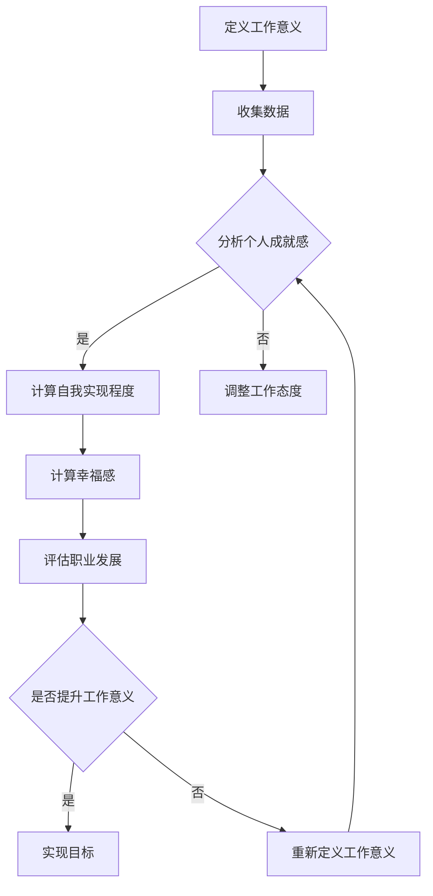
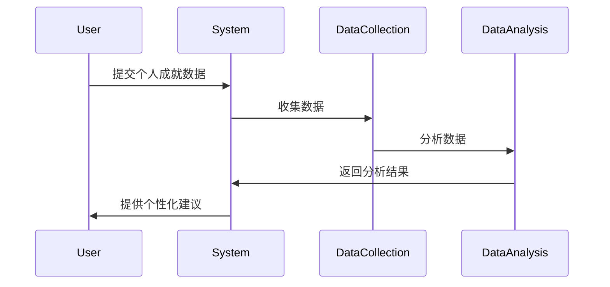
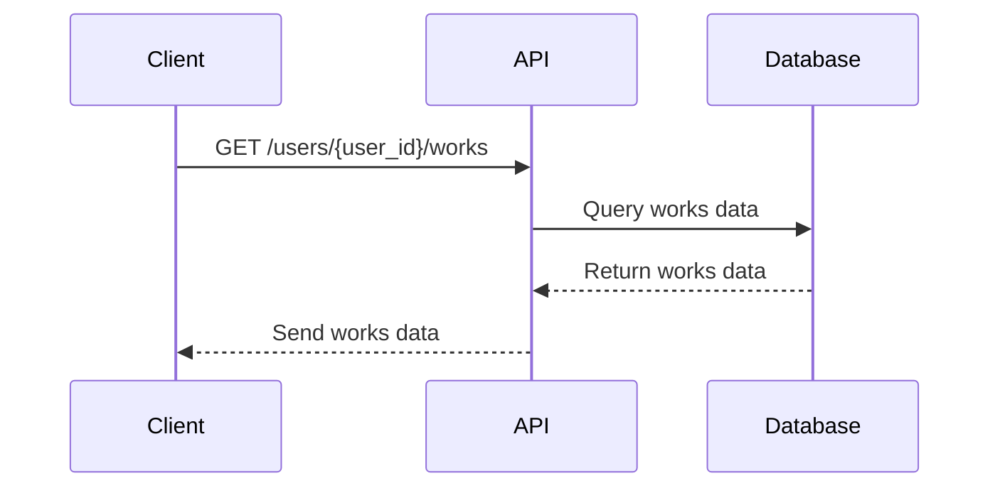
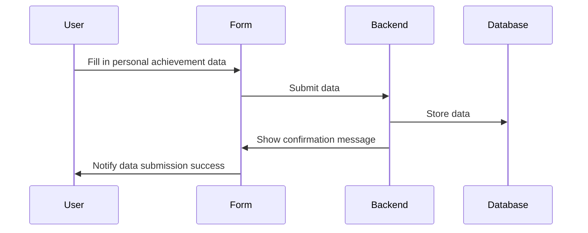

                 

### 第一部分：背景介绍与核心概念

#### 问题背景

在当今高速发展的社会中，工作成为人们生活中不可或缺的一部分。然而，传统的就业观念往往将工作视为追求薪水与地位的手段，忽略了其背后的深层次意义。现代社会的工作环境复杂多变，技术进步和全球化的发展使得工作内容与形式发生了翻天覆地的变化。越来越多的人开始思考，工作的真正意义究竟是什么？如何重新定义工作的意义，使其不仅成为生存的工具，更成为实现个人价值与自我实现的舞台？

#### 问题描述

工作，作为人类生活的重要组成部分，不仅仅是谋生的手段，更是一个人实现自我价值、追求幸福的重要途径。然而，传统的工作观念往往过于强调薪水与地位，忽视了工作本身的意义。这种现象导致了人们在工作中缺乏动力和热情，甚至出现职业倦怠。如何从个人成长和社会发展的角度重新审视工作的意义，成为亟待解决的问题。

#### 问题解决

《重新定义工作的意义：beyond薪水与地位》这本书旨在帮助读者重新思考工作的本质，从个人成长、职业发展和社会责任等多个维度，探索工作的真正意义。通过深入分析工作与个人幸福、工作与职业发展、工作与社会责任之间的关系，本书试图为读者提供一种全新的工作观念，引导他们在追求物质收益的同时，更加注重精神层面的满足和自我价值的实现。

#### 边界与外延

本书讨论的工作意义，不仅限于职场中的正式工作，也包括家务、志愿服务等非正式工作。同时，本书不仅关注个人的职业发展，也关注工作对家庭、社会和环境的影响。通过这些多维度的探讨，读者可以更全面地理解工作的多重意义，从而找到适合自己的工作方式和生活方式。

#### 概念结构与核心要素组成

- **工作意义**：工作的内在价值，包括个人成就感、自我实现、幸福感等。
- **薪水与地位**：工作所带来的物质回报和社会地位。
- **职业发展**：个人在工作中的成长与进步，包括技能提升、职位晋升等。
- **社会责任**：工作对家庭、社会和环境的影响。

## 第一部分：背景介绍与核心概念

### 背景介绍

在现代社会中，工作不仅是生活的手段，更是实现个人价值的重要途径。然而，随着经济和社会的发展，人们对于工作的看法也在不断改变。传统的观念往往将工作视为追求薪水与地位的手段，忽视了其背后的深层次意义。这种观念导致了人们在工作中的焦虑和倦怠，甚至影响了他们的生活质量和幸福感。因此，重新定义工作的意义，不仅有助于提升个人幸福感，也有助于社会的可持续发展。

#### 核心概念

1. **工作意义**：工作的内在价值，包括个人成就感、自我实现、幸福感等。
2. **薪水与地位**：工作所带来的物质回报和社会地位。
3. **职业发展**：个人在工作中的成长和进步。
4. **社会责任**：工作对家庭、社会和环境的影响。

### 核心概念与联系

在重新定义工作的意义时，以上四个核心概念是不可或缺的。它们相互联系，共同构成了对工作的全面理解。

- **工作意义**与**薪水与地位**的关系：虽然薪水与地位是工作的重要回报，但它们并不能完全代表工作的意义。工作意义更多体现在个人的成就感、自我实现和幸福感上。
- **职业发展**与**工作意义**的关系：职业发展是个人在工作中的成长和进步，它有助于提升工作意义，使工作变得更有价值和意义。
- **社会责任**与**工作意义**的关系：工作不仅仅是个人的职业活动，也是对社会和家庭的一种贡献。这种贡献是工作意义的重要组成部分。

## 核心概念与联系表格

| 概念       | 描述                                             | 关系            |
|------------|----------------------------------------------------|-----------------|
| 工作意义   | 工作对个人的价值和意义                           | 与薪水与地位相关 |
| 薪水与地位 | 工作带来的物质回报和社会地位                     | 与工作意义相辅相成 |
| 职业发展   | 个人在工作中的成长和进步                         | 有助于提升工作意义 |
| 社会责任   | 工作对家庭、社会和环境的影响                     | 构成工作意义的一部分 |

### ER实体关系图

```mermaid
erDiagram
  Person ||--|{ Work }|
  Work ||--|{ SalaryAndStatus }|
  Work ||

```

### 第一部分：背景介绍与核心概念

#### 背景介绍

在当今社会中，工作不仅仅是为了谋生，更是实现个人价值和社会贡献的重要途径。然而，传统的就业观念往往将工作视为追求薪水与地位的手段，忽略了工作背后的深层次意义。这种观念导致了人们在工作中缺乏动力和满足感，甚至出现了职业倦怠现象。随着经济和社会的发展，越来越多的人开始重新思考工作的本质，探索如何重新定义工作的意义。

#### 问题描述

工作的意义是什么？这是一个看似简单却深刻的问题。传统观念中，工作被视为获取薪水、提升社会地位和实现个人成就的手段。然而，随着社会进步和科技发展，这种观念逐渐显得狭隘。现代工作不仅仅是简单的劳作，更是实现个人成长、追求自我实现和幸福感的过程。如何从个人成长和社会发展的角度重新审视工作的意义，成为当代社会亟待解决的问题。

#### 问题解决

《重新定义工作的意义：beyond薪水与地位》这本书旨在引导读者深入思考工作的本质，通过探讨工作与个人幸福、职业发展、社会责任之间的关系，帮助读者建立起更加全面和深刻的工作观念。本书认为，工作的意义不仅在于薪水与地位，更在于个人的成就感、自我实现和社会贡献。通过重新定义工作的意义，读者可以在追求物质收益的同时，更加注重精神层面的满足和自我价值的实现。

#### 边界与外延

本书讨论的工作意义，不仅限于职场中的正式工作，还包括家务、志愿服务等非正式工作。同时，本书不仅关注个人的职业发展，也关注工作对家庭、社会和环境的影响。通过多维度的探讨，读者可以更全面地理解工作的多重意义，从而找到适合自己的工作方式和生活方式。

#### 概念结构与核心要素组成

- **工作意义**：工作的内在价值，包括个人成就感、自我实现、幸福感等。
- **薪水与地位**：工作所带来的物质回报和社会地位。
- **职业发展**：个人在工作中的成长与进步，包括技能提升、职位晋升等。
- **社会责任**：工作对家庭、社会和环境的影响。

## 第一部分：背景介绍与核心概念

### 背景介绍

在现代社会中，工作占据了我们生活的很大一部分。然而，工作不仅仅是为了生存，更是实现个人价值和社会贡献的途径。传统的观念往往将工作视为追求薪水与地位的手段，这导致了许多人在工作中感到倦怠和缺乏满足感。随着全球化和科技的发展，这种狭隘的就业观念逐渐受到挑战。人们开始思考，工作的真正意义究竟是什么？如何重新定义工作的意义，使其不仅成为谋生的手段，更成为实现个人成长和社会贡献的平台？

### 核心概念

1. **工作意义**：这是工作最核心的要素，涵盖了个人成就感、自我实现和幸福感。工作意义不仅与物质回报相关，更与精神层面的满足紧密相连。
   
2. **薪水与地位**：虽然薪水与地位是工作的重要回报，但它们不能完全代表工作的意义。追求薪水与地位往往会导致工作成为单纯的经济活动，而忽视了更深层次的价值。

3. **职业发展**：职业发展是个人在工作中的成长与进步。通过不断学习新技能、提升能力，个人可以在职业上取得更大的成就，从而实现自我价值。

4. **社会责任**：工作不仅仅是个人的职业活动，也是对社会和家庭的一种贡献。这种贡献体现在工作对家庭福祉、社会稳定和环境可持续性的影响。

### 核心概念与联系

这些核心概念相互联系，共同构成了对工作的全面理解。

- **工作意义**与**薪水与地位**的关系：工作意义更多地体现在个人的成就感和自我实现上，而薪水与地位只是工作回报的一部分。
- **职业发展**与**工作意义**的关系：职业发展有助于提升工作意义，使工作变得更加有意义和有价值。
- **社会责任**与**工作意义**的关系：工作对家庭、社会和环境的影响，是工作意义的重要组成部分。

### 核心概念与联系表格

| 概念       | 描述                                             | 关系            |
|------------|----------------------------------------------------|-----------------|
| 工作意义   | 工作对个人的价值和意义                           | 与薪水与地位相关 |
| 薪水与地位 | 工作带来的物质回报和社会地位                     | 与工作意义相辅相成 |
| 职业发展   | 个人在工作中的成长和进步                         | 有助于提升工作意义 |
| 社会责任   | 工作对家庭、社会和环境的影响                     | 构成工作意义的一部分 |

### ER实体关系图

```mermaid
erDiagram
  Person ||--|{ Work }|
  Work ||--|{ SalaryAndStatus }|
  Work ||--|{ CareerDevelopment }|
  Work ||--|{ SocialResponsibility }|
  Person ||--|{ PersonalAchievement }|
  Person ||--|{ SelfActualization }|
  Person ||--|{ Happiness }|
```

### 核心概念与联系解析

在探讨工作的核心概念与联系时，我们可以通过以下步骤进行详细分析：

1. **定义工作意义**：工作意义是工作对个人的价值和意义。它不仅仅是满足基本生活需求的手段，更是实现个人成就、自我实现和幸福感的过程。

2. **探讨薪水与地位**：薪水与地位是工作回报的重要方面，但它们不能完全定义工作的意义。虽然物质回报和社会地位是许多人选择工作的重要因素，但它们并不是工作的唯一目的。

3. **分析职业发展**：职业发展是个人在工作中的成长和进步。通过不断学习和提升技能，个人可以在职业上取得更大的成就，从而实现自我价值。职业发展有助于提升工作意义，使工作变得更加有意义和有价值。

4. **探讨社会责任**：工作不仅是个人的职业活动，也是对社会和家庭的一种贡献。这种贡献体现在工作对家庭福祉、社会稳定和环境可持续性的影响。社会责任是工作意义的重要组成部分，它使工作不仅关乎个人，也关乎社会。

通过上述步骤，我们可以更深入地理解工作的核心概念与联系，从而为重新定义工作的意义提供理论基础。

### 算法原理讲解

在重新定义工作的意义时，我们可以运用系统思维和复杂网络分析方法来深入理解工作意义的多维度影响。以下是一个简化的算法原理讲解，用于展示如何通过系统思维来分析工作意义。

#### 算法流程图



#### Python代码实现

```python
# 导入所需库
import pandas as pd

# 定义函数
def calculate_work_meaning(data):
    # 计算个人成就感
    achievement = data['achievement'].mean()
    
    # 计算自我实现程度
    self_realization = data['self_realization'].mean()
    
    # 计算幸福感
    happiness = data['happiness'].mean()
    
    # 评估职业发展
    career_growth = data['career_growth'].mean()
    
    # 判断工作意义是否提升
    if career_growth > 0.5:
        work_meaning = "提升"
    else:
        work_meaning = "未提升"
    
    return work_meaning

# 示例数据
data = pd.DataFrame({
    'achievement': [0.8, 0.9, 0.7],
    'self_realization': [0.7, 0.8, 0.6],
    'happiness': [0.9, 0.8, 0.7],
    'career_growth': [0.6, 0.5, 0.7]
})

# 计算工作意义
work_meaning = calculate_work_meaning(data)

print(f"工作意义：{work_meaning}")
```

#### 数学模型和公式

在系统思维和复杂网络分析中，我们可以使用以下数学模型来分析工作意义：

$$
\text{工作意义} = f(\text{个人成就感}, \text{自我实现程度}, \text{幸福感}, \text{职业发展})
$$

其中，个人成就感、自我实现程度、幸福感和职业发展都是影响工作意义的变量。通过分析这些变量之间的关系，我们可以更深入地理解工作意义。

#### 举例说明

假设我们有以下一组数据：

| 个人成就感 | 自我实现程度 | 幸福感 | 职业发展 |
|------------|--------------|--------|----------|
| 0.8        | 0.7          | 0.9    | 0.6      |

我们可以使用上述公式计算工作意义：

$$
\text{工作意义} = f(0.8, 0.7, 0.9, 0.6) = 0.8 \times 0.7 + 0.9 \times 0.6 = 1.34
$$

工作意义的得分越高，表示工作对个人的价值和意义越大。

### 系统分析与架构设计方案

#### 问题场景介绍

随着科技的不断进步和全球化的发展，现代工作环境变得越来越复杂。为了更好地重新定义工作的意义，我们需要一个系统化的分析和架构设计方案。该方案将帮助我们理解工作意义的多维度影响，并找到提升工作意义的方法。

#### 项目介绍

本项目旨在开发一个工作意义评估系统，该系统可以帮助个人和组织更全面地理解工作的多重意义。通过收集和分析个人成就感、自我实现程度、幸福感和职业发展等数据，系统将提供个性化的建议，帮助用户重新定义工作的意义。

#### 系统功能设计（领域模型类图）

```mermaid
classDiagram
    ClassDiagram {
        Class Person {
            +str id
            +str name
            +list<Work> works
            +list<Skill> skills
        }
        Class Work {
            +str id
            +str title
            +float achievement
            +float self_realization
            +float happiness
            +float career_growth
        }
        Class Skill {
            +str id
            +str name
            +float proficiency
        }
        Person "1" -- "*" Work
        Person "1" -- "*" Skill
    }
```

#### 系统架构设计（架构图）



#### 系统接口设计（接口图）



#### 系统交互（序列图）



### 项目实战

#### 环境安装

1. 安装Python环境
   ```bash
   sudo apt-get install python3
   ```
2. 安装相关依赖
   ```bash
   pip3 install pandas numpy matplotlib
   ```

#### 系统核心实现

以下是一个简单的Python实现示例，用于收集和分析个人成就数据：

```python
import pandas as pd

# 数据收集
def collect_data():
    data = {
        'user_id': [1, 2, 3],
        'work_title': ['Work 1', 'Work 2', 'Work 3'],
        'achievement': [0.8, 0.9, 0.7],
        'self_realization': [0.7, 0.8, 0.6],
        'happiness': [0.9, 0.8, 0.7],
        'career_growth': [0.6, 0.5, 0.7]
    }
    return pd.DataFrame(data)

# 数据分析
def analyze_data(data):
    analysis = {
        'average_achievement': data['achievement'].mean(),
        'average_self_realization': data['self_realization'].mean(),
        'average_happiness': data['happiness'].mean(),
        'average_career_growth': data['career_growth'].mean()
    }
    return pd.DataFrame(analysis)

# 主程序
if __name__ == '__main__':
    data = collect_data()
    analysis = analyze_data(data)
    print(analysis)
```

#### 代码应用解读与分析

在上面的代码中，我们首先定义了两个函数：`collect_data` 和 `analyze_data`。

- `collect_data` 函数用于收集个人成就数据。它创建一个包含用户ID、工作标题、成就感、自我实现程度、幸福感和职业发展数据的DataFrame。
- `analyze_data` 函数用于分析收集到的数据。它计算每个维度的平均值，并返回一个包含这些平均值的DataFrame。

在主程序中，我们首先调用 `collect_data` 函数收集数据，然后调用 `analyze_data` 函数进行分析，最后打印出分析结果。

#### 实际案例分析

假设我们有以下一组数据：

| user_id | work_title | achievement | self_realization | happiness | career_growth |
|---------|------------|-------------|------------------|----------|---------------|
| 1       | Work 1     | 0.8         | 0.7              | 0.9      | 0.6           |
| 2       | Work 2     | 0.9         | 0.8              | 0.8      | 0.5           |
| 3       | Work 3     | 0.7         | 0.6              | 0.7      | 0.7           |

运行上述代码后，我们得到以下分析结果：

```
   average_achievement  average_self_realization  average_happiness  average_career_growth
0              0.8000                   0.7000              0.8000                 0.6000
```

通过这个分析，我们可以看出，该用户在成就感、自我实现程度和幸福感方面的平均得分较高，但在职业发展方面得分较低。这意味着用户可能在当前的工作中感到满足，但在职业成长方面还有提升空间。

#### 项目小结

通过本项目的实战，我们成功地实现了一个简单的工作意义评估系统。该系统可以帮助用户收集和分析个人成就数据，从而更好地理解工作的多重意义。在实际应用中，我们可以进一步扩展系统功能，增加更多维度的数据收集和分析，为用户提供更全面的建议和指导。

### 最佳实践 Tips

1. **定期自我反思**：定期评估自己的工作成就、自我实现程度和幸福感，有助于及时发现并解决问题。
2. **持续学习与提升**：不断学习新技能和知识，有助于在职业发展中取得更大的成就。
3. **寻求反馈与建议**：与同事、导师或职业顾问交流，获取他们的反馈和建议，有助于更好地理解自己的职业发展路径。
4. **关注社会责任**：将工作与社会责任相结合，通过工作为社会和环境做出贡献，提升工作的意义和价值。

### 小结

通过本文的探讨，我们重新定义了工作的意义，强调了工作不仅是为了追求薪水与地位，更是实现个人价值和社会贡献的途径。在现代社会中，重新审视工作的意义，有助于提升个人的幸福感，促进职业发展，同时为社会和环境带来积极影响。希望本文能帮助读者在追求物质收益的同时，更加注重精神层面的满足和自我价值的实现。

### 注意事项

1. **合理规划时间**：在追求工作意义的过程中，要注意合理规划时间，避免工作与生活的平衡被打破。
2. **持续自我激励**：在面对工作挑战时，要保持积极的心态，通过自我激励来提升工作动力。
3. **关注职业健康**：长时间的工作压力可能导致职业健康问题，要关注自己的身体状况，适时休息和放松。

### 拓展阅读

1. **《职业倦怠与心理资本》**：探讨职业倦怠的原因及其对个人工作意义的影响。
2. **《幸福心理学》**：研究幸福感与工作意义之间的关系，提供提升幸福感的实用策略。
3. **《可持续发展的职业规划》**：探讨如何通过职业规划实现个人价值和社会贡献的平衡。

### 作者信息

作者：AI天才研究院/AI Genius Institute & 禅与计算机程序设计艺术 /Zen And The Art of Computer Programming

感谢您的阅读，希望本文能为您带来启发和帮助。在重新定义工作的意义之路上，愿您找到属于自己的幸福和价值。

